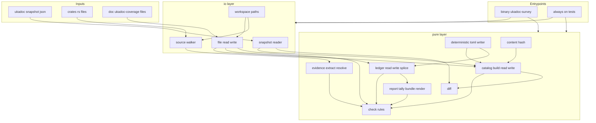
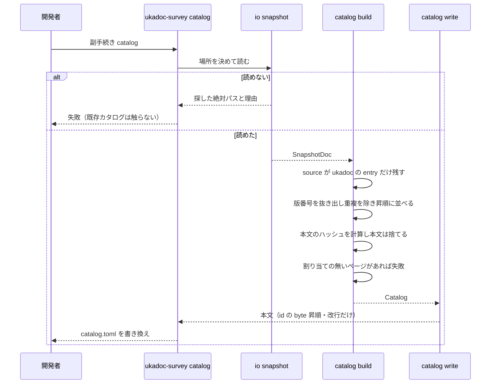
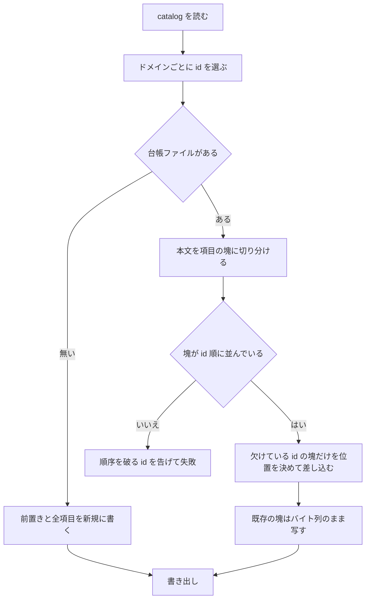
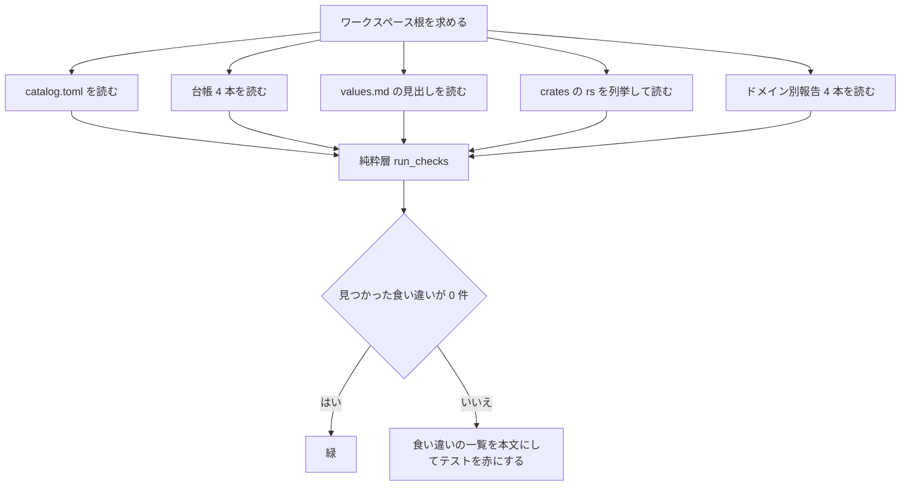

# 技術設計書: areka-P0-ukadoc-survey-toolkit

## Overview

**目的**: ukadoc（SSP 公式仕様書）1,749 項目について「正典の写し（カタログ）」と「areka の判定（台帳）」を別々の場所に建て、その形式・仕訳の規則・整合検査・報告の再生成を凍結する。調査 spec 4 本（shiori／assets／sakura-script／property）が互いの作業に触れずに並走でき、統合担当 `ukadoc-coverage-roadmap` が台帳から数字を機械で取り出せる状態にする。

**利用者**: ⑴ 台帳を書く調査 spec 4 本の担当者、⑵ 台帳を統合して優先度を決める担当者、⑶ 将来の機能 spec の実装者（実装した項目の定義箇所に正典 URL を 1 行置く）。

**影響**: areka の実行時コードは 1 行も変わらない。新しく増えるのは `crates/ukadoc-survey/` 1 本と `doc/ukadoc-coverage/` 配下のデータ・文書だけで、既存クレートからは参照されない。増えるのはワークスペースの標準テスト実行に載る整合検査 1 群である。

### Goals

- 台帳の項目形式（要件付録 A）に**従う側**の道具を作り、形式そのものは 1 バイトも動かさない。
- 常時走る整合検査を、スナップショットもネットワークも要らない決定的なテストとして置く。
- ドメイン別報告 4 本を「台帳 1 本だけから決まる」純粋な関数にして、4 本の調査 spec の間に共有ファイルを 1 つも作らない。
- 新しい外部依存を最小に抑え、ライセンス関門（`deny.toml`・`about.toml`）と配布物の謝辞（`THIRD-PARTY-NOTICES.md`）を動かさない。

### Non-Goals

- 個々の項目の分類・優先度付け・繋がりの登記（調査 spec 4 本の仕事）。
- 段階 A〜E の最終順序と `doc/ukadoc-coverage/linkage.md` の執筆（`ukadoc-coverage-roadmap` の仕事）。
- ukadoc 本文の repo 同梱、ukadoc 以外の 3 ソース、SSP 実機との挙動比較。
- 既存コードへの正典 URL 付与作業そのもの（道具と規約は用意するが、付与は調査 spec と各機能 spec が行う）。
- 「正典 URL の置き忘れ」の検出運用（完了処理側の DoD で扱う）。

---

## Boundary Commitments

### This Spec Owns

- `doc/ukadoc-coverage/` 配下の新設一式: `catalog.toml`・`ledger/<ドメイン>.toml` ×4・`report/<ドメイン>.md` ×4・`report/summary.md`・`values.md`・`README.md`。
- `crates/ukadoc-survey/` 1 本（ライブラリ＋実行ファイル＋常時走るテスト）。
- カタログの 1 行形式、台帳の読み書き規則（付録 A に従う実装）、整合検査の判定内容、報告の本文の作り方、正典 URL の書き方の規約。
- ページ→台帳の割り当て表（要件 3.1）の機械可読な正本。

### Out of Boundary

- 既存クレートのソース・`Cargo.toml`・ルートの `Cargo.toml`・`.gitignore`・`.gitattributes`・`deny.toml`・`about.toml`・`THIRD-PARTY-NOTICES.md`・`.kiro/steering/roadmap.md`。いずれも触らない。
- `doc/shiori/fragments/` と `crates/areka-sylphya/src/vocab/` の中身（置き換えない・生成器も書かない）。
- `doc/ukadoc-coverage/linkage.md`（統合担当が人手で書く。本 spec は空ファイルも置かない）。
- 台帳の各項目の中身（状態・優先度・テーマ・関連）。本 spec が書き出すのは `unclassified` の初期値だけ。

### Allowed Dependencies

| 依存先 | 種別 | 使い道 |
|---|---|---|
| `toml`（ワークスペース共通・`Cargo.toml:30` の `toml = "1"`） | 外部 | カタログ・台帳の**読み取り**のみ |
| `thiserror`（ワークスペース共通・`Cargo.toml:28`） | 外部 | エラー型（`tech.md:56` の全クレート共通規約） |
| `serde_json = "1"`（クレート側に版を書く。前例 `crates/dola/Cargo.toml:21-23`） | 外部 | スナップショット JSON の読み取りのみ。実行ファイル側だけが通る |
| 標準ライブラリ | — | ファイル走査・読み書き・環境変数 |

- ワークスペース内の他クレートへの依存は**持たない**（leaf）。他クレートから参照されることもない（要件 9.1）。
- 新しい外部依存は `serde_json` 1 本だけで、これは既に依存グラフと `THIRD-PARTY-NOTICES.md:2189` に載っている（＝謝辞の再生成が不要）。

### Revalidation Triggers

以下が起きたら、調査 spec 4 本と統合担当は自分の成果物を再確認する。

- 台帳の欄名・型・状態語彙・関連の種別・テーマ名が変わったとき（要件 2.6 により要件改訂を要する）。
- ページ→台帳の割り当てが変わったとき（要件 3.1 の表）。
- カタログの列・ハッシュの算法・id の形が変わったとき（`[snapshot].catalog_format` と `[snapshot].hash_algorithm` を上げる）。
- ドメイン別報告の本文の作り方が変わったとき（4 本すべての報告が一斉に古くなる）。
- スナップショットが更新され、id の追加・削除が起きたとき（要件 8.1・8.3）。

---

## Architecture

### Existing Architecture Analysis

新設の受け皿は無いが、この repo には**借りるべき作法が 3 系統**ある。いずれも実ファイルで確認した。

| 借りる作法 | 出どころ | 本 spec での使い方 |
|---|---|---|
| 機械生成の TOML 正本を置き、手編集を禁じ、`[entry."名前"]` のキー付きテーブルで 1 項目を書く | `doc/shiori/fragments/events/01.lifecycle.toml:5`・`doc/shiori/fragments/_manifest.toml:6-9` | カタログと台帳の書き方をこれに揃える |
| 「違反 0 件だから緑」は道具が壊れていても成立するので、⑴ 表の全項目に実体がある ⑵ 実測集合と表が完全一致 ⑶ 既知の 1 件を外すと赤になる、の 3 本を併置する | `crates/log-capture-kit/tests/file_length_guard_test.rs:29-40`（テストは `:200`・`:227`・`:252`、完全一致は `:271-275`） | 要件 6.13 の見本データテストと非空テストの土台 |
| ファイルに触るのは数本だけに閉じ、残りは入出力だけで完結する関数にする | `crates/log-capture-kit/tests/workspace_scan/mod.rs:64`（根の求め方）・`:79`（`crates/**/*.rs` の列挙）・`:113`（読み込み） | 2 層構成（純粋層／入出力層）の根拠 |

**そのまま流用できない点も実測した**。`workspace_scan` は `log-capture-kit` の `tests/` 配下にあり `src/` には無いので他クレートから引けない（`crates/log-capture-kit/src/` に当該モジュールは無い）。しかも中心の `strip_comments()`（`workspace_scan/mod.rs:154`）は**コメントを取り除く**向きで、本 spec が探したい正典 URL はまさにその doc コメントの中にある。

**ワークスペース側の前提**（実測）:

- ルート `Cargo.toml:2-4` のメンバー指定は `crates/*` のグロブ。新クレートを置くだけで入る＝ルートは 1 行も変えない。
- `[workspace.package]`（`Cargo.toml:7-13`）は `version`／`edition = "2024"`／`authors`／`license`／`repository`／`publish = false`。新クレートは `.workspace = true` で引き継ぐ。
- ファイル行数の上限テストの走査は `crates/` 配下の `.rs` だけ（`workspace_scan/mod.rs:82`・`:103`）、上限 1,000 行（`:38`）。新クレートは即座に対象になる。
- **`Cargo.lock` は追跡されていない**（`.gitignore:2` に `Cargo.lock`・`git ls-files Cargo.lock` は空）。したがって本 spec の実際の改変集合は「新規 `crates/ukadoc-survey/` ＋ `doc/ukadoc-coverage/`」の 2 つだけで、`roadmap.md:91` が挙げる `Cargo.lock` は版管理外である。`roadmap.md` は要件 9.8 により変更しない（この食い違いは事実として記録するに留める）。
- 実行ファイルの前例は 1 つだけで、`src/bin/` ではなく明示の `[[bin]]`（`crates/areka/Cargo.toml:14-16`）。

### Architecture Pattern & Boundary Map

**選んだ形**: research §4 の方式 D（方式 A を土台に内部を 2 層へ分ける）。

- **純粋層** — ファイルにもスナップショットにも触らない。文字列と値だけを受け取り、文字列と値だけを返す。カタログ／台帳の読み書き、証拠の取り出し、整合検査、報告の組み立て、差分の算出がここに入る。見本データで完全にテストできる。
- **入出力層** — ワークスペース根の解決、`crates/**/*.rs` の列挙と読み込み、ファイルの読み書き、スナップショット JSON の読み込み。判断は一切持たない。
- **入口** — ⑴ 実行ファイル（再生成・差分・証拠の一覧）と ⑵ 常時走るテスト（整合検査）。テストは入出力層で repo のデータを読み、純粋層の同じ関数へ渡す。**判定の実体は 1 つしかない**ので、実行ファイルとテストで判定が割れない。



**境界の要点**:

- **書き出しは自前・読み取りは `toml`**。TOML の書き出しライブラリは値の書き方を自分で選ぶため、要件付録 A が凍結した書き方（二重引用符・逆斜線は `\\`）と一致しない（実測: `toml` 1.1.4 は逆斜線を含む文字列を単引用符の素の文字列で書く）。書き出しは自前の小さな組み立てに閉じ、読み取りは `toml` に任せる。自前の書き出しは「書いたものが `toml` で読み戻せて値が一致する」テストで較正する。
- **カタログと台帳は同じ addressing**。どちらも最上位に `entry` という表を持ち、その鍵が項目 id。カタログは値をインラインテーブル（1 項目 1 行・要件 1.1）、台帳は値をキー付きテーブル（1 項目複数行・要件 2.1）にするだけの違いで、読み取り側は同じ形を見る。
- **ドメイン別報告は台帳 1 本だけの関数**。カタログもソースも証拠も使わない（後述の設計判断 D-11）。これにより 4 本の調査 spec の編集集合が交わらない。
- **証拠は台帳にも報告にも書かない**（要件 2.3）。検査の出力と `report/summary.md` にだけ現れる。

### Technology Stack

| 層 | 選択 / 版 | 本 spec での役割 | 備考 |
|---|---|---|---|
| CLI | 自前の引数振り分け（標準ライブラリ `std::env::args`） | 8 つの副手続きの入口 | 副手続きが 8 つで固定のため引数解析ライブラリは入れない |
| データ読み取り | `toml` 1（ワークスペース共通・`Cargo.toml:30`） | `catalog.toml`・`ledger/*.toml` の読み取り | 書き出しには使わない |
| データ書き出し | 自前（`src/tomlout.rs`） | 付録 A に一致する本文の組み立て | 読み戻し一致テストで較正 |
| スナップショット読み取り | `serde_json` 1（クレート側に版を書く） | 2.7MB の JSON を `serde_json::Value` として読む | 依存グラフに既在（`THIRD-PARTY-NOTICES.md:2189`）＝謝辞の再生成不要 |
| 本文ハッシュ | 自前 FNV-1a 64 ビット（`src/hash.rs`） | 本文の変更検出（要件 1.2・8.2） | 公表テストベクタで較正。設計判断 D-1 |
| エラー | `thiserror` 2（ワークスペース共通） | `SurveyError` の定義 | `tech.md:56` の全クレート共通規約 |
| 実行基盤 | Rust 2024 edition（`Cargo.toml:9`） | — | `[workspace.package]` を継承 |

---

## 設計判断（research §3 の未決事項の裁定）

要件ディスカッションで開発者裁定が済んでいる 4 件（§8.1〜§8.4）はここでは扱わない。以下は設計フェーズが決める事項である。すべて実測で裏を取った。

### D-1. 本文ハッシュの算法 — **自前の FNV-1a 64 ビット（16 桁の 16 進小文字）**

- `sha2` を引くと依存グラフに `sha2` `digest` `generic-array` `typenum` `block-buffer` `crypto-common` の **6 クレートが新たに増える**（実測: `cargo tree`。`cfg-if` と `cpufeatures` は既在）。いずれも `deny.toml:26-36` の許可一覧を通る見込みだが、**`THIRD-PARTY-NOTICES.md` が古くなる**。この謝辞ファイルは配布物向けで、本 spec の改変集合の外にある（`about.toml:14` は dev-dependency だけを除外するので、新クレートの通常依存は謝辞に載る）。出荷しない調査道具のために配布物の謝辞を書き換えるのは筋が悪い。
- 標準ライブラリの既定ハッシュは版をまたいだ同値保証が無く、カタログに焼き込む値として使えない。
- FNV-1a 64 は 20 行程度で書ける。1,749 項目に対する衝突確率は 10 兆分の 1 未満で、用途（本文が変わったかどうかの検出）に十分である。自前実装の危うさは**公表テストベクタでの逐語一致テスト**で潰す（`""` → `cbf29ce484222325`、`"a"` → `af63dc4c8601ec8c`、`"foobar"` → `85944171f73967e8`。いずれも本設計で計算し確認済み）。
- カタログ 1 行の最大長は 16 進 16 桁で **579 文字**、sha256 なら 627 文字（実測）。
- カタログ冒頭に `hash_algorithm = "fnv1a64"` を記録し、将来の切り替えを検出可能にする。

### D-2. JSON 読み取りの依存の置き場所 — **クレート側に版を書く `serde_json = "1"`**

- ルートの `Cargo.toml` を触らない（`roadmap.md:91` の宣言と一致）。前例は `crates/dola/Cargo.toml:21-23`。
- `serde_json` は既に依存グラフにあり、`THIRD-PARTY-NOTICES.md:2189` に `serde_json 1.0.151` として載っている。**新規に増える謝辞は 0 件**。
- `serde` の派生機能は使わない。`serde_json::Value` を手で辿って `SnapshotDoc` へ写す。これで `serde` を直接依存に加えずに済む。
- スナップショットに触るのは入出力層の 1 ファイルだけで、常時走るテストはここを通らない（要件 6.2）。

### D-3. ソース走査の部品 — **新クレートに自前で持つ（重複を受け入れる）**

- `log-capture-kit` の走査部品は `tests/` 配下で外から引けず、共有クレートへ出すには既存クレートのテスト 3 本を書き換えることになり、要件 9.1（既存クレート非接触）を越える。
- 列挙と読み込みは 40 行程度。重複は 1 か所で、`crates/` を起点にする点と除外ディレクトリだけが同じ。
- **走査対象から `crates/ukadoc-survey/` 自身を除く**。この道具は areka の実装ではないので証拠を持つことがなく、除外すれば見本データの文字列が本物の証拠として読まれる事故も起きない。
- 見直しの引き金: 3 か所目の走査が現れたとき、または `log-capture-kit` が走査部品を `src/` へ出したとき。

### D-4. URL 突き合わせの厳しさと複数出現 — **完全一致・複数出現は許して全部を並べる**

実測（全 1,749 件）: URL はすべて `https://ssp.shillest.net/` 始まりで相異なり、空白も引用符も含まず、最大 190 文字。**ある entry の URL が別の entry の URL の先頭部分になっている例は 0 件**。アンカー付き 1,730 件は必ず `#` を持ち、アンカー無し 19 件は `#` を持たず、その 19 件はいずれもアンカー付き項目が 1 つも無いページである。

したがって解決は次の 3 段で曖昧さなく決まる:

1. カタログの `url` と**完全一致**すれば、その 1 項目の証拠。
2. 一致しなければ、38 種のページ URL（フラグメントを外したもの）と完全一致するか見る。一致すれば要件 5.4 の語彙表の目印として扱い、名前の突き合わせへ進む（D-5）。
3. どちらでもなければ**赤**（要件 6.5・6.10 の「綴りが違う」）。`http` と `https` の別、全角文字の混入、末尾の余計な文字はすべてここで落ちる。

- 複数のファイルに同じ URL が現れても赤にしない。要件 5.2 の「定義箇所だけ」は人が守る規約で機械には判定できず（research §3-5）、要件 6.11 は整理で壊れないことを求めている。証拠は id ごとにファイルパスの一覧として並べる（要件 5.5）。

### D-5. 名前の突き合わせの正規化 — **NFKC ＋ 空白の畳み込み・完全一致・1 件に定まるときだけ採る**

実測:

- 見出しから名前を取り出すページごとの規則は成り立たない。descript 系 518 件のうち読点を含むのは 425 件（93 件は含まない）。さくらスクリプト 342 件のうち逆斜線で始まるのは 313 件、「もしくは」を含むものが 7 件ある。→ **ページごとの取り出し規則は作らない**。
- 正規化（NFKC ＋ 連続空白の畳み込み）で変わる見出しは 1,749 件中 **5 件**だけ。正規化によって新しく重複するページは **0 件**（全体でも相異なる見出しは 1,657 種のまま）。
- `crates/areka-sylphya/src/vocab/shiori_resource.rs:45` の `SHIORI_RESOURCE_IDS` と `list_shiori_resource` の見出しを照合すると、素のままでは 1 件だけ食い違い（全角空白と半角空白の差）、**正規化すれば全件一致**する。

**どの文字列を語彙表の要素とみなすか（開発者裁定 2026-09-02 設計議題 1・案 ⒜）**: ページ URL の行（`/// ukadoc: <ページ URL>` 単独行）の**直後に始まる最初のスライス定数**（`= &[` から対応する `];` まで）の中で、**要素ごとの最初の文字列リテラル**を要素とみなす。要素の区切りはスライス直下の深さのコンマ。実物の 3 形（`&[&str]`＝`shiori_resource.rs:45` の `SHIORI_RESOURCE_IDS`／`&[(&str, SetSemantics)]`＝`dotted.rs:72` の `SET_EFFECTIVE`／`&[FlatEntry]`＝`flat.rs:32` の `FLAT_VOCAB`）のいずれも名前が要素の最初の文字列なので、同じ規則で拾える。この形でない語彙（`match` の腕・連想配列など）は語彙表として扱わず、要件 5.2 の「定義箇所に 1 項目 1 行の URL」で書く（README に記載）。ページ URL の行の後にスライス定数が始まらない場合は `SourceUrlNotInCatalog` ではなく「語彙表の目印だが表が続かない」として検査の出力に並べる（赤にはしない）。

規則:

1. 語彙表の要素の文字列と、そのページに属するカタログ項目の見出しを、どちらも NFKC 正規化し前後の空白を落とし連続空白を 1 個に畳んでから**完全一致**で比べる。部分一致は使わない。
2. 一致が 1 件に定まったときだけ証拠にする。
3. **0 件のとき**と**2 件以上のとき**は証拠にせず、突き合わせできなかった要素として検査の出力に並べる（赤にはしない。要件 5.9 のとおり判定は人手に委ねる）。同一ページ内で見出しが重複するのは `descript_shell_surfaces` 1 組・`list_propertysystem` 2 組（`name`・`path`）・`spec_shiori3` 2 組の実測 5 組だけである。

### D-6. 改行コードの扱い — **読むときに復帰文字を落とし、書くときは改行だけを書く**

- この repo に `.gitattributes` は無く（実測: repo 根に不在）、`core.autocrlf` はシステム設定で有効。新しく clone した環境では作業ツリーのテキストが復帰文字付きで取り出される。
- `.gitattributes` の新設は repo 全体の設定であり、本 spec の改変集合の外なので採らない。
- 入出力層の読み込みは復帰文字を落として返す。書き出しは改行だけを書く。要件 7.4 の報告の突き合わせは、この正規化後の本文どうしで比べる。
- 要件 1.5 の「2 回続けて実行して 1 バイトも違わない」は同じ環境での連続実行の話なので影響を受けない（書き出しは常に改行だけ）。

### D-7. スナップショットの既定の場所 — **`%APPDATA%\npm\node_modules\ukagaka-doc-mcp\data\index.json` をコードに持つ**

- `AREKA_UKADOC_SNAPSHOT` があればそちらが優先（要件 1.7・要件 9.7 の `AREKA_` 冠に従う）。
- 既定を組み立てるのは `APPDATA` 環境変数から。`APPDATA` が無い環境では「環境変数 `APPDATA` が無いので既定の場所を組み立てられない。`AREKA_UKADOC_SNAPSHOT` で場所を指定してほしい」と告げて失敗する（要件 1.8）。
- 提供パッケージの版（要件 1.6）はスナップショットの 2 つ上の `package.json` の `version` から読む。読めないときは `"unknown"` を記録し、その旨を標準エラーへ 1 行出す（環境変数で任意の場所を指したときに再生成そのものを止めないため）。
- 常時走るテストはこの場所に一切触らない（要件 6.2）。

### D-8. クレート名 — **`ukadoc-survey`**

`roadmap.md:91` が改変集合として名指ししている名前に揃える。`crates/log-capture-kit/Cargo.toml` を手本に `workspace = "../.."`・`publish = false`・`[workspace.package]` 継承で書く。`.kiro/steering/structure.md` へのクレート節の追記は本 spec では行わない（要件 9.8 が禁じているのは `roadmap.md` だけだが、steering の同期は完了処理側の仕事であり、並走中の他 spec と同じファイルを取り合わないため）。

### D-9. カタログ TOML の形と並び順 — **`[snapshot]` ＋ `[entry]` の下にインラインテーブルを id の byte 順で 1 行ずつ**

- id を鍵にした 1 つの表にする。配列は採らない（掲載順を保つ価値より、id で引ける・並びが自明であることを採る）。
- 並びは **id の byte 昇順**。実測で id はすべて ASCII（`[A-Za-z0-9_:.\-()]` のみ・非 ASCII 0 件・最大 153 文字）なので、byte 順＝文字順で、`toml` が読み戻す `Table`（`BTreeMap`）の並びとも一致する。
- 要件 1.5 の 1 バイト一致は、自前の書き出しが並びも空白も決め打ちするので自動的に満たされる。
- 冒頭の `[snapshot]` に要件 1.6 の項目に加えて `catalog_format` と `hash_algorithm` を持たせ、形の変更を検出できるようにする。

### D-10. id と見出しの逆斜線の引用 — **id は逃がし不要・見出しは二重引用符の中で `\\`**

実測（全 1,749 件）:

- **id に逆斜線・引用符・非 ASCII は 1 件も無い**。さくらスクリプトのタグは id では符号化されている（例: `\![get,property,…]` の項目の id は `ukadoc:list_sakura_script:_5c_21_5bget_2cproperty_2c…:1`）。丸括弧も `_28`／`_29` に符号化される（例: `ukadoc:list_propertysystem:currentghost.balloon.scope_28ID_29.width:1`）。
- 見出しには逆斜線を含むものが 316 件、単引用符を含むものが 3 件、二重引用符と改行は 0 件。最大 105 文字。

規則: 書き出しはすべて TOML の二重引用符の文字列を使い、`\` は `\\`、`"` は `\"`、制御文字は `\u00XX` に逃がす。これで見出しも id も一様に書ける。付録 A.3 の「逆斜線は `\\` と書く」は**見出しや備考に対しては現に必要**で、id に対しては現データでは出番が無い。

> **調査 spec 4 本への注意（設計時の実測から）**: 要件付録 A.1 の記入例に出てくる id 文字列（`ukadoc:list_sakura_script:\\![get,property,ID]:1`・`ukadoc:list_propertysystem:balloon.scope(ID).width:1`）は形を説明するための作り物で、スナップショット中に**その綴りの id は存在しない**。実物は上の符号化された形である。付録 B 手順 5 の「見た目で直さず、そのまま写す」に従うこと。付録 A の欄名・型・並び順の契約は変わらない。手で書いた id が実在しない場合は整合検査 6.3 が赤にして取りこぼしを防ぐ。

### D-11. ドメイン別報告の入力 — **その台帳 1 本とテーマ名だけ。証拠は `summary.md` 側へ**

- 要件 3.4 は 4 つの台帳を独立して編集できることを求め、要件 7.4 はドメイン別報告と台帳の一致を常時検査する。両立の条件は「ドメイン別報告が**その台帳だけ**から決まること」である。
- ページ名は id の 2 番目の区切りから取れるので、ページ別の分布（要件 7.1）にカタログは要らない。
- 証拠の有無を載せるとソース側の変更で他 spec の報告が古くなり、独立性が壊れる。要件 7.1 が列挙する 5 項目に証拠は含まれないので、**ドメイン別報告には証拠を載せない**。要件 2.3 の「報告には証拠の有無だけを載せる」（＝ファイルパスまでは載せない、という上限）は、常時検査の対象外である `report/summary.md`（要件 7.6）にドメインごとの証拠あり件数を載せることで満たす。
- ドメイン内の束（要件 7.1 の最後の項目）は、その台帳の `links` だけで連結成分を作り、**構成 id が全部そのドメインに属する束**を載せる。他ドメインへ伸びた束は `summary.md` 側の担当になる。

### D-12. 台帳の並び順の扱い（要件 3.3a の前提）

- 付録 A は「id の文字順に並べる」を必須にしている。要件 3.3a は「既存の項目を一切書き換えず」欠けた id だけを挿入せよと言う。**既存の本文をそのまま残すには、値を組み立て直すのではなく本文を切り貼りするしかない**（組み立て直すと備考の書き方や空行が変わる）。
- したがって初期台帳の生成は、既存本文を項目の塊に切り分け、新しい塊を然るべき位置へ差し込み、既存の塊のバイト列はそのまま写す。
- 既存の塊が id 順に並んでいなかった場合は**並べ替えず、どの id が順序を破っているかを告げて失敗する**（持ち主が直す）。整合検査にも同じ判定を置く（付録 A の凍結された取り決めなので、機械で守る）。
- 並び順の判定は**厳密な昇順**（前の id と同じでも失敗）にする。備考の複数行文字列の中に行頭 `[entry."…"]` が既存の id と同じ綴りで現れた場合、切り分けの較正（`toml` の鍵集合との一致）では見抜けないが、厳密昇順なら重複として落ちる。

---

## File Structure Plan

### Directory Structure

```
crates/ukadoc-survey/
├── Cargo.toml                       # workspace 継承・publish=false・[[bin]] 明示
├── src/
│   ├── lib.rs                       # 公開 API の集約とモジュール宣言
│   ├── lib_test_support.rs          # 見本データの組み立て（テスト専用・全モジュール共用）
│   ├── main.rs                      # 実行ファイルの入口。引数を読んで cli へ渡すだけ
│   ├── error.rs                     # SurveyError（thiserror）
│   ├── error_tests.rs
│   ├── model.rs                     # EntryId PageName Domain Status LinkKind Theme Link
│   ├── model_tests.rs
│   ├── assignment.rs                # ページ→ドメインの割り当て表（要件 3.1 の機械可読な正本）
│   ├── assignment_tests.rs
│   ├── hash.rs                      # FNV-1a 64 の本文ハッシュ
│   ├── hash_tests.rs
│   ├── tomlout.rs                   # 決定的な TOML 本文の組み立て（逃がし・インラインテーブル・キー付きテーブル）
│   ├── tomlout_tests.rs
│   ├── catalog/
│   │   ├── mod.rs                   # Catalog SnapshotMeta CatalogEntry の型と束ね
│   │   ├── build.rs                 # SnapshotDoc → Catalog（ふるい分け・版番号抽出・ハッシュ）
│   │   ├── build_tests.rs
│   │   ├── read.rs                  # catalog.toml の本文 → Catalog
│   │   ├── read_tests.rs
│   │   ├── write.rs                 # Catalog → catalog.toml の本文
│   │   └── write_tests.rs
│   ├── ledger/
│   │   ├── mod.rs                   # Ledger LedgerEntry の型と束ね
│   │   ├── read.rs                  # 台帳の本文 → Ledger（欄と語彙の検証つき）
│   │   ├── read_tests.rs
│   │   ├── blocks.rs                # 台帳本文を項目ごとの塊に切り分ける
│   │   ├── blocks_tests.rs
│   │   ├── write.rs                 # 初期台帳の生成と、既存本文を保ったままの差し込み
│   │   └── write_tests.rs
│   ├── evidence/
│   │   ├── mod.rs                   # EvidenceIndex の型と束ね
│   │   ├── extract.rs               # 1 行コメントから正典 URL を取り出す
│   │   ├── extract_tests.rs
│   │   ├── resolve.rs               # URL → 項目 id・ページ URL → 名前の突き合わせ
│   │   ├── resolve_tests.rs
│   │   ├── candidates.rs            # 要件 5.8 の手掛かり候補（証拠とは別の出力）
│   │   └── candidates_tests.rs
│   ├── check/
│   │   ├── mod.rs                   # CheckInput CheckOutcome run_checks
│   │   ├── finding.rs               # Finding FindingKind と出力の整形
│   │   ├── finding_tests.rs
│   │   ├── structure.rs             # 6.3 6.4 3.5 と台帳の並び順
│   │   ├── structure_tests.rs
│   │   ├── content.rs               # 6.5 6.6 6.7 6.8 6.10
│   │   ├── content_tests.rs
│   │   ├── freshness.rs             # 7.4 7.5（ドメイン別報告の突き合わせ）
│   │   └── freshness_tests.rs
│   ├── report/
│   │   ├── mod.rs                   # 報告の組み立ての入口
│   │   ├── tally.rs                 # 状態分布・ページ別・世代別・テーマ別の集計
│   │   ├── tally_tests.rs
│   │   ├── bundle.rs                # 関連の連結成分と束 id
│   │   ├── bundle_tests.rs
│   │   ├── domain.rs                # report/<ドメイン>.md の本文
│   │   ├── domain_tests.rs
│   │   ├── summary.rs               # report/summary.md の本文
│   │   └── summary_tests.rs
│   ├── diff.rs                      # 要件 8 の差分
│   ├── diff_tests.rs
│   ├── io/
│   │   ├── mod.rs                   # 入出力層の束ね
│   │   ├── paths.rs                 # ワークスペース根と doc/ukadoc-coverage/ 配下の場所
│   │   ├── files.rs                 # 復帰文字を落として読む／改行だけで書く
│   │   ├── sources.rs               # crates/**/*.rs の列挙と読み込み（自クレートを除く）
│   │   └── snapshot.rs              # スナップショット JSON → SnapshotDoc
│   └── cli/
│       ├── mod.rs                   # 副手続きの振り分けと使い方の表示
│       ├── generate.rs              # catalog / ledger-init / report / report-summary
│       └── inspect.rs               # check / evidence / candidates / diff
└── tests/
    ├── consistency.rs               # 常時走る整合検査の入口（要件 6.1）
    └── consistency/
        ├── mod.rs                   # repo の実データを読み込む共通処理
        ├── checks.rs                # 6.3〜6.8 6.10 7.4 を実データで走らせる
        ├── non_vacuity.rs           # 6.13 の「検査対象が 0 件でない」
        └── values_md.rs             # values.md の見出しが 8 テーマと一致する

doc/ukadoc-coverage/
├── README.md                        # 台帳の形式・状態語彙・欄の意味・仕訳の規則・URL の書き方・報告の扱い・合流の手順・付録 A.1 の記入例 id が実在しない注意
├── values.md                        # 伺からしさのテーマ 8 つ（要件 4.4-4.6）
├── catalog.toml                     # 機械生成のみ。1,749 項目＋冒頭のスナップショット情報
├── ledger/
│   ├── shiori.toml                  # 677 項目
│   ├── assets.toml                  # 542 項目
│   ├── sakura-script.toml           # 342 項目
│   └── property.toml                # 188 項目
└── report/
    ├── shiori.md                    # 常時検査あり（要件 7.4）
    ├── assets.md
    ├── sakura-script.md
    ├── property.md
    └── summary.md                   # 常時検査なし（要件 7.6）。統合担当が再生成
```

- `.rs` は 48 本。research §4 の見積り（生成 200・証拠 250・台帳 200・検査 250・報告 250・テスト 600 行）を機能ごとに割ると、いずれも 1,000 行の上限に対して十分な余裕がある（要件 9.6）。
- 在中テストは `structure.md:148-160` の作法どおり、同じディレクトリの兄弟ファイル `<stem>_tests.rs` に置き、本体側は `#[cfg(test)] #[path = "<stem>_tests.rs"] mod tests;` の 1 行だけを持つ。共用の見本データは `structure.md:176` の作法に合わせ `lib_test_support.rs` に集約する。`structure.md:176` が想定するのは同じ stem のテーマ間の共有だが、ここでは `catalog/`・`ledger/` など別ディレクトリのテストからも使うため、`lib.rs` に `#[cfg(test)] #[path = "lib_test_support.rs"] pub(crate) mod lib_test_support;` の接続を置き、各テストは `crate::lib_test_support` で引く。
- **新クレートのテストはファイルを 1 つも作らず、一時ディレクトリも使わない**（読むだけ。書き出しは本文を返す関数として確かめる）。ワークスペースには走査器を共有する見張りテストが行数上限のほかに 2 本あり（`crates/log-capture-kit/tests/temp_path_guard_test.rs`＝`std::env::temp_dir` の呼び出しは窓口クレートと例外表の外に置けない／`crates/log-capture-kit/tests/with_default_guard_test.rs`）、一時ディレクトリを使うと既存クレート内の例外表への追記が要り、要件 9.1（既存クレート非接触）を破る。2 層構成はもともとこれを満たす。

### Modified Files

**無し**。既存ファイルは 1 つも変更しない（要件 9.1・9.8）。ルートの `Cargo.toml` はメンバー指定が `crates/*` のグロブ（`Cargo.toml:2-4`）なので触らない。`Cargo.lock` は版管理外（`.gitignore:2`）。

---

## System Flows

### カタログ再生成（要件 1）



書き出しは丸ごと入れ替える。既存カタログの部分更新はしない（機械生成のみの文書のため）。失敗時は 1 バイトも書かない（要件 1.8）。

### 初期台帳の生成と差し込み（要件 3.3・3.3a）



### 常時走る整合検査（要件 6）



スナップショットには触らない（要件 6.2）。ネットワークにも実機にも触らない（要件 6.1）。

### 合流の手順（調査 spec と本 spec の着地順が前後する場合・README に記載）

調査 spec 4 本は本 spec の実装を待たずに台帳を書く（要件付録 A）。着地順はどちらが先でも成り立つが、rebase 後の手順を README に 1 節で書き、担当者が迷わないようにする。

- **本 spec が先に着地**: 調査 spec は rebase 後に `ledger-init`（既存の塊は変えず、欠けた id だけ差し込む・3.3a）→ `report`（自ドメインの報告を再生成・7.4）→ `cargo test -p ukadoc-survey` の順で回し、緑を確かめてから PR を出す。
- **調査 spec が先に着地**: 本 spec の PR で `ledger-init` と `report` を全ドメインに対して回し、手書きの台帳を検査に通す。赤になった食い違いは本 spec 側で直せるもの（形式の取り違え）は直し、判断を要するもの（実在しない id・綴り違い）は該当 spec へ差し戻す。
- 報告は手で merge しない（要件 7.7）。台帳の衝突も手で merge せず、`ledger-init` を再実行して差し込みで解消する。

---

## Requirements Traceability

| 要件 | 要旨 | 実現する部品 | 契約 / 流れ |
|---|---|---|---|
| 1.1 | 1 項目 1 行のカタログ | `catalog::build` `catalog::write` `tomlout` | `[entry]` の下のインラインテーブル・D-9 |
| 1.2 | 列の内容（版番号はすべて） | `catalog::build` | `CatalogEntry`・版番号抽出規則 |
| 1.3 | 本文は記録せずハッシュのみ | `catalog::build` `hash` | `CatalogEntry.hash` |
| 1.4 | ukadoc 以外は含めない | `catalog::build` | ふるい分け |
| 1.5 | 2 回続けて 1 バイト一致 | `catalog::write` `tomlout` | 並びと空白の決め打ち・D-9 |
| 1.6 | 冒頭にスナップショット情報 | `catalog::build` `catalog::write` | `[snapshot]` 表 |
| 1.7 | 環境変数で場所を上書き | `io::snapshot` | `AREKA_UKADOC_SNAPSHOT`・D-7 |
| 1.8 | 読めなければ絶対パスと理由で失敗 | `io::snapshot` `error` | `SurveyError::Snapshot*`・カタログ再生成の流れ |
| 1.9 | アンカー有無の双方を同じ形で収容 | `model::EntryId` `catalog::build` | 2 形の id 検証 |
| 2.1 | 1 項目＝1 つのキー付きテーブル | `ledger::read` `ledger::write` `tomlout` | 付録 A の欄一式 |
| 2.2 | 状態は 7 語彙だけ | `model::Status` | 文字列 → enum の変換で弾く |
| 2.3 | 証拠は台帳に持たせない | `ledger::read` `check::content` `report::summary` | 台帳に欄を作らない・D-11 |
| 2.4 | alias は写像の有無だけを持つ | `model::LedgerEntry.alias_of` `check::content` | 別名の連鎖の禁止 |
| 2.5 | 形式を README に書く | `doc/ukadoc-coverage/README.md` | — |
| 2.6 | 形式・語彙・分割を変えない | `assignment` `model` `README.md` | 要件改訂を要する旨を明記 |
| 2.7 | カタログと台帳を別ファイル別責務に | ディレクトリ構成 | `catalog.toml` と `ledger/*.toml` |
| 3.1 | 4 ファイルへページ単位で割り当て | `assignment` | 機械可読な正本＋台帳の `[ledger].pages` |
| 3.2 | 1 ページ 1 台帳・id 重複禁止 | `check::structure` | 6.4 の検査 |
| 3.3 | 初期台帳は全行 unclassified | `ledger::write` | 付録 A の初期値 |
| 3.3a | 既存を書き換えず欠けた id だけ差し込む | `ledger::blocks` `ledger::write` | 本文の切り貼り・D-12 |
| 3.4 | 4 台帳を独立して編集できる | `report::domain` `check::freshness` | ドメイン別報告は台帳 1 本の関数・D-11 |
| 3.5 | 割り当ての無いページで失敗 | `assignment` `catalog::build` `check::structure` | `SurveyError::PageNotAssigned` |
| 4.1 | 新旧の書式の向きの決め方 | `README.md` | 3 段の優先順を記載 |
| 4.2 | 版番号が無ければ世代不明 | `README.md` `model` | `introduced = ""` の意味 |
| 4.3 | 関連の種別は 6 つ | `model::LinkKind` | 変換で弾く |
| 4.4 | テーマを 8 つに凍結 | `doc/ukadoc-coverage/values.md` `model::THEMES` | `tests/consistency/values_md.rs` が一致を守る |
| 4.5 | テーマごとに定義・失うもの・代表項目 | `values.md` | — |
| 4.6 | テーマの付与規則は 1 つ | `values.md` `README.md` | — |
| 4.7 | 優先度の 4 つの根拠と序列 | `README.md` | — |
| 4.8 | 段階の最終決定は本 spec の外 | `README.md` | — |
| 4.9 | 壊れ方の根拠を書ける場所 | `model::LedgerEntry.note` | 備考は複数行可 |
| 5.1 | 証拠は定義箇所の正典 URL 1 行 | `evidence::extract` | 行番号も内部 ID も使わない |
| 5.2 | URL を書く場所は定義箇所だけ | `README.md` | 規約として記載（機械は判定しない・D-4） |
| 5.3 | 1 項目 1 行・説明文を伴わない | `evidence::extract` `README.md` | 取り出しの行の形 |
| 5.4 | 語彙表は先頭にページ URL・名前で対応付け | `evidence::resolve` | D-5 の正規化と完全一致 |
| 5.5 | ソース全域を走査し検査の出力に並べる | `io::sources` `evidence::resolve` `check::finding` | 台帳には書かない |
| 5.6 | URL を伴わない ukadoc の語は証拠にしない | `evidence::extract` | 行の形が URL を必須にする |
| 5.7 | 未実装はソースに何も書かせない | `README.md` | — |
| 5.8 | 手掛かり候補を別の出力として提示 | `evidence::candidates` `cli::inspect` | 副手続き `candidates` |
| 5.9 | 候補は証拠ではない | `evidence::candidates` `check` | 検査は候補を見ない |
| 6.1 | 標準テスト実行に常時含める | `tests/consistency.rs` | ネットワーク・実機に触らない |
| 6.2 | スナップショット不在でも赤にならない | `tests/consistency/mod.rs` | repo 内のカタログを正本にする |
| 6.3 | 台帳の全 id がカタログに実在 | `check::structure` | `FindingKind::LedgerIdNotInCatalog` |
| 6.4 | カタログの全 id がちょうど 1 つの台帳に 1 回 | `check::structure` | 不足と重複の 2 種 |
| 6.5 | ソースの正典 URL がカタログに実在 | `evidence::resolve` `check::content` | `SourceUrlNotInCatalog` |
| 6.6 | implemented には証拠が要る | `check::content` | `ImplementedWithoutEvidence` |
| 6.7 | 関連の両端・別名の連鎖・版の矛盾 | `check::content` | 3 種の判定 |
| 6.8 | テーマ名が定義に実在 | `check::content` | `UnknownTheme` |
| 6.9 | 未分類件数の宣言値を持たない | `ledger::read` `report::domain` | 台帳に件数欄を作らない |
| 6.10 | 5 つの食い違いで赤になり場所を示す | `check::finding` | `Finding` に id と場所 |
| 6.11 | 整理では壊れない | `evidence::extract` `check::content` | 行番号を使わない・複数出現を許す |
| 6.12 | 失敗時に何がどう食い違ったかを残す | `check::finding` `tests/consistency` | 一覧を本文にして赤にする |
| 6.13 | 見本データで赤になるテストと非空テスト | 各 `*_tests.rs` `tests/consistency/non_vacuity.rs` | テスト戦略の 2 系統 |
| 7.1 | ドメイン別報告の 5 項目 | `report::domain` `report::tally` `report::bundle` | 台帳 1 本の関数・D-11 |
| 7.2 | 全体報告の内容と冒頭情報 | `report::summary` | 壁時計は使わない |
| 7.3 | 2 回続けて同一内容 | `report::tally` `report::domain` `report::summary` | 集計順を決め打ち |
| 7.4 | ドメイン別報告と台帳の一致を検査 | `check::freshness` | 復帰文字を落として比較・D-6 |
| 7.5 | 食い違えば赤・どのドメインかを示す | `check::freshness` | `DomainReportStale` |
| 7.6 | summary.md は常時検査に含めない | `tests/consistency/checks.rs` | 検査対象から外す |
| 7.7 | 報告は手で編集しない | `README.md` | — |
| 7.8 | 状態の呼び名は平易な日本語 | `report::tally` | 表示名の対応表 |
| 7.9 | 束に安定した束 id を付ける | `report::bundle` | 構成 id の最小値 |
| 8.1 | 追加・削除・本文変更を id 付きで列挙 | `diff` `cli::inspect` | `CatalogDiff` |
| 8.2 | 本文の変更はハッシュで判定 | `diff` `hash` | — |
| 8.3 | 削除された id が台帳にあれば明示 | `diff` | `removed_in_ledger` |
| 8.4 | 差分は標準テストの合否に影響しない | `cli::inspect` | 副手続きのみ・テストからは呼ばない |
| 9.1 | 実行時コードを変えず参照されない | クレート構成 | 依存 0 の leaf・変更ファイル 0 |
| 9.2 | 既存の 2 系統を置き換えない | `evidence::resolve` | 名前で結ぶだけ |
| 9.3 | 同じ項目を 2 か所で数えさせない | `evidence::resolve` `README.md` | 対応が付いた項目は既存資産側の名前で辿る |
| 9.4 | 本文を取り込まない | `catalog::build` | 記録は URL・見出し・ハッシュ・版のみ |
| 9.5 | 平易な日本語に限る | `README.md` `values.md` `report::*` | — |
| 9.6 | 新設 `.rs` は 1,000 行未満 | ファイル構成 | 48 本へ分割 |
| 9.7 | 環境変数は `AREKA_` 冠 | `io::snapshot` | `AREKA_UKADOC_SNAPSHOT` |
| 9.8 | roadmap 本文を変更しない | 変更ファイル 0 | — |

---

## Components and Interfaces

| 部品 | 層 | 役割 | 要件 | 主な依存 | 契約 |
|---|---|---|---|---|---|
| `model` | 純粋 | 値の型と語彙 | 1.9, 2.2, 2.4, 4.3, 4.4 | なし | State |
| `assignment` | 純粋 | ページ→ドメインの割り当て | 3.1, 3.2, 3.5 | `model`（P0） | State |
| `hash` | 純粋 | 本文ハッシュ | 1.2, 1.3, 8.2 | なし | Service |
| `tomlout` | 純粋 | 決定的な TOML 本文の組み立て | 1.1, 1.5, 2.1 | なし | Service |
| `catalog` | 純粋 | カタログの作成・読み・書き | 1.1-1.6, 1.9, 9.4 | `model` `hash` `tomlout` `assignment`（P0） | Service |
| `ledger` | 純粋 | 台帳の読み・初期生成・差し込み | 2.1-2.4, 3.3, 3.3a, 6.9 | `model` `tomlout`（P0） | Service |
| `evidence` | 純粋 | 正典 URL の取り出しと解決・候補提示 | 5.1-5.9, 6.5, 6.11 | `catalog`（P0） | Service |
| `check` | 純粋 | 整合検査の判定 | 6.3-6.8, 6.10-6.12, 7.4, 7.5 | `catalog` `ledger` `evidence` `report`（P0） | Service |
| `report` | 純粋 | 報告の本文の組み立て | 7.1-7.3, 7.8, 7.9 | `ledger` `model`（P0）`catalog` `evidence`（P1・summary のみ） | Service |
| `diff` | 純粋 | スナップショット更新時の差分 | 8.1-8.3 | `catalog` `ledger`（P0） | Service |
| `io` | 入出力 | 場所の解決・読み書き・走査・JSON | 1.7, 1.8, 6.1, 6.2, 9.7 | `serde_json`（P0・snapshot のみ） | Service |
| `cli` | 入口 | 副手続きの振り分け | 1.x, 3.3, 5.5, 5.8, 7.x, 8.x | すべて（P0） | Batch |
| `tests/consistency` | 入口 | 常時走る整合検査 | 6.1, 6.2, 6.13, 7.6 | `io` `check`（P0） | Batch |

### 純粋層

#### model

| 項目 | 内容 |
|---|---|
| 役割 | 台帳とカタログで使う値の型・語彙を 1 か所で定義する |
| 要件 | 1.9, 2.2, 2.4, 4.3, 4.4 |

**責務と制約**

- 語彙（状態 7 種・関連の種別 6 種・テーマ 8 種・ドメイン 4 種）は列挙型で持ち、文字列からの変換は失敗しうる操作にする。要件 6.10 の「7 つのいずれでもない」はこの変換の失敗として現れる。
- `EntryId` は生成時に形を確かめる（`ukadoc:<ページ>` か `ukadoc:<ページ>:<アンカー>:<連番>`。区切りはコロンで、下線では割らない）。
- テーマ名の正本は `values.md`（要件 4.4）だが、検査を確実にするため 8 つの名前をこのモジュールにも定数で持ち、`tests/consistency/values_md.rs` が両者の一致を守る。

```rust
pub struct EntryId(String);
pub struct PageName(String);

pub enum Domain { Shiori, Assets, SakuraScript, Property }
pub enum Status { Implemented, VocabularyOnly, Degraded, Absent, Alias, NotApplicable, Unclassified }
pub enum LinkKind { AliasOf, Supersedes, Triggers, Configures, Queries, SameFeature }

pub struct Link { pub kind: LinkKind, pub to: EntryId }

/// 要件 4.4 の 8 テーマ。values.md の見出しと一致することをテストで守る。
pub const THEMES: [&str; 8] = ["気配", "触れ合い", "掛け合い", "装い", "記憶", "交わり", "気配り", "更新"];

impl EntryId {
    pub fn parse(raw: &str) -> Result<Self, SurveyError>;
    pub fn page(&self) -> PageName;      // 2 番目の区切りから取る
    pub fn has_anchor(&self) -> bool;    // 区切りが 3 つなら真
    pub fn as_str(&self) -> &str;
}
impl Status { pub fn parse(raw: &str) -> Result<Self, SurveyError>; pub fn as_key(&self) -> &'static str; pub fn as_japanese(&self) -> &'static str; }
```

- 事前条件: `EntryId::parse` は空でない文字列を受ける。
- 事後条件: 生成できた `EntryId` は必ず 2 形のいずれか。
- 不変条件: `as_key()` は要件 2.2 の綴りをそのまま返し、`as_japanese()` は要件 7.8 の平易な呼び名を返す。

**実装上の注意**

- 統合: `Status::as_japanese()` の対応（実装済み・語彙のみ・縮退・未対応・別名・対象外・未分類）は報告だけが使う。台帳とカタログには常に英字の綴りが入る。
- 検証: 語彙の列挙は網羅性を守るため `match` を使い、既定の腕を置かない。
- リスク: `values.md` の見出しを人が直すと定数と食い違う。`tests/consistency/values_md.rs` が赤にする。

#### assignment

| 項目 | 内容 |
|---|---|
| 役割 | 要件 3.1 のページ→ドメインの割り当てを機械可読な正本として持つ |
| 要件 | 3.1, 3.2, 3.5 |

```rust
pub struct PageAssignment { /* ページ名 → ドメイン */ }

impl PageAssignment {
    pub fn canonical() -> Self;                                  // 38 ページの割り当て
    pub fn domain_of(&self, page: &PageName) -> Option<Domain>;
    pub fn pages_of(&self, domain: Domain) -> Vec<PageName>;     // 名前順
    pub fn unassigned<'a>(&self, pages: impl Iterator<Item = &'a PageName>) -> Vec<PageName>;
}
```

- 事前条件: なし。
- 事後条件: `canonical()` は 38 ページ（shiori 12・assets 24・sakura-script 1・property 1）を返す。実測でこの内訳と、ドメイン別件数 677／542／342／188（合計 1,749）を確認済み。
- 不変条件: 1 ページは 1 ドメインにしか属さない。

**実装上の注意**

- 統合: 台帳の `[ledger].pages` はこの表から書き出し、検査でも突き合わせる（同じ値を 2 か所に持つが、機械が一致を守る）。
- 検証: 割り当ての件数と内訳を逐語で確かめるテストを置く（要件 6.13 の非空側）。
- リスク: スナップショット更新で新しいページが現れると `unassigned` が非空になり、カタログ再生成が失敗する（要件 3.5 の意図どおり）。

#### hash

```rust
/// FNV-1a 64 ビット。16 桁の 16 進小文字を返す。
pub fn content_hash(text: &str) -> String;
pub const HASH_ALGORITHM: &str = "fnv1a64";
```

- 事後条件: 同じ入力に対して常に同じ 16 文字。UTF-8 のバイト列に対して計算する。
- 検証: 公表テストベクタ 3 本（`""`・`"a"`・`"foobar"`）の逐語一致テストを置く。これが自前実装の較正になる。

#### tomlout

```rust
pub fn basic_string(value: &str) -> String;                  // 二重引用符・\\ と \" と制御文字を逃がす
pub fn string_array(values: &[String]) -> String;            // ["a", "b"]・空なら []
pub fn inline_table(pairs: &[(&str, String)]) -> String;     // { k = v, ... }・与えた順のまま
pub fn keyed_table_header(prefix: &str, key: &str) -> String; // [entry."<key>"]
```

- 事前条件: 値は改行を含んでよい（`basic_string` が `\n` に逃がす）。
- 事後条件: 出力は改行を含まない 1 行（`basic_string` は逃がすため）。
- 不変条件: `basic_string` が返す本文は `toml` で読み戻すと元の文字列に一致する。**この読み戻し一致を、実データの見出し 1,749 件すべてに対して確かめるテストを置く**（自前の書き出しの較正）。

#### catalog

```rust
pub struct SnapshotMeta {
    pub package: String, pub package_version: String,
    pub snapshot_version: i64, pub generated_at: String,
    pub total_entries: usize, pub ukadoc_entries: usize,
    pub catalog_format: u32, pub hash_algorithm: String,
}
pub struct CatalogEntry {
    pub id: EntryId, pub page: PageName, pub title: String,
    pub category: String, pub versions: Vec<String>,
    pub hash: String, pub url: String,
}
pub struct Catalog { pub snapshot: SnapshotMeta, pub entries: BTreeMap<EntryId, CatalogEntry> }

pub fn build(doc: &SnapshotDoc, assignment: &PageAssignment) -> Result<Catalog, SurveyError>;
pub fn read(text: &str) -> Result<Catalog, SurveyError>;
pub fn write(catalog: &Catalog) -> String;

impl Catalog {
    pub fn by_url(&self) -> BTreeMap<&str, &EntryId>;   // 完全一致の逆引き
    pub fn page_urls(&self) -> BTreeMap<String, PageName>; // フラグメントを外した 38 種
    pub fn titles_of_page(&self, page: &PageName) -> Vec<(&EntryId, &str)>;
}
```

- 事前条件: `build` は `source` が `ukadoc` 以外の entry を含む文書を受け取ってよい（自分でふるい分ける）。
- 事後条件: `write(read(t)) == t`（丸めが無いこと）。`write` の出力は id の byte 昇順で、`[snapshot]` が先頭。
- 不変条件: 本文そのものは `Catalog` に載らない（要件 1.3・9.4）。

**版番号の抽出規則（要件 1.2）**: 本文から「前後が数字でも小数点でもない `数字+.数字+.数字+`」をすべて拾い、重複を除いて文字列として昇順に並べる。実測でこの規則は 406 件が 1 つ以上、**23 件が 2 つ以上**（最大 7 種）となり、要件 1.2 の「23 件」と一致する。拾った値は語の形だけで選んだ候補であり、`5.19.0` と `7.4.1` のように SSP の版でない値が 2 件混じることを承知の上で、そのまま記録する（絞り込むと将来の 3 系を落とすため）。要件 6.7 はこの集合への所属だけを見る。

**実装上の注意**

- 統合: `build` はページの割り当てを確かめ、割り当ての無いページがあればページ名を挙げて失敗する（要件 3.5）。
- 検証: 実データに対して件数 1,749・ページ 38・カテゴリ 6 種・URL 相異なり 1,749 を確かめるテストを置く。
- リスク: カタログの列を増やすと 1 行が長くなる。現在の最大は 579 文字。

#### ledger

```rust
pub struct LedgerEntry {
    pub id: EntryId, pub status: Status, pub introduced: String,
    pub alias_of: Option<EntryId>, pub supersedes: Vec<EntryId>,
    pub owner: String, pub priority: String,
    pub values: Vec<String>, pub links: Vec<Link>, pub note: String,
}
pub struct Ledger {
    pub domain: Domain, pub pages: Vec<PageName>,
    pub entries: BTreeMap<EntryId, LedgerEntry>,
    pub file_order: Vec<EntryId>,   // 本文に現れた順（並び順の検査に使う）
}

pub fn read(text: &str, domain: Domain) -> Result<Ledger, SurveyError>;
/// 既存本文があればその塊を 1 バイトも変えずに写し、欠けた id だけを差し込む（要件 3.3a）。
pub fn merge_initial(existing: Option<&str>, domain: Domain, pages: &[PageName], ids: &[EntryId])
    -> Result<String, SurveyError>;
pub fn render_initial_entry(id: &EntryId) -> String;   // 付録 A の初期値
```

`ledger::blocks` は本文を「前置き」と「項目ごとの塊」に切り分ける:

```rust
pub struct Block { pub id: EntryId, pub start: usize, pub end: usize }  // 本文中のバイト位置
pub fn split(text: &str) -> Result<(usize, Vec<Block>), SurveyError>;   // 前置きの終端と塊の一覧
```

- 事前条件: 本文は復帰文字を落としたもの。
- 事後条件: `split` が返す id の集合は、同じ本文を `toml` で読んだときの `entry` の鍵の集合と一致する。**この一致を確かめるテストが切り分けの較正になる**（自前の走査が壊れていないことを、別の道具で示す）。
- 不変条件: `merge_initial` の出力に含まれる既存の塊は、入力のバイト列と逐語一致する。

**実装上の注意**

- 統合: 塊の始まりは行頭の `[entry.` で、終わりは次の塊の始まりの直前（または本文の終端）。切り分けは行単位で行い、複数行文字列の中に現れる `[entry.` に引っかからないよう、`toml` で読んだ鍵の集合との一致で較正する。
- 検証: 「既存の塊を 1 つ落とすと、その 1 つだけが差し込まれ、他の塊は 1 バイトも動かない」テストを置く。
- リスク: 手書きの台帳が id 順に並んでいない場合は失敗させる（D-12）。

#### evidence

```rust
pub struct EvidenceIndex {
    pub by_id: BTreeMap<EntryId, Vec<String>>,     // 項目 id → ファイルパス（重複を除き名前順）
    pub unresolved: Vec<UnresolvedUrl>,            // カタログに無い URL
    pub unmatched_names: Vec<UnmatchedName>,       // 語彙表の要素で対応が付かなかったもの
}
pub struct UrlHit { pub path: String, pub url: String }

/// コメント行から正典 URL を取り出す。行番号は返さない（要件 5.1・6.11）。
pub fn extract(path: &str, text: &str) -> Vec<UrlHit>;
/// URL を項目 id へ解決する。ページ URL は語彙表の目印として扱う。
pub fn resolve(hits: &[UrlHit], sources: &[(String, String)], catalog: &Catalog) -> EvidenceIndex;
/// 要件 5.8 の手掛かり候補。証拠とは別の値として返す。
pub fn candidates(sources: &[(String, String)]) -> Vec<Candidate>;
```

**取り出しの行の形（要件 5.1・5.3・5.6）**: 行頭の空白を除いて `///`・`//!`・`//` のいずれかで始まり、続けて `ukadoc:` があり、その後に空白で区切られた 1 語だけが続き、行末に達する行。この語を URL とみなす。説明文が続く行は取らない（要件 5.3 の 1 行 1 項目・説明文なしの規約を機械側でも守る）。この形は URL を必須にするので、URL を伴わない「ukadoc」のコメント 152 件は 1 件も拾われない（要件 5.6）。

**候補の種類（要件 5.8）**: ⑴ 許可表の要素文字列（`crates/areka-kanade/src/schedule/events.rs:70-82` の 11 件・`crates/areka-kanade/src/schedule/resources.rs:32` の 1 件）⑵ `\![...]` の消費側の登録（`crates/areka/src/emo2_boot/consumer_ledger.rs:221-236` の 4 件）⑶ 設定キーの表 ⑷「縮退」「無視」「未知」などを含むログ行。いずれも `EvidenceIndex` には入れず、別の値として返す（要件 5.9）。

**実装上の注意**

- 統合: 走査対象から `crates/ukadoc-survey/` を除く（D-3）。
- 検証: 見本のソース文から、URL 付きの行だけが拾われ、`ukadoc` の語だけの行が拾われないことを確かめるテストを置く。
- リスク: 語彙表の名前突き合わせが 0 件または 2 件以上に当たる場合は証拠にしない（D-5）。

#### check

```rust
pub struct CheckInput<'a> {
    pub catalog: &'a Catalog,
    pub ledgers: &'a [Ledger],                        // 4 本
    pub assignment: &'a PageAssignment,
    pub themes: &'a [&'a str],
    pub evidence: &'a EvidenceIndex,
    pub domain_reports: &'a BTreeMap<Domain, String>, // repo にある本文（復帰文字を落としたもの）
}
pub struct CheckOutcome { pub findings: Vec<Finding>, pub stats: ScanStats }
pub struct Finding { pub kind: FindingKind, pub id: Option<EntryId>, pub place: String, pub detail: String }
pub enum FindingKind {
    LedgerIdNotInCatalog, CatalogIdMissingFromLedgers, CatalogIdInMultipleLedgers,
    LedgerIdPageMismatch, LedgerDomainMismatch, LedgerPagesMismatch, LedgerOutOfOrder, PageNotAssigned,
    SourceUrlNotInCatalog, ImplementedWithoutEvidence,
    LinkEndpointMissing, AliasChain, IntroducedNotInCatalogVersions,
    UnknownTheme, DomainReportStale,
}
pub fn run(input: &CheckInput) -> CheckOutcome;
pub fn render(findings: &[Finding]) -> String;   // 種類ごとにまとめた本文
```

- 事前条件: 入力はすべて読み込み済みの値。この関数はファイルに触らない。
- 事後条件: `findings` が空なら緑。空でなければ `render` の本文がテストの失敗メッセージになる（要件 6.12）。
- 不変条件: 判定は入力だけで決まる（同じ入力なら同じ結果）。

**判定の内訳**

| `FindingKind` | 要件 | 判定 |
|---|---|---|
| `LedgerIdNotInCatalog` | 6.3 | 台帳の id がカタログに無い |
| `CatalogIdMissingFromLedgers` / `CatalogIdInMultipleLedgers` | 6.4, 3.2 | カタログの id がちょうど 1 つの台帳に 1 回だけ現れるか |
| `LedgerIdPageMismatch` | 3.1, 3.2 | id のページがその台帳の担当でない。**担当の正本は `assignment::canonical()`**（台帳の `[ledger].pages` ではない） |
| `LedgerDomainMismatch` | 3.1 | `[ledger].domain` がファイル名のドメインと違う |
| `LedgerPagesMismatch` | 3.1 | `[ledger].pages` が `assignment::canonical()` の担当ページと集合として一致しない（手書きや古いままの前置きを拾う。3.3a は前置きをバイト列のまま写すので、ここで守らないと永久に残る） |
| `LedgerOutOfOrder` | 3.3a（付録 A） | 台帳の項目が id の byte **厳密**昇順でない（同じ id が 2 回現れる場合もここで落ちる） |
| `PageNotAssigned` | 3.5 | カタログにあるページに割り当てが無い |
| `SourceUrlNotInCatalog` | 6.5, 6.10 | ソースの URL がカタログの URL にもページ URL にも一致しない |
| `ImplementedWithoutEvidence` | 6.6 | `status = "implemented"` の id に証拠が 1 件も無い |
| `LinkEndpointMissing` | 6.7 | `links` の相手 id か `alias_of` / `supersedes` の相手がカタログに無い |
| `AliasChain` | 6.7, 2.4 | `alias_of` の指す先の状態が `alias` |
| `IntroducedNotInCatalogVersions` | 6.7 | カタログの版番号が 1 つ以上あるのに、台帳の `introduced` がその中に無い（カタログ側が空なら見ない・`introduced` が空なら見ない） |
| `UnknownTheme` | 6.8 | `values` の名前が 8 テーマに無い |
| `DomainReportStale` | 7.4, 7.5 | ドメイン別報告が台帳から作り直した本文と一致しない |

状態の綴り違い（要件 6.10）は `Status::parse` の失敗として `ledger::read` の段で `SurveyError` になり、テストはそこで赤になる。

#### report

```rust
pub struct Bundle { pub id: EntryId, pub members: Vec<EntryId> }  // id は構成 id の最小値（要件 7.9）

pub fn bundles(links: &[(EntryId, EntryId)]) -> Vec<Bundle>;      // 連結成分・束 id 昇順
pub fn render_domain(ledger: &Ledger, themes: &[&str]) -> String; // 要件 7.1
pub fn render_summary(catalog: &Catalog, ledgers: &[Ledger], evidence: &EvidenceIndex, themes: &[&str]) -> String; // 要件 7.2
```

**ドメイン別報告の中身（要件 7.1）**: ⑴ 状態の分布（ドメイン全体と、id から取り出したページ別）⑵ SSP 世代別の対応表（`introduced` の先頭 2 節を世代とする。例 `2.3.53` → `2.3`。空文字は「世代不明」）⑶ 別名の一覧（`status = "alias"` の行と `alias_of`）⑷ テーマ別の状態分布（8 テーマそれぞれ）⑸ ドメイン内で関連が閉じている束の一覧。**入力はその台帳 1 本とテーマ名だけ**（D-11）。

**全体報告の中身（要件 7.2）**: 冒頭にカタログの `[snapshot].generated_at` と各台帳の項目数・未分類件数。続けて状態の分布（全体・ドメイン別）、ドメインを跨いで繋がった束の一覧、テーマ別の状態分布（全体）、ドメインごとの証拠あり件数（要件 2.3 の「有無だけ」）。壁時計の時刻は書かない（要件 7.3）。

- 事後条件: 同じ入力なら同じ本文。集計の並びは状態は要件 2.2 の順、ページとテーマと束 id は名前順。
- 不変条件: 表示名は要件 7.8 の平易な日本語（実装済み・語彙のみ・縮退・未対応・別名・対象外・未分類）。

#### diff

```rust
pub struct CatalogDiff {
    pub added: Vec<EntryId>, pub removed: Vec<EntryId>, pub changed: Vec<EntryId>,
    pub removed_in_ledger: Vec<EntryId>,     // 要件 8.3
}
pub fn diff(current: &Catalog, next: &Catalog, ledgers: &[Ledger]) -> CatalogDiff;
```

- 本文の変更判定はハッシュの比較だけで行う（要件 8.2）。テストからは呼ばない（要件 8.4）。

### 入出力層

#### io

```rust
pub mod paths {
    pub fn workspace_root() -> PathBuf;                 // CARGO_MANIFEST_DIR の 2 段上
    pub fn coverage_dir() -> PathBuf;                   // doc/ukadoc-coverage
    pub fn catalog_path() -> PathBuf;
    pub fn ledger_path(domain: Domain) -> PathBuf;
    pub fn domain_report_path(domain: Domain) -> PathBuf;
    pub fn summary_report_path() -> PathBuf;
    pub fn values_path() -> PathBuf;
}
pub mod files {
    pub fn read_normalized(path: &Path) -> Result<String, SurveyError>;  // 復帰文字を落とす
    pub fn write_lf(path: &Path, body: &str) -> Result<(), SurveyError>; // 改行だけで書く
}
pub mod sources {
    /// crates/**/*.rs を名前順・重複なしで返す。crates/ukadoc-survey/ は除く。
    pub fn walk(root: &Path) -> Result<Vec<(String, String)>, SurveyError>;
}
// 検査経路から型検査で切り離すため crate 内公開にする（要件 6.2・Testing Strategy 項目 19）。
// tests/consistency は統合テスト＝別クレートなので、この形なら io::snapshot に手が届かない。
pub(crate) mod snapshot {
    pub struct SnapshotDoc { pub version: i64, pub generated_at: String, pub entries: Vec<RawEntry>,
                             pub package: String, pub package_version: String }
    pub struct RawEntry { pub id: String, pub title: String, pub source: String,
                          pub category: String, pub content: String, pub url: String }
    pub fn default_path() -> Result<PathBuf, SurveyError>;   // AREKA_UKADOC_SNAPSHOT を優先
    pub fn load(path: &Path) -> Result<SnapshotDoc, SurveyError>;
}
```

- 除外するディレクトリは `target` `vendors` `.git`（`workspace_scan/mod.rs:41` と同じ）に `crates/ukadoc-survey` を足す。
- `walk` が返すパスはワークスペース根からの相対で、区切りは `/` に揃える（環境で報告が変わらないため）。

### 入口

#### cli

| 副手続き | 役割 | 要件 | スナップショット |
|---|---|---|---|
| `catalog` | カタログ再生成 | 1.1-1.9 | 要る |
| `ledger-init` | 初期台帳の生成・差し込み | 3.3, 3.3a | 不要 |
| `report` | ドメイン別報告 4 本の再生成 | 7.1, 7.3 | 不要 |
| `report-summary` | 全体報告の再生成 | 7.2, 7.3 | 不要 |
| `check` | 整合検査を走らせ、証拠も並べる | 5.5, 6.3-6.12, 7.4 | 不要 |
| `evidence` | 証拠だけを id ごとに並べる | 5.5 | 不要 |
| `candidates` | 手掛かり候補を並べる | 5.8, 5.9 | 不要 |
| `diff` | 現行カタログと新しいスナップショットの差分 | 8.1-8.3 | 要る |

- 引数の解析は自前。未知の副手続きは使い方を出して終了コード 2 で終わる。
- 失敗は標準エラーへ `SurveyError` の本文を出し、終了コード 1 で終わる。標準出力には結果だけを出す。

#### tests/consistency

- 入出力層で repo のデータ（カタログ・台帳 4 本・`values.md`・ソース・ドメイン別報告 4 本）を読み、純粋層の `check::run` へ渡す。
- 失敗時は `check::render` の本文をそのまま失敗メッセージにする（要件 6.12）。
- `report/summary.md` は読まない（要件 7.6）。
- スナップショットには一切触らない（要件 6.2）。

---

## Data Models

### `doc/ukadoc-coverage/catalog.toml`（機械生成のみ）

```toml
# 機械生成。手で編集しない。再生成: cargo run -p ukadoc-survey -- catalog
# 形式の正本: .kiro/specs/areka-P0-ukadoc-survey-toolkit/design.md

[snapshot]
package = "ukagaka-doc-mcp"
package_version = "0.2.7"
snapshot_version = 1
generated_at = "2026-08-24T04:08:57.881Z"
total_entries = 2983
ukadoc_entries = 1749
catalog_format = 1
hash_algorithm = "fnv1a64"

[entry]
"ukadoc:dev_bind" = { page = "dev_bind", title = "...", category = "dev_guide", versions = [], hash = "0000000000000000", url = "https://ssp.shillest.net/ukadoc/manual/dev_bind.html" }
"ukadoc:list_propertysystem:system.year:1" = { page = "list_propertysystem", title = "system.year", category = "protocol", versions = [], hash = "0000000000000000", url = "https://ssp.shillest.net/ukadoc/manual/list_propertysystem.html#system.year:1" }
```

| 列 | 型 | 意味 |
|---|---|---|
| （鍵） | 文字列 | 項目 id。byte 昇順に並ぶ。実測でいずれも ASCII のみ・最大 153 文字 |
| `page` | 文字列 | id の 2 番目の区切り。38 種 |
| `title` | 文字列 | 見出し。逆斜線は `\\` に逃がす（実測 316 件）|
| `category` | 文字列 | 6 種（shiori_event・descript・sakurascript・protocol・file_structure・dev_guide）|
| `versions` | 文字列の配列 | 本文に現れた版番号すべて。重複を除き昇順。空可 |
| `hash` | 文字列 | 本文の FNV-1a 64・16 桁の 16 進小文字 |
| `url` | 文字列 | 正典 URL。1,749 件すべて相異なる |

- 行数はおよそ 1,760 行、1 行の最大は 579 文字（実測）。データファイルに行数の上限は無い（要件 9.6）。

### `doc/ukadoc-coverage/ledger/<ドメイン>.toml`（人手で記入・機械で検査）

形は要件付録 A のとおり。本設計はそれに従うだけで、欄の追加も削除もしない。道具が書き出すのは初期値だけである。

```toml
[ledger]
domain = "property"
pages = ["list_propertysystem"]

[entry."ukadoc:list_propertysystem:system.year:1"]
status = "unclassified"
introduced = ""
owner = ""
priority = ""
values = []
links = []
note = ""
```

- 読み取りの規則: `status` は 7 語彙のいずれか（外れたら失敗）。`alias_of` は `status = "alias"` のときだけ許す。`values` の要素は 8 テーマのいずれか。`links` の `kind` は 6 種のいずれか。
- 項目の並びは id の byte 昇順（付録 A）。破っていれば `LedgerOutOfOrder`。
- 台帳に未分類件数の欄は作らない（要件 6.9）。

### `doc/ukadoc-coverage/report/<ドメイン>.md` と `report/summary.md`

- 見出し構成は固定。数字は表で書く。生成日時は書かない。
- ドメイン別は台帳 1 本から、全体はカタログ＋台帳 4 本＋証拠から作る。
- 束 id は構成 id の最小値をそのまま使い、人手の文書（`linkage.md`）が引用できるようにする（要件 7.9）。

### 検査の出力

```
食い違い 3 件

[LedgerIdNotInCatalog] 2 件
  doc/ukadoc-coverage/ledger/property.toml
    ukadoc:list_propertysystem:balloon.scope(ID).width:1  カタログに無い id
    ...
[ImplementedWithoutEvidence] 1 件
  doc/ukadoc-coverage/ledger/shiori.toml
    ukadoc:list_shiori_event:OnBoot:1  正典 URL がソースに 1 件も無い
```

- 種類ごとにまとめ、id と場所（ファイルパス）を必ず添える（要件 6.10・6.12）。行番号は使わない（要件 5.1・6.11）。

---

## Error Handling

### 方針

`thiserror` で `SurveyError` を 1 つ定義する（`tech.md:56` の全クレート共通規約）。**黙って失敗する経路は作らない**。失敗は必ず値として返し、呼び出し側（実行ファイルなら標準エラー、テストなら失敗メッセージ）が本文を出す。

**`tracing` を引かない判断**: `logging.md:121-126` は実行時のライブラリとアプリケーションを対象にしている。本 spec の中心の出力先は `cargo test` の失敗メッセージで、テストの実行時には購読側が用意されないため、`tracing` にだけ書くと**何も見えないまま赤になる**——要件 6.12 が禁じている「黙って失敗する」そのものになる。したがって検査の結果は `Finding` という値で返し、赤にするのは `assert!` の本文、実行ファイルでは標準エラーへの出力とする。ログの依存は加えない。

### 分類と応答

| 分類 | 例 | 応答 |
|---|---|---|
| 入力が無い・壊れている | スナップショットが読めない・`APPDATA` が無い・JSON が壊れている | 探した絶対パスと理由を添えて失敗。既存のカタログは 1 バイトも書き換えない（要件 1.8） |
| 契約違反（データ） | 状態の綴り違い・テーマ名の綴り違い・関連の種別が 6 種にない・`alias_of` が `alias` 以外の行にある | ファイルと id を添えて失敗。台帳の読み取り段で止める |
| 契約違反（構造） | 割り当ての無いページ・台帳の並びが id 順でない・台帳の塊の切り分けと `toml` の読みが食い違う | ページ名や id を挙げて失敗（要件 3.5・D-12） |
| 整合の食い違い | 6.3〜6.8・6.10・7.4 の各判定 | `Finding` として集め、全部並べてから赤にする（1 件目で止めない） |
| 書き出し | 書き込みに失敗 | パスと理由を添えて失敗 |

```rust
#[derive(Debug, thiserror::Error)]
pub enum SurveyError {
    #[error("スナップショットが読めない: {path}（{reason}）")]
    SnapshotUnreadable { path: String, reason: String },
    #[error("スナップショットの形が違う: {detail}")]
    SnapshotShape { detail: String },
    #[error("環境変数 {name} が無いので既定の場所を組み立てられない。AREKA_UKADOC_SNAPSHOT で場所を指定してほしい")]
    MissingEnv { name: &'static str },
    #[error("項目 id の形が違う: {raw}")]
    BadEntryId { raw: String },
    #[error("{file} の {id}: {field} の値 {value} は語彙に無い")]
    BadVocabulary { file: String, id: String, field: &'static str, value: String },
    #[error("{file} の項目が id の順に並んでいない: {id}")]
    LedgerOutOfOrder { file: String, id: String },
    #[error("どの台帳にも割り当てが無いページ: {pages}")]
    PageNotAssigned { pages: String },
    #[error("台帳の切り分けと読み取りが食い違う: {detail}")]
    LedgerSplitMismatch { detail: String },
    #[error("読み書きに失敗: {path}（{reason}）")]
    Io { path: String, reason: String },
    #[error("TOML の読み取りに失敗: {path}（{reason}）")]
    TomlParse { path: String, reason: String },
}
```

### 見張り

- 常時走るテストが唯一の見張りである（要件 6.1）。失敗の本文には食い違いの種類・件数・id・ファイルパスがすべて載る。
- 実行ファイルは終了コードで成否を伝える（0 = 緑、1 = 失敗、2 = 使い方の誤り）。

---

## Testing Strategy

要件 6.13 が求める 2 系統を、そのまま 2 種類のテストに割り当てる。

### 見本データで赤になることを確かめるテスト（純粋層・在中テスト）

小さな見本のカタログ・台帳・ソース文・報告を `lib_test_support.rs` で組み立て、**その項目だけを壊すと赤になり、壊さなければ緑になる**ことを対で確かめる。

1. `check::structure` — 台帳に存在しない id を 1 つ足すと `LedgerIdNotInCatalog` が 1 件だけ出る（6.3）／ある id を台帳から抜くと `CatalogIdMissingFromLedgers`、2 つの台帳に置くと `CatalogIdInMultipleLedgers` が出る（6.4・3.2）／項目を 1 つ入れ替えると `LedgerOutOfOrder` が出る（付録 A・3.3a）。
2. `check::content` — ソースの URL を 1 文字変えると `SourceUrlNotInCatalog`（6.5・6.10）／`implemented` の行から証拠を消すと `ImplementedWithoutEvidence`（6.6）／`alias_of` の先を `alias` にすると `AliasChain`、相手 id を消すと `LinkEndpointMissing`、`introduced` をカタログの版番号の外へ動かすと `IntroducedNotInCatalogVersions`（6.7）／テーマ名を 1 文字変えると `UnknownTheme`（6.8）。
3. `check::freshness` — 報告の 1 行を書き換えると `DomainReportStale` が出て、どのドメインかが本文に載る（7.4・7.5）。
4. `ledger::read` — 状態の綴りを変えると読み取りが失敗する（6.10）。
5. `evidence::extract` — 「ukadoc」の語だけのコメント行が拾われない（5.6）／URL 付きの行が拾われる（5.1）／説明文が続く行は拾われない（5.3）。

見本のソース文にはコメント行が要るが、この文字列が本物の走査に拾われないよう、**走査は `crates/ukadoc-survey/` を除く**（D-3）。

### 道具そのものを較正するテスト

5a. `evidence::resolve` — 見本のソース文でスライス定数の 3 形（文字列だけ・タプル・構造体リテラル）から要素ごとの最初の文字列リテラルだけが拾われ、2 番目以降の文字列や `];` の後の文字列が拾われないこと（D-5 の取り出し規則）。
6. `hash` — 公表テストベクタ 3 本の逐語一致。
7. `tomlout` — 書き出した本文を `toml` で読み戻すと元の値に一致する。実データの見出し 1,749 件すべてで確かめる。
8. `ledger::blocks` — 切り分けが返す id の集合が、同じ本文を `toml` で読んだ鍵の集合に一致する。
9. `ledger::write` — 既存の塊を 1 つ落として差し込み直すと、その 1 つだけが増え、他の塊のバイト列は変わらない（3.3a）。
10. `catalog` — `write(read(t)) == t` と、`write` を 2 回続けて呼ぶと 1 バイトも違わない（1.5）。
11. `report` — 同じ入力で 2 回作ると同じ本文（7.3）。

### 実データで対象が 0 件でないことを確かめるテスト（`tests/consistency/non_vacuity.rs`）

12. カタログの項目数が 1,749、ページが 38 種、カテゴリが 6 種。
13. 台帳が 4 本あり、項目数がそれぞれ 677・542・342・188、合計 1,749。
14. `assignment::canonical()` の割り当てが 38 ページで、内訳が 12・24・1・1。
15. ソースの走査が返すファイル数が 0 でなく、`crates/ukadoc-survey/` 由来のファイルを 1 つも含まない。
16. `values.md` の見出しが `model::THEMES` の 8 つと順序まで一致する（4.4・6.8）。
17. ドメイン別報告 4 本が実在し、いずれも空でない（7.4 の検査が空回りしていないこと）。
17a. 語彙表経路の較正: `crates/areka-sylphya/src/vocab/shiori_resource.rs` の `SHIORI_RESOURCE_IDS` 159 要素を D-5 の規則で取り出し、`list_shiori_resource` ページの見出しへ **159 件すべてが 1 件に定まって対応付く**ことを逐語で確かめる（ページ URL のコメントが置かれる前は、取り出し関数を直接呼んで確かめる）。あわせて、実データに対する `resolve` で語彙表経路により解決した件数が 0 でないこと（URL が置かれた後に有効になる非空テスト・6.13）。

### 実データに対する整合検査（`tests/consistency/checks.rs`）

18. `check::run` の `findings` が空であること。空でなければ本文をそのまま失敗メッセージにする（6.1・6.12）。
19. スナップショットが無い環境でもこの一群が緑になること（6.2）。環境変数を書き換えるテストは置かない（テストは同一プロセスで並行に走り、Rust 2024 では `set_var` が unsafe）。代わりに構造で保証する: `tests/consistency/` は `io::snapshot` を参照せず、スナップショットの場所を組み立てる関数を 1 度も呼ばない。`tests/consistency/mod.rs` の冒頭にその旨を書き、`io::snapshot` を `cli` からだけ引く形にする。

---

## Risks and Open Items

| リスク | 影響 | 手当て |
|---|---|---|
| 自前の TOML 書き出しが `toml` の読み取りと食い違う | カタログ・台帳が読めなくなる | 実データ 1,749 件の見出しで読み戻し一致を確かめる（テスト 7） |
| 台帳の塊の切り分けが複数行文字列に引っかかる | 差し込みが本文を壊す | `toml` で読んだ鍵の集合との一致で較正し、食い違えば失敗（テスト 8・`LedgerSplitMismatch`） |
| 新しい環境で復帰文字により報告の突き合わせが赤になる | 常時テストが clone 直後に赤 | 読み込み時に復帰文字を落とす（D-6）。この一群のテストは復帰文字付きの本文でも緑になることを見本データで確かめる |
| 調査 spec 4 本が付録 A の記入例の id をそのまま写す | 台帳に実在しない id が入る | 整合検査 6.3 が赤にする。D-10 の注意を README にも書く |
| スナップショット更新で新しいページが増える | カタログ再生成が失敗する | 要件 3.5 の意図どおり。割り当ての追加を促すメッセージを出す |
| `log-capture-kit` と走査部品が二重になる | 将来の陳腐化の芽 | D-3 に見直しの引き金を明記 |

**未解決の項目は無い**。research §3 の 12 件はすべて上の設計判断（D-1〜D-12）と要件ディスカッションの裁定（research §8.1〜§8.4）で決着している。
