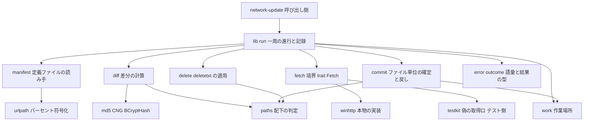
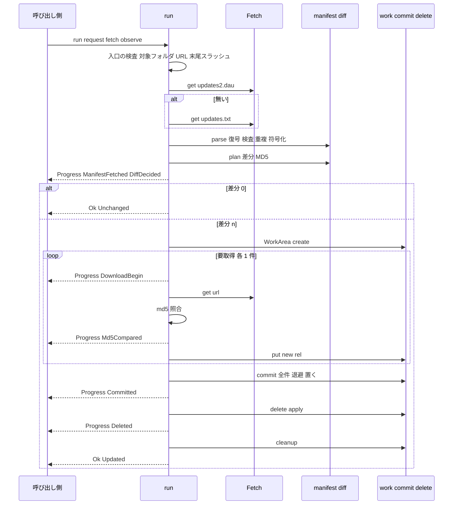
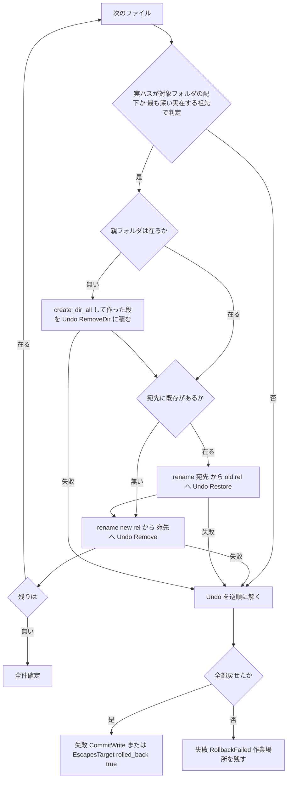

# Design Document: areka-P0-update-engine

> 2026-09-23 設計。入力は確定済みの `requirements.md`（10 要件・78 受入基準）と `research.md`（ギャップ分析＋設計判断 15 項目）。要件段階の裁定 ⑴ MD5＝OS の CNG・⑵ 既定の文字コード＝Shift_JIS 固定・⑶ `areka-nar` の部品は再利用しない、と要件ディスカッションで決着した項目 4（置き場＝対象フォルダ直下）・10（`delete.txt` の文字コード）・12（語彙 3 語の追加）・13（差分 0 の周は定義ファイルを置かない）はそのまま採る。残る項目（作業場所の名前と下位構造・ファイル単位の確定の手順・取得した内容の持ち方・取得の境界の型・WinHTTP の細部・パーセント復号後の文字コード・観測者の形・失敗の語彙の全数・後退した周の古い `updates2.dau`・実機の一周の器・クレート名と登記）を本書で確定する。既存コードへの言及は 2026-09-23 に本ブランチで file:定義 を引き直した（`research.md` §10）。正典の引用は ukadoc の項目名で示す。
>
> 2026-09-24 設計ディスカッション（`design-validation.md` の重大 2 件＋軽微 7 件を反映）: 確定は「配下の検査 → 親フォルダ → 退避 → 置く」の順に改め（重大 2）、棚の片付けは `old/` に中身が残るフォルダを消さない（重大 1）。`UpdateWarning` は 7 変種（`Undeletable`・`Leftover` は結果の一覧から `run` が直接 `warn!` に写す・`DeleteKindMismatch`・`DeleteFileUnreadable` を追加）。`charset=` の先読みは先頭エントリの最後の欄だけ。要件 1.12・7.3・8.3・9.1 を同時に直した。

## Overview

**Purpose**: ゴーストの作者が配布サイトに置いた修正（`updates2.dau`／`updates.txt`）を、第三者の手元のフォルダへ「全部入るか、1 つも入らないか」の形で取り込むエンジンを、新しいクレート `areka-update` として建てる。入力は更新先 URL の文字列と対象フォルダの絶対パスだけで、SHIORI イベントは送らない。

**Users**: 本エンジンを kanade の「更新」の相・台本の入口・メニューへ結線する `areka-P0-network-update` の実装者（直接の読み手）と、その先にいるゴーストを入れた第三者。

**Impact**: 既存のソースには触らない（差分 0）。増えるのは `crates/areka-update/` 1 本と、登記の 3 か所（`tech.md` の 1 行・`structure.md` のクレート一覧・`THIRD-PARTY-NOTICES.md` の再生成）。外部クレートは 1 つも足さず、HTTP は WinHTTP・MD5 は CNG（`BCryptHash`）と、どちらも OS の機能で賄う。

### Goals

- 定義ファイル 2 形式を正典どおりに読み、ローカルの木との差分を MD5 で導く（1・2）。
- 外界へ出る口を `Fetch` 1 つに閉じ、常時テストは偽の口だけで一周を回す（3）。
- 差分のファイルを対象フォルダ直下の作業場所へ落として照合し、全件揃ってから全か無かで確定し、失敗なら逆順に戻す（4・5）。
- `delete.txt`／`delete[数字].txt` を 3 種の拒否で安全に適用する（6）。
- 段ごとの進捗と、`OnUpdate*` の Ref を組み立てるのに足りる結果・閉じた失敗の語彙を返す（7）。
- 失敗の記録を 1 件に閉じ、決定論テストが件数で判定する（8・9）。
- 新しいクレートに閉じて登記する（10）。

### Non-Goals

- `OnUpdate*` 系イベントの送出と Ref の組み立て・`useorigin1`・`OnUpdateProcessExec`・`other_homeurl_override`（`network-update`）。
- `homeurl` の解決（`descript.txt` と SHIORI リソースの優先順位）・台本の入口・メニュー登記・更新後の読み直し・UI スレッドの外で走らせる配線（`network-update`）。
- 網羅台帳 `doc/ukadoc-coverage/` の状態の更新（roadmap 裁定 6）。
- `updates2.dau` の書き出し・定期自動更新・本体の更新・取得の中断・複数対象の一括更新。
- `areka-nar` の振る舞いと公開範囲の変更（裁定 ⑶）。

## Boundary Commitments

### This Spec Owns

- `crates/areka-update/` の全部: 定義ファイルの読み手・差分・取得の境界（trait と本物の実装 1 つ）・作業場所・確定と戻し・`delete.txt`・進捗と結果の型・失敗の語彙・記録。
- 公開面の契約: `run(&UpdateRequest, &dyn Fetch, &mut dyn FnMut(&Progress)) -> Result<UpdateOutcome, UpdateError>`（本書「Components and Interfaces」）。
- 対象フォルダの中の「作業場所」（`<対象>/.update-work/`）の名前と構造。
- 決定論テストの固定入力と偽の取得口（テスト側）・実機の一周の器（`#[ignore]` テスト＋ローカル HTTP）。
- 登記: `.kiro/steering/tech.md` の Key Technical Decisions 1 行・`.kiro/steering/structure.md` のクレート一覧・`THIRD-PARTY-NOTICES.md` の再生成。

### Out of Boundary

- kanade・`emo2_boot`・`main.rs`・`menu`・`areka-nar`・`areka-parsers`・`areka-sylphya` のソース（1 行も触らない）。
- SHIORI の解放（起動中のゴーストを更新するときは呼び出し側が先に解放する）・スレッドの起動（呼び出し側の責務）。
- `homeurl` の値の取得元・番号の 1 始まりへの読み替え・イベント列。
- 網羅台帳の状態と `roadmap-draft.md`・生成物（`// ukadoc:` の印を `delete.rs` に置くことだけ許す＝10.7）。
- 根の `Cargo.toml` の `windows` の機能一覧（触らない＝10.4）。

### Allowed Dependencies

- 本番: `encoding_rs`（承認済）・`thiserror`・`tracing`・`windows 0.62`（機能 `Win32_Foundation`・`Win32_Networking_WinHttp`・`Win32_Security_Cryptography` をクレート自身の `Cargo.toml` で足す）。ワークスペース内の本番クレートには依存しない。
- テスト専用（`[dev-dependencies]`）: `log-capture-kit`（記録の捕捉と件数）・`sample-ghost-kit`（検体の複製 `SampleRoot`・空の作業フォルダ `WorkDir`）。
- 守る規律: `std::env::temp_dir` を本番で呼ばない（`temp_path_guard_test`）・`sample-ghost-kit` を `[dependencies]` に置かない（`sample_path_guard_test`）・記録の捕捉先を自前で差さない（`with_default_guard_test`）・1 ファイル 1,000 行（`file_length_guard_test`）。

### Revalidation Triggers

- `run` の引数・`Progress` の変種・`UpdateOutcome`／`UpdateError`／`FailReason` の形が変わったとき → `network-update` の Ref の組み立てが再確認。
- 作業場所の名前 `.update-work` が変わったとき → `delete.txt` の無視の規則（6.3）と `network-update` の説明書。
- 取得の境界 `Fetch::get` の戻りが変わったとき → 偽実装と実機の一周。
- 既定の文字コード・パーセント符号化の規則が変わったとき → `charset-canon` との整合と `network-update` の実機。

## Architecture

### Existing Architecture Analysis

- ネットワーク更新に当たる実装は 0（`WinHttp`・`updates2`・`OnUpdate` を綴る本番ソース 0 ファイル）。`homeurl` は語彙だけ（`crates/areka-sylphya/src/vocab/shiori_resource.rs`）で、本仕様はそれも読まない。
- 前例 `areka-nar` は「作業場所で組む → 退避 → 置く → 失敗なら逆順に戻す」思想と語彙（`rolled_back`・`work`・`leftovers`）を持つが、単位がフォルダ丸ごとの `rename`（`crates/areka-nar/src/install.rs` の `commit_one`：宛先を `old-<k>` へ `rename` してから作業フォルダを宛先へ `rename`）で、部品は全て `pub(crate)`。本仕様は思想と語彙を写し、**ファイル単位**の確定を自分で持つ（裁定 ⑶）。
- 記録の型は `areka-nar/src/lib.rs` の `log_failure`（`Err` を返す直前に `tracing::error!` を 1 回）と、`lib_tests.rs` の `only_the_public_surface_writes_records`（本番ソースで `tracing::` を綴るのは `lib.rs` だけ・`tracing::error!` は 1 か所と字面で判定）を写す。
- 閉じた語彙の型は `areka-nar/src/error.rs` の `refuse_reasons!` マクロ（`kind()` と `ALL_KINDS` を 1 宣言から生成）と `lib_vocabulary_tests.rs` の `every_refusal_kind_has_a_fixture_and_is_recorded_once`（全変種の固定入力を組み、`kind()` の集合を `ALL_KINDS` と完全一致で突合）を写す。
- 試験の道具はそのまま使う: `log_capture_kit::count_levels`（レベル別件数）・`capture`＋`CapturedEvent::field`・`sample_ghost_kit::{SampleRoot, WorkDir}`。`install_commit_tests.rs` の `hold`（`share_mode(FILE_SHARE_READ)` で開いたまま持ち `rename` を失敗させる）と `tree`（相対パス → バイト列の写し）は私有なので写す。
- 文字コードは `areka_parsers::charset::decode` を使わず `encoding_rs::Encoding::for_label`＋`SHIFT_JIS` を直に使う（`areka-nar/src/names.rs` が `encoding_rs::SHIFT_JIS.decode_without_bom_handling` を直に呼ぶ前例。`areka-parsers` の先読みは `updates2.dau` の `\x01` 区切りの `charset=` を見ない）。

### Architecture Pattern & Boundary Map

段ごとに純粋な関数へ分け、外界（ネット・ファイル）へ触る所を `Fetch`・`work`・`commit`・`delete` の 4 モジュールに限り、記録の発火点を `lib.rs` の 1 か所に閉じる。



**Architecture Integration**:
- Selected pattern: 純関数の段（読む・差分）＋外界に触る段（取得・作業場所・確定・削除）を `run` が直列に束ねる。取得の境界は trait 1 つ（実装は本物 1・偽 1）。
- Domain/feature boundaries: 定義ファイルの解釈（`manifest`・`urlpath`）／木との照合（`diff`・`md5`・`paths`）／外界（`fetch`・`winhttp`）／書き換え（`work`・`commit`・`delete`）／契約（`error`・`outcome`）／進行と記録（`lib`）。
- Existing patterns preserved: 作業場所で組んでから入れ替える・`Err` の直前に `error!` 1 回・閉じた語彙をマクロで 1 宣言に・固定入力の決定論テスト・検体は `sample-ghost-kit` 経由。
- New components rationale: WinHTTP と CNG の unsafe はワークスペースに前例が無いので、それぞれ 1 ファイルに隔離し、常時テストから切り離す（`winhttp.rs` は `#[ignore]` の実機テストだけが通す・`md5.rs` は RFC 1321 のベクトルで較正）。
- Steering compliance: `tracing` の規約（構造化フィールド・スコープ接頭辞 `[areka_update]`）・`thiserror` の構造化 enum・`unsafe` は OS 呼出だけ・1,000 行・OS の一時フォルダ不使用。

**依存の向き**（左から右へだけ import する。逆向きはレビューで誤りとする）:

`error`／`outcome`（型） → `urlpath` → `manifest` → `md5` → `paths` → `diff` → `fetch` → `work` → `commit` → `delete` → `lib`（`run`）。`winhttp` は `fetch`・`error` だけを見る。`testkit`（`#[cfg(test)]`）は何にでも依存してよいが、本番からは参照しない。

### Technology Stack

| Layer | Choice / Version | Role in Feature | Notes |
|-------|------------------|-----------------|-------|
| 言語 | Rust 2024 | 新クレート `areka-update` | `members = ["crates/*"]` なので根の `Cargo.toml` に差分 0 |
| HTTP | `windows 0.62.2` 機能 `Win32_Networking_WinHttp` | `Fetch` の本物の実装（`WinHttpOpen`〜`WinHttpReadData`） | 機能はクレート自身の `Cargo.toml` で足す（`crates/pilot/Cargo.toml` が `[dependencies]` で `workspace = true` に `features` を上乗せする前例） |
| ハッシュ | `windows 0.62.2` 機能 `Win32_Security_Cryptography` | MD5＝`BCryptHash(BCRYPT_MD5_ALG_HANDLE, …)` 1 呼出 | 擬似ハンドル（Open／Close 不要）。`Win32_Foundation` の `NTSTATUS::ok()` で判定 |
| 文字コード | `encoding_rs 0.8`（承認済） | `Encoding::for_label`＋`SHIFT_JIS`・BOM 込みの復号 | 新規登記なし |
| 誤り型・記録 | `thiserror 2`・`tracing 0.1` | 閉じた語彙・構造化ログ | 全クレート共通規約 |
| テスト | `log-capture-kit`・`sample-ghost-kit`（dev） | 件数判定・検体の複製・空の作業フォルダ | `[dependencies]` には置かない |

外部クレートの追加は 0。`THIRD-PARTY-NOTICES.md` はワークスペースのクレートが増えるので再生成する（`cargo about generate --workspace about.hbs -o THIRD-PARTY-NOTICES.md`）。

## File Structure Plan

### Directory Structure

```
crates/areka-update/
├── Cargo.toml                 # 依存 4 本（encoding_rs・thiserror・tracing・windows＋機能 3 つ）・dev 依存 2 本
└── src/
    ├── lib.rs                 # 公開面・run()・記録の唯一の発火点（info/warn/error）・log_failure
    ├── lib_tests.rs           # 字面の見張り（tracing:: は lib.rs だけ／error! 1 か所／WinHttp は winhttp.rs だけ）・語彙の全数対応・記録の件数
    ├── run_tests.rs           # 偽の取得口で回す一周の全経路（9.3・9.4）
    ├── error.rs               # fail_reasons! マクロ → FailReason＋ALL_KINDS・FetchError・Stage・UpdateError・UpdateWarning
    ├── error_tests.rs
    ├── outcome.rs             # ManifestName・Progress・UpdateOutcome・Undeletable
    ├── manifest.rs            # updates2.dau／updates.txt の読み手（先読み・復号・行・検査・重複・符号化の判定）
    ├── manifest_tests.rs      # 9.1 の固定入力
    ├── urlpath.rs             # パーセント符号化の判定・復号・符号化（純関数）
    ├── urlpath_tests.rs
    ├── md5.rs                 # md5_hex（BCryptHash）
    ├── md5_tests.rs           # RFC 1321 のベクトル（10.3）
    ├── paths.rs               # 相対パス → ローカルパス・実パスが配下かの判定・作業場所の名前
    ├── paths_tests.rs
    ├── diff.rs                # 要取得の選別（2）
    ├── diff_tests.rs          # 9.2
    ├── fetch.rs               # trait Fetch（境界）
    ├── winhttp.rs             # WinHttpFetch（本物の実装・unsafe はこのファイルだけ）
    ├── winhttp_real_tests.rs  # #[ignore] 実機の一周（ローカル HTTP＋検体の複製・9.7）
    ├── work.rs                # WorkArea（<対象>/.update-work/<pid>-<連番>/{new,old}）
    ├── work_tests.rs
    ├── commit.rs              # ファイル単位の確定と逆順の戻し（5）
    ├── commit_tests.rs        # 注入 → 戻し・バイト単位の同一（9.4）・戻せなかった固定入力
    ├── delete.rs              # delete.txt／delete[数字].txt（6）・`// ukadoc:` の印
    ├── delete_tests.rs        # 9.5
    └── testkit.rs             # #[cfg(test)]: FakeFetch・tree・hold・固定入力の組み立て・Shift_JIS の符号化
```

テストは `areka-nar` と同じく `#[cfg(test)] #[path = "..._tests.rs"] mod tests;` で本番ファイルの隣に置く（`crates/areka-nar/src/error.rs` 末尾の形）。1 ファイル 1,000 行の見張り（`crates/log-capture-kit/tests/file_length_guard_test.rs`）は `crates/**/*.rs` を自動で数えるので登記は不要。

### Modified Files

- `.kiro/steering/tech.md` — Key Technical Decisions に「ネットワーク更新の HTTP と MD5 は OS の機能（WinHTTP・CNG）で、HTTP クレートも `md-5` も足さない」の 1 行（10.2）。
- `.kiro/steering/structure.md` — クレート一覧に「Update Engine Crate（areka-update）」の 5 行（Location／Purpose／Modules／Dependencies／規律・`areka-nar` の項と同じ型）（10.6）。
- `THIRD-PARTY-NOTICES.md` — `cargo about` で再生成（ワークスペースのクレートが 1 行増える。競合したら手で直さず再生成）（10.5）。

既存の `.rs`・`Cargo.toml` は 1 つも変えない（10.1・10.4）。

## System Flows

### 一周の進行（`run`）



- 差分 0 の周は作業場所を作らず、対象フォルダに 1 バイトも書かず、`delete.txt` も読まない（2.5・6.1）。
- どの失敗でも `run` は作業場所を片付け（戻せなかったときだけ残す）、`log_failure` で `error!` を 1 回だけ出してから `Err` を返す。

### 確定と戻し（`commit`・1 ファイルにつき最大 3 手）



- 配下の検査を親フォルダの作成より**先**に置く（5.6「外へ解決されるパスを決して作らない」）。`resolves_under` は最も深い実在する祖先を見るので、作る前に呼べる。差分の段の検査から確定までの間に取得（数秒〜数分）が挟まるため、ここでもう一度検査する。
- 退避を先にするのは、`std::fs::rename` がファイル相手だと既存を置き換えるためである（`library/std/src/fs.rs` の `rename` の説明「replacing the original file if `to` already exists」・Windows 実装は `MoveFileExW(…, MOVEFILE_REPLACE_EXISTING)`）。退避を挟まないと元の内容が消え、戻せない。
- 作業場所は対象フォルダと同じボリュームなので `rename` は複写にならず、置く手は 1 件あたり 1 回のメタデータ操作で済む。
- 定義ファイル自身（`updates2.dau` または `updates.txt`）は確定の最後の 1 件として同じ手順で置く（5.3）。

## Requirements Traceability

| Requirement | Summary | Components | Interfaces | Flows |
|-------------|---------|------------|------------|-------|
| 1.1 | `updates2.dau` → 無いときだけ `updates.txt` | lib | `run`・`Fetch::get`・`FetchError::NotFound` | 一周の進行 |
| 1.2 | 「無い」以外の失敗で後退しない | lib・error | `FailReason::ManifestFetch` | 一周の進行 |
| 1.3 | 両方無い | lib・error | `FailReason::ManifestMissing` | 一周の進行 |
| 1.4 | 末尾 `/` の補いと警告 | lib・error | `UpdateWarning::HomeurlSlashAppended` | 一周の進行 |
| 1.5 | `\x01` 区切り・CRLF／LF | manifest | `parse` | — |
| 1.6 | `file,`／`charset,`／無視 | manifest | `parse` | — |
| 1.7 | 必須 2 欄・拡張欄の扱い | manifest | `parse`・`Entry` | — |
| 1.8 | 先頭エントリ末尾の `charset=`・`charset,` 行 | manifest | `prescan_charset` | — |
| 1.9 | 既定 Shift_JIS・OS ロケール不読 | manifest | `resolve_charset`（`DEFAULT_CHARSET`） | — |
| 1.10 | 解決不能な名前は警告して既定へ | manifest・error | `UpdateWarning::UnknownCharset` | — |
| 1.11 | 正典の無効 3 種 | manifest・error | `InvalidWhy::{NoMd5, FolderEntry, DotDot}` | — |
| 1.12 | 追加の無効 5 種＋作業場所 | manifest・error | `InvalidWhy::{BadMd5, Absolute, EmptyComponent, Nul, SelfReference, InsideWorkArea}` | — |
| 1.13 | `\` も区切り | manifest・paths | `normalize_separators` | — |
| 1.14 | 重複は後勝ち・警告 | manifest・error | `UpdateWarning::DuplicateEntry` | — |
| 1.15 | 符号化の判定・復号・URL 側の符号化 | urlpath・manifest | `is_all_encoded`・`decode`・`encode` | — |
| 1.16 | 有効 0 件は差分 0 | lib・diff | `UpdateOutcome::Unchanged` | 一周の進行 |
| 1.17 | 入口の検査（対象フォルダ・URL） | lib・error | `FailReason::{TargetMissing, InvalidHomeurl}`・`Stage::Entry` | 一周の進行 |
| 2.1 | 無い／違う → 要取得、同じ → 対象外 | diff・md5 | `plan` | — |
| 2.2 | 32 桁 16 進・大小無視 | manifest・md5 | `Entry::md5`（小文字正規化）・`md5_hex` | — |
| 2.3 | 定義に無いファイルに触らない | diff・commit・delete | `plan`（定義の走査のみ） | — |
| 2.4 | 読めないローカルは失敗 | diff・error | `FailReason::LocalUnreadable` | — |
| 2.5 | 差分 0 は何も書かず成功 | lib | `UpdateOutcome::Unchanged` | 一周の進行 |
| 2.6 | 要取得を定義の順で・件数とパス | diff・outcome | `Progress::DiffDecided`・`Updated::placed` | 一周の進行 |
| 3.1 | 境界 1 つ | fetch | `trait Fetch` | — |
| 3.2 | 偽実装（固定表＋失敗の注入） | testkit | `FakeFetch` | — |
| 3.3 | 本物 1 つ＝WinHTTP | winhttp | `WinHttpFetch` | — |
| 3.4 | http／https・3xx 追随・2xx 本文 | winhttp | `WINHTTP_FLAG_SECURE`・既定の転送方針 | — |
| 3.5 | 状態コード・404 の区別 | winhttp・error | `FetchError::{NotFound, Status}` | — |
| 3.6 | 名前解決／接続／時間切れ・上限 | winhttp・error | `FetchError::{NameResolution, Connect, Timeout, Tls, Other}`・`TIMEOUTS_MS` | — |
| 3.7 | 同期・スレッドを起こさない | lib | `run` は普通の関数 | — |
| 4.1 | 作業場所＝対象フォルダ直下の専用フォルダ | work・paths | `WORK_DIR = ".update-work"`・`WorkArea::create` | — |
| 4.2 | URL＝更新先＋符号化済みパス | manifest・lib | `Entry::url_path`・`file_url` | — |
| 4.3 | 1 件ずつ・進捗（名・番号・総数） | lib・outcome | `Progress::DownloadBegin` | 一周の進行 |
| 4.4 | 照合と進捗（名・正・実・一致） | lib・md5・outcome | `Progress::Md5Compared` | 一周の進行 |
| 4.5 | 不一致で即失敗 | lib・error | `FailReason::Md5Mismatch`・`Stage::Verify` | 一周の進行 |
| 4.6 | 取得失敗で即失敗 | lib・error | `FailReason::FileFetch`・`Stage::Download` | 一周の進行 |
| 4.7 | バイト列を変換しない | work・commit | `WorkArea::put`（そのまま書く）・`rename` | 確定と戻し |
| 4.8 | 片付けと残骸の列挙 | work・outcome・error | `WorkArea::cleanup`・`leftovers` | — |
| 5.1 | 全件揃ってから確定 | lib・commit | `run`（取得ループの後に `commit`） | 一周の進行 |
| 5.2 | 置く・親を作る・置き換える | commit | `commit`・`Undo` | 確定と戻し |
| 5.3 | 定義ファイルも置く | lib・commit | `run`（最後の 1 件） | 確定と戻し |
| 5.4 | 途中失敗で全部戻す・親フォルダも消す | commit・error | `unwind`・`FailReason::CommitWrite` | 確定と戻し |
| 5.5 | 戻せなかった事実と一覧・作業場所 | commit・error | `FailReason::RollbackFailed`・`UpdateError::work` | 確定と戻し |
| 5.6 | 実パスが配下か | paths・diff・commit | `resolves_under`・`FailReason::EscapesTarget` | 確定と戻し |
| 5.7 | 開かれていて置けない → 5.4 | commit | `hold` 注入で `CommitWrite` | 確定と戻し |
| 5.8 | 置いた一覧と件数 | outcome | `UpdateOutcome::Updated::placed` | — |
| 6.1 | 確定後に `delete.txt` → `delete[数字].txt` | delete | `delete_files`・`apply` | 一周の進行 |
| 6.2 | 行の読み方・文字コードの引き継ぎ | delete・manifest | `apply(charset)` | — |
| 6.3 | 3 種の拒否＋作業場所 | delete・paths・error | `DeleteWhy::{Absolute, DotDot, EscapesTarget, InsideWorkArea}` | — |
| 6.4 | フォルダの行・ファイルの行がフォルダ | delete・error | `remove_dir_all`・`UpdateWarning::DeleteKindMismatch` | — |
| 6.5 | 無い物は何もしない | delete | `apply` | — |
| 6.6 | 取り除けなくても成否は変えない | delete・outcome | `Undeletable`（`run` が `warn!` に写す）・`UpdateWarning::DeleteFileUnreadable` | — |
| 6.7 | 取り除いた一覧 | outcome | `Updated::removed`・`Progress::Deleted` | — |
| 7.1 | 6 種の進捗を起きた順に | outcome・lib | `Progress`・観測者 `&mut dyn FnMut(&Progress)` | 一周の進行 |
| 7.2 | 成功 2 形（0 件／n 件）と 4 つの一覧 | outcome | `UpdateOutcome::{Unchanged, Updated}` | — |
| 7.3 | 失敗の欄（段・理由・ファイル・戻せたか・作業場所） | error | `UpdateError`・`Stage`・`rolled_back()`・`file()` | — |
| 7.4 | 閉じた語彙（11 語）と全数対応テスト | error・lib_tests | `FailReason::ALL_KINDS` | — |
| 7.5 | SHIORI に触らない・`descript.txt` を読まない | lib | 依存に kanade・sylphya が無い（構造） | — |
| 7.6 | 0 始まり | outcome | `Progress::DownloadBegin::index`・`Stage::Download::index` | — |
| 8.1 | 失敗の `error!` 1 件・同じ内容を戻り値に | lib | `log_failure` | — |
| 8.2 | 警告の `warn!` | lib・error | `UpdateWarning` → `log_warning` | — |
| 8.3 | 開始・終了の `info!` | lib | `run` | — |
| 8.4 | 件数で判定 | lib_tests | `count_levels` | — |
| 9.1 | 読み手の固定入力 | manifest_tests・urlpath_tests | `testkit` の組み立て | — |
| 9.2 | 差分 4 形 | diff_tests | `plan`・`tree` | — |
| 9.3 | 一周の各経路 | run_tests | `FakeFetch` | 一周の進行 |
| 9.4 | 全か無かをバイト単位で | commit_tests・run_tests | `tree` | 確定と戻し |
| 9.5 | `delete.txt` の固定入力 | delete_tests | `apply` | — |
| 9.6 | 純 x64・ネット不使用 | 全テスト | `FakeFetch` のみ | — |
| 9.7 | 実機の一周 | winhttp_real_tests | `#[ignore]`・`TcpListener`・`SampleRoot` | — |
| 10.1 | 新クレートに閉じる | Cargo.toml | 既存ソース差分 0 | — |
| 10.2 | CNG・登記 1 行 | md5・tech.md | `BCryptHash` | — |
| 10.3 | MD5 の較正 | md5_tests | RFC 1321 | — |
| 10.4 | 機能フラグはクレート側 | Cargo.toml | `windows = { workspace = true, features = [...] }` | — |
| 10.5 | NOTICES 再生成 | THIRD-PARTY-NOTICES.md | `cargo about` | — |
| 10.6 | `structure.md` 登記 | structure.md | 5 行の型 | — |
| 10.7 | 台帳に触らない・印だけ | delete | `// ukadoc:` 1 行 | — |
| 10.8 | 1,000 行・`log-capture-kit` は dev | 全ファイル・Cargo.toml | 見張りが自動で数える | — |

## Components and Interfaces

| Component | Domain/Layer | Intent | Req Coverage | Key Dependencies (P0/P1) | Contracts |
|-----------|--------------|--------|--------------|--------------------------|-----------|
| `lib`（`run`・記録） | 進行 | 段を直列に束ね、進捗と結果を返し、記録を 1 か所で出す | 1.1〜1.4, 1.16, 1.17, 2.5, 3.7, 4.2〜4.6, 5.1, 5.3, 7.1, 7.5, 8.1〜8.3 | 全モジュール（P0） | Service, Event |
| `error`・`outcome` | 契約 | 閉じた語彙・段・進捗・結果 | 7.2〜7.4, 7.6, 8.2 | `thiserror`（P0） | State |
| `manifest`・`urlpath` | 解釈 | 定義ファイルをエントリ列へ | 1.5〜1.15, 2.2 | `encoding_rs`（P0） | Service |
| `md5` | 照合 | `BCryptHash` で 32 桁 | 2.1, 2.2, 4.4, 10.2, 10.3 | `windows`（P0） | Service |
| `paths`・`diff` | 木との照合 | 要取得の選別・配下の判定 | 2.1〜2.4, 2.6, 5.6 | `md5`（P0） | Service |
| `fetch`・`winhttp` | 外界 | 境界 trait と本物の実装 | 3.1〜3.6 | `windows`（P0） | Service |
| `work` | 書き換え | 作業場所の作成・書き込み・片付け | 4.1, 4.7, 4.8 | std（P0） | State |
| `commit` | 書き換え | ファイル単位の確定と逆順の戻し | 5.2, 5.4〜5.7 | `work`・`paths`（P0） | Batch |
| `delete` | 書き換え | `delete.txt` の安全な適用 | 6.1〜6.7, 10.7 | `paths`（P0） | Batch |
| `testkit`・各 `*_tests.rs` | 試験 | 偽の取得口・固定入力・件数判定 | 3.2, 8.4, 9.1〜9.6 | `log-capture-kit`・`sample-ghost-kit`（dev） | — |
| `winhttp_real_tests` | 実機 | `#[ignore]` の一周 | 9.7 | `TcpListener`・`SampleRoot` | — |

### 進行と契約

#### `lib`（`run`・記録の発火点）

| Field | Detail |
|-------|--------|
| Intent | 入口の検査 → 定義ファイル → 差分 → 取得と照合 → 確定 → 削除 → 片付け、を同期で 1 回進め、進捗を観測者へ、結果を戻り値へ、記録を `tracing` へ出す |
| Requirements | 1.1〜1.4, 1.16, 1.17, 2.5, 3.7, 4.2〜4.6, 4.8, 5.1, 5.3, 7.1, 7.5, 8.1〜8.3 |

**Responsibilities & Constraints**
- 本番ソースで `tracing::` を綴るのは `lib.rs` だけ・`tracing::error!` は `log_failure` の 1 か所（`lib_tests.rs` が字面で判定）。他のモジュールは警告を**データ**（`Vec<UpdateWarning>`）で返し、`run` が `warn!` に写す。
- スレッドを起こさない・`descript.txt` を読まない・kanade／sylphya に依存しない（`Cargo.toml` で構造的に満たす）。
- 失敗の全経路は `log_failure` を通る（`Err` を組む唯一の口）。

**Dependencies**
- Inbound: `network-update`（呼び出し側）— 一周の実行（P0）
- Outbound: `manifest`・`diff`・`fetch`・`work`・`commit`・`delete`・`error`・`outcome`（P0）
- External: `tracing`（P0）

**Contracts**: Service [x] / API [ ] / Event [x] / Batch [ ] / State [ ]

##### Service Interface

```rust
/// 一周の入力。`homeurl` は解決済みの更新先 URL（末尾の `/` は無くてもよい）、
/// `target` は定義ファイルのパスの根（ゴーストなら `(myghost)/`）。
pub struct UpdateRequest<'a> {
    pub homeurl: &'a str,
    pub target: &'a Path,
}

/// 一周を同期で進める。自らスレッドを起こさない（3.7）。
///
/// 成功は `UpdateOutcome`（差分 0 と n 件を型で区別）、失敗は `UpdateError`
/// （段・閉じた理由・原因のファイル・戻せたか・残骸・元の内容が残る作業場所）。
/// 失敗の全経路で `tracing::error!` を 1 件だけ出し、同じ内容を戻り値に持つ（8.1）。
pub fn run(
    request: &UpdateRequest<'_>,
    fetch: &dyn Fetch,
    observe: &mut dyn FnMut(&Progress),
) -> Result<UpdateOutcome, UpdateError>;
```

- Preconditions: `request.target` は絶対パス。呼び出し側が UI スレッドの外で呼ぶ。起動中のゴーストなら SHIORI を先に解放している。同じ対象フォルダへの走行を同時に 2 つ起こさない（起こせば棚の片付けが相手の作業場所を消し得る。呼び出し側が 1 対象ずつ呼ぶ＝要件の Out of scope）。
- Postconditions: `Ok(Unchanged)` なら対象フォルダは 1 バイトも変わらない。`Ok(Updated)` なら要取得の全件と定義ファイルが置かれ、`delete.txt` が適用済み。`Err` で `rolled_back()` が真なら対象フォルダの内容（作業場所を除く）は開始前と同一。`Err` で偽なら `work` に元の内容が残る作業場所のパスがある。
- Invariants: 取得の間、対象フォルダの木（作業場所を除く）は変わらない。観測者への通知は起きた順で、`Md5Compared` は不一致でも通知してから失敗にする。

**進行の順序**（`run` の中身・段は `Stage`）:

1. `Stage::Entry`: `target.is_dir()` でなければ `TargetMissing`。`homeurl` が `http://`／`https://` で始まらなければ `InvalidHomeurl`。末尾が `/` でなければ補い `HomeurlSlashAppended` を警告。取得口はまだ呼ばない（1.17）。`info!` で開始を記録（8.3）。
2. `Stage::Manifest`: `get(<url>updates2.dau)`。`Err(NotFound)` のときだけ `get(<url>updates.txt)`。両方 `NotFound` → `ManifestMissing`。それ以外の `Err` → `ManifestFetch { name, source }`（後退しない）。`Progress::ManifestFetched { name }`。
3. `manifest::parse` → `Manifest` と警告（各 1 件 `warn!`）。
4. `Stage::Diff`: `fs::canonicalize(target)` を `target_real` とし（失敗は `LocalUnreadable { path: target }`）、`diff::plan`。`Err` → `LocalUnreadable` または `EscapesTarget`。`Progress::DiffDecided { files }`。要取得 0 件 → `info!` で終了を記録し `Ok(Unchanged { manifest })`（2.5・1.16）。
5. `Stage::Download { index: 0, total }`: `WorkArea::create(target)`。`Err` → `WorkArea { path, source }`。
6. 各要取得 `i`（定義の順）: `Progress::DownloadBegin`。`get(file_url)` の `Err` → `FileFetch`（`Stage::Download { i, total }`）。`md5_hex` で照合し `Progress::Md5Compared`。不一致 → `Md5Mismatch`（`Stage::Verify { i, total }`）。`area.put(rel, bytes)` の `Err` → `WorkArea`。バイト列はここで手放す（メモリに全件を溜めない）。
7. 定義ファイルの生バイト列を `area.put(manifest.name.file_name(), …)`。
8. `Stage::Commit`: `commit::commit(target, target_real, &area, files ＋ 定義ファイル名)`。`Ok(placed)` → `Progress::Committed`。`Err(Write)` → `CommitWrite`（戻せた）。`Err(Escapes)` → `EscapesTarget`（それまでに置いた分は戻せた）。`Err(RollbackFailed)` → `RollbackFailed`・作業場所は片付けず `work = Some(area.dir())`。
9. `delete::apply(target, target_real, manifest.charset)` → `warnings` を `warn!`・`undeletable` も 1 件 1 行の `warn!`・`Progress::Deleted { removed }`。削除は一周を失敗にしない（6.6）。
10. `area.cleanup()` → 残骸を `Updated::leftovers` に入れ、各 1 件 `warn!`。`info!` で終了（成功・件数）。`Ok(Updated { … })`。

失敗時は 8 の `RollbackFailed` を除き `area.cleanup()`（作っていれば）を行い、残骸を `UpdateError::leftovers` に入れ、`log_failure` で `error!` を 1 回出して `Err`。失敗の終了は `error!` の 1 行が兼ね、`info!` を重ねない（`areka-nar/src/lib.rs` の `install` と同じ形＝8.3）。

##### Event Contract（観測者）

- Published events: `Progress` の 6 変種（`outcome.rs`）。観測者は `&mut dyn FnMut(&Progress)`（閉包 1 つ。`network-update` がイベントへ写すだけなので trait の 6 メソッドは持たない＝research §6-11 ⒜）。
- Ordering / delivery guarantees: `ManifestFetched` → `DiffDecided` → (`DownloadBegin` → `Md5Compared`)×n → `Committed` → `Deleted`。失敗した段の後の通知は無い。同じ呼び出しスレッドで同期に呼ぶ。

**記録**（`logging.md` の規約・スコープ接頭辞 `[areka_update]`）:

| 種類 | レベル | 欄 |
|---|---|---|
| 開始 | `info!` | `homeurl`・`target` |
| 終了 | `info!` | `outcome`（`unchanged`／`updated`）・`placed`（件数）・`removed`（件数）・`leftovers`（件数） |
| 警告（`UpdateWarning` 1 件・取り除けなかった物（`Undeletable`）1 件・残骸（`leftovers`）1 件につき 1 行） | `warn!` | `kind`（変種名・`undeletable`・`leftover`）・変種の欄（`line`・`path`・`name`・`file`・`error` 等） |
| 失敗（`log_failure`・1 行） | `error!` | `homeurl`・`target`・`stage`・`reason`（`kind()`）・`detail`（`Display`）・`file`・`rolled_back`・`work`・`leftovers`（件数） |

#### `error`・`outcome`（契約の型）

| Field | Detail |
|-------|--------|
| Intent | 閉じた失敗の語彙・段・警告・進捗・結果を、`network-update` が `OnUpdate*` の Ref に写せる形で持つ |
| Requirements | 1.4, 1.10〜1.12, 1.14, 2.6, 4.8, 5.5, 5.8, 6.3, 6.4, 6.6, 6.7, 7.1〜7.4, 7.6, 8.2 |

**Contracts**: Service [ ] / API [ ] / Event [ ] / Batch [ ] / State [x]

##### State Management（型）

```rust
// outcome.rs
#[derive(Clone, Copy, Debug, PartialEq, Eq)]
pub enum ManifestName { Updates2Dau, UpdatesTxt }
impl ManifestName {
    /// `"updates2.dau"` または `"updates.txt"`。
    pub fn file_name(self) -> &'static str;
}

/// 起きた順に観測者へ渡す進捗。番号は 0 始まり（7.6）。
#[derive(Clone, Debug, PartialEq, Eq)]
pub enum Progress {
    ManifestFetched { name: ManifestName },
    DiffDecided { files: Vec<String> },
    DownloadBegin { file: String, index: usize, total: usize },
    Md5Compared { file: String, expected: String, actual: String, matched: bool },
    Committed { placed: Vec<String> },
    Deleted { removed: Vec<PathBuf> },
}

/// 成功の 2 形（7.2）。
#[derive(Debug)]
pub enum UpdateOutcome {
    /// 差分 0。対象フォルダには何も書いていない。
    Unchanged { manifest: ManifestName },
    Updated {
        manifest: ManifestName,
        /// 置いたファイル（定義の順・定義ファイル自身は含めない＝`manifest` 欄が示す）。
        placed: Vec<String>,
        removed: Vec<PathBuf>,
        undeletable: Vec<Undeletable>,
        leftovers: Vec<PathBuf>,
    },
}

#[derive(Debug)]
pub struct Undeletable { pub path: PathBuf, pub source: std::io::Error }
```

```rust
// error.rs
/// どの段まで進んだか（7.3）。削除の段は一周を失敗にしないので（6.6）ここに無い。
#[derive(Clone, Copy, Debug, PartialEq, Eq)]
pub enum Stage {
    Entry,
    Manifest,
    Diff,
    Download { index: usize, total: usize },
    Verify { index: usize, total: usize },
    Commit,
}

/// 取得の境界が返す失敗（閉じた語彙・`Clone`＋`PartialEq`＝偽の取得口の固定表に置ける）。
#[derive(Clone, Debug, PartialEq, Eq, thiserror::Error)]
pub enum FetchError {
    NotFound,                       // 404
    Status { code: u16 },           // 2xx・3xx・404 以外
    NameResolution,                 // ERROR_WINHTTP_NAME_NOT_RESOLVED
    Connect,                        // ERROR_WINHTTP_CANNOT_CONNECT／CONNECTION_ERROR
    Timeout,                        // ERROR_WINHTTP_TIMEOUT
    Tls,                            // ERROR_WINHTTP_SECURE_FAILURE（_PROXY を含む）
    TooLarge { limit: usize },      // 本文が MAX_BODY_BYTES を超えた
    Other { code: u32 },            // 上記以外の Win32 エラー番号
}

/// `areka-nar` の `refuse_reasons!` と同じ形で `kind()` と `ALL_KINDS` を 1 宣言から生成する。
fail_reasons! {
    TargetMissing { path: PathBuf },                                   // 対象フォルダが無い・フォルダでない
    InvalidHomeurl { homeurl: String },                                // http／https で始まらない
    ManifestMissing {},                                                // 両方 404
    ManifestFetch { name: ManifestName, source: FetchError },          // 404 以外で定義ファイルが取れない
    LocalUnreadable { path: PathBuf, source: std::io::Error },         // 在るのに読めない（4 GiB 超を含む）
    WorkArea { path: PathBuf, source: std::io::Error },                // 作業場所を作れない・書けない
    FileFetch { file: String, source: FetchError },                    // 1 件の取得失敗
    Md5Mismatch { file: String, expected: String, actual: String },
    EscapesTarget { path: PathBuf },                                   // 実パスが対象フォルダの外へ解決される
    CommitWrite { path: PathBuf, source: std::io::Error },             // 確定で置けない（戻せた）
    RollbackFailed {                                                   // 戻せなかった
        path: PathBuf, source: std::io::Error,                         // 確定を止めた失敗
        restored: Vec<String>, stuck: Vec<Stuck>,
    },
}
#[derive(Debug)]
pub struct Stuck { pub file: String, pub source: std::io::Error }

#[derive(Debug, thiserror::Error)]
#[error("{homeurl} → {target}: {stage:?} で失敗: {reason}")]
pub struct UpdateError {
    pub homeurl: String,
    pub target: PathBuf,
    pub stage: Stage,
    pub reason: FailReason,
    pub leftovers: Vec<PathBuf>,
    /// 戻せなかったときだけ。元の内容が残る作業場所。
    pub work: Option<PathBuf>,
    // 要取得の一覧は持たない: 差分の段を越えた失敗なら `Progress::DiffDecided` で既に渡している（2.6）。
}
impl UpdateError {
    /// 原因のファイル名（分かるとき）。
    pub fn file(&self) -> Option<&str>;
    /// `RollbackFailed` 以外は真。
    pub fn rolled_back(&self) -> bool;
}

/// 拒否ではないが黙って通さないもの（8.2）。`run` が 1 件 1 行の `warn!` に写す。
/// 取り除けなかった物と残骸は結果の一覧（`undeletable`・`leftovers`）が正本で、
/// `run` がそこから直接 `warn!` に写す（`io::Error` は `Clone` できないので 2 か所に持たない）。
#[derive(Debug)]
pub enum UpdateWarning {
    HomeurlSlashAppended,
    UnknownCharset { name: String },
    InvalidEntry { line: usize, why: InvalidWhy },
    DuplicateEntry { line: usize, path: String },
    DeleteLineIgnored { file: String, line: usize, why: DeleteWhy },
    /// 行の種別（ファイル／フォルダ）と実体の種別が違う → 取り除かない（6.4・両方向）。
    DeleteKindMismatch { file: String, line: usize, path: PathBuf },
    /// `delete.txt`／`delete<N>.txt` が読めない → そのファイルを飛ばす（6.6）。
    DeleteFileUnreadable { file: String, source: std::io::Error },
}
#[derive(Clone, Copy, Debug, PartialEq, Eq)]
pub enum InvalidWhy {
    NoMd5, BadMd5, FolderEntry, DotDot, Absolute, EmptyComponent, Nul, SelfReference, InsideWorkArea,
}
#[derive(Clone, Copy, Debug, PartialEq, Eq)]
pub enum DeleteWhy { Absolute, DotDot, EscapesTarget, InsideWorkArea }
```

- 語彙の全数は **11**（7.4 の 10 に `EscapesTarget` を足した。要件は「少なくとも」）。`FailReason::ALL_KINDS` と、固定入力から得た `kind()` の集合を完全一致で突合するテストを `lib_tests.rs` に持つ。
- `FailReason` は `std::io::Error` を持つので `Clone`／`PartialEq` は導出しない。比べるときは `kind()`。
- `UpdateWarning::InvalidEntry` は無効エントリ 1 件につき 1 個（8.4 の「無効なエントリ 1 件につき warn 1 件」）。

### 解釈

#### `manifest`・`urlpath`

| Field | Detail |
|-------|--------|
| Intent | 定義ファイルのバイト列を、文字コードを解決して復号し、行を分解し、無効を捨て、重複を後勝ちにし、URL 側とローカル側のパスを確定したエントリ列にする（純関数） |
| Requirements | 1.5〜1.15, 2.2 |

**Contracts**: Service [x] / API [ ] / Event [ ] / Batch [ ] / State [ ]

##### Service Interface

```rust
// manifest.rs
pub(crate) const DEFAULT_CHARSET: &encoding_rs::Encoding = encoding_rs::SHIFT_JIS;

pub(crate) struct Manifest {
    pub name: ManifestName,
    /// 解決した文字コード（`delete.txt` へ引き継ぐ＝6.2）。
    pub charset: &'static encoding_rs::Encoding,
    /// 有効なエントリ（定義の順・重複は後勝ち）。
    pub entries: Vec<Entry>,
}
pub(crate) struct Entry {
    pub line: usize,
    /// ローカルパス。`/` 区切り・復号済み（1.15）。
    pub local: String,
    /// URL のパス部分。符号化済み・`/` は区切りのまま（1.15）。
    pub url_path: String,
    /// 小文字 32 桁（2.2）。
    pub md5: String,
}

pub(crate) fn parse(name: ManifestName, bytes: &[u8]) -> (Manifest, Vec<UpdateWarning>);
```

**判断の規則**（`parse` の中身・順序どおり）:

1. **先読み**（1.8）: `updates2.dau` は先頭行（CRLF／LF まで）を `\x01` で分け、**最後の欄**が ASCII の `charset=<名前>` なら採る（先頭エントリの末尾にあるときだけ＝1.7・1.8。他の位置の `charset=` は拡張欄として読み飛ばす）。`updates.txt` は行頭 `charset,` の行（ASCII）を探す。名前は `Encoding::for_label` で解決し、解決できなければ `UnknownCharset` を警告して `DEFAULT_CHARSET`（1.9・1.10）。`GetACP` 等の OS 設定は読まない。
2. **復号**: 解決した文字コードの `Encoding::decode(bytes)`（BOM があれば BOM を優先＝`encoding_rs` の規則）。
3. **行**: `\n` で分け、末尾の `\r` を落とす（1.5）。0 文字の行は数えない（末尾の改行の後の空を無効エントリにしない）。`updates.txt` は `file,` の後ろを `updates2.dau` の 1 行として読み、`charset,` 行はここでは読み飛ばし、どちらでもない行は無視する（1.6）。
4. **欄**（1.7）: `\x01` で分け、位置 0＝パス・位置 1＝MD5・位置 2 以降＝`key=value`。`size=`・`date=`・その他の鍵は読み飛ばす。`charset=` は先読みでしか使わない。
5. **無効**（1.11・1.12・順序どおり・最初に当たった理由 1 つを `InvalidEntry { line, why }` に）: `NoMd5`（位置 1 が無い・空）→ `BadMd5`（32 桁の 16 進でない）→ `Nul` → `Absolute`（`/`・`\` 始まり・`X:`・`\\`）→ `FolderEntry`（末尾 `/`・`\`）→ `EmptyComponent`（空・`//`・`/./` 相当の空要素）→ `DotDot`（区切り要素 `..`）→ `SelfReference`（大小無視で `name.file_name()` に一致）→ `InsideWorkArea`（先頭要素が `.update-work`＝作業場所を定義から書き換えさせない・本仕様の追加）。区切りは `\` を `/` に正規化してから検査する（1.13）。
6. **符号化の判定**（1.15）: 有効な全エントリのパスが `urlpath::is_encoded`（全文字 ASCII・`%` は必ず 16 進 2 桁を伴う）なら、`url_path` は書かれたまま、`local` は `urlpath::decode` のバイト列を **UTF-8 として読み、UTF-8 でなければ定義ファイルの文字コードで読む**（research §6-9 ⒜。理由は「Design Decisions」）。そうでなければ `local` は書かれたまま、`url_path` は `urlpath::encode`（UTF-8 のバイト列を `%XX` 大文字で符号化・未予約文字 `A-Z a-z 0-9 - . _ ~` と `/` は残す。1.15 の「使えない文字」より広く、パスで使える `!`・`(`・`,`・`=`・`@` 等も符号化するが、サーバは同じに復号するので結果は変わらない＝方針として固定）。
7. **重複**（1.14）: `local` を小文字にした鍵で後勝ち。捨てた先の行を `DuplicateEntry { line, path }` に。
8. MD5 は小文字に正規化して持つ（2.2）。

```rust
// urlpath.rs（純関数）
pub(crate) fn is_encoded(path: &str) -> bool;
pub(crate) fn decode(path: &str) -> Vec<u8>;
pub(crate) fn encode(path: &str) -> String;
```

**Implementation Notes**
- Integration: `parse` は I/O を持たず、`run` から呼ぶだけ。`areka-parsers` には依存しない（使える関数が無い＝research §2.3）。
- Validation: 9.1 の固定入力を `testkit` で組む（Shift_JIS のバイト列は `encoding_rs::SHIFT_JIS.encode` で作る）。
- Risks: Windows の予約名（`CON` 等）は検査しない（要件に無い）。当たれば確定の段で `CommitWrite` になり戻される＝安全側に倒れる。

### 木との照合

#### `md5`

| Field | Detail |
|-------|--------|
| Intent | バイト列の MD5 を小文字 32 桁で返す（OS の CNG） |
| Requirements | 2.1, 2.2, 4.4, 10.2, 10.3 |

```rust
// md5.rs
/// `BCryptHash(BCRYPT_MD5_ALG_HANDLE, None, bytes, &mut [u8; 16])` 1 呼出。
/// 前提: `bytes.len() <= u32::MAX`（呼び出し側が守る。ローカルの読みは `diff` が 4 GiB 超を
/// `LocalUnreadable` にし、取得の本文は `winhttp` が `MAX_BODY_BYTES` で止める）。
/// `NTSTATUS` が失敗なら致命として `panic!`（Windows 10 以降で擬似ハンドルの MD5 が失敗するのは
/// OS の暗号基盤が壊れているとき＝回復不能・`logging.md` の「panic は致命限定」）。
pub(crate) fn md5_hex(bytes: &[u8]) -> String;
```

- 束縛（`windows 0.62.2`・`src/Windows/Win32/Security/Cryptography/mod.rs`）: `BCryptHash(halgorithm: BCRYPT_ALG_HANDLE, pbsecret: Option<&[u8]>, pbinput: &[u8], pboutput: &mut [u8]) -> NTSTATUS`・`BCRYPT_MD5_ALG_HANDLE = BCRYPT_ALG_HANDLE(33 as _)`。`NTSTATUS::ok()`（`extensions/Win32/Foundation/NTSTATUS.rs`）で判定。unsafe はこの 1 呼出だけ。
- 較正（10.3）: RFC 1321 A.5 のベクトル `""` → `d41d8cd98f00b204e9800998ecf8427e`・`"abc"` → `900150983cd24fb0d6963f7d28e17f72`・`"message digest"` → `f96b697d7cb7938d525a2f31aaf161d0` の 3 本以上。

#### `paths`・`diff`

| Field | Detail |
|-------|--------|
| Intent | 定義の相対パスをローカルパスにし、実パスが対象フォルダの配下かを判定し、要取得を選ぶ |
| Requirements | 2.1〜2.4, 2.6, 5.6, 6.3 |

```rust
// paths.rs
pub(crate) const WORK_DIR: &str = ".update-work";
/// `/` 区切りの相対パスを対象フォルダ配下のパスにする（`\` は既に `/` に正規化済み）。
pub(crate) fn local_path(target: &Path, rel: &str) -> PathBuf;
/// `candidate` の最も深い実在する祖先を `canonicalize` し、`target_real` から始まるかを返す。
/// ジャンクションやシンボリックリンクで外へ解決されるパスを捕まえる（5.6・6.3）。
pub(crate) fn resolves_under(target_real: &Path, candidate: &Path) -> std::io::Result<bool>;
/// 先頭の区切り要素が `WORK_DIR`（大小無視）か。
pub(crate) fn is_in_work_area(rel: &str) -> bool;

// diff.rs
pub(crate) enum DiffFailure {
    Unreadable { path: PathBuf, source: std::io::Error },
    Escapes { path: PathBuf },
}
/// 各エントリを定義の順に見て、無い／MD5 が違う → 要取得（`entries` の添字）、同じ → 対象外。
/// 定義に無いローカルのファイルは走査しない（2.3＝定義の側だけを歩く）。
pub(crate) fn plan(target: &Path, target_real: &Path, m: &Manifest) -> Result<Vec<usize>, DiffFailure>;
```

- `plan` は各エントリで `resolves_under` を先に確かめ（外なら `Escapes`）、`symlink_metadata` で「無い」と「在る」を分け、在れば `fs::read` → `md5_hex` で比較。読めない（権限・4 GiB 超）は `Unreadable`（2.4＝「要取得」に化けさせない）。
- 要取得の一覧は定義の順（2.6）。

### 外界

#### `fetch`（境界）と `winhttp`（本物の実装）

| Field | Detail |
|-------|--------|
| Intent | URL → バイト列または理由付きの失敗、を 1 つの trait に閉じ、本物の実装を WinHTTP で 1 つ持つ |
| Requirements | 3.1〜3.6 |

**Contracts**: Service [x] / API [ ] / Event [ ] / Batch [ ] / State [ ]

```rust
// fetch.rs
/// 外界へ出る唯一の口（3.1）。定義ファイルも各ファイルもここから取る。
pub trait Fetch {
    fn get(&self, url: &str) -> Result<Vec<u8>, FetchError>;
}

// winhttp.rs
pub const MAX_BODY_BYTES: usize = 256 * 1024 * 1024;
/// 名前解決 10 s・接続 15 s・送信 30 s・受信 60 s（`WinHttpSetTimeouts` の 4 引数・ms）。
const TIMEOUTS_MS: (i32, i32, i32, i32) = (10_000, 15_000, 30_000, 60_000);
const USER_AGENT: &str = concat!("areka/", env!("CARGO_PKG_VERSION"));

/// セッション（`WinHttpOpen`）を 1 つ持ち回る。呼び出し側が一周ごとに作る。
pub struct WinHttpFetch { session: *mut core::ffi::c_void }
impl WinHttpFetch {
    /// `WinHttpOpen(USER_AGENT, WINHTTP_ACCESS_TYPE_AUTOMATIC_PROXY, None, None, 0)` → `WinHttpSetTimeouts`。
    pub fn new() -> Result<WinHttpFetch, FetchError>;
}
impl Fetch for WinHttpFetch { /* 下の手順 */ }
impl Drop for WinHttpFetch { /* WinHttpCloseHandle */ }
```

**`get` の手順**（束縛は全て `windows 0.62.2` `src/Windows/Win32/Networking/WinHttp/mod.rs`）:

1. `WinHttpCrackUrl` で scheme・host・port・path＋query を分ける。
2. `WinHttpConnect(session, host, port, 0)` → `WinHttpOpenRequest(connect, "GET", path, 版は既定（null）, referer 無し（null）, accept は既定（null）, https なら WINHTTP_FLAG_SECURE)`。
3. 転送の方針は WinHTTP の既定（`WINHTTP_OPTION_REDIRECT_POLICY_DISALLOW_HTTPS_TO_HTTP`・自動追随・上限 10 回）を変えない＝3xx に追随し、https → http の降格だけ拒む（降格は `ERROR_WINHTTP_REDIRECT_FAILED` → `Other { code: 12156 }`）。圧縮の自動伸長（`WINHTTP_OPTION_DECOMPRESSION`）は使わない（MD5 は落としたバイト列そのもの）。
4. `WinHttpSendRequest` → `WinHttpReceiveResponse` → `WinHttpQueryHeaders(WINHTTP_QUERY_STATUS_CODE | WINHTTP_QUERY_FLAG_NUMBER)` で状態コードを数値で取る。`404` → `NotFound`、2xx 以外 → `Status { code }`（3xx は自動追随の後なので現れない）。
5. `WinHttpQueryDataAvailable` → `WinHttpReadData` を 0 バイトまで繰り返し `Vec<u8>` に足す。`Content-Length` は信じない。`MAX_BODY_BYTES` を超えたら `TooLarge`。
6. `WinHttpCloseHandle` を request・connect の順に必ず呼ぶ（成功・失敗とも）。
7. 失敗は `windows_core::Error::from_thread()` の `code().0 as u32 & 0xFFFF`（`HRESULT_FROM_WIN32` の下位 16 ビット）を `ERROR_WINHTTP_*` に写す: `12007` → `NameResolution`・`12029`／`12030` → `Connect`・`12002` → `Timeout`・`12175`／`12188` → `Tls`・それ以外 → `Other { code }`。

- `Send`／`Sync` は実装しない（同期・呼び出し側のスレッドで作って使う）。
- 常時テストは `winhttp.rs` を 1 度も呼ばない。呼ぶのは `winhttp_real_tests.rs`（`#[ignore]`）だけ。`lib_tests.rs` が「本番ソースで `WinHttp` を綴るのは `winhttp.rs` だけ」を字面で判定する（3.1・3.3 の静的な側）。

### 書き換え

#### `work`（作業場所）

| Field | Detail |
|-------|--------|
| Intent | 対象フォルダ直下の専用フォルダに、落としたファイル（`new/`）と退避した元のファイル（`old/`）を置き、終わったら片付ける |
| Requirements | 4.1, 4.7, 4.8, 5.5 |

**Contracts**: Service [ ] / API [ ] / Event [ ] / Batch [ ] / State [x]

```rust
// work.rs
/// `<対象>/.update-work/<プロセス識別子>-<連番>/`。下位は `new/<相対パス>`（落とした物）と
/// `old/<相対パス>`（退避した元の内容）。`areka-nar` の `.nar-work` と同じ置き方。
pub(crate) struct WorkArea { dir: PathBuf, residue: Vec<PathBuf> }
impl WorkArea {
    /// 棚 `.update-work/` に残る他の走行の残骸を先に消し（消せなければ `residue`）、自分の
    /// フォルダを `create_dir_all` で作る。失敗は `(触ったパス, io::Error)`。
    /// ただし `old/` に中身が残るフォルダ（戻せなかった走行が残した元の内容＝5.5）は消さず
    /// `residue` に列挙する（次の走行が利用者の復旧の手がかりを消さない）。
    pub(crate) fn create(target: &Path) -> Result<WorkArea, (PathBuf, std::io::Error)>;
    pub(crate) fn dir(&self) -> &Path;
    pub(crate) fn fresh(&self, rel: &str) -> PathBuf;     // new/<rel>
    pub(crate) fn retired(&self, rel: &str) -> PathBuf;   // old/<rel>
    /// `new/<rel>` の親を作って書く。バイト列は変換しない（4.7）。
    pub(crate) fn put(&self, rel: &str, bytes: &[u8]) -> Result<(), (PathBuf, std::io::Error)>;
    /// 自分のフォルダを `remove_dir_all` し、空なら棚も消す。消せなかった物と `residue` を残骸として返す（4.8）。
    pub(crate) fn cleanup(self) -> Vec<PathBuf>;
    /// 戻せなかったとき: 片付けずにパスと `residue` を返す（5.5）。
    pub(crate) fn keep(self) -> (PathBuf, Vec<PathBuf>);
}
```

- State model: 作業場所は一周の間だけ在る。差分 0 の周では作らない（2.5）。
- Persistence & consistency: 対象フォルダと同じボリューム（`rename` が複写にならない・`temp_path_guard_test` が OS の一時フォルダを禁じる）。
- Concurrency strategy: 名前に `std::process::id()` と連番を含め、同時の走行が別のフォルダを使う。他の走行の残骸は「消せなければ残骸に列挙して止めない」（`areka-nar` の `prepare_shelf` と同じ）。`old/` に中身が残るフォルダは**消さない**で残骸に列挙する（戻せなかった走行の元の内容。利用者が手で復旧するまで毎周 `leftover` の警告に出る＝黙らない）。同じ対象への同時の走行は呼び出し側が起こさない（`run` の前提条件）。

#### `commit`（ファイル単位の確定と戻し）

| Field | Detail |
|-------|--------|
| Intent | 作業場所の `new/` から対象フォルダへ、退避 → 置く、の順で 1 件ずつ移し、途中で失敗したら積んだ手を逆順に解いて開始前の内容へ戻す |
| Requirements | 2.3, 5.2, 5.4〜5.7 |

**Contracts**: Service [ ] / API [ ] / Event [ ] / Batch [x] / State [ ]

```rust
// commit.rs
pub(crate) enum CommitFailure {
    /// 置けなかったが全部戻せた（対象フォルダは開始前と同一）。
    Write { path: PathBuf, source: std::io::Error },
    /// 実パスが配下に無かった（外には何も作っていない。それまでに置いた分は戻した。戻せなければ `RollbackFailed`）。
    Escapes { path: PathBuf },
    /// 戻しにも失敗した。
    RollbackFailed { path: PathBuf, source: std::io::Error, restored: Vec<String>, stuck: Vec<Stuck> },
}
enum Undo {
    RemoveDir(PathBuf),                          // 確定で作った親フォルダ（空なら消す）
    Remove(PathBuf),                             // 置いた宛先
    Restore { old: PathBuf, dest: PathBuf },     // 退避した元の内容を戻す
}
/// `files` は `/` 区切りの相対パス（定義の順・最後は定義ファイル名）。成功で置いた一覧を返す。
pub(crate) fn commit(target: &Path, target_real: &Path, area: &WorkArea, files: &[String])
    -> Result<Vec<String>, CommitFailure>;
```

##### Batch / Job Contract

- Trigger: `run` が要取得の全件の照合を終えた後に 1 回（5.1）。
- Input / validation: 各 `rel` について、この順で ⑴ `resolves_under(target_real, 宛先)` が偽なら `Escapes`（5.6＝「確定の前にも」・外側には何も作らない）⑵ 親フォルダが無ければ `create_dir_all`（作った段を外側から `RemoveDir` に積む）⑶ 宛先が在れば `rename(宛先, old/rel)` → `Restore` を積む ⑷ `rename(new/rel, 宛先)` → `Remove` を積む。
- Output / destination: 全件で `Ok(files)`。失敗（`Escapes` を含む）で `unwind`: `Undo` を逆順に全部試み（途中で失敗しても続ける）、`Remove` → `remove_file`・`Restore` → `rename(old, dest)`・`RemoveDir` → `remove_dir`（空でなければ何もしない）。全部通れば `Write`／`Escapes`、1 つでも残れば `RollbackFailed { restored, stuck }`。
- Idempotency & recovery: 戻せなかったときは作業場所を残し（`WorkArea::keep`）、`old/` に元の内容・`new/` に落とした内容が残る。次の走行の棚の片付けはこのフォルダを消さない（`WorkArea::create`）。利用者への案内は `network-update` が `UpdateError::work` から組む。確定の完了から `delete.txt` の適用までの間で落ちた場合、次の走行は差分 0 になり `delete.txt` を読まない（6.1 の決定。作者が定義ファイルを次に変えるまで削除は適用されない＝既知の窓・小さい）。

**Implementation Notes**
- Integration: 定義に無いローカルのファイルは一切触らない（`files` の側だけ歩く＝2.3）。
- Validation: `commit_tests.rs` の注入 ⑴ 宛先を `hold`（読み共有で開いたまま）→ 退避の `rename` が失敗 → `Write`・木がバイト単位で同一（9.4・5.7） ⑵ 2 件目を `hold`・1 件目は無い親フォルダの下 → 1 件目は置かれ親も作られる → 失敗で親フォルダごと消えて同一（5.4） ⑶ **戻せなかった**の固定入力: `FakeFetch` の取得時の口（`on_get`）で 2 件目の取得時に `new/1 件目` を読み取り専用にし、2 件目の宛先を `hold` → 1 件目は置かれる → 2 件目で失敗 → `unwind` の `remove_file(宛先 1)` が読み取り専用で失敗 → `RollbackFailed { stuck: [1 件目] }`・`work` に作業場所（7.4 の全数対応・5.5） ⑷ 差分の後・確定の前に、2 件目の親フォルダを対象の外を指すジャンクション（`cmd /c mklink /J`）に置き換える（`on_get` で注入）→ `Escapes`・外側には何も作られていない・1 件目は戻されて木が同一（5.6）。`work_tests` に ⑸ 戻せなかった走行の作業場所（`old/` に中身）が残る状態でもう 1 周 `create` しても消えず残骸に列挙される（5.5）。
- Risks: `rename` は同じボリュームでのみメタデータ操作。作業場所を対象フォルダ直下に固定しているので前提は構造で守られる。

#### `delete`（`delete.txt` の適用）

| Field | Detail |
|-------|--------|
| Intent | 確定後に `delete.txt` → `delete[数字].txt` を昇順で読み、3 種の拒否と作業場所の除外を掛けて取り除く |
| Requirements | 6.1〜6.7, 10.7 |

**Contracts**: Service [ ] / API [ ] / Event [ ] / Batch [x] / State [ ]

```rust
// delete.rs   （読み手の定義行に `// ukadoc: https://ssp.shillest.net/ukadoc/manual/descript_install.html` の印＝10.7）
pub(crate) struct DeleteReport {
    pub removed: Vec<PathBuf>,
    pub undeletable: Vec<Undeletable>,
    pub warnings: Vec<UpdateWarning>,
}
/// 対象フォルダ直下の `delete.txt` と `delete<N>.txt`（N は 10 進 1 桁以上）を、`delete.txt` → N の昇順に並べる。
pub(crate) fn delete_files(target: &Path) -> Vec<PathBuf>;
/// 全ファイルを順に適用する。読めないファイルは `DeleteFileUnreadable` を警告して飛ばす（削除は一周を失敗にしない＝6.6）。
pub(crate) fn apply(target: &Path, target_real: &Path, charset: &'static encoding_rs::Encoding) -> DeleteReport;
```

##### Batch / Job Contract

- Trigger: `run` が確定に成功した直後（6.1）。差分 0 の周では呼ばない。
- Input / validation: 各行は `charset` で復号（6.2）、末尾の `\r` を落とし、空行と空白だけの行を無視。`\` と `/` を区切り、末尾の区切りはフォルダ。拒否は順に `Absolute`（`\`・`/` 始まり・ドライブ文字・UNC）→ `DotDot` → `EscapesTarget`（`resolves_under` が偽）→ `InsideWorkArea`（先頭要素が `.update-work`）。拒否は `DeleteLineIgnored { file, line, why }` の警告（6.3）。
- Output / destination: 先に `symlink_metadata` で実体の種別を見る。フォルダの行で在るのがフォルダなら `remove_dir_all`、ファイルの行で在るのがファイルなら `remove_file`（6.4）。行の種別と実体の種別が違えば（ファイルの行にフォルダ・フォルダの行にファイル）取り除かず `DeleteKindMismatch`（std の `remove_dir_all` はファイル相手だと `ERROR_DIRECTORY` で失敗するが、理由の分かる警告にするため先に見る）。無ければ何もしない（6.5）。取り除けなければ `undeletable`（`run` が `warn!` に写す＝6.6）。取り除いた物は `removed`（6.7）。
- Idempotency & recovery: 既に無い物は成功扱い。再実行しても同じ結果。

### 試験の道具（`testkit.rs`・`#[cfg(test)]`）

```rust
/// URL → バイト列または失敗の固定表（3.2）。呼ばれた URL を記録し、取得のたびに `on_get` を呼ぶ。
pub(crate) struct FakeFetch {
    table: BTreeMap<String, Result<Vec<u8>, FetchError>>,
    calls: RefCell<Vec<String>>,
    on_get: Option<Box<dyn Fn(&str)>>,
}
impl Fetch for FakeFetch { /* 表に無い URL は NotFound */ }
/// 相対パス → バイト列（フォルダは末尾 `/`・値は空）。9.4 のバイト単位の比較に使う。
pub(crate) fn tree(root: &Path) -> BTreeMap<String, Vec<u8>>;
/// `share_mode(FILE_SHARE_READ)` で開いたまま持ち、`rename`／`remove` を失敗させる（`install_commit_tests.rs` の `hold` と同じ）。
pub(crate) fn hold(path: &Path) -> std::fs::File;
/// `updates2.dau`／`updates.txt` の固定入力を組む（`\x01`・CRLF／LF・拡張欄・`charset=`）。
pub(crate) fn dau(lines: &[&[&str]], crlf: bool) -> Vec<u8>;
pub(crate) fn txt(lines: &[&str]) -> Vec<u8>;
pub(crate) fn sjis(s: &str) -> Vec<u8>;
```

### 実機の一周（`winhttp_real_tests.rs`・`#[ignore]`）

- 器: 同じテストの中で `std::net::TcpListener::bind("127.0.0.1:0")` を別スレッドで静的配信にする（GET のパスをパーセント復号して配信フォルダのファイルを `200`＋`Content-Length` で返し、無ければ `404`。`/r/…` へは `302 Location: /…` を返し、更新先 URL を `http://127.0.0.1:<port>/r/` にして転送の追随も通す＝3.4）。
- 対象: `SampleRoot::acquire("emo2")` の複製を対象フォルダに、別の複製の辞書 1 つを書き換え `md5_hex` で `updates2.dau` と `delete.txt` を組んだものを配信フォルダにする。
- 2 周: `WinHttpFetch::new()` で「差分あり → `Updated`（n 件・`removed` 1 件）」→「差分 0 → `Unchanged`」。`log_capture_kit::capture` で段の順序と件数を判定し、`--nocapture` で行を残す。
- 実行: `cargo test -p areka-update --release winhttp_real -- --ignored --nocapture`（`--release` の `bench` プロファイルは `[profile.release]` を継承＝`opt-level='z'`・`lto=true`）。常時テストには入れない（9.7）。
- `crates/pilot` には置かない: 先進坑は「捨てる前提の探索」で（`two-tunnel.md`「先進坑（pilot・使い捨て）」）、本番の実機サインオフの器は本坑に残す物だから。`pilot/Cargo.toml` に本クレートを足す必要も無くなる。

## Data Models

### Domain Model

- **定義ファイル**（`Manifest`）: 名前（2 形）・解決した文字コード・エントリ列。集約の根。エントリは「ローカルパス（`/` 区切り・復号済み）・URL パス（符号化済み）・MD5（小文字 32 桁）」の値オブジェクトで、ローカルパスは小文字で一意。
- **要取得**: エントリの添字の列（定義の順）。差分 0 なら空。
- **作業場所**（`WorkArea`）: `new/` と `old/` の 2 段。一周と同じ寿命。
- **確定の手**（`Undo`）: 積んだ順に解く。不変条件「戻せた ⇔ 対象フォルダの内容が開始前と同一」。
- **結果**（`UpdateOutcome`・`UpdateError`）・**進捗**（`Progress`）・**警告**（`UpdateWarning`）。

### Logical Data Model

対象フォルダの木は変えない（構造は作者の配布物の形）。本仕様が新しく置く物は `<対象>/.update-work/<pid>-<連番>/{new,old}/<相対パス>` と、確定で置く定義ファイル `<対象>/updates2.dau` または `<対象>/updates.txt` だけ。`updates.txt` へ後退した周に古い `updates2.dau` が対象に残っていても触らない（定義に無い物には触らない＝2.3 の精神。作者は `delete.txt` で消せる）。

## Error Handling

### Error Strategy

- 「先に落とす」: 入口（対象フォルダ・URL）で外へ出る前に落とし、定義ファイルの無効エントリは読む段で捨て、要取得の照合は全件揃うまで対象フォルダに触らない。
- 「全か無か」: 確定は退避 → 置く、を積み、失敗で逆順に解く。戻せなかったときだけ作業場所を残して事実を返す。
- 「削除は後始末」: 確定後の `delete.txt` は成否を変えない。取り除けない物は列挙する。
- 「黙らない」: 拒否・警告・残骸は全て `UpdateWarning` として返し `warn!` に写す。失敗は `error!` 1 回＋同じ内容の `Err`。

### Error Categories and Responses

| 分類 | 変種 | 段 | 対象フォルダ |
|---|---|---|---|
| 入口 | `TargetMissing`・`InvalidHomeurl` | `Entry` | 触らない |
| 定義ファイル | `ManifestMissing`・`ManifestFetch` | `Manifest` | 触らない |
| 差分 | `LocalUnreadable`・`EscapesTarget` | `Diff` | 触らない |
| 取得と照合 | `WorkArea`・`FileFetch`・`Md5Mismatch` | `Download`／`Verify` | 作業場所だけ（片付ける） |
| 確定 | `CommitWrite`・`EscapesTarget` | `Commit` | 戻した（同一） |
| 戻し | `RollbackFailed` | `Commit` | 半端・作業場所を残す |

### Monitoring

`lib.rs` の「記録」表のとおり。失敗の 1 行だけで、更新先・対象・段・理由・原因のファイル・戻せたか・作業場所が分かる。`RUST_LOG=areka_update=warn` で拒否と残骸まで見える。

## Testing Strategy

### Unit Tests（`src/*_tests.rs`・固定入力・ネット不使用・純 x64）

- `manifest_tests`（9.1）: `updates2.dau` の拡張欄あり／なし・`charset=Shift_JIS` の日本語パス／指定なし（既定で同じ結果）／`charset=UTF-8`・CRLF／LF・無効 3 種＋追加 6 種（`BadMd5`・`Absolute` 3 形・`Nul`・`EmptyComponent`・`SelfReference`・`InsideWorkArea`）で各 1 件の `InvalidEntry`・重複（大小違い）の後勝ち・全エントリ符号化済み（UTF-8 のバイト列／Shift_JIS のバイト列の 2 本）／未符号化（URL 側だけ符号化）・`updates.txt` の `file,`／`charset,`／無視される行・解決できない `charset` 名 → 警告 1 件と既定・空ファイル → エントリ 0。
- `urlpath_tests`: 判定（`%` の後ろが 16 進 2 桁でない → 未符号化）・復号・符号化（`/` は残す・非 ASCII は UTF-8 の `%XX`）。
- `md5_tests`（10.3）: RFC 1321 のベクトル 3 本以上・大小無視の比較は `manifest` 側で小文字化しているのでここでは 32 桁小文字を確かめる。
- `paths_tests`: `resolves_under` が配下で真・`cmd /c mklink /J` で作ったジャンクションが対象の外を指すとき偽（`EscapesTarget` の固定入力）。
- `diff_tests`（9.2）: 無い／同じ／違う／定義に無いローカルのファイル、の 4 形。定義に無いファイルが `tree` で前後同一。読めないファイル（`hold` では読める。読み取り不能はフォルダを同名で置く）→ `Unreadable`。
- `work_tests`: 作成・`put`・`cleanup` で消える・他の走行の残骸を消す／消せなければ残骸。
- `commit_tests`（9.4・5.2・5.4・5.5・5.7）: 上の「Validation」の注入 3 本。各々 `tree` で「同一」または「戻せなかった状態」を判定。作った親フォルダが失敗で消える。
- `delete_tests`（9.5）: 3 種の拒否・作業場所の行・フォルダの行が中身ごと消える・ファイルの行がフォルダを指す／フォルダの行がファイルを指す → 残る＋`DeleteKindMismatch`・無い物 → 何もしない・`delete.txt` → `delete1.txt` → `delete10.txt` の順（`delete2.txt` を `delete10.txt` より先に）・Shift_JIS の行の復号（`charset` の引き継ぎ）・読めない `delete.txt` → 警告して続行。
- `error_tests`: `kind()` と `ALL_KINDS` の宣言順・`Display` が期待と実際を両方持つ・`rolled_back()`／`file()`。

### Integration Tests（`src/run_tests.rs`・`FakeFetch` で一周・9.3）

各経路で、戻り値の形・観測者が受けた `Progress` の列・`count_levels` の件数（8.4）・`tree` の同一性を同時に判定する。

- 成功（更新 n 件）: `ManifestFetched` → `DiffDecided` → (`DownloadBegin` → `Md5Compared`)×n（1 件ごとに交互）→ `Committed` → `Deleted` の順・`placed` が定義の順・定義ファイルが対象直下に置かれる・`delete.txt` が適用される・作業場所が消えている・`error` 0 件。
- 差分 0: 取得口の呼出が定義ファイルの 1 回だけ・対象フォルダが 1 バイトも変わらない・作業場所が作られない・`delete.txt` が読まれない（あっても消えない）・`Unchanged`。
- 有効エントリ 0（空の定義ファイル）→ `Unchanged`。
- 定義ファイルが無い: 呼出が `updates2.dau`・`updates.txt` の 2 回 → `ManifestMissing`。
- `updates2.dau` 無しで `updates.txt` へ後退 → 成功・置かれる定義ファイルが `updates.txt`・古い `updates2.dau` は触らない。
- 通信失敗で後退しない: `updates2.dau` に `Timeout` を注入 → 呼出 1 回・`ManifestFetch`。
- 取得失敗: 2 件目に `Connect` を注入 → `FileFetch`・`Stage::Download { 1, n }`・3 件目は呼ばれない・木が同一。
- MD5 不一致: `Md5Compared { matched: false }` の後に `Md5Mismatch`・`Stage::Verify`・以降を取得しない・木が同一。
- 確定の途中失敗（`hold`）→ `CommitWrite`・`rolled_back()` 真・木が同一・作業場所が消えている。
- 戻せなかった（読み取り専用の注入）→ `RollbackFailed`・`work` が在る・作業場所が残る。
- 対象フォルダ無し／URL 不正 → 取得口の呼出 0 回・`TargetMissing`／`InvalidHomeurl`。
- 末尾 `/` 無し → 補われた URL で呼ばれる・`warn` 1 件。
- 作業場所を作れない（`.update-work` を同名のファイルで塞ぐ）→ `WorkArea`。
- `EscapesTarget`（ジャンクション）→ 差分の段で失敗・取得口は定義ファイルの 1 回だけ。
- 語彙の全数対応（7.4）: 上の固定入力を 1 本で回し `kind()` の集合 ＝ `ALL_KINDS`、失敗ごとに `error` 1 件（`lib_tests.rs`）。
- 記録の欄（8.1）: `capture` で `error` の欄 `homeurl`・`target`・`stage`・`reason`・`file`・`rolled_back`・`work` が戻り値と一致。

### 字面の見張り（`lib_tests.rs`）

- 本番ソースで `tracing::` を綴るのは `lib.rs` だけ・`tracing::error!` は 1 か所（`areka-nar/src/lib_tests.rs` の `only_the_public_surface_writes_records` の写し）。
- 本番ソースで `WinHttp` を綴るのは `winhttp.rs` だけ・`unsafe` を綴るのは `winhttp.rs` と `md5.rs` だけ。
- `Cargo.toml` の `[dependencies]` に `log-capture-kit`・`sample-ghost-kit` が無い（10.8。`sample_path_guard_test` も同じ物を見る）。

### E2E（実機・9.7・完了前 1 回）

上の「実機の一周」のとおり。検証報告に、走らせたコマンド・段の順序の記録・件数（`placed`・`removed`）・2 周目の `Unchanged` を残す。

### Performance

差分の計算はエントリ数に比例した `fs::read`＋MD5。取得は 1 件ずつ・メモリは最大 1 件分（`MAX_BODY_BYTES`）。確定は 1 件あたり `rename` 2 回。目標値は置かない（検体で数十〜数百ファイル）。

## Security Considerations

第三者のフォルダを書き換える口なので、外から来る文字列は全て検査してから使う。

- 定義ファイルのパス: 9 種の無効（正典 3＋追加 6）で捨て、`\` も区切りとして `..\` を捕まえ、作業場所の名前で始まる物を捨てる。
- 実パス: 差分の段と確定の直前の 2 回、最も深い実在する祖先の `canonicalize` が対象フォルダから始まることを確かめる（ジャンクション・シンボリックリンク対策）。
- `delete.txt`: 絶対・`..`・外へ解決・作業場所、の 4 つを無視して警告。
- 取得: 本文の上限（`MAX_BODY_BYTES`）・時間切れ・https → http の降格拒否（WinHTTP 既定）。MD5 は改竄検出の強度を持たないが、正典の用途（破損・広告の混入の検出）に合う。
- `updates2.dau` 自身を定義に含める行は捨てる（自己整合しない）。

## Migration Strategy

移行はない。登記の 3 か所（tech.md・structure.md・NOTICES）と `cargo deny check`（依存 0 でも関門を通す）を完了前に行う。`network-update` は本クレートの `run`・`WinHttpFetch`・`Progress`・`UpdateOutcome`・`UpdateError` だけを使う。

## Open Questions / Risks

- リスク: WinHTTP の unsafe はワークスペースに前例が無い。緩和＝1 ファイルに隔離・ハンドルは 3 つだけ・失敗の写しは Win32 エラー番号の表 1 つ・実機の一周で 2xx／404／3xx を通す。
- リスク: `cmd /c mklink /J` による固定入力は NTFS 前提（`target/` は NTFS）。作れなければテストを赤にする（黙って飛ばさない）。
- 判断（本書で確定・覆すときは要件 1.15 と同時に）: パーセント復号後のバイト列は UTF-8 → 定義ファイルの文字コードの順で読む。
- 判断（本書で確定）: `Updated::placed` に定義ファイル自身は含めない（`manifest` 欄が示す）。`network-update` が Ref に足したければ `file_name()` を継ぎ足せる。
- 判断（本書で確定）: `Stage` に削除の段は無い（6.6 で失敗にしないため到達しない腕を持たない）。
- 既知の事項（2026-09-24 設計ディスカッション）: ⒜ 確定の完了から `delete.txt` の適用までの間で落ちると、次の走行は差分 0 で `delete.txt` を読まない（`commit` の Idempotency & recovery）。⒝ 戻せなかった走行の作業場所は利用者が手で消すまで残り、毎周 `leftover` の警告に出る（`work` の Concurrency strategy）。
- 開いた問いは無い。
