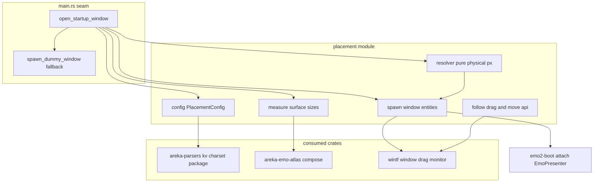
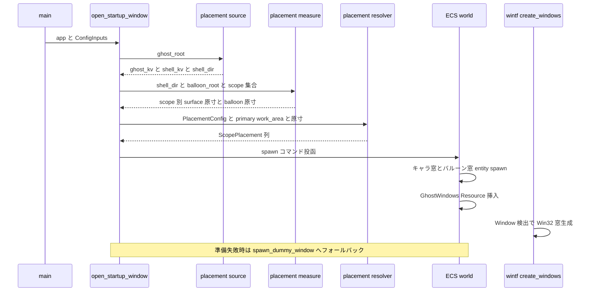
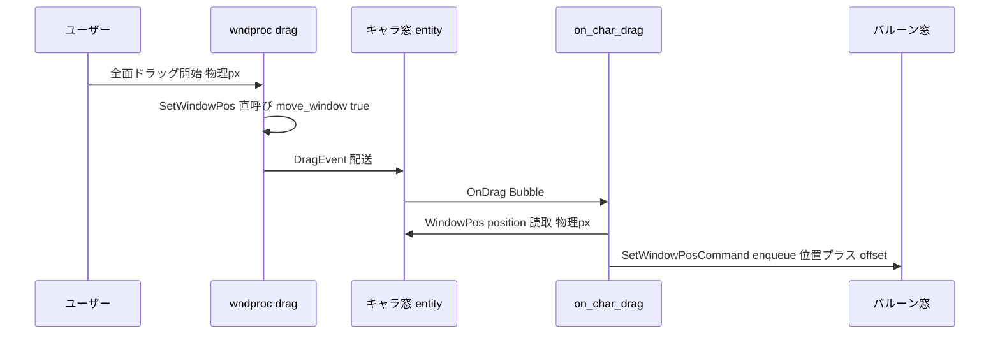

# 技術設計書: areka-P0-window-placement

## Overview

**Purpose**: 本機構は ⓪ ghost（ゴーストエンジン）が所有する「窓配置」を実装で埋める。ゴースト定義（ghost/shell descript の KV）とスコープ数から**キャラ窓（scope0 本体＋scope1 相方）と各スコープ対応のバルーン窓**を生成し、ukadoc 準拠の `seriko.alignmenttodesktop` 4 層カスケードで既定位置を解決してプライマリモニタの work area 基準に配置し、全面ドラッグ（バルーン追従含む）を提供する。

**Users**: M-boot 統合（emo2-boot）が生成済み Window entity を受け取り `EmoPresenter` を装着する。将来の他アクター（sakura 発 `\![move]`・二人立ち連動）が UI スレッド上の窓移動関数を呼ぶ。

**Impact**: `crates/areka/src/main.rs` の replace-me シーム `open_startup_window` のダミー窓を本物のゴースト窓生成へ置き換える。2026-07-05 リジェクト（物理 px／論理 DIP の単位混在→窓沈み・ドラッグ二重スケール消失）の再発防止として、**座標単位契約を本書冒頭で確定し、配置パイプラインを物理 px 単一通貨に固定**する。

### Goals

- ゴースト定義から窓数を決定しキャラ窓×N＋バルーン窓×N を生成する（ハードコード禁止）
- `seriko.alignmenttodesktop` カスケードの純粋 resolver（DPI パラメタ化単体テスト可能）で既定位置を解決する
- 実 DPI（per-monitor v2・dpi≠96）で既定位置出現・全面ドラッグ・バルーン追従が破綻しないこと（受け入れ必達）
- 生成窓を「スコープ×種別」キーで後続（emo2-boot）へ引き渡す
- 窓移動を UI スレッド上の公開関数として切り出す

### Non-Goals

- 位置永続化 `ghost.dat`・最終表示位置の記憶／復元（position-persist・M-life の領分、2.11）
- 二人立ちの surface 連動・本格結線（M-dual）／`\![move]` の発行側（sakura-dialogue-tags）
- バルーンの正式配置規則（balloon 表示系の後続。本ユニットは暫定 offset のみ、4.4）
- surface 描画・合成の中身（emo-surface）／`EmoPresenter` の装着呼出し・実 sink 差し替え（emo2-boot、6.3）
- `seriko.zorder`／`seriko.sticky-window` の実挙動（emo2 未使用＝シームのみ、5.2）

## 座標単位契約（Approach 0・実装前確定・本設計の正本）

2026-07-05 リジェクトの直接原因（`Monitor.work_area`/`WindowPos`＝物理 px と `BoxStyle` Px＝論理 DIP の混在演算・drag の DPI 再スケール二重変換）を型と規約で排除する。**以下の契約は本 spec の全コードが従う正本であり、違反はレビューでエラー扱いとする**（3.2/3.3）。

### wintf 各型の単位（実シンボル確認済み・research.md 突合）

| 型 / API | 単位 | 所在 | 備考 |
|---|---|---|---|
| `Monitor.bounds` / `Monitor.work_area` | **物理 px**（画面座標系・RECT） | `wintf/src/ecs/window/monitor.rs` | `rcWork`＝タスクバー除外。`dpi: u32`・`is_primary` 併載 |
| `WindowPos.position` / `WindowPos.size` | **物理 px**（クライアント領域基準） | `wintf/src/ecs/window/window_pos/` | `to_window_coords_for_creation` が実 DPI で `AdjustWindowRectExForDpi` 変換。**WS_POPUP 枠なし窓では枠加算ゼロ＝与えた物理 px がそのまま窓矩形**。`position=None` は `CW_USEDEFAULT` |
| `DraggingState.drag_start_pos` / `initial_inset` | **物理 px** | `wintf/src/ecs/drag/mod.rs` | doc 明記 |
| `DragConstraint.min_x/max_x/min_y/max_y` | **物理 px** | 同上 | `apply(x,y)` はクランプのみ・スケール変換なし |
| `DragConfig.threshold` | 物理 px（既定 5） | 同上 | `move_window=true` で wndproc が `SetWindowPos` 直呼び（＝物理 px 一貫） |
| `BoxStyle`（taffy `Dimension::Px`） | **論理 DIP** | `wintf/src/ecs/layout/box_style.rs` | **本 spec の窓 entity では使用禁止**（下記規約 U2） |
| `DPI` Component | 変換提供者（`scale_x/y`・`to_logical_*`・`to_physical_*`） | `wintf/src/ecs/window/dpi.rs` | Window entity 専用。half-away-from-zero 丸め |
| descript 座標値（`defaultx`/`defaultleft`/`defaulttop` 等） | **物理 px 扱い**（M1） | ghost/shell descript.txt | `seriko.dpi`（shell）／`dpi`（balloon）は 96 素通し（DD11）＝ surface 原寸 px ≡ 物理 px |

### 規約（U1〜U5）

- **U1（単一通貨）**: 配置パイプライン（config → resolver → spawn → drag/follow → move API）の座標・寸法は**すべて物理 px**。resolver の入出力に論理 DIP は登場しない。
- **U2（BoxStyle 禁止）**: 本 spec が生成する窓 entity に `BoxStyle` を付けない。窓クライアント寸は surface 原寸（物理 px）を `WindowPos.size` へ直渡しする（emo-present の DPI 表示契約と同一。taffy 非経由）。
- **U3（変換の局在）**: 論理値が必要になった場合（M1 では存在しない）は `DPI` Component の `to_physical_*`/`to_logical_*` のみで変換し、`96` や `dpi/96.0` の手書き演算を書かない。
- **U4（drag 非介入）**: ドラッグは wintf の `DragConfig { move_window: true }` に委ね、配置側でドラッグ座標を再スケールしない（07-05 の二重スケールの再発防止）。バルーン追従は物理 px の固定 offset 加算のみ。
- **U5（検証）**: resolver は純粋関数とし、DPI をパラメタ化（96／120／144／192）した単体テストで「出力が入力の物理 px のみに依存し隠れた変換を持たない」ことを固定する（3.4）。受け入れは実 DPI（≠96）実行の証跡を必達とする（3.5）。

## ukadoc 配置キー正典表（キー×所在×優先度×有効条件）

design 着手時に ukadoc MCP（`descript_ghost`／`descript_shell`／`descript_balloon`／sakura script）を `get_doc`/`search_docs` で総ざらいした結果（2026-07-10・詳細ログは research.md）。**カスケード優先度の正典**: ゴースト側全体 ＜ ゴースト側スコープ個別 ＜ シェル側全体 ＜ シェル側スコープ個別（ukadoc 明記・2.3 と一致）。スコープ別プレフィックスは ghost/shell とも **`sakura.`（scope0）／`kero.`（scope1）／`char*.`（2 人目以降）**（research.md ドリフト所見 #1 の解消——`char0/char1` 系ではなく `sakura`/`kero` が正典。`char0`/`char1` は de-facto 別名として寛容受理のみ）。

| キー | 所在 | 優先度（カスケード層） | 有効条件 | 正典値域・意味 | M1 挙動 |
|---|---|---|---|---|---|
| `seriko.alignmenttodesktop` | ghost descript | 第 1 層（最弱）・**既定 bottom** | 常時 | 方向: `top`/`bottom`/`left`/`right`/`free`（`\![set,alignmenttodesktop,方向]` の値域より。別綴 `alignmentondesktop` あり） | `bottom`・`free` は実挙動、他はシーム受理（2.8・DD9） |
| `(sakura\|kero\|char*).seriko.alignmenttodesktop` | ghost descript | 第 2 層 | 常時 | 同上（スコープ個別） | 同上 |
| `seriko.alignmenttodesktop` | shell descript | 第 3 層 | 常時 | 同上 | 同上 |
| `(sakura\|kero\|char*).seriko.alignmenttodesktop` | shell descript | 第 4 層（最強） | 常時 | 同上 | 同上 |
| `(sakura\|kero\|char*).defaulttop` | ghost／shell descript | スコープ別 2 層（ghost＜shell） | **`alignmenttodesktop=free` のときのみ有効**（ukadoc 明記） | ディスプレイ上のデフォルト Y 座標 | `free` で Y へ適用（2.6）。`bottom` では無視（2.4）。`defaulty` を de-facto 別名として寛容受理（2.7） |
| `(sakura\|kero\|char*).defaultleft` | ghost／shell descript | 同上 | 有効条件の明記なし | ディスプレイ上のデフォルト X 座標 | X スロットへ寛容受理（2.7）。同層に `defaultx` があれば `defaultx` 優先（emo2 実使用側・DD3） |
| `(sakura\|kero\|char*).defaultx` | ghost／shell descript | 同上 | 常時 | **正典は「画像ベース X 座標」（既定＝画像中央）**＝サーフェス基準点のアンカー指定（propertysystem `currentghost.scope(ID).x` が「基準点＝通常サーフェス中央下・defaultx で設定可能」と記載） | **要件確定済み解釈（2.10・開発者確認・de-facto）**: `bottom` では「基準位置からの左方向オフセット」（scope0 基準＝work area 右端密着、`defaultx=0`＝右端密着）。正典アンカー意味論は将来シームとして research.md に記録（DD2） |
| `(sakura\|kero\|char*).balloon.alignment` | ghost／shell descript | スコープ別 2 層 | 常時 | 吹き出しの左右位置情報（**スコープごとにバルーンが 1 枚存在する正典根拠**・1.2） | 転記・暫定 offset の左右決定にのみ使用（`left`/`right`・DD7）。正式規則は balloon 表示系へ |
| `(sakura\|kero).balloon.offsetx/offsety` | shell descript | — | 常時 | バルーン基準位置からの調整（emo-present donor が先行実装） | 暫定 offset へ加算（emo2 は未使用＝None） |
| `seriko.zorder,スコープID,...` | shell descript | — | SSP 2.4+ | `\![set,zorder]` の descript 版 | **シームのみ**（転記・実挙動なし・5.2） |
| `seriko.sticky-window,スコープID,...` | shell descript | — | SSP 2.4+ | `\![set,sticky-window]` の descript 版 | **シームのみ**（5.2） |
| `seriko.dpi,推奨DPI` | shell descript | — | SSP 2.7.21+・省略時 96 | シェル推奨 DPI（96/120/144/168/192） | **96 素通しシーム**（転記のみ・DD11。表示スケールは emo 側の将来領分） |
| `dpi,推奨DPI` | balloon descript | — | SSP 2.7.21+・省略時 96 | バルーン推奨 DPI | **96 素通しシーム**（DD11。バルーン窓寸は balloon surface 原寸物理 px） |

**emo2 実測値による検証行**（`crates/pilot/examples/shiori-host-32/fixtures/emo2/shell/master/descript.txt`・ghost descript には配置系キーなし）:

| 検証行 | emo2 実測 | 本設計での解決結果 |
|---|---|---|
| `seriko.alignmenttodesktop,bottom`（shell 全体＝第 3 層） | ghost 側指定なし → 第 3 層が勝ち `bottom` | 両スコープとも Y＝work area 下端固定・`defaulttop` 無視 |
| `sakura.defaultx,0`（shell スコープ別） | X オフセット 0 | scope0: `x = work_area.right − w0 − 0`（右端密着） |
| `kero.defaultx,0`（shell スコープ別） | X オフセット 0 | scope1: `x = x0 − w0 − 0`（本体のサーフェス幅ぶん左・2.9） |
| `sakura.balloon.alignment,left` ／ `kero.balloon.alignment,right` | バルーン左右 | scope0 バルーン＝キャラ窓左側、scope1 バルーン＝キャラ窓右側（暫定 offset の向き） |
| `kero.*` キー存在＋ghost `kero.name` | スコープ検出シグナル | スコープ数 2（キャラ窓 2＋バルーン窓 2＝計 4 窓） |

## Boundary Commitments

### This Spec Owns

- `crates/areka/src/placement/` 配下の全モジュール（構成読込・カスケード解決・純粋 resolver・採寸アダプタ・窓 entity 組立・ドラッグ追従・窓移動公開関数）
- `open_startup_window` シームの中身（署名変更を含む）と main.rs のダミー窓退役（フォールバック残置）
- 生成窓の識別契約: `CharWindowMarker{scope}`／`BalloonWindowMarker{scope}`／`GhostWindowMarker` Component と `GhostWindows` Resource（スコープ×種別キーの正本）
- 既定 z-order（非 topmost＝`WS_EX_TOPMOST` を付けない）
- 実 DPI 受け入れ example `crates/areka/examples/window-placement.rs`

### Out of Boundary

- `crates/areka-emo-present`／`crates/areka-parsers` の**改変**（並走保護規約。両クレートは消費のみ）
- `crates/wintf` の改変（`EcsWindowFactory`・drag 機構・clickthrough 機構はそのまま使う）
- `EmoPresenter::attach_target` の呼出し・実 sink 差し替え（emo2-boot）。**main.rs シームの窓は emo2-boot が装着するまで描画内容なし（WUC 合成で不可視）が正しい状態**
- 位置の永続化・復元（position-persist）／バルーン正式配置規則／`\![move]` 発行側／メニュー・chrome
- `GhostRuntime`／`MountModel` の公開面変更（`crates/areka-ghost` は不改変。placement は `areka_parsers::package::resolve` を自前で呼ぶ・DD4）

### Allowed Dependencies

- wintf（`Monitor`/`enumerate_monitors`/`WindowPos`/`WindowStyle`/`DragConfig`/`OnDrag`/`SetWindowPosCommand`/`HitTest`/`ClickThroughRegistryHandle`/`DPI`）— 消費のみ
- areka-parsers（`charset::decode`・`kv::parse_kv`・`package::resolve`）— 消費のみ・改変禁止
- areka-emo-atlas／areka-emo-compose — **通常依存へ昇格**（採寸のため・DD5）。areka-emo-present は example（dev-dependency）のみ
- bevy_ecs／windows／tracing（既存 workspace 依存）。**tokio 禁止・新規外部クレート追加なし**

### Revalidation Triggers

- `GhostWindows`／marker Component の形状変更（emo2-boot の取得コードに直結・6.1/6.2）
- `open_startup_window` の署名再変更（app-shell 由来シームの契約）
- 窓 entity の必須コンポーネント構成変更（`HitTest`／ex_style——clickthrough・αマスク挙動に直結）
- `move_window_to` の署名変更（UI 配送ブリッジ結線＝後続の呼び出し契約・7.1）
- 座標単位契約（U1〜U5）のいかなる緩和

## Architecture

### Architecture Pattern & Boundary Map

**Selected pattern**: research.md Option C（ハイブリッド）。**純粋核（config＋resolver＝決定論テスト密）と ECS 結線（measure＋spawn＋follow＝実 DPI 手動観測）を分離**し、検証戦略の差を構造に反映する。resolver の純粋関数化は 3.4 の要請で実質必須。



**依存方向（強制）**: `resolver`（純粋・std のみ）← `config`（areka-parsers のみ）← `measure`（emo-atlas/compose）← `spawn`／`follow`（wintf/bevy_ecs）← `main.rs seam`。左のモジュールは右へ import しない。resolver は wintf 型を import せず、自前の物理 px 値型（`RectPx`/`PointPx`/`SizePx`）で閉じる（単体テストが wintf 非依存で回る）。

### 主要設計判断（DD）

| # | 判断 | 根拠 |
|---|---|---|
| DD1 | 配置パイプラインは物理 px 単一通貨（U1〜U5）。resolver 署名に DPI・論理 DIP を持ち込まない | 07-05 リジェクト再発防止。emo-present の DPI 表示契約（surface 原寸物理 px 直渡し）の先行実例 |
| DD2 | `defaultx` は要件確定済み解釈（2.10: bottom 時は基準位置からの左方向オフセット・0＝密着）で実装。ukadoc 正典の「画像ベース X（アンカー）」意味論は転記・記録のみの将来シーム | 要件討議 2026-07-10 で開発者確定（再オープンしない）。正典との差異は research.md に記録済み |
| DD3 | scope n≥1 の `defaultx` は「自スコープの基準位置（＝前スコープの左隣）からの左方向オフセット」と定式化 | 2.9（相方は本体の surface 幅ぶん左）と 2.10（defaultx=0＝密着）を同時に満たす唯一の自己整合解（kero.defaultx,0 が右端に戻ると 2.9 と矛盾） |
| DD4 | placement は `package::resolve` を自前で呼び shell dir を解決、descript KV は `charset::decode`＋`kv::parse_kv` で再読込（`GhostRuntime.mount` は private のまま触らない） | emo-present の `read_balloon_offset` と同型の前例。areka-ghost 不改変で層境界を保つ。resolve は決定的・軽量 |
| DD5 | areka-emo-atlas／-compose を areka の**通常依存へ昇格**し、`measure` が surface（scope0=id 0・scope1=id 10）と balloon surface0 を bind なし合成して原寸を得る | 窓寸＝surface 原寸（物理 px）の唯一の正確な供給源。emo2-boot が後で同依存を bin へ持ち込むことが確定しており前倒しに過ぎない。PNG 直読は合成外形と乖離し得るため棄却 |
| DD6 | スコープ数は descript から導出: scope1 は「ghost `kero.name` あり **or** shell に `kero.*` キーあり」で存在、`char{n}.*`（n≥2）キーは scope n を追加（構造は N 対応・emo2 は 2） | 1.3（ハードコード禁止）を構成入力で満たす最小規則。emo2 で決定論的に 2 になる |
| DD7 | バルーン暫定 offset は初期配置の幾何から算出（`balloon.alignment` left→右端＝キャラ左端／right→左端＝キャラ右端・上端揃え・`balloon.offsetx/y` 加算）。**固定定数 (335,0) 等は持ち込まない**。offset は配置時に初期確定（以後の更新は DD16 のユーザー調整記憶のみ） | 1.5／4.4。emo-present `compute_balloon_pos` donor の一般化 |
| DD8 | **M1 は `DragConstraint` を付与しない**（無制約＝仮想デスクトップ全域ドラッグ可）。制約を付ける場合の算出規則（全モニタ和・物理 px）は純粋ヘルパ `virtual_desktop_union` として提供・テストする | 4.5 を直接満たし、07-05 の単一モニタ誤釘付けの欠陥面そのものを消す。4.6 は条件付き要件（If 適用するとき）＝規則とヘルパで担保 |
| DD9 | `alignmenttodesktop` の `top`/`left`/`right`/未知値は enum シーム（`Alignment::Seam(String)`）として受理し、実挙動は既定 `bottom` と同じ＋`warn!` ログ | 2.8（最小実装＋拡張シーム）。emo2 は bottom のみ使用 |
| DD10 | `free` の座標原点は**プライマリモニタ work area 左上**（`x = work_area.left + defaultleft`・`y = work_area.top + defaulttop`）。未指定成分は bottom 相当値へフォールバック | 2.6／2.12 と整合。emo2 は free 未使用のため受け入れに影響せず、決定論テストで意味論を固定 |
| DD11 | `seriko.dpi`（shell）／`dpi`（balloon）は転記のみの 96 素通しシーム。窓寸は常に surface／balloon surface 原寸（物理 px） | brief 追記事項の 1 判断。表示スケール本体は emo 側の将来領分 |
| DD12 | 解決済みキャラ窓位置は work area 内へクランプ（`left ≤ x ≤ right−w`・`top ≤ y ≤ bottom−h`）。バルーンはクランプせずログのみ | 3.1「画面内に正しく出現」の安全弁。バルーンは暫定規則ゆえ介入最小 |
| DD13 | 既定 z-order: ex_style は `WS_EX_LAYERED\|WS_EX_TOOLWINDOW` のみ（donor の `WS_EX_TOPMOST` を外す）。`zorder`/`sticky-window` は `PlacementConfig` へ転記のみ | 5.1／5.2。SSP de-facto（既定 topmost でない） |
| DD14 | placement 準備（resolve→KV→採寸→解決）が失敗したら `spawn_dummy_window` へフォールバックして骨格起動を維持（log-first・error!／benign は warn!） | ghost-setup の benign 継続方針と整合。sandbox（fixture 不在）で main が壊れない |
| DD15 **(v2)** | **bottom 吸着ドラッグ（4.7・2026-07-11 追加承認／同日 v2 改訂）**: ~~wndproc 移動後の事後再釘付け~~（v1・実機で不成立と立証: `move_window=true` の wndproc がドラッグ開始スナップショット＋カーソル差分で毎 WM_MOUSEMOVE 位置を再主張するため、事後補正は毎サイクル振動し最終 DragEvent 欠落で必ず非釘付け位置に確定する）→ **v2: ドラッグ座標管理と実ウィンドウ位置算出のトレイト分離＋単一ライター**（開発者指示 2026-07-11）。(1) `DragPositionPolicy` トレイト＝「生ドラッグ座標（カーソル−inset）→実窓位置」の純粋写像。`BottomSnapPolicy` 実装は X 素通し・Y＝`work_area_for_window(MonitorSnapshot, 窓矩形)` の `bottom − h`（live 算出ゆえモニタ跨ぎ再吸着が成立）。(2) `Bottom`/`Seam` スコープのキャラ窓は `DragConfig { move_window: false }`＝wndproc は窓を動かさず、`on_char_drag` が DragEvent ごとにポリシー適用済み座標を**一度だけ**書く（反映段階で既に正しい座標＝競合ライター不在・振動が原理的に不可能）。(3) DragEnd ハンドラで最終カーソル位置を同写像で適用（accumulator 先行クリアによる最終 DragEvent 欠落の穴埋め）。(4) `Free` スコープ・バルーン窓は従来どおり `move_window: true`。(5) `DragConstraint` は不採用のまま確定（wintf の constraint はドラッグ開始時スナップショット凍結で mid-drag 更新不能と実証＝DD8 の判断を追認）。(6) ハードニング: drag ハンドラ冒頭に target==自 entity ガード。吸着対象はキャラ窓のみ（バルーンは 4.8 で単独移動） | ukadoc 正典「上または下に吸着した場合、上下方向へのドラッグ移動ができなくなる」。v1 の欠陥は 2026-07-11 実機受け入れで発見（debug 調査 3/3 決定論再現・trace ログで機構立証）。v2 アーキテクチャは開発者指示（トレイト分離・反映段階での正座標確定） |
| DD16 | **バルーン相対位置の記憶（4.8・2026-07-11 追加承認）**: バルーン窓に `OnDrag` ハンドラ `on_balloon_drag` を付与し、単独ドラッグ中に「そのバルーンを参照する `BalloonFollow` を持つキャラ窓」を query 走査（窓数は少数）で逆引きして `BalloonFollow.offset = balloon_pos − char_pos` を更新する。以後の `on_char_drag`／`move_window_to` は更新後 offset で追従（既存консumer は無改変で新 offset を読む）。記憶はセッション内のみ・`ghost.dat` 永続化は M-life。初期 offset の幾何規則（P5）は暫定のまま＝4.4 不変 | SSP de-facto（バルーン位置調整の記憶）。目視受け入れ（2026-07-11）で開発者指摘・「正しく実装」指示 |

### Technology Stack

| Layer | Choice / Version | Role in Feature |
|---|---|---|
| UI 基盤 | wintf 0.0.1（WUC 合成・entity spawn→`create_windows` system） | 窓生成・ドラッグ・モニタ列挙・clickthrough（すべて消費のみ） |
| パーサ | areka-parsers（charset/kv/package） | descript 読込（既定 Ansi・charset 宣言優先）・マウント解決 |
| 採寸 | areka-emo-atlas／areka-emo-compose（**通常依存へ昇格**） | surface 原寸（物理 px）の合成採寸 |
| ECS | bevy_ecs 0.18 | marker Component・`GhostWindows` Resource・OnDrag 結線 |
| ランタイム | Rust 2024・windows 0.62.2・tokio 禁止 | UI スレッド固定（窓操作は UI スレッド専有・7.2） |

## File Structure Plan

```
crates/areka/
├── Cargo.toml                        # 変更: areka-emo-atlas / areka-emo-compose を [dependencies] へ昇格
├── src/
│   ├── main.rs                       # 変更: mod placement; open_startup_window(app, &cfg) へ署名変更・
│   │                                 #       placement 準備成功→本物窓 spawn／失敗→ダミー窓フォールバック・
│   │                                 #       smoke 自動 close の標的を GhostWindowMarker（＋ダミー）へ拡張
│   └── placement/
│       ├── mod.rs                    # モジュール公開面: prepare_ghost_windows・GhostWindows・move_window_to 等の再輸出
│       ├── resolver.rs               # 純粋 resolver（物理 px 値型 RectPx/PointPx/SizePx・カスケード適用・
│       │                             #   scope 相対配置・クランプ・balloon 暫定 offset・virtual_desktop_union）
│       │                             #   ＋ DPI パラメタ化単体テスト（96/120/144/192）
│       ├── config.rs                 # descript KV → PlacementConfig（4 層カスケード・両表記寛容・scope 検出・
│       │                             #   zorder/sticky/dpi 転記シーム）。入力は BTreeMap×2（純粋）
│       ├── source.rs                 # I/O 層: package::resolve → ghost/shell descript.txt 読込
│       │                             #   （charset::decode 既定 Ansi → kv::parse_kv）→ (ghost_kv, shell_kv)
│       ├── measure.rs                # I/O 層: emo-atlas/compose で surface 原寸採寸（scope0=id0・scope1=id10・
│       │                             #   balloon=balloon_root の surface0）。失敗は Err（log-first）
│       ├── spawn.rs                  # ECS 組立: キャラ窓／バルーン窓 entity spawn（markers・DragConfig・
│       │                             #   OnDrag・OnPointerPressed 終了・非 topmost ex_style・HitTest::none）・
│       │                             #   GhostWindows Resource 挿入・clickthrough 登録 system
│       └── follow.rs                 # BalloonFollow Component・on_char_drag ハンドラ・
│       │                             #   pub fn move_window_to（R7 公開 API・物理 px・UI スレッド）
├── examples/
│   └── window-placement.rs           # 新規: 実 DPI 受け入れ example（emo2 実 surface×2 スコープ＋balloon×2 を
│                                     #   placement 経由で配置し EmoPresenter 装着・手順 rustdoc 付き）
```

### Modified Files

- `crates/areka/src/main.rs` — シーム差し替え（上記）。`spawn_dummy_window`／`DummyWindowMarker` は**フォールバック経路として残置**（退役ではなく降格・DD14）
- `crates/areka/Cargo.toml` — emo 2 クレートの通常依存昇格（DD5）

**不改変（保護規約）**: `crates/areka-emo-present`・`crates/areka-parsers`・`crates/wintf`・`crates/areka-ghost`。並走中 `areka-P0-emo-text-layer` とはファイル交差なし（あちらは areka-emo-present／areka-parsers、こちらは crates/areka のみ。examples/ への新規追加は双方可）。

## System Flows

### 起動時の窓生成フロー（main.rs シーム）



フロー上の決定: (1) I/O（resolve・KV 読込・採寸・モニタ列挙）は `open_startup_window` 内で同期実行し、**Send な準備済みデータ**（`PreparedPlacement`）だけを ECS コマンドへ渡す。(2) work area は `enumerate_monitors()` の `is_primary` モニタから取得（2.12）。(3) 窓の実生成は既存の entity-spawn → `create_windows` system 経路（`EcsWindowFactory` は `pub(crate)`＝直接呼ばない。research.md ドリフト所見の明確化）。

### ドラッグ追従フロー



決定: キャラ窓自体の移動は wintf wndproc（物理 px・再スケールなし・U4）。追従は `BalloonFollow.offset`（物理 px・配置時確定）の加算のみ。`DragConstraint` は付与しない（DD8）＝全モニタ移動可（4.5）。

## Requirements Traceability

| Requirement | Summary | Components | Interfaces / Flows |
|---|---|---|---|
| 1.1 | スコープ数ぶんのキャラ窓生成 | config（scope 検出）・spawn | `PlacementConfig.scopes`・起動フロー |
| 1.2 | スコープごとのバルーン窓 1 枚 | spawn | `ScopeWindows { char_window, balloon_window }`・正典表 balloon.alignment 行 |
| 1.3 | 窓数ハードコード禁止 | config | DD6（kero/char* シグナル導出） |
| 1.4 | 起動窓シームでダミー窓置換 | main.rs seam | `open_startup_window(app, &cfg)`・DD14 フォールバック |
| 1.5 | デモ固定座標の持ち込み禁止 | resolver・follow | DD7（offset は幾何から算出）・テスト T-C4 |
| 2.1 | work area 基準の既定位置 | resolver | `resolve_placement(cfg, work_area, sizes)` |
| 2.2 | 未指定時の既定 bottom | config・resolver | カスケード既定値（正典表第 1 層） |
| 2.3 | 4 層カスケード解決 | config | `build_placement_config`・正典表 |
| 2.4 | bottom 時 Y 下端固定・defaulttop 無視 | resolver | 配置規則 P1 |
| 2.5 | defaultx／defaultleft の X 反映 | config・resolver | 配置規則 P2 |
| 2.6 | free 時 defaulttop/defaultleft 適用 | resolver | 配置規則 P3・DD10 |
| 2.7 | 両表記の寛容受理 | config | X/Y スロット統合（DD3 優先順） |
| 2.8 | 未使用値のシーム受理 | config・resolver | `Alignment::Seam`・DD9 |
| 2.9 | scope0 右下・scope1 は surface 幅ぶん左 | resolver | 配置規則 P2（連鎖基準位置） |
| 2.10 | defaultx＝右端からの左方向オフセット | resolver | 配置規則 P2・DD2/DD3 |
| 2.11 | 最終位置の記憶・復元を所有しない | 全体 | Non-Goals・resolver は既定位置のみ返す |
| 2.12 | 初期位置はプライマリモニタ work area | main.rs seam・resolver | `enumerate_monitors()`→`is_primary` |
| 3.1 | 実 DPI で両スコープが既定位置に出現 | example | 受け入れプロトコル（Testing）・DD12 クランプ |
| 3.2 | 物理／論理の混在演算禁止 | 全体 | 座標単位契約 U1〜U4 |
| 3.3 | 入出力単位一貫・二重スケール禁止 | resolver・follow | U1/U4・DD8 |
| 3.4 | DPI パラメタ化純関数テスト | resolver | テスト T-R 群（96/120/144/192） |
| 3.5 | dpi=96 のみの緑は不合格 | example・受け入れ | 受け入れプロトコル（実 DPI 証跡必達） |
| 4.1 | 全面ドラッグ（修飾キー不要） | spawn | `DragConfig::default()`＝move_window true・αマスクヒット |
| 4.2 | ドラッグ中バルーン追従 | follow | `on_char_drag`＋`BalloonFollow` |
| 4.3 | 実 DPI で消失なし・一貫移動量 | follow・example | U4・受け入れプロトコル |
| 4.4 | 暫定 offset のみ（正式規則非所有） | follow | DD7・静的 offset |
| 4.5 | 全モニタドラッグ・単一モニタ閉じ込め禁止 | spawn | DD8（DragConstraint 非付与） |
| 4.6 | 制約適用時は全モニタ和・物理 px | resolver | `virtual_desktop_union`＋テスト T-R7 |
| 5.1 | 既定 z-order 非 topmost | spawn | ex_style から `WS_EX_TOPMOST` 除外（DD13） |
| 5.2 | zorder/sticky-window はシームのみ | config | 転記フィールド（実挙動なし） |
| 6.1 | 窓 entity の取得可能な公開 | spawn | `GhostWindows` Resource＋戻り値 |
| 6.2 | スコープ×種別キーで識別 | spawn | `char_window(scope)`/`balloon_window(scope)`・markers |
| 6.3 | attach は emo2-boot の領分 | 全体 | Boundary（placement は EmoPresenter を import しない） |
| 7.1 | 窓移動を UI スレッド関数で公開 | follow | `move_window_to(world, entity, x, y)` |
| 7.2 | 窓操作の UI スレッド専有 | spawn・follow | `&mut World` 経由＝UI スレッド tick 内でのみ実行 |
| 7.3 | actor 非依存・ブリッジ結線は後続 | follow | areka-actor 非依存（署名に channel なし） |

## Components and Interfaces

| Component | Domain/Layer | Intent | Req Coverage | Key Dependencies | Contracts |
|---|---|---|---|---|---|
| placement::resolver | 純粋核 | 物理 px 既定位置解決 | 2.1–2.10, 2.12, 3.2–3.4, 4.6 | なし（std のみ・P0） | Service |
| placement::config | 純粋核 | KV→構成（カスケード・scope 検出・シーム転記） | 1.1, 1.3, 2.2, 2.3, 2.5, 2.7, 2.8, 5.2 | areka-parsers 型（P0） | Service |
| placement::source | I/O | descript 読込（mount 再解決＋KV 化） | 1.1, 2.3 | areka-parsers（P0） | Service |
| placement::measure | I/O | surface／balloon 原寸採寸 | 2.9, 3.2 | areka-emo-atlas/compose（P0） | Service |
| placement::spawn | ECS 結線 | 窓 entity 組立・公開・登録 | 1.1, 1.2, 1.5, 4.1, 4.5, 5.1, 6.1, 6.2, 7.2 | wintf/bevy_ecs（P0） | Service / State |
| placement::follow | ECS 結線 | 追従・窓移動公開 API | 4.2–4.4, 7.1–7.3 | wintf（P0） | Service |
| main.rs seam | 統合 | 準備→spawn 投函・フォールバック | 1.4, 2.12, 3.1 | placement（P0） | — |
| examples/window-placement.rs | 受け入れ | 実 DPI 観測（本番ゴースト） | 3.1, 3.5, 4.3 | placement＋areka-emo-present（P1・dev） | — |

### 純粋核

#### placement::resolver

| Field | Detail |
|---|---|
| Intent | descript 由来構成＋work area＋surface 原寸（すべて物理 px）から各スコープのキャラ窓・バルーン窓の既定位置を純粋に解決する |
| Requirements | 2.1, 2.4, 2.6, 2.9, 2.10, 2.12, 3.2, 3.3, 3.4, 4.6 |

**Responsibilities & Constraints**
- wintf 非依存（自前値型で閉じる）・I/O なし・`f64`/乱数/時刻なし＝完全決定論
- 単位は物理 px のみ（U1）。DPI は署名に登場しない（テストが DPI 別の物理入力を与えて検証する）

**Service Interface**

```rust
/// 物理 px 値型（resolver ローカル・wintf 非依存）
pub struct RectPx { pub left: i32, pub top: i32, pub right: i32, pub bottom: i32 }
pub struct PointPx { pub x: i32, pub y: i32 }
pub struct SizePx { pub w: i32, pub h: i32 }

/// スコープ 1 体ぶんの採寸入力（物理 px）
pub struct ScopeInput { pub scope: usize, pub char_size: SizePx, pub balloon_size: SizePx }

/// 解決済み配置（物理 px・スクリーン座標）
pub struct ScopePlacement {
    pub scope: usize,
    pub char_pos: PointPx,
    pub char_size: SizePx,
    pub balloon_pos: PointPx,
    pub balloon_size: SizePx,
    /// balloon_pos - char_pos（追従用に配置時確定・物理 px）
    pub balloon_offset: PointPx,
}

/// 既定位置解決（純粋関数・パニックしない・入力順のまま返す）
pub fn resolve_placement(
    cfg: &PlacementConfig,
    work_area: RectPx,            // プライマリモニタ work area（物理 px・2.12）
    scopes: &[ScopeInput],
) -> Vec<ScopePlacement>;

/// 全モニタ bounds の和（仮想デスクトップ・物理 px）。M1 では DragConstraint を
/// 付与しないため未結線だが、制約を適用する将来の消費側の正規算出規則（4.6）
pub fn virtual_desktop_union(monitor_bounds: &[RectPx]) -> Option<RectPx>;
```

**配置規則（正本）**
- **P1（Y・bottom）**: `alignment=Bottom|Seam(_)` のとき `y = work_area.bottom − h`。`defaulttop`/`defaulty` は無視（2.4）。`Seam` は `warn!` 相当をログ層（呼び出し側）へ委ねる印を返す
- **P2（X・bottom・連鎖基準）**: 基準位置 `base_x(0) = work_area.right − w(0)`、`base_x(n≥1) = char_x(n−1) − w(n−1)`（2.9・本体の surface 幅ぶん左）。`char_x(n) = base_x(n) − defaultx(n).unwrap_or(0)`（左方向オフセット・0＝基準密着・2.10・DD3）
- **P3（free）**: `char_x = work_area.left + defaultleft`／`char_y = work_area.top + defaulttop`（DD10）。未指定成分は P1/P2 の bottom 相当値へフォールバック（2.6）
- **P4（クランプ）**: キャラ窓のみ `x ∈ [left, right−w]`・`y ∈ [top, bottom−h]` へクランプ（DD12）
- **P5（バルーン暫定 offset）**: `balloon.alignment=left（既定）` → `balloon_x = char_x − balloon_w`、`right` → `balloon_x = char_x + w`。`balloon_y = char_y`（上端揃え）。`balloon.offsetx/offsety` があれば加算（DD7・emo-present donor 一般化）。クランプなし
- Preconditions: `scopes` は scope 昇順・`work_area` は正矩形。Postconditions: 出力長＝入力長・`balloon_offset ≡ balloon_pos − char_pos`。Invariants: 出力は入力の物理 px の線形結合のみ（隠れたスケールなし）

#### placement::config

| Field | Detail |
|---|---|
| Intent | ghost/shell descript の生 KV から 4 層カスケードを解決し、スコープ検出・シーム転記込みの `PlacementConfig` を構築する |
| Requirements | 1.1, 1.3, 2.2, 2.3, 2.5, 2.7, 2.8, 5.2 |

**Service Interface**

```rust
/// alignmenttodesktop の解釈（2.8: 未使用値はシーム受理）
pub enum Alignment {
    Bottom,          // 既定（emo2 実使用）
    Free,            // defaultleft/defaulttop 有効（2.6）
    Seam(String),    // top/left/right/未知値: 転記保持・実挙動は Bottom と同じ＋警告
}

pub struct ScopeConfig {
    pub alignment: Alignment,             // 4 層カスケード解決済み（既定 Bottom）
    pub default_x: Option<i32>,           // defaultx > defaultleft（同層内）・shell > ghost（層間）
    pub default_y: Option<i32>,           // defaulty > defaulttop（同上）
    pub balloon_alignment: BalloonSide,   // left（既定）/ right（暫定 offset の向きにのみ使用）
    pub balloon_offset: Option<(i32, i32)>, // balloon.offsetx/offsety（両方あるときのみ）
}

pub enum BalloonSide { Left, Right }

pub struct PlacementConfig {
    /// 検出済みスコープ（0 起点・BTreeMap で昇順）。emo2 → {0, 1}
    pub scopes: BTreeMap<usize, ScopeConfig>,
    /// シーム転記（実挙動なし・5.2／DD11）
    pub zorder_raw: Option<String>,
    pub sticky_window_raw: Option<String>,
    pub shell_dpi_raw: Option<String>,
}

/// KV → 構成（純粋・パニックしない・数値化不能は None＋呼び出し側で warn）
pub fn build_placement_config(
    ghost_kv: &BTreeMap<String, String>,
    shell_kv: &BTreeMap<String, String>,
) -> PlacementConfig;
```

- **カスケード規則（正典表準拠）**: `alignment` は「ghost 全体 → ghost スコープ → shell 全体 → shell スコープ」の順に上書き（後勝ち＝第 4 層最強・2.3）。`default_x/y`・`balloon.*` はスコープ別キーのみ（shell が ghost に勝つ 2 層）
- **スコープ検出（DD6）**: scope0 常設。scope1 は ghost `kero.name` **or** shell の `kero.` 接頭キー存在。`char{n}.`（n≥2）キーで scope n 追加。`char0`/`char1` は `sakura`/`kero` の de-facto 別名として同スロットへ寛容受理（正典キーと衝突時は正典側優先）
- Invariants: 入力 KV を改変しない・未知キーを黙殺しない（転記 or debug ログ対象を返す）

### I/O 層

#### placement::source

| Field | Detail |
|---|---|
| Intent | `ghost_root` から shell dir を解決し、ghost/shell descript.txt を charset 対応で読み `(ghost_kv, shell_kv, shell_dir)` を返す |
| Requirements | 1.1, 2.3 |

```rust
pub struct DescriptSource {
    pub ghost_kv: BTreeMap<String, String>,
    pub shell_kv: BTreeMap<String, String>,
    pub shell_dir: PathBuf,
    pub titles: GhostTitles,
}
pub fn load_descript_source(ghost_root: &Path) -> Result<DescriptSource, PlacementError>;

/// 窓タイトルの正本（`MountModel.names` 由来・Win32 識別／デバッグ観測用）。
/// scope0 = `sakura.name`・scope1 = `kero.name`・scope n≥2 = `char{n}.name`（あれば）。
/// 欠落スコープは既定 `"areka"`（パニックしない・常に文字列を返す）
pub struct GhostTitles { /* BTreeMap<usize, String>（非公開・アクセサ経由） */ }
impl GhostTitles {
    pub fn title(&self, scope: usize) -> &str;  // 欠落時 "areka"
}
```

- 実装: `areka_parsers::package::resolve(ghost_root, DefaultEncoding::Ansi)` → `MountModel.shell.dir`／`shiori.dir` から各 `descript.txt` を bytes 読み → `charset::decode(bytes, Ansi)` → `kv::parse_kv`（DD4。SSP 既定 Ansi＝記憶 areka-descript-encoding。emo-present の `read_to_string` 直読より正しい入口）
- ghost descript 読取失敗は警告＋空 KV で継続（shell 側だけで emo2 は成立）。shell descript 読取失敗・resolve 失敗は `Err`（→シームがフォールバック・DD14）

#### placement::measure

| Field | Detail |
|---|---|
| Intent | 各スコープの初期 surface と balloon surface0 を bind なし合成し、原寸（物理 px）を得る |
| Requirements | 2.9, 3.2 |

```rust
pub struct MeasuredSizes { pub scopes: Vec<ScopeInput> }
pub fn measure_scope_sizes(
    shell_dir: &Path,
    balloon_root: &Path,
    scope_ids: &[usize],
) -> Result<MeasuredSizes, PlacementError>;
```

- 初期 surface id: scope0 → `0`、scope1 → `10`（ukadoc 正典: 相方既定サーフェス）、scope n≥2 → `10`（正典既定なし・warn 付き暫定）。合成失敗したスコープは scope0 の寸法で代替＋`warn!`（窓は生やす——寸法だけ暫定）
- balloon は `balloon_root` の surfaces を surface0 で採寸（emo-present donor `load_balloon_assets`→採寸合成と同経路）。**アセットは採寸後に破棄**する（`EmoWorld`/`AtlasTable` の所有・装着は emo2-boot の領分＝二重ロードは M1 の受容トレードオフとして research.md へ記録）

### ECS 結線層

#### placement::spawn

| Field | Detail |
|---|---|
| Intent | 解決済み配置から窓 entity を組み立て、識別子（markers・`GhostWindows`）を公開し、clickthrough 登録 system を提供する |
| Requirements | 1.1, 1.2, 1.5, 4.1, 4.5, 5.1, 6.1, 6.2, 7.2 |

**Contracts**: Service ／ State

```rust
/// スコープ×種別の識別 markers（6.2）
#[derive(Component)] pub struct CharWindowMarker { pub scope: usize }
#[derive(Component)] pub struct BalloonWindowMarker { pub scope: usize }
/// placement 生成窓の共通標識（smoke close・一括 despawn・clickthrough 登録の標的）
#[derive(Component)] pub struct GhostWindowMarker;

/// 後続（emo2-boot）への引き渡し正本（6.1/6.2）。Resource 挿入＋戻り値の両方で公開
#[derive(Resource, Clone, Debug)]
pub struct GhostWindows { /* BTreeMap<usize, ScopeWindows>（非公開・アクセサ経由） */ }
pub struct ScopeWindows { pub char_window: Entity, pub balloon_window: Entity }

impl GhostWindows {
    pub fn char_window(&self, scope: usize) -> Option<Entity>;
    pub fn balloon_window(&self, scope: usize) -> Option<Entity>;
    pub fn scopes(&self) -> impl Iterator<Item = usize> + '_;
}

/// bare World で動く組立（headless テスト可・spawn_dummy_window と同型）
pub fn spawn_ghost_windows(
    world: &mut World,
    placements: &[ScopePlacement],
    titles: &GhostTitles,          // ghost names 由来の窓タイトル（欠落時は既定文字列）
) -> GhostWindows;

/// Added<WindowHandle> で GhostWindowMarker 窓を αマスク clickthrough 機構へ登録
/// （emo-present donor register_click_through_windows の一般化）
pub fn register_ghost_windows_click_through(/* Query + Option<NonSend<ClickThroughRegistryHandle>> */);
```

- **窓 entity 構成（キャラ窓）**: `Name`＋`CharWindowMarker{scope}`＋`GhostWindowMarker`＋`Window{title}`＋`WindowStyle { style: WS_POPUP|WS_VISIBLE, ex_style: WS_EX_LAYERED|WS_EX_TOOLWINDOW }`（**`WS_EX_TOPMOST` なし**・5.1／DD13）＋`WindowPos { position: Some(物理px), size: Some(surface 原寸物理px) }`＋`HitTest::none()`（全面ヒットで透過を殺さない）＋`DragConfig::default()`（move_window=true・全面ドラッグ・4.1）＋`OnDrag(on_char_drag)`＋`BalloonFollow`＋`OnPointerPressed(on_ghost_pressed)`（ダブルクリックで全 `GhostWindowMarker` despawn→`run()` 正常復帰）
- **窓 entity 構成（バルーン窓）**: 同型（marker は `BalloonWindowMarker{scope}`・`DragConfig::default()` は付与＝バルーン単独ドラッグ可・4.5。`OnDrag` 追従ハンドラなし・`BalloonFollow` なし）
- **`BoxStyle` を一切付けない**（U2）。**`DragConstraint` を付けない**（DD8・4.5）
- **座標定数の禁止**（1.5）: 位置・offset はすべて `ScopePlacement` 由来。`(400,200)`/`(335,0)` 等のリテラルはこのモジュールに存在しない
- State: `GhostWindows` は spawn 完了時に Resource 挿入。窓 despawn 後の Entity 無効化は M1 では追跡しない（emo2-boot は起動直後に読む前提・Revalidation Trigger に記載）

#### placement::follow

| Field | Detail |
|---|---|
| Intent | ドラッグ中のバルーン追従と、窓移動の UI スレッド公開関数を提供する |
| Requirements | 4.2, 4.3, 4.4, 7.1, 7.2, 7.3 |

```rust
/// キャラ窓に付与（配置時確定の暫定 offset・物理 px・4.4）
#[derive(Component)]
pub struct BalloonFollow { pub balloon: Entity, pub offset: PointPx }

/// OnDrag ハンドラ: キャラ窓の WindowPos（wndproc 更新済み・物理 px）＋ offset で
/// バルーンへ SetWindowPosCommand を enqueue（mock-shell donor on_shell_drag の一般化・
/// マーカー全走査ではなく BalloonFollow.balloon の WindowHandle を直接引く）
fn on_char_drag(world: &mut World, sender: Entity, entity: Entity, ev: &Phase<DragEvent>) -> bool;

/// R7 公開 API: UI スレッド上で呼ばれる窓移動関数（物理 px・スクリーン座標）。
/// 対象が BalloonFollow を持つ場合はバルーンも offset 維持で随伴移動する。
/// WindowHandle 未付与（生成前）は false を返し warn!（silent failure なし）
pub fn move_window_to(world: &mut World, window: Entity, x: i32, y: i32) -> bool;
```

- Preconditions: UI スレッド（`&mut World` は wintf tick 内でのみ到達可能＝7.2 を型で担保）。Postconditions: 移動は `SetWindowPosCommand`（`SWP_NOSIZE|SWP_NOZORDER|SWP_NOACTIVATE`）経由＝物理 px 素通し。Invariants: DPI 再スケールなし（U4）・channel/actor 型が署名に現れない（7.3）
- offset の初期値は P5 幾何（暫定・4.4）。バルーン単独ドラッグでユーザーがずらした場合は `on_balloon_drag`（DD16・4.8）が `BalloonFollow.offset` を更新し、以後のキャラ窓ドラッグ・`move_window_to` は調整後 offset で追従する（セッション内記憶・永続化は M-life）。~~次のキャラ窓ドラッグで初期 offset に戻る~~（2026-07-11 開発者指摘により記憶方式へ改訂）

### 統合層

#### main.rs seam（open_startup_window 差し替え）

| Field | Detail |
|---|---|
| Intent | ダミー窓シームを本物のゴースト窓生成へ置き換える（失敗時フォールバック付き） |
| Requirements | 1.4, 2.12, 3.1 |

```rust
/// 署名変更（Revalidation Trigger）: ConfigInputs を受ける
fn open_startup_window(app: &WinApp, cfg: &ConfigInputs);

/// placement 側の同期準備一括（I/O はここまでで完結・Send な結果のみ返す）
pub struct PreparedPlacement { pub placements: Vec<ScopePlacement>, pub titles: GhostTitles }
pub fn prepare_ghost_windows(ghost_root: &Path, balloon_root: &Path)
    -> Result<PreparedPlacement, PlacementError>;
```

- 成功時: `CommandSender` 経由の起動時コマンドで `spawn_ghost_windows` を実行（既存ダミー窓と同じ ECS コマンド経路）。`register_ghost_windows_click_through` を schedule へ結線
- 失敗時（fixture 不在等）: `MountError::StartPointMissing` 系は `warn!`・他は `error!` の上、`spawn_dummy_window` へフォールバック（DD14・骨格起動と smoke 完走を維持）
- smoke 自動 close（`AREKA_APP_SMOKE_EXIT_MS`）: despawn 標的を `Or<(With<DummyWindowMarker>, With<GhostWindowMarker>)>` へ拡張（本物窓でも CI smoke が完走する）
- **暫定の終了手段**: emo2-boot 装着前の main.rs の本物窓は描画内容なし（WUC 合成で不可視・ヒットなし）のため、対話的 close 不能が正しい状態。終了は smoke ゲートまたは Ctrl+C（rustdoc に明記）

#### examples/window-placement.rs（実 DPI 受け入れ）

| Field | Detail |
|---|---|
| Intent | 本番ゴースト（emo2 実 surface）で placement を実 DPI 観測する受け入れ経路 |
| Requirements | 3.1, 3.5, 4.1, 4.2, 4.3, 4.5 |

- 構成: `prepare_ghost_windows`（fixture パス）→ `spawn_ghost_windows` → **emo-present donor の装着経路**（`EmoPresenter::attach_target`）で scope0 キャラ窓に surface0・scope1 キャラ窓に surface10・両バルーン窓に balloon target を装着（example は dev-dependency の areka-emo-present を使用可。**本体 placement モジュールは emo-present を import しない**＝6.3 維持）
- rustdoc に手動観測プロトコルを記載（emo-present の実 DPI 手順の先行例に倣う）: ①per-monitor v2・dpi≠96（例 125%＝120）で実行 ②scope0 が work area 右下・scope1 がその左（surface 幅ぶん）に**画面内**出現 ③キャラ窓全面ドラッグでバルーンが追従 ④モニタ境界を跨ぐドラッグで消失しない ⑤結果と実 DPI 値を記録。**dpi=96 のみの確認は不合格**（3.5）
- **観測注記（設計討議 #1 確定・pass/fail から明示除外）**: emo2 実測値（`kero.balloon.alignment,right`・両スコープ `defaultx,0`）では P5 幾何により **scope1 のバルーンが scope0 キャラ窓に重なって出現する（`balloon_x(1) = char_x(0) − w0 + w1`）。これは暫定規則（2.9 重なり回避なし・4.4 暫定 offset）の正常挙動であり配置破綻ではない**。重畳域ではバルーン不透明部（surface0 内側 A=255）が αマスクで先にヒットし scope0 でなくバルーンが掴まれるのも正常。正式なバルーン配置規則は balloon 表示系の後続が所有する。rustdoc に期待図とこの注記を必ず記載し、受け入れ判定の対象外とする

## Data Models

ドメインモデルは値の流れで閉じる（永続化なし・2.11）:

```
descript KV (BTreeMap×2)
  → PlacementConfig { scopes: BTreeMap<usize, ScopeConfig>, シーム転記 }   [config・純粋]
  → ScopePlacement[] { char_pos/size, balloon_pos/size, balloon_offset }   [resolver・純粋・物理 px]
  → 窓 entity（markers・WindowPos・DragConfig・BalloonFollow）              [spawn・ECS]
  → GhostWindows { scope → ScopeWindows { char_window, balloon_window } }  [Resource＝後続契約]
```

- 一貫性境界: `GhostWindows` が「スコープ×種別 → Entity」の唯一の正本（markers は補助的な逆引き）。`BalloonFollow.offset` は `ScopePlacement.balloon_offset` の転写（配置時 1 回だけ確定）
- `TargetId` との対応付けは統合側（emo2-boot）の裁量に残す（brief 契約・scope 番号→TargetId の写像を placement は規定しない）

## Error Handling

- **方針**: 記憶 `areka-log-first-no-silent-failure` 準拠。安易な panic 禁止・失敗は `error!`＋`Err`、回復可能は `warn!`＋継続
- `PlacementError`（thiserror 構造化 enum）: `Mount(MountError)`／`DescriptRead { path, source }`／`Measure { scope, reason }` 等。すべてシームで捕捉→フォールバック（DD14）
- 数値化不能な descript 値（`defaultx,abc`）: `None` 扱い＋`warn!`（寛容パース・parsers 流儀）。未知 `alignmenttodesktop` 値: `Alignment::Seam`＋`warn!`（2.8）
- 採寸失敗スコープ: scope0 寸法で代替＋`warn!`（窓自体は生やす——スコープ欠落による後続（emo2-boot）の詰みを防ぐ）
- `move_window_to` の対象不在／`WindowHandle` 未付与: `false` 返却＋`warn!`（silent no-op にしない）

## Testing Strategy

決定論的にテスト可能な領域は全て実行テストでカバーする（記憶 deterministic-test-coverage-mandate）。実 DPI 観測のみ本質的に手動（headless 不能・Constraint）。

### Unit Tests — resolver（DPI パラメタ化・T-R 群）

各テストを **dpi ∈ {96, 120, 144, 192}** でパラメタ化し、`work_area`・surface 寸を各 DPI の物理値で構築して実行する（3.4・U5）:
1. **T-R1 bottom 右下基準**: `char_y = bottom − h`・`char_x(0) = right − w0 − defaultx`。dpi 全水準で成立（隠れた `/96` 変換があれば 96 以外で崩れる＝07-05 欠陥の檻）
2. **T-R2 scope 連鎖**: `char_x(1) = char_x(0) − w0`（2.9）。`kero.defaultx=0` が右端に戻らないこと（DD3 の檻）
3. **T-R3 defaulttop 無視**: bottom 時に `default_y` を与えても Y 不変（2.4）
4. **T-R4 free 適用**: `defaultleft/defaulttop` が work area 左上origin で反映・未指定成分の bottom フォールバック（2.6・DD10）
5. **T-R5 シーム値**: `Alignment::Seam("top")` が bottom と同一出力（2.8・DD9）
6. **T-R6 クランプ**: 過大 `defaultx` で `x = work_area.left` に止まる・過大 surface 寸で work area 内（DD12）
7. **T-R7 virtual_desktop_union**: 複数モニタ矩形（負座標含む）の和・空入力 None（4.6）
8. **T-R8 バルーン offset**: left/right・offsetx/y 加算・`balloon_offset ≡ balloon_pos − char_pos`（DD7）

### Unit Tests — config（T-C 群）

1. **T-C1 4 層カスケード**: 合成 KV で各層の勝敗を全パターン固定（ghost 全体＜ghost scope＜shell 全体＜shell scope・2.3）
2. **T-C2 両表記寛容**: `defaultx`⇔`defaultleft`・`defaulty`⇔`defaulttop`・同層競合時の優先（2.7）
3. **T-C3 スコープ検出**: kero シグナル（ghost kero.name／shell kero.*）・`char2.*` で scope2・信号なしで scope0 のみ（1.3・DD6）
4. **T-C4 emo2 実測固定**: emo2 descript 相当の KV → `{0: bottom/defaultx 0/balloon left, 1: bottom/defaultx 0/balloon right}`（正典表検証行の檻）。デモ定数 `(400,200)`/`(335,0)` がどこにも現れない
5. **T-C5 シーム転記**: zorder/sticky/dpi の raw 転記・実挙動フィールドなし（5.2・DD11）

### Integration Tests（headless ECS・T-I 群）

1. **T-I1 spawn 組立**: bare `World` で `spawn_ghost_windows`（emo2 相当 2 スコープ）→ 窓 4 entity・markers 正値・`GhostWindows` の scope×種別引き当て（6.1/6.2）・`WindowPos` が `ScopePlacement` と一致
2. **T-I2 z-order 既定**: 全窓の `WindowStyle.ex_style` に `WS_EX_TOPMOST` が**含まれない**（5.1）
3. **T-I3 単位契約**: 窓 entity に `BoxStyle` 不在・`DragConstraint` 不在・`DragConfig.move_window=true`（U2・DD8・4.1/4.5）
4. **T-I4 follow 幾何**: `BalloonFollow.offset` が resolver 出力と一致し、`move_window_to` 後の目標位置計算が offset を保存する（7.1 の決定論部分）
5. **T-I5 source 実 fixture**: emo2 fixture から `load_descript_source` → shell_kv に `seriko.alignmenttodesktop=bottom` 等の実測キー（DD4 経路の檻）

### Manual Acceptance（実 DPI・必達・受け入れゲート）

- `examples/window-placement.rs` を **per-monitor v2・dpi≠96（例 125%）** で実行し、rustdoc プロトコル（①〜⑤）の結果と実 DPI 値を記録する（3.1/3.5/4.3）
- **dpi=96 のみで緑＝不合格**（3.5・07-05 教訓）。マルチモニタ環境ではモニタ境界跨ぎドラッグ（4.5/4.6）を必ず含める
- main.rs シーム差し替えの確認: `AREKA_APP_SMOKE_EXIT_MS` smoke が本物窓構成で完走（1.4・フォールバック経路は fixture 不在環境で warn ログとダミー窓を確認）
