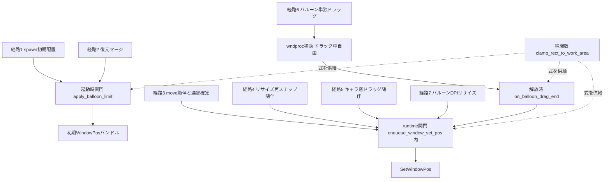
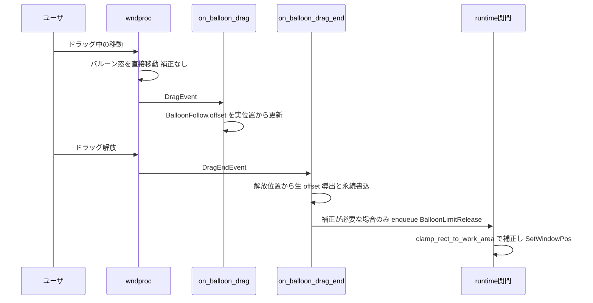

# 技術設計書: areka-P0-windowposition-limit

## Overview

**Purpose**: バルーン `descript.txt` の `windowposition` 族に残る 2 つの未実装——`windowposition.limit`（正典既定 1＝バルーンの画面内維持）と `windowposition.x` のキーワード語彙（`center`/`top`/`bottom`）——を解消する。limit=1 は開発者裁定（2026-08-14・research.md §9）により**常時不変量**として実装する: 可視バルーンの窓矩形は、位置・寸法がどの経路で最後に書かれたかによらず、キャラ窓が属するモニタの作業領域内に常時収まる。

**Users**: バルーン作者は宣言（`limit`・キーワード）で挙動を制御でき、エンドユーザはゴーストが画面端に寄ってもバルーンの文字が読める。互換検証者は裁定の根拠区分を互換対応表で追跡できる。

**Impact**: 現行の「クランプなし」（`resolver.rs` P5・limit=0 相当＝正典既定と逆）を反転する。バルーン位置の書き込み経路は 7 系統（research.md §1.2）あり単一の関門が現存しないため、**補正式は純関数 1 本**に集約し、**適用点は 3 つの関門**（起動時合流後・runtime 単一ライター内・ドラッグ解放時）で全経路を構造的に被覆する。補正は表示位置のみに作用し、作者指定・保存の相対位置（`balloon_offset`／`BalloonFollow.offset`／永続値）へは焼き付けない。

### Goals

- `windowposition.limit` の語彙受理（scope 別・面別上書きマージ後・既定 1・不正値は警告付き縮退）。
- limit=1 の 4 辺完全内包補正を、全 7 書き込み経路＋将来の経路に対し構造的に保証する（常時不変量）。
- `windowposition.x` キーワード（`center`/`top`/`bottom`）の受理と、キーワード別の基本位置（`y` 基本位置切替を含む）。
- 補正・語彙解決・縮退の全経路を実機ログで追跡可能にする。
- 決定論テスト全網羅＋実機サインオフ＋互換対応表 §8 :145 の追跡行消化。

### Non-Goals

- キャラ窓の配置規則（P1〜P4・連鎖規則・実表示寸確定の一度きり再解決）の変更。キャラ窓側の「必ず作業領域内」構造保証の再建は所有しない。
- `windowposition.x` 符号規約（kero-balloon R7.6 確定・画面座標そのまま）の変更。
- バルーン相対位置の基準（キャラ窓左上）・保存/復元の優先順位・可視性遷移ガード（`guard_visibility`）の変更。
- 画面端でのバルーン左右反転等の美観配置政策（M2 予約）。
- ghost 側 `descript.txt` への `windowposition` 系記載の受理（SSP 拡張・COMPAT 記録のみ）。
- `windowposition.y` 不正値の警告化（要件は x と limit のみを対象とする。y の数値変換は 5.1 で bit 同一維持）。
- モニタ構成変更時の `MonitorSnapshot` 再構築（現行は起動時 1 回構築の権威。limit も同じ権威を読むのみで、再構築の導入は本仕様非所有——後述「残余リスク」）。

## Boundary Commitments

### This Spec Owns

- バルーン窓矩形の limit 補正（純関数 `clamp_rect_to_work_area` とその 3 適用点）＝「バルーンは作業領域内」という不変量の唯一の所有者。
- `windowposition.limit`／`windowposition.x` キーワードの語彙分類（分類純関数＋警告縮退）と、その scope 別解決値の runtime 伝搬（`ScopeConfig`→`ScopePlacement`→`BalloonLimit` Component）。
- キーワード指定時のバルーン初期既定位置の幾何（resolver P5 の additive 分岐）。
- 補正・語彙解決の観測ログ（新タグ `[balloon-limit]`・観測点 4 の拡張・`PlacementRoute` 1 variant 追加）。
- 互換対応表 §8 :145 追跡行の消化と裁定記録。

### Out of Boundary

- キャラ窓の位置を limit 補正で動かすこと（2.8・関門は `BalloonLimit` Component を持つ窓＝バルーン窓のみに作用）。
- バルーンの表示／非表示状態の変更（2.9・`balloon-visibility` の確定挙動を消費するのみ）。
- `guard_visibility`／`route_applies_visibility_guard` の判定規則変更（新 route の腕を網羅 match へ足すのみ・既存 route の真偽値不変）。
- `persist.rs` の merge 規則・保存表現（`ScopePlacement` の新フィールド転記のみ）。
- モニタ帰属決定規則（`work_area_for_window_with_origin`＝窓中心 half-open＋最近傍 fallback）の変更（5.5・キャラ窓 rect を入力に既存関数を呼ぶだけ）。

### Allowed Dependencies

- `areka-parsers::balloon`（転記層・raw 併記の additive 拡張のみ。解釈・警告は下流）。
- `areka-emo-compose::ScaleRatio`（丸め権威。ただし limit 補正自体は min/max のみで丸めを持たない）。
- `placement/follow` 既存基盤: `MonitorSnapshot`／`work_area_for_window`／`enqueue_window_set_pos`／`GhostWindows`。
- 依存方向: parsers → config → windowposition/balloon_limit（純関数）→ resolver → spawn/persist → follow（runtime）。`windowposition.rs` は現行どおり wintf/bevy_ecs を import しない。新設 `balloon_limit.rs` のクランプ核（`clamp_rect_to_work_area`/`limit_correction`）も同様に純粋だが、起動時関門 `apply_balloon_limit` は `MonitorSnapshot`（bevy Resource derive だが headless 構築可）と `work_area_for_window` を消費してよい——決定論性は保たれ、檻は headless で成立する。

### Revalidation Triggers

- `enqueue_window_set_pos` の契約変化: 「挙動を持たない配管」から「対象窓の `BalloonLimit(true)` に限り limit 補正を内蔵する単一ライター」へ。**follow 系ファイル（`window_move.rs`・`drag_follow.rs`）への接触が確定**したため、roadmap 干渉台帳 **atom⇄wpl の再判定**を仰ぐこと（`dpi-transition-atomicity` は wpl 実形へ rebase・research.md §10）。
- `PlacementRoute` が 9→10 variant（`BalloonLimitRelease` 追加）: `ALL`／`as_str`／ログ grep 資産の追随。
- `ScopePlacement` に `balloon_limit: bool` フィールド追加: struct literal を組む全消費者（persist・tests）の機械的追随。
- `WindowPosition` は不変のまま `BalloonModel` に `windowposition_raw()` アクセサ追加（既存消費者は無改変）。
- resolver P5 の doc「クランプなし」の意味変更（limit は下流関門の所有）: doc・檻の前提記述の追随（7.3）。

## Architecture

### 既存アーキテクチャ分析

- **パイプライン**: parse（`areka-parsers/balloon`・寛容転記）→ scope 別 2 層マージ取得（`resolve_balloon_faces`＋`load_scope_balloon_model`）→ 供給（`windowposition.rs`→`ScopeConfig.balloon_offset`）→ 配置式（`resolver.rs` P1〜P5）→ 復元 merge（`persist.rs`）→ spawn（`spawn.rs`）→ runtime 追従（`follow/`）。
- **書き込み経路は 7 系統**（research.md §1.2）: ①spawn 初期値 ②復元 merge ③`\![move]`/連鎖確定の随伴 ④リサイズ再スナップ随伴 ⑤キャラ窓ドラッグ随伴 ⑥バルーン単独ドラッグ（wndproc 移動・ECS 経路外）⑦バルーン DPI リサイズ。③④⑤⑦は runtime 単一ライター `enqueue_window_set_pos` へ集約済み。①②は起動時データ（`ScopePlacement`）、⑥は wndproc レベルで構造的に単一ライター外。
- **`PlacementConfig`/`ScopeConfig` は spawn 後に破棄される**（Resource 化されていない）。runtime へ生き残るのは `ScopePlacement` 由来のデータと窓 entity 上の Component のみ——limit 値の runtime 伝搬は Component 焼込みが既存パターン（`Anchored` と同型）。
- **先例**: キャラ窓 P4 の `clamp_axis`（逆転区間で left/top 優先）が 2.4 の正典実装。`route_applies_visibility_guard` の網羅 match が適用可否語彙の先例。`[visibility-guard]` タグ＋`[diag.window_move]` レコードが観測語彙の先例。

### アーキテクチャパターンと境界マップ

**Selected pattern**: 「式 1 本・関門 3 点」——矩形クランプの純関数を 1 本だけ新設し、全書き込み経路が通過する 3 つの構造的関門（起動時合流後・runtime 単一ライター内・ドラッグ解放時）から同一関数を呼ぶ。scg で露見した「新しい書き込み経路が素通しになる」構造リスク（`finalize_chain` の P4 素通しと同型）を、経路個別の規律ではなく関門の構造で塞ぐ。



**設計判断**（research.md §6 の持ち越し項目の決着。詳細比較は research.md §10）:

- **DD1（クランプの掛け場所＝案 A-3'）**: 純関数 1 本＋関門 3 点。runtime 関門は `enqueue_window_set_pos` 内に置く——旧 A-2 の主反対理由「適用時点の route 分岐で配管が変質する」は常時不変量裁定で消滅した（分岐は route ではなく**対象窓の `BalloonLimit` Component**＝データ駆動で、route は観測語彙のまま）。ECS 経路の将来の書き込み口も自動被覆され、2.1/2.2 が構造保証になる。関門の外に残る①②は起動時関門、⑥は解放時補正で塞ぐ。
- **DD2（語彙の型化層＝案 B-1'）**: parsers は転記のまま。`WindowPosition` は**一切変更せず**、`BalloonModel` へ sibling の `WindowPositionRaw`（`x`/`limit` の生文字列・Clone）を additive に追加する。0/1 検証・キーワード判別・警告縮退は placement 側の分類純関数が行う（steering「parser は転記層・解釈は下流」整合・既存消費者無改変で 5.1 に有利）。
- **DD3（キーワード幾何＝案 C-1）**: resolver P5 を additive 分岐で拡張する。`ScopeConfig.balloon_x_mode: BalloonXMode { Side | CenterTop | CenterBottom }`（既定 `Side`）を導入し、P5 が mode 別に基本位置を直接計算する。C-2（offset 焼き込み）は実表示寸確定の再解決で「中央」がずれるため棄却（research.md §3.3）。`Side` 分岐は既存コードへ 1 bit も触れない形にして 4.5/5.2 を守る。
- **DD4（runtime 伝搬＝案 D-1）**: バルーン窓 entity へ `BalloonLimit(bool)` Component を spawn 時に焼き込む（`Anchored` 同型）。`ScopeConfig.balloon_limit`→`ScopePlacement.balloon_limit`→Component の一方向転写。
- **DD5（可視性ガードとの順序）**: `follow_balloon` 内の guard（遷移時 X clamp）が先・runtime 関門の limit 補正が後＝**limit が最後の語**。limit=1 では補正後矩形が完全内包＝ガードの「交差あり」を常に満たし実害なし。limit=0 scope ではガードが従来どおり最後の安全網。ガードのコード・判定規則は不変。
- **DD6（焼き付けない＝3.1(d) の実装形）**: 補正は**書き込み直前の表示位置**のみに作用する。`ScopePlacement.balloon_offset`・`BalloonFollow.offset`・永続値は補正前の生値を保持し続ける。resolver の恒等式 `balloon_offset ≡ balloon_pos − char_pos` は「resolver 出力時点の事後条件」へスコープを明文化し、起動時関門の通過後は `balloon_pos`＝表示位置（補正済み）・`balloon_offset`＝論理相対位置（生値）と役割を分離する。キャラ窓が余裕位置へ戻れば、追従計算（char + 生 offset）が自然に作者指定・保存位置へ復帰する。
- **DD7（観測）**: 補正発火は独立の `info!` 行（タグ `[balloon-limit] Clamp`・scope／補正前後／契機 route）とし、`[diag.window_move]` レコードは従来どおり最終（補正後）位置を記録する。ドラッグ解放補正の新規書込には `PlacementRoute::BalloonLimitRelease` を新設する（関門内の補正は元書込の route を保つ——補正は同一書込の一部であり別書込ではない）。
- **DD8（語彙の細則・areka 裁量）**: キーワードは trim 済み文字列と小文字 `center`/`top`/`bottom` の**完全一致**（大文字混在は 4.6 の警告付き縮退へ落ち、warn で作者が気づける）。キーワード水平中央の式 `char_x + (char_w − balloon_w) / 2` の整数除算（0 方向切り捨て）は幾何の中点計算であり、k 適用丸め（`ScaleRatio` 権威）の新設ではない。いずれも COMPAT §8 へ正典沈黙裁定として記録する（7.4）。

**Steering compliance**: parser 転記層規律／丸め権威不変／log-first（ログ無し縮退経路を作らない）／檻は判断分岐のみ＋wiring 檻／純関数層の bevy 非依存規約——いずれも既存規約の継承で新設なし。

### Technology Stack

新規依存なし。既存スタック（Rust・bevy_ecs・tracing・areka-parsers・areka-emo-compose `ScaleRatio`）の範囲で完結する。

## File Structure Plan

### 新規ファイル

```
crates/areka/src/placement/
├── balloon_limit.rs              # limit 補正の純関数群（クランプ核は依存ゼロ）:
│                                 #   clamp_rect_to_work_area / limit_correction /
│                                 #   apply_balloon_limit（ScopePlacement 列の起動時関門）
│                                 #   ＋観測タグ定数（BALLOON_LIMIT_CLAMP_TAG 等）
├── balloon_limit_tests.rs        # R7.1 行列の決定論檻（純関数全網羅）
└── follow_balloon_limit_tests.rs # runtime 関門・解放時補正の wiring 檻（follow facade 接続）
```

### 変更ファイル

- `crates/areka-parsers/src/balloon/model.rs` — `WindowPositionRaw` struct（`x_raw`/`limit_raw`・`#[non_exhaustive]`・Clone）＋ `BalloonModel` フィールド・アクセサ `windowposition_raw()` を additive 追加。`WindowPosition` は無改変。
- `crates/areka-parsers/src/balloon/parse.rs` — `windowposition.x`/`windowposition.limit` の生文字列転記を追加（`get_scalar` 経路は無改変）。
- `crates/areka/src/placement/config.rs` — `ScopeConfig` へ `balloon_limit: bool`（Default: `true`＝正典既定）と `balloon_x_mode: BalloonXMode`（新 enum・Default: `Side`）を追加。
- `crates/areka/src/placement/windowposition.rs` — 語彙分類の純関数 `classify_x_vocab`／`classify_limit_vocab` を追加（既存 `to_screen_adjust`/`apply_windowposition` 無改変）。
- `crates/areka/src/placement/mod.rs` — `scope_windowposition` が raw も返す形へ拡張。`apply_scope_windowpositions` で分類→`ScopeConfig` へ反映・不正値 warn（6.3）・観測点 4 の `info!` へ `limit`/`x_mode` フィールド追加（6.2）。
- `crates/areka/src/placement/resolver.rs` — P5 に `balloon_x_mode` の additive 分岐（キーワード幾何）。`ScopePlacement` へ `balloon_limit: bool` 転記。P5 doc「クランプなし」を「limit 補正は下流関門の所有」へ更新（7.3）。
- `crates/areka/src/placement/persist.rs` — `merge_scope` の `ScopePlacement` 再構築で `balloon_limit` を転記（merge 規則は無改変）。
- `crates/areka/src/main.rs` — `restore_merged_placements` の末尾で `apply_balloon_limit`（起動時関門）を適用。
- `crates/areka/src/placement/spawn.rs` — `BalloonLimit(bool)` Component 定義＋バルーン窓 entity への焼込み（`ScopePlacement.balloon_limit` から）。
- `crates/areka/src/placement/follow/window_move.rs` — `enqueue_window_set_pos` 内に runtime 関門（対象窓が `BalloonLimit(true)` のときのみ補正・`[balloon-limit] Clamp` info・解決不能時は warn＋素通し）。
- `crates/areka/src/placement/follow/drag_follow.rs` — `on_balloon_drag_end` へ解放時補正（①解放位置取得→②生 offset の永続 write-through（既存・順序固定）→③補正が要るときのみ `BalloonLimitRelease` で enqueue）。
- `crates/areka/src/placement/diag.rs` — `PlacementRoute::BalloonLimitRelease` 追加（`ALL` 9→10・`as_str`）。
- `crates/areka/src/placement/follow/visibility.rs` — `route_applies_visibility_guard` の網羅 match へ新 variant の腕（`false`）を追加（既存 route の真偽値不変）。
- `crates/areka/src/placement/follow.rs` — facade の再輸出へ `BalloonLimit` 等を追随（必要最小）。
- `doc/COMPAT_ARCHITECTURE.md` — §8 :145 追跡行を実装済みへ更新＋裁定記録（7.4）。
- 檻の反転・前提更新（7.3）: `placement/resolver_resolve_tests.rs`（`t_r8_balloon_never_clamped_even_outside_work_area` の反転）／`placement/follow_visibility_guard_tests.rs`（doc 前提の追記）／`placement/follow_visibility_balloon_wiring_tests.rs`（route 表檻の 10 variant 化・ドラッグ檻の「解放時補正」前提追記）／`main_restore_seam_tests.rs`・`follow_drag_end_persist_tests.rs` ほか struct literal の機械的追随。

## System Flows

### バルーン単独ドラッグと解放時補正（2.5・3.1(b)(d)・5.4）



順序が要点: 永続 write-through（生値）→ 表示補正の順を固定することで、補正値が保存値・`BalloonFollow.offset` へ焼き付かない（DD6）。補正 enqueue は関門でも再クランプされるが、クランプは冪等ゆえ二重適用は無害。

## Requirements Traceability

| Requirement | Summary | Components | Interfaces / Flows |
|-------------|---------|------------|--------------------|
| 1.1 | limit 0/1 の受理 | C2 転記・C1 分類・C3 保持 | `classify_limit_vocab` |
| 1.2 | 未指定は既定 1 | C1・C3（`ScopeConfig::default` も `true`） | 同上 |
| 1.3 | 不正値は警告＋1 へ縮退 | C1・C10 | warn（`mod.rs`） |
| 1.4 | x/y と同じ scope 単位で解決 | C3 取得経路 | `scope_windowposition`（2 層マージ済み定義） |
| 2.1 | 常時不変量（経路非依存） | C5・C6・C7・C8 | 境界マップの被覆表 |
| 2.2 | 全書込直後の補正 | C6（経路①②）・C7（③④⑤⑦）・C8（⑥） | 同上 |
| 2.3 | 4 辺・決定論的同一規則 | C5 | `clamp_rect_to_work_area` |
| 2.4 | 巨大バルーンは左/上優先 | C5 | `clamp_axis` 同一意味論（min→max） |
| 2.5 | ドラッグ中自由・解放時補正 | C8 | 解放シーケンス図 |
| 2.6 | 非表示中も次回可視時に成立 | C7 | 関門は可視性へ非依存＝全書込補正 |
| 2.7 | limit=0 は無補正 | C5（恒等）・C7（skip） | `BalloonLimit(false)` |
| 2.8 | キャラ窓を動かさない | C7・C9 | 関門は `BalloonLimit` 保持窓のみ作用 |
| 2.9 | 表示状態を変えない | C7 | 位置のみ書換（size/可視性非接触） |
| 2.10 | 物理 px 判定・既存丸め権威のみ | C5 | min/max のみ（丸め新設なし・DD8） |
| 3.1 | SSP 系裁定（常時不変量ほか） | DD1〜DD6・DD8・C11 | 本設計全体 |
| 3.2 | 裁定と根拠区分の記録 | C11 | COMPAT §8 更新 |
| 4.1 | キーワード受理（top≡center） | C1・C2 | `classify_x_vocab` |
| 4.2 | center/top＝中央上 | C4 | P5 `CenterTop` 分岐 |
| 4.3 | bottom＝中央下 | C4 | P5 `CenterBottom` 分岐 |
| 4.4 | y 数値は基本位置からの調整量 | C4＋既存 `to_screen_adjust` | dy は `balloon_offset` 経由（dx=0） |
| 4.5 | 数値指定の基本位置は不変 | C4（`Side` 分岐 bit 同一） | 5.2 回帰檻 |
| 4.6 | 不正 x は警告＋未指定縮退 | C1・C10 | warn（`mod.rs`） |
| 4.7 | 保存値優先は不変 | 既存 persist merge（非改変）・DD6 | キーワードは初期既定位置の供給に閉じる |
| 4.8 | 既存 k 適用・丸め権威のみ | C4 | `scale_signed`/`ScaleRatio` 続用 |
| 4.9 | キーワード＋limit=1 の同一規則 | C6 | 起動時関門は resolver 出力へ一律適用 |
| 5.1 | 数値変換の同一性 | C4・C12 | 既存檻＋回帰檻 |
| 5.2 | limit=0＋非キーワードの出力同一 | C12 | bit 同一檻 |
| 5.3 | キャラ窓配置規則不変 | 境界（P1〜P4・連鎖非接触） | C12 既存檻続行 |
| 5.4 | 相対位置基準・保存復元不変 | C8（順序固定）・DD6 | 解放シーケンス図 |
| 5.5 | 基準はキャラ窓帰属モニタ・規則不変 | C5・C7 | `work_area_for_window`（キャラ窓 rect 入力） |
| 6.1 | 補正の scope・前後・契機ログ | C10 | `[balloon-limit] Clamp` info |
| 6.2 | limit/キーワード解決値ログ | C10 | 観測点 4 拡張フィールド |
| 6.3 | 縮退は必ず警告 | C10 | warn 経路（log-first） |
| 7.1 | limit 分岐の決定論全網羅 | C12 | `balloon_limit_tests.rs` 行列 |
| 7.2 | キーワード分岐の決定論全網羅 | C12 | resolver 檻＋分類檻 |
| 7.3 | 矛盾する既存檻の反転 | C12 | 反転インベントリ（File Structure Plan） |
| 7.4 | COMPAT §8 更新 | C11 | :145 行＋裁定記録 |
| 7.5 | 実機サインオフ | Testing Strategy | emo2 絶対パス・k≠1・ログ突合 |
| 7.6 | ワークスペース全緑 | Testing Strategy | DoD ゲート |

## Components and Interfaces

| Component | Layer | Intent | Req Coverage | Key Dependencies | Contracts |
|-----------|-------|--------|--------------|------------------|-----------|
| C1 語彙分類純関数 | placement 純関数 | limit/x キーワードの分類と縮退判定 | 1.1–1.3, 4.1, 4.6 | なし | Service |
| C2 WindowPositionRaw | parsers 転記 | 生文字列の忠実転記 | 1.1, 4.1 | kv マージ | State |
| C3 ScopeConfig 拡張 | placement 構成 | scope 別 limit/x_mode の保持 | 1.1–1.4 | C1 | State |
| C4 P5 キーワード幾何 | placement 配置式 | mode 別の初期既定位置 | 4.2–4.5, 4.8, 5.1 | C3 | Service |
| C5 balloon_limit 純関数 | placement 純関数 | 矩形クランプ式（唯一の式） | 2.3, 2.4, 2.7, 2.10, 5.5 | work_area | Service |
| C6 起動時関門 | boot seam | 経路①②の補正 | 2.2, 4.9 | C5, MonitorSnapshot | Service |
| C7 runtime 関門 | follow | 経路③④⑤⑦＋将来経路の補正 | 2.1, 2.2, 2.6–2.9 | C5, C9, GhostWindows | Service |
| C8 解放時補正 | follow | 経路⑥の解放時補正 | 2.5, 5.4 | C5, C7 | Event |
| C9 BalloonLimit Component | ECS | limit 値の runtime 単一真実源 | 2.7, 2.8 | spawn | State |
| C10 観測 | diag/log | 補正・解決・縮退の観測 | 6.1–6.3 | tracing | Event |
| C11 COMPAT 記録 | doc | 裁定と根拠区分の登記 | 3.1, 3.2, 7.4 | — | — |
| C12 檻群 | tests | 決定論全網羅＋反転＋回帰 | 5.2, 7.1–7.3 | — | — |

### placement 純関数層

#### C5: balloon_limit 純関数（新設 `placement/balloon_limit.rs`）

| Field | Detail |
|-------|--------|
| Intent | limit=1 の 4 辺矩形クランプ式を 1 本だけ定義し、3 関門へ供給する |
| Requirements | 2.3, 2.4, 2.7, 2.10, 5.5 |

**Responsibilities & Constraints**
- 矩形の作業領域内包クランプ。逆転区間（バルーン > 作業領域）は `clamp_axis` と同一の意味論（`v.min(hi).max(lo)`）で左/上優先（2.4）。
- 全入力は物理 px。丸め・スケーリングを一切持たない（2.10）。
- クランプ核（`clamp_rect_to_work_area`/`limit_correction`）は幾何プリミティブのみに依存する純関数。`apply_balloon_limit` のみ `MonitorSnapshot`／`work_area_for_window`（headless 構築可・決定論）を消費する。limit=0 は呼び出し側で skip（式は常に「clamp する式」であり、有効判定は関門の責務）。

##### Service Interface

```rust
/// 矩形 (pos, size) を area 内へ 4 辺クランプした位置を返す。
/// 逆転区間（size > area）は left/top 優先（clamp_axis と同一意味論・panic しない）。
pub(crate) fn clamp_rect_to_work_area(pos: PointPx, size: SizePx, area: RectPx) -> PointPx;

/// 補正が必要なときのみ Some(補正後位置) を返す（不要なら None＝無補正の観測可能化）。
pub(crate) fn limit_correction(pos: PointPx, size: SizePx, area: RectPx) -> Option<PointPx>;

/// 起動時関門: 各 ScopePlacement について balloon_limit=true のとき、キャラ窓 rect の
/// 帰属 work area（work_area_for_window・既存規則）で balloon_pos をクランプする。
/// balloon_offset は変更しない（DD6）。snapshot 空/解決不能の scope は warn の上で素通し。
pub(crate) fn apply_balloon_limit(
    placements: Vec<ScopePlacement>,
    snapshot: &MonitorSnapshot,
) -> Vec<ScopePlacement>;
```

- Preconditions: 座標・寸法は物理 px。`size.w > 0 && size.h > 0`（窓寸は正・既存契約）。
- Postconditions: 戻り位置の矩形は `area` と 4 辺内包（逆転区間は left/top 辺が一致）。`clamp_rect_to_work_area` は冪等。
- Invariants: `apply_balloon_limit` は `balloon_pos` 以外のフィールド（特に `balloon_offset`）を変更しない。

#### C1: 語彙分類純関数（`placement/windowposition.rs` へ追加）

| Field | Detail |
|-------|--------|
| Intent | 生文字列＋数値パース結果から limit／x の語彙を閉じた enum へ分類する |
| Requirements | 1.1, 1.2, 1.3, 4.1, 4.6 |

##### Service Interface

```rust
/// `windowposition.x` の分類結果（閉じた語彙・網羅 match 強制）。
pub(crate) enum XVocab {
    /// 数値または未指定（既存挙動そのまま・None は「調整なし」）。
    Numeric(Option<i32>),
    /// キーワード（top は Center と同義に解決済み）。
    Keyword(BalloonXMode), // CenterTop | CenterBottom（Side はここでは現れない）
    /// 数値でもキーワードでもない値（呼び出し側が warn ＋ Numeric(None) 扱いへ縮退）。
    Invalid,
}

/// x_num は既存 get_scalar 結果、x_raw は転記生文字列。キーワードは trim 済み
/// 小文字 "center"/"top"/"bottom" の完全一致（DD8）。
pub(crate) fn classify_x_vocab(x_num: Option<i32>, x_raw: Option<&str>) -> XVocab;

/// limit の分類: "0"→Value(false)・"1"→Value(true)・未指定→Value(true)（正典既定）・
/// それ以外→Invalid（呼び出し側が warn ＋ true へ縮退）。
pub(crate) enum LimitVocab { Value(bool), Invalid }
pub(crate) fn classify_limit_vocab(limit_raw: Option<&str>) -> LimitVocab;
```

- Invariants: `x_num.is_some()` なら常に `Numeric`（数値経路は生文字列を見ない＝5.1 の同一性を型で保証）。warn の発行は呼び出し側（`apply_scope_windowpositions`・scope 文脈付き）が所有。

### 定義・構成層

#### C2: WindowPositionRaw（`areka-parsers/src/balloon/model.rs`・`parse.rs`）

Summary-only: `#[non_exhaustive] #[derive(Clone, Debug, PartialEq, Eq)] pub struct WindowPositionRaw { x_raw: Option<String>, limit_raw: Option<String> }`＋アクセサ `x_raw()`/`limit_raw()`。`parse.rs` はマージ済みマップから `windowposition.x`/`windowposition.limit` の値を**そのまま**転記する（trim は kv 層で済み・解釈しない・警告しない＝転記層契約）。`BalloonModel::windowposition_raw()` アクセサを追加。**`WindowPosition` と既存アクセサは無改変**（既存消費者の bit 同一・5.1）。

#### C3: ScopeConfig 拡張（`placement/config.rs`）

Summary-only: `ScopeConfig` へ `balloon_limit: bool`（`Default` impl で `true`）と `balloon_x_mode: BalloonXMode` を追加。

```rust
/// バルーン水平配置モード（P5 の基本位置分岐・既定 Side＝現行挙動）。
#[derive(Debug, Clone, Copy, PartialEq, Eq, Default)]
pub enum BalloonXMode {
    /// 数値指定・未指定（現行の BalloonSide 分岐へ委譲・bit 同一）。
    #[default]
    Side,
    /// center / top: シェル中央上（バルーン下端＝シェル画像上端）。
    CenterTop,
    /// bottom: シェル中央下（バルーン上端＝シェル画像下端）。
    CenterBottom,
}
```

未収載 scope は `ScopeConfig::default()` で配置される既存契約により、バルーン定義が読めない scope でも limit=1（正典既定）が成立する（1.2）。

**取得経路の拡張**（`placement/mod.rs`）: `scope_windowposition` は `(WindowPosition, WindowPositionRaw)` を返す形へ拡張。`apply_scope_windowpositions` が C1 で分類し、(a) `Invalid` は warn（scope・生値付き・6.3）→縮退、(b) `ScopeConfig.balloon_limit`/`balloon_x_mode` へ反映、(c) 観測点 4 の `info!` へ `limit`・`x_mode`（解決済み実値）フィールドを追加（6.2）、(d) `Keyword` のとき数値 x は存在しないため既存 `to_screen_adjust(None, wp_y)` がそのまま `(0, dy)` を供給し 4.4 が成立する。

#### C4: P5 キーワード幾何（`placement/resolver.rs`）

| Field | Detail |
|-------|--------|
| Intent | mode 別のバルーン初期既定位置を P5 で直接計算する |
| Requirements | 4.2, 4.3, 4.4, 4.5, 4.8, 5.1 |

**Responsibilities & Constraints**
- `Side` → 既存分岐（`balloon_alignment` の Left/Right・**無改変**＝4.5/5.2）。
- `CenterTop` → `balloon_base_x = char_x + (char_w − balloon_w) / 2`・`balloon_base_y = char_y − balloon_h`。
- `CenterBottom` → 同 x・`balloon_base_y = char_y + char_h`。
- いずれも `balloon_offset`（y 数値調整量＋`balloon.offsetx/y`）を従来どおり加算（4.4。キーワード時も offset 加算を一律適用するのは正典沈黙箇所の areka 裁量として COMPAT へ記録）。飽和演算は既存流儀（`saturating_add/sub`）。
- 事後条件 `balloon_offset ≡ balloon_pos − char_pos` の計算式は不変（mode によらず成立）。
- `ScopePlacement` へ `balloon_limit: bool` を転記（resolver は判定せず運ぶだけ）。
- キャラ窓 rect＝シェル画像 rect（窓寸＝画像寸の既存等式）を前提に「シェル画像の上端/下端/中央」を窓 rect で読む。

### runtime 層

#### C7: runtime 関門（`placement/follow/window_move.rs`・`enqueue_window_set_pos` 内）

| Field | Detail |
|-------|--------|
| Intent | ECS 経由の全バルーン位置・寸法書込へ limit 補正を構造的に適用する |
| Requirements | 2.1, 2.2, 2.6, 2.7, 2.8, 2.9, 5.5 |

**Responsibilities & Constraints**
- 発動条件: 対象 entity が `BalloonLimit(true)` を持つときのみ（データ駆動・route 非依存）。キャラ窓・limit=0 バルーンは従来経路と bit 同一（2.7/2.8）。
- 判定矩形: 書込もうとする `(x, y)` × `size`（`size=None` は対象の現在 `WindowPos` 寸）＝寸法変更を含む矩形内包判定（経路⑦を被覆）。
- 基準領域: `BalloonWindowMarker.scope` → `GhostWindows`（正本）→ キャラ窓 entity → `WindowPos` rect → `work_area_for_window`（既存帰属規則・5.5）。
- 解決不能（`MonitorSnapshot`/`GhostWindows`/キャラ窓 `WindowPos` 不在・snapshot 空）: `[balloon-limit] Unresolved` warn の上で**素通し**（書込は阻害しない・log-first。`VISIBILITY_UNRESOLVED_TAG` と同型の縮退規約）。
- 補正発火時: `[balloon-limit] Clamp` の `info!`（scope・from/to・契機＝route）を出し、補正後座標で書込続行。route・`[diag.window_move]` レコードは補正後の最終位置を記録（DD7）。
- 位置のみ補正し、size・可視性・Z 順（`KeepDirectlyAbove`）へは非接触（2.9）。
- ガードとの順序: `follow_balloon` の `guard_balloon_position` が先・本関門が後（DD5・limit が最後の語）。

##### Service Interface（契約の変化点のみ）

```rust
/// enqueue_window_set_pos の契約追記:
/// 対象 entity が BalloonLimit(true) を持つ場合、書込位置は
/// clamp_rect_to_work_area(proposed, size, キャラ窓帰属 work area) へ補正される。
/// それ以外の対象（キャラ窓・BalloonLimit(false)）の挙動は従来と bit 同一。
pub(super) fn enqueue_window_set_pos(
    world: &mut World, window: Entity, x: i32, y: i32,
    size: Option<SizePx>, route: Option<PlacementRoute>,
) -> bool;
```

#### C8: 解放時補正（`placement/follow/drag_follow.rs`・`on_balloon_drag_end`）

| Field | Detail |
|-------|--------|
| Intent | wndproc 移動（ECS 経路外）のバルーン単独ドラッグを解放時点で補正する |
| Requirements | 2.5, 5.4 |

**Responsibilities & Constraints**
- 順序固定（DD6・5.4）: ①解放位置の取得 → ②生 offset 導出＋永続 write-through（**既存処理・無改変**）→ ③`BalloonLimit(true)` かつ `limit_correction` が `Some` のときのみ `enqueue_window_set_pos(..., Some(PlacementRoute::BalloonLimitRelease))`。
- ドラッグ中（`on_balloon_drag`）へは一切介入しない（2.5 前段・wndproc 移動は自由のまま）。
- 補正後も `BalloonFollow.offset`・永続値は解放時の生値を保持（焼き付けない）。次のバルーンドラッグ開始時は表示位置（補正済み）から自然に再導出される。

#### C9: BalloonLimit Component（`placement/spawn.rs`）

Summary-only:

```rust
/// バルーン窓の limit 有効値（scope 別解決済み・spawn 焼込み・runtime 単一真実源）。
#[derive(Component, Debug, Clone, Copy, PartialEq, Eq)]
pub struct BalloonLimit(pub bool);
```

spawn がバルーン窓 entity へ `BalloonLimit(p.balloon_limit)` を挿入（`Anchored` 同型・キャラ窓には挿入しない＝2.8 の構造保証）。follow facade から再輸出。

#### C6: 起動時関門（`main.rs`・`restore_merged_placements`）

Summary-only: `restore_merged_placements` の merge 後に `apply_balloon_limit(merged, snapshot)` を適用して返す。経路①（spawn 初期値）と②（復元 merge）は共にこのシームの出力を消費するため 1 点で被覆される（2.2）。キーワード由来の初期既定位置も resolver 出力としてここを通る（4.9）。純粋シームのため headless 檻（`main_restore_seam_tests.rs` 同型）で固定可能。

#### C10: 観測（`placement/diag.rs`・各所）

Summary-only:
- `PlacementRoute::BalloonLimitRelease` 追加（`ALL` 10 variant・`as_str = "balloon-limit-release"`・`route_applies_visibility_guard` は `false` 腕）。
- タグ定数（`balloon_limit.rs` 所有）: `[balloon-limit] Clamp`（info・scope/from/to/契機 route・6.1）／`[balloon-limit] Unresolved`（warn・縮退の観測可能化）。
- 観測点 4 拡張（6.2）と縮退 warn（6.3）は C3 の取得経路に記載のとおり。ログ無し縮退経路を作らない（log-first steering）。

### 文書

#### C11: COMPAT 記録（`doc/COMPAT_ARCHITECTURE.md` §8）

Summary-only: :145 の追跡行を実装済みへ更新し、次を記録する（3.2/7.4）——(a) 常時不変量・キャラ窓帰属モニタの作業領域・ドラッグ解放時補正・相対位置へ焼き付けない（根拠区分: (a) 適用は正典整合＝「強制的に画面内に維持」の素直な読み／(b)(c)(d) は areka 裁量）、(b) 正典沈黙裁定＝巨大バルーンの左/上優先・キーワード完全一致（小文字）・キーワード時の offset 加算継続・中点整数除算、(c) 先送り＝ghost 側 descript の `windowposition` 系受理（SSP 拡張・語彙記録のみ）。

## Data Models

変更はすべて既存 struct への additive なフィールド追加で、新しい永続形式・スキーマはない。

- `WindowPositionRaw`（parsers・値オブジェクト）: 生文字列 2 項。転記のみで不変条件なし。
- `ScopeConfig` += `balloon_limit: bool`／`balloon_x_mode: BalloonXMode`（boot 時のみ生存・spawn 後破棄は現行どおり）。
- `ScopePlacement` += `balloon_limit: bool`（Copy 維持・bool のみ）。
- **不変量の再スコープ（DD6）**: `balloon_offset ≡ balloon_pos − char_pos` は「resolver 出力時点の事後条件」。起動時関門通過後は `balloon_pos`＝表示位置（limit 補正済み）／`balloon_offset`＝論理相対位置（作者指定・保存値の系譜）として役割分離し、resolver・persist の doc へ明記する（7.3 の doc 追随に含む）。
- runtime 状態: `BalloonLimit(bool)` Component（バルーン窓 entity・spawn 焼込み・以後不変）。永続化しない（limit は毎起動 descript から解決）。

## Error Handling

方針は既存の寛容パース＋log-first の継承。パニック経路・ログ無し縮退経路を新設しない。

| 事象 | 応答 | ログ |
|------|------|------|
| `windowposition.limit` が 0/1 以外 | 正典既定 1 へ縮退（1.3） | warn（scope・生値） |
| `windowposition.x` が数値でもキーワードでもない | 未指定（数値 0 扱い）へ縮退（4.6） | warn（scope・生値） |
| バルーン定義の取得失敗（faces 解決不能等） | `ScopeConfig::default()`＝limit=1・Side（既存縮退の継承） | 既存 warn 経路 |
| runtime 関門で基準解決不能（snapshot/GhostWindows/キャラ窓 rect 不在） | 補正せず書込続行（書込を阻害しない） | `[balloon-limit] Unresolved` warn |
| 起動時関門で work area 解決不能（snapshot 空） | 当該 scope は素通し | warn |
| バルーン > 作業領域（両端不能） | 左/上優先で収める（2.4・エラーではなく仕様） | 補正 info に含む |

## Testing Strategy

檻に入れるのは判断分岐のみ・配線は wiring 檻で固定（steering 継承）。DPI パラメタ化（k=1/k≠1 で同一表）は既確立の流儀を踏襲する。

### Unit Tests（決定論檻）

1. **`balloon_limit_tests.rs`（7.1 行列）**: `clamp_rect_to_work_area`/`limit_correction` を limit 有効 × はみ出し方向 4 辺（単独・複合）× k=1/k≠1 相当の寸法組で全網羅。逆転区間（巨大バルーン）の左/上優先（2.4・`clamp_axis` と同値であることの突合含む）。非はみ出し時の `None`（無補正）。冪等性。
2. **語彙分類檻（`windowposition.rs` 檻へ追加・7.2）**: `classify_x_vocab`（数値/`center`/`top`/`bottom`/不正値/未指定/大文字混在→Invalid）・`classify_limit_vocab`（0/1/未指定/不正値）。「`x_num` があれば常に `Numeric`」の型保証。
3. **resolver 檻（7.2・5.2）**: `CenterTop`/`CenterBottom` の基本位置 × y 調整量の有無 × k=1/k≠1（T-R 系へ追加）。`Side`＋limit=0 の既存全表が bit 同一で緑のまま（5.2 の回帰檻）。`t_r8_balloon_never_clamped_even_outside_work_area` は「resolver 出力はクランプしない（関門は下流所有）」へ前提書換えして維持（7.3——P5 無クランプ自体は設計上真のまま）。
4. **parsers 檻**: `WindowPositionRaw` の忠実転記（2 層マージ後勝ち・trim 済み値・未指定 None）。`WindowPosition` 既存檻の無改変緑。
5. **`apply_balloon_limit` 檻**: 起動時関門の scope 別適用・`balloon_offset` 不変（DD6）・snapshot 空の warn 素通し・キャラ窓帰属モニタ基準（複数モニタ表）。

### Integration Tests（wiring 檻）

1. **`follow_balloon_limit_tests.rs`**: World 組立て（バルーン窓＋`BalloonLimit`＋`GhostWindows`＋`MonitorSnapshot`）で、(a) `enqueue_window_set_pos` が `BalloonLimit(true)` のとき補正・`false`/Component 無しのとき素通し（2.7/2.8）、(b) `move_window_to` 随伴・`follow_balloon` 各 trigger・`resize_window_keep_position`（寸変更ではみ出す入力）で補正されること（2.2 経路③④⑤⑦）、(c) 解決不能時の warn＋素通し、(d) キャラ窓への非作用（2.8 位置 assert）。
2. **解放時補正檻（`follow_drag_end_persist_tests.rs` へ追加）**: 画面外解放 → 永続 entries は**生 offset**・表示は補正（順序固定の assert・5.4/2.5）。域内解放 → 補正書込なし（enqueue 記録 0 件）。
3. **起動シーム檻（`main_restore_seam_tests.rs` へ追加）**: 保存位置が画面外相当 → merge 出力の `balloon_pos` 補正済み・`balloon_offset` 生値（2.2 経路②・DD6）。
4. **route 表檻の追随（7.3）**: `follow_visibility_balloon_wiring_tests.rs` の表を 10 variant へ更新（`BalloonLimitRelease` は guard `false`）。`balloon_drag_trigger_neither_clamps_nor_warns` は「ドラッグ中無介入」の檻として前提 doc を「解放時補正は別檻が所有」へ更新して維持。`follow_visibility_guard_tests.rs` は doc の前提記述（「部分はみ出しは limit=1 では関門が補正する——ガード自体は不変」）を追記。

### E2E / 実機サインオフ（7.5）

- ゴースト emo2 を絶対パスで起動（`AREKA_APP_SMOKE_EXIT_MS` 有界・`RUST_LOG` grep の既定手順）。キャラ窓を画面端（左右・上下・モニタ境界）へドラッグし、limit=1 でバルーンが作業領域内へ収まることを k=1.0 と k≠1.0（125% または 200%）の 2 水準で目視確認。
- ログ突合: `[balloon-limit] Clamp` の scope/from/to/契機と `[diag.window_move]` の最終位置・観測点 4 の `limit`/`x_mode` 実値を突合（6.1/6.2）。
- キーワードは emo2 が数値のみ使用のため、fixture の面別上書きに `center`/`bottom` を与えた検証走行で基本位置を確認（檻が主・実機は目視補助）。
- 完了判定はワークスペース全テスト緑（7.6・i686 host-32 成果物の事前ビルド要）。

## 残余リスク（Supporting References）

- **モニタ構成変更（作業領域のみの変化）**: `MonitorSnapshot` は起動時 1 回構築の権威であり（`main.rs:660`）、表示構成変更での再構築は placement 全体が持たない現行制約。窓書込を伴わない作業領域変化の瞬間は補正契機がない（要件 2.2 の契機列挙は書込のみ・帰属規則と snapshot 権威は 5.5/Boundary で不変と規定）。既存の全 placement 判断（アンカー・ガード・復元）と同一の制約であり、本仕様は新たな悪化を持ち込まない。snapshot 再構築の導入は将来 spec（表示構成追従系）の所有。
- **atom⇄wpl 干渉**: 本設計は `follow/window_move.rs`・`follow/drag_follow.rs`・`diag.rs`・`visibility.rs`（1 腕）へ接触する。roadmap 干渉台帳の再判定（wpl 先着・atom rebase）を設計確定の報告と同時に仰ぐ（research.md §10）。
- **`enqueue_window_set_pos` の契約変質**: 「挙動を持たない配管」からの逸脱はデータ駆動（`BalloonLimit`）に限定し、route 語彙の純粋性を保つ（DD1）。wiring 檻がキャラ窓・limit=0 の bit 同一を固定する。
