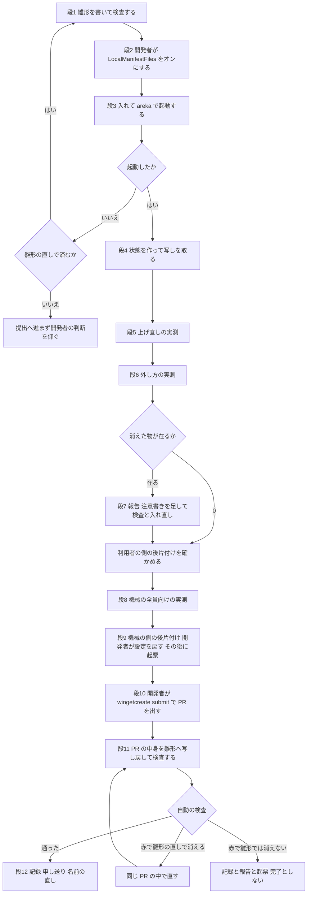

# 設計書: areka-P0-winget-manifest-submission

## Overview

**目的**: areka のポータブル版を、winget のコミュニティの置き場（microsoft/winget-pkgs）へ初めて載せる所までを進める。作る物は 3 つ。① 提出するマニフェストの雛形（YAML 4 ファイル）② 手元の実機で入れて起動し、上げ直しと外し方で利用者の物がどうなるかを測った記録 ③ 初回の提出の手順書と、その実行の記録。

**使う人**: winget で areka を入れたい利用者（`winget install Areka.Areka.Portable` の 1 行で入る）と、areka を winget で配りたい開発者（人の承認を待つだけの状態まで迷わず進める）。後ろの spec `areka-P0-winget-release-automation` を始める人は、本仕様の記録と申し送りを材料にする。

**リポジトリへの影響**: Rust のコードは 0 行。新しいスクリプトも 0 本。足すのは `dist/winget/0.0.2/` の YAML 4 ファイルと、本仕様のフォルダの中の記録 2 ファイル。直すのは steering の `structure.md` の 1 か所・`areka-P0-winget-release-automation` の brief への書き足し・`areka-P0-release-cycle` の要件と設計の名前 3 行。

### Goals

- 名乗り `Areka.Areka.Portable`・版 `0.0.2`・書式 1.12.0 のマニフェスト 4 ファイルを `dist/winget/0.0.2/` に置き、`winget validate` を通す。
- 提出するマニフェストそのもので x64 の実機に入れ、`areka` の 1 語で起動することを、起動の記録で判定する。
- 上げ直し・`--purge` も `--preserve` も付けない外し方・機械の全員向け（`--scope machine`）の 3 つを実測し、項目ごとに「残った」「消えた」「置き換わった」を記録する。
- 開発者の手で winget-pkgs へ PR を 1 本出し、自動の検査が通って人の承認待ちになった所を完了の線とする。
- 確かめた事実と PR の場所を、後ろの spec の brief へ申し送る。

### Non-Goals

- `.github/workflows/winget.yml`・`README.md` と `dist/README.txt` の winget の行（`areka-P0-winget-release-automation` が、取り込みの後に作る）。
- 利用者のゴーストと記憶の置き場を変えること（消えると分かったら、別の spec として起票するだけ）。
- winget-pkgs の人の審査による取り込みを待つこと。
- arm64 の実機で入れて起動する確かめ。
- 確かめや提出のための専用スクリプト・道具（作らない。手順は、文書に書いたコマンドを打つ形にする）。
- Windows サンドボックスでの確かめ（winget-pkgs の `Tools\SandboxTest.ps1`）。手元の実機の確かめで足りるので使わない。

## Boundary Commitments

### This Spec Owns

- `dist/winget/0.0.2/` のマニフェストの雛形 4 ファイル（中身は、winget-pkgs へ提出した物の写し）。
- 手元の確かめと 3 つの実測の手順・判定の基準・記録（`verification/winget-local-check.md`）。
- 初回の提出の手順書と、提出の記録（`verification/submission.md`）。
- 完了の線の判定（PR にどの印が付いたら「自動の検査が通った」とするか）。
- steering の `structure.md` の `dist/` の説明の 1 か所。
- `areka-P0-winget-release-automation` の brief への申し送りの節（書き足しだけ。既にある文は変えない）。
- `areka-P0-release-cycle` の要件と設計のうち、`winget.yml` の持ち主の名前の 3 行（名前だけ。手順は変えない）。

### Out of Boundary

- 変更 0 と決めたもの: `README.md`・`dist/README.txt`・`.github/workflows/**`・`crates/**`・`tools/**`・各 `Cargo.toml`・配布 zip の中身。触らないと先へ進めないと分かったら、作業を止めて開発者へ報告する。
- winget と OS の設定の変更・管理者の権限が要る出し入れ・提出の操作・トークンの扱い（どれも開発者の手。下の「誰の手で行うか」）。
- areka 本体や zip の側に原因が在る不具合の修正（本仕様では直さない。`/kiro-discovery` で起票する）。
- 取り込みの後の版ごとのマニフェストの書き換え（持たない。雛形は初回に出した版の写しのまま止まる）。
- `areka-P0-release-cycle` の `brief.md`（名前の直しの相手にしない。要件 6.4 が挙げるのは要件と設計だけ）。

### Allowed Dependencies

- 公開済みの GitHub Release `v0.0.2` の zip 2 つと `.sha256` 2 つ（読むだけ）。
- 完了 `areka-P0-release-package-versioned` の決まり（zip の名前 `areka-{版}-{arch}.zip`・`areka.exe` が zip の根に在ること）と、その `verification/winget-local-check.md` の手順の形。
- areka の今の振る舞い（読むだけ・変えない）: `crates/areka/src/boot_config.rs` の `resolve_boot_from` が出す `root_resolved` の行／`crates/areka/src/ghost_session.rs` が出す `本物のゴースト窓を開きました` の行／`crates/areka/src/boot_resolve.rs` が出す `last_ghost_not_found` の行／`crates/areka/src/main.rs` の有界の自動終了（環境変数 `AREKA_APP_SMOKE_EXIT_MS`）。
- 開発機の winget v1.29.380 と、`wingetcreate`（AI が普段の権限で入れる）。
- GitHub への読むだけの問い合わせ（`gh` で Release と PR の状態を読む）。
- リポジトリの検体 `vendors/sample_ghost/claudia.nar`・`vendors/sample_ghost/emo2-kakukaku-wplimit.nar`（実測で「後から入れた物」に使う）。
- areka の MCP の口（`crates/areka-mcp` の `sakurascript`・`get_status`・`get_log`・`dump_balloon`）と、台本のタグ `\![execute,install,path,パス]`（`crates/areka/src/emo2_boot/install_cue.rs` の受け口）・`\![change,ghost,…]`・`\-`（読むだけ・変えない。状態を作る操作と、ゴーストが何を伝えたかの読み取りに使う）。

### Revalidation Triggers

- zip の最上位の並びか `areka.exe` の場所が変わる → 雛形の `NestedInstallerFiles` と、実測の「何が消えるか」の前提が変わる。
- zip の名前の規則か Release の URL の形が変わる → `InstallerUrl` が変わる。
- winget-pkgs の PR のひな形が勧める書式の版が 1.12 から変わる → 雛形の `ManifestVersion` と冒頭の行を引き直す。
- 利用者の物の置き場を変える spec が着地する → 雛形の注意書き（`InstallationNotes`）と、後ろの spec への「次の版を出さない」の申し送りが古くなる。
- 名乗り・発行者・表示名のどれかを変える → winget-pkgs の側の並びと、入れた物の見分けが変わる（名乗りは一度出したら変えない）。

## Architecture

### 今ある物（2026-10-10 に引き直し）

- リポジトリの `dist/` で追跡しているのは `dist/README.txt` だけ。`dist/winget/` は無い。
- `tools/package.ps1` が `dist/` から zip へ写すのは、段「assemble」の `Copy-Item -LiteralPath 'dist/README.txt'` の 1 つだけ。`.github/workflows/*.yml` に `dist/` を指す行は 0 件。＝`dist/winget/**` を足しても zip の中身は変わらない。
- Release `v0.0.2`（公開 2026-10-06T12:49:21Z・下書きでも先行版でもない）に、`areka-0.0.2-x64.zip`（8,695,089 バイト）・`areka-0.0.2-arm64.zip`（8,552,648 バイト）と、それぞれの `.sha256` が在る。
- winget-pkgs に `manifests/a/Areka/` は無く、`Areka.Areka` を含む PR も無い。開発者のアカウントに winget-pkgs のフォークはまだ無い。
- 手元の確かめの型は、完了 `areka-P0-release-package-versioned` の `verification/winget-local-check.md`（変えた設定の表・手順と結果・置き場・既知の制限）。本仕様の記録はこの形を伸ばす。

### 全体の流れ



- 段 2 から段 9 の設定の戻しまでは、winget の設定 `LocalManifestFiles` がオンの間に続けて行う（オンの時間を短くするため）。開発者との起票の対話（`/kiro-discovery`）は、設定を戻した後・段 10 の前に行う（設定をオンのまま待たせない）。
- 段 7 は、段 5・段 6 で消えた物が 1 つでも在ったときだけ通る。消えた物が 0 なら、注意書きは足さず、置き場を直す仕事の起票もしない。
- 段 8 は、利用者の側の後片付け（4 項目の確かめ）が済んでから始める（要件 4.7 の前提。機械の側の残りと、利用者の側の残りを取り違えないため）。
- 段 10 は、段 3 が合格し、段 5・段 6・段 8 の記録が済んでから行う。段 5・段 6 の結果が「消える」でも提出は 1 回だけ進める（要件討議の決定）。

### 誰の手で行うか

決まりは 1 つ。**AI にできる操作は AI が行い、結果を報告する。開発者の手に残すのは、管理者の権限が要る操作と、本人のログイン・同意が要る操作だけ**（設計討議 2026-10-10 の決定。開発者「なるべくあなたが確認する方向で。わたしへの手数は極論少なくして。結果報告だけでもよい」）。

| 操作 | 誰が | 備考 |
|---|---|---|
| 雛形と記録を書く・`winget validate`・ハッシュの突き合わせ | AI | `winget validate` は読むだけで、設定の変更は要らない |
| 普段の権限での `winget install`・`winget upgrade`・`winget uninstall` | AI | 開発者が設定をオンにした後に行う |
| `areka` の起動と判定 | AI | PATH を登録（機械の側と利用者の側）から読み直した新しいプロセスで起こす＝新しく開いた端末と同じ状態。読み直した PATH を記録に残す |
| 状態を作る（`.nar` を入れる・ゴーストを切り替える・終える） | AI | 起こした areka の MCP の口（`sakurascript`）へ台本を送る（`\![execute,install,path,…]`・`\![change,ghost,…]`・`\-`）。今のゴーストは `get_status` で読む |
| 入れ先のフォルダの中の操作（目印を付ける・写しを取る・写しから戻す・残ったフォルダを消す）と、読んでの判定 | AI | 自分が入れた物の入れ先だけを相手にする |
| `wingetcreate` を入れる | AI | 普段の権限で `winget install Microsoft.WingetCreate` |
| PR の印・検査の結果・PR のファイルを読む | AI | `gh` の読むだけの問い合わせ |
| winget の設定 `LocalManifestFiles` のオンと戻し | 開発者（管理者の端末） | AI は winget と OS の設定を変えない |
| `--scope machine` を付けて入れる・外す | 開発者（管理者の端末） | 管理者の権限が要る |
| `wingetcreate submit`・GitHub へのログイン・同意（CLA）・PR の確かめ項目に印を付ける・PR の枝の直し・`wingetcreate token --clear` | 開発者 | AI はトークンを扱わず、提出の操作をしない |

- **開発者に頼むのは 4 回**: ① 設定をオンにする（段 2）② 機械の全員向けに入れる（段 8）③ 機械の全員向けを外して、設定を戻す（段 8・9。1 度に済ませる）④ 提出（段 10）。その都度、打つコマンドをそのまま示す。ほかの段は AI が続けて進め、結果だけを報告する。
- **AI が権限で止められたとき**: 止められた操作と打つコマンドを名指しして、開発者へ頼む。それでも行えなかった項目は、記録に「未確認」と理由を書いて報告する（黙って飛ばさない・行ったことにしない）。
- **入口の違い**: 状態は MCP の口から台本で作るので、右クリックメニューの「インストール…」「ゴースト」の入口は通らない（入れる手続きと切り替えの手続きは同じ物）。これを既知の制限として記録に書く。
- **実行のときの変更（2026-10-10・開発者の指示）**: 上の表の最後の行（「`wingetcreate submit`・GitHub へのログイン・同意（CLA）・PR の確かめ項目に印を付ける…」＝開発者）のうち、`wingetcreate submit` を打つ・同意（CLA）のコメントを書く・PR の確かめ項目に印を付ける、の 3 つは AI が行い、開発者が行ったのは GitHub へのログインと道具への許可だけだった（開発者「だしてよいが、そちらでできない？」。同意と印は「任せる」「個人として」。覚えたログインを消す `wingetcreate token --clear` も AI が打った）。AI はトークンを見ても扱ってもいない（`--token` は付けていない）。「開発者に頼むのは 4 回」は、実際にはそれより多かった（`verification/winget-local-check.md` の「既知の制限」）。下の「Technology Stack」の `gh` の行（「書き込みには使わない」）も、この 3 回の書き込み（PR の本文の書き替え 2 回と、同意のコメント 1 回）では守られていない。記録は `verification/submission.md` の「提出した版と日時」の「手順と違ったこと」と、「範囲の確かめ」の 10。

### Technology Stack

| 層 | 選んだ物と版 | この仕様での役 | 備考 |
|---|---|---|---|
| パッケージの道具 | winget v1.29.380（開発機に在る） | `validate`・`install --manifest`・`upgrade --manifest`・`uninstall`・`list`・`settings export` | 最新の Release も同じ版 |
| マニフェストの書式 | 1.12.0 | 雛形 4 ファイルの `ManifestVersion` | 下の「設計で決めたこと」1 |
| 提出の道具 | `wingetcreate` v1.12.13.0（2026-10-10 時点の最新） | `submit` だけ（手元の 4 ファイルを PR にする） | AI が普段の権限で `winget install Microsoft.WingetCreate` で入れる。下の 2 |
| GitHub の読み取り | `gh`（開発機に在る） | Release の値・PR の印とファイルを読む | 書き込みには使わない |
| 端末 | PowerShell 7 | 手順のコマンド | 新しい道具は足さない |

### 設計で決めたこと

1. **書式の版は 1.12.0**。winget-pkgs の PR のひな形（`.github/PULL_REQUEST_TEMPLATE.md`）の確かめ項目が「1.12 の書式に合っていること」で、`doc/manifest/README.md` は「PR のひな形に書いてある版を使う。新しい版は、対応した端末が行き渡るまで受け付けを遅らせることが多い」と書いている。文書には 1.28.0 も在るが、1.12.0 から増えた欄は DSC（構成の適用）向けの物だけで、areka には要らない。提出の直前に、ひな形の行がまだ 1.12 のままかを AI が読んで確かめる。
2. **雛形は手で書き、出すのは `wingetcreate submit`**。
   - 手で書く理由: 値はすべて今ある物から引ける（4 ファイルで 60 行ほど）。道具に作らせる口（`wingetcreate new`・`komac new`）は、問いに答える形で、`ArchiveBinariesDependOnPath` と日本語のロケールを自分では足さず、そのまま提出へ進む作りなので、「出す前に手元で確かめる」順と合わない。
   - `wingetcreate` を選ぶ理由: ① winget-pkgs の `doc/Authoring.md` が勧める Microsoft の道具で、`submit` が手元のマニフェストのフォルダを受けると文書に在る（ソースの `SubmitCommand` の定義でも、フォルダの中のファイルを全部読んで出す）。② トークンを渡さなければ、ブラウザでの GitHub へのログインで済む＝開発者がトークンを作って貼る場面が無い。③ フォークが無ければ自分で作る（ソースの `SubmitPRAsync` の定義）。④ 出す前に自分でも検査する。`komac` にも手元のマニフェストを出す口（`komac submit`）は在るが、説明書の一覧に載っておらず、classic のトークンを作って覚えさせる手間が要る。
   - 道具を使わず `git` と `gh` だけで出す道は採らない（要件 5.1 が道具を 2 つのどちらかと決めている）。
   - 代償: `wingetcreate submit` は 4 ファイルを読み直して書き出すので、出た物は手元のファイルと字面が違うことがある（冒頭に道具の名前の行が付く・欄の並びや引用符が変わる）。だから段 11 で PR の中身を雛形へ写し戻し、欄と値が変わっていないことを確かめる（下の「初回の提出」）。
3. **置き場は `dist/winget/0.0.2/`**（版のフォルダを 1 段）。ファイルの名前は winget-pkgs の決まりどおり。理由: 雛形は初回に出した版の写しのまま止まるので、版がフォルダの名前で見えているほうが「今の版」と読み違えない。`winget validate --manifest dist\winget\0.0.2` と `wingetcreate submit dist\winget\0.0.2` にそのまま渡せる。winget-pkgs と同じ 5 段の並び（`manifests/a/Areka/Areka/Portable/0.0.2/`）は、4 ファイルには深すぎるので採らない。このフォルダには YAML 以外を置かない（説明は steering の `structure.md` に書く。道具がフォルダの中のファイルを全部マニフェストとして読むため）。
4. **上げ直しの実測は「版の欄だけ上げた確かめ専用のマニフェスト」で行う**。
   - 版は `0.0.2.1` を名乗る（実在しうる次の版 `0.0.3` と取り違えないため。winget の版の比べ方では、区切りの数が足りない側に 0 を補うので `0.0.2.1` は `0.0.2` より新しい＝winget-pkgs の `doc/Authoring.md` の版の並べ方の節）。zip の URL とハッシュは `0.0.2` と同じ。置き場は `target\winget-check\upgrade-0.0.2.1\`。
   - コマンドは `winget upgrade --manifest <そのフォルダ>`（winget v1.29.380 の `upgrade` の説明に `-m,--manifest` が在る）。止まったときは（入っている物を見つけられない、など理由を問わず）、winget の文を記録したうえで、代わりに同じフォルダで `winget install --manifest` を打ち、どちらを使ったかを記録に書く（どちらも、入れ先に古い版の記録が在れば、その項目を消してから新しい版を入れる同じ処理を通る＝ギャップ分析が読んだ winget のソースの `ApplyDesiredState`）。
   - 「置き換わった」の見分け: 上げ直しの前に、同梱のファイル `ghost\emo2\readme.txt` の末尾へ 1 行足し、隣に目印のファイル `ghost\emo2\winget-check-marker.txt` を置く。上げ直しの後に、`readme.txt` のハッシュが zip の中の元の値に戻り、目印が無ければ「置き換わった」。zip の最上位の 6 ファイルには目印を付けない（winget がハッシュを見ていて、合わないと上げ直しが止まるため）。
   - 状態は、AI が areka の MCP の口から台本を送って作る（`\![execute,install,path,…]` で検体の `.nar` を入れ、`\![change,ghost,…]` で切り替え、`\-` で終える）。areka 自身の入れる手続きと切り替えの手続きを通るので、前に使っていたゴーストの覚えと 3 種類の記憶が自然にできる。作った状態は `target\winget-check\state-snapshot\` へ写しを取り、外し方の実測の前に、上げ直しで消えた物だけを写しから戻す（状態を 2 度作らないため）。
5. **要件に名前の無い欄**は次のとおり。
   - 入れる: `LicenseUrl`（タグ `v0.0.2` の `LICENSE-MIT`）・`ReleaseNotesUrl`（Release の頁）・`PublisherSupportUrl`（Issues の頁）。どれも GitHub に置いたパッケージで道具が自動で埋める欄で、審査の人が素性を確かめる手がかりになる。
   - 入れない: `Moniker`（`areka` の 1 語は、後で作るインストーラー版 `Areka.Areka` のために空けておく。探すときは名前と名乗りの一部で引ける）／`MinimumOSVersion`（areka が動く最小のビルド番号を測った記録がリポジトリに無い。確かめていない値は書かない）／`UpgradeBehavior`（既定のまま。実測が測るのは既定の動きで、どの値にしても利用者の物は守れない）／`Description`・`Author`・`Copyright`（要らない）。
6. **注意書きの欄は `InstallationNotes`**（書式 1.12.0 の既定のロケールと追加のロケールの両方に在る欄で、「インストールが終わったときに利用者へ示す文」。winget のソースでは `InstallFlow.cpp` の `DisplayInstallationNotes` が、選ばれたロケールの文を出す）。消えた物が在ったときだけ、英語と日本語の両方へ書く。
7. **完了の線の判定**: PR に `Validation-Completed` の印が付き（今の winget-pkgs では `Azure-Pipeline-Passed` も一緒に付く）、`Needs-CLA`・`Needs-Author-Feedback`・失敗の印（下の「初回の提出」の表）がどれも付いていないこと。2026-10-10 に開いている「新しいパッケージ」の PR を読むと、承認待ちの物はこの 2 つの印と `New-Package` が付いた形で並んでいる。winget-pkgs の `doc/Validation.md` は「`Validation-Completed` が付いた後に、人（モデレーター）が見て承認する」と書いている（Microsoft Learn の提出の説明は `Azure-Pipeline-Passed` を「承認待ち」、`Validation-Completed` を「取り込まれる印」と書いていて、書き方が少し違う。実際の PR の印の並びと winget-pkgs の文書のほうを正とする）。印を読みに行ったときに、もう承認されて取り込みまで済んでいた場合も、完了に数える（自動の検査を通らずに取り込まれることは無い）。
8. **持ち越した調べものの答え**（詳しくは `research.md` の「設計フェーズの調べ」）:
   - 同意（CLA）: 初めての PR には、別の仕組みが `Needs-CLA` の印を付ける。開発者が PR の案内に従って同意する（1 回で、Microsoft のどのリポジトリにも効く）。
   - 既定のロケール: en-US にせよという決まりは見当たらない。要件討議の決定（既定は英語・追加で日本語）のまま進める。
   - 名乗りの頭（`Areka`）と発行者（`ekicyou`）の違い: 自動の検査には掛からない見込み。人に問われたときの答えの文を手順書に用意する。
   - `--scope machine`: 入れ先は `%ProgramFiles%\WinGet\Packages\` の下（winget の設定の説明の `portablePackageMachineRoot` の既定）。段 8 で 1 回測る。
   - 「外すときに入れ先を丸ごと消す」設定: 利用者の設定ファイルの `uninstallBehavior.purgePortablePackage`（既定はオフ）。実測の前に、開発機で既定のままであることを読んで記録する。

## File Structure Plan

### Directory Structure

```
dist/
└── winget/
    └── 0.0.2/                                      # 新規。winget-pkgs へ初回に出した版の写し。zip には入らない
        ├── Areka.Areka.Portable.yaml               # version: 名乗り・版・既定のロケール
        ├── Areka.Areka.Portable.installer.yaml     # installer: zip と portable の欄・x64 と arm64
        ├── Areka.Areka.Portable.locale.en-US.yaml  # defaultLocale: 英語の説明・タグ・URL
        └── Areka.Areka.Portable.locale.ja-JP.yaml  # locale: 日本語の表示名・説明・タグ

.kiro/specs/areka-P0-winget-manifest-submission/
└── verification/
    ├── winget-local-check.md                       # 新規。手元の確かめと 3 つの実測の手順・結果
    └── submission.md                               # 新規。初回の提出の手順書と、提出・検査の記録

target/winget-check/                                # 追跡しない（確かめの置き場。ワークツリーの target\ の下だけ）
├── release/                                        # 取ってきた .sha256 と zip（ハッシュの突き合わせ・元の readme.txt の値）
├── upgrade-0.0.2.1/                                # 確かめ専用のマニフェスト 4 ファイル
├── state-snapshot/                                 # 作った状態の写し
└── logs/                                           # 起動の記録・フォルダの一覧・winget の出した文
```

### Modified Files

- `.kiro/steering/structure.md` — 「その他の最上位」の行にある `dist/` の説明の 1 か所。`dist/winget/` が winget へ提出するマニフェストの雛形の置き場で、配布 zip には入らないことを足す。
- `.kiro/specs/areka-P0-winget-release-automation/brief.md` — 末尾に申し送りの節を 1 つ書き足す（既にある文は変えない）。
- `.kiro/specs/areka-P0-release-cycle/requirements.md` — `winget.yml` の持ち主として本仕様の名前を挙げている 2 行を `areka-P0-winget-release-automation` に直す（「Out of scope」の workflow の中身の行と、「Adjacent expectations」の「`winget.yml` を main へ入れた後の回から」の行）。
- `.kiro/specs/areka-P0-release-cycle/design.md` — 同じく 1 行（「winget の見守りの細部」の行）。
- 直さない行（本仕様の持ち物のままなので名前は正しい）: 同 `requirements.md` の「winget のマニフェストの形と初回の手提出」の行と、「winget の初回の手提出は … の番」の受け入れ基準の行。＝直す行は合わせて 3、直さない行は 2。着手のときに数え直し、数を記録に書く。
- 起票したときだけ: `/kiro-discovery` が作る新しい spec のフォルダの `brief.md` と、steering の roadmap まわりへの書き足し（要件 4.6・5.6・6.3 の起票。件が 0 なら 0 ファイル）。
- 変更 0: `README.md`・`dist/README.txt`・`.github/workflows/**`・`crates/**`・`tools/**`・各 `Cargo.toml`。

## Requirements Traceability

| 要件 | 要約 | 受け持つ要素 | 判定・決まり | 流れ |
|---|---|---|---|---|
| 1.1 | 名乗りは `Areka.Areka.Portable` | 雛形 | 4 ファイルの `PackageIdentifier`。`Moniker` を持たない | 段 1 |
| 1.2 | 表示名・発行者・URL | 雛形 | 英語のロケールの `PackageName`・`Publisher`・`PublisherUrl`・`PackageUrl` | 段 1 |
| 1.3 | 4 ファイルで同じ名乗り・版・書式 | 雛形 | 「雛形の欄」の表・書式 1.12.0（決めたこと 1） | 段 1 |
| 1.4 | zip の中のポータブルな `areka.exe` | 雛形 | installer の `InstallerType`・`NestedInstallerType`・`NestedInstallerFiles` | 段 1 |
| 1.5 | x64 と arm64・URL とハッシュ | 雛形 | ハッシュの 3 者の突き合わせ | 段 1 |
| 1.6 | `ArchiveBinariesDependOnPath: true` | 雛形 | installer の欄 | 段 1 |
| 1.7 | MIT・短い説明・公開日・タグ | 雛形 | `License`・`ShortDescription`・`ReleaseDate`・`Tags` | 段 1 |
| 1.8 | 既定は英語・追加で日本語 | 雛形 | version の `DefaultLocale: en-US` と ja-JP のファイル | 段 1 |
| 1.9 | 署名・インストーラー・ショートカット・依存の欄を持たない | 雛形 | 「持たない欄」の一覧（0 件の確かめ） | 段 1 |
| 1.10 | 消えた物が在るときの注意書き | 雛形 | `InstallationNotes`（決めたこと 6）。0 のときは書かない | 段 7 |
| 2.1 | 置き場は `dist/winget/` の下 | 雛形 | `dist/winget/0.0.2/`（決めたこと 3） | 段 1 |
| 2.2 | 置く・直すたびに `winget validate` | 雛形・記録 | 成功の文と終了コード 0 を記録 | 段 1・7・11 |
| 2.3 | 雛形は提出した物と同じ | 初回の提出 | 写し戻しと、欄と値の見比べ | 段 11 |
| 2.4 | zip の中身は変わらない | 雛形 | `tools/package.ps1` と workflow の `dist/` を指す行の読み（静的な確かめ） | 段 1 |
| 2.5 | 秘密を含まない | 雛形・記録 | トークンの形の文字列の検索が 0 件 | 段 12 |
| 2.6 | 触るファイルの範囲 | 文書の直し | 差分のファイル名の一覧を範囲と照らす（変更 0 の 5 つは 0 件・起票が作る文書は数と名前を記録） | 段 12 |
| 2.7 | `structure.md` の `dist/` の説明 | 文書の直し | 1 か所の書き足し | 段 1 |
| 2.8 | 変更 0 を破る必要が出たら止める | 止める条件 | 「止める・報告する条件」の表 | 全段 |
| 3.1 | 提出する物そのもので入れる | 手元の確かめ | ハッシュの検証が通り「インストールが完了しました」・終了コード 0 | 段 3 |
| 3.2 | `areka` で起動してゴーストが立つ | 手元の確かめ | 起動の記録の 2 つの行 | 段 3 |
| 3.3 | 解決先と PATH | 手元の確かめ | `(Get-Command areka).Source`・リンクでないこと・利用者の PATH | 段 3 |
| 3.4 | 設定の変更は開発者の手・記録 | 手元の確かめ | 「変えた設定」の表（変える前・変えた時刻・戻した時刻） | 段 2・9 |
| 3.5 | 確かめの物は `target\` の下・追跡しない | 確かめの置き場 | `target\winget-check\`。`git status` に出ない | 段 1〜9 |
| 3.6 | 終わったら外して、残りが無いことを確かめる | 手元の確かめ | 後片付けの 4 項目（利用者の側） | 段 6・7 |
| 3.7 | arm64 は実機で入れない | 記録 | 既知の制限の文 | 段 1 |
| 3.8 | 入らない・起動しないとき | 止める条件 | 雛形の直しで済むかの分かれ | 段 3 |
| 4.1 | 状態を作る | 実測 | 「作る状態」の表と、在ることの記録 | 段 4 |
| 4.2 | 上げ直しの 6 項目 | 実測 | 「上げ直しの実測」の表 | 段 5 |
| 4.3 | `--purge` も `--preserve` も無い外し方 | 実測 | 「外し方の実測」の表 | 段 6 |
| 4.4 | 「残った」「消えた」「置き換わった」・0 も書く | 記録 | 記録の決まり | 段 5・6 |
| 4.5 | 手元のマニフェストでの結果であること・設定が既定 | 記録 | 既知の制限の文・`purgePortablePackage` の読み | 段 2・5・6 |
| 4.6 | 消えると分かったとき | 実測・雛形 | 報告・注意書き・検査と入れ直し・起票（設定を戻した後）・提出は進める | 段 7・9 |
| 4.7 | 機械の全員向けの実測 | 実測 | 「機械の全員向けの実測」の表 | 段 8 |
| 4.8 | その後片付けと起票 | 実測 | 後片付けの 4 項目（機械の側の PATH）・起票する件 | 段 8・9 |
| 5.1 | 提出の手順書 | 初回の提出 | `verification/submission.md` の「手順」 | 段 10 |
| 5.2 | 開発者の手で 1 つの版だけの PR | 初回の提出 | `wingetcreate submit`（フォーク経由）・PR のファイルが 4 つだけ | 段 10 |
| 5.3 | 提出する版を決めて記録 | 初回の提出 | 着手のときに Release の一覧を読む。今は `0.0.2` | 段 1 |
| 5.4 | PR の URL と検査の結果の記録 | 初回の提出 | AI が `gh` で印と検査を読む | 段 11 |
| 5.5 | 赤が雛形の直しで消えるとき | 初回の提出 | 「赤の仕分け」の表・同じ PR の枝で直す・写し戻し | 段 11 |
| 5.6 | 赤が雛形の直しで消えないとき | 止める条件 | 記録・報告・起票。完了としない | 段 11 |
| 5.7 | 完了の線 | 初回の提出 | 決めたこと 7 の判定 | 段 11 |
| 5.8 | workflow と説明書の行を作らない | 境界 | `.github/workflows/**`・`README.md`・`dist/README.txt` の変更 0 | 段 12 |
| 6.1 | 記録の置き場と中身 | 記録 | `verification/` の 2 ファイルの見出し | 段 1〜12 |
| 6.2 | 後ろの spec への申し送り | 文書の直し | 申し送りの 6 項目 | 段 12 |
| 6.3 | areka の未対応・不具合はすべて起票 | 記録 | 「見つかった件と起票」の節（起票は設定を戻した後） | 段 3〜9・11 |
| 6.4 | `areka-P0-release-cycle` の名前の直し | 文書の直し | 3 行（数え直して記録） | 段 12 |

## Components and Interfaces

| 要素 | 種類 | 役 | 要件 | 頼る物 | 置き場 |
|---|---|---|---|---|---|
| 雛形 | YAML 4 ファイル | winget-pkgs へ出す内容 | 1.1〜1.10・2.1〜2.5・3.7・5.3 | Release `v0.0.2`（必須）・winget（必須） | `dist/winget/0.0.2/` |
| 確かめの置き場 | 追跡しないフォルダ | 確かめで自分が作る物を置く | 3.5 | ワークツリーの `target\`（必須） | `target/winget-check/` |
| 手元の確かめ | 手順と記録 | 入れて `areka` で起動する | 3.1〜3.8・6.1 | 雛形（必須）・開発者の手（設定のオンと戻しだけ・必須） | `verification/winget-local-check.md` |
| 実測 | 手順と記録 | 上げ直し・外し方・機械の全員向け | 4.1〜4.8・6.3 | 手元の確かめの合格（必須）・検体の `.nar`（必須） | `verification/winget-local-check.md` |
| 初回の提出 | 手順書と記録 | PR を出して検査を見守る | 2.3・5.1〜5.8・6.1 | `wingetcreate`（必須）・`gh`（読むだけ）・開発者の手（必須） | `verification/submission.md` |
| 文書の直し | 文書 3 つ | steering・申し送り・名前の直し | 2.6・2.7・6.2・6.4 | 上の記録（必須） | 「Modified Files」の 4 ファイル |

### 雛形

**役と決まり**

- 4 ファイルとも、1 行目は書式の場所を示す行（`# yaml-language-server: $schema=https://aka.ms/winget-manifest.<種類>.1.12.0.schema.json`。種類は `version`・`installer`・`defaultLocale`・`locale`）。winget-pkgs の初めての人向けの確かめ（`doc/FirstContribution.md`）が、全ファイルにこの行を求めている。
- 文字コードは UTF-8（BOM なし）。
- 4 ファイルとも `PackageIdentifier: Areka.Areka.Portable`・`PackageVersion: 0.0.2`・`ManifestVersion: 1.12.0`。

**雛形の欄**

| ファイル | 欄 | 値 | 要件 |
|---|---|---|---|
| version | `DefaultLocale` | `en-US` | 1.8 |
| version | `ManifestType` | `version` | 1.3 |
| installer | `InstallerType` | `zip` | 1.4 |
| installer | `NestedInstallerType` | `portable` | 1.4 |
| installer | `NestedInstallerFiles` | `RelativeFilePath: areka.exe`・`PortableCommandAlias: areka` の 1 項目だけ | 1.4 |
| installer | `ArchiveBinariesDependOnPath` | `true` | 1.6 |
| installer | `ReleaseDate` | `2026-10-06` | 1.7 |
| installer | `Installers`（x64） | `InstallerUrl: https://github.com/ekicyou/areka/releases/download/v0.0.2/areka-0.0.2-x64.zip`・`InstallerSha256`（下の突き合わせで決める。GitHub が示す値は `66D3A9A0…6A751C9C`） | 1.5 |
| installer | `Installers`（arm64） | `InstallerUrl: …/areka-0.0.2-arm64.zip`・`InstallerSha256`（同じく。GitHub が示す値は `77C5356A…9FDD79FB`） | 1.5 |
| 英語（defaultLocale） | `PackageLocale` | `en-US` | 1.8 |
| 英語 | `Publisher`・`PublisherUrl`・`PublisherSupportUrl` | `ekicyou`・`https://github.com/ekicyou`・`https://github.com/ekicyou/areka/issues` | 1.2 |
| 英語 | `PackageName`・`PackageUrl` | `areka (portable)`・`https://github.com/ekicyou/areka` | 1.2 |
| 英語 | `License`・`LicenseUrl` | `MIT`・`https://github.com/ekicyou/areka/blob/v0.0.2/LICENSE-MIT` | 1.7 |
| 英語 | `ShortDescription` | 初稿「An ukagaka-compatible desktop mascot baseware for Windows (alpha). Portable edition distributed as a zip.」 | 1.7・1.8 |
| 英語 | `Tags` | `ukagaka`・`desktop-mascot`・`mascot`・`ghost`・`shiori`・`sakurascript` の 6 つ | 1.7 |
| 英語 | `ReleaseNotesUrl` | `https://github.com/ekicyou/areka/releases/tag/v0.0.2` | − |
| 英語 | `InstallationNotes` | 段 7 を通ったときだけ（下の「注意書き」） | 1.10 |
| 日本語（locale） | `PackageLocale` | `ja-JP` | 1.8 |
| 日本語 | `PackageName` | `areka (portable)`（英語と同じ。入れた物の見分けに使われるので替えない） | 1.2・1.8 |
| 日本語 | `ShortDescription` | 初稿「伺か互換のデスクトップマスコット・ベースウェア（α 版）。zip をそのまま置くポータブル版です。」 | 1.8 |
| 日本語 | `Tags` | `伺か`・`デスクトップマスコット`・`ゴースト` の 3 つ | 1.7 |
| 日本語 | `InstallationNotes` | 段 7 を通ったときだけ | 1.10 |

- 日本語のファイルに書かない欄（発行者・URL・ライセンス）は、winget が既定のロケールの値を使う。
- 説明の 2 つの文はこの文で出す（長さは 3〜256 字）。開発者が直したいときは、提出の回までに言えば雛形を直して `winget validate` をやり直す。

**持たない欄（0 件であることを段 1 で確かめる）**

- 名乗りとしての `Areka.Areka`（どの欄にも 0 件）・`Moniker`。
- 署名の欄（`SignatureSha256`）・インストーラー向けの欄（`InstallerSwitches`・`ProductCode`・`AppsAndFeaturesEntries`・`ElevationRequirement`・`InstallModes`）・依存（`Dependencies`）・`Scope`・`UpgradeBehavior`・`MinimumOSVersion`。
- スタートメニューのショートカットを作らせる欄は、書式 1.12.0 の installer の説明に 1 つも無い（「shortcut」の語が 0 件）。だから雛形にも 0 件で、ショートカットは作られない。

**ハッシュの突き合わせ（段 1）**

x64 と arm64 のそれぞれで、次の 3 つが同じであることを確かめて記録する（大文字と小文字の違いは問わない）。雛形には大文字で書く。

1. Release の `areka-0.0.2-{arch}.zip.sha256` に書かれた値（`target\winget-check\release\` へ取ってきて読む）。
2. GitHub が Release の物として示す値（`gh` で読む）。
3. 取ってきた zip を手元で計算した値（`Get-FileHash`）。

1 つでも違えば、雛形を書かずに止めて開発者へ報告する（Release の側の問題で、本仕様では直せない）。

**注意書き（`InstallationNotes`・段 7 を通ったときだけ）**

- 書くこと: ① 上げ直し（`winget upgrade`）で消える物 ② 外すとき（`winget uninstall`）に消える物 ③ その前に写しておく場所（`areka.exe` と同じフォルダの中の、消えると分かったフォルダの名前）。実測で消えた物だけを名指しし、残った物は書かない。
- 初稿（ギャップ分析の見込みどおり、`ghost` と `balloon` の 2 つのフォルダが中身ごと消えた場合）:
  - 英語: 「areka keeps the ghosts and balloons you add, and their saved data, inside its install folder (next to areka.exe). "winget upgrade" and "winget uninstall" delete the "ghost" and "balloon" folders together with everything you added. Copy these two folders to another place before you upgrade or uninstall.」
  - 日本語: 「areka は、後から入れたゴースト・バルーンとその記憶を、インストール先のフォルダ（areka.exe と同じ場所）の中に置きます。winget upgrade と winget uninstall は、ghost フォルダと balloon フォルダを、後から入れた物ごと消します。上げ直す前と外す前に、この 2 つのフォルダを別の場所へ写しておいてください。」
- 足した後は `winget validate` を通し（要件 2.2）、利用者の権限で入れ直して（要件 3.1）、インストールの最後にこの文が出たことを記録する。

**確かめ**

- `winget validate --manifest dist\winget\0.0.2` が成功の文と終了コード 0 を返すこと（置いたとき・注意書きを足したとき・写し戻したときの毎回）。
- zip が変わらないこと（要件 2.4）は静的に確かめる: `tools/package.ps1` と `.github/workflows/*.yml` の中で `dist/` を指す行を数え、zip へ写す物が `dist/README.txt` の 1 つだけであることを記録する。zip を作り直す走行はしない（`tools/**` に変更が 0 なので、写す経路は動いていない）。
- arm64 について確かめたのは、`winget validate` の成功とハッシュの突き合わせまで。これを既知の制限として記録に書く（要件 3.7）。

### 確かめの置き場

- 確かめのために自分が作る物（取ってきた `.sha256` と zip・確かめ専用のマニフェスト・状態の写し・起動の記録・フォルダの一覧）は、すべてワークツリーの `target\winget-check\` の下に置く。`C:\` の直下・`C:\tmp`・`%TEMP%` は使わない。`target\` はリポジトリが追跡しないので、`git status` には出ない。
- 例外は winget 自身の入れ先（`%LOCALAPPDATA%\Microsoft\WinGet\Packages\Areka.Areka.Portable__DefaultSource\` と、機械の全員向けでは `%ProgramFiles%\WinGet\Packages\` の下）。ここは winget が決める場所で、段 9 までに外して空にする。同じく道具が自分で決める場所にできる物（winget が zip を取り寄せる一時の置き場と winget 自身の記録・`wingetcreate` の一時の置き場と覚えたログイン）も、本仕様が置き場を選べない例外とする。覚えたログインは、提出の後に開発者が `wingetcreate token --clear` で消す。
- `target\` が外から消えていたら、作り直してやり直す（外へ逃がさない）。

### 手元の確かめ（段 2・3・9）

**段 2 設定**

- 開発者が管理者の端末で `winget settings --enable LocalManifestFiles` を打つ。AI は、変える前の値・オンを確かめた時刻を「変えた設定」の表へ書く。
- 変える設定はこの 1 つだけ。Windows の開発者モードは変えない（`ArchiveBinariesDependOnPath: true` ではリンクを作らないので要らない）。開発者モードのオン・オフと、利用者の設定の `uninstallBehavior.purgePortablePackage`（既定はオフ）は、読んで記録するだけにする（要件 4.5）。

**段 3 入れて起動する**

1. AI が普段の権限で `winget install --manifest dist\winget\0.0.2` を打つ。判定: ハッシュの検証が通り、インストール完了の文が出て、終了コード 0（要件 3.1）。
2. AI が、**PATH を登録から読み直した新しいプロセス**（新しく開いた端末と同じ状態）で `areka` の 1 語を打ち、有界に（決めた時間が過ぎたら自分から終わる形で）起動する。条件は完了 `areka-P0-release-package-versioned` の確かめと同じ（`AREKA_*`・`WINTF_*` を外し、`AREKA_APP_SMOKE_EXIT_MS=10000`・`AREKA_NO_ALERT=1`・`RUST_LOG=info`・`NO_COLOR=1`。標準出力と標準エラーは `target\winget-check\logs\` のファイルへ向ける）。
3. 判定（要件 3.2・3.3）:

   | 項目 | 合格の条件 |
   |---|---|
   | `本物のゴースト窓を開きました` の行 | 1 件以上 |
   | `root_resolved` の行の `root=` | winget の入れ先のフォルダ |
   | `(Get-Command areka).Source` | 入れ先のフォルダの中の `areka.exe` |
   | その `areka.exe` の `LinkType` | 空（リンクではない）。`%LOCALAPPDATA%\Microsoft\WinGet\Links\areka.exe` は無い |
   | 利用者の PATH | 入れ先のフォルダが 1 件足されている |
   | 終了コード | 0（自分から終わった） |

4. 合格しないとき（要件 3.8）は「止める・報告する条件」の表に従う。

**後片付け（利用者の側＝段 6・段 7 の終わり／機械の側と設定＝段 9）**

- 入れた物は winget で外す。手元のマニフェストで入れた物は、`winget list` で引いた ID（2026-10-03 の実測では `ARP\User\X64\Areka.Areka.Portable__DefaultSource`）に `--exact` を付けて外す。
- 後片付けの 4 項目がすべて 0 であることを記録する: ① 入れ先のフォルダ ② 新しい端末での `areka` の解決 ③ PATH に足された項目 ④ `winget list` の areka の行。
- この確かめは 2 回行い、別々に記録する。**利用者の側**（要件 3.6）は、段 6 の終わり（段 7 を通るときは、段 7 の `--purge` の後）に、利用者の PATH で確かめる。**機械の側**（要件 4.8）は、段 8 の外した後に、機械の PATH で確かめる。
- 外した後に入れ先のフォルダが残ったとき（段 6 では、残るかどうか自体が測る項目）は、中身の一覧を記録してから、AI が消す（機械の側で残ったときは管理者の権限が要るので、開発者に頼む）。
- 段 9 の最後に開発者が `LocalManifestFiles` を戻し、AI が戻した時刻を表へ書く（要件 3.4）。その後で、見つかった件の起票を行う（下の「見つかった件と起票」）。

### 実測（段 4〜8）

**段 4 作る状態**

AI が、入れた areka を有界でなく起動し（MCP の口の番号は `AREKA_MCP_PORT` で空いている番号に決める）、MCP の `sakurascript` で次の台本を順に送ってから、台本の `\-` で終える。1 つ送るたびに、`get_status` と起動の記録で済んだことを確かめる。その後、入れ先のフォルダの中に下の物が在ることを一覧で記録し、フォルダの写しを `target\winget-check\state-snapshot\` へ取る。

| 物 | 作り方 | 置き場（入れ先のフォルダから見て） |
|---|---|---|
| 後から入れたゴースト 1 体 | `\![execute,install,path,…]` で `vendors\sample_ghost\claudia.nar` | `ghost\claudia\` |
| 後から入れたバルーン 1 つ | `\![execute,install,path,…]` で `vendors\sample_ghost\emo2-kakukaku-wplimit.nar` | `balloon\emo2-kakukaku-wplimit\` |
| areka の記憶 | `\![change,ghost,…]` でクローディアへ切り替えて終える（前に使っていたゴーストがクローディアになる） | `profile\areka\` |
| ゴーストの記憶（同梱の えも？？ と、後から入れたゴースト） | 上の操作で自然にできる | `ghost\emo2\ghost\master\profile\areka\`・`ghost\claudia\ghost\master\profile\areka\` |
| シェルの記憶（同じく 2 体分） | 上の操作で自然にできる | `ghost\<ゴースト>\shell\<シェル>\profile\areka\` |

- 台本で入れられない・切り替えられないときは、開発者に右クリックメニュー（「インストール…」「ゴースト」「終了」）での同じ操作を頼む。台本で通らなかったこと自体は「見つかった件と起票」に書く。
- 状態を作ってから上げ直しまで、areka を起動しない（最後の終わり方が、台本の `\-` でのきれいな終わり方であるようにする。段 5 の「前のゴーストで立ったか」を、終わり方の違いで濁さないため）。
- クローディアの `.nar` は同梱のバルーン 2 つ（`claudia`・`claudia_vertical`）も入れる。これも「後から入った物」として一覧に載せる。
- 自然な操作でできなかった種類の記憶が在ったら、その種類を作る操作（キャラクターを動かす・シェルやバルーンを切り替える）を足す。それでもできなければ、できなかった種類と理由を記録し、開発者へ報告してから先へ進む（その種類は「測れなかった」と書く）。

**段 5 上げ直しの実測**（要件 4.2）

1. AI が、同梱のファイルへ目印を付ける（決めたこと 4。`ghost\emo2\readme.txt` に 1 行足す・`ghost\emo2\winget-check-marker.txt` を置く）。
2. AI が、確かめ専用のマニフェスト（版 `0.0.2.1`）を `target\winget-check\upgrade-0.0.2.1\` に書き、`winget validate` を通す。入れ先のフォルダの一覧（相対パスと大きさ）を取る。
3. `areka.exe` と `shiori-host32-helper.exe` が動いていないことを確かめてから、AI が `winget upgrade --manifest target\winget-check\upgrade-0.0.2.1` を打つ（止まったら、理由を問わず、決めたこと 4 の代わりの手。それも止まったら「止める・報告する条件」の表）。winget が出した文は全文を記録へ写す。
4. AI が一覧を取り直して前と見比べる（残った・消えたは、この一覧で決める。起動すると areka が記憶を作り直すので、起動より先に取る）。その後で、段 3 と同じやり方で `areka` を有界に起動する。
5. 記録する 6 項目:

   | 項目 | 見る物 | 書く語 |
   |---|---|---|
   | 後から入れたゴースト | `ghost\claudia\` の有無とファイルの数 | 残った／消えた |
   | 後から入れたバルーン | `balloon\emo2-kakukaku-wplimit\`（`claudia` の 2 つも） | 残った／消えた |
   | areka の記憶 | `profile\areka\` | 残った／消えた |
   | ゴーストの記憶とシェルの記憶 | 段 4 の表の 4 か所を 1 行ずつ | 残った／消えた |
   | 同梱のファイル | `ghost\emo2\readme.txt` のハッシュが zip の中の値に戻ったか・目印のファイルが無いか | 置き換わった／残った |
   | 上げ直しの後の起動 | 起動の記録（`本物のゴースト窓を開きました` の件数・`last_ghost_not_found` の件数・クローディアのフォルダを指す行）と、MCP の `get_status` が返す今のゴーストの名前 | 前のゴーストで立った／別のゴーストで立った／立たなかった |

**段 6 外し方の実測**（要件 4.3）

1. 段 5 で消えた物が在れば、AI が写し（`state-snapshot`）から、消えた物だけを入れ先へ戻し、段 4 の表の物がすべて在ることを確かめて記録する。
2. `areka.exe` と `shiori-host32-helper.exe` が動いていないことを確かめてから、AI が `winget uninstall --id <winget list で引いた ID> --exact` を打つ（`--purge` も `--preserve` も付けない）。winget が出した文は全文を記録へ写す。
3. 記録する項目: 段 5 の表の上 4 行（後から入れたゴースト・バルーン・areka の記憶・ゴーストとシェルの記憶）のそれぞれが残ったか／入れ先のフォルダが残ったか／winget の文。
4. 段 5・段 6 で消えた物が 0 のとき（段 7 を通らないとき）は、ここで利用者の側の後片付けを確かめる（残った入れ先のフォルダは、中身の一覧を記録してから AI が消す）。

**記録の決まり**（要件 4.4・4.5）

- どの行も「残った」「消えた」「置き換わった」のどれかで書く（測れなかった行は、その理由と一緒に「測れなかった」）。
- 実測ごとに、消えた物の数をまとめの 1 行に書く。無いときも「消えた物は 0」と書く。
- 既知の制限として次を書く: この結果は手元のマニフェストで入れた形でのもので、入れ先のフォルダの名前（`…__DefaultSource`）と `winget list` の ID が、winget-pkgs から入れた形（`…_Microsoft.Winget.Source_8wekyb3d8bbwe`）と違うこと／`purgePortablePackage` が既定（オフ）のままで測ったこと／上げ直しに使ったコマンド（`winget upgrade --manifest` か、代わりの手か。代わりの手は、消す・入れるの処理は同じだが、入れている途中で失敗すると winget が自分で外しに行く点が違う）／段 7 の入れ直しで目に入る注意書きは、開発機の言語に合う側（日本語）だけで、英語の側の確かめは `winget validate` までであること。

**段 7 消えた物が在るとき**（要件 4.6。消えた物が 0 なら通らない）

1. AI が結果を開発者へ報告する。
2. 雛形の 2 つのロケールへ注意書きを足す → `winget validate` → AI が普段の権限で入れ直す（要件 3.1 のやり直し。インストールの最後に注意書きが出ることも記録する）→ AI が `--purge` を付けて外す → 利用者の側の後片付けを確かめる。
3. 利用者の物が上げ直しと外し方で消えないようにする仕事を、別の spec として `/kiro-discovery` で起票する（本仕様は置き場を変えない）。起票の対話は、段 9 で設定を戻した後・段 10 の前に行う（注意書きに要るのは消えたフォルダの名前だけで、起票した spec の名前は要らない）。起票した spec の名前を記録へ書く。
4. 提出は 1 回だけ進める（段 10）。

**段 8 機械の全員向けの実測**（要件 4.7・4.8）

1. 開発者が管理者の端末で `winget install --manifest dist\winget\0.0.2 --scope machine` を打つ。
2. AI が普段の権限で、段 3 と同じやり方で `areka` を起動する（まず有界で 1 回。次に有界でなく起こし、段 4 と同じ台本で検体の `.nar` を 1 つ入れてみて、`\-` で終える）。
3. 記録する 5 項目:

   | 項目 | 見る物 |
   |---|---|
   | 入れ先のフォルダの場所 | `root_resolved` の行の `root=`（見込みは `%ProgramFiles%\WinGet\Packages\` の下） |
   | ゴーストが立ったか | `本物のゴースト窓を開きました` の件数 |
   | areka の記憶が書けたか | 入れ先の `profile\areka\` の有無。`%LOCALAPPDATA%\VirtualStore\` の下に同じ並びができていないかも見る |
   | ゴーストを後から入れられたか | 入れ先の `ghost\` の下に検体のフォルダができたか |
   | うまくいかなかったときに areka が利用者へ伝えたこと | ゴーストの台詞（MCP の `get_log`・`dump_balloon` で読む）・起動の記録の警告とエラーの行 |

4. 開発者が管理者の端末で外す（後片付けなので `--purge` を付ける）。後片付けの 4 項目を、機械の側の PATH を含めて確かめる。
5. うまくいかなかった件は「見つかった件と起票」へ書く。根が段 7 の起票と同じなら、同じ起票にまとめる。

**見つかった件と起票**（要件 6.3）

- 段 3〜8 で、areka の側の未対応か不具合のためにうまくいかなかった件は、本仕様の範囲の外でも、すべて `verification/winget-local-check.md` の「見つかった件と起票」の節に 1 件 1 行で書く（起きたこと・どの段か・根拠の記録の場所）。
- 起票は `/kiro-discovery` で行い、起票した spec の名前をその行に書き足す。節に行が在って spec の名前が空のままでは、本仕様を完了としない。件が無いときは「見つかった件は 0」と書く。
- 起票の時機: 段 3〜8 で見つかった件は、段 9 で設定を戻した後・段 10 の前にまとめて起票する。段 11 で見つかった件（自動の検査の赤が雛形の直しでは消えない）は、その時点で起票する。
- 起票が作る文書（新しい spec のフォルダの `brief.md` と、steering の roadmap まわりへの書き足し）は、本仕様の枝に載る。要件 2.6 の範囲に含め、起票した数と spec の名前を記録に書く（roadmap まわりは同じ時期のほかの spec も書き足すので、自分の段落は末尾へ足す）。

### 初回の提出（段 10・11）

**手順書に書くこと**（`verification/submission.md` の「手順」。要件 5.1）

1. 前提: 段 3 が合格し、段 5・6・8 の記録が済んでいること。提出する版（着手のときに `gh release list` で読んで決める。今は `0.0.2`。より新しい Release が出ていたら、どの版で出すかを開発者が決め、雛形のフォルダの名前と中の版をその版にする）。
2. 提出の直前の確かめ（AI・読むだけ）: winget-pkgs に同じ名乗りの PR と `manifests/a/Areka/` がまだ無いこと／PR のひな形が勧める書式がまだ 1.12 であること。
3. 道具: AI が普段の権限で `winget install Microsoft.WingetCreate` を打って入れる（止められたら、提出の回に開発者が入れる）。
4. コマンド: `wingetcreate submit --prtitle "New package: Areka.Areka.Portable version 0.0.2" dist\winget\0.0.2`。`--token` は付けない（付けると記録に残りうると道具の文書に在る）。ブラウザが開くので、開発者が GitHub へログインして許可する。フォークが無ければ道具が作る。出し終えると PR の頁が開く。
5. PR の頁で開発者が行うこと: 案内が出たら同意（CLA）を済ませる／PR の本文の確かめ項目（同意・ほかに同じ PR が無い・マニフェストは 1 つ・`winget validate` を通した・`winget install --manifest` で確かめた・1.12 の書式）に印を付ける。
6. トークンの扱い: トークンと認証の値を、リポジトリにも記録にも端末の写しにも書かない。道具が手元に覚えたログインは、PR を出し終えたら開発者が `wingetcreate token --clear` で消す（手順の 1 段として行い、消したことを記録する）。
7. 人に問われたときの答えの文（名乗りの頭と発行者の違い）: 「Areka is the project name and ekicyou is the GitHub account of its maintainer. The identifier Areka.Areka is kept free for a future installer edition, so this zip edition is Areka.Areka.Portable.」
8. 直しを求める印（`Needs-Author-Feedback`）が付いたら、10 日のうちに応える（応えないと PR が自動で閉じられる）。

**段 11 写し戻しと見守り**

1. AI が PR のファイルを `gh` で読む。判定: 変わったファイルが `manifests/a/Areka/Areka/Portable/0.0.2/` の下の 4 つだけであること（要件 5.2）。
2. その 4 つの中身で `dist/winget/0.0.2/` の 4 ファイルを置き換え、`winget validate` を通す（要件 2.2・2.3）。置き換えの前後を見比べ、**欄と値が 1 つも変わっていないこと**を次の決まりで判定して記録する。
   - 証跡: 置き換えた後の `git diff -- dist/winget/0.0.2` の全文を `verification/submission.md` に残す。
   - 許す差は 4 種類だけ: 冒頭のコメントの行／欄の並び／引用符の有無／行末・BOM・末尾の空行。
   - 判定は 2 つ（どちらも端末の 1 行で・新しい道具なし）。① 4 ファイルのそれぞれで、コメントの行と空行を除き、引用符と行頭・行末の空白を外して並べ替えた行の集まりが、置き換えの前後で同じ。② installer のファイルで、x64 と arm64 のそれぞれの URL とハッシュの組が、段 1 の突き合わせの値と同じ（並べ替えでは組の入れ替わりが見えないため）。
   - ①か②が合わなければ、確かめた物と出した物が違うことになるので、止めて開発者へ報告する。正とするのは手元で確かめた雛形の値で、開発者が PR の枝をその値へ合わせる（雛形の側を PR に合わせる必要が在るときは、段 3 をやり直す）。
3. AI が PR の印と検査の結果を読み、URL・付いた印・赤のときはその文を記録する（要件 5.4）。見守りは、区切りごとに読みに行く形でよい（常に見張る仕組みは作らない）。
4. 完了の判定（要件 5.7）は決めたこと 7 のとおり。判定した時刻と、そのときの印の一覧を記録する。

**赤の仕分け**（要件 5.5・5.6。印の名前は winget-pkgs の `doc/Validation.md` と Microsoft Learn の提出の説明による）

| 印 | 意味 | 扱い |
|---|---|---|
| `Manifest-Validation-Error`・`Manifest-Path-Error`・`Manifest-Version-Deprecated`・`PullRequest-Error` | マニフェストの書式・置き場・PR の形 | 雛形の直しで消える |
| `Error-Hash-Mismatch`・`Validation-Hash-Verification-Failed` | ハッシュが合わない | 雛形の直しで消える（段 1 の突き合わせをやり直す） |
| `URL-Validation-Error`・`Validation-HTTP-Error` | URL に届かない・https でない | 雛形の URL の誤りなら直しで消える。Release の側なら消えない |
| `Policy-Test-2.x` | 説明の文やタグが人の確かめに回った | 待つ。文の直しを求められたら雛形の直し |
| `Needs-CLA` | 同意がまだ | 開発者が同意する（雛形は変わらない） |
| `Binary-Validation-Error`・`Validation-Defender-Error` | ウイルス対策の走査に掛かった | 雛形の直しでは消えない |
| `Validation-Unattended-Failed`・`Validation-Installation-Error`・`Validation-Uninstall-Error`・`Validation-Executable-Error` | 無人のインストールかアンインストールが通らない | 原因を読む。雛形の欄の誤りなら直しで消える。areka か zip の側なら消えない |
| `Validation-Domain`・`Validation-Unapproved-URL`・`Validation-Indirect-URL` | 配布元の確かめ | PR で事情を述べる。雛形の直しでは消えない |
| `Internal-Error` で始まる印・`Needs-Attention` | winget-pkgs の側の調べ待ち | 待つ（記録だけ） |

- **雛形の直しで消えるとき**: `dist/winget/0.0.2/` を直して `winget validate` を通し、開発者が同じ内容を PR の枝へ載せる（自分のフォークの、その PR の枝のファイルを GitHub の画面で直す。新しい PR は出さない）。その後、段 11 の 1〜2 をやり直して、PR と雛形が同じであることを確かめる。直した欄が入れ方に関わるとき（installer のファイル）は、設定をもう一度オンにして段 3 をやり直す。
- **雛形の直しでは消えないとき**: 原因を記録して開発者へ報告し、原因を直す仕事を `/kiro-discovery` で起票する。`crates/**`・`tools/**` は直さない。自動の検査が通るまで、本仕様は完了としない。

### 文書の直し（段 1・12）

- **steering の `structure.md`**（要件 2.7・段 1 で雛形と一緒に）: 「その他の最上位」の行の `dist/` の説明を、「配布物へそのまま入れる文書（第三者向け `README.txt`）と、`winget/`＝winget へ提出するマニフェストの雛形（初回に出した版の写し・配布 zip には入らない）」の趣旨に直す。直すのはこの 1 か所。
- **後ろの spec への申し送り**（要件 6.2・段 12）: `.kiro/specs/areka-P0-winget-release-automation/brief.md` の末尾に、日付の付いた節を 1 つ足し、次の 6 項目を書く。
  1. 上げ直しと外し方の実測の結果（項目ごとの「残った」「消えた」「置き換わった」）。
  2. 機械の全員向けの実測の結果（立ったか・記憶が書けたか・ゴーストを入れられたか）。
  3. `ArchiveBinariesDependOnPath` を付けたことと、`areka` の解決のされ方（入れ先の `areka.exe` そのもの・リンクではない・利用者の PATH に入れ先が足される）。
  4. winget-pkgs への PR の URL と、その時点の状態（承認待ち）。
  5. 直しを求める印が付いたら 10 日のうちに応えないと PR が閉じられること。
  6. 消える物が在ったときだけ: 段 7 で起票した spec の名前と、その spec が着地するまで、説明書に winget の行を載せず、winget-pkgs へ次の版を出さないこと（初回の 1 版は名乗りを押さえるために載せたままにする）。消える物が 0 だったときは、この項目に「消えた物は 0・制限なし」と書く。
- **`areka-P0-release-cycle` の名前の直し**（要件 6.4・段 12）: 「Modified Files」の 3 行を `areka-P0-winget-release-automation` に直し、直した行の数と、直さなかった行の数を `verification/submission.md` に書く。手順の文（タグのコミットに `winget.yml` が在るときだけ見守る）は 1 字も変えない。
- **範囲の確かめ**（要件 2.5・2.6・5.8・段 12）: 本仕様の枝の差分のファイル名を一覧にし、「File Structure Plan」の範囲に収まっていること、`README.md`・`dist/README.txt`・`.github/workflows/**`・`crates/**`・`tools/**` がどれも 0 件であることを記録する。雛形と記録の中に、GitHub のトークンの形の文字列（`ghp_`・`gho_`・`github_pat_` で始まる物）が 0 件であることも記録する。

### 記録の見出し（要件 6.1）

- `verification/winget-local-check.md`: 日付・機械と winget の版・コミット・判定／変えた設定（表）／雛形の検査（`winget validate`・ハッシュの突き合わせ・持たない欄・zip が変わらないこと）／入れて起動する（手順と結果）／上げ直しの実測／外し方の実測／機械の全員向けの実測／後片付けの確かめ／置き場／既知の制限／見つかった件と起票。
- `verification/submission.md`: 手順／提出した版と日時／PR の URL／印と検査の移り変わり／写し戻しの見比べ／赤と、その扱い／完了の判定／名前の直しの数／範囲の確かめ。

## Error Handling

### 止める・報告する条件

| 起きたこと | 扱い | 要件 |
|---|---|---|
| ハッシュの 3 者が合わない | 雛形を書かずに止め、開発者へ報告 | 1.5 |
| `winget validate` が失敗 | 雛形を直してやり直す | 2.2 |
| 入らない・`areka` で起動しない | 原因を記録。雛形の直しで済むなら直して `winget validate` と段 3 をやり直す。原因が areka 本体か zip の側なら、提出へ進まず開発者の判断を仰ぐ | 3.8 |
| 変更 0 のファイルを触らないと進めない | 作業を止め、触る必要のあるファイルと理由を開発者へ報告 | 2.8 |
| 利用者の物が消えた | 止めない。段 7 を通って提出へ進む | 4.6 |
| 写し戻しで欄か値が変わっていた | 止めて開発者へ報告。手元で確かめた雛形を正とし、開発者が PR の枝を合わせる | 2.3 |
| 上げ直しのコマンドが止まった | winget の文を全文で記録して代わりの手（`winget install --manifest`）。それも止まったら、上げ直しの 6 項目に「測れなかった」と理由を書いて開発者へ報告し、提出へ進むかの判断を仰ぐ | 4.2 |
| 自動の検査の赤が雛形の直しでは消えない | 記録・報告・起票。完了としない | 5.6 |
| areka が動いたままで winget が `areka.exe` を消せない | areka を終えてからやり直す。自分が起こした areka は、台本の `\-` で自分で終える。自分が起こしたと確かめられないプロセスは止めず、開発者へ報告する | 4.2・4.3 |
| AI が権限で止められた | 止められた操作と打つコマンドを名指しして開発者へ頼む。それでも行えなかった項目は「未確認」と理由を書いて報告する | 3.1〜4.8 |
| 実測の途中で作業が切れた | 入れ先に物が残っていれば、段 9 の後片付けを先に済ませてから再開する。設定がオンのままなら、開発者に戻してもらう | 3.4・3.6 |

### 見守り

- 起動の成否は、areka の起動の記録の行で判定する（目視だけにしない）。判定に使う行は、`root_resolved`・`本物のゴースト窓を開きました`・`last_ghost_not_found` の 3 つで、どれも `RUST_LOG=info` で出る。
- PR の状態は、AI が `gh` の読むだけの問い合わせで読む。常に見張る仕組みは作らない。

## Testing Strategy

本仕様はコードを足さないので、自動のテストは 0 本。確かめは次の 3 種類で、どれも結果を `verification/` に残す。

### 静的な確かめ（AI・設定の変更なし）

1. `winget validate --manifest dist\winget\0.0.2` が成功する（置いたとき・注意書きを足したとき・写し戻したとき）— 要件 2.2。
2. x64 と arm64 のハッシュが、`.sha256`・GitHub が示す値・手元の計算の 3 つで一致する — 要件 1.5・3.7。
3. 「雛形の欄」の表の値がファイルに在り、「持たない欄」が 0 件である — 要件 1.1〜1.9。
4. `tools/package.ps1` と workflow が `dist/` から zip へ写す物が `dist/README.txt` の 1 つだけである — 要件 2.4。
5. 枝の差分のファイル名が範囲に収まり、変更 0 の 5 つが 0 件で、トークンの形の文字列が 0 件である — 要件 2.5・2.6・5.8。

### 実機の確かめ（x64。AI が回し、管理者の操作だけ開発者）

1. 提出する物そのもので入れ、`areka` の 1 語で起動する（段 3 の表の 6 項目）— 要件 3.1〜3.3。
2. 上げ直しの 6 項目（段 5 の表）— 要件 4.2。
3. `--purge` も `--preserve` も無い外し方（段 6）— 要件 4.3。
4. 機械の全員向けの 5 項目（段 8 の表）— 要件 4.7。
5. 後片付けの 4 項目が 0、設定が元へ戻っている — 要件 3.4・3.6・4.8。

### 提出の確かめ（開発者の手で出し、AI が読む）

1. PR のファイルが決まった並びの 4 つだけで、雛形と欄・値が同じ — 要件 2.3・5.2。
2. `Validation-Completed` が付き、`Needs-CLA`・`Needs-Author-Feedback`・失敗の印が 0 — 要件 5.7。

全体テスト（`tools/test-all.ps1`）は、完了の手続き `/kiro-complete` がいつもどおり 1 回回す。本仕様が足すテストは無く、実機の確かめのために重いテストを回すこともしない。

## Security Considerations

- **秘密**: `wingetcreate submit` に `--token` を渡さず、ブラウザでのログインを使う。トークンを作る・貼る場面を作らない。リポジトリと記録にトークンの形の文字列が 0 件であることを、段 12 で確かめる。
- **設定の窓**: `LocalManifestFiles` は、手元の YAML から何でも入れられるようにする設定なので、オンの時間を段 2〜9 に限り、戻した時刻を記録する。
- **入れる物の出どころ**: 雛形の `InstallerUrl` は、自分のリポジトリの公開済みの Release の https の URL だけ。確かめ専用のマニフェストも同じ URL と同じハッシュを指す（手元から zip を配らない）。
- **PATH**: `ArchiveBinariesDependOnPath: true` では、入れ先のフォルダが丸ごと利用者の PATH に載る（`shiori-host32-helper.exe` も名前で呼べるようになる）。要件討議で受け入れた代償で、後ろの spec への申し送りの 3 に書く。

## Supporting References

- winget-pkgs（2026-10-10 に読んだ）: `.github/PULL_REQUEST_TEMPLATE.md`（確かめ項目・勧める書式）／`doc/manifest/README.md`（書式の版の一覧と、勧める版の決まり）／`doc/FirstContribution.md`（初めての人向けの確かめ）／`doc/Authoring.md`（置き場の並び・版の並べ方）／`doc/Validation.md`（自動の検査の 10 段と印）／`doc/manifest/schema/1.12.0/` の 4 つの説明。
- winget-create: `doc/submit.md`・`doc/token.md`・`SubmitCommand` の定義・`SubmitPRAsync` の定義。
- winget-cli（タグ `v1.29.380`）: `doc/Settings.md`（`portablePackageMachineRoot`・`purgePortablePackage`）・`UpgradeCommand.cpp`（`--manifest` の分かれ）・`InstallFlow.cpp`（`DisplayInstallationNotes`）。
- Microsoft Learn: 提出の説明（https://learn.microsoft.com/en-us/windows/package-manager/package/repository ）・`winget upgrade` の説明（https://learn.microsoft.com/en-us/windows/package-manager/winget/upgrade ）。
- 調べの詳しい記録と、採らなかった案は `research.md` の「設計フェーズの調べと決定」。
