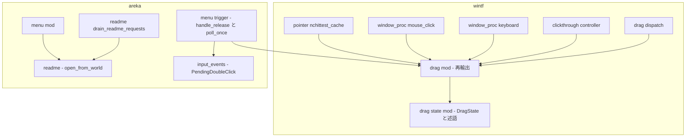
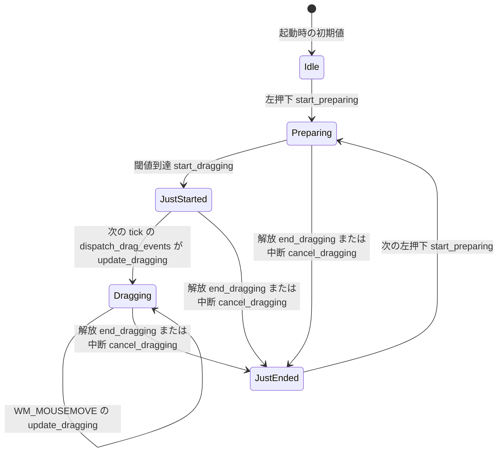
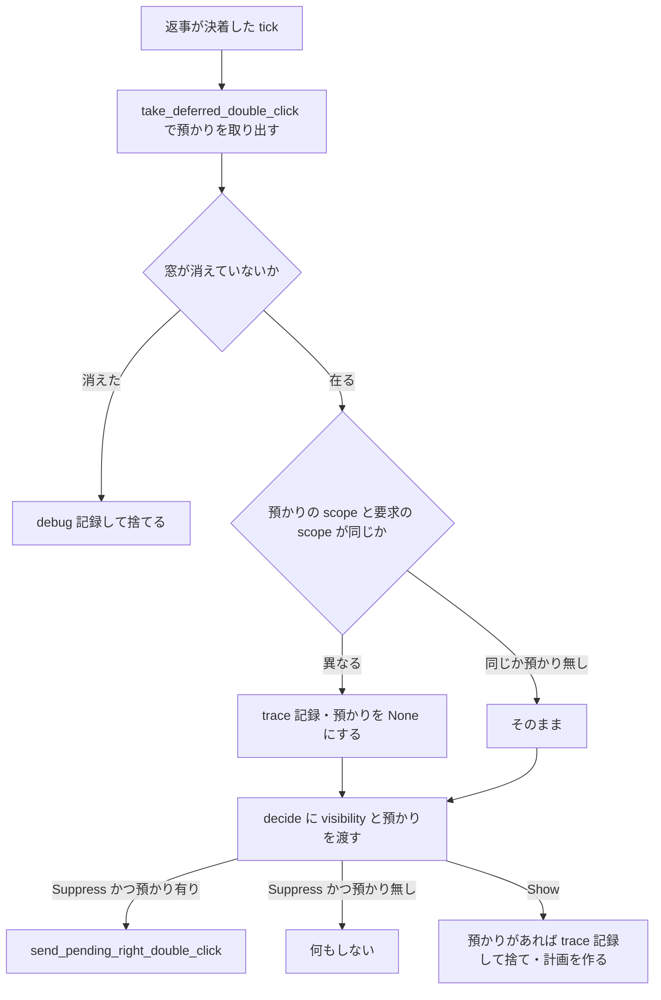

# Design Document: areka-P0-wintf-drag-state-rest-contract

> 実測は 2026-09-23・本ブランチ（main `92f5f448` 相当）。コードは「何の定義か」（関数名・型名＋ファイルパス）で指し、行番号では指さない。
> 設計で決める分かれ目（`research.md` §6）の決着: §6-1＝案 A-1・述語名 `is_button_held`／§6-3＝解放 1 本＋中断 1 本の兄弟 2 本＋述語の真偽表 1 本／§6-4＝C1（`decide` へ渡す前に窓で絞る）／§6-6＝`open_from_world` に `wiring.path.exists()` を直に書く。§6-2・§6-5 は要件で決着済み（要件 1.5・要件 5.1＝`warn!`）。

## Overview

**Purpose**: wintf のドラッグの状態（`crates/wintf/src/ecs/drag/state/mod.rs` の `DragState`）について、説明と実装を一致させ、「左ボタンを押している間か」を 1 つの述語で聞けるようにし、契約が後退したら赤くなる決定論テストを置く。あわせて同じ `crates/areka/src/menu/trigger.rs` を触る相乗り 2 件（別の窓の預かりの誤配・説明書の無いゴーストでの重い記録）を直す。

**Users**: ドラッグの状態を読む開発者（areka のメニュー・今後の D&D・サブメニュー登記）と、その読み違いで右クリックメニューが出なくなる利用者。障害調査で `error!` の行を見る開発者。

**Impact**: 挙動は「説明・述語・記録」以外を 1 ビットも変えない（案 A＝説明を実装に合わせる）。製品の状態遷移は今日のまま（押下 → 解放／中断 → `JustEnded` で休み → 次の押下）。変わるのは ⑴ doc と公開 API の面（述語 1 つ増・`reset_to_idle` 1 つ減）、⑵ `trigger.rs` の `poll_once` の預かりの絞り込み 1 条件、⑶ `readme.rs` の `open_from_world` の実在チェック 1 条件と記録の水準。

### Goals

- `DragState` の 5 つの状態の説明を「どの出来事で入り、どの出来事で出るか」で書き、`JustEnded` が「次の左押下まで休む」ことを明記する（要件 1）。
- 述語 `is_button_held` を `DragState` と `DragStateSnapshot` の両方に置き、「押している間か」だけを聞く読み手 3 か所を寄せる（要件 2）。
- 製品と同じ関数を踏む契約テストを置き、`reset_to_idle` を撤去して既存テストを追随させる（要件 3）。
- 預かった右ダブルクリックは同じ窓の抑止でしか送らない（要件 4）。
- 説明書が無いときの `\![open,readme]` は OS を呼ばず `warn!` 1 行で終える（要件 5）。
- 既存テストは要件 3.5 の 2 本の除外を除き 1 本も変えずに緑（要件 6）。

### Non-Goals

- ドラッグの挙動（閾値・捕捉・窓の移動・`DragAccumulatorResource`・`dispatch_drag_events`）と透過制御の判定規則（`resolve_transition` の枝分け）。
- 「移動中か」（`Dragging | JustStarted`）の述語。読み手が `resolve_transition` の 1 か所しか無いので足さない。
- 値を取り出すために variant を並べる読み手（`crates/wintf/src/ecs/window_proc/keyboard.rs`・`mouse_click.rs`・`mouse_move.rs`）の書き換え。
- `JustEnded` の改名。右・中ボタンのドラッグ。説明書を開く処理を World の借用の外へ出すこと。
- 実機確認。本仕様の変更はすべて決定論テストで到達でき、実機でしか見えない差を作らない。

## Boundary Commitments

### This Spec Owns

- `DragState`／`DragStateSnapshot` の**契約の説明**（`crates/wintf/src/ecs/drag/state/mod.rs` の型 doc と variant doc・module doc）と、述語 `is_button_held` の定義（両型）。
- `reset_to_idle` の撤去（定義と `crates/wintf/src/ecs/drag/mod.rs` の再輸出）。
- 「押している間か」だけを聞く読み手 3 か所の寄せ替え: `start_preparing`（`state/mod.rs`）・`crates/wintf/src/ecs/pointer/nchittest_cache.rs` の `cached_nchittest` の当たり判定・`crates/areka/src/menu/trigger.rs` の `handle_release`。
- `JustStarted` を「直前 1 フレーム」と書く 2 か所の語彙（`crates/wintf/src/ecs/clickthrough/controller.rs` の `resolve_transition` の doc・`docs/click_through.md` の「ドラッグ中の透過抑止」の段落）。
- 契約の決定論テスト（`crates/wintf/src/ecs/drag/state/tests.rs`）と、`reset_to_idle` を使っていた既存テスト 3 か所の追随。
- `trigger.rs` の `poll_once` における預かりの窓の比較 1 条件と記録 1 行、その決定論テスト（`crates/areka/src/menu/trigger_flow_tests.rs`）。
- `crates/areka/src/readme.rs` の `open_from_world` の実在チェックと記録、その決定論テスト（`crates/areka/src/readme_tests.rs`）。

### Out of Boundary

- 状態遷移関数 `start_preparing`／`start_dragging`／`update_dragging`／`end_dragging`／`cancel_dragging` の**判断と副作用**（`start_preparing` は判定式を述語呼び出しへ置き換えるだけで、判定結果は同じ）。
- `check_threshold`（製品の呼び手 0 だが、doc は閾値判定を語るだけで製品の時機を語らない＝要件 1.3 の撤去対象に含めない。これが要件 1.3 後段「0 件」の根拠）。
- `resolve_transition` の枝分け（R5.1〜R5.3）と `crates/wintf/src/runtime/mod.rs` の `wire_click_through` の doc（「`JustEnded` 再収束／R5.2」の文言は本仕様の説明と既に矛盾しないので **変更 0**）。
- `decide`（`trigger.rs`）の引数と判断。`crates/areka/src/menu/trigger_tests.rs` の `decide_*` 2 本は変えない。
- `is_available`（`readme.rs`）と `missing_logged` の初回だけの `debug!`（要件 5.4）。`open` 関数の `error!`（要件 5.3）。
- 右クリックメニューの表示・抑止・項目の動作。`areka-P0-popup-menu-residue` の残件 3〜10。
- `keyboard.rs` の `WM_ACTIVATE` が `JustStarted` で `cancel_dragging` を呼ばない既存の非対称（報告のみ・§Open Questions / Risks）。

### Allowed Dependencies

- wintf 内: `drag/state`（葉）← `drag/mod.rs`（再輸出）← `pointer/nchittest_cache`／`window_proc/*`／`clickthrough/controller`。述語は `state/mod.rs` の中で閉じ、新しい `use` を足さない。
- areka: `menu/trigger.rs` → `wintf::ecs::drag::{snapshot_drag_state}`（述語は写しのメソッドなので `DragStateSnapshot` の import は不要になる）。`readme.rs` は葉のまま（メニューにも入力配線にも依存しない）。
- テスト専用: `log_capture_kit`（`capture_lines`・`LineFormat::LevelFields`）・`temp_path_kit::TempPath`。どちらも対象 crate の `[dev-dependencies]` に既にある。
- 新規の外部依存 0・新規ファイル 0。

### Revalidation Triggers

- 述語 `is_button_held` の真偽表（`Preparing`・`JustStarted`・`Dragging`＝真、`Idle`・`JustEnded`＝偽）を変えるとき → `nchittest_cache.rs`・`start_preparing`・`trigger.rs` の 3 読み手と、下流 spec（`areka-P0-ghost-install`・`areka-P0-ghost-shell-balloon-switch`）の再確認。
- `JustEnded` から `Idle` へ戻す製品の遷移を将来足すとき → 本仕様の契約テストが赤になる。それは「契約を変える」提案なので、先に `DragState` の doc と本設計の状態図を改める。
- `PendingDoubleClick.scope`／`MenuRequest.scope` の意味（本体側 0・相方側 1）を変えるとき → `poll_once` の比較と要件 4.5 のテスト。
- `ReadmeWiring.path` の決め方（`resolve_path`）を変えるとき → 実在チェックの対象が変わるので要件 5.5 のテスト。

## Architecture

### Existing Architecture Analysis

- ドラッグの状態は **thread_local の `RefCell<DragState>`** 1 つ（`state/mod.rs` の `DRAG_STATE`）。読み手は `read_drag_state`（`&DragState`）か `snapshot_drag_state`（`DragStateSnapshot`＝`CaptureGuard` を含まない写し）で読む。可変で触るのは `update_drag_state` 経由の遷移関数だけ。
- 製品の遷移（実測）: 左押下 → `start_preparing`（`Idle`／`JustEnded` → `Preparing`）／閾値到達 → `start_dragging`（`Preparing` → `JustStarted`・`mouse_move.rs`）／次の tick の `dispatch_drag_events`（`crates/wintf/src/ecs/drag/dispatch.rs`・`DragTransition::Started` の腕）→ `update_dragging`（`JustStarted` → `Dragging`）／`WM_MOUSEMOVE` → `update_dragging`（`Dragging` の更新）／解放 → `end_dragging`・中断 → `cancel_dragging`（→ `JustEnded`）。**`JustEnded` → `Idle` の製品の遷移は 0**（`reset_to_idle` の製品の呼び手 0・`crates/wintf/src/ecs/drag/systems.rs` の `cleanup_drag_state` は ECS の `DraggingState` を外すだけ）。
- 遷移関数の内側で `std::mem::replace(state, DragState::Idle)` が一時的に `Idle` を置くが、これは `RefCell` の借用の中で完結し、外からは観測できない（説明に「製品コードが `Idle` へ戻すことは無い」と書いても矛盾しない）。
- 読み手の分類（`crates/` 全域）: 「押している間か」だけを聞く 3 か所（寄せる）／「移動中か」を聞く `resolve_transition` 1 か所（別の問い・寄せない）／値を取り出す `keyboard.rs`・`mouse_click.rs`・`mouse_move.rs`（寄せない）。`keyboard.rs` の `WM_CAPTURECHANGED` は `update_drag_state` で可変に触るので写しの述語では書けない。
- 相乗り 1: `poll_once` は決着した tick に `take_deferred_double_click` で預かりを取り出し、`decide(visibility, deferred.as_ref())` の結果で送る。`decide` は `(Visibility, Option<&PendingDoubleClick>) -> Decision` の純粋関数で scope を見ない。`trigger_tests.rs` の見本は預かり scope 1・要求 scope 0 で組んであるので、`decide` に scope を足すと既存テストが赤になる。
- 相乗り 2: `open_from_world` はメニューの「説明書」（`crates/areka/src/menu/mod.rs`）と台本の要求の取り出し（`drain_readme_requests`）の両方から呼ばれる。ガードを 1 か所に置けば両方を覆う。`is_available` は `missing_logged` を消費するので `open_from_world` から呼ばない（呼ぶとメニュー側の初回 `debug!` が出なくなり要件 5.4 に抵触）。

### Architecture Pattern & Boundary Map



**Architecture Integration**:

- Selected pattern: 既存の型に述語を足す「説明を実装に合わせる」（案 A・A-1）。新しい module・抽象・trait は作らない。
- Domain boundaries: 状態の契約は `state/mod.rs` が唯一の持ち主。読み手は述語を呼ぶだけで variant を知らない。相乗り 2 件は `trigger.rs`・`readme.rs` の既存関数の中に 1 条件ずつ足す。
- Existing patterns preserved: `matches!` 1 行の述語・兄弟テストファイル・`log_capture_kit` によるログ捕捉・`temp_path_kit` の一時パス・`ResetDragState`／`force_idle` による thread_local の後片付け。
- New components rationale: 述語 1 つ（読み手 3 か所が同じ問いを別々に綴っている＝実害 1 件の再発防止）。それ以外の新設は 0。
- Steering compliance: `logging.md` の水準表（`warn!`＝回復可能なエラー・フォールバック／`trace!`＝高頻度の詳細）・`structure.md` の兄弟テスト＋1 ファイル 1,000 行・areka の「ログ無し失敗経路の禁止」。

### Dependency Direction

`drag/state`（葉・thread_local）→ `drag/mod.rs`（再輸出）→ `pointer`／`window_proc`／`clickthrough`（wintf 内の読み手）→ `wintf::ecs::drag`（公開面）→ `areka::menu::trigger`。`areka::readme` は葉で、`menu` と `emo2_boot` から呼ばれる。左から右へしか import しない。本仕様はこの向きを 1 本も足さず、`trigger.rs` の `use wintf::ecs::drag::{DragStateSnapshot, snapshot_drag_state}` から `DragStateSnapshot` を外す（使わなくなる）。

### Technology Stack

| Layer | Choice / Version | Role in Feature | Notes |
|-------|------------------|-----------------|-------|
| UI 基盤（wintf） | Rust 2024・bevy_ecs 0.19・windows 0.62.2 | `DragState` の契約と述語・読み手 2 か所 | 新規依存 0 |
| アプリ（areka） | Rust 2024・tracing | `trigger.rs` の 1 条件＋`trace!`・`readme.rs` の 1 条件＋`warn!` | 新規依存 0 |
| テスト | `log-capture-kit`・`temp-path-kit`（既存 dev-dependencies） | 記録の捕捉と一時フォルダ | 迂回検知の見張りに従う（直接 `with_default` を使わない） |

## File Structure Plan

新規ファイルは 0。触るのは既存 11 ファイル（製品 6・テスト 4・文書 1）。

### Modified Files

**wintf（状態の契約）**
- `crates/wintf/src/ecs/drag/state/mod.rs` — ⑴ module doc と `DragState` の型 doc・5 variant の doc を「入る出来事／出る出来事」で書き直す（§Components「DragState の契約」の表の文言）。⑵ `DragStateSnapshot` の型 doc に「各 variant の意味は `DragState` と同じ」を 1 行足す。⑶ `impl DragState` と `impl DragStateSnapshot` に `is_button_held` を各 1 つ。⑷ `start_preparing` の判定式を `state.is_button_held()` へ。⑸ `reset_to_idle` の定義を削除。
- `crates/wintf/src/ecs/drag/mod.rs` — `pub use state::{…}` から `reset_to_idle` を外す。
- `crates/wintf/src/ecs/pointer/nchittest_cache.rs` — `cached_nchittest` の `read_drag_state(|state| matches!(…))` を `read_drag_state(|state| state.is_button_held())` へ。ローカル変数名は `is_dragging` から `button_held` へ（`Preparing` は「ドラッグ中」ではないので名前も揃える）。`HTTRANSPARENT` の定数 doc 1 か所と `cached_nchittest` の中のコメント 2 か所（「DragState ガード: ドラッグ中は透明領域でも…」「ドラッグ中は DragState ガードで…」）の「ドラッグ中」は「左ボタンを押している間」へ（module doc にこの語は無い）。
- `crates/wintf/src/ecs/clickthrough/controller.rs` — `resolve_transition` の doc の判定順序 1 で `JustStarted` を「直前 1 フレーム」と書く箇所を「閾値到達から次の tick の `dispatch_drag_events` まで」へ。判定式は触らない。
- `docs/click_through.md` — 「ドラッグ中の透過抑止」の段落の同じ語を同じ文言へ。

**areka（相乗り）**
- `crates/areka/src/menu/trigger.rs` — ⑴ `handle_release` の `!matches!(snapshot_drag_state(), Idle | JustEnded{..})` を `snapshot_drag_state().is_button_held()` へ（コメントも「`JustEnded` は押していない」の意味へ）。`use` から `DragStateSnapshot` を外す。⑵ `poll_once` で `decide` へ渡す前に預かりを窓で絞り、落ちたときに `trace!`（event `menu_deferred_double_click_scope_mismatch`）。
- `crates/areka/src/readme.rs` — `open_from_world` で `open` を呼ぶ前に `wiring.path.exists()` を見て、無ければ `warn!`（event `readme_open_skipped_missing`・パス付き）で戻る。doc に「無ければ OS を呼ばない」を足す。

**テスト**
- `crates/wintf/src/ecs/drag/state/tests.rs`（現在 499 行） — `test_reset_to_idle_only_from_just_ended`・`test_reset_to_idle_noop_when_preparing` を削除。述語の真偽表 1 本・解放の契約 1 本・中断の契約 1 本を追加（見込み 530〜560 行）。
- `crates/wintf/src/ecs/clickthrough/controller_tests.rs`（現在 642 行） — `eval_honors_drag_snapshot_just_ended_reconverges` の後片付け `reset_to_idle()` を `update_drag_state(|s| *s = DragState::Idle)` へ。`use` から `reset_to_idle` を外す。確かめる内容は変えない。
- `crates/areka/src/menu/trigger_flow_tests.rs`（現在 863 行） — scope を引数に取るヘルパ `defer_double_click_from(world, scope)` を足し、既存 `defer_double_click` はそれを scope 0 で呼ぶ形に（既存テストの本文は不変）。「窓 1 の預かり＋窓 0 の要求＋抑止」のテスト 1 本を追加（見込み 900〜920 行・1,000 未満）。
- `crates/areka/src/readme_tests.rs`（現在 214 行） — ファイルの無い一時フォルダで `open_from_world` を呼ぶテスト 1 本を追加。

## System Flows

### ドラッグの状態遷移（製品の遷移のみ・本仕様後の説明と一致）



- `JustEnded` から出る辺は `start_preparing` の 1 本だけ。`Idle` へ戻る辺は無い（`reset_to_idle` 撤去後は定義そのものも無い）。
- 述語 `is_button_held` は `Preparing`・`JustStarted`・`Dragging` の 3 状態で真。図の「押下から解放・中断まで」の区間と一致する。
- 図に無い遷移は本仕様で 1 つも足さず 1 つも減らさない（要件 1.4・6.1）。

### 預かった右ダブルクリックの行き先（`poll_once`・C1）



- 「送る／送らない」を決めるのは引き続き `decide` の 1 か所。窓の比較は `decide` への入力（`Option<&PendingDoubleClick>`）を絞るだけで、`decide` の引数も既存テストも変えない（要件 4.4・6.5）。
- 絞り込みは返事の種類より前に行うので、**表示に決着したときも窓が異なる預かりは `scope_mismatch` の行で捨てる**（既存の `menu_deferred_double_click_dropped` の行は出ない）。要件 4.3 が求めるのは「送らない」ことだけで、記録の行はどちらも `trace!` で「捨てた」の意味である。同じ窓の預かり＋表示のときは今日と同じ `dropped` の行が出る（既存テスト `a_late_showing_reply_drops_the_right_double_click_and_builds_the_plan` は緑のまま）。

## Requirements Traceability

| Requirement | Summary | Components | Interfaces | Flows |
|-------------|---------|------------|------------|-------|
| 1.1 | 5 状態を出来事で説明・フレーム数で説明しない | DragState の契約 | variant doc の表 | 状態遷移図 |
| 1.2 | `JustEnded` は次の左押下まで休む・`Idle` へ戻さない | DragState の契約 | `JustEnded` の doc | 状態遷移図 |
| 1.3 | `reset_to_idle` 撤去・時機を語る呼び手 0 の関数 0 | DragState の契約 | `drag/mod.rs` の再輸出 | — |
| 1.4 | 遷移を足さず減らさず | DragState の契約・読み手の寄せ替え | `start_preparing` | 状態遷移図 |
| 1.5 | R5.2 の説明を保つ・「直前 1 フレーム」2 か所を直す | 透過制御の語彙 | `resolve_transition` doc・`docs/click_through.md` | — |
| 2.1 | 述語 1 つ・真偽表 | 述語 `is_button_held` | `DragState::is_button_held` | — |
| 2.2 | 写しと状態そのものの両方から呼べる | 述語 `is_button_held` | `DragStateSnapshot::is_button_held` | — |
| 2.3 | wintf の読み手 2 か所を寄せる・結果不変 | 読み手の寄せ替え | `start_preparing`・`cached_nchittest` | — |
| 2.4 | `handle_release` を寄せる・結果不変 | 読み手の寄せ替え | `handle_release` | — |
| 2.5 | 「押している間か」のためだけの並びを 0 に | 読み手の寄せ替え | 3 読み手 | — |
| 2.6 | `resolve_transition`・値取り出しの読み手は不変 | Out of Boundary | — | — |
| 3.1 | 兄弟テストに製品と同じ関数を踏む契約テスト | 契約テスト | `state/tests.rs` | — |
| 3.2 | 解放直後に述語が偽・他の関数無しで次の押下を受ける | 契約テスト | 解放の契約テスト | — |
| 3.3 | 契約が後退したら赤 | 契約テスト | 解放・中断の契約テスト | — |
| 3.4 | 中断でも同じ契約 | 契約テスト | 中断の契約テスト | — |
| 3.5 | 既存 2 本を除外・`controller_tests.rs` の後片付けを置換 | 既存テストの追随 | `update_drag_state` | — |
| 3.6 | `a_release_after_a_finished_left_click_still_opens_the_menu` を緑のまま | 読み手の寄せ替え | `handle_release` | — |
| 3.7 | テストファイル 1,000 行以内 | 契約テスト | `state/tests.rs` の行数 | — |
| 4.1 | 同じ窓の預かり＋抑止 → 送る | 預かりの窓の絞り込み | `poll_once` | 預かりの流れ図 |
| 4.2 | 異なる窓 → 捨てて `trace!` | 預かりの窓の絞り込み | event `menu_deferred_double_click_scope_mismatch` | 預かりの流れ図 |
| 4.3 | 表示に決着 → 捨てる | 預かりの窓の絞り込み | `decide` の `Show` | 預かりの流れ図 |
| 4.4 | 判断は `decide` 1 か所・比較は入力 | 預かりの窓の絞り込み | `decide` 不変 | 預かりの流れ図 |
| 4.5 | 窓 1 の預かり＋窓 0 の要求＋抑止のテスト | 相乗り 1 のテスト | `trigger_flow_tests.rs` | — |
| 4.6 | 同じ窓の既存確認を緑のまま | 相乗り 1 のテスト | `a_late_suppressing_reply_still_delivers_the_right_double_click` | — |
| 5.1 | ファイルが無ければ OS を呼ばず `warn!` 1 行 | 説明書の実在チェック | `open_from_world`・event `readme_open_skipped_missing` | — |
| 5.2 | ファイルが在れば今日と同じく開く | 説明書の実在チェック | `open` | — |
| 5.3 | 開けない失敗は今日と同じ `error!` | Out of Boundary | `open` の `readme_open_failed` | — |
| 5.4 | メニュー側の振る舞い不変 | 説明書の実在チェック | `is_available` を呼ばない | — |
| 5.5 | 無いフォルダで `open_from_world` のテスト | 相乗り 2 のテスト | `readme_tests.rs` | — |
| 6.1 | ドラッグの挙動不変 | Out of Boundary | — | 状態遷移図 |
| 6.2 | 透過制御の判定規則不変 | Out of Boundary | `resolve_transition` の判定式 | — |
| 6.3 | 右クリックメニュー不変 | Out of Boundary | — | — |
| 6.4 | 既存 event 名不変・新規は新名 | 記録の語彙 | 2 つの新 event 名 | — |
| 6.5 | 既存テストを（除外 2 本以外）変えず緑 | 既存テストの追随 | 全テストファイル | — |

## Components and Interfaces

| Component | Domain/Layer | Intent | Req Coverage | Key Dependencies (P0/P1) | Contracts |
|-----------|--------------|--------|--------------|--------------------------|-----------|
| DragState の契約 | wintf `drag/state` | 5 状態の説明を出来事で書き、`reset_to_idle` を撤去 | 1.1, 1.2, 1.3, 1.4 | `drag/mod.rs` 再輸出 (P0) | State |
| 述語 `is_button_held` | wintf `drag/state` | 「左ボタンを押している間か」を 1 つで答える | 2.1, 2.2 | DragState の契約 (P0) | Service |
| 読み手の寄せ替え | wintf `drag/state`・`pointer`／areka `menu` | 3 読み手を述語へ・結果不変 | 2.3, 2.4, 2.5, 1.4, 3.6 | 述語 (P0) | — |
| 透過制御の語彙 | wintf `clickthrough`・`docs/` | 「直前 1 フレーム」2 か所を出来事の語へ | 1.5 | — | — |
| 契約テスト | wintf `drag/state/tests.rs` | 製品と同じ関数を踏み、後退したら赤 | 3.1, 3.2, 3.3, 3.4, 3.7 | `force_idle` ヘルパ (P1) | — |
| 既存テストの追随 | wintf `drag/state/tests.rs`・`clickthrough/controller_tests.rs` | 2 本除外・後片付け 1 か所置換 | 3.5, 6.5 | `update_drag_state` (P0) | — |
| 預かりの窓の絞り込み | areka `menu/trigger.rs` | 預かりを `decide` へ渡す前に窓で絞る | 4.1, 4.2, 4.3, 4.4 | `PendingDoubleClick.scope`・`MenuRequest.scope` (P0)・`decide` (P0) | Event |
| 説明書の実在チェック | areka `readme.rs` | 無ければ OS を呼ばず `warn!` | 5.1, 5.2, 5.4 | `ReadmeWiring.path` (P0)・`open` (P0) | Event |
| 相乗り 1 のテスト | areka `menu/trigger_flow_tests.rs` | 窓 1 の預かり＋窓 0 の要求＋抑止 | 4.5, 4.6 | `fixture`・`take_query`・`menu_lines` (P1) | — |
| 相乗り 2 のテスト | areka `readme_tests.rs` | 無いフォルダで `open_from_world` | 5.5 | `wired`・`TempPath`・`capture` (P1) | — |
| 記録の語彙 | areka | 新 event 名 2 つ・既存は不変 | 6.4 | `logging.md` の水準表 | Event |

### wintf: ドラッグの状態の契約

#### DragState の契約

| Field | Detail |
|-------|--------|
| Intent | `DragState`／`DragStateSnapshot` の説明を実装と一致させ、製品の呼び手が無い `reset_to_idle` を撤去する |
| Requirements | 1.1, 1.2, 1.3, 1.4 |

**Responsibilities & Constraints**
- `crates/wintf/src/ecs/drag/state/mod.rs` が唯一の持ち主。説明は「入る出来事／出る出来事」で書き、「1 フレームのみ」「dispatch_drag_events 後」のようなフレーム数・製品の時機を語る表現を使わない。
- 各 variant の doc は次の表の内容を含む（文言は実装者の裁量だが、出来事と関数名は表のとおり）:

| 状態 | 入る出来事 | 出る出来事 |
|------|-----------|-----------|
| `Idle` | 起動時の初期値。製品コードがここへ戻す遷移は無い | 左押下（`start_preparing`）で `Preparing` へ |
| `Preparing` | 左押下（`start_preparing`・`crates/wintf/src/ecs/window_proc/mouse_click.rs` の `handle_button_message`）。捕捉を取得 | 閾値到達（`start_dragging`・`mouse_move.rs`）で `JustStarted` へ／解放（`end_dragging`）・中断（`cancel_dragging`）で `JustEnded` へ |
| `JustStarted` | 閾値到達（`start_dragging`） | 次の tick の `dispatch_drag_events`（`crates/wintf/src/ecs/drag/dispatch.rs`・`DragTransition::Started` の腕）が `update_dragging` を呼んで `Dragging` へ／解放・中断で `JustEnded` へ |
| `Dragging` | `update_dragging`（`JustStarted` から） | `WM_MOUSEMOVE` の `update_dragging` で位置を更新（`Dragging` のまま）／解放・中断で `JustEnded` へ |
| `JustEnded` | 解放（`end_dragging`）または中断（`cancel_dragging`）。捕捉は解放済み | **次の左押下（`start_preparing`）で `Preparing` へ。それまでここで休む。製品コードがこの状態を `Idle` へ戻すことは無い** |

- `reset_to_idle` は定義（`state/mod.rs`）と再輸出（`drag/mod.rs`）を消す。撤去後の公開 API に「製品の呼び手 0 で製品の時機を語る関数」は 0 件（`check_threshold` は閾値判定の説明しか持たないので対象外・§Out of Boundary）。
- 遷移関数の本文は変えない（`start_preparing` の判定式の置き換えを除く）。製品の遷移を 1 つも足さず減らさない。

**Dependencies**
- Inbound: `drag/mod.rs` の `pub use state::{…}` — 再輸出（P0）。読み手 8 か所（§Existing Architecture Analysis）。
- Outbound: なし（葉）。

**Contracts**: State [x]

##### State Management
- State model: 上の表＝§System Flows の状態図。thread_local 1 つ・単一ドラッグ。
- Persistence & consistency: プロセス寿命の間だけ。`JustEnded` は次の押下まで残る（写しを取っても値は変わらない）。
- Concurrency strategy: UI スレッド固定（thread_local）。変更なし。

**Implementation Notes**
- Integration: `drag/mod.rs` の `pub use` の 1 語削除と同じコミットで、テスト 3 か所（§既存テストの追随）を追随させる（そうしないと `cargo test -p wintf` が compile で落ちる）。
- Validation: `rg reset_to_idle crates/` が `trigger.rs` の doc コメント（「`reset_to_idle` の呼び手は無い」）を除いて 0 件になる。その doc コメントも述語へ寄せる際に「`JustEnded` は押していない」の意味へ書き換えるので、最終的に 0 件。
- Risks: doc の書き直しで `JustStarted` の出口を「次のポインタ移動」と書く誤り（要件ディスカッションで訂正済み・正しくは「次の tick の `dispatch_drag_events`」）。

#### 述語 `is_button_held`

| Field | Detail |
|-------|--------|
| Intent | 「左ボタンを押している間か」を variant を並べずに 1 つの述語で答える |
| Requirements | 2.1, 2.2 |

**Responsibilities & Constraints**
- `DragState` と `DragStateSnapshot` の両方に同名のメソッドを置く（案 A-1）。どちらも `matches!` 1 行で、variant の並びは述語の定義 2 か所にだけ残る（それは「答えるためだけに並べている箇所」ではなく定義そのもの）。
- 写しを経由しない（A-2 を採らない）ので、`WM_NCHITTEST` の cache miss 経路に写しを作る費用を乗せない。thread_local を読む自由関数（A-3）は足さない——読み手は `read_drag_state(|s| s.is_button_held())`／`snapshot_drag_state().is_button_held()` の 1 行で書ける。
- 名前は `is_button_held`（brief の例）。`DragState` 自体はどのボタンかを持たないので「left」を名前に入れない。doc に「左ボタン（製品で `start_preparing` を呼ぶのは左押下のみ）」と書く。

**Contracts**: Service [x]

##### Service Interface
```rust
impl DragState {
    /// 左ボタンを押している間か。
    /// `Preparing`・`JustStarted`・`Dragging` で真、`Idle`・`JustEnded` で偽。
    /// 「ドラッグ中か」ではない（`Preparing` は閾値未到達だが押している）。
    pub fn is_button_held(&self) -> bool;
}

impl DragStateSnapshot {
    /// [`DragState::is_button_held`] と同じ真偽表（写しから聞く）。
    pub fn is_button_held(&self) -> bool;
}
```
- Preconditions: なし（どの状態でも呼べる・副作用なし）。
- Postconditions: 真偽表のとおり。`snapshot()` を挟んでも値は同じ。
- Invariants: 真偽表は §System Flows の状態図の「押下から解放・中断まで」の区間と一致する。

**Implementation Notes**
- Validation: 述語の真偽表テスト（§契約テスト）が 5 状態すべてを製品の関数で組んで両型の述語を確かめる。
- Risks: なし。

#### 読み手の寄せ替え

| Field | Detail |
|-------|--------|
| Intent | 「押している間か」だけを聞く 3 読み手を述語へ寄せ、判定結果を変えない |
| Requirements | 2.3, 2.4, 2.5, 1.4, 3.6 |

**Responsibilities & Constraints**
- `start_preparing`（`state/mod.rs`）: `if matches!(state, Preparing{..} | JustStarted{..} | Dragging{..})` → `if state.is_button_held()`。無視の `debug!` はそのまま。
- `cached_nchittest`（`nchittest_cache.rs`）: `read_drag_state(|state| matches!(…))` → `read_drag_state(|state| state.is_button_held())`。変数名 `is_dragging` → `button_held`。`HTCLIENT` を強制する条件（`button_held || hit_result.is_some()`）は同じ。
- `handle_release`（`trigger.rs`）: `if !matches!(snapshot_drag_state(), Idle | JustEnded{..})` → `if snapshot_drag_state().is_button_held()`。無視の理由文字列 `"dragging"` は既存の記録の語彙なので変えない（要件 6.4）。
- 寄せ替え後、製品コードに「押している間か」を答えるためだけに variant を並べる箇所は 0。残る並びは `resolve_transition`（「移動中か」）と値取り出しの 3 ファイルだけで、どれも触らない（要件 2.6）。

**Implementation Notes**
- Validation: `a_release_after_a_finished_left_click_still_opens_the_menu`（`trigger_flow_tests.rs`）と `a_release_while_dragging_is_ignored_and_drops_the_deferred_double_click` が緑のまま（要件 3.6）。`start_preparing` は既存 `test_start_preparing_ignored_when_already_active`／`test_start_preparing_allowed_from_just_ended` が緑のまま。
- Risks: `trigger.rs` の `use` から `DragStateSnapshot` を外し忘れると `unused_imports` の警告（エラーではない）。

#### 透過制御の語彙

| Field | Detail |
|-------|--------|
| Intent | `JustStarted` を「直前 1 フレーム」と書く 2 か所を要件 1.1 と同じ出来事の語へ |
| Requirements | 1.5 |

**Responsibilities & Constraints**
- `controller.rs` の `resolve_transition` の doc・判定順序 1: 「その直前 1 フレームの `JustStarted`」→「閾値到達から次の tick の `dispatch_drag_events` までの `JustStarted`」。判定順序 2（`JustEnded` 再収束・R5.2）の文言「ドラッグ終了直後は抑止を解除し、現在の `hit` に基づく非ドラッグ写像へ委ねる」は本仕様の説明と矛盾しないので **変更 0**。
- `docs/click_through.md` の「ドラッグ中の透過抑止」の段落: 同じ語を同じ文言へ。「ドラッグ終了直後（`JustEnded`）のサイクルで抑止を解除し…再収束する」は変更 0。
- `runtime/mod.rs` の `wire_click_through` の doc（「`JustEnded` 再収束／R5.2」）は **変更 0**（既に「終了直後の周で固定が外れ現在の当たりへ戻る」の意味）。
- 判定式（`resolve_transition` の `match`）は触らない（要件 6.2）。

### wintf: テスト

#### 契約テスト

| Field | Detail |
|-------|--------|
| Intent | 製品と同じ関数を踏み、「解放・中断のあとは次の左押下まで休む」契約が後退したら赤くなる |
| Requirements | 3.1, 3.2, 3.3, 3.4, 3.7 |

**Responsibilities & Constraints**
- 置き場は `crates/wintf/src/ecs/drag/state/tests.rs`（歴史的形式の兄弟テスト・既存のまま）。既存ヘルパ `force_idle`・`entity`・`null_hwnd`・`variant_name` を使う。手で組んだ状態から始めない。
- 3 本を足す:
  1. **述語の真偽表** — `force_idle` → `Idle` で偽 → `start_preparing` → 真 → `start_dragging` → 真 → `update_dragging(_, None)` → 真 → `end_dragging` → 偽。各段で `read_drag_state(|s| s.is_button_held())` と `snapshot_drag_state().is_button_held()` の両方を確かめる（要件 2.1・2.2 の到達）。
  2. **解放の契約** — `start_preparing` → `end_dragging`。直後に ⑴ 写しが `JustEnded`、⑵ 述語が偽（両型）、⑶ **他の関数を 1 つも呼ばずに** `start_preparing`（別の entity）が受け付けられ `Preparing` でその entity になる。
  3. **中断の契約** — `start_preparing` → `start_dragging` → `cancel_dragging`。確かめる内容は 2 と同じ。
- 期待値は書き下す（実装から導かない）。テストの末尾は `force_idle()`。
- 既存の `test_start_preparing_allowed_from_just_ended` は触らない（重なる確認があっても既存を変えない・要件 6.5）。

**Implementation Notes**
- Validation: 将来 `JustEnded` を述語で真にする、または `JustEnded` からの `start_preparing` を拒む、または解放後に `Idle` へ自動で戻す変更を入れると 2・3 が赤になる（`Idle` へ戻す変更は ⑴ で赤）。
- Risks: 行数。2 本削除（約 28 行）＋3 本追加（約 60〜80 行）で 530〜560 行・上限 1,000 に対して十分。

#### 既存テストの追随

| Field | Detail |
|-------|--------|
| Intent | `reset_to_idle` を使っていた 3 か所を追随させる |
| Requirements | 3.5, 6.5 |

**Responsibilities & Constraints**
- `state/tests.rs`: `test_reset_to_idle_only_from_just_ended`・`test_reset_to_idle_noop_when_preparing` を区切りコメント（`// --- reset_to_idle ---`）ごと削除（陳腐化）。
- `controller_tests.rs` の `eval_honors_drag_snapshot_just_ended_reconverges`: 後片付けの `reset_to_idle();` を `update_drag_state(|s| *s = DragState::Idle);` へ。`JustEnded` は `CaptureGuard` を持たないので借用の中で代入しても `ReleaseCapture` は走らない（`trigger_flow_tests.rs` の `ResetDragState` は `end_dragging` で捕捉を借用の外へ出してから `update_drag_state` で `Idle` を代入する 2 段。ここは後片付けの時点で既に `JustEnded`＝捕捉なしなので、代入の 1 段だけで同じ作法になる）。`use` 行から `reset_to_idle` を外す。確かめる内容（`JustEnded` で現在の当たりへ再収束）は変えない。
- それ以外の既存テストは 1 本も変えない。

### areka: 相乗り

#### 預かりの窓の絞り込み

| Field | Detail |
|-------|--------|
| Intent | 預かった右ダブルクリックを、預かりの窓と要求の窓が同じときだけ `decide` へ渡す |
| Requirements | 4.1, 4.2, 4.3, 4.4 |

**Responsibilities & Constraints**
- 置き場は `trigger.rs` の `poll_once`。`take_deferred_double_click` で取り出した `deferred` を、`scope`（`request.scope`）を決めた直後・`decide` の前に絞る:
  - `deferred.scope == scope` → そのまま。
  - 異なる → `trace!`（下の Event Contract）を 1 行出して `None` にする。
- `decide` の引数・本文・doc は変えない。`Decision::Suppress { send_double_click }` の腕の送出も変えない。「送る／送らない」の判断は `decide` 1 か所のまま（要件 4.4）。
- 絞り込みは返事の種類（`Show`／`Suppress`）より前なので、表示に決着したときも窓が異なる預かりは `scope_mismatch` の行で捨てる（§System Flows の注記）。同じ窓＋表示は今日どおり `menu_deferred_double_click_dropped`。
- 窓が消えていた（`WindowHandle` 無し）経路は絞り込みの前に戻るので今日と同じ（預かりは取り出し済みで捨てられる）。

**Dependencies**
- Inbound: `poll_menu_query`（毎 tick の system）— 呼び手（P0）。
- Outbound: `PendingDoubleClick.scope`（`crates/areka/src/input_events/mod.rs`）・`MenuRequest.scope`・`decide`・`MouseWiring::send_pending_right_double_click`（P0）。

**Contracts**: Event [x]

##### Event Contract
- Published: `tracing::trace!` 1 行。event `menu_deferred_double_click_scope_mismatch`・fields `request_scope`（要求の窓）・`deferred_scope`（預かりの窓）・message `"[menu] dropped the deferred right double-click: it belongs to another window"`。
- 既存の event 名（`menu_deferred_double_click_dropped`・`menu_release_ignored` など）は変えない（要件 6.4）。
- Ordering: 絞り込みの行は `interpret` の抑止の `info!` より前に出る（絞り込みが `interpret` より前にあるため）。順序に依存する読み手は無い。

**Implementation Notes**
- Validation: §相乗り 1 のテスト。既存の `decide_*` 2 本（`trigger_tests.rs`・預かり scope 1・要求 scope 0 の見本）は `decide` が変わらないので緑のまま。
- Risks: 実害の条件は「返事待ち 1 秒未満に別の窓で右クリック 1 回＋右押下」で実質届かないが、届けば別の窓へ誤配する。本設計後は届かない。

#### 説明書の実在チェック

| Field | Detail |
|-------|--------|
| Intent | 説明書のファイルが無ければ OS を呼ばず `warn!` 1 行で終える |
| Requirements | 5.1, 5.2, 5.4 |

**Responsibilities & Constraints**
- 置き場は `readme.rs` の `open_from_world`。`ReadmeWiring` を取り出した後・`open` を呼ぶ前に `wiring.path.exists()` を見る。無ければ `warn!` を出して戻る（`open` を呼ばない＝`ShellExecuteW` 0 回）。在れば今日どおり `open(&wiring.path)`。
- `is_available` は呼ばない（`missing_logged` を消費してメニュー側の初回 `debug!` を奪うため・要件 5.4）。`exists()` が `is_available` と `open_from_world` の 2 か所に並ぶが、片方は「灰色にするか」、もう片方は「開くか」で問いが違う。
- 記録の水準は `warn!`（2026-09-23 開発者裁定・`logging.md` の「回復可能なエラー・フォールバック」）。要求 1 件につき 1 行（初回だけにしない——台本が「無いものを開け」と言った回数が障害調査の材料になる）。
- `open` 関数（`error!` の `readme_open_failed`）は変えない（要件 5.3）。メニューの「説明書」と台本の `drain_readme_requests` の両方がこの 1 か所を通る。

**Contracts**: Event [x]

##### Event Contract
- Published: `tracing::warn!` 1 行。event `readme_open_skipped_missing`・field `path`（`%wiring.path.display()`）・message `"[readme] readme file not found: nothing to open, the ghost keeps running"`。
- 既存の `readme_missing`（`debug!`・メニュー側）・`readme_open_failed`（`error!`）・`readme_opened`（`info!`）・`readme_open_no_wiring`（`warn!`）は変えない。

**Implementation Notes**
- Validation: §相乗り 2 のテスト。既存 `open_records_a_missing_file_as_an_error_and_returns_err` は `open` を直接呼ぶので今日どおり `error!` を確かめ続ける（要件 5.3 の証跡）。
- Risks: `exists()` と `ShellExecuteW` の間でファイルが消える競合は「在ったが開けない」＝`error!` の経路で、今日と同じ。

### areka: テスト

#### 相乗り 1 のテスト

| Field | Detail |
|-------|--------|
| Intent | 「窓 1 の預かり＋窓 0 の要求＋抑止の返事」で kanade へ何も届かず、預かりが残らず、記録の行が出る |
| Requirements | 4.5, 4.6 |

**Responsibilities & Constraints**
- 置き場は `crates/areka/src/menu/trigger_flow_tests.rs`（863 行 → 見込み 900〜920 行・1,000 未満なので兄弟ファイルは作らない）。
- ヘルパ `defer_double_click_from(world: &mut World, scope: u32)` を足し、既存 `defer_double_click(world)` はそれを `0` で呼ぶ形に書き換える（既存テストの本文と期待値は不変）。
- テスト 1 本: `fixture()`（窓は scope 0）→ `handle_release`（scope 0 の要求）→ `take_query` → `defer_double_click_from(&mut f.world, 1)` → 返事 `sakura.popupmenu.visible`＝`"0"` → `capture_lines(LineFormat::LevelFields, || poll_once(…))`。確かめる: `ready.is_none()`／`f.kanade.try_recv().is_err()`（何も届かない）／`!deferred_double_click_remains(&mut f.world)`／`!in_flight(&f.world)`／`menu_lines(&lines, "TRACE")` に `menu_deferred_double_click_scope_mismatch` かつ `request_scope=0` かつ `deferred_scope=1` を含む行が 1 本。
- 既存の `a_late_suppressing_reply_still_delivers_the_right_double_click`（同じ窓＋抑止 → 1 件届く）は緑のまま（要件 4.6）。

#### 相乗り 2 のテスト

| Field | Detail |
|-------|--------|
| Intent | ファイルの無い一時フォルダで `open_from_world` を呼ぶと OS を呼ばず `warn!` 1 行 |
| Requirements | 5.5 |

**Responsibilities & Constraints**
- 置き場は `crates/areka/src/readme_tests.rs`（214 行 → 見込み 240 行）。既存ヘルパ `wired`・`capture`・`lines_of` と `TempPath` を使う。
- テスト 1 本: `TempPath::new("readme-open-missing")` → `wired(&mut world, dir.child("readme.txt"))`（置かない）→ `capture(|| open_from_world(&world))`。確かめる: `readme_open_failed` 0 行・`readme_opened` 0 行（OS を呼んでいない）・`readme_open_skipped_missing` 1 行で `level=WARN` かつパス（`readme.txt`）を含む。
- module doc の「`open` は OS を触るので決定論テストに入れない」はそのまま（このテストは `open` に到達しない）。

## Data Models

本仕様はデータの形を変えない。`DragState`／`DragStateSnapshot`／`PendingDoubleClick`／`MenuRequest`／`ReadmeWiring` の欄は増減 0。変わるのは `DragState` の**説明**と、状態を読む述語の有無だけである。

## Error Handling

### Error Strategy

失敗経路に記録の無いものを作らない（areka の規律）。本仕様で足す記録は 2 行で、どちらも新しい event 名。

| 出来事 | 水準 | event | 場所 | 根拠 |
|-------|------|-------|------|------|
| 別の窓の預かりを捨てた | `trace!` | `menu_deferred_double_click_scope_mismatch` | `trigger.rs` の `poll_once` | 高頻度ではないが利用者に見える異常ではない（要件 4.2） |
| 説明書が無いので開かなかった | `warn!` | `readme_open_skipped_missing` | `readme.rs` の `open_from_world` | 回復可能なフォールバック（要件 5.1・開発者裁定） |

既存の記録（`[drag]` の `debug!`・`[menu]` の各 event・`[readme]` の `readme_missing`／`readme_open_failed`／`readme_opened`）は語彙も水準も変えない（要件 6.4）。

### Monitoring

決定論テストが `log_capture_kit` で記録の行数と水準を判定する（印字だけにしない）。実機の観測は要らない。

## Testing Strategy

### Unit Tests（wintf・`cargo test -p wintf`）
- 述語の真偽表: 5 状態を製品の関数で組み、`DragState`／`DragStateSnapshot` の両方の `is_button_held` を確かめる（2.1・2.2）。
- 解放の契約: `start_preparing` → `end_dragging` の直後に述語が偽・写しが `JustEnded`・他の関数を呼ばずに次の `start_preparing` が `Preparing` になる（3.1・3.2・3.3）。
- 中断の契約: `start_preparing` → `start_dragging` → `cancel_dragging` で同じ（3.4）。
- 除外 2 本（`test_reset_to_idle_*`）と後片付けの置換 1 か所（`controller_tests.rs`）以外、既存テストは不変で緑（3.5・6.5）。`resolve_transition` の in-source テストと `controller_tests.rs` の `just_ended_reconverges_*` が緑のまま＝透過制御の判定規則が不変（6.2）。

### Unit Tests（areka・`cargo test -p areka`）
- 窓 1 の預かり＋窓 0 の要求＋抑止 → kanade へ 0 件・預かり残らず・`scope_mismatch` の `trace!` 1 行（4.2・4.5）。
- 既存: 同じ窓＋抑止 → 1 件届く（4.1・4.6）／同じ窓＋表示 → 捨てて計画（4.3）／`decide_*` 2 本（4.4）／`a_release_after_a_finished_left_click_still_opens_the_menu`（2.4・3.6）。
- ファイルの無い一時フォルダで `open_from_world` → `readme_open_failed` 0・`readme_opened` 0・`readme_open_skipped_missing` 1（`WARN`・パス付き）（5.1・5.5）。
- 既存: `is_available_follows_the_file_and_records_the_absence_only_once`（5.4）／`open_records_a_missing_file_as_an_error_and_returns_err`（5.3）。

### 静的な確認（実装完了時に 1 度）
- `rg reset_to_idle crates/ docs/` が 0 件。
- `rg "DragState(Snapshot)?::(Preparing|JustStarted|Dragging)" crates/` の製品コードの残りが `resolve_transition`・`keyboard.rs`・`mouse_click.rs`・`mouse_move.rs`・述語の定義 2 か所・遷移関数の内側だけ（2.5・2.6）。
- `rg "1 ?フレーム" crates/wintf/src/ecs/drag/state/mod.rs crates/wintf/src/ecs/clickthrough/controller.rs docs/click_through.md` が `DragState` の説明・`resolve_transition` の doc・「ドラッグ中の透過抑止」の段落で 0 件（1.1・1.5。`runtime/mod.rs` の別の文脈の「1 フレーム」は対象外）。
- 触ったテストファイル 4 本の総行数がどれも 1,000 未満（3.7）。

### 実機確認
- 不要。本仕様の変更は決定論テストで全経路に到達でき、実機でしか見えない差を作らない（要件 Adjacent expectations）。

## Open Questions / Risks

- **設計の未決は 0。** `research.md` §6 の 4 件は本設計で決着（冒頭の注記）。
- 報告のみ（範囲外）: `keyboard.rs` の `WM_ACTIVATE` は `Dragging`・`Preparing` で `cancel_dragging` を呼ぶが `JustStarted` では呼ばない（`WM_KEYDOWN`／`WM_CANCELMODE`／`WM_CAPTURECHANGED` は 3 つとも扱う）。`JustStarted` の間に非アクティブ化が起きると捕捉が残る潜在欠陥。本仕様は `keyboard.rs` を触らない（要件 2.6）ので、`areka-P0-popup-menu-residue` 型の台帳へ渡す候補として残す。
- リスク: `trigger_flow_tests.rs` の余裕が最も小さい（863 行）。新テスト＋ヘルパで 60 行以内に収める。超える見込みになったら同じ接頭辞の兄弟ファイル（`trigger_flow_scope_tests.rs`・`#[path]` で接続）へ置く。
