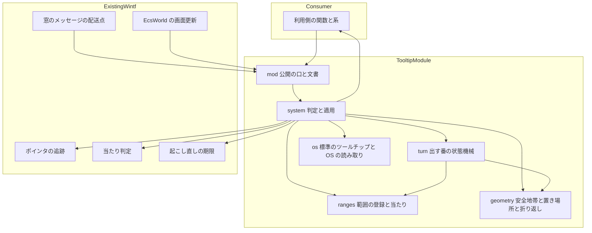
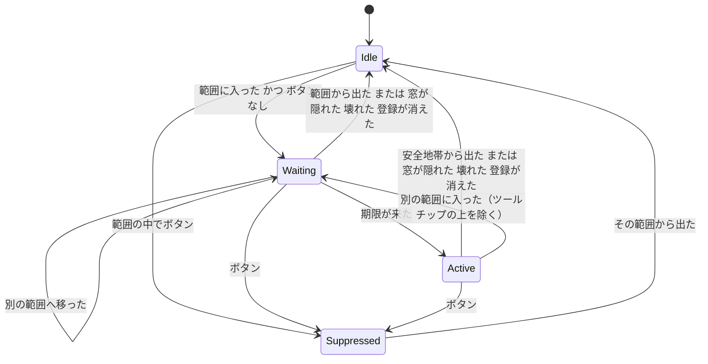
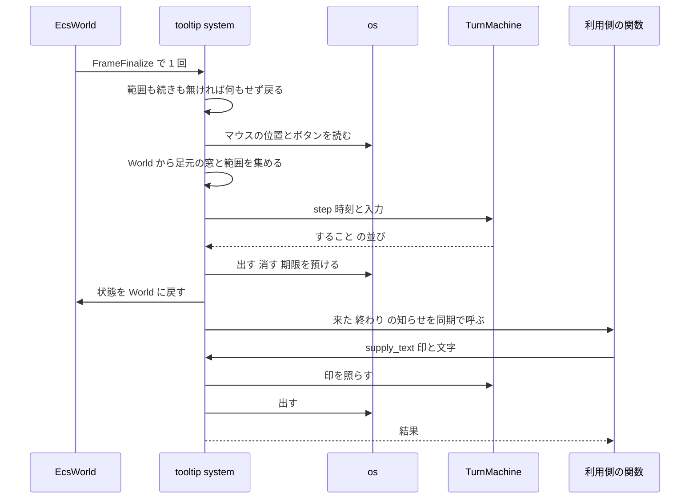

# Design Document: areka-P0-wintf-tooltip

## Overview

**Purpose**: wintf に、汎用のツールチップ（マウスを置いた所に出る短い説明）の土台を足す。利用側は窓の中に「範囲」を登録するだけで、待ち時間・出す番・安全地帯・消えるきっかけ・置き場所・DPI・重なり順を一般の UI（WinUI 3）と同じ決まりで得られる。

**Users**: wintf を使う開発者（当面は後続の `areka-P0-balloon-link-hover` と `areka-P0-shell-tooltip`）。静的な使い方（文字を預ける）と動的な使い方（出す番の知らせを受けてから文字を渡す）の両方を同じ口で使う。

**Impact**: wintf に新しいモジュール `ecs::tooltip` を足す。既存の公開の口は変えない。既存ファイルへの変更は 3 か所・計 10 行前後（公開の口の列挙・系の登録・押下の印）に限る。

設計の骨子は 3 つである。

1. **決まりは全部、純粋な層に置く**。出す番の状態機械・範囲の当たり・安全地帯・置き場所・折り返しは、時刻と位置を引数で受ける純粋な関数と構造体で、窓なしでテストする。
2. **表示は OS の標準のツールチップ（comctl32 の `TOOLTIPS_CLASS`・追跡型）を 1 枚だけ使う**。OS に触る `unsafe` は 1 ファイルに閉じる。差し替え用の抽象（トレイト）は作らない。
3. **判定は画面更新の末尾（`FrameFinalize`）で 1 回、その回の中で出し切る**。知らせは関数の部品を同期で呼ぶので、利用側は知らせの中から文字を渡せる（次の画面更新へ送らない）。起こし直しは既存の `tick_wake::arm_deadline` だけを使う。

### Goals
- 要件 1〜5 の決まり（待ち時間は OS の設定の 2 倍・出し直しは 1 倍・範囲の中で数え直さない・安全地帯・押下で終わり・入り直し）を、純粋な状態機械 1 つで実現し、全分岐を窓なしのテストで固定する。
- 透過の窓・いつも手前の窓の上で、OS の標準の見た目のツールチップを、画面の DPI に合った字で、作業領域の中に出す。
- 後続の 2 本が wintf の内側に手を入れずに配線できる公開の口を定める。
- OS の振る舞いのうち実機でしか確かめられない点を、最初のタスク（小さな試し）で潰し、判定の基準と逃げ道を先に決めておく。

### Non-Goals
- areka 側の配線（どの範囲に何を出すか）。areka のクレートのソース（`src/`）には触れない（足すのは exe の申告のための `build.rs` とマニフェストの 2 ファイルだけ）。
- 範囲を登録していない所での「止まった」の知らせ・キーボードやタッチで出すツールチップ・見た目の着せ替え・文字以外の中身・待ち時間の独自設定（要件の Out of scope のとおり）。
- 既存のポインタの追跡（`WM_MOUSEMOVE`／`WM_MOUSELEAVE` の受け手・`PointerState`・透過の答え）の作り直し。読むだけで変えない。
- 表示の裏側を差し替えられる抽象。実装が 1 つしか無い口は作らない（逃げ道が要るときは OS の 1 ファイルを書き換える）。

## Boundary Commitments

### This Spec Owns
- 範囲の登録（窓ごと・複数・重なりの順・差し替え・取り消し）と、その持ち方。
- 出す番の状態機械（待ち・来た・取り消し・安全地帯・終わり・入り直し）と、出す番の印の発行。
- 出す番が来た・終わったの知らせの型と配り方。
- ツールチップの窓（プロセスの UI スレッドに 1 枚）の生成・表示・消去・置き場所・字体・最大幅・重なり順。
- 動的な使い方の口（印を添えて文字を渡す・消す）と、その結果の型。
- この機能の記録（`debug`／`trace`／`warn`）と、クレートの文書（モジュールの冒頭）。
- 実機確認用のサンプル `tooltip_demo`。
- comctl32 の版 6 の申告を exe に埋める仕掛け（areka.exe と wintf のサンプルの `build.rs` とマニフェスト）。

### Out of Boundary
- areka のクレートのソース（`crates/areka/src/`）・SHIORI への問い合わせ・バルーンの行の追跡（`crates/areka/src/input_events/balloon.rs`）。
- 既存のポインタの追跡・当たり判定・クリック透過・ドラッグ・重なりの維持（`zorder_pair_maintain.rs`・持ち主の鎖）の振る舞い。
- `Cargo.toml`（根も wintf も）。`windows` クレートの機能は足さない。
- マニフェストに書く、comctl32 の版 6 の申告より他の項目（DPI・対応する OS・長いパス・文字コードなど）。DPI は今のとおり wintf が実行時に設定する。文字コードの指定は読み込む SHIORI の DLL に響きうるので、要るなら別の spec で検討する。
- `shiori-host32-helper` など、areka.exe と wintf のサンプルより他の exe のマニフェスト。

### Allowed Dependencies
- wintf の中の既存の部品を**読む**こと: `PointerState`・`WindowPos`・`DPI`・`WindowHandle`・`Window`・`find_owner_window`・`hit_test_in_window`・`tick_wake::arm_deadline`。
- `windows` クレートの、根で既に有効な機能（`Win32_UI_Controls`・`Win32_UI_WindowsAndMessaging`・`Win32_UI_HiDpi`・`Win32_UI_Input_KeyboardAndMouse`・`Win32_Graphics_Gdi`・`Win32_System_LibraryLoader`）。
- `tracing`・`thiserror`・`bevy_ecs`（いずれも既存の依存）。開発用に `log-capture-kit`（既存）。
- 依存の向き: `geometry` → `ranges` → `turn` → `os` → `system` → `mod`（左のものだけを使う。`turn`・`ranges`・`geometry` は `windows` クレートの関数を呼ばない）。
- 禁止: areka の型・`tick_wake::mark` の新しい呼び出し（名簿の検査を増やさないため）・既存の公開の構造体への欄の追加。

### Revalidation Triggers
- 公開の型（`TooltipRange`・`TooltipArea`・`TooltipNotice`・`TooltipTurn`・`TooltipEndReason`・`TooltipSupply`・`OnTooltip`）や公開の関数の署名を変えたとき → 後続の 2 本を確かめ直す。
- 「範囲に入っている」の拠り所（`PointerState` が窓の配下にあること＋ `hit_test_in_window`）を変えたとき、またはポインタの追跡側がその意味を変えたとき。
- 判定を回す段（`FrameFinalize`）や、知らせを同期で呼ぶ決まりを変えたとき。
- 表示の裏側を標準のツールチップから自前の窓へ替えたとき（見た目・重なり・マウスの素通しを確かめ直す）。
- areka.exe や wintf のサンプルのマニフェストに項目を足したとき、またはマニフェストの埋め込み方（`build.rs` からリンカへ渡す指示）を替えたとき（見た目と、他の標準の部品への効き方を確かめ直す）。

## Architecture

### Existing Architecture Analysis

現物で確かめた、設計の前提になる事実（どの定義かで指す）。

- **ポインタの追跡**: `crates/wintf/src/ecs/window_proc/mouse_move.rs` の関数 `WM_MOUSEMOVE` は、当たったエンティティ（当たらなければ窓のエンティティ）に部品 `PointerState` を付け、関数 `WM_MOUSELEAVE` はその窓に属する `PointerState` を外す。つまり「ある窓の配下に `PointerState` がある」ことが「OS がマウスをその窓へ届けている」ことを表す。位置は物理ピクセルの窓の中の座標。
- **透過の答え**: `crates/wintf/src/ecs/pointer/nchittest_cache.rs` の関数 `cached_nchittest` は、`hit_test_in_window` が当たれば `HTCLIENT`、当たらなければ `HTTRANSPARENT` を返す（左ボタンを押している間は当たらなくても `HTCLIENT`）。「窓のマウスを受ける所」は `hit_test_in_window` が `Some` を返す所と一致する。
- **窓の中の座標**: `crates/wintf/src/ecs/layout/hit_test/mod.rs` の関数 `hit_test_in_window` は「窓の中の座標＋`WindowPos` の `position`＝画面の座標」で扱う。本設計も同じ換算を使う。
- **画面更新**: `crates/wintf/src/ecs/world/mod.rs` の `EcsWorld::try_tick_world` が 13 本のスケジュールを固定の順で回す。`FrameFinalize` は末尾で、レイアウトの後にある。画面更新の間は World が借りられているので、その間に届いた窓のメッセージは `crates/wintf/src/runtime/wndproc_bridge.rs` の関数 `make_wndproc` が捨てる（ドラッグを終える種だけ別扱い）。
- **起こし直し**: `crates/wintf/src/ecs/world/tick_wake.rs` の関数 `arm_deadline` は「最も早い 1 つ」だけを預かり、到来すると倒す。使う側は走るたびに預け直す（`crates/areka/src/emo2_boot/balloon_visibility_phase.rs` が先例）。`tick_gate_tests.rs` の名簿の検査が見るのは `tick_wake::mark` を呼ぶファイルだけで、`arm_deadline` だけを使うファイルは名簿に載せなくてよい。
- **窓に関数を差す部品**: `crates/wintf/src/ecs/window/components.rs` の `OnCloseRequest(pub fn(world: &mut World, entity: Entity))` が先例。World を借りたまま同期で呼ばれる。
- **モジュールが自分で World に入る型**: `crates/wintf/src/ecs/drag/accumulator.rs` の関数 `install_drag_accumulator` を `EcsWorld::new` が 1 行で呼ぶ。`ecs/world/mod.rs` は 941 行なので、系の登録はこの型で 1 か所の呼び出しに閉じる。
- **スレッドに縛られる資源**: `crates/wintf/src/ecs/clickthrough/controller.rs` の `ClickThroughRegistryHandle` が NonSend の資源の先例。ツールチップの窓のハンドルも同じ持ち方にする。
- **版 6**: 標準のツールチップを今風の見た目にするには、exe が comctl32 の版 6 を使うと申告する必要がある。リポジトリには exe のマニフェストもビルドスクリプトの `build.rs` も無い（`git ls-files` で確認。`crates/ukadoc-survey/src/catalog/build.rs` は同名の普通のソース）。他の spec の brief・要件・設計に exe のマニフェストを扱うものは無く（`winget-manifest-submission` などの「マニフェスト」は winget の配布用の別物）、開いている PR も無い（2026-10-05 に確認）。

### Architecture Pattern & Boundary Map



**Architecture Integration**:
- 選んだ型: **純粋な芯＋薄い殻**。決まりは `turn`・`ranges`・`geometry` に置き、`system` が World と OS から入力を集めて芯を 1 回回し、出てきた「すること」を OS と利用側へ適用する。
- 境界の分け方: `unsafe` と Win32 の呼び出しは `os.rs` だけ。World を読むのは `system.rs` と `mod.rs` だけ。芯は World も OS も知らない。
- 守る既存の型: 窓に関数を差す部品・モジュールが自分で World に入る関数・NonSend の資源・期限の預け直し。
- 新しい部品の理由: 状態機械（要件 1・2・5）・範囲の表（要件 4）・幾何（要件 2.5・3.1〜3.5）・OS の境界（要件 3.6〜3.10）・殻（要件 6 と配線）。どれも要件の束に 1 対 1 で当たる。
- steering との整合: 記録は `tracing` の構造化フィールド（`.kiro/steering/logging.md`）。1 ファイル 1,000 行未満・テストは兄弟ファイル（`*_tests.rs`）。失敗の経路は必ず記録する。

### Technology Stack

| Layer | Choice / Version | Role in Feature | Notes |
|-------|------------------|-----------------|-------|
| 表示 | comctl32 の `TOOLTIPS_CLASS`（追跡型 `TTF_TRACK`＋`TTF_ABSOLUTE`） | ツールチップの窓 1 枚 | 追跡型は呼ぶ側が消すまで出たまま（Microsoft の文書で確認）。版 6 は exe のマニフェストで選ぶ |
| OS の読み取り | `SystemParametersInfoW`・`GetCursorPos`・`GetAsyncKeyState`・`IsWindowVisible`・`MonitorFromPoint`・`GetMonitorInfoW`・`GetDpiForMonitor`・`SystemParametersInfoForDpi` | 待ち時間の設定・マウスの位置・ボタン・窓の可視・作業領域・DPI・字体 | すべて根で有効な `windows` 0.62 の機能で呼べる |
| 版 6 の申告 | exe のマニフェスト（`Microsoft.Windows.Common-Controls` 6.0.0.0 への依存）を、`build.rs` からリンカへの指示（`/MANIFEST:EMBED`・`/MANIFESTINPUT:`）で埋め込む | areka.exe と wintf のサンプルが、標準の部品の今風の見た目を得る | Microsoft の想定する正規の方法。新しい依存は無く、`Cargo.toml` は変わらない（`build.rs` は置くだけで認識される）。MSVC のリンカのときだけ指示を出す |
| 状態と配線 | `bevy_ecs`（既存）・`tracing`（既存）・`thiserror`（既存） | 範囲の部品・NonSend の資源・末尾の系・記録・失敗の型 | 新しい依存は無い |

## File Structure Plan

### Directory Structure
```
crates/wintf/
├── src/ecs/tooltip/
│   ├── mod.rs              # クレートの文書（使い方と決まり）・公開の型・公開の関数・install
│   ├── geometry.rs         # 安全地帯の判定・置き場所の計算・はみ出す行の折り返し（純粋）
│   ├── geometry_tests.rs
│   ├── ranges.rs           # 範囲の部品 TooltipRanges・登録と差し替えと取り消し・重なりの当たり（純粋）
│   ├── ranges_tests.rs
│   ├── turn.rs             # 出す番の状態機械 TurnMachine（純粋・時刻と入力は引数）
│   ├── turn_tests.rs
│   ├── os.rs               # unsafe はここだけ: OS の読み取り・標準のツールチップの窓・字体
│   ├── os_tests.rs         # 明示したときだけ走る（#[ignore]）実機の最初の試し S2〜S7（タスクの段で追加）
│   ├── system.rs           # 画面更新ごとの判定（集める→状態機械→適用）・知らせの配り・記録
│   └── system_tests.rs     # 窓なしの World で「集める→すること」を確かめる
├── examples/
│   └── tooltip_demo.rs     # 実機確認用（静的・動的・透過・いつも手前・DPI・試しの項目）
├── build.rs                # 新規: wintf のサンプル（examples）にだけマニフェストを埋める（rustc-link-arg-examples）
└── examples.manifest       # 新規: comctl32 の版 6 の申告だけを書いたマニフェスト

crates/areka/
├── build.rs                # 新規: areka.exe（bin）にだけマニフェストを埋める（rustc-link-arg-bins）
└── areka.manifest          # 新規: comctl32 の版 6 の申告だけを書いたマニフェスト
```

- 2 つの `build.rs` は同じ形で、依存を足さない: 対象が MSVC のとき（`CARGO_CFG_TARGET_ENV` が `msvc`）だけ、`/MANIFEST:EMBED` と `/MANIFESTINPUT:<マニフェストの絶対パス>` をリンカへ渡し、マニフェストと自分自身を `rerun-if-changed` に挙げる。MSVC でなければ何もしない。
- 指示の届く先を絞る: wintf は `rustc-link-arg-examples`（wintf を使う側の exe には何も足さない。申告は exe の持ち主が決めること）、areka は `rustc-link-arg-bins`（サンプルと結合テストの exe には足さない。ただし Cargo は bin の指示を bin のユニットテストの exe にも当てるため、areka のユニットテストの exe には入る。build.rs からは見分けられず、`Cargo.toml` を変えずに避ける手は無い。areka のユニットテストは版 6 の下でも全部緑であることを実装で確かめた。wintf のテストの exe には入らない）。
- マニフェストの中身は comctl32 の版 6 への依存の 1 項目だけ（他の項目は Out of Boundary）。

依存の向きは `geometry` → `ranges` → `turn` → `os` → `system` → `mod`。どのファイルも 1,000 行未満に収める（見込みは最大の `system.rs`・`os.rs` で 400〜500 行）。

### Modified Files
- `crates/wintf/src/ecs/mod.rs` — `pub mod tooltip;` と公開の型の `pub use` を足す（足すだけ）。関数（`register`・`update`・`unregister`・`supply_text`・`dismiss`）は名前が一般的で根では意味がぼやける（`wintf::ecs::update` など）ので持ち上げず、`wintf::ecs::tooltip::` から呼ぶ（4.1 で判明・クレートの文書の例も `tooltip::register(...)` の形で書く）。
- `crates/wintf/src/ecs/world/mod.rs` — `EcsWorld::new` の既定の系の登録の後に `crate::ecs::tooltip::install(&mut world);` を 1 回呼ぶ（註釈込みで 3 行以内・941 行 → 944 行）。
- `crates/wintf/src/ecs/window_proc/mod.rs` — 関数 `dispatch_window_message` の冒頭で、ボタンの押下のメッセージなら `crate::ecs::tooltip::note_button_press()` を呼ぶ（数行）。既存の配送は変えない。

`Cargo.toml`・`README.md`・`tick_wake.rs`・`tick_gate_tests.rs`・ポインタやドラッグのファイルには触れない。

brief のウェーブ C4 の約束は「触るのは `crates/wintf/src/` だけ」だが、要件 7.4 がサンプルを求めるので、`crates/wintf/examples/tooltip_demo.rs` の新規の 1 ファイルだけを `src/` の外に置く（サンプルは自動で見つかるので `Cargo.toml` は変わらず、他の spec のファイルとも重ならない）。この例外は 2026-10-05 の設計の討議で開発者に報告し、認められた。

同じ討議で、今風の見た目は実行時の切り替え（手書きの宣言と `shell32.dll` の資源を借りる手）ではなく、**exe のマニフェストで申告する**と決まった（開発者「exe にマーク入れる方がよい」「マニフェスト入れるのは他の spec と競合しない」）。このため新規の 4 ファイル（`crates/wintf/build.rs`・`crates/wintf/examples.manifest`・`crates/areka/build.rs`・`crates/areka/areka.manifest`）も `src/` の外に置く。どれも新規で、`Cargo.toml` は変わらず、他の spec のファイルと重ならない（Existing Architecture Analysis の「版 6」のとおり確認済み）。

## System Flows

### 出す番の状態



- `Waiting` に入るとき、OS の設定を読み、期限を「今＋設定の値×2」（直前のツールチップが消えてから 0.2 秒以内なら×1）に決める。`Waiting` の間は範囲の中で動いても期限を動かさない。
- `Active` に入るとき新しい印を発行し、「来た」の知らせを 1 回出す。`Active` を出るとき、その印で「終わり」の知らせを 1 回出す。`Waiting` から出るだけなら知らせは出さない。
- `Active` → `Idle` と同じ回のうちに、別の範囲に入っていれば `Waiting` まで進める（1 回の判定で遷移を出し切る）。安全地帯から出て入ったときも、安全地帯の中で重ねた内側・外側の範囲や通り道の上の範囲に入ったときも同じ（要件 2.10・2026-10-07 の裁定）。ツールチップが出ていた出す番なら、終わりで消えた時刻が出し直しの起点になるので、新しい範囲の待ちは設定の×1。まだ出ていなかった（動的で文字が届いていない）出す番なら、消えたツールチップが無いので×2（要件 1.4 のとおり）。
- `Suppressed` は「押したので、入り直すまでこの範囲では出さない」を表す。

### 1 回の画面更新の中の流れ



- 知らせは、状態の更新と表示の適用を済ませ、状態を World に戻してから呼ぶ。だから知らせの中から `supply_text` を呼べる（同じ画面更新の中で出る）。
- 文字が後から届く場合、利用側は印を覚えておき、届いたときに `supply_text` を呼ぶ。wintf の側に待ちの仕組みは無い。印が今の出す番のものでなければ出さずに結果で返す。

## Requirements Traceability

| Requirement | Summary | Components | Interfaces | Flows |
|---|---|---|---|---|
| 1.1 | 入って待ち時間が経ったら知らせを 1 回 | TurnMachine・system | `step`・`OnTooltip` | 状態 Waiting→Active |
| 1.2 | 範囲の中の移動で数え直さない | TurnMachine | `step`（期限は Waiting に入るときだけ決める） | 状態 |
| 1.3 | 知らせの中身 | system | `TooltipTurn`（窓・範囲・論理の位置・印・文字の有無） | 流れ |
| 1.4 | 設定の 2 倍・出し直しは 1 倍 | TurnMachine | `wait_for`・`hover_time` の引数 | 状態 |
| 1.5 | 待ち時間の独自の設定を持たない | mod | 公開の口に設定の関数を置かない | — |
| 1.6 | 読めなければ 400 ミリ秒＋`warn` | os | `read_hover_time` | — |
| 1.7 | 続いている間は重ねて知らせない | TurnMachine | 状態 Active は 1 つ | 状態 |
| 1.8 | 入り直したら別の印 | TurnMachine | `TooltipTurnToken`（通し番号・使い回さない） | 状態 |
| 1.9 | どの窓でも使える | ranges・system | `TooltipRanges` は窓のエンティティの部品 | — |
| 1.10 | 透過で抜ける所は入っていない | system | `collect`（`PointerState` と `hit_test_in_window`） | — |
| 1.11 | 登録が無ければ既存の知らせを変えない | system | 冒頭の早戻り・既存の受け手は不変更 | 流れ |
| 2.1 | 待ちの途中で出たら取り消し | TurnMachine | `step` | 状態 Waiting→Idle |
| 2.2 | 待ちの途中の押下で取り消し | TurnMachine・mod | `step`・`note_button_press` | 状態 Waiting→Suppressed |
| 2.3 | 押している間は出さない | TurnMachine・os | `OsSample::button_down` | 状態 |
| 2.4 | 待ちの途中の隠れた・壊れた・取り消し | TurnMachine・system | `Tracked` | 状態 Waiting→Idle |
| 2.5 | 安全地帯の中は、別の範囲に入らない限り動いても終わらない（ツールチップの上は下に範囲があっても続く） | geometry・TurnMachine | `in_safe_zone`・`Over` | 状態 Active |
| 2.6 | 終わりの知らせを印付きで 1 回（別の範囲に入ったときは `EnteredOtherRange`） | TurnMachine・system | `TooltipNotice::TurnEnded`・`TooltipEndReason` | 状態 |
| 2.7 | 来ていない出す番に終わりを出さない | TurnMachine | Waiting からの取り消しは知らせ無し | 状態 |
| 2.8 | 押したら入り直すまで出さない | TurnMachine | 状態 Suppressed | 状態 |
| 2.9 | 動かないまま足元が消えたら隠れた扱い | system・TurnMachine | `Tracked::Present` の `receives` | 状態 |
| 2.10 | 出す番の間に別の範囲へ入ったら切り替える（重ねた内側・外側・通り道の上も。ツールチップの上を除く） | TurnMachine | `step`（1 回で出し切る）・`check_active` の足元の順 | 状態 Active→Waiting |
| 3.1 | マウスの真上・中央・カーソルから離す | geometry・os | `place` | 流れ |
| 3.2 | 出ている間は動かさない | system | 出す番ごとに基準の位置を 1 回だけ決める | — |
| 3.3 | 改行で行を分ける | os | 改行を CR LF に整えて渡す | — |
| 3.4 | 最大の幅で折り返す | os・geometry | `TTM_SETMAXTIPWIDTH`・`force_break` | — |
| 3.5 | 作業領域の中に収める | geometry | `place` | — |
| 3.6 | 透過・いつも手前の窓より手前 | os | `WS_EX_TOPMOST`＋出すたびに最前面へ | — |
| 3.7 | 画面の DPI に合った字 | os | `SystemParametersInfoForDpi`＋`WM_SETFONT` | — |
| 3.8 | OS の標準の見た目 | os・2 つの `build.rs` | 標準のツールチップ＋exe のマニフェスト（areka.exe・wintf のサンプル） | — |
| 3.9 | 入力先と手前の窓を変えない | os | `WS_EX_NOACTIVATE`・`SWP_NOACTIVATE` | — |
| 3.10 | ツールチップがボタンを横取りしない | os | `TTF_TRANSPARENT`＋`WS_EX_TRANSPARENT`＋`WS_EX_LAYERED` | — |
| 3.11 | 同時に 1 つまで | os・TurnMachine | 窓は 1 枚・Active は 1 つ | — |
| 3.12 | 空の文字は出さない（出ていれば消す） | TurnMachine | `supply`（空 → 消す） | — |
| 3.13 | 出す番が終わったら消す | TurnMachine・system | `Effect::Hide` | 状態 |
| 3.14 | 時間だけでは消さない | os | 追跡型（時間切れ無し） | — |
| 3.15 | areka.exe と wintf のサンプルが版 6 を申告する | 2 つの `build.rs`・マニフェスト | リンカへの指示（`rustc-link-arg-bins`・`rustc-link-arg-examples`） | 最初の試し S1 |
| 4.1 | 窓ごとに複数の範囲 | ranges | `register` | — |
| 4.2 | 窓の全体を範囲に | ranges | `TooltipArea::WholeWindow` | — |
| 4.3 | 預けた文字は何もしなくても出る | TurnMachine・system | `Effect::Show` の出どころ＝預けた文字 | 流れ |
| 4.4 | 預けていない範囲は渡すまで出さない | TurnMachine | `TooltipTurn::has_text` が偽 | 流れ |
| 4.5 | 重なりは後から登録した方 | ranges | `hit` | — |
| 4.6 | 差し替えは次の出す番から・順は保つ | ranges・TurnMachine | `update`・出す番は始まりの中身を持つ | — |
| 4.7 | 取り消しで続きを終わらせる | mod・TurnMachine | `unregister`（同期で終わらせる） | 状態 |
| 4.8 | 窓が壊れたら登録を捨てる | ranges | 窓のエンティティの部品 | — |
| 4.9 | 論理の単位・DPI が変わっても同じ場所 | ranges・system | `TooltipArea::Rect` は論理・判定のたびに窓の `DPI` で換算 | — |
| 4.10 | 空の文字は預けていない扱い | ranges | `register`・`update` で空を無しに正規化 | — |
| 5.1 | 続いている印で渡すと出る | mod・TurnMachine | `supply_text` → `TooltipSupply::Shown` | 流れ |
| 5.2 | 終わった印は出さず結果で知らせる | mod・TurnMachine | `TooltipSupply::StaleTurn` | 流れ |
| 5.3 | 前の印の文字を後の出す番に出さない | TurnMachine | 印の一致だけで受ける | — |
| 5.4 | 渡すまでの時間に上限なし | TurnMachine | Active の間は常に受ける | — |
| 5.5 | 預けた文字を渡した文字で置き換え | mod・os | `supply_text`（出ていれば更新） | — |
| 5.6 | 印を添えて消す | mod | `dismiss` | — |
| 5.7 | 何も渡さなければ何も出さない | TurnMachine | `Effect::Show` は預けた文字があるときだけ | — |
| 5.8 | 動的でも同じ決まり | TurnMachine・geometry・os | 静的と同じ経路を通る | — |
| 6.1 | 出したら `debug` | system | 記録 `tooltip_shown` | — |
| 6.2 | 消したら理由付きで `debug` | system | 記録 `tooltip_hidden` | — |
| 6.3 | 終わった印で出さなかったら `debug` | mod | 記録 `tooltip_supply_stale` | — |
| 6.4 | 判定の分岐を `trace` | TurnMachine | 記録 `tooltip_turn` | — |
| 6.5 | 本文を載せず文字数だけ | system | 欄 `chars` | — |
| 6.6 | OS の失敗は `warn`・結果で知らせる・止めない | os・mod | `TooltipOsError`・`TooltipSupply::Failed` | — |
| 6.7 | 表示が失敗しても検出を続ける | TurnMachine・system | 表示の成否は状態を変えない | — |
| 7.1 | 出す番の判定を窓なしで固定 | turn_tests | `step` に時刻と入力を渡す | — |
| 7.2 | 出す・出さないの決まりを窓なしで固定 | ranges_tests・turn_tests・system_tests | `hit`・`supply`・`decide` | — |
| 7.3 | 置き場所を窓なしで固定 | geometry_tests | `place` | — |
| 7.4 | 実機用のサンプル | tooltip_demo | — | — |
| 7.5 | クレートの文書 | mod | モジュールの冒頭の文書 | — |
| 7.6 | 足すだけ・既存の構造体に欄を足さない | mod | 新しい型だけ | — |
| 7.7 | areka の型に依存しない | 全体 | 依存は wintf の中と既存の外部クレートだけ | — |

## Components and Interfaces

| Component | Layer | Intent | Req Coverage | Key Dependencies | Contracts |
|---|---|---|---|---|---|
| geometry | 純粋 | 安全地帯・置き場所・折り返し | 2.5, 3.1, 3.4, 3.5, 7.3 | なし | Service |
| ranges | 純粋＋部品 | 範囲の表と当たり | 1.9, 4.1, 4.2, 4.5, 4.6, 4.8, 4.9, 4.10, 7.2 | bevy_ecs (P0) | Service, State |
| TurnMachine（turn） | 純粋 | 出す番の状態機械 | 1.1, 1.2, 1.4, 1.7, 1.8, 2.1〜2.10, 3.12, 3.13, 4.3, 4.4, 5.1〜5.5, 5.7, 5.8, 6.4, 6.7, 7.1, 7.2 | geometry (P0)・ranges (P0) | Service, State |
| os | OS の境界 | OS の読み取りと標準のツールチップ | 1.6, 2.3, 3.3, 3.4, 3.6〜3.11, 3.14, 6.6 | windows 0.62 (P0)・comctl32 (P0) | Service |
| system | 殻 | 集める→状態機械→適用・知らせ・記録 | 1.3, 1.10, 1.11, 2.4, 2.9, 3.2, 6.1, 6.2, 6.5, 6.7, 7.2 | 既存のポインタの追跡 (P0)・`hit_test_in_window` (P0)・`tick_wake` (P1) | Service, Event |
| mod（公開の口） | 入口 | 公開の型と関数・文書・install | 1.5, 4.7, 5.1, 5.2, 5.6, 6.3, 7.5, 7.6, 7.7 | system (P0) | Service |
| tooltip_demo | サンプル | 実機の確認と最初の試し | 7.4 | wintf の公開の口だけ | — |

### 純粋な層

#### geometry

| Field | Detail |
|---|---|
| Intent | 画面のピクセルの矩形と点だけで、安全地帯・置き場所・折り返しを決める |
| Requirements | 2.5, 3.1, 3.4, 3.5, 7.3 |

**Responsibilities & Constraints**
- 入力も出力も整数の画面の物理ピクセル。World も OS も知らない。
- 安全地帯は「範囲の矩形 ∪ ツールチップの矩形 ∪ その 2 つを包む最小の凸の領域」。ツールチップが出ていなければ範囲の矩形だけ。
- 置き場所は「基準の点の真上・左右の中央合わせ・カーソルから `offset` だけ離す」。真上に収まらなければ真下（カーソルの絵の高さぶん離す）へ返す。どちらにも収まらなければ広い側に置いて作業領域の中へ寄せる。左右は作業領域の中へ寄せる。
- 折り返しは、OS に最大の幅を渡しても幅を越えた行が残ったときだけ使う（切れ目の無い長い語。Microsoft の文書に「分けられない文字は 1 行で出て、最大の幅を越えうる」とある）。入る文字数を返す関数を引数で受け、入るだけ詰めて改行を入れる。

##### Service Interface
```rust
pub(crate) struct RectPx { pub left: i32, pub top: i32, pub right: i32, pub bottom: i32 }
pub(crate) struct PointPx { pub x: i32, pub y: i32 }
pub(crate) struct SizePx { pub width: i32, pub height: i32 }

/// 点が安全地帯の中か。tip が None なら範囲の矩形だけを見る。
pub(crate) fn in_safe_zone(p: PointPx, range: RectPx, tip: Option<RectPx>) -> bool;

pub(crate) struct PlaceInput {
    pub anchor: PointPx,      // 出すことが決まった時のマウスの位置
    pub tip: SizePx,          // ツールチップの大きさ
    pub work_area: RectPx,    // マウスのある画面の作業領域
    pub offset_above: i32,    // カーソルから上へ離す量（20 を画面の DPI で換算）
    pub offset_below: i32,    // 下へ返すときに離す量（カーソルの絵の高さ）
}
/// ツールチップの左上の位置を返す。
pub(crate) fn place(input: &PlaceInput) -> PointPx;

/// 幅を越える行を、入る文字数ごとに改行で割る。fit は「この並びの先頭から何文字入るか」（1 以上）。
pub(crate) fn force_break(text: &str, fit: &dyn Fn(&str) -> usize) -> String;

/// 改行（LF だけ・CR LF・CR だけ）を、標準のツールチップが行を分ける CR LF に揃える（要件 3.3）。
pub(crate) fn normalize_newlines(text: &str) -> String;

/// 最大の幅（物理ピクセル）＝ min(320 を dpi で換算した幅, 作業領域の幅)（要件 3.4）。
pub(crate) fn max_tip_width(dpi: u32, work_area: RectPx) -> i32;
```
- Preconditions: 矩形は `left <= right`・`top <= bottom`。`fit` は 1 以上を返す。
- Postconditions: `place` の結果は、ツールチップが作業領域より小さければ必ず作業領域の中に収まる。大きければ左上を作業領域の左上に合わせる。
- Invariants: 副作用なし。

#### ranges

| Field | Detail |
|---|---|
| Intent | 窓ごとの範囲の表を持ち、点がどの範囲に当たるかを答える |
| Requirements | 1.9, 4.1, 4.2, 4.5, 4.6, 4.8, 4.9, 4.10, 7.2 |

**Responsibilities & Constraints**
- 範囲の表は、窓のエンティティに付ける部品 `TooltipRanges`（中身は非公開）。窓のエンティティが消えれば一緒に消える（利用側の後始末は要らない）。
- 並びは登録の順。当たりは後ろから探し、最初に当たったもの（＝後から登録したもの）だけを返す。差し替えは並びの位置を変えない。
- 範囲は論理の単位（96 DPI の 1 ピクセル）。当たりの判定は、渡された論理の点で行う（換算は呼ぶ側）。
- 預けた文字が空なら、預けていないものとして持つ。

##### Service Interface
```rust
/// 範囲の場所。
#[non_exhaustive]
#[derive(Debug, Clone, Copy, PartialEq)]
pub enum TooltipArea {
    /// 窓の全体。
    WholeWindow,
    /// 窓の中の矩形（論理の単位）。
    Rect(crate::ecs::Rect),
}

/// 範囲の登録の中身。
#[derive(Debug, Clone, PartialEq)]
pub struct TooltipRange {
    pub area: TooltipArea,
    /// 預ける文字。None と空は「預けない」。
    pub text: Option<String>,
}

/// 登録した範囲の持ち手（中身は非公開）。
#[derive(Debug, Clone, Copy, PartialEq, Eq, Hash)]
pub struct TooltipRangeId { /* window: Entity, serial: u64 */ }

impl TooltipRangeId {
    pub fn window(&self) -> Entity;
}

// 部品の中の操作（crate の中だけ）
impl TooltipRanges {
    pub(crate) fn add(&mut self, window: Entity, range: TooltipRange) -> TooltipRangeId;
    pub(crate) fn replace(&mut self, id: TooltipRangeId, range: TooltipRange) -> bool;
    pub(crate) fn remove(&mut self, id: TooltipRangeId) -> bool;
    pub(crate) fn get(&self, id: TooltipRangeId) -> Option<&TooltipRange>;
    /// 論理の点に当たる範囲（後から登録したものが勝つ）。
    pub(crate) fn hit(&self, logical: crate::ecs::PointF) -> Option<(TooltipRangeId, &TooltipRange)>;
}
```
- Invariants: 持ち手の通し番号は窓ごとに増えるだけで使い回さない。

##### State Management
- 持ち方: 窓のエンティティの部品（`Vec` に登録の順で並べる）。
- 一貫性: 触るのは UI スレッドだけ。

#### TurnMachine（turn）

| Field | Detail |
|---|---|
| Intent | 時刻と入力から、出す番の状態を進めて「すること」を返す |
| Requirements | 1.1, 1.2, 1.4, 1.7, 1.8, 2.1, 2.2, 2.3, 2.4, 2.5, 2.6, 2.7, 2.8, 2.9, 2.10, 3.12, 3.13, 4.3, 4.4, 5.1, 5.2, 5.3, 5.4, 5.5, 5.7, 5.8, 6.4, 6.7, 7.1, 7.2 |

**Responsibilities & Constraints**
- 状態は `Idle`・`Waiting`・`Active`・`Suppressed` の 4 つ（System Flows の図）。同時に追う範囲は 1 つだけ。
- 時刻は引数の `Instant` だけを使う（自分では時計を読まない）。OS の設定も引数の関数で受け、`Waiting` に入るときだけ呼ぶ。
- 待ち時間は「設定の値×2」。直前のツールチップが**消えた時刻**から 0.2 秒以内に `Waiting` に入るときは×1。
- `Active` の間、足元を次の順で見る: ①ツールチップの矩形の中 → 続ける（その下に別の範囲があっても） ②範囲の矩形の中で、窓がそこでマウスを受けていない → 終わる。理由は、前回の判定からマウスの位置が変わっていれば「安全地帯から出た」（動かして、範囲の矩形の中の透過の穴や上に重なった別の窓へ移った）、変わっていなければ「窓が隠れた」（要件 2.9 の「動かないまま」。足元に別の範囲があってもこちらが先） ③安全地帯（範囲の矩形と 2 つを包む凸の領域）の外 → 「安全地帯から出た」で終わる ④安全地帯の中で、足元（`Over`）が今の範囲と別の範囲 → 「別の範囲に入った」で終わる（重ねた内側・外側、通り道の上の範囲。要件 2.10） ⑤それ以外 → 続ける。②〜④で終わった回は、同じ回のうちに足元の範囲の `Waiting` へ進む。
- `Active` の出す番は、始まったときの範囲の矩形（論理）と文字の有無を自分で持つ。途中の差し替えは次の出す番から効く。
- 表示が OS の側で失敗しても状態は変えない（ツールチップの矩形が無いまま `Active` を続ける＝安全地帯は範囲だけ）。
- 判定の分岐は `trace` の記録に残す（入った・数え始め・使った待ち時間・来た・来なかった理由・終わりの理由）。

##### Service Interface
```rust
/// 出す番の印（通し番号・使い回さない・中身は非公開）。
#[derive(Debug, Clone, Copy, PartialEq, Eq, Hash)]
pub struct TooltipTurnToken(/* u64 */);

/// 出す番が終わった・ツールチップが消えた理由。
#[non_exhaustive]
#[derive(Debug, Clone, Copy, PartialEq, Eq)]
pub enum TooltipEndReason {
    LeftSafeZone,
    ButtonPressed,
    WindowHidden,
    WindowDestroyed,
    RangeUnregistered,
    /// 安全地帯の中のまま、別の範囲に入った（安全地帯から出て入ったときは LeftSafeZone）。
    EnteredOtherRange,
}

/// 足元（どの窓のどの範囲に入っているか）。入っていなければ None を渡す。
pub(crate) struct Over {
    pub window: Entity,
    pub range: TooltipRangeId,
    pub area_logical: TooltipArea,
    pub has_text: bool,
    pub pos_logical: PointF,
}

/// 今追っている範囲の様子（追っていなければ渡さない）。
pub(crate) enum Tracked {
    // receives＝その窓の配下に PointerState がある かつ マウスの位置が hit_test_in_window に当たる かつ 窓が見えている
    // （足元の候補 Over と同じ 3 つの条件。上に別の wintf の窓が重なった所は、PointerState がそちらへ移るので偽になる）
    Present { range_px: RectPx, receives: bool },
    RangeUnregistered,
    WindowDestroyed,
    WindowHidden,
}

pub(crate) struct StepInput {
    pub now: Instant,
    pub cursor: Option<PointPx>,   // 画面の位置。読めなければ None（終わらせない）
    pub button_down: bool,         // 押している、または前回の判定の後に押された
    pub over: Option<Over>,
    pub tracked: Option<Tracked>,
}

pub(crate) enum Effect {
    /// 期限を預ける（待ちの期限・Active の間の見回り）。
    ArmDeadline(Instant),
    /// 来た。stored が真なら預けた文字を出す。
    TurnStarted { token: TooltipTurnToken, window: Entity, range: TooltipRangeId, pos_logical: PointF, stored: bool },
    /// 出ているツールチップを消す。
    Hide { token: TooltipTurnToken, reason: HideReason },
    /// 終わった。
    TurnEnded { token: TooltipTurnToken, window: Entity, range: TooltipRangeId, reason: TooltipEndReason },
}

/// 消した理由（記録用。要件 6.2 の 8 通り）。
/// 要件 6.2 の「別のツールチップへの置き換え」は、この設計では起きない（出す番は同時に 1 つで、
/// 次の出す番は前の終わりの後にしか来ない。文字の差し替えは「出した」の記録になる）ので、型に置かない。
pub(crate) enum HideReason { End(TooltipEndReason), Dismissed, EmptyText }

pub(crate) enum SupplyDecision { Show, HideEmpty, Stale }

impl TurnMachine {
    pub(crate) fn step(&mut self, input: &StepInput, hover_time: &mut dyn FnMut() -> Duration) -> Vec<Effect>;
    /// 今追っている範囲（Waiting／Active のとき）。殻が Tracked を作るために読む。
    pub(crate) fn tracked_range(&self) -> Option<(Entity, TooltipRangeId)>;
    /// 印を照らして、渡された文字をどうするか決める。
    pub(crate) fn supply(&mut self, token: TooltipTurnToken, text_is_empty: bool) -> SupplyDecision;
    /// 印が続いていれば真（ツールチップを消す。出す番は続く）。
    pub(crate) fn dismiss(&mut self, token: TooltipTurnToken, now: Instant) -> bool;
    /// 表示の結果を覚える（Some＝出た矩形・None＝出ていない）。消えた時刻もここで記録する。
    pub(crate) fn set_tip(&mut self, tip: Option<RectPx>, now: Instant);
    /// 登録の取り消しを同期で反映する（追っている範囲なら終わらせる）。
    pub(crate) fn on_unregistered(&mut self, id: TooltipRangeId, now: Instant) -> Vec<Effect>;
}
```
- Preconditions: `step` は UI スレッドから、時刻の戻らない順で呼ぶ。
- Postconditions: `TurnStarted` と `TurnEnded` は同じ印について高々 1 回ずつ。`TurnEnded` は `TurnStarted` を出した印にだけ出る。`Active` の間は毎回 `ArmDeadline(now + 見回りの間隔)` を返す。`Waiting` の間は毎回 `ArmDeadline(期限)` を返す（預け直し）。
- Invariants: 印は発行のたびに 1 ずつ増える。`Active` は同時に 1 つ。

**Implementation Notes**
- 見回りの間隔は 100 ミリ秒（定数）。ツールチップや通り道は wintf の窓の外になりうるので、`Active` の間だけ期限で起きて位置を照らす（WinUI は 1 秒ごと。早く片付く側に倒した）。
- ボタンは「範囲の中で押下を見たら `Suppressed`」に一本化する。押したまま入ってきて中で離した場合も、入り直すまで出さない（要件 1.1 の「押さないまま入り」に沿う）。
- 0.2 秒の起点は、ツールチップが実際に消えた時刻（`set_tip(None, now)` と終わりの `Hide`）。文字を出さなかった出す番は起点にならない。

### OS の境界

#### os

| Field | Detail |
|---|---|
| Intent | OS の値を読み、標準のツールチップ 1 枚を作って出す・消す。`unsafe` はここだけ |
| Requirements | 1.6, 2.3, 3.3, 3.4, 3.6, 3.7, 3.8, 3.9, 3.10, 3.11, 3.14, 6.6 |

**Responsibilities & Constraints**
- ツールチップの窓は UI スレッドに 1 枚。最初に出すときに作り、プロセスの終わりまで持つ（`Drop` で壊す）。wintf の窓のエンティティにはしない（窓の数・終了の判断・クリック透過の登録に入らない）。持ち主の窓は付けない。
- 作り方: `tooltips_class32`・`WS_POPUP | TTS_NOPREFIX | TTS_ALWAYSTIP | TTS_NOFADE | TTS_NOANIMATE`・`WS_EX_TOPMOST | WS_EX_NOACTIVATE | WS_EX_TOOLWINDOW | WS_EX_TRANSPARENT | WS_EX_LAYERED`。作った直後に `SetLayeredWindowAttributes` で不透明（255）にする（別のプロセスの窓へ押下を素通しするのは層の窓だけ。フェードが有効だと出すたびに `WS_EX_LAYERED` が外されるので、フェードと動きを止める。最初の試し S4）。道具は 1 つだけ登録し、旗は `TTF_TRACK | TTF_ABSOLUTE | TTF_TRANSPARENT`。
- 版 6: 版 6 を選ぶことはしない（申告は exe）。版の違いは最大の幅の渡し方だけで吸収する（上の「最大の幅」）。今風の見た目は exe のマニフェストの申告で決まる（areka.exe と wintf のサンプルは `build.rs` で埋める）。申告の無い exe から使われた場合は古い見た目で出るだけで、動きは変わらない。このことをクレートの文書に書く。
- 字体: 出す前に、マウスのある画面の DPI を `MonitorFromPoint`＋`GetDpiForMonitor` で取り、`SystemParametersInfoForDpi(SPI_GETNONCLIENTMETRICS)` の `lfStatusFont` から字体を作って `WM_SETFONT` で渡す。DPI が前回と同じなら作り直さない。
- 最大の幅: `geometry::max_tip_width` の値（物理ピクセル）を求める。版 5 にはそのまま `TTM_SETMAXTIPWIDTH` で渡す。版 6 は渡した幅に窓の DPI の倍率（`GetDpiForWindow`／96）を掛けて折り返すので、`geometry::logical_max_width` で割り戻した幅（切り捨て）を渡す。版は窓を作ったときに `CCM_GETVERSION`（版 5 は 0・版 6 は 6）で窓ごとに見る（6.3・research.md 14.5）。改行の整えは `geometry::normalize_newlines`。計算は `geometry` に置き、このファイルは OS に渡すだけにする（窓なしでテストするため）。
- 待ち時間の設定を読めなかったときの代わりの値（400 ミリ秒）は `turn.rs` の定数に置く。`warn` はプロセスで 1 回だけ出す（数え始めるたびに読むので、毎回出すと記録が埋まる）。
- 出す手順: 窓の DPI が出す画面の DPI と違えば、消してから隠したまま anchor へ動かし、窓の DPI を出す画面に揃える（版 6 は窓の DPI で並べ、画面の外では最後の画面の DPI のまま。揃えずに測ると出した所で並べ直されて大きさが変わる）→ 字体 → 最大の幅 → 文字（改行は CR LF に整える）→ 大きさを測る（追跡の始まった窓の `GetWindowRect`。出ていなければ画面の外で追跡を始めてから測る。`TTM_GETBUBBLESIZE` は使わない＝版 5 は追跡の前に送ると落ち、版 6 は実際の窓より幅・高さとも 1 大きい）→ 幅が最大の幅を越えていたら（測った大きさはふちと余白を含むので、最大の幅に `TTM_ADJUSTRECT(TRUE)` でふちを足し、2 論理ピクセルの遊びを足した窓の幅と比べる（OS が並べた窓は ADJUSTRECT の答えより版 5 で 0〜1、版 6 で 1〜2 広い）。ふちを含む大きさを最大の幅とそのまま比べると、OS が折り返せた英語の行まで語の途中で割ってしまう）`geometry::force_break`（入る文字数は `GetTextExtentExPointW` で測る）で割って入れ直す → `geometry::place` → `TTM_TRACKPOSITION` → `TTM_TRACKACTIVATE(TRUE)` → `SetWindowPos(HWND_TOPMOST, SWP_NOACTIVATE | SWP_NOMOVE | SWP_NOSIZE)` → 実際の矩形を `GetWindowRect` で読んで返す。
- 消す: `TTM_TRACKACTIVATE(FALSE)`。
- OS の読み取り: `read_hover_time`（`SPI_GETMOUSEHOVERTIME`。失敗は 400 ミリ秒＋`warn`）・`sample`（`GetCursorPos` と、左・右・中・拡張 2 つの `GetAsyncKeyState`）・`is_visible`（`IsWindowVisible`）。

**Dependencies**
- External: comctl32（標準のツールチップ）— 表示 (P0)。user32・gdi32・shcore — 読み取りと字体 (P0)。

##### Service Interface
```rust
#[derive(Debug, thiserror::Error)]
pub enum TooltipOsError {
    #[error("ツールチップの窓を作れなかった: {0}")]
    Create(#[source] windows::core::Error),
    #[error("ツールチップを出せなかった（{stage}）")]
    Show { stage: &'static str },
}

pub(crate) struct OsSample { pub cursor: Option<PointPx>, pub button_down: bool }

pub(crate) fn sample() -> OsSample;
pub(crate) fn read_hover_time() -> Duration;
pub(crate) fn is_visible(hwnd: HWND) -> bool;

pub(crate) struct TipWindow { /* HWND・字体・DPI の控え */ }

impl TipWindow {
    /// 無ければ作る。anchor の真上に text を出し、出た矩形を返す。
    pub(crate) fn show(&mut self, text: &str, anchor: PointPx) -> Result<RectPx, TooltipOsError>;
    pub(crate) fn hide(&mut self);
}
```
- Postconditions: `show` が `Err` を返したとき、ツールチップは出ていない（途中まで出ていれば消してから返す）。`hide` は出ていなくても安全。
- Invariants: 窓は 1 枚。入力先と手前の窓を変える呼び出しをしない。

**Implementation Notes**
- Integration: 使う OS の関数はすべて、根で既に有効な `windows` クレートの機能にある。手書きの宣言は置かない。
- Validation: このファイルの振る舞いは窓なしのテストでは確かめない。下の「最初の試し」の項目を、まず `os_tests.rs` の `#[ignore]` の実機のテストで、最後に `tooltip_demo` で確かめ直す。
- Risks: 下の「最初の試し」の表のとおり。

### 殻と公開の口

#### system

| Field | Detail |
|---|---|
| Intent | 画面更新ごとに、入力を集めて状態機械を回し、結果を OS と利用側へ適用する |
| Requirements | 1.3, 1.10, 1.11, 2.4, 2.9, 3.2, 6.1, 6.2, 6.5, 6.7, 7.2 |

**Responsibilities & Constraints**
- 持ちもの: NonSend の資源 `TooltipSession`（`TurnMachine`・今の出す番の控え＝知らせの関数の写し・基準の位置）。表示の窓 `TipWindow` は UI スレッドの thread_local に 1 枚置き、1 回の show・hide の間だけ借りる（4.3 で判明: 知らせの中から入れ子で `supply_text` を呼ぶと、資源から窓を取り出す形では窓が資源に無く 2 枚目を作ってしまうため）。窓の寿命は World でなく UI スレッドの寿命。
- 回す段: `FrameFinalize`（レイアウトの後。その回に起きた絵や当たり判定の変化を、同じ回のうちに見るため）。排他の系（`&mut World`）として登録する。
- **早戻り**: 中身のある範囲の表が 1 つも無く、状態が `Idle` なら、OS を 1 回も呼ばずに戻る（要件 1.11）。戻る前に押下の印は倒す（範囲が無い間の古い押下を、後で登録した最初の判定が拾って、理由なく「入り直すまで出さない」にならないため）。
- **集める**（`collect`・窓なしでテストできる）: `TooltipRanges` を持つ窓のうち、配下に `PointerState` を持つエンティティがある窓を足元の候補にする。マウスの画面の位置から `WindowPos` の `position` を引いて窓の中の位置にし、`hit_test_in_window` が `Some`・窓が見えている（`is_visible`）なら「マウスを受けている」（追っている範囲の `receives` も、`PointerState` を含むこの 3 つの条件で決める）。窓の `DPI` で論理の位置に直して `TooltipRanges::hit` で範囲を決める。追っている範囲については、窓のエンティティの有無・登録の有無・可視・範囲の画面の矩形（論理の矩形×DPI＋`position`。窓の全体なら `WindowPos` の `size`）から `Tracked` を作る。
- **適用**: `Effect` を順に適用する。`ArmDeadline` → `tick_wake::arm_deadline`。`TurnStarted` で `stored` が真 → 預けた文字を `TipWindow::show`（失敗は `warn`・状態は続ける）→ `set_tip`。`Hide` → `TipWindow::hide`＋`debug`。知らせは溜めておき、資源を World に戻してから順に呼ぶ。
- 知らせの関数は、出す番が来たときに窓の部品 `OnTooltip` から写しを取って控える。窓が壊れて終わるときも、その写しで終わりの知らせを呼べる。
- 記録: 出した（`debug`・窓・印・出どころ・文字数）／消した（`debug`・窓・印・理由）／表示の失敗（`warn`）。本文は載せない。

**Dependencies**
- Inbound: `EcsWorld` の `FrameFinalize` — 1 回の判定 (P0)。mod の公開の関数 — 同期の適用 (P0)。
- Outbound: `PointerState`・`find_owner_window`・`hit_test_in_window`・`WindowPos`・`DPI`・`WindowHandle` — 読むだけ (P0)。`tick_wake::arm_deadline` — 起こし直し (P1)。

##### Service Interface
```rust
/// FrameFinalize に登録する系。
pub(crate) fn tooltip_frame(world: &mut World);

/// 窓なしでテストできる芯の入口: World と OS の見本から「すること」を出す。
/// sample は早戻りしないときにだけ 1 回呼ばれる。
pub(crate) fn decide(
    world: &mut World,
    session: &mut TooltipSession,
    now: Instant,
    sample: &mut dyn FnMut() -> OsSample,
    visible: &dyn Fn(&World, Entity) -> bool,   // 本物は World から WindowHandle を引いて IsWindowVisible に問う（decide が &mut World を借りているので World を引数で渡す）
    hover_time: &mut dyn FnMut() -> Duration,
) -> Vec<Effect>;

/// 画面更新ごとの系の本体（判定→適用）。本物は `tooltip_frame`＝`with_os_tip` で本物の Tip を渡す包み。
pub(crate) fn frame_with(
    world: &mut World,
    now: Instant,
    sample: &mut dyn FnMut() -> OsSample,
    visible: &dyn Fn(&World, Entity) -> bool,
    hover_time: &mut dyn FnMut() -> Duration,
    tip: &mut Tip<'_>,
);

/// 表示の出入口。本物は TipWindow の show／hide を呼ぶ。テストは記録するだけの閉包を渡す。
pub(crate) struct Tip<'a> {
    pub show: &'a mut dyn FnMut(&str, PointPx) -> Result<RectPx, TooltipOsError>,
    pub hide: &'a mut dyn FnMut(),
}

/// apply と公開の関数（supply_text・dismiss・unregister）の中身。判断の分岐は全部ここに置く。
/// 外側は、UI スレッドの TipWindow を 1 回の show・hide の間だけ借りる本物の Tip を渡すだけの薄い包みにする。
pub(crate) fn apply_with(world: &mut World, effects: Vec<Effect>, now: Instant, tip: &mut Tip<'_>);
pub(crate) fn supply_text_with(world: &mut World, token: TooltipTurnToken, text: &str, now: Instant, tip: &mut Tip<'_>) -> TooltipSupply;
pub(crate) fn dismiss_with(world: &mut World, token: TooltipTurnToken, now: Instant, tip: &mut Tip<'_>) -> bool;
pub(crate) fn unregister_with(world: &mut World, id: TooltipRangeId, now: Instant, tip: &mut Tip<'_>) -> bool;
```

##### Event Contract
- Published: `TooltipNotice::TurnStarted(TooltipTurn)`・`TooltipNotice::TurnEnded { .. }` を、窓の部品 `OnTooltip` の関数へ同期で渡す。
- Subscribed: なし（メッセージではなく、毎回の判定で状態を読む）。
- Ordering / delivery: 1 つの出す番について「来た」1 回 →「終わり」1 回。別の出す番の「来た」は、前の「終わり」の後。部品 `OnTooltip` が無い窓では知らせは捨てる（預けた文字は出る）。

**Implementation Notes**
- Integration: `decide` と `apply` を分けるのはテストのため（`decide` までは OS を呼ばない）。`apply` と公開の関数にも判断の分岐（知らせを呼ぶ順・結果の出し分け・表示の失敗の後の継続・記録・基準の位置を動かさない・取り消しの同期の終わり）があるので、中身を `*_with` に置き、表示の出入口を関数の引数（`Tip`）で受ける。`decide` が OS の読み取りを引数で受けるのと同じ流儀で、差し替え用のトレイトは置かない。
- 実装の注意: 名簿の検査（`tick_gate_tests.rs`）は行頭が `//` の行しか読み飛ばさない。新しいファイルでは、行末の註釈や文字列の中にも `tick_wake::mark` と書かない。
- Risks: 画面更新の最中に届いた `WM_MOUSELEAVE` が捨てられると `PointerState` が残りうる。待ちの期限と見回りの判定で、実際のマウスの位置（`GetCursorPos`）と `hit_test_in_window` を照らすので、窓の外へ出た場合は拾える。別の窓が上に重なっただけの場合（位置は窓の中のまま）は拾えない（既存の追跡の限界。記録に残る）。

#### mod（公開の口）

| Field | Detail |
|---|---|
| Intent | 利用側が呼ぶ型と関数をまとめ、使い方と決まりを文書にする |
| Requirements | 1.5, 4.7, 5.1, 5.2, 5.6, 6.3, 7.5, 7.6, 7.7 |

##### Service Interface
```rust
/// 出す番が来た知らせの中身。
#[non_exhaustive]
#[derive(Debug, Clone, Copy, PartialEq)]
pub struct TooltipTurn {
    pub window: Entity,
    pub range: TooltipRangeId,
    /// 知らせを出した時のマウスの位置（窓の中・論理の単位）。
    pub position: PointF,
    pub token: TooltipTurnToken,
    /// その範囲に文字が預けてあるか（真なら既に出ている）。
    pub has_text: bool,
}

#[non_exhaustive]
#[derive(Debug, Clone, Copy, PartialEq)]
pub enum TooltipNotice {
    TurnStarted(TooltipTurn),
    TurnEnded { window: Entity, range: TooltipRangeId, token: TooltipTurnToken, reason: TooltipEndReason },
}

/// 窓に付ける、知らせを受ける関数。World を借りたまま同期で呼ばれる。
#[derive(Component, Clone, Copy)]
pub struct OnTooltip(pub fn(world: &mut World, notice: &TooltipNotice));

/// 文字を渡した・消した結果。
#[non_exhaustive]
#[derive(Debug)]
pub enum TooltipSupply {
    /// 出した（または出ていた表示を置き換えた）。
    Shown,
    /// 文字が空だったので出さなかった（出ていれば消した）。
    Cleared,
    /// 印の出す番は既に終わっていた。何も出していない。
    StaleTurn,
    /// OS の側の失敗で出せなかった。出す番は続いている。
    Failed(TooltipOsError),
}

#[derive(Debug, thiserror::Error)]
pub enum TooltipRegisterError {
    #[error("窓のエンティティが無い")]
    NoSuchWindow,
}

/// 範囲を登録する（後から登録したものが、重なった所で勝つ）。
pub fn register(world: &mut World, window: Entity, range: TooltipRange) -> Result<TooltipRangeId, TooltipRegisterError>;
/// 登録の中身を差し替える（重なりの順は変えない・次の出す番から効く）。無ければ偽。
pub fn update(world: &mut World, id: TooltipRangeId, range: TooltipRange) -> bool;
/// 登録を取り消す（続いている出す番があれば、その場で終わらせる）。無ければ偽。
pub fn unregister(world: &mut World, id: TooltipRangeId) -> bool;
/// 続いている出す番に文字を渡す。
pub fn supply_text(world: &mut World, token: TooltipTurnToken, text: &str) -> TooltipSupply;
/// 続いている出す番のツールチップを消す。印が続いていれば真。
pub fn dismiss(world: &mut World, token: TooltipTurnToken) -> bool;

// crate の中だけ
pub(crate) fn install(world: &mut World);
pub(crate) fn note_button_press();
```
- Preconditions: どれも UI スレッドから呼ぶ。`register` の `window` は `Window` を持つエンティティ（まだ窓のハンドルが無くてもよい）。
- Postconditions:
  - `register`・`update` は、マウスが動かないままでも次の画面更新で判定が回るよう、`tick_wake::arm_deadline(今)` を預ける。
  - `unregister` は、追っている範囲なら同期で `Hide` と `TurnEnded` を適用してから戻る。
  - `supply_text` は、印が続いていなければ `StaleTurn` を返し、`debug` に残す。続いていれば、基準の位置（その出す番で初めて出すときのマウスの位置。既に出ていればそのまま）に出す。
- Invariants: 待ち時間を変える口は無い。既存の公開の型には触れない。

**Implementation Notes**
- `install` は、NonSend の資源 `TooltipSession` を置き、`FrameFinalize` に `tooltip_frame` を足す。
- `note_button_press` は、UI スレッドの `Cell<bool>` に「前回の判定の後に押された」を立てるだけ（World を借りない）。`dispatch_window_message` が 5 種のボタンの押下とダブルクリックのメッセージで呼ぶ。`tooltip_frame` が読んで倒す。押してすぐ離した（次の画面更新までに離した）場合を、`GetAsyncKeyState` の読み取りだけでは取りこぼすため。既存の `PointerState` の押下の旗（1 フレームだけ立つ）を読む案は採らない（`PointerState` が付いていない所の押下を落とすため）。
- クレートの文書（要件 7.5）は `mod.rs` の冒頭に書く: 使い方の例（静的・動的）、待ち時間は OS の設定の 2 倍（出し直しは 1 倍）、安全地帯、消えるきっかけ、印の意味、終わった印へ渡したときの結果、説明を出し分けたい単位で範囲を登録すること、今風の見た目には exe のマニフェストで comctl32 の版 6 を申告すること（書き方の例つき）、既知の限界。`README.md` には触れない。

#### tooltip_demo（サンプル）

| Field | Detail |
|---|---|
| Intent | 実機で、静的・動的・透過・いつも手前・DPI を確かめる。最初の試しの道具も兼ねる |
| Requirements | 7.4 |

- 窓は 2 枚: 透過でいつも手前の窓（絵のある所だけマウスを受ける）と、もう 1 枚のいつも手前の窓。
- 範囲: 預けた文字（1 行・複数行・切れ目の無い長い URL・日本語の長い 1 行）／預けない範囲で、知らせの中からすぐ渡す／預けない範囲で、1 秒後に渡す（期限を `tick_wake::arm_deadline` で預けて `Update` の系で渡す）／重なった 2 つの範囲。
- キーで切り替え: 絵と当たり判定を消す（要件 2.9）・範囲の取り消し・もう 1 枚の窓の重なりの立て直し（`ReassertZOrder`）。
- マニフェストは `crates/wintf/build.rs` が埋める（comctl32 の版 6 の申告）。記録は `RUST_LOG` で `trace` まで開けられる。一時ファイルは作らない。

### 最初の試し（実機でしか決まらない点）

純粋な芯の後、殻と公開の口より前に、`os.rs` と兄弟の `os_tests.rs` の `#[ignore]` の実機のテストで S2〜S7 を確かめる（サンプルは公開の口しか使えないため。テストの exe にはマニフェストが無く古い版で動くので、版に依る見た目・大きさ・折り返しと本物の重なりの立て直しは、最後に `tooltip_demo` で新しい版の下で確かめ直す）。S1 はビルドと起動を最初に、見た目を最後に確かめる。S8 は `tooltip_demo` で確かめる。**どれも、基準を満たさなかったときの逃げ道を先に決めてある**。逃げ道が「止めて報告」の項目は、標準のツールチップを諦めて自前の窓にするかどうかの判断になるので、開発者に諮る。

| # | 確かめること | 満たした、の基準 | 満たさないときの逃げ道 |
|---|---|---|---|
| S1 | `build.rs` からのリンカへの指示で exe にマニフェストが埋まり、今風の見た目になるか（wintf のサンプルと areka.exe の両方） | ビルドが通り、exe の資源にマニフェストが入っている。サンプルで `GetWindowTheme(ツールチップの窓)` が空でなく、見た目が今風。areka.exe が今までどおり起動し、既存のテストが緑 | リンカが既定のマニフェストとぶつかるなら `/MANIFEST:NO` と資源のファイルで埋める形に替える。それでも駄目なら**止めて報告** |
| S2 | 追跡型＋`TTF_ABSOLUTE` で、渡した位置が左上になるか・出す前に大きさを問い合わせられるか | `GetWindowRect` の左上が渡した位置と一致し、`TTM_GETBUBBLESIZE` が出す前に 0 でない値を返す | 画面の外で一度出して測り、`TTM_TRACKPOSITION` で動かす（当てた形: 出ていなければ画面の外 (-32000,-32000) で追跡を始めてから、窓の `GetWindowRect` で測る。出ていればその場で入れ替えて測る。3.2 では `TTM_GETBUBBLESIZE` で測り、版 5 では `GetWindowRect` と一致したが、6.1 の版 6 では幅・高さとも 1 大きく置き場所が 1 ずれたので、`GetWindowRect` に替えた。research.md 14.4） |
| S3 | 出しても入力先と手前の窓が変わらないか | 出す前後で `GetForegroundWindow` と `GetFocus` が同じ | `SWP_NOACTIVATE` 付きの `SetWindowPos` だけで出す形に替える。駄目なら**止めて報告** |
| S4 | ツールチップの上のボタンの操作が、下の窓（同じスレッド・別プロセス）へ届くか | メモ帳の上に重ねたツールチップを押すと、メモ帳が押下を受ける | `WS_EX_LAYERED` を足して `SetLayeredWindowAttributes` で不透明にする。駄目なら**止めて報告**。（3.2 で当てた形）作るときに `WS_EX_LAYERED`＋`TTS_NOFADE`｜`TTS_NOANIMATE`・不透明 255。字面どおりに後から足すと出すたびに外される（フェードが有効だと標準のツールチップが外す。research.md 13.1） |
| S5 | 最大の幅で、日本語の長い 1 行と、切れ目の無い URL がどう折り返されるか | 日本語が幅で折り返す。URL が幅を越えたら `force_break` が効いて収まる | `force_break` を、幅を越えたかに関わらず全部の行に当てる（当てた形: 版 6 は最大の幅を DPI の倍率で広げるので割り戻して渡す。版 6 は切れ目の無い語も OS が最大の幅で割る。6.3・research.md 14.5） |
| S6 | DPI の違う画面で、字とふちの大きさが合うか | 150% の画面で、字の高さが 100% の画面の約 1.5 倍 | ふちが合わなければ `TTM_SETMARGIN` で DPI に合わせて渡す |
| S7 | 他の wintf のいつも手前の窓が重なりを立て直した後も、ツールチップが手前に残るか | `ReassertZOrder` の後もツールチップが隠れない | `Active` の間の見回り（100 ミリ秒）のたびに `SetWindowPos(HWND_TOPMOST)` を当て直す |
| S8 | マウスを動かさないまま窓を OS の側で隠したとき、出す番が終わるか | 隠した回の判定で「窓が隠れた」で終わる（`IsWindowVisible` で拾う） | 逃げ道は不要の見込み（判定は自前）。終わらなければ `collect` の欠陥として直す |

## Data Models

### Domain Model
- **範囲**（`TooltipRange`）: 場所（窓の全体／論理の矩形）と、預けた文字（無し可）。窓に属する。持ち手 `TooltipRangeId` で指す。
- **出す番**: 印 `TooltipTurnToken`・窓・範囲・始まったときの範囲の矩形・文字の出どころ（預けた／渡された／無し）・ツールチップの矩形（出ていれば）・基準の位置。同時に 1 つ。
- **不変の決まり**: ツールチップが出ているなら出す番は `Active`。`Active` でなくなる前に必ず消す。印は使い回さない。

### Logical Data Model
- `TooltipRanges`（窓のエンティティの部品）: `Vec<(TooltipRangeId, TooltipRange)>`（登録の順。`hit` が窓を引数に取らずに持ち手を返せるよう持ち手ごと持つ）＋次の通し番号（u64＝一回りして使い回さない）。
- `TooltipSession`（NonSend の資源・1 つ）: `TurnMachine`（状態・次の印・最後にツールチップが消えた時刻）・今の出す番の控え（知らせの関数の写し・基準の位置）。`TipWindow` は UI スレッドの thread_local に 1 枚。
- 押下の印: UI スレッドの `Cell<bool>`（`system.rs` の中）。

## Error Handling

### Error Strategy
- **OS の表示の失敗**（窓を作れない・出せない）: `TooltipOsError` を作り、`warn` に残す。動的な使い方では `TooltipSupply::Failed` で返す。静的な使い方では記録だけ。出す番の検出と知らせは続ける（要件 6.6・6.7）。プロセスは止めない。
- **OS の値の読み取りの失敗**: 待ち時間の設定 → 400 ミリ秒で続けて `warn`（要件 1.6）。マウスの位置 → その回は「位置が分からない」として、待ちは進めず、続いている出す番は終わらせない（`trace`）。画面の情報 → 作業領域に収める処理を飛ばして出し、`warn`。
- **利用側の誤り**: 無い窓への登録 → `TooltipRegisterError::NoSuchWindow`。無い持ち手の差し替え・取り消し → 偽。終わった印 → `TooltipSupply::StaleTurn`／`dismiss` は偽。どれも落とさない。
- `panic` する経路は作らない。

### Monitoring
記録の一覧（すべて構造化フィールド。本文は載せず `chars` に文字数）。

| 段 | 記録の名前 | いつ | 欄 |
|---|---|---|---|
| `debug` | `tooltip_shown` | 出した・置き換えた | 窓・印・出どころ（預けた／渡された）・`chars` |
| `debug` | `tooltip_hidden` | 消した | 窓・印・理由（安全地帯から出た・別の範囲に入った・ボタン・窓が隠れた・窓が壊された・登録の取り消し・利用側の求め・文字が空。「置き換え」はこの設計では起きない。別の範囲へ切り替わるときも、前の出す番の終わりで消してから新しい範囲の待ちに入る） |
| `debug` | `tooltip_supply_stale` | 終わった印で渡された | 印 |
| `trace` | `tooltip_turn` | 判定の分岐 | 何が起きたか（入った・数え始め・来た・来なかった・終わり）・範囲・使った待ち時間・理由 |
| `warn` | `tooltip_hover_time_unreadable` | 設定を読めなかった（1 回だけ） | 失敗の中身 |
| `warn` | `tooltip_show_failed` | 表示の失敗 | 段・失敗の中身・印 |
| `warn` | `tooltip_monitor_unreadable` | 画面の情報を読めなかった（作業領域に収めずに出す） | x・y |

## Testing Strategy

時刻は `Instant` を引数で渡し、実際の待ち時間は待たない。窓は作らない（`os.rs` は実機の項目）。テストは兄弟ファイルに置く。

### Unit Tests（純粋な層）
- **turn_tests（要件 7.1）**: 設定の値 400 ミリ秒を渡し、
  - 入って 799 ミリ秒では来ない・800 ミリ秒で `TurnStarted` が 1 回（1.1・1.4）。途中で範囲の中の位置を変えても期限が動かない（1.2）。
  - 直前のツールチップが消えてから 200 ミリ秒以内に入ると 400 ミリ秒で来る・201 ミリ秒後なら 800 ミリ秒（1.4）。
  - 待ちの途中で出る・押す・隠れる・壊れる・取り消す → 何も出ない。入り直すと最初から数える（2.1・2.2・2.4・2.7）。
  - `Active` の間: 範囲の中で動く・ツールチップの上へ移る・通り道を通る（どれも別の範囲に入らない所）→ 終わらない（2.5）。安全地帯の外・押下・隠れた・壊れた・取り消し → `Hide`（出ていれば）と `TurnEnded` が 1 回、理由が合う（2.6・3.13）。
  - 押して終わった後、範囲の中に居続けても来ない。出て入り直すと別の印で来る（2.8・1.8・1.7）。
  - 範囲の矩形の中で、位置が変わらないまま `receives` が偽になる → 「窓が隠れた」で終わる（2.9）。位置が変わって `receives` が偽になる（透過の穴・上に重なった窓へ動かした）→ 「安全地帯から出た」で終わる（2.6）。ツールチップの矩形の中なら `receives` が偽でも続く（2.5）。
  - 安全地帯から出て同じ回に別の範囲に入る → `TurnEnded` の後、その回のうちに `Waiting`（2.10）。
  - 重ねた範囲の切り替え（2.10・2.6・4.5・1.4）: 外側の説明が出た後に後から登録した内側へ → `Hide` と「別の範囲に入った」の `TurnEnded`、同じ回に内側の `Waiting`（設定の×1）。内側から外側へ戻る → 通り道の中なら「別の範囲に入った」、外なら「安全地帯から出た」で、どちらも外側へ切り替わる。通り道の上の範囲に入る → 切り替わる。ツールチップの上は、下に別の範囲が足元として渡されても続く（2.5）。文字がまだ出ていない出す番から切り替える → `Hide` 無しで、待ちは×2。動かないまま受けなくなり、足元に別の範囲がある → 「窓が隠れた」（2.9 が先）。
  - `Waiting`・`Active` の間、毎回 `ArmDeadline` が返る（預け直し）。
- **turn_tests（要件 7.2 の印の照合）**: 続いている印 → `Show`／空 → `HideEmpty`（3.12）。終わった印 → `Stale`（5.2）。前の印を、後の出す番の間に渡す → `Stale`（5.3）。長い時間の後でも続いていれば `Show`（5.4）。預けた文字が出ている間に渡す → `Show`（5.5）。`dismiss` の後も出す番は続き、渡せばまた出る（5.6）。表示の失敗（`set_tip(None)`）の後も終わりの判定が続く（6.7）。
- **ranges_tests（要件 7.2 の当たり）**: 重なりは後から登録した方（4.5）。差し替えの後も順が変わらない（4.6）。窓の全体（4.2）。空の文字は預けていない扱い（4.10）。取り消した持ち手は当たらない・通し番号を使い回さない（4.7）。
- **geometry_tests（要件 7.3）**: 真上・中央合わせ・離す量（3.1）。上に収まらない → 下へ返す。左右の端 → 寄せる。作業領域より大きい → 左上に合わせる（3.5）。負の座標の画面（左の画面）でも収まる。安全地帯: 範囲の中・ツールチップの中・通り道の中は真、通り道の外側の角は偽（2.5）。`force_break`: 入る文字数ごとに割れる・既にある改行を保つ・多バイトの文字の途中で切らない（3.4）。

### Integration Tests（窓なしの World・system_tests）
- 範囲の部品が無い World では、`decide` が OS の見本の関数を 1 回も呼ばない（1.11）。
- 窓のエンティティ＋`WindowPos`＋`DPI`＋当たり判定のある子＋`PointerState` を置き、マウスの位置を渡すと、`Over` が論理の位置で作られ、期限の後に `TurnStarted` が出る。知らせの中身（窓・範囲・論理の位置・印・`has_text`）が合う（1.3）。DPI を 144 に変えても同じ論理の矩形に当たる（4.9）。
- 当たり判定の無い所（透過で抜ける所）では、範囲の矩形の中でも `Over` にならない（1.10）。
- `Active` の間に、窓のエンティティを消す → `WindowDestroyed`、当たり判定の子を消す → `WindowHidden`、`visible` が偽 → `WindowHidden`（2.4・2.9・4.8）。
- 記録（`log-capture-kit`）: 終わった印で渡すと `tooltip_supply_stale` が `debug` に出る（6.3）。`trace` を開けると `tooltip_turn` に待ち時間と理由が載る（6.4）。
- 適用と公開の関数（`*_with` に、記録するだけの `Tip` を渡す）:
  - 預けた文字の範囲で出す番が来ると、`show` が 1 回呼ばれてから「来た」の知らせが呼ばれる。知らせの中から `supply_text` を呼ぶと、同じ回のうちに `show` がもう 1 回呼ばれ、`Shown` が返る（4.3・5.1・5.5）。
  - 結果の出し分け: 続いている印＋文字 → `Shown`／空の文字 → `hide` が呼ばれて `Cleared`／終わった印 → `show` は呼ばれず `StaleTurn`／`show` が失敗 → `Failed`（5.2・3.12・6.6）。
  - `show` が失敗した後も、出す番は続き、安全地帯（範囲だけ）から出ると「終わり」の知らせが呼ばれる（6.7）。
  - 同じ出す番で 2 回目に出すとき、`show` に渡る基準の位置が 1 回目と同じ（3.2）。
  - `unregister_with` は、追っている範囲なら戻る前に `hide` と「終わり」の知らせを済ませる（4.7）。`dismiss_with` は `hide` を呼び、出す番は続く（5.6）。
  - 記録: 出した・消したが `debug` に窓・印・出どころ・理由付きで出る（6.1・6.2）。渡した本文がどの記録にも載らず、文字数だけが載る（6.5）。
  - 重なった別の窓へ動かした場合: 範囲の矩形の中のまま `PointerState` が別の窓へ移ると、`receives` が偽になり「安全地帯から出た」で終わる（1.10・2.6）。
  - 重ねた範囲（先に窓の全体・後から中の矩形）: 外側の出す番の間、ツールチップの上（下が内側）では続き、ツールチップの外の内側へ移ると「別の範囲に入った」で終わって同じ回に内側の待ち（×1）に入る（殻が出す番の間も足元を渡していること。2.10）。
- `geometry_tests` に足す: `normalize_newlines`（LF・CR LF・CR が混ざっても CR LF に揃う）・`max_tip_width`（DPI 96 で 320、144 で 480、作業領域が狭ければ作業領域の幅）。`turn_tests` に足す: 設定を読めなかったときの代わりの値（400 ミリ秒）で 800 ミリ秒に来る（1.6）。範囲が無い間に立った押下の印が、登録の後の最初の判定に持ち越されない。
- 既存の回帰: `ecs/world/mod.rs` の 13 本の順序のテスト・`tick_gate_tests.rs` の名簿の検査・`mouse_move.rs` と `pointer/dispatch` のテストが、変更なしで緑のまま（1.11・7.6）。

### 実機（tooltip_demo）
- 「最初の試し」の S1〜S8（S2〜S7 は `os_tests.rs` で先に確かめたものを、新しい版の下で確かめ直す）。
- 静的: 範囲に入って約 0.8 秒で出る。範囲の中で動かしても消えない・出し直さない。ツールチップの上へ移しても消えない。離れると消える。押すと消え、入り直すまで出ない（要件 1〜3）。
- 動的: すぐ渡す範囲は約 0.8 秒で出る。1 秒後に渡す範囲は、待っていれば出て、先に離れれば出ない（記録に `tooltip_supply_stale`）（要件 5）。
- 透過の窓: 絵の無い所では出ない。出たまま絵を消すと消える（1.10・2.9）。
- 画面の端・DPI の違う画面・複数行・長い URL（3.3〜3.7）。出ている間、キーボードの入力先が変わらない（3.9）。5 秒以上置いても消えない（3.14）。

## Performance & Scalability
- 範囲も続きも無い間は、画面更新ごとの費用は部品の有無を見る 1 回の問い合わせだけ（全部取り消して空になった表は、通し番号を使い回さないため部品を残すが、「中身のある表」が無ければ範囲が無いとみなす）。
- `Waiting` の間は、期限に 1 回起きる。`Active` の間だけ 100 ミリ秒ごとに起きる（ツールチップが出ている間の毎秒 10 回の判定）。それ以外に定期の起床は足さない。
- 範囲の当たりは窓ごとの `Vec` の線形の探索。後続の 2 本の使い方（1 つの窓に数個〜数十個）で足りる。

## 既知の限界（文書にも載せる）
- wintf の窓ではない所（別のアプリの窓・ツールチップの上で下が別のアプリ）での短い押下は、見回り（100 ミリ秒）の瞬間に押されていなければ拾えない。その場合ツールチップは、マウスが安全地帯を出るまで残る。
- 画面更新の最中に届いて捨てられたボタンの押下は、判定の時点でまだ押されていれば拾えるが、既に離されていれば拾えない。
- マウスが動かないまま別のアプリの窓が上に重なった場合、OS が離脱を知らせるまで「入っている」のままになる（既存のポインタの追跡と同じ）。
- 安全地帯の外へ出たことは、wintf の窓の外では最大 100 ミリ秒遅れて拾う。
