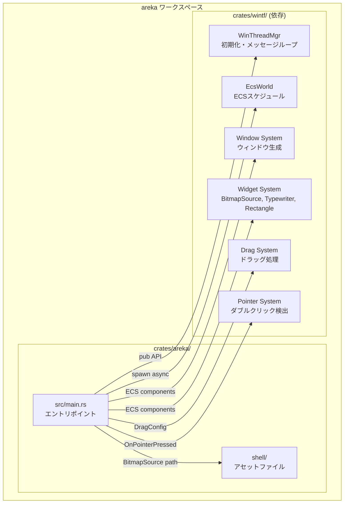
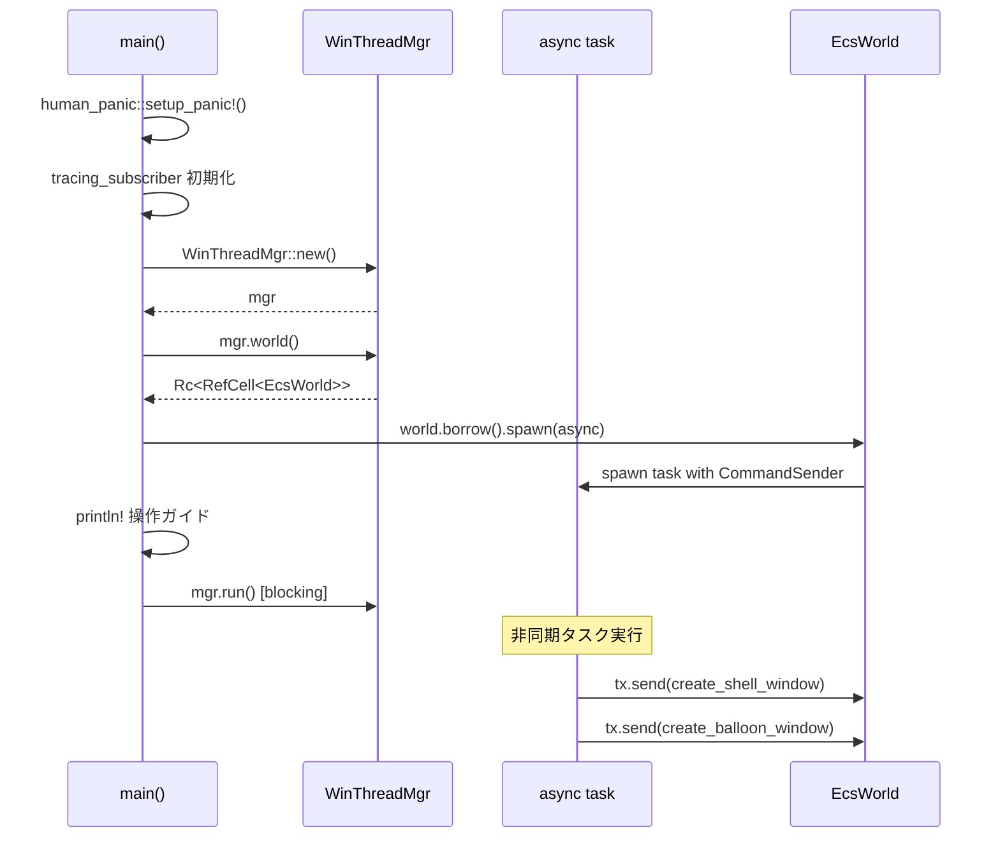
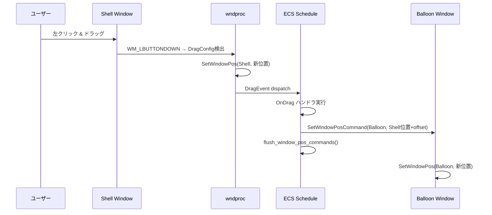
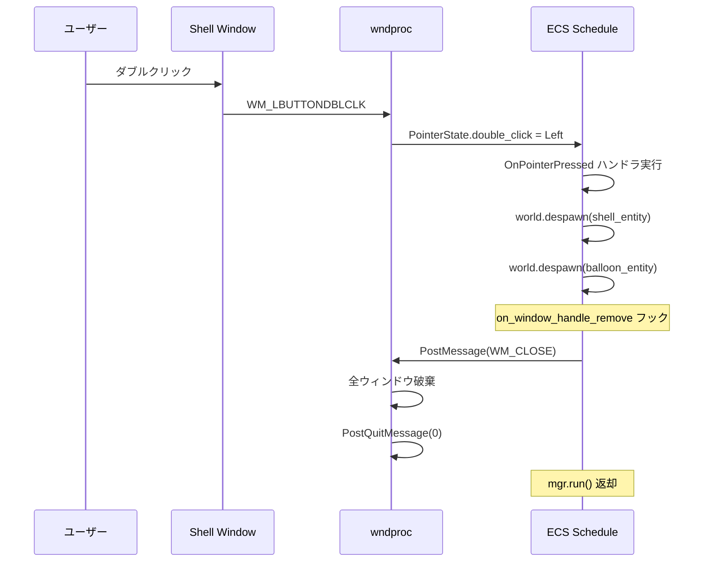
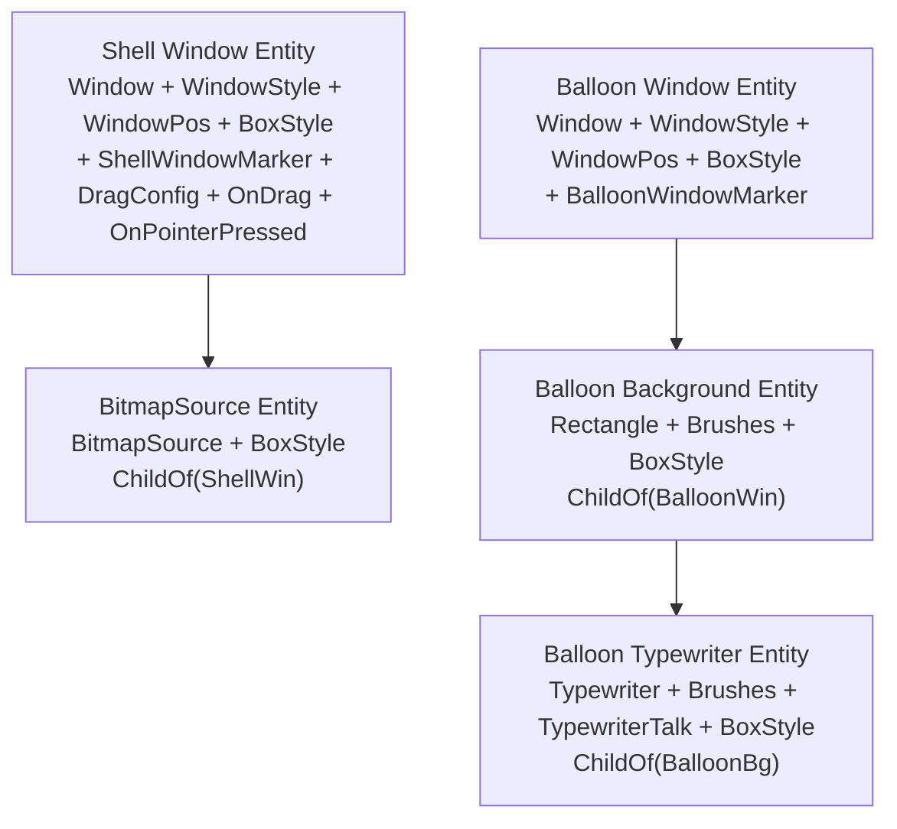

# Design Document: areka-mock-shell

## Overview

**Purpose**: `crates/areka/` バイナリクレートを新規作成し、wintfフレームワークを用いたデスクトップマスコット「ぱすたさん」の最小動作実装を提供する。シェルウィンドウ（キャラクター画像）とバルーンウィンドウ（縦書きテキスト）の2つの透過ウィンドウをデスクトップ上に表示し、ドラッグ移動とダブルクリック終了をサポートする。

**Users**: areka 開発者自身（アルファ段階）。将来的にはゴーストユーザー。

**Impact**: ワークスペースに新規クレート `crates/areka/` を追加し、ダミー `examples/areka.rs` を置き換える。`shell/` アセットディレクトリを `crates/areka/shell/` に移動する。

### Goals
- crates.io 公開可能な状態の `crates/areka/` バイナリクレートを構成する
- wintf 公開APIのみを使用し、シェル+バルーンの2ウィンドウ表示を実現する
- ドラッグ移動・バルーン追従・ダブルクリック終了の基本インタラクションを実装する
- 既存 steering/structure.md の計画を実現する

### Non-Goals
- クリックスルー（HTTRANSPARENT）の実装 — 別仕様 `wintf-P0-click-through` のスコープ
- pasta DSLエンジン統合 — 将来のフェーズ
- dola アニメーション統合 — 将来のフェーズ
- 表情パターン切り替え — 将来のフェーズ
- バイナリ配布・インストーラー — 将来のフェーズ

## Architecture

### Architecture Pattern & Boundary Map



**Architecture Integration**:
- **選択パターン**: 単一バイナリクレート + wintf依存。ECSコンポーネントの宣言的組み立てでUIを構築。
- **責務境界**: arekaは「何を表示するか」（コンポーネント宣言・イベントハンドラ）を担当。wintfは「どう表示するか」（Win32 API、DirectComposition、レイアウト、描画）を担当。
- **既存パターン準拠**: `typewriter_demo.rs`, `taffy_flex_demo.rs` と同じ初期化フロー（`WinThreadMgr::new()` → `world()` → `spawn()` → `run()`）。
- **ステアリング準拠**: `structure.md` の Application Binary Crate 計画に合致。`logging.md` の tracing 初期化パターンに準拠。

### Technology Stack

| Layer | Choice / Version | Role in Feature | Notes |
|-------|------------------|-----------------|-------|
| Language | Rust 2024 Edition | バイナリクレート本体 | workspace.package.edition 継承 |
| UI Framework | wintf (workspace) | ウィンドウ管理、描画、ECS | path依存 `{ path = "../wintf" }` |
| ECS | bevy_ecs 0.18.0 (wintf経由) | コンポーネント定義、ハンドラ | pub use re-export 利用 |
| Crash Handling | human-panic (workspace) | パニック時のユーザーフレンドリー表示 | |
| Logging | tracing + tracing-subscriber (workspace) | 構造化ロギング | `RUST_LOG` 対応 |
| Async | async-io (dev相当) | タイマー等の非同期操作 | |
| Windows API | windows 0.62.2 (wintf経由) | `POINT`, `D2D1_COLOR_F` 等の型 | |

## System Flows

### 起動フロー



### ドラッグ追従フロー



### ダブルクリック終了フロー



## Requirements Traceability

| Requirement | Summary | Components | Interfaces | Flows |
|-------------|---------|------------|------------|-------|
| 1.1 | WS_POPUP透過ウィンドウ | ShellWindow | WindowStyle, BoxStyle | 起動フロー |
| 1.2 | BitmapSource画像表示 | ShellWindow | BitmapSource | 起動フロー |
| 1.3 | クリックスルー(スコープ外) | — | — | — |
| 2.1 | バルーン表示 | BalloonWindow | Window, WindowStyle | 起動フロー |
| 2.2 | ポップアップスタイル | BalloonWindow | WindowStyle | 起動フロー |
| 2.3 | 背景矩形描画 | BalloonBackground | Rectangle, Brushes | 起動フロー |
| 2.4 | 縦書きTypewriter | BalloonTypewriter | Typewriter, TypewriterTalk | 起動フロー |
| 2.5 | シェル右側配置 | BalloonWindow | WindowPos | 起動フロー |
| 3.1 | ドラッグ移動 | ShellWindow | DragConfig | ドラッグ追従フロー |
| 3.2 | バルーン追従 | BalloonFollowHandler | OnDrag, SetWindowPosCommand | ドラッグ追従フロー |
| 3.3 | ダブルクリック終了 | ExitHandler | OnPointerPressed, DoubleClick | ダブルクリック終了フロー |
| 4.1 | CommandSender非同期 | AsyncSetup | CommandSender, spawn | 起動フロー |
| 4.2 | 操作ガイド出力 | MainEntry | println! | 起動フロー |
| 4.3 | RUST_LOGログ制御 | MainEntry | tracing-subscriber, EnvFilter | 起動フロー |
| 5.1 | Cargo.tomlバイナリクレート | CrateStructure | Cargo.toml | — |
| 5.2 | publish=true メタデータ | CrateStructure | Cargo.toml | — |
| 5.3 | wintf公開APIのみ | 全コンポーネント | wintf::ecs::* | — |
| 5.4 | ワークスペース依存利用 | CrateStructure | Cargo.toml | — |
| 5.5 | shell/アセット移動 | CrateStructure | git mv | — |
| 5.6 | ダミー削除・structure更新 | CrateStructure | git rm, structure.md | — |

## Components and Interfaces

| Component | Domain/Layer | Intent | Req Coverage | Key Dependencies | Contracts |
|-----------|-------------|--------|-------------|-----------------|-----------|
| MainEntry | Application | エントリポイント・初期化 | 4.1, 4.2, 4.3 | WinThreadMgr (P0) | — |
| AsyncSetup | Application | 非同期タスクでのUI構築 | 4.1 | CommandSender (P0) | — |
| ShellWindow | UI/Shell | シェルウィンドウEntity構築 | 1.1, 1.2, 3.1, 3.3 | Window, BitmapSource, DragConfig (P0) | State |
| BalloonWindow | UI/Balloon | バルーンウィンドウEntity構築 | 2.1, 2.2, 2.5 | Window, WindowPos (P0) | State |
| BalloonBackground | UI/Balloon | バルーン背景矩形 | 2.3 | Rectangle, Brushes (P0) | — |
| BalloonTypewriter | UI/Balloon | 縦書きテキスト表示 | 2.4 | Typewriter, TypewriterTalk (P0) | — |
| BalloonFollowHandler | Interaction | ドラッグ時バルーン追従 | 3.2 | OnDrag, SetWindowPosCommand (P0) | Service |
| ExitHandler | Interaction | ダブルクリック終了 | 3.3 | OnPointerPressed, DoubleClick (P0) | Service |
| CrateStructure | Infrastructure | クレート構成・メタデータ | 5.1-5.6 | Cargo.toml (P0) | — |

### Application Layer

#### MainEntry

| Field | Detail |
|-------|--------|
| Intent | アプリケーションのエントリポイント。初期化・操作ガイド出力・メッセージループ実行 |
| Requirements | 4.1, 4.2, 4.3 |

**Responsibilities & Constraints**
- `human_panic::setup_panic!()` でパニックハンドラ設定
- `tracing_subscriber` を `EnvFilter` 付きで初期化（`RUST_LOG` 対応、デフォルト `info`）
- `WinThreadMgr::new()` でフレームワーク初期化
- 操作ガイドをコンソールに出力（ドラッグ・ダブルクリック終了の説明）
- `mgr.run()` でブロッキングメッセージループ実行

**Dependencies**
- Outbound: WinThreadMgr — フレームワーク初期化 (P0)
- External: human-panic, tracing-subscriber — クラッシュ・ログ (P1)

**Implementation Notes**
- `#![cfg_attr(not(debug_assertions), windows_subsystem = "windows")]` でリリースビルド時にコンソール非表示
- 操作ガイドは `println!` でシンプルに出力（将来的にはバルーンに統合）

#### AsyncSetup

| Field | Detail |
|-------|--------|
| Intent | `CommandSender` を使った非同期タスクでUIエンティティを構築 |
| Requirements | 4.1 |

**Responsibilities & Constraints**
- `world.borrow().spawn(|tx| async { ... })` で非同期タスクを起動
- 1つのコマンド内でシェルとバルーンを生成し、EntityIDを受け渡す
- コマンドは `fn(&mut World)` シグネチャのクロージャ

**Implementation Pseudocode**:
```rust
tx.send(Box::new(|world: &mut World| {
    let shell_entity = create_shell_window(world);
    let balloon_entity = create_balloon_window(world, shell_entity);
}));
```

**Dependencies**
- Outbound: CommandSender — 非同期コマンド送信 (P0)
- Outbound: ShellWindow, BalloonWindow — UI構築関数 (P0)

### UI Layer — Shell

#### ShellWindow

| Field | Detail |
|-------|--------|
| Intent | シェル（キャラクター画像）ウィンドウのECSエンティティを構築 |
| Requirements | 1.1, 1.2, 3.1, 3.3 |

**Responsibilities & Constraints**
- `Window` + `WindowStyle(WS_POPUP | WS_VISIBLE, WS_EX_NOREDIRECTIONBITMAP)` で透過ウィンドウ
- `WindowPos { position: Some(POINT { x, y }), .. }` で初期位置指定
- `BoxStyle` で 320×420px サイズ指定
- `BitmapSource::new("crates/areka/shell/base.png")` でキャラクター画像表示
- `DragConfig::default()` (`move_window: true`) でネイティブドラッグ有効化
- `OnPointerPressed(on_shell_pressed)` でダブルクリック終了ハンドラ登録
- `OnDrag(on_shell_drag)` でバルーン追従ハンドラ登録
- マーカーコンポーネント `ShellWindowMarker` でクエリ用識別

**Dependencies**
- Inbound: AsyncSetup — 非同期コマンドで呼び出される (P0)
- Outbound: BitmapSource — 画像読み込み (P0)
- Outbound: DragConfig — ドラッグ有効化 (P0)

##### State Management
- **State model**: ECSエンティティとして存在 = ウィンドウ表示中。`despawn` = ウィンドウ破棄。
- **Persistence**: なし（セッション中のみ）

##### Service Interface

```rust
/// シェルウィンドウを構築し、ECSエンティティのIDを返す
fn create_shell_window(world: &mut World) -> Entity;

/// シェルウィンドウを識別するマーカーコンポーネント
#[derive(Component)]
struct ShellWindowMarker;
```

- Preconditions: `WinThreadMgr` が初期化済み、EcsWorldが存在
- Postconditions: Shell Window エンティティが生成され、`WindowHandle` が自動付与（次の UISetup tick で）

### UI Layer — Balloon

#### BalloonWindow

| Field | Detail |
|-------|--------|
| Intent | バルーン（縦書き吹き出し）ウィンドウのECSエンティティを構築 |
| Requirements | 2.1, 2.2, 2.5 |

**Responsibilities & Constraints**
- `Window` + `WindowStyle(WS_POPUP | WS_VISIBLE, WS_EX_NOREDIRECTIONBITMAP)` で透過ウィンドウ
- `WindowPos` でシェルウィンドウの右側に配置（シェルの x + 320 + 15px のオフセット）
- `BoxStyle` でバルーンサイズ指定（幅: 約200px、高さ: 約350px — 縦書きテキストに適したサイズ）
- マーカーコンポーネント `BalloonWindowMarker` でクエリ用識別
- `ChildOf(shell_entity)` で親子関係を設定（wintf公開API: `wintf::ecs::ChildOf`）
- 子エンティティとして `BalloonBackground` と `BalloonTypewriter` を保持

**Dependencies**
- Inbound: AsyncSetup — 非同期コマンドで呼び出される (P0)
- Outbound: BalloonBackground — 背景描画 (P0)
- Outbound: BalloonTypewriter — テキスト表示 (P0)

##### State Management
- **State model**: ECSエンティティとして存在 = バルーン表示中
- **位置状態**: Shell の `WindowPos` に対する固定オフセット。Shell 移動時に同期更新。

##### Service Interface

```rust
/// バルーンウィンドウを構築し、ECSエンティティのIDを返す
/// shell_entity: シェルウィンドウのEntity（位置計算に使用）
fn create_balloon_window(world: &mut World, shell_entity: Entity) -> Entity;

/// バルーンウィンドウを識別するマーカーコンポーネント
#[derive(Component)]
struct BalloonWindowMarker;
```

#### BalloonBackground

| Field | Detail |
|-------|--------|
| Intent | バルーンの半透明背景矩形を描画 |
| Requirements | 2.3 |

**Responsibilities & Constraints**
- `Rectangle::new()` + `Brushes::with_foreground(D2D1_COLOR_F { r: 1.0, g: 1.0, b: 0.95, a: 0.85 })` で薄いクリーム色の半透明背景
- `BoxStyle { flex_grow: Some(1.0), .. }` でバルーンウィンドウ全体を覆う
- `ChildOf(balloon_window_entity)` でバルーンウィンドウの子エンティティ（wintf公開API）
- 子エンティティとして `BalloonTypewriter` を保持（テキストが背景の上に表示される）

**Dependencies**
- Inbound: BalloonWindow — 親エンティティ (P0)

#### BalloonTypewriter

| Field | Detail |
|-------|--------|
| Intent | 縦書きテキストをタイプライター効果で表示 |
| Requirements | 2.4 |

**Responsibilities & Constraints**
- `Typewriter { font_family: "メイリオ", font_size: 16.0, direction: TextDirection::VerticalRightToLeft, default_char_wait: 0.08 }`
- `Brushes::with_colors(foreground_black, transparent_bg)` で文字色設定
- `TypewriterTalk::new(tokens, start_time)` でテキストトークン設定
- テキスト内容: 「みんながもってる、記憶の糸。…ぱすた」（Req 2.4 で定義）
- `BoxStyle` でマージン付き配置（背景矩形内にパディング）
- `ChildOf(balloon_background_entity)` で背景矩形の子エンティティ（wintf公開API）

**Dependencies**
- Inbound: BalloonBackground — 親エンティティ (P0)

**Implementation Notes**
- `TypewriterToken` の構築: テキストを文字単位で `TypewriterToken::Char(c)` に分解。改行は `TypewriterToken::NewLine`。空行は `TypewriterToken::Wait(pause_duration)` で表現。
- `start_time` は `FrameTime` リソースから取得、または `0.0` で即時開始。
- `ChildOf` は `wintf::ecs::ChildOf` （bevy_ecs::hierarchy 由来の公開API）を使用。

### Interaction Layer

#### BalloonFollowHandler

| Field | Detail |
|-------|--------|
| Intent | シェルウィンドウのドラッグ移動時にバルーンウィンドウを追従移動させる |
| Requirements | 3.2 |

**Responsibilities & Constraints**
- `OnDrag` ハンドラとしてシェルウィンドウエンティティに登録
- ハンドラ内でシェルの現在 `WindowPos.position` を取得
- バルーンの `WindowPos.position` をシェル位置 + オフセット（x: +335px, y: +0px）で更新
- `SetWindowPosCommand` を発行してバルーンのウィンドウ位置を即時反映

**Dependencies**
- Inbound: DragConfig — ドラッグイベント発火 (P0)
- Outbound: BalloonWindowMarker — バルーンEntity検索 (P0)
- Outbound: SetWindowPosCommand — 位置更新 (P0)

##### Service Interface

```rust
/// OnDrag ハンドラ: シェルドラッグ時にバルーンを追従させる
fn on_shell_drag(
    world: &mut World,
    sender: Entity,
    entity: Entity,
    ev: &Phase<DragEvent>,
) -> bool;
```

- Preconditions: シェルウィンドウがドラッグ中、バルーンウィンドウが存在
- Postconditions: バルーンの `WindowPos` がシェル位置 + オフセットに更新される

#### ExitHandler

| Field | Detail |
|-------|--------|
| Intent | シェルウィンドウのダブルクリックでアプリケーションを終了 |
| Requirements | 3.3 |

**Responsibilities & Constraints**
- `OnPointerPressed` ハンドラとしてシェルウィンドウエンティティに登録
- `Phase::Bubble(state)` で `state.double_click == DoubleClick::Left` を検査
- 一致した場合、`ShellWindowMarker` と `BalloonWindowMarker` を持つ全エンティティを `despawn`
- `despawn` により `on_window_handle_remove` → `PostMessage(WM_CLOSE)` → 全ウィンドウ破棄 → `PostQuitMessage(0)` → `mgr.run()` 終了

**Dependencies**
- Inbound: PointerState — ダブルクリック検出 (P0)
- Outbound: ShellWindowMarker, BalloonWindowMarker — Entity検索 (P0)

**Implementation Notes**
- wintfは`CS_DBLCLKS`クラススタイルを設定済み（`process_singleton.rs` L74: ECS用ウィンドウクラス）
- `WM_LBUTTONDBLCLK`メッセージは正常に受信され、`PointerState.double_click`に反映される

##### Service Interface

```rust
/// OnPointerPressed ハンドラ: ダブルクリックで全ウィンドウを終了
fn on_shell_pressed(
    world: &mut World,
    sender: Entity,
    entity: Entity,
    ev: &Phase<PointerState>,
) -> bool;
```

- Preconditions: シェルウィンドウがポインターイベントを受信
- Postconditions: ダブルクリック時に全ウィンドウEntity が despawn され、アプリケーションが終了

### Infrastructure Layer

#### CrateStructure

| Field | Detail |
|-------|--------|
| Intent | crates.io公開可能なバイナリクレートの構成 |
| Requirements | 5.1, 5.2, 5.3, 5.4, 5.5, 5.6 |

**Responsibilities & Constraints**
- `crates/areka/Cargo.toml` の作成:
  - `name = "areka"`, `version = "0.0.1"`, `edition.workspace = true`
  - `description = "Desktop mascot platform inspired by Ukagaka"`
  - `license.workspace = true`, `authors.workspace = true`
  - `publish = true` （ワークスペースの `publish = false` をオーバーライド）
  - `repository = "https://github.com/ekicyou/areka"`
  - `[dependencies]`: `wintf = { path = "../wintf" }`, `human-panic`, `tracing`, `tracing-subscriber`, `async-io`, `windows`, `bevy_ecs`（全て workspace 参照）
- `crates/areka/src/main.rs` の作成
- `git mv shell/ crates/areka/shell/` でアセット移動
- `git rm crates/wintf/examples/areka.rs` でダミー削除
- `steering/structure.md` の areka Status 更新（「未作成」→「モック実装」）

**Implementation Notes**
- `publish = true` 時、crates.io には `wintf` の path 依存は解決できない。公開時に `wintf` も公開するか、`version` 指定に切り替える必要がある。モック段階では path 依存で問題なし。
- `Cargo.toml` のバージョンは `"0.0.1"` で開始（workspace の `"0.0.0"` は継承しない）。

## Data Models

### Domain Model

本仕様にはデータストレージは存在しない。全状態はECSエンティティのコンポーネントとして管理される。

**ECSエンティティ構成**:



**Entity-Component マッピング**:

| Entity | Components | Purpose |
|--------|-----------|---------|
| Shell Window | `Window`, `WindowStyle`, `WindowPos`, `BoxStyle`, `ShellWindowMarker`, `DragConfig`, `OnDrag`, `OnPointerPressed` | シェルウィンドウ本体 |
| Shell Image | `BitmapSource`, `BoxStyle`, `ChildOf(Shell)` | キャラクター画像（自動で `Visual`, `HitTest::alpha_mask` 付与） |
| Balloon Window | `Window`, `WindowStyle`, `WindowPos`, `BoxStyle`, `BalloonWindowMarker` | バルーンウィンドウ本体 |
| Balloon Background | `Rectangle`, `Brushes`, `BoxStyle`, `ChildOf(Balloon)` | 半透明背景矩形 |
| Balloon Typewriter | `Typewriter`, `Brushes`, `TypewriterTalk`, `BoxStyle`, `ChildOf(BalloonBg)` | 縦書きテキスト |

## Error Handling

### Error Strategy
- `main()` は `windows::core::Result<()>` を返す。`WinThreadMgr::new()` や `mgr.run()` のエラーは `?` で伝播。
- `human_panic` がパニックをキャッチし、ユーザーフレンドリーなクラッシュレポートを提供。
- `BitmapSource` の画像読み込み失敗は wintf 内部で `warn!` ログを出力。ウィンドウは表示されるがキャラクター画像が描画されない状態になる。
- イベントハンドラ内のエラーは `tracing::error!` でログ出力し、ハンドラは `false` を返してイベント伝播を継続。

## Testing Strategy

### 手動テスト（主要確認項目）
1. `cargo run -p areka` でシェルとバルーンが表示されること
2. シェルウィンドウをドラッグ移動し、バルーンが追従すること
3. シェルウィンドウをダブルクリックし、アプリケーションが終了すること
4. `RUST_LOG=debug cargo run -p areka` でデバッグログが出力されること
5. シェル画像（base.png）が正しく透過表示されること

### ビルドテスト
- `cargo build -p areka` が成功すること
- `cargo test` （ワークスペース全体）が既存テストを壊さないこと
- `cargo check -p areka` でコンパイルエラーがないこと

### 将来のテスト拡充
- ECSエンティティ構築のユニットテスト（コンポーネント存在確認）
- バルーン位置計算のユニットテスト
- CI/CD パイプラインでのビルドチェック
