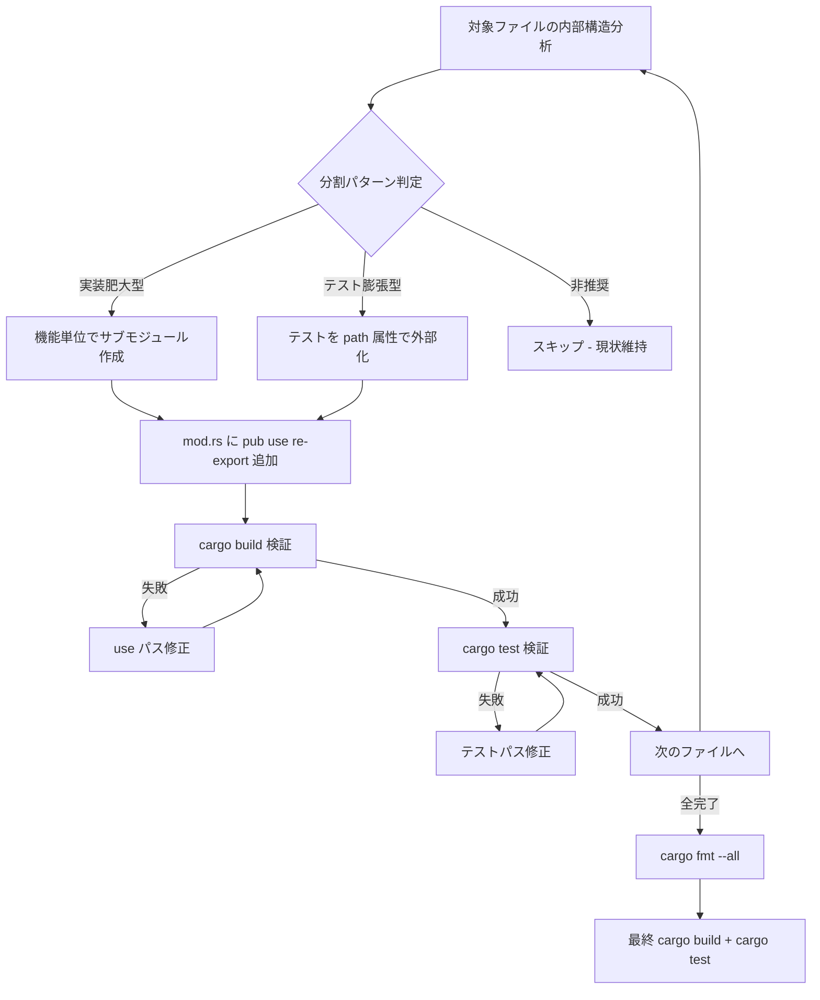

# Design Document — codebase-file-split-refactor

## Overview

**Purpose**: 全クレート（`areka`, `dola`, `wintf`）のソースコードをAIフレンドリーなファイルサイズに分割し、LLMコーディングアシスタントが各ファイルを完全に把握・編集できる状態を実現する。

**Users**: AI コーディングアシスタント（GitHub Copilot 等）を活用する開発者が、各ファイルの全体像を把握した上で正確な編集を行えるようになる。

**Impact**: 500行超のソースファイルを論理的な機能単位で分割し、外部APIは `pub use` re-export で完全互換維持。

### Goals

- ソースファイル（`src/`）を推奨300行 / 上限500行に収める
- テスト・サンプルファイルを推奨500行 / 上限800行に収める
- 分割後も `cargo build` / `cargo test` が成功する状態を維持
- 最終的に `cargo fmt --all` でフォーマット統一

### Non-Goals

- 非推奨モジュール（`win_message_handler.rs`）の削除（別スペックで管理）
- ロジックの変更やリファクタリング（ファイル分割のみ）
- テストの追加・修正（既存テストの移動のみ）
- 実装168行以下のファイルに付随する大量テストの外部化強制

## Architecture

### Existing Architecture Analysis

現在のプロジェクトは3クレート構成:

| クレート | 役割                            | 主な分割対象数                  |
| -------- | ------------------------------- | ------------------------------- |
| `wintf`  | Windowsフレームワークライブラリ | ソース12件 + テスト/サンプル1件 |
| `dola`   | アニメーション定義ライブラリ    | ソース3件 + テスト3件           |
| `areka`  | アプリケーションバイナリ        | （推奨対象のみ）                |

既存のディレクトリ構造パターン:
- `ecs/` 配下はサブディレクトリモジュール化済み（`graphics/`, `layout/`, `pointer/`, `drag/`, `widget/`, `window_proc/`）
- `com/d2d/` はサブディレクトリモジュール化済み
- ルートレベルの大型ファイル（`win_message_handler.rs`）は非推奨

### Architecture Pattern & Boundary Map

```mermaid
graph TB
    subgraph "分割パターン"
        P1[機能単位分割]
        P2[テスト外部化]
        P3[現状維持]
    end

    subgraph "wintf src 必須分割"
        GS[graphics/systems.rs 1373L]
        W[window.rs 1094L]
        PM[pointer/mod.rs 917L]
        DC[d2d/command.rs 909L]
        LS[layout/systems.rs 748L]
        CS[compositor_systems.rs 663L]
        WD[world.rs 626L]
        MB[mouse_button.rs 614L]
        WP[window_pos.rs 560L]
        TS[typewriter_systems.rs 539L]
    end

    subgraph "wintf src テスト外部化"
        HT[hit_test.rs 1247L]
        HR[hit_region.rs 937L]
    end

    subgraph "dola src 必須分割"
        CP[compile.rs 743L]
        VL[validate.rs 518L]
    end

    subgraph "dola src 現状維持"
        LC[loop_controller.rs 536L]
    end

    subgraph "テスト・サンプル分割"
        TD[taffy_flex_demo.rs 2027L]
        CT[compile_test.rs 1300L]
        TT[trigger_test.rs 980L]
        VT[validation_test.rs 910L]
    end

    P1 --> GS
    P1 --> W
    P1 --> PM
    P1 --> DC
    P1 --> LS
    P1 --> CS
    P1 --> WD
    P1 --> MB
    P1 --> WP
    P1 --> TS
    P1 --> CP
    P1 --> VL
    P1 --> TD
    P1 --> CT
    P1 --> TT
    P1 --> VT
    P2 --> HT
    P2 --> HR
    P3 --> LC
```

**Architecture Integration**:
- **Selected pattern**: ディレクトリモジュール化 + `pub use` re-export
- **Domain boundaries**: 各サブディレクトリ（`graphics/`, `layout/` 等）の境界を尊重
- **Existing patterns preserved**: `mod.rs` + サブモジュール構造
- **Steering compliance**: レイヤー分離（COM → ECS → Message Handling）を維持

### Technology Stack

| Layer     | Choice / Version  | Role in Feature    | Notes                        |
| --------- | ----------------- | ------------------ | ---------------------------- |
| Language  | Rust 2024 Edition | 全ファイル操作対象 | モジュールシステム活用       |
| Build     | Cargo workspace   | ビルド検証         | `cargo build` / `cargo test` |
| Formatter | rustfmt           | 最終フォーマット   | `cargo fmt --all`            |

## System Flows

### 分割作業フロー

## Requirements Traceability

| Requirement | Summary                    | Components           | Interfaces          | Flows                  |
| ----------- | -------------------------- | -------------------- | ------------------- | ---------------------- |
| 1.1–1.4     | ファイルサイズ閾値定義     | 全コンポーネント共通 | —                   | 分割判定基準           |
| 2.1–2.4     | ソースファイル分割（必須） | C1〜C12              | `pub use` re-export | 機能単位分割フロー     |
| 3.1–3.3     | ソースファイル分割（推奨） | C13                  | `pub use` re-export | 判断付き分割フロー     |
| 4.1–4.4     | テスト・サンプル分割       | C14〜C17             | テストモジュール    | テスト分割フロー       |
| 5.1–5.5     | モジュール整合性           | 全コンポーネント共通 | `cargo build/test`  | 検証フロー             |
| 6.1–6.3     | コードフォーマット         | C18                  | `cargo fmt`         | 最終フォーマットフロー |

## Components and Interfaces

| Component                     | Domain/Layer          | Intent                      | Req Coverage | Key Dependencies                     | Contracts |
| ----------------------------- | --------------------- | --------------------------- | ------------ | ------------------------------------ | --------- |
| C1: graphics/systems 分割     | wintf/ecs/graphics    | 1373行→6サブモジュール      | 2.1–2.4      | GraphicsCore, WindowGraphics (P0)    | State     |
| C2: window 分割               | wintf/ecs             | 1094行→4サブモジュール      | 2.1–2.4      | WindowHandle, DPI (P0)               | State     |
| C3: pointer/mod 分割          | wintf/ecs/pointer     | 917行→4サブモジュール       | 2.1–2.4      | PointerState, PointerBuffer (P0)     | State     |
| C4: d2d/command 分割          | wintf/com/d2d         | 909行→2サブモジュール       | 2.1–2.4      | DrawCommand, RecCommandSink (P0)     | Service   |
| C5: layout/systems 分割       | wintf/ecs/layout      | 748行→4サブモジュール       | 2.1–2.4      | Taffy, Arrangement (P0)              | State     |
| C6: compile 分割              | dola/src              | 743行→3サブモジュール       | 2.1–2.4      | CompiledStoryboard (P0)              | Service   |
| C7: compositor_systems 分割   | wintf/ecs/graphics    | 663行→2サブモジュール       | 2.1–2.4      | CompositorInit, CompositeRender (P0) | State     |
| C8: world 分割                | wintf/ecs             | 626行→3サブモジュール       | 2.1–2.4      | EcsWorld, ScheduleLabels (P0)        | State     |
| C9: mouse_button 分割         | wintf/ecs/window_proc | 614行→2サブモジュール       | 2.1–2.4      | ButtonMessage handlers (P1)          | —         |
| C10: window_pos 分割          | wintf/ecs/window_proc | 560行→2サブモジュール       | 2.1–2.4      | DPI helpers (P1)                     | —         |
| C11: typewriter_systems 分割  | wintf/ecs/widget/text | 539行→2サブモジュール       | 2.1–2.4      | TypewriterLayout, Draw (P1)          | —         |
| C12: validate 分割            | dola/src              | 518行→2サブモジュール       | 2.1–2.4      | Validate trait, Rules (P1)           | Service   |
| C13: hit_test テスト外部化    | wintf/ecs/layout      | テスト905行を外部ファイルに | 2.1–2.4      | —                                    | —         |
| C13b: hit_region テスト外部化 | wintf/ecs/layout      | テスト555行を外部ファイルに | 2.1–2.4      | —                                    | —         |
| C14: taffy_flex_demo 分割     | wintf/examples        | 2027行→ディレクトリ例化     | 4.1–4.3      | —                                    | —         |
| C15: compile_test 分割        | dola/tests            | 1300行→カテゴリ分割         | 4.1–4.2, 4.4 | —                                    | —         |
| C16: trigger_test 分割        | dola/tests            | 980行→カテゴリ分割          | 4.1–4.2, 4.4 | —                                    | —         |
| C17: validation_test 分割     | dola/tests            | 910行→カテゴリ分割          | 4.1–4.2, 4.4 | —                                    | —         |
| C18: cargo fmt 適用           | 全体                  | フォーマット統一            | 6.1–6.3      | —                                    | —         |

### wintf/ecs/graphics

#### C1: graphics/systems 分割

| Field        | Detail                                                          |
| ------------ | --------------------------------------------------------------- |
| Intent       | 1373行の巨大システムファイルを6つの機能単位サブモジュールに分割 |
| Requirements | 2.1, 2.2, 2.3, 2.4                                              |

**Responsibilities & Constraints**
- `systems.rs` → `systems/` ディレクトリに変換
- 外部公開関数のシグネチャ・パスを変更しない

**分割設計**

| 新ファイル               | 対象関数                                                                                                                                                                             | 推定行数 |
| ------------------------ | ------------------------------------------------------------------------------------------------------------------------------------------------------------------------------------ | -------- |
| `systems/init.rs`        | `format_entity_name`, `calculate_surface_size_*`, `create_window_graphics_for_hwnd`, `create_surface_for_visual`, `init_graphics_core`, `init_window_graphics`, `init_window_visual` | ~370     |
| `systems/render.rs`      | `draw_recursive`, `render_surface`, `commit_composition`                                                                                                                             | ~225     |
| `systems/surface.rs`     | `sync_surface_from_arrangement`, `mark_dirty_surfaces`, `deferred_surface_creation_system`, `cleanup_surface_on_commandlist_removed`                                                 | ~430     |
| `systems/visual_sync.rs` | `visual_hierarchy_sync_system`, `visual_property_sync_system`                                                                                                                        | ~270     |
| `systems/window_pos.rs`  | `apply_window_pos_changes`, `invalidate_dependent_components`                                                                                                                        | ~130     |
| `systems/brushes.rs`     | `resolve_inherited_brushes`, `find_parent_brushes`, `resolve_brush_fields`                                                                                                           | ~90      |
| `systems/mod.rs`         | `pub use` re-export のみ                                                                                                                                                             | ~30      |

**Implementation Notes**
- `surface.rs` が430行と推奨上限を超えるが、Surface関連ロジックの凝集度が高いため1ファイルに維持。将来的にさらに分割可能
- ヘルパー関数（`format_entity_name`, `calculate_surface_size_*`）は `init.rs` に配置（主な呼び出し元が初期化系のため）

#### C7: compositor_systems 分割

| Field        | Detail                                              |
| ------------ | --------------------------------------------------- |
| Intent       | 663行のコンポジター関連システムを初期化と描画に分割 |
| Requirements | 2.1, 2.2, 2.3, 2.4                                  |

**分割設計**

| 新ファイル             | 対象関数                                                                                                                                       | 推定行数 |
| ---------------------- | ---------------------------------------------------------------------------------------------------------------------------------------------- | -------- |
| `compositor_init.rs`   | `compositor_init_system`                                                                                                                       | ~130     |
| `compositor_render.rs` | `DcTargetGuard`, `CompositeContext`, `draw_with_opacity`, `render_subtree`, `is_window_dirty`, `composite_render_system`, `ulw_present_system` | ~530     |

**Implementation Notes**
- `compositor_render.rs` が530行と上限を超える可能性があるが、描画パイプラインの一連のフローとして凝集度が高い
- `ulw_present_system`（47行）は描画完了後の画面転送であり、`compositor_render.rs` に含めるのが自然

### wintf/ecs

#### C2: window 分割

| Field        | Detail                                                |
| ------------ | ----------------------------------------------------- |
| Intent       | 1094行のウィンドウコンポーネント定義を4つの責務に分割 |
| Requirements | 2.1, 2.2, 2.3, 2.4                                    |

**分割設計**

| 新ファイル             | 対象要素                                                                                                                               | 推定行数 |
| ---------------------- | -------------------------------------------------------------------------------------------------------------------------------------- | -------- |
| `window/components.rs` | `DpiChangeContext`, `CompositionMode`, `Window`, `WindowHandle`, `WindowStyle`, hooks (`on_window_handle_add/remove`, `on_window_add`) | ~400     |
| `window/dpi.rs`        | `DPI` 型、DPI変換メソッド                                                                                                              | ~115     |
| `window/window_pos.rs` | `ZOrder`, `WindowPos`（builder含む）, `SetWindowParentToLayoutRoot`                                                                    | ~375     |
| `window/command.rs`    | `SetWindowPosGuard`, `is_self_initiated`, `guarded_set_window_pos`, `SetWindowPosCommand`, `find_owner_window`                         | ~210     |
| `window/mod.rs`        | `pub use` re-export                                                                                                                    | ~30      |

**Implementation Notes**
- `components.rs` が400行と推奨上限を超えるが、`WindowHandle` の `impl` ブロックが大きいため。構造体定義とhooksの凝集度を考慮して1ファイルに維持
- `use crate::ecs::window::*` パスは `mod.rs` の re-export で完全互換

#### C8: world 分割

| Field        | Detail                                                    |
| ------------ | --------------------------------------------------------- |
| Intent       | 626行のECS World定義をスケジュールラベルとVSYNC制御に分割 |
| Requirements | 2.1, 2.2, 2.3, 2.4                                        |

**分割設計**

| 新ファイル                 | 対象要素                                                                          | 推定行数 |
| -------------------------- | --------------------------------------------------------------------------------- | -------- |
| `world/schedule_labels.rs` | `FrameCount`, 12個の schedule label 構造体（`Input`, `Update`, `PreLayout`, ...） | ~100     |
| `world/vsync.rs`           | `IS_TICK_FLUSH_IN_PROGRESS`, `TickFlushGuard`, `VsyncTick` trait + impl           | ~95      |
| `world/mod.rs`             | `EcsWorld` struct + impl + re-export                                              | ~430     |

**Implementation Notes**
- `mod.rs` が430行と推奨上限を超えるが、`EcsWorld::new()` 内のシステム登録（~210行）が大部分。将来的にビルダーパターン抽出で削減可能だが、本スペックでは実施しない

### wintf/ecs/pointer

#### C3: pointer/mod 分割

| Field        | Detail                                                        |
| ------------ | ------------------------------------------------------------- |
| Intent       | 917行のポインターモジュールを型定義・システム・バッファに分割 |
| Requirements | 2.1, 2.2, 2.3, 2.4                                            |

**分割設計**

| 新ファイル           | 対象要素                                                                                                                                                                                                                         | 推定行数 |
| -------------------- | -------------------------------------------------------------------------------------------------------------------------------------------------------------------------------------------------------------------------------- | -------- |
| `pointer/types.rs`   | `PhysicalPoint`, `DoubleClick`, `WheelDelta`, `CursorVelocity`, `PointerButton`, `PointerState`, `PointerLeave`, `WindowPointerTracking`, `PositionSample`, `PointerBuffer`, `ButtonBuffer`, `WheelBuffer` + エイリアス群        | ~330     |
| `pointer/systems.rs` | `process_pointer_buffers`, `clear_transient_pointer_state`, `clear_transient_mouse_state`, `debug_pointer_state_changes`, `debug_pointer_leave` + エイリアス                                                                     | ~260     |
| `pointer/buffers.rs` | `POINTER_BUFFERS`, `BUTTON_BUFFERS`, `WHEEL_BUFFERS`, `DOUBLE_CLICK_BUFFERS`, `MODIFIER_STATE`（thread_local）, `push_pointer_sample`, `record_button_down/up`, `add_wheel_*`, `set_modifier_state`, `transfer_buffers_to_world` | ~250     |
| `pointer/mod.rs`     | `pub mod dispatch;` + `pub use` re-export                                                                                                                                                                                        | ~50      |

**Implementation Notes**
- 既存の `pointer/dispatch.rs`（365行）はそのまま維持
- テスト（~160行）は `types.rs` に `#[cfg(test)]` として配置

### wintf/com/d2d

#### C4: d2d/command 分割

| Field        | Detail                                          |
| ------------ | ----------------------------------------------- |
| Intent       | 909行のD2Dコマンド定義をデータ型とCOM実装に分割 |
| Requirements | 2.1, 2.2, 2.3, 2.4                              |

**分割設計**

| 新ファイル         | 対象要素                                       | 推定行数 |
| ------------------ | ---------------------------------------------- | -------- |
| `command_types.rs` | 全30+ コマンド struct + `DrawCommand` enum     | ~590     |
| `command_sink.rs`  | `RecCommandSink` + 全 `ID2D1CommandSink*_Impl` | ~420     |

**Implementation Notes**
- `command.rs` → 2ファイルに分割。`d2d/mod.rs` で re-export
- `command_types.rs` が590行と上限超だが、30+の小さな struct が列挙されているだけで各struct は10〜30行。論理的に1ファイルでの管理が適切

### wintf/ecs/layout

#### C5: layout/systems 分割

| Field        | Detail                                             |
| ------------ | -------------------------------------------------- |
| Intent       | 748行のレイアウトシステムを4つの責務グループに分割 |
| Requirements | 2.1, 2.2, 2.3, 2.4                                 |

**分割設計**

| 新ファイル                       | 対象関数                                                                                                                                              | 推定行数 |
| -------------------------------- | ----------------------------------------------------------------------------------------------------------------------------------------------------- | -------- |
| `systems/arrangement_systems.rs` | `sync_simple_arrangements`, `mark_dirty_arrangement_trees`, `propagate_global_arrangements`                                                           | ~95      |
| `systems/taffy_systems.rs`       | `build_taffy_styles_system`, `sync_taffy_tree_system`, `compute_taffy_layout_system`, `update_arrangements_system`, `cleanup_removed_entities_system` | ~290     |
| `systems/window_pos_systems.rs`  | `window_pos_sync_system`, `sync_window_arrangement_from_window_pos`                                                                                   | ~140     |
| `systems/monitor_systems.rs`     | `get_virtual_desktop_bounds`, `initialize_layout_root`, `update_monitor_layout_system`, `detect_display_change_system`                                | ~250     |
| `systems/mod.rs`                 | `pub use` re-export                                                                                                                                   | ~20      |

#### C13: hit_test テスト外部化

| Field        | Detail                                          |
| ------------ | ----------------------------------------------- |
| Intent       | hit_test.rs 内の905行テストを外部ファイルに移動 |
| Requirements | 2.1, 2.2                                        |

**方式**: `hit_test.rs` の末尾 `#[cfg(test)] mod tests { ... }` を `hit_test_tests.rs` に移動し、`#[cfg(test)] #[path = "hit_test_tests.rs"] mod tests;` で参照

#### C13b: hit_region テスト外部化

| Field        | Detail                                            |
| ------------ | ------------------------------------------------- |
| Intent       | hit_region.rs 内の555行テストを外部ファイルに移動 |
| Requirements | 2.1, 2.2                                          |

**方式**: `hit_test` と同様のパターン

### wintf/ecs/window_proc

#### C9: mouse_button 分割

| Field        | Detail                                         |
| ------------ | ---------------------------------------------- |
| Intent       | 614行のマウスボタン処理を2サブモジュールに分割 |
| Requirements | 2.1, 2.2, 2.3, 2.4                             |

**分割設計**

| 新ファイル                | 対象関数                                                                                                                | 推定行数 |
| ------------------------- | ----------------------------------------------------------------------------------------------------------------------- | -------- |
| `mouse_click.rs`          | `handle_button_message` + 8つの `WM_*BUTTON*` ラッパー                                                                  | ~450     |
| `mouse_dblclick_wheel.rs` | `handle_double_click_message` + 4つの `WM_*DBLCLK` ラッパー + `WM_MOUSEWHEEL/HWHEEL` + `find_ancestor_with_drag_config` | ~220     |

**Implementation Notes**
- `mouse_click.rs` は450行で上限付近だが、`handle_button_message`（280行）が核であり、さらなる分割は関数内のロジック変更を伴うため本スペック外

#### C10: window_pos 分割

| Field        | Detail                                                 |
| ------------ | ------------------------------------------------------ |
| Intent       | 560行のウィンドウ位置処理をハンドラとDPIヘルパーに分割 |
| Requirements | 2.1, 2.2, 2.3, 2.4                                     |

**分割設計**

| 新ファイル             | 対象関数                                                                                                                     | 推定行数 |
| ---------------------- | ---------------------------------------------------------------------------------------------------------------------------- | -------- |
| `window_pos.rs` (縮小) | `WM_WINDOWPOSCHANGED`, `WM_DPICHANGED`                                                                                       | ~380     |
| `dpi_helpers.rs`       | `calculate_physical_size_from_box_style`, `calculate_center_correction`, `correct_position_for_dpi_center_preserve` + テスト | ~240     |

### wintf/ecs/widget/text

#### C11: typewriter_systems 分割

| Field        | Detail                                                |
| ------------ | ----------------------------------------------------- |
| Intent       | 539行のタイプライターシステムをレイアウトと描画に分割 |
| Requirements | 2.1, 2.2, 2.3, 2.4                                    |

**分割設計**

| 新ファイル             | 対象関数                                                                                              | 推定行数 |
| ---------------------- | ----------------------------------------------------------------------------------------------------- | -------- |
| `typewriter_layout.rs` | `invalidate_typewriter_layout_on_arrangement_change`, `init_typewriter_layout`, `convert_to_timeline` | ~230     |
| `typewriter_draw.rs`   | `update_typewriters`, `draw_typewriters`, `draw_typewriter_backgrounds`                               | ~340     |

### dola/src

#### C6: compile 分割

| Field        | Detail                                                    |
| ------------ | --------------------------------------------------------- |
| Intent       | 743行のコンパイラを型定義・メイン関数・解決ヘルパーに分割 |
| Requirements | 2.1, 2.2, 2.3, 2.4                                        |

**分割設計**

| 新ファイル           | 対象要素                                                                                                   | 推定行数 |
| -------------------- | ---------------------------------------------------------------------------------------------------------- | -------- |
| `compile/types.rs`   | `CompiledStoryboard`, `CompiledVariableTimeline`, `CompiledSegment`, `VariableTypeHint`, `CompiledTrigger` | ~135     |
| `compile/mod.rs`     | `compile_storyboard` メイン関数 + re-export                                                                | ~270     |
| `compile/resolve.rs` | `DependencyGraph`, `topological_sort`, `resolve_*` 全ヘルパー                                              | ~420     |

**Implementation Notes**
- `resolve.rs` が420行と上限付近だが、全てが `compile_storyboard` の下請け関数であり凝集度が高い

#### C12: validate 分割

| Field        | Detail                                             |
| ------------ | -------------------------------------------------- |
| Intent       | 518行のバリデーションをtrait定義とルール実装に分割 |
| Requirements | 2.1, 2.2, 2.3, 2.4                                 |

**分割設計**

| 新ファイル           | 対象要素                                            | 推定行数 |
| -------------------- | --------------------------------------------------- | -------- |
| `validate.rs` (縮小) | `Validate` trait + `impl Validate for DolaDocument` | ~185     |
| `validate_rules.rs`  | 全 `validate_*` 関数 + DFSヘルパー                  | ~385     |

### テスト・サンプル分割

#### C14: taffy_flex_demo 分割

| Field        | Detail                                     |
| ------------ | ------------------------------------------ |
| Intent       | 2027行のサンプルをディレクトリ例として分割 |
| Requirements | 4.1, 4.2, 4.3                              |

**分割設計**

| 新ファイル                             | 内容                                | 推定行数 |
| -------------------------------------- | ----------------------------------- | -------- |
| `examples/taffy_flex_demo/main.rs`     | エントリポイント + ウィンドウ初期化 | ~300     |
| `examples/taffy_flex_demo/setup.rs`    | ECS セットアップ + ウィジェット構築 | ~500     |
| `examples/taffy_flex_demo/widgets.rs`  | ウィジェット定義ヘルパー            | ~500     |
| `examples/taffy_flex_demo/styles.rs`   | スタイル定義・レイアウト設定        | ~400     |
| `examples/taffy_flex_demo/handlers.rs` | イベントハンドラ                    | ~300     |

**Implementation Notes**
- Cargo はディレクトリ例を `examples/taffy_flex_demo/main.rs` として自動認識
- 分割後の正確な行数は実装時に調整

#### C15: compile_test 分割

| Field        | Detail                                     |
| ------------ | ------------------------------------------ |
| Intent       | 1300行のコンパイルテストをカテゴリ別に分割 |
| Requirements | 4.1, 4.2, 4.4                              |

**方式**: テスト関数をカテゴリ別に分類し、`compile_test_basic.rs`、`compile_test_timing.rs`、`compile_test_triggers.rs` 等に分割。共有ヘルパーがあれば `tests/common/mod.rs` に抽出

#### C16: trigger_test 分割

| Field        | Detail                                  |
| ------------ | --------------------------------------- |
| Intent       | 980行のトリガーテストをカテゴリ別に分割 |
| Requirements | 4.1, 4.2, 4.4                           |

#### C17: validation_test 分割

| Field        | Detail                                        |
| ------------ | --------------------------------------------- |
| Intent       | 910行のバリデーションテストをカテゴリ別に分割 |
| Requirements | 4.1, 4.2, 4.4                                 |

### 全体

#### C18: cargo fmt 適用

| Field        | Detail                                              |
| ------------ | --------------------------------------------------- |
| Intent       | 全分割完了後に `cargo fmt --all` でフォーマット統一 |
| Requirements | 6.1, 6.2, 6.3                                       |

**手順**:
1. 全ファイル分割完了
2. `cargo fmt --all` 実行
3. `cargo build` 検証
4. `cargo test` 検証

## Testing Strategy

### Unit Tests
- 分割後に既存の全ユニットテストがパスすること（`cargo test`）
- `#[path]` 属性で外部化されたテストが正しくコンパイル・実行されること

### Integration Tests
- 分割後の `tests/` 配下のテストが全てパスすること
- テスト分割後も共有ヘルパーが正しくインポートされること

### Build Verification
- 各分割ステップ後に `cargo build` が成功すること
- 全分割完了後に `cargo build --release` が成功すること

### Regression
- テスト数が分割前後で変化しないこと（テストの追加・削除は行わない）

## Error Handling

### Error Strategy
- 分割時のコンパイルエラーは即座に修正（`use` パス、可視性修飾子の調整）
- 循環依存が検出された場合は分割案を再設計

### Error Categories and Responses
- **モジュールパスエラー**: `use` 文の修正 + `pub use` re-export 追加
- **可視性エラー**: `pub(crate)` / `pub(super)` の適切な付与
- **循環依存**: 分割案の再設計（共通型を上位モジュールに移動）
