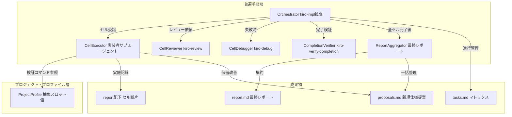
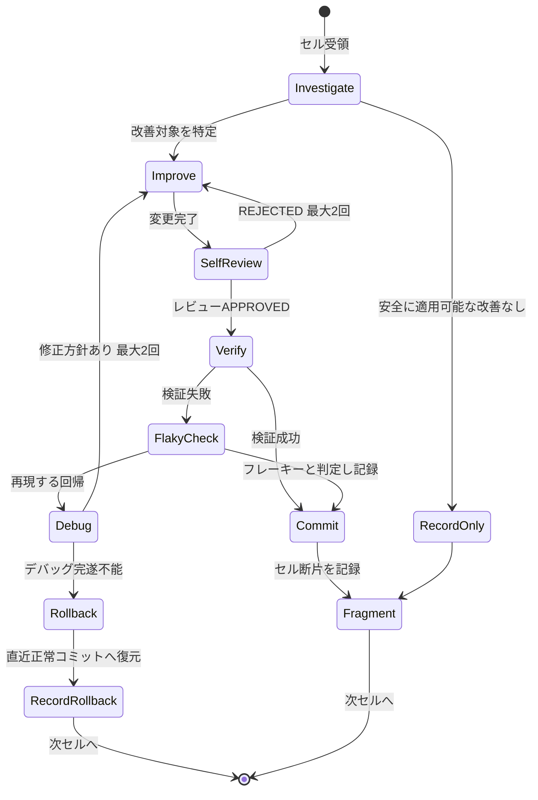
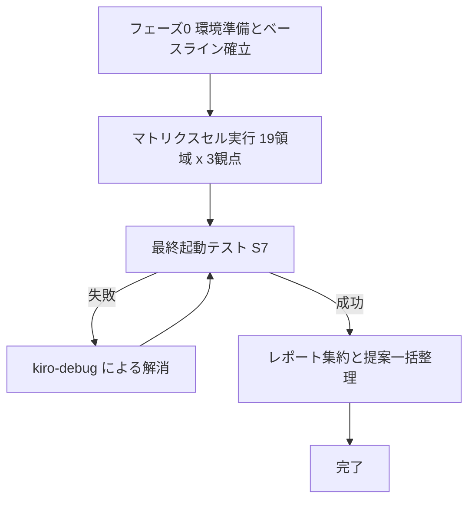

# Design Document: codebase-review-loop

## Overview

**Purpose**: 本機能は、リポジトリ全域の品質（テスト網羅性・コードのシンプルさ・脆弱性耐性）を「挙動を変えずに」系統的に改善する、完走保証付きのコードベースレビュー・ループを開発者に提供する。

**Users**: 開発者は1回の実装指示（`/kiro-impl codebase-review-loop`）でリポジトリ全域のレビュー改善を完走させる。別プロジェクトの開発者は本設計の普遍手順をコピーし、プロジェクト・プロファイルの差し替えのみで同等のループを実行する。

**Impact**: `crates/` 配下の自作クレートと横断的プロジェクト設定に対し、挙動非破壊の改善（テスト追加・構造的簡素化・脆弱性対策）を多数の小さなコミットとして積み上げる。機能仕様・外部観測可能な挙動・`vendors/` 配下は変更しない。

本設計は**2層構造**で記述される:

1. **普遍手順層（Universal Procedure）** — 言語・ビルドシステム非依存のレビュー・ループ定義。抽象スロットを参照する形で記述される。
2. **プロジェクト・プロファイル層（Project Profile）** — 抽象スロットへの具体値の差し込み。本リポジトリでは Rust/cargo 向けの値を定義する。

### Goals
- リポジトリ全域を「レビュー領域 × レビュー観点」マトリクスへ漏れなく分解し、各セルをサブエージェントで完遂する
- 各改善サイクルを自己レビュー＋検証コマンドで挙動非破壊確認したうえでコミットし、回復不能な失敗は巻き戻して次へ進む（途中放棄ゼロ）
- 全作業完了後に改善内容レポートと新規仕様提案の一括整理を生成する
- 普遍手順とプロファイルの分離により、別プロジェクトへのコピー移植を設定差し替えのみで可能にする

### Non-Goals
- 新機能の追加、意図的な挙動変更、大規模アーキテクチャ再設計（R5.3）
- 挙動を変える脆弱性修正の実装（提案記録に留める。R2.4）
- `vendors/pasta` および外部依存コードのレビュー・変更（R1.5）
- CI パイプラインの新設（欠落事実はレポートに記録し、必要なら新規仕様提案とする）
- テストカバレッジ計測ツールの導入（静的なモジュール×テスト対応分析で代替。research.md 参照）

## Boundary Commitments

### This Spec Owns
- レビュー・ループの普遍手順定義（マトリクス分解規則・セル実行プロトコル・サイクル安全機構・レポート様式）
- プロジェクト・プロファイル（Rust/cargo 向け抽象スロット値）
- `crates/areka`, `crates/dola`, `crates/wintf` 全域および横断設定（ルート `Cargo.toml`, `.gitignore`, `.gitmodules`, `.vscode/`）への**挙動非破壊の改善コミット**
- 改善内容レポート（`report.md`）、セル実行記録（`report/` 配下）、新規仕様提案候補（`report/proposals.md`）

### Out of Boundary
- `vendors/` 配下および外部依存クレートの変更（R1.5）
- 既存機能spec（`areka-P0-*`, `wintf-P0-*` 等）の文書変更（R5.4）
- 外部観測可能な挙動の変更を伴うあらゆる修正 — 発見しても実装せず提案記録に回す（R2.4, R5.2）
- レビュー・ループ自体の自動化基盤（CI 化、スケジューラ統合）— 将来の別仕様

### Allowed Dependencies
- 既存スキル: `kiro-impl`（実行基盤）, `kiro-review`（自己レビュー）, `kiro-debug`（デバッグ）, `kiro-verify-completion`（完了検証）, `karpathy-guidelines`（シンプル化基準）
- git（コミット・巻き戻し）、プロファイルが定義する検証コマンド（cargo build / test / clippy）
- steering 文書（`structure.md` の責務マップを領域分解の参考情報として使用）

### Revalidation Triggers
- 検証コマンド（プロファイル S2）の変更 — 全セルの非破壊確認の意味が変わる
- レビュー領域の追加・分割変更 — マトリクス網羅性記録（tasks.md）の再生成が必要
- kiro-impl のタスク実行プロトコル変更 — セル実行プロトコルとの整合再確認が必要
- クレートの公開ポリシー変更（`publish = false` 解除）— R2.9 の非推奨コード削除前提が崩れる

## Architecture

### Existing Architecture Analysis
本仕様はコードアーキテクチャではなく**実行プロセスの設計**である。既存の実行基盤 `kiro-impl` は以下を提供済みであり、本設計はこれを最大限再利用する:

| kiro-impl の既存能力 | 対応要件 |
|---------------------|---------|
| タスク毎のサブエージェント実装者ディスパッチ | 3.1, 3.3 |
| kiro-review による独立レビュー（APPROVED/REJECTED） | 4.1 |
| kiro-debug エスカレーション（最大2ラウンド） | 4.2（前段） |
| kiro-verify-completion による完了ゲート | 4.4 |
| タスク毎の選択的 git コミット | 4.1 |
| 失敗タスクをブロック記録して次タスクへ継続 | 4.5 |

**kiro-impl に存在しない差分（本設計で追加定義）**:
1. **巻き戻しプロトコル** — kiro-impl はデバッグ失敗時にワークツリーを保存したままブロックするが、本ループは直近正常コミットへの巻き戻しを要求する（R4.2）
2. **フレーキー判定付き検証** — 検証失敗を即回帰と断定せず、隔離再実行で判別する（research.md ベースライン所見）
3. **レポート断片の集約** — セルごとの実施記録を蓄積し最終レポートへ集約する（R6）
4. **観点順序の強制** — テスト → シンプル化 → 脆弱性の列順実行（R2.7）

### Architecture Pattern & Boundary Map

選択パターン: **オーケストレーター・ワーカー型**（kiro-impl 拡張）。メインエージェントはタスク割当・結果集約・進行管理のみを担い（R3.2）、セル実行・レビュー・デバッグはすべてサブエージェントに委譲する。



**Architecture Integration**:
- 選択パターン: オーケストレーター・ワーカー（kiro-impl の実行モデルを継承し、安全機構を上乗せ）
- ドメイン境界: 普遍手順層はプロファイル層の**スロット名のみ**を参照し、具体値（cargo 等）を直接記述しない（R7.4）
- 既存パターン保持: kiro-impl のタスク形式（`_Requirements:_`/`_Boundary:_`/`_Depends:_` 注釈、X.Y 番号、`(P)` マーカー）をそのまま使用
- 新規コンポーネントの根拠: 巻き戻し・フレーキー判定・レポート集約は kiro-impl 非対応のため本設計で定義
- Steering 準拠: テスト命名規約（structure.md）、tracing 規約（logging.md）、コミット規約（workflow.md）に従う

### 依存方向

```
ProjectProfile → 普遍手順（セル実行プロトコル） → kiro-impl 実行基盤 → git / 検証コマンド
```

普遍手順はプロファイルのスロットを参照する（逆方向は禁止）。セル実行プロトコルは kiro-impl の規約に適合する形で表現され、kiro-impl 本体の変更は行わない。

## プロジェクト・プロファイル（抽象スロット定義と本リポジトリ向けの値）

普遍手順が参照する抽象スロットを定義する（R7.1, R7.2）。別プロジェクトへコピーする際は本節の「本リポジトリの値」列のみを差し替える（R7.3）。

| スロット | 意味（普遍定義） | 本リポジトリの値（Rust/cargo） |
|---------|----------------|------------------------------|
| S1: レビュー単位 | 領域分解の最小粒度となるビルド単位 | cargo ワークスペースのメンバークレート |
| S2: 検証コマンド | 挙動非破壊確認に用いるビルド・テストコマンド列 | `cargo build --workspace` → `cargo test --workspace` |
| S3: 静的解析コマンド | 任意の補助 lint（失敗をブロッカーとしない） | `cargo clippy --workspace`（警告は記録のみ） |
| S4: 粒度上限 | 1領域あたりのプロダクションコード行数上限 | 約2,600行（超過時はモジュール境界で分割） |
| S5: 除外領域 | レビュー対象から除外するパス | `vendors/` 配下、`target/`、外部依存 |
| S6: シンプル化基準 | 簡素化判定に用いるガイドライン | `karpathy-guidelines` スキル |
| S7: 起動テスト | 最終的な挙動非破壊検証となるアプリ起動手順 | `RUST_LOG=info` で `cargo run -p areka` を起動し、タイムアウト（既定60秒）内に初期化完了を示すログを確認後、プロセスを終了する。パニック・error レベルログ・異常終了コードがなければ合格。初期化完了ログの具体文字列はフェーズ0で確認し tasks.md に記録する |
| S8: 環境準備ゲート | 全セル実行前に満たすべき環境条件 | `git submodule update --init --recursive` 完了、S2 がグリーン |
| S9: テスト配置規約 | 追加テストの命名・配置規則 | steering `structure.md` のテスト命名規約 |
| S10: コミット規約 | サイクルコミットのメッセージ形式 | `{type}({area-id}): {summary}` + `Task: {cell-id} in Spec: codebase-review-loop`（workflow.md 準拠） |

## レビューマトリクス定義

### レビュー領域（行）— 19領域

ギャップ分析（research.md）の実測 LOC とモジュール境界に基づく最終分解。各領域はプロダクションコード約2,600行以下（S4）であり、サブエージェント単独で完遂可能な粒度である（R1.2, R1.3, R3.3）。

| ID | 領域名 | 対象パス | 約LOC | リスク特性 |
|----|--------|---------|-------|-----------|
| A1 | areka エントリポイント | `crates/areka/src/` | 400 | テストゼロ、panic! 1 |
| D1a | dola ランタイム中核 | `crates/dola/src/runtime/{facade,loop_controller}.rs`, `runtime/{timeline_manager,subscription_manager}/`, `playback.rs` | 1,450 | unwrap 多数 |
| D1b | dola 補間・状態 | `crates/dola/src/runtime/{conflict_resolver,document_store,types,clock,instance_state}.rs`, `runtime/{interpolator,instance_manager}/`, `{storyboard,transition,easing,value,variable}.rs` | 1,830 | unwrap 多数 |
| D2 | dola コンパイル・DSL | `crates/dola/src/compile/`, `{builder,error}.rs` | 1,260 | in-sourceテストなし |
| D3 | dola 検証・Cue | `crates/dola/src/validate/`, `cue/`, `{document,lib}.rs` | 1,360 | validate/ 未テスト |
| W1 | wintf レガシー・プロセス | `crates/wintf/src/{win_message_handler,win_thread_mgr,winproc,win_state,win_style,process_singleton,api}.rs` | 2,480 | 非推奨 1,838 LOC 含む（R2.9 適用域） |
| W2 | wintf COM層 | `crates/wintf/src/com/` | 2,360 | unsafe 最密集（R5.5 適用域） |
| W3a | wintf コンポジタ・描画 | `crates/wintf/src/ecs/graphics/` のうち compositor 系・render/surface/init/clip_sync systems・components | 2,090 | unsafe 多数（R5.5 適用域） |
| W3b | wintf グラフィックス資源 | `crates/wintf/src/ecs/graphics/` のうち visual/visual_manager/clip/core/dcomp_resource/command_list・残り systems | 2,010 | unsafe 多数（R5.5 適用域） |
| W4a | wintf taffy・配置 | `crates/wintf/src/ecs/layout/` のうち taffy/arrangement/box_style/dimension 系 | 1,290 | unwrap あり |
| W4b | wintf ヒットテスト・計測 | `crates/wintf/src/ecs/layout/` のうち hit_test/hit_region/metrics/rect/monitor・window_pos systems | 1,970 | テスト比較的厚い |
| W5a | wintf テキスト描画 | `crates/wintf/src/ecs/widget/text/` | 1,370 | unsafe あり（R5.5 適用域） |
| W5b | wintf 図形・画像・ブラシ | `crates/wintf/src/ecs/widget/{shapes,bitmap_source}/`, `brushes.rs` | 1,680 | unsafe あり（R5.5 適用域） |
| W6a | wintf ポインター入力 | `crates/wintf/src/ecs/pointer/` | 1,830 | テスト薄め |
| W6b | wintf ドラッグ | `crates/wintf/src/ecs/drag/` | 1,410 | テスト薄め |
| W7a | wintf ウィンドウ・メッセージ | `crates/wintf/src/ecs/window/`, `ecs/window_proc/` | 2,630 | window/ 未テスト、unsafe あり |
| W7b | wintf ECS基盤・World | `crates/wintf/src/ecs/{common,world}/`, `ecs/app.rs` | 2,700 | world/ 未テスト |
| W8 | wintf Cue・Dola統合 | `crates/wintf/src/ecs/{cue,dola}/` | 1,520 | in-sourceテストゼロ、フレーキーテスト所在域 |
| X1 | 横断プロジェクト設定 | ルート `Cargo.toml`, 各クレート `Cargo.toml`, `.gitignore`, `.gitmodules`, `.vscode/` | n/a | submodule ゲート、古い launch.json |

`vendors/` 配下は S5 によりいずれの領域にも含まれない（R1.5）。マトリクスの網羅性は tasks.md 生成時に「全領域 × 全観点 = 全セルがタスク化されていること」を本表と突き合わせて確認・記録する（R1.6）。

### レビュー観点（列）— 3観点 + セル内ゲート

| 列 | 観点 | 実行順 | 内容 |
|----|------|--------|------|
| T | テスト網羅性 | 1番目 | テスト空白の調査、不足テストの追加、不要テストの根拠記録付き慎重除外（R2.1） |
| S | シンプル化 | 2番目 | S6 基準への準拠検証と簡素化。テスト保護外の unsafe/COM/GUI は構造的整理に限定（R2.2, R5.5）。非推奨コードは利用ゼロ実証で削除（R2.9, R2.10） |
| V | 脆弱性 | 3番目 | 脆弱性レビューと挙動非破壊の対策投入。挙動変更を要するものは提案記録（R2.3, R2.4） |

観点の列順は**領域内で固定**（T → S → V。R2.7）。テスト整備（回帰検知器）を変更作業に先行させるためである。改善前後の検証（R2.5）と自己レビュー（R4.1）は独立した列ではなく**全セル共通のセル内ゲート**として実行する。

**拡張観点の判断（R2.6）**: 追加の観点列は採用しない。静的解析（clippy）は S3 として検証ステップに統合し、依存監査（cargo-audit 相当）は X1 領域の V 観点に内包する。列を増やすより既存セルに織り込む方が、タスク数の爆発を防ぎ完走保証（R4.5）に資する。

### タスク構造への写像

- 各**領域** = tasks.md の major task（例: `3. W1: wintf レガシー・プロセス`）
- 各**セル**（領域×観点） = sub-task（例: `3.1 W1-T テスト網羅性`, `3.2 W1-S シンプル化`, `3.3 W1-V 脆弱性`）
- **全セルを厳密直列で実行する**（`(P)` マーカーは一切付けない）。全セルが同一ワークツリーを共有するため、並列実行は (a) セル検証への他セル未コミット変更の混入（検証独立性の崩壊）、(b) 巻き戻しによる他セル作業の破壊を引き起こす。本仕様の至上命題は完走保証と挙動非破壊の証明であり、実行速度ではない
- 各セルに `_Requirements:_`（対応要件ID）と `_Boundary:_`（領域の対象パス）を付与する
- **T セルの事前分割**: テスト空白の大領域（in-source テストがゼロまたは僅少、かつプロダクション約1,500行超。本マトリクスでは W7a / W7b / W8 が該当候補）の T セルは、tasks.md 生成時にファイル部分集合で2〜3個のサブセル（例: `17.1a`, `17.1b`）へ**事前分割**する。ゼロからのテスト構築は対象 LOC に比して作業量が大きいためである
- マトリクスの前後に**フェーズタスク**を置く: 環境準備・ベースライン確立（最初）、最終起動テスト・レポート集約（最後）

## System Flows

### セル実行ライフサイクル



**フロー上の決定事項**:
- **フレーキー判定**: 検証失敗時、失敗したテストスイートを**隔離して最大2回再実行**する。フレーキーとして通過できるのは「隔離実行で安定して合格し、失敗が再現せず、**かつ失敗テストが当該セルの変更領域（`_Boundary:_` パス）外**である」場合のみ。変更領域内の失敗は再現性によらず回帰として扱い kiro-debug へ渡す（自セルが引き起こした間欠的退行の素通りを防ぐ）
- **巻き戻し**: kiro-debug が `BLOCK_TASK` または2ラウンド失敗を返した時点で、オーケストレーターが `git restore --staged . && git restore . && git clean -fd {対象領域パス}` により直近正常コミットの状態へ復元する（R4.2）。復元の事実・セルID・理由をセル断片に記録し（R4.3）、次のセルへ進む（R4.5）
- **未検証変更のコミット禁止**: Commit 状態へは Verify 成功からのみ遷移できる（R4.4）

### 全体フロー



フェーズ0は S8（submodule 初期化確認）と S2 グリーン確認を行い、ベースラインコミットを確定する。あわせて S2 を複数回実行して**既知フレーキースイートの一覧**を記録し（フレーキー判定の参照情報とする）、S7 の初期化完了ログ文字列を確認して tasks.md に記録する。最終起動テストの失敗はデバッグで解消するまで完了としない（R4.6, R4.7）。

## Requirements Traceability

| Requirement | 概要 | 実現する設計要素 |
|-------------|------|----------------|
| 1.1 | マトリクス分解とタスク定義 | レビューマトリクス定義、タスク構造への写像 |
| 1.2 | 最小粒度=レビュー単位 | スロット S1、領域表（クレート単位を起点に分解） |
| 1.3 | 大領域の細分化 | スロット S4（約2,600行上限）、19領域への分割実績、T セル事前分割、NEEDS_SPLIT 実行時分割 |
| 1.4 | 横断設定の独立領域化 | 領域 X1 |
| 1.5 | 外部コード除外 | スロット S5、領域表の除外注記 |
| 1.6 | 網羅性の記録 | tasks.md 生成時のマトリクス突き合わせ記録 |
| 2.1 | テスト網羅性観点 | 観点列 T、セル実行プロトコル |
| 2.2 | シンプル化観点 | 観点列 S、スロット S6 |
| 2.3 | 脆弱性観点 | 観点列 V |
| 2.4 | 挙動変更を伴う対策の保留 | 提案記録様式（proposals.md） |
| 2.5 | 前後の検証 | セル内ゲート（Verify ステップ、S2） |
| 2.6 | 拡張観点 | 「拡張観点の判断」節（不採用の根拠を明記） |
| 2.7 | 観点の順序固定 | T → S → V のサブタスク順序、`(P)` 不付与 |
| 2.8 | 深掘り解析と未適用分の記録 | セル実行プロトコルの解析規則、proposals.md |
| 2.9 | 非推奨コードの実証付き削除 | W1 領域 S 観点の削除手順（利用ゼロ実証） |
| 2.10 | 実証不能時の提案記録 | proposals.md への削除候補記録 |
| 3.1 | セル単位の委譲 | Orchestrator → CellExecutor ディスパッチ |
| 3.2 | オーケストレーション専任 | Orchestrator のコンテキスト規律 |
| 3.3 | 単独完遂可能な粒度 | スロット S4、セルブリーフ様式、T セル事前分割 + NEEDS_SPLIT フォールバック |
| 4.1 | 自己レビュー+検証+コミット | セル実行ライフサイクル（SelfReview → Verify → Commit） |
| 4.2 | 巻き戻し | 巻き戻しプロトコル（Rollback 状態） |
| 4.3 | 巻き戻しの記録 | セル断片様式（rollback フィールド） |
| 4.4 | 未検証変更のコミット禁止 | 状態遷移制約（Verify 成功のみ Commit へ） |
| 4.5 | 完走保証 | 巻き戻し後の次セル継続、kiro-impl の continue-on-block |
| 4.6 | 最終起動テスト | 全体フロー Launch、スロット S7 |
| 4.7 | 起動失敗のデバッグ解消 | DebugLaunch ループ |
| 5.1 | 挙動非破壊 | セル実行プロトコルの変更制約 |
| 5.2 | 挙動変更の提案記録 | proposals.md 様式 |
| 5.3 | 新機能・再設計の禁止 | Non-Goals、セル実行プロトコルの変更制約 |
| 5.4 | 機能spec文書の不変更 | セル実行プロトコルの変更制約（`.kiro/specs/` 配下変更禁止） |
| 5.5 | unsafe/COM/GUI の保守則 | 観点列 S の限定規則、領域表のリスク特性列 |
| 6.1 | レポート生成 | ReportAggregator、全体フロー Aggregate |
| 6.2 | セル別実施結果 | セル断片様式 → report.md 集約 |
| 6.3 | 巻き戻し記録の包含 | セル断片の rollback フィールド集約 |
| 6.4 | 提案の一括整理 | proposals.md → report.md 提案セクション |
| 7.1 | 抽象スロット定義 | プロジェクト・プロファイル節（S1〜S10） |
| 7.2 | 普遍手順と固有設定の分離 | 2層構造（本文書の層分け） |
| 7.3 | 設定差し替えのみで移植 | プロファイル表の差し替え手順、移植性の節 |
| 7.4 | 普遍記述の言語非依存性 | 普遍手順層の記述規律（スロット名のみ参照） |

## Components and Interfaces

| Component | 層 | Intent | Req Coverage | 主要依存 | Contracts |
|-----------|----|--------|--------------|---------|-----------|
| Orchestrator | 普遍手順 | セル割当・進行管理・巻き戻し執行・集約指示 | 3.1, 3.2, 4.2, 4.5 | kiro-impl (P0), git (P0) | State |
| CellExecutor | 普遍手順 | 1セルの調査・改善・記録を単独完遂 | 2.1–2.5, 2.8–2.10, 5.1–5.5 | ProjectProfile (P0), karpathy-guidelines (P1) | Service |
| CellReviewer | 既存スキル | 変更の挙動非破壊と境界遵守を敵対的に検証 | 4.1 | kiro-review (P0) | Service |
| CellDebugger | 既存スキル | 検証失敗の根本原因究明と次アクション判定 | 4.2, 4.7 | kiro-debug (P0) | Service |
| CompletionVerifier | 既存スキル | コミット前の新鮮な証拠による完了検証 | 4.4 | kiro-verify-completion (P0) | Service |
| ReportAggregator | 普遍手順 | セル断片の集約とレポート・提案の一括生成 | 6.1–6.4 | report/ 断片 (P0) | Batch |
| ProjectProfile | プロファイル | 抽象スロット値の提供 | 1.2, 1.5, 7.1–7.4 | なし | State |

### 普遍手順層

#### Orchestrator

| Field | Detail |
|-------|--------|
| Intent | kiro-impl の自律モードを基盤に、セル割当・巻き戻し・断片集約指示を行う進行管理者 |
| Requirements | 3.1, 3.2, 4.2, 4.3, 4.5 |

**Responsibilities & Constraints**
- tasks.md のセルを厳密直列で CellExecutor へ委譲する。自身はセルの作業詳細をコンテキストへ展開しない（R3.2）
- kiro-debug が完遂不能を返したセルについて巻き戻しを執行し、記録して次セルへ進む
- **実行時分割（NEEDS_SPLIT）の処理**: CellExecutor が NEEDS_SPLIT を返した場合、split_proposal に基づきセルをサブセルへ分割して tasks.md を更新し、直列キューに挿入して再委譲する。分割は**1セルにつき1回まで**（サブセルの再分割は不可）。それでも完遂不能な場合は部分完遂を受け入れ、未達範囲をセル断片に記録して次へ進む（無限分割による完走阻害を防ぐ）
- 全セル終了後、最終起動テスト（S7）とレポート集約タスクを実行する

**Dependencies**
- Outbound: kiro-impl 実行基盤 — タスクディスパッチ・レビュー・コミットの既定フロー（P0）
- Outbound: git — コミット・巻き戻し操作（P0）

**Contracts**: State [x]

##### State Management
- 状態モデル: tasks.md のチェックボックスが唯一の進行状態。セル断片ファイルの存在が実施記録
- 永続化: 各セル完了時にコミット（タスク進捗とコード変更を同一コミットに含める）
- 並行性: **厳密直列実行**（同時にディスパッチされるセルは常に1つ）。ワークツリーは各セル開始時点で必ずクリーンであり、検証結果と巻き戻しは常に当該セルのみに帰属する

**Implementation Notes**
- Integration: kiro-impl の `_Blocked:_` 注釈プロトコルを巻き戻し記録と併用する
- Validation: 巻き戻し後は S2 を再実行し、ベースライン状態へ復帰したことを確認してから次セルへ進む
- Risks: 直列実行のため wall-clock 時間は増えるが、cargo のワークスペース単位ビルドロックにより並列化の利得はもともと限定的であり、検証独立性・巻き戻し安全性を優先する

#### CellExecutor（セル実行プロトコル）

| Field | Detail |
|-------|--------|
| Intent | 1セル（領域×観点）の調査・改善・自己レビュー準備・記録を単独で完遂するサブエージェント |
| Requirements | 2.1, 2.2, 2.3, 2.4, 2.5, 2.8, 2.9, 2.10, 5.1, 5.2, 5.3, 5.4, 5.5 |

**Responsibilities & Constraints**
- 受領したセルブリーフ（領域パス・観点・制約）の範囲内でのみ作業する。`_Boundary:_` 外のファイル変更は禁止
- **変更制約（全観点共通）**: 外部観測可能な挙動を変更しない（R5.1）。新機能追加・意図的挙動変更・大規模再設計を行わない（R5.3）。`.kiro/specs/` 配下の機能spec文書を変更しない（R5.4）。`vendors/` 配下を変更しない
- **解析規則**: テストで保護されない領域でも解析は深く実施し、安全に適用できない改善点は提案として記録する（R2.8）
- **観点別規則**:
  - T: 既存テストとモジュールの対応を調査し、空白に対しテストを追加（S9 準拠）。不要テストは根拠を記録したうえで慎重に除外（R2.1）
  - S: S6 基準で簡素化。テスト保護外の unsafe/COM/GUI はロジック変更を伴わない構造的整理（命名・コメント・自明な重複除去）に限定（R5.5）。非推奨コードはワークスペース内利用ゼロを実証（grep + ビルド確認）できた場合のみ削除（R2.9）、できなければ提案記録（R2.10）
  - V: 入力検証・整数オーバーフロー・unsafe 境界・リソースリーク等を点検し、挙動を変えない対策のみ投入。挙動変更を要する対策は proposals.md へ（R2.4）
- 改善前に S2 を実行して事前状態を確認し、改善後に再実行して非破壊を確認する（R2.5）

**Dependencies**
- Inbound: Orchestrator — セルブリーフの受領（P0）
- Outbound: ProjectProfile — S2/S3/S6/S9 の参照（P0）
- External: karpathy-guidelines スキル — S 観点の判定基準（P1）

**Contracts**: Service [x]

##### Service Interface
```
入力: セルブリーフ
  - cell_id:        "{領域ID}-{観点}"  例: "W1-S"
  - area_paths:     領域の対象パス一覧（design.md 領域表より）
  - aspect:         T | S | V
  - constraints:    変更制約（上記）+ 領域のリスク特性
  - verify:         S2 コマンド列
出力: ステータスレポート
  - status:         READY_FOR_REVIEW | BLOCKED | NEEDS_CONTEXT | NEEDS_SPLIT
  - split_proposal: status=NEEDS_SPLIT の場合必須。単独完遂可能なファイル部分集合への分割案
  - changes:        変更ファイル一覧と変更種別
  - findings:       調査所見（追加/除外テスト、簡素化内容、脆弱性所見）
  - proposals:      保留改善の提案候補（0件以上）
  - verification:   改善前後の S2 実行結果
```
- Preconditions: ワークツリーがクリーン（直近コミットと一致）
- Postconditions: status=READY_FOR_REVIEW の場合、S2 が成功している
- Invariants: `_Boundary:_` 外・`vendors/`・`.kiro/specs/` の機能spec文書に変更がない

**Implementation Notes**
- Integration: kiro-impl の implementer-prompt テンプレートにセルブリーフを注入する形で実装
- Validation: CellReviewer が git diff を一次情報として境界遵守・挙動非破壊を検証
- Risks: 観点 T でのテスト「除外」は誤判定リスクが高い。緩和: 除外は重複・死テスト・仕様変更で無意味化したものに限定し、根拠をセル断片に必須記録

#### ReportAggregator

| Field | Detail |
|-------|--------|
| Intent | 全セル断片と proposals.md を集約し、最終レポートと新規仕様提案の一括整理を生成する |
| Requirements | 6.1, 6.2, 6.3, 6.4 |

**Responsibilities & Constraints**
- `report/cells/` 配下の全断片を領域×観点の表形式に集約する
- 巻き戻し記録・フレーキー記録・挙動変更例外を専用セクションに抽出する
- proposals.md の提案候補を重複統合し、新規仕様の提案として優先度付きで整理する（R6.4）

**Contracts**: Batch [x]

##### Batch / Job Contract
- Trigger: 全マトリクスセルの処理完了 + 最終起動テスト成功後（R6.1）
- Input / validation: `report/cells/*.md`（全セル分の存在を tasks.md と突き合わせ検証）, `report/proposals.md`
- Output / destination: `.kiro/specs/codebase-review-loop/report.md`
- Idempotency & recovery: 再実行時は report.md を全置換（断片が真実源）

### プロファイル層

#### ProjectProfile

| Field | Detail |
|-------|--------|
| Intent | 普遍手順が参照する抽象スロット S1〜S10 の具体値を一元提供する |
| Requirements | 1.2, 1.5, 7.1, 7.2, 7.3, 7.4 |

**Responsibilities & Constraints**
- 本 design.md の「プロジェクト・プロファイル」節が唯一の定義箇所。普遍手順層・tasks.md はスロット名で参照する
- 別プロジェクトへの移植時はプロファイル表の値の差し替え + 領域表の再生成（後述の領域発見手順）のみを行う

**Contracts**: State [x]

##### State Management
- 状態モデル: 静的な定義表（実行中に変化しない）
- 変更時: スロット値の変更は Revalidation Trigger（全セルの再検証）となる

### 領域発見手順（普遍・移植時に再実行する）

別プロジェクトでマトリクスの行を再生成する手順（R7.3）。本リポジトリの領域表はこの手順の実行結果である:

1. ビルドマニフェストから S1（レビュー単位）を列挙する
2. 各単位のプロダクションコード行数を計測する（テストファイル除外）
3. S4 超過の単位を、モジュール境界に沿って S4 以下の領域へ分割する（ファイルをまたぐ分割は禁止。結合の強いモジュールは同一領域に保つ）
4. 横断的プロジェクト設定（ビルド設定・CI・エディタ設定）を独立領域として追加する（R1.4）
5. S5 の除外領域を適用する（R1.5）
6. 「全領域 × 全観点」の表を tasks.md に記録し、網羅性を確認する（R1.6）

## File Structure Plan

本仕様はプロセス仕様であり、成果物は (a) 仕様文書群、(b) レビュー実施記録、(c) `crates/` 配下への改善コミットである。

### 新規作成ファイル

```
.kiro/specs/codebase-review-loop/
├── design.md                  # 本文書（普遍手順 + プロファイル）
├── tasks.md                   # マトリクスのタスク化（kiro-spec-tasks が生成）
├── report/
│   ├── cells/
│   │   └── {cell-id}.md       # セル断片（例: W1-S.md）— 実施結果・所見・巻き戻し記録
│   └── proposals.md           # 新規仕様提案候補の蓄積（全セルが追記）
└── report.md                  # 最終改善内容レポート（ReportAggregator が生成）
```

#### セル断片様式（`report/cells/{cell-id}.md`）
```
# {cell-id}: {領域名} × {観点名}
- status: completed | rolled-back | no-change
- commit: {ハッシュ}（rolled-back/no-change の場合は省略）

注: コード変更のないセル（no-change / rolled-back）でも断片ファイル自体は必ず作成し、docs コミット（S10 準拠）として記録する。これにより R6.2 の全セル分の実施記録が保証される。
- findings: 実施内容（追加/除外テスト、簡素化内容、脆弱性所見と対応）
- flaky: フレーキー判定の記録（該当時のみ）
- rollback: 巻き戻しの理由と直前状態（該当時のみ）
- proposals: proposals.md へ記録した提案の参照（該当時のみ）
```

#### 提案記録様式（`report/proposals.md` の1エントリ）
```
## P{連番}: {提案タイトル}
- source: {cell-id}
- kind: 挙動変更を伴う脆弱性対策 | ロジック変更を要する簡素化 | 非推奨コード削除候補 | その他
- rationale: 本ループで実施しなかった根拠（挙動変更の内容）
- suggestion: 新規仕様としての推奨スコープ
```

### コンポーネントと成果物の対応

プロセス仕様のため、各コンポーネントは独立したソースファイルではなく以下の文書・テンプレートとして実体化する:

| Component | 実体 |
|-----------|------|
| Orchestrator | kiro-impl 実行基盤 + tasks.md の進行管理規則（本文書「タスク構造への写像」節） |
| CellExecutor | tasks.md 各セルの詳細記述 + kiro-impl implementer プロンプトへ注入されるセルブリーフ |
| CellReviewer / CellDebugger / CompletionVerifier | 既存スキル（`.claude/skills/kiro-{review,debug,verify-completion}/SKILL.md`）をそのまま使用 |
| ReportAggregator | tasks.md 最終フェーズタスクの実行手順 + `report.md` 出力 |
| ProjectProfile | 本文書「プロジェクト・プロファイル」節（唯一の定義箇所） |

### 変更されるファイル（パターン記述）

- `crates/{areka,dola,wintf}/src/**` — 各セルの改善（テスト追加・構造的簡素化・非破壊の脆弱性対策）。1セル=1コミット
- `crates/wintf/tests/**`, `crates/dola/tests/**` — T 観点のテスト追加・除外（S9 準拠）
- ルート `Cargo.toml`, `.gitignore`, `.vscode/**` — X1 領域の改善（古い launch.json 修正等）
- `.kiro/specs/codebase-review-loop/tasks.md` — セル完了ごとのチェックボックス更新

## Error Handling

### Error Strategy
セル実行の失敗は「セル局所の失敗」として封じ込め、ループ全体を停止させない（R4.5）。回復順序は kiro-impl の既定（レビュー差し戻し最大2回 → デバッグ最大2回）を継承し、その先に本設計固有の**巻き戻し**を追加する。

### Error Categories and Responses
| カテゴリ | 検知 | 応答 |
|---------|------|------|
| 検証失敗（真の回帰） | S2 失敗 + 隔離再実行で再現 | kiro-debug → 修正 or 巻き戻し |
| 検証失敗（フレーキー） | S2 失敗 + 隔離再実行2回で合格・非再現 | フレーキーとして記録し通過。安定化は当該テスト所在領域の T 観点の改善対象 |
| デバッグ完遂不能 | kiro-debug が BLOCK_TASK / 2ラウンド失敗 | 巻き戻し（git restore + clean）→ 記録 → 次セル |
| 環境前提の欠落 | フェーズ0で S8 不成立 | submodule 初期化を実行。なお不成立なら全体を停止（唯一の全体停止条件） |
| 最終起動テスト失敗 | S7 不合格 | kiro-debug で解消するまで完了としない（R4.7）。直近のセル群のコミットを bisect 的に疑う |
| セル断片の欠落 | 集約時に tasks.md と断片の不一致 | 欠落セルを no-change として補完記録し、レポートに明記 |

### Monitoring
- 各セルのコミットメッセージに cell_id を含め、git log からマトリクス進行を追跡可能にする（S10）
- フレーキー判定・巻き戻しはセル断片に構造化記録し、最終レポートで全件可視化する

## Testing Strategy

本仕様の「テスト」は2重である: (a) ループが**生成する**テスト（T 観点の成果物）、(b) ループ自体の**正しさを確認する**検証。後者を記述する。

### ループ自体の検証項目
- **フェーズ0ベースライン**: S8 成立確認後、S2 全量実行がグリーンであることを確認しベースラインコミットを記録する（以降の全セルの比較基準）
- **セル単位検証**: 各セルで改善前後に S2 を実行し、事後が事前と同等以上（新規テスト追加分の増加のみ許容、既存テストの失敗ゼロ）であることを確認する（2.5, 4.1, 4.4 由来）
- **境界検証**: CellReviewer が git diff から `_Boundary:_` 外変更・`vendors/` 変更・機能spec文書変更がないことを機械的に確認する（5.4, 1.5 由来）
- **巻き戻し検証**: 巻き戻し実行後に S2 を再実行し、ベースライン相当へ復帰したことを確認する(4.2 由来)
- **最終 E2E**: S7 起動テスト — areka を起動し、初期化完了を確認後に終了。パニック・エラーログなしを合格とする（4.6 由来）。これが GUI/COM 領域の挙動非破壊に対する最終の統合的証拠となる
- **レポート完全性**: 全セル断片が存在し、report.md の領域×観点表に欠落がないことを集約時に検証する（6.2 由来）

## Security Considerations

- V 観点の点検対象（Rust 文脈）: unsafe ブロックの境界条件（ポインタ有効性・ライフタイム・Send/Sync 妥当性）、整数変換の切り捨て・オーバーフロー、Win32/COM ハンドルのリーク・二重解放、外部入力（ファイルパス・画像データ）の検証欠如、panic 経路による DoS 可能性
- 対策コードは「挙動を変えない範囲」（内部チェックの追加、debug_assert、安全な型への置換等）に限定する。API シグネチャやエラー応答を変える対策は提案記録へ（R2.4）
- 依存監査（既知脆弱性のあるクレートバージョン検出）は X1 領域の V 観点で `cargo audit` 相当の調査を行い、依存更新は挙動影響を評価のうえ慎重に適用する

## 移植性（R7.3 の手順）

本仕様を別プロジェクトへコピーする手順:

1. `design.md` の普遍手順層（プロファイル節と領域表以外のすべて）をそのまま流用する
2. プロファイル表 S1〜S10 の「本リポジトリの値」列を対象プロジェクトの値に差し替える
3. 「領域発見手順」を対象プロジェクトで実行し、領域表を再生成する
4. tasks.md を再生成（kiro-spec-tasks 相当）し、マトリクスをタスク化する
5. requirements.md の Boundary Context にあるプロジェクト固有の前提（公開ポリシー等）を見直す

普遍手順層には特定言語・特定ビルドシステムへの直接参照が存在しないこと（スロット名参照のみ）が移植可能性の保証である（R7.4）。
