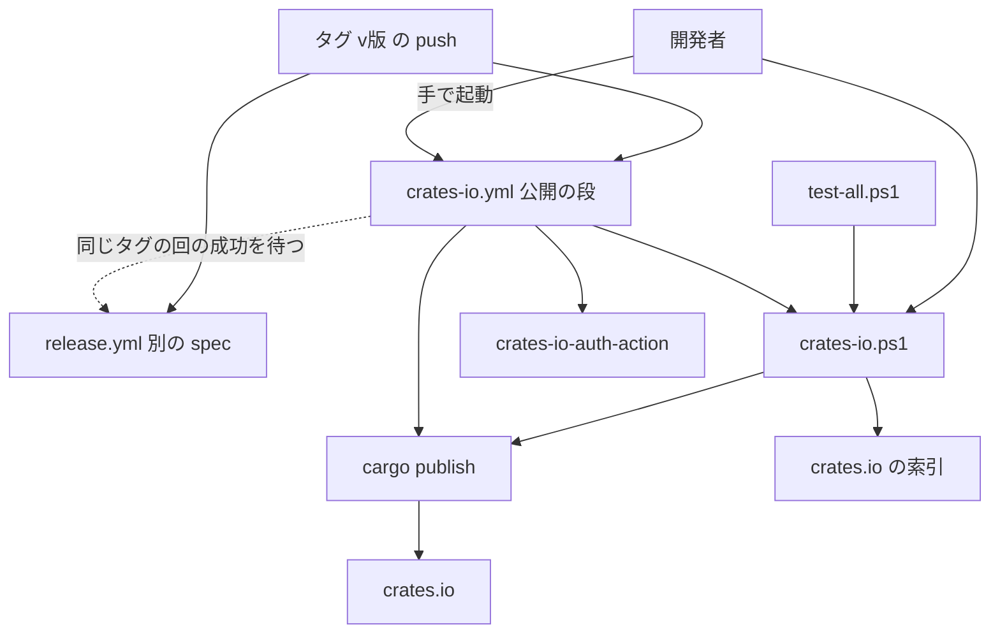
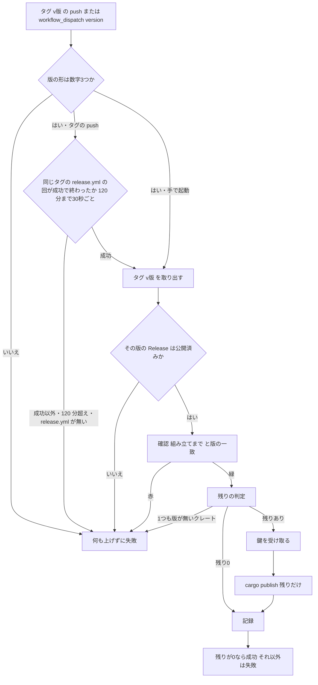

# Design Document: areka-P0-crates-io-publish

## Overview

**Purpose**: リリースのたびに、汎用のライブラリ `wintf`・`dola` を同じ版で crates.io へ出せるようにする。出す・出さないを各クレートの設定に書き分け、何も上げずに確かめる手元の確認、GitHub Actions から出す公開の段、手順書、説明の文書を揃える。

**Users**: 開発者（リリースを打つ人）が、手元の確認と公開の段と手順書を使う。利用者は README で「入れ方は配布の zip・crates.io は入れ方ではない」ことを知る。

**Impact**: `areka` の印が「出す」から「出さない」へ変わる。`tools/` にスクリプトが 1 本、`.github/workflows/` に workflow が 1 本、`doc/` に手順書が 1 本増える。全体テストに段が 1 つ増える（実測で約 7 秒）。

### Goals

- 30 クレートのすべてで、出すか出さないかとその理由が設定ファイルから読める（1.1〜1.7）。
- 1 つの操作で「この版で出せるか」を確かめられ、全体テストが毎回それを見張る（2.1〜2.13）。
- 公開の段が、タグの push（Release の段の成功を待つ）と手での起動のときだけ、Trusted Publishing だけで、上げる前に止まれる形で動く（4.1〜4.13）。
- 止まったときのやり直しと予備の手順が文書で辿れる（3.1〜3.7）。

### Non-Goals

- `areka` 本体と部品を crates.io へ出すこと、部品の名前の確保。
- 版を上げる手順そのもの（`areka-P0-release-cycle`）。本書は「版を上げるときに動かす行」を申し送るだけ。
- `release.yml`（`areka-P0-release-ci-workflow`）の中身。
- 公開の段の乾いた走りの口（後述の決定 6）。ビルドのキャッシュ。docs.rs の見た目。

## Boundary Commitments

### This Spec Owns

- 各クレートの `Cargo.toml` の `publish` の行と理由のコメント、根の `Cargo.toml` の `[workspace.package] publish` の行の撤去、`wintf` → `dola` の版の指定。
- 出さない 3 クレートが持つ `wintf` への版の指定の撤去（決定 2）。
- `tools/crates-io.ps1`（公開前の確認と「まだ出ていないクレート」の判定）。
- `tools/test-all.ps1` の段 1 つ。
- `.github/workflows/crates-io.yml`。
- `doc/crates-io-publish.md`（手順書）。
- `README.md`・`dist/README.txt`・`crates/wintf/README.md`・`crates/dola/README.md`・`.kiro/steering/tech.md` の、本書が定める節。
- 公開の段のきっかけの取り決め: タグ `v{版}` の push（版はタグから `v` を外した値）か、手での起動の入力 `version`（値は `v` を付けない版・例 `0.0.2`）。`release.yml` は公開の段を呼ばない（10-03 完了時の開発者の裁定＝案 B）。

### Out of Boundary

- `.github/workflows/release.yml`、`tools/package.ps1`、`crates/*/src/`、`Cargo.lock`。
- `tech.md` の「外部 CI は持たない」の段落（`release-ci-workflow` が改める）。
- 版の行を書き換える作業と道具（`release-cycle`）。
- crates.io の画面での Trusted Publishing の設定の実行（開発者が手順書に沿って行う）。
- `structure.md` の `tools/` の一覧（完了時の文書同期に任せる）。

### Allowed Dependencies

- cargo 1.90 以上（複数クレートを 1 回で出す `cargo publish -p … -p …`。手元は 1.99.0）。
- PowerShell 7（既存の `tools/*.ps1` と同じ）。新しい道具・クレートは足さない。
- GitHub Actions: `actions/checkout`・`rust-lang/crates-io-auth-action@v1`・ランナーに入っている `gh` と `rustup`。`gh api` で同じリポジトリの `release.yml` の回の一覧を読む（権限 `actions: read`）。
- crates.io の索引（`https://index.crates.io/`）の読み取り。
- 依存の向き: `crates-io.yml` → `tools/crates-io.ps1` → cargo。`test-all.ps1` → `tools/crates-io.ps1`。スクリプトは workflow の環境変数を読まない（手元と同じ動き）。

### Revalidation Triggers

- 公開する一覧が変わる（3 つ目を足す・外す）: スクリプトの一覧、手順書、`tech.md`、crates.io の Trusted Publishing の設定を見直す。
- 入力の名前 `version` か値の形・タグの形（`v{版}`）が変わる: 段「版の形」と手順書を見直す。
- `release.yml` の workflow の名前（`release`）・ファイル名・きっかけ（タグの push）、または「タグの push で始まった回が成功で終わる ⇔ そのタグの Release が公開で在る」の約束が変わる: 段「release を待つ」と手順書を見直す。
- workflow のファイル名が変わる: crates.io の Trusted Publishing の設定をやり直す。
- 版の指定を持つ行が増える・置き場が変わる: `release-cycle` の版上げの手順を見直す。
- 版が 0.1.0 以上になる: 版の指定の意味が「ちょうど」から「互換の範囲」に変わるので、決定 1 を見直す。

## Architecture

### Existing Architecture Analysis

実物のファイルで確かめた今の状態（2026-10-03）。

- 30 クレートすべてが、自分の `Cargo.toml` に `publish = true` か `publish = false` の行を持つ。`true` は `areka`・`dola`・`wintf`、残り 27 が `false`。理由のコメントが同じ行に付いているものは 0。
- 根の `Cargo.toml` の `[workspace.package]` に `publish = false` があるが、受け継ぐクレートが 0 で効いていない。
- `wintf` の通常の依存の `dola` は `dola = { path = "../dola" }`（版の指定なし）。`dola` はワークスペース内に依存を持たない。
- `areka`・`areka-emo-present`・`areka-emo-text` の通常の依存に `wintf = { version = "0.0.1", path = "../wintf" }` がある。`pilot` は `wintf = { path = "../wintf" }`（版の指定なし）で同じクレートを引いている。
- `tools/test-all.ps1` は `Step '名前' { コマンド }` で段を足す形。段が赤でも最後まで回し、終了コードで合否を返す。
- `.github/` は無い。`doc/` に手順書の類は無い。
- `wintf`・`dola` の `README.md` の Status 節は「Version 0.0.1」「published for name reservation purposes」と書いている。

### Architecture Pattern & Boundary Map



- **選んだ形**: 判定はスクリプト 1 本に集め、手元・全体テスト・公開の段が同じ物を呼ぶ。workflow は「順に呼ぶ・待つ・止める・鍵を受け取る」だけを持つ。
- **保った型**: `tools/*.ps1` の書き方（冒頭の較正値・段ごとの印字・終了コード）。依存の順は cargo に任せ、手で並べない。
- **新しい部品の理由**: cargo は「一覧の食い違い」「大きさ」「理由のコメント」「既に在る版を飛ばす」を見ないので、その 4 つだけ自分で判定する。

### Technology Stack

| Layer | Choice / Version | Role in Feature | Notes |
|-------|------------------|-----------------|-------|
| CLI | PowerShell 7・`tools/crates-io.ps1` | 公開前の確認・残りの判定 | 新しい道具なし |
| ビルド | cargo 1.90 以上 | 包む・組み立てる・上げる | `--dry-run`・`--no-verify`・`--locked`・`-p dola -p wintf` |
| CI | GitHub Actions・`windows-latest` | 公開の段 | `wintf` は Windows でしか組み立てられない |
| 認証 | `rust-lang/crates-io-auth-action@v1` | 短命の鍵の受け取り | ジョブの終わりに自動で取り消される |
| 外部 | `https://index.crates.io/{2字}/{2字}/{名前}` | その版が在るかの判定 | 在れば 200（1 行 1 版の JSON）・無ければ 404（実測） |

### 設計の決定

**決定 1: `dola` の版の指定は根の `[workspace.dependencies]` に置く**

- 根に `dola = { version = "0.0.1", path = "crates/dola" }` を足し、`wintf` は `dola = { workspace = true }` で受ける。
- 理由: 0.0.x の版の指定は「その版ちょうど」の意味なので、版を上げるたびにこの行も動かす必要がある。根に置けば、版上げで動く行が根の `Cargo.toml` の 2 行（`[workspace.package]` の `version` と、この行）に閉じる。
- 動かし忘れの見張りは要らない。片方だけ上げると、どの cargo の操作も「`dola = "^0.0.1"` に合う版が無い」で即座に落ちる（実測）。
- `dola` を引くほかのクレート（`areka`・`areka-ghost`・`areka-sakura`・`areka-seriko`・`areka-emo-text`）の `dola = { path = "../dola" }` は触らない（出さないクレートなので版の指定が要らない）。
- 包んだ `wintf` の設定には `dola` が `version = "0.0.1"` だけで入り、`path` は消えることを実測で確かめた。

**決定 2: 出さない 3 クレートの `wintf` の版の指定は外す**

- `areka`・`areka-emo-present`・`areka-emo-text` の `wintf = { version = "0.0.1", path = "../wintf" }` を `wintf = { path = "../wintf" }` にする。
- 理由: 3 クレートとも出さないので、版の指定は crates.io のためには要らない。残すと、版を上げるたびに 3 つのファイルの 3 行を一緒に動かす必要があり、1 行でも漏れると組み立てが落ちる。外せば、版上げで動く行は決定 1 の 2 行だけになる。`pilot` は既にこの形で同じクレートを引いている。
- 一緒に上げる案を採らない理由: 何も得ないのに、動かす行とファイルが増える。
- 外した写しで `Cargo.lock` が変わらないこと、全クレートの依存の解決が通ることを実測で確かめた（1.5・1.6）。
- **`areka-P0-release-cycle` への申し送り**: 版を上げるときに書き換えるのは、根の `Cargo.toml` の 2 行（`[workspace.package]` の `version`・`[workspace.dependencies]` の `dola` の `version`）と `Cargo.lock`（30 クレートの版の行）。各クレートの `Cargo.toml` は動かさない。上げた後に `tools/crates-io.ps1 -Verify` を通す。`cargo set-version --workspace` を使う場合に 2 行目も動くかは `release-cycle` で確かめる（本書では試していない）。

**決定 3: 根の `[workspace.package] publish = false` は消す**

- どのクレートにも効いていない。残すと「`publish.workspace = true` で受ける」という、理由を書かない 2 つ目の書き方ができる。消して「各クレートが自分の行に書く」の 1 通りにする。

**決定 4: 出さない理由は `publish` の行の末尾のコメントに書く**

- 形は `publish = false # 理由`。同じ行にあるので、機械で「理由が在るか」を判定できる。
- `publish` の行を書き忘れた新しいクレートは、cargo が「出せる」と扱うので、一覧の食い違いの判定（2.4）が名前つきで止める。

**決定 5: 鍵を受け取る前に確かめ、受け取った後は組み立てずに上げる**

- 公開の段は、組み立てまでの形の確認を通してから鍵を受け取り、`cargo publish --no-verify` で上げる。
- 理由: 鍵は短命（30 分ほど）。組み立ては空の `target\` から 2 クレートで 1 分 41 秒（手元の実測）で、同じコミットを直前に組み立て済みなので、二度組み立てる意味が無い。

**決定 6: 公開の段に乾いた走りの口は作らない**

- 公開の段は、上げる直前まで何も変えない読み取りだけの段でできている。初回（`v0.0.2`）で workflow の書き方に誤りがあっても、何も上がらずに止まる。
- 動く workflow のファイルはきっかけで違う（10-03 案 B で改めた）。タグの push で動いた回は、**タグのコミットに在る** `crates-io.yml` で動く（main の物ではない）。その回の Re-run も同じタグのコミットの物で動くので、workflow の誤りは Re-run では直らない。main から手で起動した回（`workflow_dispatch`）だけが main の `crates-io.yml` で動く。そこで workflow の誤りは main で直し、Actions の画面の「Run workflow」で main から同じ版を渡して起動し直す（3.3・4.8）。Trusted Publishing は workflow のファイル名で照らすので、どちらの回も受け付けられる。
- `tools/crates-io.ps1` は、どちらのきっかけでもタグのコミットの物が使われる（取り出すのはタグ）。スクリプトの誤りは main で直しても同じ版には効かない。そのときは同じ版を予備の手順（3.5）で出し、直したスクリプトは次の版から効く。この切り分けを手順書の「止まったときのやり直し」に書く。
- 公開の段の中の判定「公開の段の形」が見るのは、タグのコミットに在る `crates-io.yml` の写し（タグの push で実際に動く物と同じ）。main の物は全体テストが毎回見張る。

**決定 7: Trusted Publishing の設定に GitHub の environment は使わない**

- 要件 3.2 は「リポジトリと workflow のファイル名」で設定すると定める。人の承認を挟む仕組みは求められていない。

**決定 8: 確認の作業の置き場は `target\crates-io\`**

- cargo の既定の置き場 `target\package\` は `tools/package.ps1` が自分の置き場として使っている。`--target-dir target/crates-io` で分ける。包んだ `.crate` は `target\crates-io\package\tmp-crate\{名前}-{版}.crate` に出る。

**決定 9: 包むだけの形はネットを使わない（設計討議・検証の指摘 1）**

- 包むだけの形は `cargo package --no-verify --allow-dirty --locked --offline` で包む。組み立てまでの形は `cargo publish --dry-run`（crates.io の索引を読む）のまま。
- 理由: `tech.md` の Testing 節は「ネットへ出るテストは常時テストに入れない」と定める。`cargo publish --dry-run` は索引を読むので、ネットを塞ぐと終了コード 101 で落ちる（実測）。今の全体テストは、一度そろえた手元ではネットなしで緑になる。全体テストは `kiro-complete` の門なので、crates.io の都合でほかの spec の完了を止めない。
- 実測（設計の変更を当て、版を 0.0.2 に上げた写し・ネットを塞いだ状態）: 終了コード 0 で `dola` 0.0.2・`wintf` 0.0.2 を包めた（`dola` 0.0.2 が crates.io に無くても、cargo の仮の置き場で `wintf` の依存が解ける＝2.2）。`dola` の版の指定を外すと「dependency `dola` does not specify a version」で終了コード 101（1.7 の漏れも見つかる）。
- 手放すもの: 包むだけの形では「その版は既に在る」の表示（2.10）が出ない。この表示は組み立てまでの形と `-Pending` が持つ。要件 2.11 の包むだけの形の範囲から 2.10 を外した。

## File Structure Plan

### Directory Structure

```
.github/workflows/
└── crates-io.yml            # 新規: 公開の段
tools/
├── crates-io.ps1            # 新規: 公開前の確認と残りの判定
└── test-all.ps1             # 変更: 段を 1 つ足す
doc/
└── crates-io-publish.md     # 新規: 手順書
```

### Modified Files

- `Cargo.toml`（根） — `[workspace.package]` の `publish = false` を消す。`[workspace.dependencies]` に `dola = { version = "0.0.1", path = "crates/dola" }` を足す。
- `crates/wintf/Cargo.toml` — `dola = { path = "../dola" }` を `dola = { workspace = true }` に。`publish = true` はそのまま。
- `crates/dola/Cargo.toml` — 変更なし（`publish = true`・説明・ライセンス・リポジトリは揃っている）。
- `crates/areka/Cargo.toml` — `publish = true` を `publish = false # 理由` に。`wintf` の行から `version` を外す。
- `crates/areka-emo-present/Cargo.toml`・`crates/areka-emo-text/Cargo.toml` — `publish` の行に理由。`wintf` の行から `version` を外す。
- 残りの 25 クレートの `Cargo.toml` — `publish = false` の行に理由のコメントを足すだけ。
- `tools/test-all.ps1` — 「i686 テスト」の段の後、`-License` の段の前に `Step 'crates.io 公開前の確認（包むだけ）' { pwsh -NoProfile -File tools/crates-io.ps1 }` を足す。冒頭の説明の段の一覧にも 1 行。
- `README.md` — 「プロジェクト概要」の節の直後に新しい節「入手とインストール」。
- `dist/README.txt` — 「■ 既知の制限」の前に新しい節「■ 入手のしかた」。「時点」の行は触らない（`release-cycle` の持ち物）。
- `crates/wintf/README.md`・`crates/dola/README.md` — Status 節の 2 つの文を改める。
- `.kiro/steering/tech.md` — 「Key Technical Decisions」の節の直前に新しい節「crates.io への公開」。Testing 節の「外部 CI は持たない」の段落には触らない。
- `.kiro/specs/areka-P0-release-cycle/brief.md` — 初回だけの手順の末尾の「…必要があるかは `crates-io-publish` の設計で決まる」の文を、決定 2 の申し送りの文に改める。

### 出さない理由の文（28 クレート）

| クレート | 理由のコメント |
|---|---|
| `areka` | crates.io の 0.0.1 は名前の確保だけ・利用者は配布の zip で入れる |
| `areka-*` の 15・`shiori-abi`・`shiori-host32-host`・`shiori-host32-ipc` | areka 本体の部品・areka の中でしか意味を持たない |
| `shiori-host32-helper` | 配布の zip に入れる 32 ビットの補助 exe |
| `shiori-host32-testdll`・`shiori-host32-testdll-loadu`・`shiori4-testdll` | 試験用の DLL |
| `pilot` | 試し掘りの場 |
| `sample-ghost-kit`・`log-capture-kit`・`temp-path-kit` | テストだけが使う道具 |
| `ukadoc-survey` | 調査の道具 |

## System Flows

### 公開の段



- 「記録」は前の段が失敗しても必ず走り、2 クレートのそれぞれが crates.io に在るか無いかを実行の要約へ書く（4.9）。取り出しまで（版の形・release を待つ・取り出し）で止まった回は「何も上げていない」とだけ書く。
- `dola` だけ上がって `wintf` で落ちた回は、同じ版で起動し直すと残りの判定が `wintf` だけを返す（4.8）。

## Requirements Traceability

| Requirement | Summary | Components | Interfaces | Flows |
|---|---|---|---|---|
| 1.1 | 出す印（2） | クレートの設定 | `publish = true` | − |
| 1.2 | 出さない印と理由（28） | クレートの設定・確認スクリプト | `publish = false # 理由`・判定「理由」 | − |
| 1.3 | 説明・ライセンス・リポジトリ | 確認スクリプト | 判定「欄」 | − |
| 1.4 | README を頁に | クレートの設定 | cargo の自動検出（包んだ設定に `readme = "README.md"` が入る・実測） | − |
| 1.5 | 依存の組み合わせを変えない | クレートの設定 | 決定 1・2（版の指定の足し引きだけ） | − |
| 1.6 | `Cargo.lock` が動いたら止める | クレートの設定 | Testing の「`Cargo.lock` 不変」・確認の `--locked` | − |
| 1.7 | `wintf` → `dola` の版の指定 | クレートの設定 | 決定 1 | − |
| 2.1 | 依存の順に包んで確かめる | 確認スクリプト | `cargo publish --dry-run -p dola -p wintf` | − |
| 2.2 | 未公開の `dola` に依存する `wintf` | 確認スクリプト | cargo の仮の置き場 | − |
| 2.3 | 出さないクレートを含めない | 確認スクリプト | `-p` は一覧だけ・判定「一覧」 | − |
| 2.4 | 一覧の食い違いで失敗 | 確認スクリプト | 判定「一覧」 | − |
| 2.5 | 大きさの上限 | 確認スクリプト | 判定「大きさ」 | − |
| 2.6 | 包めない・組み立て失敗 | 確認スクリプト | cargo の終了コードと出力 | − |
| 2.7 | 終了コード | 確認スクリプト | 0／1 | − |
| 2.8 | 追跡ファイルを書き換えない・`target\` の外に置かない | 確認スクリプト | `--locked`・`--target-dir target/crates-io` | − |
| 2.9 | 完了時に両方の形で緑 | 確認スクリプト | Testing の「完了時の確認」 | − |
| 2.10 | 既に在る版は失敗にしない | 確認スクリプト | `-Verify` の形での cargo の警告（名前つき・終了コード 0）・`-Pending` | − |
| 2.11 | 2 つの形を引数で選ぶ | 確認スクリプト | `-Verify`・決定 9 | − |
| 2.12 | 全体テストの段 | `test-all.ps1` | `Step` 1 行・`--allow-dirty`・`--offline` | − |
| 2.13 | 手順書と公開の段は組み立てまで | 手順書・公開の段 | `-Verify` | 公開の段 |
| 3.1 | 手順書の場所 | 手順書・`tech.md` | `doc/crates-io-publish.md` | − |
| 3.2 | Trusted Publishing の設定 | 手順書 | 節「設定」 | − |
| 3.3 | 手で起動し直す | 手順書 | 節「やり直し」 | 公開の段 |
| 3.4 | 出たことを確かめる | 手順書・確認スクリプト | `-Pending` | − |
| 3.5 | 予備の手順 | 手順書 | 節「予備」 | − |
| 3.6 | 鍵は手元だけ・使い終えたら取り消す | 手順書 | 節「予備」 | − |
| 3.7 | 秘密を印字しない | 手順書 | 禁じる操作の一覧 | − |
| 4.1 | タグの push・手で起動したら始める | 公開の段 | `push: tags: ['v*']`・`workflow_dispatch`・`version`・段「版の形」 | 公開の段 |
| 4.2 | ほかの出来事で動かない | 公開の段・確認スクリプト | 判定「公開の段の形」（`on:` の直下は `workflow_dispatch` と、下が `tags` だけの `push`） | − |
| 4.3 | 版の不一致で止まる | 公開の段・確認スクリプト | `-Version` | 公開の段 |
| 4.4 | 先に確認 | 公開の段 | `-Verify` | 公開の段 |
| 4.5 | 1 つも版が無いクレートで止まる | 確認スクリプト | `-Pending`（索引が 404） | 公開の段 |
| 4.6 | Trusted Publishing だけ | 公開の段・確認スクリプト | auth-action・判定「公開の段の形」 | 公開の段 |
| 4.7 | 同じ版・依存の順 | 公開の段 | `cargo publish -p …` | 公開の段 |
| 4.8 | 既に在るものを飛ばす | 確認スクリプト・公開の段 | `-Pending` | 公開の段 |
| 4.9 | 出せた・出せなかったの記録 | 公開の段 | 段「記録」 | 公開の段 |
| 4.10 | Release・winget に触らない | 公開の段 | 権限 `contents: read` | − |
| 4.11 | 秘密を記録に出さない | 公開の段 | `persist-credentials: false`・鍵は環境変数 | − |
| 4.12 | Release が公開でなければ止まる | 公開の段 | 段「Release の確認」 | 公開の段 |
| 4.13 | タグの push では release の回の成功を待つ | 公開の段 | 段「release を待つ」（`gh api`・権限 `actions: read`） | 公開の段 |
| 5.1 | 根の README | 文書 | 節「入手とインストール」 | − |
| 5.2 | 配布物の README | 文書 | 節「■ 入手のしかた」 | − |
| 5.3 | winget の行を足せる形 | 文書 | 入れ方を箇条書きに | − |
| 5.4 | 決めごと | `tech.md` | 節「crates.io への公開」 | − |
| 5.5 | 新しいクレートの決めごと | `tech.md`・確認スクリプト | 判定「一覧」「理由」が見張る | − |
| 5.6 | `wintf`・`dola` の README | 文書 | Status 節 | − |

## Components and Interfaces

| Component | Layer | Intent | Req Coverage | Key Dependencies | Contracts |
|---|---|---|---|---|---|
| クレートの設定 | 設定 | 出す・出さないと版の指定 | 1.1〜1.7 | cargo (P0) | State |
| 確認スクリプト `tools/crates-io.ps1` | 道具 | 公開前の確認・残りの判定 | 1.2, 1.3, 2.1〜2.11, 3.4, 4.2, 4.3, 4.5, 4.6, 4.8, 5.5 | cargo (P0)・索引 (P1) | Service |
| 全体テストの段 | 道具 | 包むだけの形を毎回 | 2.12 | 確認スクリプト (P0) | − |
| 公開の段 `crates-io.yml` | CI | タグの push で release を待ち、確かめて出す | 2.13, 4.1〜4.13 | 確認スクリプト (P0)・auth-action (P0)・`gh` (P0) | Batch |
| 手順書 `doc/crates-io-publish.md` | 文書 | 設定・やり直し・予備 | 3.1〜3.7, 2.13 | − | − |
| 説明の文書 | 文書 | 何が crates.io に在るか | 5.1〜5.6 | − | − |

### 道具

#### 確認スクリプト `tools/crates-io.ps1`

| Field | Detail |
|---|---|
| Intent | 何も上げずに「出せるか」を判定し、「まだ出ていないクレート」を答える |
| Requirements | 1.2, 1.3, 2.1〜2.11, 3.4, 4.2, 4.3, 4.5, 4.6, 4.8, 5.5 |

**Responsibilities & Constraints**

- crates.io へ何も上げない（`cargo publish` は必ず `--dry-run` 付き）。追跡されたファイルを書き換えない。作業の物は `target\crates-io\` の下だけ。
- 公開する一覧（`dola`・`wintf`）は冒頭の較正値の 1 か所に書く。大きさの上限（10 MB＝10,485,760 バイト）、索引の URL、置き場も同じ場所。
- 環境変数（`GITHUB_*` など）を読まない。手元と CI で同じ動き。

**Dependencies**

- Inbound: 開発者・`test-all.ps1`・`crates-io.yml`（P0）
- External: cargo（P0）・`https://index.crates.io/`（`-Pending` は自分で読む。`-Verify` は cargo が読む。引数なしの形は読まない・P1）

**Contracts**: Service [x]

##### Service Interface

```
pwsh -NoProfile -File tools/crates-io.ps1 [-Verify] [-Version <版>]
pwsh -NoProfile -File tools/crates-io.ps1 -Pending [-Version <版>]
```

| 引数 | 意味 |
|---|---|
| （なし） | 包むだけの形。組み立てを省き、ネットを使わない（`cargo package --no-verify --offline`） |
| `-Verify` | 組み立てまでの形（`cargo publish --dry-run`・crates.io の索引を読む） |
| `-Version <版>` | ワークスペースの版がこの値と違えば、二つの版を示して失敗（4.3）。`-Pending` と一緒に渡したときも同じ（索引を読む前に失敗する） |
| `-Pending` | 確認はせず、公開する一覧のうち、ワークスペースの版がまだ crates.io に無いクレートの名前を標準出力に 1 行ずつ出す。人が読む「在る・無い」の行は標準出力と別の流れ（`Write-Host`）に出す |

終了コード: `0` 緑／`1` 失敗（どの判定・どのクレートかを 1 行で示す）。

確認の形（引数なし・`-Verify`）が順に行うこと。1 つ失敗したらそこで終わる。

1. **判定の較正**: 下の 5 つの判定を、スクリプトに埋めた正しい見本と誤った見本に当て、正しく通し・正しく落とすことを確かめる。外れたら失敗（道具が壊れたまま緑を出さない）。
2. **読み取り**: `cargo metadata --no-deps --format-version 1 --locked`。
3. **判定「一覧」**（1.1・2.3・2.4）: 「出せる」と扱われるクレート（`publish` が `[]` でない）の集まりが、公開する一覧とちょうど同じ。違えば、余るクレート・欠けるクレートの名前を示す。
4. **判定「欄」**（1.3）: 公開する一覧の各クレートの説明・ライセンス・リポジトリが空でない。
5. **判定「理由」**（1.2・5.5）: 出さない各クレートの設定ファイルに、行頭から `publish = false # 文字` の形の行がある。
6. **判定「版」**（4.3・`-Version` のときだけ）: 公開する一覧の各クレートの版が渡された値と同じ。
7. **判定「公開の段の形」**（4.2・4.6）: `.github/workflows/crates-io.yml` の `on:` の直下のきっかけが `workflow_dispatch`（必須）と `push`（任意）だけで、`push:` の直下は `tags` だけ（`branches`・`paths` などは名前つきで失敗）、ファイルに `secrets.` の参照が無い（workflow が `gh` に渡す鍵は `github.token` と書く）。`on:` を 1 行や並び（`-`）で書いた形も失敗。キーの綴りは大文字・小文字を区別する。
8. **包む**（2.1・2.2・2.6・2.10・1.7）: 前回の `.crate` を消してから包む。cargo の出力はそのまま見せる。
   - 包むだけの形: `cargo package --no-verify --allow-dirty --locked --offline --target-dir target/crates-io -p dola -p wintf`（決定 9）。
   - 組み立てまでの形: `cargo publish --dry-run --allow-dirty --locked --target-dir target/crates-io -p dola -p wintf`。「その版は既に在る」は cargo が名前つきの警告で示し、終了コードは 0 のまま（2.10）。
9. **判定「大きさ」**（2.5）: `target\crates-io\package\tmp-crate\{名前}-{版}.crate` が在り、上限以下（どちらの形でもここに出る・実測）。超えたら名前と大きさを示す。

`-Pending` が行うこと（4.5・4.8・3.4）。

- 公開する一覧の各クレートについて索引を 1 回読む。404 なら「crates.io に 1 つも版が無い・手順書の予備の手順で出して Trusted Publishing を設定する」とクレートの名前を示して失敗。それ以外の読み取りの失敗も失敗。
- 読めたら、行ごとの `vers` にワークスペースの版が在るかを見る。無いクレートの名前だけを標準出力へ。
- 純粋な判定（索引の本文と版 → 在る・無い）は 1 の較正の対象。

- Preconditions: リポジトリの中で呼ぶ（置き場は自分で根へ移る）。`-Verify` は MSVC のリンカが要る（`test-all.ps1` と同じ PATH の手当てを持つ）。
- Postconditions: `git status` が呼ぶ前と同じ。
- Invariants: `--dry-run` の無い `cargo publish` を呼ばない。

**Implementation Notes**

- Integration: `--allow-dirty` を常に付ける（作業中の作業木でも走る・2.12）。本番の `cargo publish` には付けない（公開の段はきれいな取り出し、予備の手順は cargo が汚れた作業木を拒む）。
- Validation: 7 の判定は、workflow のファイルが無ければ失敗にする（本 spec の完了後は必ず在る）。
- Risks: 索引は配信の都合で反映が遅れることがある。上げた直後のやり直しで「まだ無い」と読むと、cargo が「既に在る」で何も上げずに止まる（安全な側の失敗・時間を置いてやり直す）。索引の置き場の規則は名前が 4 文字以上の形だけを実装し、短い名前は明示的に失敗させる（一覧に短い名前を足すときに直す）。

#### 全体テストの段

- `tools/test-all.ps1` に `Step` を 1 行。包むだけの形は数秒（索引を読む形の実測で約 7 秒・読まない形はそれ以下）。
- ネットを使わない（決定 9）。依存のクレートは、前の段の組み立てで手元に取得済みの物を使う。

### CI

#### 公開の段 `.github/workflows/crates-io.yml`

| Field | Detail |
|---|---|
| Intent | タグの push（release の成功を待つ）か手での起動で受けた版の `wintf`・`dola` を、確かめてから crates.io へ出す |
| Requirements | 2.13, 4.1〜4.13 |

**Contracts**: Batch [x]

##### Batch / Job Contract

- **Trigger**: `push: tags: ['v*']` と `workflow_dispatch` の 2 つだけ（10-03 案 B）。タグの push では版をタグ（`github.ref_name`）から `v` を外して取る。手での起動の入力は `version`（必須・文字列・`v` を付けない版）で、やり直しの口として GitHub の Actions の画面の「Run workflow」から起動する。`release.yml` は公開の段を呼ばない。`workflow_run` は crates.io の Trusted Publishing が断るので使わない。
- **権限**: `contents: read`・`id-token: write`・`actions: read`（`release.yml` の回の様子を読む）だけ。秘密の置き場（`secrets.`）を参照しない。
- **同時実行**: `concurrency` で 1 本に絞り、走っている回は取り消さない。
- **ランナー**: `windows-latest`・シェルは `pwsh`。ビルドのキャッシュは使わない。
- **段**（上から順・失敗したら「記録」以外は飛ばす）:

| 段 | すること | 要件 |
|---|---|---|
| 版の形 | タグの push ではタグを `^v\d+\.\d+\.\d+$`、手での起動では入力を `^\d+\.\d+\.\d+$` で確かめ、合わなければ失敗。どちらも環境変数で受け（スクリプトの文に `${{ }}` を埋めない）、形を確かめた版だけを `GITHUB_ENV` で後の段へ渡す | 4.1 |
| release を待つ | タグの push のときだけ（手での起動では飛ばし、次の「Release の確認」が同じことを確かめる）。`gh api` で `release.yml` の回の一覧（`event=push`・`head_sha` がタグのコミット）を 30 秒ごとに読み、`head_branch` がタグと同じ最新の回が成功で終われば先へ。成功以外で終わったら終わり方と版を、120 分（待つ長さの 2 つの値は段の冒頭の 1 か所）で成功に至らなければ最後の様子と版を示して失敗。`release.yml` が GitHub に一度も登録されていない（404）ならすぐ失敗（登録済みで main に無いだけなら回が現れず、上限で失敗）。まだ現れない回・一時的な読み取りの失敗は待つ側に数える。URL や鍵は印字しない。取り出しの前に置く: 待つのにリポジトリの中身は要らず、release が緑になる前にタグを取り出さない | 4.13, 4.11 |
| 取り出し | `actions/checkout`・`ref: refs/tags/v{版}`・`persist-credentials: false` | 4.3, 4.11 |
| Release の確認 | `gh release view v{版} --json isDraft` が失敗、または下書きなら、版を示して失敗 | 4.12 |
| 道具 | `rustup update stable --no-self-update` | − |
| 公開前の確認 | `tools/crates-io.ps1 -Verify -Version {版}` | 2.13, 4.3, 4.4 |
| 残りの判定 | `tools/crates-io.ps1 -Pending -Version {版}` の出力を次の段へ渡す | 4.5, 4.8 |
| 鍵 | 残りが在るときだけ `rust-lang/crates-io-auth-action@v1` | 4.6 |
| 公開 | 残りが在るときだけ `cargo publish --locked --no-verify -p {残り…}`。鍵は `CARGO_REGISTRY_TOKEN` の環境変数で渡す | 4.7 |
| 記録 | 必ず走る。`-Pending` をもう一度呼び、2 クレートの在る・無いを実行の要約へ書く。残りが 0 でなければ失敗。取り出しまで（版の形・release を待つ・取り出し）で止まった回（スクリプトがまだ無い）は「何も上げていない」とだけ書く | 4.9 |

- **Idempotency & recovery**: 同じ版で何度起動してもよい。既に在るクレートは飛ばされ、残りが 0 なら何も上げずに成功で終わる。
- **触らないもの**: Release・添付物・ほかの workflow（4.10）。Release は読むだけ。

**Implementation Notes**

- Integration: タグの push の回はタグのコミットの workflow のファイルで、main からの手での起動の回は main の物で動く。コードとスクリプトはどちらもタグのコミットの物が使われる（決定 6）。
- Risks: Trusted Publishing の受け渡しと実際の公開は、本 spec の中では試せない（初めての実走は `release-cycle` の `v0.0.2`）。誤りがあっても上げる前に止まる。workflow の誤りは main で直して main から手で起動し直し、スクリプトの誤りは予備の手順で出す（決定 6）。
- Risks: release が赤で止まった回は、開発者が release を緑にした後、その回を Actions の画面の「Re-run」で走らせ直す（段「release を待つ」がすぐ緑を読む）か、「Run workflow」で同じ版を渡す。
- Risks: 上げた直後は索引への反映が遅れることがある。「公開」が緑で「記録」だけが赤の回は反映待ちで、時間を置いて同じ版で起動し直せば、何も上げずに緑で終わる。

### 文書

#### 手順書 `doc/crates-io-publish.md`

節と中身（3.1〜3.7）。

1. **何を出すか**: `wintf`・`dola` だけ。決め方は `tech.md` を指す。
2. **Trusted Publishing の設定**（3.2）: crates.io の `wintf`・`dola` それぞれの設定の画面で、持ち主 `ekicyou`・リポジトリ `areka`・workflow のファイル名 `crates-io.yml`・environment は空。最初の自動の公開（`release-cycle` の初回のタグ）より前に済ませる。
3. **いつもの流れ**: タグの push で `release.yml` と公開の段が同時に動き出し、公開の段は同じタグの `release.yml` の回の成功を待ってから出す。開発者は見守るだけ。
4. **出たことを確かめる**（3.4）: タグのコミットで `pwsh -NoProfile -File tools/crates-io.ps1 -Pending`。2 クレートとも「在る」で、標準出力が空なら出ている。
5. **止まったときのやり直し**（3.3）: 主な道は Actions の画面のボタン（その回の「Re-run」か、main の「Run workflow」に版を渡す）で、コマンドの行は要らない。既に出たクレートは飛ばされる。止まり方ごとの切り分けを書く。
   - workflow のファイルの誤り: main で直してから、main の「Run workflow」で同じ版を渡す（タグの push の回の Re-run はタグのコミットの workflow で動くので直らない）。
   - release が赤・120 分で終わらない: release を緑にしてから、その回を「Re-run」する（または「Run workflow」で同じ版）。
   - `tools/crates-io.ps1` の誤り: タグのコミットの物が使われるので、同じ版は予備の手順で出す。直した物は次の版から効く。
   - 「公開」が緑で「記録」だけが赤: 索引の反映待ち。時間を置いて `-Pending` を手元で走らせるか、同じ版で起動し直す。
   - `release-cycle` の「赤なら同じ版で再実行しない」は Release を作る `release.yml` の話で、公開の段は同じ版で何度起動し直してもよい。
6. **予備の手順**（3.5・3.6）: 必達は、全体テストが緑・`tools/crates-io.ps1 -Verify` が緑・作業木がきれいでタグのコミットに居ること。crates.io で、対象を `wintf`・`dola` に絞り期限を切った鍵を作る → `cargo login`（鍵は聞かれてから貼る・コマンドの行に書かない）→ `-Pending` が返したクレートだけを `cargo publish -p … -p …` で出す（順番は cargo が決める）→ `cargo logout` → crates.io で鍵を取り消す。鍵はリポジトリにも GitHub の秘密の置き場にも置かない。
7. **してはいけない操作**（3.7）: `git remote -v`・`git config --get remote.origin.url`・`.git/config` の表示・cargo の認証のファイルの表示。

#### 説明の文書

- **`README.md` の「入手とインストール」**（5.1・5.3）: 入れ方を箇条書きにする（今は「GitHub Releases の zip を展開する」の 1 行。winget の行は後から同じ箇条書きに足せる）。続けて、crates.io に版を出しているのは `wintf`・`dola` だけ・`areka` は 0.0.1 の名前の確保だけで本体と部品は出していない・`cargo install areka` は入れ方ではない（32 ビットの補助 exe が付かない）と書く。
- **`dist/README.txt` の「■ 入手のしかた」**（5.2・5.3）: 「・」の箇条書きで、入れ方は配布の zip であること、`cargo install areka` では使えないことを平易に書く。winget の行は後から同じ箇条書きに足せる。
- **`crates/wintf/README.md`・`crates/dola/README.md` の Status 節**（5.6）: 「Version 0.0.1」の表記を外し（版ごとに古びるため）、「名前の確保のための公開」の文を「使える早期の版である・API はまだ安定していない」の文に改める（英語の節なので英語で）。
- **`tech.md` の「crates.io への公開」**（5.4・5.5・3.1）: 出すのは areka の外でも使える汎用のライブラリだけ（今は `wintf`・`dola`）／出さないクレートは `publish = false # 理由`／新しいクレートを足すときは `publish` の行と理由を必ず書く（書き忘れは全体テストが止める）／確認は `tools/crates-io.ps1`（`-Verify` で組み立てまで）／全体テストの段はネットを使わない形で包む（Testing 節の「ネットへ出るテストは常時テストに入れない」のまま）／公開の段は `crates-io.yml`・タグ `v*` の push（release の成功を待つ）と `workflow_dispatch`・Trusted Publishing／版を上げるときは根の `Cargo.toml` の 2 行／手順書は `doc/crates-io-publish.md`。

## Error Handling

| 起きること | 止まる場所 | 示すもの |
|---|---|---|
| `publish` の行の無い新しいクレート・一覧の外が「出す」 | 判定「一覧」 | 余る・欠けるクレートの名前 |
| 出さない理由の書き忘れ | 判定「理由」 | クレートの名前 |
| 版の指定の無い・合わない依存 | cargo | cargo の文言（依存の名前つき） |
| 包んだ大きさが上限超え | 判定「大きさ」 | 名前と大きさ |
| 渡された版とワークスペースの版の不一致 | 判定「版」 | 二つの版 |
| release の回が成功以外で終わる・120 分で成功に至らない・`release.yml` が無い | 段「release を待つ」 | 版と終わり方（または最後の様子） |
| Release が無い・下書き | 段「Release の確認」 | 版 |
| crates.io に 1 つも版が無いクレート | `-Pending` | 名前と予備の手順の案内 |
| 途中まで上がって失敗 | 段「公開」→「記録」 | クレートごとの在る・無い |
| 索引を読めない | `-Pending` | 読めなかったクレートの名前 |

どの失敗も、上げる前に止まるか、上がった物をそのままにして残りを記録する。取り消しや巻き戻しはしない（crates.io は取り消せない・Release には触らない）。

## Testing Strategy

### 判定の較正（スクリプトに内蔵・全体テストで毎回）

正しい見本を通し、誤った見本を落とすことを、判定ごとに確かめる。誤った見本は正しい見本の一部を取り替えて作る。

- 判定「一覧」: 一覧の外のクレートが「出す」になっている見本、`wintf` が「出さない」になっている見本で、それぞれ名前つきで落ちる。
- 判定「欄」: 説明が空の見本で落ちる。
- 判定「理由」: `publish = false` だけの行、コメントが別の行にある見本で落ちる。`publish = false # 理由` は通る。
- 判定「大きさ」: 上限ちょうどは通り、1 バイト超えは落ちる。
- 判定「版」: 違う版で二つの版を示して落ちる。
- 判定「公開の段の形」: 正しい見本（`push: tags: ['v*']` と `workflow_dispatch` の入力つき）、`on:` が最初の行の見本、`workflow_dispatch` だけの見本は通る。`pull_request:`・`workflow_run:`・`schedule:` を兄弟に足した見本、`Push:`・`On:` と書いた見本、`workflow_dispatch` が無い見本、`push:` の下に `branches:`・`paths:` を足した見本、`push:` の下が空の見本、`push:` を 1 行に書いた見本、`on:` を並び・1 行・1 行の並びで書いた見本、`on:` が無い見本、`secrets.` を含む見本で、それぞれ名前つきで落ちる。
- 残りの判定: 索引の本文にその版が在る・無い・索引が 404 の 3 通り。

### 実物での確認（実装のタスクの中で 1 回ずつ）

- `Cargo.lock` 不変（1.5・1.6）: 設定の変更の後に `git diff --quiet -- Cargo.lock` が 0。動いたら取り込まずに止めて報告する。
- 包んだ `wintf` の設定に `readme = "README.md"` と `dola` の `version` が入り、`path` と版の無いテスト専用の依存が消えている（1.4・1.7）。
- 実物の作業木を一時的に崩して赤を確かめ、戻す: クレート 1 つの理由のコメントを消す → 包むだけの形が赤。戻して緑。
- `-Pending` を 0.0.1 のまま走らせ、2 クレートとも「在る」・標準出力が空（3.4・4.8 の実物の経路）。
- 全体テストの一覧に新しい段が出て、緑（2.12）。

### 完了時の確認（2.9）

- 完了のコミットで `tools/crates-io.ps1` と `tools/crates-io.ps1 -Verify` がともに終了コード 0。0.0.1 は既に在るので、`-Verify` の形では cargo の「既に在る」の警告が 2 件出て緑になる（2.10）。
- ネットを塞いだ状態（届かない代理サーバーを環境変数で指定）で、引数なしの形が終了コード 0（決定 9）。
- 走らせた前後で `git status --porcelain` が同じ（2.8）。

### 試せないもの

- 公開の段の実走（鍵の受け取り・実際の公開）は `release-cycle` の初回で初めて起きる。本 spec では、workflow の形の判定と、段が呼ぶスクリプトの手元での緑までを証拠とする。

## Security Considerations

- 長く使える鍵をどこにも置かない。公開の段の鍵は短命で、ジョブの終わりに取り消される。
- 入力 `version` は形を確かめてから使い、スクリプトの文には環境変数で渡す。
- 取り出しは `persist-credentials: false`。接続先の URL や認証の情報を印字する操作を、workflow にも手順書にも入れない。
- 予備の手順の鍵は対象のクレートを絞り、期限を切り、使い終えたら取り消す。

## Performance & Scalability

- 包むだけの形: 数秒（全体テストに毎回足される分・索引を読む形の実測で約 7 秒）。
- 組み立てまでの形: 空の `target\crates-io\` から 1 分 41 秒（手元の実測）。2 回目からは cargo の差分の組み立てで短くなる。ランナーでは手元より長くなる見込みだが、鍵を受け取る前に済むので鍵の期限に関わらない。
