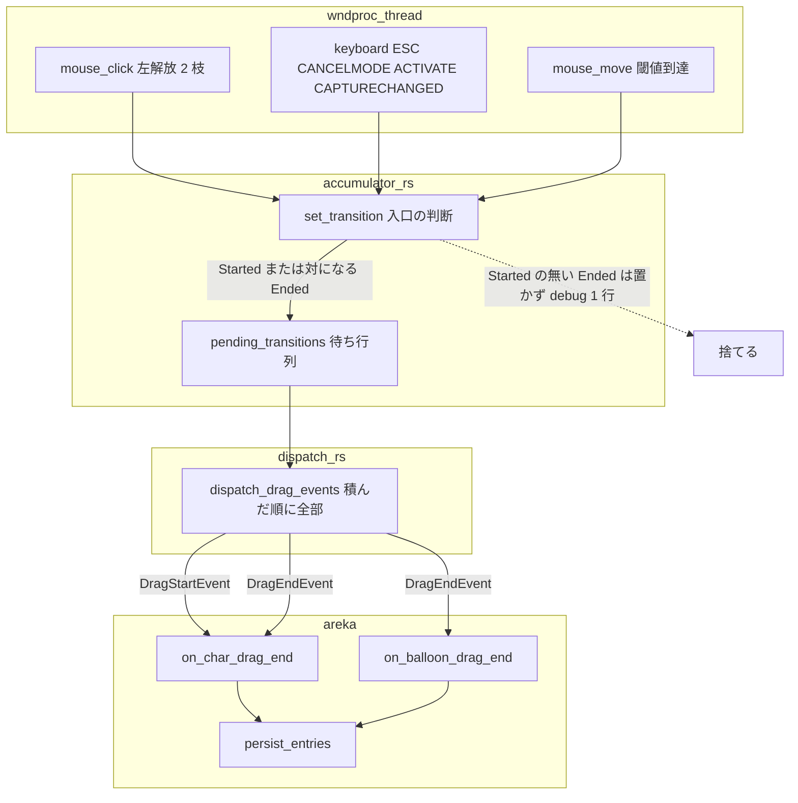
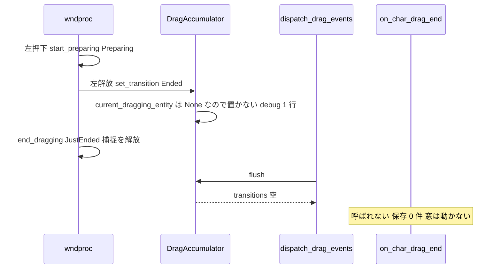
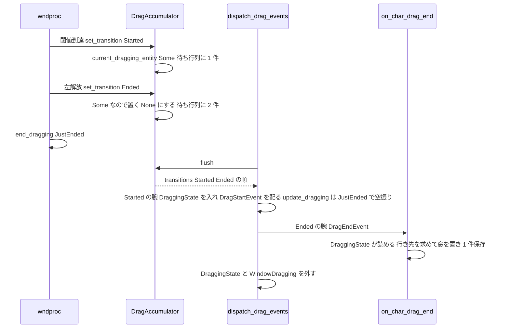

# Technical Design: areka-P0-drag-click-without-move

> 2026-10-03。要件は `requirements.md`（要件 1〜5）、調べた事実と決定の根拠は `research.md`（§1〜§7）。ソースの指し先はこの日のワークツリー（`89a8d836`）の実物で、行番号でなく「何を定める所か」で指す。

## Overview

**Purpose**: キャラクターやバルーンを動かさずにクリックしただけで窓の位置が記憶へ書かれる穴を、wintf の知らせの入口 1 か所で塞ぐ。あわせて、押して閾値を越えて離すまでが 1 回の画面更新に収まる「速いドラッグ」で開始の知らせが終了の知らせに上書きされて消える穴を、同じ入口の置き場を待ち行列にして塞ぐ。

**Users**: areka の利用者（クリックしても窓の位置が覚えられない・初回だけの位置合わせが次の起動で既定へ戻る）と、wintf を使う開発者（終了の知らせは必ず開始の知らせと対になって届く）。

**Impact**: 変える製品のファイルは wintf の `crates/wintf/src/ecs/drag/accumulator.rs` と `crates/wintf/src/ecs/drag/dispatch.rs` の 2 つだけ。wndproc のハンドラ（`mouse_click.rs`・`keyboard.rs`）、areka の 2 つの終了の受け手、ドラッグの状態の移り変わり、位置の記憶の形式は変えない。

### Goals

- 動かさないクリック（1 回・ダブルクリックの各回・右クリックの前の左クリック）と、動かし始める前の取り消し（ESC・メニューやダイアログの割り込み・捕捉の喪失・非活性化）で、ドラッグの終了の知らせを配らず、キャラクターの位置とバルーンの相対位置を記憶へ書かない。
- 閾値を越えたドラッグ（離す・取り消し）の終了の知らせと保存 1 件は今どおり。
- 速いドラッグでも開始 → 終了の順に両方を 1 回ずつ配り、キャラクターの窓をドラッグの行き先へ置いてから 1 件保存する。
- 修正の前に赤になる決定論のテストを wintf と areka の両側に置き、実機で初回の位置合わせの後のクリックが次の起動へ残らないことを確かめる。

### Non-Goals

- ドラッグの閾値の値、ドラッグ中の追従の作り（速いドラッグがふつうのドラッグと同じ道筋を通るようになること以外）、初回だけの位置合わせの規則、位置の記憶の形式と保存先。
- 閾値を越えた後に取り消されたドラッグの扱い（取り消しでもその時点の位置を保存する。変えない）。
- バルーンの窓の速いドラッグで、バルーンを行き先へ置くこと。バルーンは wndproc が「ドラッグ中」の状態の `WM_MOUSEMOVE` で動かす作りで（`mouse_move.rs` の `Dragging` の腕の `move_window`）、速いドラッグではそのマウス移動が 1 回も来ない。受け手 `on_balloon_drag_end` はバルーンの今の `WindowPos.position` を保存するだけなので、押す前の位置に残り、相対位置 1 件が書かれ、素材が退役する。修正の前と同じ振る舞いで、要件 2.3 もそう定める（2026-10-03 の設計ディスカッションで開発者が決定）。
- 右クリックメニューの出し方、ドラッグの状態が `JustEnded` で休む決まり（完了 spec `areka-P0-wintf-drag-state-rest-contract`）。
- 拡大率の切替での位置の扱い（`areka-P0-dpi-transition-two-tick-bounce`）。
- `crates/areka/src/emo2_boot/`・`crates/areka/src/input_events/`・`crates/areka/src/install/`（同じウェーブの他の spec との約束）。
- 配る所の開始の腕で枠の座標変換に失敗したときの縮退（`(0,0)` のまま使う）と、ESC・`WM_CANCELMODE` が窓の一致を確かめない件（`research.md` §7.5・§6 末尾）。

## Boundary Commitments

### This Spec Owns

- **ドラッグの知らせの種（`DragTransition`）を wndproc から ECS へ運ぶ箱 `DragAccumulator` の約束**: ⑴ `Ended` は、それに先立つ `Started` を積んだドラッグについてだけ受け付ける（`Started` の無い `Ended` は置かずに debug の記録を 1 行残す）、⑵ 1 回の画面更新の間に積まれた種は積んだ順にすべて運ぶ（上書きしない）。
- **配る所 `dispatch_drag_events` が、運ばれてきた種を積んだ順にすべて処理すること**。
- **終了の知らせ `DragEndEvent` の保証**: 配られるのは、その前に `DragStartEvent` が配られたドラッグについてだけ（同じ配りの中で続けて配られる場合を含む）。
- wintf 側と areka 側の決定論テスト、`crates/wintf/tests/` にある「`Started` 無しの `Ended`」を積む既存テスト 5 本の直し、実機での確かめ。

### Out of Boundary

- wndproc のハンドラ（`crates/wintf/src/ecs/window_proc/mouse_click.rs`・`keyboard.rs`・`mouse_move.rs`）の製品コード。種を積む 6 か所と状態を移す呼び出しはそのまま。
- ドラッグの状態機械（`crates/wintf/src/ecs/drag/state/`）と `CaptureGuard`。
- areka の受け手（`crates/areka/src/placement/follow/drag_follow.rs` の `on_char_drag_end`・`on_balloon_drag_end`）と、`DraggingState` 不在時の縮退（要件 2.4 で残す）。
- 位置の記憶の書き手（`crates/areka/src/placement/persist.rs` の `persist_entries`）と記憶の形式。
- `doc/COMPAT_ARCHITECTURE.md` §8 への記録（本修正は完了 spec `event-drag-system` の要件に揃えるものであり上書きではない＝要件 5.8 の条件に当たらない。書き換えない）。

### Allowed Dependencies

- wintf の中: `window_proc` → `drag::accumulator`（`DragAccumulatorResource::set_transition`）→ `drag::dispatch`（`flush` → 配る）。向きはこの一方向のまま。
- areka → wintf: 公開 API だけ（`wintf::ecs::drag::{DragAccumulatorResource, DragTransition, DraggingState, DragEndEvent, OnDragEnd, dispatch_drag_events, WindowDragContextResource}`・`wintf::ecs::pointer::Phase`）。wintf の `pub(crate)`（`dispatch_window_message`）は areka から呼ばない。
- テスト: `log-capture-kit`（既存）・`areka_sylphya::persist::FakePersistIo`（既存）・`temp_path_kit`（既存）。新しい依存は足さない。

### Revalidation Triggers

- `FlushResult.transition: Option<DragTransition>` を `transitions: Vec<DragTransition>` へ変える（読む所は wintf の中の 3 か所だけ。外へ出た場合は読み手の再確認が要る）。
- `DragAccumulator::set_transition` の意味の変更（`Started` 無しの `Ended` を受けない）。`Started` を積まずに `Ended` を積むテストや利用者は書き換えが要る。
- `DragEndEvent` に「必ず `DragStartEvent` が先立つ」保証が付く。受け手がこの保証に寄りかかる変更をするなら、本 spec の後で行う。

## Architecture

### Existing Architecture Analysis

- **知らせの流れ**（`research.md` §1）: wndproc の各ハンドラが、スレッドごとのドラッグの状態（`DRAG_STATE`）を移す関数と、累積器へ種を積む `set_transition` を並べて呼ぶ。ECS 側は毎画面更新の Input スケジュールで `dispatch_drag_events` が `flush` し、`Started` の腕で `DraggingState`・`WindowDragging` を入れて `DragStartEvent` を配り、`Ended` の腕で `DragEndEvent` を配って片づける。
- **穴 1（開始の無い終了）**: 終了の種を積む 6 か所のうち 5 か所が `Preparing`（閾値に届く前）からも積む。先例は `keyboard.rs` の `WM_ACTIVATE` の `Preparing` の腕（種を積まず状態だけ移す）。
- **穴 2（上書き）**: `DragAccumulator.pending_transition` は 1 枠で、`set_transition` は上書きする。閾値到達で積んだ `Started` が配られる前に左解放が来ると `Ended` が `Started` を消す。
- **既にある判断材料**: `DragAccumulator.current_dragging_entity` は `Started` を積むと `Some`、`Ended` を積むと `None` になり、`flush` では消えない。製品でこれを変える所は `set_transition` だけ。つまり「開始を積み、まだ終了を積んでいない」をそのまま答える値である。
- **受け手の縮退**: `on_char_drag_end` は `DraggingState` が無いと今の `WindowPos.position` へ縮退して必ず保存する（多窓で先に落ちた場面の保険・要件 2.4）。実機の記録ではこの縮退を踏んだ 3 件すべてが「開始の無い終了」だった（`research.md` §7.1）。

### Architecture Pattern & Boundary Map



**Architecture Integration**:

- 選んだ形: **入口 1 か所の判断（案 C）＋待ち行列**。6 か所の積み手が通る唯一の口 `set_transition` に「`Started` の無い `Ended` は置かない」を置き、置き場を 1 枠から待ち行列にする。
- 責務の分け方: wndproc は「何が起きたか」を種として積むだけ（変えない）。累積器は「運ぶ物の並びの約束」を守る（終了は開始の後・積んだ順に全部）。配る所は並びを信じて順に処理する。areka の受け手は知らせの保証に寄りかかるが、縮退は残す。
- 残す既存の型: `DragTransition`・`DragStartEvent`／`DragEndEvent`・`DraggingState`・`WindowDragging`・状態機械・`CaptureGuard` の解放の順序（`end_dragging` が borrow 解放後に落とす）。
- 新しい部品の理由: 無し。新しい型・モジュール・公開関数は作らない。
- steering との整合: 1 フレーム遅らせる解を取らない（同じ配りの中で開始 → 終了）・ログ無しの判定を作らない（捨てるときは debug 1 行）・決定論テストは兄弟ファイル・実機の根は `target\` の下。

### Technology Stack

| Layer | Choice / Version | Role in Feature | Notes |
|-------|------------------|-----------------|-------|
| UI 基盤（wintf） | Rust・`bevy_ecs`（既存の版） | `DragAccumulator` の待ち行列と入口の判断、`dispatch_drag_events` のループ | 新しい依存なし |
| アプリ（areka） | Rust（既存） | 受け手は変えない。決定論テストを足す | 新しい依存なし |
| 記録 | `tracing`（既存） | 要件 3.6 の debug 行・実機の `RUST_LOG` | target は既定（モジュールのパス） |
| テスト道具 | `log-capture-kit`・`FakePersistIo`・`temp_path_kit`（既存） | 保存の件数の確認・記録の捕捉 | 既存のまま |

## File Structure Plan

### Modified Files（製品）

- `crates/wintf/src/ecs/drag/accumulator.rs`（320 行） — `pending_transition: Option<DragTransition>` → `pending_transitions: Vec<DragTransition>`。`set_transition` に入口の判断（`Ended` かつ `current_dragging_entity.is_none()` なら置かずに debug 1 行）を足す。`FlushResult.transition` → `transitions: Vec<DragTransition>`（`flush` は `std::mem::take`）。`current_dragging_entity` の doc を「`Started` を積んでから `Ended` を積むまで `Some`」へ直す。中にある既存テスト 7 本は兄弟ファイル `accumulator_tests.rs` へ移し、末尾に `#[cfg(test)] #[path = "accumulator_tests.rs"] mod accumulator_tests;` を置く（要件 5.6・`keyboard.rs` の末尾と同じ形）。
- `crates/wintf/src/ecs/drag/dispatch.rs`（382 行） — `if let Some(transition) = flush_result.transition` を `for transition in flush_result.transitions` に替える。腕の中身は変えない。

### New Files（テスト・すべて兄弟ファイル・1,000 行以下）

- `crates/wintf/src/ecs/drag/accumulator_tests.rs` — `accumulator.rs` の中から移した既存 7 本（`transition` → `transitions` に合わせる）と、入口の判断・順序のテスト T1-1〜T1-3。形に依存するので修正と同じ変更で入れる。
- `crates/wintf/src/ecs/window_proc/mouse_click_tests.rs` — 左解放を `dispatch_window_message` で配る決定論テスト（`Preparing` から離す → 種 0 件・状態は `JustEnded`／`JustStarted` から離す → 種は `Started`・`Ended` の 2 件がこの順）。`mouse_click.rs` の末尾に `#[cfg(test)] #[path = "mouse_click_tests.rs"] mod mouse_click_tests;` を足す（`keyboard.rs` の末尾と同じ形）。
- `crates/areka/src/placement/follow_drag_end_gate_tests.rs` — 知らせの経路（`set_transition` → `dispatch_drag_events` → `OnDragEnd` の結線）から受け手の保存まで通す決定論テスト 6 本（§Testing Strategy）。`crates/areka/src/placement/follow.rs` の `#[cfg(test)] #[path = ...] mod ...;` の並びに 3 行を足す。1 本あたり 100〜150 行の見込みで 900 行を超えそうなら、速いドラッグと本物のドラッグの 3 本を `follow_drag_end_fast_drag_tests.rs` へ分ける。

### Modified Files（テスト）

- `crates/wintf/src/ecs/window_proc/keyboard_tests.rs`（70 行） — `flushed.transition` を `transitions` に合わせる。`Preparing` から ESC・`WM_CANCELMODE`・`WM_CAPTURECHANGED`・`WM_ACTIVATE` を配って種 0 件を見るテストを足す。
- `crates/wintf/tests/drag/dispatch_test.rs`（426 行・境界を広げる） — `dispatch_ended_removes_state_marker_and_syncs_offset`・`dispatch_ended_cancelled_propagates_flag` の 2 本を「`Started` を積んで 1 度配ってから `Ended` を積む」形へ直す。速いドラッグ（1 回の `flush` で `Started`・`Ended` の両方）の順序のテストを 1 本足す。
- `crates/wintf/tests/layout/boxstyle_coordinate_separation_test/drag_lifecycle.rs`（379 行・境界を広げる） — `test_drag_end_syncs_window_pos_changed`・`test_drag_end_clears_context_resource`・`test_window_dragging_removed_on_drag_end` の 3 本を同じ形へ直す（同ファイルの `test_window_dragging_full_lifecycle` が手本）。

### New Files（記録）

- `.kiro/specs/completed/areka-P0-drag-click-without-move/verification/real-machine.md` — C5 の実機の結果（走行の区間・grep の件数・2 回目の起動の相方の位置の行）。実機の根と一時フォルダはワークツリーの `target\drag-click-signoff\` の下。

### Untouched（確認のために挙げる）

- `crates/wintf/src/ecs/window_proc/mouse_click.rs`・`keyboard.rs`・`mouse_move.rs` の製品コード（`mouse_click.rs` はテストの登録 3 行だけ）。
- `crates/wintf/src/ecs/drag/state/`・`systems.rs`・`crates/wintf/src/ecs/world/mod.rs`。
- `crates/areka/src/placement/follow/drag_follow.rs`・`persist.rs`・`spawn.rs`・`menu/`。
- `doc/COMPAT_ARCHITECTURE.md`。

## System Flows

### 動かさないクリック（修正後）



### 速いドラッグ（修正後・1 回の画面更新に開始と終了が重なる）



流れの要点:

- 判断は `set_transition` の 1 点だけ。状態の移り変わりと捕捉の解放（要件 3.5）は種を置くかどうかと独立なので今どおり。
- 速いドラッグで開始の腕が最後に呼ぶ `update_dragging` は、状態が既に `JustEnded` なので何もしない（`state/mod.rs` の `update_dragging` の `_ => {}` の腕）。新しい分岐は要らない。
- バルーンの窓の速いドラッグは、知らせは同じく開始 → 終了で届くが、バルーンを動かす wndproc のマウス移動が来ないので押す前の位置に残る（要件 2.3 のとおり今どおり。Non-Goals）。
- `flush` の後の「累積の差分が 0 でなければ `DragEvent`」は `FlushResult.current_dragging_entity` を見る。速いドラッグでは `Ended` を積んだ時点で `None` なので `DragEvent` は出ず、窓の移動は終了の受け手が `DraggingState`＋離した位置から求める（今の正常なドラッグの最後の 1 歩と同じ道筋）。

## Requirements Traceability

| Requirement | Summary | Components | Interfaces | Flows |
|-------------|---------|------------|------------|-------|
| 1.1 | キャラの動かさないクリックで保存 0 | 入口の判断（C1） | `set_transition` | 動かさないクリック |
| 1.2 | バルーンの動かさないクリックで保存 0・素材を残す | C1 | 同上（`on_balloon_drag_end` が呼ばれない） | 同上 |
| 1.3 | 1 回・ダブルクリック・右の前の左に同じく | C1（左解放はすべて同じ口を通る。`DBLCLK`・右押下は準備に入らない） | `set_transition` | 同上 |
| 1.4 | クリックの前の位置から動かさない | C1（受け手が呼ばれなければ `enqueue_window_set_pos`・`apply_release_limit_correction` は走らない） | − | 同上 |
| 1.5 | 準備中の取り消しで書かない | C1（ESC・`WM_CANCELMODE`・`WM_CAPTURECHANGED` の `Ended{cancelled:true}` も同じ口） | `set_transition` | 同上 |
| 2.1 | キャラの本物のドラッグで保存 1 | C1（`Started` 後の `Ended` は今どおり置く）・C2 | `flush`・`dispatch_drag_events` | − |
| 2.2 | バルーンの本物のドラッグで保存 1・素材を退役 | C1・C2 | 同上 | − |
| 2.3 | 速いドラッグでキャラは行き先へ置き保存 1・バルーンは今どおり | 待ち行列（C1）・C2（バルーンの受け手は変えない） | `transitions`・開始の腕 → 終了の腕 | 速いドラッグ |
| 2.4 | 開始時の記録が先に失われても保存 1 | areka の縮退（変えない・既存テスト） | `on_char_drag_end` | − |
| 2.5 | 閾値を越えた後の取り消しは今どおり | C1（`JustStarted`・`Dragging` からの `Ended{cancelled:true}` は置く） | `set_transition` | − |
| 3.1 | 閾値に届かず離したら終了を配らない | C1 | `set_transition` | 動かさないクリック |
| 3.2 | 準備中の取り消しで終了を配らない | C1 | `set_transition` | 同上 |
| 3.3 | 閾値を越えたら終了を 1 回配る | C1・C2 | `transitions`（1 件） | − |
| 3.4 | 開始と終了が重なっても開始 → 終了で 1 回ずつ | 待ち行列（C1）・C2 | `transitions`（順序） | 速いドラッグ |
| 3.5 | 状態の移り変わりと捕捉の解放は今どおり | 変えない（`end_dragging`／`cancel_dragging` は種と独立） | 既存 `state/tests.rs`・新 `mouse_click_tests.rs`（状態が `JustEnded`） | − |
| 3.6 | 配らないと判定したとき debug 1 行 | C1 | `tracing::debug!` in `set_transition` | 動かさないクリック |
| 4.1 | 初回の位置合わせの後のクリックで次の起動は既定 | C1・実機（C5） | − | 動かさないクリック |
| 4.2 | 右クリックメニューの出方を変えない | 変えない（`menu/trigger.rs` は状態だけを読む・既存 `trigger_flow_tests.rs`） | − | − |
| 4.3 | ゴーストへのマウスのイベントを変えない | 変えない（`input_events/` は知らせを読まない・触らない約束） | − | − |
| 4.4 | 閾値・追従・位置合わせ・記憶の形式を変えない（速いドラッグの例外） | 変えない。例外は 2.3 と同じ | − | 速いドラッグ |
| 5.1 | areka の赤テスト（保存 0・素材が残る） | C4 | `dispatch_drag_events`・`FakePersistIo` | − |
| 5.2 | wintf の赤テスト（終了 0 件・非活性化は前後とも緑） | C3 | `dispatch_window_message`・`dispatch_drag_events`・`Messages<DragEndEvent>` | − |
| 5.3 | 前後とも通るテスト（本物・多窓・取り消し） | C4・既存 | 同上 | − |
| 5.4 | 速いドラッグの赤テスト | C3（順序）・C4（行き先と保存 1） | `transitions`・`dispatch_drag_events` | 速いドラッグ |
| 5.5 | 3.5・4.2 を既存または新しいテストで | 既存 `state/tests.rs`・`trigger_flow_tests.rs`・新 `mouse_click_tests.rs` | − | − |
| 5.6 | 注入した入力・兄弟ファイル・1,000 行 | File Structure Plan | − | − |
| 5.7 | 実機の確かめ | C5 | `RUST_LOG`・`AREKA_ROOT`・`AREKA_PROFILE_DIR` | − |
| 5.8 | 完了 spec と食い違えば §8 へ | 当たらない（上書きではない）＝書かない | − | − |
| 5.9 | 全体テストが緑 | `tools/test-all.ps1` | − | − |

## Components and Interfaces

| Component | Domain/Layer | Intent | Req Coverage | Key Dependencies (P0/P1) | Contracts |
|-----------|--------------|--------|--------------|--------------------------|-----------|
| C1 `DragAccumulator`（入口の判断＋待ち行列） | wintf / drag | `Started` の無い `Ended` を置かない・積んだ順に全部運ぶ | 1.1〜1.5, 2.1〜2.3, 2.5, 3.1〜3.4, 3.6 | wndproc の 6 か所（Inbound, P0）・`dispatch_drag_events`（Outbound, P0） | Service, State |
| C2 `dispatch_drag_events`（順に全部） | wintf / drag | 待ち行列を積んだ順に処理する | 2.1〜2.3, 3.3, 3.4 | C1（Inbound, P0）・`OnDragStart`／`OnDragEnd` の受け手（Outbound, P0） | Event |
| C3 wintf 側の決定論テスト | wintf / tests | 入口の判断・順序・wndproc からの経路を赤 → 緑で固定。境界の外の 5 本を直す | 3.1〜3.6, 5.2, 5.4, 5.5 | `dispatch_window_message`（`pub(crate)`）・`EcsWorld` | − |
| C4 areka 側の決定論テスト | areka / placement | 知らせの経路から受け手の保存まで通し、保存 0／1・窓の位置・素材を赤 → 緑で固定 | 1.1〜1.5, 2.1〜2.3, 2.5, 5.1, 5.3, 5.4 | wintf 公開 API・`FakePersistIo`・`PersistWiring` | − |
| C5 実機の確かめ | areka / 運用 | 初回の位置合わせの後のクリックが次の起動へ残らないことと保存 0 件を記録で示す | 4.1, 5.7 | 実行ファイル・`RUST_LOG`・`target\` の根 | − |

### wintf / drag

#### C1 `DragAccumulator`（入口の判断＋待ち行列）

| Field | Detail |
|-------|--------|
| Intent | wndproc → ECS へ運ぶ種の並びの約束を守る: 終了は開始の後・積んだ順に全部 |
| Requirements | 1.1, 1.2, 1.3, 1.4, 1.5, 2.1, 2.2, 2.3, 2.5, 3.1, 3.2, 3.3, 3.4, 3.6 |

**Responsibilities & Constraints**

- `set_transition(Started)`: `current_dragging_entity = Some(entity)` にして待ち行列へ押す（今どおり＋置き場が待ち行列）。
- `set_transition(Ended)`: `current_dragging_entity` が `None` なら**置かない**。`tracing::debug!(entity = ?entity, cancelled, "[DragAccumulator] Ended without Started dropped")` を 1 行出して返る。`Some` なら待ち行列へ押し、`None` にする（今どおり）。
- `flush`: `transitions = std::mem::take(&mut pending_transitions)`。累積の差分は 0 に戻し、`current_dragging_entity`・`current_pos` はそのまま（今どおり）。
- `accumulate_delta`・`update_position`・`DragAccumulatorResource`（`Arc<Mutex<_>>` の包み）は変えない。
- 対象の entity の一致は確かめない（wndproc は同じ状態の写しから `Started` と `Ended` の entity を取るので食い違わない。要らない分岐を足さない）。
- `WM_ACTIVATE` の `Preparing` の腕（先例・種を積まない）はそのまま。入口の判断と二重になるが害は無く、wndproc は触らない。

**Dependencies**

- Inbound: `mouse_move.rs`（`Started`）・`mouse_click.rs` の左解放 2 枝・`keyboard.rs` の 4 か所（`Ended`）— 変えない（P0）
- Outbound: `dispatch_drag_events` — `flush` の返しを順に処理（P0）

**Contracts**: Service [x] / API [ ] / Event [ ] / Batch [ ] / State [x]

##### Service Interface

```rust
pub struct DragAccumulator {
    accumulated_delta: PhysicalPoint,
    /// Started を積んでから Ended を積むまで Some（flush では消えない）
    current_dragging_entity: Option<Entity>,
    current_pos: PhysicalPoint,
    /// 前回 flush 以降に積まれた種・積んだ順
    pending_transitions: Vec<DragTransition>,
}

impl DragAccumulator {
    pub fn set_transition(&mut self, transition: DragTransition);
    pub fn flush(&mut self) -> FlushResult;
    // accumulate_delta / update_position は今どおり
}

pub struct FlushResult {
    pub delta: PhysicalPoint,
    /// 積んだ順。空なら知らせ無し
    pub transitions: Vec<DragTransition>,
    pub current_dragging_entity: Option<Entity>,
    pub current_position: PhysicalPoint,
}
```

- 前条件: 無し（どの状態からでも呼べる）。
- 後条件: `set_transition(Ended)` の後、`transitions` に `Ended` が増えるのは呼ぶ前に `current_dragging_entity` が `Some` だったときだけ。`flush` の後 `pending_transitions` は空。
- 不変条件: `transitions` の中で、どの `Ended` にも同じ `flush` かそれ以前の `flush` の中に対応する `Started` がある。`Started` → `Ended` → `Started` …の交互の並びになる。

##### State Management

- 状態: `current_dragging_entity`（`Started` 済みか）と `pending_transitions`（積んだ順）。スレッド間は `DragAccumulatorResource` の `Mutex` で守る（今どおり）。
- 1 回の画面更新で積まれる種は実用上 3 件まで（`Ended` → `Started` → `Ended`）。上限は設けない。

**Implementation Notes**

- Integration: `FlushResult.transition` を読む 3 か所（`accumulator.rs` の中の既存テスト〔`accumulator_tests.rs` へ移す〕・`dispatch.rs`・`keyboard_tests.rs`）を `transitions` に合わせる。
- Validation: C3 の T1・T2・T3。
- Risks: 無し（置き場の形と入口の判断だけ。差分は数十行）。

#### C2 `dispatch_drag_events`（順に全部）

| Field | Detail |
|-------|--------|
| Intent | `flush` が返した種を積んだ順にすべて処理する |
| Requirements | 2.1, 2.2, 2.3, 3.3, 3.4 |

**Responsibilities & Constraints**

- `if let Some(transition) = flush_result.transition { match … }` を `for transition in flush_result.transitions { match … }` へ替える。`Started`・`Ended` の腕の中身は変えない。
- 速いドラッグ（`Started` → `Ended` が同じ `flush`）: 開始の腕が `DraggingState`・`WindowDragging` を直接入れ、`DragStartEvent` を配り、`update_dragging` を呼ぶ（状態が `JustEnded` なので空振り）。続く終了の腕は `DragEndEvent` を配り（受け手は `DraggingState` を読める）、`DraggingState`・`WindowDragging` を外し、`WindowDragContextResource` を空にする。
- ループの後の「差分が 0 でなければ `DragEvent`」は変えない。

**Dependencies**

- Inbound: C1 `flush`（P0）
- Outbound: `OnDragStart`／`OnDragEnd` の受け手（areka の `on_char_drag_end`・`on_balloon_drag_end`）と、`Messages<DragEndEvent>` を読む system（`systems.rs` の `cleanup_drag_state`）（P0）

**Contracts**: Service [ ] / API [ ] / Event [x] / Batch [ ] / State [ ]

##### Event Contract

- 配る知らせ: `DragStartEvent`・`DragEvent`・`DragEndEvent`（形は変えない）。
- 保証（新しく明文化）: `DragEndEvent` は、必ずそれに先立つ `DragStartEvent` と対で配られる。同じ `dispatch_drag_events` の呼び出しの中で続けて配られることがある（速いドラッグ）。
- 順序: 1 回の `flush` の中では積んだ順。`Messages<…>` への書き込みも同じ順。

**Implementation Notes**

- Integration: 変更は 1 行の置き換えとインデント。
- Validation: C3 の T5（順序）・C4 の T7-5（行き先と保存）。
- Risks: 無し。

### wintf / tests

#### C3 wintf 側の決定論テスト

| Field | Detail |
|-------|--------|
| Intent | 入口の判断・順序・wndproc からの経路を赤 → 緑で固定し、境界の外の 5 本を直す |
| Requirements | 3.1, 3.2, 3.3, 3.4, 3.5, 3.6, 5.2, 5.4, 5.5 |

**Responsibilities & Constraints**

- 組み立ては `keyboard_tests.rs` の形を使う: `cancel_dragging()` で前のテストの残りを落とす → `EcsWorld::new()`（`Messages<DragStartEvent>`／`<DragEvent>`／`<DragEndEvent>` は `EcsWorld::new` が登録済み）→ `DragAccumulatorResource` を入れる → `start_preparing(entity, pos, HWND::default())`（必要なら `start_dragging` で `JustStarted` へ。`Started` の種は `mouse_move.rs` の代わりに手で積む）→ `crate::ecs::dispatch_window_message(&world, entity, &WindowMessage{..})` → `snapshot_drag_state()` を見る。
- **赤を示すテストは `FlushResult` の形に依存させない**: 修正前の HEAD には `transitions` が無く、形に触るテストはコンパイルできない（赤ではなくビルドの失敗になる）。知らせの有無と件数は、`dispatch_drag_events(world_mut)` を 1 回呼んで `Messages<DragStartEvent>`・`Messages<DragEndEvent>` を `drain` した件数で見る（`crates/wintf/tests/drag/dispatch_test.rs` の `drain_messages` と同じ形）。これなら修正前にそのままコンパイルでき、`Preparing` から離せば終了 1 件（赤）→ 修正後 0 件（緑）になる。順序（3.4）は `OnDragStart`／`OnDragEnd` の受け手を結線し、受け手が `World` の `Resource`（`Vec<&'static str>`）へ名前を押して並びを見る。累積器の中のテスト（T1）だけは形に依存するので修正と同じ変更に置き、その赤の証明は T2・T3・T5・T7 が担う。
- 左解放のテストの entity は `Window::default()` を持たせ、同じ entity を窓として渡す（`handle_button_message` の予備の枝の `should_end` が `find_owner_window` で一致を見るため）。素の `EcsWorld` では当たり判定が取れないので予備の枝を通る。当たり判定が取れた枝は、同じ `set_transition(Ended{cancelled:false})` を同じ値で呼ぶことをコードの読みで押さえる（`research.md` §7.3 R3）。
- `lparam` はクライアント座標（`x | y << 16`）。`WindowPos` が無いので画面座標＝クライアント座標。
- `WM_CAPTURECHANGED` は `capture_guard.mark_released()` を先に呼ぶので `HWND::default()` でも `ReleaseCapture` は走らない（`keyboard_tests.rs` と同じ）。

**Dependencies**

- Inbound: 無し
- Outbound: `dispatch_window_message`（`pub(crate)`）・`DragAccumulatorResource`・状態関数（P0）

**Implementation Notes**

- Validation: §Testing Strategy の T1〜T6。
- Risks: `Window` の `on_add` フック（`window/components.rs` の `on_window_add`）は Command を積むだけなので、テストの entity に `Window::default()` を付けても OS の窓は作られない（`crates/wintf/tests/drag/dispatch_test.rs` は素の `World::new()` で同じことをしている。`EcsWorld::new()` でも Command は Input スケジュールの前に流れないので同じ）。

### areka / placement

#### C4 areka 側の決定論テスト

| Field | Detail |
|-------|--------|
| Intent | 知らせの経路（本物の入口の判断）から受け手の保存まで通し、保存 0／1・窓の位置・素材を赤 → 緑で固定する |
| Requirements | 1.1, 1.2, 1.3, 1.4, 1.5, 2.1, 2.2, 2.3, 2.5, 5.1, 5.3, 5.4 |

**Responsibilities & Constraints**

- World の組み立て: `DragAccumulatorResource`・`WindowDragContextResource`・`Messages<DragStartEvent>`／`Messages<DragEvent>`／`Messages<DragEndEvent>` を入れる（`crates/wintf/tests/drag/dispatch_test.rs` の `make_world` と同じ登録。開始の腕は `Messages<DragStartEvent>` を `resource_mut` で引くので無いと落ちる）。`MonitorSnapshot`・`PersistWiring`（`FakePersistIo` の共有ストア・`on_balloon_drag_end_persists_balloon_offset_for_scope` と同じ）を入れる。
- キャラ窓 entity: `fake_handle`・`window_pos_sized`・`Anchored(Anchor::Bottom)`・`CharWindowMarker{scope}`・`BalloonFollow`・`OnDragEnd(on_char_drag_end)`。バルーン窓 entity: `fake_handle`・`window_pos_at`・`BalloonWindowMarker{scope}`・`OnDragEnd(on_balloon_drag_end)`。素材の確認にはキャラ窓へ `BalloonKeywordBase` を付けておく。
- 駆動: `world.resource::<DragAccumulatorResource>().set_transition(..)` を wndproc の代わりに呼び、`dispatch_drag_events(&mut world)` を 1 回の画面更新として呼ぶ。実時間の待機は無い。
- 数え方: `parts.publisher.barrier()` の後に `load_scope(PersistScope::Ghost, &roots, &FakePersistIo)` を読み、`PersistKey::WindowPos{scope,..}`・`PersistKey::BalloonOffset{scope,..}` の有無で 0／1 を言う。窓の位置は `position_of`、素材は `world.get::<BalloonKeywordBase>(char)`。
- 速いドラッグの行き先の期待値: 偽の HWND では開始の腕の枠の座標変換が失敗し `DraggingState.initial_inset = (0,0)` になるので、期待値は `project_anchor(Anchor::Bottom, PointPx{x: cursor.x − drag_start.x, y: cursor.y − drag_start.y}, char_size, Some(&snapshot))`。これはテストの組み立ての都合で、製品では `WindowPos.position` の枠込みの値が入る（`research.md` §7.1）。テストにはこの式が偽の HWND の座標変換の失敗に寄りかかることをコメントで書く。修正前は `Started` が消えて `DraggingState` が入らず、窓は押す前の位置のまま・保存値も押す前の位置になるので赤。
- 1 ファイル 1,000 行以下。超えそうなら File Structure Plan のとおり 2 ファイルへ分ける。

**Dependencies**

- Outbound: wintf 公開 API・`FakePersistIo`・`spawn_sylphya`・`load_scope`（P0）

**Implementation Notes**

- Validation: §Testing Strategy の T7。
- Risks: `on_char_drag_end` の `follow_balloon` が `BalloonFollow` を要る（無ければ素通し）。既存テストと同じ部品を使えば問題ない。

### areka / 運用

#### C5 実機の確かめ

| Field | Detail |
|-------|--------|
| Intent | 初回の位置合わせの後に相方をクリックしても次の起動で既定の配置に立つこと（4.1）と、その走行で保存 0 件・捨てた記録 1 件以上を記録で示す |
| Requirements | 4.1, 5.7 |

**Responsibilities & Constraints**

- 根と記憶: `AREKA_ROOT`・`AREKA_PROFILE_DIR` をワークツリーの `target\drag-click-signoff\root`・`target\drag-click-signoff\profile` に向ける（新しく作る。`C:\` 直下・`C:\tmp` は使わない）。既定ゴースト（emo2）で回す。
- 記録: `RUST_LOG=info,areka=debug,wintf::ecs::drag=debug`。これで `areka::persist::save`（info）・`drag_follow` の debug（写像スキップ）・`wintf::ecs::drag::accumulator` の debug（要件 3.6 の行）・`wintf::ecs::drag::dispatch` の info（`[DragStartEvent] Dispatching`・`[DragEndEvent] Dispatching`）が開く。安全弁に `AREKA_APP_SMOKE_EXIT_MS` を置く（1 走行の所要より長く）。
- 手順（`alpha-release-signoff` の受入記録の A1・A2・項目 12 と同じ筋）: ⑴ 1 回目の起動。初回の台詞が相方をずらすのを待つ → 相方の絵の上を動かさずに左クリック 1 回 → 右クリックメニューの「終了」。⑵ 2 回目の起動 → 相方が既定の配置に立つことを目で確かめ、終了。
- 合否: ⑴ の記録で `DragEnd 保存` 0 件・`[DragEndEvent] Dispatching` 0 件・`[DragAccumulator] Ended without Started dropped` 1 件以上・`写像スキップ` 0 件。⑵ の記録で相方（scope 1）の起動時の `char_x`／`char_y` が `default_char_x`／`default_char_y` と同じ（受入記録の項目 12 の見方）。ついでに ⑴ の後で本当に 1 回ドラッグして終了し、保存 1 件と `[DragStartEvent] Dispatching` 1 件 → `[DragEndEvent] Dispatching` 1 件の順を確かめる。
- `写像スキップ` が修正後に 1 件でも出たら、それは本 spec とは別の原因（`research.md` §7.3 R1）。直さずに報告し、新しい spec の起票を提案する。

## Data Models

### Domain Model

- **`DragTransition`**（変えない）: `Started{entity, start_pos, timestamp}`・`Ended{entity, end_pos, cancelled}`。
- **`DragAccumulator`**（形を変える）: 置き場 `pending_transitions: Vec<DragTransition>`。不変条件は C1 の Service Interface の「不変条件」。
- **`FlushResult`**（形を変える）: `transitions: Vec<DragTransition>`（積んだ順）。
- `DraggingState`・`WindowDragging`・`WindowDragContext`・`DragStartEvent`／`DragEndEvent`: 変えない。

### Data Contracts & Integration

- `DragEndEvent` の受け手に対する保証（新しく明文化）: 必ず先に `DragStartEvent` が配られている。areka の受け手は今の作り（縮退を含む）のままで、この保証に新しく寄りかかる変更はしない。

## Error Handling

### Error Strategy

- 「`Started` の無い `Ended`」は失敗ではなく、動かさないクリックの正常な結果として入口で捨てる。捨てたことは必ず debug の記録に残す（ログ無しの判定を作らない）。
- `DragAccumulatorResource` の `Mutex` が取れないときは今どおり何もしない（`if let Ok(mut acc) = self.inner.lock()`）。

### Error Categories and Responses

- 利用者に見える失敗は無い。記憶へ書かないことが正しい振る舞い。
- 開発者向け: 要件 3.6 の 1 行（`entity`・`cancelled`）。離し（`false`）と取り消し（`true`）はこの欄で見分ける。

### Monitoring

- 実機の `RUST_LOG` と見る行は C5 のとおり。配る所の既存の info 行（`[DragStartEvent] Dispatching`・`[DragEndEvent] Dispatching`）で「対になっているか」を数える。

## Testing Strategy

すべて注入した入力と画面更新の並びで駆動し、実時間の待機に依存しない。「赤 → 緑」は修正の前に失敗し修正の後に通るもの、「緑 → 緑」は前後とも通るもの。

### wintf・累積器のテスト（`crates/wintf/src/ecs/drag/accumulator_tests.rs`〔新・既存 7 本を移す〕・形に依存するので修正と同じ変更に置く）

- T1-1 `ended_without_started_is_dropped`: `Ended` だけ積む → `flush().transitions` は空・`current_dragging_entity` は `None`（3.1/3.6）。`cancelled: true` でも同じ（3.2）。
- T1-2 `started_then_ended_in_one_flush_keeps_both_in_order`: `Started` → `Ended` → `flush` → `transitions` は `[Started, Ended]`（3.4）。
- T1-3 `ended_then_started_in_one_flush_keeps_order`: `Started` → `flush` → `Ended` → `Started` → `flush` → `[Ended, Started]`・`current_dragging_entity` は `Some`（順序の固定・3.4）。
- 既存 7 本: `accumulator.rs` の中からこのファイルへ移し、`transition` → `transitions` へ合わせる（中身は変えない）。

### wintf・wndproc からの経路（`mouse_click_tests.rs`〔新〕・`keyboard_tests.rs`）

知らせの件数は `dispatch_drag_events` を 1 回呼んだ後の `Messages<DragEndEvent>`／`Messages<DragStartEvent>` の `drain` で数える（形に依存しない・修正前にコンパイルできる）。

- T2-1 `release_before_threshold_dispatches_no_drag_end`: `start_preparing` → `WM_LBUTTONUP` → 配る → 終了の知らせ 0 件・状態は `JustEnded{cancelled:false}`（赤 → 緑・3.1/3.5/5.2）。
- T2-2 `release_after_threshold_dispatches_start_and_end_once_each`: `start_preparing` → `start_dragging`＋手で `Started` を積む（`mouse_move.rs` の代わり）→ `WM_LBUTTONUP` → 配る → 開始 1 件・終了 1 件（`cancelled:false`）・状態は `JustEnded`（赤 → 緑・修正前は開始 0 件・3.3/3.4）。
- T3-1〜T3-3 `esc_before_threshold_dispatches_no_drag_end`・`cancelmode_before_threshold_dispatches_no_drag_end`・`capturechanged_before_threshold_dispatches_no_drag_end`: `start_preparing` → 各メッセージ → 配る → 終了 0 件・状態は `JustEnded{cancelled:true}`（赤 → 緑・3.2/3.5/5.2）。
- T3-4 `deactivation_before_threshold_dispatches_no_drag_end`: `WM_ACTIVATE(WA_INACTIVE)` → 配る → 0 件（緑 → 緑・5.2 の「非活性化は今も 0 件」）。
- 既存 `deactivation_right_after_the_threshold_cancels_the_drag`: `flushed.transition` を `transitions` に合わせる（修正と同じ変更・緑 → 緑・2.5）。

### wintf・配る所（`crates/wintf/tests/drag/dispatch_test.rs`・`drag_lifecycle.rs`・境界を広げる）

- T5-1 `dispatch_started_and_ended_in_one_flush_delivers_both_in_order`: `Started` → `Ended` → `dispatch_drag_events` 1 回 → `Messages<DragStartEvent>` 1 件・`Messages<DragEndEvent>` 1 件・`OnDragStart`／`OnDragEnd` の受け手が `Resource` へ押した並びが `["start", "end"]`・終了時に `DraggingState`・`WindowDragging` が無い（赤 → 緑・修正前は開始 0 件・3.4/5.4）。
- T5-2・T5-3 既存 2 本、T6-1〜T6-3 既存 3 本: 「`Started` を積んで 1 度配ってから `Ended` を積む」へ直す。確かめる中身は変えない（緑 → 緑）。

### areka・知らせの経路から保存まで（`follow_drag_end_gate_tests.rs`〔新〕）

- T7-1 `click_without_move_on_char_persists_nothing_and_keeps_position`: キャラ窓へ `Ended{cancelled:false}` だけ → `dispatch_drag_events` → `WindowPos` のキー無し・`position_of` 不変（赤 → 緑・1.1/1.3/1.4/5.1）。
- T7-2 `click_without_move_on_balloon_persists_nothing_and_keeps_keyword_base`: バルーン窓へ `Ended` だけ → `BalloonOffset` のキー無し・`BalloonKeywordBase` が残る・バルーンの位置不変（赤 → 緑・1.2/1.4/5.1）。
- T7-3 `cancel_before_threshold_persists_nothing`: `Ended{cancelled:true}` だけ → キー無し（赤 → 緑・1.5）。
- T7-4 `real_drag_persists_once_for_char_and_balloon`: `Started` → 配る → `Ended` → 配る → キャラの `WindowPos` 1 組・バルーンの `BalloonOffset` 1 組・`BalloonKeywordBase` が外れる（緑 → 緑・2.1/2.2/5.3）。
- T7-5 `fast_drag_places_window_at_destination_and_persists_once`: `Started` → `Ended` → 配る 1 回 → `position_of` が C4 の期待値・`WindowPos` のキー 1 組で値が期待値の原点基準（赤 → 緑・2.3/5.4）。
- T7-6 `cancel_after_threshold_persists_as_today`: `Started` → 配る → `Ended{cancelled:true}` → 配る → 1 組（緑 → 緑・2.5/5.3）。
- 既存 `dragged_char_persists_even_without_dragging_state_at_dragend`（2.4・緑 → 緑）・`trigger_flow_tests.rs`（4.2）・`state/tests.rs`（3.5）はそのまま使う。

### 実機

- C5 の手順。保存 0 件・捨てた記録 1 件以上・2 回目の起動で相方が既定の配置。

### 全体

- `pwsh -NoProfile -File tools/test-all.ps1`（5.9）。`crates/log-capture-kit/tests/file_length_guard_test.rs` の 1,000 行の検査を含む。

### 実装の順序（赤を先に見せるため）

1. 形に依存しないテストを先に書き、修正前の HEAD で赤を確かめる: T2-1・T2-2・T3-1〜T3-3（wintf・wndproc）、T5-1（wintf・配る所）、T7-1〜T7-3・T7-5（areka）。あわせて T3-4・T7-4・T7-6 が緑であることも見る。
2. 修正（`accumulator.rs` の待ち行列＋入口の判断＋debug 行・`dispatch.rs` の `for`）と、形に依存する更新（`accumulator_tests.rs` の T1 と移す 7 本・`keyboard_tests.rs` の既存 1 本・`crates/wintf/tests/` の 5 本の直し）を同じ変更で入れ、全部が緑になることを見る。
3. 実機（C5）→ 全体テスト（5.9）。

## Supporting References

- 速いドラッグで両方の知らせを同じ配りの中で届ける理由と、`update_dragging` が `JustEnded` で空振りする根拠: `research.md` §7.1。
- 実機の記録の数え直し（開始 0・終了 1・写像スキップ 1 が 3 件一致・`Direct Arrangement.offset sync` 0 件）: `research.md` §7.1 の表。
- 案 A／B／C の比べ: `research.md` §3・§7.2。
- `RUST_LOG` の文字列と target 名: `research.md` §7.3 R4。
