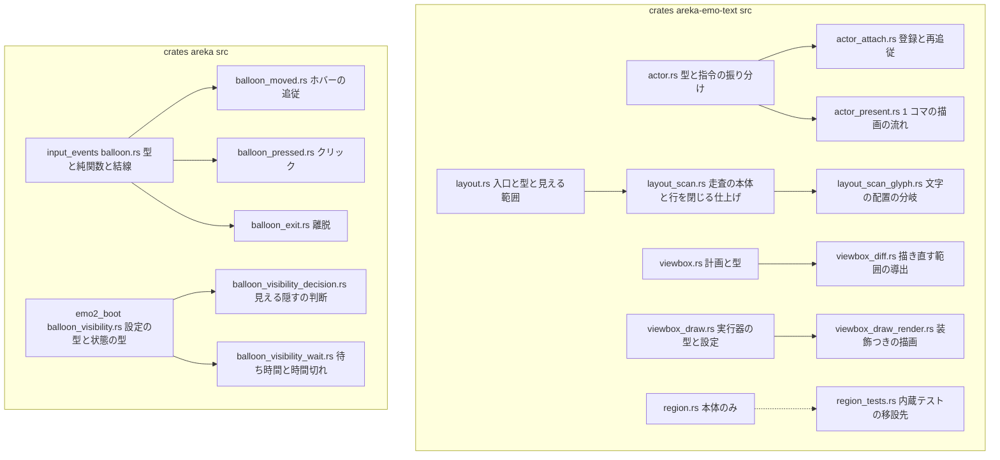
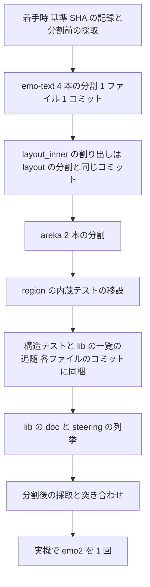

# 技術設計書: areka-P0-emo-text-file-split

> 生成 2026-10-03（design フェーズ）／対象ブランチ `claude/areka-p0-emo-text-split-dc4e04`（基準 HEAD `71be5003`・対象 7 本は main `1ce4c74e` と同一）
> 入力: `requirements.md`（確定済・要件の討議 2026-10-03 を反映）・`research.md`（ギャップ分析＋設計フェーズの調査）・`brief.md`・`.kiro/steering/`・前例 `completed/areka-P0-file-slimming/design.md`
> 本書は research の論点 1〜10 のうち設計へ持ち越されたもの（論点 1 の残り・2・3 の前半・4・5 の書き方・7・8）と「調べもの」の全項目を裁定する。ソースの引用は「何の定義か」（関数名・型名・定数名）で指し、行番号は使わない（分割で行番号が動くため）。行数は基準 HEAD での実測と概算である。

## Overview

**Purpose**: 文字とバルーンのソース 6 本（＋`region.rs`）を、振る舞いを 1 つも変えずに役割の単位で分け、後続の文字まわりの spec が行を足す余地を作る。動かすのはコードの置き場所であって、中身でも利用者に見える振る舞いでもない。唯一の例外は `layout.rs` の私有の本体 `layout_inner` で、要件の討議の裁定（2.3）により分岐の種類ごとの関数へ割る。

**Users**: `shell-balloon`・`balloon-font-file`・`text-typesetting`・`talk-fast-forward`・`text-ruby`・`balloon-markers`・`balloon-scroll-fade`・`text-reveal-fade`・`text-align-shadow-canon`・`choice-marker-styling`・`anchor-tag-canon`・`balloon-lifecycle-events` の実装者とレビュアー。各 brief の「分割が先」を本 spec が済ませる。

**Impact**: 7 本（975／977／914／871／930／923／977 行）が、分割後はどれも 550 行以下になり（§File Structure Plan の表）、新しい子モジュール 12 本（＋`region_tests.rs`）が増える。公開している名前の道筋・依存・テストの中身・ログの文言は変わらない。受け入れの中心は 3 つ——**振る舞いが変わらない**・**既存のテストが書き換えなしで同じ本数・同じ結果**・**公開している名前の道筋が変わらない**——で、いずれも証跡（§検証の流れ）で示す。

### Goals

- 7 本を役割の単位で分け、各ファイルと新しい子を 700 行以下に収める（1.1〜1.3）
- 新しい子の doc に役割と足す予定の spec を 1〜2 行で残し、子の一覧を述べる既存の doc と steering を合わせる（1.4・1.5）
- `layout_inner` を分岐の種類ごとの関数へ割り、後続 4 本の受け口を定める（2.3）
- 公開の道筋・可視性・依存・ログ・警告の件数を変えない（2.1〜2.7・3.1〜3.4）
- 既存のテストを書き換えず、前後の本数と結果の一致を証跡で示す（4.1〜4.6）
- ソースの字面を読む構造テスト 5 つの読む範囲を追随させ、判定は変えない（5.1〜5.7）
- 番人の例外の表と、同じウェーブの他の spec の持ち場に触れない（6.1〜6.4）
- `region.rs` の内蔵テストを兄弟ファイルへ移す（7.1〜7.4・本書で「移す」と裁定）
- 分割後のビルドで emo2 を 1 回起こして確かめる（8.1〜8.3）

### Non-Goals

- 振る舞いの変更・キーや欄の追加・`state.rs` と `areka-parsers/src/balloon/` の作り替え（6.4）
- 既存のテストファイルの分割（4.6）・1,000 行に遠いファイルの分割・`crates/areka/src/main.rs`
- 他の spec の brief やコード中の注釈に書かれた file:line の書き換え
- 文字まわりの spec が共有する表（`CueCommand::Custom` の腕・`BalloonModel` の欄・`TextLayerRuntime` の欄）を並走できる形へ作り替えること（文字まわりの spec は本 spec の後も互いに直列）
- 動かした doc コメントの内部リンク（`[`present_frame`]` など）の解決先の修正（`cargo doc` はゲートではなく、本文を不変に保つ方を取る——前例 file-slimming と同じ）

## Boundary Commitments

### This Spec Owns

- 対象 7 本の**項目の置き場所**（関数・型・定数・`impl` の塊の単位）と、新しい子モジュール 12 本＋`region_tests.rs` の宣言・名前・doc
- `layout_inner` の**割り方**（走査の状態の型 `Scan`・分岐ごとの関数・公開の入口との接続）
- 元のモジュールでの名前の束ね直し（`use`／`pub(crate) use`／`#[cfg(test)] use`）と、移動に伴う crate の内側に閉じた可視性（`pub(super)`）の付与
- 構造テスト 5 つの「読むファイルの一覧」の追随（§構造テストの追随）
- `crates/areka-emo-text/src/lib.rs` の子の一覧の段落と、`.kiro/steering/structure.md` の emo-text の主要ファイルの列挙
- 分割前後の同一性の証跡（置き場所は本 spec の `verification/`）と、実機の確かめの記録

### Out of Boundary

- 対象 7 本の中身の書き換え（例外は `layout_inner` とそこから割り出した関数だけ・2.3）
- 既存のテストの判定・入力・期待値・属性・注釈（4.3）。許すのは `use` の付け替えと構造テストの一覧の追随だけで、設計の時点ではテスト側の `use` の付け替えも 0 行の見込み（名前はすべて元のモジュールで束ね直す）
- 番人 `crates/log-capture-kit/tests/file_length_guard_test.rs` の例外の表と件数（6.1）
- 同じウェーブ C1 の他の spec が触る場所: `crates/areka/src/emo2_boot/frame/`・`placement/`・`install/`・`main.rs`・`crates/areka-sakura/`・`crates/wintf/`・`crates/areka-kanade/`・`emo2_boot/user_break_cue.rs`・`emo2_boot/balloon_visibility_phase.rs`・`crates/areka/src/update/`（6.3）
- `Cargo.toml`・`Cargo.lock`（2.6）

### Allowed Dependencies

- rustc／cargo のモジュール解決の決まり: `#[path]` で読んだファイルの子は**そのファイルのディレクトリ**を基準に解決する／私有の項目・私有の `use`・私有の欄・私有のメソッドは、定義したモジュールと**その子孫**から見える／`pub(super)` を子で付けると親とその子孫（兄弟の子・兄弟のテスト）から見える／`#[path]` で読まれた `mod.rs` でないファイルが、自分の子をさらに `#[path]` で宣言できる（既存の `balloon_visibility_phase.rs` が自身 `#[path]` で読まれながらテスト 5 本を `#[path]` で抱えている＝`layout_scan_glyph.rs` の前例）／`concat!(include_str!(…), include_str!(…))` は 1 つの文字列定数になる（設計時に実測・research 調べもの）
- 前例 `completed/areka-P0-file-slimming` の流儀と道具（`verification/Compare-TestLists.ps1`・`Compare-RelocatedTests.ps1`）
- `tools/test-all.ps1`（全体テストの正本・i686 の成果物を用意する既存の前提）
- steering `structure.md` の命名規約（`<stem>_<モジュール名>.rs`・最長 stem 優先・前向きの衝突禁止）と、`lib.rs` の層規律の 2 つの一覧

### Revalidation Triggers

- 新しい子の名前・置き場所を変えたとき → 2.3 の名前の制約表と、構造テスト 5 つの一覧を再確認
- `layout_inner` の割り方（`Scan` の欄・分岐の関数）を変えたとき → `layout_cursor_overflow_tests.rs` の数え方（4／3）と 4.4 の分岐ごとのテストの一覧を再確認
- 後続の spec が新しい子へ `windows` の参照を足したとき → `lib.rs` の一覧の載せ替え（純粋層の一覧→読まない一覧）が要る
- 実装中に他の spec が対象 7 本へ着地したとき → 当該ファイルを rebase してから再分割（brief の「後続は rebase して作業する」の逆向き）

## Architecture

### Existing Architecture Analysis

research §2 で確定した前提だけを要約する。

- 6 本のうち 5 本は既に `#[path = "<親>_<役割>.rs"] mod <役割>;` の形で子を 1〜2 本抱えている（`actor_decoration.rs`・`layout_line_ops.rs`／`layout_styled.rs`・`viewbox_draw_plan.rs`／`viewbox_draw_decoration.rs`・`balloon_visibility_phase.rs`）。同じ形を繰り返す。
- emo-text では下位ディレクトリ形（file-slimming の `follow/`）は不向き——`lib.rs` の `every_source_file_is_either_scanned_or_explicitly_excluded` が `src/` を 1 段だけ読むため、下位ディレクトリに置いたファイルは層規律の見張りから黙って外れる。`crates/areka` の 2 本も、隣の既存の子（`balloon_visibility_phase.rs`）に揃えて平らな兄弟にする。
- **「定義は元に残し、処理を子へ」**: 構造体・列挙型・定数の定義を元のファイルに残し、`impl` の塊と関数を子へ出す。私有の欄（`TextLayerRuntime` の `routing`・`layout_input`、`CommittedLine` の `choice_marker` ほか）を子とテストがそのまま読めるので、可視性の付与が最小になる。1 つの型の `impl` が複数ファイルに分かれる（`impl X {`／`}` の行が増える）のは要件 2.2 が許す差分である。
- 対象 6 本に `windows` 系の参照があるのは `viewbox_draw.rs` だけ（設計時に実測・7 件）。`actor.rs`・`layout.rs`・`viewbox.rs`・`region.rs` は 0 件。
- 対象 6 本の本文で `super::` を使うのは `input_events/balloon.rs` の `on_balloon_pointer_pressed` にある `super::user_break::on_left_press` の 1 か所と、`balloon_visibility.rs` の `use super::talk_lifecycle::TalkLifecycleSignal;` だけ。移動で `super` の意味が変わる場所は、親に `use` の束縛を置いて本文を変えずに解く（§balloon.rs）。
- 6 本の発生元の名前（`tracing` の target）を完全一致で判定する箇所はリポジトリに 0 件（設計時に再確認。完全一致があるのは `kanade`・`areka::emo2_boot`・`wintf::transition` など別のモジュール）。

### Architecture Pattern & Boundary Map

採る型は research 案 **A（定義は元・処理は子）＋平らな兄弟＋`#[path]`**。元のファイルは「型の定義と公開の入口」、子は「役割ごとの処理」になる。呼び出し側（他のモジュール・他の crate・examples・`tests/`）は 0 行で済む。



**Architecture Integration**:
- 選んだ型: 平らな兄弟＋`#[path]` の私有の子（emo-text の既存の流儀・structure.md「ファサード形式」の注意点に従う）。`layout_scan_glyph.rs` だけは `layout_scan.rs` の子（2 段目）で、走査の状態 `Scan` の欄を私有のまま子から読むため。
- 役割の切れ目: brief の Approach を出発点に、現物の役割へ読み替えた（要件 1.3 の 3 つの読み替えを含む）。行数を揃えるための機械的な切り方はしない。
- 既存の流儀の維持: 子は `use super::{…}` で親の名前を引く／親へ見せる項目は `pub(super)`／親は素の `use` で束ね直す／テストからだけ引かれる名前は `#[cfg(test)] use`（先例 `viewbox_draw.rs` の `plan_inconsistency`）。
- 依存の向き: 子 → 親（`super::`）と crate 内の既存の層規律のみ。子同士は親を経由する（`balloon_pressed.rs` から親の兄弟 `user_break` へは親の `use super::user_break;` を通り、`decision` から兄弟の子 `wait` へは `use super::wait::decide_timeout;` で辿る）。新しい公開の道筋は 0 本。
- steering 準拠: `structure.md` の命名規約（最長 stem・前向きの衝突禁止）と、`lib.rs` の 2 つの一覧への登記。

### Technology Stack

| Layer | Choice / Version | Role in Feature | Notes |
|---|---|---|---|
| 言語・ビルド | Rust（ワークスペースの現行 toolchain）・cargo | モジュール解決と可視性の決まりが分割の全てを支える | 新しい依存 0・`Cargo.toml`／`Cargo.lock` 不変（2.6） |
| 検証の道具 | PowerShell（前例の `Compare-TestLists.ps1`・`Compare-RelocatedTests.ps1`）・git（`diff --color-moved`） | 前後のテスト一覧の突き合わせ・移したテストの本文一致・純移動の目視 | 新しいスクリプトは書かない（前例をパスで呼ぶ） |
| 全体テスト | `tools/test-all.ps1` | 前後の本数・結果の採取（i686 の段を含む） | 既存の前提（i686 成果物）は変えない |

## File Structure Plan

### 役割の切れ目と行数（基準 HEAD 実測／分割後は概算・doc と `use` に 15〜30 行を見込む）

**`crates/areka-emo-text/src/actor.rs`（975 行・結線層）→ 3 本**

| ファイル | 役割（動かす項目） | 概算 | 足す予定の spec（brief より） |
|---|---|---:|---|
| `actor.rs`（元） | 型（`TextSlotBinding`・`ResolvedBalloonText`・`ChoiceHitRow`・`ActorRender`・`TextLayerRuntime` の定義）・`TextLayerRuntime::new`・指令の振り分け `apply_cue`・読み口 9 本（`state`〜`choice_active`）・`spawn_emo_text`・`mod` 宣言とテストの接続 | 約 505 | `shell-balloon`（欄と `apply_cue`）・`balloon-font-file`・`balloon-markers`・`anchor-tag-canon` |
| `actor_attach.rs`（新・`mod attach`） | 登録と再追従: `impl TextLayerRuntime { register_actor, register_actor_view, register_actor_binding, refresh_actor_scale, refresh_actor_binding }` と私有関数 `warn_coarse_wrap_threshold` | 約 240 | `shell-balloon`（`register_actor` の口）・`balloon-font-file` |
| `actor_present.rs`（新・`mod present`） | 1 コマの描画の流れ: `present_frame`・私有 `present_actor` | 約 285 | `text-reveal-fade`（`present_actor`）・`balloon-markers`・`anchor-tag-canon` |

- `register_actor_binding`・`refresh_actor_binding` は私有メソッドのままテストが呼ぶ（`actor_decoration_tests.rs`・`actor_region_warn_tests.rs`）ので `pub(super)` を付ける。`warn_coarse_wrap_threshold` の呼び手は `register_actor` だけなので子の中で私有のまま。
- `present_actor` が使う `decoration::build_actor_render`／`decoration::glyph_styles_of`（`actor_decoration.rs` の `pub(super)`）と `register_actor` が使う `decoration::warn_ignored_origin` は、子の冒頭に `use super::decoration;` を置いて本文の `decoration::…` の綴りを変えない。
- `TextLayerRuntime` の私有の欄 8 つ（`routing`・`layout_input`・`surfaces`・`unresolved_warned`・`cursor_warn` ほか）は親の定義のままで、子（子孫）から読める。可視性の付与は不要。
- `brief` の「指令の振り分け `dispatch_block`」は実在せず、相当は `apply_cue`（要件 1.3 の読み替え①）。元に残す。
- `spawn_emo_text` は起動の結線（ランタイムとシンクを起こして口を返す）であって描画の流れではないので元に残す（research A-1 の「present へ」を改める）。

**`crates/areka-emo-text/src/layout.rs`（977 行・純粋層）→ 3 本**（§layout_inner の割り方 を参照）

| ファイル | 役割 | 概算 | 足す予定の spec |
|---|---|---:|---|
| `layout.rs`（元） | モジュール doc・公開の型（`GlyphMetrics`〜`LayoutEngine`）・公開の入口 `impl LayoutEngine { layout, layout_with_cursor_warn, visible_window }`・`mod` 宣言（`line_ops`・`styled`・`scan`）とテストの接続 | 約 490 | `balloon-markers`（`visible_window`）・`text-align-shadow-canon`（後戻りした行の所見） |
| `layout_scan.rs`（新・`mod scan`） | 走査の本体: `impl LayoutEngine { pub(super) fn layout_inner }`（走査の駆動）・走査の状態 `Scan` とその `impl`（`line_break`・`cursor_move`・`finish`）・行を閉じる仕上げ 4 本（`finish_pending_line`・`apply_pending_newline`・`apply_pending_cursor`・`finish_line`）・`mod glyph` の宣言 | 約 430 | `text-ruby`（新しい項目の腕）・`text-align-shadow-canon`（`\_l` 直後の寄せの戻し＝`cursor_move`・行矩形の置き場所＝`finish_line`） |
| `layout_scan_glyph.rs`（新・`scan` の子 `mod glyph`） | 文字の配置の分岐: `impl Scan { fn glyph }`（可視の打ち切り→保留の実体化→折り返し判定→遠辺の判定→配置） | 約 170 | `text-typesetting`（禁則・縦中横）・`text-ruby`（親文字の単位） |

**`crates/areka-emo-text/src/viewbox.rs`（871 行・純粋層）→ 2 本**

| ファイル | 役割 | 概算 | 足す予定の spec |
|---|---|---:|---|
| `viewbox.rs`（元） | 計画の型と 1 つ目の `impl ScrollPlanner`（`new`〜`request_clear`）・描き直しの型（`DIRTY_GUARD_IMG_PX`・`LineOverhang`・`PhysicalRect`・`CommittedLine`）・`block_axis_vector`・テストの接続 | 約 460 | `balloon-markers`・`balloon-scroll-fade`（送りの計画） |
| `viewbox_diff.rs`（新・`mod diff`） | 描き直す範囲の導出: 2 つ目の `impl ScrollPlanner { committed_lines, is_backward_shrink, derive_dirty, derive_dirty_with_overhangs }` と私有の補助 6 本（`glyph_run_indices`・`line_fingerprint`・`resident_rect`・`block_axis_overhang`・`exposure_band`・`expand_guard_clamp`） | 約 435 | `text-reveal-fade`（`ScrollPlanner` の差分）・`balloon-markers` |

- `is_backward_shrink` は親の `plan_with_overhangs` が呼ぶので `pub(super)`。`line_fingerprint` は子の中と兄弟テスト（`viewbox_choice_marker_tests.rs`・`viewbox_style_fingerprint_tests.rs`）が呼ぶので `pub(super)`＋親に `#[cfg(test)] use diff::line_fingerprint;`。
- 既に 2 つの `impl ScrollPlanner` に分かれている塊の境目をそのまま切れ目にする。

**`crates/areka-emo-text/src/viewbox_draw.rs`（914 行・COM 層）→ 2 本**

| ファイル | 役割 | 概算 | 足す予定の spec |
|---|---|---:|---|
| `viewbox_draw.rs`（元） | `FormatKey`・`DrawStats`・`ViewboxExecutor` の定義と前半の `impl`（`new`・`new_shared`・描画の設定・テスト専用の失敗注入・`stats`・`scroll_state`・`request_clear`・`render`）・子が共有する補助 `none_err`／`device_err`／`color_f`・`mod` 宣言（`decoration`・`plan`・`render`）とテストの接続 | 約 395 | `balloon-font-file`（書式の鍵）・`text-reveal-fade`（統計・設定） |
| `viewbox_draw_render.rs`（新・`mod render`） | 装飾つきの描画: `impl ViewboxExecutor { render_styled, line_layout_for, ensure_format }` と描画の補助（`LineDraw`・`ChoiceDraw`・`ChoiceHover`・`highlight_rect`・`expand_overhang_for_band`・`segment_text_range`） | 約 550 | `text-typesetting`（縦中横の塊）・`text-reveal-fade`・`choice-marker-styling`・`anchor-tag-canon`（強調の矩形・行の描画） |

- `none_err`・`device_err`・`color_f` は親に残し、私有のまま（`pub(super)` は付けない）。子孫は親の私有の関数をそのまま見えるので、子は `use super::{color_f, device_err, none_err};` で引く——既存の子 `viewbox_draw_decoration.rs` が `use super::{color_f, device_err};` で引いているのと同じ形。`color_f` を `render` へ出すと `decoration` のその行が壊れるので親に残す。`line_layout_for`・`ensure_format` の呼び手は `render_styled` だけなので子へ（私有のまま）。
- 子は `windows` を使うので、`lib.rs` では読まない一覧（`SOURCES_OUTSIDE_THE_PURE_SCAN`）へ載せる（5.5）。
- 名前は `draw` で始めない（`draw_format_metrics_tests.rs` の見張りが反応しない）。`viewbox_draw_render` は既存の `viewbox_draw_frame_render_tests.rs`（stem `viewbox_draw`＋`frame_render_tests`）の頭と重ならない。

**`crates/areka/src/input_events/balloon.rs`（930 行）→ 4 本**

| ファイル | 役割 | 概算 | 足す予定の spec |
|---|---|---:|---|
| `balloon.rs`（元） | 受け渡しの型と資源（`ChoiceSelection`・`BalloonWiring` とそのメソッド・`ChoiceSelectionInbox`）・判定の純関数（`hit_choice_row`・`HoverAction`・`hover_action`・`click_selection`）・結線（`attach_balloon_pointer_handlers`・`wire_balloon_choice`・`register_balloon_leave_system`）・`mod` 宣言とテストの接続 | 約 430 | `shell-balloon`・`balloon-lifecycle-events`（結線）・`balloon-markers`（純関数） |
| `balloon_moved.rs`（新・`mod moved`） | ホバーの追従 `on_balloon_pointer_moved` | 約 180 | `anchor-tag-canon`（アンカーのホバー） |
| `balloon_pressed.rs`（新・`mod pressed`） | クリック `on_balloon_pointer_pressed`（末尾で `user_break` へ渡す） | 約 190 | `talk-fast-forward`・`anchor-tag-canon`・`balloon-markers`（矢印のクリック） |
| `balloon_exit.rs`（新・`mod exit`） | 窓の外へ出たときのホバー解除 `clear_balloon_hover_on_leave` | 約 195 | （予定なし） |

- brief の「中断のダブルクリック」は `user_break.rs`・「ドラッグ」は wintf と `placement` にあり本ファイルには無い（要件 1.3 の読み替え②）。実在する 6 つの役割のうち、処理の 3 つ（追従・クリック・離脱）を子へ出し、型・純関数・結線を元に残す。
- 3 つのハンドラは元が `pub(crate) fn` なので、親で `pub(crate) use moved::on_balloon_pointer_moved;` のように同じ可視性で束ね直す（3.1）。親の結線（`attach_balloon_pointer_handlers`・`register_balloon_leave_system`）が本番で使うので未使用にならない。テストは `use super::*;` でその束縛を引く（0 行変更）。
- `on_balloon_pointer_pressed` の本文にある `super::user_break::on_left_press` は、子では `super` が `balloon` を指すので、親に `use super::user_break;` を置いて本文を変えずに解く（structure.md「子は `super::sibling` で辿る」の形）。
- 外から引かれる 6 つの名前（`BalloonWiring`・`ChoiceSelection`・`ChoiceSelectionInbox`・結線 3 本）はすべて元の定義のまま（設計時に消費者を実測: `ghost_session.rs`・`choice_drain.rs`・`balloon_visibility_phase.rs` ほか）。ハンドラ 3 本の消費者は本ファイルの木の中だけ。
- 名前はモジュール名に Rust の予約語（`move`）を使えないため `moved`／`pressed`／`exit` とする。既存のテストの頭（`balloon_hover`・`balloon_leave`・`balloon_pass`・`balloon_pointer`・`balloon_pure`・`balloon_wiring`・`balloon_test`）と重ならない。

**`crates/areka/src/emo2_boot/balloon_visibility.rs`（923 行）→ 3 本**

| ファイル | 役割 | 概算 | 足す予定の spec |
|---|---|---:|---|
| `balloon_visibility.rs`（元） | 待ち時間の設定の**型と定数**（`DEFAULT_BALLOON_TIMEOUT_SECS`・`TIMEOUT_ENV_KEY`・`TimeoutSource` とその `impl`）・観測と状態の型 12 個（`VisibilityTrigger`〜`BalloonVisibilityState` とそれらの `impl`）・`mod phase;` と `pub(super) use phase::run_balloon_visibility_phase;`・`mod` 宣言とテストの接続 | 約 450 | `shell-balloon`・`balloon-lifecycle-events`（型・観測） |
| `balloon_visibility_decision.rs`（新・`mod decision`） | 見える・隠すの判断: `decide`・`ContentDecisions`・`apply_lifecycle_signals`・`decide_user_break`・`decide_content` | 約 280 | `balloon-lifecycle-events`・`shell-balloon` |
| `balloon_visibility_wait.rs`（新・`mod wait`） | 待ち時間の設定の**関数**（`parse_timeout_ms`・`resolve_timeout_secs`・`configured_timeout_secs`）と時間切れ（`decide_timeout`・`observe_suppression`） | 約 240 | `balloon-lifecycle-events` |

- brief の「窓への反映」は既に子 `balloon_visibility_phase.rs`（変更 0 の対象）にある（要件 1.3 の読み替え③）。残る 4 つの役割のうち判断と時間切れを子へ出す。
- 子 `phase` と孫のテストが `super::`／`super::super::` で引く 10＋5 の名前（research §2.2）は、型が元に残り、`decide`・`configured_timeout_secs` を親が `pub(crate) use decision::decide; pub(crate) use wait::configured_timeout_secs;` で束ね直すので、分割前と同じ書き方で届く（3.4・`balloon_visibility_phase.rs` 0 行）。どちらも `phase` が本番で使うので未使用にならない。
- `decide_timeout` は `decide` が呼ぶので `pub(super)`。`resolve_timeout_secs` は `configured_timeout_secs` とテスト（`balloon_visibility_timeout_config_tests.rs` の `use super::*;`）が使うので `pub(super)`＋親に `#[cfg(test)] use wait::resolve_timeout_secs;`。`parse_timeout_ms` は `pub(crate)` だが本番の消費者は `resolve_timeout_secs`（同じ子の中）だけで、元の外から本番で使われていない（設計時に実測）。テスト（同じ `timeout_config_tests`）が `use super::*;` で呼ぶので、親に `#[cfg(test)] use wait::parse_timeout_ms;` を置く（要件 3.1 のただし書き——テストからだけ引かれる名前はテストのビルドでだけ束ね直す）。
- `TimeoutSource::as_str`・`SuppressionKinds::any` は親の `impl` の私有メソッドのまま子から呼べる（子孫からの可視性）。`TIMEOUT_ENV_KEY` も同じ。
- `TalkLifecycleSignal` は親の `use super::talk_lifecycle::TalkLifecycleSignal;` を子が `use super::TalkLifecycleSignal;` で引く（`phase` と同じ形）。

**`crates/areka-emo-text/src/region.rs`（977 行・純粋層・任意）→ 2 本（要件 7 の裁定: 移す）**

| ファイル | 役割 | 概算 |
|---|---|---:|
| `region.rs`（元） | 本体（1 行も動かさない）＋接続 `#[cfg(test)] #[path = "region_tests.rs"] mod tests;` | 約 498 |
| `region_tests.rs`（新） | 内蔵テスト `mod tests { … }` の中身（字下げを 1 段戻すだけ） | 約 480 |

- 裁定の理由: `text-typesetting` の brief が「行末のぶら下げは未実装（`layout.rs` と `region.rs` の注記）」と書いており、`region.rs` を触る後続が実在する。移す費用は前例の道具（`Compare-RelocatedTests.ps1`）で本文一致を示せるので小さく、モジュール名 `tests` を保てばテストの完全な名前（`areka_emo_text::region::tests::…`）は変わらない。既存の兄弟（`region_inline_limit_tests.rs`・`region_vertical_canon_tests.rs`）と名前は重ならない。

### 分割後のディレクトリ

```
crates/areka-emo-text/src/
├── actor.rs                     # 型・new・apply_cue・読み口・spawn（元）
├── actor_attach.rs              # 登録と再追従（新）
├── actor_present.rs             # 1 コマの描画の流れ（新）
├── layout.rs                    # 入口・型・visible_window（元）
├── layout_scan.rs               # layout_inner の駆動・Scan・改行と \_l の腕・仕上げ 4 本（新）
├── layout_scan_glyph.rs         # 文字の配置の腕（新・layout_scan の子）
├── viewbox.rs                   # 計画と型（元）
├── viewbox_diff.rs              # 描き直す範囲の導出（新）
├── viewbox_draw.rs              # 実行器の型と設定・render（元）
├── viewbox_draw_render.rs       # render_styled と描画の補助（新）
├── region.rs                    # 本体（元・接続 1 つ追加）
└── region_tests.rs              # 内蔵テストの移設先（新）
crates/areka/src/input_events/
├── balloon.rs                   # 型・純関数・結線（元）
├── balloon_moved.rs             # ホバーの追従（新）
├── balloon_pressed.rs           # クリック（新）
└── balloon_exit.rs              # 離脱（新）
crates/areka/src/emo2_boot/
├── balloon_visibility.rs        # 設定の型・状態の型・phase の接続（元）
├── balloon_visibility_decision.rs  # 見える・隠すの判断（新）
└── balloon_visibility_wait.rs   # 待ち時間の関数と時間切れ（新）
.kiro/specs/completed/areka-P0-emo-text-file-split/verification/   # 証跡（§検証の流れ）
```

子の宣言はすべて親ファイルの中の `#[path = "…"] mod …;`（私有）。`lib.rs`・`input_events/mod.rs`・`emo2_boot/mod.rs` の `mod` 宣言は変わらない。

### 名前の制約の確認（structure.md「最長 stem 優先」「前向きの衝突禁止」）

| 新しい stem | 同じディレクトリで頭が重なる既存ファイル | 判定 |
|---|---|---|
| `actor_attach`・`actor_present` | なし（既存の頭: `actor_choice`・`actor_clear`・`actor_decoration`・`actor_region`・`actor_runtime`・`actor_scale`・`actor_scroll`・`actor_test`） | 可 |
| `layout_scan`・`layout_scan_glyph` | なし（既存の頭: `layout_cluster`・`layout_cursor`・`layout_hard`・`layout_segmented`・`layout_visible`・`layout_wrap`・`layout_styled`・`layout_line_ops`・`layout_test`） | 可 |
| `viewbox_diff` | なし（`viewbox_dirty_tests.rs` は `viewbox_diff` を頭に持たない） | 可 |
| `viewbox_draw_render` | `viewbox_draw_frame_render_tests.rs` は `viewbox_draw`＋`frame_render_tests`——頭は重ならない | 可 |
| `region_tests` | なし | 可 |
| `balloon_moved`・`balloon_pressed`・`balloon_exit` | なし | 可 |
| `balloon_visibility_decision`・`balloon_visibility_wait` | なし（`balloon_visibility_phase_wake_tests.rs` は `_phase` の子） | 可 |

いずれも `draw` で始まらない（`draw_format_metrics_tests.rs` の見張りは 0 行）。

### Modified Files（対象 7 本と新しい子以外）

| ファイル | 変更 | 要件 |
|---|---|---|
| `crates/areka-emo-text/src/lib.rs` | 冒頭の層規律の段落の子の一覧に `actor_attach`／`actor_present`・`layout_scan`／`layout_scan_glyph`・`viewbox_diff`・`viewbox_draw_render` を足す／`PURE_SOURCES` に `actor_attach.rs`・`actor_present.rs`・`layout_scan.rs`・`layout_scan_glyph.rs`・`viewbox_diff.rs`・`region_tests.rs` の 6 件を足し、母数 `59` → `65`／`SOURCES_OUTSIDE_THE_PURE_SCAN` に `viewbox_draw_render.rs` を足す | 1.5・5.1・5.5 |
| `crates/areka-emo-text/src/layout_cursor_overflow_tests.rs` | `LAYOUT_SRC` の定義を `include_str!("layout.rs")` から `concat!(include_str!("layout_scan.rs"), include_str!("layout_scan_glyph.rs"))` へ（読むファイルの一覧の追随のみ・数 4／3 と `fn finish_pending_line(` の判定と文言は不変） | 5.1・5.2 |
| `crates/areka-emo-text/src/layout_styled_tests.rs` | `SOURCES` に `("layout_scan.rs", …)`・`("layout_scan_glyph.rs", …)` を足し、母数 `3` → `5` | 5.1・5.2 |
| `crates/areka/src/emo2_boot/frame_attach_tests.rs` | `ACTOR_SCAN_SITES` の `crates/areka-emo-text/src/actor.rs` を `crates/areka-emo-text/src/actor_present.rs` へ（登記の道筋の差し替え・件数 3 は不変） | 5.1・5.2 |
| `.kiro/steering/structure.md` | emo-text の「主要ファイルと接続」の列挙に新しい子を足す（`actor` に `actor_attach`／`actor_present`、`layout` に `layout_scan`／`layout_scan_glyph`、`viewbox` の項を新設し `viewbox_diff`、`viewbox_draw` に `viewbox_draw_render`） | 1.5 |
| `.kiro/specs/completed/areka-P0-emo-text-file-split/verification/*` | 証跡（新規） | 4.2・8.1 |

**要件 5.7 の確認**: 上の一覧に Boundary Context の「同じウェーブの他の spec が触る場所」は 1 つも無い。`frame_attach_tests.rs` は `crates/areka/src/emo2_boot/` 直下で `frame/` の中ではない（同じ C1 で `frame/` を触る `restart-chain-finalize-stall` とは重ならない）。既存の兄弟テストの `use` の付け替えは 0 行の見込み（すべて親で束ね直す）。

## layout_inner の割り方（要件 2.3・例外 1 件の設計）

### 形

`layout_inner` は「走査の外で決まる入力と定数」「走査で動く変数 9 つ」「項目の種類ごとの 3 つの腕」「最終行の確定」から成る。これを次の形へ割る。

```rust
// layout_scan.rs（mod scan）
/// 走査の状態。`layout_inner` の中で作り、`finish` で消える（フレームをまたがない）。
struct Scan<'a, 'w> {
    // 走査の外で決まる入力（layout_inner の引数）
    items: &'a [TextItem],
    visible_count: usize,
    region: &'a TextRegion,
    mode: WritingMode,
    font_height: f32,
    metrics: &'a dyn GlyphMetrics,
    wrap: WrapPlan<'a>,
    cursor_warn: Option<(&'a ActorKey, &'w mut CursorWarnGuard)>,
    styles: Option<GlyphStyles<'a>>,
    // 走査の前に 1 度だけ決まる値（旧 let 群）
    pitch: f32,
    soft: f32,
    hard: f32,
    start: (f32, f32),
    inline_start: f32,
    block_dir: f32,
    // 走査で動く変数（旧 layout_inner の可変の局所変数 9 つ・名前はそのまま）
    heights: LineHeights,
    lines: Vec<PositionedLine>,
    current: Vec<PositionedGlyph>,
    inline_pos: f32,
    block_pos: f32,
    placed: usize,
    pending: Option<f32>,
    pending_cursor: Option<(Option<f32>, Option<f32>)>,
    seg_remaining: usize,
}

impl Scan<'_, '_> {
    /// 改行の腕（旧 `TextItem::LineBreak { ratio }` の本文そのまま）
    fn line_break(&mut self, ratio: f32);
    /// `\_l` の腕（旧 `TextItem::CursorMove { x, y }` の本文そのまま）
    fn cursor_move(&mut self, x: CursorCoord, y: CursorCoord);
    /// 最終行の確定（旧 走査の後の `if !current.is_empty()` と `lines` の返却）
    fn finish(self) -> Vec<PositionedLine>;
}

// layout_scan_glyph.rs（scan の子 mod glyph）
impl Scan<'_, '_> {
    /// 文字の腕（旧 `TextItem::Glyph { ref text }` の本文そのまま）。
    /// 可視の打ち切りで走査を止めるときだけ `ControlFlow::Break(())` を返す。
    /// 呼び手 `layout_inner` は親 `scan` にあるので `pub(super)`（メソッドの私有は
    /// `impl` を書いたモジュールとその子孫にしか見えない）。
    pub(super) fn glyph(&mut self, text: &Arc<str>) -> std::ops::ControlFlow<()>;
}

impl LayoutEngine {
    #[allow(clippy::too_many_arguments)]
    pub(super) fn layout_inner(/* 引数 9 つ・分割前と同一 */) -> Vec<PositionedLine> {
        let mut scan = Scan { /* 旧 let 群をそのまま欄の初期化に */ };
        for item in items {
            match *item {
                TextItem::Glyph { ref text } => {
                    if scan.glyph(text).is_break() {
                        break;
                    }
                }
                TextItem::LineBreak { ratio } => scan.line_break(ratio),
                TextItem::CursorMove { x, y } => scan.cursor_move(x, y),
            }
        }
        scan.finish()
    }
}
```

### 約束（2.3 の条件の写像）

| 2.3 の条件 | 設計での守り方 |
|---|---|
| 走査をまたいで使う変数は走査の内側に閉じたまま（フレームをまたぐ状態にしない） | `Scan` は `layout_inner` の中で作られ `finish` で消費される。`LayoutEngine` は単位構造体のままで欄を持たない |
| 評価の順序・分岐の条件・ログを変えない | 各腕の本文は旧 `match` の腕の本文をそのまま写す（局所変数の参照を `self.` 付きに変えるだけ）。`break` は `ControlFlow::Break` に写し、呼び手が `break` する。旧 let 群（`pitch`・`heights`・`soft`・`hard`・`start`・軸の読み替え表・初期値）は構築の順のまま欄の初期化へ |
| `layout`・`layout_with_cursor_warn`・`layout_styled` の引数と戻り値は変えない | `layout_inner` の引数 9 つと戻り値も変えない。3 つの入口は `Self::layout_inner(…)` を呼ぶ行を変えない |
| 後続が「自分の種類の関数を足す・直す」だけで済む | 文字＝`glyph`（`layout_scan_glyph.rs`）／改行＝`line_break`／`\_l`＝`cursor_move`／行矩形＝`finish_line`／新しい項目の種類（`text-ruby`）＝`Scan` に新しいメソッドと `layout_inner` の `match` に新しい腕 |
| 割った後も既存のテストが書き換えなしで緑 | §4.4 の分岐ごとの一覧（19 分岐すべてに既存のテストがある）＋前後の本数・結果の一致 |

### 構造テストとの両立

- `layout_cursor_overflow_tests.rs` の「行を閉じる入口の数」は、`finish_line(` が定義 1＋呼び出し 3（`glyph` の腕・`finish`・`finish_pending_line` の中）、`finish_pending_line(` が定義 1＋呼び出し 2（`glyph` の腕・`line_break` の腕）で、分割前と同じ 4／3 になる。読む範囲を `layout_scan.rs`＋`layout_scan_glyph.rs` の連結（`concat!`・設計時に実測で確認）へ追随させる。`fn finish_pending_line(` は `layout_scan.rs` にある。「門が私有関数に閉じている」という性質は、仕上げ 4 本が `scan` モジュールの私有関数で、呼び手が `scan` とその子 `glyph` に閉じている形で保たれる（分割前は `layout` の全ての子から呼べたので、閉じ方はむしろ狭くなる）。失敗時の文言「`layout.rs` の私有関数」は書き換え禁止のため残るが、判定そのものは変えない（5.3）。
- `layout_styled_tests.rs` の「行送りの式へ届く点は 1 つだけ」は、`metrics.line_pitch(` が `layout_styled.rs` の `line_pitch_of` にしか無い状態が続く（移した本文は `line_pitch_of(` を呼ぶだけ・`line_gap` を含まない）。走査面に 2 本を足し、母数 3 → 5。
- `glyph` の腕が使う `glyph_style_advance`・`segment_advance_sum`・`line_pitch_of`・`LineHeights`（`layout_styled.rs`／`layout_line_ops.rs` の `pub(super)`）と、`cursor_move` が使う `resolve_cursor_component`・`CursorBasis`・`CursorAxis` は、親 `layout.rs` の私有の `use` を子孫が `use super::{…}` で引く。
- 新しい子 2 本の doc と注釈には、`finish_line(`・`finish_pending_line(` を括弧つきで書かない。見張りは字面の出現数を数えるので、説明文に括弧つきで書くと数が狂う（`layout.rs` の既存の説明文が括弧なしの `[finish_pending_line]` の形で書かれているのと同じ理由）。
- 旧 `layout_inner` の中にある制御は文字の腕の先頭の `break` 1 か所だけで、`continue`・`return` は無い（設計時に実測）。写すときに `return ControlFlow::Continue(())` へ置き換える箇所は無い。

### 要件 4.4 の分岐ごとのテストの一覧（設計時に調べた結果）

`layout_inner` の分岐 19 本（文字の腕 10・改行の腕 2・`\_l` の腕 4・最終行 1・装飾あり 1・警告の経路 1）のそれぞれに、`layout_*_tests.rs` の既存のテストが少なくとも 1 本ずつ通っている（§Supporting References の表）。通るテストの無い分岐は **0 本**なので、**足すテストは 0 本**である（4.4 の「0 本なら足すテストは 0 本」）。

## 構造テストの追随（要件 5）

| 見張り | 分割後に読む範囲 | 変更 | 判定・期待値 |
|---|---|---|---|
| `lib.rs` `pure_layer_modules_have_no_windows_imports`／`every_source_file_is_either_scanned_or_explicitly_excluded` | `PURE_SOURCES`（65 件）＋`SOURCES_OUTSIDE_THE_PURE_SCAN`（＋`viewbox_draw_render.rs`） | 2 つの一覧と母数 59 → 65 | 不変。`actor_attach.rs`・`actor_present.rs` は親が結線層でも `windows` 0 件なので純粋層の一覧へ（5.5・見張りが強くなる側） |
| `layout_cursor_overflow_tests.rs` `no_content_less_line_is_ever_emitted_and_line_closing_sites_are_pinned` | `layout_scan.rs`＋`layout_scan_glyph.rs` の連結 | `LAYOUT_SRC` の定義 1 行 | 不変（4／3・`fn finish_pending_line(` を含む） |
| `layout_styled_tests.rs` `the_line_pitch_formula_is_reached_through_a_single_call_site` | 配置層 5 ファイル | `SOURCES` に 2 件・母数 3 → 5 | 不変（`metrics.line_pitch(` 1 回・`line_gap` 0 回） |
| `frame_attach_tests.rs` `every_production_scan_of_the_actor_map_is_registered` | ワークスペースの本番 `.rs`（自動）・登記 3 件 | `ACTOR_SCAN_SITES` の道筋 1 件を `actor_present.rs` へ | 不変（3 件・並び順も `crates/areka-emo-text/…` が先のまま） |
| `draw_format_metrics_tests.rs` `draw_facade_sources_cover_every_draw_production_file` | `src/draw*.rs` | 0 行（新しい名前は `draw` で始まらない） | 不変 |

要件 5.6 の数え直し: research §4 の結果（上の 5 つ以外に対象 7 本を字面や道筋で名指しする見張りは無い。ワークスペース全体を歩く見張り 5 つは対象 7 本に該当の綴りが無い）を設計時に再確認した。追加は 0。

## System Flows

実装から証跡までの流れ（タスクの順序の根拠）:



- 分割前の採取は実装の最初のコミットの**直前**に 1 度だけ行い、基準 SHA を `verification/notes.md` に書く。
- 1 ファイル（親＋その子）＝1 コミット。構造テストの追随は、それを赤にするファイルの分割と同じコミットに入れる（コミット単位で緑を保つ）。
- `layout_inner` の割り出しは `layout.rs` の分割と同じコミットで行う（`layout_cursor_overflow_tests.rs` の読む範囲を 2 度動かさない）。

## Requirements Traceability

| Requirement | 要約 | 実現する設計要素 |
|---|---|---|
| 1.1 | 7 本と新しい子を 700 行以下に | §File Structure Plan の概算（最大は `viewbox_draw_render.rs` 約 550） |
| 1.2 | 700 行を超えるときの記録 | 該当なし（全ファイル 700 行以下の見込み）。実装で超えたときは `verification/notes.md` に行数と余地の確保の仕方を記録する |
| 1.3 | 役割で切る・brief の読み替え 3 つ | §File Structure Plan 各表（`dispatch_block`→`apply_cue`・balloon.rs の実在する役割・`balloon_visibility` の残る 4 役割） |
| 1.4 | 子の doc に役割と後続 spec を 1〜2 行 | §File Structure Plan の「足す予定の spec」列を各子の `//!` に写す（spec は名前・台帳番号は使わない） |
| 1.5 | 子の一覧を述べる doc の更新 | §Modified Files（`lib.rs` の段落・`structure.md` の列挙） |
| 2.1 | 振る舞いを変えない | 項目の純移動＋§layout_inner の約束＋§検証の流れ（前後の一致）＋8.1 |
| 2.2 | 項目の単位で動かす・許す差分 | §Architecture Pattern（定義は元・処理は子）・許す差分の表（§検証の流れ） |
| 2.3 | `layout_inner` を分岐の種類ごとに割る | §layout_inner の割り方 |
| 2.4 | ログの文言・レベル・条件を変えない・前置きの絞り込み | 本文不変。発生元は子の道筋（`areka_emo_text::actor::present` など・§ログの発生元）へ変わり、前置き一致は同じ行を拾う。8.1 で `RUST_LOG` の前置きで確かめる |
| 2.5 | 完全一致の判定が掛かる発生元は動かさない | 設計時の再確認で 0 件（§Existing Architecture Analysis）→ 動かさない項目は無し |
| 2.6 | 依存を変えない | §Technology Stack（新しい依存 0） |
| 2.7 | 警告を増やさない | テストからだけ引かれる名前は `#[cfg(test)] use`・本番の消費者がある名前は素の `use`／`pub(crate) use`（§束ね直しの規則）。前後の警告件数の採取（§検証の流れ） |
| 3.1 | 公開の名前の道筋と可視性を保つ・テスト専用の束ね直し | §束ね直しの規則（`pub(crate) use decision::decide;` ほか）。`parse_timeout_ms` は元の外の本番の消費者 0 なので `#[cfg(test)] use` で束ね直す |
| 3.2 | 子は外から見えない・新しい公開の道筋 0 | 子はすべて私有 `mod` |
| 3.3 | 呼び出し側・examples・`tests/` 0 行 | 名前は元の定義か元での束ね直しで届く。設計時に消費者を実測（§balloon.rs・§balloon_visibility.rs） |
| 3.4 | `balloon_visibility_phase.rs` 0 行 | §balloon_visibility.rs（10＋5 の名前が元の直下で見える） |
| 4.1 | 前後で同じ本数・同じ結果 | §検証の流れ（一覧と結果の突き合わせ） |
| 4.2 | 証跡の採取 | `verification/`（before／after の一覧・結果・警告） |
| 4.3 | テストを書き換えない | テスト側の `use` 付け替え 0 行の見込み・構造テストは一覧の追随のみ |
| 4.4 | テストを消さない・足すのは通らない分岐だけ | §4.4 の一覧（19 分岐すべて既存のテストあり→足すテスト 0 本） |
| 4.5 | コンパイル不能は束ね直しか `use` で解く | §Error Handling |
| 4.6 | 既存のテストファイルを分割しない | 対象外（Non-Goals） |
| 5.1 | 構造テスト 5 つを同じ約束のまま保つ | §構造テストの追随 |
| 5.2 | 読む範囲の追随（一覧・母数・登記の道筋） | §Modified Files の 4 件 |
| 5.3 | 判定と期待値を変えない | §構造テストの追随の「判定・期待値」列（すべて不変） |
| 5.4 | 性質そのものを変える必要があれば元に残す | `finish_pending_line` の性質は `scan` の私有関数として保たれる（§両立）。元に残す項目は無し |
| 5.5 | 新しいファイルを 2 つの一覧のどちらかへ | 純粋層 6 件・読まない一覧 1 件（§構造テストの追随） |
| 5.6 | 他の見張りの数え直し | §構造テストの追随の末尾（追加 0） |
| 5.7 | brief の外で変更したファイルの一覧と他 spec の持ち場との非重複 | §Modified Files と要件 5.7 の確認 |
| 6.1 | 番人の例外の表と件数を変えない | Out of Boundary。全ファイル 1,000 行未満なので触る理由が無い |
| 6.2 | 番人を緑で通す | 全ファイル 700 行以下の概算＋全体テスト |
| 6.3 | 他 spec の持ち場 0 行 | Out of Boundary・§要件 5.7 の確認 |
| 6.4 | `state.rs`・`areka-parsers/src/balloon/` 0 行 | Out of Boundary |
| 7.1 | `region.rs` の裁定と理由 | §File Structure Plan（移す・理由） |
| 7.2 | 本体を動かさず中身だけ移す・接続だけ残す | `#[cfg(test)] #[path = "region_tests.rs"] mod tests;` |
| 7.3 | 字下げ以外 1 文字も変えない・本数と結果の一致 | `Compare-RelocatedTests.ps1` の本文一致＋§検証の流れ |
| 7.4 | 移さないときは 0 行 | 該当なし（移す） |
| 8.1 | emo2 を起こして 4 つの振る舞いを確かめる | §実機の確かめ |
| 8.2 | 違いが出たら原因を差分の中で特定 | §実機の確かめ・§Error Handling |
| 8.3 | 一時の置き場は `target\` の下だけ | §実機の確かめ |

## Components and Interfaces

| Component | Domain/Layer | Intent | Req Coverage | Key Dependencies | Contracts |
|---|---|---|---|---|---|
| actor の分割（`actor.rs`＋`attach`＋`present`） | emo-text 結線層 | 型と指令の振り分けを元に、登録と描画の流れを子へ | 1.1・1.3・1.4・2.2・3.1・5.5 | `actor_decoration.rs` の `pub(super)`（P0）・`frame_attach_tests.rs` の登記（P1） | State |
| layout の分割（`layout.rs`＋`scan`＋`scan::glyph`） | emo-text 純粋層 | `layout_inner` を分岐ごとの関数へ割り走査の状態を型にする | 2.3・4.4・5.1〜5.4 | `layout_styled.rs`／`layout_line_ops.rs` の `pub(super)`（P0）・構造テスト 2 つ（P0） | Service・State |
| viewbox の分割（`viewbox.rs`＋`diff`） | emo-text 純粋層 | 2 つの `impl` の境目で切る | 1.1・1.3・3.1 | テストが引く `line_fingerprint`（P1） | — |
| viewbox_draw の分割（`viewbox_draw.rs`＋`render`） | emo-text COM 層 | `render_styled` と描画の補助を子へ | 1.1・1.3・5.5 | `decoration`／`plan` の `pub(super)`（P0） | — |
| balloon の分割（`balloon.rs`＋`moved`＋`pressed`＋`exit`） | areka 入力 | 3 つのハンドラを子へ・型と純関数と結線は元 | 1.1・1.3・3.3 | `user_break::on_left_press`（P0・親の `use` で解く） | — |
| balloon_visibility の分割（`balloon_visibility.rs`＋`decision`＋`wait`） | areka 統合の背骨 | 判断と時間切れを子へ・型は元・`phase` は 0 行 | 1.1・1.3・3.4 | `phase` が引く 10 の名前（P0） | — |
| region の内蔵テストの移設 | emo-text 純粋層 | `mod tests` の中身を兄弟へ | 7.1〜7.3 | `Compare-RelocatedTests.ps1`（P1） | — |
| 構造テストの追随 | 見張り | 読む範囲を分割後へ・判定は不変 | 5.1〜5.7 | `concat!`（P0・実測済） | — |
| 証跡の採取と突き合わせ | 検証 | 前後の本数・結果・警告の一致 | 4.1・4.2・2.7・7.3 | `tools/test-all.ps1`・前例の比較スクリプト（P0） | Batch |
| 実機の確かめ | 検証 | emo2 を 1 回起こす | 8.1〜8.3 | `sample-ghost-kit` の `nar-sample-path`（P1） | — |

### 束ね直しの規則（全ファイル共通・要件 2.7 と 3.1 の両立）

| 動かした名前の消費者 | 元のファイルでの書き方 | 理由 |
|---|---|---|
| 元のモジュールの外の本番コード（`pub`／`pub(crate)` の名前） | `pub use child::X;`／`pub(crate) use child::X;` | 本番で使われるので未使用の警告は出ない。道筋と可視性は不変 |
| 元のモジュールの中の本番コード（元に残った関数が呼ぶ） | 素の `use child::X;` | 元の本番コードが使う |
| テストだけ（`use super::*;` や `use super::X` で引く） | `#[cfg(test)] use child::X;` | 本番のビルドでは束縛が消えるので警告が出ない（先例 `viewbox_draw.rs` の `plan_inconsistency`・要件 3.1 のただし書き） |
| 子同士（兄弟の子が引く） | 子は `use super::X;`（親の束縛を経由）か `use super::<兄弟>::X;`（兄弟の `pub(super)` を直接） | structure.md「子から見た `super` は親」。私有の `mod` は子孫から見える |
| メソッド（`impl` の塊ごと子へ） | 束ね直し不要。親・兄弟・テストが呼ぶ私有メソッドだけ `pub(super)` | メソッドの可視性は `impl` の置き場所に依らない |
| `#[allow(unused_imports)]` | 使わない | 要件 3.1 がテスト専用の束ね直しを許すので、握り潰す理由が無い |

本 spec で `#[cfg(test)] use` になる名前: `viewbox.rs` の `line_fingerprint`・`balloon_visibility.rs` の `resolve_timeout_secs`・`parse_timeout_ms`。これらが `test_support` の名前と重ならないことは設計時に確認した（E0659 の芽は無い）。

`pub(super)` を付ける項目（8 つ・すべて子に置く項目）: `register_actor_binding`・`refresh_actor_binding`（`attach`・兄弟のテストが呼ぶ）／`layout_inner`（`scan`・親の入口 3 本が呼ぶ）／`glyph`（`scan::glyph`・親 `scan` の `layout_inner` が呼ぶ）／`is_backward_shrink`（`diff`・親の `plan_with_overhangs` が呼ぶ）／`line_fingerprint`（`diff`・兄弟のテストが呼ぶ）／`decide_timeout`（`wait`・兄弟 `decision` の `decide` が呼ぶ）／`resolve_timeout_secs`（`wait`・兄弟のテストが呼ぶ）。親に残る私有の項目（`none_err`・`device_err`・`color_f`・`TextLayerRuntime` の欄・`TimeoutSource::as_str`・`TIMEOUT_ENV_KEY` ほか）には付けない——子孫は親の私有の項目をそのまま見える。

#### 親ファイルごとの束ね直しの全行（タスクとレビューが機械で突き合わせる一覧）

| 親 | 親に足す行 | 理由 |
|---|---|---|
| `actor.rs` | `pub use present::present_frame;` | `pub fn` の自由関数。`emo2_boot/frame/wiring.rs`・`frame/scale_text.rs`・examples・`tests/` が `areka_emo_text::actor::present_frame` で呼ぶ（3.3・設計時に実測）。`pub use` は本番の道筋そのものなので未使用の警告は出ない |
| `layout.rs` | なし | `layout_inner` はメソッド（`pub(super)`）で、入口 3 本の `Self::layout_inner(…)` は変わらない |
| `viewbox.rs` | `#[cfg(test)] use diff::line_fingerprint;` | テスト 2 本（`viewbox_choice_marker_tests.rs`・`viewbox_style_fingerprint_tests.rs`）が `use super::{…, line_fingerprint}` で引く。`committed_lines`・`derive_dirty`・`derive_dirty_with_overhangs`・`is_backward_shrink` はメソッドなので不要 |
| `viewbox_draw.rs` | なし | `render_styled` はメソッド。子 `render` は `use super::{color_f, device_err, none_err}; use super::{decoration, plan};` で親の私有を引く |
| `input_events/balloon.rs` | `pub(crate) use moved::on_balloon_pointer_moved;`／`pub(crate) use pressed::on_balloon_pointer_pressed;`／`pub(crate) use exit::clear_balloon_hover_on_leave;`／`use super::user_break;` | ハンドラ 3 本は元が `pub(crate)`（同じ可視性で届ける・3.1）。親の結線が使うので未使用にならない。`user_break` は子 `pressed` の本文 `super::user_break::on_left_press` を変えずに解くため |
| `emo2_boot/balloon_visibility.rs` | `pub(crate) use decision::decide;`／`pub(crate) use wait::configured_timeout_secs;`／`#[cfg(test)] use wait::{parse_timeout_ms, resolve_timeout_secs};` | `decide`・`configured_timeout_secs` は `phase` が `use super::{…}` で引く（3.4）。残り 2 つはテスト（`balloon_visibility_timeout_config_tests.rs`）だけが引く。`decide_timeout` は子 `decision` が `use super::wait::decide_timeout;` で兄弟から直接引く（私有の `mod wait` は子孫から見える・親には足さない） |
| `region.rs` | なし | 接続の宣言 `#[cfg(test)] #[path = "region_tests.rs"] mod tests;` だけ |

既存の子が `use super::{…}` で引いている名前（`actor_decoration.rs` の `ActorRender`・`ResolvedBalloonText`・`TextLayerRuntime`、`layout_styled.rs`・`layout_line_ops.rs` の `GlyphMetrics`・`LayoutEngine`・`PositionedLine`・`WrapPlan`、`viewbox_draw_decoration.rs` の `color_f`・`device_err`、`balloon_visibility_phase.rs` の 10 の名前）は、いずれも元に残るか上の表で束ね直されるので、既存の子は 0 行（設計時に実測）。

### ログの発生元（要件 2.4）

移動で発生元が変わるログ（文言・レベル・条件は不変）: `areka_emo_text::actor` → `areka_emo_text::actor::attach`（粗いバルーン定義の警告・登録の debug）／`areka_emo_text::actor::present`（描画の流れの debug・error）、`areka_emo_text::layout` → `areka_emo_text::layout::scan`／`::scan::glyph`（遠辺の debug・両軸縮退の debug）、`areka_emo_text::viewbox_draw` → `::viewbox_draw::render`、`areka::input_events::balloon` → `::balloon::moved`／`::pressed`／`::exit`（`choice_selected` ほか）、`areka::emo2_boot::balloon_visibility` → `::decision`／`::wait`。いずれも元の名前を頭に持つので、`RUST_LOG` の前置きの絞り込みは同じ行を拾う。ログを捕まえるテスト（`log_capture_kit`）は発生元を完全一致で見ていない（設計時に実測）。

## Data Models

本 spec が新しく作る型は `layout::scan::Scan` だけ（§layout_inner の割り方）。走査の外で決まる入力・走査の前に決まる値・走査で動く変数 9 つを 1 つの私有の構造体に持ち、`layout_inner` の中でだけ生きる。欄の名前は旧 `layout_inner` の局所変数の名前をそのまま使う（差分を読みやすくし、本文の綴りを保つ）。他に型・欄・キーの追加は無い。

## Error Handling

- **分割でコンパイルできない**（4.5）: 原因は「名前が見えない」「`super` の意味が変わった」「可視性が足りない」の 3 つに限られる。解き方はテストの判定ではなく、元のモジュールでの束ね直し（§束ね直しの規則）・親への `use super::<兄弟>;` の追加・`pub(super)` の付与。E0659（glob の曖昧）は `use super::test_support::*; use super::*;` を並べるテストで、束ね直した名前が `test_support` の名前と重なったときに出る——親で明示の `use` に書き換える（structure.md の決まり）。設計時の見立てでは重なる名前は無い（ハンドラ名・`line_fingerprint`・`resolve_timeout_secs` は `test_support` に無い）。
- **警告が増えた**（2.7）: `cargo build --workspace` と全体テストのコンパイル出力の `warning:` 件数を前後で比べ、増えた分は束ね直しの書き方（`#[cfg(test)] use` へ）で消す。
- **構造テストが赤**（5.x）: 一覧の載せ忘れ（`lib.rs` の母数・`SOURCES` の母数・登記の道筋）。判定の側は触らない。
- **実機で振る舞いが違う**（8.2）: 完了とせず、`git diff --color-moved` の「移動以外の差分」から原因を特定して直す。
- **1,000 行の番人が赤**（6.2）: 概算が外れたとき。役割の切れ目は守ったまま、同じ役割の中の自己完結した補助をもう 1 本の子へ（機械的な行数合わせはしない・1.3）。

## 検証の流れ（要件 4.1・4.2・2.7・7.3・2.2 の証跡）

置き場所は `.kiro/specs/completed/areka-P0-emo-text-file-split/verification/`（前例と同じ・完了時にアーカイブへ同行する）。生のログは `target\emo-text-file-split\` の下に置き、抽出した一覧だけを `verification/` へコミットする。

| 証跡 | 採り方 | 判定 |
|---|---|---|
| `before_list.txt`／`after_list.txt` | `cargo test --workspace -- --list` と `cargo test -p shiori-host32-helper -p shiori-host32-ipc --target i686-pc-windows-msvc -- --list` の出力を結合し、序数で整列（重複行は除去しない） | 前例の `Compare-TestLists.ps1`（対応表なし＝素の完全一致）で PASS |
| `before_results.txt`／`after_results.txt` | `pwsh -NoProfile -File tools/test-all.ps1` の出力を `Tee-Object` で生ログへ落とし、`test … ... ok`／`FAILED`／`ignored` の行だけを抜いて序数で整列 | 2 本の差分が空（本数と各テストの結果が同じ・4.1）。`test-all.ps1` の終了コードが 0 |
| `before_warnings.txt`／`after_warnings.txt` | `cargo build --workspace` と全体テストのコンパイル出力の `warning:` 行の件数 | 件数が増えていない（2.7） |
| `region_tests_identity.txt` | `Compare-RelocatedTests.ps1 -OriginalPath crates/areka-emo-text/src/region.rs -Commit <基準 SHA>`（移設後のファイル `region_tests.rs`） | 出力 0 件＝一致（7.3） |
| 純移動のレビュー | `git diff <基準 SHA> -M -w --color-moved=dimmed-zebra -- <親と子>` を 1 ファイルずつ | 移動以外の差分が「許す差分」（`use`・`mod` 宣言・`pub(super)`・`impl X {`／`}`・子の `//!` 1〜2 行・整形の折り返し）と `layout_inner` の割り出し（§layout_inner の割り方の形に一致）だけであること（2.2・2.3） |
| `notes.md` | 基準 SHA・採取日時・実機の確かめの記録・（あれば）700 行超の記録 | — |

「分割前」は実装の最初のコミットの直前の HEAD（対象 7 本は main `1ce4c74e` と同一）。採取は 1 度だけ。

## 実機の確かめ（要件 8）

- 分割後のビルドで emo2 を 1 回起こす。検体の絶対パスは `sample-ghost-kit` の `nar-sample-path` で取り、起動の根・ログ・一時フォルダはすべてワークツリーの `target\` の下に置く（8.3・`C:\` 直下と `C:\tmp` は不可）。
- 見るもの（8.1）: 会話の文字の表示／選択肢のホバーとクリック／ダブルクリックでの中断／バルーンの表示と非表示（時間切れを含む）。
- `RUST_LOG` は前置きの絞り込み `areka_emo_text::actor=debug,areka::input_events::balloon=debug,areka::emo2_boot::balloon_visibility=debug` で起動し、子の道筋（`::present`・`::pressed`・`::wait` など）の行が拾えていることをログの grep で示す（2.4 の確認を兼ねる）。
- 有界の自動終了で止め、結果とログの抜粋を `verification/notes.md` に記録する。違いが見つかれば完了とせず原因を差分の中で特定する（8.2）。

## Testing Strategy

- **構造（字面）**: `lib.rs` の層規律 2 本・`layout_cursor_overflow_tests.rs`・`layout_styled_tests.rs`・`frame_attach_tests.rs`・`draw_format_metrics_tests.rs` が、追随後に緑であること（5.1）。母数を固定する数（65・5・3・4）が「黙って減る」経路を塞いだままであること。
- **振る舞い**: 既存の全テスト（書き換え 0・追加 0・削除 0）が前後で同じ本数・同じ結果（4.1）。`layout_inner` の 19 分岐は §Supporting References の既存テストが通る。
- **本文の同一性**: `region_tests.rs` は `Compare-RelocatedTests.ps1` で 0 件。6 本の本体は `--color-moved` の目視レビュー。
- **実機**: emo2 を 1 回（8.1）。
- 新しいテストは書かない（4.4 の条件が成立しないため）。

## Supporting References

### `layout_inner` の分岐と、それを通る既存のテスト（要件 4.4・設計時の調査）

| 分岐 | 通る既存のテスト（ファイル: 関数・代表 1〜3 本） |
|---|---|
| 文字: 可視の打ち切り（`placed == visible_count`） | `layout_wrap_tests.rs: visible_count_gates_placed_glyphs`・`line_break_defers_until_next_visible_glyph`・`layout_segmented_tests.rs: predecision_is_independent_of_visible_count` |
| 文字: 保留の実体化（改行か `\_l` が保留中） | `layout_wrap_tests.rs: consecutive_newlines_accumulate_into_single_flush`・`layout_cursor_tests.rs: cursor_move_commits_line_and_overrides_next_glyph_axes`・`cursor_flush_orders_after_pending_newline_and_overrides_it` |
| 文字: 文字単位の折り返しが発火 | `layout_wrap_tests.rs: horizontal_wraps_before_glyph_exceeding_threshold`・`vertical_rl_wraps_on_y_threshold_and_feeds_leftward`・`single_glyph_exceeding_threshold_is_placed_per_line` |
| 文字: 塊の中（`seg_remaining > 0`） | `layout_segmented_tests.rs: segmented_fits_places_on_current_line_without_split`・`segmented_predecided_segment_is_not_split_inside` |
| 文字: 塊の先頭・現在行に収まる | `layout_segmented_tests.rs: segmented_fits_places_on_current_line_without_split`・`segmented_boundary_exactly_fits_stays_else_breaks` |
| 文字: 塊の先頭・行頭からなら収まる（塊の前で行送り） | `layout_segmented_tests.rs: segmented_not_fit_breaks_before_whole_segment`・`segmented_predecision_runs_at_line_head_after_pending_flush` |
| 文字: 塊の先頭・長大塊（文字単位へ縮退） | `layout_segmented_tests.rs: segmented_degrades_only_when_exceeding_cap_full`・`segmented_extremely_long_segment_places_all_glyphs`・`layout_cluster_tests.rs: overlong_chunk_falls_back_to_char_rule_without_splitting_a_cluster` |
| 文字: plan に被覆されない | `layout_segmented_tests.rs: plan_non_covered_glyphs_fall_back_to_char_rule`・`segmented_degrade_scoped_to_segment_resumes_next` |
| 文字: 描画範囲の遠辺で行送り（`over_hard`） | `layout_hard_limit_tests.rs: long_run_wraps_at_the_drawing_range_before_reaching_the_wrap_threshold`・`the_first_glyph_of_a_line_is_placed_even_beyond_both_limits`・`layout_cluster_tests.rs: cluster_wider_than_the_hard_limit_is_placed_whole_on_its_own_line` |
| 文字: 塊の途中で遠辺に達した（debug の記録） | `layout_hard_limit_tests.rs: hard_limit_fires_inside_a_segment_and_leaves_a_readable_record`・`hard_limit_fires_after_cursor_jump_even_when_wrap_threshold_is_inside` |
| 改行: `\_l` が保留中（先行実体化） | `layout_cursor_order_tests.rs: written_order_decides_relative_cursor_against_newline`・`written_order_applies_newlines_before_and_after_the_cursor`・`layout_styled_tests.rs: closing_with_no_following_glyph_uses_the_scope_current_look` |
| 改行: 保留へ累算 | `layout_wrap_tests.rs: consecutive_newlines_accumulate_into_single_flush`・`leading_newline_zero_ratio_and_newline_only_input`・`explicit_line_break_ratio_scales_line_feed` |
| `\_l`: 保留改行を見込んだ実効位置 | `layout_cursor_tests.rs: relative_cursor_basis_is_the_effective_position`・`layout_cursor_vertical_canon_tests.rs: pending_newline_moves_the_relative_basepoint_along_the_column_direction_in_vertical_rl`・`layout_styled_tests.rs: the_cursor_preview_of_a_pending_newline_uses_the_closing_lines_pitch` |
| `\_l`: 保留カーソルを見込んだ実効位置と軸ごとの合成 | `layout_cursor_tests.rs: consecutive_cursor_moves_compose_pending_per_axis`・`relative_cursor_basis_is_the_effective_position` |
| `\_l`: 1 軸以上成立→保留 | `layout_cursor_tests.rs: cursor_move_commits_line_and_overrides_next_glyph_axes`・`cursor_move_single_axis_leaves_other_axis_unchanged`・`layout_cursor_wiring_tests.rs: line_count_splits_only_when_a_move_succeeds` |
| `\_l`: 両軸不成立（no-op の debug） | `layout_cursor_wiring_tests.rs: center_axis_mismatch_on_both_axes_is_a_complete_noop_with_one_warn_and_one_debug`・`layout_cursor_tests.rs: both_axes_omitted_cursor_move_is_complete_noop` |
| 最終行の確定 | `layout_wrap_tests.rs: horizontal_mixed_width_advances_accumulate`（否定側: `empty_input_and_zero_visible_yield_no_lines`） |
| 装飾あり（`styles` が `Some`・既定でない番号） | `layout_styled_tests.rs: styled_glyphs_advance_at_their_own_height_and_carry_their_style_id`・`styled_advance_moves_the_wrap_point`・`line_box_height_is_the_largest_em_placed_on_the_line` |
| 警告の経路（`cursor_warn` が `Some`・縮退） | `layout_cursor_tests.rs: cursor_degrade_warns_once_per_actor_per_branch`・`layout_cursor_wiring_tests.rs: center_axis_mismatch_on_both_axes_is_a_complete_noop_with_one_warn_and_one_debug` |

### 子モジュールの doc の型（要件 1.4）

```rust
//! actor の子: 登録と再追従（装着先の解決・大きさの再追従・粗いバルーン定義の警告）。
//! 足す予定の spec: shell-balloon（登録の口）・balloon-font-file。
```

各子の 1〜2 行は §File Structure Plan の「役割」と「足す予定の spec」の列から写す。
