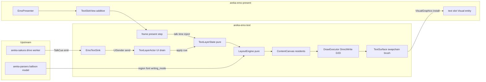
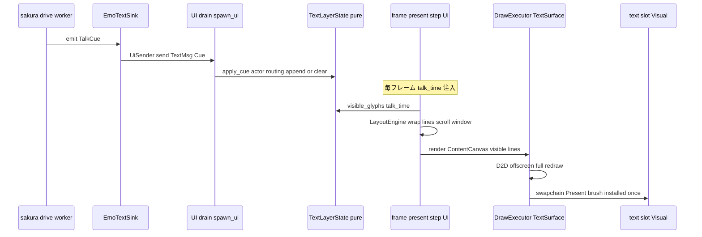
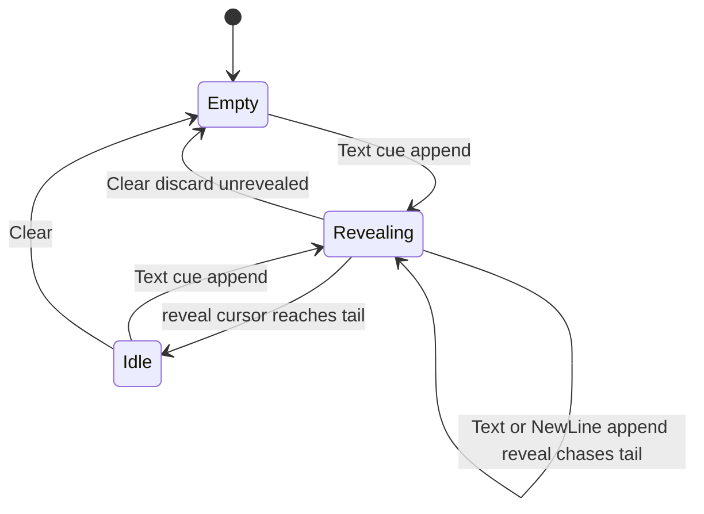

# Technical Design: areka-P0-emo-text-layer

> **crate↔spec 名マッピング（確定・2026-07-09 要件ディスカッション #1 裁定）**: 本 spec/feature 名は `areka-P0-emo-text-layer`、実装 crate 名は **`areka-emo-text`**（emo トラック第4の独立 crate・atlas/compose/present の単一トークン命名に倣う）。以降、本書で「本 crate」は `crates/areka-emo-text` を指す。

## Overview

**Purpose**: sakura ✅ が発火する Balloon 向け `TalkCue`（Text/NewLine/Clear）を受け、emo-present ✅ が予約したバルーン上のスロット（`emo-text-layer-slot`）に文字を実際に描く層を実装する。M-boot「emo2 が喋る」の可視部分を完成させる。

**Users**: ゴースト実行環境（emo2-boot が sink を `GhostBootOptions.text_sink` へ結線）と、開発者（専用 example による単一 pass/fail 観測）。

**Impact**: 新 crate `areka-emo-text` の追加。既存 crate への変更は additive 2 点のみ——emo-present へ text_slot 到達手段の公開増分、areka-parsers へ `writing_mode` 転記フィールド増分。`crates/areka` の既存ファイルは不変（window-placement 並走保護）。

### Goals

- sakura の `TextSink` 契約を実装する sink 型と、UI スレッド配送・描画までの経路を成立させる（R1・R10.1）
- cue 列→行/グリフ状態の純粋状態機械と、DirectWrite metrics 非依存のレイアウト決定部を決定論テスト可能に分離する（R2・R4.5・R7.5）
- typewriter 逐次表示を注入時刻駆動で実現する（R3）
- 縦書き/横書き両対応（`writing_mode` 2層マージ・軸読み替え正準表・DirectWrite 縦書きレシピ lift）（R5・R6）
- validrect あふれスクロール（全域再描画・可視窓決定/描画実行の分離シーム）（R7）
- emo 共有描画基盤（統一 resident/行列モデル・M1 実装住人はテキストのみ）（R8）
- DPI/スケールを最初から正しく扱う（画像座標空間レイアウト＋合成スケール共有点）（R4.6・R10.4・R11.9）
- 専用 example による単一 pass/fail 観測（R11）

### Non-Goals

- 選択肢表示（choice-render／M-dialogue）——行レイアウト/クリック範囲の構造シームのみ（R9.4）
- `\f` 系装飾・回転テキスト・ポップアート装飾の実挙動（M2・型シームのみ）（R8.3・R10.3）
- `text_orientation`／`text_combine_upright` の実挙動（M2・予約名の記録のみ）（R5.7）
- viewbox 合成スクロール（`areka-P0-emo-text-viewbox`）——描画実行差し替えシームまで（R7.4）
- sink の main 結線（emo2-boot）・sakura の cue 時刻改変（R10.1・R10.2）
- トーク上書きガード（`\t`/`nouserbreakmode`——上流 kanade の責務）（R3.6・R10.5）
- バルーン枠の描画・キャッシュ（emo-present 済み）・surface 合成（emo-compose 不変）（R8.6）
- `\_b` 画像の実挙動（fixture 実測で未使用＝住人型シームのみ）（R8.5）
- `\b` バルーン切替時のテキスト状態遷移（ukadoc 正典無言＋M-boot 対象外を design 調査で確認済み・実装しない）

## Boundary Commitments

### This Spec Owns

- **新 crate `crates/areka-emo-text` の全体**: sink 型・UI 配送結線・純粋状態機械・writing_mode 解釈・レイアウト決定・共有描画基盤（ContentCanvas/Resident）・DirectWrite/D2D 描画実行・自前供給面・専用 example。
- **`writing_mode` キーの解釈**（値の意味論・未知値 fallback・方向写像・軸読み替え正準表）。parser は転記のみ。
- **縦書き軸読み替え規則の正準**（本書 Data Models「軸読み替え正準表」が areka の正典。SSP de-facto 不在領域）。
- **per-glyph typewriter pacing**（リビール時刻式・`char_wait` 既定値）。
- **emo-present への additive 公開増分の形**（`TextSlotView`）と **areka-parsers への additive 転記増分の形**（`BalloonModel.writing_mode`）——増分の実装は各 crate 内だが仕様の所有は本 spec。

### Out of Boundary

- バルーン窓の生成・配置（window-placement）／バルーン枠の合成・表示・キャッシュ・マスク（emo-present 本体）／surface 合成（emo-compose——**改変しない**。共有 canvas 抽出・シェル/バルーン compositor 融合・背景 SERIKO 住人化は後続 roadmap ユニット）。
- `GhostBootOptions.text_sink` への注入・実 talk 経路の結線（emo2-boot）。
- cue の発火時刻・talk 中断可否の決着（sakura／kanade）。emo は届いた cue 列を後出し優先で忠実適用するのみ。
- 合成スケール k の算出（モニタ DPI×`descript_balloon.dpi` からの導出は emo-present／placement の将来責務。本層は k を消費するのみ）。

### Allowed Dependencies

- `areka-sakura`（`TextSink`/`TalkCue`/`ActorKey`/`CueCommand`——契約正本・再定義しない）
- `areka-parsers`（balloon model：`Origin`/`WordWrapPoint`/`ValidRect`/`Font`/`FontColor`＋2層マージ＋`writing_mode` 転記増分）
- `areka-actor`（`spawn_ui`/`UiSender`——UI 配送の正本）
- `areka-emo-present`（`TextSlotView` 公開増分・example 用 `build_balloon_target`/`EmoPresenter`）
- `wintf`（`GraphicsCore`・`com/dwrite` 拡張 trait・`com/dxgi::create_composition_swap_chain`・`CompositorInteropExt`・ECS コンポーネント `Visual`/`VisualGraphics`/`Arrangement`。**wintf のテキスト widget（`Typewriter`/`Label`/`draw_typewriters` 系 system）は実行時依存にしない**——縦書き `Set*Direction` レシピは本 crate へ lift（複製）する）
- `bevy_ecs`／`windows`／`windows-numerics`／`thiserror`／`tracing`（既存 workspace 標準）

**依存方向（強制）**: `areka-parsers / areka-sakura / areka-actor → areka-emo-text ← wintf`、`areka-emo-atlas → areka-emo-compose → areka-emo-present → areka-emo-text`。逆方向 import（emo-present → emo-text 等）は実装・レビューでエラーとして扱う。crate 内は「純粋層（state/writing/region/layout/canvas＝windows 非依存）→ COM 層（draw/surface）→ 結線層（sink/actor）」の一方向。純粋層モジュールに `windows` の import が現れたらレビューエラー。

### Revalidation Triggers

- `TalkCue`/`CueCommand`/`ActorKey` の形が変わる（sakura 側変更）→ sink/状態機械の再検証
- `VisualMount` の text_slot 構成（Name/兄弟 z 順/空 Visual）が変わる → 装着経路の再検証
- emo-present の物理 1:1 表示契約（合成スケール k=1.0 恒常）が破れる（DPI スケーリング導入）→ `TextSlotView.scale` の供給値のみ変更（本層のレイアウトは画像空間ゆえ不変が設計保証。ただし example の実 DPI 観測は再実行）
- balloon model の座標規約（負値=反対辺基準・`Option` 独立成分）が変わる → region 解決の再検証
- 下流（emo-text-viewbox／choice-render／emo2-boot）は本 spec の「可視窓決定/描画実行分離シーム」「行レイアウト返却シーム」「sink 型」の形状変更で再検証を要する

## Architecture

### Existing Architecture Analysis

- **差し込み先**: emo-present `VisualMount` が窓 Entity の子として `text_slot`（`Name("emo-text-layer-slot")`＋`Visual::default()` のみ・surface entity の兄弟・Children 先頭＝上位 z）を予約済み（`mount.rs:129-135`）。`VisualMount`/`text_slot()` は `pub(crate)`＝公開面ゼロ→本 spec が additive 増分を所有（R9.2）。
- **表示の物理契約**: emo-present は合成済みビットマップを**物理 px 原寸 1:1** で表示する（`physical_arrangement`・`SetSize` とも物理 px・taffy/BoxStyle 非経由・論理 px 概念なし）。wintf に Visual 段のスケール（`RasterizationScale` 等）は存在しない。→ 本層もこの「物理 px 直接」契約に乗る。
- **donor パターン**: emo 自前 brush を持つ有効な `VisualGraphics` を同一バンドルで insert すれば wintf `Visual::on_add` の既定値上書きと `deferred_surface_creation_system` の競合を回避できる（mount.rs 実証済み）。`GraphicsCommandList` を挿入しない限り wintf の widget 描画経路は発火しない。
- **UI 配送**: `areka_actor::spawn_ui`（handler は `!Send` 可・同期実行・終了経路は Ok(Break)／全 Sender drop の 2 つ・個別 Err は error!＋継続）が正本。
- **wintf テキスト資産**: `TextDirection` 4 方向・縦書きレシピ（`SetReadingDirection(TOP_TO_BOTTOM)`＋`SetFlowDirection(RIGHT_TO_LEFT)`）・`IDWriteTextFormat/Layout` 生成拡張 trait（`com/dwrite.rs` の `DWriteFactoryExt`）は実証済み。widget system 群（`Typewriter` 等）は自前 IR 前提で `TalkCue` を受けない→ system は依存せず、レシピを lift。

### Architecture Pattern & Boundary Map



**Architecture Integration**:

- **Selected pattern**: 「worker 受信 → UiSender 配送 → UI ドレイン（状態更新・純粋）→ フレーム提示ステップ（時刻注入・レイアウト・描画・装着）」の二段消費。描画は UI スレッド固定（WUC/D2D・並行モデル正本）。
- **純粋核の隔離**: state/writing/region/layout/canvas は `windows` 非依存＝決定論檻（R2.4/R4.5/R7.5/R11.6）。COM を触るのは draw/surface のみ。
- **既存パターン保存**: sink→配送は seriko donor の写し（中間 worker アクターは省略——`emit` は既に sakura worker 上で走るため `UiSender` が配送口そのもの。R1.3 の「受信端ワーカー・配送口 spawn_ui/UiSender」を最小構成で満たす）。装着は mount.rs の donor パターン（自前 brush＋有効 VisualGraphics）の写し。
- **New components rationale**: 状態機械・レイアウト核・供給面はコードベースに先例なし（gap 分析 R2/R4/R7 Missing）。供給面は emo-present `chain.rs` が `pub(crate)` かつ公開増分を text_slot 到達手段に限る裁定のため、wintf の pub ヘルパ（`create_composition_swap_chain`/`CompositorInteropExt`）から同型を本 crate に作る（lift）。
- **Steering compliance**: emo 自前合成哲学（wintf は窓/surface 手渡しと donor）・log-first（安易な panic 禁止）・決定論テスト網羅・32bit 制約非適用（本体 x64+arm64）。

### Technology Stack

| Layer | Choice / Version | Role in Feature | Notes |
|-------|------------------|-----------------|-------|
| Text | DirectWrite（`windows` 0.62.2・`IDWriteFactory2`） | TextFormat/TextLayout 生成・縦書き `Set*Direction`・cluster metrics | レシピは wintf から lift。factory は `GraphicsCore::dwrite_factory()` |
| Drawing | Direct2D（`ID2D1DeviceContext`） | オフスクリーン D3D テクスチャへ `DrawTextLayout`（全域再描画） | オフスクリーン D2D ターゲット＝readback 可能な決定論検証点 |
| Presentation | DXGI swapchain＋WUC `SurfaceBrush` | 自前供給面→text_slot Visual へ brush 装着 | `SwapChainPresenter` と同型（wintf pub ヘルパから lift） |
| Messaging | `areka-actor`（`spawn_ui`/`UiSender`） | worker→UI 配送 | Close variant＋全 drop の 2 経路終了 |
| ECS | `bevy_ecs` 0.18（wintf World） | slot entity への `VisualGraphics`/`Arrangement` insert | NonSend runtime＋フレーム提示ステップ |
| Parsing | `areka-parsers` balloon | 領域・フォント・`writing_mode` 2層マージ | parser は転記に徹する（解釈は本層） |

## File Structure Plan

### Directory Structure

```
crates/areka-emo-text/
├── Cargo.toml                  # workspace glob（crates/*）で自動登録・edition.workspace
├── src/
│   ├── lib.rs                  # crate doc（crate↔spec 名マッピング明記）・pub use・層規律の記載
│   ├── sink.rs                 # EmoTextSink（TextSink 実装・TextMsg 定義）        [結線層]
│   ├── actor.rs                # spawn_emo_text（spawn_ui 結線・UI ドレイン・Close 規律） [結線層]
│   ├── state.rs                # TextLayerState / ActorTextState / RevealSchedule（純粋状態機械）
│   ├── writing.rs              # WritingMode（2層マージ値の解釈・方向写像・M2 予約名の記録）
│   ├── region.rs               # TextRegion（画像座標解決・負値=反対辺・クランプ正準・ScaleContract）
│   ├── layout.rs               # LayoutEngine / GlyphMetrics trait / FixedMetrics（折返し・行送り・可視窓決定＝純粋）
│   ├── canvas.rs               # ContentCanvas / Resident / RegionTransform / TextEffects（R8 共有描画基盤）
│   ├── draw.rs                 # DrawExecutor（DirectWrite レシピ lift・DWriteMetrics・全域再描画） [COM 層]
│   └── surface.rs              # TextSurface（自前 swapchain 供給面・brush 装着・read_back）      [COM 層]
├── examples/
│   ├── emo-text-layer.rs       # 観測用専用 example（注入時刻駆動・pass/fail 出力・R11）
│   └── fixtures/
│       └── emo2-vertical/      # 縦書き観測用の example ローカル fixture 変種
│           ├── descript.txt    # writing_mode,vertical_rl ＋ 有意な wordwrappoint.y（基層）
│           └── balloons0s.txt  # 画像別上書き層（2層マージの実観測・R11.4）
└── tests/
    └── pipeline_test.rs        # 結線層の統合テスト（状態機械×レイアウト×可視窓の通しシナリオ）
```

純粋層モジュール（state/writing/region/layout/canvas）は `windows` を import しない。単体テストは各モジュール in-source `#[cfg(test)]`。

### Modified Files

- `crates/areka-parsers/src/balloon/model.rs` — `BalloonModel` へ `writing_mode: Option<String>` フィールド＋read-only accessor `writing_mode() -> Option<&str>` を additive 追加（生文字列の転記・解釈しない）。`new(...)` の引数追加は workspace 内部利用のみ（`#[non_exhaustive]` ゆえ外部構築不可）で許容（R5.6）。**注意**: `model.rs:6` の doc は既に固有名化済み——二重修正しない。
- `crates/areka-parsers/src/balloon/parse.rs` — `map_merged`（L64-96）へ `writing_mode` キーの取り出し 1 本を追加（2層マージ機構自体は変更不要・後勝ちはマージ済み map の性質で自動成立）。
- `crates/areka-emo-present/src/presenter.rs` — `EmoPresenter::text_slot_view(&self, target: TargetId) -> Option<TextSlotView>` を additive 追加（mount 未生成＝初回 ShowSurface 前は `None`）。
- `crates/areka-emo-present/src/command.rs`（または presenter.rs 内）— `pub struct TextSlotView`（`#[non_exhaustive]` 相当の非公開フィールド＋accessor）を追加。
- `crates/areka-emo-present/src/lib.rs` — `pub use` 1 行追加。

`crates/areka` 配下・`crates/areka-emo-compose` 配下は**一切変更しない**（R8.6・R11.7・並走保護）。

## System Flows

### cue 受信から描画まで（横断シーケンス）



- **ゲート条件**: `TextSlotView` は初回 `ShowSurface` 後にのみ得られる（mount 遅延生成）。フレーム提示ステップは未解決 actor の binding を毎フレーム再試行し、解決までは状態蓄積のみ行う（描画スキップ・debug ログ）。
- **後出し優先**: cue はドレイン時に即時適用（Text/NewLine は追記・Clear は未リビール分含め全消去）。`at` はリビール開始の下限としてのみ作用（R3.4/R3.6）。

### typewriter リビール（状態遷移）



リビール時刻式（決定論の正準・R3.4/R3.5）: グリフ i のリビール時刻 `r_i = max(r_{i-1} + char_wait, at(chunk(i)))`（先頭グリフは `r_0 = at(chunk(0))`）。可視数 `visible(t) = |{ i : r_i <= t }|`。`at` は下限（それより早く可視化しない）・リビールカーソルは本層ペース（`char_wait`）でバッファ末尾を追う（長文時は遅延しうる・無損失）。Clear は schedule ごと初期化。

## Requirements Traceability

| Requirement | Summary | Components | Interfaces / Flows |
|-------------|---------|------------|--------------------|
| 1.1, 1.2, 1.3 | TextSink 実装・UI 配送・worker/UI 分離 | EmoTextSink・TextLayerActor | `TextSink::emit`→`UiSender::send`→UI drain／cue 受信フロー |
| 1.4, 1.5 | クリーン終了・失敗の log-first | TextLayerActor | Close variant＝Ok(Break)・全 Sender drop＝正常終了・個別 Err＝error!＋継続 |
| 1.6 | ActorKey 別状態への振り分け | TextLayerState・ActorRouting | `ActorKey → ActorTextState` map・`ActorKey → TextSlotBinding` map |
| 2.1, 2.2, 2.3 | Text 追記・NewLine 改行・Clear 全消去（後出し優先） | TextLayerState | `apply_cue`（純粋遷移） |
| 2.4, 2.5 | 純粋・決定論 | TextLayerState・LayoutEngine | `windows` 非依存モジュール＋同一入力→同一結果の単体テスト |
| 3.1, 3.2, 3.3 | typewriter 1 文字ずつ・per-glyph 所有・注入時刻駆動 | RevealSchedule | `r_i` 式・`char_wait`（既定 0.05s・`TextLayerConfig`） |
| 3.4, 3.5, 3.6 | at=下限・決定論・後出し優先即時適用 | RevealSchedule・TextLayerState | リビール時刻式・`visible(t)`・Clear の未リビール破棄 |
| 4.1, 4.2 | Font 消費・ＭＳ ゴシック fallback | DrawExecutor・FontSpec | `Font.name` 欠落→`ＭＳ ゴシック`／height 欠落→12（ukadoc 既定） |
| 4.3, 4.4 | 領域消費・負値=反対辺基準 | TextRegion | `resolve(coord, extent)`（ukadoc *1 規約） |
| 4.5 | metrics 非依存決定部の分離 | LayoutEngine＋GlyphMetrics trait | FixedMetrics（構造テスト）／DWriteMetrics（実行時） |
| 4.6 | 画像座標空間レイアウト＋合成スケール適用 | ScaleContract・TextSurface | k＝`TextSlotView.scale`・物理寸＝画像寸×k・SetTransform(k) 一点適用 |
| 5.1, 5.2, 5.3, 5.4, 5.5 | writing_mode 受理・2層マージ・既定・warn fallback・方向写像 | WritingMode（writing.rs） | `WritingMode::resolve(&BalloonModel)`・写像表 |
| 5.6 | parser 転記フィールド additive | parsers 増分 | `BalloonModel::writing_mode() -> Option<&str>` |
| 5.7 | M2 予約名の記録 | writing.rs doc＋定数 | `text_orientation`/`text_combine_upright` を予約キー名として記録・実装しない |
| 6.1, 6.2, 6.3 | 横/縦の軸解釈・読み替え規則 | LayoutEngine（軸読み替え正準表を実装） | 軸読み替え正準表（Data Models） |
| 6.4 | 横書き先行でも抽象を最初から構造保持 | WritingMode・LayoutEngine | 方向写像・折返し軸・スクロール軸の切替点を型で保持 |
| 7.1, 7.2 | あふれスクロール・方向回転 | LayoutEngine（可視窓決定） | `visible_window(lines, region) -> first_visible` |
| 7.3, 7.4 | 全域再描画・可視窓/描画分離シーム | DrawExecutor | 可視窓（純粋）→ render（実行）の 2 段（viewbox は render 差し替えのみ） |
| 7.5 | スクロール発火の構造テスト | LayoutEngine | FixedMetrics でのあふれ判定単体テスト |
| 8.1, 8.2, 8.3 | 行列変換付き領域・M1 恒等/平行移動・M2 装飾シーム | RegionTransform・TextEffects | `Matrix3x2` 相当（M1 は translation のみ生成）・`TextEffects`（予約） |
| 8.4, 8.5 | 統一 resident モデル・M1 実装住人はテキストのみ | ContentCanvas・Resident | `ResidentContent::{GlyphRun, Image(シーム), Surface(シーム)}` |
| 8.6 | emo-compose と収束可能な統一形・改変しない | canvas.rs | 行列原則の同型設計（emo-compose 依存なし・改変なし） |
| 9.1, 9.2 | 予約スロット装着・additive 公開増分 | TextSlotView（emo-present 増分）・TextSurface | `EmoPresenter::text_slot_view`・brush 装着 |
| 9.3 | 再合成を強要しない独立更新 | TextSurface | 自前 swapchain Present のみ（emo-compose 再駆動なし） |
| 9.4 | choice-render 再利用シーム | LineLayout 返却型 | `LayoutEngine` の出力 `PositionedLine`（行矩形＝クリック範囲導出の素材・導出は実装しない） |
| 9.5 | actor→target スロット振り分け | ActorRouting | `ActorKey → TextSlotBinding`（結線側供給） |
| 10.1 | sink 型（TextSink+Clone+Send+'static） | EmoTextSink | `GhostBootOptions.text_sink` 注入可能形（注入は emo2-boot） |
| 10.2 | pacing が cue 時刻に影響しない前提 | RevealSchedule | sakura 改変なし（増分申し送りシームは research.md 記録） |
| 10.3 | \f／disable.font.* 型シーム | TextEffects・FontSpec | 実挙動なし（fixture 実測で未使用確認済み） |
| 10.4 | DPI を最初から正しく扱う・契約共有 | ScaleContract | 画像/物理の 2 空間のみ（論理 px 不在）・共有点＝`TextSlotView.scale` |
| 10.5 | 上書きガード非実装（kanade 責務） | TextLayerState | 後出し優先の忠実適用のみ |
| 11.1, 11.2, 11.3, 11.4, 11.5 | example: 注入駆動・typewriter・改行/スクロール・縦横切替・全消去 | emo-text-layer.rs example | fixture cue 列＋`--vertical` 切替＋fixture 変種 2 層 |
| 11.6 | レイアウト決定論部の構造テスト | 各純粋モジュール単体テスト | FixedMetrics・merge 解決・既定フォント単体テスト |
| 11.7 | crates/areka 不変・新規追加のみ | File Structure Plan | example は本 crate 配下（衝突面ゼロ） |
| 11.8 | 複数 actor の振り分け観測 | example＋ActorRouting | \0/\1 の 2 target 観測（fixture script 準拠） |
| 11.9 | DPI/スケールの検証 | ScaleContract テスト＋example | k≠1 の純粋写像テスト＋実 DPI での目視/readback 観測 |

## Components and Interfaces

| Component | Domain/Layer | Intent | Req Coverage | Key Dependencies | Contracts |
|-----------|--------------|--------|--------------|------------------|-----------|
| EmoTextSink | 結線層 | TextSink 実装・cue を UI へ送出 | 1.1, 1.5, 10.1 | areka-sakura (P0)・UiSender (P0) | Service |
| TextLayerActor | 結線層 | UI ドレイン・状態更新・終了規律 | 1.2, 1.3, 1.4, 1.6 | areka-actor spawn_ui (P0) | Event, State |
| TextLayerState | 純粋層 | cue→行/グリフ状態の純粋遷移 | 2.1–2.5, 3.4–3.6, 10.5 | なし（std のみ） | State |
| RevealSchedule | 純粋層 | 注入時刻駆動のリビール時刻式 | 3.1–3.5 | なし | State |
| WritingMode | 純粋層 | writing_mode 解釈・方向写像 | 5.1–5.5, 5.7, 6.4 | BalloonModel (P0) | Service |
| TextRegion / ScaleContract | 純粋層 | 画像座標解決・負値・クランプ・k 契約 | 4.3, 4.4, 4.6, 10.4 | BalloonModel (P0) | Service |
| LayoutEngine + GlyphMetrics | 純粋層 | 折返し・行送り・可視窓決定 | 4.5, 6.1–6.3, 7.1, 7.2, 7.4, 7.5, 9.4 | WritingMode・TextRegion | Service |
| ContentCanvas / Resident | 純粋層 | emo 共有描画基盤（統一 resident/行列） | 8.1–8.6 | LayoutEngine | State |
| DrawExecutor | COM 層 | DirectWrite レシピ lift・全域再描画 | 3.1, 4.1, 4.2, 7.3 | GraphicsCore (P0)・DirectWrite (P0) | Service |
| TextSurface | COM 層 | 自前供給面・brush 装着・read_back | 9.1, 9.3 | wintf dxgi/wuc ヘルパ (P0) | Service |
| TextSlotView（emo-present 増分） | 隣接 crate | text_slot 到達手段の最小公開 | 9.1, 9.2, 9.5 | EmoPresenter (P0) | Service |
| writing_mode 転記（parsers 増分） | 隣接 crate | 生値転記フィールド | 5.6 | balloon parse (P0) | State |
| example emo-text-layer | 観測 | 単一 pass/fail 観測 | 11.1–11.9 | 上記全部＋build_balloon_target | — |

### 結線層

#### EmoTextSink（sink.rs）

| Field | Detail |
|-------|--------|
| Intent | sakura の `TextSink` を実装し、Balloon 向け cue を UI ドレインへ非ブロック送出する |
| Requirements | 1.1, 1.5, 10.1 |

**Responsibilities & Constraints**
- `TextSink + Clone + Send + 'static` を満たす（`GhostBootOptions.text_sink` へ注入可能な形・注入自体は emo2-boot）。
- `emit` は sakura drive の worker スレッド上で呼ばれる＝受信端はワーカー側（R1.3 の前半）。中間アクターは設けない（`UiSender` が配送口そのもの——synthesis の簡素化判断・seriko と異なり worker 側での解決処理が無い）。
- 送信失敗（UI アクター停止後）は `tracing::error!` のみ・panic しない・`emit` は infallible 契約に従い戻り値なし（R1.5）。

**Contracts**: Service [x]

```rust
/// TextMsg: UI ドレインへの搬送 envelope（Send + 'static）
pub enum TextMsg {
    /// sakura からの cue（後出し優先で即時適用される）
    Cue(TalkCue),
    /// 終了指示（結線側が talk 経路の畳み込みで送る・Ok(Break) 経路）
    Close,
}

#[derive(Clone)]
pub struct EmoTextSink { tx: UiSender<TextMsg> }

impl TextSink for EmoTextSink {
    fn emit(&mut self, cue: TalkCue) { /* tx.send(TextMsg::Cue(cue)); Err は error! のみ */ }
}
impl EmoTextSink {
    /// 終了指示（emit と同じ口・失敗は error! のみ）
    pub fn close(&self);
}
```
- Preconditions: `spawn_emo_text` 済み（UiSender 取得済み）。
- Postconditions: cue は FIFO で UI ドレインへ到達（unbounded・非ブロック）。
- Invariants: `emit` はいかなる失敗でも panic しない。

#### TextLayerActor（actor.rs）

| Field | Detail |
|-------|--------|
| Intent | `spawn_ui` で UI ドレインを起動し、cue を純粋状態へ適用する。終了規律を所有 |
| Requirements | 1.2, 1.3, 1.4, 1.6 |

**Responsibilities & Constraints**
- UI スレッド（pump スレッド）から `spawn_emo_text` を呼ぶ（`spawn_ui` の前提。誤用は log-first——基盤規約に従う）。
- handler は `Rc<RefCell<TextLayerRuntime>>` を捕捉（`!Send` handler 可）。cue 適用は純粋状態の更新のみで World に触れない。World への装着・描画は**フレーム提示ステップ**（下記）が担う——描画は UI スレッド固定の graphics schedule 系列に揃える。
- 終了経路はちょうど 2 つ: `TextMsg::Close` 受領＝`Ok(ControlFlow::Break(()))`、全 `UiSender`（＝全 `EmoTextSink` クローン）drop＝drain 正常終了（R1.4・error ログなし）。個別メッセージの処理失敗は `Err` 戻し→基盤が error!＋継続（R1.5）。

**Contracts**: Service [x] / Event [x] / State [x]

```rust
/// TextLayerRuntime: UI スレッド所有の一点（NonSend）。
/// 純粋状態・binding・COM 資源を束ねる。
pub struct TextLayerRuntime {
    state: TextLayerState,                          // 純粋状態機械（actor 別）
    routing: HashMap<ActorKey, TextSlotBinding>,    // actor → 装着先（結線側が登録）
    surfaces: HashMap<ActorKey, TextSurface>,       // actor 別の自前供給面（遅延生成）
    config: TextLayerConfig,                        // char_wait / line_pitch 係数 等
    layout_input: HashMap<ActorKey, ResolvedBalloonText>, // writing_mode/region/font の解決済み束
}

/// actor の装着先（結線側が TextSlotView から構築して routing へ登録する・actor.rs 定義）
pub struct TextSlotBinding {
    pub slot: Entity,            // 予約スロット（emo-text-layer-slot）
    pub window: Entity,          // 装着先の窓
    pub scale: f32,              // 合成スケール k（TextSlotView.scale 由来）
    pub surface_size: (u32, u32),// バルーン surface 物理原寸（TextSurface/swapchain の物理化に使用）
    /// 画像座標空間の原寸（負値=反対辺解決・TextRegion::resolve の入力）。
    /// **構築時に一点導出**: `image_size = round(surface_size / k)`（k=1.0 恒常の現行契約では
    /// surface_size と同値）。TextRegion::resolve へ物理 px を渡すのはレビューエラー
    /// （2 空間モデルの綻び目をここで構造閉塞——validation Issue 2 対応）。
    pub image_size: (u32, u32),
}

/// 結線 API（UI スレッドから呼ぶ）
pub fn spawn_emo_text(
    runtime: Rc<RefCell<TextLayerRuntime>>,
) -> Result<(EmoTextSink, wintf_winmsg_executor::JoinHandle<()>), UiSpawnError>;

/// フレーム提示ステップ（毎フレーム UI スレッドで呼ぶ・example/emo2-boot が駆動）:
/// talk_time は注入時刻（talk 起点相対秒・実時間 sleep 不使用）
pub fn present_frame(
    runtime: &mut TextLayerRuntime,
    world: &mut World,
    talk_time: f64,
) -> Result<(), TextLayerError>;
```
- Preconditions: `present_frame` は UI スレッド・`TextSlotBinding` 解決後に描画（未解決 actor は蓄積のみ＋debug ログで再試行）。
- Postconditions: リビール進行分が可視化される。装着済み actor のグリフ更新は emo-compose を再駆動しない（R9.3）。
- Invariants: 時刻は常に注入（`talk_time`）——`Instant::now()` を内部で読まない（R3.3）。

**Implementation Notes**
- Integration: `TextSlotBinding` は `TextSlotView`（emo-present 増分）から結線側が構築して `routing` へ登録。初回 `ShowSurface` 前は `text_slot_view` が `None` を返すため、結線側は表示確立後に登録するか、`present_frame` 内の遅延再解決クロージャを登録する。
- Validation: Close→クリーン終了・全 drop→クリーン終了・handler Err→継続を統合テストで檻化（actor-foundation の toy(b) パターン）。
- Risks: `spawn_ui` の UI スレッド誤用は呼出時検出不能（基盤既知リスク・debug! 診断で緩和）。

### 純粋層（windows 非依存・決定論檻）

#### TextLayerState / RevealSchedule（state.rs）

| Field | Detail |
|-------|--------|
| Intent | cue 列→表示テキストの行/グリフ状態への純粋遷移と、注入時刻駆動リビール |
| Requirements | 1.6, 2.1, 2.2, 2.3, 2.4, 2.5, 3.1, 3.2, 3.3, 3.4, 3.5, 3.6, 10.5 |

**Responsibilities & Constraints**
- `ActorKey → ActorTextState` の map（R1.6）。未知 actor の cue は状態を lazily 生成して蓄積（無損失・描画は binding 解決後）。
- 後出し優先の即時適用: Text＝追記・NewLine＝改行マーカー追記・Clear＝未リビール分含む全消去（上書きガードは持たない・R10.5）。
- `CueCommand::Choice` は M1 では `warn!`（actor ごと初回のみ）＋無視（choice-render シーム・状態は汚さない）。
- グリフ単位は Rust の `char`（M1 正準。書記素クラスタ結合は M2 検討事項として記録——emo2 fixture は結合文字を使用しない）。

**Contracts**: State [x]

```rust
pub struct TextLayerState { actors: BTreeMap<ActorKey, ActorTextState> }

pub struct ActorTextState {
    items: Vec<TextItem>,        // 追記順の正本（グリフ／改行マーカー）
    reveal: RevealSchedule,      // per-glyph リビール時刻列
}

pub enum TextItem {
    Glyph { ch: char },
    LineBreak { ratio: f32 },    // CueCommand::NewLine { ratio } の転写（\n=1.0/\n[half]=0.5）
}

impl TextLayerState {
    /// cue の純粋適用（DirectWrite 非依存・決定論）
    pub fn apply_cue(&mut self, cue: &TalkCue, config: &TextLayerConfig);
    /// 注入時刻 t での actor 別可視グリフ数（決定論・R3.5）
    pub fn visible_glyphs(&self, actor: &ActorKey, t: f64) -> usize;
}
```
- Invariants: 同一 cue 列＋同一時刻列→同一状態・同一可視数（R2.5/R3.5）。リビール時刻式は System Flows 節の正準式。

#### WritingMode（writing.rs）

| Field | Detail |
|-------|--------|
| Intent | `writing_mode` 宣言の解釈（2層マージ済み値→方向・軸の写像） |
| Requirements | 5.1, 5.2, 5.3, 5.4, 5.5, 5.7, 6.4 |

**Contracts**: Service [x]

```rust
#[derive(Clone, Copy, PartialEq, Eq, Debug, Default)]
pub enum WritingMode {
    #[default]
    HorizontalTb,   // 既定（SSP 互換・マーカー無し）
    VerticalRl,     // 日本語縦書き（行内 上→下・行送り 右→左）
    VerticalLr,
}

impl WritingMode {
    /// BalloonModel の転記値（2層マージ後勝ち解決済み）から解釈する。
    /// 未知値は warn! ＋ HorizontalTb フォールバック（R5.4）
    pub fn resolve(model: &BalloonModel) -> WritingMode;
}

/// M2 予約キー（記録のみ・実装しない・R5.7）
pub const RESERVED_KEY_TEXT_ORIENTATION: &str = "text_orientation";
pub const RESERVED_KEY_TEXT_COMBINE_UPRIGHT: &str = "text_combine_upright";
```

- 2層マージは balloon-parse の実装済み機構に全面依存する: `parse(descript, image)` が descript 基層＜画像別後勝ちで `writing_mode` を解決済みの単一値として転記する（本層は転記値を読むだけ・R5.2）。
- DirectWrite への写像（lift したレシピ・draw.rs で消費）: `HorizontalTb`→Reading LEFT_TO_RIGHT＋Flow TOP_TO_BOTTOM／`VerticalRl`→Reading TOP_TO_BOTTOM＋Flow RIGHT_TO_LEFT／`VerticalLr`→Reading TOP_TO_BOTTOM＋Flow LEFT_TO_RIGHT（いずれも Alignment LEADING＋Paragraph NEAR。wintf `typewriter_layout.rs:116-147` 実証済みレシピの複製）。

#### TextRegion / ScaleContract（region.rs）

| Field | Detail |
|-------|--------|
| Intent | balloon 座標の画像座標空間解決（負値・クランプ）と DPI/スケール契約の型 |
| Requirements | 4.3, 4.4, 4.6, 10.4 |

**Responsibilities & Constraints**
- **座標空間は 2 つだけ**（論理 px を存在させない——記憶 areka-window-placement-dpi-coordinate-defect の教訓の構造化）:
  - **画像座標空間（image px）**: descript_balloon の全座標（origin/wordwrappoint/validrect）と `font.height` の単位。作者基準 DPI＝`descript_balloon.dpi`（省略時 96・ukadoc 正典）。レイアウト決定はすべてこの空間で行う（R4.6 前半）。
  - **物理座標空間（physical px）**: text_slot・swapchain・窓の単位。`物理 = 画像 × k`。
- **k（合成スケール）の共有点＝`TextSlotView.scale`**: バルーン surface と同一の合成スケールを emo-present が供給する（現行の物理 1:1 表示契約では恒常 1.0。将来モニタ DPI M・作者 DPI D で k=M/D を導入するのは emo-present/placement の責務——本層は消費のみ）。テキストとバルーン画像が同じ k を共有するため任意 DPI で整合する（R4.6 後半）。
- **負値=反対辺基準**（ukadoc 脚注 *1 正典: 「マイナス座標はベース画像の右下からの相対」・literal 負値は `--数値`）: `resolve(v, extent) = if v >= 0 { v } else { extent + v }`。fixture 実測（validrect.bottom,-56 等）と一致。
- **origin クランプ正準（areka 独自・本書が正典）**: 描画開始点＝`clamp(resolve(origin), validrect)`。成分 `None` または validrect 外は書字開始角（正準表参照）へ寄せる。fixture（origin 0,0・validrect.left 36/top 46）→開始点 (36,46)＝SSP 表示実態と整合。

**Contracts**: Service [x]

```rust
/// 画像座標空間の値（単位を型 doc で固定・論理 px は存在しない）
pub struct ImagePx(pub f32);
/// 物理座標空間の値
pub struct PhysicalPx(pub f32);

/// DPI/スケール契約（R4.6/R10.4 の一点定義）
pub struct ScaleContract {
    /// バルーン surface と同一の合成スケール k（TextSlotView.scale 由来・現行 1.0）
    pub scale: f32,
    /// descript_balloon.dpi（省略時 96・参考情報として保持。k の算出は上流責務）
    pub author_dpi: u32,
}

/// 解決済みテキスト領域（画像座標空間・validrect/origin/wordwrap 閾値）
pub struct TextRegion { /* validrect 絶対矩形・開始点・折返し閾値（軸解釈は WritingMode 依存） */ }

impl TextRegion {
    /// BalloonModel＋バルーン画像原寸（image px）＋WritingMode から解決する
    pub fn resolve(model: &BalloonModel, image_size: (u32, u32), mode: WritingMode) -> TextRegion;
}
```
- Invariants: `TextRegion` の全値は image px。physical への変換は TextSurface 生成と D2D SetTransform の**一点のみ**（k の多重適用・混在を構造排除）。

#### LayoutEngine + GlyphMetrics（layout.rs）

| Field | Detail |
|-------|--------|
| Intent | 折返し・行送り・スクロール可視窓の決定（metrics 注入で純粋・決定論） |
| Requirements | 4.5, 6.1, 6.2, 6.3, 7.1, 7.2, 7.4, 7.5, 9.4 |

**Responsibilities & Constraints**
- **metrics 依存/非依存の分離線（R4.5 の正準）**: 「グリフ送り幅・行高さ」だけを `GlyphMetrics` trait として注入し、**折返し位置・行送り・スクロール発火・可視窓決定のアルゴリズム自体は純粋**にする。構造テストは `FixedMetrics`（全角＝`font.height`・半角＝`font.height/2` の決定論値）を注入、実行時は `DWriteMetrics`（**測定専用 probe TextLayout** の cluster metrics 由来・draw.rs 所有・下記 probe 規約）を注入する。
- **probe 規約（測定順序の正準・design discussion #1 裁定 2026-07-10）**: `DWriteMetrics` の典拠は**未折返しの測定専用 TextLayout（probe layout）**とする——折返し決定の**前**に、描画と同一の TextFormat（フォント・サイズ・writing_mode 写像設定込み）で対象テキストを折返し無効寸（行内軸方向に十分大きい maxWidth/maxHeight）の probe layout として生成し、その cluster metrics から advance を得る（鶏卵の構造的切断）。**一致 invariant**: 同一 format・同一テキスト内容なら probe の advance と描画行 TextLayout の advance は同値——この invariant をプロポーショナル/カーニングフォントを含むテストで檻化する（乖離検出＝invariant 違反として原因を修正する・クリップで隠さない）。probe は確定行単位でキャッシュ可（追記単調ゆえ確定行の metrics は不変）。
- 可視窓決定（純粋）と描画実行の分離（R7.4）: `visible_window(lines, region) -> VisibleWindow`（先頭可視行 index＋行内オフセット）が唯一のスクロール決定点。emo-text-viewbox はこの出力を「クリップ視窓＋内容オフセット」に写像して描画実行だけを差し替える。
- スクロールは**行単位・即時**（アニメなし）を M1 正準とする（ukadoc はスクロール粒度を規定せず＝areka 裁量。`\![set,autoscroll,disable]`／arrow マーカーの存在から「あふれ時自動スクロール」自体は正典裏付け済み）。
- 出力 `PositionedLine`（行の画像空間矩形＋グリフ列＋グリフ別 advance 位置）は choice-render がクリック可能範囲導出に再利用できる形（R9.4・導出は実装しない）。

**Contracts**: Service [x]

```rust
/// グリフ送りの注入点（metrics 依存の唯一の口・R4.5）
pub trait GlyphMetrics {
    /// グリフの行内送り幅（image px）。writing_mode の行内軸方向の寸
    fn advance(&self, ch: char, font_height: f32) -> f32;
    /// 行送りピッチ（image px）。M1 正準: font.height * 1.25 を切上げ（TextLayerConfig の line_pitch 係数で調整可）
    fn line_pitch(&self, font_height: f32) -> f32;
}

/// 構造テスト用の決定論 metrics（全角=height・半角=height/2）
pub struct FixedMetrics;

pub struct LayoutEngine;
impl LayoutEngine {
    /// 折返し・行送りを解決して行列（PositionedLine 列）を得る（純粋）
    pub fn layout(
        items: &[TextItem], visible_count: usize,
        region: &TextRegion, mode: WritingMode,
        font_height: f32, metrics: &dyn GlyphMetrics,
    ) -> Vec<PositionedLine>;

    /// スクロール可視窓の決定（純粋・R7.4 分離シームの上半分）
    pub fn visible_window(lines: &[PositionedLine], region: &TextRegion, mode: WritingMode) -> VisibleWindow;
}

pub struct PositionedLine { /* 行矩形（image px）・グリフと行内位置・choice-render 再利用シーム */ }
pub struct VisibleWindow { pub first_visible_line: usize /* ＋ブロック軸オフセット */ }
```
- Invariants: 同一入力→同一出力（R2.5 系）。`FixedMetrics` と `DWriteMetrics` で折返し位置は異なってよいが、**アルゴリズム分岐は存在しない**（分離線の本旨）。

#### ContentCanvas / Resident（canvas.rs）——emo 共有描画基盤

| Field | Detail |
|-------|--------|
| Intent | 統一 resident/行列モデル（バルーン内容キャンバス）。M1 実装住人はテキストのみ |
| Requirements | 8.1, 8.2, 8.3, 8.4, 8.5, 8.6 |

**Responsibilities & Constraints**
- 描画面は「テキスト専用面」でなく**内容キャンバス**として型設計する（正典証拠: `\_b` の inline（テキストフロー住人）／x,y（背景層）／`--option=fixed`（スクロール時不動＝スクロール内容層＋固定層の二層）——ukadoc 実引用は research.md）。
- 住人＝「キャンバスに置かれる変換行列付き矩形コンテンツ」。グリフ（文字）・画像（`\_b`）・将来の SERIKO サーフェスを**同格**に扱える enum（R8.4）。M1 の実装住人はテキスト（GlyphRun）のみ・Image/Surface は型シーム（描画実行は `warn!`＋skip・R8.5）。
- 行列は emo-compose の surface 合成と同じ行列原則（element 配置＝D2D 変換行列）の同型＝将来収束可能な統一形（R8.6）。**M1 では emo-compose を改変せず、共有 canvas の抽出も行わない**（実体は本 crate 内に留める）。
- M1 の行列実挙動は恒等/平行移動のみ（コンストラクタが translation のみ生成・`debug_assert` で回転成分ゼロを表明・R8.2）。回転値・文字装飾は `TextEffects` 予約型（フィールドなし相当の `#[non_exhaustive]`・R8.3）。

**Contracts**: State [x]

```rust
/// バルーン内容キャンバス（image px 空間）
pub struct ContentCanvas {
    pub residents: Vec<Resident>,
    pub size: (f32, f32),          // validrect 寸（image px）
}

pub struct Resident {
    pub content: ResidentContent,
    pub transform: RegionTransform,   // M1: 恒等/平行移動のみ
    pub effects: TextEffects,         // M2 予約（アウトライン/多色/シャドウ/回転）
}

#[non_exhaustive]
pub enum ResidentContent {
    /// M1 唯一の実装住人: 1 行分のグリフ列（PositionedLine 由来）
    GlyphRun(GlyphRunContent),
    /// \_b 画像（型シームのみ・実挙動なし・R8.5）
    Image(ImageSeam),
    /// 将来の SERIKO サーフェス（シェル/バルーン融合ユニットが実装・R8.6）
    Surface(SurfaceSeam),
}

/// 変換行列付き領域（R8.1）。M1 は translation コンストラクタのみ公開
pub struct RegionTransform { /* 3x2 行列（windows 非依存の自前 [f32;6]）・rotation は M2 */ }

#[non_exhaustive]
pub struct TextEffects { /* M2 予約: outline/multicolor/shadow/rotation。M1 はフィールド未使用 */ }
```

### COM 層（UI スレッド専有）

#### DrawExecutor（draw.rs）

| Field | Detail |
|-------|--------|
| Intent | ContentCanvas の可視窓を DirectWrite/D2D で全域再描画する実行部 |
| Requirements | 3.1, 4.1, 4.2, 7.3 |

**Responsibilities & Constraints**
- **フォント解決（R4.1/R4.2）**: `Font.name` 欠落→`ＭＳ ゴシック`（全角表記・ukadoc 既定）／`Font.height` 欠落→12（ukadoc 既定）／`FontColor` 欠落→黒 (0,0,0)。フォント名のカンマ区切り複数指定は M1 では先頭のみ採用（SSP 拡張のフォールバック連鎖は型シーム・fixture は単一名）。
- **DirectWrite レシピ（lift・複製）**: `GraphicsCore::dwrite_factory()`（`IDWriteFactory2`）＋wintf `DWriteFactoryExt::create_text_format/create_text_layout` を用い、WritingMode 写像表どおり `SetReadingDirection`/`SetFlowDirection`/`SetTextAlignment(LEADING)`/`SetParagraphAlignment(NEAR)` を設定する。wintf のテキスト widget system（`Typewriter`/`draw_typewriters` 等）へは依存しない。
- **描画は行単位の TextLayout**: `PositionedLine` ごとに 1 つの `IDWriteTextLayout` を生成しキャッシュ（行内容が不変なら再利用・リビール中の行のみ都度更新）。可視化は「可視グリフ数までの部分文字列」で行う（typewriter 進行＝R3.1）。
- **全域再描画（R7.3）**: 毎更新、オフスクリーン D2D ターゲット（D3D テクスチャ）を透明 clear→可視窓の行を描画→TextSurface へ転送。スクロールも同経路（差分描画なし・SSP 忠実の確定裁定）。
- `DWriteMetrics`: **測定専用 probe TextLayout**（layout.rs の probe 規約——未折返し・描画と同一 TextFormat）の cluster metrics から `GlyphMetrics` を実装し LayoutEngine へ注入する（メトリクスの真実源は DirectWrite・アルゴリズムは純粋層・折返し決定より前に測定＝鶏卵なし）。描画行 TextLayout との advance 一致 invariant は統合テストで担保（Testing Strategy 参照）。
- **スケール適用の一点**: D2D ターゲットへ `SetTransform(scale(k))` を一度だけ適用（k＝ScaleContract.scale）。フォントサイズは `font.height`（image px＝96DPI 名目 DIP と同一視）をそのまま渡す。

**Contracts**: Service [x]

```rust
pub struct DrawExecutor { /* dwrite factory・D2D DC・行 TextLayout キャッシュ */ }
impl DrawExecutor {
    /// 可視窓を全域再描画して TextSurface の source へ焼く（失敗は error!＋Err・panic 禁止）
    pub fn render(
        &mut self, canvas: &ContentCanvas, window: &VisibleWindow,
        font: &ResolvedFont, mode: WritingMode, contract: &ScaleContract,
        surface: &mut TextSurface,
    ) -> Result<(), TextLayerError>;
}
```

#### TextSurface（surface.rs）

| Field | Detail |
|-------|--------|
| Intent | 自前 swapchain 供給面＋text_slot への brush 装着＋readback |
| Requirements | 9.1, 9.3（＋R11.9 の観測補助） |

**Responsibilities & Constraints**
- `SwapChainPresenter` と同型（wintf pub ヘルパ `create_composition_swap_chain`＋`CompositorInteropExt::CreateCompositionSurfaceForSwapChain` から本 crate 内に構築——emo-present `chain.rs` は `pub(crate)` のため複製。裁定どおり emo-present の公開増分は text_slot 到達手段に限る）。
- 物理寸＝`ceil(validrect 寸 × k)`。描画先＝D3D テクスチャ（オフスクリーン D2D ターゲット）→ `CopyResource(backbuffer)` → `Present(0)`。**readback 経路**（`CopyResource(staging)`→`Map(READ)`）を備え、example の pass/fail 判定と golden 系検証に使う（記憶 gpu-draw-verification-offscreen-d2d-target と同轍）。
- **装着（R9.1/R9.3）**: text_slot entity へ `VisualGraphics::new(sprite)`（自前 `SurfaceBrush` 装着済み SpriteVisual）＋`Arrangement`（物理 px 直接・offset＝validrect 原点×k）を insert する（mount.rs の donor パターンの写し・`GraphicsCommandList` は挿入しない＝wintf 描画系と競合しない）。装着は actor ごと初回のみ・以降のグリフ更新は swapchain `Present` のみ＝**surface 本体の再合成（emo-compose 再駆動）を強要しない**。
- slot の可視性・寿命は emo-present（VisualMount）の領分——本層は brush の中身だけを所有する。

**Contracts**: Service [x]

```rust
pub struct TextSurface { /* swapchain・source_tex（D2D ターゲット兼）・staging・SpriteVisual */ }
impl TextSurface {
    /// 初回装着（UI スレッド・&mut World）: slot entity へ VisualGraphics/Arrangement を insert
    pub fn attach(world: &mut World, binding: &TextSlotBinding, compositor: &Compositor,
                  core: &GraphicsCore, physical_size: (u32, u32), physical_offset: (f32, f32))
        -> Result<TextSurface, TextLayerError>;
    /// 描画済み内容の提示（Present のみ・World 不要）
    pub fn present(&mut self) -> Result<(), TextLayerError>;
    /// 決定論検証用 readback（source_tex→staging→bytes）
    pub fn read_back(&self) -> Result<Vec<u8>, TextLayerError>;
}
```

### 隣接 crate への additive 増分

#### TextSlotView（emo-present 増分・presenter.rs/command.rs/lib.rs）

| Field | Detail |
|-------|--------|
| Intent | text_slot 到達手段の最小公開（getter 形・装着 API 形は不採用） |
| Requirements | 9.1, 9.2, 9.5 |

**Responsibilities & Constraints**
- **getter 形を採る根拠**: 装着 API 形（emo-present が描画物を受け取る）は emo-text の描画型が emo-present へ逆流し依存方向（emo-present → emo-text 禁止）と衝突する。読み取り専用 view が最小公開面。
- mount は初回 `ShowSurface` で遅延生成されるため、それ以前は `None`（呼び手は表示確立後に取得するか再試行する——runtime 前提条件として明記）。
- `scale` は**バルーン surface の合成スケール共有点**（R4.6/R10.4）: 現行の物理 1:1 表示契約では常に 1.0 を返す。将来 emo-present が DPI スケーリングを導入したらここが唯一の変更点（Revalidation Trigger）。

**Contracts**: Service [x]

```rust
/// emo-present 側に追加（フィールド非公開＋accessor・#[non_exhaustive] 相当）
pub struct TextSlotView {
    /* slot: Entity, window: Entity, surface_size: (u32, u32), scale: f32 */
}
impl TextSlotView {
    pub fn slot(&self) -> Entity;
    pub fn window(&self) -> Entity;
    /// バルーン surface の物理 px 原寸
    pub fn surface_size(&self) -> (u32, u32);
    /// バルーン surface と同一の合成スケール k（現行 1.0 恒常・DPI 契約の共有点）
    pub fn scale(&self) -> f32;
}

impl EmoPresenter {
    /// target の予約 text 層スロットへの到達手段（mount 未生成なら None）
    pub fn text_slot_view(&self, target: TargetId) -> Option<TextSlotView>;
}
```
- **actor→target 振り分け（R9.5）**: `ActorKey → TargetId` の対応は結線側（example/emo2-boot）が所有し、`text_slot_view(target)` で得た view を `TextSlotBinding` として emo-text の routing へ登録する。emo-present は actor を知らない（層純度維持）。

#### writing_mode 転記（parsers 増分・balloon/model.rs＋parse.rs）

| Field | Detail |
|-------|--------|
| Intent | `writing_mode` の生値転記（解釈しない・2層マージは既存機構） |
| Requirements | 5.6 |

- `BalloonModel` へ `writing_mode: Option<String>`＋`pub fn writing_mode(&self) -> Option<&str>` を追加。`map_merged` に `get` 1 本追加（完全一致キー `writing_mode`・値は trim 済み生文字列）。値の検証・語彙判定・fallback は一切行わない（parser は転記に徹する——記憶 areka-parser-transcribes-tree-downstream）。
- テスト: descript 単層／画像別上書き（後勝ち）／未指定＝None／未知値も素通し転記、の 4 点を parsers 側 in-source テストで檻化。

### 観測

#### example emo-text-layer（examples/emo-text-layer.rs）

| Field | Detail |
|-------|--------|
| Intent | 単一 pass/fail の実機観測（注入時刻駆動） |
| Requirements | 11.1, 11.2, 11.3, 11.4, 11.5, 11.7, 11.8, 11.9 |

**Implementation Notes**
- Integration: `WinApp` 起動→窓生成→`build_balloon_target`（共有 fixture `crates/pilot/examples/shiori-host-32/fixtures/emo2/emo2-kakukaku/`・emo-present example と同じ相対パス解決）→`EmoPresenter::attach_target`＋`apply(ShowSurface)` でバルーン枠表示→`text_slot_view` 取得→`spawn_emo_text`＋routing 登録→fixture スクリプト（boot.pasta の挨拶文）由来のハードコード cue 列（`TalkCue { at, actor, command }`）を注入時刻で feed→毎フレーム `present_frame(runtime, world, talk_time)`（talk_time＝フレーム時刻−talk 開始・実時間 sleep 不使用）。
- 観測シナリオ（単一実行内で順に・各段で readback による構造 assert→最後に PASS/FAIL 出力）: (a) typewriter 進行（可視ピクセル数の単調増加・R11.2）→ (b) `NewLine`＋長文で validrect あふれ→スクロール（先頭行の消失を readback で確認・R11.3）→ (c) `Clear`（テキスト領域が全透明へ・R11.5）。複数 actor は fixture script の \0/\1 に従い 2 target（sakura/kero バルーン）へ振り分け（R11.8・単一 actor 構成でも成立）。
- **縦横切替（R11.4）**: 起動引数 `--vertical` で balloon descript の読み込み元を example ローカル fixture 変種（`examples/fixtures/emo2-vertical/`——`descript.txt` 基層に `writing_mode,vertical_rl`＋有意な `wordwrappoint.y`、`balloons0s.txt` 上書き層）へ切替（枠画像は共有 fixture を継続使用・balloon descript の parse 入力だけ差し替え）。共有 fixture は改変しない。マーカー無し既定 `horizontal_tb` は通常起動が裏取りする。
- **DPI 観測（R11.9）**: example 起動時に実モニタ DPI をログし、バルーン枠とテキストの整合（validrect 内に収まる・枠画像とズレない）を非 96 DPI 環境含む実 DPI で目視確認する手順を example ヘッダ doc に記載（emo-present example の手動検証手順と同型）。スケール写像の構造検証は k≠1（1.25/2.0）の純粋テストで檻化——`image_size = round(surface_size / k)` の一点導出込み（実行時 k は現行契約で 1.0 恒常＝物理 1:1・「テスト緑」だけを証明とせず実 DPI 実行を DoD 手順に含める）。**DoD 申し送り**: 実行時 k≠1 経路は上流（emo-present/placement）が k≠1 を供給し次第、本 example を再実行して検証する（Revalidation Trigger と対）。

## Data Models

### 軸読み替え正準表（R6.3——本書が areka の正典・SSP de-facto 不在領域）

全座標はまず「負値=反対辺基準」で画像座標空間の絶対値へ解決してから本表を適用する（座標の読み方自体は writing_mode で変えない——回るのは**軸の役割**だけ）。

| 項目 | horizontal_tb（既定） | vertical_rl（日本語縦書き） | vertical_lr |
|---|---|---|---|
| 行内軸（文字が進む） | +x（左→右） | +y（上→下） | +y（上→下） |
| 行送り軸（行が進む） | +y（上→下） | −x（右→左） | +x（左→右） |
| 書字開始角 | validrect 左上 | validrect 右上 | validrect 左上 |
| 描画開始点 | clamp(origin, validrect)（None/範囲外成分は開始角へ） | 同左（x は右端側へ寄る） | 同左 |
| 折返し閾値 | resolve(wordwrappoint.x)（負値=右辺基準） | resolve(wordwrappoint.y)（負値=下辺基準） | resolve(wordwrappoint.y) |
| 折返し判定 | 行内位置＋次グリフ幅 > 閾値 | 同（y 軸） | 同（y 軸） |
| あふれ判定 | 最新行の下端 > validrect.bottom | 最新列の左端 < validrect.left | 最新列の右端 > validrect.right |
| スクロール方向 | 縦（内容が上へ・古い行が上端から消える） | 横（内容が右へ・古い列が右端から消える） | 横（内容が左へ） |
| スクロール単位 | 行単位・即時（M1 正準・アニメなし） | 同 | 同 |
| NewLine{ratio} | 行送り量 = line_pitch × ratio | 同（列送り） | 同 |

補足正準（本表と一体）:
- **行送りピッチ**: `line_pitch = ceil(font.height × 1.25)`（image px・`TextLayerConfig` の line_pitch 係数で調整可能。SSP の行間はユーザ設定＝正典値なしのため areka 裁量値）。
  > 本行は `areka-P0-emo-text-line-height-canon`（2026-09）で改訂。正本は `doc/COMPAT_ARCHITECTURE.md` §8 と同仕様の design.md §4
- **wordwrappoint.y の典拠**: ukadoc は `wordwrappoint.x` のみ記載（縦書き自体が areka 独自機能）。`.y` は balloon-parse が転記済み（`parse.rs` L74-75）の areka 拡張読みであり、本表が意味論の正典。
- fixture 実測: 現 fixture は `wordwrappoint.y,0`＝縦書き折返しが退化するため、縦書き観測は example ローカル fixture 変種で有意値を与える（File Structure Plan 参照）。

### DPI/スケール契約（R4.6/R10.4 の一枚定義）

| 項目 | 正準 |
|---|---|
| font.height の単位 | **image px**（ukadoc: 「単位はピクセル：ポイントではない」・既定 12） |
| レイアウト空間 | 画像座標空間（`descript_balloon.dpi`＝作者基準・省略時 96 が定義する空間）。折返し/行送り/スクロール決定はすべてここ＝スケール非依存 |
| ターゲット DPI 契約 | D2D ターゲットは 96 DPI 名目のまま。スケールは `SetTransform(scale(k))` の**一点適用**（DPI API とトランスフォームの二重適用を構造禁止） |
| フォントサイズの写像 | DirectWrite fontsize ＝ `font.height` の値そのまま（96 DPI 名目下で image px ≡ DIP） |
| k の共有点 | `TextSlotView.scale`（バルーン surface と同一の合成スケール・現行契約 1.0 恒常） |
| k の算出責務 | emo-present/placement（将来 k=モニタ DPI ÷ author_dpi）。本層は消費のみ |
| image px 原寸の供給 | `TextSlotBinding.image_size = round(surface_size / k)`（**binding 構築時の一点導出**・k=1.0 恒常の現行契約では surface_size と同値）。`TextRegion::resolve` の入力は必ず image_size |
| 物理寸 | `ceil(validrect 寸 × k)`＝TextSurface/swapchain/Arrangement の単位（物理 px 直接・論理 px 不在） |
| ukadoc `dpi` キー | 「推奨 DPI＝制作環境の宣言」のみで拡縮挙動は正典無言→上記を areka 正準として本書が確定 |

> 本表の「フォントサイズの写像」の行は `areka-P0-emo-text-line-height-canon`（2026-09）で改訂。正本は `doc/COMPAT_ARCHITECTURE.md` §8 と同仕様の design.md §4

### Domain Model（集約と不変条件）

- **集約ルート**: `TextLayerRuntime`（UI スレッド専有・NonSend）。配下に actor 別の `ActorTextState`（純粋）・`TextSurface`（COM）・`TextSlotBinding`。
- **値オブジェクト**: `WritingMode`・`TextRegion`・`ScaleContract`・`PositionedLine`・`VisibleWindow`・`Resident`/`RegionTransform`/`TextEffects`。
- **不変条件**: (1) 純粋層は `windows` 非依存（コンパイル境界＝モジュールで担保）。(2) 時刻は常に注入。(3) k の適用は TextSurface 生成寸と D2D SetTransform の一点。(4) `RegionTransform` は M1 で translation のみ生成可能。(5) cue 適用は後出し優先・無損失（Clear のみ破棄）。

## Error Handling

### Error Strategy

log-first（記憶 areka-log-first-no-silent-failure）: 失敗は `tracing::error!`（真因文脈付き）＋`Err` 戻り値。panic は用いない。縮退可能な失敗は warn!＋縮退継続。

```rust
#[derive(Debug, thiserror::Error)]
pub enum TextLayerError {
    #[error("device call failed: {context} (hresult={hresult:#x})")]
    Device { hresult: i32, context: &'static str },   // D2D/DXGI/DWrite 失敗（error!＋Err・当該フレーム skip）
    #[error("text slot not attached: {actor}")]
    SlotNotAttached { actor: String },                 // binding 未解決（debug!・蓄積継続・次フレーム再試行）
}
```

### Error Categories and Responses

- **cue 送出失敗（UI アクター停止後の emit）**: `error!` のみ・emit は infallible 契約（R1.5）。
- **UI ドレイン個別失敗**: handler `Err`→基盤が `error!`＋継続（ループを殺さない・R1.5）。
- **終了（Close／全 Sender drop）**: 正常経路・error ログなし（R1.4）。
- **未知 `writing_mode` 値**: `warn!`（値を含む）＋`horizontal_tb` フォールバック（R5.4）。
- **未 binding actor の cue**: 状態は蓄積（無損失）・描画 skip・actor ごと初回 `warn!`＋以降 `debug!`。
- **Choice cue（M1 対象外）**: actor ごと初回 `warn!`＋無視（choice-render シーム）。
- **Image/Surface 住人の描画要求（M1 型シーム）**: `warn!`＋skip（実挙動なし・R8.5）。
- **フォント生成失敗（存在しないフォント名）**: `warn!`→`ＭＳ ゴシック` で再試行→なお失敗は `Device` エラー（R4.2）。
- **デバイス失敗（D2D/DXGI）**: `error!`＋`Err`・当該フレームの提示を skip し次フレーム再試行（デバイスロスト復旧は wintf の generation 機構に将来追随——M1 は再試行のみ・リスクとして記録）。

### Monitoring

- `tracing` 構造化ログ（actor span は spawn_ui 基盤の `info_span!("actor")` に相乗り）。
- 観測点: cue 受理（debug）・Clear 適用（debug）・スクロール発火（debug）・writing_mode 解決結果（info・起動時 1 回）・装着完了（info）・実モニタ DPI と k（info・example）。

## Testing Strategy

### Unit Tests（純粋層・決定論・in-source）

1. **状態機械遷移**（state.rs）: Text 追記／NewLine{ratio} 転写／Clear が未リビール分を含め破棄（R2.1-2.3, R3.6）・同一 cue 列→同一状態（R2.5）。
2. **リビール時刻式**（state.rs）: `r_i = max(r_{i-1}+w, at)` の境界（at 未来＝下限で待つ／at 過去＝本層ペース追走／長文遅延の無損失）・同一時刻列→同一可視数（R3.3-3.5）。
3. **領域解決**（region.rs）: 負値=反対辺（fixture 実値 top46/bottom-56/left36/right-44 で非退化矩形）・origin クランプ正準（(0,0)→(36,46)）・2層マージ後のみ非退化になる fixture 再現（R4.3, R4.4）。
4. **writing_mode 解決**（writing.rs）: 3 語彙受理・マーカー無し既定・未知値 warn+fallback（ログは tracing 購読で檻化）・方向写像 1:1（R5.1-5.5）。
5. **レイアウト＋スクロール**（layout.rs・FixedMetrics 注入）: 折返し位置・行送り・あふれ発火・可視窓決定を横/縦（vertical_rl）両モードで（R4.5, R6.1-6.3, R7.5, R11.6）。
6. **スケール写像**（region.rs）: k=1.0/1.25/2.0 で物理寸・オフセット・`image_size = round(surface_size / k)` 導出の写像検証＋レイアウト決定の k 不変性（R11.9 構造側）。
7. **parsers 増分**（areka-parsers 側）: writing_mode 転記 4 ケース（単層/上書き/未指定/未知値素通し）（R5.6）。

### Integration Tests

1. **結線パイプライン**（tests/pipeline_test.rs）: sink emit→（テスト用直結 channel）→状態適用→layout→visible_window の通しシナリオを注入時刻列で決定論検証（描画なし）。
2. **UI ドレイン終了規律**: Close→クリーン終了／全 sink drop→クリーン終了／handler Err→継続（actor-foundation toy(b) パターン・実 pump）。
3. **emo-present 増分**: `text_slot_view` が mount 生成前 None／生成後に slot・寸・scale=1.0 を返す（emo-present 側テストへ additive）。
4. **描画実行**（COM・UI スレッドテスト）: DrawExecutor→TextSurface read_back で「可視グリフ数増加に伴う非透明ピクセル単調増加」「Clear 後全透明」「validrect 外に非透明ピクセルなし」を構造 assert（AA 依存の golden バイト一致は要求しない——ピクセル述語で決定論化）。
5. **probe/描画 metrics 一致 invariant**（COM・UI スレッドテスト・probe 規約の成立条件）: 同一 TextFormat・同一テキストで probe layout と描画行 TextLayout の cluster advance が同値であることを、等幅（ＭＳ ゴシック）＋プロポーショナル欧文混在文字列の両方で檻化（R4.5・design discussion #1）。

### E2E（example・手動＋pass/fail 自動判定）

1. `cargo run -p areka-emo-text --example emo-text-layer`: typewriter→改行→スクロール→Clear の readback assert 通過で PASS 出力（R11.1-11.3, 11.5）。
2. `--vertical`: 折返しが `wordwrappoint.y`・スクロール横方向へ切替を readback＋目視で確認（R11.4）。
3. 複数 actor: \0/\1 の 2 バルーン振り分け（R11.8）。
4. 実 DPI 手順: 非 96 DPI モニタで枠とテキストの整合を目視（example ヘッダ doc に手順明記・R11.9・記憶 areka-placement-real-ghost-first）。

## Optional: Performance

- 全域再描画は validrect 寸（fixture 実測: 数百 px 四方）×60Hz 上限で D2D 負荷軽微。リビール進行が無い（可視数不変・スクロール不変・状態 generation 不変）フレームは描画 skip（dirty フラグ）。
- 行 TextLayout キャッシュ: 確定行（リビール完了行）は再生成しない。Clear で全破棄。

## Supporting References

### descript_balloon テキスト描画系キーの 3 分類表（emo-present brief 申し送りの完遂・ukadoc 正典 2026-07-10 調査）

**分類 A: テキスト領域・フォント（本 spec が消費）**

| キー | 意味 | ukadoc 既定 | 本 spec での扱い |
|---|---|---|---|
| `origin.x` / `origin.y` | テキスト開始位置 | 不明 | 消費（クランプ正準） |
| `validrect.top/bottom/left/right` | テキスト描画範囲 | 不明 | 消費（負値=反対辺） |
| `wordwrappoint.x` | 自動改行 X 座標 | 不明 | 消費（横書き折返し） |
| `wordwrappoint.y` | （ukadoc 記載なし・areka 拡張読み） | — | 消費（縦書き折返し・本書正典） |
| `font.name` | フォント（カンマ区切り複数=SSP 拡張） | ＭＳ ゴシック | 消費（M1 は先頭名のみ・fallback ＭＳ ゴシック） |
| `font.height` | フォント高さ（**px・ポイントでない**） | 12 | 消費（image px） |
| `font.color.r/g/b` | フォント色 | 0 | 消費（欠落=黒） |
| `writing_mode`（**areka 拡張**） | 縦書き宣言（snake_case・CSS 語彙） | horizontal_tb | 本 spec が新設（2層マージ・parser 転記） |
| `dpi` | 推奨 DPI（制作環境宣言・SSP 2.7.21+） | 96 | ScaleContract.author_dpi として保持（k 算出は上流責務） |

**分類 B: 枠描画（emo-present 済み）**: `use_self_alpha`・`use_input_alpha`・`paint_transparent_region_black`・`overlay_outside_balloon`・`windowposition.x/y/limit`（窓配置は placement 領分）。

**分類 C: M1 対象外（型シーム or 完全対象外）**

| キー群 | 扱い |
|---|---|
| `font.shadowcolor.*`／`font.shadowstyle`／`font.bold/italic/underline/strike/outline` | M2 装飾（TextEffects 予約シーム・R10.3） |
| `disable.font.*`（\f[disable] 用・SSP 2.5.51+） | 型シームのみ（fixture 未使用・R10.3） |
| `anchor.*`（約43キー）／`cursor.*`（約29キー） | choice-render／M-dialogue 領分 |
| `arrow0/1.*`・`clickwaitmarker.*`・`onlinemarker.*`・`sstpmarker.*`・`sstpmessage.*`・`number.*` | マーカー/カウンタ描画（M1 対象外） |
| `communicatebox.*` | 入力ボックス（M2） |
| メタ（`name`/`type`/`craftman*`/`homeurl`/`readme*`/`id`）・`cursor`/`mousecursor.*` | 対象外 |

### さくらスクリプト・テキスト系タグと M1 実挙動 subset（ukadoc＋fixture 実測 2026-07-10）

- **fixture（emo2 boot script 群）実使用タグ**: `\w1-\w9`・`\w[ms]`・`\_w[ms]`（タイミング＝sakura 済み）・`\n`（改行）・`\s[...]`（表情＝seriko 済み）・`\_l[5em,2lh]`（カーソル移動）・`\q`（選択肢）・`\1`（actor）。**`\c`・`\f`・`\_b` は fixture 未使用**→ Clear は sakura の `CueCommand::Clear` 契約として実装（正典 `\c`＝全消去・初期位置復帰）、`\f`/`\_b` は型シームのみ（R8.5/R10.3）。`\_l` は M1 未対応（cue 契約に存在しない・出現時は上流が処理）。
- **`\_b` 全 variant（内容キャンバス二層の正典証拠）**: inline 形（テキスト行内 1 文字扱い＝フロー住人）／x,y 形（バルーン座標・文字の下＝背景層）。オプション `--option=fixed`＝「**スクロールした時に画像を動かさない**」（原文）＝スクロール内容層＋固定層の二層構造の直接証拠→ ContentCanvas/Resident 設計の典拠。固定層の実装は emo-text-viewbox 以降の領分。
- **`\b[ID]` バルーン切替**: 切替時のテキスト保持/クリアは ukadoc 無言（`\x[noclear]` の存在から「保持」概念は SSP にある）。M-boot 対象外を確認——実装しない（申し送り: emo2-boot/バルーン切替ユニットで裁定）。
- **スクロール粒度**: ukadoc 無規定（`\![set,autoscroll,disable]` と arrow マーカーの存在のみ）→ 行単位・即時を areka 正準に確定（軸読み替え正準表）。

### M2 予約名（記録のみ・R5.7/R8.3）

`text_orientation`（欧文の向き）・`text_combine_upright`（縦中横）——CSS 借用の snake_case 予約キー。`TextEffects`——outline/multicolor/shadow/rotation。いずれも M1 実挙動なし・writing.rs / canvas.rs の doc と定数で予約名のみ記録する。
