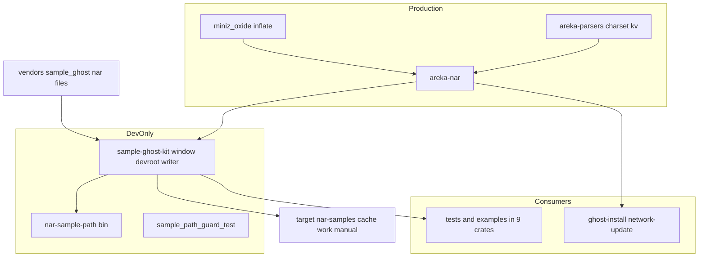
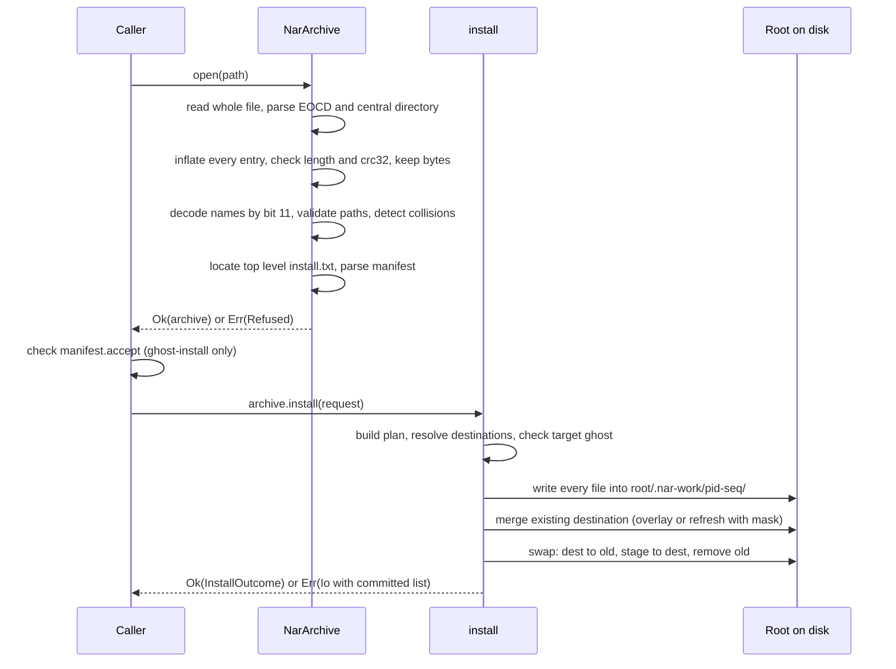
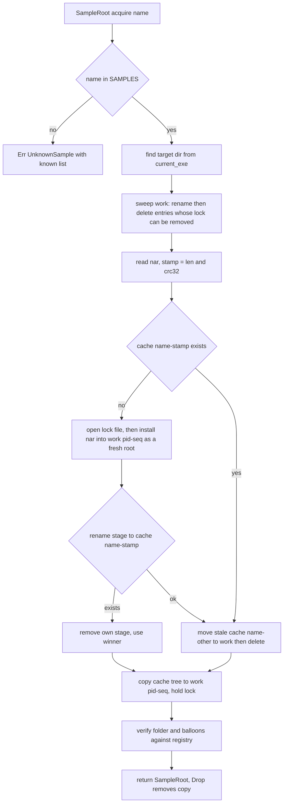
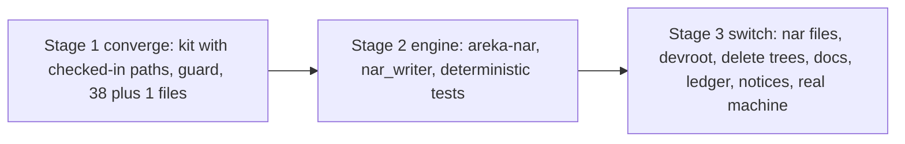

# Design Document: areka-P0-nar-install

> 2026-09-18 設計。入力は確定済みの `requirements.md`（10 要件・95 受入基準）と `research.md`（ギャップ分析＋設計判断 12 項目）。要件ディスカッションで決まった項目 1・3・4・6・11 はそのまま採り、残る項目 2・5・7・8・9・10・12 を本書で確定する。外部クレートの事実は 2026-09-18 に docs.rs・GitHub のソース・crates.io を当たり直した（`research.md` 節 9）。

## Overview

**Purpose**: 検体ゴーストを「配布形（`.nar`）のまま保管し、使うときに使い捨ての根へ展開する」仕組みを作る。展開器そのもの（`areka-nar`）は本番クレートとして建て、後続の `ghost-install`・`network-update` がそのまま呼ぶ。

**Users**: areka の開発者・実機サインオフを回す全員（検体名だけで根が手に入る）、後続 α 仕様の実装者（`baseware-root-layout`・`shell-implicit-surface`・`default-balloon-bundle`・`ghost-install`・`network-update`）。

**Impact**: 検体パスを綴る 38 ファイル（＋同梱バルーンのパスを組む 1 ファイル）を 1 つの窓口へ寄せ、展開済みツリー 193 ファイル（`fixtures/` 150＋`R_POST_and_KOMAINU/` 43）を `.nar` 4 本（`StayseeBalloon` が在れば 5 本）に畳む。走行のたびに起動記録の無い根が手に入るので、`spine.rs` の初期化と example の `.gitignore` は不要になる。本番グラフに増える外部クレートは **`miniz_oxide`（推移的に `adler2`）の 2 つ**。

### Goals

- 検体名 → 根／検体フォルダ／同梱バルーンのフォルダを返す窓口を 1 つにする（1.1〜1.9）。
- `.nar` の読取・名前の文字コード・`install.txt` の解釈・パス安全性・配布形 → インストール済み形の展開・`refresh` を `areka-nar` 1 クレートに持つ（2〜6）。
- 開発用の根を `target/nar-samples/` の下に「読み専用の原本＋取得ごとの複製」で管理し、新品・自己修復・並走安全を構造で保つ（7）。
- 保管形を `vendors/sample_ghost/*.nar` に統一し、依存・文書・台帳を追随させる（8・10）。
- 拒否の語彙を閉じ、全分岐を固定 `.nar` の決定論テストで再現する（9）。

### Non-Goals

- `.nar` の書き込み側の製品機能（テスト用の最小書き手は持つが、公開 API にしない）。
- 利用者からの `.nar` の受け取り（D&D・`OnInstall*`・`accept` の照合）＝`ghost-install`。
- `updates2.dau`・`delete.txt`・ネットワーク更新＝`network-update`。`developer_options.txt` は作る側の機能。
- ベースウェアの根の**場所**の決定・インストール済みの列挙・既定バルーンの選択＝`baseware-root-layout`。
- `plugin`・`headline`・`language`・`calendar*`・`package` の展開（理由付きで拒否するまで）。
- 検体の内容変更・`StayseeBalloon` の入手・`profile/areka/` の再設計。

## Boundary Commitments

### This Spec Owns

- 新設クレート **`areka-nar`**（本番・`[dependencies]`）: コンテナ読取・エントリ名の復号と検証・`install.txt` の解釈・配置計画・原子的な展開と `refresh`・閉じた拒否語彙・`InstallOutcome`。
- 新設クレート **`sample-ghost-kit`**（テスト専用 leaf・`[dev-dependencies]` からのみ）: 検体の登記表・窓口 `SampleRoot`・開発用の根（`target/nar-samples/`）の管理・決定論テスト用の `.nar` 書き手・絶対パスを印字する bin `nar-sample-path`。
- 常設検査 1 本 `crates/log-capture-kit/tests/sample_path_guard_test.rs`（旧置き場・展開形・名前空間・同梱バルーン名の綴りの見張り＋`sample-ghost-kit` が本番依存に現れない見張り）。
- 検体 4（5）本の `.nar` 化・`vendors/sample_ghost/README.md`（畳む手順）・展開済みツリーと `spine.rs` の初期化と example の `.gitignore` の削除。
- 38＋1 ファイルの書き換え、スクリプト 3 本・文書 3 本の追随、`tech.md`・`structure.md`・`roadmap.md` の 1 行・台帳 `owner` 11 件・`roadmap-draft.md` の行と散文・`THIRD-PARTY-NOTICES.md`。

### Out of Boundary

- `accept` の照合・`OnInstall*`／`OnUpdate*` の送出・利用者向けの入口（`ghost-install`）。`areka-nar` は `accept` の値を返すだけ。
- 根の場所の決定と `BasewareRoot` 型（`baseware-root-layout`）。`areka-nar` は呼び出し側から `&Path` の根を受け取る。
- `.nar` の生成の製品機能・配布物の作成。
- `kv`・`charset` の既存層の改変（`install.txt` 側で大小無視に揃える）。
- 1,000 行の番人の例外表・`temp-path-kit` の改変。

### Allowed Dependencies

- `areka-nar` → `areka-parsers::{charset, kv}`（既存層の再利用）・`encoding_rs`（ワークスペース既存・エントリ名の Shift_JIS 復号）・`miniz_oxide`（新規・deflate 伸長のみ）・`thiserror`・`tracing`。**`std` 以外の I/O 補助・`zip`・`flate2`・ハッシュ crate は入れない。**
- `sample-ghost-kit` → `[dependencies]` は `areka-nar`（段 ② から）・`thiserror`（`SampleError`）・`miniz_oxide`（`nar_writer` の deflate 側＝テスト専用クレートなので本番グラフには入らない）。`temp-path-kit`・`log-capture-kit`・`windows` には依存しない（OS の一時フォルダを使わない＝7.10・pid の生存判定を札ファイルで代替）。段ごとの差分: **段 ①** `thiserror` だけ／**段 ②** `areka-nar`・`miniz_oxide` を足し `devroot` の `target/` 発見と `WorkDir` を先に作る（`areka-nar` のテストが根に使う）／**段 ③** `devroot` の残り（原本・複製・手動用）。
- 消費側の各クレート → `sample-ghost-kit` を **`[dev-dependencies]` からのみ**引く（`temp-path-kit` と同じ規律）。
- 依存の向き: `encoding_rs`／`miniz_oxide` → `areka-parsers` → `areka-nar` → `sample-ghost-kit` → 各クレートのテスト・example。逆向きの import は違反。`areka-parsers` の dev 依存が `sample-ghost-kit` 経由で自分自身へ戻るのは dev 依存の循環で、cargo が許す形（`tokio` ⇄ `tokio-test` と同じ）。

### Revalidation Triggers

- `SampleRoot` の 3 つの読み口（`root`・`folder`・`balloon`）の形が変わったとき → A1 の 3 仕様が再確認。
- `InstallOutcome`／`RefuseReason` の変種が増減したとき → `ghost-install`（`OnInstallComplete`／`OnInstallFailure` への写し）が再確認。
- 展開先の形（`<根>/ghost/<名>/`・`<根>/balloon/<名>/`・`<根>/.nar-work/`）が変わったとき → `baseware-root-layout` が再確認。
- `target/nar-samples/` の階層名・検体の登記表の形が変わったとき → 実機手順と `tools/perf/` が再確認。
- 外部依存を `miniz_oxide` から替えるとき → `tech.md` の登記と謝辞を作り直す。
- 下流 `network-update` への注記: 「組んでから入れ替え」は宛先フォルダの中のファイルが開かれていると `rename(dest → old)` が失敗する。起動中のゴーストへ入れる経路は、先に SHIORI を解放してから `install` を呼ぶ形になる。

## Architecture

### Existing Architecture Analysis

- 再利用できる既存層は 3 つ（`research.md` 節 2.3・2.5）: `areka_parsers::charset::decode(bytes, DefaultEncoding)`（`charset,<名前>` 行をキーの大小無視で先読みし、無宣言は `Ansi→SHIFT_JIS`）・`areka_parsers::kv::parse_kv(&str) -> BTreeMap<String, String>`（最初のカンマ・trim・後勝ち・キーの大小は保持）・`FsPersistIo::commit` の「一時へ全書込 → `rename`」の型。フォルダ単位の確定・アーカイブ読取・`install.txt` 解釈・開発用の根の管理は 0 から作る。
- 検体の参照 38 ファイルはテスト・example だけで本番 0。全て `CARGO_MANIFEST_DIR` 相対の私家版（`fn emo2_root()` 12 定義・`const FIXTURE_DIR` 1・直書き 25）。実行時に `current_exe()` から隣接物を引く前例は `boot_config.rs` の `default_helper_exe_path`／`default_app_profile_dir` の 2 か所。
- 常設検査は `log-capture-kit/tests/` に集約され、走査部品 `workspace_scan/mod.rs` が `crates/**/*.rs`（`target`・`vendors`・`.git` 除外）の列挙とコメント除去を持つ。新しい見張りは同じ部品を使う。
- 台帳 `assets.toml` の `descript_install` 15 項目は全て `absent`・`owner = ""`。`owner` を書いた瞬間に `roadmap-draft.md` の `[[spec]]` 行と `[briefs].count` が要る（`spec_checks.rs` 腕 a・c・f）。`wave` 欄は自由文字列として読まれる（`documents/parse.rs` の `string_field`・テストは `"W13"`・`"保留"` を使う）ので `"A0"` は通る。

### Architecture Pattern & Boundary Map



**Architecture Integration**:

- 選んだ形: 「本番の展開器」と「開発専用の窓口」を **別クレートに分け、依存の向きで本番から窓口を見えなくする**（`temp-path-kit`／`log-capture-kit` の前例）。本番コードが検体の在処を知らないこと（1.7）は約束ではなく依存グラフで保証し、機械の見張りが赤にする。
- 責務の分け目: `areka-nar` は「根を受け取って展開する」だけで根の場所を決めない（5.1）。窓口は「根を用意して `areka-nar` に展開させ、複製を配る」だけで `install.txt` の意味を知らない。
- 保つ既存の型: `charset`／`kv` の再利用、`<stem>_tests.rs`／`<stem>_test_support.rs` の配置規律、見張りは `log-capture-kit/tests/`、依存の版はクレート側の `Cargo.toml` に直書き（`dola`・`ukadoc-survey` の前例）。
- 新設の理由: `areka-nar` は brief と隣接 brief 3 本の前提。`sample-ghost-kit` は「窓口を本番に置かない」ための最小の器で、`.nar` 書き手も同居させる（`#[cfg(test)]` のモジュールは他クレートのテストから見えないため。節「Components」参照）。
- steering 準拠: 1 ファイル 1,000 行未満（節「File Structure Plan」で分割）・`log-capture-kit` を `[dependencies]` に置かない・OS の一時フォルダを使わない・ログ無しの失敗経路を持たない・`unsafe` 0。

### Technology Stack

| Layer | Choice / Version | Role in Feature | Notes |
|-------|------------------|-----------------|-------|
| コンテナ読取 | 自前（`std` のみ・約 350 行） | EOCD → 中央ディレクトリ → ローカルヘッダの読み。汎用目的ビット 11・方式・CRC・外部属性を直接読む | zip64・マルチディスク・暗号化は理由付きで拒否 |
| 伸長 | **`miniz_oxide` 0.9**（`default-features = false, features = ["with-alloc"]`＝伸長 API に必須の 1 機能だけを明示。今日の既定と同じコードだが、将来増える既定機能を拾わない） | `inflate::decompress_to_vec_with_limit(data, declared_size)` で deflate（方式 8）を伸長。方式 0（無圧縮）は複写 | 純 Rust・依存は `adler2` のみ・MIT OR Zlib OR Apache-2.0。**新規に本番へ入る crate は 2 つ**。⚠ 10.2 との関係: `miniz_oxide` には伸長と圧縮を分ける feature が無く、`with-alloc` は `decompress_to_vec` に必須。圧縮側のコードは feature では切れないので「`areka-nar/src/` が `miniz_oxide::deflate` を綴らない」ことを兄弟テストで見張る（10.2 の字義からの逸脱＝節「Open Questions」） |
| 整合性検査 | 自前 CRC-32（IEEE・表引き・約 30 行） | 伸長後のバイト列と中央ディレクトリの CRC の突合・`.nar` の刻印 | 較正値 `crc32("123456789") = 0xCBF43926` を固定テストに置く |
| 文字コード | `encoding_rs` 0.8（既存）・`areka-parsers::charset`（既存） | エントリ名: ビット 11 なら `std::str::from_utf8`、無ければ `SHIFT_JIS.decode_without_bom_handling` で `had_errors` を見る。`install.txt`: `charset::decode(bytes, Ansi)` | 置換文字で黙って通さない（2.4） |
| `key,value` | `areka-parsers::kv::parse_kv`（既存） | `install.txt` の行分割。結果のキーを ASCII 小文字化した写しで引く（3.4） | 既存層は変えない |
| 開発用の根 | `std::fs`＋`std::os::windows::fs::OpenOptionsExt::share_mode` | `target/nar-samples/` 配下の原本・複製・手動用の 3 階層。生存中の複製は削除を拒む共有モードで開いた札ファイルで守る | Windows 専用の意味論（本プロジェクトは Windows 専用） |

**依存の選択（開発者の承認事項）**: brief と roadmap は `zip 8.6` の承認を予定していたが、本設計は **`miniz_oxide` 1 本**に置き換える。理由は `research.md` 節 9 に実測を置き、要点は 3 つ。⑴ `zip` 8.6 の公開 API に「名前は UTF-8」の印を返す文書化された手段が無い（`HasZipMetadata::get_metadata()` が非公開モジュールの `ZipFileData` を漏らしており、そのフィールド `is_utf8` を読めば通るが、文書に無い経路で版の更新で消えうる）。⑵ brief の `features = ["deflate-flate2"]` は単体では **コンパイルできない**（`zip` は `flate2` を `default-features = false` で引くため伸長のバックエンドが立たず `compile_error!` になる。`flate2/rust_backend` を自分で足す必要がある）。⑶ 本番グラフに増える crate は `zip` 経路で 12（`zip`・`crc32fast`・`cfg-if`・`indexmap`・`equivalent`・`hashbrown`・`memchr`・`typed-path`・`flate2`・`miniz_oxide`・`adler2`・`simd-adler32`）、`miniz_oxide` 経路で 2。読み手は 350 行ほど増えるが、拒否すべき形（9.2 の閉じた語彙）を自分の語で持てる。**代替案**: `zip = { version = "8.6", default-features = false, features = ["deflate-flate2"] }` ＋ `flate2 = { version = "1.1", features = ["rust_backend"] }` を直接依存に足し、印は `get_metadata().is_utf8` で読む。開発者がこちらを選ぶ場合、節「Components」の `container` モジュールだけが差し替わり、他の契約は変わらない。

## File Structure Plan

### Directory Structure

```
crates/areka-nar/                          # 本番クレート（新設）
├── Cargo.toml                             # miniz_oxide をクレート側に直書き・publish = false
└── src/
    ├── lib.rs                             # 公開面: NarArchive / InstallRequest / InstallOutcome / NarError の再公開・ログ発火点
    ├── crc32.rs                           # CRC-32（表引き）・較正テスト
    ├── container.rs                       # zip 構造の読み（EOCD・中央ディレクトリ・ローカルヘッダ・伸長・CRC 突合）→ RawEntry 列
    ├── names.rs                           # エントリ名の復号（ビット 11）・安全性（4.2〜4.7）・Windows 名規則 → EntryName
    ├── manifest.rs                        # install.txt → InstallManifest（3.1〜3.16・警告の記録）
    ├── plan.rs                            # InstallManifest＋EntryName 列＋InstallRequest → 配置計画（宛先ごとのファイル一覧）
    ├── install.rs                         # 作業フォルダへの書出し・既存宛先の取込み（refresh／mask）・入れ替え確定・巻き戻し → InstallOutcome
    ├── error.rs                           # NarError / RefuseReason（閉じた語彙）/ ManifestWarning / Display
    └── *_tests.rs                         # 兄弟テスト（container_tests.rs / names_tests.rs / manifest_tests.rs / plan_tests.rs / install_tests.rs / error_tests.rs）
crates/sample-ghost-kit/                   # テスト専用 leaf（新設・publish = false）
├── Cargo.toml                             # [dependencies] areka-nar のみ・[[bin]] nar-sample-path
└── src/
    ├── lib.rs                             # 登記表 SAMPLES・SampleRoot（acquire / root / folder / balloon）・SampleError
    ├── devroot.rs                         # target/ の発見・刻印・cache/work/manual・札ファイル・回収・複製
    ├── nar_writer.rs                      # 決定論テスト用の最小 zip 書き手（無圧縮＋任意で deflate・ビット 11・外部属性・CRC を意図的に壊す口）
    ├── bin/nar-sample-path.rs             # 1.9 のコマンド（manual/ へ展開して絶対パスを印字）
    └── *_tests.rs                         # lib_tests.rs / devroot_tests.rs / nar_writer_tests.rs
crates/log-capture-kit/tests/
└── sample_path_guard_test.rs              # 1.8 の常設検査（4 種の綴り＋本番依存の見張り＋較正）
vendors/sample_ghost/
├── README.md                              # 10.10 畳む手順（新設）
├── emo2.nar / R_POST_and_KOMAINU.nar / emo2-kakukaku-offsetdpi.nar / emo2-kakukaku-wplimit.nar
└── StayseeBalloon.nar                     # 段 ③ 時点で展開形が在るときだけ（8.5）
```

各ファイルは 1,000 行未満に収める（10.8）。見積りは `container.rs` 350・`install.rs` 350・`names.rs` 250・`manifest.rs` 250・`devroot.rs` 300・`nar_writer.rs` 250 で、テストは兄弟ファイルに出す。

### Modified Files

段 ①（窓口へ寄せる・挙動不変）。差分はパスを得る行に限る。

- `crates/areka`（13）: `src/emo2_boot/{assets_tests,frame_attach_tests,frame_visibility_integration_tests,mod,spine}.rs`・`src/placement/{measure_tests,placement_shared_test_support,source_tests}.rs`・`tests/{emo2_real_run,smoke_boot_loop_exit}.rs`・`examples/collision-probe/fixture.rs`・`examples/emo-present/fixture.rs`・`examples/window-placement.rs`。加えて `examples/emo-present/setup.rs`（同梱バルーン名でパスを組む 1 行）。`spine.rs` の `remove_dir_all` は段 ① で保持・段 ③ で削除（8.8）。⚠ `spine.rs` は今日 968 行（1,000 行まで残り 31）なので、段 ① の差分は私家版 `emo2_root()` の本体を窓口呼び出しに置き換えて正味で増やさない。
- `crates/areka-emo-text`（7）: `src/{viewbox_draw_live_diff_tests,viewbox_draw_png_dump_tests}.rs`・`tests/{emo2_fixture_e2e_test,kero_menu_capacity_test,shipped_fixture_region_test}.rs`・`examples/emo-text-layer/fixture.rs`・`examples/emo-text-typewriter-demo.rs`。
- `crates/areka-emo-atlas`（3）: `src/{decode/wic_arm,emo2_e2e,emo2_golden}.rs`。
- `crates/areka-emo-compose`（3）: `src/{fold_tests,golden_tests_test_support,world}.rs`。
- `crates/areka-parsers`（3）: `src/balloon/validation_tests.rs`（`const FIXTURE_DIR` → 関数）・`src/package/{resolve,validation_tests}.rs`。
- `crates/areka-seriko`（3）: `src/resolve.rs`・`tests/{cue_sequence,regression}.rs`。
- `crates/areka-emo-present`（1）: `src/balloon_test_support.rs`。
- `crates/areka-ghost`（1）: `tests/ghost/inproc_fixture.rs`。
- `crates/pilot`（4）: `examples/shiori-host-32/{helper,helper_window,main,shiori_proxy}.rs`（i686 の helper も同じ窓口を使う。窓口と `areka-nar` は純 Rust なので i686 でも組める。helper が引数も `GHOSTDIR` も無いときに自分で検体へ落ちる退避経路（`helper.rs:115-134`）は、`SampleRoot` を**プロセス寿命で保持**する＝`Drop` で複製が消えるため、関数内の一時値にしない）。
- 各消費クレートの `Cargo.toml`（9 本）: `[dev-dependencies] sample-ghost-kit = { path = "../sample-ghost-kit" }` を 1 行。
- `crates/log-capture-kit/tests/workspace_scan/mod.rs`（マニフェストの行分解と本番依存表の抽出を `with_default_guard_test.rs` から移し、クレート名を引数化）・`crates/log-capture-kit/tests/with_default_guard_test.rs`（移した関数の呼び出しに置き換えるだけ・判定と例外表は不変）。
- コメント行だけで旧置き場を綴る 8 ファイル（`research.md` 付録 A-1）は段 ③ で文言を直す。

段 ③（切替・削除・追随）。

- 削除: `crates/pilot/examples/shiori-host-32/fixtures/`（150）・`vendors/sample_ghost/R_POST_and_KOMAINU/`（43）・`crates/pilot/examples/shiori-host-32/.gitignore`。
- スクリプト: `tools/perf/invoke-followup-checks.ps1:129`・`tools/perf/perf-loop.measure.ps1:64`（既定の根を `cargo run -p sample-ghost-kit --bin nar-sample-path -- emo2` の `folder=` 行から得る）・`tools/perf/judge-perf.py:197`（コメントの出典を `.nar` へ）。
- 文書: `doc/emo2-conformance-scope.md:25`・`doc/ukadoc-coverage/briefing-assets.md:362,377,439`・`crates/pilot/examples/shiori-host-32/README.md:26`。
- steering: `.kiro/steering/tech.md`（`miniz_oxide (0.9): … 意図的依存追加＝日付・承認済`）・`structure.md`（クレート一覧に `areka-nar`・`sample-ghost-kit`、`log-capture-kit` の見張りの節に 4 本目）・`roadmap.md` 「実機運転の定石」に 1 行（絶対パスは `nar-sample-path` で得る）と、`zip` を「承認待ちの依存」と綴る 3 か所（制約の節・仮裁定 5・A0 のウェーブ行）を `miniz_oxide`（承認済）へ直す。
- 台帳: `doc/ukadoc-coverage/ledger/assets.toml`（`descript_install` の 11 項目に `owner = "areka-P0-nar-install"`、`bootghost`・相対パス系 3 件は `note` に理由）・`doc/ukadoc-coverage/roadmap-draft.md`（`[[spec]]` 行 `name/stage = "B"/bundle = "インストール"/owner_count = 11/wave = "A0"`・`[briefs].count` 27→28・散文 3 か所）・ドメイン別報告と全体報告の作り直し。
- 謝辞: `THIRD-PARTY-NOTICES.md`（`cargo about generate`・差分に増えるのは `miniz_oxide`・`adler2` のみであることを確認）。
- 検証報告: `.kiro/specs/completed/areka-P0-nar-install/validation-report.md` 相当に、検体ごとのファイル数とハッシュ・`git check-ignore` 0 件・実機 2 周の `OnFirstBoot` を残す。

## System Flows

### 展開の 2 段（読む → 入れる）



- `open` は 1 バイトも書かない。拒否は全て `open` で出るか、`install` の入口（宛先ゴーストの有無・取り出し元フォルダの有無）で出る。書き込みが始まった後の失敗は「拒否」ではなく I/O 失敗として、どこまで確定したかを付けて返す（6.4）。
- 「既存の宛先を消してから展開する」（6.2）は、**先に新しい木を作業フォルダに組み上げてから入れ替える**形で実現する。利用者から見える結果は同じで、消した後に展開が失敗して空になる経路が構造的に無くなる。

### 開発用の根の取得



- 原本（`cache/`）は誰にも配らない。配るのは常に複製で、複製は札ファイルを開いている間だけ生きる。原本の名前に刻印が入るので「名前が合う原本は完全」が不変条件になる（作業フォルダで組んでから `rename` で入れる・消すときは先に作業フォルダへ `rename` してから消す）。
- 手動用（`manual/<検体>/`）は bin `nar-sample-path` だけが使う。呼ぶたびに消して作り直すので、実機 2 周が 2 回とも `OnFirstBoot` になる（9.7）。回収の対象にしない。

## Requirements Traceability

| Requirement | Summary | Components | Interfaces | Flows |
|-------------|---------|------------|------------|-------|
| 1.1 | 検体名 → フォルダ | Kit registry/SampleRoot | `SampleRoot::folder` | 取得 |
| 1.2 | 検体名 → 根 | 同上 | `SampleRoot::root` | 取得 |
| 1.3 | ゴースト＋同梱バルーン名 → フォルダ | 同上 | `SampleRoot::balloon` | 取得 |
| 1.4 | 未登録名は一覧付き失敗 | 同上 | `SampleError::UnknownSample/UnknownBalloon` | — |
| 1.5 | 追加は `.nar` 1 つ＋1 行 | registry `SAMPLES` | `Sample` 定数 | — |
| 1.6 | 38 ファイル収束・挙動不変 | Modified Files 段 ① | — | 移行 ① |
| 1.7 | 本番は窓口を呼ばない | 依存の向き・Guard | `sample-ghost-kit` 本番依存の見張り | — |
| 1.8 | 綴りの常設検査＋較正 | Guard | 4 種の走査語 | — |
| 1.9 | 1 コマンドで絶対パス | bin `nar-sample-path` | `key=value` 行 | 取得（manual） |
| 2.1 | `.nar`／`.zip` 同一手順 | container | `NarArchive::open` | 展開 |
| 2.2 | ビット 11 → UTF-8 | names | `decode_entry_name` | 展開 |
| 2.3 | 印なし → Shift_JIS | names | 同上 | 展開 |
| 2.4 | 復号不能は拒否＋生バイト 16 進 | names/error | `RefuseReason::NameUndecodable` | 展開 |
| 2.5 | 暗号化・対応外方式は拒否 | container/error | `RefuseReason::UnsupportedEntry` | 展開 |
| 2.6 | 破損は拒否・無書込 | container/error | `CorruptArchive`／`IntegrityMismatch` | 展開 |
| 2.7 | シンボリックリンクは拒否 | names/error | `RefuseReason::SymlinkEntry` | 展開 |
| 3.1 | 最上位の `install.txt` | manifest | `locate_install_txt` | 展開 |
| 3.2 | 無ければ最上位一覧付き拒否 | manifest/error | `MissingInstallTxt { top_level }` | 展開 |
| 3.3 | `charset` 行・ANSI 既定 | manifest（`charset::decode`） | — | 展開 |
| 3.4 | `key,value` 規則＋大小無視 | manifest（`kv::parse_kv`） | `lowercased keys` | 展開 |
| 3.5 | 4 種の `type` 受理 | manifest | `InstallKind` | 展開 |
| 3.6 | 他の `type`・無しは拒否 | manifest/error | `UnsupportedType { found }` | 展開 |
| 3.7 | `directory` 必須 | manifest/error | `MissingRequiredKey` | 展開 |
| 3.8 | `name` 必須 | 同上 | 同上 | 展開 |
| 3.9 | フォルダ名は 1 階層 | manifest/error | `InvalidDirectoryName` | 展開 |
| 3.10 | `name` を返す | manifest/outcome | `InstallManifest::name`・`InstallOutcome::name` | 展開 |
| 3.11 | `accept` を返す・空は無し | manifest | `InstallManifest::accept: Option<String>` | 展開 |
| 3.12 | `balloon(.N).directory`／`source.directory` | manifest | `Companion` | 展開 |
| 3.13 | `balloon` 以外の `*.directory` は警告 | manifest | `ManifestWarning::UnsupportedCompanionKind` | 展開 |
| 3.14 | balloon/supplement の `*.directory` は警告 | manifest | `ManifestWarning::CompanionOnNonGhost` | 展開 |
| 3.15 | `refresh`／mask を読む | manifest | `ExistingPolicy` | 展開 |
| 3.16 | 他キー無視・記録 | manifest | `ManifestWarning::IgnoredKey` | 展開 |
| 4.1 | 書込前に全検証 | names/container | `NarArchive::open` | 展開 |
| 4.2 | 絶対・ドライブ・UNC 拒否 | names/error | `UnsafePath::Absolute` | 展開 |
| 4.3 | `..` 拒否 | 同上 | `UnsafePath::DotDot` | 展開 |
| 4.4 | NUL 拒否 | 同上 | `UnsafePath::Nul` | 展開 |
| 4.5 | `\` 区切り拒否 | 同上 | `UnsafePath::Backslash` | 展開 |
| 4.6 | Windows で作れない名前は拒否 | 同上 | `UnsafePath::InvalidWindowsName` | 展開 |
| 4.7 | 大小違いの衝突は拒否 | names/error | `RefuseReason::CaseCollision` | 展開 |
| 4.8 | 展開先の外へ出ない | plan/install | 宛先は `root.join(kind).join(dir)` に固定・検査 | 展開 |
| 4.9 | フォルダのエントリ・親の作成 | install | `write_stage` | 展開 |
| 5.1 | 根は呼び出し側が渡す | install | `InstallRequest::root` | 展開 |
| 5.2 | ghost → `<根>/ghost/<dir>/` | plan | `Destination::Ghost` | 展開 |
| 5.3 | 同梱バルーンは `<根>/balloon/` へ・複製無し | plan | `Destination::Balloon`＋除外 | 展開 |
| 5.4 | 取り出し元が無ければ拒否 | plan/error | `CompanionSourceMissing` | 展開 |
| 5.5 | balloon → `<根>/balloon/<dir>/` | plan | `Destination::Balloon` | 展開 |
| 5.6 | shell → `<根>/ghost/<宛先>/shell/<dir>/` | plan | `Destination::Shell` | 展開 |
| 5.7 | 宛先ゴースト無しは拒否 | plan/error | `TargetGhostMissing` | 展開 |
| 5.8 | supplement は重ね置き・`install.txt` 除外 | plan/install | `Destination::Supplement` | 展開 |
| 5.9 | バイト一致・無変換 | container/install | 伸長結果をそのまま書く・CRC 突合 | 展開 |
| 5.10 | 要素の列＋accept＋読み飛ばし | outcome | `InstallOutcome` | 展開 |
| 5.11 | 途中失敗で書きかけ無し・既存無傷 | install | 作業フォルダ → 入れ替え・巻き戻し | 展開 |
| 6.1 | refresh≠1 は上書き | install | `ExistingPolicy::Overlay` | 展開 |
| 6.2 | refresh,1 は全消去＋mask（supplement を除く） | install | `ExistingPolicy::Replace { keep }`（結果同値の「組んでから入れ替え」・`supplement` は `Overlay` 固定＋`RefreshIgnoredForSupplement` の警告＝2026-09-18 開発者裁定で要件 6.2 に明記） | 展開 |
| 6.3 | 同梱バルーン側も同規則 | plan/install | `Companion::existing` | 展開 |
| 6.4 | 途中失敗の原因と範囲 | error | `NarError::Io { phase, committed }` | 展開 |
| 6.5 | 開発用の根は再インストールしない | Kit devroot | 常に空の根へ展開 | 取得 |
| 6.6 | 宛先が使用中なら無傷で失敗・解放は呼び出し側 | install/error | `rename(dest → old)` の失敗 → `Io { phase: Commit, committed: [], rolled_back: true }`・エンジンは解放を試みない | 展開 |
| 7.1 | `target/` 配下の専用名前空間 | devroot | `target/nar-samples/` | 取得 |
| 7.2 | 無ければ展開 | devroot | cache miss | 取得 |
| 7.3 | 変われば展開し直す | devroot | 刻印＝長さ＋CRC32・古い原本の回収 | 取得 |
| 7.4 | 取得ごとに新品 | devroot | 複製を配る | 取得 |
| 7.5 | 並走・差し替え禁止 | devroot | 複製＋札ファイル | 取得 |
| 7.6 | 多重プロセスの初回展開 | devroot | `rename` 競合の負け側は勝者を使う | 取得 |
| 7.7 | 途中で落ちても自己修復 | devroot | 名前が合う原本は完全・掃除 | 取得 |
| 7.8 | 在り続けることを要求しない | devroot | 全て再生成可能 | 取得 |
| 7.9 | 使用量が増え続けない | devroot | `Drop`＋掃除＋manual 上書き | 取得 |
| 7.10 | OS の一時フォルダ不使用 | devroot | `target/` のみ | 取得 |
| 7.11 | 追跡外ファイル 0 | 展開先が `target/` | — | — |
| 8.1 | `.nar` だけ追跡 | vendors/sample_ghost | — | 移行 ③ |
| 8.2 | `emo2.nar` は 110 ファイル配布形 | 畳む手順 | README | 移行 ③ |
| 8.3 | R_POST 43・派生 20 | 同上 | 同上 | 移行 ③ |
| 8.4 | 展開結果が元ツリーと一致 | 検証（kit のテスト＋報告） | `registry_roundtrip` | 移行 ③ |
| 8.5 | `StayseeBalloon` の条件付き登記 | registry・README | 1 行 | 移行 ③ |
| 8.6 | バイト保存・`check-ignore` 0 件 | `.gitattributes`（既存）・検証手順 | — | 移行 ③ |
| 8.7 | 中身を変えない | 畳む手順 | — | 移行 ③ |
| 8.8 | `spine.rs` の初期化削除 | Modified Files | — | 移行 ③ |
| 8.9 | example の `.gitignore` 削除 | Modified Files | — | 移行 ③ |
| 9.1 | 記録＋戻り値 | lib.rs の発火点 | `error!` | — |
| 9.2 | 閉じた語彙＋全項目に固定入力 | error/tests | `RefuseReason::kind`・`ALL_KINDS` | — |
| 9.3 | 受理 5・拒否 16・再インストール 2 | `nar_writer`＋`*_tests.rs` | — | — |
| 9.4 | UTF-8 印あり・Shift_JIS の名前 | `nar_writer::entry(...).utf8_flag(bool)` | — | — |
| 9.5 | 新品・並走・多重プロセスの検証 | `devroot_tests.rs`・`lib_tests.rs` | — | — |
| 9.6 | 純 x64・実機不要 | 全テスト | — | — |
| 9.7 | 実機 2 周 | bin＋手順 | — | 移行 ③ |
| 10.1 | 依存登記・deny・謝辞 | Cargo.toml・tech.md・NOTICES | — | 移行 ③ |
| 10.2 | 既定機能・書き込み側を切る | `miniz_oxide` は伸長のみ使用 | — | — |
| 10.3 | 本番依存・dev 依存の規律 | Cargo.toml・Guard | — | — |
| 10.4 | structure.md 登記 | steering | — | 移行 ③ |
| 10.5 | スクリプト・文書の追随 | Modified Files | — | 移行 ③ |
| 10.6 | 台帳 `owner` 11 件 | assets.toml | — | 移行 ③ |
| 10.7 | `roadmap-draft.md` 同時編集 | roadmap-draft.md | — | 移行 ③ |
| 10.8 | 1,000 行未満 | File Structure Plan | — | — |
| 10.9 | roadmap の定石に 1 行 | roadmap.md | — | 移行 ③ |
| 10.10 | 畳む手順の README | vendors/sample_ghost/README.md | — | 移行 ③ |

## Components and Interfaces

| Component | Domain/Layer | Intent | Req Coverage | Key Dependencies (P0/P1) | Contracts |
|-----------|--------------|--------|--------------|--------------------------|-----------|
| `areka-nar::container` | 本番・読取 | zip 構造を読み、伸長・CRC 突合済みのエントリ列を返す | 2.1, 2.5, 2.6, 5.9 | `miniz_oxide`（P0）・`crc32`（P0） | Service |
| `areka-nar::names` | 本番・検証 | エントリ名の復号と安全性の判定 | 2.2, 2.3, 2.4, 2.7, 4.1〜4.7 | `encoding_rs`（P0） | Service |
| `areka-nar::manifest` | 本番・解釈 | `install.txt` → `InstallManifest` | 3.1〜3.16 | `areka-parsers::{charset,kv}`（P0） | Service |
| `areka-nar::plan` | 本番・配置 | 宛先ごとのファイル一覧と既存宛先の扱いを決める | 4.8, 5.1〜5.8, 6.3 | manifest・names | Service |
| `areka-nar::install` | 本番・書込 | 作業フォルダに組み、入れ替えで確定 | 4.9, 5.10, 5.11, 6.1, 6.2, 6.4 | plan・`std::fs` | Service, State |
| `areka-nar::error` | 本番・語彙 | 閉じた拒否語彙・警告・I/O 失敗の形 | 2.4〜2.7, 3.2, 3.6〜3.9, 5.4, 5.7, 6.4, 9.1, 9.2 | `thiserror` | State |
| `sample-ghost-kit` 窓口 | dev・入口 | 検体名 → `SampleRoot` | 1.1〜1.5, 8.5 | `devroot`（P0）・`areka-nar`（P0） | Service |
| `sample-ghost-kit::devroot` | dev・根の管理 | 原本・複製・手動用の 3 階層と回収 | 6.5, 7.1〜7.10 | `std::fs`・`areka-nar` | State |
| `sample-ghost-kit::nar_writer` | dev・固定入力 | テスト用 `.nar` を組む | 9.3, 9.4 | `std` | Service |
| bin `nar-sample-path` | dev・CLI | 絶対パスを印字 | 1.9, 9.7 | 窓口 | Batch |
| `sample_path_guard_test` | 見張り | 綴り 4 種と本番依存の検査 | 1.7, 1.8, 10.3 | `workspace_scan` | Batch |

### areka-nar（本番）

#### `container`

| Field | Detail |
|-------|--------|
| Intent | `.nar`／`.zip` のバイト列から、方式・フラグ・CRC・外部属性・名前の生バイト・伸長済み内容を持つエントリ列を作る |
| Requirements | 2.1, 2.5, 2.6, 5.9 |

**Responsibilities & Constraints**
- ファイル全体を `std::fs::read` で読む（ゴーストは数十 MB 以下・zip64 は対象外）。末尾から EOCD（`PK\x05\x06`）を探し、中央ディレクトリの各ヘッダ（`PK\x01\x02`）を読む。各エントリの内容はローカルヘッダ（`PK\x03\x04`）を飛ばした位置から中央ディレクトリの圧縮サイズぶんを切り出す（ローカルヘッダ側のサイズ・CRC は使わない＝データ記述子ビット 3 が立っていても中央ディレクトリの値で足りる）。
- 受理する方式は 0（無圧縮）と 8（deflate）。8 は `miniz_oxide::inflate::decompress_to_vec_with_limit(data, uncompressed_size)`。伸長後の長さと CRC-32 が中央ディレクトリと一致しなければ `IntegrityMismatch`。
- 拒否: 汎用目的ビット 0（暗号化）または方式 99・zip64 の印（EOCD のいずれかの欄が `0xFFFF`／`0xFFFFFFFF`・zip64 EOCD ロケータの存在）・ディスク番号 ≠ 0・中央ディレクトリのオフセットや個数が範囲外・署名不一致・宣言サイズの総和が上限（1 GiB）超。
- 名前の復号は行わない（生バイトを `names` へ渡す）。
- **伸長と CRC の突合は `open` の中で全エントリに対して行い、伸長済みのバイト列を `NarArchive` が保持する**（`install` は保持したバイト列を書くだけで再伸長しない）。これにより 2.6 の「壊れていれば 1 バイトも書かない」と 4.1 の「書き込みの前に検証を終える」が同じ場所で成り立つ。メモリの上限は宣言サイズの総和（1 GiB で拒否）＝ゴーストの実寸（数十 MB）では問題にならない。

**Dependencies**
- External: `miniz_oxide` 0.9 — deflate 伸長（P0）。
- Inbound: `lib.rs::NarArchive::open`（P0）。

**Contracts**: Service [x]

```rust
pub(crate) struct RawEntry {
    pub index: usize,
    pub name_raw: Vec<u8>,
    pub utf8_flag: bool,          // 汎用目的ビット 11
    pub is_dir: bool,             // 名前が `/` で終わる
    pub external_attrs: u32,      // 上位 16 bit の種別が S_IFLNK なら symlink
    pub crc32: u32,
    pub uncompressed_size: u64,
    pub method: u16,
    pub data: std::ops::Range<usize>, // アーカイブ本体内の圧縮データの範囲
}

pub(crate) fn read_central_directory(bytes: &[u8]) -> Result<Vec<RawEntry>, RefuseReason>;
pub(crate) fn inflate_entry(bytes: &[u8], entry: &RawEntry) -> Result<Vec<u8>, RefuseReason>;
```

- 事前条件: `bytes` はファイル全体。事後条件: 返ったエントリ列は中央ディレクトリの順・`index` は 0 始まり。`inflate_entry` は長さと CRC を検証済みのバイト列を返す。
- 不変条件: 書き込みを行わない・`unsafe` を使わない。

#### `names`

| Field | Detail |
|-------|--------|
| Intent | 生バイトの名前を UTF-8 か Shift_JIS で損失なく復号し、展開先の外へ出ない・Windows で作れる名前だけを通す |
| Requirements | 2.2, 2.3, 2.4, 2.7, 4.1, 4.2, 4.3, 4.4, 4.5, 4.6, 4.7 |

**Responsibilities & Constraints**
- 復号: `utf8_flag` なら `std::str::from_utf8`（失敗 → `NameUndecodable { encoding: "UTF-8" }`）。無ければ `encoding_rs::SHIFT_JIS.decode_without_bom_handling`（`had_errors` → `NameUndecodable { encoding: "Shift_JIS" }`）。理由にはエントリ番号と生バイトの 16 進を入れる。
- 安全性（復号後の文字列に対して・順序どおり・最初に当たった理由で拒否）: NUL を含む → `Nul`／`\` を含む → `Backslash`／`/` 始まり・`X:` 形・`//` 始まり → `Absolute`／区切り要素に `..` → `DotDot`／空の要素（`a//b`）→ `Absolute` と同じ拒否／各要素が Windows で作れない（`<>:"|?*`・U+0000〜U+001F・末尾のドットまたは空白・拡張子を除いた語が `CON` `PRN` `AUX` `NUL` `COM1`〜`COM9` `LPT1`〜`LPT9`・ASCII 大小無視）→ `InvalidWindowsName { component }`。
- シンボリックリンク: 外部属性の上位 16 bit の種別が `0o120000`（S_IFLNK）→ `SymlinkEntry`。作成側 OS の種別は見ない（安全側に倒す）。
- 大小衝突: 復号後の完全パスを Unicode の小文字化で比べ、同じになる別エントリがあれば `CaseCollision { a, b }`。同一パスの重複（`a.txt` が 2 回）も同じ変種で拒否する。
- 全エントリを検証し終えるまで 1 件の拒否も返さない、ではなく**最初の拒否で全体を拒否**する。どちらでも書き込み前に止まる（4.1）。理由は 1 件で十分（製品側は 1 つの理由を `OnInstallFailure` に写す）。

**Contracts**: Service [x]

```rust
pub(crate) struct EntryName {
    pub index: usize,
    pub path: String,            // `/` 区切り・正規化済み（末尾 `/` は除去済み）
    pub components: Vec<String>,
    pub is_dir: bool,
}

pub(crate) fn decode_entry_name(entry: &RawEntry) -> Result<String, RefuseReason>;
pub(crate) fn validate_entry_names(entries: &[RawEntry]) -> Result<Vec<EntryName>, RefuseReason>;
```

#### `manifest`

| Field | Detail |
|-------|--------|
| Intent | 最上位の `install.txt` を読み、`InstallManifest` に写す |
| Requirements | 3.1〜3.16 |

**Responsibilities & Constraints**
- 最上位＝`components.len() == 1` のファイルのエントリ。名前が ASCII 大小無視で `install.txt` に等しいものを 1 つ選ぶ（Windows のファイルシステムの意味論に合わせる）。無ければ `MissingInstallTxt { top_level }`（最上位の名前の一覧＝フォルダは `名前/` の形）。
- 復号は `areka_parsers::charset::decode(bytes, DefaultEncoding::Ansi)`（`charset` 行の先読みと ANSI→Shift_JIS 既定は既存層のまま）。行分割は `kv::parse_kv`。結果のキーを ASCII 小文字化した `BTreeMap` に写し直し、以降はその写しだけを引く（同じキーが大小違いで 2 回あれば後勝ち＝元の層の順序と同じ）。
- `type`: `ghost`・`shell`・`supplement`・`balloon` を `InstallKind` に。他・無しは `UnsupportedType { found }`。`calendar` は `calendar skin` と同義だがどちらも拒否。
- `name`・`directory`: 無し・空 → `MissingRequiredKey { key }`。`directory` と各 `*.directory`・`*.source.directory` は「1 階層の名前」の検査（`names` の Windows 名規則＋区切り・`..`・絶対の形・NUL）→ `InvalidDirectoryName { key, value }`。
- `accept`: 空値は `None`。
- 同時インストール: `type` が `ghost`／`shell` のとき、`balloon.directory` と `balloonN.directory`（N は 0 以上の整数・`balloon` 直後の数字列）を `Companion` に。`*.source.directory` が無ければ `*.directory` と同じ値。`*.refresh`・`*.refreshundeletemask` も同じ接頭辞で拾う。`headline.directory`・`plugin.directory`・`calendar.skin.directory`・`calendar.plugin.directory`（と N 付き）は `UnsupportedCompanionKind` の警告で読み飛ばす。`type` が `balloon`／`supplement` のときに `*.directory` があれば `CompanionOnNonGhost` の警告。
- `refresh`／`refreshundeletemask`: `refresh` の値が `1` のときだけ `Replace`。mask はコロン区切り・trim・空要素を除く・区切りや `..` を含む要素は無視して警告。`supplement` では `refresh` を読まず、書かれていれば `RefreshIgnoredForSupplement` の警告（重ね置き先はゴースト本体なので全消去は危険。正典は沈黙しており安全側に倒す＝本設計の決定）。
- 上記以外のキー（`bootghost` を含む）は `IgnoredKey { key }` の警告。

**Contracts**: Service [x] / State [x]

```rust
#[derive(Clone, Copy, Debug, PartialEq, Eq)]
pub enum InstallKind { Ghost, Shell, Supplement, Balloon }

#[derive(Clone, Debug, PartialEq, Eq)]
pub enum ExistingPolicy {
    Overlay,                          // refresh が 1 でない: 既存を残し同名だけ上書き
    Replace { keep: Vec<String> },    // refresh,1: 全消去（keep のファイル名は全階層で残す）
}

#[derive(Clone, Debug, PartialEq, Eq)]
pub struct Companion {
    pub key: String,                  // "balloon" / "balloon0" …
    pub directory: String,            // 宛先 `<根>/balloon/<directory>/`
    pub source_directory: String,     // アーカイブ内の取り出し元フォルダ名
    pub existing: ExistingPolicy,
}

#[derive(Clone, Debug, PartialEq, Eq)]
pub struct InstallManifest {
    pub kind: InstallKind,
    pub name: String,
    pub directory: String,
    pub accept: Option<String>,
    pub existing: ExistingPolicy,
    pub companions: Vec<Companion>,   // kind が Ghost/Shell のときだけ非空
    pub warnings: Vec<ManifestWarning>,
    pub charset_declared: Option<String>,
}

pub(crate) fn parse_manifest(bytes: &[u8]) -> Result<InstallManifest, RefuseReason>;
```

#### `plan`

| Field | Detail |
|-------|--------|
| Intent | マニフェストとエントリ列と要求から、宛先ごとに「どのエントリをどの相対パスに置くか」と「既存宛先の扱い」を決める |
| Requirements | 4.8, 5.1〜5.8, 6.3 |

**Responsibilities & Constraints**
- 宛先の決め方（`root` は呼び出し側が渡す絶対パス）:
  - `Ghost` → `root/ghost/<directory>/` に最上位の全内容。ただし各 `Companion.source_directory/` 配下は除く（複製を残さない＝5.3）。
  - `Balloon` → `root/balloon/<directory>/` に最上位の全内容。
  - `Shell` → `root/ghost/<target>/shell/<directory>/`。`target` 無し、または `root/ghost/<target>/` が無い → `TargetGhostMissing`。
  - `Supplement` → `root/ghost/<target>/` に重ね置き。最上位の `install.txt` は除く。宛先無し → `TargetGhostMissing`。
  - 各 `Companion` → `root/balloon/<companion.directory>/` に `source_directory/` 配下の内容（接頭辞を剥がす）。`source_directory/` 配下に 1 件もエントリが無い → `CompanionSourceMissing`。中の `install.txt` は普通のファイルとして置く（解釈はしない＝5.3・8.4 の 20 ファイル一致に必要）。
- 宛先は常に `root.join("ghost"|"balloon").join(<検証済みの 1 階層名>)` の形でしか組まないので、外へ出る余地が無い（4.8）。テストは確定後の各ファイルの正規化パスが宛先配下であることを数える。
- 空フォルダのエントリは宛先に空フォルダとして作る。フォルダのエントリが無くてもファイルの親は作る（4.9）。

**Contracts**: Service [x]

```rust
#[derive(Clone, Debug, PartialEq, Eq)]
pub enum ElementKind { Ghost, Balloon, Shell, Supplement }

pub(crate) struct Placement {
    pub kind: ElementKind,
    pub name: String,                     // ghost/shell/supplement/balloon 本体は manifest.name・同梱バルーンは directory
    pub destination: PathBuf,             // 絶対パス
    pub target_ghost: Option<String>,
    pub existing: ExistingPolicy,
    pub skip_top_level_install_txt: bool, // Supplement だけ true
    pub files: Vec<(usize, String)>,      // (エントリ番号, 宛先からの相対パス `/` 区切り)
    pub dirs: Vec<String>,
}

pub(crate) fn build_plan(
    manifest: &InstallManifest,
    names: &[EntryName],
    request: &InstallRequest,
) -> Result<Vec<Placement>, RefuseReason>;
```

#### `install`

| Field | Detail |
|-------|--------|
| Intent | 計画どおりに作業フォルダへ組み上げ、宛先と入れ替えて確定し、`InstallOutcome` を返す |
| Requirements | 4.9, 5.9, 5.10, 5.11, 6.1, 6.2, 6.4 |

**Responsibilities & Constraints**
- 作業フォルダ: `root/.nar-work/<pid>-<連番>/<k>/`（`k` は配置の番号）。同じボリューム上なので `rename` で入れ替えられる。開始時に `root/.nar-work/` の残骸を消す（前回の異常終了の後始末。同じ根への同時インストールは製品でも開発でも起きない前提＝節「Risks」）。
- 組み上げ（配置ごと）: ⑴ 宛先が既に在り `Overlay` なら宛先の木を作業フォルダへ複写、`Replace { keep }` なら宛先の木のうちファイル名（ASCII 大小無視）が `keep` にあるものだけを同じ相対位置へ複写、`Supplement` は常に宛先の木を複写。⑵ アーカイブの内容を上書きで書く（`inflate_entry` の結果をそのまま・変換無し）。
- 確定（配置ごと・番号順）: 宛先が無ければ `rename(stage → dest)`。在れば `rename(dest → root/.nar-work/<pid>-<連番>/old-<k>)` → `rename(stage → dest)` の 2 手。2 つ目の `rename` が失敗したら `old → dest` に戻す。**`old` は配置ごとには消さず、全配置の確定後の後片付け 1 回（`root/.nar-work/<pid>-<連番>/` の削除）にまとめる**——配置ごとに消すと、後の配置が失敗したときに前の配置を戻す元が無くなり、要件 5.11 を満たせないため（2026-09-19・タスク 4.3 が実測で確認: 逐語どおりに戻すと巻き戻しのテストが赤）。その後片付けが失敗したら確定は取り消さず、作業フォルダのパスを `InstallOutcome.leftovers` に残す。作業フォルダを空のまま残すと開発用の根では原本に写り、全複製に伝播する。
- 複数配置（ゴースト＋同梱バルーン）で後の配置の確定が失敗したら、確定済みの配置を逆順に元へ戻す（新規なら削除、入れ替えなら `old` を戻す）。戻せなかったものは `NarError::Io { committed, rolled_back: false }` に列挙する（6.4）。
- 既存状態の判定: 確定前に宛先が無ければ `New`、在って `Overlay` なら `Overlaid`、在って `Replace` なら `Refreshed`。
- ファイルは `File::create` → `write_all` → `sync_all` は行わない（フォルダ単位の入れ替えで十分・`FsPersistIo` は 1 ファイルの設定値だから fsync していた）。

**Contracts**: Service [x] / State [x]

```rust
pub struct InstallRequest<'a> {
    pub root: &'a Path,                 // ベースウェアの根（絶対パス）
    pub target_ghost: Option<&'a str>,  // shell / supplement の宛先ゴーストのフォルダ名
}

#[derive(Clone, Copy, Debug, PartialEq, Eq)]
pub enum ExistingState { New, Overlaid, Refreshed }

#[derive(Clone, Debug, PartialEq, Eq)]
pub struct InstalledElement {
    pub kind: ElementKind,
    pub name: String,
    pub path: PathBuf,                  // 置いたフォルダの絶対パス
    pub target_ghost: Option<String>,
    pub existing: ExistingState,
}

#[derive(Clone, Debug, PartialEq, Eq)]
pub struct InstallOutcome {
    pub name: String,                   // manifest.name（OnInstallComplete の Reference1 用）
    pub accept: Option<String>,
    pub installed: Vec<InstalledElement>,
    pub warnings: Vec<ManifestWarning>, // 読み飛ばしたキーを含む
    pub leftovers: Vec<PathBuf>,        // 片付けられずに残った場所（後片付けに失敗した作業フォルダ・開始時に消せなかった他の走行の置き土産）
}

impl NarArchive {
    pub fn open(path: &Path) -> Result<NarArchive, NarError>;
    pub fn manifest(&self) -> &InstallManifest;
    pub fn install(&self, request: &InstallRequest<'_>) -> Result<InstallOutcome, NarError>;
}
```

- 事前条件: `request.root` は実在するフォルダ（無ければ `NarError::Io { phase: Stage }`）。事後条件: `Ok` なら `installed` の各 `path` が実在し、`Err` なら宛先は呼ぶ前の内容のまま（複数配置の巻き戻し失敗を除く・その場合は `committed` に列挙）。
- `install` は何度呼んでも同じ結果（同じ根に同じ `.nar` を再度入れると `Overlaid`／`Refreshed` になるだけ）。

#### `error`

| Field | Detail |
|-------|--------|
| Intent | 拒否の閉じた語彙・警告・I/O 失敗の形と表示 |
| Requirements | 2.4〜2.7, 3.2, 3.6〜3.9, 5.4, 5.7, 6.4, 9.1, 9.2 |

```rust
#[derive(Debug, thiserror::Error)]
pub enum NarError {
    #[error("{archive}: 拒否: {reason}")]
    Refused { archive: PathBuf, reason: RefuseReason },
    #[error("{archive}: {phase:?} で I/O に失敗: {path}: {source}")]
    Io {
        archive: PathBuf,
        phase: IoPhase,                      // Read / Stage / Commit / Rollback
        path: PathBuf,
        #[source] source: std::io::Error,
        committed: Vec<InstalledElement>,    // 失敗までに確定した配置
        rolled_back: bool,                   // committed を元に戻せたか
    },
}

#[derive(Debug, Clone, PartialEq, Eq)]
pub enum RefuseReason {
    CorruptArchive { detail: String },                              // EOCD 不在・範囲外・署名不一致
    IntegrityMismatch { index: usize, name: String, what: Integrity }, // Crc { expected, actual } / Size { expected, actual } / Inflate
    UnsupportedEntry { index: usize, name: String, what: Unsupported }, // Encrypted / Compression(u16) / Zip64 / MultiDisk / TooLarge
    NameUndecodable { index: usize, raw_hex: String, encoding: &'static str },
    SymlinkEntry { index: usize, name: String },
    UnsafePath { index: usize, name: String, why: UnsafeWhy },        // Absolute / DotDot / Nul / Backslash / InvalidWindowsName(String)
    CaseCollision { a: String, b: String },
    MissingInstallTxt { top_level: Vec<String> },
    UnsupportedType { found: Option<String> },
    MissingRequiredKey { key: &'static str },                         // "name" / "directory"
    InvalidDirectoryName { key: String, value: String },
    CompanionSourceMissing { key: String, source_directory: String },
    TargetGhostMissing { target: Option<String> },
}

impl RefuseReason {
    pub fn kind(&self) -> &'static str;          // 変種名（`OnInstallFailure` に写す短い語）
    pub const ALL_KINDS: &'static [&'static str]; // 13 件・decl 順
}

#[derive(Debug, Clone, PartialEq, Eq)]
pub enum ManifestWarning {
    UnsupportedCompanionKind { key: String },
    CompanionOnNonGhost { key: String },
    IgnoredKey { key: String },
    RefreshIgnoredForSupplement,
    InvalidMaskEntry { key: String, value: String },
}
```

- 語彙は **13 変種**で閉じる（9.2 の最低 9 種を含む: `install.txt` 無し＝`MissingInstallTxt`・対応外の種別＝`UnsupportedType`・必須キー無し＝`MissingRequiredKey`・名前が復号できない＝`NameUndecodable`・安全でないパス＝`UnsafePath`／`SymlinkEntry`・対応外の圧縮方式または暗号化＝`UnsupportedEntry`・壊れたアーカイブ＝`CorruptArchive`／`IntegrityMismatch`・宛先が無い＝`TargetGhostMissing`・取り出し元フォルダが無い＝`CompanionSourceMissing`。残り 2 つは `CaseCollision`・`InvalidDirectoryName`）。
- `lib.rs` の `open`／`install` が `Err` を返す直前に `tracing::error!(archive = %path.display(), reason = %err, "[areka_nar] refused or failed")` を 1 回だけ出す。警告は `install` の直後に `tracing::warn!` で 1 件ずつ。これ以外の場所ではログを出さない（二重記録を避ける）。

### sample-ghost-kit（テスト専用）

#### 窓口（`lib.rs`）

| Field | Detail |
|-------|--------|
| Intent | 検体名から、その検体を含む新品の根の複製を配る唯一の入口 |
| Requirements | 1.1, 1.2, 1.3, 1.4, 1.5, 8.5 |

```rust
#[derive(Clone, Copy, Debug, PartialEq, Eq)]
pub enum SampleKind { Ghost, Balloon }

pub struct Sample {
    pub name: &'static str,                // `.nar` のファイル名（拡張子無し）＝ install.txt の directory
    pub kind: SampleKind,
    pub balloons: &'static [&'static str], // 同時にインストールするバルーンの directory
}

pub const SAMPLES: &[Sample] = &[
    Sample { name: "emo2", kind: SampleKind::Ghost, balloons: &["emo2-kakukaku"] },
    Sample { name: "R_POST_and_KOMAINU", kind: SampleKind::Ghost, balloons: &[] },
    Sample { name: "emo2-kakukaku-offsetdpi", kind: SampleKind::Balloon, balloons: &[] },
    Sample { name: "emo2-kakukaku-wplimit", kind: SampleKind::Balloon, balloons: &[] },
    // Sample { name: "StayseeBalloon", kind: SampleKind::Balloon, balloons: &[] }, // 8.5 の条件で 1 行
];

pub struct SampleRoot { /* root, folder, balloons: Vec<(String, PathBuf)>, lease: Option<devroot::Lease> */ }

impl SampleRoot {
    pub fn acquire(name: &str) -> Result<SampleRoot, SampleError>;
    pub fn root(&self) -> &Path;                                // <根>（段 ③ から）
    pub fn folder(&self) -> &Path;                              // <根>/ghost/<名>/ または <根>/balloon/<名>/
    pub fn balloon(&self, directory: &str) -> Result<&Path, SampleError>; // <根>/balloon/<directory>/
}

#[derive(Debug, thiserror::Error)]
pub enum SampleError {
    UnknownSample { requested: String, known: &'static [&'static str] },
    UnknownBalloon { sample: &'static str, requested: String, known: &'static [&'static str] },
    TargetDirNotFound { started_from: PathBuf },
    Nar(#[from] areka_nar::NarError),
    Io { what: &'static str, path: PathBuf, #[source] source: std::io::Error },
    RegistryMismatch { sample: &'static str, expected: String, installed: Vec<String> },
}
```

- 3 つの読み口は**全て借用を返す**。`let p = SampleRoot::acquire("emo2")?.folder();` は一時値の破棄と借用の衝突でコンパイルできないので、複製を持ったまま使うことが型で強制される（`Drop` で複製が消えるため、所有権を手放した後のパスを渡す事故を構造的に防ぐ）。
- 検体を足す作業は「`vendors/sample_ghost/<名>.nar` を置く」と「`SAMPLES` に 1 行」の 2 手（1.5）。展開結果の要素（種別・フォルダ名・同梱バルーン）が登記と食い違えば `RegistryMismatch`。
- **段 ① の中間形**: `acquire` は複製を作らず、追跡済みの展開形を指す。`folder()` は `emo2` → `crates/pilot/examples/shiori-host-32/fixtures/emo2`、派生バルーン → `fixtures/<名>`、`R_POST_and_KOMAINU` → `vendors/sample_ghost/R_POST_and_KOMAINU`。`balloon("emo2-kakukaku")` → `<folder>/emo2-kakukaku`。`root()` は段 ① では提供しない（段 ① の呼び手に根を使う者はいない。A1 の 3 仕様は段 ③ の後に着手する）。段 ③ で `folder()` は `<根>/ghost/emo2`、`balloon` は `<根>/balloon/emo2-kakukaku` に変わるが、呼び手の 1 行は変わらない（1.3 の「二度書き換えない」）。

#### `devroot`

| Field | Detail |
|-------|--------|
| Intent | `target/nar-samples/` の下で原本・複製・手動用を管理する |
| Requirements | 6.5, 7.1〜7.10 |

**State model**（`target/` は `CARGO_TARGET_DIR` が設定されていればそれ、無ければ `current_exe()` の祖先で名前が `target` の最初のフォルダ。見つからなければ `TargetDirNotFound`）

```
target/nar-samples/
├── cache/<名>-<長さ>-<crc32 8 桁>/     # 読み専用の原本。ベースウェアの根の形。名前が合えば完全
├── work/<pid>-<連番>/                    # 段階中の原本、または配った複製（ベースウェアの根の形）
├── work/<pid>-<連番>.lock                # 生存の札。共有モード FILE_SHARE_READ だけで開いたまま持つ
└── manual/<名>/                          # bin が配る手動用の根。呼ぶたびに消して作り直す
```

- 刻印: `.nar` 全体の長さと CRC-32（`areka_nar::crc32`）。`.nar` を丸ごと読むのは展開時にも要るので追加の I/O は無い。
- 初回の展開（cache miss）: **必ず `WorkDir`**（札ファイル `work/<pid>-<連番>.lock` を `create_new` で開いてからフォルダを作る型）を 1 つ取り、その `work/<pid>-<連番>/` を空の根として `NarArchive::install(&InstallRequest { root, target_ghost: None })` を呼び、`rename(work/… → cache/<名>-<刻印>)`。展開中も札が開いているので、並走する別プロセスの掃除（下記）に消されない。`rename` で `cache/` へ出した後の `WorkDir` の `Drop` は木が既に無いこと（`NotFound`）を許容し、札だけを閉じて消す。`rename` が失敗し `cache/<名>-<刻印>` が既に在れば別プロセスが勝ったので自分の作業を消して勝者を使う（7.6）。在らず失敗なら `Io`。Windows の `std::fs::rename` は宛先が**空でない**フォルダのときに失敗する（空フォルダなら std 1.98 は置き換える）。原本も宛先も常に空でない木なので、この規則で競合の勝敗が決まる。
- 古い原本の回収（7.3・7.9）: `cache/<名>-*` のうち刻印が違うものを `work/gc-<pid>-<連番>/` へ `rename` してから `remove_dir_all`（途中で落ちても `cache/` の下に半端な木が残らない＝7.7）。回収の失敗（別プロセスが複写中・ウイルス対策がファイルを掴んでいる）は**標準エラーへ 1 行**出して**取得は続行する**（次の取得で再び試みる）。窓口は記録層に依存しない（下の Allowed Dependencies が拘束する登記に `tracing` が無く、そちらが正である）ので、後始末の失敗を人へ伝える道は標準エラーしかない（`devroot.rs` の `report_cleanup`）。
- 複製（7.4・7.5）: 札ファイル `work/<pid>-<連番>.lock` を `OpenOptions::new().write(true).create_new(true).share_mode(FILE_SHARE_READ = 1)` で開いてから、`cache/<名>-<刻印>/` の木を `work/<pid>-<連番>/` へ複写して返す。`Drop` で札を閉じ、木を `remove_dir_all`、札を削除。
- 掃除（7.7・7.9）: 取得のたびに `work/` を走査し、`*.lock` を `remove_file` してみる。消せた札は持ち主が居ないので相方の木を消す。消せない札のうち**共有違反**は生きている利用者の物なので触らず、**`NotFound`** は別プロセスが同時に回収中なので同じく触らない（生きているとは判定しない）。札の無い木（札を作る前に落ちた残骸・`gc-` 付きの回収途中の木）は消す。孤児の木を消すときも原本と同じく、先に `work/gc-<pid>-<連番>/` へ `rename` してから `remove_dir_all` する（pid が再利用された新プロセスが同名の `work/<pid>-1/` を作る瞬間との競合を消す）。自分の生きている複製と初回展開中の作業フォルダは札が開いているので、他者の掃除でも自分の掃除でも消えない。掃除の失敗も回収と同じく標準エラーへ 1 行出して取得を続行する。
- 手動用（1.9・9.7）: `manual/<名>/` を消して `cache/` から複写。掃除の対象にしない。
- 検体の `.nar` の場所は `concat!(env!("CARGO_MANIFEST_DIR"), "/../../vendors/sample_ghost/")`（本クレートだけが綴る）。
- 公開の作業フォルダ `WorkDir`: `work/<pid>-<連番>/` を札付きで 1 つ配る型（`WorkDir::new() -> Result<WorkDir, SampleError>`・`path(&self) -> &Path`・`Drop` で削除）。複製の器と同じ型で、`areka-nar` のテストが「空の根」として借りる（OS の一時フォルダを使わずに済ませるための唯一の窓）。

**Concurrency strategy**: プロセス内の連番は `AtomicU32`、プロセス間の一意性は pid。原本は「作ってから `rename` で入れる・消すときは `rename` で出してから消す」の 2 規則で常に完全。複製は自分だけの物で、他者からは札で守られる。

#### `nar_writer`

| Field | Detail |
|-------|--------|
| Intent | 決定論テストの固定入力（受理 5 種・拒否 16 種・再インストール 2 種・名前の 2 種）をコードで組む |
| Requirements | 9.3, 9.4 |

```rust
pub struct NarBuilder { /* entries */ }
pub struct EntryBuilder { /* name_raw, data, utf8_flag, method, external_attrs, corrupt: Option<Corrupt>, encrypted_flag */ }

impl NarBuilder {
    pub fn new() -> Self;
    pub fn file(self, name: impl Into<Vec<u8>>, data: &[u8]) -> EntryBuilder; // 既定: UTF-8 印あり・無圧縮
    pub fn dir(self, name: impl Into<Vec<u8>>) -> Self;
    pub fn write_to(&self, path: &Path) -> std::io::Result<()>;
    pub fn bytes(&self) -> Vec<u8>;
}
impl EntryBuilder {
    pub fn utf8_flag(self, on: bool) -> Self;      // 印無し＝Shift_JIS の名前
    pub fn deflate(self) -> Self;                   // miniz_oxide::deflate で圧縮（dev 側だけ）
    pub fn symlink(self) -> Self;                   // 外部属性に S_IFLNK
    pub fn encrypted_flag(self) -> Self;            // 汎用目的ビット 0
    pub fn method(self, m: u16) -> Self;            // 対応外の方式
    pub fn corrupt(self, how: Corrupt) -> Self;     // Crc / Size / Data
    pub fn done(self) -> NarBuilder;
}
pub fn install_txt(lines: &[&str]) -> Vec<u8>;    // CRLF で連結
```

- 置き場を `areka-nar` の `#[cfg(test)]` ではなく本クレートに置く理由: `#[cfg(test)]` のモジュールはテストバイナリの内側にしか無く、`ghost-install` の `[dev-dependencies]` から届かない。本クレートに置けば `areka-nar` 自身のテストも `ghost-install` のテストも `[dev-dependencies] sample-ghost-kit` の 1 行で同じ入力を得る（`areka-nar` → `sample-ghost-kit` → `areka-nar` は dev 依存の循環で cargo が許す）。
- 書き手が正しい zip を書くことの較正: 書いた `.nar` を Python の `zipfile` で開ける必要は無い（外部道具に依存しない）。代わりに「`nar_writer` が書いた無傷の入力を `areka-nar` が受理し、`corrupt` を 1 つ立てた同じ入力を拒否する」対を全ての拒否変種で持つ。

#### bin `nar-sample-path`

- 呼び方: `cargo run -p sample-ghost-kit --bin nar-sample-path -- <検体名>`。
- 出力（標準出力・1 行 1 組・`key=value`・パスは Windows の絶対パスそのまま・末尾の区切り記号は付けない）: `root=<絶対パス>`／`folder=<絶対パス>`／同梱バルーンごとに `balloon.<directory>=<絶対パス>`。未登録名は標準エラーに `SampleError` の表示を出して終了コード 2。
- `manual/<名>/` に配るので、プロセスが終わっても木は残る。呼ぶたびに作り直す。`tools/perf/` の 2 本はこの `folder=` 行を読む。

### 見張り `sample_path_guard_test.rs`

- 走査: `walk_workspace_sources()`（`crates/**/*.rs`・`target`／`vendors` 除外）から `crates/sample-ghost-kit/src/` を除いた全ファイルを `scan_tokens`（コメント除去済み）で検査する。
- 走査語（`concat!` で 2 片に割って書く・姉妹の見張りと同じ約束）: ⑴ `shiori-host-32/fixtures` と `join("shiori-host-32")`（旧置き場）⑵ `vendors/sample_ghost/<名>/`（登記された各名前・`.nar` 名は当たらない）⑶ `nar-samples`（展開先の名前空間）⑷ 同梱バルーンの名前で**パスを組む形**だけ＝`join("emo2-kakukaku")`・`emo2-kakukaku/`・`/emo2-kakukaku"`・補助関数へ名前を渡してパスを組む `emo2("emo2-kakukaku")`（今日の実体 27 ファイルはこの 4 形で全て当たる。`areka/examples/emo-present/setup.rs:147`・`areka-emo-atlas/src/emo2_e2e.rs:215` が 4 形目）。窓口の読み口 `balloon("emo2-kakukaku")` の引数としての綴りと、説明文の中の綴り（`"emo2-kakukaku の font.height,28"`）は当たらない（引数で名前を渡すのは 1.3 の正規の使い方であり、禁じるのは「ゴーストのフォルダに名前を継ぎ足して自分でパスを作る」形だけ）。
- 判定: 違反 0 件で緑。較正: 合成入力で各走査語が当たること・`balloon("emo2-kakukaku")` と説明文には当たらないこと・コメント行では当たらないこと・除外領域 `crates/sample-ghost-kit/src/` における ⑴〜⑷ の実体の有無を**形ごとに 4 状態で宣言し、宣言どおりであること**を判定する（`sample_path_guard_test.rs` の `EXCLUSION_FORMS`）。2026-09-18 の実測では実体があるのは ⑶ だけで、⑵ と ⑷ は窓口が登記表の名前を実行時に継ぎ足してパスを組むので逐語の綴りが生まれず、⑴ は段 ③ で窓口が旧置き場を綴らなくなって消えた。実体の無い形を表から落とすと較正が恒真になるので、理由を添えて表に残し、実体が現れたら赤にする（前提が変わった合図・後戻りの合図）。
- 本番依存の見張り: `with_default_guard_test.rs` の私有関数 `manifest_lines`／`production_kit_dependencies`（`with_default_guard_test.rs:257-318`）は `log-capture-kit` の名前を固定で持つので、**走査部品 `workspace_scan/mod.rs` へ移してクレート名を引数に取る形**にし、両方の見張りがそれを呼ぶ（`with_default_guard_test.rs` は呼び出しだけに変わる＝Modified Files に載せる）。判定は `sample-ghost-kit` が `crates/**/Cargo.toml` の `[dependencies]`・`[build-dependencies]`・`[target.*.dependencies]` に現れないこと（自分自身の `Cargo.toml` は除く）。較正は合成マニフェストで赤を作る。
- 段 ① から置く。段 ① の時点で 38 ファイルが全て窓口へ寄っていることを機械が確かめる。

## Data Models

### Domain Model

- **アーカイブ**（`NarArchive`）: 不変。`bytes`・`RawEntry` 列・`EntryName` 列・`InstallManifest` を持つ。`open` で全て確定し、`install` は読むだけ。
- **配置**（`Placement`）: 1 つのインストール済みフォルダに 1 つ。マニフェストの `kind` と `Companion` から導く。
- **要素**（`InstalledElement`）: 配置の確定結果。`InstallOutcome.installed` の順序は配置の順序（本体が先・同梱バルーンが後）。
- **検体**（`Sample`）と**根の複製**（`SampleRoot`）: 登記は定数・複製は取得ごとの値。複製の寿命が木の寿命。

### Logical Data Model

- 刻印: `<長さ 10 進>-<crc32 16 進 8 桁>`。同じ `.nar` なら同じ名前・1 バイト違えば別名。
- `work/` の名前: `<pid>-<連番>`。札は同名＋`.lock`。
- 台帳の登記: `assets.toml` の `descript_install` 11 項目に `owner = "areka-P0-nar-install"`（着地後に `status` を実測へ）。`roadmap-draft.md` に `[[spec]] name = "areka-P0-nar-install" / stage = "B" / bundle = "インストール" / owner_count = 11 / wave = "A0"`。

## Error Handling

### Error Strategy

- **書く前に全部見る**: `open` は読取・復号・安全性・マニフェストの全検査を済ませてから返る。`install` の入口で宛先ゴーストと取り出し元の有無を見る。ここまでの失敗は全て `Refused`。
- **書いた後は範囲を返す**: 作業フォルダへの書出し失敗は宛先に触れていないので `Io { phase: Stage, committed: [] }`。確定の失敗は `Io { phase: Commit, committed, rolled_back }`。巻き戻しの失敗は `phase: Rollback` で残った要素を列挙。
- **黙って通さない**: 復号の置換文字・不正な mask 要素・未知のキーは、それぞれ拒否か警告として必ず記録する。
- **窓口の失敗**: `SampleError` は理由と既知の名前の一覧を含む。`acquire` は `panic` しない（テストは `?` か `expect` で受ける）。

### Error Categories and Responses

- 利用者由来（不正・非対応のアーカイブ）→ `RefuseReason`（13 変種・`kind()` の短い語を `OnInstallFailure` に写せる）。
- 環境由来（ディスク・権限・使用中）→ `NarError::Io`（フェーズと確定済み要素付き）。
- 開発環境由来（`target/` 不明・登記漏れ）→ `SampleError`。

### Monitoring

- `error!` は `lib.rs` の 2 つの公開関数の出口だけ。`warn!` はマニフェストの警告と `leftovers`。`info!` は `install` 成功時に要素の数と宛先。窓口（`sample-ghost-kit`）は記録を**一切出さない**。Allowed Dependencies が窓口に `tracing` を許していないためで、そちらの登記が拘束力を持つ。後始末の失敗だけは黙って消えては困るので、標準エラーへ 1 行出す（`report_cleanup`）——これが窓口の唯一の記録である。cache hit／miss と掃除の件数は記録に残らない。

## Testing Strategy

### Unit Tests（`areka-nar/src/*_tests.rs`・`nar_writer` で組む）

- `container_tests`: 無圧縮と deflate の受理・CRC 不一致・長さ不一致・EOCD 不在・zip64 の印・暗号化ビット・方式 99／12・宣言サイズの総和超過。`crc32` の較正値。
- `names_tests`: ビット 11 あり UTF-8（日本語）・印なし Shift_JIS（日本語のフォルダ名とファイル名）・印なしで不正な列 → `NameUndecodable`（生バイト 16 進を含む）・`..`・`/` 始まり・`C:`・`\\`・`\`・NUL・`CON.txt`・末尾ドット・`<>`・`A.txt` と `a.txt` の衝突・S_IFLNK。
- `manifest_tests`: `Charset,UTF-8`（大文字キー）・`charset, Shift_JIS`（値の前の空白）・`charset` 無し（ANSI 既定で日本語の `name`）・`Type,Ghost`（大文字の値は拒否・キーだけ大小無視）・4 種の受理・7 種＋未知＋無しの拒否・`directory`／`name` 無し／空・`directory` に `/` `..` `C:`・`accept,` 空・`balloon.directory` のみ（source は同値）・`balloon0` と `balloon1`・`headline.directory` の警告・`type,balloon` に `balloon.directory` の警告・`refresh,1`／`refresh,0`／`refresh,true`・mask の分割と不正要素・`bootghost` の無視。
- `plan_tests`: 4 種の宛先・同梱バルーンの除外と接頭辞剥がし・取り出し元無し・shell／supplement の宛先無し・supplement の `install.txt` 除外・空フォルダ・フォルダのエントリ無し。
- `install_tests`（根は OS の一時フォルダではなく `sample_ghost_kit::WorkDir` が配る `target/nar-samples/work/<pid>-<連番>/`。dev 依存の循環により kit が見る `areka_nar` はテスト対象とは別の写しなので、`areka-nar` 自身のテストは kit から `WorkDir` と `nar_writer` だけを借り、`SampleError::Nar` の中身を `crate::` の型と比べない）: 新規・`Overlay` で既存ファイルが残り同名が上書き・`Replace` で mask 以外が消える（全階層）・同梱バルーン側の `*.refresh`・途中失敗（読み取り専用の宛先を作って確定を失敗させる）で宛先が無傷・**宛先が使用中**（宛先の中のファイルを `share_mode(1)`（`FILE_SHARE_READ`）で開いたまま `install`＝起動中の `shiori.dll` の再現。共有ゼロだと組み上げの複写が os error 32 で先に失敗し、確定の段に届かないので 6.6 が無検査になる）で `Io { phase: Commit, rolled_back: true }` が返り宛先が呼ぶ前のまま（6.6）・2 配置の 2 つ目の失敗で 1 つ目が戻る・`leftovers`・確定後の各ファイルの実パスが宛先配下・バイト一致。
- `error_tests`: **1 本のテスト**が `nar_writer` で 13 変種それぞれの固定入力を組み、各入力を `open`（または `install`）に通して得た `kind()` の集合が `ALL_KINDS` と**完全一致**することを判定する（集合が空なら当然赤＝母数 0 で緑にならない）。別ファイルの兄弟テストの結果を集めて突き合わせる形にはしない（テスト間で状態を共有できない）。
- `no_deflate_side_is_called`: `areka-nar/src/*.rs`（兄弟テストを含む）が `miniz_oxide::deflate` を綴らないことを `include_str!` の字面で見張る（10.2 の代替措置）。

### Integration Tests（`sample-ghost-kit/src/*_tests.rs`）

- 登記の往復: `SAMPLES` の各 `.nar` を `open` → 空の根へ `install` → 要素が登記（種別・名前・同梱バルーン）と一致（8.4 の恒常版・段 ③ から）。
- 新品（9.5）: `acquire` → `folder()/ghost/master/profile/areka/x.toml` を書く → drop → 再 `acquire` → 無い。
- 並走（同一プロセス）: 8 スレッドで同じ検体を `acquire` し、各自の複製へ書き込み、他の複製に現れない。
- 多重プロセス（9.5・7.6）: 空の `nar-samples/` から、`std::process::Command` で自分自身のテストバイナリを 4 つ同時に起こし（`--exact` で子側のテストを指定・環境変数で子を見分ける）、全員が完全な木を得る。`cache/` に半端な木が無い。
- 自己修復（7.7）: `cache/<名>-<刻印>/` を手で半分消す→ 名前が合っている限り「完全」とみなす設計なので、この検査は「`rename` 前の作業フォルダに半端な木を置いても cache-hit にならない」と「掃除が札の無い残骸を消す」の 2 本にする。
- 刻印（7.3）: `.nar` のバイトを 1 つ変えた写しを別名で置き、古い原本が回収される。
- 見張りの較正（`log-capture-kit/tests/sample_path_guard_test.rs`）: 走査語 4 種の陽性・コメントの陰性・除外領域の実在・本番依存に足すと赤（合成マニフェスト）。

### E2E（実機・9.7・完了前 1 回）

- `cargo run -p sample-ghost-kit --bin nar-sample-path -- emo2` → `folder=`・`balloon.emo2-kakukaku=` を `areka.exe` の位置引数に → `AREKA_APP_SMOKE_EXIT_MS` で有界終了 → ログに `OnFirstBoot` → もう一度 bin から → 再び `OnFirstBoot`。i686 helper を先に `target/debug/` へ置く（既存の定石）。
- 完了後 `cargo test --workspace` と実機一周の後に `git status` が clean（7.11）。

### Performance

- emo2 の初回展開（6.6 MB・110 ファイル）1 秒未満・複製 200 ms 未満を目安とする（判定はしない）。計時を記録へ出すことはしない——窓口は記録層に依存せず（Allowed Dependencies）、計るときは呼び手の側で計る。

## Security Considerations

- 展開は宛先の形を固定した組み立て（`root/ghost|balloon/<検証済み名>`）でしか行わず、エントリ名は `..`・絶対・`\`・NUL・Windows 不正名・大小衝突・シンボリックリンクを全て書き込み前に拒否する。
- 伸長の上限は中央ディレクトリの宣言サイズ（超えれば `IntegrityMismatch`）、宣言サイズの総和は 1 GiB で打ち切る。
- `ZipArchive::extract` に相当する経路を持たない（RUSTSEC-2025-0168 の種類を構造で避ける）。

## Migration Strategy



- 段 ① の合否: テスト名の集合と合否が前後で同一・見張りが緑・本番コードの差分 0。
- 段 ② の合否: `cargo test -p areka-nar` 緑・`ALL_KINDS` 全対応・`cargo deny check` 緑。
- 段 ③ の合否: 登記の往復が緑・8.4 の一致（ファイル数とハッシュを報告に）・`git check-ignore` 0 件・実機 2 周・`git status` clean・`cargo test -p ukadoc-survey` 緑・謝辞の差分が `miniz_oxide`・`adler2` だけ。
- 巻き戻し: 段 ③ は 1 コミットで戻せる（`.nar` と削除が同じコミット）。段 ① は窓口の中身を戻すだけ。

## Open Questions / Risks

- **依存の承認＝決着（2026-09-18 開発者「(a) で」）**: `zip 8.6` の代わりに `miniz_oxide 0.9`（`default-features = false, features = ["with-alloc"]`・推移的に `adler2`）を本番に入れ、zip コンテナの読み手は `std` だけで持つ。開発者の判断基準は「可能なら Rust ネイティブ実装」＝外部は純 Rust の伸長器 1 本、残りは本リポジトリの `std` コード。`zip` へ戻す場合の差し替え範囲は `container.rs` だけ（記録のみ）。
- **10.2 は要件側を改訂済み**: 「既定機能を切って伸長に要る機能だけを明示し、書き込み側の API を呼ばないことを検査で見張る」。設計の措置は `Cargo.toml` の明示と `no_deflate_side_is_called`（`areka-nar/src/*.rs` が `miniz_oxide::deflate` を綴らない字面の見張り）。
- **6.2 の狭め＝決着（2026-09-18 開発者「(a) で」）**: `type,supplement` では `refresh` を読み飛ばして常に重ね置き（`Overlay`）＋警告。要件 6.2 に「supplement を除く」を明記済み。
- **宛先が使用中（起動中のゴーストの `shiori.dll` 等）＝決着（2026-09-18 開発者指摘）**: エンジンは解放を試みず、`rename(dest → old)` の失敗を `Io { phase: Commit, committed: [], rolled_back: true }` で返し宛先は無傷（要件 6.6）。SHIORI のアンロードは呼び出し側の責務で、`ghost-install`・`network-update`・`ghost-shell-balloon-switch` の brief に申し送り済み。決定論テストは「宛先のファイルを共有なしで開いたまま `install` → `Err`・宛先が呼ぶ前のまま」で固定する。
- **6.2 の実現順**: 「消してから展開」ではなく「組んでから入れ替え」。結果は同じで、消した後に失敗して空になる経路が無くなる。
- **`StayseeBalloon`**: 段 ③ の時点で `vendors/sample_ghost/StayseeBalloon/` が在るかで登記の 1 行と `.nar` 1 本が変わる（8.5 のとおり・後から着地する側が行う）。
- **同じ根への同時インストール**: `root/.nar-work/` の残骸掃除は同時実行を想定しない（製品は単一インスタンス・開発用の根は取得ごとに別）。`ghost-install` が並行を要するなら札ファイルの型を移す。
- **古い原本の回収と並走**: `.nar` が差し替わった瞬間に走っていた別プロセスが古い原本を複写中だと、回収がその複写を失敗させうる（テストが 1 度赤になる）。開発者が走行中に `.nar` を替えたときだけ起きる。
- **dev 依存の循環**: `areka-parsers` と `areka-nar` は `sample-ghost-kit` 経由で自分自身へ戻る。cargo が許す形だが、テストバイナリに同じクレートが 2 度リンクされる（窓口はパスしか渡さないので型は跨がない）。
- **Windows 固有**: 札ファイルの共有モードと `rename` の意味論は Windows のもの。本プロジェクトは Windows 専用で、他 OS は対象外。
