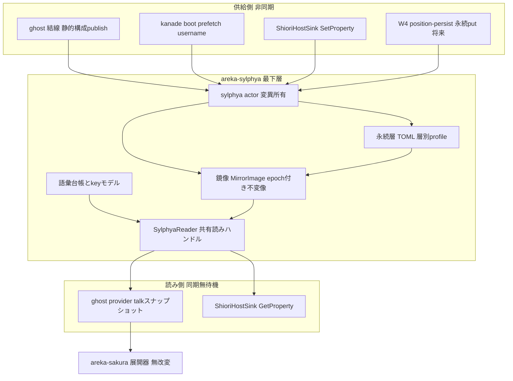
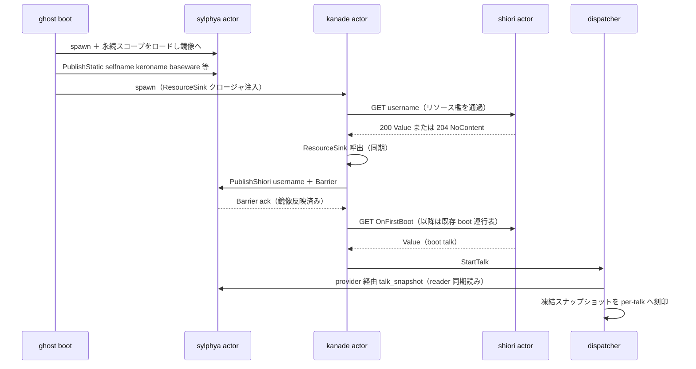
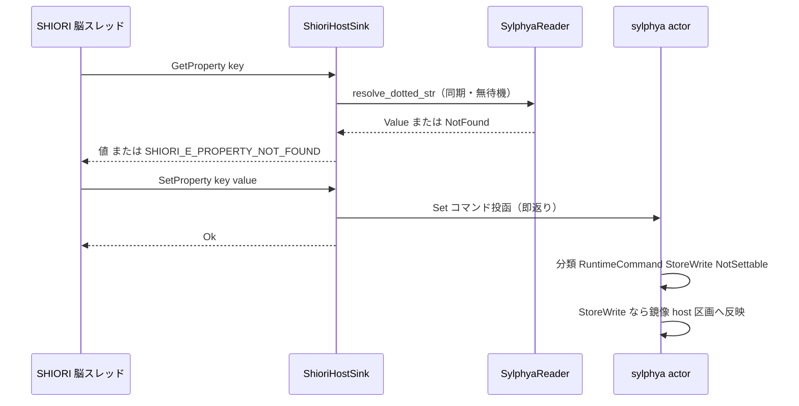

# Technical Design: areka-P0-sylphya

## Overview

**Purpose**: 本設計は、areka の統一プロパティシステム **sylphya** を新規最下層クレート `crates/areka-sylphya` として実体化する。「名前で引ける値」の解決機構を areka にただ 1 つ確立し、%フラット環境変数・点付きプロパティ木・SHIORI Resource 系の全語彙を単一名前空間の第一級エントリとして保持したうえで、M1 は源のあるもの（`%username`・`%selfname`・`%selfname2`・`%keroname`・`baseware.name`/`baseware.version`）だけを実導出し、残りを差替シーム付きで決定論的に縮退させる。

**Users**: 消費エンジンは 4 者——areka-sakura（talk 凍結スナップショットの消費・契約無改変）・areka-ghost（backing 据付と永続読書き）・areka-kanade（SHIORI 照会の座席）・crates/areka bin（`ShioriHostSink` の serving surface）。後続 spec `areka-P0-position-persist`（W4）は永続 backing の消費者となる。

**Impact**: 既存の 3 箱分裂コース——(a) ghost の暫定 provider（`default_system_vars`）、(b) position-persist が要件化していた専用永続ストア、(c) `ShioriHostSink` の独立 `HashMap` プロパティストア——を解消する。(a) は sylphya 読み口由来のスナップショット生成へ差替（provider 退役）、(b) は sylphya 永続 backing へ吸収、(c) は sylphya への委譲に置換して第 2 ストアを撤去する。

アーキテクチャは要件討議裁定（research.md §8/§9/§10）に従う: **同期読み・非同期供給の掲示板（マテリアライズド・ビュー）モデル**——読みは共有読みハンドル（epoch 交換の不変スナップショット）による同期・無待機、供給（publish・SET 中継・永続書込・prefetch 編成）は **古典スレッド 1 本の同期アクター**（`areka-actor` 規約）が所有する。同期読み経路でのクロスアクター pull 照会は禁止（pull 型は裁定で棄却済み）。

### Goals

- 単一名前空間・key モデル（セレクタ 5 形文法込み）・語彙台帳（フラット 26＋点付き 10 ルート枝＋汎用名 17＋SHIORI Resource 159）の完全形第一級保持
- 読み口 2 形（per-talk 凍結スナップショット／逐次同期解決）を、問い合わせ元コンテキスト（asker）第一級・由来非露出・無待機で提供
- M1 実導出（username＝SHIORI 照会値源経由・selfname 系＝descript 由来・baseware 2 項）と、それ以外の決定論的縮退（素通し／既定値／NOT_FOUND）＋backing 差替シーム（5 実体層＋SET 2 意味論を収容する型）
- 層別永続 backing（App/Ghost/Shell/Balloon の profile フォルダ×TOML×原子的書込×寛容読取×バージョン付き形式）と 4 key 族の器
- 全判断分岐の x64 純粋決定論テスト檻＋実機 emo2 サインオフ（204→既定値・実照会経路のログ証跡）

### Non-Goals

- 縮退指定語彙の実導出（時刻系・画面系・単語ランダム系・system.\*・リスト系ルート枝配下等——各々シームと追跡宿題を残す）
- `\![vanish]` 実装・ゴースト切替・多重ゴースト・SSTP EXECUTE GetProperty/SetProperty・`property.get`/`property.set` イベント発火（ext 亜枝実働＝M2）
- SET 有効群への実書込（M1 は型シーム予約のみ）・さくらスクリプト展開器の改変（dialogue-tags 完了領分）・`%property[...]` の lexer bracket 拡張
- SSP `ghost.dat` バイナリ互換・ネットワーク系プロパティ実照会・選択肢 UI／メニュー描画
- 窓位置復元の意味論（アンカー再射影・OnFirstBoot ゲート運行・Ref0 注入）＝ W4 position-persist の残存領分（sylphya は器のみ）

## Boundary Commitments

### This Spec Owns

- クレート `crates/areka-sylphya` の全体: 正準 key モデル（`PropPath`・セレクタ文法）・語彙台帳（const 表）・鏡像（`MirrorImage`）と共有読みハンドル（`SylphyaReader`）・sylphya アクター（`SylphyaMsg`・publish／SET 分類／永続書込）・永続層（TOML 直列化・原子的 IO・寛容読取・層別スコープ）
- areka-kanade の **SHIORI リソース照会増分**: `ALLOWED_RESOURCE_IDS` 檻・boot 系列 prefetch・`ResourceSink` シーム（イベント檻・単一 Close funnel・shiori_tx kanade 専有の既存不変量は無改変）
- areka-parsers の **sakura.name2 転記拡張**（`GhostNames` additive フィールド追加・忠実転記のみ）
- areka-ghost の **sylphya 結線**: アクター spawn／静的構成 publish／provider 差替（`SystemVarWiring`）／shutdown 段追加
- crates/areka bin の **`ShioriHostSink` 統合**（HashMap ストア撤去・reader/publisher 委譲）と結線 3 箇所の provider 差替
- 4 key 族（窓位置・バルーンオフセット・起動記録・vanish 回数）の **key 命名と TOML スキーマ**（W4 が消費する契約の正本）
- `doc/COMPAT_ARCHITECTURE.md` 対応表への正典沈黙裁量の記録（keroname フォールバック・selfname2 縮退・SET 無効書込挙動・username 既定値 204 縮退）

### Out of Boundary

- さくらスクリプト展開器・lexer（areka-sakura の `resolve_system_var` と areka-parsers の `scan_sysvar` は 1 行も変えない——R7.1「消費側無改変」）
- 窓位置復元・OnFirstBoot ゲート・Ref0 差替の運行結線（W4 position-persist）。kanade `on_first_boot` の Ref0 固定 `"0"` は本 spec では**不変**
- 縮退語彙の実導出と、その前提シーム（暦時計注入・物理/論理 px 契約・単語辞書出所）＝追跡 spec 群
- SSTP サーバ・PLUGIN 系・ヘッドライン/更新系
- seriko／emo／wintf 系ファイル（W3 同居 spec `seriko-loop`・`choice-render` の編集面とは互いに素）

### Allowed Dependencies

- `areka-sylphya` → **std・thiserror・tracing・toml（workspace hoist）・areka-actor のみ**。上流 areka クレート（parsers/sakura/kanade/ghost/wintf）への依存は**禁止**（最下層規律。「消費者は backing を知らない」R2.4 はこの依存方向から自動帰結）
- `areka-ghost` → `areka-sylphya`（結線・据付）。`areka-kanade` は sylphya へ**依存しない**（`ResourceSink` クロージャシームで疎結合）
- `crates/areka`（bin）→ `areka-sylphya`（sink 統合・結線）
- `areka-sakura` は sylphya へ依存**しない**（スナップショット型 `SystemVarSnapshot` は sakura 所有のまま・ghost が写像）

依存方向（違反はレビューでエラー扱い）:
`std/toml` → `areka-actor`／`areka-sylphya`／`areka-parsers`（最下層・相互非依存※）→ `areka-kanade`／`areka-sakura` → `areka-ghost` → `crates/areka`（bin）
※ sylphya は parsers にも依存しない（TOML 採用により kv 再利用は不要）。

### Revalidation Triggers

- `SylphyaReader`／`SylphyaPublisher`／`SylphyaMsg` の型変更（ghost/bin/W4 の結線が依存）
- 4 key 族の key 命名・TOML スキーマ・スコープ写像の変更（W4 position-persist の再検証必須）
- `SystemVarSource` の型・dispatcher 刻印点の変更（dialogue-tags R7 契約の供給側）
- `ALLOWED_RESOURCE_IDS` の語彙拡張・`ShioriCall.id` の String 化（kanade 檻の意味変更）
- `ShioriHostSink` の観測挙動変更（GetProperty 同期即答・欠落 key エラー・再入規約）
- 永続ファイルの置き場・`format-version` の増分

## Architecture

### Existing Architecture Analysis

本 worktree 実測（research.md §1/§11-6）で確定している接続面:

- **消費側契約は完成済み**: `sysvar.rs` の `SystemVarSnapshot`（BTreeMap NewType）・`DEFAULT_USERNAME`（既定値の唯一定義点）・「スナップショットに値があれば未対応名でも展開」（値源優先）が檻入り済み → selfname 系はスナップショットへ積むだけで展開され、sakura は無改変
- **差替点は既設**: `SystemVarSource`（同期クロージャ）・`GhostBootOptions.system_vars`・dispatcher の per-talk 刻印点。差替箇所は `default_system_vars()` を渡す 3 箇所（main.rs／emo2_boot/mod.rs／emo2_boot/spine.rs）
- **SHIORI ワイヤ層は任意 ID 可**: `build_request` は `ID: username` を今日組める。制約は kanade 側の 3 不変量——`ALLOWED_EVENT_IDS` 檻（イベント語彙 8 ID）・`ShioriCall.id: &'static str`・shiori_tx の kanade 専有（単一 Close funnel）——であり、本設計はこれらを**保存**したままリソース照会を増分する
- **`ShioriHostSink`**: `Mutex<HashMap<String, HSTRING>>` 独立ストア＋同期即答＋再入規約が檻入り済み。消費者は SHIORI4/in-proc 系（native 脳デモ・e2e）のみ＝emo2 host32 経路と独立
- **永続の前例ゼロ**: 本番コードにファイル書込なし。placement の「ghost.dat を読まない/書かない」檻は共存（別ファイル名・M1 は本番ランタイムに永続書込呼出なし）

### Architecture Pattern & Boundary Map

パターン: **掲示板（マテリアライズド・ビュー）＋単一同期アクター**（研究 §10 裁定の第一候補を採用）。読み手はアクター境界を越えず、供給者が変化時に貼りに来る。



**Architecture Integration**:

- 選定パターン: 掲示板モデル（push 鏡像・pull 棄却は裁定済）。読み＝`RwLock<Arc<MirrorImage>>` の read lock 内 Arc clone のみ（大域直列化点にならない・R2.7）。書き＝アクター単独（key 単位 single-writer・因果順序は受信箱が保証）
- 保存する既存パターン: `areka-actor` 5 規約（inbox/envelope/停止/流量/拡張凍結）・`SystemVarSource` 差替シーム・kanade の ID 檻と shiori_tx 専有・sink の同期即答/再入規約
- 新規コンポーネントの理由: sylphya crate（依存循環により既存クレートへは配置不能——research.md §3 Option A 不成立の検証済み）・kanade リソース檻（イベント檻と別族の語彙であるため）
- steering 適合: 並行モデル（システムの数だけ古典スレッド・同期アクター・async ランタイム不採用）・ログ規律（無音失敗禁止）・AREKA_ env 冠・決定論テスト必達

### Technology Stack

| Layer | Choice / Version | Role in Feature | Notes |
|-------|------------------|-----------------|-------|
| 名前空間/鏡像 | Rust std（BTreeMap・RwLock・Arc） | 正準 key・不変鏡像・epoch 交換 | 新規依存ゼロ（arc-swap 不採用・research §12 synthesis） |
| アクター | areka-actor（workspace） | 変異側の直列化（spawn_actor/run_inbox/ReplySender） | 既存規約正本に載る |
| 永続直列化 | toml 0.8（**workspace hoist**） | TOML 読み書き・寛容読取 | dola が既にビルドツリー内・裁定確定（研究 §8-4） |
| 永続 IO | Rust std::fs | temp 書込→rename の原子的確定 | Windows rename は既存宛先を置換（研究 §11-2）。テストは偽 IO 注入 |
| ログ | tracing（workspace） | 縮退記録・prefetch 証跡（R9.3 grep） | イベント名は本設計で固定（研究 §12-10） |

## File Structure Plan

### Directory Structure（新設）

```
crates/areka-sylphya/
├── Cargo.toml                 # deps: thiserror, tracing, toml, areka-actor（上流 areka 依存禁止）
└── src/
    ├── lib.rs                 # crate 正本 rustdoc（掲示板モデル・5 層・2 読み口）＋re-export
    ├── key.rs                 # PropPath / PathSeg / Selector・点付き key パーサ（セレクタ 5 形）
    ├── value.rs               # 値・解決結果型（FlatResolution / DottedResolution / DegradePolicy 適用）
    ├── asker.rs               # AskerContext / AskerId（問い合わせ元コンテキスト第一級）
    ├── vocab/
    │   ├── mod.rs             # 台帳型（VocabEntry / BackingLayer / M1Status / DegradePolicy / SetSemantics）
    │   ├── flat.rs            # フラット 26 トークン台帳＋構文記録（%* は解決対象外・\% は語彙外）
    │   ├── dotted.rs          # ルート枝 10・汎用名 17・SET 有効群・ext 亜枝/イベント名予約
    │   └── shiori_resource.rs # SHIORI Resource 159 項目台帳（「-」は ID 未確認注記付き）
    ├── mirror.rs              # MirrorImage（不変・epoch:u64）・SharedMirror（RwLock<Arc<..>> swap）・区画
    ├── reader.rs              # SylphyaReader: resolve_flat / resolve_dotted / talk_snapshot（同期・無待機）
    ├── actor.rs               # SylphyaMsg / SylphyaCore（純関数中核）/ spawn_sylphya / SylphyaPublisher
    └── persist/
        ├── mod.rs             # PersistScope / ScopeRoots / PersistKey（4 key 族 typed）/ 載せ替え orchestration
        ├── format.rs          # TOML schema（format-version）・寛容読取（parse 失敗→警告＋不在）
        └── io.rs              # PersistIo シーム（real: temp→rename／fake: 決定論テスト注入）
```

テストは最下層クレート流儀の in-source `#[cfg(test)]`（parsers パターン）。実ファイル往復テストのみ `std::env::temp_dir()` 直下を使用。

### Modified Files

- `Cargo.toml`（root） — `[workspace.dependencies]` へ `toml = "0.8"` を hoist（members glob により新 crate は自動参加）
- `crates/areka-parsers/src/package/model.rs` — `GhostNames.sakura_name2: Option<String>` を additive 追加
- `crates/areka-parsers/src/package/resolve.rs` — `sakura.name2` の転記 1 行（忠実転記のみ・展開しない）
- `crates/areka-kanade/src/schedule/resources.rs`（新規） — `ALLOWED_RESOURCE_IDS`・`resource_username` 構築関数・`ResourceOutcome`／`ResourceSink` 型
- `crates/areka-kanade/src/actor.rs` — submit 送出ガードを「イベント許可 ∨ リソース許可」へ拡張（既存イベント檻は無改変）
- `crates/areka-kanade/src/schedule/boot.rs` — boot 運行表へ prefetch 段（OnInitialize 後・OnFirstBoot 前）を挿入・`ResourceSink` 呼出
- `crates/areka-kanade/src/lib.rs` — `resources` 公開面 re-export
- `crates/areka-ghost/Cargo.toml` — `areka-sylphya` 依存追加
- `crates/areka-ghost/src/sylphya_wiring.rs`（新規） — アクター spawn・`derive_flat_statics`（keroname フォールバック等の純関数）・静的構成/baseware publish・provider 生成・prefetch sink クロージャ
- `crates/areka-ghost/src/runtime.rs` — `GhostBootOptions.system_vars` を `SystemVarWiring` enum へ・boot での sylphya 起動/結線・`default_system_vars()` 退役・shutdown へ sylphya 段追加・`GhostHandles`/`GhostParts` へ sylphya ハンドル追加
- **テスト呼出面の一括更新**（DoD ゲート直結・編集量として明示）: `default_system_vars()`／`system_vars:` 構築子に依存する既存テスト——in-crate（runtime.rs 約 5・dispatcher.rs 約 5）＋ tests/ghost 統合テスト（spine_e2e_test 約 5・inproc_e2e_test 2・snapshot_capture_test・real_pasta_test ほか）計約 20 箇所——を `SystemVarWiring::Custom` 注入へ一括更新する（陳腐化でなく生きているテスト＝更新方針。tasks で独立タスクとして列挙すること）
- `crates/areka/src/shiori_host.rs` — `properties: Mutex<HashMap>` 撤去・`ShioriHostSink::with_sylphya(reader, publisher, asker)`・GetProperty＝reader 委譲・SetProperty＝publisher 投函・`set_property_value`＝publisher 委譲ラッパ・テスト(d)系を barrier 駆動へ更新
- `crates/areka/src/main.rs`／`crates/areka/src/emo2_boot/mod.rs`／`crates/areka/src/emo2_boot/spine.rs` — provider 差替 3 箇所（`SystemVarWiring::FromSylphya`）＋app スコープ root 供給（既定＝実行ファイル隣接 `profile/areka/`・env `AREKA_PROFILE_DIR` で上書き可＝R8.2 の AREKA_ 冠準拠）
- `doc/COMPAT_ARCHITECTURE.md` — 対応表 4 記録の追記

## System Flows

### boot 結線と username prefetch（決定論順序の要）



フロー決定: (1) prefetch は OnInitialize 後・OnFirstBoot 前の boot 運行表増分——kanade 単一スレッドの逐次性＋Barrier ack により「publish 反映→初回 talk スナップショット」の順序が決定論化する（チャネル 2 本間のレース封じ・研究 §12-1）。(2) 照会失敗（タイムアウト/エラー）は warn＋不在 publish で boot **続行**（起動を殺さない）。(3) 204 は「不在」として publish（鏡像に既定値を書かない——既定値の唯一定義点は sakura に残置・R4.2）。

### GetProperty / SetProperty（sink 統合後）



フロー決定: Set→Get の read-your-write は**有界ラグ**（研究 §12-4・裁定 §10.4/§10.7 準拠）。列挙された維持対象の観測挙動（dotted key・GetProperty 同期即答・欠落 key エラー・再入規約）はすべて保存。決定論テストは `Barrier` で反映を待ってから Get する。

## Requirements Traceability

| Requirement | Summary | Components | Interfaces | Flows |
|-------------|---------|------------|------------|-------|
| 1.1 | フラット 26 トークン第一級保持 | vocab/flat | `FLAT_VOCAB`（件数檻） | — |
| 1.2 | ルート枝 10＋汎用名 17 保持 | vocab/dotted | `DOTTED_ROOTS`・`GENERIC_PROP_NAMES` | — |
| 1.3 | セレクタ 5 形の完全文法解釈 | key | `parse_dotted`・`Selector` | — |
| 1.4 | SHIORI Resource 159 項目保持 | vocab/shiori_resource | `SHIORI_RESOURCE_IDS` | — |
| 1.5 | 単一名前空間の 2 窓 | mirror・reader | `SylphyaReader`（1 解決器） | — |
| 1.6 | %* 構文記録・\% 語彙外 | vocab/flat | `SYNTAX_RECORDS` | — |
| 2.1 | per-talk 凍結スナップショット | reader・ghost 結線 | `talk_snapshot`＋dispatcher 刻印点（既設） | boot 図 |
| 2.2 | R7 契約の無改変供給 | ghost 結線（provider） | `SystemVarWiring::FromSylphya` | boot 図 |
| 2.3 | 逐次解決（同期） | reader | `resolve_flat`・`resolve_dotted` | Get 図 |
| 2.4 | 由来非露出 | reader | 解決結果型に backing 情報なし（構造保証） | — |
| 2.5 | 決定論（同一状態→同一結果） | mirror（不変像） | 不変 `Arc<MirrorImage>` 読み | — |
| 2.6 | 問い合わせ元コンテキスト第一級 | asker・reader | `AskerContext` 引数必須 | — |
| 2.7 | 同期読みの無待機・非大域ロック | mirror・actor | 掲示板モデル（読み＝Arc clone のみ） | 全図 |
| 3.1 | フラット縮退（素通し/既定値）＋記録 | vocab・reader | `FlatResolution::Degraded(DegradePolicy)`＋debug ログ | — |
| 3.2 | 点付き NOT_FOUND 決定論 | reader | `DottedResolution::NotFound` | Get 図 |
| 3.3 | backing 登録だけで実導出化 | actor（publish 口） | `SylphyaMsg::Publish*`（key モデル/読み口無改変） | — |
| 3.4 | SET 型シーム（2 意味論・実書込なし） | vocab・actor | `SetSemantics`・`RuntimeCommandSink`（予約） | Set 図 |
| 3.5 | ext 亜枝・イベント名の予約のみ | vocab/dotted | `EXT_EVENT_GET/SET` const | — |
| 3.6 | 5 実体層を収容する型 | vocab | `BackingLayer`（5 値 enum） | — |
| 4.1 | %username＝実 SHIORI 照会経由 | kanade resources・ghost sink クロージャ | `resource_username`・`ResourceSink` | boot 図 |
| 4.2 | 204→既定値（唯一定義点） | ghost 結線（不在 publish）＋sakura 既存 | 不在→`DEFAULT_USERNAME`（sakura 所有） | boot 図 |
| 4.3 | %selfname＝sakura.name | ghost `derive_flat_statics` | `GhostNames.sakura_name` | boot 図 |
| 4.4 | %selfname2＝sakura.name2＋読取拡張 | parsers 転記＋ghost | `GhostNames.sakura_name2`（新設） | boot 図 |
| 4.5 | %keroname＝kero.name＋SSP 互換フォールバック | ghost `derive_flat_statics` | フォールバック純関数＋対応表 | boot 図 |
| 5.1 | baseware.name/version 実値 | ghost 結線（publish） | `PublishStatic`（点付き） | boot 図 |
| 5.2 | その他点付き＝NOT_FOUND | reader | 3.2 と同経路 | Get 図 |
| 6.1 | 4 key 族の保存・復元 | persist | `PersistKey`（typed）・`SylphyaMsg::PersistPut` | — |
| 6.2 | 原子的確定（temp→rename） | persist/io | `PersistIo::commit` | — |
| 6.3 | 寛容読取（破損/未知形式→警告＋不在） | persist/format | `load_scope` の 3 段縮退 | — |
| 6.4 | TOML＋バージョン識別 | persist/format | `format-version = 1` | — |
| 6.5 | 層別スコープ×profile フォルダ | persist | `PersistScope`・`ScopeRoots` | — |
| 6.6 | 往復値等価 | persist（文字列値ドメイン） | 往復檻 | — |
| 6.7 | 永続失敗でも panic せず継続 | persist・actor | エラーログ＋縮退（Result 飲込禁止） | — |
| 7.1 | provider 差替（消費側無改変） | ghost runtime | `SystemVarWiring`・3 箇所差替 | boot 図 |
| 7.2 | sink 統合＋観測挙動維持 | crates/areka shiori_host | `with_sylphya`・委譲 | Get/Set 図 |
| 7.3 | 第 2 の解決機構を存置しない | 全体 | HashMap 撤去・provider 退役 | — |
| 8.1 | 無音失敗禁止 | 全コンポーネント | error!/warn!＋定義済み縮退 | — |
| 8.2 | AREKA_ env のみ | crates/areka bin | `AREKA_PROFILE_DIR`（app スコープ root・任意） | — |
| 8.3 | 非決定源の暗黙直読禁止 | persist/io・全体 | `PersistIo` 注入・暦時計/OS 名は不読 | — |
| 9.1 | 全判断分岐の決定論檻 | 全コンポーネント | Testing Strategy 参照 | — |
| 9.2 | x64 純粋テスト（偽境界注入） | persist/io・kanade（mock shiori） | fake `PersistIo`・既存 `ShioriBackend` mock | — |
| 9.3 | 実機サインオフ（ログ grep） | kanade・bin | 固定ログイベント（下記 Monitoring） | boot 図 |
| 9.4 | descript 実値解決の決定論檻 | ghost `derive_flat_statics` | 純関数テスト | — |

## Components and Interfaces

| Component | Domain/Layer | Intent | Req Coverage | Key Dependencies | Contracts |
|-----------|--------------|--------|--------------|------------------|-----------|
| key モデル＋語彙台帳 | sylphya（最下層） | 正準 key 文法と全語彙の第一級保持 | 1.1-1.6, 3.5, 3.6 | なし | Service |
| 鏡像＋SylphyaReader | sylphya | 同期・無待機の読み口 2 形 | 2.1-2.7, 3.1, 3.2, 5.2 | key/vocab (P0) | Service/State |
| sylphya アクター＋Publisher | sylphya | 変異の直列化（publish/SET/永続/barrier） | 3.3, 3.4, 6.7, 2.7 | areka-actor (P0), mirror (P0) | Service/Event |
| 永続層 | sylphya | 層別 TOML 永続（4 key 族の器） | 6.1-6.7 | toml (P0), PersistIo (P0) | Service/State |
| kanade リソース照会 | kanade（③） | username prefetch の座席 | 4.1, 4.2, 9.3 | 既存 shiori 経路 (P0) | Service/Event |
| parsers name2 転記 | parsers（②） | sakura.name2 の忠実転記 | 4.4 | 既存 kv (P0) | State |
| ghost 結線 | ghost（⓪） | spawn・publish・provider・shutdown | 2.2, 4.2-4.5, 5.1, 7.1 | sylphya (P0), kanade (P0) | Service |
| ShioriHostSink 統合 | bin | serving surface の委譲化 | 7.2, 7.3 | sylphya (P0), shiori-abi (P0) | API |

### sylphya クレート

#### key モデル＋語彙台帳（key.rs / vocab/）

| Field | Detail |
|-------|--------|
| Intent | 単一名前空間の文法（セレクタ 5 形）と全語彙 const 台帳の正本 |
| Requirements | 1.1, 1.2, 1.3, 1.4, 1.6, 3.5, 3.6 |

**Responsibilities & Constraints**
- 点付き key 文字列 → `PropPath` の完全解釈（解釈の成否と解決の成否は分離——文法は全形受理、値は backing 次第）
- 台帳は const 表（件数 26/10/17/159 を単体テストで檻化）。lexer が届かない 3 形（`%m?`・`%*`・`%property[...]`）も key モデル上は第一級（lexer 非依存・R1.1）
- `%*` は構文記録のみ（解決対象外）・`\%` は語彙に含めない（R1.6）
- SHIORI Resource 特殊エントリ「-」は「ID 未確認」注記付きで保持（研究 §11-4）

**Contracts**: Service [x]

##### Service Interface

```rust
/// 点付き key の正準表現（セレクタ 5 形を完全収容・R1.3）。
pub struct PropPath { pub segs: Vec<PathSeg> }
pub struct PathSeg { pub name: String, pub selector: Option<Selector> }
pub enum Selector {
    /// ①括弧名選択 例: ghostlist(名前)
    ByName(String),
    /// ⑤数値括弧 例: scope(0)・②.index(ID) は name="index"＋ByIndex
    ByIndex(u32),
}
/// ③ .current ④ .count は selector 無しの名前セグメントとして表現する。

pub enum KeyParseError { Empty, UnclosedParen { at: usize }, EmptySegment { at: usize }, BadIndex { at: usize } }
pub fn parse_dotted(input: &str) -> Result<PropPath, KeyParseError>;

/// backing 実体層（研究 §9 の 5 層タクソノミー・R3.6）。M1 実装は StaticConfig の一部・ShioriQuery(username)・Persistent。
pub enum BackingLayer { StaticConfig, RuntimeState, SystemEnv, ShioriQuery, Persistent }
/// 縮退政策（R3.1）。ConsumerDefault は「既定値は消費側の唯一定義点が持つ」ことのマーカーで、sylphya は値を持たない。
pub enum DegradePolicy { PassThroughRaw, ConsumerDefault, NotFound }
pub enum M1Status { Derived, Degraded }
/// SET の 2 意味論（R3.4）。
pub enum SetSemantics { RuntimeCommand, StoreWrite }

pub struct FlatEntry {
    pub token: &'static str,          // 例 "username"（% 抜きの名）
    pub layer: BackingLayer,
    pub m1: M1Status,
    pub degrade: DegradePolicy,       // username のみ ConsumerDefault・他は PassThroughRaw
}
pub const FLAT_VOCAB: &[FlatEntry];               // 26 件（檻: 件数一致）
pub const SYNTAX_RECORDS: &[&str];                // ["*", "property[...]"]（構文・解決対象外）
pub const DOTTED_ROOTS: &[&str];                  // 10 件
pub const GENERIC_PROP_NAMES: &[&str];            // 17 件
pub const SHIORI_RESOURCE_IDS: &[&str];           // 159 件（"-" は注記付き）
pub const SET_EFFECTIVE: &[(&str, SetSemantics)]; // SET 有効群（surface.num 等 → RuntimeCommand）
pub const EXT_EVENT_GET: &str = "property.get";   // 予約のみ（R3.5・発火しない）
pub const EXT_EVENT_SET: &str = "property.set";
```

- Preconditions: なし（純粋・no I/O）
- Postconditions: 同一入力→同一結果（決定論）
- Invariants: 台帳件数は要件の全数と一致（テスト檻）

#### 鏡像＋SylphyaReader（mirror.rs / reader.rs / value.rs / asker.rs）

| Field | Detail |
|-------|--------|
| Intent | epoch 交換の不変鏡像と、同期・無待機の読み口 2 形 |
| Requirements | 2.1, 2.2, 2.3, 2.4, 2.5, 2.6, 2.7, 3.1, 3.2, 5.2 |

**Responsibilities & Constraints**
- `MirrorImage` は不変（生成後変更なし）。publish 適用はアクターが新しい `Arc<MirrorImage>` を構築して swap（copy-on-write。M1 の publish 頻度は微小・高頻度化時の送り側 coalescing は M2 の②層配線の領分）
- 読みは `RwLock<Arc<MirrorImage>>` の read lock 内で Arc clone するのみ（他アクター・他スレッドへのブロッキング照会なし・R2.7）
- 解決結果に由来（backing/層）を含めない（R2.4——ログには記録するが API 型には載せない）
- asker 相対語彙はフラット・点付きとも per-asker 区画から、大域語彙は global 区画から引く（解決順 per-asker → global）。M1 実導出フラット語彙は全てゴースト相対ゆえ per-asker へ着地し、global 区画は将来の大域語彙用の名前空間として確保する。M1 は単一 asker だが API 形・鏡像モデルとも第一級（R2.6・設計討議 #1）

**Contracts**: Service [x] / State [x]

##### Service Interface

```rust
/// 問い合わせ元コンテキスト（R2.6・第一級）。
#[derive(Clone, Debug, PartialEq, Eq, PartialOrd, Ord)]
pub struct AskerId(String);   // ghost は MountModel.shiori.dir 由来の正準文字列で構築
pub struct AskerContext { pub asker: AskerId }

pub enum FlatResolution {
    /// 鏡像に値あり（R3.1 の「値源が値を提供」）。
    Value(String),
    /// 不在→台帳の縮退政策を返す（適用は消費側契約に従う。PassThroughRaw は %名前 素通し、
    /// ConsumerDefault は消費側の唯一定義点の既定値、を意味する）。
    Degraded(DegradePolicy),
}
pub enum DottedResolution { Value(String), NotFound }

#[derive(Clone)]
pub struct SylphyaReader { /* shared: Arc<RwLock<Arc<MirrorImage>>> */ }

impl SylphyaReader {
    /// フラット窓の逐次解決（% 抜きの名を与える）。台帳外の名は Degraded(PassThroughRaw)。
    pub fn resolve_flat(&self, asker: &AskerContext, name: &str) -> FlatResolution;
    /// 点付き窓の逐次解決（パース済み PropPath）。
    pub fn resolve_dotted(&self, asker: &AskerContext, path: &PropPath) -> DottedResolution;
    /// 文字列 key の便宜口（parse 失敗は NotFound へ縮退し warn 記録・sink 用）。
    pub fn resolve_dotted_str(&self, asker: &AskerContext, key: &str) -> DottedResolution;
    /// talk 凍結スナップショット素材: 鏡像に値が実在するフラット名→値の写像（R2.1・研究 §12-2）。
    /// 戻り型は sylphya 所有（sakura 非依存）。ghost が SystemVarSnapshot へ写像する。
    pub fn talk_snapshot(&self, asker: &AskerContext) -> std::collections::BTreeMap<String, String>;
}
```

- Preconditions: なし（いつ呼んでも安全・鏡像不在値は縮退で応答）
- Postconditions: 同一鏡像 epoch×同一 asker×同一名 → 同一結果（R2.5）
- Invariants: 読み経路はチャネル送受信・ファイル IO・OS 呼出を行わない（R2.7/R8.3）

##### State Management

- State model: `MirrorImage { epoch: u64, flat_per_asker: BTreeMap<AskerId, BTreeMap<String,String>>, flat_global: BTreeMap<String,String>, dotted_global: BTreeMap<String,String>, dotted_per_asker: BTreeMap<AskerId, BTreeMap<String,String>> }`。点付き区画の key は正準文字列形（`PropPath` の正規化表示）。**フラット解決順は per-asker → global**（M1 実導出フラット語彙〔username/selfname/selfname2/keroname〕は全てゴースト相対＝per-asker へ着地・global は将来の大域語彙〔screenwidth 系等〕用に確保——設計討議 #1 裁定）
- Persistence & consistency: 永続層ロード結果は dotted 区画の `areka.*` へ投影（読み口 1 本化）。整合はアクター直列化＋epoch 単調増加
- Concurrency strategy: single-writer（アクター）×multi-reader（Arc clone）。epoch はフェンス予約シーム（M1 では読み API に露出しない）

#### sylphya アクター＋Publisher（actor.rs）

| Field | Detail |
|-------|--------|
| Intent | 変異側（publish 受信・SET 分類/中継・永続書込・barrier）の単独所有 |
| Requirements | 2.7, 3.3, 3.4, 6.7, 8.1 |

**Responsibilities & Constraints**
- `areka-actor` 5 規約に準拠: inbox は単一 `Receiver<SylphyaMsg>`・停止 variant `Close`（即時停止・drain せず破棄）・unbounded・panic はバグ観測として join 検出
- 判断分岐は純関数中核 `SylphyaCore`（`apply(msg) -> 効果列`）へ寄せ、受信ループは薄い配線（檻は Core を直接駆動＝決定論・記憶知見「檻に入れるのは判断分岐のみ」）
- SET 分類: SET 有効群 → `RuntimeCommand`（M1 は sink 未登録→warn＋記録のみ・実書込なし R3.4）／正準語彙外の自由 dotted key → `StoreWrite`（asker 別 host 区画へ反映＝sink 既存挙動の受け皿）／SET 無効な正準語彙 → `NotSettable`（warn＋書込なし・呼出は Ok——正典沈黙の areka 裁量・対応表記録）
- 永続 put は write-through（鏡像反映＋当該スコープの原子的保存。flush API は持たない——研究 §12 synthesis）

**Contracts**: Service [x] / Event [x]

##### Service Interface

```rust
pub enum SylphyaMsg {
    /// ①静的構成層の publish（ghost 結線が boot 時に投函・フラット/点付き両区画）。
    /// flat はゴースト相対＝asker の per-asker 区画へ着地（設計討議 #1）。
    PublishStatic { asker: AskerId, flat: Vec<(String, String)>, dotted: Vec<(String, String)> },
    /// ④SHIORI 照会層の publish（value=None は 204/失敗＝不在の観測記録）。
    PublishShiori { asker: AskerId, name: String, value: Option<String> },
    /// SET コマンド（分類・中継・host 区画書込。即応答不要＝投函して即返る）。
    Set { asker: AskerId, key: String, value: String },
    /// 永続 put（typed 4 key 族・write-through・reply は任意で結果観測可）。
    PersistPut {
        scope: PersistScope,
        entries: Vec<(PersistKey, String)>,
        reply: Option<areka_actor::ReplySender<PersistOutcome>>,
    },
    /// 反映フェンス（投函済みメッセージの処理完了を同期観測。テスト決定論と
    /// boot prefetch の順序保証に使用。epoch フェンス読みの予約シームの M1 形）。
    Barrier { reply: areka_actor::ReplySender<()> },
    /// 停止規約（即時停止）。
    Close,
}

/// 運行コマンド書込（SET＝\s[] 等価系）の配送先シーム（M1 は型予約のみ・未登録）。
pub trait RuntimeCommandSink: Send {
    fn dispatch(&self, asker: &AskerId, key: &str, value: &str);
}

#[derive(Clone)]
pub struct SylphyaPublisher { /* tx: std::sync::mpsc::Sender<SylphyaMsg> */ }
impl SylphyaPublisher {
    pub fn publish_static(&self, asker: AskerId, flat: Vec<(String, String)>, dotted: Vec<(String, String)>);
    pub fn publish_shiori(&self, asker: AskerId, name: String, value: Option<String>);
    pub fn set(&self, asker: AskerId, key: String, value: String);
    pub fn persist_put(&self, scope: PersistScope, entries: Vec<(PersistKey, String)>) /* reply なし版 */;
    /// 投函→処理完了を待つ（有界: 呼び側がタイムアウトを課す。boot prefetch とテストが使用）。
    pub fn barrier(&self) -> Result<(), areka_actor::ReplyError>;
}

pub struct SylphyaInit {
    pub roots: ScopeRoots,
    pub io: Box<dyn PersistIo>,
    pub runtime_sink: Option<Box<dyn RuntimeCommandSink>>, // M1 は None
}
pub struct SylphyaParts {
    pub reader: SylphyaReader,
    pub publisher: SylphyaPublisher,
    pub handle: areka_actor::ActorHandle,
}
/// アクター起動（init 時に全スコープを寛容ロードし初期鏡像を構築）。結線は呼び出し側（ghost/bin）の領分。
pub fn spawn_sylphya(init: SylphyaInit) -> SylphyaParts;
```

- Preconditions: `spawn_sylphya` は roots 不在スコープを許容（当該スコープは不在扱い）
- Postconditions: `barrier()` 復帰時点で、それ以前に同一送信端から投函した全メッセージが鏡像へ反映済み（mpsc FIFO＋直列処理による保証）
- Invariants: 鏡像の変異はアクター 1 本のみ（single-writer）。失敗経路は必ず warn!/error! ＋定義済み縮退（R8.1）

##### Event Contract

- Published events: なし（鏡像 swap が「配信」に相当。読み手が観測）
- Subscribed events: `SylphyaMsg` 全 variant（上記）
- Ordering / delivery guarantees: 同一送信端からは mpsc FIFO 順・アクター直列処理（key 単位の因果順序保証・裁定 §10.4）

#### 永続層（persist/）

| Field | Detail |
|-------|--------|
| Intent | 層別 profile フォルダ×TOML×原子的書込×寛容読取の永続 backing（4 key 族の器） |
| Requirements | 6.1, 6.2, 6.3, 6.4, 6.5, 6.6, 6.7, 8.3 |

**Responsibilities & Constraints**
- スコープは 4 層固定 enum（App/Ghost/Shell/Balloon）。ルートは呼び出し側供給（sylphya はパスを解釈しない・最下層規律）。所属実体の分離は per-実体 profile ディレクトリの物理分離が担う（R6.5・研究 §12-3）
- key は 4 族の typed enum（自由 key の汎用永続は将来シーム——2 例目が要求してから）
- 書込は temp 書込→`rename` の原子的確定（Windows は既存宛先を置換・研究 §11-2）。IO は `PersistIo` シーム経由（実 FS 障害の檻は偽 IO 注入・R9.2）
- 寛容読取 3 段: ファイル不在→debug＋全不在／parse 失敗・未知 `format-version`→warn＋全不在（ファイルは削除しない）／key 欠落→当該 key 不在（R6.3）
- いかなる失敗も panic せず、エラー/警告ログ＋縮退で継続（R6.7）

**Contracts**: Service [x] / State [x]

##### Service Interface

```rust
/// 層別永続スコープ（R6.5・伺か慣行の profile フォルダ準拠）。
pub enum PersistScope { App, Ghost, Shell, Balloon }

/// 各スコープの保存先ルート（呼び出し側が供給。None＝当該スコープ利用不可＝不在縮退）。
/// 実ファイルは <root>/sylphya.toml（root 自体を profile/areka/ に取る運用は結線側の契約）。
pub struct ScopeRoots {
    pub app: Option<std::path::PathBuf>,
    pub ghost: Option<std::path::PathBuf>,
    pub shell: Option<std::path::PathBuf>,
    pub balloon: Option<std::path::PathBuf>,
}

/// 4 key 族（R6.1・typed——W4 が消費する契約の正本。値ドメインは文字列）。
pub enum PersistKey {
    /// 窓位置（キャラクタースコープ別）→ 正準 key areka.window.scope(ID).x|y
    WindowPos { scope: u32, axis: Axis },
    /// バルーン相対オフセット（スコープ別）→ areka.balloon.offset.scope(ID).x|y
    BalloonOffset { scope: u32, axis: Axis },
    /// 起動記録 → areka.boot.count
    BootCount,
    /// vanish 回数 → areka.vanish.count
    VanishCount,
}
pub enum Axis { X, Y }

pub enum PersistOutcome { Saved, Degraded /* 保存失敗→ログ済み・鏡像には反映済み */ }

/// IO 注入シーム（R8.3/R9.2。real 実装: temp 書込→rename。fake: メモリ内・故障注入可能）。
pub trait PersistIo: Send {
    fn read(&self, path: &std::path::Path) -> std::io::Result<Option<String>>;
    fn commit(&self, path: &std::path::Path, content: &str) -> std::io::Result<()>;
}
```

- Preconditions: なし（root 不在・読取不能・破損すべて縮退定義済み）
- Postconditions: 保存成功時、以後のロードで同値復元（R6.6・文字列往復）。保存失敗時、既存ファイルは無傷（temp→rename）
- Invariants: `format-version` 未知の既存ファイルを上書き保存する場合も読み込み時に warn 済み（旧形式判別可能・R6.4）

**Implementation Notes**
- Integration: ロードは `spawn_sylphya` init 時（アクタースレッド上）に全スコープ実施し、結果を `areka.*` 正準 key で鏡像の点付き区画へ投影。put は write-through
- Validation: 往復檻（4 族全 key）・寛容読取 3 段の檻・原子的確定の檻（fake IO で commit 中断→旧内容無傷を検証）・スコープ分離檻（別 root 間の非混同）
- Risks: 同一 ghost を複数プロセスが同時に開く場合の write 競合は M1 想定外（単一プロセス前提）。将来必要ならファイルロックを PersistIo 拡張で導入

### kanade（リソース照会増分）

#### schedule/resources.rs＋submit ガード拡張

| Field | Detail |
|-------|--------|
| Intent | SHIORI Resource 照会（M1: username 1 件）の座席を kanade boot 系列に置く |
| Requirements | 4.1, 4.2, 9.3 |

**Responsibilities & Constraints**
- イベント檻と**別族**のリソース許可集合 `ALLOWED_RESOURCE_IDS`（M1: `["username"]`）。submit ガードは「`is_allowed_event_id(id)` ∨ `is_allowed_resource_id(id)`」へ拡張（既存イベント檻は無改変・許可外は従来どおり `ShioriFailure::Internal`）
- prefetch は boot 運行表の OnInitialize 後・OnFirstBoot 前に 1 回。既存 shiori request 経路（単一 in-flight・`AREKA_SHIORI_REQUEST_TIMEOUT_MS`）をそのまま使用（shiori_tx 専有・単一 Close funnel 不変）
- 結果は注入クロージャ `ResourceSink` へ同期的に渡す（kanade は sylphya へ依存しない）。sink 呼出完了後に次段へ進む——ghost が据える sink 内の publish＋barrier により初回 talk までの反映が決定論化（研究 §12-1）
- 照会失敗は warn＋`ResourceOutcome::Failed` を sink へ渡し boot **続行**（起動を殺さない）
- `ShioriCall.id: &'static str` は据え置き（M1 はリテラル `"username"`。159 項目汎用化＝String 化は M2 シームとして rustdoc に明記）

**Contracts**: Service [x]

##### Service Interface

```rust
// crates/areka-kanade/src/schedule/resources.rs
pub const ALLOWED_RESOURCE_IDS: &[&str] = &["username"];
pub fn is_allowed_resource_id(id: &str) -> bool;

/// SHIORI Resource GET（References なし・Status は既存イベント同様 snapshot から導出）。
pub fn resource_username(snapshot: &ExecutionSnapshot) -> ShioriCall;

pub enum ResourceOutcome { Value(String), NoContent, Failed(String) }
/// kanade 構築時注入（SystemVarSource と同型の疎結合シーム）。同期呼出・返るまで boot は進まない。
pub type ResourceSink = Box<dyn Fn(&'static str, ResourceOutcome) + Send>;
```

- Preconditions: sink は Send・呼出で panic しない（ghost 結線の責務）
- Postconditions: prefetch 完了ログ `info!(target: "areka_kanade::resource", id = "username", outcome = <value|no_content|failed>, "shiori resource prefetch done")` が必ず 1 回出る（R9.3 の grep 証跡・研究 §12-10）
- Invariants: リソース照会は talk を生成しない（Value でも StartTalk へ流さない——sink へ渡すのみ）

**Implementation Notes**
- Integration: kanade 構築引数（ghost runtime の kanade spawn 部）へ `resource_sink: ResourceSink` を追加。sink 未使用構成（既存テスト）向けに no-op sink を許容
- Validation: 檻——boot 記録列に username GET が OnInitialize 後・OnFirstBoot 前に 1 回だけ現れる／200→`Value`・204→`NoContent`・タイムアウト→`Failed`＋boot 続行／許可外リソース ID の送出拒否／egress スイープ檻の更新（username を許可語彙に追加）
- Risks: boot 系列が 1 呼出分長くなる（タイムアウト時は最大その分起動遅延）。既存タイムアウト env で有界

### parsers（sakura.name2 転記）

Summary-only: `GhostNames` へ `sakura_name2: Option<String>` を additive 追加し、`resolve.rs` の names 構築に `map.get("sakura.name2").cloned()` を 1 行追加する（4.4）。転記層規律（忠実転記・展開しない・欠落は None・推測しない）に完全適合。檻は既存 resolve テストへ 1 ケース追加（宣言あり→Some・なし→None）。

### ghost（結線・provider 差替）

#### sylphya_wiring.rs＋runtime.rs 改修

| Field | Detail |
|-------|--------|
| Intent | sylphya の spawn・静的 publish・provider 差替・prefetch sink・shutdown 統合（3 箱解消の結線正本） |
| Requirements | 2.1, 2.2, 4.2, 4.3, 4.4, 4.5, 5.1, 7.1, 7.3, 9.4 |

**Responsibilities & Constraints**
- boot 系列: mount 解決 → `spawn_sylphya`（roots: ghost スコープ＝`<MountModel.shiori.dir>/profile/areka/`・shell スコープ＝`<ShellMount.dir>/profile/areka/`・app スコープ＝bin 供給・balloon＝None）→ `derive_flat_statics(&mount.names)` を publish → baseware 2 項を publish → kanade spawn（`ResourceSink`＝publish_shiori＋barrier のクロージャ）→ dispatcher/provider 結線
- `derive_flat_statics` は純関数: sakura.name→selfname／sakura.name2→selfname2（未定義→積まない＝素通し縮退）／kero.name→keroname・未定義なら sakura.name へフォールバック・両方未定義→積まない（R4.5・対応表記録・研究 §12-7）
- provider 差替: `GhostBootOptions.system_vars: SystemVarWiring` へ変更。`FromSylphya` は reader＋自 asker を捕捉するクロージャ（`talk_snapshot` の BTreeMap → `SystemVarSnapshot` へ insert 写像）。`default_system_vars()` は**退役**（stand-in 退役規律。テストは `Custom` で注入）
- shutdown: 既存段の**後**に sylphya `Close`＋join 段を追加（供給者停止後に掲示板を畳む）。`GhostHandles`/`GhostParts` へ sylphya ハンドル追加
- ghost 自身の `AskerId` は `MountModel.shiori.dir` の正準文字列から構築

**Contracts**: Service [x]

##### Service Interface

```rust
// crates/areka-ghost/src/runtime.rs（変更部）
pub enum SystemVarWiring {
    /// 本番既定: boot が内部で据えた sylphya reader からスナップショット生成（R7.1）。
    FromSylphya,
    /// テスト・特殊用途の注入（型は従来の SystemVarSource）。
    Custom(SystemVarSource),
}
// GhostBootOptions.system_vars: SystemVarWiring に置換。
// GhostBootOptions.app_profile_dir: Option<PathBuf> を追加（App スコープ root・bin が供給）。

// crates/areka-ghost/src/sylphya_wiring.rs（新規）
/// descript 名前系 → フラット静的値（純関数・決定論檻対象・R9.4）。
pub fn derive_flat_statics(names: &GhostNames) -> Vec<(String, String)>;
```

- Preconditions: mount 解決成功後に呼ばれる（names は転記済み）
- Postconditions: boot 完了時点で鏡像に静的構成層＋（成功時）username が反映済み・provider は sylphya 読み口
- Invariants: sakura の契約（`SystemVarSnapshot`・値源優先・既定値唯一定義点）は無改変（R7.1/R4.2）

**Implementation Notes**
- Integration: 3 箇所の呼出面（main.rs/emo2_boot/spine.rs）は `SystemVarWiring::FromSylphya`＋`app_profile_dir` 供給へ更新。emo2 fixture は read-only だが M1 本番経路に永続書込呼出が無いため汚染しない（W4 で書込が入る際は fixture 外の profile root を使う——W4 の設計条件として申し送り）
- Validation: 檻——boot 後の reader 解決（selfname 系/baseware）・provider スナップショットが鏡像由来であること・kero フォールバック 3 分岐・shutdown 全段成功
- Risks: boot 内での barrier 待ち（prefetch sink）はアクター死亡時に `ReplyError` で復帰（永久ブロックしない・areka-actor 停止規約）→ warn＋不在で続行

### bin（ShioriHostSink 統合）

#### shiori_host.rs 改修

| Field | Detail |
|-------|--------|
| Intent | serving surface（IShioriHost GetProperty/SetProperty）を sylphya へ委譲し第 2 ストアを撤去 |
| Requirements | 7.2, 7.3 |

**Responsibilities & Constraints**
- `properties: Mutex<HashMap<String, HSTRING>>` を**撤去**し、`ShioriHostSink` は `SylphyaReader`＋`SylphyaPublisher`＋自セッションの `AskerId` を保持（`with_sylphya` コンストラクタ）
- `GetProperty`: key の HSTRING→String 変換（UTF-16→UTF-8）→ `resolve_dotted_str` → `Value(v)` は `HSTRING::from(v)` を out へ move-out／`NotFound` は `SHIORI_E_PROPERTY_NOT_FOUND`（out 未書込）。同期即答・最小ロック区間・再入規約は reader の性質（Arc clone のみ）により維持（R7.2）
- `SetProperty`: `publisher.set(asker, key, value)` 投函→即 `Ok(())`（裁定 §10.4）。read-your-write は有界ラグ（研究 §12-4・維持対象の列挙観測挙動の外）
- `set_property_value` 充填口は publisher 委譲の薄いラッパとして存続（呼出面 shiori_session/reference_brain/e2e は無改変）。テスト用に `barrier()` 委譲も公開
- sink を組み立てる各所（shiori_session 系）は bin 内で `spawn_sylphya`（App root のみ・ghost/shell root なし）を行い、セッション固有の `AskerId` を与える

**Contracts**: API [x]

##### API Contract

| Method | Endpoint | Request | Response | Errors |
|--------|----------|---------|----------|--------|
| COM | IShioriHost::GetProperty | key: HSTRING | value: HSTRING（同期即答） | SHIORI_E_PROPERTY_NOT_FOUND（欠落 key・out 未書込） |
| COM | IShioriHost::SetProperty | key, value: HSTRING | S_OK（投函受理） | なし（分類結果はログ観測・正典沈黙裁量は対応表記録） |

**Implementation Notes**
- Integration: HSTRING⇄String 橋は sink 境界に閉じる（sylphya は String のみ・shiori-abi 流儀）
- Validation: 既存テスト (d)(e) を barrier 駆動へ更新（set→barrier→get の決定論列）。欠落 key・再入・別スレッド set の檻は維持。**加えて、本番呼出列（shiori_session 系初期化列）に set→直後 Get の順序依存が無いことを統合タスクの検証項目として実測確認する**（research §1.5 は使用面列挙であり順序依存の実測確認ではないため）
- Risks: Set→Get 即時可視に依存する将来の SHIORI 脳が現れた場合は epoch フェンス読み（予約シーム）を実装する——現行消費者（native 脳デモ/e2e）に該当依存なし（research §1.5）。**上記実測確認で初期化列に依存が見つかった場合は、`set_property_value` 充填ラッパ内 barrier を初期化列に限り適用する（公開予定の barrier 委譲で対処可能・設計変更不要）**

## Data Models

### Domain Model

- **正準 key（単一名前空間）**: すべての「名前で引ける値」は正準 key で識別される。フラット窓（`%username` 等）は台帳で定義された名の集合、点付き窓は `PropPath`。両窓は同一鏡像を引く（R1.5）
- **鏡像（掲示板）**: epoch 付き不変値写像。区画は flat_global／dotted_global／dotted_per_asker（asker 相対語彙と host 書込区画）。集約ルートは `MirrorImage` 1 つ・変異はアクター経由のみ
- **永続集約**: スコープ（4 層）×ファイル（`sylphya.toml`）×4 key 族。トランザクション境界＝スコープファイル単位の原子的置換

### Physical Data Model（TOML スキーマ・W4 契約の正本）

`<scope root>/sylphya.toml`（値はすべて TOML 文字列・R6.6 の往復自明性）:

```toml
format-version = 1

[window."0"]        # areka.window.scope(0).x|y（キャラクタースコープ別・M1: Ghost スコープ）
x = "1024"
y = "512"

[balloon-offset."0"] # areka.balloon.offset.scope(0).x|y
x = "30"
y = "-10"

[boot]               # areka.boot.count（起動記録）
count = "3"

[vanish]             # areka.vanish.count
count = "0"
```

- スコープ写像: 4 key 族はすべて **Ghost（SHIORI）スコープ**に保存（M1）。App/Shell/Balloon スコープは器として実装・テスト（スコープ分離檻）で検証し、M1 の本番 key は持たない
- 正準 key 投影: ロード成功エントリは鏡像 dotted 区画の `areka.window.scope(0).x` 等として読める（点付き読み口 1 本化）
- 進化規則: `format-version` 増分時は新旧判別のうえ読取側でマイグレーション（旧形式は warn＋不在縮退が最低保証）

### Data Contracts & Integration

- **talk スナップショット**: `BTreeMap<String, String>`（% 抜き名→値・値実在分のみ）→ ghost が `SystemVarSnapshot` へ insert 写像（消費側契約 R7/2.2 の正本は sakura 側のまま）
- **ResourceSink**: `(&'static str, ResourceOutcome)`（kanade→ghost クロージャ・同期）
- **W4 への契約**: `PersistScope::Ghost`×`PersistKey` 4 族×文字列値＋`SylphyaMsg::PersistPut`／読みは `areka.*` 点付き解決。復元意味論（論理/物理 px・アンカー）は W4 の領分（sylphya は不透明文字列）

## Error Handling

### Error Strategy

「プロパティ解決に起因するいかなる失敗でもゴーストの起動・実行を停止させない」（要件 Introduction）を全経路の設計原則とする。失敗は (1) 必ずログ（warn!/error!）、(2) 定義済み縮退（素通し／既定値／NOT_FOUND／不在）、(3) 呼び出し側へは正常系の型で応答（Result を握り潰さない・panic は致命限定＋直前ログ）。

### Error Categories and Responses

- **解決系**: 台帳外フラット名→`Degraded(PassThroughRaw)`＋debug／点付き不在→`NotFound`＋debug（高頻度になりうるため error にしない）／key parse 失敗（sink 経由の不正 key）→warn＋`NotFound`
- **SHIORI 照会系**: 204→`NoContent`（正常縮退・info 記録）／タイムアウト・IPC 断→`Failed`＋warn＋boot 続行（既定値縮退が talk 側で成立）
- **永続系**: ファイル不在→debug＋不在／parse 失敗・未知バージョン→warn＋全不在（ファイル温存）／保存失敗（temp 書込・rename 失敗）→error!＋`PersistOutcome::Degraded`（鏡像は更新済み＝メモリ上は継続）／スコープ root 不在→当該スコープ不在縮退
- **アクター系**: sylphya アクター死亡（panic）→ publisher 送信は `SendError`＝warn＋以降縮退・reader は最終鏡像で読み続行（表示系を殺さない）・join で panic 検出（バグ観測）／barrier 復帰不能→`ReplyError`＝warn＋続行
- **SET 系**: `NotSettable`→warn＋書込なし＋Ok（対応表記録）／`RuntimeCommand`（M1 sink 未登録）→warn「reserved, not wired in M1」

### Monitoring

R9.3 サインオフ用の固定ログイベント（変更時は Revalidation Trigger）:

- `info!(target: "areka_kanade::resource", id = "username", outcome = <value|no_content|failed>, "shiori resource prefetch done")` — 実照会経路の証跡
- `debug!(target: "areka_sylphya::actor", ...)` — publish/SET/persist の適用記録
- `debug!(target: "areka_ghost", "talk snapshot from sylphya reader")` — provider 差替の証跡

実機判定: `AREKA_APP_SMOKE_EXIT_MS` 有界自動終了＋`RUST_LOG` 出力 grep（`shiori resource prefetch done` かつ emo2 では `outcome="no_content"`）＋撫で talk バルーンに生 `%username` 非露出（dialogue-tags 既存手順と同型）。

## Testing Strategy

（R9.1 の列挙分岐を全て檻に入れる。すべて x64 純粋・偽境界注入・非決定 I/O なし）

### Unit Tests（areka-sylphya in-source）

1. **key パーサ**: セレクタ 5 形（括弧名・`.index(ID)`・`.current`・`.count`・`scope(ID)`）の受理と `PropPath` 構造・不正形（空セグメント・括弧不閉・非数値 index）の `KeyParseError` 決定論
2. **語彙台帳**: 件数檻（フラット 26／ルート枝 10／汎用名 17／Resource 159／SET 有効群全項）・username のみ `ConsumerDefault`・`%*` が解決対象外・ext イベント名予約の存在
3. **解決と縮退**: 値あり→`Value`／フラット不在→政策別 `Degraded`／点付き不在→`NotFound`／asker 相対区画と global 区画の分岐（別 asker で host 区画・フラット per-asker 区画が混ざらない＝別 asker の username/selfname 非混同・解決順 per-asker → global・R2.6）／同一鏡像で同一結果（R2.5）
4. **鏡像と凍結**: publish 後の epoch 単調増加・`talk_snapshot` が値実在分のみ含む・スナップショット取得後に publish しても取得済み写像が不変（per-talk 凍結・R2.1）
5. **SylphyaCore（SET 分類）**: SET 有効群→RuntimeCommand（M1 未配線 warn）・自由 key→StoreWrite（host 区画反映）・SET 無効正準語彙→NotSettable（書込なし）
6. **永続往復**: 4 key 族全 key の put→load 値等価（R6.6）・write-through 後のファイル内容と鏡像投影の一致
7. **寛容読取 3 段**: ファイル不在／TOML parse 失敗／未知 `format-version`／key 欠落・型外れ——それぞれ警告＋不在縮退・起動継続（fake IO・R6.3/6.7）
8. **原子的確定**: fake IO で commit 中断（temp 書込失敗・rename 失敗）→既存内容無傷＋error ログ（R6.2）
9. **スコープ分離**: 別 root の Ghost スコープ 2 実体が互いのファイル/鏡像を汚さない（R6.5）

### Integration Tests

1. **kanade prefetch**（mock shiori）: boot 記録列で username GET が OnInitialize 後・OnFirstBoot 前に 1 回だけ／200→sink に `Value`・204→`NoContent`・タイムアウト→`Failed`＋boot 続行／許可外リソース ID 送出拒否（`ShioriFailure::Internal`）／egress スイープ檻の許可語彙更新
2. **ghost 結線**: boot 後に reader で selfname 系・baseware が実値解決／`derive_flat_statics` の kero フォールバック 3 分岐（kero あり・kero なし sakura あり・両なし）と name2 の有無（R9.4）／provider スナップショットが sylphya 鏡像由来（Custom 注入との差異観測）／shutdown 全段成功（sylphya 段含む）
3. **sink 統合**（bin）: set→barrier→get の決定論列で値一致／欠落 key→`SHIORI_E_PROPERTY_NOT_FOUND`（out 未書込）／`Get` 実装内からの get_property 再入同期応答（既存檻の維持）／別スレッド set＋barrier
4. **prefetch→初回 talk 順序**: mock shiori が username=Value を返す構成で、boot talk のスナップショットに当該値が**必ず**入る（barrier フェンスの検証・レース非依存）

### E2E（実機サインオフ・R9.3）

1. emo2 撫で talk: バルーンへ生 `%username` 非露出（既定値表示）＋ログ grep で `shiori resource prefetch done`／`outcome="no_content"` を確認（`AREKA_APP_SMOKE_EXIT_MS` 有界終了・決定論判定）
2. `cargo test --workspace` green（DoD ゲート・i686 host-32 成果物の事前ビルド前提は既存知見どおり）

## Performance & Scalability

- 読み口: read lock 内 Arc clone のみ（数十 ns オーダー・ブロッキング照会ゼロ）。talk スナップショット生成は M1 語彙数件の BTreeMap 複写＝無視可能
- publish: copy-on-write の鏡像再構築。M1 の publish は boot 時数回＋SET 散発のみ。M2 の高頻度 publish（ドラッグ座標等）は送り側 coalescing（latest-wins）で対処し、アクター増殖・鏡像分割はしない（裁定 §討議#4）
- 永続書込: write-through だが対象は 4 key 族・発生頻度は W4 のドラッグ確定時等の低頻度のみ

## Supporting References

- 対応表へ記録する正典沈黙裁量（`doc/COMPAT_ARCHITECTURE.md` 追記予定・R3.4/4.2/4.4/4.5）: ①`%username` 204/空値→既定値「ユーザーさん」（定義点は sakura `DEFAULT_USERNAME`）②`%selfname2` 未定義→素通し縮退（フォールバック創作なし）③`%keroname` kero.name 未定義→sakura.name へフォールバック・両者未定義→素通し④SET 無効正準語彙への書込→受理（Ok）＋警告ログ＋非反映
- 調査の生ログ・裁定の経緯は `.kiro/specs/completed/areka-P0-sylphya/research.md`（§8-§12）
- 語彙の全数表と典拠 URL は `.kiro/specs/completed/areka-P0-sylphya/brief.md` の Scope 節（台帳実装時の転記元）
