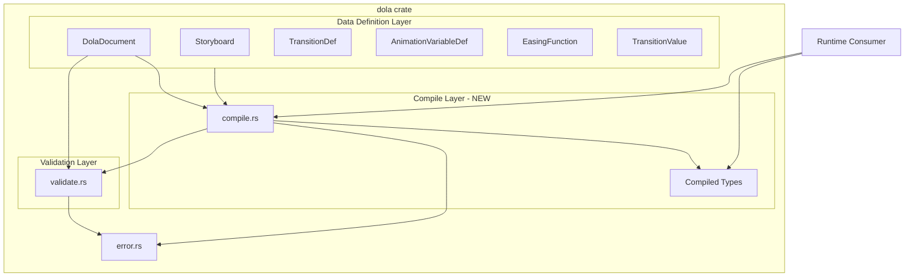
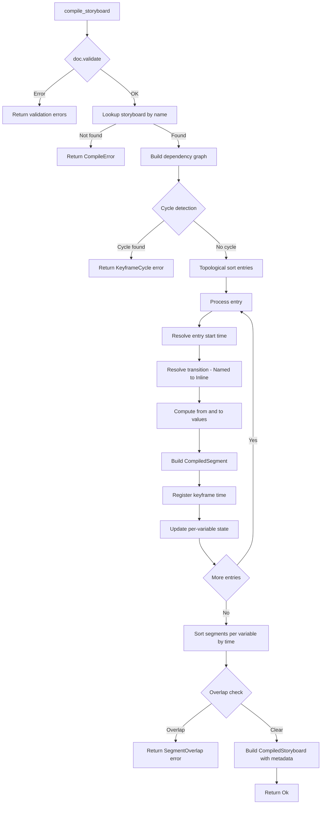
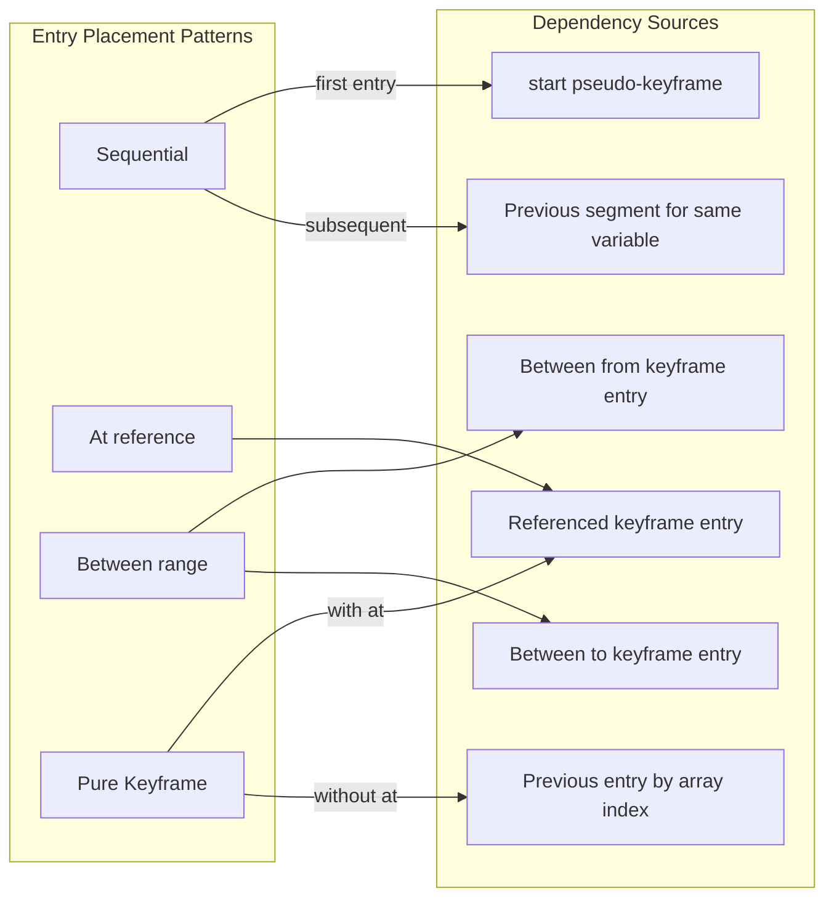
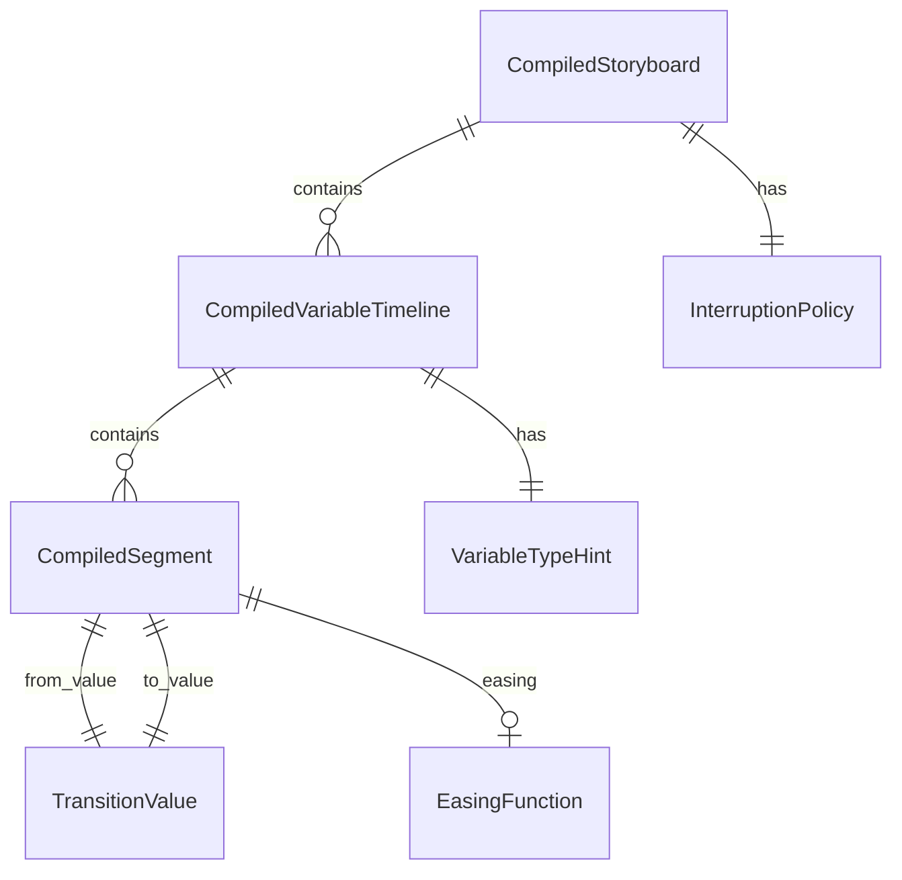

# Design Document: dola-compiled-transition

## Overview

**Purpose**: dolaクレートのストーリーボード宣言定義を、ランタイムが直接消費可能な「コンパイル済みトランジション」データ構造にコンパイルする機能を提供する。

**Users**: dolaクレートの利用者（wintf統合層、将来のarekaランタイム）が、キーフレームDAG解決やトランジション参照解決を行わずに、セグメント列から直接アニメーション値を計算できるようにする。

**Impact**: dolaクレートに `compile.rs` モジュール、コンパイル済み型定義、コンパイルAPI、新エラーバリアントを追加。既存のpublic APIに対する破壊的変更なし。

### Goals
- ストーリーボードの宣言的定義を変数ごとの時系列セグメント列に平坦化する
- キーフレーム参照・トランジション参照をすべてコンパイル時に解決する
- ランタイムが必要とするメタ情報（time_scale、loop_count、変数型ヒント等）をコンパイル結果に含める
- 既存の DolaError / Validate パターンとの一貫性を維持する

### Non-Goals
- ランタイム再生エンジン（時刻→値の補間計算）
- イージング関数の評価ロジック
- ループ展開の実行
- interruption_policy の競合解決ロジック
- Windows Animation Manager との統合

## Architecture

### Existing Architecture Analysis

dolaクレートは純粋なデータ定義クレートとして設計されている。

| 責務レイヤ | モジュール | パターン |
|-----------|-----------|---------|
| データ定義 | document.rs, storyboard.rs, transition.rs, easing.rs, variable.rs, value.rs | serde derive、BTreeMap、#[serde(untagged)] |
| バリデーション | validate.rs | Validate トレイト、Vec&lt;DolaError&gt; 蓄積パターン |
| ビルダー | builder.rs | Builder パターン |
| エラー定義 | error.rs | DolaError enum + Display + Error |
| 再生状態 | playback.rs | 状態enum + リクエスト型 |
| エクスポート | lib.rs | pub use フラットエクスポート |

コンパイラは「バリデーション済みのデータ定義 → ランタイム消費用データ」への変換レイヤとして、validate.rs と同レベルに位置する。

### Architecture Pattern & Boundary Map



**Architecture Integration**:
- 選択パターン: dolaクレート内モジュール追加（gap-analysis Option A）
- 責務境界: Data Definition → Validation → **Compilation** → Runtime
- 既存パターン維持: BTreeMap、serde derive、Vec&lt;DolaError&gt; エラー収集、pub use エクスポート
- 新コンポーネント理由: 宣言定義からランタイム消費形式への変換は既存モジュールのいずれにも属さない独立した責務
- validate.rs の `collect_keyframe_names_from_ref` を `pub(crate)` に昇格して共有

### Technology Stack

| Layer | Choice / Version | Role | Notes |
|-------|------------------|------|-------|
| Language | Rust 2024 Edition | 実装言語 | プロジェクト標準 |
| Serialization | serde 1.x | Compiled Types の Serialize/Deserialize | 既存依存、追加不要 |
| Data Structures | std::collections::BTreeMap | 変数名→タイムラインのマップ | 既存パターン準拠 |

新規外部依存の追加なし。

## System Flows

### コンパイルフロー



### キーフレーム依存グラフの構築

エントリ配置パターンごとの依存関係:



### エントリ時刻解決ルール

| 配置パターン | base_time | segment_start | segment_end | keyframe_time |
|-------------|-----------|---------------|-------------|---------------|
| Sequential（初回） | compile start_time | base + delay | base + delay + duration | segment_end |
| Sequential（連結） | 同一変数の前セグメント end_time | base + delay | base + delay + duration | segment_end |
| at | KF時刻 + offset | base + delay | base + delay + duration | segment_end |
| between | from_KF時刻 | base + delay | to_KF時刻 | to_KF時刻 |
| Pure KF（at あり） | — | — | — | KF時刻 + offset |
| Pure KF（at なし） | — | — | — | 配列直前エントリのKF時刻 |

**between 固有ルール**: duration は to_KF時刻 - (from_KF時刻 + delay) で自動決定。TransitionDef.duration は無視。delay >= (to_KF時刻 - from_KF時刻) の場合はコンパイルエラー。

**duration 省略時**: 即時遷移として segment_start == segment_end のセグメントを生成（3.5）。

## Requirements Traceability

| Requirement | Summary | Components | Interfaces | Flows |
|-------------|---------|------------|------------|-------|
| 1.1 | 変数名→タイムラインのマップ | CompiledStoryboard | timelines: BTreeMap | — |
| 1.2 | セグメント配列、ギャップ許容 | CompiledVariableTimeline | segments: Vec | Overlap check |
| 1.3 | セグメントのフィールド定義 | CompiledSegment | start/end_time, from/to_value, easing | — |
| 1.4 | Object型即時切り替え | CompiledSegment | TransitionValue::Dynamic | Process entry |
| 1.5 | ルート構造体のメタ情報 | CompiledStoryboard | storyboard_name, start_time | — |
| 2.1 | 絶対時刻計算 | compile.rs | — | Process entry |
| 2.2 | delay加算 | compile.rs | — | Resolve time |
| 2.3 | at キーフレーム時刻解決 | compile.rs | — | Dependency graph, Resolve time |
| 2.4 | between 配置 | compile.rs | — | Dependency graph, Resolve time |
| 2.5 | 前エントリ連結 | compile.rs | — | Resolve time |
| 3.1 | Named→Inline 解決 | compile.rs | — | Resolve transition |
| 3.2 | from推論 | compile.rs | — | Compute values |
| 3.3 | relative_to計算 | compile.rs | — | Compute values |
| 3.4 | EasingFunction転写 | CompiledSegment | easing field | Build segment |
| 3.5 | duration省略→即時遷移 | CompiledSegment | start_time == end_time | Build segment |
| 4.1 | time_scale伝達 | CompiledStoryboard | time_scale field | Build result |
| 4.2 | loop_count伝達 | CompiledStoryboard | loop_count field | Build result |
| 4.3 | interruption_policy伝達 | CompiledStoryboard | interruption_policy field | Build result |
| 4.4 | time_scale事前適用なし | CompiledStoryboard | — | — |
| 5.1 | 変数型ヒント | VariableTypeHint | variable_type field | Build timeline |
| 5.2 | i64丸めヒント | VariableTypeHint::Integer | — | Build timeline |
| 5.3 | Object即時切り替えヒント | VariableTypeHint::Object | — | Build timeline |
| 5.4 | typewriter文字列 | VariableTypeHint::Integer | typewriter field | Build timeline |
| 5.5 | 合計再生時間 | CompiledVariableTimeline, CompiledStoryboard | base_duration, total_base_duration | Build result |
| 5.6 | min/max値域制約 | CompiledVariableTimeline | min_value, max_value | Build timeline |
| 6.1 | validate()内部呼び出し | compile_storyboard | — | Validate step |
| 6.2 | 循環依存検出 | compile.rs, DolaError | KeyframeCycle | Cycle detection |
| 6.3 | DolaError新バリアント | DolaError | KeyframeCycle, CompileError | — |
| 7.1 | コンパイル関数シグネチャ | compile_storyboard | doc, name, start_time | — |
| 7.2 | Result戻り値型 | compile_storyboard | Result&lt;CompiledStoryboard, Vec&lt;DolaError&gt;&gt; | — |
| 7.3 | public APIエクスポート | lib.rs | pub use | — |
| 7.4 | Serialize/Deserialize | Compiled Types | serde derive | — |

## Components and Interfaces

### Component Summary

| Component | Layer | Intent | Req Coverage | Key Dependencies | Contracts |
|-----------|-------|--------|--------------|------------------|-----------|
| CompiledStoryboard | Data | コンパイル結果ルート構造体 | 1.1, 1.5, 4.1-4.4, 5.5 | InterruptionPolicy (P0) | State |
| CompiledVariableTimeline | Data | 変数ごとのセグメント列+ヒント | 1.2, 5.1-5.6 | CompiledSegment (P0), VariableTypeHint (P0) | State |
| CompiledSegment | Data | 単一セグメントのデータ | 1.3, 1.4, 3.4, 3.5 | TransitionValue (P0), EasingFunction (P0) | State |
| VariableTypeHint | Data | 変数型情報+ランタイムヒント | 5.1-5.4 | — | State |
| compile_storyboard | Compile | コンパイルエントリポイント | 2.1-2.5, 3.1-3.3, 6.1-6.3, 7.1-7.2 | DolaDocument (P0), Validate (P0) | Service |
| DolaError (拡張) | Error | コンパイル固有エラー | 6.2, 6.3 | — | State |

### Compile Layer

#### compile_storyboard (関数)

| Field | Detail |
|-------|--------|
| Intent | DolaDocument + ストーリーボード名 + 開始時刻 → CompiledStoryboard |
| Requirements | 2.1-2.5, 3.1-3.3, 6.1-6.3, 7.1-7.2 |

**Responsibilities & Constraints**
- DolaDocument全体のバリデーションを前提条件として内部実行（6.1）
- キーフレーム依存グラフの構築と循環検出（6.2）
- トポロジカルソートによるエントリ処理順序の決定
- Named→Inline トランジション解決（3.1）
- from推論（直前セグメント終了値 or 変数初期値）（3.2）
- relative_to → to 値計算（3.3）
- セグメント重複検出（コンパイル後ポスト処理）

**Dependencies**
- Inbound: DolaDocument — コンパイル対象の完全定義 (P0)
- Inbound: Validate trait — 前提条件バリデーション (P0)
- Outbound: CompiledStoryboard — コンパイル結果 (P0)
- Outbound: DolaError — エラー報告 (P0)

**Contracts**: Service [x] / State [ ]

##### Service Interface

```rust
/// ストーリーボードをコンパイルする
///
/// # Preconditions
/// - doc は整形式の DolaDocument（内部で validate() を実行するため、
///   呼び出し側の事前バリデーションは不要）
/// - storyboard_name は doc.storyboard に存在する名前
/// - start_time >= 0.0
///
/// # Postconditions
/// - 成功時: CompiledStoryboard 内の全セグメントは絶対時刻を持ち、
///   各タイムラインのセグメントは時刻順ソート済みで重複なし
/// - 失敗時: Vec<DolaError> にすべてのエラーを収集して返却
///
/// # Invariants
/// - time_scale はセグメント時刻に事前適用されない
/// - Object型セグメントの easing は常に None
pub fn compile_storyboard(
    doc: &DolaDocument,
    storyboard_name: &str,
    start_time: f64,
) -> Result<CompiledStoryboard, Vec<DolaError>>;
```

**Implementation Notes**
- validate.rs の `collect_keyframe_names_from_ref` を `pub(crate)` で共有
- 依存グラフ構築時、"start" 疑似キーフレーム（時刻 = start_time）をルートノードとして扱う
- Multiple キーフレーム参照（KeyframeRef::Multiple）は全KF完了待機: 最遅KF時刻を使用
- Multiple キーフレーム + offset（`KeyframeRef::WithOffset { keyframes: KeyframeNames::Multiple([...]), offset }`）の場合: 全KFの最遅時刻を決定後、その時刻に offset を加算
- between 配置時、TransitionDef.duration は無視（delay は維持）

### Data Layer

#### CompiledStoryboard

| Field | Detail |
|-------|--------|
| Intent | コンパイル済みストーリーボードのルート構造体 |
| Requirements | 1.1, 1.5, 4.1-4.4, 5.5 |

##### State Management

```rust
#[derive(Debug, Clone, PartialEq, Serialize, Deserialize)]
pub struct CompiledStoryboard {
    /// 元のストーリーボード名
    pub storyboard_name: String,
    /// コンパイル起点の開始時刻（f64秒）
    pub start_time: f64,
    /// 変数名 → コンパイル済みタイムライン
    pub timelines: BTreeMap<String, CompiledVariableTimeline>,
    /// 再生速度倍率（ランタイム適用、事前適用なし）(4.1, 4.4)
    pub time_scale: f64,
    /// ループ回数 None=なし, Some(0)=無限, Some(n)=n回 (4.2)
    pub loop_count: Option<u32>,
    /// 割り込み終了戦略 (4.3)
    pub interruption_policy: InterruptionPolicy,
    /// ベース合計再生時間 time_scale未適用 全タイムラインの最大値 (5.5)
    pub total_base_duration: f64,
}
```

#### CompiledVariableTimeline

| Field | Detail |
|-------|--------|
| Intent | 変数ごとのセグメント列とランタイムヒント |
| Requirements | 1.2, 5.1-5.6 |

##### State Management

```rust
#[derive(Debug, Clone, PartialEq, Serialize, Deserialize)]
pub struct CompiledVariableTimeline {
    /// 変数型情報 (5.1)
    pub variable_type: VariableTypeHint,
    /// セグメント配列（時刻順ソート済み、重複なし）(1.2)
    pub segments: Vec<CompiledSegment>,
    /// このタイムラインのベース再生時間（最終セグメント end_time - start_time）(5.5)
    pub base_duration: f64,
    /// 値域下限 f64/i64のみ (5.6)
    #[serde(default, skip_serializing_if = "Option::is_none")]
    pub min_value: Option<f64>,
    /// 値域上限 f64/i64のみ (5.6)
    #[serde(default, skip_serializing_if = "Option::is_none")]
    pub max_value: Option<f64>,
}
```

#### CompiledSegment

| Field | Detail |
|-------|--------|
| Intent | 単一遷移セグメントの全情報を自己完結的に保持 |
| Requirements | 1.3, 1.4, 3.4, 3.5 |

##### State Management

```rust
#[derive(Debug, Clone, PartialEq, Serialize, Deserialize)]
pub struct CompiledSegment {
    /// セグメント開始時刻（絶対時刻、f64秒）
    pub start_time: f64,
    /// セグメント終了時刻（絶対時刻、f64秒）
    /// 即時遷移の場合は start_time と等しい (3.5)
    pub end_time: f64,
    /// 開始値 (1.3)
    pub from_value: TransitionValue,
    /// 終了値 (1.3)
    pub to_value: TransitionValue,
    /// イージング関数 (3.4)
    /// None = 線形補間 または Object型即時切り替え
    #[serde(default, skip_serializing_if = "Option::is_none")]
    pub easing: Option<EasingFunction>,
}
```

- 数値変数: from_value / to_value は `TransitionValue::Scalar(f64)`、easing は指定値
- Object変数: from_value / to_value は `TransitionValue::Dynamic(DynamicValue)`、easing は None、start_time == end_time (1.4)
- 即時遷移（duration=0）: start_time == end_time、easing は無意味

#### VariableTypeHint

| Field | Detail |
|-------|--------|
| Intent | ランタイムに変数型固有の処理方法を伝達 |
| Requirements | 5.1-5.4 |

##### State Management

```rust
#[derive(Debug, Clone, PartialEq, Serialize, Deserialize)]
#[serde(tag = "type", rename_all = "snake_case")]
pub enum VariableTypeHint {
    /// f64連続値（補間対応） (5.1)
    Float,
    /// i64離散値 (5.1, 5.2)
    /// 補間後の丸め処理が必要
    Integer {
        /// タイプライター文字列 (5.4)
        #[serde(default, skip_serializing_if = "Option::is_none")]
        typewriter: Option<String>,
    },
    /// Object型（即時切り替えのみ） (5.1, 5.3)
    Object,
}
```

- `#[serde(tag = "type")]` パターンは既存の `AnimationVariableDef` と同一
- Integer バリアントの存在自体が「丸め処理が必要」というヒント (5.2)
- Object バリアントの存在自体が「補間なし・即時切り替えのみ」というヒント (5.3)

### Error Layer (拡張)

#### DolaError 新バリアント

| Field | Detail |
|-------|--------|
| Intent | コンパイル固有エラーの追加 |
| Requirements | 6.2, 6.3 |

##### State Management

```rust
// error.rs に追加する新バリアント

/// キーフレーム循環依存 (6.2)
KeyframeCycle {
    storyboard: String,
    /// 循環に含まれるキーフレーム名のリスト
    cycle: Vec<String>,
},

/// コンパイル固有エラー（汎用）
CompileError {
    storyboard: String,
    entry_index: usize,
    reason: String,
},
```

- `KeyframeCycle`: トポロジカルソート時の循環検出で生成。cycle にはDFS探索で発見された循環パスのKF名を格納
- `CompileError`: セグメント重複、between の delay 超過、未定義ストーリーボード参照など、個別バリアント化するほどでない各種エラーに使用
- 既存の `Display` / `Error` 実装に新バリアント分の match arm を追加

## Data Models

### Domain Model



**集約ルート**: `CompiledStoryboard`
- 不変条件: 各タイムラインのセグメントは時刻順ソート済み、重複なし
- 不変条件: time_scale はセグメント時刻に事前適用されていない
- 不変条件: total_base_duration = max(各タイムラインの base_duration)

**CompiledSegment の不変条件**:
- `start_time <= end_time` （between の delay 超過、その他のエラーケースでこの不変条件が破られた場合はコンパイルエラーとして検出）

**値オブジェクト**（既存型の再利用）:
- `TransitionValue` — セグメントの from/to 値
- `EasingFunction` — イージング定義（Named or Parametric）
- `InterruptionPolicy` — 割り込み戦略

### Data Contracts & Integration

**シリアライズ形式**: serde による JSON/TOML/YAML（feature flag に準拠）

コンパイル結果の JSON 出力例:

```json
{
  "storyboard_name": "fade_in",
  "start_time": 0.0,
  "timelines": {
    "opacity": {
      "variable_type": { "type": "float" },
      "segments": [
        {
          "start_time": 0.0,
          "end_time": 1.0,
          "from_value": 0.0,
          "to_value": 1.0,
          "easing": "cubic_in_out"
        }
      ],
      "base_duration": 1.0,
      "min_value": 0.0,
      "max_value": 1.0
    }
  },
  "time_scale": 1.0,
  "loop_count": null,
  "interruption_policy": "conclude",
  "total_base_duration": 1.0
}
```

## Error Handling

### Error Strategy

コンパイルエラーは既存 DolaError パターンに準拠し、Vec&lt;DolaError&gt; に蓄積して一括返却する。

### Error Categories and Responses

| カテゴリ | エラー型 | 発生条件 | 回復方法 |
|---------|---------|---------|---------|
| バリデーション | 既存 DolaError | doc.validate() 失敗 | ドキュメント定義を修正 |
| 循環依存 | KeyframeCycle | キーフレーム依存グラフに循環あり | 循環するキーフレーム参照を修正 |
| 未定義参照 | CompileError | ストーリーボード名が doc に存在しない | 正しいストーリーボード名を指定 |
| 時刻矛盾 | CompileError | between の delay が区間を超過 | delay 値を修正 |
| セグメント重複 | CompileError | 同一変数の同一時間帯に複数セグメント | エントリの配置を修正 |

### エラー蓄積パターン

バリデーションエラーはそのまま返却。コンパイル固有エラーは発見次第 Vec に追加し、処理を可能な限り継続して全エラーを収集する。ただし、循環依存検出時はそれ以降のコンパイル処理を中断する（依存順序が決定不能なため）。

## Testing Strategy

### Unit Tests (compile_test.rs)

| テスト | 検証内容 | 対応要件 |
|-------|---------|---------|
| 単純順次ストーリーボード | 1変数・複数セグメントの時刻解決 | 2.1, 2.2, 2.5 |
| at 参照（前方・後方） | キーフレーム参照の時刻解決 | 2.3 |
| between 配置 | from/to KF間のセグメント配置 | 2.4 |
| Named トランジション解決 | Named→Inline の解決 | 3.1 |
| from 推論 | 直前セグメント終了値 / 初期値からの推論 | 3.2 |
| relative_to 計算 | from + relative_to → to の算出 | 3.3 |
| duration=0 即時遷移 | start_time == end_time のセグメント | 3.5 |
| Object 型即時切り替え | DynamicValue の即時切り替えセグメント | 1.4 |
| メタ情報伝達 | time_scale / loop_count / interruption_policy | 4.1-4.3 |
| time_scale 非適用 | セグメント時刻が time_scale で変化しないこと | 4.4 |
| 変数型ヒント | Float / Integer / Object の正しい判定 | 5.1-5.3 |
| typewriter ヒント | Integer + typewriter 文字列の伝達 | 5.4 |
| 合計再生時間 | base_duration / total_base_duration の計算 | 5.5 |
| min/max 値域 | 値域制約の伝達 | 5.6 |
| Serialize/Deserialize | コンパイル結果の JSON ラウンドトリップ | 7.4 |

### Error Tests

| テスト | 検証内容 | 対応要件 |
|-------|---------|---------|
| validate 失敗パススルー | 不正ドキュメントのバリデーションエラー返却 | 6.1 |
| 循環依存検出 | A→B→A のKF循環 | 6.2 |
| セグメント重複検出 | 同一変数の重複セグメント | — |
| between delay 超過 | delay >= between 区間 | — |
| 未定義ストーリーボード | 存在しないストーリーボード名 | — |

### Integration Tests (compile_integration_test.rs)

| テスト | 検証内容 |
|-------|---------|
| 複合ストーリーボード | 複数変数 + at/between/sequential 混在 |
| 全変数型混在 | Float + Integer + Object の同一ストーリーボード |
| Builder → Compile | DolaDocumentBuilder で構築 → compile_storyboard |
| 大規模エントリ | 100以上のエントリでの性能と正確性 |

## Performance Considerations

- トポロジカルソートは O(V+E)（V=エントリ数、E=依存エッジ数）で、通常のストーリーボード規模（数十〜数百エントリ）では無視できるコスト
- validate() の二重呼び出しコスト（コンパイル時の内部呼び出し + 呼び出し側の事前呼び出し）は、バリデーションがデータ走査のみで I/O なしのため無視できる
- コンパイル結果の Serialize はキャッシュ用途でオンデマンド実行される想定のため、コンパイル本体のクリティカルパスには影響しない

## File Change Summary

| ファイル | 変更種別 | 変更内容 |
|---------|---------|---------|
| `src/compile.rs` | 新規 | 全コンパイル済み型定義 + compile_storyboard 関数 + 内部ヘルパー |
| `src/lib.rs` | 変更 | `mod compile;` 追加 + pub use エクスポート追加 |
| `src/error.rs` | 変更 | KeyframeCycle, CompileError バリアント追加 + Display 実装 |
| `src/validate.rs` | 変更 | `collect_keyframe_names_from_ref` を `pub(crate)` に変更 |
| `tests/compile_test.rs` | 新規 | ユニットテスト |
| `tests/compile_integration_test.rs` | 新規 | 統合テスト |
