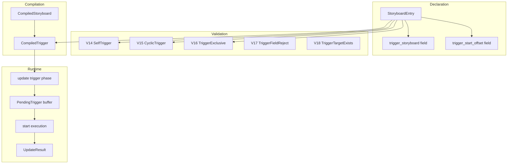
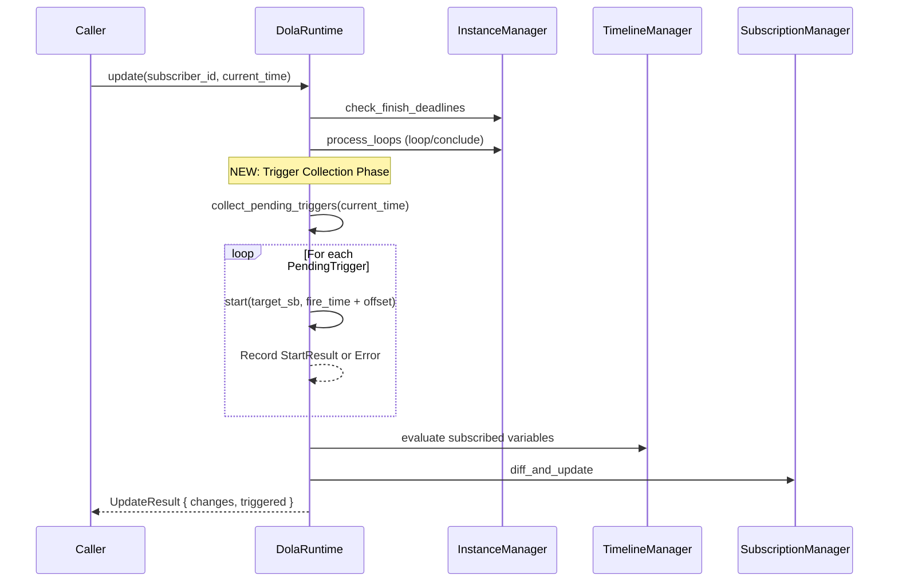
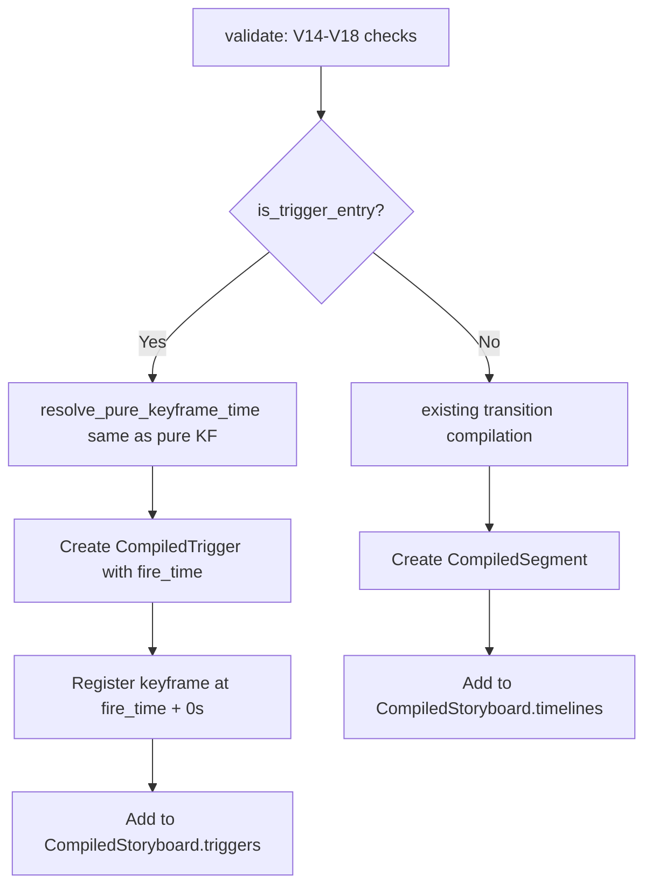
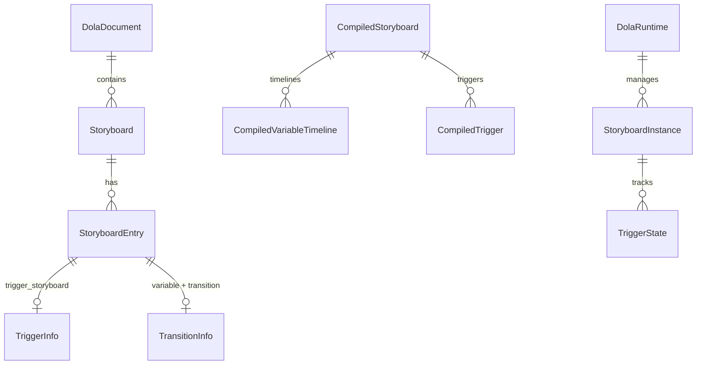

# Technical Design — dola-nested-storyboard

## Overview

**Purpose**: ストーリーボードのエントリから別のストーリーボードを宣言的に起動（トリガー）する機能を dola クレートに追加する。これにより、複雑なアニメーションシーケンスを分割・再利用可能な単位で構成し、1つのストーリーボードからの連鎖的オーケストレーションが可能になる。

**Users**: アニメーション作成者（dola JSON/TOML/YAML を記述する開発者）および dola ランタイム利用者（areka アプリケーション層）。

**Impact**: `StoryboardEntry` のデータモデル、`compile_storyboard()` のコンパイルパイプライン、`DolaRuntime::update()` のランタイムフロー、`validate()` のバリデーションルールに変更を加える。

### Goals
- ストーリーボード間の宣言的オーケストレーション（Fire-and-forget 並行起動）
- 既存の配置パターン（at/between/keyframe/連結）との完全な互換性維持
- コンパイル時の静的検証（自己参照、循環参照、フィールド排他チェック）
- 既存 JSON/TOML/YAML フォーマットとの後方互換性

### Non-Goals
- 子ストーリーボードの終了待機（Await / シーケンシャル起動）
- 子の再生時間を考慮したキーフレーム登録
- トリガー先の動的条件分岐
- ストーリーボード間の変数共有やデータ受け渡し

## Architecture

### Existing Architecture Analysis

現在の dola クレートは**宣言→コンパイル→ランタイム**の3段パイプラインで構成される。

```
DolaDocument ──→ compile_storyboard() ──→ CompiledStoryboard ──→ DolaRuntime
 (宣言的定義)       (静的解決)              (実行可能形式)         (再生エンジン)
```

**変更に影響する既存パターン**:
- `StoryboardEntry`: 4配置パターン（前エントリ連結 / KF起点 / KF間 / 純粋KF）
- `compile.rs`: エントリ内 KF 依存グラフ → トポロジカルソート → セグメント生成
- `validate.rs`: V1-V13 バリデーションルール（ドキュメント→ストーリーボード→エントリの3階層）
- `facade.rs`: `update()` は Step1(deadline) → Step2(loop) → Step3(evaluate) → Step4(diff)

**維持すべき制約**:
- `compile_storyboard()` は単一ストーリーボードスコープ（SB 間依存なし）
- `total_base_duration` はタイムラインセグメントの最大値から算出
- `update()` は `&mut self` で副作用が差分配信に限定

### Architecture Pattern & Boundary Map



**Architecture Integration**:
- **Selected pattern**: Option C（ハイブリッド）— 外部フォーマットは `StoryboardEntry` フィールド拡張、内部はコンパイラで正規化
- **Domain boundaries**: 宣言層（storyboard.rs）/ 検証層（validate.rs）/ コンパイル層（compile.rs）/ ランタイム層（runtime/）の4層分離を維持
- **Existing patterns preserved**: serde Optional フィールド、`compile_storyboard()` の単一 SB スコープ、Facade パターン
- **New components rationale**: `CompiledTrigger` はセグメントとは異なる時刻ベースイベントのため分離構造体が必要。`UpdateResult` はトリガー結果通知のために `update()` 返却型を拡張
- **Steering compliance**: Rust 型安全性、serde シリアライズ、tracing ロギング規約を遵守

### Technology Stack

| Layer       | Choice / Version | Role in Feature                                            | Notes                                               |
| ----------- | ---------------- | ---------------------------------------------------------- | --------------------------------------------------- |
| Data Model  | serde 1          | `StoryboardEntry` フィールド追加の自動シリアライズ         | `#[serde(default, skip_serializing_if)]` で後方互換 |
| Compilation | 既存 compile.rs  | `CompiledTrigger` 生成、純粋KFと同パターンのタイミング解決 | 変更は局所的                                        |
| Validation  | 既存 validate.rs | V14-V18 新規ルール追加                                     | ドキュメントレベル DFS                              |
| Runtime     | 既存 facade.rs   | `update()` 内トリガー実行フェーズ追加                      | 中間バッファ方式                                    |

## System Flows

### トリガー実行フロー（update 内）



### コンパイル時トリガー処理フロー



## Requirements Traceability

| Requirement | Summary                      | Components                              | Interfaces    | Flows                |
| ----------- | ---------------------------- | --------------------------------------- | ------------- | -------------------- |
| 1.1         | トリガー発火                 | StoryboardEntry, CompiledTrigger        | -             | update trigger phase |
| 1.2         | 4配置パターン統合            | compile.rs (resolve_pure_keyframe_time) | -             | compile flow         |
| 1.3         | variable/transition排他      | validate.rs (V16)                       | -             | -                    |
| 1.4         | keyframe登録(0秒)            | compile.rs (keyframe_times)             | -             | compile flow         |
| 1.5         | トリガー先存在確認           | validate.rs (V18)                       | -             | -                    |
| 2.1         | update内自動start            | DolaRuntime (update)                    | UpdateResult  | update trigger phase |
| 2.2         | 競合エラー通知               | DolaRuntime (update)                    | TriggerResult | update trigger phase |
| 2.3         | 独立インスタンス(F&F)        | InstanceManager (既存start)             | StartResult   | update trigger phase |
| 2.4         | 親子ライフサイクル独立       | InstanceManager (既存設計)              | -             | -                    |
| 2.5         | トリガー結果追跡             | UpdateResult                            | UpdateResult  | update trigger phase |
| 3.1         | 自己参照検出                 | validate.rs (V14)                       | DolaError     | -                    |
| 3.2         | 循環参照検出                 | validate.rs (V15)                       | DolaError     | -                    |
| 3.3         | duration非影響(0秒)          | compile.rs (total_base_duration)        | -             | compile flow         |
| 3.4         | トランジションフィールド拒否 | validate.rs (V17)                       | DolaError     | -                    |
| 3.5         | DolaError拡張                | error.rs                                | DolaError     | -                    |
| 4.1         | JSON/TOML/YAML対応           | StoryboardEntry (serde)                 | -             | -                    |
| 4.2         | 最小構成                     | StoryboardEntry                         | -             | -                    |
| 4.3         | trigger_start_offset         | StoryboardEntry, CompiledTrigger        | -             | -                    |
| 4.4         | at/between/keyframe組合せ    | compile.rs                              | -             | compile flow         |
| 4.5         | 混在配置                     | StoryboardEntry (Vec)                   | -             | -                    |
| 5.1         | ループ反復ごと再実行         | TriggerState, loop_controller           | -             | update trigger phase |
| 5.2         | 無限ループでのトリガー       | TriggerState                            | -             | update trigger phase |
| 5.3         | 子ループ独立                 | InstanceManager (既存設計)              | -             | -                    |
| 5.4         | 競合解決                     | conflict_resolver (既存)                | -             | update trigger phase |

## Components and Interfaces

| Component            | Domain/Layer | Intent                     | Req Coverage     | Key Dependencies                           | Contracts |
| -------------------- | ------------ | -------------------------- | ---------------- | ------------------------------------------ | --------- |
| StoryboardEntry      | Declaration  | トリガーフィールド追加     | 1.1-1.5, 4.1-4.5 | TransitionRef (P0)                         | State     |
| CompiledTrigger      | Compilation  | トリガー発火情報の保持     | 1.4, 3.3, 4.3    | CompiledStoryboard (P0)                    | -         |
| validate.rs V14-V18  | Validation   | トリガー固有バリデーション | 3.1-3.5          | DolaDocument (P0)                          | -         |
| DolaRuntime.update() | Runtime      | トリガー発火・実行         | 2.1-2.5, 5.1-5.4 | InstanceManager (P0), TimelineManager (P0) | Service   |
| UpdateResult         | Runtime      | update返却型               | 2.2, 2.5         | -                                          | State     |
| TriggerState         | Runtime      | 発火状態管理               | 5.1, 5.2         | StoryboardInstance (P0)                    | State     |
| DolaError variants   | Error        | トリガーエラー型           | 3.1-3.5          | -                                          | -         |

### Declaration Layer

#### StoryboardEntry（フィールド拡張）

| Field        | Detail                                                       |
| ------------ | ------------------------------------------------------------ |
| Intent       | トリガーエントリを宣言的に記述可能にするためのフィールド追加 |
| Requirements | 1.1, 1.2, 1.3, 1.4, 1.5, 4.1, 4.2, 4.3, 4.4, 4.5             |

**Responsibilities & Constraints**
- `trigger_storyboard: Option<String>` — トリガー対象ストーリーボード名
- `trigger_start_offset: Option<f64>` — トリガー時刻に対する相対オフセット（秒）
- 既存フィールド（`variable`, `transition`, `at`, `between`, `keyframe`）との排他制約: `trigger_storyboard` と `variable`/`transition` は同時指定不可
- `at`/`between`/`keyframe` はトリガーエントリでも使用可能（タイミング制御）
- 全フィールドは `Option` + `#[serde(default, skip_serializing_if)]` で後方互換

**Dependencies**
- Inbound: compile.rs — コンパイル時に trigger_storyboard を参照 (P0)
- Inbound: validate.rs — バリデーション時に排他チェック (P0)

**Contracts**: State [x]

##### State Management

新規フィールド定義:

```rust
pub struct StoryboardEntry {
    // ... existing fields ...

    /// トリガー対象ストーリーボード名
    #[serde(default, skip_serializing_if = "Option::is_none")]
    pub trigger_storyboard: Option<String>,

    /// トリガー開始オフセット（トリガー発火時刻 + offset = 子SBの start_time）
    #[serde(default, skip_serializing_if = "Option::is_none")]
    pub trigger_start_offset: Option<f64>,
}
```

エントリ分類の正規化ロジック:
- `trigger_storyboard.is_some()` → トリガーエントリ
- `variable.is_some() && transition.is_some()` → トランジションエントリ
- 上記以外で `keyframe.is_some()` → 純粋キーフレームエントリ

### Compilation Layer

#### CompiledTrigger

| Field        | Detail                               |
| ------------ | ------------------------------------ |
| Intent       | コンパイル済みトリガー発火情報の保持 |
| Requirements | 1.4, 3.3, 4.3                        |

**Responsibilities & Constraints**
- コンパイル時に確定した絶対発火時刻を保持
- `CompiledStoryboard.triggers` に格納（`timelines` とは分離）
- `total_base_duration` 計算には寄与しない（0秒完了原則）

**Dependencies**
- Inbound: compile.rs — compile_storyboard() で生成 (P0)
- Outbound: DolaRuntime — update() でトリガー発火判定に使用 (P0)

**Contracts**: State [x]

##### State Management

```rust
/// コンパイル済みトリガー情報
#[derive(Debug, Clone, PartialEq, Serialize, Deserialize)]
pub struct CompiledTrigger {
    /// トリガー発火時刻（絶対時刻、f64秒）
    pub fire_time: f64,
    /// 対象ストーリーボード名
    pub target_storyboard: String,
    /// 開始オフセット（fire_time + start_offset = 子SBの start_time）
    #[serde(default, skip_serializing_if = "Option::is_none")]
    pub start_offset: Option<f64>,
    /// 元エントリのインデックス（デバッグ用）
    pub source_entry_index: usize,
}
```

`CompiledStoryboard` への追加:

```rust
pub struct CompiledStoryboard {
    // ... existing fields ...

    /// トリガーリスト（fire_time 順ソート済み）
    #[serde(default, skip_serializing_if = "Vec::is_empty")]
    pub triggers: Vec<CompiledTrigger>,
}
```

**Implementation Notes**
- コンパイル時: トリガーエントリは `resolve_pure_keyframe_time()` と同パターンで `fire_time` を解決。`keyframe_times` に fire_time を登録（0秒完了のためkeyframe_time = fire_time）
- `triggers` は fire_time 昇順でソート

### Validation Layer

#### validate.rs 新規ルール（V14-V18）

| Field        | Detail                                   |
| ------------ | ---------------------------------------- |
| Intent       | トリガー固有のコンパイル時バリデーション |
| Requirements | 1.3, 1.5, 3.1, 3.2, 3.4, 3.5             |

**Responsibilities & Constraints**
- V9 (既存ルールの更新): 「エントリに variable/transition がない場合、keyframe または trigger_storyboard のいずれかが必須」に変更
- V14: 自己参照検出 — エントリの `trigger_storyboard` が自身のストーリーボード名と一致
- V15: 循環参照検出 — ドキュメント内全ストーリーボードのトリガーグラフで DFS、O(V+E) で循環検出
- V16: トリガーエントリの排他チェック — `trigger_storyboard` と `variable`/`transition` の同時指定禁止
- V17: トランジション固有フィールド拒否 — トリガーエントリに `from`/`to`/`easing`/`duration` がある場合エラー
- V18: トリガー対象存在確認 — `trigger_storyboard` の値が `doc.storyboard` に存在するか

**Dependencies**
- Inbound: compile_storyboard() — `doc.validate()` 経由で自動実行 (P0)
- Outbound: DolaError — 新規エラーバリアント (P0)

**Implementation Notes**
- V14 は O(1) の文字列比較
- V15 は DFS で `HashMap<String, Vec<String>>` のトリガーグラフを走査（ストーリーボード数は通常 10 以下のため十分高速）
- V16, V17 は既存 V7-V9 と同パターンのフィールド存在チェック
- V18 は既存 V4, V5 と同パターンの名前解決チェック

### Runtime Layer

#### DolaRuntime.update()（トリガー実行フェーズ追加）

| Field        | Detail                                                     |
| ------------ | ---------------------------------------------------------- |
| Intent       | update() 内でトリガー発火を検知し、自動的に start() を実行 |
| Requirements | 2.1, 2.2, 2.3, 2.4, 2.5, 5.1, 5.2, 5.4                     |

**Responsibilities & Constraints**
- `update()` の既存 Step2（ループ処理）と Step3（評価）の間に「トリガー収集→実行」フェーズを挿入
- 中間バッファ方式: `Vec<PendingTrigger>` にトリガー対象を収集 → `&mut self` 借用解放後に `start()` を順次実行
- トリガー実行結果は `UpdateResult.triggered` に格納

**Dependencies**
- Inbound: Caller — update() API 呼び出し (P0)
- Outbound: InstanceManager — トリガー状態参照 (P0)
- Outbound: start() — 既存 start API を内部呼び出し (P0)

**Contracts**: Service [x]

##### Service Interface

```rust
impl DolaRuntime {
    /// 差分更新取得（トリガー実行を含む）
    pub fn update(
        &mut self,
        subscriber_id: u64,
        current_time: f64,
    ) -> UpdateResult {
        // Step 1: Finish deadline チェック（既存）
        // Step 2: ループ処理 + 自然終了検知（既存）
        // Step 2.5 [NEW]: トリガー収集・実行
        // Step 3: 購読変数の評価（既存）
        // Step 4: 差分検出（既存）
    }
}
```

- Preconditions: `subscriber_id` が有効、`current_time >= 0.0`
- Postconditions: 発火条件を満たすトリガーが全て実行され、結果が `UpdateResult.triggered` に格納される
- Invariants: トリガー実行順は `fire_time` 昇順。同一 `fire_time` のトリガーは元エントリのインデックス順

**Implementation Notes**
- 中間バッファ方式の詳細: `collect_pending_triggers()` で `Vec<PendingTrigger>` を確保し、ループ外で `start_internal()` を順次実行。`&mut self` の二重借用を回避
- `start()` の競合エラーは `TriggerResult::Error` として記録し、`update()` 全体をエラーで中断しない
- ループ周回時のトリガー再発火: `TriggerTracker.fired` フラグを周回ごとにリセット

#### UpdateResult

| Field        | Detail                                          |
| ------------ | ----------------------------------------------- |
| Intent       | update() 返却型をトリガー結果を含む構造体に拡張 |
| Requirements | 2.2, 2.5                                        |

**Contracts**: State [x]

##### State Management

```rust
/// update() の返却値
#[derive(Debug, Clone)]
pub struct UpdateResult {
    /// 変数の差分変化（既存の Vec<(String, EvaluatedValue)> と同等）
    pub changes: Vec<(String, EvaluatedValue)>,
    /// トリガー実行結果のリスト
    pub triggered: Vec<TriggerResult>,
}

/// 個別トリガーの実行結果
#[derive(Debug, Clone)]
pub enum TriggerResult {
    /// トリガー成功
    Started {
        /// 起動元ストーリーボード名
        source_storyboard: String,
        /// 起動先ストーリーボード名
        target_storyboard: String,
        /// 起動結果
        start_result: StartResult,
    },
    /// トリガー失敗（競合等）
    Error {
        /// 起動元ストーリーボード名
        source_storyboard: String,
        /// 起動先ストーリーボード名
        target_storyboard: String,
        /// エラー内容
        error: RuntimeError,
    },
}
```

#### TriggerState

| Field        | Detail                                 |
| ------------ | -------------------------------------- |
| Intent       | インスタンスごとのトリガー発火状態管理 |
| Requirements | 5.1, 5.2                               |

**Contracts**: State [x]

##### State Management

```rust
/// トリガー発火状態（StoryboardInstance に埋め込み）
#[derive(Debug, Clone)]
pub(crate) struct TriggerState {
    /// CompiledTrigger のインデックス
    pub trigger_index: usize,
    /// 当該周回で発火済みか
    pub fired: bool,
}
```

`StoryboardInstance` への追加:

```rust
pub(crate) struct StoryboardInstance {
    // ... existing fields ...

    /// トリガー発火状態（周回ごとにリセット）
    pub trigger_states: Vec<TriggerState>,
}
```

**トリガー発火判定ロジック**:
- **ループ周回時** (`advance_loop()`): 全 `trigger_states` の `fired = false` にリセット
- **loop_start_time**: 現在周回の開始時刻（`advance_loop()` で更新される）
- **発火判定条件**: `current_time >= loop_start_time + trigger.fire_time` かつ `!fired`
  - 各周回で `loop_start_time` が更新されるため、同一トリガーが周回ごとに再発火
  - `fired` フラグで同一周回内での重複発火を防止

### Error Layer

#### DolaError 新規バリアント

| Field        | Detail                             |
| ------------ | ---------------------------------- |
| Intent       | トリガー固有のコンパイル時エラー型 |
| Requirements | 3.1, 3.2, 3.5                      |

```rust
pub enum DolaError {
    // ... existing variants ...

    /// トリガー自己参照（V14）
    TriggerSelfReference {
        storyboard: String,
        entry_index: usize,
    },

    /// トリガー循環参照（V15）
    TriggerCycle {
        /// 循環パス（例: ["A", "B", "C", "A"]）
        cycle: Vec<String>,
    },

    /// トリガーエントリの排他違反（V16）
    TriggerExclusiveViolation {
        storyboard: String,
        entry_index: usize,
        reason: String,
    },
}
```

## Data Models

### Domain Model



**Invariants**:
- `StoryboardEntry` は `TriggerInfo` と `TransitionInfo` のどちらか一方のみ（排他）
- `CompiledTrigger.fire_time` はコンパイル時に確定し、ランタイムで変化しない
- `TriggerState.fired` はループ周回ごとにリセットされる

## Error Handling

### Error Strategy

トリガー固有のエラーは2つのフェーズで発生する:

**コンパイル時（DolaError）** — 静的検証で全て検出可能
- `TriggerSelfReference`: 自己参照（即座に中断）
- `TriggerCycle`: 循環参照（即座に中断）
- `TriggerExclusiveViolation`: フィールド排他違反

**ランタイム（RuntimeError）** — トリガー実行時の動的エラー
- `Conflict`: Never ポリシーとの競合 → `TriggerResult::Error` に格納、`update()` は中断しない
- `StoryboardNotFound`: ドキュメント再読み込みでトリガー先が消失 → `TriggerResult::Error` に格納

### Error Categories and Responses

| Category         | Error                     | Response                                   |
| ---------------- | ------------------------- | ------------------------------------------ |
| Static (compile) | TriggerSelfReference      | validate() で即時報告、コンパイル中断      |
| Static (compile) | TriggerCycle              | validate() で即時報告、コンパイル中断      |
| Static (compile) | TriggerExclusiveViolation | validate() で即時報告、コンパイル中断      |
| Runtime (update) | Conflict on trigger       | TriggerResult::Error に記録、update() 継続 |
| Runtime (update) | StoryboardNotFound        | TriggerResult::Error に記録、update() 継続 |

## Testing Strategy

### Unit Tests
- `StoryboardEntry` のトリガーフィールド serde 往復テスト（JSON/TOML/YAML）
- `CompiledTrigger` の `fire_time` 計算（4配置パターン × トリガー）
- validate V14: 自己参照検出
- validate V15: 循環参照検出（A→B→A、A→B→C→A、深いチェーン）
- validate V16: trigger + variable 排他チェック

### Integration Tests
- `compile_storyboard()` でトリガーエントリ含むストーリーボードのコンパイル成功
- `update()` でトリガー発火 → 子 SB 自動開始 → `UpdateResult.triggered` 検証
- ループストーリーボード内トリガーの周回ごと再発火
- 複数トリガーの同時発火（同一 fire_time）
- トリガー先の Never ポリシー競合時の `TriggerResult::Error` 検証

### E2E Tests
- トリガーチェーン A→B→C の3段連鎖起動
- ループ + トリガー + 競合解決の組み合わせ
- `load_document()` → `start()` → `update()` × N → 全インスタンス終了 の完全シナリオ
