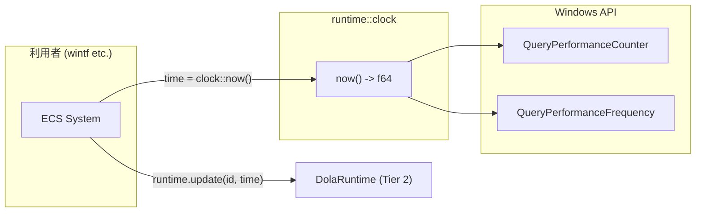

# Design Document — dola-runtime-2-clock

## Overview

**Purpose**: OS 起動時からの高精度な現在時刻（f64 秒）を取得するユーティリティ関数を提供する。dola ランタイムの `update()` 呼び出し時に利用者が時刻を取得する手段として機能する。

**Users**: wintf ECS システムなど、dola ランタイムの利用者。facade は clock を直接参照しない（利用者が `now()` で時刻を取得し、`update()` に渡す）。

**Impact**: `Cargo.toml` に Windows ターゲット依存を追加。`runtime/clock.rs` を 1 ファイル新規作成。既存コードの変更は `runtime/mod.rs` への 1 行追加と `lib.rs` の `runtime` feature 削除（BREAKING CHANGE）。

### Goals

- `now() -> f64` 関数の提供（OS 起動時からの秒数、マイクロ秒級精度）
- `#[cfg(target_os = "windows")]` による条件コンパイル
- QueryPerformanceCounter / QueryPerformanceFrequency ベースの高精度時刻取得
- ステートレス設計（グローバル状態なし、構造体なし）

### Non-Goals

- クロスプラットフォーム対応（Windows 専用）
- facade への統合（clock は facade とは独立）
- タイムゾーン変換やカレンダー機能
- frequency のキャッシュ（ステートレス維持を優先）

---

## Architecture

### Architecture Pattern & Boundary Map



**Architecture Integration**:
- **選定パターン**: ステートレスな関数 1 つ。構造体なし
- **境界**: `pub` 関数として `dola::runtime::clock::now()` パスで公開。facade は依存しない（利用者経由で時刻が渡される）
- **既存パターン準拠**: wintf の `FrameTime::get_precise_time()` と同様の unsafe パターン（関数内 `use` 局所化 + 最小 `unsafe` ブロック）
- **条件コンパイル**: `#[cfg(target_os = "windows")]` のみ。feature gate ではなく OS 自動判定
- **Steering 準拠**: `unsafe` は Win32 API 呼び出しのみに限定（`structure.md` の unsafe 隔離原則）

### Technology Stack

| Layer | Choice / Version | Role in Feature | Notes |
|-------|------------------|-----------------|-------|
| Time Utility | Win32 `QueryPerformanceCounter` / `QueryPerformanceFrequency` | OS 起動時からの高精度時刻（マイクロ秒級） | `windows` クレート経由 |
| Windows Bindings | `windows` 0.62.2 | Win32 API バインディング | features: `Win32_System_Performance` |

> ワークスペース Cargo.toml に `Win32_System_Performance` が既存。dola 側は `workspace = true` で参照。詳細は `research.md` の「ワークスペース windows 依存との整合性」参照。

---

## Requirements Traceability

| Requirement | Summary | Components | Interfaces |
|-------------|---------|------------|------------|
| 1.1 | `now() -> f64` 公開関数 | Clock | `now()` |
| 1.2 | OS 起動後経過時間を f64 秒で取得 | Clock | `now()` |
| 1.3 | ms 精度以上 | Clock | `now()` |
| 2.1 | QPC / QPF 使用 | Clock | 内部実装 |
| 2.2 | counter / frequency 除算 | Clock | 内部実装 |
| 2.3 | unsafe 限定 | Clock | 内部実装 |
| 2.4 | 外部クレート依存なし | Clock | — |
| 3.1 | clock.rs 配置 + cfg(target_os) | Clock | — |
| 3.2 | mod.rs 条件付き公開 | Clock | — |
| 3.3 | 非 Windows 除外 | Clock | — |
| 3.4 | runtime/ 無条件 | Clock | — |
| 4.1 | target 依存セクション | — | Cargo.toml |
| 4.2 | workspace = true | — | Cargo.toml |
| 4.3 | Win32_System_Performance feature | — | Cargo.toml |
| 4.4 | 非 Windows 除外 | — | Cargo.toml |
| 5.1 | clock サブモジュール条件公開 | Clock | `runtime::clock` |
| 5.2 | pub 可視性 | Clock | `now()` |
| 5.3 | 内部実装詳細非公開 | Clock | — |
| 6.1 | 単調増加テスト | — | テスト |
| 6.2 | 正の有限値テスト | — | テスト |
| 6.3 | ms 精度テスト | — | テスト |
| 6.4 | テストモジュール配置 | — | テスト |

---

## Components and Interfaces

| Component | Domain/Layer | Intent | Req Coverage | Key Dependencies | Contracts |
|-----------|-------------|--------|-------------|-----------------|-----------|
| Clock | Utility | OS 起動時からの高精度時刻取得 | 1, 2, 3, 4, 5 | Win32 QPC/QPF (P0) | Service |

### Utility Layer

#### Clock

| Field | Detail |
|-------|--------|
| Intent | OS 起動時からの経過秒数をマイクロ秒級精度で取得するユーティリティ関数 |
| Requirements | 1.1, 1.2, 1.3, 2.1, 2.2, 2.3, 2.4, 3.1, 3.2, 3.3, 3.4, 5.1, 5.2, 5.3 |

**Responsibilities & Constraints**
- QueryPerformanceCounter / QueryPerformanceFrequency ベース（マイクロ秒級精度）
- 戻り値: f64 秒（OS 起動時からの経過秒数）
- `#[cfg(target_os = "windows")]` で条件コンパイル
- ステートレス（グローバル状態なし、frequency キャッシュなし）
- 公開 API は `now()` 関数のみ

**Dependencies**
- External: Win32 API `QueryPerformanceCounter` / `QueryPerformanceFrequency` via `windows` crate (P0)

**Contracts**: Service [x]

##### Service Interface

```rust
/// OS 起動時からの現在時刻（f64 秒）を高精度で取得する。
///
/// `QueryPerformanceCounter` の戻り値（カウント）を
/// `QueryPerformanceFrequency` で除算して秒に変換。
/// ハードウェアレベルの高精度タイマーを使用し、マイクロ秒級の精度を提供。
///
/// アニメーションエンジンのフレーム間時間差計測に使用する想定。
/// 利用者は本関数の戻り値を `runtime.update(subscriber_id, time)` に渡す。
#[cfg(target_os = "windows")]
pub fn now() -> f64
```

- **Preconditions**: なし（Windows 環境で実行中であること。条件コンパイルにより保証）
- **Postconditions**: 戻り値は OS 起動からの秒数（f64, 常に非負、マイクロ秒級精度）
- **Invariants**: 単調増加（ハードウェアレベルで保証。Windows XP 以降）

**Implementation Notes**
- `QueryPerformanceCounter` はハードウェアタイマー（通常 TSC または HPET）を使用
- 分解能は通常 1MHz 以上（マイクロ秒級）、システム依存
- f64 の仮数部 53bit で約 285 年の精度維持が可能
- `unsafe` ブロックは Win32 API 呼び出しのみ。副作用なし、スレッドセーフ
- 両 API とも Windows XP 以降で常に成功（エラーハンドリング不要）
- `use` 文は関数内に局所化（既存 wintf パターン準拠: `FrameTime::get_precise_time()`)
- frequency の値はシステム起動時に固定されるが、ステートレス維持のため毎回取得する（性能影響はナノ秒オーダー）

---

## Error Handling

### Error Strategy

- `now()` はエラーを返さない（QPC / QPF は Windows XP 以降で常に成功する Win32 API）
- 戻り値は `Result` ではなく `f64` を直接返す
- panic パスなし

---

## Testing Strategy

### Unit Tests

テストは `#[cfg(all(test, target_os = "windows"))]` で囲み、Windows ターゲット時のみ実行。

- **単調増加テスト**: `now()` を連続 2 回呼び出し、`t2 >= t1` であることを検証（6.1）
- **正の有限値テスト**: `now()` の戻り値が `0.0 < value` かつ `value.is_finite()` であることを検証（6.2）
- **ms 精度テスト**: `std::thread::sleep(Duration::from_millis(1))` 前後で `now()` の差分が `0.0` より大きいことを検証（6.3）

---

## Supporting References

### Cargo.toml 変更計画

```toml
# 本仕様実装時の Cargo.toml 状態（仕様1 で runtime feature 削除済み前提）
[dependencies]
serde = { version = "1", features = ["derive"] }
interpolation = "0.3.0"

[dependencies.serde_json]
version = "1"
optional = true

[dependencies.toml]
version = "0.8"
optional = true

[dependencies.serde_yaml]
version = "0.9"
optional = true

[target.'cfg(windows)'.dependencies]
windows = { workspace = true, features = ["Win32_System_Performance"] }

[features]
default = ["json"]
json = ["dep:serde_json"]
toml = ["dep:toml"]
yaml = ["dep:serde_yaml"]
```

> **注**: `runtime` feature は仕様 1 (core-types) で削除済み。本仕様では target 依存セクション追加のみ。

### モジュール構成

```
crates/dola/src/
├── lib.rs              # pub mod runtime; （無条件）
├── runtime/
│   ├── mod.rs          # #[cfg(target_os = "windows")] pub mod clock; 追加
│   └── clock.rs        # now() 関数（新規作成）
```

### QueryPerformanceCounter API 仕様

- **関数**: `QueryPerformanceCounter(lpPerformanceCount: *mut i64)`
- **戻り値**: 高精度パフォーマンスカウンターの現在値
- **起点**: OS 起動時（現代 Windows では保証）
- **スレッドセーフ**: Yes
- **失敗条件**: なし（Windows XP 以降で常に成功）
- **ドキュメント**: [QueryPerformanceCounter (profileapi.h)](https://learn.microsoft.com/windows/win32/api/profileapi/nf-profileapi-queryperformancecounter)

### QueryPerformanceFrequency API 仕様

- **関数**: `QueryPerformanceFrequency(lpFrequency: *mut i64)`
- **戻り値**: カウンター周波数（1 秒あたりのカウント数）
- **特性**: システム起動時に固定、セッション中不変
- **スレッドセーフ**: Yes
- **失敗条件**: なし（Windows XP 以降で常に成功）
- **ドキュメント**: [QueryPerformanceFrequency (profileapi.h)](https://learn.microsoft.com/windows/win32/api/profileapi/nf-profileapi-queryperformancefrequency)
