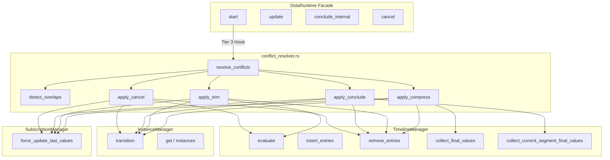
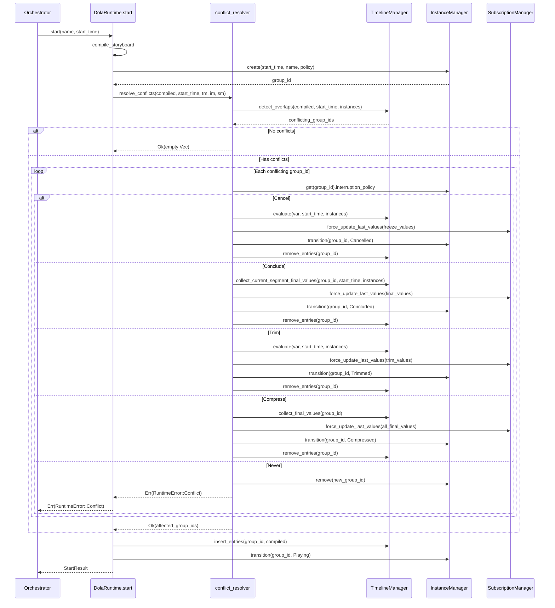
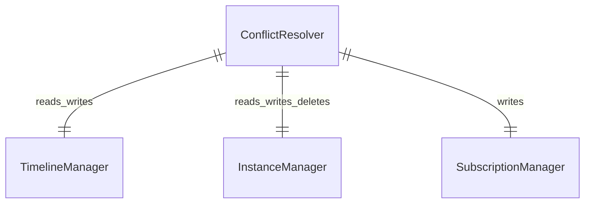

# Design Document — dola-runtime-4-conflict

## Overview

**Purpose**: dola ランタイムエンジンに競合検出と5種の終了戦略（Cancel / Conclude / Trim / Compress / Never）を提供し、同一変数に対する複数ストーリーボードの同時操作を安全に解決する。

**Users**: `DolaRuntime` facade の `start()` メソッドが自動的に競合解決を適用する。オーケストレーター（wintf ECS 等）は `InterruptionPolicy` を指定するのみで、競合解決ロジックを意識しない。

**Impact**: 既存 `facade.rs` の Tier 3 Hook に ConflictResolver を挿入し、`timeline_manager.rs` へ新メソッドを追加する。`RuntimeError` に `Conflict` バリアントを追加。公開 API の変更はない。

### Goals

- Tier 3 Hook（facade.rs L116-117）を実装し、`start()` 内で自動的に競合を検出・解決する
- 5種の `InterruptionPolicy` に対応した終了戦略を group_id 単位で一括適用する
- Never 戦略で競合した場合は `start()` を `RuntimeError::Conflict` で失敗させる
- 既存の公開 API（`DolaRuntime` trait）を一切変更しない

### Non-Goals

- ループ再生機能（`dola-runtime-5-loop` で対応）
- 新規の公開 API メソッド追加（競合解決は `start()` 内部で暗黙実行）
- マルチスレッドでの競合解決（シングルスレッド前提を維持）

---

## Architecture

> 発見フェーズの詳細は `research.md` を参照。本セクションは設計判断と構造のみ記述する。

### Existing Architecture Analysis

facade の `start()` メソッドに Tier 3 Hook（L116-117: `// 7. [Tier 3 Hook] 競合解決`）が配置済み。この位置はタイムテーブル挿入（`insert_entries()`）の**直前**であり、競合を検出してから新エントリを挿入する設計に合致する。

既存の終了処理パターン:
- `conclude_internal()`: `collect_final_values()` → `force_update_last_values()` → 状態遷移 → `remove_entries()` — **Compress 戦略で再利用可能**
- `cancel()`: 状態遷移 → `remove_entries()` → `remove()` — **Cancel 戦略の参考パターン**

### Architecture Pattern & Boundary Map

**Option C（ハイブリッド: フリー関数 + 新モジュール）** + **S1（個別引数渡し）** を採用。



**Architecture Integration**:
- **選定パターン**: フリー関数モジュール — `conflict_resolver::resolve_conflicts()` が唯一のエントリーポイント。内部で5戦略関数にディスパッチ
- **境界**: facade が各コンポーネントの `&mut` を個別に渡し、borrowck 制約を回避
- **既存パターン保持**: `instance_state.rs` の `from_policy()`、`timeline_manager.rs` の `remove_entries()` / `collect_final_values()` をそのまま再利用
- **新規コンポーネント理由**: 競合解決ロジックを独立モジュールに隔離し、テスト容易性と単一責務を確保
- **Steering 準拠**: `pub(crate)` スコープ、`RuntimeError` 既存定義の範囲内、`tracing` でログ出力

### Technology Stack

| Layer | Choice / Version | Role in Feature | Notes |
|-------|------------------|-----------------|-------|
| Runtime Core | Rust 2024 Edition | 競合解決ロジック全体 | 既存 `runtime/` サブモジュール内 |
| Interpolation | `interpolation` 0.3.0（既存） | Cancel/Trim の値評価 | 新規依存なし |
| Data Model | `InterruptionPolicy`（既存） | 5戦略のディスパッチキー | 変更なし |

---

## System Flows

### 競合解決フロー（start 内）



---

## Requirements Traceability

| Requirement | Summary | Components | Interfaces | Flows |
|-------------|---------|------------|------------|-------|
| 1.1 | 時間重複チェック | conflict_resolver | `detect_overlaps()` | 競合解決フロー |
| 1.2 | 競合 group_id リスト返却 | conflict_resolver | `detect_overlaps()` | 競合解決フロー |
| 1.3 | 重複なし → スキップ | conflict_resolver | `resolve_conflicts()` | 競合解決フロー |
| 1.4 | 複数変数独立チェック＋集約 | conflict_resolver | `detect_overlaps()` | 競合解決フロー |
| 1.5 | Playing/Paused フィルタ | conflict_resolver, InstanceManager | `detect_overlaps()` | 競合解決フロー |
| 2.1 | group_id 単位で終了戦略適用 | conflict_resolver | `resolve_conflicts()` | 競合解決フロー |
| 2.2 | 同一 group_id 全変数一括適用 | conflict_resolver, TimelineManager | `remove_entries()` | 競合解決フロー |
| 2.3 | 複数 group_id 個別 policy 適用 | conflict_resolver | `resolve_conflicts()` | 競合解決フロー |
| 3.1 | Cancel: start_time 時点の値で凍結 | conflict_resolver, TimelineManager | `evaluate()`, `force_update_last_values()` | 競合解決フロー |
| 3.2 | Cancel → Cancelled 遷移 | InstanceManager | `transition()` | 状態遷移 |
| 3.3 | Cancel: エントリ除去 | TimelineManager | `remove_entries()` | 競合解決フロー |
| 4.1 | Conclude: 現在セグメント最終値ジャンプ | conflict_resolver, TimelineManager | `collect_current_segment_final_values()` | 競合解決フロー |
| 4.2 | Conclude → Concluded 遷移 | InstanceManager | `transition()` | 状態遷移 |
| 4.3 | Conclude: エントリ除去 | TimelineManager | `remove_entries()` | 競合解決フロー |
| 5.1 | Trim: start_time で切断 | conflict_resolver, TimelineManager | `evaluate()` | 競合解決フロー |
| 5.2 | Trim: 値を購読者に伝播 | SubscriptionManager | `force_update_last_values()` | 競合解決フロー |
| 5.3 | Trim: 以降のセグメント除去 | TimelineManager | `remove_entries()` | 競合解決フロー |
| 5.4 | Trim → Trimmed 遷移 | InstanceManager | `transition()` | 状態遷移 |
| 6.1 | Compress: 全体最終値ジャンプ | TimelineManager | `collect_final_values()` | 競合解決フロー |
| 6.2 | Compress: 全トランジション完走扱い | SubscriptionManager | `force_update_last_values()` | 競合解決フロー |
| 6.3 | Compress → Compressed 遷移 | InstanceManager | `transition()` | 状態遷移 |
| 6.4 | Compress: エントリ除去 | TimelineManager | `remove_entries()` | 競合解決フロー |
| 7.1 | Never: start() エラー終了 | conflict_resolver | `resolve_conflicts()` | 競合解決フロー |
| 7.2 | Never: RuntimeError::Conflict | conflict_resolver | `resolve_conflicts()` | 競合解決フロー |
| 7.3 | Never: 部分競合でも全体拒否 | conflict_resolver | `resolve_conflicts()` | 競合解決フロー |
| 7.4 | Never: インスタンス作成前エラー | conflict_resolver, facade | `start()` | 競合解決フロー |
| 8.1 | デフォルト Conclude | conflict_resolver | `resolve_conflicts()` | — |
| 8.2 | InterruptionPolicy デフォルト一致 | — | — | — |

---

## Components and Interfaces

| Component | Domain/Layer | Intent | Req Coverage | Key Dependencies | Contracts |
|-----------|-------------|--------|-------------|-----------------|-----------|
| conflict_resolver | Core/Tier 3 | 競合検出 + 5戦略ディスパッチ | 1-8 全 AC | TimelineManager (P0), InstanceManager (P0), SubscriptionManager (P0) | Service |
| TimelineManager (拡張) | Core/Tier 2 | 現在セグメント値取得 | 4.1 | Interpolator (P0) | Service, State |
| InstanceManager (修正) | Core/Tier 2 | 全終了状態での自動削除 | 3.2, 4.2, 5.4, 6.3 | — | State |
| facade (修正) | Facade | Tier 3 Hook 実装 | 全 AC（統合） | conflict_resolver (P0), TimelineManager (P0) | Service |

### Core Layer — 新規モジュール

#### conflict_resolver

| Field | Detail |
|-------|--------|
| Intent | 同一変数の時間的重複を検出し、`InterruptionPolicy` に基づく5種の終了戦略を group_id 単位で適用する |
| Requirements | 1.1-1.5, 2.1-2.3, 3.1-3.3, 4.1-4.3, 5.1-5.4, 6.1-6.4, 7.1-7.4, 8.1-8.2 |

**Responsibilities & Constraints**
- ステートレスなフリー関数群（struct なし）
- `resolve_conflicts()` が唯一の公開エントリーポイント
- 各戦略関数はモジュールプライベート
- Playing/Paused 状態のインスタンスのみを競合検出対象とする（Created と終了状態は除外）
- group_id 単位で一括適用: 1変数の競合で同 group_id の全変数に戦略適用

**Dependencies**
- Inbound: DolaRuntime facade — `start()` 内の Tier 3 Hook (P0)
- Outbound: TimelineManager — 重複検出、エントリ操作 (P0)
- Outbound: InstanceManager — policy 取得、状態遷移、インスタンス削除 (P0)
- Outbound: SubscriptionManager — 値伝播 (P0)

**Contracts**: Service [x]

##### Service Interface

```rust
/// 競合を検出し終了戦略を適用する。影響を受けた group_id のリストを返す。
/// Never 競合が検出された場合は Err(RuntimeError::Conflict) を返す。
pub(crate) fn resolve_conflicts(
    new_group_id: u64,
    compiled: &CompiledStoryboard,
    start_time: f64,
    timeline_manager: &mut TimelineManager,
    instance_manager: &mut InstanceManager,
    subscription_manager: &mut SubscriptionManager,
) -> Result<Vec<u64>, RuntimeError>;
```

- **Preconditions**: `compiled` はコンパイル済み。`start_time` は新 SB の開始時刻。`new_group_id` は facade で作成されたインスタンスID
- **Postconditions**: 
  - `Ok(affected_group_ids)`: 影響を受けた既存 group_id のリスト。該当インスタンスは終了状態に遷移済み
  - `Err(RuntimeError::Conflict)`: Never 競合検出時。`new_group_id` は InstanceManager から削除済み
- **Invariants**: 競合がない場合は `Ok(empty Vec)` を返し、副作用なし

##### 内部関数（モジュールプライベート）

```rust
/// 新セグメントと既存タイムテーブルの時間重複を検出し、
/// 競合する group_id のセットを返す。
/// Playing/Paused 状態のインスタンスのみ対象。
fn detect_overlaps(
    compiled: &CompiledStoryboard,
    start_time: f64,
    timeline_manager: &TimelineManager,
    instance_manager: &InstanceManager,
) -> HashSet<u64>;

/// Cancel: start_time 時点の補間値で凍結 → Cancelled 遷移 → エントリ除去
fn apply_cancel(
    group_id: u64,
    start_time: f64,
    timeline_manager: &mut TimelineManager,
    instance_manager: &mut InstanceManager,
    subscription_manager: &mut SubscriptionManager,
);

/// Conclude: 現在再生中セグメントの最終値にジャンプ → Concluded 遷移 → エントリ除去
fn apply_conclude(
    group_id: u64,
    start_time: f64,
    timeline_manager: &mut TimelineManager,
    instance_manager: &mut InstanceManager,
    subscription_manager: &mut SubscriptionManager,
);

/// Trim: start_time 時点の補間値で確定 → 購読者伝播 → Trimmed 遷移 → エントリ除去
fn apply_trim(
    group_id: u64,
    start_time: f64,
    timeline_manager: &mut TimelineManager,
    instance_manager: &mut InstanceManager,
    subscription_manager: &mut SubscriptionManager,
);

/// Compress: ストーリーボード全体最終値にジャンプ → Compressed 遷移 → エントリ除去
fn apply_compress(
    group_id: u64,
    timeline_manager: &mut TimelineManager,
    instance_manager: &mut InstanceManager,
    subscription_manager: &mut SubscriptionManager,
);

```

**Implementation Notes**
- `detect_overlaps()`: 新 SB の各変数について、既存タイムテーブルの同名変数のセグメント時間範囲と交差判定。`instance_manager.instances()` で Playing/Paused フィルタ。セグメントの `start_time..end_time` 範囲が重複する場合に競合として検出
- `apply_cancel()` と `apply_trim()` は同一パターン: `evaluate()` で start_time 時点の値を取得 → `force_update_last_values()` → 状態遷移 → `remove_entries()`。Cancel は直接 evaluate 値を使い、Trim は方式 B（エントリ全削除 + 値伝播）で実装
- Never 検出時: `instance_manager.remove(new_group_id)` でインスタンス削除 → `Err(RuntimeError::Conflict)` を返す。facade はエラーをそのまま伝播

### Core Layer — 既存モジュール拡張

#### TimelineManager（拡張）

| Field | Detail |
|-------|--------|
| Intent | 現在セグメント値取得を追加 |
| Requirements | 4.1 |

**新規 pub(crate) メソッド**

```rust
/// 現在再生中セグメントの最終値を group_id 単位で取得する。
/// Conclude 戦略専用。各変数について、start_time 時点でアクティブな
/// セグメントの to_value (progress_t=1.0) を返す。
/// 未開始のセグメントはスキップする。
pub(crate) fn collect_current_segment_final_values(
    &self,
    group_id: u64,
    start_time: f64,
    instances: &HashMap<u64, StoryboardInstance>,
) -> HashMap<String, EvaluatedValue>;
```

**既存メソッドの pub(crate) 化**

```rust
// 現在: fn calculate_effective_time(...) -> f64
// 変更: pub(crate) fn calculate_effective_time(...) -> f64
pub(crate) fn calculate_effective_time(
    current_time: f64,
    instance: &StoryboardInstance,
) -> f64;
```

**Implementation Notes**
- `collect_current_segment_final_values()`: 内部で `calculate_effective_time()` を呼び、アクティブセグメントを `evaluate_segments()` のパターンで特定。特定したセグメントの `to_value` を `Interpolator::interpolate(seg, type, 1.0)` で取得。全セグメント未開始の変数は結果から除外

#### InstanceManager（修正）

| Field | Detail |
|-------|--------|
| Intent | `transition()` を全終了状態で自動削除に統一 |
| Requirements | 3.2, 4.2, 5.4, 6.3 |

**変更内容**

```rust
// 現在の transition() 内:
//   if to == InstanceState::Concluded {
//       self.instances.remove(&group_id);
//   }
//
// 変更後:
//   if new_state.is_terminal() {
//       self.instances.remove(&group_id);
//   }
```

- **影響**: `Cancelled` / `Trimmed` / `Compressed` 遷移時もインスタンスが自動削除される
- **既存 facade.cancel() への影響**: `self.instance_manager.remove(group_id)` の呼び出しが冗長になるが、`remove()` は存在しない key に対して何もしないため無害。コード整理として `cancel()` 内の `remove()` 呼び出しを削除可能

#### facade（修正）

| Field | Detail |
|-------|--------|
| Intent | Tier 3 Hook 実装 |
| Requirements | 全 AC（統合） |

**start() への変更**

```rust
// facade.rs start() 内

// 1. compile_storyboard (既存)
let compiled = self.compile_storyboard(name)?;

// 2. create instance (既存)
let group_id = self.instance_manager.create(...);

// 3. [Tier 3 Hook] 競合解決
let affected = conflict_resolver::resolve_conflicts(
    group_id,
    &compiled,
    start_time,
    &mut self.timeline_manager,
    &mut self.instance_manager,
    &mut self.subscription_manager,
)?;  // Never 競合時はここで Err(RuntimeError::Conflict) を返す

// 4. タイムテーブル挿入（既存）
self.timeline_manager.insert_entries(group_id, &compiled);

// 5. 状態遷移（既存）
self.instance_manager.transition(group_id, InstanceState::Playing)?;

// 6. 結果返却（既存）
Ok(StartResult { group_id, affected_group_ids: affected })
```

---

## Data Models

### Domain Model



新規データ型の追加は不要。Never 戦略は `RuntimeError::Conflict` で表現される。

---

## Error Handling

### Error Strategy

**新規エラーバリアント**: `RuntimeError::Conflict`

```rust
pub enum RuntimeError {
    // ... 既存バリアント ...
    
    /// Never 戦略を持つインスタンスとの競合により start() が拒否された
    Conflict {
        conflicting_group_ids: Vec<u64>,
    },
}
```

**エラー発生条件**:
- `resolve_conflicts()` 内で Never 戦略を持つ競合インスタンスを検出
- 新規作成されたインスタンス（`new_group_id`）を `InstanceManager` から削除
- `Err(RuntimeError::Conflict { conflicting_group_ids })` を返す

**エラー伝播**:
- `start()` は `resolve_conflicts()` のエラーをそのまま伝播
- オーケストレーター（wintf）はエラーハンドリングでリトライや代替処理を実装可能

**Observability**:
- `debug!` レベルで各戦略適用をログ出力
- `warn!` レベルで Never 競合検出をログ出力（`conflicting_group_ids` を含む）

---

## Testing Strategy

### Unit Tests（conflict_resolver.rs 内 `#[cfg(test)]`）

- **detect_overlaps**: 重複あり/なし、複数変数の独立判定、Playing/Paused フィルタ、Created 除外
- **apply_cancel**: start_time での values 凍結検証、Cancelled 遷移確認、エントリ除去確認
- **apply_conclude**: 現在セグメント最終値取得（`collect_current_segment_final_values`）、未開始スキップ、Concluded 遷移確認
- **apply_trim**: start_time での値確定、購読者伝播確認、Trimmed 遷移確認、エントリ除去確認
- **apply_compress**: 全体最終値取得（`collect_final_values`）、Compressed 遷移確認
- **resolve_conflicts Never**: Never 競合検出、`Err(RuntimeError::Conflict)` 返却確認、`new_group_id` 削除確認
- **resolve_conflicts**: 複数 group_id 同時競合、各 group_id 異なる policy、デフォルト Conclude

### Unit Tests（timeline_manager.rs 拡張分）

- **collect_current_segment_final_values**: アクティブセグメント特定、未開始セグメントスキップ、全セグメント終了時の挙動
- **flush_deferred 連鎖**: A が B をブロック、B が C をブロック → A 終了時に B のみ解放

### Integration Tests（`tests/` ディレクトリ）

- **Cancel 統合**: 2つの SB が同一変数を操作 → Cancel で先行を凍結 → 後続が即座に新値を適用
- **Conclude 統合**: 先行 SB が途中再生中 → Conclude で現在セグメント最終値にジャンプ → 後続開始
- **Trim 統合**: 先行 SB → Trim で割り込み時点の値確定 → 購読者が trim 値を受信
- **Compress 統合**: 先行 SB → Compress で全最終値にジャンプ → conclude_internal() パターンとの値一致
- **Never 統合**: 先行 SB(Never) + 新 SB 起動 → `Err(RuntimeError::Conflict)` 返却確認、新インスタンス未作成確認
- **Never 部分競合**: 先行 SB(Never, 変数"x") + 新 SB(変数"x", "y", "z") → start() 全体が失敗、変数"y", "z" も挿入されない
- **混合ポリシー**: 3つの SB（Cancel, Conclude, Trim）が同時競合 → 各 policy が正しく適用
- **デフォルト戦略**: policy 未指定 SB → Conclude として処理

### 修正影響テスト

- **transition() 自動削除**: `Cancelled`/`Trimmed`/`Compressed` 遷移後にインスタンスが自動削除されることを確認
- **既存 facade テスト**: `runtime_facade_test.rs` の既存テストが全パスすることを確認

---

## Supporting References

- **親仕様 ConflictResolver 定義**: [design.md](../../dola-runtime-engine/design.md) — Components and Interfaces > ConflictResolver
- **統合指針 Tier 2→3 境界**: [integration-guide.md](../../dola-runtime-engine/integration-guide.md) — Section 2.3
- **統合指針モジュール構成**: [integration-guide.md](../../dola-runtime-engine/integration-guide.md) — Section 5.3
- **Never 延期キュー実装ノート**: [design.md](../../dola-runtime-engine/design.md) — Implementation Extensions
- **Discovery 詳細**: [research.md](./research.md)
- **Gap Analysis**: [gap-analysis.md](./gap-analysis.md)
