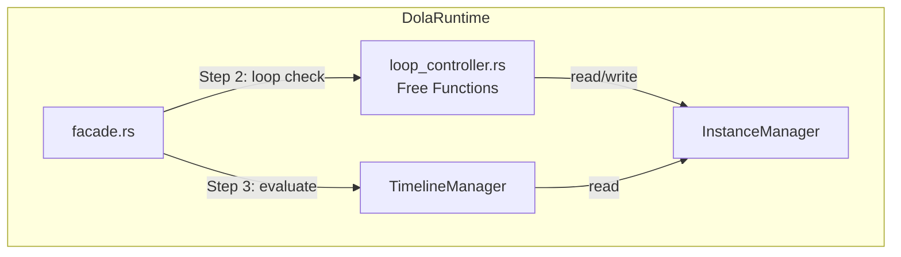
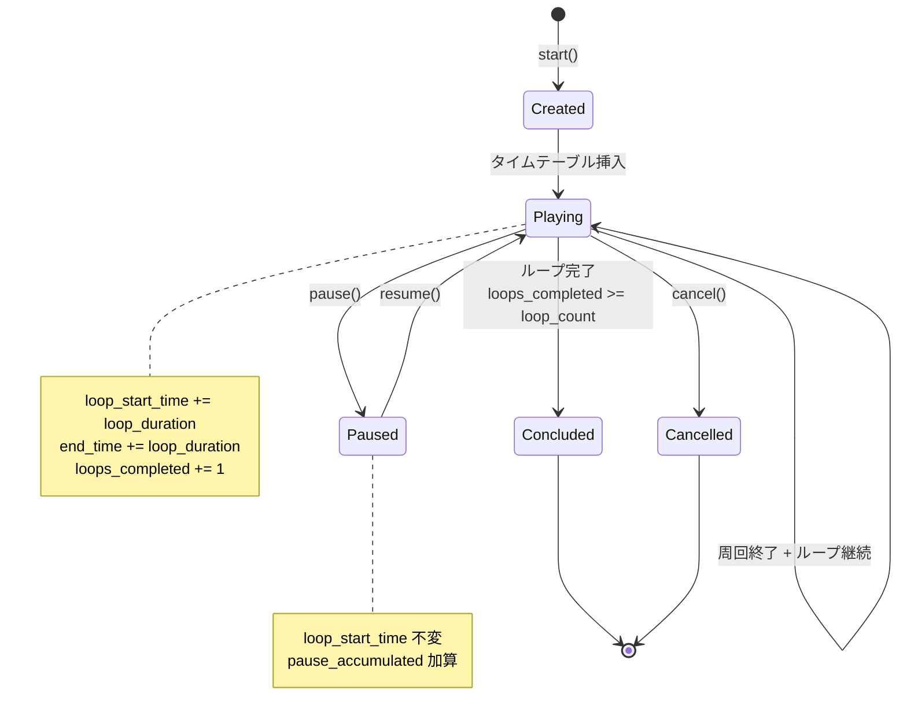
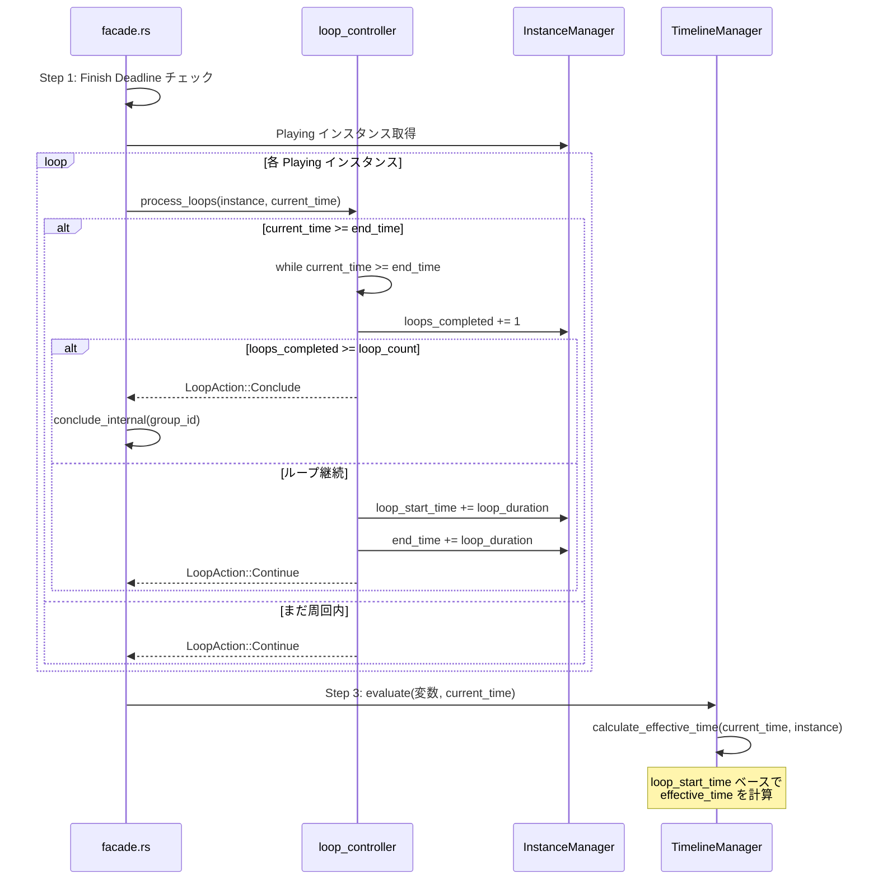
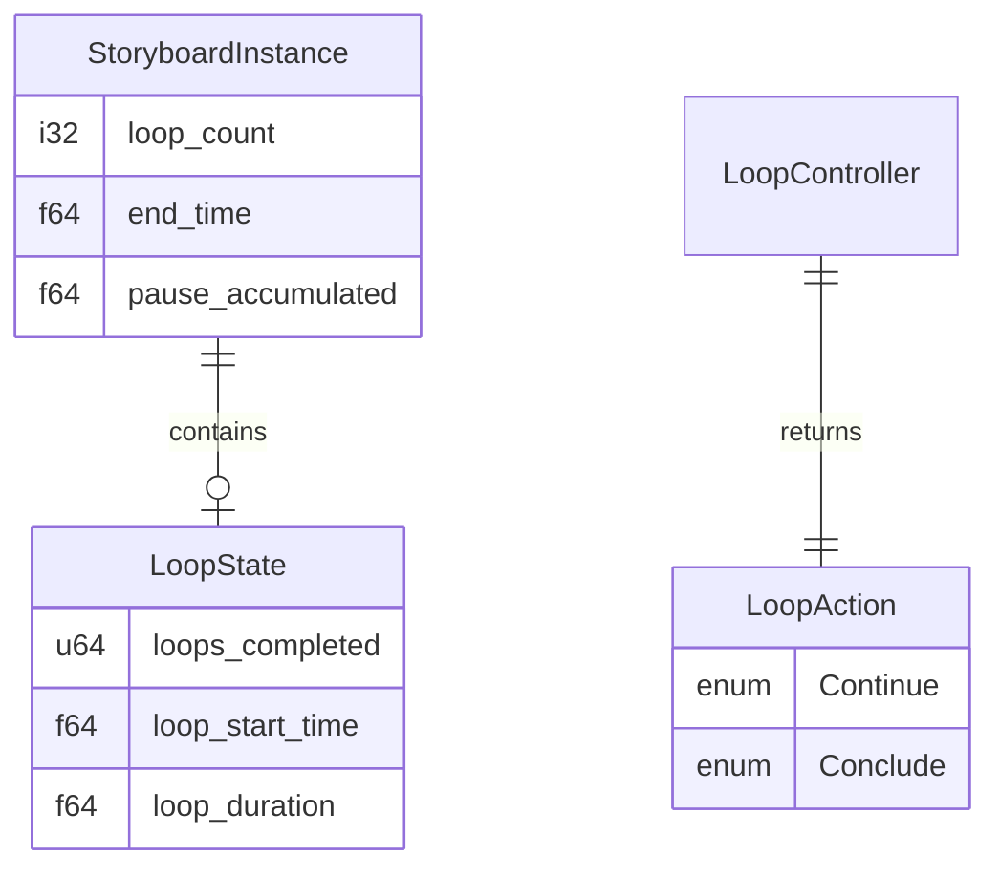

# Design Document — dola-runtime-5-loop

## Overview

**Purpose**: dola ランタイムエンジンにループ再生機能を追加する。ストーリーボードの `loop_count` に基づき、タイムテーブルを1周分のみ保持しつつ効率的な繰り返し再生を実現する。

**Users**: wintf / areka 統合層が `DolaRuntime::start()` に `loop_count` 付きストーリーボードを渡す。アイドルモーションや繰り返しアニメーションなどの宣言的定義を可能にする。

**Impact**: 既存の Tier 2 facade に対し、`update()` の自然終了検知ロジック（Step 2）と `start()` の `end_time` 算出を拡張する。新規モジュール `loop_controller.rs` を追加し、周回管理ロジックを分離する。

### Goals
- `loop_count` に基づくループ再生（1回・n回・無限）の正確な実行
- タイムテーブルを1周分のみ保持し、時間オフセットで再利用する省メモリ設計
- Pause/Resume との透過的な共存
- 既存の競合検出（ConflictResolver）と独立したモジュール設計

### Non-Goals
- ループ固有の公開 API の追加（外部には exposed しない）
- 競合解決ロジックの変更（ConflictResolver の責務）
- `InstanceState` enum の変更（既存 7 バリアントで十分）
- ループ中の動的な `loop_count` 変更

---

## Architecture

### Existing Architecture Analysis

Tier 2 facade の現行構造（ループ未実装）:

```
DolaRuntime (facade.rs)
├── DocumentStore      — 指示書管理
├── InstanceManager    — インスタンスライフサイクル
│   └── StoryboardInstance { loop_count, loops_completed: u32 }
├── TimelineManager    — タイムテーブル評価
│   └── calculate_effective_time(current_time, instance) → f64
└── SubscriptionManager — 購読・差分配信
```

**現行の制限事項**:
- `loop_count` はコピーされるが判定ロジック未実装
- `loops_completed` は常に 0（インクリメントされない）
- 無限ループ時 `end_time = INFINITY` で周回終了が検出不能
- `calculate_effective_time()` は `start_time` ベースでループオフセット未対応

### Architecture Pattern & Boundary Map



**Architecture Integration**:
- **Selected pattern**: フリー関数 + 新モジュール（Option C）
- **Domain boundaries**: LoopController は周回判定・オフセット調整のみ。状態遷移は InstanceManager、評価は TimelineManager の責務を維持
- **Existing patterns preserved**: `pub(crate)` 公開範囲、`conclude_internal()` パターン、`effective_time` 計算パターン
- **New components**: `loop_controller.rs` — 純粋関数群として borrowck 制約を自然に回避
- **Steering compliance**: `tech.md` のモジュール独立性原則、`structure.md` の `snake_case` ファイル命名

### Technology Stack

| Layer | Choice / Version | Role in Feature | Notes |
|-------|------------------|-----------------|-------|
| Language | Rust 2024 Edition | 実装言語 | 既存と同一 |
| Runtime | `crates/dola/src/runtime/` | ループ制御モジュール追加 | `loop_controller.rs` 新規作成 |

追加の外部依存なし。

---

## System Flows

### ループ状態遷移



### update() 内のループ処理フロー



### Pause/Resume + ループの時間軸

```
時間軸: |---周回1---|---Pause---|---周回1(続)---|---周回2---|---周回3---|
                                                 ^            ^
                                            loop_start_time  loop_start_time
                                            += loop_duration  += loop_duration

pause_accumulated:          += pause_duration
loop_start_time:   start_time のまま         → += loop_duration (周回終了時のみ更新)
end_time:          += pause_duration (resume時) → += loop_duration (周回終了時)
```

---

## Requirements Traceability

| Requirement | Summary | Components | Interfaces | Flows |
|-------------|---------|------------|------------|-------|
| 1.1 | loop_count=1: 1回再生 | — (既存動作) | — | — |
| 1.2 | loop_count=-1: 無限ループ | LoopController, facade | `process_loops()` | ループ状態遷移 |
| 1.3 | loop_count=n: n回再生 | LoopController, facade | `process_loops()` | ループ状態遷移 |
| 1.4 | 複数周回一括処理 | LoopController | `process_loops()` の while ループ | update() フロー |
| 1.5 | Playing 状態維持 | LoopController | `should_continue_loop()` | ループ状態遷移 |
| 2.1 | タイムテーブル1周分のみ | — (既存動作) | — | — |
| 2.2 | 反復ループで全周回処理 | LoopController | `process_loops()` | update() フロー |
| 2.3 | loop_start_time 更新で再利用 | LoopController, StoryboardInstance | `advance_loop()` | update() フロー |
| 2.4 | duration 加算で正確な開始時刻 | LoopController | `advance_loop()` | — |
| 2.5 | ループ完了時の終了遷移 | facade | `conclude_internal()` | ループ状態遷移 |
| 3.1 | loops_completed: u64 管理 | StoryboardInstance | — | — |
| 3.2 | 周回終了時にインクリメント | LoopController | `advance_loop()` | update() フロー |
| 3.3 | 初期値 0 | InstanceManager | `create_instance()` | — |
| 3.4 | 無限ループ継続カウント | LoopController | `advance_loop()` | — |
| 4.1 | Pause 時のループ状態保持 | — (既存 Pause 動作) | — | ループ状態遷移 |
| 4.2 | Resume 後の正確な再開 | — (既存 Resume 動作) | — | Pause/Resume フロー |
| 4.3 | 独立オフセット管理 | StoryboardInstance | `loop_start_time` ≠ `pause_accumulated` | — |
| 5.1 | Cancel 時の即座停止 | — (既存 Cancel 動作) | — | — |
| 5.2 | ConflictResolver との独立 | — (設計上保証) | — | — |
| 5.3 | Playing 状態維持で競合対象 | LoopController | `should_continue_loop()` | — |

---

## Components and Interfaces

### コンポーネント一覧

| Component | Domain/Layer | Intent | Req Coverage | Key Dependencies | Contracts |
|-----------|--------------|--------|--------------|------------------|-----------|
| LoopController | Runtime / Core | ループ周回判定・オフセット調整 | 1, 2, 3, 5 | StoryboardInstance (P0) | Service |
| StoryboardInstance (変更) | Runtime / Data | ループ用フィールド追加 | 3, 4 | — | State |
| facade.rs (変更) | Runtime / API | update() Step 2 のループ拡張 | 1, 2, 5 | LoopController (P0), InstanceManager (P0) | — |
| timeline_manager.rs (変更) | Runtime / Core | effective_time 計算のループ対応 | 2, 4 | StoryboardInstance (P0) | — |

### Runtime Core

#### LoopController

| Field | Detail |
|-------|--------|
| Intent | ループ再生の周回判定、周回進行、タイムテーブル再利用のためのオフセット調整 |
| Requirements | 1.1-1.5, 2.1-2.5, 3.1-3.4, 5.3 |

**Responsibilities & Constraints**
- 周回完了検出: `current_time >= end_time` で判定
- 複数周回一括処理: while ループで遅延した update() に対応
- 周回進行: `loop_start_time`, `end_time`, `loops_completed` の更新
- ループ完了判定: `loops_completed >= loop_count` で Conclude を指示
- 無限ループ: `loop_count == -1` の場合は常に Continue
- 状態を持たない: 純粋関数群として実装（全状態は `StoryboardInstance` に保持）

**Dependencies**
- Inbound: facade.rs — `update()` Step 2 から呼び出し (P0)
- Outbound: StoryboardInstance — フィールド読み書き (P0)

**Contracts**: Service [x]

##### Service Interface

```rust
/// ループ処理の結果を示す判別 enum。
#[derive(Debug, Clone, Copy, PartialEq, Eq)]
pub(crate) enum LoopAction {
    /// ループ継続（または周回内で変化なし）
    Continue,
    /// ループ完了 — Conclude すべき
    Conclude,
}

/// 1つのインスタンスのループ処理を実行する。
///
/// `current_time >= end_time` の場合、while ループで全終了済み周回を処理し、
/// 各周回について `loops_completed` をインクリメントして継続可否を判定する。
/// 複数周回が一度に終了する場合も正確に処理する。
///
/// # Arguments
/// - `instance`: 対象インスタンスの可変参照
/// - `current_time`: 現在時刻
///
/// # Returns
/// - `LoopAction::Continue`: ループ継続またはループ対象外
/// - `LoopAction::Conclude`: ループ完了 — 呼び出し側で conclude_internal() を実行
///
/// # Preconditions
/// - `instance.state == InstanceState::Playing`
/// - `instance.loop_count >= 1` または `instance.loop_count == -1`
///
/// # Postconditions
/// - Continue 時: `loop_start_time`, `end_time`, `loops_completed` が適切に更新済み
/// - Conclude 時: `loops_completed >= loop_count` が成立
pub(crate) fn process_loops(
    instance: &mut StoryboardInstance,
    current_time: f64,
) -> LoopAction;

/// ループ継続の可否を判定する純粋関数。
///
/// loop_count=-1 の場合は常に true。
/// それ以外は `loops_completed < loop_count as u64` で判定。
///
/// # Invariants
/// - instance の状態を変更しない
pub(crate) fn should_continue_loop(instance: &StoryboardInstance) -> bool;

/// 周回進行: 1周回分のオフセット調整を実行する。
///
/// - `loops_completed += 1`
/// - `loop_start_time += loop_duration`
/// - `end_time += loop_duration`
///
/// # Preconditions
/// - `instance.loop_duration > 0.0`
pub(crate) fn advance_loop(instance: &mut StoryboardInstance);
```

**Implementation Notes**
- `process_loops()` は `should_continue_loop()` と `advance_loop()` を内部で使用するファサード関数
- `loop_count == 1` の場合: `current_time >= end_time` で即座に `Conclude` を返す（while ループに入らない）
- 無限ループ: `should_continue_loop()` が常に true を返すため、while ループで `advance_loop()` を繰り返す
- `advance_loop()` 内の `loops_completed` インクリメントは通常の `+= 1`（u64 wrapping 許容）

### Runtime Data

#### StoryboardInstance（変更）

| Field | Detail |
|-------|--------|
| Intent | ループ制御に必要なフィールドを追加し、周回状態を保持する |
| Requirements | 2.3, 2.4, 3.1, 4.3 |

**Contracts**: State [x]

##### State Management

```rust
pub(crate) struct StoryboardInstance {
    // --- 既存フィールド（変更なし） ---
    pub group_id: u64,
    pub storyboard_name: String,
    pub state: InstanceState,
    pub interruption_policy: InterruptionPolicy,
    pub start_time: f64,
    pub time_scale: f64,
    pub base_duration: f64,
    pub pause_accumulated: f64,
    pub pause_start: Option<f64>,
    pub loop_count: i32,
    pub finish_deadline: Option<f64>,
    pub end_time: f64,

    // --- 型変更 ---
    /// 完了済み周回数（u32 → u64 に変更）
    pub loops_completed: u64,

    // --- 新規フィールド ---
    /// 現在の周回の開始時刻（wall clock ベース）。
    /// 初期値は `start_time` と同一。周回終了ごとに `+= loop_duration` で更新。
    /// Pause/Resume では変更されない（独立性: 4.3）。
    pub loop_start_time: f64,

    /// 1周分の再生時間（wall clock ベース）。
    /// `base_duration / time_scale` で算出。インスタンス生存中は定数。
    pub loop_duration: f64,
}
```

- **Persistence**: インメモリのみ（既存と同一）
- **Concurrency**: シングルスレッド前提（既存と同一）
- **Consistency**: `loop_start_time + loop_duration == end_time` が常に成立（Pause 時の `end_time` 補正を除く）

**Implementation Notes**
- `create_instance()` で `loop_start_time = start_time`, `loop_duration = base_duration / time_scale` を設定
- `end_time` の算出変更: 無限ループでも `start_time + loop_duration`（`INFINITY` は使用しない）
- `loop_count == 1` の場合: `loop_start_time = start_time`, `loop_duration = base_duration / time_scale`（既存と同じ end_time だが、計算経路が統一される）

### Runtime API（変更）

#### facade.rs

| Field | Detail |
|-------|--------|
| Intent | `start()` の end_time 算出と `update()` Step 2 のループ拡張 |
| Requirements | 1.1-1.5, 2.5 |

**変更対象**:

##### start() の変更

```rust
// 変更前（Tier 2）:
let end_time = if compiled.loop_count == -1 {
    f64::INFINITY
} else {
    start_time + compiled.total_base_duration / compiled.time_scale
};

// 変更後:
let loop_duration = compiled.total_base_duration / compiled.time_scale;
let end_time = start_time + loop_duration;
// → 無限ループでも1周分の end_time を設定（INFINITY は使用しない）
```

`create_instance()` 呼び出しに `loop_start_time`, `loop_duration` を追加。

##### update() Step 2 の変更

```rust
// 変更前（Tier 2）:
let naturally_ended: Vec<u64> = self.instance_manager.instances()
    .iter()
    .filter(|(_, inst)| inst.state == Playing && current_time >= inst.end_time)
    .map(|(gid, _)| *gid)
    .collect();
for gid in naturally_ended {
    self.conclude_internal(gid);
}

// 変更後:
let loop_results: Vec<(u64, LoopAction)> = self.instance_manager
    .instances_mut()
    .iter_mut()
    .filter(|(_, inst)| inst.state == Playing && current_time >= inst.end_time)
    .map(|(gid, inst)| {
        let action = loop_controller::process_loops(inst, current_time);
        (*gid, action)
    })
    .collect();

for (gid, action) in loop_results {
    if action == LoopAction::Conclude {
        self.conclude_internal(gid);
    }
}
```

##### calculate_end_time() の変更

```rust
// 変更後: 無限ループでも1周分の end_time を返す（呼び出し側で INFINITY 不使用を認識）
let loop_duration = compiled.total_base_duration / compiled.time_scale;
let end_time = start_time + loop_duration;
// loop_count=-1 の場合、この end_time は「最初の周回の終了時刻」を意味する
```

**Implementation Notes**

`instances_mut()` API を InstanceManager に追加（既存 `instances()` と対称的）：

```rust
// InstanceManager に追加
pub(crate) fn instances_mut(&mut self) -> &mut HashMap<u64, StoryboardInstance> {
    &mut self.instances
}
```

**borrowck 検証**:
1. `instances_mut()` で `&mut HashMap` を取得 → `iter_mut()` で各インスタンスを可変借用
2. `process_loops()` が `&mut StoryboardInstance` を受け取り、フィールドを更新（周回進行処理）
3. `collect()` で Vec に結果を確定 → ここで InstanceManager への可変借用が終了
4. その後 `conclude_internal(gid)` を呼び出し（`&mut self` の新しい借用を要求）

collect() なしで直接 `conclude_internal()` を呼ぶと、InstanceManager が二重に可変借用されるため borrowck エラーになる。

#### timeline_manager.rs

| Field | Detail |
|-------|--------|
| Intent | `calculate_effective_time()` のループオフセット対応 |
| Requirements | 2.3, 4.3 |

**変更対象**:

##### calculate_effective_time() の変更

```rust
// 変更前:
fn calculate_effective_time(current_time: f64, instance: &StoryboardInstance) -> f64 {
    let raw_time = if instance.state == InstanceState::Paused {
        match instance.pause_start {
            Some(pause_start) => pause_start - instance.start_time - instance.pause_accumulated,
            None => current_time - instance.start_time - instance.pause_accumulated,
        }
    } else {
        current_time - instance.start_time - instance.pause_accumulated
    };
    raw_time * instance.time_scale
}

// 変更後:
fn calculate_effective_time(current_time: f64, instance: &StoryboardInstance) -> f64 {
    let raw_time = if instance.state == InstanceState::Paused {
        match instance.pause_start {
            Some(pause_start) => {
                pause_start - instance.loop_start_time - instance.pause_accumulated
            }
            None => current_time - instance.loop_start_time - instance.pause_accumulated,
        }
    } else {
        current_time - instance.loop_start_time - instance.pause_accumulated
    };
    raw_time * instance.time_scale
}
```

**Key Decision**: `start_time` → `loop_start_time` への1箇所の置換のみ。`loop_start_time` の初期値は `start_time` なので、ループなし（loop_count=1）の場合は既存動作と完全互換。

**Pause/Resume との整合性**:
- `calculate_effective_time()` は `pause_accumulated` を減算して effective_time を算出（既存動作）
- ループ周回判定 `current_time >= end_time` は wall clock ベースで実行（facade.rs 内）
- Resume 時に `end_time += pause_duration` で補正されるため、両者は独立して正しく動作
- 不変条件: Pause 介入時は `end_time == loop_start_time + loop_duration + pause_accumulated`

---

## Data Models

### Domain Model



### 不変条件

1. **end_time 整合性**:
   - **Pause 未介入時**: `end_time == loop_start_time + loop_duration`
   - **Pause 介入時**: `end_time == loop_start_time + loop_duration + pause_accumulated`
     - Resume 時に `end_time += pause_duration` で補正（既存ロジック）
     - `calculate_effective_time()` が `pause_accumulated` を減算するため、effective_time の計算では相殺される
     - ループ周回判定 `current_time >= end_time` は wall clock ベースで正しく動作
2. **loops_completed 単調増加**: Pause/Resume/Cancel で loops_completed はデクリメントされない
3. **loop_start_time 更新タイミング**: `advance_loop()` 内でのみ更新。Pause/Resume では不変
4. **loop_duration 定数性**: インスタンス生存中は `loop_duration` は変化しない

---

## Error Handling

### Error Strategy

無限ループ時の極端な短周期再生を防止するため、新規エラーバリアント `TooShortDurationWithInfiniteLoop` を追加する。

### Error Categories

| エラー条件 | バリアント | 発生タイミング |
|-----------|------------|--------------|
| `loop_count <= 0` かつ `-1` でない | `InvalidLoopCount(i32)` | `start()` 時 |
| `duration == 0.0` かつ `loop_count == -1` | `ZeroDurationWithLoop { storyboard }` | `start()` 時 |
| `loop_duration < MIN_LOOP_DURATION` かつ `loop_count == -1` | `TooShortDurationWithInfiniteLoop { storyboard, duration }` | `start()` 時 |
| 存在しない group_id | `InvalidGroupId(u64)` | 各操作時 |

**MIN_LOOP_DURATION 定数**:
```rust
/// 無限ループ許可の最小周期（秒）。
/// システムスリープ復帰時の極端な周回数処理を防止する。
const MIN_LOOP_DURATION: f64 = 0.1; // 100ms
```

**バリデーションロジック** (`start()` 内):
```rust
let loop_duration = compiled.total_base_duration / compiled.time_scale;

// 既存チェック（duration=0.0 は特殊ケースとして先に判定）
if loop_duration == 0.0 && compiled.loop_count == -1 {
    return Err(RuntimeError::ZeroDurationWithLoop {
        storyboard: name.to_string(),
    });
}

// 新規チェック（無限ループ時の短周期防止）
if loop_duration < MIN_LOOP_DURATION && compiled.loop_count == -1 {
    return Err(RuntimeError::TooShortDurationWithInfiniteLoop {
        storyboard: name.to_string(),
        duration: loop_duration,
    });
}
```

**設計判断**: 有限ループ（`loop_count >= 1`）は制限しない（自己責任）。極端な周回数設定（例: loop_count=1000000）も入力側の問題として扱う。

ループ処理中のランタイムエラーは発生しない設計（`process_loops()` は `LoopAction` を返すのみ）。

---

## Testing Strategy

### Unit Tests（loop_controller.rs 内）

| テスト | 対象関数 | 検証内容 |
|--------|---------|---------|
| `should_continue_loop` 基本 | `should_continue_loop()` | loop_count=3, loops_completed=2 → true; loops_completed=3 → false |
| `should_continue_loop` 無限 | `should_continue_loop()` | loop_count=-1 → 常に true |
| `should_continue_loop` 単回 | `should_continue_loop()` | loop_count=1, loops_completed=0 → true; loops_completed=1 → false |
| `advance_loop` 基本 | `advance_loop()` | loops_completed, loop_start_time, end_time が各 1周分更新 |
| `process_loops` 周回内 | `process_loops()` | current_time < end_time → Continue, フィールド変化なし |
| `process_loops` 1周完了・継続 | `process_loops()` | loop_count=3, 1周終了 → Continue, loops_completed=1 |
| `process_loops` ループ完了 | `process_loops()` | loop_count=3, 3周終了 → Conclude |
| `process_loops` 複数周回一括 | `process_loops()` | loop_count=5, 3周分一度に終了 → Continue, loops_completed=3 |
| `process_loops` 全周回一括完了 | `process_loops()` | loop_count=3, 5周分超過 → Conclude, loops_completed=3 |
| `process_loops` 無限ループ複数周回 | `process_loops()` | loop_count=-1, 5周分 → Continue, loops_completed=5 |

### Integration Tests（facade 経由）

| テスト | 検証内容 |
|--------|---------|
| ループなし（loop_count=1） | 既存動作と同一。1回再生後に Conclude |
| 有限ループ（loop_count=3） | 3周再生後に Conclude。各周回で evaluate が正しい値を返す |
| 無限ループ（loop_count=-1） | Cancel まで継続。各周回で evaluate が正しい値を返す |
| 複数周回一括（大きな dt） | update() で一度に複数周回を処理し、loops_completed が正確 |
| Pause + ループ | ループ中に Pause → Resume 後も正確な周回・位置から再開 |
| Cancel + ループ | ループ中に Cancel → 即座に Cancelled 状態 |
| end_time 統一（loop_count=1 vs -1） | 両方とも `start_time + loop_duration` で統一されていることを確認 |
| 短周期無限ループエラー | loop_duration < 0.1秒 かつ loop_count=-1 → `TooShortDurationWithInfiniteLoop` エラー |
| 短周期有限ループ許可 | loop_duration < 0.1秒 かつ loop_count=10 → エラーなし（自己責任で許可） |

### Performance Tests（optional）

| テスト | ベースライン |
|--------|------------|
| 無限ループ長時間精度 | 10,000周回後も `effective_time` の精度劣化が許容範囲内 |
| 大量周回一括処理 | 100,000周回分の `process_loops()` が < 1ms |

---

## Supporting References

### ファイル変更一覧

| 操作 | ファイル | 変更内容 |
|------|---------|---------|
| **新規作成** | `runtime/loop_controller.rs` | `LoopAction` enum + フリー関数群 |
| **修正** | `runtime/mod.rs` | `mod loop_controller;` 追加 |
| **修正** | `runtime/types.rs` | `RuntimeError::TooShortDurationWithInfiniteLoop { storyboard: String, duration: f64 }` バリアント追加 |
| **修正** | `runtime/instance_manager.rs` | `StoryboardInstance` フィールド追加（`loop_start_time`, `loop_duration`, `loops_completed` 型変更）、`create_instance()` 引数追加、`instances_mut()` メソッド追加 |
| **修正** | `runtime/facade.rs` | `start()` の end_time 算出変更 + MIN_LOOP_DURATION バリデーション、`update()` Step 2 のループ拡張、`calculate_end_time()` 変更 |
| **修正** | `runtime/timeline_manager.rs` | `calculate_effective_time()` の `start_time` → `loop_start_time` 変更 |

### 設計判断の詳細

設計判断の背景と代替案の詳細は [research.md](research.md) を参照。

- Decision 1: `loop_start_time` + `loop_duration` フィールド設計
- Decision 2: `end_time` を「次の周回終了時刻」として管理（方式 A）
- Decision 3: `loops_completed` を u64 に変更（wrapping 許容）
- Decision 4: フリー関数群（Option C）の採用
