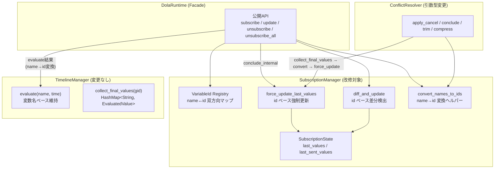
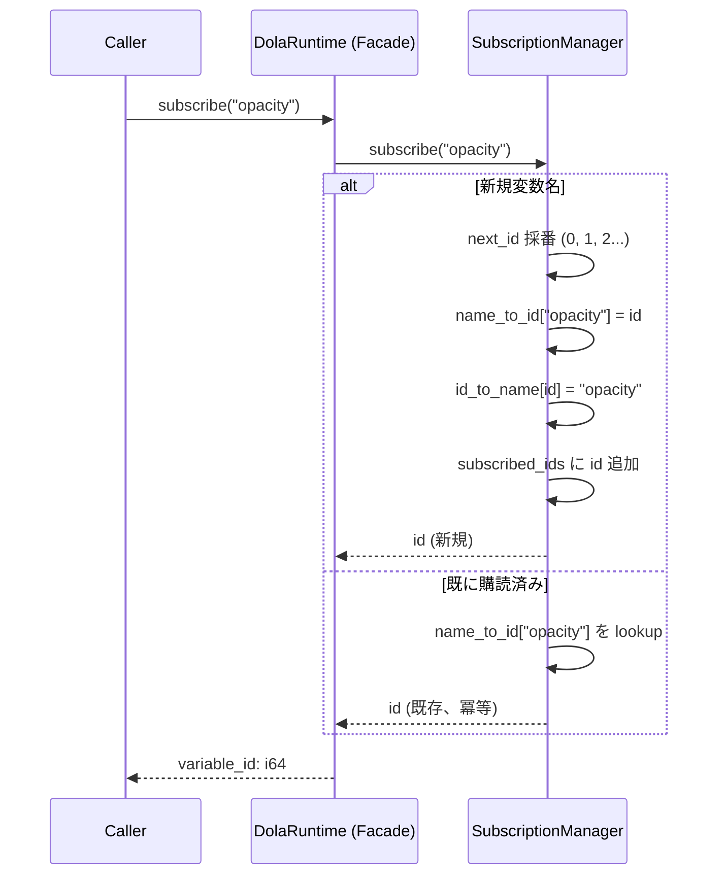
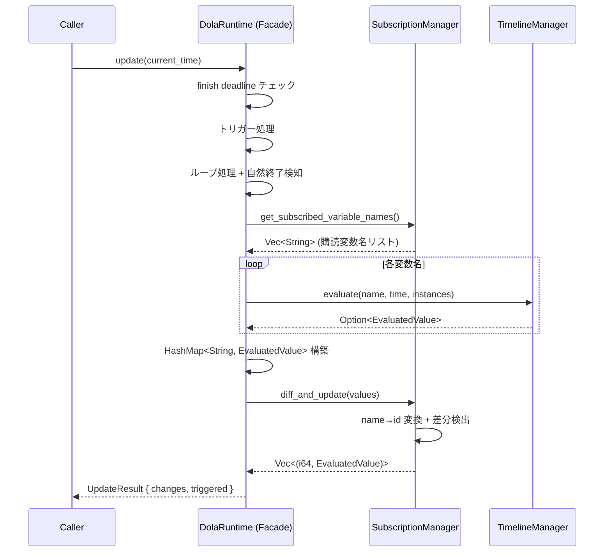
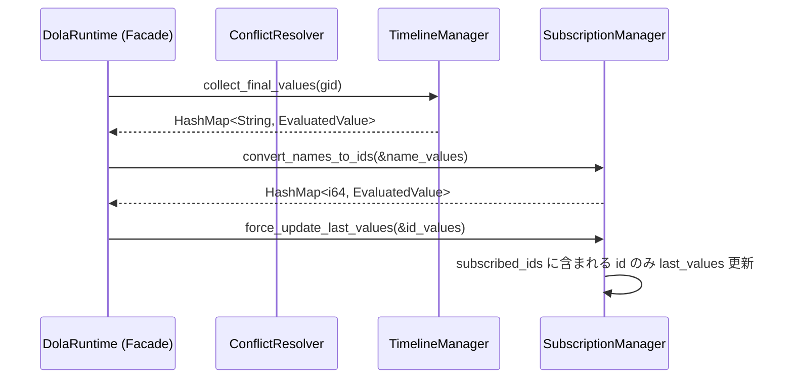
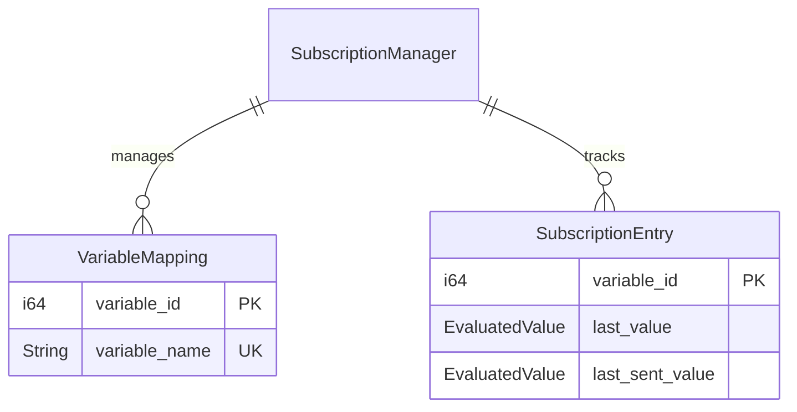

# 設計ドキュメント: dola-runtime-subscribe-redesign

## Overview

**目的**: DolaRuntime の変数購読・更新 API を、`subscriber_id` ベースの複数購読者モデルから、ランタイム単位の一元管理 + `variable_id` ベースの差分配信モデルへ再設計する。

**ユーザー**: DolaRuntime を利用するオーケストレーター（areka クレート等）が、購読者IDの管理負担なく変数購読を行い、数値IDベースで効率的にUI更新を行えるようにする。

**影響**: `SubscriptionManager` の内部構造を全面改修し、`DolaRuntime` facade の公開APIシグネチャを変更する。外部クレートからの利用は現時点で存在しないため、破壊的変更のリスクは低い。

### Goals

- `subscriber_id` パラメータの完全除去（subscribe, update, unsubscribe, unsubscribe_all）
- `variable_id: i64` による変数識別と差分配信
- 単一購読状態へのフラット化による構造簡素化
- 既存アニメーション機能（再生/停止/トリガー/競合解決）の完全互換性維持

### Non-Goals

- TimelineManager の evaluate 系メソッドの変更（変数名ベースのまま維持）
- EvaluatedValue 型自体の変更
- ドキュメント（指示書）フォーマットの変更
- パフォーマンス最適化（変数名の文字列アロケーション削減等は将来検討）

## Architecture

### Existing Architecture Analysis

現行の SubscriptionManager は `HashMap<u64, SubscriberState>` で複数購読者をサポートするが、実際には全テストで `subscriber_id=1` のみ使用されており、複数購読者モデルは不要な複雑性である。

**現行の制約**:
- `SubscriberState` が変数名ベース（`HashSet<String>`）で購読を管理
- `diff_and_update` が `Vec<(String, EvaluatedValue)>` を返却
- `force_update_last_values` が `HashMap<String, EvaluatedValue>` を受け取り全購読者に適用
- `conflict_resolver` の4戦略すべてが `force_update_last_values` を呼び出す

**維持すべき統合ポイント**:
- `facade.rs::conclude_internal()` → `force_update_last_values` 連携
- `conflict_resolver.rs` の4戦略 → `force_update_last_values` 連携
- `timeline_manager.evaluate()` → 変数名ベースの値取得（変更なし）

### Architecture Pattern & Boundary Map



**アーキテクチャ統合**:
- **選択パターン**: Option A（直接改修）— 既存ファイル構成を維持し、`SubscriptionManager` を in-place で改修
- **責務境界**: name↔id 変換は `SubscriptionManager` 内部に集約。`facade` と `conflict_resolver` は変換ヘルパーを呼び出す
- **維持パターン**: Facade パターン、`pub(crate)` による公開範囲制御、`RuntimeError` によるエラー統一
- **新規コンポーネント**: なし（既存 `SubscriptionManager` の内部構造変更のみ）
- **Steering 準拠**: Rust 2024 Edition、型安全重視、unsafe 不使用

### Technology Stack

| Layer          | Choice / Version          | Role in Feature          | Notes              |
| -------------- | ------------------------- | ------------------------ | ------------------ |
| Language       | Rust 2024 Edition         | 全コンポーネント         | 型安全、所有権管理 |
| Runtime        | dola crate                | アニメーションランタイム | 直接改修対象       |
| Data Structure | std::collections::HashMap | 双方向マップ、値管理     | 追加依存なし       |

## System Flows

### subscribe フロー



### update フロー



`diff_and_update` 内部で name→id 変換を行う。evaluate 結果は変数名ベースのまま渡し、SubscriptionManager が内部の双方向マップを使って id に変換する。

### conclude_internal / conflict_resolver フロー



`collect_final_values` は変数名ベースで返却するため、`convert_names_to_ids` で id に変換してから `force_update_last_values` に渡す。

## Requirements Traceability

| Requirement | Summary                        | Components                    | Interfaces                                         | Flows            |
| ----------- | ------------------------------ | ----------------------------- | -------------------------------------------------- | ---------------- |
| Req 1       | subscribe → variable_id 返却   | SubscriptionManager           | `subscribe(&str) → i64`                            | subscribe フロー |
| Req 2       | 単一購読者モデル               | SubscriptionManager           | 全API から subscriber_id 除去                      | —                |
| Req 3       | update から subscriber_id 除去 | Facade, SubscriptionManager   | `update(f64) → UpdateResult`                       | update フロー    |
| Req 4       | changes 型変更                 | types.rs, SubscriptionManager | `Vec<(i64, EvaluatedValue)>`                       | update フロー    |
| Req 5       | variable_id ライフサイクル     | SubscriptionManager           | `unsubscribe(i64) → Result`                        | —                |
| Req 6       | 既存機能互換性                 | Facade, ConflictResolver      | `force_update_last_values`, `convert_names_to_ids` | conclude フロー  |
| Req 7       | テストカバレッジ               | 全テストファイル              | —                                                  | —                |

## Components and Interfaces

| Component            | Domain/Layer     | Intent                           | Req Coverage     | Key Dependencies                               | Contracts      |
| -------------------- | ---------------- | -------------------------------- | ---------------- | ---------------------------------------------- | -------------- |
| SubscriptionManager  | Runtime/Internal | 変数購読管理 + ID採番 + 差分検出 | 1, 2, 3, 4, 5, 6 | —                                              | Service, State |
| DolaRuntime (Facade) | Runtime/Public   | 公開API、フロー制御              | 2, 3, 6          | SubscriptionManager (P0), TimelineManager (P0) | API            |
| UpdateResult         | Runtime/Types    | 更新結果の型定義                 | 4                | —                                              | —              |
| ConflictResolver     | Runtime/Internal | 競合解決戦略                     | 6                | SubscriptionManager (P0)                       | Service        |

### Runtime / Internal

#### SubscriptionManager

| Field        | Detail                                                       |
| ------------ | ------------------------------------------------------------ |
| Intent       | 変数購読の一元管理、variable_id 採番、差分検出、name↔id 変換 |
| Requirements | 1, 2, 3, 4, 5, 6                                             |

**Responsibilities & Constraints**
- 変数名→ID の双方向マッピング管理（ランタイムライフタイム内で一意）
- 購読変数の差分検出（last_sent_values との比較）
- 凍結値の管理（evaluate 結果がない変数の last_values 保持）
- ID の採番（0-origin モノトニックカウンタ、**再利用禁止**）
    - **id_to_name は全割り当て済みIDを保持し、再利用禁止を保証する。unsubscribe後も削除しない。**
    - **テストでID再利用が起きないことを検証する。**
- name→id 変換ヘルパーの提供（facade/conflict_resolver 向け）

**force_update_last_values の呼び出し責務**
- **force_update_last_values へ渡す値は必ず id ベースであること。**
- **name→id変換は必ず convert_names_to_ids を経由すること。呼び出し側で変換を忘れないよう型で強制する。**

**Dependencies**
- Inbound: DolaRuntime (facade) — subscribe/update/unsubscribe/force_update 委譲 (P0)
- Inbound: ConflictResolver — force_update_last_values 呼び出し (P0)
- External: なし

**Contracts**: Service [x] / State [x]

##### Service Interface

```rust
/// 改修後の SubscriptionManager 公開インターフェース
impl SubscriptionManager {
    pub fn new() -> Self;

    /// 変数購読登録。冪等（同一名→同一ID返却）。
    /// unsubscribe 済みの名前は新規IDを割り当てる。
    pub fn subscribe(&mut self, variable_name: &str) -> i64;

    /// 変数購読解除（ID指定）。
    /// 存在しない or 既に解除済みの ID → Err(RuntimeError)。
    pub fn unsubscribe(&mut self, variable_id: i64) -> Result<(), RuntimeError>;

    /// 全購読解除。
    pub fn unsubscribe_all(&mut self);

    /// 購読中変数名のリストを取得（evaluate 用）。
    pub fn get_subscribed_variable_names(&self) -> Vec<String>;

    /// variable_id → variable_name 逆引き。
    /// 存在しない ID → Err(RuntimeError)。
    pub fn get_variable_name(&self, variable_id: i64) -> Result<&str, RuntimeError>;

    /// 差分検出。evaluate 結果（変数名ベース）を受け取り、
    /// 内部で name→id 変換して id ベースの差分を返却。
    pub fn diff_and_update(
        &mut self,
        values: HashMap<String, EvaluatedValue>,
    ) -> Vec<(i64, EvaluatedValue)>;

    /// 変数名ベースの値マップを id ベースに変換。
    /// 購読中の変数のみ変換（未購読の名前は無視）。
    pub fn convert_names_to_ids(
        &self,
        name_values: &HashMap<String, EvaluatedValue>,
    ) -> HashMap<i64, EvaluatedValue>;

    /// Conclude 用: 最終値で last_values を強制更新（id ベース）。
    /// 購読中の id のみ更新（未購読の id は無視）。
    pub fn force_update_last_values(&mut self, values: &HashMap<i64, EvaluatedValue>);
}
```

- **Preconditions**: なし（全メソッドは任意のタイミングで呼び出し可能）
- **Postconditions**:
  - `subscribe`: 返却された `variable_id` は `get_variable_name` で逆引き可能
  - `unsubscribe`: 指定 ID の購読が解除され、以降の `diff_and_update` で差分に含まれない
  - `diff_and_update`: `last_sent_values` が更新される
- **Invariants**:
  - `next_id` は単調増加（デクリメントしない）
  - `name_to_id` と `id_to_name` は常に双方向で整合（片方にあれば他方にもある）
  - `subscribed_ids` に含まれる ID は必ず `id_to_name` にも存在する

##### State Management

```rust
/// 改修後の SubscriptionManager 内部状態
pub(crate) struct SubscriptionManager {
    // --- ID 管理 ---
    /// 次に割り当てる variable_id（0-origin、モノトニック増加）
    next_id: i64,
    /// 変数名 → variable_id（購読中 + 購読解除済み両方を含む）
    /// unsubscribe 時にエントリを削除し、再 subscribe で新 ID を割り当てる
    name_to_id: HashMap<String, i64>,
    /// variable_id → 変数名（全割り当て済みIDを含む、逆引き用）
    id_to_name: HashMap<i64, String>,

    // --- 購読状態 ---
    /// 現在購読中の variable_id セット
    subscribed_ids: HashSet<i64>,
    /// 凍結値（id ベース）
    last_values: HashMap<i64, EvaluatedValue>,
    /// 前回配信値（id ベース、差分比較用）
    last_sent_values: HashMap<i64, EvaluatedValue>,
}
```

**Persistence & Consistency**:
- メモリ内のみ（永続化なし）
- ランタイムインスタンスのライフタイムと一致
- `name_to_id` は購読中のエントリのみ保持（unsubscribe 時に削除）
- `id_to_name` は全割り当て済みIDを保持（逆引き用、削除しない）

**ID ライフサイクル詳細**:
1. `subscribe("x")` → `next_id=0` を割り当て、`name_to_id["x"]=0`, `id_to_name[0]="x"`, `subscribed_ids={0}`、`next_id` を 1 に増加
2. `subscribe("x")` 再呼び出し → `name_to_id["x"]` が存在するため `0` を返却（冪等）
3. `unsubscribe(0)` → `subscribed_ids` から `0` を削除、`name_to_id` から `"x"` を削除。`id_to_name[0]` は維持（逆引き可能性を残す）
4. `subscribe("x")` 再呼び出し → `name_to_id["x"]` が存在しないため新規 ID `1` を割り当て

### Runtime / Public

#### DolaRuntime (Facade)

| Field        | Detail                                                                  |
| ------------ | ----------------------------------------------------------------------- |
| Intent       | 公開APIのエントリーポイント。subscriber_id を除去した新シグネチャを提供 |
| Requirements | 2, 3, 6                                                                 |

**Responsibilities & Constraints**
- 公開APIシグネチャの変更（subscriber_id 除去）
- `update` 内部の evaluate → diff_and_update フローの調整
- `conclude_internal` での name→id 変換 + force_update_last_values 呼び出し

**Contracts**: API [x]

##### API Contract

| Method          | Current Signature                                               | New Signature                                               | Notes                   |
| --------------- | --------------------------------------------------------------- | ----------------------------------------------------------- | ----------------------- |
| subscribe       | `subscribe(subscriber_id: u64, variable_name: &str)`            | `subscribe(variable_name: &str) -> i64`                     | 戻り値追加              |
| update          | `update(subscriber_id: u64, current_time: f64) -> UpdateResult` | `update(current_time: f64) -> UpdateResult`                 | subscriber_id 除去      |
| unsubscribe     | `unsubscribe(subscriber_id: u64, variable_name: &str)`          | `unsubscribe(variable_id: i64) -> Result<(), RuntimeError>` | id ベース + Result 返却 |
| unsubscribe_all | `unsubscribe_all(subscriber_id: u64)`                           | `unsubscribe_all()`                                         | subscriber_id 除去      |

**Implementation Notes**:
- `update` 内の Step 3（変数評価）: `get_subscribed_variable_names()` で変数名リストを取得し、evaluate 後の `HashMap<String, EvaluatedValue>` をそのまま `diff_and_update` に渡す。name→id 変換は `diff_and_update` 内部で行われる
- `conclude_internal`: `collect_final_values` → `convert_names_to_ids` → `force_update_last_values` の3段階

### Runtime / Types

#### UpdateResult

| Field        | Detail                                        |
| ------------ | --------------------------------------------- |
| Intent       | update() の返却型。changes を id ベースに変更 |
| Requirements | 4                                             |

```rust
/// update() の返却値（改修後）。
pub struct UpdateResult {
    /// 変数の差分変化（variable_id ベース）
    pub changes: Vec<(i64, EvaluatedValue)>,
    /// トリガー実行結果のリスト（変更なし）
    pub triggered: Vec<TriggerResult>,
}
```

#### RuntimeError（追加バリアント）

```rust
pub enum RuntimeError {
    // ... 既存バリアント維持 ...

    /// 無効な variable_id（存在しない or 購読解除済み）
    InvalidVariableId(i64),
}
```

- `unsubscribe` と `get_variable_name` で使用
- Display 実装: `"invalid variable_id: {id}"`

### Runtime / Internal

#### ConflictResolver（引数型変更）

| Field        | Detail                                                     |
| ------------ | ---------------------------------------------------------- |
| Intent       | 競合解決戦略の force_update_last_values 呼び出し部分を改修 |
| Requirements | 6                                                          |

**Implementation Notes**:
- `apply_cancel`, `apply_conclude`, `apply_trim`, `apply_compress` の4関数で `force_update_last_values` を呼び出す箇所を改修
- 変更パターン（全4関数共通）:
  ```rust
  // Before
  let final_values = timeline_manager.evaluate_all_for_group(...);
  subscription_manager.force_update_last_values(&final_values);

  // After
  let final_values = timeline_manager.evaluate_all_for_group(...);
  let id_values = subscription_manager.convert_names_to_ids(&final_values);
  subscription_manager.force_update_last_values(&id_values);
  ```

## Data Models

### Domain Model



**Business Rules & Invariants**:
- `variable_id` は 0-origin のモノトニック増加カウンタで採番（再利用禁止）
- 同一 `variable_name` の同時購読は1つのみ（冪等性により同一IDを返却）
- `unsubscribe` 後の `variable_name` による再 `subscribe` は新規 ID を割り当てる
- `last_values` は購読中の変数のみ保持（unsubscribe 時に削除）

## Error Handling

### Error Strategy

既存の `RuntimeError` enum を拡張する方針。新しく `InvalidVariableId(i64)` バリアントを追加する。

### Error Categories and Responses

| エラー場面                                  | エラー型                              | 回復方法                     |
| ------------------------------------------- | ------------------------------------- | ---------------------------- |
| 存在しない variable_id で unsubscribe       | `RuntimeError::InvalidVariableId(id)` | 呼び出し側でログ出力 or 無視 |
| 存在しない variable_id で get_variable_name | `RuntimeError::InvalidVariableId(id)` | 呼び出し側でフォールバック   |
| 購読解除済み variable_id で unsubscribe     | `RuntimeError::InvalidVariableId(id)` | 同上                         |

**設計判断**: `unsubscribe` と `get_variable_name` は `Result` を返却する。呼び出し側に回復の選択肢を委ねる。パニックは行わない。

## Testing Strategy

### Unit Tests（SubscriptionManager）

既存7テストを改修 + 新規テスト追加:

1. **subscribe_returns_variable_id**: `subscribe("x")` → `0`, `subscribe("y")` → `1` の連番確認
2. **subscribe_idempotent**: 同一名で2回呼び出し → 同一 ID 返却
3. **unsubscribe_by_id**: `subscribe` → `unsubscribe(id)` → `get_subscribed_variable_names()` から消滅
4. **unsubscribe_error_on_invalid_id**: 存在しない ID → `Err(InvalidVariableId)`
5. **unsubscribe_all_clears_subscriptions**: 全解除後 `get_subscribed_variable_names()` が空
6. **resubscribe_after_unsubscribe_gets_new_id**: `subscribe("x")` → `0`, `unsubscribe(0)`, `subscribe("x")` → `1`
7. **get_variable_name**: `subscribe("x")` → `id`, `get_variable_name(id)` → `"x"`
8. **get_variable_name_error_on_invalid_id**: 存在しない ID → `Err(InvalidVariableId)`
9. **diff_detects_change**: evaluate 結果の差分検出（id ベース）
10. **diff_no_change_when_same_value**: 同一値 → 空 Vec
11. **force_update_last_values**: Conclude 後の凍結値更新（id ベース）
12. **convert_names_to_ids**: 変数名マップ → id マップ変換
13. **frozen_value_preserved_after_unrelated_update**: 凍結値が別変数の更新で消えないことを確認

### Integration Tests（Facade 経由）

既存テストファイルの全テストを新APIシグネチャに移行:

1. **runtime_facade_test.rs**: `subscribe(1, "x")` → `let x_id = rt.subscribe("x")`, `update(1, t)` → `update(t)`, `changes` のアサーションを id ベースに変更
2. **conflict_resolution_test.rs**: 同上 + `force_update_last_values` 経路の4戦略テスト
3. **loop_integration_test.rs**: 同上
4. **loop_offset_test.rs**: 同上
5. **trigger_test.rs**: 同上


**テスト移行の自動化指針**:
- 既存テストの `changes` アサーションは name ベースから id ベースへ一括置換する。
- 推奨置換パターン:
    - `|name, _| name == "X"` → `|id, _| *id == X_ID`（X_IDは事前に subscribe("X") で取得）
- 例:
```rust
// Before
let diff: Vec<_> = result.changes;
assert!(diff.iter().any(|(name, _)| name == "opacity"));

// After
let opacity_id = rt.subscribe("opacity"); // 冪等なので再呼び出しOK
let diff: Vec<_> = result.changes;
assert!(diff.iter().any(|(id, _)| *id == opacity_id));
```
- grep/replace コマンド例:
    - `grep -r '\|name, _\|' crates/dola/tests/ | less`
    - `sed -i 's/\|name, _\| name == \\\"\([a-zA-Z0-9_]+\)\\\"/|id, _| *id == \1_id/g' crates/dola/tests/*.rs`

**注意点**:
- 変数IDはテスト内で必ず subscribe で取得し、assert で使い回すこと。
- 置換後は全テストを必ず実行し、漏れや誤りがないか確認すること。

### 新規テスト

- **subscribe_idempotency_test**: facade レベルでの冪等性確認
- **unsubscribe_resubscribe_test**: facade レベルでの ID 再割り当て確認
- **get_variable_name_test**: 逆引きの正常系・異常系
