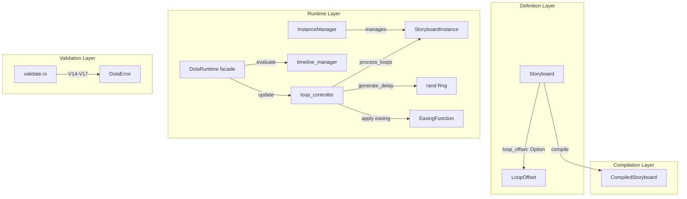
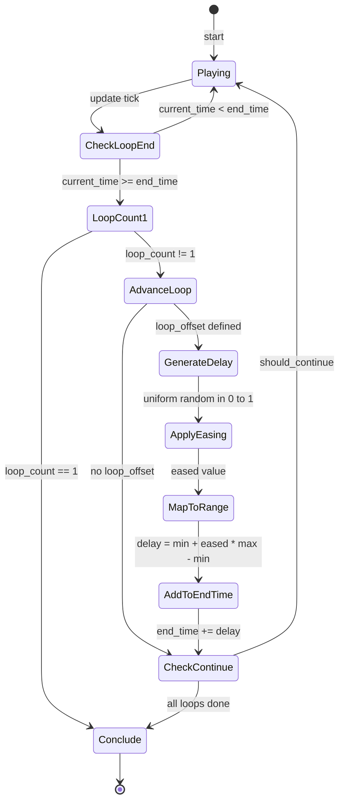
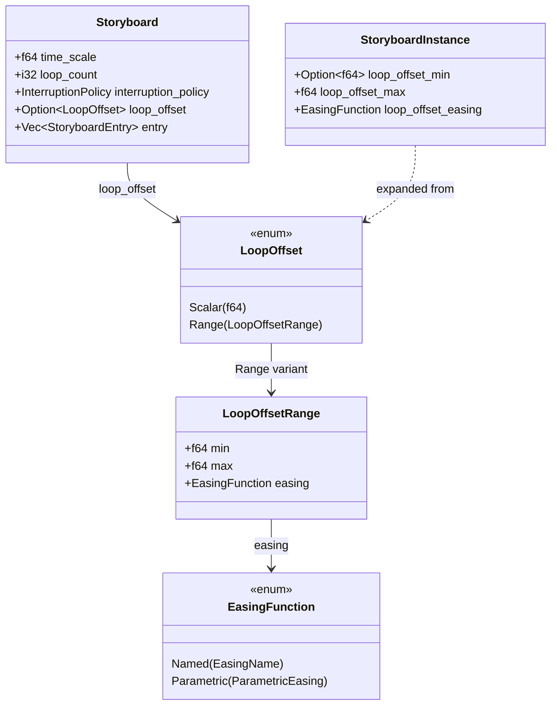

# Design Document: dola-storyboard-random-loop-offset

## Overview

**Purpose**: ストーリーボードの各ループ周回間にランダムな待機時間を挿入し、伺か SERIKO の瞬きアニメーションのような「不定期に繰り返される自然な動作」を宣言的に定義可能にする。

**Users**: アニメーション定義ファイルの作成者が、`loop_offset` フィールドを通じてランダム遅延の範囲と確率分布（イージング）を指定する。ランタイムエンジンが各周回完了時に遅延を自動適用する。

**Impact**: 既存の `Storyboard` 型にオプショナルフィールドを追加し、`loop_controller.rs` のフリー関数群を拡張する。後方互換性を完全に維持する。

### Goals
- ストーリーボード定義に `loop_offset` フィールドを追加し、ランダム遅延の `min`/`max`/`easing` を宣言的に指定可能にする
- 各ループ周回完了時にイージング関数で分布制御されたランダム遅延を生成・適用する
- 既存の Pause/Resume/Cancel/InterruptionPolicy との整合性を維持する
- スカラー短縮形とオブジェクト形式の両方を serde でサポートする

### Non-Goals
- 周期的・時間ベースの遅延パターン（SERIKO の `periodic`, `always` 等）は対象外
- `time_scale` の遅延への適用（遅延は実時間ベースで固定）
- 警告レベルのバリデーション出力（全てエラーとして報告）
- 遅延中の変数値補間（最終値を維持するのみ）

## Architecture

### Existing Architecture Analysis

dola ランタイムは以下のアーキテクチャパターンに従う:

- **フリー関数パターン**: `loop_controller.rs` は `StoryboardInstance` を操作する純粋関数群（Decision: `dola-runtime-5-loop`）
- **時間管理**: `loop_start_time` + `loop_duration` 方式。`end_time` は wall clock ベースの絶対時刻
- **Pause/Resume**: `pause_accumulated` フィールドで加算管理。Resume 時に `end_time += pause_duration` で延長
- **serde 多形**: `#[serde(untagged)]` による短縮形サポート（`KeyframeRef`, `TransitionRef` と同パターン）
- **バリデーション**: `Validate` トレイトの `validate()` → `Vec<DolaError>` 一括収集

### Architecture Pattern & Boundary Map



**Architecture Integration**:
- Selected pattern: 既存コンポーネント拡張（Option A）
- Domain boundaries: 定義層（`storyboard.rs`）、ランタイム層（`loop_controller.rs` + `instance_manager.rs`）、バリデーション層（`validate.rs`）の既存境界を維持
- Existing patterns preserved: フリー関数パターン、`#[serde(untagged)]` 多形、`Validate` トレイト
- New components rationale: 新型 `LoopOffset` のみ追加。新モジュールは不要（機能規模に対して過度な抽象化を回避）
- Steering compliance: Type Safety（明示的な Rust 型）、Pure Functions（副作用のないループ制御）

### Technology Stack

| Layer      | Choice / Version            | Role in Feature                             | Notes                               |
| ---------- | --------------------------- | ------------------------------------------- | ----------------------------------- |
| Data Model | `serde` 1.x                 | `LoopOffset` の JSON/TOML/YAML シリアライズ | 既存依存                            |
| Easing     | `interpolation` (workspace) | `[0,1]` → easing 変換                       | 既存依存、`EaseFunction` 計算用     |
| Random     | `rand` (新規追加)           | `[0,1]` 一様乱数生成                        | `thread_rng()` + `&mut impl Rng` DI |

## System Flows

### ループ遅延生成フロー



**Key decisions**:
- 遅延生成は `advance_loop()` 内で実行。`end_time += delay` により、次の while ループイテレーションで `current_time < end_time` が成立し自然に待機状態に入る
- Pause/Resume は既存メカニズムで対応（`end_time += pause_duration`）。遅延中の Pause も同一パターン
- `loop_count == 1` の場合は `advance_loop()` を呼ばずに即 Conclude（Req 2.3: `loop_offset` 無視）

## Requirements Traceability

| Requirement | Summary                                        | Components                      | Interfaces                                 | Flows                      |
| ----------- | ---------------------------------------------- | ------------------------------- | ------------------------------------------ | -------------------------- |
| 1.1         | `loop_offset` フィールド（省略可能）           | `Storyboard`                    | `Option<LoopOffset>`                       | -                          |
| 1.2         | min/max/easing パラメータ                      | `LoopOffset`                    | `LoopOffsetRange` struct fields            | -                          |
| 1.3         | 省略時の後方互換性                             | `Storyboard`, `loop_controller` | `Option<LoopOffset>` = `None`              | CheckLoopEnd → AdvanceLoop |
| 1.4         | 全シリアライズ形式サポート                     | `LoopOffset`                    | serde derive                               | -                          |
| 1.5         | 既存 EasingFunction サポート                   | `LoopOffset`                    | `EasingFunction` 型再利用                  | ApplyEasing                |
| 2.1         | ランダム遅延算出（uniform → easing → mapping） | `loop_controller`               | `generate_delay()`                         | GenerateDelay → MapToRange |
| 2.2         | 無限ループ対応                                 | `loop_controller`               | `process_loops()`                          | CheckContinue → Playing    |
| 2.3         | `loop_count=1` 時の `loop_offset` 無視         | `loop_controller`               | `process_loops()` 早期 return              | LoopCount1 → Conclude      |
| 2.4         | 遅延中の変数値維持（最終値）                   | `timeline_manager`              | 変更不要（`end_time` 延長で自然に実現）    | -                          |
| 2.5         | 各周回独立乱数                                 | `loop_controller`               | `generate_delay()` 毎回呼び出し            | GenerateDelay              |
| 2.6         | `time_scale` 非適用                            | `loop_controller`               | wall clock ベースで `end_time` 加算        | AddToEndTime               |
| 3.1         | `min` 負値エラー (V14)                         | `validate.rs`, `DolaError`      | `LoopOffsetNegativeMin`                    | -                          |
| 3.2         | `max` 負値エラー (V15)                         | `validate.rs`, `DolaError`      | `LoopOffsetNegativeMax`                    | -                          |
| 3.3         | 範囲逆転エラー (V16)                           | `validate.rs`, `DolaError`      | `LoopOffsetRangeInverted`                  | -                          |
| 3.4         | 不正 easing エラー (V17)                       | serde                           | デシリアライズ時エラー（型安全）           | -                          |
| 4.1         | スカラー短縮形                                 | `LoopOffset`                    | `Scalar(f64)` variant                      | -                          |
| 4.2         | オブジェクト形式                               | `LoopOffset`                    | `Range` variant                            | -                          |
| 4.3         | 両形式のデシリアライズ/シリアライズ            | `LoopOffset`                    | `#[serde(untagged)]`                       | -                          |
| 5.1         | 遅延中 Pause → 残り時間保持                    | `instance_manager`              | 既存 `pause_accumulated` + `end_time` 延長 | -                          |
| 5.2         | 遅延中 Cancel                                  | `facade`                        | 既存 `cancel()` フロー                     | -                          |
| 5.3         | 遅延中割り込み                                 | `facade`                        | 既存 `InterruptionPolicy` フロー           | -                          |

## Components and Interfaces

| Component                   | Domain/Layer | Intent                             | Req Coverage     | Key Dependencies                        | Contracts |
| --------------------------- | ------------ | ---------------------------------- | ---------------- | --------------------------------------- | --------- |
| `LoopOffset`                | Definition   | ランダム遅延パラメータの宣言的定義 | 1.1-1.5, 4.1-4.3 | `EasingFunction` (P0)                   | State     |
| `Storyboard` (拡張)         | Definition   | `loop_offset` フィールド追加       | 1.1, 1.3         | `LoopOffset` (P1)                       | State     |
| `loop_controller` (拡張)    | Runtime      | 遅延生成・適用ロジック             | 2.1-2.6          | `rand::Rng` (P0), `EasingFunction` (P0) | Service   |
| `StoryboardInstance` (拡張) | Runtime      | 遅延パラメータ保持                 | 2.1, 2.4-2.6     | -                                       | State     |
| `CompiledStoryboard` (拡張) | Compilation  | `loop_offset` メタ情報転送         | 1.1              | `LoopOffset` (P1)                       | State     |
| `validate.rs` (拡張)        | Validation   | V14-V17 ルール追加                 | 3.1-3.4          | `DolaError` (P0)                        | Service   |
| `DolaError` (拡張)          | Error        | 新バリアント追加                   | 3.1-3.3          | -                                       | State     |

### Definition Layer

#### LoopOffset

| Field        | Detail                                                        |
| ------------ | ------------------------------------------------------------- |
| Intent       | ループ間ランダム遅延の min/max/easing を表現する serde 対応型 |
| Requirements | 1.1, 1.2, 1.4, 1.5, 4.1, 4.2, 4.3                             |

**Responsibilities & Constraints**
- スカラー短縮形とオブジェクト形式の両方をデシリアライズ可能にする
- `EasingFunction` 型を再利用し、イージング指定の型安全性を保証
- `easing` フィールドのデフォルトは `EasingFunction::Named(EasingName::Linear)`

**Dependencies**
- Inbound: `Storyboard` — `loop_offset` フィールドとして保持 (P0)
- Outbound: `EasingFunction` — イージング関数型 (P0)

**Contracts**: State [x]

##### State Management

```rust
/// ループオフセット定義（短縮形 / オブジェクト形式）
#[derive(Debug, Clone, PartialEq, Serialize, Deserialize)]
#[serde(untagged)]
pub enum LoopOffset {
    /// 短縮形: 数値 → max として解釈（min=0.0, easing=linear）
    Scalar(f64),
    /// オブジェクト形式: { min, max, easing }
    Range(LoopOffsetRange),
}

/// ループオフセット範囲定義
#[derive(Debug, Clone, PartialEq, Serialize, Deserialize)]
pub struct LoopOffsetRange {
    /// 最小待機時間（f64秒、デフォルト 0.0）
    #[serde(default)]
    pub min: f64,
    /// 最大待機時間（f64秒、必須）
    pub max: f64,
    /// イージング関数（デフォルト: linear）
    #[serde(default = "default_easing_linear")]
    pub easing: EasingFunction,
}
```

- `Scalar` バリアントはデシリアライズ優先順位で先に定義（`#[serde(untagged)]` の順序依存）
- `default_easing_linear()` は `EasingFunction::Named(EasingName::Linear)` を返すヘルパー関数
- `LoopOffset` は `Storyboard` 上に `Option<LoopOffset>` として配置される

#### Storyboard (拡張)

| Field        | Detail                         |
| ------------ | ------------------------------ |
| Intent       | `loop_offset` フィールドの追加 |
| Requirements | 1.1, 1.3                       |

**Implementation Notes**
- `Storyboard` struct に `loop_offset: Option<LoopOffset>` を追加
- `#[serde(default, skip_serializing_if = "Option::is_none")]` で省略時の後方互換性を維持
- `loop_count = 1` の場合でも `loop_offset` の**定義**は許可する（ランタイムが無視する）

### Runtime Layer

#### loop_controller (拡張)

| Field        | Detail                                   |
| ------------ | ---------------------------------------- |
| Intent       | ループ周回完了時のランダム遅延生成・適用 |
| Requirements | 2.1, 2.2, 2.3, 2.4, 2.5, 2.6             |

**Responsibilities & Constraints**
- `advance_loop()` 呼び出し後に遅延を生成し `end_time` に加算する
- 乱数は `&mut impl Rng` パラメータで注入（テスタビリティ確保）
- easing 適用: `uniform [0,1] → easing(t) → min + eased * (max - min)`
- `time_scale` は遅延に適用しない（wall clock ベースの `end_time` 加算で自然に実現）

**Dependencies**
- Inbound: `DolaRuntime::update()` — `process_loops()` 呼び出し (P0)
- Outbound: `StoryboardInstance` — 状態フィールドへのアクセス (P0)
- External: `rand::Rng` — 乱数生成 (P0)
- External: `EasingFunction` — easing 適用 (P0)

**Contracts**: Service [x]

##### Service Interface

```rust
/// 遅延を考慮したループ処理（シグネチャ拡張）
pub(crate) fn process_loops(
    instance: &mut StoryboardInstance,
    current_time: f64,
    rng: &mut impl Rng,
) -> LoopAction;

/// 周回進行 + 遅延生成（シグネチャ拡張）
pub(crate) fn advance_loop(
    instance: &mut StoryboardInstance,
    rng: &mut impl Rng,
);

/// ランダム遅延生成（新規関数）
/// uniform [0,1] → easing → [min, max] mapping
pub(crate) fn generate_delay(
    min: f64,
    max: f64,
    easing: &EasingFunction,
    rng: &mut impl Rng,
) -> f64;
```

- Preconditions: `min >= 0`, `max >= 0`, `min <= max`（バリデーション済み前提）
- Postconditions: `generate_delay()` の戻り値は `[min, max]` 範囲内
- Invariants: `end_time` は常に `loop_start_time + loop_duration + delay` 以上

**Implementation Notes**
- `advance_loop()` は内部で `generate_delay()` を呼び、`instance.end_time += delay` を実行
- `loop_offset` が `None` の場合、遅延は 0（既存動作と完全互換）
- `process_loops()` 内の while ループは変更最小限: `advance_loop()` が遅延を `end_time` に加算するため、`current_time < end_time` で自然にループ脱出

**EasingFunction 適用メカニズム**:

`generate_delay()` の実装フロー:
1. 一様乱数生成: `let t = rng.gen_range(0.0..1.0)`
2. イージング適用: `let eased = apply_easing(easing, t)`
3. 範囲マッピング: `min + eased * (max - min)`

`apply_easing()` ヘルパー関数の設計:
```rust
fn apply_easing(easing: &EasingFunction, t: f64) -> f64 {
    use interpolation::Ease;
    match easing {
        EasingFunction::Named(name) => {
            let ease_fn = match name {
                EasingName::Linear => return t,
                EasingName::QuadraticIn => interpolation::EaseFunction::QuadraticIn,
                EasingName::QuadraticOut => interpolation::EaseFunction::QuadraticOut,
                EasingName::QuadraticInOut => interpolation::EaseFunction::QuadraticInOut,
                // ... 全30+ variants のマッピング
            };
            ease_fn.ease(t, 0.0, 1.0)
        }
        EasingFunction::Parametric(p) => {
            match p {
                ParametricEasing::QuadraticBezier { x0, x1, x2 } => {
                    interpolation::quad_bez(t, *x0, *x1, *x2)
                }
                ParametricEasing::CubicBezier { x0, x1, x2, x3 } => {
                    interpolation::cub_bez(t, *x0, *x1, *x2, *x3)
                }
            }
        }
    }
}
```

`EasingName` → `interpolation::EaseFunction` の完全マッピング表（30+ variants）は実装時に参照。Linear は特別扱い（`t` をそのまま返す）で最適化。

#### StoryboardInstance (拡張)

| Field        | Detail                                     |
| ------------ | ------------------------------------------ |
| Intent       | 遅延パラメータをインスタンス生存期間中保持 |
| Requirements | 2.1, 2.6                                   |

**Contracts**: State [x]

##### State Management

追加フィールド:

```rust
pub(crate) struct StoryboardInstance {
    // ... 既存フィールド ...

    /// ループオフセット最小値（f64秒）。None の場合はオフセットなし
    pub loop_offset_min: Option<f64>,
    /// ループオフセット最大値（f64秒）
    pub loop_offset_max: f64,
    /// ループオフセット用イージング関数
    pub loop_offset_easing: EasingFunction,
}
```

- `loop_offset_min: Option<f64>` が `None` → ループオフセットなし（既存動作）
- `loop_offset_min: Some(min)` → オフセットあり。`min`, `max`, `easing` の3値で遅延計算
- `facade.rs::start()` で `CompiledStoryboard` の `loop_offset` から値を展開して設定

### Compilation Layer

#### CompiledStoryboard (拡張)

| Field        | Detail                                              |
| ------------ | --------------------------------------------------- |
| Intent       | `loop_offset` メタ情報の定義層→ランタイム層への転送 |
| Requirements | 1.1                                                 |

**Implementation Notes**

```rust
pub struct CompiledStoryboard {
    // ... 既存フィールド ...

    /// ループオフセット定義（省略可能）
    #[serde(default, skip_serializing_if = "Option::is_none")]
    pub loop_offset: Option<LoopOffset>,
}
```

- コンパイラは `Storyboard::loop_offset` をそのまま `CompiledStoryboard::loop_offset` に転送
- ランタイムの `facade.rs::start()` が `CompiledStoryboard::loop_offset` から `StoryboardInstance` のフィールドに展開

### Validation Layer

#### validate.rs (拡張)

| Field        | Detail                                                    |
| ------------ | --------------------------------------------------------- |
| Intent       | `loop_offset` に対するバリデーションルール V14-V17 の追加 |
| Requirements | 3.1, 3.2, 3.3, 3.4                                        |

**Contracts**: Service [x]

##### Service Interface

新規バリデーション関数:

```rust
/// loop_offset バリデーション（V14-V17）
fn validate_loop_offset(
    storyboard_name: &str,
    storyboard: &Storyboard,
    errors: &mut Vec<DolaError>,
);
```

- V14: `loop_offset.min < 0` → `LoopOffsetNegativeMin`
- V15: `loop_offset.max < 0` → `LoopOffsetNegativeMax`
- V16: `loop_offset.min > loop_offset.max` → `LoopOffsetRangeInverted`
- V17: `easing` の妥当性 → serde の型システムが保証（`EasingFunction` のデシリアライズで不正値はパースエラー）。Parametric easing の範囲検証が必要な場合のみ追加

**Implementation Notes**
- `validate_loop_offset()` は `impl Validate for DolaDocument::validate()` 内の storyboard ループ内で呼び出す
- V17 は serde レベルで型安全に処理されるため、ランタイムバリデーションは不要（`EasingFunction` のデシリアライズ失敗がバリデーションエラー相当）
- `LoopOffset::Scalar(v)` の場合: `min=0.0`, `max=v` として検証（`v < 0` の場合 V15 をトリガー）

#### DolaError (拡張)

| Field        | Detail                                           |
| ------------ | ------------------------------------------------ |
| Intent       | `loop_offset` バリデーションエラーバリアント追加 |
| Requirements | 3.1, 3.2, 3.3                                    |

**Contracts**: State [x]

##### State Management

```rust
pub enum DolaError {
    // ... 既存バリアント ...

    /// loop_offset.min が負値 (V14)
    LoopOffsetNegativeMin {
        storyboard: String,
        value: f64,
    },
    /// loop_offset.max が負値 (V15)
    LoopOffsetNegativeMax {
        storyboard: String,
        value: f64,
    },
    /// loop_offset の min > max (V16)
    LoopOffsetRangeInverted {
        storyboard: String,
        min: f64,
        max: f64,
    },
}
```

## Data Models

### Domain Model



**Business Rules & Invariants**:
- `loop_offset.min >= 0` かつ `loop_offset.max >= 0`
- `loop_offset.min <= loop_offset.max`
- `loop_count == 1` の場合、`loop_offset` は定義可能だがランタイムで無視される
- 生成される遅延値は常に `[min, max]` 範囲内

### Data Contracts & Integration

**JSON 表現例**（短縮形）:
```json
{
  "loop_count": -1,
  "loop_offset": 5.0
}
```

**JSON 表現例**（オブジェクト形式）:
```json
{
  "loop_count": -1,
  "loop_offset": {
    "min": 1.0,
    "max": 5.0,
    "easing": "quadratic_out"
  }
}
```

**JSON 表現例**（パラメトリックイージング）:
```json
{
  "loop_count": -1,
  "loop_offset": {
    "min": 0.5,
    "max": 3.0,
    "easing": {
      "type": "cubic_bezier",
      "x0": 0.0,
      "x1": 0.42,
      "x2": 0.58,
      "x3": 1.0
    }
  }
}
```

## Error Handling

### Error Categories and Responses

**Validation Errors (V14-V17)**:
- V14 `LoopOffsetNegativeMin`: `loop_offset.min` が負値 → エラーメッセージに storyboard 名と値を含む
- V15 `LoopOffsetNegativeMax`: `loop_offset.max` が負値 → 同上
- V16 `LoopOffsetRangeInverted`: `min > max` → エラーメッセージに storyboard 名と min/max 値を含む
- V17: serde デシリアライズエラー（`EasingFunction` の型システムが保証）

**Runtime Errors**:
- 乱数生成失敗: 実質的に発生しない（`rand::thread_rng()` はパニックのみ、OS エントロピー取得失敗時）
- 遅延値の NaN/Infinity: `generate_delay()` で `f64::is_finite()` ガード

## Testing Strategy

### Unit Tests
- `LoopOffset` serde round-trip: スカラー短縮形、オブジェクト形式、easing 省略時デフォルト
- `generate_delay()`: 固定シード `SmallRng` で決定的テスト。easing 別の分布確認
- `generate_delay()` with `min == max`: 固定遅延として機能（常に min 値を返す）、イージング・乱数生成スキップ
- `advance_loop()` with delay: 遅延が `end_time` に正しく加算されるか
- `process_loops()` with delay: while ループが遅延で正しく停止するか
- バリデーション V14-V17: 各ルールの正常/異常ケース

### Integration Tests
- ストーリーボード定義 → コンパイル → ランタイム実行の E2E フロー（遅延あり/なし）
- 無限ループ + `loop_offset` の複数周回動作
- `loop_count=1` + `loop_offset` 定義済み → 遅延が無視されることの確認
- Pause → Resume 中の遅延残り時間保持
- Cancel 中の遅延即時中断

### Performance
- 無限ループ + 遅延の長時間実行で `f64` 精度劣化がないことの確認
- `generate_delay()` のオーバーヘッド測定（ループ周回ごとの乱数生成コスト）
