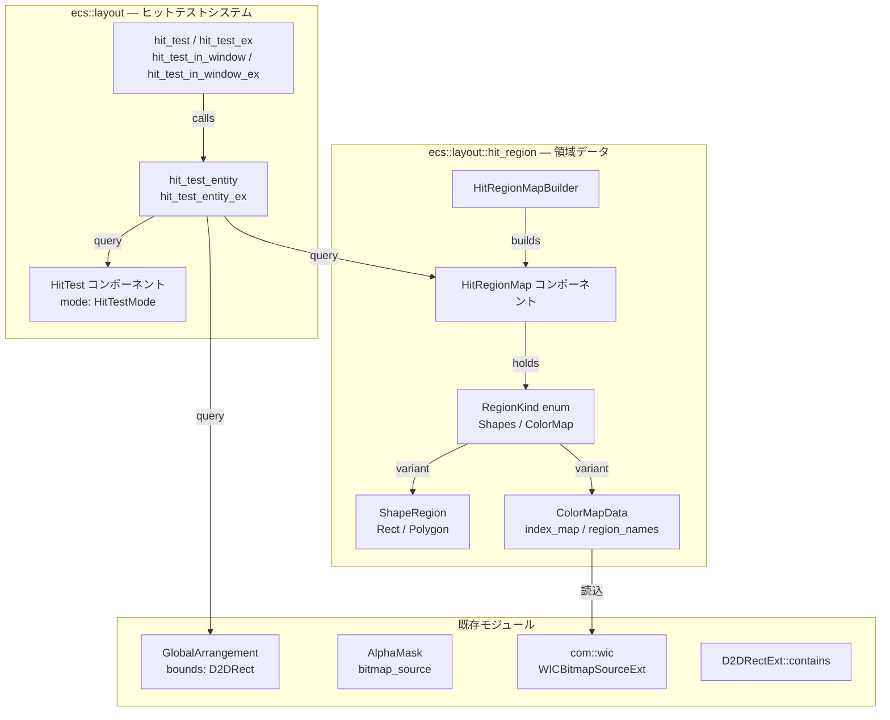
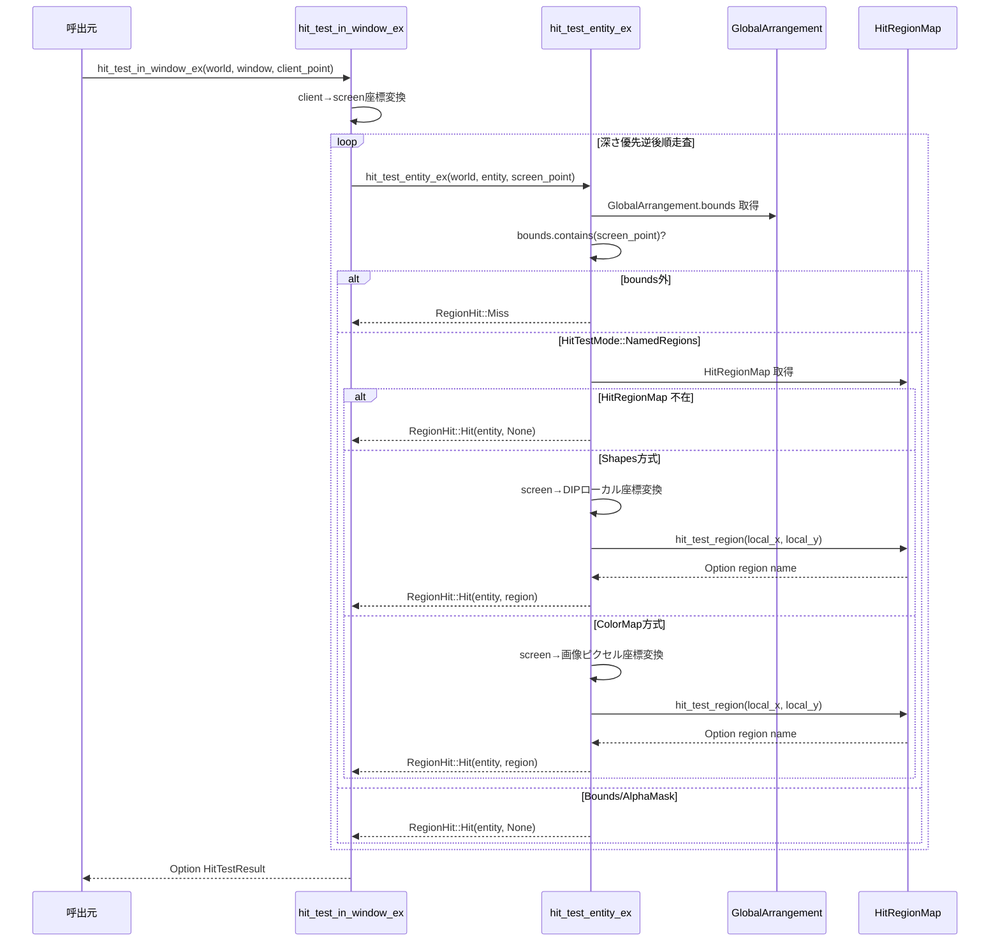
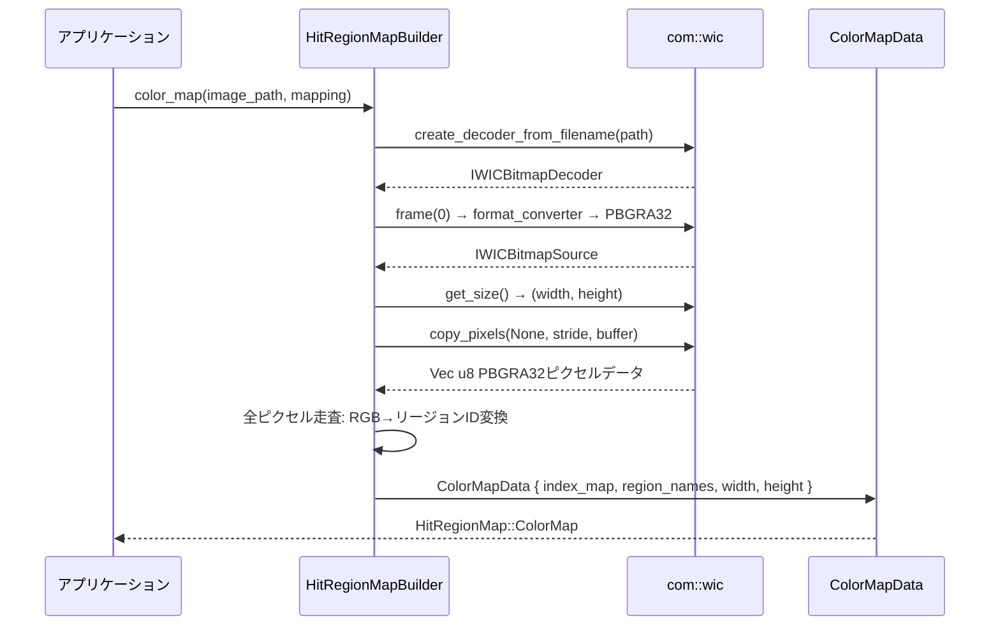
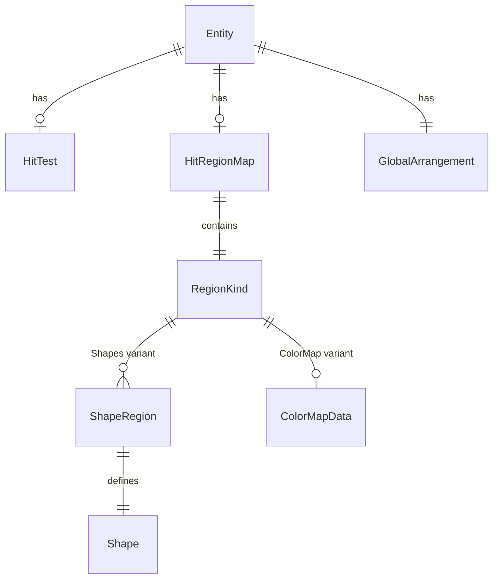

# Design Document

| 項目 | 内容 |
|------|------|
| **Document Title** | event-hit-test-named-regions 技術設計書 |
| **Version** | 1.0 |
| **Date** | 2026-02-14 |
| **Requirements** | event-hit-test-named-regions/requirements.md v1.0 |
| **Author** | AI-DLC System |

---

## Overview

**Purpose**: 名前付きヒット領域システムは、1つのECSエンティティ上に複数の独立した名前付き領域（矩形・多角形・カラーマップ画像）を定義し、マウスヒットテスト時にどの領域にヒットしたかを識別する機能を提供する。デスクトップマスコットの部位ごとのインタラクション（頭を撫でる、手を触るなど）を実現する基盤となる。

**Users**: wintf フレームワークを使用するアプリケーション開発者（areka 等）が、エンティティごとにヒット領域を定義し、部位ベースのイベント処理を実装する。

**Impact**: 既存の `HitTestMode` enum に `NamedRegions` バリアントを追加し、`hit_test_entity` の分岐を拡張する。既存 API（`hit_test`, `hit_test_in_window`）の動作は変更しない。

### Goals
- `HitTestMode::NamedRegions` による2段階判定（エンティティBounds → 領域名解決）の実装
- 矩形・多角形・カラーマップ画像の3方式による領域定義（排他的設計）
- `HitTestResult` を返す拡張API（`hit_test_ex`, `hit_test_in_window_ex`）の提供
- `serde` optional 対応による外部ファイルからの領域定義読込基盤
- 既存 API の後方互換性維持

### Non-Goals
- アニメーション連動のフレームごとヒット領域切り替え（将来仕様）
- カラーマップと矩形/多角形の混在定義（排他的設計で除外）
- JSON/TOML パース処理の wintf 内実装（areka 層の責務）
- `MouseState` へのリージョン名統合（event-mouse-basic Phase 2 以降）

## Architecture

### Existing Architecture Analysis

**現行ヒットテストシステムの構造**:
- `HitTestMode` enum: `None` / `Bounds` / `AlphaMask` の3バリアント
- `hit_test_entity(world, entity, point) -> bool`: 各モードに応じた分岐判定
- `AlphaMask` 拡張パターン: enum バリアント追加 → match 分岐追加 → コンポーネント取得 → 座標変換 → 判定
- 座標変換: `GlobalArrangement.bounds` からの線形スケーリング（軸平行変換前提）

**遵守すべき既存パターン**:
- COM → ECS → Message Handling のレイヤー依存方向
- `#[derive(Component)]` + ファクトリメソッド
- tracing 構造化ロギング
- フォールバック: コンポーネント不在時は上位モード（Bounds）にフォールバック

### Architecture Pattern & Boundary Map



**Architecture Integration**:
- **Selected pattern**: 既存 AlphaMask 拡張パターンの踏襲（enum バリアント追加 + match 分岐拡張）
- **Domain boundaries**: 領域データ型は `hit_region.rs` に分離、判定ロジック拡張は `hit_test.rs` に追加
- **Existing patterns preserved**: COM → ECS 依存方向、フォールバック、tracing ロギング
- **New components rationale**: `HitRegionMap` はエンティティごとの領域データを保持する ECS コンポーネント。`hit_test.rs` の肥大化を避けるため `hit_region.rs` に分離
- **Steering compliance**: `structure.md` の Layout System パターンに従い `ecs::layout` 配下に配置

### Technology Stack

| Layer | Choice / Version | Role in Feature | Notes |
|-------|------------------|-----------------|-------|
| ECS | bevy_ecs 0.18.0 | `HitRegionMap` コンポーネント定義 | 既存依存 |
| Imaging | WIC (windows 0.62.2) | カラーマップ PNG 読込 | 既存パイプライン再利用 |
| Geometry | 自前実装 | Ray Casting 法（多角形内外判定） | 外部クレート不要 |
| Serialization | serde 1 (optional) | 構造体の Serialize/Deserialize | 新規 optional 依存 |
| Layout | taffy 0.9.2 | エンティティ論理サイズ取得 | 既存依存 |

## System Flows

### Named Regions ヒットテスト判定フロー



### カラーマップ画像読込フロー



## Requirements Traceability

| Requirement | Summary | Components | Interfaces | Flows |
|-------------|---------|------------|------------|-------|
| 1.1 | HitTestMode に NamedRegions 追加 | HitTestMode | — | — |
| 1.2 | Bounds判定後に領域名解決 | hit_test_entity_ex | RegionHit | 判定フロー |
| 1.3 | HitRegionMap 不在時は region: None | hit_test_entity_ex | — | 判定フロー |
| 1.4 | 既存モード維持 | HitTestMode | — | — |
| 2.1-2.5 | 矩形による名前付き領域 | ShapeRegion::Rect | HitRegionMap::hit_test_region | 判定フロー |
| 3.1-3.8 | カラーマップ画像による領域 | ColorMapData | HitRegionMapBuilder::color_map | 読込フロー |
| 4.1-4.7 | 多角形による領域（オプショナル） | ShapeRegion::Polygon | point_in_polygon | 判定フロー |
| 5.1-5.6 | HitTestResult 拡張API | HitTestResult | hit_test_ex, hit_test_in_window_ex | 判定フロー |
| 6.1-6.3 | 定義順序（先勝ち）優先順位 | HitRegionMap::hit_test_region | — | — |
| 7.1-7.5 | serde optional 対応 | 全データ型 | Serialize, Deserialize | — |
| 8.1-8.8 | HitRegionMap コンポーネント | HitRegionMap, RegionKind | ビルダーAPI | — |

## Components and Interfaces

| Component | Domain/Layer | Intent | Req Coverage | Key Dependencies | Contracts |
|-----------|-------------|--------|--------------|-----------------|-----------|
| HitTestMode::NamedRegions | ecs::layout | ヒットテストモード拡張 | 1.1, 1.4 | HitTest (P0) | — |
| hit_test_entity_ex | ecs::layout | エンティティ単位の拡張判定 | 1.2, 1.3, 5.3-5.5 | GlobalArrangement (P0), HitRegionMap (P0) | Service |
| hit_test_ex / hit_test_in_window_ex | ecs::layout | ツリー走査の拡張API | 5.1-5.6 | hit_test_entity_ex (P0) | Service |
| HitTestResult | ecs::layout | 拡張ヒット結果 | 5.1, 5.2 | — | State |
| HitRegionMap | ecs::layout::hit_region | 領域データコンポーネント | 8.1-8.8 | RegionKind (P0) | State |
| RegionKind | ecs::layout::hit_region | 排他的方式enum | 8.2, 8.5, 8.6 | ShapeRegion (P0), ColorMapData (P0) | State |
| ShapeRegion | ecs::layout::hit_region | 矩形/多角形領域定義 | 2.1-2.5, 4.1-4.7, 6.1-6.3 | — | State |
| ColorMapData | ecs::layout::hit_region | カラーマップキャッシュデータ | 3.1-3.8 | com::wic (P1) | State |
| HitRegionMapBuilder | ecs::layout::hit_region | ビルダーAPI | 8.3, 8.4 | WIC (P1) | Service |

### ecs::layout — ヒットテスト拡張

#### HitTestMode 拡張

| Field | Detail |
|-------|--------|
| Intent | 名前付きヒット領域モードの追加 |
| Requirements | 1.1, 1.4 |

**Responsibilities & Constraints**
- `NamedRegions` バリアントを `HitTestMode` enum に追加
- 既存バリアント（`None`, `Bounds`, `AlphaMask`）の動作に影響しない

**Contracts**: State [x]

##### State Management

```rust
#[derive(Debug, Clone, Copy, PartialEq, Eq, Default)]
pub enum HitTestMode {
    None,
    #[default]
    Bounds,
    AlphaMask,
    NamedRegions,  // 新規追加
}
```

#### RegionHit（内部判定結果）

| Field | Detail |
|-------|--------|
| Intent | hit_test_entity_ex の内部返値型 |
| Requirements | 1.2, 1.3 |

**Contracts**: State [x]

##### State Management

```rust
/// hit_test_entity_ex の内部返値
pub(crate) enum RegionHit {
    /// エンティティにヒットしなかった
    Miss,
    /// エンティティにヒットした（リージョン名は Option）
    Hit(Option<String>),
}
```

#### HitTestResult

| Field | Detail |
|-------|--------|
| Intent | 拡張ヒットテスト結果の公開型 |
| Requirements | 5.1, 5.2 |

**Contracts**: State [x]

##### State Management

```rust
#[derive(Debug, Clone)]
pub struct HitTestResult {
    /// ヒットしたエンティティ
    pub entity: Entity,
    /// ヒットした領域名（NamedRegions モード時のみ、None は無名ヒット）
    pub region: Option<String>,
}
```

#### hit_test_entity_ex

| Field | Detail |
|-------|--------|
| Intent | エンティティ単位の拡張ヒット判定 |
| Requirements | 1.2, 1.3, 5.3-5.5 |

**Dependencies**
- Inbound: hit_test_ex — ツリー走査から呼び出し (P0)
- Outbound: GlobalArrangement — bounds 取得 (P0)
- Outbound: HitRegionMap — 領域名解決 (P0)
- Outbound: HitTest — モード取得 (P0)

**Contracts**: Service [x]

##### Service Interface

```rust
/// エンティティ単位の拡張ヒット判定
/// 既存 hit_test_entity(bool 返値) とは別関数として提供
pub fn hit_test_entity_ex(
    world: &World,
    entity: Entity,
    point: PhysicalPoint,
) -> RegionHit
```

- **Preconditions**: `entity` が有効な Entity であること
- **Postconditions**: 
  - `HitTestMode::NamedRegions` + `HitRegionMap` 存在: `RegionHit::Hit(Some/None)` または `Miss`
  - `HitTestMode::NamedRegions` + `HitRegionMap` 不在: `RegionHit::Hit(None)`（Bounds判定のみ、1.3）
  - `HitTestMode::Bounds/AlphaMask`: 既存 `hit_test_entity` に委譲し、`Hit(None)` または `Miss`
- **Invariants**: 既存 `hit_test_entity` の判定結果と矛盾しない

**座標変換ロジック（AlphaMask 完全踏襲）**:

```rust
// スクリーン座標 → 正規化座標（0.0〜1.0）— AlphaMask と同じパターン
// hit_test.rs L215-220 と同一ロジック
let bounds = &global_arrangement.bounds;
let bounds_width = bounds.right - bounds.left;
let bounds_height = bounds.bottom - bounds.top;

let rel_x = (point.x - bounds.left) / bounds_width;
let rel_y = (point.y - bounds.top) / bounds_height;

// HitRegionMap で判定（正規化座標 + entity_size を渡す）
let region_name = hit_region_map.hit_test_region(rel_x, rel_y, &arrangement.size);
// → HitRegionMap 内部で方式別の座標変換と判定を実施
```

**データソース**:
- 物理ピクセル bounds: `GlobalArrangement.bounds`（hit_test.rs L207 パターン踏襲）
- DIP論理サイズ: `Arrangement.size`（systems.rs L335-342 で TaffyComputedLayout.size から設定）
- 既存 AlphaMask 実装（hit_test.rs L215-220）と完全に同じ正規化座標を使用

#### hit_test_ex / hit_test_in_window_ex

| Field | Detail |
|-------|--------|
| Intent | ツリー走査の拡張API |
| Requirements | 5.1-5.6 |

**Dependencies**
- Outbound: hit_test_entity_ex — エンティティ単位判定 (P0)
- Outbound: DepthFirstReversePostOrder — ツリー走査 (P0)

**Contracts**: Service [x]

##### Service Interface

```rust
/// ツリー全体のヒットテスト（拡張版）
pub fn hit_test_ex(
    world: &World,
    root: Entity,
    screen_point: PhysicalPoint,
) -> Option<HitTestResult>

/// ウィンドウ内ヒットテスト（拡張版）
pub fn hit_test_in_window_ex(
    world: &World,
    window: Entity,
    client_point: PhysicalPoint,
) -> Option<HitTestResult>
```

- **Preconditions**: `root` / `window` が有効なエンティティ
- **Postconditions**: 最前面のヒットエンティティと領域名を返す
- **Invariants**: 既存 `hit_test` / `hit_test_in_window` と同じ走査順序（DepthFirstReversePostOrder）

**Implementation Notes**
- 既存 `hit_test` / `hit_test_in_window` API は変更しない（5.6 後方互換）
- `hit_test` は内部で `hit_test_entity_ex` を呼び出すようリファクタリング可能（`RegionHit::Hit(_)` → `true`）

### ecs::layout::hit_region — 領域データ

#### HitRegionMap

| Field | Detail |
|-------|--------|
| Intent | ECSコンポーネントとしてヒット領域データをエンティティに紐づける |
| Requirements | 8.1-8.8 |

**Responsibilities & Constraints**
- 矩形/多角形方式またはカラーマップ方式のいずれか一方を保持（排他的）
- `hit_test_region()` メソッドで座標→領域名の判定を提供
- 空の場合は `None` を返す

**Dependencies**
- Inbound: hit_test_entity_ex — 領域名解決のために query (P0)
- External: bevy_ecs — Component derive (P0)

**Contracts**: State [x] / Service [x]

##### State Management

```rust
#[derive(Component, Debug, Clone)]
#[cfg_attr(feature = "serde", derive(serde::Serialize, serde::Deserialize))]
pub struct HitRegionMap {
    kind: RegionKind,
}
```

##### Service Interface

```rust
impl HitRegionMap {
    /// ビルダー開始（矩形/多角形方式）
    pub fn builder() -> HitRegionMapBuilder { ... }

    /// カラーマップ方式で構築
    /// mapping: RGB → リージョン名のマッピング
    pub fn from_color_map(
        image_path: &std::path::Path,
        mapping: &HashMap<(u8, u8, u8), String>,
    ) -> windows::core::Result<Self> { ... }

    /// 正規化座標から領域名を返す（AlphaMaskパターン踏襲）
    /// 
    /// # Arguments
    /// * `rel_x`, `rel_y` - 正規化座標（0.0〜1.0）
    /// * `entity_size` - エンティティの論理サイズ（DIP単位、Shapes方式で使用）
    pub fn hit_test_region(
        &self, 
        rel_x: f32, 
        rel_y: f32, 
        entity_size: &Size
    ) -> Option<&str> { ... }
}
```

- **Preconditions**: `rel_x`, `rel_y` は正規化座標（0.0〜1.0）、`entity_size` は `Arrangement.size`
- **Postconditions**: 領域内→`Some("name")`、領域外→`None`
- **Invariants**: 空の場合は常に `None`
- **Implementation**: 内部で方式別の座標変換を実施
  - Shapes: `local_x = rel_x * entity_size.width` で DIPローカル座標に変換
  - ColorMap: `pixel_x = (rel_x * color_map.width()) as u32` で画像ピクセル座標に変換（AlphaMask L218-219 と同一）

#### RegionKind

| Field | Detail |
|-------|--------|
| Intent | 矩形/多角形方式とカラーマップ方式の排他的バリアント |
| Requirements | 8.2, 8.5, 8.6 |

**Contracts**: State [x]

##### State Management

```rust
#[derive(Debug, Clone)]
#[cfg_attr(feature = "serde", derive(serde::Serialize, serde::Deserialize))]
enum RegionKind {
    /// 矩形/多角形の形状リスト（混在可能）
    Shapes(Vec<ShapeRegion>),
    /// カラーマップ画像ベースの領域定義
    ColorMap(ColorMapData),
}
```

#### ShapeRegion

| Field | Detail |
|-------|--------|
| Intent | 名前付き矩形/多角形領域定義 |
| Requirements | 2.1-2.5, 4.1-4.7 |

**Contracts**: State [x]

##### State Management

```rust
#[derive(Debug, Clone)]
#[cfg_attr(feature = "serde", derive(serde::Serialize, serde::Deserialize))]
pub struct ShapeRegion {
    /// 領域名
    pub name: String,
    /// 形状定義
    pub shape: Shape,
}

#[derive(Debug, Clone)]
#[cfg_attr(feature = "serde", derive(serde::Serialize, serde::Deserialize))]
pub enum Shape {
    /// 矩形: 左上座標 + 幅 + 高さ（DIP単位）
    Rect { x: f32, y: f32, width: f32, height: f32 },
    /// 多角形: 頂点リスト（DIP単位、自動的に閉じる）
    Polygon { vertices: Vec<(f32, f32)> },
}
```

**Implementation Notes**
- 矩形判定: `x <= local_x <= x + width && y <= local_y <= y + height`
- 多角形判定: Ray Casting 法（O(n), n = 頂点数）
- 定義順序による先勝ちルール（6.1）: `Vec<ShapeRegion>` を前から順に評価

#### ColorMapData

| Field | Detail |
|-------|--------|
| Intent | カラーマップ画像のキャッシュデータ |
| Requirements | 3.1-3.8 |

**Responsibilities & Constraints**
- 画像読込時にピクセル→リージョンIDのインデックスマップを構築
- RGB完全一致でマッピング（アルファチャンネル無視）
- マッピング外色はインデックス 0（= None）

**Dependencies**
- External: com::wic — 画像読込 (P1)

**Contracts**: State [x]

##### State Management

```rust
#[derive(Debug, Clone)]
pub struct ColorMapData {
    /// ピクセル座標 → リージョンID（0 = 無名）のインデックスマップ
    /// index_map[y * width + x] = region_id
    index_map: Vec<u8>,
    /// リージョンID → リージョン名（ID 1 から開始）
    region_names: Vec<String>,
    /// 画像幅
    width: u32,
    /// 画像高さ
    height: u32,
}
```

`#[cfg_attr(feature = "serde", ...)]` は `ColorMapData` には適用しない（バイナリキャッシュはシリアライズ対象外）。serde 対応はカラーマップ定義情報（パス + マッピングテーブル）に対して行う。

```rust
/// カラーマップ定義（シリアライズ対象）
#[derive(Debug, Clone)]
#[cfg_attr(feature = "serde", derive(serde::Serialize, serde::Deserialize))]
pub struct ColorMapDef {
    /// 画像ファイルパス
    pub image_path: String,
    /// RGB → 領域名マッピング
    pub mapping: Vec<ColorMapping>,
}

#[derive(Debug, Clone)]
#[cfg_attr(feature = "serde", derive(serde::Serialize, serde::Deserialize))]
pub struct ColorMapping {
    /// RGB値 [R, G, B]
    pub color: [u8; 3],
    /// 領域名
    pub name: String,
}
```

##### Service Interface

```rust
impl ColorMapData {
    /// WIC画像読込 + インデックスマップ構築
    fn from_image(
        image_path: &std::path::Path,
        mapping: &HashMap<(u8, u8, u8), String>,
    ) -> windows::core::Result<Self> { ... }

    /// ピクセル座標から領域名を返す
    fn hit_test(&self, pixel_x: u32, pixel_y: u32) -> Option<&str> { ... }

    pub fn width(&self) -> u32 { self.width }
    pub fn height(&self) -> u32 { self.height }
}
```

#### HitRegionMapBuilder

| Field | Detail |
|-------|--------|
| Intent | 矩形/多角形方式のビルダーパターン構築API |
| Requirements | 8.3 |

**Contracts**: Service [x]

##### Service Interface

```rust
pub struct HitRegionMapBuilder {
    regions: Vec<ShapeRegion>,
}

impl HitRegionMapBuilder {
    pub fn new() -> Self { ... }

    /// 矩形領域を追加
    pub fn rect(mut self, name: &str, x: f32, y: f32, width: f32, height: f32) -> Self { ... }

    /// 多角形領域を追加
    pub fn polygon(mut self, name: &str, vertices: &[(f32, f32)]) -> Self { ... }

    /// HitRegionMap を構築（バリデーション付き）
    pub fn build(self) -> Result<HitRegionMap, HitRegionError> { ... }
}
```

- **Preconditions**: 
  - `rect`: width > 0, height > 0
  - `polygon`: vertices.len() >= 3
- **Postconditions**: `RegionKind::Shapes` を内包する `HitRegionMap` を返す
- **Invariants**: バリデーションエラー時はパニックせず `Err` を返す（7.3）

#### point_in_polygon（内部関数）

| Field | Detail |
|-------|--------|
| Intent | Ray Casting 法による多角形内外判定 |
| Requirements | 4.5 |

**Contracts**: Service [x]

##### Service Interface

```rust
/// Ray Casting法による点の多角形内外判定
/// O(n) — n: 頂点数
fn point_in_polygon(x: f32, y: f32, vertices: &[(f32, f32)]) -> bool
```

## Data Models

### Domain Model



**Aggregate**: `HitRegionMap` はエンティティレベルのコンポーネント。独立してクエリ・更新可能。

**Invariants**:
- `RegionKind::Shapes` と `RegionKind::ColorMap` は排他的（型レベルで強制）
- `ShapeRegion::Polygon` の頂点数 >= 3
- `ShapeRegion::Rect` の width > 0, height > 0
- `ColorMapData.index_map.len() == width * height`

## Error Handling

### Error Strategy

```rust
#[derive(Debug, thiserror::Error)]
pub enum HitRegionError {
    #[error("多角形の頂点数が不足しています: {vertices} < 3")]
    InsufficientVertices { vertices: usize },

    #[error("矩形のサイズが不正です: width={width}, height={height}")]
    InvalidRectSize { width: f32, height: f32 },

    #[error("カラーマップ画像の読込に失敗しました: {0}")]
    ImageLoadFailed(#[from] windows::core::Error),
}
```

### Error Categories and Responses

| カテゴリ | エラー | レスポンス |
|---------|--------|-----------|
| バリデーション | 頂点数不足、矩形サイズ不正 | `HitRegionError` を返す。パニックしない (7.3) |
| 画像I/O | カラーマップ PNG 読込失敗 | `windows::core::Error` をラップして返す |
| ランタイム | `HitRegionMap` 不在 | Bounds フォールバック (1.3) |
| ランタイム | 座標が bounds 外 | `RegionHit::Miss`（既存パターン踏襲） |

### Monitoring

- `warn!` レベル: `HitRegionMap` 不在で `NamedRegions` モードが設定されている場合
- `debug!` レベル: カラーマップ画像読込完了、リージョン数
- `trace!` レベル: ヒット判定結果（entity, region, point）

## Testing Strategy

### Unit Tests
- `point_in_polygon`: 凸多角形、凹多角形、辺上の点、外部の点
- `ShapeRegion::Rect`: 境界値（inclusive境界）、内部、外部
- `ColorMapData::hit_test`: マッピング内色、マッピング外色、範囲外座標
- `HitRegionMapBuilder::build`: 正常構築、バリデーションエラー（頂点不足、負サイズ）
- `HitRegionMap::hit_test_region`: Shapes方式の先勝ちルール検証

### Integration Tests
- `hit_test_entity_ex` + `NamedRegions` + `HitRegionMap`: 矩形領域ヒット/ミス
- `hit_test_entity_ex` + `NamedRegions` + `HitRegionMap` 不在: Boundsフォールバック
- `hit_test_ex` / `hit_test_in_window_ex`: ツリー走査で最前面エンティティとリージョン名を返す
- 座標変換: screen→ローカル座標の正確性（bounds基準）
- 既存 `hit_test` / `hit_test_in_window` の後方互換性検証

### Performance
- カラーマップインデックスマップのルックアップ速度（O(1)確認）
- Ray Casting 法の頂点数スケーリング（100頂点以下で < 1μs 目標）
