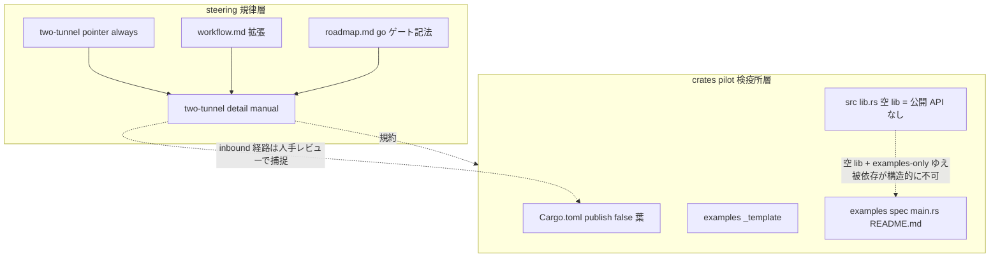
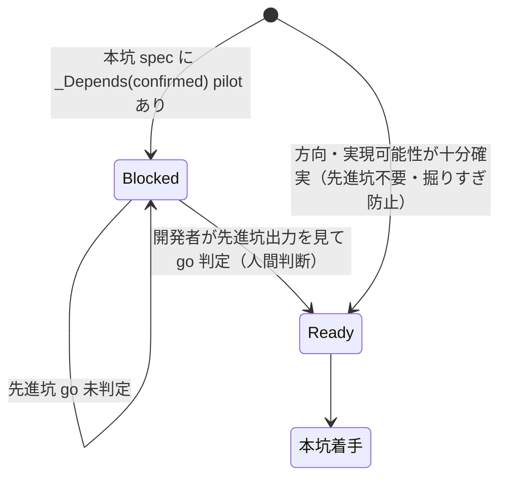

# Design Document

| 項目 | 内容 |
|------|------|
| **Feature** | kiro-P0-two-tunnel-model |
| **Type** | プロセス支援仕様（Extension：既存 kiro/steering インフラ拡張 ＋ 新規葉クレート追加） |
| **Language** | ja |
| **Date** | 2026-06-28 |
| **Discovery** | Light（既存パターン統合中心） |

---

## Overview

本仕様は、エージェント駆動開発における**誤った方向の可逆性（reversibility）**を最優先する開発規律「**二坑モデル**」を、3 種の成果物として確立する：(1) steering 文書（規律の正本）、(2) 知見クレート `crates/pilot`（先進坑コードと一次記録の検疫所・葉ノード）、(3) workflow.md への二坑統合。命綱（葉ノード隔離）は `crates/pilot` の**構造**（空 lib ＋ 探索コードは `examples/` のみ）で構造的に担保し、専用の機械ゲートや自動チェックツールは本仕様の契約に含めない（YAGNI 方針・不便が顕在化した時点で別途依頼）。

**Users**: 本リポジトリの開発者および AI エージェント。以降のすべての spec が「手応えの速さでなく誤りの可逆性」を最優先する規律の下で進む。先進坑（pilot・使い捨て検証）で方向を確定してから本坑（main・完成品）を掘る運用が、steering 規律と pilot 検疫所の構造から導かれる。

**Impact**: 現状の kiro spec ライフサイクル（requirements→design→tasks→implementation→complete）に、先進坑フェーズと go ハードゲートを上乗せする。既存のブランチ/マージ/完了規約は不変のまま、`crates/pilot` という新しい葉ノードが追加される。pilot の `src/lib.rs` は空で、探索コードはすべて `examples/` 配下に置く。Cargo の `examples/` は他クレートから依存できず、空 lib は意味のある公開 API を持たないため、先進坑コードへの被依存は**構造的に発生し得ない**。production クレート（wintf/dola/areka/shiori-abi）には一切手を加えない。

### Goals

- 二坑モデルの規律（先進坑/本坑・命綱・ハードゲート・依存マップ検証・削除/隔離規律）を steering の正本として確立する。
- `crates/pilot` を `publish=false`・葉ノード・最小依存・空 lib で新設し、先進坑コードと 3 幕 README 一次記録の検疫所とする。探索コードは `examples/` のみに置く。
- 「production が先進坑コードに依存しない（葉ノード隔離）」という命綱を、`crates/pilot` の**構造**（空 lib ＋ examples-only）で担保する。唯一の inbound 経路（他クレートの Cargo.toml への一行追加）は人手レビュー（steering 規律）で捕捉する。
- 既存ワークフローを置換せず、上乗せする形で二坑規律を組み込む。

### Non-Goals

- 命綱の機械チェック自動執行（`cargo metadata` 走査 / `cargo-deny` 等による依存方向ガード・examples 腐敗検出）。構造的隔離＋人手レビューで足りるため本仕様の契約外とし、不便が顕在化した時点で別途依頼する（R7 の手動チェックリスト判断と同じ YAGNI ロジック）。
- リモート CI（GitHub Actions 等）の新設（未リリースゆえ当面不要・後続候補）。`.github/` ディレクトリは本仕様では作成しない。
- 依存マップ検証（R7）の自動チェックツール化（手動チェックリスト規律として確立。自動化は本仕様の契約外）。
- 開発便宜のチェックランナー（`cargo fmt`/`clippy`/`test`/`build` を束ねる `check.ps1` 等）。二坑契約ではなく開発エルゴノミクスゆえ本仕様外（必要なら別途・小物、後で容易に追加可）。
- 既存ロードマップの二坑分解（M1 を pilot/main へ割り直す作業）— 本モデル確立後の後続 discovery。
- 個別の先進坑/本坑 spec の実装そのもの。
- 並列実行基盤の新規開発（既存の Agent/Workflow 機構を運用で用いる）。
- production クレート（wintf/dola/areka/shiori-abi）への機能追加。
- `completed/` 配下の完了仕様（`kiro-P0-roadmap-management` 等）の改変。

---

## Boundary Commitments

### This Spec Owns

- **二坑モデル steering 文書群**: `.kiro/steering/` 配下に二坑規律の正本を確立する（二層構成：常駐ポインタ ＋ manual 詳細）。
- **`crates/pilot` クレート**: 新規 `Cargo.toml`・workspace 統合・空 `src/lib.rs`・`examples/<spec>/` 規約・テンプレ example（雛形 `main.rs` ＋ README 雛形）。
- **3 幕 README 規約**: `examples/<spec>/README.md` を先進坑の一次記録（正本）とする構成と運用手順（subagent .md 制約の代替手順を含む）。
- **命綱の構造的担保**: 空 lib ＋ examples-only 構造により「先進坑コードが他クレートから依存され得ない」状態を構造で保証する設計。唯一の inbound 経路（Cargo.toml への一行追加）を捕捉する人手レビュー規律の steering 明文化。
- **workflow.md への二坑統合**: 先進坑フェーズ・go ハードゲート・依存マップ検証ルール・削除/隔離規律の追記（既存規約は不変）。
- **go ハードゲート記法**: 本坑 spec が先進坑の go 判定を前提依存に持つことを spec 上で表現する記法の定義。
- **依存マップ手動チェックリスト**: 被覆/孤児なし/DAG/合否基準を分解時に目視適用する steering 規律。

### Out of Boundary

- 命綱の機械チェック自動執行（依存方向ガード・examples 腐敗検出スクリプト）。構造的隔離＋人手レビューで足りるため本仕様の契約外（将来 inbound 依存の混入が現実の問題化した時点で別途依頼）。
- リモート CI（GitHub Actions ワークフロー）の新設。`.github/` ディレクトリは本仕様では作成しない。
- 依存マップ検証の自動化ツール（パーサ・lint）。
- 開発便宜のチェックランナー（`check.ps1` 等）。
- ロードマップ内容の二坑再分解（後続 discovery）。
- production クレートへの機能追加・既存 spec の実装。
- 並列実行基盤の開発。
- `completed/` 配下仕様の改変（整合のみ）。

### Allowed Dependencies

- **既存 steering 群**: `workflow.md`（拡張対象・`inclusion: always`）、`roadmap.md`（go ゲート記法の宿主・`inclusion: manual`）、`focus.md`（二層パターンの前例）。
- **既存ワークスペース構成**: ルート `Cargo.toml` の `members = ["crates/*"]`（自動メンバー取り込み）、`[patch.crates-io] pasta_core`（submodule 依存）。
- **既存クレート範例**: `crates/shiori-abi`（`publish=false` 葉ノードの先例）、`crates/wintf/examples/taffy_flex_demo/`（`examples/<dir>/main.rs` の実証済み構成）。
- **既知ハーネス制約**: subagent は `.md` を Write/Edit 不可（PowerShell here-string / 親書き込みで代替）。
- **依存制約（不変）**: `crates/pilot` は他のいかなるワークスペースクレートからも依存されてはならない（inbound edge ゼロ）。この不変条件は空 lib ＋ examples-only の**構造**で構造的に担保し、唯一の inbound 経路（Cargo.toml への依存追加）は人手レビューで捕捉する。pilot が他クレートに依存するのは許容するが、最小依存を保ち 32bit 可搬性を崩さない。

### Revalidation Triggers

以下の変更は下流（後続 spec・運用者）に再確認を要する：

- **go ゲート記法の形式変更**: `_Depends(confirmed): <pilot>` の表記・宿主（roadmap.md）が変わる場合、roadmap の依存記述と `/kiro-spec-batch` の解釈に影響。
- **`crates/pilot` の構造（空 lib ＋ examples-only）の変更**: `src/lib.rs` に意味のある公開 API を持たせる、または探索コードを `examples/` 外（lib 本体）に移すと、命綱の構造的担保が崩れる。pilot が葉ノードでなくなる方向の変更は命綱の破壊であり、人手レビューで阻止すべき重大変更。
- **steering 二層構成の変更**: 常駐ポインタ／manual 詳細の分割方針が変わる場合、AI のコンテキスト読み込み挙動（要件 1-5）に影響。
- **README 3 幕構成の変更**: 一次記録の構造が変わる場合、本坑 design が README を参照する traceability（要件 3-5）に影響。
- **命綱の機械チェック追加（将来）**: inbound 依存の混入が現実の問題化し機械ガード（`cargo metadata` 走査 / `cargo-deny` 等）を追加する場合、本仕様の構造的担保の上に重ねる別仕様として扱い、本仕様の構造前提を確認する。

---

## Architecture

> 詳細な調査ログ（submodule 未populate 再現・cargo-deny vs metadata の比較）は `research.md` を参照。本節は決定と契約を self-contained に記載する。なお、機械ガード（依存方向ガード）の実装手段比較は本仕様では defer（契約外）となったため、現在の設計には反映されない歴史的記録である。

### Existing Architecture Analysis

本仕様は新規システムではなく、既存の 2 つの確立済みパターンを統合・拡張する：

1. **steering 二層パターン**（`focus.md` always・lean → `roadmap.md` manual・詳細）。要件 1-5（詳細を別文書へ委譲しコンテキスト消費を抑える）と要件 8（workflow.md 拡張・`inclusion: always` ゆえ常駐コスト）の協調は、この既存二層パターンに倣うことで解決する。
2. **葉ノード `publish=false` クレートパターン**（`shiori-abi`）＋ **`examples/<dir>/main.rs` サブフォルダ example パターン**（`wintf/examples/taffy_flex_demo/`）。`crates/pilot` はこの 2 つの合成で範例どおり実現できる。

**尊重する既存境界**:
- `workflow.md` のブランチ＆マージ戦略・完了手順は不変（要件 8-5）。二坑規律は上乗せのみ。
- `completed/kiro-P0-roadmap-management` は不変（NFR-4）。
- ルート `Cargo.toml` の `members = ["crates/*"]` ゆえ `crates/pilot/` を置けば自動でワークスペースメンバーになる（明示登録不要）。

**回避する技術的制約（research §3 の重大リスク）**:
- git worktree では submodule（`vendors/pasta`）が未populate のため、`cargo metadata`/`cargo build` がワークスペース全体解決時に即失敗する。先進坑 example を実際にビルド/実行する際は、**前段で `git submodule update --init --recursive` を要する**（既知制約・運用手順であり、機械ゲートとしては強制しない・要件 4 補足）。

### Architecture Pattern & Boundary Map

選定パターン：**規律（steering 規律層）＋ 検疫所（pilot crate 検疫所層）の二層**。先進坑コードは pilot に集約（検疫）し、命綱（葉ノード隔離）は pilot の構造（空 lib ＋ examples-only）で構造的に担保し、規律を steering に明文化する。専用の機械ゲート層は本仕様には設けない（defer）。



**Architecture Integration**:
- **選定パターン**: 検疫所（quarantine）。探索的残骸を `crates/pilot` 一葉へ集約し production を常時クリーンに保つ（要件 5-5）。命綱は構造で担保（機械執行なし）。
- **境界分離**: steering＝規律の正本（WHAT/WHY）、pilot crate＝先進坑コード/記録の物理的置き場かつ命綱の構造的担保。2 者は明確に分離され、並行実装可能（steering 文書群・クレート骨格は独立タスク）。
- **保持する既存パターン**: steering 二層（focus→roadmap）、葉ノード publish=false（shiori-abi）、examples サブフォルダ（taffy_flex_demo）、PR ベース完了（workflow.md）。
- **新規コンポーネントの根拠**: `crates/pilot`＝先進坑の検疫所かつ命綱の構造的担保（既存に該当なし）、二坑 steering＝規律の正本（既存に該当なし）。
- **命綱の担保方式**: 機械ガードではなく**構造**。Cargo の `examples/` は他クレートから `[dependencies]` で参照できず、空 lib は意味のある公開 API を露出しないため、先進坑コードへの被依存は構造的に near-impossible。唯一の inbound 経路は誰かが他クレートの `Cargo.toml` に `pilot = { path = ... }` を一行追加することのみだが、これはレビューで可視な一行変更であり、かつ空 lib ゆえ実効果がない。これは人手レビュー（steering 規律）で捕捉する。
- **steering 準拠**: karpathy-guidelines（add-only 肥大の抑制）の思想を援用。completed/ 不変（NFR-4）。テキストベース・Git 追跡可能（NFR-5）。

### 主要設計決定（Key Decisions）

| 決定 | 選定 | 根拠（要約。詳細は research.md） |
|------|------|------|
| steering 配置（R1/R5/R8） | **二層：常駐ポインタ `two-tunnel.md`（または既存 always 文書からの短い参照節）＋ manual 詳細文書** | 既存 focus→roadmap 二層と完全整合。`inclusion: always` の常駐コスト最小化（要件 1-5）。research §4.C Option C3。 |
| 命綱の担保 = **構造的（空 lib ＋ examples-only）** | **`crates/pilot` の空 `src/lib.rs` ＋ 探索コードは `examples/` のみ**。inbound 経路（Cargo.toml への一行依存追加）は人手レビューで捕捉 | Cargo の `examples/` は他クレートから依存できず、空 lib は意味のある公開 API を露出しないため、先進坑コードへの被依存は構造的に near-impossible。唯一の inbound 経路はレビュー可視な一行変更かつ空 lib ゆえ実効果なし。専用機械ガードは不要（設計ディスカッションで defer）。 |
| 命綱の機械自動化（依存方向ガード） | **defer（本仕様の契約外）** | 構造的隔離＋人手レビューで足りる。`cargo metadata` 走査 / `cargo-deny` 等の機械チェックは、inbound 依存の混入が現実の問題になった時点で別途依頼（R7 手動チェックリストと同じ YAGNI 判断・設計ディスカッション議題1で確定）。 |
| go ゲート記法の宿主（R6-4） | **`roadmap.md` の既存自由テキスト `Dependencies:` 拡張**（`_Depends(confirmed): <pilot-spec>`） | 最小コスト・既存慣行の拡張。spec.json スキーマの二重管理を回避。research §6-5。 |
| テンプレ example 配置（R2-6） | **`crates/pilot/examples/_template/{main.rs, README.md}`**（`_` 前置・build 対象に含め人手ビルド時に腐敗を見つけやすくする） | `<spec>` 命名規約と `_` 前置で区別。`main.rs` 必須により example として認識される。research §4.D。 |

### Technology Stack

| Layer | Choice / Version | Role in Feature | Notes |
|-------|------------------|-----------------|-------|
| 規律ドキュメント | Markdown（steering） | 二坑規律の正本・workflow 統合・依存マップチェックリスト | `inclusion: always`（ポインタ）/ `manual`（詳細）。既存二層パターン踏襲 |
| 知見クレート | Rust crate（edition 2024, `publish=false`） | 先進坑コード/記録の検疫所・葉ノード・命綱の構造的担保 | `members=["crates/*"]` で自動メンバー化。最小依存（NFR-2）。空 `src/lib.rs`。`shiori-abi` 範例 |
| 一次記録 | Markdown（3 幕 README） | 先進坑の一次記録（正本）・traceability | `examples/<spec>/README.md`。subagent .md 制約は親書き込み/here-string で代替 |
| 構造的隔離 | クレート構造（空 lib ＋ examples-only）＋ 人手レビュー | 命綱（葉ノード隔離）の担保 | 機械ガード不使用（defer）。Cargo `examples/` は被依存不可・空 lib は API 露出なし |

> 機械ガード（cargo-deny vs metadata 走査）の比較・submodule 未populate の実地再現は `research.md` §3/§4.A を参照（ただし機械ガード自体は本仕様では defer）。

---

## File Structure Plan

### Directory Structure

```
.kiro/steering/
├── two-tunnel.md            # 新規・inclusion: manual。二坑規律の詳細正本（先進坑/本坑定義・命綱・
│                            #   ハードゲート・削除/隔離規律・依存マップ手動チェックリスト・README3幕規約・
│                            #   inbound 依存を捕捉する人手レビュー規律）
├── workflow.md              # 変更。二坑フェーズ・go ハードゲート・依存マップ検証・削除/隔離規律の
│                            #   追記節（既存規約は不変・機械ゲート統合はしない）
├── focus.md                 # 変更（任意・最小）。two-tunnel.md への参照タイミングを 1 行追記
└── roadmap.md               # 変更。go ゲート記法 _Depends(confirmed): の凡例を 1 節追記

crates/pilot/
├── Cargo.toml               # 新規。name="pilot", publish=false, edition.workspace=true,
│                            #   最小依存（依存ゼロ目標）。shiori-abi を範例
├── README.md                # 新規。クレート自体の説明（検疫所の役割・空 lib ＝命綱の構造的担保・
│                            #   運用規約への参照）
├── src/
│   └── lib.rs               # 新規。空 lib（クレート成立用。`//! pilot quarantine crate` のみ・
│                            #   公開 API なし＝命綱の構造的担保の核心）
└── examples/
    └── _template/           # 新規。テンプレ example（build 対象＝人手ビルド時に腐敗を見つけやすい）
        ├── main.rs          # 雛形コード（依存ゼロ・println! 程度）
        └── README.md        # 3 幕 README 雛形（動機→概要→検証結果）
```

> 本仕様にはガードスクリプト（`scripts/check-isolation.ps1` 等）も `scripts/` ディレクトリも含めない。命綱は上記 pilot の構造（空 lib ＋ examples-only）で担保し、inbound 依存は人手レビューで捕捉する。

### Modified Files

- `.kiro/steering/workflow.md` — 「先進坑フェーズ」「go ハードゲート」「依存マップ重点検証」「削除/隔離規律」の節を追記する。既存のブランチ/マージ/完了手順は変更しない。**機械的な隔離ゲートは導入しないため、`/kiro-complete` DoD ゲートへのゲート統合記述は追加しない**（命綱は構造で担保・inbound 依存は人手レビュー）。
- `.kiro/steering/roadmap.md` — go ゲート記法 `_Depends(confirmed): <pilot-spec>` の凡例節を追記（既存 `Dependencies:` 自由テキストの拡張）。
- `.kiro/steering/focus.md` — `two-tunnel.md` への参照を「参照先」節に 1 行追記（任意・最小）。
- ルート `Cargo.toml` — 変更**不要**（`members = ["crates/*"]` で `crates/pilot` は自動取り込み）。記載は「変更不要の確認」事項として明示。

---

## System Flows

### go ハードゲート判定フロー（本坑着手時）



**ゲート決定事項**:
- go 判定は**開発者が出力を見て下す人間判断**であり自動判定にしない（要件 6-3）。
- go まで本坑 spec は BLOCKED（着手不能・要件 6-2）。
- 方向が十分確実なら先進坑を経ず直接本坑に着手してよい（要件 6-5・掘りすぎ防止）。

> 命綱（葉ノード隔離）は機械ゲートのフローを持たない。pilot の構造（空 lib ＋ examples-only）で構造的に担保され、唯一の inbound 経路（他クレートの Cargo.toml への一行依存追加）は通常のコードレビュー（人手）で捕捉される。

---

## Requirements Traceability

| Requirement | Summary | Components | Interfaces / Contracts | Flows |
|-------------|---------|------------|------------------------|-------|
| 1.1–1.4 | 二坑 steering 文書化（定義・可逆性方針・判断基準・各規律への参照） | two-tunnel.md | Markdown 規律文書 | — |
| 1.5 | 詳細を別文書へ委譲しコンテキスト抑制 | two-tunnel.md（manual）＋ ポインタ | 二層構成契約 | — |
| 2.1–2.3 | `crates/pilot` 新設・publish=false・葉ノード | crates/pilot/Cargo.toml | Cargo manifest・inbound-edge ゼロ不変条件（構造的担保） | — |
| 2.4–2.5 | `examples/<spec>/{main,README}` 1 仕様1フォルダ・merge 衝突ゼロ | crates/pilot/examples/ 規約 | ディレクトリ規約 | — |
| 2.6 | テンプレ example | examples/_template/ | 雛形 main.rs ＋ README | — |
| 2.7 / NFR-2 | 最小依存・32bit 可搬性 | crates/pilot/Cargo.toml | 依存制約 | — |
| 3.1–3.4 | README 3 幕一次記録・traceability・実行法 | examples/<spec>/README.md 規約・_template/README.md | 3 幕 Markdown 契約 | — |
| 3.5 | 本坑 design が README 検証結果を参照・二重化しない | two-tunnel.md（参照規律） | traceability 規約 | — |
| 3.6 | subagent .md 制約の代替手順 | two-tunnel.md（運用節） | 親書き込み/here-string 手順 | — |
| 4.1 | 空（または最小）lib ＋ examples-only で被依存され得ない構造を保証 | crates/pilot/src/lib.rs（空 lib）・examples/ 規約 | 構造契約（examples は被依存不可） | — |
| 4.2 | production が依存して意味を持つ公開 API を lib に持たない（空 lib 目標） | crates/pilot/src/lib.rs（空 lib） | 空 lib 契約（公開 API なし） | — |
| 4.3 | 唯一の inbound 経路（Cargo.toml への pilot 依存追加一行）を変更レビューで捕捉 | two-tunnel.md（人手レビュー規律） | 人手レビュー規律 | — |
| 4.4 | 将来 inbound 依存混入が問題化したら機械チェック追加を別途依頼できる旨を明記（本仕様では実装しない） | two-tunnel.md（defer 方針記述） | YAGNI 方針記述 | — |
| 5.1–5.5 | 命綱・隔離保全・掘り直し・品質基準・検疫所効果 | two-tunnel.md（削除/隔離規律）・crates/pilot（構造的担保） | 規律文書 ＋ 構造的隔離（4.1/4.2） | — |
| 6.1–6.5 | ハードゲート go 前提依存・BLOCKED・人間判断・記法・直行許容 | two-tunnel.md ＋ roadmap.md（記法） | `_Depends(confirmed):` 記法 | go ゲートフロー |
| 7.1–7.6 | 依存マップ手動チェックリスト（被覆/孤児/DAG/合否基準） | two-tunnel.md（依存マップ節） | チェックリスト規律 | — |
| 8.1–8.6 | workflow 二坑統合（フェーズ・ゲート・検証・隔離規律・既存不変・並列運用） | workflow.md | workflow 拡張 | go ゲートフロー |
| NFR-1 | 既存ワークフロー互換・上乗せ | workflow.md ／ two-tunnel.md | 非置換契約 | — |
| NFR-2 | 最小依存・葉ノード・32bit 可搬性 | crates/pilot/Cargo.toml | 依存制約 | — |
| NFR-3 | 命綱の構造的担保（機械自動執行は本仕様で必須としない） | crates/pilot（空 lib ＋ examples-only）・two-tunnel.md（人手レビュー規律） | 構造契約 ＋ 人手レビュー規律 | — |
| NFR-4 | completed/ 不変尊重 | （全文書） | 非改変規律 | — |
| NFR-5 | テキストベース・Git 追跡可能 | （全成果物） | Markdown/manifest | — |

---

## Components and Interfaces

| Component | Domain/Layer | Intent | Req Coverage | Key Dependencies | Contracts |
|-----------|--------------|--------|--------------|------------------|-----------|
| two-tunnel.md | steering 規律 | 二坑規律の詳細正本（定義・命綱・ゲート・隔離・依存マップ・README 規約・人手レビュー規律） | 1, 3.5, 3.6, 4.3, 4.4, 5, 6, 7 | workflow.md (P1), roadmap.md (P1) | Document |
| workflow.md 拡張 | steering 規律 | 二坑フェーズ・規律統合・既存不変 | 8 | two-tunnel.md (P1) | Document |
| roadmap.md 拡張 | steering 規律 | go ゲート記法の凡例 | 6.4 | 既存 Dependencies 慣行 (P1) | Document |
| crates/pilot | Rust crate | 先進坑コード/記録の検疫所・葉ノード・命綱の構造的担保（空 lib ＋ examples-only） | 2, 3 (置き場), 4.1, 4.2, NFR-2, NFR-3 | `members=["crates/*"]` (P0) | Manifest, Dir 規約, 空 lib 構造 |
| examples/_template | テンプレ | 即着手用雛形（build 対象） | 2.6, 3.2 | crates/pilot (P0) | Code, 3幕 README |

### steering 規律層

#### two-tunnel.md（二坑規律の詳細正本）

| Field | Detail |
|-------|--------|
| Intent | 二坑モデルの全規律を集約する manual 詳細文書（正本） |
| Requirements | 1.1, 1.2, 1.3, 1.4, 1.5, 3.5, 3.6, 4.3, 4.4, 5.1, 5.2, 5.3, 5.4, 5.5, 6.1, 6.2, 6.3, 6.4, 6.5, 7.1, 7.2, 7.3, 7.4, 7.5, 7.6 |

**Responsibilities & Constraints**
- `inclusion: manual`（常駐しない）。常駐側（focus.md または workflow.md の短い節）から参照され、要件 1-5 のコンテキスト消費抑制を満たす。
- 含める規律：(a) 先進坑/本坑の定義と役割分担（1.1）、(b) 「可逆性最優先」方針の明文化（1.2）、(c) 何を先進坑にするかの判断基準（1.3）、(d) 命綱・ハードゲート・依存マップ検証・削除/隔離規律への参照（1.4）、(e) 削除/隔離規律本体（5.1–5.5）、(f) ハードゲート規律（6.1–6.5）、(g) 依存マップ手動チェックリスト（7.1–7.6）、(h) README 3 幕規約と subagent .md 代替手順（3.5, 3.6）、(i) 命綱は pilot の構造（空 lib ＋ examples-only）で担保される旨と、唯一の inbound 経路（Cargo.toml への一行依存追加）を変更レビューで捕捉する人手レビュー規律（4.3）、(j) 将来 inbound 依存の混入が問題化した際に機械チェック追加を別途依頼できる旨（4.4・本仕様では実装しない）。
- データ所有：二坑規律の唯一の正本。workflow.md は二坑規律を**重複記述せず参照**する（No Hidden Shared Ownership）。

**Contracts**: Document

**Document Contract（章立て）**
- `# 二坑モデル` → 概要・可逆性方針（1.2）
- `## 先進坑と本坑` → 定義・役割分担（1.1）・何を掘るかの判断基準（1.3・直行許容 6.5 と整合）
- `## 命綱と削除/隔離規律` → 葉ノード隔離不変条件（5.1）・隔離保全許可（5.2）・掘り直し禁止（5.3）・品質基準（5.4）・検疫所効果（5.5）・**命綱は pilot の構造（空 lib ＋ examples-only）で担保され、唯一の inbound 経路（Cargo.toml への一行依存追加）を変更レビューで捕捉する人手レビュー規律（4.3）・機械チェックは defer で将来別途依頼可（4.4）**
- `## ハードゲート` → go 前提依存（6.1）・BLOCKED（6.2）・人間判断（6.3）・記法 `_Depends(confirmed):`（6.4・宿主は roadmap.md）・直行許容（6.5）
- `## 依存マップ重点検証（手動チェックリスト）` → 被覆（7.2）/孤児なし（7.3）/DAG（7.4）/合否基準明示（7.5）/不適合時 not-ready（7.6）・適用タイミング（7.1：discovery / `/kiro-spec-batch`）
- `## 先進坑の一次記録（README 3 幕）` → 動機→概要→検証結果の構成（3.2 系規約）・本坑 design は README を参照し二重化しない（3.5）・subagent .md 制約の代替手順（3.6）

**Implementation Notes**
- Integration: 常駐ポインタ（focus.md 既存「参照先」節に 1 行追記、または workflow.md の二坑節からのリンク）。
- Validation: 要件 1.4 の「各規律へ到達できる参照」を文書内アンカー/見出しで担保。
- Risks: `inclusion: manual` ゆえ AI が読み落とす懸念 → 常駐側（workflow.md は always）の二坑節に「詳細は two-tunnel.md」を明記してカバー。

#### workflow.md 拡張

| Field | Detail |
|-------|--------|
| Intent | 既存ワークフローに二坑フェーズ・規律を上乗せ（既存規約は不変・機械ゲート統合はしない） |
| Requirements | 8.1, 8.2, 8.3, 8.4, 8.5, 8.6 |

**Responsibilities & Constraints**
- 既存の「ブランチ＆マージ戦略」「実装完了時のアクション」「仕様フェーズフロー」は**変更しない**（要件 8-5・NFR-1）。追記のみ。
- 追記内容：先進坑フェーズの位置づけと既存フローとの関係（8.1）、go ハードゲートを本坑着手の前提条件として（8.2）、依存マップ重点検証ルール（8.3）、削除/隔離規律（8.4）、先進坑の多重並列運用（既存 Agent/Workflow 機構使用・新規基盤開発なし）（8.6）。
- **機械的な隔離ゲートは導入しない**（命綱は構造で担保・inbound 依存は人手レビュー）。`/kiro-complete` DoD ゲートへのゲート統合記述は追加しない。
- 二坑規律の詳細は two-tunnel.md に委譲し、workflow.md からは要約＋参照に留める（要件 1-5 / 8 協調）。

**Contracts**: Document

**Implementation Notes**
- Integration: 追記は既存節の末尾または「仕様フェーズフロー」前後に新節として挿入。既存テキストは触らない。
- Validation: 既存規約（PR ベース・main 直 push 禁止・完了手順）が改変されていないことを diff で確認。
- Risks: `inclusion: always` ゆえ追記量がコンテキスト常駐コスト増 → 詳細は two-tunnel.md へ逃がし、workflow.md 追記は最小限の要約＋参照に抑える。

#### roadmap.md 拡張

| Field | Detail |
|-------|--------|
| Intent | go ゲート記法 `_Depends(confirmed):` の凡例追記 |
| Requirements | 6.4 |

**Responsibilities & Constraints**
- 既存の自由テキスト `Dependencies: <spec>, <spec>` 慣行を拡張し、確定前提依存（go ゲート）を `_Depends(confirmed): <pilot-spec>` で表現する凡例節を追記。
- spec.json スキーマの `dependencies` 配列とは別レイヤ（roadmap 自由テキスト）に置き、二重管理を回避（research §6-5）。

**Contracts**: Document

**Implementation Notes**
- Integration: roadmap.md の凡例/記法節に 1 節追加。`inclusion: manual` ゆえ常駐コスト影響なし。
- Risks: 既存 `Dependencies:` との混同 → `_Depends(confirmed):` は「先進坑 go 必須」を明示する別記法として凡例で区別。

### Rust クレート層

#### crates/pilot（知見クレート・検疫所・命綱の構造的担保）

| Field | Detail |
|-------|--------|
| Intent | 先進坑コードと一次記録を集約する葉ノードクレート。空 lib ＋ examples-only 構造が命綱（葉ノード隔離）の構造的担保そのものである |
| Requirements | 2.1, 2.2, 2.3, 2.4, 2.5, 2.7, 4.1, 4.2, NFR-2, NFR-3 |

**Responsibilities & Constraints**
- `crates/pilot/Cargo.toml`：`name = "pilot"`、`workspace = "../.."`、`publish = false`、`edition.workspace = true` 他 workspace 継承。依存は**ゼロ目標**（最小依存・要件 2-7/NFR-2）。`shiori-abi/Cargo.toml` を構造範例とする。
- **命綱の構造的担保（要件 4-1/4-2・NFR-3）**: `src/lib.rs` は空 lib（`//! pilot quarantine crate` のみ・**意味のある公開 API を持たない**）であり、探索コードはすべて `examples/` 配下に置く。Cargo の `examples/` は他クレートから `[dependencies]` で参照できず、空 lib は依存しても意味のある API を露出しないため、先進坑コードへの被依存（inbound edge）は**構造的に near-impossible**。
- **唯一の inbound 経路（要件 4-3）**: 誰かが他クレートの `Cargo.toml` に `pilot = { path = ... }` を一行追加すること。これはレビューで可視な一行変更であり、かつ空 lib ゆえ実効果がない。人手レビュー（steering 規律・two-tunnel.md）で捕捉する。機械ガードは用いない（defer・要件 4-4）。
- `members = ["crates/*"]` により自動でワークスペースメンバーになる（ルート Cargo.toml 変更不要・要件 2-1）。

**Dependencies**
- Inbound: なし（**これが命綱：inbound ゼロを構造で担保**。examples は被依存不可・空 lib は API 露出なし）
- Outbound: なし（依存ゼロ目標）
- External: workspace 継承のみ（version/edition 等）

**Contracts**: State（Cargo manifest）＋ 構造（空 lib ＋ examples-only）

##### Manifest Contract
```toml
[package]
name = "pilot"
workspace = "../.."
description = "Pilot (先進坑) quarantine crate: throwaway exploration code + 一次記録. publish=false, leaf node. 探索コードは examples/ のみ・lib は空（命綱の構造的担保）."
version.workspace = true
edition.workspace = true
authors.workspace = true
license.workspace = true
repository.workspace = true
publish = false

# [dependencies] は空（最小依存）。先進坑が依存を要する場合のみ最小限追加し、
# 葉ノード隔離（inbound ゼロ）と 32bit 可搬性を崩さないこと。
```
- Preconditions: `crates/pilot/` ディレクトリが存在し `members=["crates/*"]` 配下にある。
- Postconditions: `cargo metadata` で pilot がワークスペースメンバーとして解決される。`src/lib.rs` は公開 API を持たない空 lib であり、探索コードは `examples/` 配下のみに存在する。
- Invariants: inbound edge = 0（誰も pilot に依存しない・構造で担保）。`publish=false`。lib は空（公開 API なし）。

**Implementation Notes**
- Integration: ルート Cargo.toml は変更不要（自動メンバー化）。`README.md` でクレートの役割（検疫所）・空 lib が命綱の構造的担保である旨・two-tunnel.md への参照を記す。
- Validation: `cargo build --examples -p pilot` が submodule init 後に通る（research §1.3 で taffy_flex_demo により実証済み構成）。`src/lib.rs` が空 lib であることを目視確認。
- Risks: ワークスペース全体解決ゆえ submodule 未init では失敗（research §3）→ examples を人手でビルドする際は前段で必ず `git submodule update --init --recursive`。

#### crates/pilot/examples 規約 ＋ _template

| Field | Detail |
|-------|--------|
| Intent | 1 仕様=1 フォルダの先進坑配置規約と即着手用テンプレ |
| Requirements | 2.4, 2.5, 2.6, 3.1, 3.2, 3.3, 3.4 |

**Responsibilities & Constraints**
- 規約：先進坑コードは `examples/<spec-name>/` 単位（1 仕様=1 フォルダ）で格納し、各フォルダに `main.rs`（必須）と `README.md` を持つ（要件 2-4）。1 フォルダ独立ゆえ多重並列でも merge 衝突ゼロ（要件 2-5）。
- `main.rs` 必須規約：`<spec>` フォルダに `main.rs` が無いと Cargo が example として認識しない（research §1.3 注意）→ テンプレと規約で `main.rs` 必須を担保。
- 実行法：`cargo run -p pilot --example <spec>`（要件 3-4・サブフォルダ example の標準呼出）。
- テンプレ：`examples/_template/{main.rs, README.md}`。`_` 前置で実 spec と区別。build 対象に含め人手ビルド時に雛形の腐敗を見つけやすくする（research §4.D）。

**Contracts**: State（ディレクトリ規約）＋ Document（README 3 幕）

##### README 3 幕 Document Contract
```
# 先進坑: <spec-name>

## 動機（なぜ掘るか）
- 対応する本坑 spec: <main-spec-name>   ← traceability（要件 3-3）
- 確認したい方向/実現可能性/手順:

## 概要（何を作ったか）
- 実装内容:
- 実行法: cargo run -p pilot --example <spec-name>

## 検証結果
- 判定: go / 違う / 直す
- 学び:
- 日付: YYYY-MM-DD
```
- Preconditions: 各 `examples/<spec>/` に `main.rs` と `README.md` が存在する。
- Postconditions: README が当該先進坑の一次記録（正本）として機能し、本坑 design はこの検証結果を参照して二重化しない（要件 3-5）。
- Invariants: 3 幕構成（動機→概要→検証結果）・対応本坑 spec の名指し。

**Implementation Notes**
- Integration: `_template/main.rs` は依存ゼロの最小コード（`fn main() { println!("pilot template: replace me"); }` 程度）。
- Validation: `_template` も `cargo build --examples` 対象に入るため、人手ビルド時に雛形が常にビルド可能であることを確認できる。
- Risks: subagent は `.md` を Write/Edit 不可（既知ハーネス制約）→ 並列先進坑が README.md を書く運用は **PowerShell here-string（Set-Content）または親エージェントによる書き込み**で代替（要件 3-6）。この手順を two-tunnel.md に明記。

---

## Data Models

本仕様はプロセス支援仕様であり、永続データモデル・DB・イベントストアを持たない。「データ」に相当するのは Git 追跡されるテキスト成果物（steering 文書・README 一次記録・Cargo manifest）であり、その構造契約は上記 Components の各 Contract（Document Contract / Manifest Contract / 3 幕 README Contract）で定義済み。

**論理的な不変条件（命綱）**:
- ワークスペース依存グラフは DAG であり、`pilot` ノードへの inbound edge が常に 0 である。これは機械スクリプトではなく、`crates/pilot` の**構造**（空 lib ＋ 探索コードは `examples/` のみ）によって構造的に担保される。Cargo の `examples/` は他クレートから依存できず、空 lib は意味のある公開 API を露出しないため、被依存は構造的に near-impossible。唯一の inbound 経路（他クレートの Cargo.toml への一行依存追加）は人手レビューで捕捉する。
- 先進坑↔本坑の traceability は README「動機」節の本坑 spec 名指しと、roadmap.md の `_Depends(confirmed):` 記法の双方向で表現される。

---

## Error Handling

### Error Strategy
本仕様の「エラー」は主に運用手順の逸脱（規律違反）である。機械ゲートを持たないため、自動的な fail/abort は発生しない。違反は人間（レビュー・分解時の目視）が検出し是正する。

### Error Categories and Responses
- **依存方向違反（命綱破壊）の混入リスク**: 誰かが他クレートの `Cargo.toml` に `pilot` 依存を一行追加する（唯一の inbound 経路）→ これは**変更レビュー（人手）で捕捉**する（要件 4-3）。空 lib ゆえ実効果はないが、命綱の意図に反するため除去する。機械ガードによる自動 fail は本仕様では行わない（defer・要件 4-4）。
- **先進坑コード腐敗（ビルド破綻）**: `cargo build --examples -p pilot` が失敗する場合 → 当該 example を修正、または隔離保全規律に沿って整理（人手・運用）。本仕様ではこれを機械ゲートで強制しない。
- **submodule 未populate（運用前段）**: examples を人手でビルドする際、worktree で submodule（`vendors/pasta`）が未init だと cargo 全体解決が失敗（research §3）→ 前段で `git submodule update --init --recursive` を実行してから再ビルド。運用手順であり機械強制しない。
- **go ゲート未充足（運用エラー）**: 先進坑 go 未判定で本坑着手しようとする → 規律上 BLOCKED（要件 6-2）。これは人間判断のゲートであり機械強制ではない（要件 6-3）。
- **依存マップ検証不適合（運用エラー）**: 手動チェックリストのいずれか不適合 → 当該本坑 spec を ready にしない（要件 7-6）。人間が分解時に適用。

### Monitoring
本仕様は実行時サービスを持たないため監視対象なし。命綱の健全性は、コードレビュー（inbound 依存の有無）と、必要に応じた人手の `cargo build --examples -p pilot` 確認で観測される。

---

## Testing Strategy

> 本仕様はプロセス支援仕様（コード成果物は最小の pilot クレート骨格のみ）。機械ゲートを持たないため、検証は受入基準の**構造的検証**と**ドキュメント整合検証**に集中する。

### 構造的検証（命綱の構造的担保・要件 4 系 / NFR-3）
- **pilot がワークスペースメンバーかつ publish=false**: `cargo metadata` で `pilot` がワークスペースメンバーとして現れ、`publish=false` であることを確認（要件 2-1/2-2）。
- **lib が空（公開 API なし）**: `crates/pilot/src/lib.rs` が空 lib（`//!` ドキュメントコメントのみ・公開 item なし）であることを目視確認。これにより「production が依存して意味を持つ公開 API を持たない」（要件 4-2）を担保。
- **探索コードは examples のみに存在**: 探索的コードが `src/` 本体ではなく `examples/<spec>/` 配下のみに置かれていることを確認（要件 4-1）。
- **examples がビルド/実行できる**: submodule init 後に `cargo build --examples -p pilot`（`_template` 含む）が通り、`cargo run -p pilot --example <spec>` が実行できることを確認（要件 2-6/3-4）。
- **構造的に被依存不可であることの論証**: Cargo の `examples/` は他クレートから `[dependencies]` で参照できず、空 lib は意味のある公開 API を露出しないため、先進坑コードへの inbound edge は構造的に発生し得ない。唯一の inbound 経路は他クレートの `Cargo.toml` への一行依存追加のみであり、これは人手レビューで捕捉される（要件 4-3）。この論証が命綱の担保根拠であることを設計記録として確認。

### クレート構造検証（Unit 相当・要件 2/3 系）
- **テンプレ example がビルド可能**: `cargo build -p pilot --example _template` が通ることを確認（要件 2-6）。
- **1 仕様1フォルダ規約**: `examples/<spec>/main.rs` が example として認識され `cargo run -p pilot --example <spec>` で実行できることを確認（要件 2-4/3-4）。`main.rs` 欠如時は example 認識されないため `main.rs` 必須規約を担保。

### ドキュメント整合検証（受入確認・要件 1/4.3/4.4/5/6/7/8 系）
- **steering 二層の参照到達性**: 常駐側（workflow.md/focus.md）から two-tunnel.md へ参照が辿れ、two-tunnel.md に各規律（命綱・ハードゲート・依存マップ・削除/隔離・README 規約・inbound 依存の人手レビュー規律）が揃っていることを目視確認（要件 1-4/1-5）。
- **inbound 依存の人手レビュー規律の存在**: two-tunnel.md に「唯一の inbound 経路（Cargo.toml への一行依存追加）を変更レビューで捕捉する」規律（要件 4-3）と、「将来問題化したら機械チェックを別途依頼できる」defer 方針（要件 4-4）が記載されていることを確認。
- **workflow 既存不変**: workflow.md の diff が「追記のみ」で既存のブランチ/マージ/完了規約を改変していないこと、かつ機械ゲート統合を含まないことを確認（要件 8-5・NFR-1）。
- **go 記法の凡例存在**: roadmap.md に `_Depends(confirmed):` の凡例が記載されていることを確認（要件 6-4）。
- **completed/ 不変**: `completed/kiro-P0-roadmap-management` が本仕様で改変されていないことを確認（NFR-4）。

---

## Supporting References

- `research.md` — ギャップ分析（要件→アセット対応マップ）、submodule 未populate の実地再現（§3）、steering 配置 3 択（§4.C）、go ゲート記法の宿主候補（§6-5）、設計シンセシス結果（§9）。なお依存方向ガード実装 3 択の比較（§4.A）は、設計ディスカッションで機械ガードが defer（契約外）に決定したため、現在の設計には反映されない歴史的記録である（research.md §9 に descope 注記あり）。
- `brief.md` — discovery アーク・確定済み設計判断（クレート名 `pilot`・3 幕 README・命綱・ハードゲート）。
- 既存範例: `crates/shiori-abi/Cargo.toml`（publish=false 葉）、`crates/wintf/examples/taffy_flex_demo/`（examples/<dir>/main.rs）、`.kiro/steering/focus.md`+`roadmap.md`（二層）。
