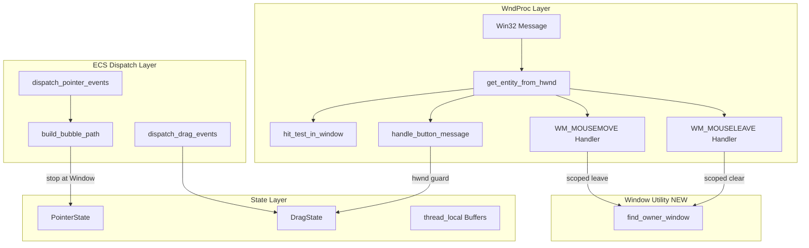
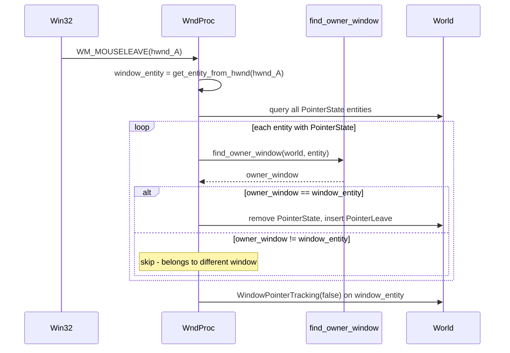
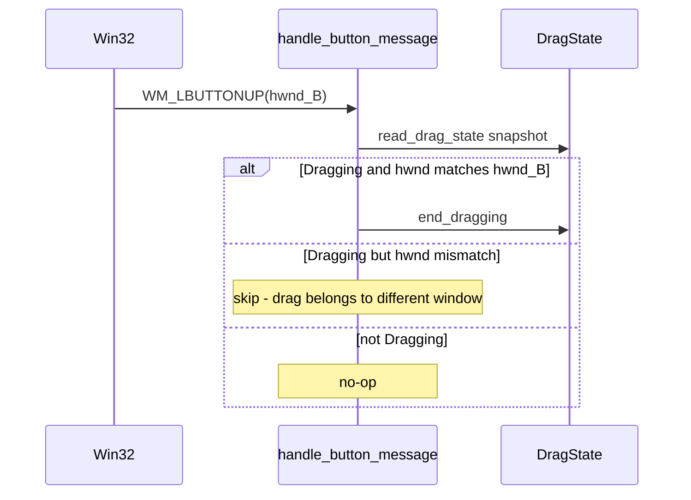

# Technical Design: multiwindow-event-validation

## Overview

**Purpose**: 既存の `taffy_flex_demo` をマルチウィンドウ版に改修し、wintf クレートのイベント処理層（PointerState, Drag, イベント伝播）がマルチウィンドウ環境で正しく動作するよう修正する。

**Users**: wintf を使ったマルチウィンドウアプリケーションの開発者。複数ウィンドウでのクリック・ドラッグ・ホバー状態が独立に動作することを期待する。

**Impact**: `ecs/window_proc/handlers.rs`, `ecs/pointer/dispatch.rs`, `ecs/window.rs` の既存コードを修正し、`ecs/drag/state.rs` の呼び出しパターンにガード条件を追加する。

### Goals
- マルチウィンドウ環境で各ウィンドウのイベント処理が独立に動作する
- WM_MOUSELEAVE / WM_MOUSEMOVE の PointerState 操作がウィンドウスコープに閉じる
- ドラッグ操作が異なるウィンドウのイベントで誤終了しない
- イベント伝播パスが Window 境界を越えない
- 自動テストで回帰検出可能にする

### Non-Goals
- OS ファイル DnD (`WM_DROPFILES` / OLE `IDropTarget`)
- ホイールイベントの hit_test 非経由問題 (G9)
- `SetCapture` / `ReleaseCapture` の実装（ウィンドウドラッグでは不要）
- PointerState 構造体へのフィールド追加

## Architecture

> 詳細な調査ログは `research.md` を参照。本ドキュメントは設計判断と契約を自己完結的に記述する。

### Existing Architecture Analysis

**現行のイベント処理パイプライン**:
```
WndProc (Win32 message) → get_entity_from_hwnd(hwnd)
  → hit_test_in_window(world, window_entity, point)  ← ✅ ウィンドウスコープ
  → PointerState / ButtonBuffer (thread_local!)       ← ❌ グローバル
  → dispatch_pointer_events (ECS frame)               ← ❌ グローバル
  → build_bubble_path → Tunnel/Bubble dispatch         ← ❌ LayoutRoot まで伝播
```

**修正後のパイプライン**:
```
WndProc (Win32 message) → get_entity_from_hwnd(hwnd)
  → hit_test_in_window(world, window_entity, point)   ← ✅ ウィンドウスコープ
  → PointerState / ButtonBuffer (thread_local!)        ← ✅ スコープ付きクリア
  → dispatch_pointer_events (ECS frame)                ← ✅ グローバル（問題なし※）
  → build_bubble_path → Tunnel/Bubble dispatch          ← ✅ Window で停止
```

※ `dispatch_pointer_events` のグローバルクエリ自体は問題ない。各エンティティの PointerState は WndProc 時点で正しいウィンドウのエンティティにのみ付与されるため、dispatch 段階でのフィルタは不要。

**維持すべき既存パターン**:
- `GWLP_USERDATA` による HWND ↔ Entity 双方向マッピング
- `thread_local!` による WndProc ↔ ECS ブリッジ
- `ChildOf` 階層による親子関係表現
- `hit_test_in_window` のウィンドウスコープ走査

### Architecture Pattern & Boundary Map



**Architecture Integration**:
- Selected pattern: 既存コンポーネント拡張（Option A）
- Domain boundaries: WndProc Layer → Utility → ECS Dispatch → State の依存方向を維持
- New components: `find_owner_window` ユーティリティ関数のみ（`ecs/window.rs` に追加）
- Steering compliance: レイヤー分離（COM → ECS → Message Handling）を遵守

### Technology Stack

| Layer | Choice / Version | Role in Feature | Notes |
|-------|------------------|-----------------|-------|
| ECS | bevy_ecs 0.18.0 | ChildOf 階層クエリ、コンポーネント操作 | 既存バージョン |
| Window API | windows 0.62.2 | HWND 操作、SetWindowPos | 既存バージョン |
| Layout | taffy 0.9.2 | デモのウィジェット配置 | 既存バージョン |

新規依存なし。

## System Flows

### WM_MOUSELEAVE スコープ付きクリアフロー



### ドラッグ HWND ガードフロー



## Requirements Traceability

| Requirement | Summary | Components | Interfaces | Flows |
|-------------|---------|------------|------------|-------|
| 1.1 | 複数 Window エンティティ生成 | DemoModification | create_flexbox_window | — |
| 1.2 | 2つ以上のウィンドウ表示 | DemoModification | run_demo | — |
| 1.3 | 全ウィジェット完全再現 | DemoModification | create_flexbox_window | — |
| 1.4 | 各ウィンドウ独立イベント動作 | DemoModification, WindowUtility | tracing log | — |
| 2.1 | MOUSELEAVE スコープ付き PointerState 削除 | MouseLeaveScoping | find_owner_window | MOUSELEAVE Flow |
| 2.2 | MOUSELEAVE スコープ付き PointerLeave 付与 | MouseLeaveScoping | find_owner_window | MOUSELEAVE Flow |
| 2.3 | 他ウィンドウホバー状態維持 | MouseLeaveScoping, MouseMoveScoping | find_owner_window | MOUSELEAVE Flow |
| 3.1 | ドラッグ状態の異ウィンドウ保護 | DragHwndGuard | read_drag_state | HWND Guard Flow |
| 3.2 | SetWindowPos のウィンドウ限定発行 | — | — | — |
| 4.1 | Tunnel/Bubble パスのウィンドウ閉包 | BubblePathScoping | build_bubble_path | — |
| 4.2 | クロスウィンドウイベント非配信 | BubblePathScoping, MouseLeaveScoping | — | — |
| 4.3 | dispatch パスの Window 境界停止 | BubblePathScoping | build_bubble_path | — |
| 5.1 | マルチウィンドウヒットテストテスト | MultiWindowTests | — | — |
| 5.2 | MOUSELEAVE スコーピングテスト | MultiWindowTests | — | — |
| 5.3 | ドラッグ整合性テスト | MultiWindowTests | — | — |

**注記**: 3.2 は既存実装で充足済み。`DragState::Dragging` の `hwnd` フィールドにより、`dispatch_drag_events` 内の `deferred_set_window_pos` は常にドラッグ対象ウィンドウの HWND に発行される。

## Components and Interfaces

| Component | Domain/Layer | Intent | Req Coverage | Key Dependencies | Contracts |
|-----------|-------------|--------|--------------|-----------------|-----------|
| WindowUtility | ECS/Window | エンティティの所属ウィンドウ特定 | 2.1-2.3, 4.1-4.3 | ChildOf, Window (P0) | Service |
| MouseLeaveScoping | WndProc/Handlers | MOUSELEAVE/MOUSEMOVE のスコーピング | 2.1-2.3 | WindowUtility (P0) | — |
| MouseMoveScoping | WndProc/Handlers | MOUSEMOVE leave 処理のスコーピング | 2.3 | WindowUtility (P0) | — |
| BubblePathScoping | ECS/Pointer | build_bubble_path の Window 境界停止 | 4.1-4.3 | Window component (P0) | Service |
| DragHwndGuard | WndProc/Handlers | ドラッグ終了の HWND 検証 | 3.1 | DragState (P0) | — |
| DemoModification | Examples | taffy_flex_demo のマルチウィンドウ化 | 1.1-1.4 | 全修正コンポーネント (P1) | — |
| MultiWindowTests | Tests | マルチウィンドウイベント統合テスト | 5.1-5.3 | WindowUtility (P0) | — |

### ECS / Window Layer

#### WindowUtility (find_owner_window)

| Field | Detail |
|-------|--------|
| Intent | エンティティから所属する Window エンティティを ChildOf 逆走査で特定する |
| Requirements | 2.1, 2.2, 2.3, 4.1, 4.2, 4.3 |

**Responsibilities & Constraints**
- ChildOf チェーンを辿り、`Window` コンポーネントを持つ最初の祖先を返す
- エンティティ自身が Window の場合は自身を返す
- ChildOf を持たないエンティティ（LayoutRoot）に到達した場合は `None`
- 純粋な読み取り操作（`&World` 参照のみ）

**Dependencies**
- Inbound: MouseLeaveScoping, MouseMoveScoping, MultiWindowTests — ウィンドウ所有権判定 (P0)
- External: bevy_ecs `ChildOf`, `Window` コンポーネント (P0)

**Contracts**: Service [x]

##### Service Interface
```rust
/// エンティティが所属する Window エンティティを返す。
/// ChildOf チェーンを辿り、Window コンポーネントを持つ最初の祖先で停止する。
/// エンティティ自身が Window の場合は Some(entity) を返す。
pub fn find_owner_window(world: &World, entity: Entity) -> Option<Entity>
```
- Preconditions: `entity` が有効な ECS エンティティであること
- Postconditions: 返値のエンティティは `Window` コンポーネントを持つ
- Invariants: ChildOf 階層に循環がないこと（bevy_ecs の保証）

**Implementation Notes**
- 配置: `ecs/window.rs` に追加（Window コンポーネントと同一モジュール）
- `drag/dispatch.rs` のアドホック実装 (L86-126) を本関数で置き換え可能（本仕様スコープ外だが将来のリファクタリング候補）
- `pub(crate)` 可視性で十分（examples からは直接呼ばない）

### ECS / Pointer Layer

#### BubblePathScoping (build_bubble_path 修正)

| Field | Detail |
|-------|--------|
| Intent | イベント伝播パスを Window エンティティで停止させる |
| Requirements | 4.1, 4.2, 4.3 |

**Responsibilities & Constraints**
- `ChildOf` を辿る際、`Window` コンポーネントを持つエンティティに到達したら停止
- Window エンティティ自身はパスに**含める**（Window レベルのイベントハンドラが動作するため）
- Window の上位（LayoutRoot）はパスに含めない

**Dependencies**
- Inbound: dispatch_pointer_events — Tunnel/Bubble イベント配信 (P0)
- External: bevy_ecs `ChildOf`, `Window` コンポーネント (P0)

**Contracts**: Service [x]

##### Service Interface
```rust
/// 修正後の build_bubble_path:
/// start から ChildOf を辿り、Window コンポーネントを持つエンティティで停止する。
/// Window エンティティ自身はパスに含まれる。
pub fn build_bubble_path(world: &World, start: Entity) -> Vec<Entity>
```
- Preconditions: `start` が有効なエンティティ
- Postconditions: パスの最後の要素は Window コンポーネントを持つか、ChildOf を持たない
- Invariants: パスの全要素は同一ウィンドウの子孫

**Implementation Notes**
- 既存関数のシグネチャ変更なし（内部ロジックのみ修正）
- Window コンポーネントの存在チェック: `world.get::<Window>(parent).is_some()`
- `start` 自身が Window の場合、パスは `[start]` のみ

### WndProc / Handlers Layer

#### MouseLeaveScoping (WM_MOUSELEAVE 修正)

| Field | Detail |
|-------|--------|
| Intent | WM_MOUSELEAVE の PointerState クリアを当該ウィンドウのエンティティに限定する |
| Requirements | 2.1, 2.2, 2.3 |

**Responsibilities & Constraints**
- `query::<(Entity, &PointerState)>` の結果を `find_owner_window` でフィルタ
- 当該ウィンドウに属するエンティティからのみ `PointerState` 除去・`PointerLeave` 付与
- `WindowPointerTracking` の操作は既に `window_entity` スコープ（変更不要）

**Dependencies**
- Outbound: WindowUtility — find_owner_window (P0)
- Inbound: Win32 WM_MOUSELEAVE message (P0)

**Implementation Notes**
- 修正箇所: `handlers.rs` の WM_MOUSELEAVE 関数内、L829-849
- 既存のクエリ→ループ構造を維持し、フィルタ条件を追加するだけ
- thread_local バッファ（POINTER_BUFFERS 等）のクリアも同じフィルタを適用

#### MouseMoveScoping (WM_MOUSEMOVE leave 処理修正)

| Field | Detail |
|-------|--------|
| Intent | WM_MOUSEMOVE 内の leave 判定を当該ウィンドウのエンティティに限定する |
| Requirements | 2.3 |

**Responsibilities & Constraints**
- `entities_to_leave` の収集時に `find_owner_window` フィルタを追加
- ヒット成功分岐 (L671-686) とヒット失敗分岐 (L732-740) の両方を修正
- target_entity との比較ロジック自体は変更なし（スコーピングフィルタの追加のみ）

**Dependencies**
- Outbound: WindowUtility — find_owner_window (P0)
- Inbound: Win32 WM_MOUSEMOVE message (P0)

**Implementation Notes**
- 2箇所の同一パターンを修正。コード重複を避けるため、ヘルパー関数の抽出を**推奨**
- 推奨ヘルパー関数シグネチャ:
```rust
fn collect_entities_to_leave(
    world: &World,
    window_entity: Entity,
    exclude: Entity,
) -> Vec<Entity>
```
- フィルタ: `find_owner_window(world, e) == Some(window_entity)` の場合のみ `entities_to_leave` に追加

#### DragHwndGuard (handle_button_message 修正)

| Field | Detail |
|-------|--------|
| Intent | ドラッグ終了処理を実行する前に、現在の HWND がドラッグ開始ウィンドウと一致することを検証する |
| Requirements | 3.1 |

**Responsibilities & Constraints**
- `handle_button_message` 内、WM_LBUTTONUP 処理部分にガード条件を追加
- `read_drag_state` で DragState スナップショットを取得し、`Dragging.hwnd` と引数 `hwnd` を比較
- 不一致の場合は `end_dragging()` / `DragAccumulatorResource::set_transition()` をスキップ

**Dependencies**
- Outbound: DragState — read_drag_state (P0)
- Inbound: Win32 WM_LBUTTONUP message (P0)

**Implementation Notes**
- 修正箇所: `handlers.rs` L1030-1060 付近（button-up 分岐内）
- DragState 構造体・API への変更なし
- 実装パターン（擬似コード）:
```rust
match state_snapshot {
    Dragging { hwnd: drag_hwnd, .. } if drag_hwnd == hwnd => {
        // end_dragging() を実行
    }
    Preparing { entity, .. } | JustStarted { entity, .. } 
        if find_owner_window(world, entity) == Some(window_entity) => {
        // end_dragging() を実行
    }
    _ => {
        // skip - 異なるウィンドウまたはドラッグ状態でない
    }
}
```

### Examples Layer

#### DemoModification (taffy_flex_demo.rs 改修)

| Field | Detail |
|-------|--------|
| Intent | 既存 taffy_flex_demo をマルチウィンドウ版に改修し、手動検証を可能にする |
| Requirements | 1.1, 1.2, 1.3, 1.4 |

**Responsibilities & Constraints**
- `create_flexbox_window` をパラメータ化（ウィンドウタイトル、初期位置）
- `run_demo` 内で 2 回呼び出し、2 つの独立したウィンドウを生成
- 各ウィンドウに既存の全ウィジェット構成を完全再現
- イベントハンドラ関数は既存をそのまま共有（sender/entity 引数で動的に動作）
- マーカーコンポーネント（`FlexDemoWindow`, `RedBox` 等）は複数エンティティに付与可能

**Dependencies**
- Inbound: 全修正コンポーネント — マルチウィンドウイベント処理の正常動作 (P1)

**Implementation Notes**
- `create_flexbox_window(world: &mut World, title: &str, position: POINT) -> Entity` にシグネチャ変更
- 2つのウィンドウを並べて配置（例: x=0 と x=850）
- 画像アセットパスは共有（同じ `seikatsu.png`）
- tracing ログに window entity ID が含まれるため、ウィンドウ別の動作確認が可能

### Tests Layer

#### MultiWindowTests

| Field | Detail |
|-------|--------|
| Intent | マルチウィンドウ環境でのイベント処理を自動テストで検証する |
| Requirements | 5.1, 5.2, 5.3 |

**Responsibilities & Constraints**
- `tests/multiwindow_event_test.rs` として新規作成
- Pure ECS テスト: 実際の Win32 ウィンドウは生成せず、World 上にウィンドウ相当の階層を構築
- `find_owner_window` のユニットテストも含む

**Dependencies**
- Outbound: WindowUtility — find_owner_window (P0)
- External: bevy_ecs テスト用 World 構築 (P0)

**Implementation Notes**

テスト構成:

1. **`test_find_owner_window`** (5.1 対応)
   - 2つの Window エンティティと子ウィジェットを手動で構築
   - 各ウィジェットの `find_owner_window` が正しい Window を返すことを検証
   - LayoutRoot に属するエンティティが `None` を返すことを検証

2. **`test_mouseleave_scoped_pointer_clear`** (5.2 対応)
   - 2つの Window 配下にそれぞれ PointerState を持つエンティティを配置
   - Window A のスコープ付きクリアを模擬実行
   - Window A のエンティティの PointerState が削除され、Window B のエンティティは維持されることを検証

3. **`test_build_bubble_path_stops_at_window`** (5.1, 4.1 対応)
   - LayoutRoot → Window → Container → Widget の階層を構築
   - `build_bubble_path(world, widget)` のパスが Window で終了することを検証

4. **`test_drag_state_hwnd_guard`** (5.3 対応)
   - DragState を Dragging(hwnd_A) に設定
   - hwnd_B からのボタンアップで `end_dragging` がスキップされることを検証

## Data Models

本 feature はデータモデルの変更を伴わない。

**既存データモデルの使用**:
- `Window` コンポーネント: 変更なし
- `PointerState` コンポーネント: フィールド追加なし（`find_owner_window` で代替）
- `DragState` enum: 変更なし（既に `hwnd` フィールドを保持）
- thread_local バッファ: 構造変更なし（Entity キーのグローバルユニーク性で動作）

## Error Handling

- `find_owner_window` が `None` を返す場合（LayoutRoot 直下のエンティティ等）: PointerState クリア対象から除外（安全側フォールバック）
- `get_entity_from_hwnd` が `None` を返す場合: 既存の early return パターンを維持

## Testing Strategy

- **ユニットテスト**: `find_owner_window`, `build_bubble_path` の Pure ECS テスト
- **統合テスト**: マルチウィンドウ環境の PointerState スコーピング、ドラッグ HWND ガード
- **手動テスト**: `cargo run --example taffy_flex_demo` で 2 ウィンドウの独立動作を視覚的に確認
- **回帰テスト**: 既存 `cargo test` が全パスすることを確認

## Performance

- `find_owner_window` の ChildOf 逆走査: ツリー深度 3-5 で O(depth)、PointerState エンティティ数 0-2 で実質定数時間
- WM_MOUSELEAVE / WM_MOUSEMOVE のフィルタ追加: 微小なオーバーヘッド（WndProc 内で発生、フレームレートへの影響なし）
- `build_bubble_path` の停止条件追加: パスが短縮されるため、むしろ微小な高速化
