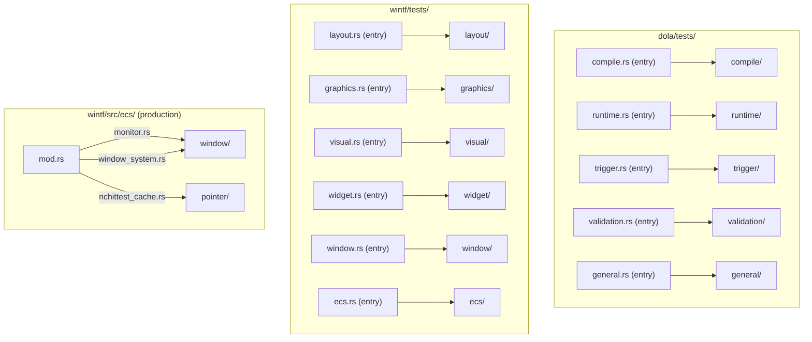
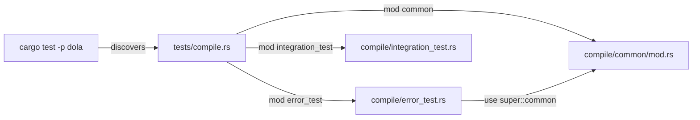

# Technical Design: namespace-refactoring

## Overview

**Purpose**: 全クレートの名前空間を整理し、62件のテストファイル（dola 21件 + wintf 41件）を機能ドメイン別サブディレクトリに分類するとともに、wintf プロダクションコードの配置を改善する。

**Users**: 開発者がテストファイルの探索・新規追加時に迷わず配置判断できるようにする。

**Impact**: テストディレクトリのフラット構造をドメイン別に階層化し、wintf `ecs/` 直下の3ファイルを適切なサブモジュールに移動する。プロダクションコードのロジック変更なし。

### Goals
- dola テスト21件を5ドメイン（compile/runtime/trigger/validation/general）に分類
- wintf テスト41件を6ドメイン（layout/graphics/visual/widget/window/ecs）に分類
- テスト命名規約を文書化し structure.md に追記
- wintf `ecs/` 直下の配置不整合ファイルを適切なサブモジュールに移動

### Non-Goals
- dola プロダクションコードのモジュール分割（検証済み、現状維持）
- `#[path]` パターンの除去（別仕様 `test-module-separation` にて対応）
- テストコードのロジック変更・テストケースの追加削除
- `ecs/mod.rs` の glob re-export（`pub use graphics::*` 等）の明示化

## Architecture

### Existing Architecture Analysis

**テスト構造（Before）**: 両クレートとも `tests/` 直下にフラットに全テストファイルが配置。Rust の Cargo 規約により各 `.rs` ファイルが独立テストバイナリとして認識される。

**プロダクション構造（Before）**: wintf `ecs/` にはドメイン別サブモジュール（`window/`, `pointer/`, `graphics/` 等）が既に存在するが、`monitor.rs`, `window_system.rs`, `nchittest_cache.rs` の3ファイルが `ecs/` 直下に不適切に配置されている。

**既存パターン**:
- `ecs/mod.rs` で `pub use` によるフラット再エクスポート（70行超）
- 共通テストヘルパー: `compile_common/`, `trigger_common/`（dola）
- 重複ヘルパー: `minimal_valid_doc()`（dola 3件）、`setup_graphics()`（wintf 5件）

### Architecture Pattern & Boundary Map



**Architecture Integration**:
- **Selected pattern**: エントリポイント方式 — `tests/domain.rs` がエントリポイントとなり `tests/domain/*.rs` を `mod` で取り込む
- **Domain boundaries**: テストはプロダクションコードのモジュール構造に対応するドメインに分類
- **Existing patterns preserved**: `compile_common/`, `trigger_common/` の共通ヘルパーパターンを踏襲し各ドメインに `common/mod.rs` を配置
- **Steering compliance**: レイヤー分離原則を維持、テスト構造はプロダクション構造を反映

### Technology Stack

| Layer | Choice / Version | Role in Feature | Notes |
|-------|------------------|-----------------|-------|
| Build | Cargo (Rust 2024 Edition) | テストバイナリの自動認識・ビルド | エントリポイント方式は Cargo 標準機能 |
| Test Framework | `#[test]` + `cargo test` | テスト実行・検証 | 変更なし |
| VCS | Git | ファイル移動追跡 | `git mv` でリネーム追跡 |

## System Flows

### テストサブディレクトリ化のエントリポイント方式



**Key Decision**: エントリポイントファイル（`compile.rs`）は `mod` 宣言のみを含む。テストロジックは一切含まない。共通ヘルパーは `mod common;` として宣言し、各テストモジュールから `use super::common::*;` でアクセスする。

## Requirements Traceability

| Requirement | Summary | Components | Interfaces | Flows |
|-------------|---------|------------|------------|-------|
| 1.1 | dola テストのドメイン別分類 | DolaTestEntryPoints, DolaTestModules | — | エントリポイント方式 |
| 1.2 | 既存共通モジュールの再配置 | DolaCommonHelpers | `mod common;` | — |
| 1.3 | `cargo test -p dola` パス保証 | — | — | CI検証 |
| 1.4 | Cargo integration test 規約準拠 | DolaTestEntryPoints | — | エントリポイント方式 |
| 2.1 | wintf テストのドメイン別分類 | WintfTestEntryPoints, WintfTestModules | — | エントリポイント方式 |
| 2.2 | `cargo test -p wintf` パス保証 | — | — | CI検証 |
| 2.3 | クロスドメインテストの配置 | WintfTestModules | — | — |
| 3.1 | 統合テスト命名規約 | NamingConvention | — | — |
| 3.2 | ユニットテスト命名規約 | NamingConvention | — | — |
| 3.3 | `#[path]` テスト命名確認 | — | — | — |
| 3.4 | 非準拠ファイルのリネーム | — | — | — |
| 3.5 | structure.md への追記 | SteeringDoc | — | — |
| 4.1 | ecs/ サブモジュール配置検証 | EcsModuleVerification | — | — |
| 4.2 | ecs/ 直下ファイルの移動 | EcsFileMove | `pub use` 更新 | — |
| 4.3 | 内部パス・外部参照の整合 | EcsFileMove | `pub use`, `crate::` パス | — |
| 4.4 | widget/ サブモジュール検証 | EcsModuleVerification | — | — |

## Components and Interfaces

| Component | Domain | Intent | Req Coverage | Key Dependencies | Contracts |
|-----------|--------|--------|--------------|-----------------|-----------|
| DolaTestEntryPoints | dola test | 5ドメインのエントリポイントファイル生成 | 1.1, 1.4 | — | — |
| DolaTestModules | dola test | 21テストファイルのサブディレクトリ移動 | 1.1, 1.3 | DolaTestEntryPoints (P0) | — |
| DolaCommonHelpers | dola test | 共通ヘルパーの再配置・統合 | 1.2 | DolaTestModules (P0) | — |
| WintfTestEntryPoints | wintf test | 6ドメインのエントリポイントファイル生成 | 2.1 | — | — |
| WintfTestModules | wintf test | 41テストファイルのサブディレクトリ移動 | 2.1, 2.2, 2.3 | WintfTestEntryPoints (P0) | — |
| WintfCommonHelpers | wintf test | `setup_graphics()` 等の共通化 | 2.1 | WintfTestModules (P0) | — |
| NamingConvention | docs | テスト命名規約の文書化 | 3.1, 3.2, 3.5 | — | — |
| NamingRename | test | 非準拠ファイル名のリネーム | 3.3, 3.4 | DolaTestModules, WintfTestModules (P1) | — |
| EcsFileMove | wintf prod | ecs/ 直下3ファイルのサブモジュール移動 | 4.2, 4.3 | — | `pub use` 更新 |
| EcsModuleVerification | wintf prod | ecs/ サブモジュール構成の検証 | 4.1, 4.4 | — | — |

### dola Test Domain

#### DolaTestEntryPoints

| Field | Detail |
|-------|--------|
| Intent | dola テスト5ドメインのエントリポイントファイルを生成する |
| Requirements | 1.1, 1.4 |

**Responsibilities & Constraints**
- `tests/` 直下に5つのエントリポイントファイル（`compile.rs`, `runtime.rs`, `trigger.rs`, `validation.rs`, `general.rs`）を生成
- 各エントリポイントは `mod` 宣言のみを含み、テストロジックは含まない
- `#[allow(unused)]` 等のアトリビュートは必要に応じて付与

**Target Structure (After)**:

```
dola/tests/
├── compile.rs                    # mod error_test; mod integration_test; ...
├── compile/
│   ├── common/mod.rs             # compile_common の内容を移動
│   ├── error_test.rs             # ← compile_error_test.rs
│   ├── integration_test.rs       # ← compile_integration_test.rs
│   ├── metadata_test.rs          # ← compile_metadata_test.rs
│   ├── serde_test.rs             # ← compile_serde_test.rs
│   ├── time_resolution_test.rs   # ← compile_time_resolution_test.rs
│   └── transition_test.rs        # ← compile_transition_test.rs
├── runtime.rs                    # mod core_types_test; mod facade_test; ...
├── runtime/
│   ├── core_types_test.rs        # ← runtime_core_types_test.rs
│   ├── facade_test.rs            # ← runtime_facade_test.rs
│   ├── conflict_resolution_test.rs # ← conflict_resolution_test.rs
│   ├── loop_integration_test.rs  # ← loop_integration_test.rs
│   └── loop_offset_test.rs       # ← loop_offset_test.rs
├── trigger.rs                    # mod compile_test; mod runtime_test; ...
├── trigger/
│   ├── common/mod.rs             # trigger_common の内容を移動
│   ├── compile_test.rs           # ← trigger_compile_test.rs
│   ├── runtime_test.rs           # ← trigger_runtime_test.rs
│   ├── serde_test.rs             # ← trigger_serde_test.rs
│   └── validation_test.rs        # ← trigger_validation_test.rs
├── validation.rs                 # mod keyframe_test; mod schema_test; ...
├── validation/
│   ├── common/mod.rs             # minimal_valid_doc() を統合（新規作成）
│   ├── keyframe_test.rs          # ← validation_keyframe_test.rs
│   ├── schema_test.rs            # ← validation_schema_test.rs
│   └── transition_test.rs        # ← validation_transition_test.rs
├── general.rs                    # mod builder_test; mod core_types_test; ...
└── general/
    ├── builder_test.rs           # ← builder_test.rs
    ├── core_types_test.rs        # ← core_types_test.rs
    └── integration_test.rs       # ← integration_test.rs
```

**Entry Point File Template**:
```rust
// tests/compile.rs — dola compile domain test entry point
mod common;
mod error_test;
mod integration_test;
mod metadata_test;
mod serde_test;
mod time_resolution_test;
mod transition_test;
```

**Implementation Notes**
- ファイル移動時にドメインプレフィックスを除去（例: `compile_error_test.rs` → `error_test.rs`）。エントリポイントのディレクトリ名が既にドメインを表すため冗長性を排除
- `mod compile_common;` 宣言は `mod common;` に更新。テストファイル内の `compile_common::` 参照は `super::common::` に更新
- `validation/common/mod.rs` は新規作成。3ファイルに重複する `minimal_valid_doc()` を統合
- `compile/integration_test.rs` 内のローカル `make_doc()` は `common::make_doc_with_storyboard` への置換を検討

#### WintfTestEntryPoints

| Field | Detail |
|-------|--------|
| Intent | wintf テスト6ドメインのエントリポイントファイルを生成する |
| Requirements | 2.1 |

**Target Structure (After)**:

```
wintf/tests/
├── assets/                       # 既存（bitmap_source_integration_test から参照）
├── layout.rs                     # entry point
├── layout/
│   ├── arrangement_bounds_test.rs
│   ├── client_area_positioning_test.rs
│   ├── component_conversion_test.rs    # ← layout_component_conversion_test.rs
│   ├── graphics_sync_test.rs           # ← layout_graphics_sync_test.rs
│   ├── taffy_advanced_test.rs
│   ├── taffy_child_order_test.rs
│   ├── taffy_flex_layout_pure_test.rs
│   ├── taffy_layout_integration_test.rs
│   ├── hierarchical_bounds_test.rs
│   ├── boxstyle_coordinate_separation_test.rs
│   ├── box_style_consolidation_test.rs
│   └── feedback_loop_convergence_test.rs
├── graphics.rs                   # entry point
├── graphics/
│   ├── core_test.rs                    # ← graphics_core_test.rs
│   ├── core_ecs_test.rs                # ← graphics_core_ecs_test.rs
│   ├── reinit_unit_test.rs             # ← graphics_reinit_unit_test.rs
│   ├── dcomp_integration_test.rs
│   ├── dcomp_resource_test.rs
│   ├── compositor_integration_test.rs
│   ├── compositor_lifecycle_test.rs
│   ├── compositor_opacity_test.rs
│   ├── compositor_transfer_test.rs
│   └── surface_optimization_test.rs
├── visual.rs                     # entry point
├── visual/
│   ├── common/mod.rs                   # setup_graphics() を統合（新規作成）
│   ├── child_order_test.rs             # ← visual_child_order_test.rs
│   ├── component_test.rs              # ← visual_component_test.rs
│   ├── graphics_auto_creation_test.rs  # ← visual_graphics_auto_creation_test.rs
│   ├── hierarchy_sync_test.rs          # ← visual_hierarchy_sync_test.rs
│   ├── parent_visual_test.rs
│   ├── insert_visual_test.rs
│   ├── remove_visual_api_test.rs
│   ├── widget_visual_auto_insert_test.rs
│   └── transform_test.rs
├── widget.rs                     # entry point
├── widget/
│   ├── bitmap_source_integration_test.rs
│   ├── vertical_text_layout_test.rs
│   └── entity_name_format_test.rs
├── window.rs                     # entry point
├── window/
│   ├── multiwindow_event_test.rs
│   ├── monitor_hierarchy_test.rs
│   ├── composition_mode_test.rs
│   └── find_owner_composition_mode_test.rs
├── ecs.rs                        # entry point
└── ecs/
    ├── component_state_pattern_test.rs
    ├── lazy_reinit_pattern_test.rs
    └── resource_removal_detection_test.rs
```

**Implementation Notes**
- ドメインプレフィックスの除去ルール: ドメインディレクトリ名と重複するプレフィックスのみ除去（例: `visual_child_order_test.rs` → `child_order_test.rs`）。ただし `taffy_` プレフィックスは layout/ 内でも維持（サブドメインとして意味がある）
- `setup_graphics()` の共通化: `visual/common/mod.rs` に統合し、5ファイルのローカル定義を削除
- `assets/` ディレクトリ: `tests/` 直下に残す。`bitmap_source_integration_test.rs` は `env!("CARGO_MANIFEST_DIR")` で絶対パスを構築しているため、ファイル移動後もパス変更不要
- `tests/ecs/` は ECS パターンテスト（mock-only）専用。wintf の機能テストではないが、ECS パターンのリファレンスとして wintf に残す（開発者確認済み）

### Naming Convention Domain

#### NamingConvention

| Field | Detail |
|-------|--------|
| Intent | テスト命名規約を定義し structure.md に追記する |
| Requirements | 3.1, 3.2, 3.5 |

**Responsibilities & Constraints**
- 統合テストファイル命名: `{対象機能}_{テスト種別}_test.rs`
- ユニットテストファイル命名（ディレクトリモジュール化後）: `tests.rs`（`test-module-separation` 仕様対応後）
- structure.md の `Naming Conventions` セクションに追記

**追記内容（structure.md）**:

```markdown
### Test Naming Conventions

#### Integration Tests (`tests/` directory)
- **File name**: `{feature}_{type}_test.rs` or `{feature}_test.rs`
- **Entry point**: `tests/{domain}.rs` — `mod` declarations only, no test logic
- **Common helpers**: `tests/{domain}/common/mod.rs`
- **Domain prefix removal**: When placed in a domain subdirectory, the domain prefix is removed from the file name
  - Example: `compile_error_test.rs` → `compile/error_test.rs`

#### Unit Tests (in-source `#[cfg(test)]`)
- **Inline**: Small tests directly in the source file `mod tests { ... }`
- **Separated**: `{module}/tests.rs` via directory-module pattern (see `bitmap_source/` as reference)
```

**Dependency on `test-module-separation`**: Req 3.2〜3.3 の `#[path]` テストに関する命名確認は、`test-module-separation` 仕様完了後にディレクトリモジュール化されたファイル名（`tests.rs`）として自動的に準拠する。本仕様では追加リネーム不要。

### wintf Production Code Domain

#### EcsFileMove

| Field | Detail |
|-------|--------|
| Intent | wintf `ecs/` 直下の3ファイルを適切なサブモジュールに移動する |
| Requirements | 4.2, 4.3 |

**Responsibilities & Constraints**
- `monitor.rs`: `ecs/` → `ecs/window/monitor.rs`
- `window_system.rs`: `ecs/` → `ecs/window/window_system.rs`
- `nchittest_cache.rs`: `ecs/` → `ecs/pointer/nchittest_cache.rs`
- 各移動に伴う `mod` 宣言と `pub use` の更新

**Dependencies**
- Outbound: `ecs/mod.rs` — モジュール宣言と再エクスポートの更新 (P0)
- Outbound: `ecs/window/mod.rs` — `monitor`, `window_system` のモジュール宣言追加 (P0)
- Outbound: `ecs/pointer/mod.rs` — `nchittest_cache` のモジュール宣言追加 (P0)
- Outbound: `world/mod.rs` — `crate::ecs::window_system::` → `crate::ecs::window::window_system::` パス更新 (P0)
- Outbound: `window_proc/mouse_move.rs` — `crate::ecs::nchittest_cache::` → `crate::ecs::pointer::nchittest_cache::` パス更新 (P0)
- Outbound: `layout/systems/monitor_systems.rs` — `crate::ecs::monitor::` → `crate::ecs::window::monitor::` パス更新 (P1)

**Contracts**: State [ ]

**Module Declaration Changes**:

```rust
// ecs/mod.rs — Before
pub mod monitor;
mod nchittest_cache;
mod window_system;
pub use monitor::*;

// ecs/mod.rs — After
// monitor, window_system は window/ に移動
// nchittest_cache は pointer/ に移動
// pub use は window::monitor 経由に変更
pub use window::monitor::*;
```

```rust
// ecs/window/mod.rs — Before
mod command;
mod components;
mod dpi;
mod window_handle;
mod window_pos;

// ecs/window/mod.rs — After
mod command;
mod components;
mod dpi;
pub mod monitor;        // ← 追加
mod window_handle;
mod window_pos;
pub(crate) mod window_system;  // ← 追加
```

```rust
// ecs/pointer/mod.rs — After
pub(crate) mod nchittest_cache;  // ← 追加
```

**Internal Path Updates**:

| File | Before | After |
|------|--------|-------|
| `world/mod.rs` | `crate::ecs::window_system::create_windows` | `crate::ecs::window::window_system::create_windows` |
| `world/mod.rs` | `crate::ecs::nchittest_cache::clear_nchittest_cache()` | `crate::ecs::pointer::nchittest_cache::clear_nchittest_cache()` |
| `window_proc/mouse_move.rs` | `crate::ecs::nchittest_cache::cached_nchittest(...)` | `crate::ecs::pointer::nchittest_cache::cached_nchittest(...)` |
| `layout/systems/monitor_systems.rs` | `crate::ecs::monitor::enumerate_monitors()` | `crate::ecs::window::monitor::enumerate_monitors()` |

**External API Impact**: `monitor::*` は `ecs/mod.rs` の `pub use window::monitor::*;` で再エクスポートされるため、`wintf::ecs::Monitor`, `wintf::ecs::enumerate_monitors` 等の外部パスは変更なし。`window_system` と `nchittest_cache` は元々 `pub` でないため外部影響なし。

**Implementation Notes**
- `graphics_tests.rs` の移動（`ecs/` 直下 → `ecs/graphics/tests.rs`）は `test-module-separation` 仕様で対応済み。本仕様の Req 4 の検証で確認のみ行う
- `app.rs` は `ecs/` 直下に残す（アプリ初期化は全体横断的な責務）

#### EcsModuleVerification

| Field | Detail |
|-------|--------|
| Intent | ecs/ サブモジュール構成がドメインモデルと整合しているか検証する |
| Requirements | 4.1, 4.4 |

**Verification Checklist**:

| サブモジュール | ファイル数 | 判定 | 備考 |
|--------------|-----------|------|------|
| `common/` | 3 | ✓ 適正 | 階層伝播システム |
| `drag/` | 6 | ✓ 適正 | ドラッグ操作 |
| `graphics/` | 14 | ✓ 適正 | GPU リソース管理 |
| `layout/` | 16 | ✓ 適正 | レイアウトエンジン統合 |
| `pointer/` | 6+1 | ✓ 適正 | nchittest_cache 追加後 |
| `transform/` | 2 | ✓ 適正 | 非推奨 |
| `widget/` | 19 | ✓ 適正 | bitmap_source/shapes/text |
| `window/` | 5+2 | ✓ 適正 | monitor, window_system 追加後 |
| `window_proc/` | 6 | ✓ 適正 | メッセージ処理 |
| `world/` | 3 | ✓ 適正 | ECS World 管理 |
| `app.rs` | 1 | ✓ 妥当 | アプリ初期化（ecs/ 直下） |

**widget/ サブモジュール検証** (4.4):
- `bitmap_source/` — ビットマプ画像ウィジェット ✓
- `shapes/` — 矩形等のシェイプウィジェット ✓
- `text/` — テキストレンダリング ✓
- `brushes.rs` — ブラシ定義（widget/ 直下、単一ファイルのためサブモジュール化不要）✓

## Testing Strategy

### テスト移動の検証

各ドメインのテスト移動後に以下を実行:

- **dola**: `cargo test -p dola` — 全21テストファイルがパスすること
- **wintf**: `cargo test -p wintf` — 全41テストファイルがパスすること
- **areka**: `cargo build -p areka` — プロダクションコード移動後のコンパイル確認

### 回帰テスト

- `cargo test --workspace` — ワークスペース全体のテストパス
- `cargo build --examples` — examples のコンパイル確認

### 段階的検証

各フェーズ完了時に検証:
1. dola テスト移動完了 → `cargo test -p dola`
2. wintf テスト移動完了 → `cargo test -p wintf`
3. 命名規約文書化 → レビュー
4. wintf ecs/ ファイル移動完了 → `cargo test --workspace` + `cargo build --examples`

## Dependencies Between Specs

本仕様は `test-module-separation` 仕様と以下の関係を持つ:

| 項目 | namespace-refactoring | test-module-separation |
|------|----------------------|----------------------|
| スコープ | テストディレクトリ構造 + 命名規約 + プロダクション構造 | `#[path]` パターン除去 |
| 対象 | 統合テスト62件 + プロダクション3ファイル | ユニットテスト9件 |
| 重複 | Req 3.3（`#[path]` テスト命名） | 全要件 |
| 推奨実装順序 | 2番目 | 1番目 |

**理由**: `test-module-separation` が先に `#[path]` を除去することで、`graphics_tests.rs` の親ディレクトリ参照問題が解消され、本仕様の Req 4 検証が簡潔になる。ただし、テスト移動（Req 1, 2）は `test-module-separation` と独立して実行可能。
