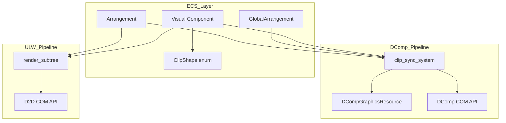
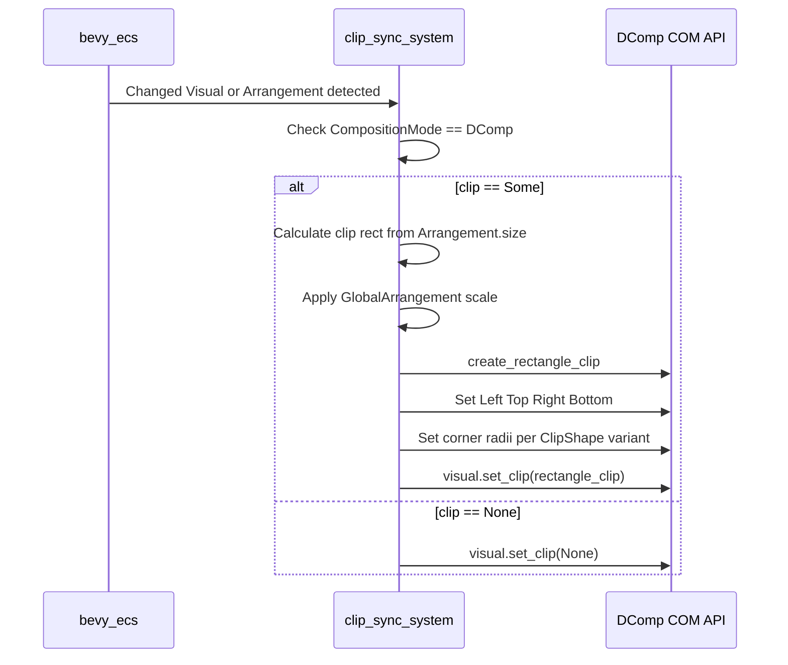
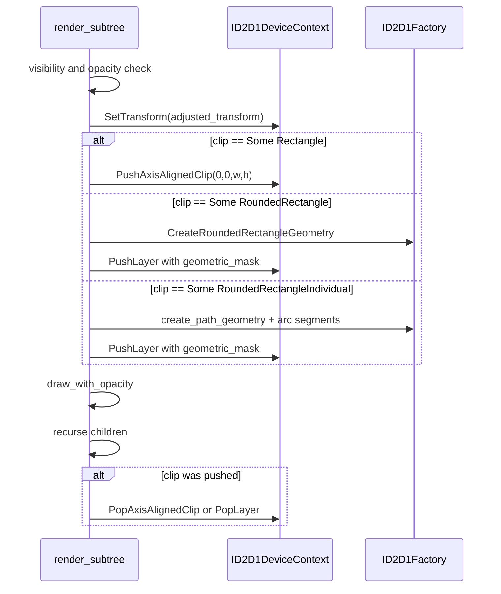
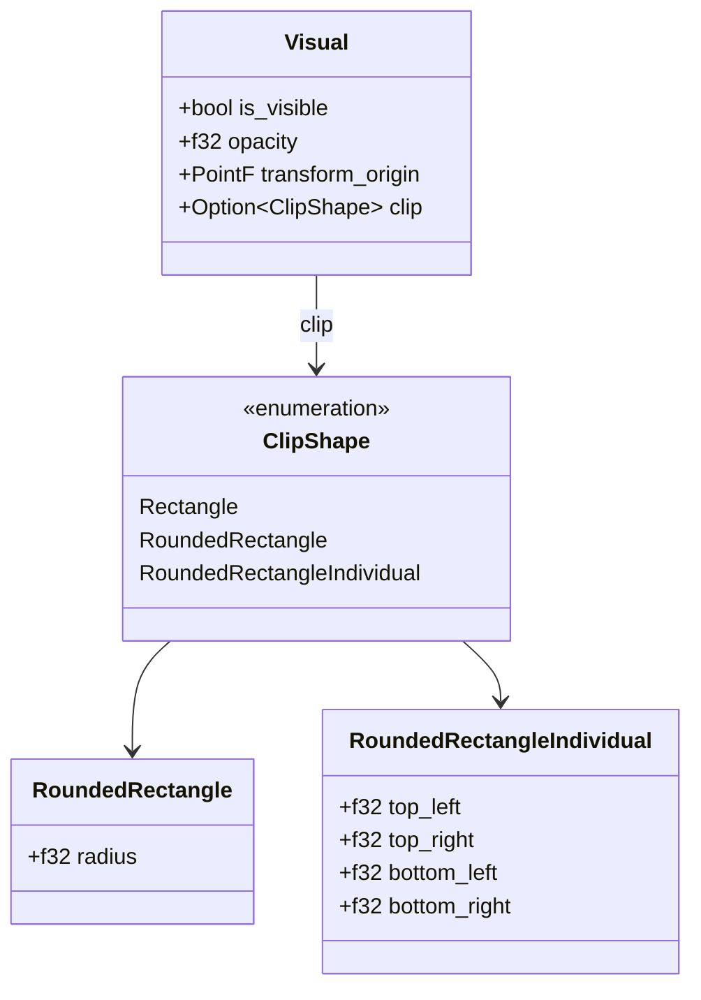

# Design Document: visual-clip

## Overview

**Purpose**: wintf の論理 Visual コンポーネントに矩形クリッピング機能を追加し、DComp / ULW 両モードで一貫したサブツリークリッピングを提供する。開発者は `Visual.clip` プロパティを設定するだけで、CompositionMode を意識せずクリップが適用される。

**Users**: wintf を利用するデスクトップマスコットアプリ開発者。クリップは UI 要素のはみ出し制御（overflow hidden 相当）や角丸ウィジェットの実現に使用される。

**Impact**: 既存の `Visual` コンポーネントに `clip` フィールドを追加し、DComp パイプライン（新規 `clip_sync_system`）と ULW パイプライン（既存 `render_subtree` 拡張）の両方にクリップ処理を組み込む。

### Goals
- 型安全なクリップ形状指定（Rectangle / RoundedRectangle / RoundedRectangleIndividual）
- DComp と ULW の両描画モードで同等のクリッピング挙動
- Arrangement サイズに基づく自動座標計算（手動座標指定不要）
- 既存 Visual パターン（opacity / is_visible）との一貫した API
- 視覚検証デモによる効果確認

### Non-Goals
- SurfaceMask（任意形状・グラデーションマスク）
- dola 統合によるクリップアニメーション
- 楕円形の角（RadiusX ≠ RadiusY）
- 複数クリップの論理演算（交差・合成）

## Architecture

### Existing Architecture Analysis

wintf の描画パイプラインは CompositionMode により分岐する:

- **DComp モード**: `visual_property_sync_system` が `Visual` の変更を検知し、`IDCompositionVisual3` の COM メソッド（SetOffset, SetOpacity 等）を呼び出す。DComp は Visual ツリー全体を GPU 管理する。
- **ULW モード**（デフォルト）: `composite_render_system` → `render_subtree` が D2D DeviceContext を使って CPU 側で合成描画を実行する。SetTransform → DrawImage → 子再帰の流れ。

**既存パターンと制約**:
- `Visual` struct のフィールド変更は `Changed<Visual>` で自動検知される（bevy_ecs）
- DComp API ラッパーは `com/dcomp.rs` の Ext トレイトパターンで統一
- D2D は `PushAxisAlignedClip` / `PushLayer` / `PopAxisAlignedClip` / `PopLayer` のコマンド型が `command_types.rs` に定義済み
- `D2D1FactoryExt::create_path_geometry` が存在（`RoundedRectangleIndividual` で使用可能）

### Architecture Pattern & Boundary Map



**Architecture Integration**:
- 選択パターン: Option B（新規モジュール + 新規システム）。型定義と DComp 同期を分離し、ULW は既存 render_subtree を拡張
- ドメイン境界: `clip.rs`（型定義）、`clip_sync.rs`（DComp 同期）、`render.rs`（ULW 描画）の3箇所に責務分離
- 既存パターン維持: モジュール分離 + `pub use`、Ext トレイトパターン、`Changed<T>` + `Or` フィルター
- 新規コンポーネント理由: `ClipShape` は将来 SurfaceMask バリアント追加が前提のため独立モジュール。`clip_sync_system` は `DCompGraphicsResource` への依存が `visual_property_sync_system` と異なるため分離
- Steering 準拠: unsafe 隔離（COM ラッパー層）、型安全性（enum バリアントで不正状態防止）、構造化ログ

### Technology Stack

| Layer     | Choice / Version | Role in Feature                                              | Notes        |
| --------- | ---------------- | ------------------------------------------------------------ | ------------ |
| ECS       | bevy_ecs 0.18.0  | `Visual` コンポーネント拡張、`Changed<T>` 検知               | 既存         |
| DComp COM | windows 0.62.0   | `IDCompositionRectangleClip` 作成・適用                      | ラッパー追加 |
| D2D COM   | windows 0.62.0   | `PushAxisAlignedClip`, `PushLayer`, RoundedRectangleGeometry | ラッパー追加 |

## System Flows

### DComp モード — クリップ同期フロー



**Key Decisions**: ゼロサイズ Arrangement の場合はクリップ適用をスキップし、DComp の不正な空クリップを回避する。

### ULW モード — render_subtree クリップフロー



**Key Decisions**: Push/Pop のペア保証は bool フラグで管理。Push 失敗時はクリップなしで描画を継続する。

## Requirements Traceability

| Requirement | Summary                                | Components                       | Interfaces                                                   | Flows                  |
| ----------- | -------------------------------------- | -------------------------------- | ------------------------------------------------------------ | ---------------------- |
| 1.1-1.4     | ClipShape 型定義                       | ClipShape                        | —                                                            | —                      |
| 2.1-2.4     | Visual に clip フィールド追加          | Visual, ClipShape                | —                                                            | —                      |
| 3.1-3.3     | Arrangement サイズからクリップ矩形算出 | clip_sync_system, render_subtree | —                                                            | DComp Sync, ULW Render |
| 4.1-4.6     | DComp クリップ同期                     | clip_sync_system                 | DCompAPI                                                     | DComp Sync             |
| 5.1-5.4     | DPI スケーリング対応                   | clip_sync_system, render_subtree | —                                                            | DComp Sync             |
| 6.1-6.3     | COM API ラッパー追加                   | DCompAPI, D2DAPI                 | DCompositionDeviceExt, DCompositionVisualExt, D2D1FactoryExt | —                      |
| 7.1-7.3     | スケジュール統合                       | Composition Schedule             | —                                                            | —                      |
| 8.1-8.3     | 将来の拡張性                           | ClipShape                        | —                                                            | —                      |
| 9.1-9.8     | ULW D2D クリップ描画                   | render_subtree                   | D2DAPI                                                       | ULW Render             |
| 10.1-10.6   | クリッピング検証デモ                   | clip_demo                        | —                                                            | —                      |

## Components and Interfaces

| Component                    | Domain/Layer     | Intent                        | Req Coverage                       | Key Dependencies                        | Contracts |
| ---------------------------- | ---------------- | ----------------------------- | ---------------------------------- | --------------------------------------- | --------- |
| ClipShape                    | ECS / Type       | クリップ形状の型安全な表現    | 1.1-1.4, 8.1-8.3                   | —                                       | State     |
| Visual (拡張)                | ECS / Component  | clip プロパティの保持         | 2.1-2.4                            | ClipShape (P0)                          | State     |
| DCompositionDeviceExt (拡張) | COM / DComp      | RectangleClip 作成            | 6.1                                | IDCompositionDevice3 (P0)               | Service   |
| DCompositionVisualExt (拡張) | COM / DComp      | SetClip 呼び出し              | 6.2-6.3                            | IDCompositionVisual3 (P0)               | Service   |
| D2D1FactoryExt (拡張)        | COM / D2D        | RoundedRectangleGeometry 作成 | 9.8                                | ID2D1Factory (P0)                       | Service   |
| clip_sync_system             | ECS / System     | DComp モードのクリップ同期    | 3.1-3.3, 4.1-4.6, 5.1-5.3, 7.1-7.2 | DCompGraphicsResource (P0), Visual (P0) | —         |
| render_subtree (拡張)        | ECS / Compositor | ULW モードのクリップ描画      | 3.1-3.3, 5.4, 7.3, 9.1-9.7         | ID2D1DeviceContext (P0), Visual (P0)    | —         |
| clip_demo                    | Example          | 視覚検証デモ                  | 10.1-10.6                          | wintf API (P0)                          | —         |

### ECS / Type Layer

#### ClipShape

| Field        | Detail                                          |
| ------------ | ----------------------------------------------- |
| Intent       | 矩形クリップ形状を3バリアントで型安全に表現する |
| Requirements | 1.1, 1.2, 1.3, 1.4, 8.1, 8.2, 8.3               |

**Responsibilities & Constraints**
- クリップ形状のデータ保持のみ（ロジックなし）
- 負の radius 値は 0.0 にクランプ（コンストラクタで実施）
- `#[non_exhaustive]` 非付与（クレート内部型、パターンマッチ網羅性チェックを維持）

**Dependencies**
- 外部依存なし

**Contracts**: State [x]

##### State Management

```rust
/// クリップ形状を表現する enum
#[derive(Debug, Clone, PartialEq)]
pub enum ClipShape {
    /// 角張った矩形クリップ
    Rectangle,
    /// 全角統一の角丸矩形クリップ
    RoundedRectangle { radius: f32 },
    /// 各角個別設定の角丸矩形クリップ
    RoundedRectangleIndividual {
        top_left: f32,
        top_right: f32,
        bottom_left: f32,
        bottom_right: f32,
    },
}
```

- `RoundedRectangle::new(radius)` と `RoundedRectangleIndividual::new(tl, tr, bl, br)` コンストラクタで負値を 0.0 にクランプ
- クランプ時は `warn!` ログを出力（`Visual::set_opacity` パターンに準拠）

**Implementation Notes**
- 配置: `ecs/graphics/clip.rs`（新規ファイル）
- `mod.rs` に `mod clip; pub use clip::*;` を追加

---

#### Visual (拡張)

| Field        | Detail                                             |
| ------------ | -------------------------------------------------- |
| Intent       | 既存 Visual にオプショナルな clip フィールドを追加 |
| Requirements | 2.1, 2.2, 2.3, 2.4                                 |

**Responsibilities & Constraints**
- `clip: Option<ClipShape>` フィールドの保持
- `Default` で `clip: None`
- `Changed<Visual>` で bevy_ecs に自動検知される

**Dependencies**
- Inbound: ClipShape — 型参照 (P0)

**Contracts**: State [x]

##### State Management

```rust
pub struct Visual {
    pub is_visible: bool,
    pub opacity: f32,
    pub transform_origin: PointF,
    pub clip: Option<ClipShape>,  // 追加
}
```

- `Visual::default()`: `clip: None`
- `set_clip(&mut self, clip: Option<ClipShape>)` セッターを提供（パターン統一）

**Implementation Notes**
- `on_visual_add` フック: 変更不要（clip は遅延設定の Optional フィールド）

---

### COM / DComp Layer

#### DCompositionDeviceExt (拡張)

| Field        | Detail                                          |
| ------------ | ----------------------------------------------- |
| Intent       | `IDCompositionRectangleClip` 作成ラッパーの提供 |
| Requirements | 6.1                                             |

**Dependencies**
- External: IDCompositionDevice3 — COM API (P0)

**Contracts**: Service [x]

##### Service Interface

```rust
pub trait DCompositionDeviceExt {
    // ... 既存メソッド ...

    /// CreateRectangleClip
    fn create_rectangle_clip(&self) -> Result<IDCompositionRectangleClip>;
}
```

- Preconditions: DComp デバイスが有効
- Postconditions: `IDCompositionRectangleClip` インスタンスが返される（初期値はすべて 0.0）
- Invariants: unsafe ラップにより安全な呼び出しを保証

**Implementation Notes**
- 配置: `com/dcomp.rs` の既存 `impl DCompositionDeviceExt for IDCompositionDevice3` ブロック内
- パターン: `#[inline(always)]` + `unsafe { self.CreateRectangleClip() }`

---

#### DCompositionVisualExt (拡張)

| Field        | Detail                                         |
| ------------ | ---------------------------------------------- |
| Intent       | `SetClip` ラッパーの提供（クリップ適用・解除） |
| Requirements | 6.2, 6.3                                       |

**Dependencies**
- External: IDCompositionVisual3 — COM API (P0)

**Contracts**: Service [x]

##### Service Interface

```rust
pub trait DCompositionVisualExt {
    // ... 既存メソッド ...

    /// SetClip — クリップ適用。None で解除。
    fn set_clip<P0>(&self, clip: P0) -> Result<()>
    where
        P0: Param<IDCompositionClip>;
}
```

- Preconditions: Visual オブジェクトが有効
- Postconditions: クリップが適用される、または `None` 渡しでクリップが解除される
- Invariants: `Param<IDCompositionClip>` により `None` は null ポインタとして安全に渡される

**Implementation Notes**
- `set_content<P0: Param<IUnknown>>` と同一パターン

---

#### D2D1FactoryExt (拡張)

| Field        | Detail                                             |
| ------------ | -------------------------------------------------- |
| Intent       | `ID2D1RoundedRectangleGeometry` 作成ラッパーの提供 |
| Requirements | 9.8                                                |

**Dependencies**
- External: ID2D1Factory — COM API (P0)

**Contracts**: Service [x]

##### Service Interface

```rust
pub trait D2D1FactoryExt {
    // ... 既存メソッド（create_path_geometry）...

    /// CreateRoundedRectangleGeometry
    fn create_rounded_rectangle_geometry(
        &self,
        rounded_rect: &D2D1_ROUNDED_RECT,
    ) -> Result<ID2D1RoundedRectangleGeometry>;
}
```

- Preconditions: Factory が有効
- Postconditions: 指定パラメーターの角丸矩形ジオメトリが返される

**Implementation Notes**
- 配置: `com/d2d/mod.rs` の既存 `impl D2D1FactoryExt` ブロック内

---

### ECS / System Layer

#### clip_sync_system

| Field        | Detail                                                               |
| ------------ | -------------------------------------------------------------------- |
| Intent       | DComp モードにおける Visual.clip の DirectComposition 同期           |
| Requirements | 3.1, 3.2, 3.3, 4.1, 4.2, 4.3, 4.4, 4.5, 4.6, 5.1, 5.2, 5.3, 7.1, 7.2 |

**Responsibilities & Constraints**
- `Changed<Visual>`, `Changed<Arrangement>`, `Changed<GlobalArrangement>` を検知
- DComp モードのエンティティのみ処理（ULW はスキップ）
- `IDCompositionRectangleClip` を毎回作成（キャッシュなし、Phase 1）
- Arrangement サイズが (0, 0) の場合はクリップ適用をスキップ
- エラー時は `error!` ログ出力、処理継続

**Dependencies**
- Inbound: Visual, Arrangement, GlobalArrangement, VisualGraphics — ECS コンポーネント (P0)
- Inbound: DCompGraphicsResource — ECS リソース (P0)
- Outbound: DCompositionDeviceExt::create_rectangle_clip — COM API (P0)
- Outbound: DCompositionVisualExt::set_clip — COM API (P0)

**Contracts**: Service [x]

##### Service Interface

```rust
/// DComp モードのクリップ同期システム
pub fn clip_sync_system(
    dcomp_resource: Res<DCompGraphicsResource>,
    query: Query<
        (&Arrangement, &GlobalArrangement, &Visual, &VisualGraphics),
        Or<(Changed<Arrangement>, Changed<GlobalArrangement>, Changed<Visual>)>,
    >,
) { ... }
```

**処理フロー**:
1. `dcomp_resource.dcomp()` で `IDCompositionDevice3` を取得（None なら早期 return）
2. 各検知エンティティに対して:
   a. `VisualGraphics` から `IDCompositionVisual3` を取得
   b. `visual.clip` が `Some` かつ `arrangement.size > (0, 0)` の場合:
      - `create_rectangle_clip()` で `IDCompositionRectangleClip` を作成
      - `GlobalArrangement` のスケールを適用して物理座標に変換
      - ClipShape バリアントに応じて corner radius を設定
      - `set_clip(rectangle_clip)` で適用
   c. `visual.clip` が `None` または `size == (0, 0)` の場合:
      - `set_clip(None::<IDCompositionClip>)` でクリップ解除

**DPI スケーリング計算**:
- `physical_right = arrangement.size.width * ga.scale_x`
- `physical_bottom = arrangement.size.height * ga.scale_y`
- `physical_radius = radius * ga.scale_x`（スケールは uniform 前提）

**Implementation Notes**
- 配置: `ecs/graphics/systems/clip_sync.rs`（新規ファイル）
- `systems/mod.rs` に `mod clip_sync; pub use clip_sync::*;` を追加
- DComp モード判定: `VisualGraphics.visual()` が `Some` であることで暗黙的に DComp モードと判定（ULW モードの場合 `VisualGraphics` は `IDCompositionVisual3` を保持しない）

---

#### render_subtree (拡張)

| Field        | Detail                                                            |
| ------------ | ----------------------------------------------------------------- |
| Intent       | ULW モードのクリップ描画（Push/Pop による矩形・角丸クリッピング） |
| Requirements | 3.1, 3.2, 3.3, 5.4, 7.3, 9.1, 9.2, 9.3, 9.4, 9.5, 9.6, 9.7        |

**Responsibilities & Constraints**
- 既存の描画フロー（visibility → opacity → SetTransform → draw → children）にクリップ処理を挿入
- Push/Pop ペアを確実に実行（bool フラグ管理）
- クリップはローカル座標系 (0, 0)-(w, h) で定義（SetTransform 後に Push するため、transform により物理座標に自動変換）
- ULW モードでは DPI スケーリングを別途適用しない（SetTransform に含まれる）
- Push 失敗時はクリップなしで描画を継続

**Dependencies**
- Inbound: Arrangement, Visual, GlobalArrangement — ECS コンポーネント (P0)
- Outbound: ID2D1DeviceContext::PushAxisAlignedClip / PushLayer — D2D API (P0)
- Outbound: ID2D1Factory::CreateRoundedRectangleGeometry — D2D API (P1)
- Outbound: D2D1FactoryExt::create_path_geometry — D2D API (P1)

**Contracts**: Service [x]

##### Service Interface

```rust
fn render_subtree(
    ctx: &CompositeContext,
    entity: Entity,
    query: &Query<(
        &Arrangement,              // 追加: サイズ取得用
        &GlobalArrangement,
        Option<&GraphicsCommandList>,
        &Visual,
        Option<&Children>,
    )>,
)
```

拡張後の `render_subtree` フロー:

```
fn render_subtree(ctx, entity, query):
    1. get entity data → visibility check → opacity calculation
    2. SetTransform(adjusted_transform)
    3. let clipped = false
    4. if visual.clip is Some and arrangement.size > (0, 0):
         let (w, h) = (arrangement.size.width, arrangement.size.height)
         match clip:
           Rectangle → PushAxisAlignedClip(0, 0, w, h)
           RoundedRectangle → PushLayer(RoundedRectangleGeometry)
           RoundedRectangleIndividual → PushLayer(PathGeometry)
         if push succeeded: clipped = true
    5. draw_with_opacity(...)
    6. recurse children
    7. if clipped:
         PopAxisAlignedClip or PopLayer (match clip variant)
```

**Geometry 作成方法**:
- `RoundedRectangle`: `dc.GetFactory()` → `factory.CreateRoundedRectangleGeometry(&D2D1_ROUNDED_RECT { rect: (0,0,w,h), radiusX: radius, radiusY: radius })`
- `RoundedRectangleIndividual`: `factory.create_path_geometry()` → `geo.Open()` で `ID2D1GeometrySink` を取得 → 各角に `AddArc` で個別半径の円弧を描画 → `Close()`

**Push/Pop ペア保証: RAII ガード方式**

Push/Pop のペア実行保証には RAII ガードを使用する（既存の `DcTargetGuard` と同じパターン）:

```rust
/// D2D クリップの RAII ガード。Drop 時に自動で Pop を実行。
struct ClipGuard<'a> {
    dc: &'a ID2D1DeviceContext,
    clip_type: ClipType,
}

enum ClipType {
    AxisAligned,  // PopAxisAlignedClip
    Layer,        // PopLayer
}

impl<'a> ClipGuard<'a> {
    /// クリップを Push し、RAII ガードを返す。
    unsafe fn push(
        dc: &'a ID2D1DeviceContext,
        clip_shape: &ClipShape,
        size: Size,
    ) -> Result<Self> {
        // Push 処理（省略）
        Ok(Self { dc, clip_type })
    }
}

impl Drop for ClipGuard<'_> {
    fn drop(&mut self) {
        unsafe {
            match self.clip_type {
                ClipType::AxisAligned => self.dc.PopAxisAlignedClip(),
                ClipType::Layer => self.dc.PopLayer(),
            }
        }
    }
}
```

使用方法:
```rust
fn render_subtree(...) {
    // ...
    let _clip_guard = if let Some(clip_shape) = &visual.clip {
        if arrangement.size.width > 0.0 && arrangement.size.height > 0.0 {
            unsafe { ClipGuard::push(ctx.dc, clip_shape, arrangement.size).ok() }
        } else {
            None
        }
    } else {
        None
    };
    
    // draw と children（エラーでも _clip_guard の Drop が自動実行）
    draw_with_opacity(...);
    recurse_children(...);
    // スコープ終了で _clip_guard が Drop → Pop が確実に実行される
}
```

**Implementation Notes**
- クエリに `&Arrangement` を追加（上記 Service Interface 参照）
- サイズは `arrangement.size` から取得（DComp の clip_sync_system と同じソース）
- ClipGuard は `render.rs` 内の private struct として定義（既存の `DcTargetGuard` と並列）
- Push 失敗時は `Ok(None)` を返し、クリップなしで描画を継続（Graceful Degradation）

---

### Example Layer

#### clip_demo

| Field        | Detail                                                   |
| ------------ | -------------------------------------------------------- |
| Intent       | DComp / ULW 両モードのクリッピング効果を視覚検証するデモ |
| Requirements | 10.1, 10.2, 10.3, 10.4, 10.5, 10.6                       |

**Responsibilities & Constraints**
- ULW ウィンドウと DComp ウィンドウの2つを同時表示
- 同一レイアウト構造を両ウィンドウに適用
- 全3バリアント（Rectangle, RoundedRectangle, RoundedRectangleIndividual）を表示
- ウィンドウサイズ変更時にクリップ領域が追従
- `cargo run --example clip_demo` で実行可能

**Dependencies**
- Inbound: wintf API — Visual, ClipShape, multi-window setup (P0)

**Implementation Notes**
- `multi_backend_demo.rs` のデュアルウィンドウパターンをテンプレートとして使用
- レイアウト: flex grow で可変サイズ、親要素にクリップを設定し子要素がはみ出す構成
- 3つの領域（Rectangle / RoundedRectangle / RoundedRectangleIndividual）をそれぞれ配置

## Data Models

### Domain Model



**ビジネスルール**:
- `Visual.clip = None` はクリップなし（デフォルト）
- radius 値は常に `>= 0.0`（負値はコンストラクタでクランプ）
- クリップ矩形は `Arrangement.size` に紐づく（ユーザーは座標を指定しない）

### Logical Data Model

**ClipShape → DComp 変換マッピング**:

| ClipShape variant                             | IDCompositionRectangleClip 設定                                                |
| --------------------------------------------- | ------------------------------------------------------------------------------ |
| Rectangle                                     | Left=0, Top=0, Right=w*sx, Bottom=h*sy, 全 Radius=0                            |
| RoundedRectangle { radius }                   | Left=0, Top=0, Right=w*sx, Bottom=h*sy, 全 Radius=radius*sx                    |
| RoundedRectangleIndividual { tl, tr, bl, br } | Left=0, Top=0, Right=w*sx, Bottom=h*sy, TL=tl*sx, TR=tr*sx, BL=bl*sx, BR=br*sx |

※ w=width, h=height, sx/sy=GlobalArrangement scale

**ClipShape → D2D 変換マッピング**:

| ClipShape variant                             | D2D 操作                                                              |
| --------------------------------------------- | --------------------------------------------------------------------- |
| Rectangle                                     | PushAxisAlignedClip(0, 0, w, h)                                       |
| RoundedRectangle { radius }                   | PushLayer + ID2D1RoundedRectangleGeometry(0, 0, w, h, radius, radius) |
| RoundedRectangleIndividual { tl, tr, bl, br } | PushLayer + ID2D1PathGeometry(custom arcs per corner)                 |

※ ULW は論理ピクセル座標（DPI スケーリング不要）

## Error Handling

### Error Strategy

クリップ処理のエラーは既存 wintf パターンに準拠: `error!` ログ出力 + 処理継続（Graceful Degradation）。

### Error Categories and Responses

| Error                                 | Mode  | Response                            | Recovery           |
| ------------------------------------- | ----- | ----------------------------------- | ------------------ |
| `CreateRectangleClip` 失敗            | DComp | `error!` ログ、クリップ適用スキップ | 次フレームで再試行 |
| `SetClip` 失敗                        | DComp | `error!` ログ、処理継続             | 次フレームで再試行 |
| `PushAxisAlignedClip` 失敗            | ULW   | `error!` ログ、クリップなしで描画   | Pop もスキップ     |
| `PushLayer` 失敗                      | ULW   | `error!` ログ、クリップなしで描画   | Pop もスキップ     |
| `CreateRoundedRectangleGeometry` 失敗 | ULW   | `error!` ログ、クリップなしで描画   | —                  |
| `create_path_geometry` 失敗           | ULW   | `error!` ログ、クリップなしで描画   | —                  |

### Monitoring

- 構造化ログ: `tracing` クレートの `error!` / `debug!` / `trace!` を使用
- フィールド: `entity`, `clip_shape`, `error` を構造化フィールドとして出力
- ログレベル: 正常パスは `trace!`、設定適用は `debug!`、失敗は `error!`

## Testing Strategy

### Unit Tests
- `ClipShape` の各バリアント作成と `PartialEq` 検証
- 負の radius 値のクランプ動作
- `Visual::default()` の `clip: None` 確認

### Integration Tests
- `clip_sync_system`: DComp モードで `Visual.clip` 変更時に `SetClip` が呼ばれることの検証
- `render_subtree`: ULW モードで clip 付き Visual の描画が正しく Push/Pop されることの検証
- `Changed<Arrangement>` によるクリップ再計算の検証

### E2E / Visual Tests
- `clip_demo`: 全3バリアントの視覚検証（DComp + ULW 同時）
- ウィンドウリサイズ時のクリップ領域追従確認
- `Visual.clip = None` → `Some(...)` → `None` のライフサイクル検証

## Performance & Scalability

- **DComp**: `IDCompositionRectangleClip` 作成は `Changed` イベント時のみ（毎フレームではない）。GPU 側でクリップ処理されるため描画パフォーマンスへの影響は最小
- **ULW Rectangle**: `PushAxisAlignedClip` はハードウェアアクセラレーション対応、極めて軽量
- **ULW RoundedRectangle**: `PushLayer` + Geometry は Layer 生成コストがあるが、Phase 1 のユースケース（数十〜数百 Visual）では問題にならない
- **Geometry 再作成**: Phase 1 では毎フレーム再作成。将来キャッシュが必要な場合は `VisualGraphics` に保持可能
