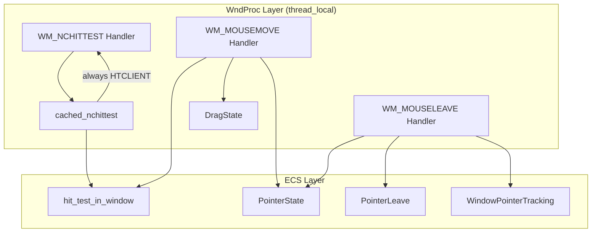
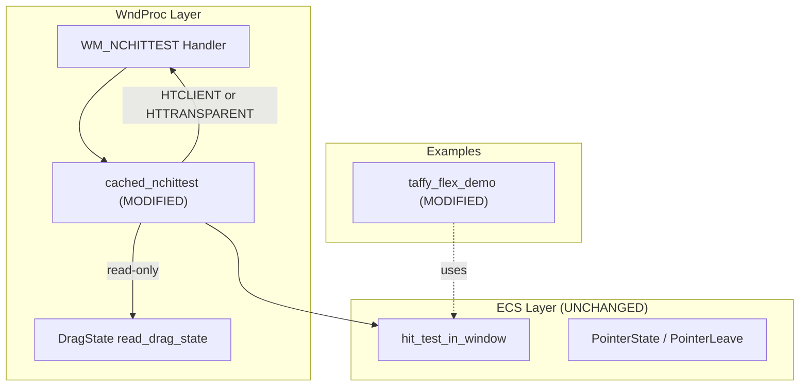
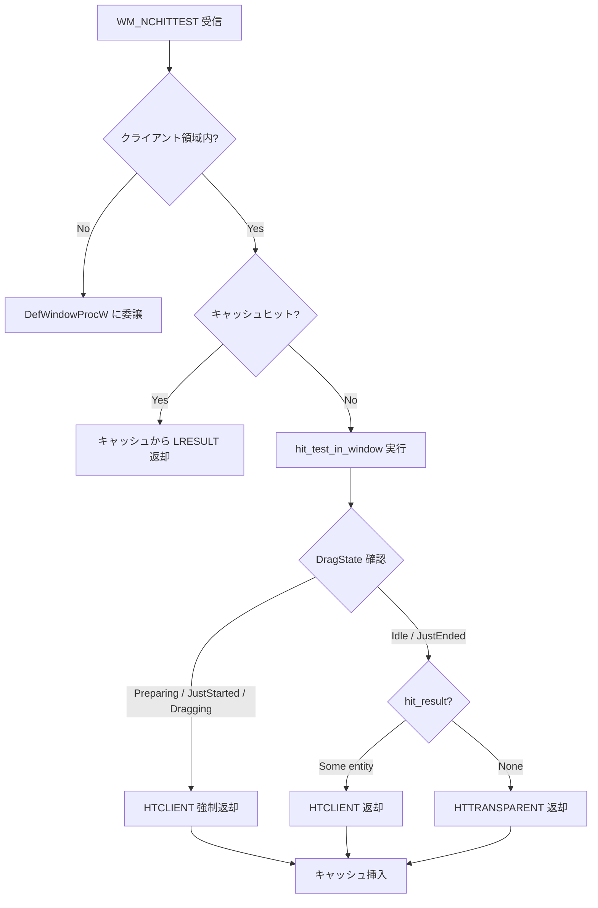
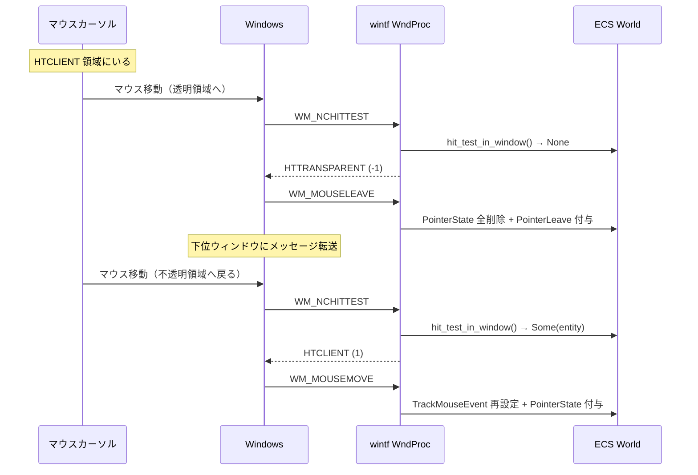

# Technical Design: wintf-P0-click-through

## Overview

**Purpose**: wintf ウィンドウの透明領域をマウスイベントが貫通し、背後のウィンドウやデスクトップに到達するクリックスルー機能を実現する。`cached_nchittest()` の条件分岐を変更し、ECS ヒットテスト結果が `None` の場合に `HTTRANSPARENT (-1)` を返却する。

**Users**: wintf を使用するデスクトップマスコットアプリケーション開発者。透過ウィンドウにおいて不透明部分のみがマウスイベントを受け取り、透明部分はクリックが貫通する自然な操作感を実現する。

**Impact**: `nchittest_cache.rs` の `cached_nchittest()` 関数の返却値ロジックを変更。ドラッグ中の安全性ガードを追加。`taffy_flex_demo` にクリックスルーテスト領域を追加。

### Goals

- ECS ヒットテスト結果（`hit_test_in_window()`）に基づく HTTRANSPARENT / HTCLIENT の返し分け
- ドラッグ操作中の安全性保証（DragState ガード）
- 既存コメント「HTTRANSPARENT を返すとマウスイベントがブロックされてしまう」の原因解明と解決
- 自動テスト + 手動テスト環境の整備

### Non-Goals

- `SetCapture` / `ReleaseCapture` によるドラッグ中のマウスキャプチャ（将来仕様として延期）
- WM_MOUSEMOVE の None 分岐コード削除（防衛的に保持、将来整理）
- HitTestMode の新規モード追加や変更

## Architecture

### Existing Architecture Analysis



**現在の制約**:
- `cached_nchittest` は `hit_test_in_window()` の結果を取得するが無視し、常に `HTCLIENT` を返却
- `HTTRANSPARENT` 定数は `#[allow(dead_code)]` で封印
- コメント「HTTRANSPARENT を返すとマウスイベントがブロックされてしまう」が残存

**既存コメント問題の原因分析（要件 3.1）**:

当該コメントは WM_MOUSELEAVE ハンドラ未実装期に記述されたものと推定される。当時の問題:
1. HTTRANSPARENT 返却 → WM_MOUSEMOVE 停止
2. WM_MOUSELEAVE ハンドラ未実装 → PointerState が除去されない
3. 残留 PointerState が不正なホバー状態を維持 → 「ブロック」と認識

現在は以下が実装済みであり、問題は解消されている:
- `TrackMouseEvent(TME_LEAVE)` 設定（`handlers.rs` L521-551）
- `WM_MOUSELEAVE` ハンドラ（`handlers.rs` L820-876）による全 PointerState クリーンアップ
- `find_owner_window` によるマルチウィンドウスコーピング

### Architecture Pattern & Boundary Map



**選択パターン**: Option A+B（DragState ガード付き最小変更）
- `cached_nchittest` に `hit_result` 基づく分岐を追加
- DragState が非 Idle の場合は HTCLIENT を強制返却
- 詳細な比較は `research.md` の「Architecture Pattern Evaluation」を参照

**既存パターン維持**:
- thread_local キャッシュパターン（NCHITTEST_CACHE）
- thread_local 状態パターン（DRAG_STATE）
- ECS ヒットテスト API は変更なし

**新規コンポーネントの理由**:
- 新規コンポーネントなし。既存関数の条件分岐変更のみ。

**Steering 準拠**:
- レイヤー分離（COM → ECS → WndProc）を維持
- unsafe ブロックの追加なし
- 既存テストパターンへの適合

### Technology Stack

| Layer | Choice / Version | Role in Feature | Notes |
|-------|------------------|-----------------|-------|
| WndProc | windows-rs 0.62.2 | WM_NCHITTEST, LRESULT | 既存依存、変更なし |
| ECS | bevy_ecs 0.18.0 | hit_test_in_window, PointerState | 既存依存、変更なし |
| Layout | taffy 0.9.2 | HitTestMode, HitTest コンポーネント | 既存依存、変更なし |

新規依存なし。

## System Flows

### HTTRANSPARENT 判定フロー



### HTTRANSPARENT 領域への移動時のメッセージシーケンス



## Requirements Traceability

| Requirement | Summary | Components | Interfaces | Flows |
|-------------|---------|------------|------------|-------|
| 1.1 | None → HTTRANSPARENT | cached_nchittest | — | HTTRANSPARENT 判定フロー |
| 1.2 | Some → HTCLIENT | cached_nchittest | — | HTTRANSPARENT 判定フロー |
| 1.3 | dead_code 除去 | cached_nchittest | — | — |
| 1.4 | 領域外 → DefWindowProcW | （既存動作維持） | — | — |
| 1.5 | HTTRANSPARENT キャッシュ格納 | cached_nchittest | NchittestCacheEntry | — |
| 1.6 | Opacity/Brushes α値判定 | hit_test_entity | Opacity, Brushes | — |
| 2.1 | HTTRANSPARENT 時の PointerState 除去 | （WM_MOUSELEAVE 自動充足） | — | メッセージシーケンス |
| 2.2 | HTCLIENT 再進入時の PointerState 付与 | （WM_MOUSEMOVE 既存動作） | — | メッセージシーケンス |
| 2.3 | WM_MOUSELEAVE クリーンアップ | （既存ハンドラ） | — | メッセージシーケンス |
| 3.1 | コメント問題の文書化 | — | — | — |
| 3.2 | HTCLIENT 領域のイベント正常受信 | cached_nchittest | — | HTTRANSPARENT 判定フロー |
| 3.3 | 非互換性の明示 | — | — | — |
| 4.1 | HTTRANSPARENT ユニットテスト | cached_nchittest tests | — | — |
| 4.2 | キャッシュ格納テスト | cached_nchittest tests | — | — |
| 4.3 | None 条件テスト | hit_test tests | — | — |
| 4.4 | taffy_flex_demo テスト領域 | ClickThroughDemo | HitTest::none() | — |

## Components and Interfaces

| Component | Domain/Layer | Intent | Req Coverage | Key Dependencies | Contracts |
|-----------|-------------|--------|--------------|-----------------|-----------|
| cached_nchittest | WndProc | HTTRANSPARENT/HTCLIENT分岐 + DragStateガード | 1.1-1.5, 3.2 | hit_test_in_window (P0), DragState (P0) | State || hit_test_entity | ECS/Layout | Opacity/Brushesα値判定による透明領域検出 | 1.6 | Opacity (P0), Brushes (P0) | — || ClickThroughDemo | Examples | 手動テスト用クリックスルー領域 | 4.4 | HitTest (P0) | — |

### WndProc Layer

#### cached_nchittest（既存関数修正）

| Field | Detail |
|-------|--------|
| Intent | ECS ヒットテスト結果に基づき HTTRANSPARENT / HTCLIENT を返し分ける |
| Requirements | 1.1, 1.2, 1.3, 1.4, 1.5, 3.2 |

**Responsibilities & Constraints**
- `hit_test_in_window()` の結果が `None` なら HTTRANSPARENT、`Some` なら HTCLIENT を返却
- DragState が非 Idle（`Preparing` / `JustStarted` / `Dragging`）の場合は HTCLIENT を強制返却
- `HTTRANSPARENT` 定数から `#[allow(dead_code)]` を除去
- 既存の3行コメントを更新（原因と解決策を記載）
- キャッシュ方式（`insert` / `lookup`）は変更不要（LRESULT 型で値に依存しない）

**Dependencies**
- Inbound: WM_NCHITTEST handler — ヒットテスト結果の提供元 (P0)
- Outbound: `hit_test_in_window()` — ECS ヒットテスト実行 (P0)
- Outbound: `drag::read_drag_state()` — ドラッグ状態参照 (P0)

**Contracts**: State [x]

##### State Management

- **State model**: `HTTRANSPARENT / HTCLIENT` の返却値は `hit_result` と `DragState` の2入力で決定
  ```
  if DragState ∈ {Preparing, JustStarted, Dragging} → HTCLIENT
  else if hit_result == Some(_)                      → HTCLIENT
  else (hit_result == None)                          → HTTRANSPARENT
  ```
- **Persistence & consistency**: キャッシュは `LRESULT` 型で格納。HTTRANSPARENT, HTCLIENT いずれも透過的に扱われる。`clear_nchittest_cache()` による tick 完了時クリアは変更不要。
- **Concurrency strategy**: thread_local による単一スレッド保証（既存パターン維持）

**Implementation Notes**
- Integration: `drag::read_drag_state` は同一 thread_local スレッドで実行されるため、借用競合なし
- Validation: DragState 確認は `hit_test_in_window()` の後、LRESULT 決定の直前に実行
- Risks: DragState ガードにより、ドラッグ中はクリックスルーが無効になる（意図された動作）
- Alpha Threshold Alignment: `HitTestMode::Bounds` の透明判定に `Opacity * Brushes.foreground.a < 128/255` を適用
  - AlphaMask の `ALPHA_THRESHOLD` (alpha_mask.rs L7) と同一基準
  - Rectangle は foreground から色を取得（rectangle.rs L154-158）
  - Opacity 未設定時は 1.0、Brushes.foreground が Inherit 時は親継承済みまたは DEFAULT_FOREGROUND (a=1.0)
  - 実装箇所: `hit_test_entity` (`hit_test.rs` L200付近) の `HitTestMode::Bounds` 分岐
- Comment Update: `nchittest_cache.rs` L136-138 の3行コメントを以下に更新
  ```rust
  // WM_MOUSELEAVE ハンドラ実装済み（handlers.rs L820-876）により、
  // HTTRANSPARENT 返却後も PointerState は正常にクリーンアップされる。
  // ドラッグ中は DragState ガードで HTCLIENT を強制返却する。
  ```

### ECS Layer

#### hit_test_entity（既存関数修正）

| Field | Detail |
|-------|--------|
| Intent | HitTestMode::Bounds エンティティに対して Opacity/Brushes α値判定を実施 |
| Requirements | 1.6 |

**Responsibilities & Constraints**
- `HitTestMode::Bounds` 分岐で `Opacity * Brushes.foreground.a` の積（合成α値）を計算
- 合成α値 < `128/255 (≈0.502)` なら `false` を返却（透明領域と判定）
- Opacity 未設定時は 1.0、Brushes.foreground が Inherit 時は親継承済みまたは DEFAULT_FOREGROUND (a=1.0)
- AlphaMask の `ALPHA_THRESHOLD` (128/255) と同一基準

**Dependencies**
- Inbound: hit_test, hit_test_in_window — ヒットテスト実行 (P0)
- Outbound: Opacity — 不透明度コンポーネント (P0)
- Outbound: Brushes — ブラシコンポーネント (P0)

**Implementation Notes**
- Integration: 既存の `HitTestMode::Bounds` 分岐（hit_test.rs L200付近）にα値判定を挿入
- Validation: Rectangle は foreground から色を取得（rectangle.rs L154-158）するため、foreground.a を使用
- Fallback: Brushes.foreground が Inherit の場合、`resolve_inherited_brushes` システムが事前に解決済み、または DEFAULT_FOREGROUND を使用
- Risks: なし（単純な数値判定のみ）

### Examples Layer

#### ClickThroughDemo（taffy_flex_demo 追加要素）

| Field | Detail |
|-------|--------|
| Intent | 手動テストでクリックスルー挙動を確認するためのテスト領域 |
| Requirements | 4.4 |

**Responsibilities & Constraints**
- `HitTest::none()` を持つ半透明矩形（クリックスルー領域）を配置
- 隣に `HitTest::bounds()` を持つ矩形（通常領域）を配置し、対比テストを可能にする
- 既存の `region_container` と同階層に追加

**Dependencies**
- Inbound: taffy_flex_demo — デモシーン構築 (P0)
- Outbound: HitTest コンポーネント — ヒットテストモード設定 (P0)

**UI Configuration**

| 要素 | BoxStyle | Brushes | HitTest | OnPointerPressed |
|------|---------|---------|---------|------------------|
| クリックスルー領域 | 150x100px, 黄色枠線 | foreground: rgba(255,255,0,0.3) | `HitTest::none()` | なし（貫通するため） |
| 通常領域 | 150x100px, シアン枠線 | foreground: rgba(0,255,255,0.3) | `HitTest::bounds()` | ログ出力「Normal region clicked」 |
| ラベル（各領域） | テキストレイヤー | foreground: rgba(0,0,0,1.0) | Inherit（親に従う） | — |

**Layout**
```
[既存 region_container]
[ClickThroughDemo Container (横並び FlexDirection::Row)]
  ├─ [クリックスルー領域] "Click-through\n(HitTest::none)"
  └─ [通常領域] "Normal\n(HitTest::bounds)"
```

**Implementation Notes**
- Integration: 既存の `create_flexbox_window()` 内、`region_container` の後に新しい Flex コンテナを追加
- Validation: クリックスルー領域をクリックしてデスクトップや背後のウィンドウにイベントが到達することを手動確認
- Alpha Boundary Test: `Opacity(0.5)` + `foreground.a=1.0` → 合成α=0.5 → HTCLIENT（境界値テスト）
- Risks: なし（テスト用コードのみ）

## Error Handling

### Error Strategy

本機能のエラーハンドリングは既存パターンを維持する。

### Error Categories and Responses

| カテゴリ | 条件 | 処理 |
|---------|------|------|
| World 借用失敗 | `ecs_world.try_borrow()` が `Err` | `None` を返却し `DefWindowProcW` に委譲（既存動作） |
| ScreenToClient 失敗 | Win32 API エラー | `None` を返却し `DefWindowProcW` に委譲（既存動作） |
| DragState 読み取り | thread_local 内の RefCell パニック | 発生しない（read_drag_state は borrow() を使用、書き込みと同時実行されない） |

新規エラーパスなし。

## Testing Strategy

### Component/Integration Tests

1. **HTTRANSPARENT 返却パステスト**: `hit_result = None` の場合に `LRESULT(-1)` が返却されることを検証
2. **HTCLIENT 返却パステスト**: `hit_result = Some(entity)` の場合に `LRESULT(1)` が返却されることを検証
3. **キャッシュ格納テスト**: HTTRANSPARENT / HTCLIENT 両方がキャッシュに正しく格納・取得されることを検証（既存テストの拡張）
4. **DragState ガードテスト**: DragState が非 Idle の場合に `hit_result = None` でも HTCLIENT が返却されることを検証
5. **Opacity/Brushes α値判定テスト**: 
   - `Opacity(0.502) * foreground.a=1.0` (α=128.01/255) → HTCLIENT（境界値以上）
   - `Opacity(0.501) * foreground.a=1.0` (α=127.76/255) → 透明領域（None）
   - `Opacity(0.4) * foreground.a=1.0` (α=102/255) → 透明領域（None）
   - `Opacity(1.0) * foreground.a=0.4` (α=102/255) → 透明領域（None）

テスト方針: `cached_nchittest` は `HWND` + `EcsWorld` を要するためコンポーネント/インテグレーションテスト相当。キャッシュの低レベル API（`lookup` / `insert`）は既存のユニットテストで十分カバーされている。ここでは分岐ロジックの検証に注力する。

### Integration Tests

1. **WM_MOUSELEAVE 連携テスト**: HTTRANSPARENT 返却後に WM_MOUSELEAVE が発行され、PointerState が除去されることを検証（手動テスト）
2. **ドラッグ中 HTCLIENT 強制テスト**: ドラッグ開始後に透明領域を通過しても WM_MOUSEMOVE が継続することを検証（手動テスト）

### Manual Tests (taffy_flex_demo)

1. **クリックスルー領域クリック**: HitTest::none() 領域をクリックし、背後のウィンドウにイベントが到達することを確認
2. **通常領域クリック**: HitTest::bounds() 領域をクリックし、wintf ウィンドウがイベントを受け取ることを確認
3. **ホバー遷移**: 通常領域 → クリックスルー領域 → 通常領域 の順にマウスを移動し、PointerState の付与・除去が正常であることをログで確認
4. **ドラッグ貫通テスト**: コンテナをドラッグ中に透明領域を通過し、ドラッグが中断しないことを確認

## Security Considerations

セキュリティへの影響なし。HTTRANSPARENT は Windows 標準の WM_NCHITTEST 返却値であり、新たな unsafe ブロックや外部入力の追加はない。

## Constraints & Known Limitations（要件 3.3）

1. **ドラッグ中のクリックスルー無効化**: DragState が `Preparing` / `JustStarted` / `Dragging` の場合、透明領域でも HTCLIENT が返却される。これはドラッグ操作の継続性を優先する意図的な設計である。将来 `SetCapture` を実装すれば、ドラッグ中も HTTRANSPARENT を安全に返却できるようになる。
2. **WM_MOUSEMOVE None 分岐の残存**: ドラッグ中の HTCLIENT 強制返却により、エンティティ無し領域で WM_MOUSEMOVE が到着する可能性がある。既存の Window エンティティへの PointerState 付与ロジックが防衛的に処理する。
