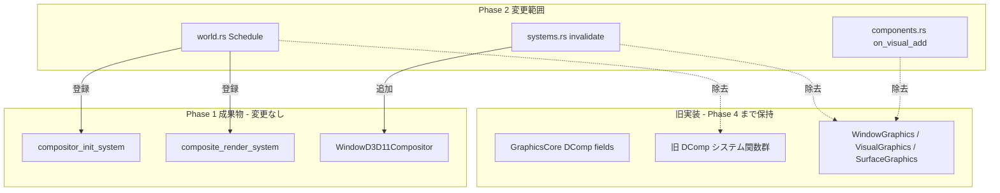
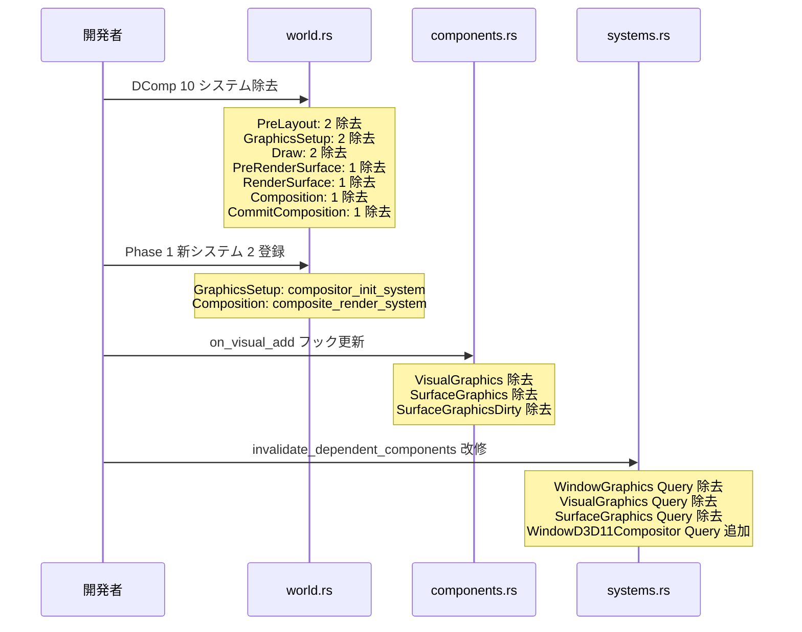

# 設計書: wintf-dcomp-migration-2-pipeline-switch

## Overview

Phase 1 で構築した D2D1 合成スタック（`WindowD3D11Compositor`, `compositor_init_system`, `composite_render_system`）を `world.rs` の ECS Schedule に登録し、DComp パイプラインの 10 システムを Schedule から除去する。旧 DComp コード（関数本体、GraphicsCore フィールド、コンポーネント型定義）は Phase 4 まで物理的に残存するが、Schedule 登録が解除されることで実行時の DComp API 呼び出しはゼロになる。

Phase 2 は **構造的切り替え** のみを担当し、`UpdateLayeredWindow` による画面表示は Phase 3 の `ulw_present_system` に委譲される。Phase 2 単体では画面に何も表示されない。

### Goals

- `world.rs` の Schedule を DComp → D2D1 合成に切り替え（10 システム除去 + 2 システム登録）
- `on_visual_add` フックから DComp コンポーネント自動挿入を除去
- `invalidate_dependent_components` を `WindowD3D11Compositor` に追従
- Schedule 登録済みシステムから DComp 参照がゼロであることを検証
- `cargo test` 全テストパス + `cargo build --examples` 全 example ビルド成功

### Non-Goals

- GraphicsCore からの DComp フィールド・メソッド除去（Phase 4）
- Schedule 非登録の旧システム関数の修正・削除（Phase 4）
- DComp コードモジュールの物理的削除（Phase 4）
- DComp コンポーネント型定義の削除（Phase 4）
- DComp テストコードの修正・削除（Phase 4）
- `UpdateLayeredWindow` 呼び出し（Phase 3）
- `WS_EX_LAYERED` ウィンドウスタイル変更（Phase 3）

---

## Architecture

> Discovery 詳細は `research.md` を参照。

### Existing Architecture Analysis

現在の描画パイプラインは 13 ステージの ECS Schedule で構成され、DComp 依存システムは 6 ステージに分散している:

| ステージ          | 現在のシステム                                                                                | Phase 2 後                                                |
| ----------------- | --------------------------------------------------------------------------------------------- | --------------------------------------------------------- |
| Input             | (変更なし)                                                                                    | (変更なし)                                                |
| Update            | `invalidate_dependent_components` ほか                                                        | **改修**: DComp Query 除去 + `WindowD3D11Compositor` 追加 |
| PreLayout         | `init_graphics_core`, `visual_resource_management_system`, `visual_hierarchy_sync_system`     | `init_graphics_core` のみ残存                             |
| Layout            | (変更なし)                                                                                    | (変更なし)                                                |
| PostLayout        | (変更なし)                                                                                    | (変更なし)                                                |
| UISetup           | (変更なし)                                                                                    | (変更なし)                                                |
| GraphicsSetup     | `init_window_graphics`, `window_visual_integration_system`                                    | **置換**: `compositor_init_system`                        |
| Draw              | 描画システム群 + `deferred_surface_creation_system`, `cleanup_surface_on_commandlist_removed` | 描画システム群のみ残存（末尾 2 システム除去）             |
| PreRenderSurface  | `mark_dirty_surfaces`                                                                         | **空ステージ**                                            |
| RenderSurface     | `render_surface`                                                                              | **空ステージ**（WPF 的遅延戦略）                          |
| Composition       | `visual_property_sync_system`                                                                 | **置換**: `composite_render_system`                       |
| CommitComposition | `commit_composition`                                                                          | **空ステージ**（Phase 3 `ulw_present_system` 用）         |
| FrameFinalize     | (変更なし)                                                                                    | (変更なし)                                                |

### Architecture Pattern & Boundary Map



**Architecture Integration**:
- **Selected pattern**: Schedule 登録切り替え — 旧システムの関数本体を修正せず、Schedule 登録の追加/除去のみで切り替え
- **Domain boundary**: `world.rs`（Schedule 管理）、`components.rs`（コンポーネントフック）、`systems.rs`（YELLOW システム）の 3 ファイルに変更を局所化
- **Existing patterns preserved**: ECS Schedule ステージ構造、`Res<GraphicsCore>` による共有リソースアクセス、Query ベースのコンポーネントアクセス
- **Steering compliance**: レイヤー分離（COM → ECS → Message Handling）を維持

### Technology Stack

| Layer    | Choice / Version | Role in Feature       | Notes                   |
| -------- | ---------------- | --------------------- | ----------------------- |
| ECS      | bevy_ecs 0.18.0  | Schedule システム管理 | add_systems / chain API |
| Graphics | Direct2D + D3D11 | 合成描画パイプライン  | Phase 1 で構築済み      |
| Window   | Win32 API        | HWND 管理             | 変更なし                |

---

## System Flows

### Schedule 切り替えフロー



---

## Requirements Traceability

| Requirement | Summary                           | Components                  | Verification                        |
| ----------- | --------------------------------- | --------------------------- | ----------------------------------- |
| 1.1         | DComp 8 システム除去              | world.rs Schedule           | Schedule 構造検査                   |
| 1.2         | Phase 1 新システム登録            | world.rs Schedule           | Schedule 構造検査                   |
| 1.3         | mark_dirty_surfaces 除去          | world.rs Schedule           | Schedule 構造検査                   |
| 1.4         | commit_composition 除去           | world.rs Schedule           | Schedule 構造検査                   |
| 2.1-2.3     | DComp コンポーネント挿入除去      | components.rs on_visual_add | コード検査                          |
| 2.4-2.5     | 維持コンポーネント確認            | components.rs on_visual_add | コード検査                          |
| 3.1         | DComp Query 除去                  | systems.rs invalidate       | コード検査                          |
| 3.2         | WindowD3D11Compositor Query 追加  | systems.rs invalidate       | コード検査                          |
| 3.3         | BitmapSourceGraphics 維持         | systems.rs invalidate       | コード検査                          |
| 3.4         | mark_dirty_surfaces Schedule 除去 | world.rs Schedule           | 1.3 と連動                          |
| 4.1         | DComp システム不在検証            | world.rs Schedule           | 静的検査                            |
| 4.2         | Phase 1 新システム存在検証        | world.rs Schedule           | 静的検査                            |
| 5.1-5.6     | 包括的完了検証                    | 全変更の結果                | cargo test + cargo build --examples |

---

## Components and Interfaces

| Component                       | Domain/Layer   | Intent                                        | Req Coverage | Key Dependencies           | Contracts |
| ------------------------------- | -------------- | --------------------------------------------- | ------------ | -------------------------- | --------- |
| world.rs Schedule 変更          | ECS/Schedule   | DComp → D2D1 パイプライン切り替え             | 1.1-1.4, 3.4 | compositor_systems (P0)    | —         |
| on_visual_add フック            | ECS/Components | DComp コンポーネント挿入停止                  | 2.1-2.5      | —                          | —         |
| invalidate_dependent_components | ECS/Systems    | デバイスロスト時の新コンポーネント invalidate | 3.1-3.3      | WindowD3D11Compositor (P0) | Service   |

### ECS / Schedule Layer

#### world.rs Schedule 変更

| Field        | Detail                                                    |
| ------------ | --------------------------------------------------------- |
| Intent       | DComp システムの Schedule 除去 + Phase 1 新システムの登録 |
| Requirements | 1.1, 1.2, 1.3, 1.4, 3.4                                   |

**Responsibilities & Constraints**
- 10 個の DComp システムを 7 ステージから除去
- 2 個の Phase 1 新システムを適切なステージに登録
- 既存の chain 構造を除去後に整合させる
- 3 ステージが空になることを許容（PreRenderSurface, RenderSurface, CommitComposition）

**変更仕様**

**PreLayout ステージ**:
```
// Before (chain):
//   init_graphics_core → visual_resource_management_system → visual_hierarchy_sync_system
// After (単独):
//   init_graphics_core
```
- `visual_resource_management_system`, `visual_hierarchy_sync_system` を chain から除去
- `init_graphics_core` を単独 add_systems で再登録（chain 不要）

**GraphicsSetup ステージ**:
```
// Before (chain):
//   init_window_graphics → window_visual_integration_system
// After (単独):
//   compositor_init_system
```
- 旧 chain 全体を除去し、`compositor_init_system` を単独登録

**Draw ステージ**:
```
// Before (chain 末尾):
//   ... → generate_alpha_mask_system → deferred_surface_creation_system → cleanup_surface_on_commandlist_removed
// After (chain 末尾):
//   ... → generate_alpha_mask_system
```
- chain 末尾の `deferred_surface_creation_system`, `cleanup_surface_on_commandlist_removed` を除去
- chain は `resolve_inherited_brushes` から `generate_alpha_mask_system` まで維持

**PreRenderSurface ステージ**:
```
// Before: mark_dirty_surfaces
// After: (空)
```

**RenderSurface ステージ**:
```
// Before: render_surface
// After: (空)
```
- WPF 的遅延戦略により、焼き付けは Composition ステージで実行

**Composition ステージ**:
```
// Before: visual_property_sync_system
// After: composite_render_system
```

**CommitComposition ステージ**:
```
// Before: commit_composition
// After: (空)
```
- Phase 3 の `ulw_present_system` が当該ステージを引き継ぐ（Phase 間ハンドオーバーポイント）

**Implementation Notes**
- chain 除去後に残るシステムが単独の場合、chain は不要（単独 add_systems で登録）
- 空ステージのセクション（add_systems 呼び出し）はコメントアウトまたは除去

### ECS / Components Layer

#### on_visual_add フック更新

| Field        | Detail                                             |
| ------------ | -------------------------------------------------- |
| Intent       | Visual 追加時の DComp コンポーネント自動挿入を停止 |
| Requirements | 2.1, 2.2, 2.3, 2.4, 2.5                            |

**Responsibilities & Constraints**
- `VisualGraphics::default()` 挿入ブロックを除去
- `SurfaceGraphics::default()` 挿入ブロックを除去
- `SurfaceGraphicsDirty::default()` 挿入ブロックを除去
- `Arrangement::default()` 挿入を維持（レイアウトシステムが依存）
- `BrushInherit` マーカー挿入を維持（ブラシ継承システムが依存）

**変更仕様**

```rust
// Before:
fn on_visual_add(mut world: DeferredWorld, entity: Entity, _: ComponentId) {
    // ... Arrangement 挿入 ...
    if !world.entity(entity).contains::<VisualGraphics>() {
        world.commands().entity(entity).insert(VisualGraphics::default());
    }
    if !world.entity(entity).contains::<SurfaceGraphics>() {
        world.commands().entity(entity).insert(SurfaceGraphics::default());
    }
    if !world.entity(entity).contains::<SurfaceGraphicsDirty>() {
        world.commands().entity(entity).insert(SurfaceGraphicsDirty::default());
    }
    // ... BrushInherit 挿入 ...
}

// After:
fn on_visual_add(mut world: DeferredWorld, entity: Entity, _: ComponentId) {
    // ... Arrangement 挿入 (維持) ...
    // VisualGraphics, SurfaceGraphics, SurfaceGraphicsDirty: 除去
    // ... BrushInherit 挿入 (維持) ...
}
```

**Implementation Notes**
- 各 insert ブロックは `if !world.entity(entity).contains::<T>()` ガード付きのため、該当 if ブロック全体を削除

### ECS / Systems Layer

#### invalidate_dependent_components 改修

| Field        | Detail                                                        |
| ------------ | ------------------------------------------------------------- |
| Intent       | デバイスロスト時に `WindowD3D11Compositor` を invalidate する |
| Requirements | 3.1, 3.2, 3.3                                                 |

**Dependencies**
- Inbound: `GraphicsCore` — デバイス generation 比較 (P0)
- Outbound: `WindowD3D11Compositor` — invalidate() 呼び出し (P0)
- Outbound: `BitmapSourceGraphics` — invalidate() 呼び出し (P0, 維持)

**Contracts**: Service [x]

##### Service Interface

```rust
// Before:
pub fn invalidate_dependent_components(
    graphics: Option<Res<GraphicsCore>>,
    mut window_graphics_query: Query<&mut WindowGraphics>,
    mut visual_query: Query<&mut VisualGraphics>,
    mut surface_query: Query<&mut SurfaceGraphics>,
    mut bitmap_source_query: Query<&mut BitmapSourceGraphics>,
)

// After:
pub fn invalidate_dependent_components(
    graphics: Option<Res<GraphicsCore>>,
    mut compositor_query: Query<&mut WindowD3D11Compositor>,
    mut bitmap_source_query: Query<&mut BitmapSourceGraphics>,
)
```

- Preconditions: `GraphicsCore` リソースが存在する（`Option` で安全にハンドリング）
- Postconditions: generation 不一致時に全 `WindowD3D11Compositor` + `BitmapSourceGraphics` が `invalidate()` される
- Invariants: `BitmapSourceGraphics` の処理は変更なし

**変更仕様**

```rust
// Before: 4 Query でループ
for mut wg in window_graphics_query.iter_mut() { wg.invalidate(); }
for mut vg in visual_query.iter_mut() { vg.invalidate(); }
for mut sg in surface_query.iter_mut() { sg.invalidate(); }
for mut bsg in bitmap_source_query.iter_mut() { bsg.invalidate(); }

// After: 2 Query でループ
for mut comp in compositor_query.iter_mut() { comp.invalidate(); }
for mut bsg in bitmap_source_query.iter_mut() { bsg.invalidate(); }
```

**Implementation Notes**
- `WindowD3D11Compositor::invalidate()` は Phase 1 で実装済み
- `BitmapSourceGraphics` への処理は完全に維持（DComp 非依存）
- generation 比較ロジック自体は変更なし

---

## Testing Strategy

### Unit Tests
- `invalidate_dependent_components` の `WindowD3D11Compositor` invalidate 動作確認（既存テストの Query 更新）

### Integration Tests
- `cargo test` — 全テストパス（旧 DComp テストはコンパイルは通るが Schedule 非登録のため実行時パスには含まれない）

### E2E / Structure Verification
- `cargo build --examples` — 全 example ビルド成功
- Schedule 構造検査:
  - `world.rs` 内に DComp 10 システムの add_systems 呼び出しが存在しないこと
  - `compositor_init_system`, `composite_render_system` が Schedule に登録されていること
  - RenderSurface ステージにシステム登録がないこと

### Grep 検証
```bash
# Schedule 登録済みコードからの DComp 参照確認
# Note: 旧関数の定義自体は残存するが、world.rs の add_systems から除去されていることを確認
grep "init_window_graphics\|window_visual_integration\|visual_resource_management\|visual_hierarchy_sync\|deferred_surface_creation\|cleanup_surface_on_commandlist\|render_surface\|visual_property_sync\|mark_dirty_surfaces\|commit_composition" crates/wintf/src/ecs/world.rs
# → add_systems 呼び出しとしてはゼロ件（コメントでの言及は許容）
```

---

## Error Handling

### Error Strategy

Phase 2 の変更はすべて Schedule 登録の変更であり、新たなエラーパスは導入しない。

- **デバイスロスト**: `invalidate_dependent_components` が `WindowD3D11Compositor` を invalidate → `compositor_init_system` が次フレームで再作成（Phase 1 実装済み）
- **コンパイルエラー**: 旧実装保持戦略により、旧システム関数・テストのコンパイルは維持される

---

## Phase 間責任マッピング

| 責任                    | Phase 2 (本仕様) | Phase 3 | Phase 4 |
| ----------------------- | ---------------- | ------- | ------- |
| Schedule 切り替え       | ✅ 実施           | —       | —       |
| on_visual_add 更新      | ✅ 実施           | —       | —       |
| invalidate 改修         | ✅ 実施           | —       | —       |
| UpdateLayeredWindow     | —                | ✅ 実施  | —       |
| WS_EX_LAYERED           | —                | ✅ 実施  | —       |
| GraphicsCore DComp 除去 | —                | —       | ✅ 実施  |
| 旧関数削除              | —                | —       | ✅ 実施  |
| コンポーネント型削除    | —                | —       | ✅ 実施  |
| DComp モジュール削除    | —                | —       | ✅ 実施  |
