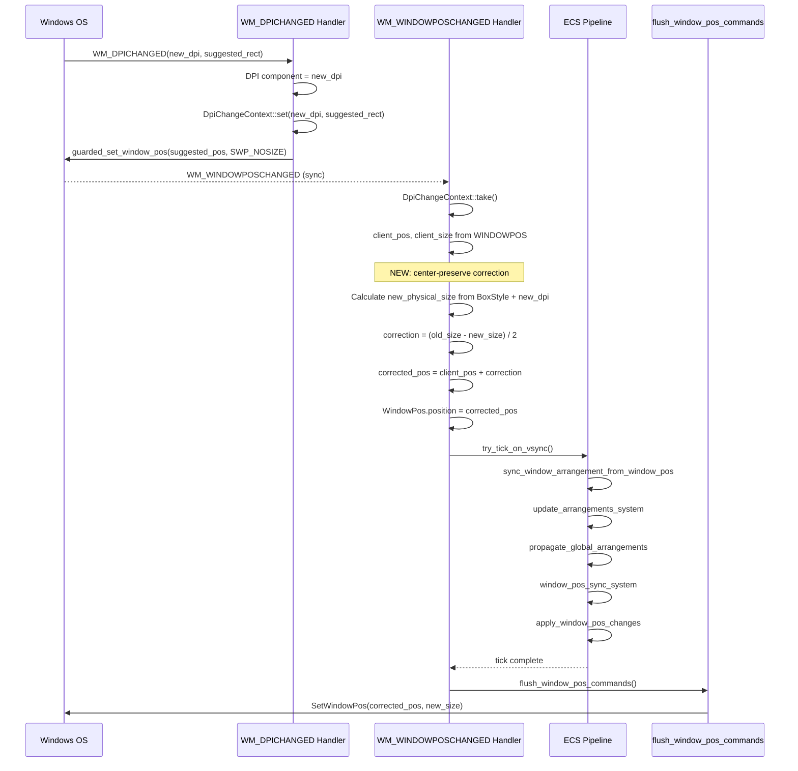
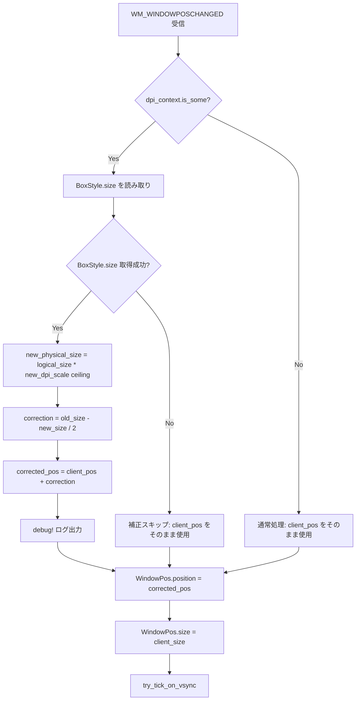

# Technical Design: wintf-dpi-window-center-preserve

## Overview

**Purpose**: DPI 変更に伴うウィンドウ物理サイズの拡大・縮小時に、ウィンドウの中心座標（物理px）が不変となるよう位置を補正する機能を提供する。

**Users**: wintf フレームワーク利用者（areka アプリケーション含む）。マルチDPIモニター環境でウィンドウをドラッグ移動する際の位置ずれ・引き戻し問題を解消する。

**Impact**: 既存の WM_WINDOWPOSCHANGED ハンドラ内に中心保持補正ロジックを追加し、ECS パイプラインのシステム関数は変更しない。

### Goals
- DPI 変更によるウィンドウ物理サイズ変化時に中心座標を保持する
- 高DPI⇔低DPI モニター間ドラッグ移動の確実化
- 既存のレイアウト主導方式（BoxStyle.size = ソースオブトゥルース）の設計原則を維持
- SetWindowPosGuard のネスト安全性の向上（カウンタ方式化、先行実装済み）

### Non-Goals
- モニター境界をまたぐアニメーション遷移の実装
- DPI 変更時の描画コンテンツ（画像、テキスト）のスムーズなスケーリング
- パーモニター DPI v1 API（`WM_DPICHANGED` 以外の通知方式）への対応
- 非 WS_POPUP ウィンドウスタイルへの対応

## Architecture

### Existing Architecture Analysis

現在の DPI 変更フローにおけるアーキテクチャ:

- **レイアウト主導方式**: `BoxStyle.size`（論理px）が唯一のソースオブトゥルース。DPI 変更時も不変
- **TLS コンテキスト伝達**: `DpiChangeContext` が `WM_DPICHANGED` → `WM_WINDOWPOSCHANGED` 間の同期情報伝達を担当
- **echo/bypass パターン**: `SELF_INITIATED_DEPTH` (AtomicI32 カウンタ) + `DpiChangeContext` による自己発火検出とフィードバックループ制御
- **コマンドキューパターン**: ECS tick 内では `SetWindowPosCommand` をキューに追加し、tick 後の `flush_window_pos_commands()` で一括実行

**現在の問題**: `window_pos_sync_system` がサイズ変更時に位置を `GlobalArrangement.bounds.left/top`（= 補正前の suggested_pos）のまま使用するため、中心座標が保持されない。サイズ縮小時に中心が左上にずれ、ウィンドウが元のモニター領域に入り WM_DPICHANGED が再発火 → ドラッグ失敗。

### Architecture Pattern & Boundary Map



**Architecture Integration**:
- **選択パターン**: Pre-tick handler 補正（Interceptor パターン）
- **ドメイン境界**: 補正ロジックは WM_WINDOWPOSCHANGED ハンドラ内に閉じ込め、ECS パイプラインのシステム関数には変更を加えない
- **既存パターン維持**: レイアウト主導方式、TLS コンテキスト伝達、echo/bypass パターンのすべてを維持
- **新規コンポーネント**: なし（最小侵入的設計）
- **Steering 準拠**: レイヤー分離原則（COM → ECS → Message Handling）を維持

### Technology Stack

| Layer | Choice / Version | Role in Feature | Notes |
|-------|------------------|-----------------|-------|
| Language | Rust 2024 Edition | 実装言語 | 既存 |
| ECS | bevy_ecs 0.18.0 | WindowPos, BoxStyle, DPI コンポーネント管理 | 既存 |
| Win32 | windows 0.62.2 | WM_DPICHANGED, SetWindowPos, POINT, SIZE 型 | 既存 |
| Layout | taffy 0.9.2 | BoxStyle → 物理サイズ変換の基盤 | 既存 |
| Logging | tracing | debug!/trace! ログ出力 | 既存 |

新規依存なし。全て既存スタックの範囲内。

## System Flows

### DPI 変更時の中心保持補正フロー（詳細）



## Requirements Traceability

| Requirement | Summary | Components | Interfaces | Flows |
|-------------|---------|------------|------------|-------|
| 1.1 | 中心座標保持（左上補正） | CenterPreserveCorrection | `calculate_center_correction()` | DPI change flow |
| 1.2 | 補正量計算式 | CenterPreserveCorrection | `calculate_center_correction()` | DPI change flow |
| 1.3 | サイズ+位置の単一 SetWindowPos 適用 | WM_WINDOWPOSCHANGED handler, flush | — | DPI change flow |

> **Req 1.3 注記**: DPI 変更フローでは SetWindowPos が 2 回発生する。①`WM_DPICHANGED` 内の `SWP_NOSIZE` 呼び出しは WM_WINDOWPOSCHANGED を同期発火させるための**トリガー専用**であり、サイズは変更しない。②`flush_window_pos_commands()` 内の呼び出しが**唯一のサイズ+位置の適用**であり、これが Req 1.3 の「単一の SetWindowPos 呼び出し」に該当する。シーケンス図の `Flush->>OS: SetWindowPos(corrected_pos, new_size)` 行がこれに対応する。
| 2.1 | 高→低DPI ドラッグ成功 | CenterPreserveCorrection | — | DPI change flow |
| 2.2 | 中心がモニター領域内に維持 | CenterPreserveCorrection | — | DPI change flow |
| 2.3 | WM_DPICHANGED 再発火防止 | CenterPreserveCorrection | — | DPI change flow |
| 3.1 | 低→高DPI ドラッグ成功 | CenterPreserveCorrection | — | DPI change flow |
| 3.2 | 中心がモニター領域内に維持 | CenterPreserveCorrection | — | DPI change flow |
| 4.1 | BoxStyle.size ソースオブトゥルース維持 | WM_WINDOWPOSCHANGED handler | — | — |
| 4.2 | tick 前 WindowPos.position 補正 | CenterPreserveCorrection | `correct_position_for_dpi_center_preserve()` | DPI change flow |
| 4.3 | 新規コンポーネント/TLS なし | — | — | — |
| 4.4 | handlers.rs 分割・補正ヘルパー配置 | handlers.rs リファクタリング, CenterPreserveCorrection | — | — |
| 5.1 | SELF_INITIATED_DEPTH AtomicI32 | SetWindowPosGuard | `is_self_initiated()` | — |
| 5.2 | RAII カウンタ inc/dec | SetWindowPosGuard | `SetWindowPosGuard::new()`, `Drop` | — |
| 5.3 | カウンタ > 0 判定 | SetWindowPosGuard | `is_self_initiated()` | — |
| 6.1 | DPI 未変更時は補正なし | CenterPreserveCorrection | — | — |
| 6.2 | 単一DPI 環境で同一動作 | CenterPreserveCorrection | — | — |
| 6.3 | 手動リサイズ時は補正なし | CenterPreserveCorrection | — | — |
| 7.1 | 補正適用時 debug! ログ | CenterPreserveCorrection | — | — |
| 7.2 | 補正不要時 trace! ログ | CenterPreserveCorrection | — | — |

## Components and Interfaces

| Component | Domain/Layer | Intent | Req Coverage | Key Dependencies | Contracts |
|-----------|-------------|--------|--------------|------------------|-----------|
| handlers.rs リファクタリング | Window Proc | handlers.rs を関心事別に5ファイルに分割 | 4.4 | 全ハンドラ (P0) | — |
| CenterPreserveCorrection | window_pos.rs | DPI 変更時の中心保持位置補正 | 1.1-1.3, 2.1-2.3, 3.1-3.2, 4.1-4.3, 6.1-6.3, 7.1-7.2 | BoxStyle (P0), DPI (P0), WindowPos (P0), DpiChangeContext (P0) | Service |
| SetWindowPosGuard (refactored) | Window Management | ネストカウンタ管理 | 5.1-5.3 | SELF_INITIATED_DEPTH (P0) | State |

### Window Handler Layer

#### CenterPreserveCorrection

| Field | Detail |
|-------|--------|
| Intent | DPI 変更時に WindowPos.position を中心保持補正済みの値に差し替える |
| Requirements | 1.1, 1.2, 1.3, 2.1, 2.2, 2.3, 3.1, 3.2, 4.1, 4.2, 4.3, 6.1, 6.2, 6.3, 7.1, 7.2 |

**Responsibilities & Constraints**
- DPI 変更コンテキスト存在時に限り、`client_pos` を中心保持補正値で差し替える
- 補正計算は `WM_WINDOWPOSCHANGED` ハンドラ内の通常パス（`use_bypass == false && dpi_context.is_some()`）でのみ実行
- BoxStyle.size が取得できない場合は補正をスキップし、suggested_pos をそのまま使用（フォールバック）
- ECS パイプラインの既存システム関数には変更を加えない

**Dependencies**
- Inbound: `DpiChangeContext` — DPI 変更検知トリガー (P0)
- Inbound: `WINDOWPOS` — 旧物理サイズ取得元 (P0)
- Outbound: `WindowPos.position` — 補正済み位置の書き込み先 (P0)
- External: `BoxStyle` component — 論理サイズ (P0)
- External: `DPI` component — 新 DPI スケール (P0)

**Contracts**: Service [x]

##### Service Interface

```rust
/// DPI 変更時の中心保持位置補正を計算する。
///
/// 旧物理サイズ (old_size) と新物理サイズ (new_size) から、
/// ウィンドウ中心座標が不変となる位置補正量を算出する。
///
/// Returns: 補正量 (dx, dy)、補正不要時は (0, 0)
fn calculate_center_correction(
    old_physical_size: SIZE,  // 旧物理サイズ（SWP_NOSIZE による未変更サイズ）
    new_physical_size: SIZE,  // 新物理サイズ（BoxStyle.size × new_dpi_scale, ceiling）
) -> (i32, i32);
// 事前条件: old_physical_size, new_physical_size は正の値
// 事後条件: correction = ((old_w - new_w) / 2, (old_h - new_h) / 2)
// 不変条件: old_center == new_center（ここで center = pos + size/2）

/// BoxStyle.size と DPI スケールから物理ピクセルサイズを計算する。
///
/// window_pos_sync_system と同一の変換ロジック（ceiling 処理）を使用し、
/// 計算結果の一致を保証する。
///
/// Returns: 物理サイズ (width_px, height_px)、BoxStyle.size が None の場合は None
fn calculate_physical_size_from_box_style(
    box_style: &BoxStyle,
    dpi: &DPI,
) -> Option<SIZE>;
// 事前条件: box_style.size is Some(BoxSize { width: Some(Px(w)), height: Some(Px(h)) })
// 事後条件: result.cx == (w * dpi.scale_x()).ceil() as i32
//           result.cy == (h * dpi.scale_y()).ceil() as i32

/// WM_WINDOWPOSCHANGED ハンドラ内で呼び出す中心保持補正のエントリポイント。
///
/// DpiChangeContext が存在する場合にのみ補正を適用する。
/// DpiChangeContext が None の場合、client_pos をそのまま返す。
fn correct_position_for_dpi_center_preserve(
    client_pos: POINT,
    client_size: SIZE,        // 旧物理サイズ（WINDOWPOS 由来）
    dpi_context: &Option<DpiChangeContext>,
    box_style: Option<&BoxStyle>,
    dpi: &DPI,
) -> POINT;
// 事前条件: dpi_context.is_some() は DPI 変更時のみ true
// 事後条件: dpi_context.is_none() → return client_pos（無変更）
//           dpi_context.is_some() && box_style.size.is_some() → return corrected_pos
//           dpi_context.is_some() && box_style.size.is_none() → return client_pos（フォールバック）
```

**Implementation Notes**
- **ファイル配置**: `handlers.rs`（1,760行）を関心事別に分割し、中心保持補正ロジックは `window_proc/window_pos.rs` に配置する。分割構成:
  - `lifecycle.rs` (~117行): NCCREATE, NCDESTROY, ERASEBKGND, PAINT, CLOSE, DISPLAYCHANGE
  - `window_pos.rs` (~420行): WINDOWPOSCHANGED, DPICHANGED, center-preserve 補正ヘルパー
  - `mouse_move.rs` (~473行): NCHITTEST, MOUSEMOVE, MOUSELEAVE + helpers
  - `mouse_button.rs` (~630行): handle_button_message, 各ボタン6種, DBLCLK4種, MOUSEWHEEL2種
  - `keyboard.rs` (~175行): KEYDOWN, CANCELMODE, ACTIVATE, find_ancestor_with_drag_config
  - `handlers.rs` は削除し、`mod.rs` から各サブモジュールを `pub(super)` で参照
- **Integration**: `window_pos.rs` の WM_WINDOWPOSCHANGED ハンドラ通常パス内、`window_pos.position = Some(client_pos)` の直前で `correct_position_for_dpi_center_preserve()` を呼び出し、戻り値で `client_pos` を差し替える
- **Validation**: `calculate_center_correction` の計算結果は整数除算のため最大 1px の丸め誤差が生じうるが、実用上問題なし
- **前提条件（BoxStyle.size）**: 本計算は Window エンティティが `BoxStyle.size = Some(BoxSize { width: Some(Px(w)), height: Some(Px(h)) })` で**固定物理サイズを直接保持**しており、taffy の min/max サイズ制約や flex 再分配が適用されていないことを前提とする。この前提が崩れた場合（min/max 制約による taffy 再計算で `window_pos_sync_system` の結果と乖離する場合）、補正精度は低下する可能性がある。現行アーキテクチャでは Window エンティティへの min/max 適用は設計外であるため、リスクは低い。
- **Risks**: `BoxStyle.size` が `Dimension::Px` 以外（`Percent` 等）の場合は補正をスキップ。現行実装では Window エンティティは常に `Px` を使用

### Window Management Layer

#### SetWindowPosGuard (refactored)

| Field | Detail |
|-------|--------|
| Intent | guarded_set_window_pos のネスト深度を RAII カウンタで管理 |
| Requirements | 5.1, 5.2, 5.3 |

**Responsibilities & Constraints**
- `SELF_INITIATED_DEPTH: AtomicI32` のインクリメント/デクリメントを RAII で管理
- ネスト呼び出し（DPI 変更 → SWP → WM_WINDOWPOSCHANGED → tick → flush → SWP）で正しくカウント
- シングルスレッド使用のため `Ordering::Relaxed` で十分

**Contracts**: State [x]

##### State Management
- **State model**: `AtomicI32` カウンタ、値 > 0 で自己発火中
- **Persistence**: なし（プロセスライフタイム static）
- **Concurrency**: 単一スレッド使用。AtomicI32 は将来的なマルチスレッド対応への安全マージン

**Implementation Notes**
- **Status**: 先行実装済み（ビルド・テスト通過確認済み）
- **Changes**: `Cell<bool>` TLS → `static SELF_INITIATED_DEPTH: AtomicI32`; `SetWindowPosGuard` はフィールドなし struct; `new()` で `fetch_add(1)`, `Drop` で `fetch_sub(1)`

## Data Models

本機能では新規 ECS コンポーネント、TLS、永続データを追加しない。既存コンポーネントの値のみを操作する。

### Computation Model

中心保持補正の計算は以下の値を入力とする純粋関数:

| Input | Type | Source | Coordinate System |
|-------|------|--------|------------------|
| client_pos | `POINT { x: i32, y: i32 }` | WINDOWPOS → window_to_client_coords | スクリーン座標、物理px |
| client_size (= old_physical_size) | `SIZE { cx: i32, cy: i32 }` | WINDOWPOS → window_to_client_coords | 物理px |
| box_style.size | `Option<BoxSize>` → `Dimension::Px(f32)` | ECS BoxStyle component | 論理px（96 DPI 基準）|
| dpi | `DPI { dpi_x: u16, dpi_y: u16 }` | ECS DPI component（新 DPI） | — |

| Output | Type | Formula |
|--------|------|---------|
| new_physical_size | `SIZE` | `((logical_w * dpi.scale_x()).ceil(), (logical_h * dpi.scale_y()).ceil())` |
| correction | `(i32, i32)` | `((old_cx - new_cx) / 2, (old_cy - new_cy) / 2)` |
| corrected_pos | `POINT` | `(client_pos.x + correction.0, client_pos.y + correction.1)` |

**数学的証明（中心不変性）**:
```
old_center = client_pos + old_size / 2
new_center = corrected_pos + new_size / 2
           = (client_pos + (old_size - new_size) / 2) + new_size / 2
           = client_pos + old_size / 2
           = old_center  ✓
```

## Error Handling

### Error Strategy

本機能はウィンドウ位置の計算処理であり、致命的エラーは発生しない。異常ケースはフォールバック動作で対応する。

### Error Categories and Responses

| Category | Condition | Response | Log Level |
|----------|-----------|----------|-----------|
| BoxStyle 未取得 | `entity_ref.get::<BoxStyle>()` が None | 補正スキップ、client_pos をそのまま使用 | `warn!` |
| BoxSize 未設定 | `box_style.size` が None | 補正スキップ | `trace!` |
| Dimension 非 Px | `width/height` が `Dimension::Px` 以外 | 補正スキップ | `trace!` |
| サイズ無変化 | old_size == new_size | correction = (0, 0)、実質的に no-op | `trace!` |

## Testing Strategy

### Unit Tests

| # | Test | Description | Req |
|---|------|-------------|-----|
| 1 | `test_center_correction_size_decrease` | 200%→125% でサイズ縮小時の補正量計算 | 1.1, 1.2, 2.1 |
| 2 | `test_center_correction_size_increase` | 125%→200% でサイズ拡大時の補正量計算 | 1.1, 1.2, 3.1 |
| 3 | `test_center_correction_same_size` | 同一サイズ時は correction = (0, 0) | 6.1 |
| 4 | `test_center_correction_preserves_center` | 補正前後で中心座標が一致（数学的検証）| 1.1, 2.2, 3.2 |
| 5 | `test_physical_size_from_box_style` | BoxStyle → 物理サイズ変換の正確性 | 4.2 |
| 6 | `test_physical_size_from_box_style_none` | BoxStyle.size が None の場合 → None 返却 | 6.3 |

### Integration Tests

| # | Test | Description | Req |
|---|------|-------------|-----|
| 1 | `test_dpi_change_no_bypass` | DPI 変更時に bypass されず通常パスに入ること | 4.2 |
| 2 | `test_no_correction_without_dpi_context` | DPI コンテキストなしの WM_WINDOWPOSCHANGED で補正が発生しないこと | 6.1, 6.2, 6.3 |

### Manual E2E Tests

| # | Test | Description | Req |
|---|------|-------------|-----|
| 1 | マルチDPI 高→低ドラッグ | 200% モニターから 125% モニターへウィンドウをドラッグ移動 → 正常配置確認 | 2.1, 2.2, 2.3 |
| 2 | マルチDPI 低→高ドラッグ | 125% モニターから 200% モニターへドラッグ → 正常配置確認 | 3.1, 3.2 |
| 3 | 単一DPI リサイズ | 単一 DPI 環境でウィンドウリサイズ → 動作変化なし確認 | 6.1, 6.2, 6.3 |
| 4 | ログ出力確認 | `RUST_LOG=debug` でドラッグ移動 → 補正ログ出力確認 | 7.1, 7.2 |
