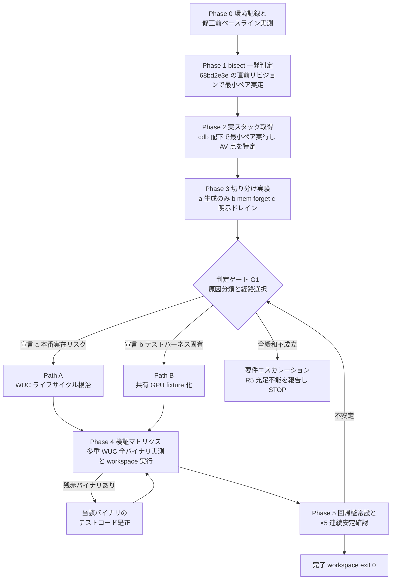

# Technical Design: wintf-gpu-test-crash

## Overview

**Purpose**: 本設計は、同一プロセス内で 2 個目の WUC（Windows.UI.Composition）グラフィックススタックを生成するテストが 100% 決定論的に `STATUS_ACCESS_VIOLATION (0xc0000005)` で死ぬクラッシュを根本原因から解消し、`cargo test --workspace` exit 0（全 spec の kiro-complete DoD Test Gate）を復旧させる。本 spec は全並行開発を閉塞するブロッカー解消 spec であり、W4 以降の全ウェーブがこの完了を前提とする。

**Users**: wintf メンテナと全 spec の完了担当開発者が、素の workspace 緑で DoD 判定できる状態を取り戻す。将来のゴースト再ロード／シェル切替の実装者が、「プロセス内 WUC スタック再生成の可否」の明文化された設計含意を得る。

**Impact**: 本設計は通常の機能追加ではなく、**調査先行の phase-gate 構造**を採る。根本原因が未確定（H-env vs H-code・クラッシュ点未特定）のため、Requirement 3 が義務付ける調査（bisect → cdb スタック取得 → 切り分け実験）を必須先行フェーズとし、その証拠に基づく判定ゲート G1 で修正経路（A: WUC ライフサイクル根治 / B: 共有 fixture / C: プロセス分離）を選択する。設計は調査プロトコル・判定基準・両経路のコンポーネント設計・検証マトリクス・回帰檻をすべて事前確定し、実装時の裁量を経路選択の証拠判定のみに限定する。

### Goals
- `cargo test -p wintf --test graphics` 91 テストを既定並列設定で決定論的に緑化し、×5 連続でクラッシュ・flake 0 件を達成する（1.1–1.4）
- `cargo test --workspace` exit 0 を復旧し、多重 WUC 生成構造を持つ全テストバイナリを実測検証・緑化する（2.1–2.4）
- 根本原因を bisect・デバッガ実スタック・切り分け実験の証拠付きで確定・記録する（3.1–3.3）
- 「プロセス内 WUC スタック再生成」の本番安全性を (a) 実在リスク / (b) テストハーネス固有 のいずれかとして明文宣言し、宣言に整合する修正を行う（4.1–4.3）
- 同一プロセス複数回 WUC 生成の回帰檻を graphics スイートに常設する（5.1–5.3）

### Non-Goals
- areka 側クレート（`areka-sylphya`／`areka-kanade`／`areka-ghost`／`areka-parsers`／`areka` bin／`areka-emo-text` 等）の**本番ソースコード**（非テストコード）の変更
- WUC 以外のレンダリング機能追加・graphics テストスイートの網羅範囲拡張（回帰檻以外の新規テスト追加）
- `areka-P0-sylphya` の完了処理（人間サインオフ待ちの別トラック）
- emo2 実機系（`AREKA_EMO2_REAL_RUN`）検証・32bit SHIORI 系の変更
- 外部 CI インフラの導入（検証は開発機ローカル `cargo test` 定石を維持＝1.5）

## Boundary Commitments

### This Spec Owns
- wintf の WUC リソースライフサイクル（`wuc_resource.rs`／`com/wuc.rs`／`GraphicsCore` 寿命）の是正（根因が本番リスクと宣言された場合）
- 同一プロセス多重 WUC 生成構造を持つ**全テストバイナリのテストコード（テストハーネス）**の是正 — wintf に限らず areka／areka-emo-text／areka-emo-present を含む全クレートで許容（開発者裁定 2026-07-24）
- 根本原因記録と本番設計含意の明文化（証拠・宣言の正本は本 spec の `research.md`）
- 回帰檻テスト（`wintf --test graphics` 内）の新設と維持
- 修正が Approach B に転んだ場合の graphics テストハーネス構造（共有 fixture）の単独所有 — 後続 spec（W4 emo-dpi-scaling・W5 kero-balloon）は本 spec 完了後に rebase する（brief 追記㊹エスケープ条項）

### Out of Boundary
- 全クレートの本番ソースコード（非テストコード）のうち wintf 以外 — 根因が wintf 側にある限り不要のはずであり、areka 系の緑化は wintf 根因修正の波及で得る（2.2）
- wintf 本番コードであっても、根因と無関係な機能変更・リファクタリング
- Defender 飢餓 flake・kanade/ghost 協調ループの既知問題（別知見で管理済み）
- ロードマップ上の後続ウェーブ仕様（position-persist／choice-interact／emo-dpi-scaling 等）の内容

### Allowed Dependencies
- `windows` crate 既存バインディング（`DispatcherQueueController::ShutdownQueueAsync` は導入済み依存の範囲内・新規 crate 依存なし）
- `wintf-winmsg-executor` のメッセージポンプ相当機能（ドレイン待ちのポンプは `wuc_spike.rs` と同型の素朴ループで足りるため、原則新規依存なし）
- 調査ツール: cdb/WinDbg（Windows SDK Debugging Tools・リポジトリ外の開発機ツール）・git（bisect 用チェックアウト）
- テストコードから wintf 公開 API への依存（既存方向を維持・逆流禁止）

### Revalidation Triggers
- `WucGraphicsResource` の公開 API 形状変更（`shutdown_blocking` 追加等）→ wintf 利用側（areka 系）はコンパイル互換を確認
- **Approach B 採用時**: `crates/wintf/tests/graphics/*` のハーネス構造変更 → W4 emo-dpi-scaling（graphics テスト増設面）・W5 kero-balloon（areka `spine.rs` 檻域）は本 spec の構造へ rebase 必須
- 「プロセス内 WUC スタック再生成の可否」宣言の内容 → 将来のゴースト再ロード／シェル切替 spec は本宣言を設計前提として参照
- 本番 `WinApp` 終了経路（`runtime/mod.rs`）へ明示 shutdown を結線した場合 → 終了規律（`ShutdownPolicy`）に依存する spec は再確認

## Architecture

### Existing Architecture Analysis

- **WUC ライフサイクルの現状**: `WucGraphicsResource`（`crates/wintf/src/ecs/graphics/wuc_resource.rs`）は `Option<WucGraphicsResourceInner>` 遅延初期化。`Inner` は宣言順 drop（`compositor` → `graphics_device` → `dq_controller`）のみに依存し、**`ShutdownQueueAsync` の明示発行・完了ドレインは存在しない**。丁寧な終了シーケンスは `examples/wuc_spike.rs`（発行→`Status()` ポーリング→controller 最後 drop）にのみ実証されている。
- **スレッド束縛**: `create_dispatcher_queue_controller`（`com/wuc.rs:126-135`）は `DQTYPE_THREAD_CURRENT`＝生成スレッド束縛。libtest は `#[test]` ごとに別スレッドを spawn するため、各テストの WUC スタックは別スレッドに束縛される。
- **テストハーネスの現状**: `tests/graphics.rs` が 14 ドメインファイルを 1 バイナリへ束ねる（`structure.md` テスト入口固定化規約）。`setup_world()` は共有されず 8 ファイルが同型コピーを個別保持。共通モジュール `tests/graphics/common/` は存在しない。
- **クラッシュ法則（brief 実測・正本）**: 同一プロセス 2 個目の WUC スタック生成テストが逐次実行でも 100% AV。1 個目は常に緑。特定テスト非依存。repo 無変更のまま 2026-07-23 の「×5 連続緑」実績から転落＝環境ドリフト（H-env）が最有力、対抗仮説 H-code（`68bd2e3e` の `CoIncrementMTAUsage` 常駐）は bisect で判定する。gap analysis のコード調査は「graphics バイナリは `WicCore` を一切参照しない」ことを確認済みで H-env 側に傾くが、bisect による直接判定は 3.1 が明示要求する。

### Architecture Pattern & Boundary Map

選択パターン: **Phase-gate（調査先行→判定ゲート→条件付き是正）**。根因確定（R3）が修正経路選択（R4）の前提であるという要件構造に 1:1 で適合させる。即時 Path B 先行（緑化優先）は R3/R4 違反として棄却、即時 Path C は R3/R5 未充足として最終避難路にのみ保持（評価の詳細は `research.md` 設計フェーズ追記）。



**Architecture Integration**:
- 既存パターン維持: `Option<Inner>` 遅延初期化・宣言順 drop・`XxxResource` 命名・テスト入口固定化・log-first（`error!`＋`Err`・無音失敗禁止）
- 新規要素の根拠: 明示 shutdown（Path A）は `wuc_spike.rs` 実証済みパターンの本体昇格であり新規発明ではない。共有 fixture（Path B）は `tests/{domain}/common/mod.rs` 規約への準拠
- Steering 準拠: WUC＝MTA スレッド・`DQTAT_COM_NONE` 規約（`tech.md`）と整合させる。修正は決定論必達（×N 連続緑判定）

### Technology Stack

| Layer | Choice / Version | Role in Feature | Notes |
|-------|------------------|-----------------|-------|
| Graphics/COM | `windows` 0.62.2（既存） | `DispatcherQueueController::ShutdownQueueAsync`・`Status()` | 新規依存なし・既存バインディング範囲内 |
| Test 基盤 | cargo test（libtest・既存） | 全検証の実行系（外部 CI 無し・1.5） | `--test-threads=1`／`--exact` を診断に併用 |
| 調査ツール | cdb/WinDbg（Windows SDK） | AV 実スタック取得（3.2） | 開発機ツール・リポジトリ非同梱。`cdb -g -G -o target\debug\deps\graphics-*.exe --test-threads=1 --exact <最小ペア>` |
| 調査ツール | git checkout（手動 bisect） | `68bd2e3e~1`（=`31d5fe71`）実走（3.1） | ワークツリー汚染を避けるため別ディレクトリ checkout 推奨 |

## File Structure Plan

経路非依存（無条件）の成果物と、判定ゲート G1 の出力で確定する条件付き成果物に分けて示す。

### Directory Structure（新規・無条件）

```
.kiro/specs/wintf-gpu-test-crash/
└── research.md                          # 「根本原因記録」節を実装フェーズで新設（3.1-3.3, 4.1 の証拠・宣言の正本）

crates/wintf/tests/graphics/
└── wuc_restart_regression_test.rs       # 新規: 回帰檻（5.1-5.3）。独立 2 #[test] ＋ 単一テスト内再生成の 2 形態
```

### Modified Files（無条件）
- `crates/wintf/tests/graphics.rs` — `wuc_restart_regression_test` の `#[path]` mod 追記（束ね役のみ・規約どおり）
- `crates/wintf/src/com/wuc.rs` — ドレイン用ヘルパ `drain_dispatcher_queue`（`ShutdownQueueAsync` 発行→`Status()` ポーリング→タイムアウト保険）を**無条件**で追加（`wuc_spike.rs:162-191` パターンの関数化）。C7 回帰檻が採用経路（A/B）によらず明示 teardown に使用する正準手段であり、Path A 採用時は `Drop`／`shutdown_blocking`／spike の 3 者もこれを共用する

### Modified Files（Path A 採用時 — 宣言 (a) 本番実在リスク）
- `crates/wintf/src/ecs/graphics/wuc_resource.rs` — `WucGraphicsResourceInner` に `Drop` 実装（`ShutdownQueueAsync` 発行＋有界ドレイン・log-first・panic-free）を追加し、明示 API `shutdown_blocking(timeout)` を新設。既存の宣言順 drop 不変条件（controller 最後）は維持。ドレインの実体は無条件成果物 `drain_dispatcher_queue`（`com/wuc.rs`）を共用
- `crates/wintf/src/runtime/mod.rs` — （根因が本番終了経路にも波及すると判定された場合のみ）`WinApp` 終了経路への明示 shutdown 結線
- `crates/wintf/examples/wuc_spike.rs` — （必要時のみ）ヘルパ関数化後の呼び替え（挙動等価）

### Modified Files（Path B 採用時 — 宣言 (b) テストハーネス固有・縮退経路）
- `crates/wintf/tests/graphics/common/mod.rs` — 新規: 共有 GPU fixture（専用オーナースレッド常駐＋クロージャ marshal・B1 形）
- `crates/wintf/tests/graphics/{clip_sync_system_test,components_test,window_pos_systems_test,reinit_unit_test,dcomp_integration_test,surface_systems_test,surface_pixel_equivalence_test}.rs` — 各 `setup_world()` を fixture 委譲へ置換（7+1 ファイル・同型変更）
- 他クレートのテストコード（検証マトリクスで赤のバイナリのみ・同型委譲）: `crates/areka/src/emo2_boot/spine.rs`（`#[cfg(test)]` 部の `make_world_with_gpu()`）・`crates/areka-emo-text/tests/*.rs`・`crates/areka-emo-text/src/actor.rs`（`#[cfg(test)]` 部）・`crates/wintf/tests/visual/common/mod.rs`・wintf in-source テスト該当箇所。fixture はバイナリごとにローカル複製（〜50 行規模）とし、横断共有 crate は新設しない（投機的抽象の回避）

### Path C（最終避難路・G1 で A/B とも不成立と判定された場合のみ）
- `crates/wintf/Cargo.toml` — `[[test]]` 分割によるドメイン別バイナリ化。採用時は R3/R5 の充足不能を明示報告した上での縮退であり、単独では本 spec の DoD を満たさない（エスカレーション随伴）

## System Flows

Phase-gate 全体フローは Architecture 節の図が正本。ここでは判定ゲート G1 の判定表のみ補足する。

### 判定ゲート G1 — 入力・判定・出力

| 入力（Phase 1-3 の証拠） | 判定 | 出力（宣言と経路） |
|---|---|---|
| bisect: `68bd2e3e~1` でも AV | H-env 確定（3.1） | 環境ドリフトを根因記録に記載。クラッシュ点分類（下記）で経路判定へ |
| bisect: `68bd2e3e~1` で緑 | H-code 確定（3.1） | `68bd2e3e`（MTA 常駐）差分を精査し是正＝Path A 系（本番コード起因のため宣言 (a) が既定） |
| cdb スタック: 前 world の teardown 残骸（DispatcherQueue／composition DLL 内部）が 2 個目の生成・操作を破壊 | teardown 欠陥＝本番の再生成シナリオも同経路を踏む | **宣言 (a) 本番実在リスク → Path A 必須**（4.2） |
| cdb スタック＋実験 (b)（`mem::forget` で 2 個目が通る）: teardown 犯人説成立 | 同上 | 同上 |
| cdb スタック: libtest のスレッド分離・テスト並行構造に固有で、本番の単一 UI スレッド逐次再生成では踏み得ない | テスト構造固有 | **宣言 (b) テストハーネス固有 → Path A の縮小適用（drop ドレインのみ）または Path B を選択可**（4.3） |
| 実験 (c): 明示 `ShutdownQueueAsync` ドレイン挿入で 2 個目が緑 | 安全再生成プロトコル成立 | プロトコルを確定し、回帰檻（C7）と Path A 実装の正準手順とする |
| 実験 (a)(b)(c) すべて不成立（環境がプロセス内再生成を全面禁止） | 緩和不能 | **要件エスカレーション**: 5.1+5.2 はいかなる設計でも充足不能。設計内で糊塗せず STOP し要件再交渉（Path C は 1.x/2.x のみの部分充足） |
| **証拠が分類不能・相互競合**（cdb スタックがドライバ DLL 内部等で teardown 由来ともテスト構造固有とも断定できない／bisect と cdb の示唆が矛盾する 等） | **保守側既定則**（開発者裁定 2026-07-24・設計ディスカッション議題1） | **宣言 (a)（本番実在リスク扱い）を既定とし Path A を選択する**。根拠＝誤りコストの非対称性（(a) 誤宣言は無害な過剰防御・(b) 誤宣言は本番 AV 見逃し）。根本原因記録には「既定則適用（分類不能）」である旨と入手済み証拠を明記する |

ゲート運用規則: G1 の宣言（(a)/(b)）と選択経路・全証拠は `research.md`「根本原因記録」節へ記録した上で Phase 4 へ進む。宣言 (a) で Path B を選ぶことは要件違反（4.2）であり禁止。証拠が分類不能・競合の場合は上記の保守側既定則により宣言 (a)＝Path A へ倒す（裁量の再侵入を構造的に遮断）。

## Requirements Traceability

| Requirement | Summary | Components | Interfaces | Flows |
|-------------|---------|------------|------------|-------|
| 1.1 | graphics 91 テスト既定並列で AV なし | C3/C4（G1 選択）・C6 | `shutdown_blocking` または `with_shared_gpu` | Phase 4 |
| 1.2 | `--test-threads=1` 逐次で任意組み合わせ AV なし | C3/C4・C6 | 同上 | Phase 4 |
| 1.3 | 既知最小ペアのクラッシュなし完走 | C3/C4・C6 | 同上 | Phase 4（マトリクス行 1） |
| 1.4 | ×5 連続フルスイートで crash/flake 0 | C6 | 検証マトリクス実行手順 | Phase 5 |
| 1.5 | ローカル `cargo test` 定石の維持 | C3/C4/C6/C7 | — | 全フェーズ（外部 CI 導入なし） |
| 2.1 | `cargo test --workspace` exit 0 | C6 | 検証マトリクス実行手順 | Phase 4 総括行 |
| 2.2 | areka bin 緑化（本番ソース無変更） | C3 の波及／C4 同型委譲 | — | Phase 4 |
| 2.3 | 多重 WUC 全バイナリの実測検証 | C6 | 検証マトリクス（7 グループ母集団） | Phase 4 |
| 2.4 | 同種クラッシュ確認時は本 spec 内で緑化 | C6 → C4 同型委譲ループ | — | Phase 4 残赤ループ |
| 3.1 | bisect による H-env/H-code 確定 | C1 | bisect 手順・証拠様式 | Phase 1 |
| 3.2 | クラッシュ点の証拠付き特定 | C1 | cdb 手順・切り分け実験 a/b/c | Phase 2-3 |
| 3.3 | 本番波及時の含意明記 | C2 | G1 判定表・根本原因記録 | G1 |
| 4.1 | ハザード (a)/(b) の明文宣言 | C2 | G1 判定表・根本原因記録 | G1 |
| 4.2 | (a) なら本番 WUC ライフサイクル是正 | C3 | `Drop`＋`shutdown_blocking` | Path A |
| 4.3 | (b) ならテストハーネス是正を選択可 | C4 | `with_shared_gpu` | Path B |
| 5.1 | プロセス内 2 回以上生成の回帰テスト | C7 | 檻 2 形態（独立 2 テスト＋単一内再生成） | Phase 5 |
| 5.2 | 回帰檻が graphics スイート内で安定成功 | C7・C6 | — | Phase 5 |
| 5.3 | 再発時に必ず失敗（サイレント成功なし） | C7 | AV＝プロセス死でバイナリ失敗（検出保証） | Phase 5 |

## Components and Interfaces

| Component | Domain/Layer | Intent | Req Coverage | Key Dependencies (P0/P1) | Contracts |
|-----------|--------------|--------|--------------|--------------------------|-----------|
| C1 InvestigationProtocol | 調査（手順・非コード） | bisect・cdb・切り分け実験で根因証拠を確定 | 3.1, 3.2 | cdb/WinDbg (P0)・git (P0) | Batch |
| C2 DecisionGateG1 | 調査（判定） | 原因分類の明文宣言と経路選択 | 3.3, 4.1 | C1 の証拠 (P0) | State |
| C3 WucLifecycleFix (Path A) | wintf 本番（graphics） | `Inner` drop への有界ドレイン内蔵＋明示 shutdown API | 1.1–1.3, 2.2, 4.2 | `windows` crate (P0)・`wuc_spike.rs` パターン (P2) | Service |
| C4 SharedGpuFixture (Path B) | テストハーネス | 専用オーナースレッド共有 fixture（B1 形） | 1.1–1.3, 2.4, 4.3 | wintf 公開 API (P0) | Service |
| C5 ProcessSeparation (Path C) | テスト構成 | `[[test]]` 分割（最終避難路） | 1.1 部分 | Cargo (P0) | — |
| C6 VerificationMatrix | 検証（手順） | 多重 WUC 全バイナリの実測と workspace 総括 | 1.1–1.4, 2.1, 2.3, 2.4 | C3/C4 の成果 (P0) | Batch |
| C7 RegressionCage | テスト（wintf graphics） | 再生成クラッシュの恒久檻 | 5.1–5.3 | C2 確定プロトコル (P0) | — |

### 調査・判定レイヤ

#### C1: InvestigationProtocol

| Field | Detail |
|-------|--------|
| Intent | 根本原因を証拠（bisect 結果・実スタック・切り分け実験）で確定する調査手順の規定 |
| Requirements | 3.1, 3.2 |

**Responsibilities & Constraints**
- Phase 0: 環境記録＋修正前ベースライン実測 — GPU/ドライバ版数・直近 Windows Update 履歴を取得し記録（H-env の裏取り・証拠様式の一部）。加えて**未実測の多重 WUC バイナリ（C6 マトリクス行 3–7・最低限 `areka-emo-text` の `draw_readback_test` と wintf visual）の修正前ベースラインを実測**し根本原因記録へ記載する——現状緑なら「なぜ graphics だけ落ちるか」の差分自体が根因ヒントとなり、是正後実測との区別（元から緑 vs 修正の波及で緑化）を不可逆に失わないための必須先行取得（2.3, 3.2）
- Phase 1: bisect 一発判定 — `68bd2e3e~1`（=`31d5fe71`）を**別ディレクトリへ checkout**してビルドし、最小再現ペア（`cargo test -p wintf --test graphics -- --test-threads=1 --exact clip_sync_system_test::clip_sync_applies_all_clip_shape_variants clip_sync_system_test::clip_sync_clears_clip_when_clip_is_none`）を実走。AV なら H-env・緑なら H-code 確定（3.1）
- Phase 2: 実スタック取得 — cdb 配下（`cdb -g -G -o <graphics テストバイナリ> --test-threads=1 --exact <最小ペア>`）で AV 時の `k`（コールスタック）・faulting module を取得。クラッシュ点を「WUC 生成時／前 world teardown 由来／schedule 実行中」のいずれかに分類（3.2）。cdb 不調時の代替: WER フルダンプ有効化→WinDbg 事後解析
- Phase 3: 切り分け実験 — (a) 2 個目を「生成のみ・schedule 無し」に縮めて生死確認 (b) 1 個目 world を `std::mem::forget` して teardown 犯人説を直接検証 (c) 1 個目 teardown に明示 `ShutdownQueueAsync` ドレインを挿入して 2 個目の生死確認（＝Path A の事前効果検証）。実験コードは一時変更であり最終ツリーへコミットしない
- areka bin（`spine_e2e_kero_blink_one_cycle_golden`）は `WicCore` 経由の動線差があるため、wintf graphics と同一原因と決めつけず、wintf 側根因確定後に波及検証で個別確認する（gap analysis 所見の踏襲）

**Dependencies**
- External: cdb/WinDbg — スタック証拠取得（P0）／git — 旧リビジョン取得（P0）

**Contracts**: Batch [x]

##### Batch / Job Contract
- Trigger: 実装フェーズ冒頭（他の全作業に先行・必須）
- Input / validation: brief の診断マトリクス・最小再現ペア（正本）
- Output / destination: `research.md`「根本原因記録」節 — bisect 判定（H-env/H-code）・実スタック全文・切り分け実験 3 件の生死表・環境記録
- Idempotency & recovery: 各 Phase は独立再実行可能。bisect ビルド不成立時は `Cargo.lock` 固定で再試行し、なお不成立ならタイムライン証拠（`68bd2e3e` コミットメッセージの ×5 緑記録）を代替証拠として明記の上 Phase 2 へ進む

#### C2: DecisionGateG1

| Field | Detail |
|-------|--------|
| Intent | C1 の証拠から原因分類を明文宣言し、修正経路と安全再生成プロトコルを確定する |
| Requirements | 3.3, 4.1 |

**Responsibilities & Constraints**
- System Flows 節の判定表に従い、(a) 本番実在リスク / (b) テストハーネス固有 のいずれかを**明文で宣言**（4.1）。宣言 (a) → Path A 必須（4.2）・宣言 (b) → Path A 縮小適用または Path B 選択可（4.3）
- 根因が本番 WUC リソースライフサイクルに波及する場合、ゴースト再ロード・シェル切替への含意を根本原因記録に明記（3.3）
- 実験 (c) の結果から「安全再生成プロトコル」（例: 明示ドレイン→drop→再生成）を確定し、C3 実装と C7 檻の正準手順として引き渡す
- **エスカレーション条項**: 実験 (a)(b)(c) すべて不成立＝プロセス内再生成が環境的に全面不能の場合、5.1+5.2 は充足不能。design/実装内で糊塗せず、証拠を添えて要件再交渉へ STOP する

**Contracts**: State [x]

##### State Management
- State model: `未判定 → 証拠収集完了 → 宣言(a)|宣言(b)|エスカレーション`（後戻りは Phase 5 不安定時の再判定のみ）
- Persistence & consistency: 宣言・証拠・選択経路は `research.md`「根本原因記録」節が単一の正本
- Concurrency strategy: 該当なし（人間＋実装エージェントの逐次判定）

### 是正レイヤ（G1 の出力で択一・両経路とも事前設計）

#### C3: WucLifecycleFix（Path A — 宣言 (a) 時は必須・本命）

| Field | Detail |
|-------|--------|
| Intent | `WucGraphicsResourceInner` の解放経路に `ShutdownQueueAsync` 有界ドレインを内蔵し、プロセス内再生成を安全化する |
| Requirements | 1.1, 1.2, 1.3, 2.2, 4.2 |

**Responsibilities & Constraints**
- `Inner` の `Drop` にドレインを内蔵（テスト・本番・`invalidate()` の全解放経路を無改修でカバー）。既存呼び出し側 91+ テストへの個別 teardown 追加はしない——漏れが必然のため
- 宣言順 drop 不変条件（controller 最後）は維持。ドレインは controller drop の**前**に発行・完了待ちする
- ドレインは有界（既定タイムアウト・目安 2s＝`wuc_spike.rs` 実測値）・log-first（タイムアウトや失敗は `warn!`/`error!` で必ず可視化・無音失敗禁止）・panic 中 drop でも panic-free（`Drop` 内は `Result` を握り潰さずログ化のみ）
- 呼び出しスレッド＝生成スレッド前提（`DQTYPE_THREAD_CURRENT` 束縛と整合。テストではテストスレッド・本番では UI スレッド上で drop される既存挙動に乗る）
- 本番 `WinApp` 終了経路（`runtime/mod.rs`）への明示結線は、cdb 証拠が本番終了経路の波及を示した場合のみ実施（それ以外は `Drop` 内蔵で足りる）

**Dependencies**
- Outbound: `windows::System::DispatcherQueueController::ShutdownQueueAsync`／`IAsyncAction::Status`（P0）
- Inbound: `WucGraphicsResource::invalidate()`・World drop・（条件付き）`WinApp` 終了経路

**Contracts**: Service [x]

##### Service Interface
```rust
impl WucGraphicsResource {
    /// DispatcherQueue を明示 shutdown し、完了までドレインしてから inner を解放する。
    /// 回帰檻・切り分け実験 (c)・本番終了経路（結線時）が使用する観測可能 API。
    pub fn shutdown_blocking(&mut self, timeout: std::time::Duration) -> windows::core::Result<()>;
}

impl Drop for WucGraphicsResourceInner {
    /// ShutdownQueueAsync 発行＋有界ドレイン（best-effort・log-first・panic-free）。
    /// 失敗・タイムアウトは warn!/error! で可視化し、drop 自体は必ず完了する。
    fn drop(&mut self);
}
```
- Preconditions: 呼び出しスレッド＝当該 WUC スタックの生成スレッド
- Postconditions: `shutdown_blocking` 成功時は `is_valid() == false` かつ DispatcherQueue 停止済み。タイムアウト時も `inner = None`（warn ログ付き）
- Invariants: controller は compositor より後に drop（宣言順維持）。ドレインループはタイムアウト保険付きで無限待機しない

**Implementation Notes**
- Integration: `wuc_spike.rs:162-191` のドレインループ（発行→`Status()` != Started で抜け→2s 保険）を `com/wuc.rs` のヘルパ関数へ昇格し、`Drop`／`shutdown_blocking`／spike の 3 者で共用
- Validation: 既存 in-source テスト `wuc_graphics_resource_lifecycle` の緑維持＋C7 檻＋C6 マトリクスで判定
- Risks: drop 内メッセージポンプの実行時間増（91 テストで最大数百 ms・許容）。実験 (c) が「ドレインでも死ぬ」を示した場合、本コンポーネントの前提が崩れるため G1 へ差し戻して再判定

#### C4: SharedGpuFixture（Path B — 宣言 (b) 時のみ選択可・縮退経路）

| Field | Detail |
|-------|--------|
| Intent | プロセス内 1 個の WUC スタックを専用オーナースレッドで所有し、テストはクロージャ marshal で GPU 操作を実行する |
| Requirements | 1.1, 1.2, 1.3, 2.4, 4.3 |

**Responsibilities & Constraints**
- **B1 形が正**: fixture は初回利用時に専用スレッドを起動し、そのスレッド上で `CoInitializeEx(MULTITHREADED)`→`GraphicsCore::new`→`WucGraphicsResource::new` を 1 度だけ実行。テストはチャネル経由でクロージャを送り、オーナースレッド上で実行して結果を受け取る（WUC スレッド親和性を構造的に保証・GPU テストは自然に直列化）
- 素朴な `OnceLock<World>` 直接共有は禁止（`DQTYPE_THREAD_CURRENT` 束縛違反・`unsafe impl Send/Sync` の SAFETY 条件「同時呼び出しなし」を fixture 側で保証できない）
- 配置は `tests/{domain}/common/mod.rs` 規約に従う。他クレートで必要になった場合はバイナリごとにローカル複製（〜50 行）とし、横断共有 crate は新設しない（投機的抽象の回避・`structure.md` のクレート境界規律維持）
- C7 の檻テストは本 fixture を**意図的にバイパス**する（檻の意味＝素の再生成検証を保つ）

**Dependencies**
- Outbound: wintf 公開 API（`GraphicsCore`/`WucGraphicsResource`）— P0
- Inbound: graphics 各ドメインテストの `setup_world()` 置換部

**Contracts**: Service [x]

##### Service Interface
```rust
// crates/wintf/tests/graphics/common/mod.rs（Path B 採用時のみ新設）
/// プロセス共有 GPU オーナースレッド上でクロージャを実行する。
/// World は毎回新規生成してよいが、WUC スタックはオーナースレッド所有の 1 個を再利用する。
pub fn with_shared_gpu<T: Send + 'static>(
    f: impl FnOnce(&mut bevy_ecs::world::World) -> T + Send + 'static,
) -> T;
```
- Preconditions: なし（初回呼び出しで遅延初期化）
- Postconditions: クロージャはオーナースレッド上で完走済み。panic はテストスレッドへ転送（テスト失敗として観測可能・サイレント成功なし）
- Invariants: WUC スタック生成はプロセス内 1 回のみ。クロージャ実行は直列

**Implementation Notes**
- Integration: 各テストの `setup_world()` 呼び出しを `with_shared_gpu(|world| { ... })` へ機械的に置換（テスト本体のアサーションは不変）
- Validation: C6 マトリクスで対象バイナリ緑化を確認
- Risks: テスト独立性の低下（brief 既記）。1 テストの GPU 状態汚染が後続へ漏れ得るため、クロージャ冒頭で fresh `World` を組み立てる（共有は WUC スタックのみに限定）

#### C5: ProcessSeparation（Path C — 最終避難路・summary のみ）

`crates/wintf/Cargo.toml` の `[[test]]` 分割でドメイン別バイナリ化し「同一プロセス複数生成」の前提自体を消す。確実に緑化するが 3.x/5.x を満たさないため、G1 エスカレーション条項の随伴縮退としてのみ採用可（単独では本 spec の DoD 未達）。設計詳細は採用決定時に G1 記録へ追記する。

### 検証レイヤ

#### C6: VerificationMatrix

| Field | Detail |
|-------|--------|
| Intent | 多重 WUC 生成構造を持つ全テストバイナリの実測検証と workspace 総括判定 |
| Requirements | 1.1, 1.2, 1.3, 1.4, 2.1, 2.3, 2.4 |

**Responsibilities & Constraints**
- 母集団（research.md 設計フェーズ追記のインベントリが正本・7 グループ）を全数実測する:

| # | 対象バイナリ | コマンド | 既知状態 |
|---|---|---|---|
| 1 | wintf graphics | `cargo test -p wintf --test graphics`（既定並列）＋ `--test-threads=1` ＋ 最小ペア `--exact` | 💥 確認済み（1.1–1.3） |
| 2 | areka bin | `cargo test -p areka`（`spine_e2e_kero_blink_one_cycle_golden` 含む） | 💥 確認済み（2.2） |
| 3 | wintf visual | `cargo test -p wintf --test visual` | 未実測（2.3） |
| 4 | wintf lib | `cargo test -p wintf --lib` | 未実測（2.3） |
| 5 | areka-emo-text lib | `cargo test -p areka-emo-text --lib` | 未実測（2.3） |
| 6 | areka-emo-text 統合各バイナリ | `cargo test -p areka-emo-text --test <each>`（draw_readback_test 優先） | 未実測（2.3） |
| 7 | areka-emo-present | `cargo test -p areka-emo-present` | 未実測（2.3） |
| 総括 | workspace | `cargo test --workspace` → exit 0 | 💥 現状 exit 非 0（2.1） |
| 安定 | graphics ×5 | `cargo test -p wintf --test graphics` を 5 連続・crash/flake 0（1.4） | — |

- 是正適用後に赤が残るバイナリは、当該バイナリの**テストコードのみ**を C4 同型委譲（または C3 波及確認）で是正し再実測（2.4・スコープ拡大裁定済み）
- 前提: workspace テストは i686 host-32 成果物のビルドを先行させる（memory `workspace-test-needs-i686-host32-artifacts`）。Defender 起因の協調テスト flake は既知の別問題として切り分け、本マトリクスの AV 判定に混入させない

**Contracts**: Batch [x]

##### Batch / Job Contract
- Trigger: Phase 4（是正適用後）・Phase 5（×5 安定確認）
- Input / validation: C3/C4 適用済みツリー
- Output / destination: 実測結果表（`research.md` 根本原因記録節へ追記）・`cargo test --workspace` exit code
- Idempotency & recovery: 全行再実行可能。flake 疑義時は当該行を追加実走し AV（決定論）と環境 flake（Defender 等）を区別して記録

#### C7: RegressionCage

| Field | Detail |
|-------|--------|
| Intent | 同一プロセス複数回 WUC 生成の回帰を恒久検出する檻テスト |
| Requirements | 5.1, 5.2, 5.3 |

**Responsibilities & Constraints**
- 新規ファイル `crates/wintf/tests/graphics/wuc_restart_regression_test.rs` に **2 形態**を常設:
  1. **独立 2 `#[test]` 形**（`wuc_stack_a_full_cycle`／`wuc_stack_b_full_cycle`）: 各々がフルスタック生成→最小合成操作（`CreateSpriteVisual` 等）→G1 確定プロトコルで teardown。libtest の別スレッド・別実行単位という実クラッシュ様式を忠実に再現し、どちらが「プロセス内 2 個目」になっても法則を踏む
  2. **単一テスト内再生成形**（`wuc_stack_recreate_in_single_test`）: 同一 `#[test]` 内で 生成→teardown→再生成→最小操作。単独実行でも決定論的に再生成を検証（既存 in-source `wuc_graphics_resource_lifecycle` が覆えない「完全解放後の再生成」を明示検証）
- teardown は G1 で確定した安全再生成プロトコルを常用: Path A 採用時は `shutdown_blocking` を明示検証に使用（`Drop` 内蔵ドレインの重畳は無害）・Path B 採用時は無条件成果物 `drain_dispatcher_queue`（`com/wuc.rs`）を直接呼んでから drop する——いずれの経路でも檻の明示ドレイン手段は成果物として確保されており宙に浮かない
- Path B 採用時も本ファイルは共有 fixture を**バイパス**して素のスタック生成を行う（檻の意味を保つ）
- 検出保証（5.3）: 再発時は `STATUS_ACCESS_VIOLATION`＝プロセス死でテストバイナリ全体が失敗するため、サイレント成功は構造的に不可能。アサーション追加による偽陰性の余地なし
- `tests/graphics.rs` へ `#[path]` mod 追記（束ね役規約維持）。graphics スイートの一部として並列既定・逐次の双方で安定成功すること（5.2＝1.4 の ×5 判定に内包）

## Error Handling

### Error Strategy
- **AV はプロセス死であり捕捉不能** — 検出はテストバイナリの exit code（libtest 失敗）で行い、診断は cdb/WinDbg のスタック証拠で行う（C1）。テストコード内でのリカバリは設計しない
- **teardown 経路は log-first** — `Drop`／`shutdown_blocking` のドレイン失敗・タイムアウトは `warn!`/`error!` で必ず可視化し `Err` を返す（明示 API）。無音失敗経路は作らない（memory `areka-log-first-no-silent-failure` 準拠）
- **有界性** — 全ドレイン待ちはタイムアウト保険付き（既定 2s・`wuc_spike.rs` 実測踏襲）。無限待機・ハングを構造的に排除

### Error Categories and Responses
- **調査フェーズの失敗**: bisect ビルド不成立 → `Cargo.lock` 固定再試行 → なお不可ならタイムライン証拠を代替として明記（C1 recovery）。cdb 取得不能 → WER フルダンプ→WinDbg 事後解析へ切替
- **是正フェーズの失敗**: 実験 (c) 不成立（ドレインでも死ぬ）→ C3 前提崩壊として G1 差し戻し。全緩和不成立 → エスカレーション条項（C2）
- **検証フェーズの失敗**: マトリクス残赤 → 当該バイナリのテストコード是正ループ（C6）。×5 で flake → AV（決定論・G1 差し戻し）と環境 flake（Defender 等・別知見管理）を区別して処置

### Monitoring
- teardown ドレインの発行・完了・タイムアウトを `tracing` で構造化ログ出力（`[WucGraphicsResource]` プレフィクス・既存ログ規約踏襲）。回帰檻・実機検証時のログ grep 判定（memory `areka-real-machine-signoff-bounded-auto-exit` の様式）に使える形を保つ

## Testing Strategy

### Unit Tests
- `wuc_graphics_resource_lifecycle`（既存 in-source）: Path A 適用後も緑維持（new/invalidate/drop の後方互換）
- `shutdown_blocking` の正常系: 生成→明示 shutdown→`is_valid()==false`・`Ok(())`（Path A 時・in-source 追加）
- `shutdown_blocking` のタイムアウト系: 到達不能な短時間 timeout でも panic せず warn ログ＋`inner=None`（log-first 検証）

### Integration Tests（回帰檻＝C7）
- `wuc_stack_a_full_cycle`／`wuc_stack_b_full_cycle`: 独立 2 テストによるプロセス内 2 個目生成の実様式再現（5.1, 5.3）
- `wuc_stack_recreate_in_single_test`: 単一テスト内 生成→teardown→再生成 の決定論検証（5.1）
- 既知最小ペア（`clip_sync_applies_all_clip_shape_variants` → `clip_sync_clears_clip_when_clip_is_none`・`--exact` 逐次）: 修正後の緑化確認（1.3）

### System Verification（C6 マトリクス）
- graphics 既定並列＋逐次＋×5 連続（1.1, 1.2, 1.4）・多重 WUC 全 7 グループ実測（2.3）・`cargo test --workspace` exit 0（2.1・i686 成果物ビルド先行）
- areka bin `spine_e2e_kero_blink_one_cycle_golden` の本番ソース無変更緑化（2.2）

### Performance/Load
- Path A: drop ドレイン追加による graphics スイート実行時間の増分を Phase 5 で実測記録（目安: 91 テストで数百 ms 以内・逸脱時は timeout 値を見直し）
- Path B: 直列化によるスイート実行時間を実測記録（DoD 判定には影響しない参考値）
