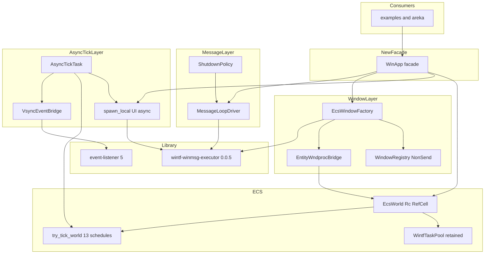
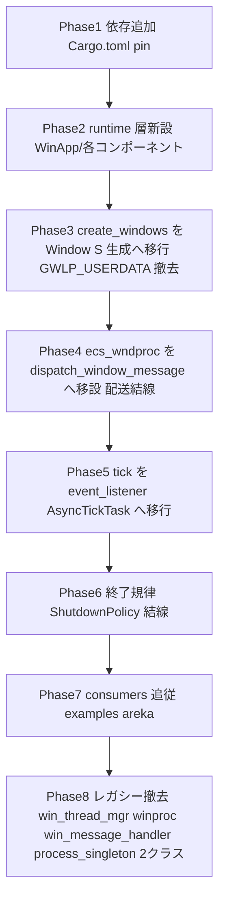

# 技術設計書: wintf-winmsg-executor

## Overview

本仕様は、wintf の UI スレッド基盤（メッセージループ・ウィンドウ生成・UI スレッド async・60Hz ECS tick 起床）を、自作実装から外部クレート `wintf-winmsg-executor` v0.0.5 ベースへ置き換える横断リファクタである。自作の `PeekMessageW` ポンプ、`GWLP_USERDATA` 手詰め、`async-executor` 手組み executor を撤去し、`MessageLoop`/`block_on`/`spawn_local`/`util::Window<S>` へ写像する。スレッド跨ぎ起床は `event_listener` で実現し、tokio 非依存を維持する。

**Purpose**: wintf 開発者に対し、Windows 低レベル知見に基づく洗練された UI スレッド基盤を提供し、自作コードの不正確な挙動リスクとトラブル余地を縮小する。

**Impact**: 公開 facade `WinThreadMgr` を撤去し、`wintf-winmsg-executor` ベースの新 facade（本設計で `WinApp` と命名）へ全面置換する（議題①確定・Option B）。`WinThreadMgr`／`winproc`／`win_message_handler`／自作 `ecs_wndproc`／2 クラス登録（`process_singleton`）を撤去し、全 examples ＋ areka 本体を新 API へ追従改修する。背景ワーカープール `WintfTaskPool`（`world.spawn` 経路）は別レイヤとして温存する（議題②確定）。

本設計の判断は確定済み requirements.md ＋ research.md に基づく。先進坑 `pilot/wintf-winmsg-executor` の検証結果（go 判定・起床安定性・再入整合）は先進坑 README を正本とし二重化しない（要件 7.4）。

### Goals

- メッセージポンプを `MessageLoop`/`block_on` へ写像し、quit 経路と清掃終了を新セマンティクスで保証する（要件 1）。
- ウィンドウ生成を `util::Window<S>` へ移行し、`GWLP_USERDATA` への Entity 手詰めを撤去する（要件 2）。
- UI スレッド async を `spawn_local`/`block_on` へ移行し、tokio 非依存・`!Send` future 許容を保つ（要件 3）。
- 60Hz ECS tick を `event_listener` ブリッジ＋ async tick タスクへ移行し、13 本スケジュール構成・順序を不変に保つ（要件 4）。
- deprecated レガシーと旧 `WinThreadMgr` API を撤去し、新 facade へ全 examples ＋ areka を追従させる（要件 5・6）。
- 採用クレートを `=0.0.5` に pin し、`event-listener` を依存に追加する（要件 7）。

### Non-Goals

- 背景重処理用 `WintfTaskPool`（`bevy_tasks::TaskPool` ＋ `world.spawn(CommandSender)` 経路）の廃止・再設計（議題②・温存。必要なら別仕様）。
- 透過合成方式（ULW/DComp 切替）のロジック自体の変更（拡張スタイル受け渡し口を使うのみ）。
- ECS スケジュール（13 本）の構成・順序の変更（要件 4.5）。
- emo2 互換機能の新規実装（M1 emo2-boot ユニットの領分）。
- 利用側窓生成系 spec（`areka-P0-window-placement` 等）の追従実装そのもの（本仕様は公開 IF 提供のみ負う）。

## Boundary Commitments

### This Spec Owns

- **メッセージループ層**: `MessageLoop::run(filter)`/`block_on` を用いた UI スレッドのメッセージ処理と、quit／清掃終了規律。
- **ウィンドウ生成・ウィンドウ手続き層**: `util::Window<S>` ベースのウィンドウ生成、`ecs` 用ウィンドウクラスのスタイル要求（CS_DBLCLKS）整合、wndproc クロージャ上の Entity 配送再構築。
- **HWND↔Entity 対応の保持場所**: `GWLP_USERDATA` 全廃に伴う Entity の保持・解決機構（World 側 or クロージャ capture）。
- **UI スレッド async 層**: `spawn_local`/`block_on` を用いた UI スレッド単一 async 実行。
- **60Hz tick 起床ブリッジ層**: `event_listener::Event` ↔ async tick タスク ↔ ECS 再入ガードの結線。
- **新公開 facade**: `WinThreadMgr` の代替となる新公開 API（`WinApp`）の形状と構築フロー。
- **依存追加**: `wintf-winmsg-executor = "=0.0.5"`・`event-listener = "5"` の取り込みと tech.md 反映。

### Out of Boundary

- `WintfTaskPool`／`world.spawn(CommandSender)`／`CommandSender` mpsc drain（`drain_task_pool_commands`）の設計・配置（温存・不変更）。
- ULW/DComp の合成ロジック、COM ラッパー（`com/ulw.rs` 等）の挙動。
- ECS 13 本スケジュールの内容・順序・各システム実装。
- `ecs/window_proc/*` 配下の各メッセージハンドラの**業務ロジック**（配送経路は再結線するが、ハンドラ内部の処理内容は不変）。
- host-32（別プロセス）の構成・32bit 可搬性に影響する変更。

### Allowed Dependencies

- 外部: `wintf-winmsg-executor` v0.0.5（`MessageLoop`/`block_on`/`spawn_local`/`util::Window<S>`/`WindowType`/`WindowMessage`/`FilterResult`）、`event-listener` v5（`Event`/`Listener`）、`windows` 0.62、`windows-core` 0.62。
- 内部（依存方向 `COM → ECS → Message/Runtime` を厳守）: `ecs::world::EcsWorld`（`try_tick_world`/`try_tick_on_vsync`/`set_message_window`）、`ecs::App`、`ecs::window`（`Window`/`WindowStyle`/`WindowPos`/`CompositionMode`/`WindowHandle`/`flush_window_pos_commands`）、`ecs::window_proc::*` の各ハンドラ関数、`ecs::widget::bitmap_source::WintfTaskPool`（温存・参照のみ）。
- 依存制約: Message/Runtime 層は ECS を下層として利用してよいが、ECS から新 facade への上向き依存を作らない。`win_thread_mgr`/`winproc`/`win_message_handler` への新規依存は作らない（撤去対象）。

### Revalidation Triggers

以下の変更は利用側 spec／consumer の再点検を要する:

- 新 facade `WinApp` の公開メソッドシグネチャ（`new`/`world`/`run`/UI async spawn）の変更。
- `world()` が返す共有状態型（`Rc<RefCell<EcsWorld>>`）の変更。
- ウィンドウ生成経路（`Window`/`WindowStyle`/`WindowPos` コンポーネント spawn → `create_windows`）の宣言的契約の変更。
- 終了規律（最後のウィンドウ破棄→ループ終了）の観測挙動の変更。
- 採用クレートバージョン pin（`=0.0.5`）の変更。

## Architecture

### Existing Architecture Analysis

現行の UI スレッド基盤は以下で構成される（research.md §1 が地図）:

- **メッセージポンプ**: `WinThreadMgrInner::run()` が `PeekMessageW(PM_REMOVE)` ループ。`WM_QUIT` で break、`WM_VSYNC`（`WM_USER+1`）で `try_tick_on_vsync()`、`WM_LAST_WINDOW_DESTROYED`（`WM_USER+2`）で `PostQuitMessage(0)`、無メッセージ時 `executor_normal.try_tick()` → `WaitMessage()`。
- **クラス登録**: `WinProcessSingleton::get_or_init()` が `GetModuleHandleW(None)` で HINSTANCE 取得、2 クラス（legacy `wndproc` ／ `ecs_wndproc`・**`CS_DBLCLKS` 付き**）を `RegisterClassExW`、`SetProcessDpiAwarenessContext(PER_MONITOR_AWARE_V2)`。
- **現役ウィンドウ生成**: `ecs/window/window_system.rs::create_windows()`（排他システム）が直接 `CreateWindowExW`、`entity.to_bits()` を `lpCreateParams` → `WM_NCCREATE` で `GWLP_USERDATA` へ手詰め。
- **wndproc**: `ecs_wndproc` が 30 種超のメッセージを各ハンドラへ振り分け、`get_entity_from_hwnd()`（`GWLP_USERDATA` から `Entity::try_from_bits`）で World へ dispatch。World 参照は `static ECS_WORLD: OnceLock<SendWeak>`。
- **UI async**: `executor_normal: async_executor::Executor<'static>`、`spawn_normal()`（`Send + 'static`）。現利用は `dcomp_demo.rs` のみ。
- **tick 起床**: VSync 専用スレッドが `DwmFlush()` → `VSYNC_TICK_COUNT.fetch_add` → `PostMessageW(WM_VSYNC)`。再入ガード `IS_TICK_FLUSH_IN_PROGRESS`（thread_local Cell + RAII）。
- **終了**: `App::on_window_destroyed()`（最後のウィンドウ破棄）が message_window へ `WM_LAST_WINDOW_DESTROYED` を PostMessage → `run()` が `PostQuitMessage(0)`。

維持すべき統合点: 宣言的ウィンドウ生成（`Window` コンポーネント spawn → `create_windows`）、13 本スケジュールの実行（`try_tick_world`）、`CompositionMode`→ex_style 選択、`flush_window_pos_commands()` の World 借用解放後フラッシュ規律、ダブルクリック終了（areka）。

### 採用クレート 0.0.5（pin）の確定 API（ソース確認結果）

design 期に crate registry ソース（`util/window.rs`・`lib.rs`）を直接確認した（research.md §6 解決）。API は 0.0.3〜0.0.5 で互換（先進坑を 0.0.5 で再ビルド確認済み）。差分は下記クラス登録のみ:

- **`util::Window<S>`**: `new`/`new_ex`/`new_checked`/`new_checked_ex(window_type, ex_style, state, wndproc)`。`wndproc: Fn(Pin<&S>, WindowMessage) -> Option<LRESULT>`（`new_*` 系）、`FnMut`（`new_checked_*` 系・内部 `RefCell` で再入防止）。`hwnd()`/`state() -> Pin<&S>` を提供。Drop で `DestroyWindow`。
- **クラス登録**: ライブラリは**単一クラス** `w!("wintf-winmsg-executor")` を `Once` で 1 回登録。`WNDCLASSW` の `style` は 0.0.3 では `0`（CS_DBLCLKS なし）だったが、**0.0.5 で `style = CS_DBLCLKS` ＋ `hCursor = LoadCursorW(IDC_ARROW)` を内蔵**（最初に生成される `EXECUTOR_WINDOW` が共有クラスを CS_DBLCLKS 込みで産み、全実窓へ自動波及＝wintf 側 dblclick 補填が不要）。クラス名は固定。HINSTANCE はライブラリ内部の `get_instance_handle()`（`__ImageBase` 方式＝**DLL でも正しい**）で取得（要件 2.5 を内部で充足。0.0.3 で既に `__ImageBase`・0.0.4 で `pub` 化。私有でも `new_ex` 経由で恩恵を受ける）。
- **状態機構**: `UserData<S,F>{ state, wndproc }` を `Box` 確保し `GWLP_USERDATA` へ格納（**ライブラリが GWLP_USERDATA を占有**）。`WM_NCCREATE` で `GWLP_WNDPROC` を型付き wndproc へ差し替え。`WM_CLOSE` は内部で握り潰し（`DestroyWindow` を呼ばない＝Window<S> drop で破棄）、`WM_NCDESTROY` で `UserData` を解放。
- **`spawn_local<T:'static>(fut) -> JoinHandle<T>`**: `!Send` future 可（同一スレッド runnable）。wake は内部 `EXECUTOR_WINDOW`（MessageOnly）への `PostMessageW(WM_USER, runnable*)`。`JoinHandle` drop で detach（バックグラウンド継続）。
- **`block_on(fut) -> T`**: 内部で `MessageLoop` を作り future 完了時 `quit()`。**ループが future より先に quit すると `expect("received unexpected quit message")` で panic**（要件 1.4 の規律根拠）。
- **`MessageLoop::run(filter: Fn(&MessageLoop,&MSG)->FilterResult)`**: `GetMessageW` ループ。`WH_MSGFILTER` フックでモーダルループ中も filter を駆動。`quit()`（即時）／`quit_when_idle()`（`PostQuitMessage(0)`）。filter のネスト呼び出し（filter 内 `MessageLoop::run`）は panic。wake メッセージは filter で drop 不可（ライブラリが保護）。

### Architecture Pattern & Boundary Map

選定パターン: **アダプタ層（新 facade）＋ライブラリ委譲**。自作ポンプ／クラス登録／executor を撤去し、ライブラリ機能へ委譲する薄いアダプタを wintf 側に置く。Entity 配送・tick 駆動・終了規律という「ライブラリが直接提供しない wintf 固有の結線」のみを新コンポーネントとして実装する。



**Architecture Integration**:
- 選定パターン: 新 facade `WinApp` がライフサイクルを統括（旧 `WinThreadMgr` の owner 役を継承）し、メッセージ/ウィンドウ/async/tick の各層へ委譲。
- 境界分離: 「ライブラリ委譲で済む処理」（pump・状態保持・wake）と「wintf 固有結線」（Entity 配送・13 本 tick・終了規律・CS_DBLCLKS）を明確に分離。
- 既存パターン保持: 宣言的ウィンドウ生成（`Window` コンポーネント → `create_windows`）、`try_tick_world` の 13 本順序、`flush_window_pos_commands` 規律、`CompositionMode`→ex_style 選択。
- 新コンポーネント根拠: `EntityWndprocBridge`（GWLP_USERDATA 全廃の代替配送）、`WindowRegistry`（`Window<S>` 所有・寿命/終了管理）、`VsyncEventBridge`/`AsyncTickTask`（メッセージ pop からの脱却）、`ShutdownPolicy`（block_on panic 規律）。CS_DBLCLKS はライブラリ 0.0.5 がクラスに内蔵するため wintf 側コンポーネントを設けない。
- Steering 準拠: `unsafe` は Win32 境界に限定（structure.md）、`tracing` ログ規約、依存方向 COM→ECS→Message を維持。

### Technology Stack

| Layer | Choice / Version | Role in Feature | Notes |
|-------|------------------|-----------------|-------|
| Window System | wintf-winmsg-executor `=0.0.5` | メッセージループ・ウィンドウ生成・UI async の基盤 | 極初期版ゆえ完全 pin（要件 7.1）。0.0.5 は共有クラスに `CS_DBLCLKS` ＋既定カーソルを内蔵（dblclick 補填不要）。0.0.4 で `get_instance_handle` 公開 |
| Messaging / Events | event-listener `5` | スレッド跨ぎ tick 起床（VSync→UI async） | tokio 非依存（要件 4・7.2） |
| Runtime / Async | （撤去）async-executor | `executor_normal`/`spawn_normal` を `spawn_local` へ置換 | UI async からは撤去。`WintfTaskPool` 経由の利用が残れば依存は残置 |
| Infrastructure | windows `0.62` / windows-core `0.62` | Win32 API バインディング（既存） | `WindowMessage` は windows 0.62 newtype（`HWND`/`WPARAM`/`LPARAM`） |
| Task Pool（温存） | bevy_tasks `0.18` | 背景ワーカープール `WintfTaskPool`（Out of scope） | 議題②・不変更。`world.spawn` 経路で areka が利用継続 |

> 詳細な API シグネチャ・終了規律・クラス登録仕様は research.md（§採用クレート 0.0.5 確定 API）に格納。本書の判断は上表と各コンポーネントブロックで自己完結する。

## File Structure Plan

新 facade は `crates/wintf/src/runtime/` ディレクトリへ集約し、撤去対象レガシーと物理的に分離する。各ファイルは単一責務を持つ。

### Directory Structure
```
crates/wintf/src/
├── runtime/                      # 新 facade と UI スレッド基盤（新設）
│   ├── mod.rs                    # WinApp facade（new/world/run/spawn_ui_local 公開）+ 再エクスポート
│   ├── message_loop.rs           # MessageLoopDriver + ShutdownPolicy（block_on/MessageLoop::run 委譲・quit 規律）
│   ├── window_factory.rs         # EcsWindowFactory（util::Window<S> 生成・CompositionMode→ex_style・CS_DBLCLKS 補填）
│   ├── wndproc_bridge.rs         # EntityWndprocBridge（クロージャ wndproc→既存 ecs ハンドラ dispatch・Entity 解決）
│   └── tick_bridge.rs            # VsyncEventBridge + AsyncTickTask（event_listener notify→spawn_local tick）
└── lib.rs                        # mod 宣言の差し替え（runtime 追加・レガシー削除）
```

> `runtime/mod.rs` の `WinApp` がプロセス/スレッドの owner（旧 `WinThreadMgrInner` の役割）。COM 初期化（`CoInitializeEx(COINIT_MULTITHREADED)`）と DPI awareness 設定（`SetProcessDpiAwarenessContext`）はここへ移設する（旧 `process_singleton`/`WinThreadMgrInner::new` から継承）。

### Modified Files
- `crates/wintf/src/ecs/window/window_system.rs` — `create_windows` を `EcsWindowFactory` 経由の `util::Window<S>` 生成へ書き換え。`CreateWindowExW` 直呼び・`entity_bits` の `lpCreateParams` 手渡しを撤去。生成した `Window<S>` の所有権保持先を確定（後述 State Management）。
- `crates/wintf/src/ecs/window_proc/mod.rs` — `ecs_wndproc`（`extern "system"`）を撤去し、振り分け表（30 種超 `match`）を `EntityWndprocBridge` が呼ぶ純関数 `dispatch_window_message(world, entity, msg) -> Option<LRESULT>` へ移設。`get_entity_from_hwnd`（GWLP_USERDATA 依存）・`ECS_WORLD: OnceLock<SendWeak>`・`set_ecs_world` を撤去。
- `crates/wintf/src/ecs/window_proc/lifecycle.rs` — **窓の畳み方を反転（設計討議①確定）**。`WM_NCCREATE` の `GWLP_USERDATA` 手詰めを撤去（ライブラリが占有）。`WM_CLOSE` は `DestroyWindow` 直叩きをやめ、対象 Entity の**除去要求**（despawn／`Window` 除去コマンドの enqueue）へ変更（ライブラリは WM_CLOSE を握り潰し窓を即破壊しない・`window.rs:284`）。実破壊は `WindowRegistry` から要素が drop される時の `Window<S>::drop`→`DestroyWindow` が駆動。`WM_NCDESTROY` は **ECS 後始末（despawn／`borrow_mut`）を持たない**（drop の結果として同期再入するため二重 borrow を回避。despawn は除去要求側で既済）。
- `crates/wintf/src/ecs/world/vsync.rs` — `try_tick_on_vsync`（VSYNC カウンタ差分検知）を `AsyncTickTask` 駆動へ寄せる。`IS_TICK_FLUSH_IN_PROGRESS` 再入ガードは安全側に残置（後述 Reentry）。`WM_VSYNC` 由来カウンタ（`VSYNC_TICK_COUNT`/`LAST_VSYNC_TICK`）の所属を `win_thread_mgr` から `runtime`/`vsync` へ移す。
- `crates/wintf/src/ecs/world/mod.rs` — `VSYNC_TICK_COUNT`/`LAST_VSYNC_TICK` の参照元（`use crate::win_thread_mgr::...`）を移設先へ更新。`try_tick_world`（13 本）は不変。`world.spawn`（WintfTaskPool）は不変。
- `crates/wintf/src/ecs/app.rs` — `WM_LAST_WINDOW_DESTROYED` PostMessage 終了通知を、`ShutdownPolicy` が観測できる経路（`event_listener` or `MessageLoop::quit` 連動）へ接続。`set_message_window`/message_window 保持は新 facade 配下で再定義。
- `crates/wintf/src/lib.rs` — `mod win_thread_mgr`/`mod winproc`/`mod win_message_handler` を削除、`mod runtime` を追加。`pub use` を新 facade へ差し替え。
- `crates/wintf/Cargo.toml` — `wintf-winmsg-executor = "=0.0.5"`・`event-listener = "5"` を追加。UI async からの `async-executor` 直接依存は撤去（WintfTaskPool 残置なら `bevy_tasks` は残る）。
- 全 examples（`crates/wintf/examples/*`）＋ `crates/areka/src/main.rs`・`shiori_demo.rs` — `WinThreadMgr::new()/world()/run()` を `WinApp::new()/world()/run()` へ追従。`dcomp_demo.rs` の `create_window`/`spawn_normal` は新 API（宣言的生成 ＋ `spawn_ui_local`）へ書き換え。
- `crates/wintf/src/process_singleton.rs` — 2 クラス登録を撤去（ライブラリがクラス登録を担う）。DPI awareness 設定は `runtime` へ移設。HINSTANCE 公開が他所で必要なら最小ヘルパへ縮約、不要なら撤去。
- `crates/wintf/tests/thread_mgr.rs` — 新 facade 名・API へ追従、または撤去/再構成。

### Removed Files
- `crates/wintf/src/win_thread_mgr.rs`、`crates/wintf/src/winproc.rs`、`crates/wintf/src/win_message_handler.rs`（要件 5.1）。

## System Flows

### 起動・tick 駆動フロー

```mermaid
sequenceDiagram
    participant Main as main/example
    participant App as WinApp
    participant World as EcsWorld Rc RefCell
    participant Vsync as VSync thread DwmFlush
    participant Event as event_listener Event
    participant Tick as AsyncTickTask spawn_local
    participant Loop as MessageLoop block_on

    Main->>App: WinApp::new()
    App->>App: CoInitializeEx + DPI awareness
    App->>World: EcsWorld::new() (Rc RefCell)
    App->>Vsync: spawn DwmFlush thread (holds Event clone)
    Main->>World: world.spawn(UI build) (WintfTaskPool retained)
    Main->>App: run()
    App->>Tick: spawn_local(async tick loop)
    App->>Loop: block_on(shutdown_future)
    loop every vblank
        Vsync->>Event: Event::notify(usize::MAX)
        Event-->>Tick: listen().await wakes
        Tick->>World: try_tick_world() 13 schedules
        Tick->>World: flush_window_pos_commands()
        Tick->>Event: re-arm listen().await
    end
    Note over Loop: window message dispatched via Window<S> closure
    World-->>App: last window destroyed -> shutdown signal
    App->>Loop: shutdown_future completes -> quit (no panic)
```

tick は「メッセージ pop」ではなく「event_listener 起床の async タスク」で駆動するため、`WM_WINDOWPOSCHANGED` ハンドラから tick が再起動される旧来の再入経路が構造的に発生しにくい（先進坑検証済み・README 参照）。

### ウィンドウメッセージ配送フロー

```mermaid
graph LR
    OS[OS window message] --> LibProc[library typed wndproc]
    LibProc --> Closure[wndproc closure Pin S]
    Closure --> Bridge[EntityWndprocBridge]
    Bridge --> Resolve[resolve Entity for hwnd]
    Resolve --> Dispatch[dispatch_window_message world entity msg]
    Dispatch --> Handlers[existing ecs window_proc handlers]
    Handlers --> Ret[Option LRESULT]
    Ret -->|None| DefProc[DefWindowProcW via library]
```



Entity は `GWLP_USERDATA` ではなくクロージャ capture（`create_windows` が生成時に entity を確定）で解決する。クロージャは `Rc<RefCell<EcsWorld>>` と当該 `Entity` を capture する。

## Requirements Traceability

| Requirement | Summary | Components | Interfaces | Flows |
|-------------|---------|------------|------------|-------|
| 1.1 | 自作ポンプを MessageLoop/block_on へ | MessageLoopDriver | `WinApp::run` | 起動・tick 駆動 |
| 1.2 | メッセージ取りこぼしなく配送 | MessageLoopDriver, EntityWndprocBridge | `MessageLoop::run(filter)` | 配送 |
| 1.3 | 終了経路引き継ぎ＋未完 async 完了後に清掃終了 | ShutdownPolicy | shutdown future | 起動・tick 駆動 |
| 1.4 | async タスクより先の loop 終了で panic しない | ShutdownPolicy | block_on 規律 | 起動・tick 駆動 |
| 1.5 | 終了時にハング/panic なし | ShutdownPolicy, MessageLoopDriver | — | 起動・tick 駆動 |
| 2.1 | util::Window<S> でウィンドウ＋状態を束ねる | EcsWindowFactory | `util::Window::new_ex`（再入可・5.3 修正） | 配送 |
| 2.2 | ex-style 受け渡し口で NOREDIRECTIONBITMAP 指定 | EcsWindowFactory | `new_ex(ex_style)` | 配送 |
| 2.3 | GWLP_USERDATA 手詰めなしで共有状態アクセス | EntityWndprocBridge | `Pin<&S>` クロージャ | 配送 |
| 2.4 | 旧 ecs_wndproc と同等の Entity 配送 | EntityWndprocBridge | `dispatch_window_message` | 配送 |
| 2.5 | HINSTANCE/クラス登録を新基盤整合・生成失敗なし（dblclick はライブラリ 0.0.5 内蔵） | EcsWindowFactory | library class (CS_DBLCLKS 内蔵) | 配送 |
| 3.1 | spawn_local/block_on で UI async | UI async (WinApp) | `WinApp::spawn_ui_local` | 起動・tick 駆動 |
| 3.2 | 待機中もループ進行を妨げない | UI async, MessageLoopDriver | `spawn_local` wake | 起動・tick 駆動 |
| 3.3 | tokio 非依存・!Send future 許容 | UI async | `spawn_local<T:'static>` | — |
| 3.4 | WintfTaskPool は移行対象外・温存 | （温存・不変更） | `world.spawn` | — |
| 4.1 | vblank 検出→event_listener で起床通知 | VsyncEventBridge | `Event::notify` | 起動・tick 駆動 |
| 4.2 | 起床で 1 フレーム 13 本 tick→再待機 | AsyncTickTask | `try_tick_world` | 起動・tick 駆動 |
| 4.3 | nested-message 再入防止と ECS ガードの非衝突 | AsyncTickTask, EntityWndprocBridge | RefCell + IS_TICK_FLUSH_IN_PROGRESS | 起動・tick 駆動 |
| 4.4 | リフレッシュレート追従・固定 16.67ms 非前提 | VsyncEventBridge | DwmFlush 駆動 | 起動・tick 駆動 |
| 4.5 | 13 本スケジュール構成・順序の不変 | AsyncTickTask | `try_tick_world`（不変） | — |
| 5.1 | レガシー＋旧 WinThreadMgr 撤去 | （ファイル撤去） | — | — |
| 5.2 | 旧 API 参照を残さずビルド/テスト成功 | WinApp, 全 modified files | — | — |
| 6.1 | 新 API 追従後 examples/areka が回帰なし | WinApp, 全 consumers | `WinApp` 公開 API | 起動・tick 駆動 |
| 6.2 | 32bit 可搬性維持・host-32 別プロセス不変 | （不変更） | — | — |
| 6.3 | 旧 API を新 facade へ置換・公開 IF 提供 | WinApp | `new`/`world`/`run`/`spawn_ui_local` | — |
| 7.1 | wintf-winmsg-executor を =0.0.5 で pin（CS_DBLCLKS 内蔵版） | Cargo.toml | — | — |
| 7.2 | event-listener を依存追加 | Cargo.toml | — | — |
| 7.3 | 先進坑 go 判定を前提依存として満たす | （前提充足・取得済み） | — | — |
| 7.4 | 先進坑コード非コピー・README 知見参照で実装 | 全コンポーネント | — | — |

## Components and Interfaces

| Component | Domain/Layer | Intent | Req Coverage | Key Dependencies (P0/P1) | Contracts |
|-----------|--------------|--------|--------------|--------------------------|-----------|
| WinApp | Runtime facade | UI スレッド基盤の owner・公開 API | 5.2, 6.1, 6.3 | EcsWorld (P0), MessageLoopDriver (P0) | Service, State |
| MessageLoopDriver | Message | block_on/MessageLoop::run 委譲・filter | 1.1, 1.2 | wintf-winmsg-executor (P0) | Service |
| ShutdownPolicy | Message | block_on panic 回避の終了規律 | 1.3, 1.4, 1.5 | App, MessageLoopDriver (P0) | Service, Event |
| EcsWindowFactory | Window | util::Window<S> 生成・ex_style・class fixup | 2.1, 2.2, 2.5 | wintf-winmsg-executor (P0), CompositionMode (P1) | Service, State |
| EntityWndprocBridge | Window | クロージャ wndproc→ECS ハンドラ配送・Entity 解決 | 2.3, 2.4, 4.3 | EcsWorld (P0), window_proc handlers (P0) | Service, State |
| VsyncEventBridge | Async/Tick | DwmFlush→event_listener notify | 4.1, 4.4 | event-listener (P0) | Event |
| AsyncTickTask | Async/Tick | event 起床→13 本 tick→再待機 | 4.2, 4.3, 4.5 | EcsWorld (P0), VsyncEventBridge (P0) | Service, State |
| WindowRegistry | Window | `Window<S>` 所有（NonSend）・寿命/最後の窓検知/終了起点 | 1.3, 2.1, 5.2 | EcsWorld (P0) | State, Event |

### Runtime Facade 層

#### WinApp

| Field | Detail |
|-------|--------|
| Intent | UI スレッド基盤の owner。旧 `WinThreadMgr` を置換する新公開 facade |
| Requirements | 5.2, 6.1, 6.3 |

**Responsibilities & Constraints**
- プロセス初期化（`CoInitializeEx(COINIT_MULTITHREADED)`・DPI awareness）と `EcsWorld`（`Rc<RefCell<EcsWorld>>`）生成を統括。
- VSync スレッド・`event_listener::Event`・message_window の生存期間を所有し、Drop で清掃終了（旧 `WinThreadMgrInner::drop` の stop_flag→join→破棄の順序規律を継承）。
- 公開 API は旧 3 点（`new`/`world`/`run`）に意味対応させ、追加で UI async 投入口を提供。利用側の追従コストを最小化（要件 6.1）。
- COM Uninit を Drop で呼ばない現行方針（NOTE(W1-V)・P30）は維持。

**Dependencies**
- Outbound: MessageLoopDriver — メッセージループ駆動（P0）。EcsWindowFactory — 経由は `create_windows` 側（P1）。
- Outbound: EcsWorld — 共有状態の生成・保持（P0）。
- External: wintf-winmsg-executor — `spawn_local`/`block_on`（P0）。

**Contracts**: Service [x] / API [ ] / Event [ ] / Batch [ ] / State [x]

##### Service Interface
```rust
pub struct WinApp { /* world, event, vsync handle, message_window 等を保持 */ }

impl WinApp {
    /// COM/DPI 初期化・World 生成・VSync スレッド起動。
    pub fn new() -> windows::core::Result<Self>;

    /// 共有 ECS world ハンドルを返す（旧 WinThreadMgr::world 相当）。
    pub fn world(&self) -> std::rc::Rc<std::cell::RefCell<EcsWorld>>;

    /// UI スレッドのメッセージループを開始（旧 WinThreadMgr::run 相当）。
    /// AsyncTickTask を spawn_local し、ShutdownPolicy の future を block_on する。
    pub fn run(&self) -> windows::core::Result<()>;

    /// UI スレッド単一の async タスクを投入（旧 spawn_normal 相当・!Send 可）。
    pub fn spawn_ui_local<T: 'static>(
        &self, fut: impl std::future::Future<Output = T> + 'static,
    ) -> wintf_winmsg_executor::JoinHandle<T>;
}
```
- Preconditions: `run` は `new` 成功後・同一 UI スレッドで呼ぶ。
- Postconditions: `run` は全ウィンドウ破棄→shutdown future 完了で panic せず復帰する（要件 1.3-1.5）。
- Invariants: `world()` が返す `Rc` は単一 World（複数ウィンドウで共有）。

##### State Management
- State model: `WinApp` が `Rc<RefCell<EcsWorld>>` の**唯一の strong 所有者**（`world()` は strong clone を返す）。一方、wndproc クロージャの状態 `S` と各種コールバックは **`Weak<RefCell<EcsWorld>>` で掴む**（registry↔World の自己循環リーク回避・破棄中は `upgrade()`→`None` で安全）。`Window<S>` 群は `WindowRegistry`（NonSend リソース）が保持（後述）。
- Concurrency strategy: UI スレッド単一。VSync スレッドとは `event_listener::Event`（notify）と `Atomic` カウンタのみで通信（共有データを跨がない）。

**Implementation Notes**
- Integration: `world.spawn`（WintfTaskPool 経路）は `WinApp` の外側で利用側が呼ぶ既存契約を維持（議題②）。
- Validation: `new`→`world`→`run` の最小フローで全 examples が回帰なく動くこと（要件 6.1）。
- Risks: `block_on` 終了規律（ShutdownPolicy）との結線が誤ると panic（要件 1.4）。下記 ShutdownPolicy で規律を確定。

### Message 層

#### MessageLoopDriver

| Field | Detail |
|-------|--------|
| Intent | ライブラリのメッセージループへの委譲と filter 提供 |
| Requirements | 1.1, 1.2 |

**Responsibilities & Constraints**
- `WinApp::run` から呼ばれ、`block_on(shutdown_future)` を実行する（内部で `MessageLoop` 駆動）。あるいは `MessageLoop::run(filter)` を用いる（filter で wintf 固有のメッセージ前処理が要る場合のみ。現行はメッセージ drop 要求がないため filter は基本 `Forward`）。
- ライブラリの `EXECUTOR_WINDOW` wake メッセージは filter で drop されない（ライブラリ保証）。wintf 側 filter は OS メッセージのみ対象とし、`WM_VSYNC` 相当の自前メッセージ pop は**廃止**（tick は event_listener 駆動へ移行）。

**Contracts**: Service [x]
- `MessageLoop::run(filter: Fn(&MessageLoop, &MSG) -> FilterResult)` を委譲。filter は原則 `FilterResult::Forward`。
- 注意（要件 4.3）: filter クロージャ内から `MessageLoop::run` を再帰呼び出ししない（ライブラリ panic 条件）。

**Implementation Notes**
- Integration: 旧 `run()` の `WM_VSYNC`/`WM_LAST_WINDOW_DESTROYED`/`WM_QUIT` の pop 分岐は撤去し、それぞれ AsyncTickTask／ShutdownPolicy／ライブラリ quit へ役割移管。
- Risks: モーダルループ（右クリックメニュー・ドラッグ）中の tick 継続は、ライブラリの `WH_MSGFILTER` フック＋ event_listener 起床に依存（先進坑で並行ストレス PASS・README 参照）。

#### ShutdownPolicy

| Field | Detail |
|-------|--------|
| Intent | `block_on` の「loop 先行 quit で panic」を回避する終了規律 |
| Requirements | 1.3, 1.4, 1.5 |

**Responsibilities & Constraints**
- 旧終了経路（最後のウィンドウ破棄→`WM_LAST_WINDOW_DESTROYED`→`PostQuitMessage`）を、**`block_on` が待つ shutdown future の完了**へ写像する。すなわち `run()` は `block_on(async { shutdown_signal.await })` し、最後のウィンドウ破棄で shutdown_signal を完了させる。
- 原則: 未完の UI async タスクを残したまま `PostQuitMessage`（=`quit_when_idle`）を撃たない。shutdown future を完了させて `block_on` を正常復帰させる（README 終了規律）。`quit_when_idle` は idle 到達まで待つため、未完タスクの完了余地を残す選択肢として補助的に用いてよい。
- **shutdown_signal の所在と注入方向（設計討議①確定）**: shutdown_signal は **`event_listener::Event` で確定**（`Rc<Cell<bool>>` ポーリング案は await 不能・tail race 補填と相性が悪く不採用）。Event は **ECS 層が所有**（`WindowRegistry`(NonSend) に併設、または `App`/`EcsWorld` フィールド）し、`WinApp` 構築時に **facade が下向きに注入**する（ECS→上位 facade の上向き依存を作らない・依存方向 COM→ECS→Runtime を厳守）。`run()` の `block_on` future はこの Event を `listen().await` する。
- **発火点**: tick 後半のリコンサイルシステムが `WindowRegistry` から最後の要素を除去し `registry.is_empty()` となった時点で shutdown_signal を notify（最後の窓の生存数を握る registry が終了起点を兼ねる）。

**Contracts**: Service [x] / Event [x]
- Event: `shutdown_signal: event_listener::Event`（**ECS 層所有・facade 下向き注入**）。Published by: `WindowRegistry` リコンサイル（`is_empty()` 時）。Subscribed by: `run()` の `block_on` future。

**Implementation Notes**
- Integration: `app.rs` の `WM_LAST_WINDOW_DESTROYED` PostMessage と `message_window` を**撤去**（VSync は event_listener 化、終了は registry 由来 shutdown_signal 化されるため PostMessage 宛先が不要）。
- Validation: 全ウィンドウ close→panic なし・ハングなし（要件 1.4/1.5）。先進坑が「3 タスク join で panic せず復帰」を実証（README 参照）。
- Risks: tail race（タスク完了直後の wake 取りこぼし）。先進坑は「終了時 notify を数発」で回避。本坑も shutdown 時に notify を補う実装規律を踏襲。

### Window 層

#### EcsWindowFactory

| Field | Detail |
|-------|--------|
| Intent | `create_windows` から `util::Window<S>` を生成する移行アダプタ |
| Requirements | 2.1, 2.2, 2.5 |

**Responsibilities & Constraints**
- 旧 `create_windows` の直 `CreateWindowExW` を `util::Window::new_ex(WindowType::TopLevel, ex_style, state, wndproc)` へ置換。**`new_ex`（`Fn`・内部 `RefCell` なし＝wndproc 再入可）を採用する**（当初設計は `new_checked_ex`（`FnMut`＋RefCell で再入防止）だったが、5.3 実機検証でドラッグがちらつく回帰が判明。wintf のドラッグは `WM_MOUSEMOVE`→`guarded_set_window_pos`→SetWindowPos が同期発火する WM_WINDOWPOSCHANGED に wndproc が再入して WindowPos を echo-bypass 更新する設計に依存しており、RefCell の再入阻止下ではこの更新が失われるため）。tick 二重実行防止は ECS 側ガード（`IS_TICK_FLUSH_IN_PROGRESS`＋World `try_borrow_mut`）＋`make_wndproc` の `try_borrow` 安全スキップで担保する（旧 `ecs_wndproc` と同じ単一防御・要件 4.3）。
- `ex_style` は現行同様 `CompositionMode` から算出（ULW=`WS_EX_LAYERED` / DComp=`WS_EX_NOREDIRECTIONBITMAP`・要件 2.2）。ウィンドウタイトル・`WINDOW_STYLE`・座標は別途 `SetWindowText`/`SetWindowLongPtrW(GWL_STYLE)`/`SetWindowPos` で適用する（ライブラリの `new_*` は `WINDOW_STYLE(0)`・`CW_USEDEFAULT`・名前なしで生成するため、生成後に現行 `WindowStyle`/`WindowPos`/`title` を反映する初期化ステップが要る）。
- 生成した `Window<S>` の所有権は **`WindowRegistry`（NonSend リソース・`HashMap<Entity, Window<S>>`）** で保持し、Drop=`DestroyWindow` の生存期間を Entity ライフサイクルに一致させる（`Window<S>` は `!Send` ゆえ Component 不可・NonSend が正規の家）。

**Dependencies**
- External: wintf-winmsg-executor `util::Window` — 生成・状態束ね（P0）。
- Inbound: `create_windows`（排他システム）— 呼び出し元（P0）。
- Outbound: EntityWndprocBridge — クロージャ本体（P0）。WindowRegistry — 生成した `Window<S>` の所有先（P0）。

**Contracts**: Service [x] / State [x]
- State: 生成した `Window<S>` は **`WindowRegistry(HashMap<Entity, Window<S>>)`（NonSend リソース・World 内＝UI スレッド専用棚）が所有**する（`Window<S>` は `hwnd` を持つ `!Send` ゆえ bevy Component 不可・NonSend が正規の家。`Send` 偽装は UI スレッド束縛＝`DestroyWindow` のスレッドアフィニティの命綱を切るため禁止）。`S = WndState { world: Weak<RefCell<EcsWorld>>, entity: Entity }`（**強 Rc ではなく Weak**＝自己循環リーク回避・破棄中は `upgrade()`→`None` で安全）。ライブラリが `GWLP_USERDATA` に `UserData<S,F>` を保持し、wintf は `GWLP_USERDATA` を使わない（手詰め全廃・要件 2.3）。

**Implementation Notes**
- Integration: HINSTANCE はライブラリ内部 `__ImageBase`（DLL 安全）で処理されるため、wintf 側の `GetModuleHandleW(None)`／`process_singleton` クラス登録は撤去（要件 2.5）。重複登録の懸念はライブラリの `Once` が排除。
- Validation: DComp 窓生成・dispatch は先進坑が headless 実証（README 参照）。`WS_EX_NOREDIRECTIONBITMAP` は GDI 不可視ゆえ可視化は DComp 前提（既存方針と一致）。
- Risks: 生成後の style/title/pos 反映ステップの順序ミスで初期表示がずれる。`create_windows` の現行 `to_window_coords_for_creation` 計算を生成後 `SetWindowPos` へ移植する。

#### EntityWndprocBridge

| Field | Detail |
|-------|--------|
| Intent | ライブラリのクロージャ wndproc から既存 ECS ハンドラへ配送し Entity を解決 |
| Requirements | 2.3, 2.4, 4.3 |

**Responsibilities & Constraints**
- `Fn(Pin<&S>, WindowMessage) -> Option<LRESULT>` クロージャを構築する。**`S = WndState { world: Weak<RefCell<EcsWorld>>, entity: Entity }`**（生成時に確定・以後不変。`create_windows` が entity を知る）。クロージャは `Pin<&S>` から `entity` を直接読み（`Entity` は `Copy`）、`world.upgrade()` で World を得る。
- クロージャは `WindowMessage{ hwnd, msg, wparam, lparam }` を `dispatch_window_message(world, entity, msg)` へ橋渡し。`dispatch_window_message` は旧 `ecs_wndproc` の 30 種超 `match` 表をそのまま移設した純関数で、各ハンドラ（`lifecycle`/`mouse_*`/`keyboard`/`window_pos`/`dpi_helpers`）を呼ぶ。
- Entity 解決は `S.entity` を直接用い、`GWLP_USERDATA`／`get_entity_from_hwnd`／`OnceLock<SendWeak>` グローバルをすべて撤去（手詰め・グローバル状態全廃・要件 2.3）。
- World 借用は `S.world.upgrade()` 後に `RefCell::try_borrow(_mut)`。借用失敗（再入）または `upgrade()`→`None`（破棄中）は安全スキップ（現行ハンドラの `try_borrow` 規律を踏襲）。

**Dependencies**
- Inbound: EcsWindowFactory — クロージャ提供先（P0）。
- Outbound: EcsWorld — 借用・dispatch（P0）。`ecs::window_proc` 各ハンドラ（P0）。

**Contracts**: Service [x] / State [x]
- `fn dispatch_window_message(world: &Rc<RefCell<EcsWorld>>, entity: Entity, msg: &WindowMessage) -> Option<LRESULT>`。`None` 返却時はライブラリが `DefWindowProcW` 委譲（現行 `unwrap_or_else(DefWindowProcW)` と同義）。
- State: World 参照はクロージャ capture（旧 `OnceLock<SendWeak>` グローバル参照を撤去）。

**Implementation Notes**
- Integration: 旧ハンドラは内部で `try_get_ecs_world()` ＋ `get_entity_from_hwnd(hwnd)` を自己呼び出しして World/Entity を解決していた（`ecs/window_proc/*` 7 ファイル・**計 31 箇所**・実測）。`ECS_WORLD: OnceLock<SendWeak>` と `get_entity_from_hwnd` の撤去に伴い、これら 31 箇所すべてを「`dispatch_window_message` から `(world: &Rc<RefCell<EcsWorld>>, entity: Entity)` を引数で受け取る統一シグネチャ」へ機械的に置換する（自己解決 → 引数受領）。各ハンドラは hwnd／メッセージ引数に加え world・entity を引数として受け取る薄い改修で、内部の業務ロジックは不変。31 箇所の解決点の列挙と引数置換は tasks フェーズで明示タスク化する（「シグネチャ無改修」ではなく「Entity/World 引数を足す一様改修」が正確な範囲）。
- Validation: 旧 `ecs_wndproc` と同等の配送結果（要件 2.4）。dblclick・mouse・keyboard・WINDOWPOSCHANGED・DPICHANGED・DISPLAYCHANGE を網羅。
- Risks（要件 4.3）: **`new_ex` 採用により wndproc は再入可**（5.3 回帰修正・上記参照）。ドラッグ中の同期 WM_WINDOWPOSCHANGED 再入はこの設計が要求するもので、ハンドラ内 World 借用と AsyncTickTask の World 借用が二重借用に至らないよう、双方が `try_borrow(_mut)` で安全スキップする規律＋`IS_TICK_FLUSH_IN_PROGRESS` ガードで二重 tick を防ぐ（旧 `ecs_wndproc` 再入経路と同等の単一防御で実機検証済み）。先進坑のヘッドレス検証（nested `WM_WINDOWPOSCHANGED` 719 回で `double_tick=false`）はライブラリ RefCell 下での「再入 blocked」ケースだったが、areka 実機ドラッグは「再入 needed」ケースであり `new_ex` でこれを満たす。

#### WindowRegistry

| Field | Detail |
|-------|--------|
| Intent | `Window<S>` の所有・寿命管理・最後の窓検知・終了起点（NonSend） |
| Requirements | 1.3, 2.1, 5.2 |

**Responsibilities & Constraints**
- `HashMap<Entity, Window<S>>` を **`NonSend` リソース**として World 内に保持（＝UI スレッド専用棚）。`Window<S>` は `hwnd` を持つ `!Send` ゆえ bevy Component 不可・**`Send` 偽装禁止**（UI スレッド束縛＝`DestroyWindow` のスレッドアフィニティの命綱）。`NonSend` は bevy が「メインスレッド専用」をスケジューラ層で強制する正規機構ゆえ、全アクセス・全 drop が UI スレッドに釘付けになる。
- `create_windows`（排他システム）が生成直後に `insert(entity, window)`。寿命は Entity ライフサイクルに一致。
- **リコンサイル**: `RemovedComponents<Window>` を読むシステム（tick 後半）が、破棄された Entity を `remove(&entity)` → `Window<S>::drop` → `DestroyWindow` → `WM_NCDESTROY`。この除去 drop は World 借用中に `WM_NCDESTROY` を同期再入させるが、クロージャは `try_borrow` 失敗で安全スキップ（後始末を持たない）。
- **終了起点**: `remove` 後 `is_empty()` が真なら shutdown_signal（`event_listener::Event`）を notify（ShutdownPolicy へ）。最後の窓の生存数を握る registry が終了検知を兼ねる。

**Contracts**: State [x] / Event [x]
- Event: `shutdown_signal` を `is_empty()` 時に notify（Subscribed by: `run()` の `block_on`）。

**Implementation Notes**
- Integration: 旧 `OnceLock<SendWeak>` グローバル World 参照・`GWLP_USERDATA` Entity 手詰めをともに撤去。配送は `S = WndState{ Weak, Entity }`、寿命/終了は registry が担う二分構成（配送と寿命の責務分離）。
- Risks: リコンサイルの実行スケジュール位置（despawn 反映後・描画前）を実装フェーズで確定（リスク Low）。

> **ダブルクリック有効化（CS_DBLCLKS）について（設計討議②・上流修正で解消）**: 当初はライブラリの共有クラスが `style=0`（CS_DBLCLKS なし・0.0.3）だったため wintf 側 `DblClkClassFixup`（`SetClassLongPtrW` 補填）を設計していたが、**フォーク上流 0.0.5 でクラス登録に `CS_DBLCLKS` ＋既定カーソル（`LoadCursorW(IDC_ARROW)`）を内蔵**（`src/util/window.rs` の `CLASS_REGISTRATION.call_once`）。最初に生成される `EXECUTOR_WINDOW` が共有クラスを CS_DBLCLKS 込みで産むため全実窓へ自動波及し、**wintf 側コンポーネントは不要**。本設計は `DblClkClassFixup` を持たず、要件 7.1 の pin を `=0.0.5` とする（areka 検証: 先進坑を 0.0.5 で再ビルド・API 互換確認済み）。CS_HREDRAW/VREDRAW は合成窓（DComp/ULW）に無影響ゆえ非採用。

### Async / Tick 層

#### VsyncEventBridge

| Field | Detail |
|-------|--------|
| Intent | VSync スレッドの DwmFlush 検出を event_listener で UI スレッドへ通知 |
| Requirements | 4.1, 4.4 |

**Responsibilities & Constraints**
- VSync 専用スレッドが `DwmFlush()` で vblank を検出し、共有 `event_listener::Event` を `notify(usize::MAX)`（全リスナ起床。複数 tick タスク対応・先進坑の並行モデル）。
- 周期はモニターのリフレッシュレートに追従（DwmFlush は実 vblank 同期・固定 16.67ms 非前提・要件 4.4）。
- 旧 `PostMessageW(WM_VSYNC)` 経路は撤去。`VSYNC_TICK_COUNT`/`LAST_VSYNC_TICK` の差分検知は AsyncTickTask 側で必要に応じ保持（過剰起床の間引き用）。

**Dependencies**
- External: event-listener — `Event`/`Listener`（P0）。Win32 DwmFlush（P0）。

**Contracts**: Event [x]
- Event: `vblank_event: event_listener::Event`。Published by: VSync スレッド（`notify` per vblank）。Subscribed by: AsyncTickTask（`listen().await`）。Ordering: 起床通知のみ（データ非搬送）。

**Implementation Notes**
- Integration: VSync スレッドの生存期間は `WinApp` が所有（stop_flag→join→破棄の順序規律を旧 `WinThreadMgrInner::drop` から継承）。`Event` の clone を VSync スレッドへ move。
- Risks: notify と listen の間で取りこぼしが起きないよう、AsyncTickTask は処理後に**先に `listen()` を arm してから** await する規律を踏む（先進坑実装規律）。

#### AsyncTickTask

| Field | Detail |
|-------|--------|
| Intent | event 起床ごとに 1 フレーム 13 本 tick を実行し再待機 |
| Requirements | 4.2, 4.3, 4.5 |

**Responsibilities & Constraints**
- `spawn_local` された UI スレッド async タスク。ループ: `vblank_event.listen().await` → World を `try_borrow_mut` → `try_tick_world()`（13 本・順序不変・要件 4.5）→ `flush_window_pos_commands()` → 再 `listen().await`。
- 13 本スケジュール（Input→Update→PreLayout→Layout→PostLayout→UISetup→GraphicsSetup→Draw→PreRenderSurface→RenderSurface→Composition→CommitComposition→FrameFinalize）の構成・順序は不変（要件 4.5・`try_tick_world` をそのまま呼ぶ）。
- 再入ガード（要件 4.3）: `IS_TICK_FLUSH_IN_PROGRESS`（thread_local・`vsync.rs`）を**安全側に残置**する。新モデルではメッセージ pop からの tick 再起動経路が構造的に減るが、`flush_window_pos_commands()`→`SetWindowPos`→同期 `WM_WINDOWPOSCHANGED`→（ハンドラ内 World 借用）の経路は残る。**`new_ex` 採用（5.3 修正）で wndproc 再入は許容される**ため、二重 tick 防止は ECS ガード（`IS_TICK_FLUSH_IN_PROGRESS`）＋World `try_borrow_mut` の安全スキップという**単一防御**で担保する（旧 `ecs_wndproc` 再入経路と同等・実機検証済み）。同期 WM_WINDOWPOSCHANGED 再入はドラッグの WindowPos echo-bypass 更新に必要であり、阻止してはならない。

**Dependencies**
- Inbound: VsyncEventBridge — 起床通知（P0）。
- Outbound: EcsWorld `try_tick_world`/`flush_window_pos_commands`（P0）。
- External: wintf-winmsg-executor `spawn_local`（P0）。

**Contracts**: Service [x] / State [x]
- ループ本体は `async fn`。World 借用失敗時は当該フレームをスキップ（`false` 相当・現行 `try_tick_on_vsync` の借用失敗スキップを踏襲）。
- State: `IS_TICK_FLUSH_IN_PROGRESS`（thread_local Cell + RAII guard・現行踏襲）。

**Implementation Notes**
- Integration: 複数ウィンドウでも単一 World・単一 tick タスクで十分（ECS は単一 World 共有）。先進坑の「3 タスク」は窓ごと状態のストレス検証であり、本坑は単一 World ゆえ tick タスクは 1 本で足りる。
- Validation: notify ↔ frame の coverage・interval・`double_tick=false` を満たす（要件 4.2/4.3・先進坑実測 README 参照）。
- Risks: tick が 1 vblank 周期を超える場合の積み残し。`VSYNC_TICK_COUNT` 差分で複数 notify を 1 tick に間引く（現行 `try_tick_on_vsync` の差分検知を踏襲）。

## Error Handling

### Error Strategy
- Win32 境界は `windows::core::Result` を使用し、内部エラーは `thiserror` enum へ `#[from]` 変換（tech.md 規約）。`WinApp::new`/`run` は `windows::core::Result` を返す。
- ウィンドウ生成失敗（`WindowCreationError`）: `create_windows` 内でログ出力し当該 Entity をスキップ（現行 `create_windows` の `Err` ログ挙動を踏襲・要件 2.5 の「生成失敗を起こさない」はクラス登録整合により担保）。

### Error Categories and Responses
- **初期化エラー**（COM/クラス/DPI）: `WinApp::new` で早期 `Result` 返却（fail fast）。
- **終了規律違反**（block_on panic）: ShutdownPolicy が shutdown future 完了で `block_on` を正常復帰させ panic を構造的に回避（要件 1.4）。
- **借用競合**（World re-entry）: `try_borrow(_mut)` で安全スキップ（panic させない）。

### Monitoring
- 既存 `tracing` ログ規約を踏襲。tick coverage/interval のデバッグ計測は現行 `measure_and_log_framerate`／VSync 統計を必要に応じ移設（本番では trace レベル）。

## Testing Strategy

### Unit Tests
- `dispatch_window_message`: 代表メッセージ（`WM_LBUTTONDBLCLK`・`WM_WINDOWPOSCHANGED`・`WM_DPICHANGED`・`WM_NCDESTROY`）で旧 `ecs_wndproc` と同一ハンドラへ配送し同一 `Option<LRESULT>` を返すこと（要件 2.4）。
- `ShutdownPolicy`: 最後のウィンドウ破棄シグナルで shutdown future が完了し、`block_on` 相当が panic せず復帰すること（要件 1.4・headless 可能な範囲で）。
- ダブルクリック有効化: ライブラリ 0.0.5 のクラス内蔵 `CS_DBLCLKS` により TopLevel 窓で `WM_LBUTTONDBLCLK` が配送されること（example/手動・要件 2.5/6.1。wintf 側補填コンポーネントは無いためライブラリ挙動の確認に帰着）。
- 再入ガード: `IS_TICK_FLUSH_IN_PROGRESS` が tick 中 `true`・スコープ離脱で `false` に戻ること（現行 vsync.rs テスト踏襲）。

### Integration Tests
- ウィンドウ生成経路: `Window`/`WindowStyle`/`WindowPos` コンポーネント spawn → `create_windows` → `util::Window<S>` 生成 → `WindowHandle` 挿入 → `ShowWindow` の宣言的フローが回帰なく成立（要件 2.1/6.1）。`process_singleton` 撤去後もウィンドウクラス未登録エラーが出ないこと（要件 2.5）。
- tick 駆動: VSync スレッド `Event::notify` → AsyncTickTask 起床 → `try_tick_world` 13 本実行 → 再待機の 1 周が成立（要件 4.1/4.2/4.5）。13 本の実行順序が不変であること。
- 終了経路: 最後のウィンドウを close → `run()` が panic/ハングなく復帰（要件 1.3/1.5）。

### E2E / 手動検証（examples）
- `multi_backend_demo`／`dcomp_taffy_demo`: 複数ウィンドウ・ULW/DComp 両モードが新 facade 上で回帰なく描画（要件 6.1）。
- areka 本体: シェル＋バルーン 2 ウィンドウ表示・ドラッグ移動・**ダブルクリック終了**（CS_DBLCLKS 補填の実証・要件 2.5/6.1）。`world.spawn` 経路の UI 構築が温存され機能すること（議題②）。
- `dcomp_demo`: 旧 `create_window`/`spawn_normal` を新 API（宣言的生成＋`spawn_ui_local`）へ書き換え後、同等動作。

> examples は手動検証・グラフィックス挙動確認の補助でありテストの代替ではない（tech.md）。本坑は workspace cargo ビルドを design 期に行わず（vendors/pasta submodule 未populate 回避）、実ビルド/実行検証は実装フェーズで行う。

## Migration Strategy



- Rollback トリガー: tick 起床の coverage 劣化・終了 panic・ダブルクリック不発・既存 example の回帰。各 Phase はワークツリーブランチ上で論理単位ごとに随時コミット可（completed 時 squash・areka 随時コミット規律）。
- Validation チェックポイント: 各 Phase 後に `cargo build`／関連テスト／代表 example 手動確認（実装フェーズ）。

## Open Questions / Risks

- **CS_DBLCLKS → 解決済み（設計討議②・上流 0.0.5）**: フォーク上流がクラス登録に `CS_DBLCLKS` ＋既定カーソルを内蔵。wintf 側 `DblClkClassFixup` は撤去・pin を `=0.0.5` へ。残課題なし（実機ダブルクリック終了の最終確認は実装フェーズ E2E で）。
- **`Window<S>` 所有権の保持先 → 確定（設計討議①）**: `WindowRegistry(HashMap<Entity, Window<S>>)` の `NonSend` リソース（World 内）。`Window<S>` は `!Send` ゆえ Component 不可・`Send` 偽装禁止。`RemovedComponents<Window>` リコンサイルで要素 drop→`DestroyWindow`、Entity ライフサイクルに一致。`S = WndState{ Weak<RefCell<EcsWorld>>, Entity }`。
- **message_window の要否 → 確定（設計討議①）**: 撤去。VSync は event_listener 化、終了は `WindowRegistry::is_empty()` 由来の shutdown_signal 化で PostMessage 宛先が消える。`App::set_message_window`／message_window 保持を削除（実装フェーズで残骸参照ゼロを確認・要件 5.2）。
