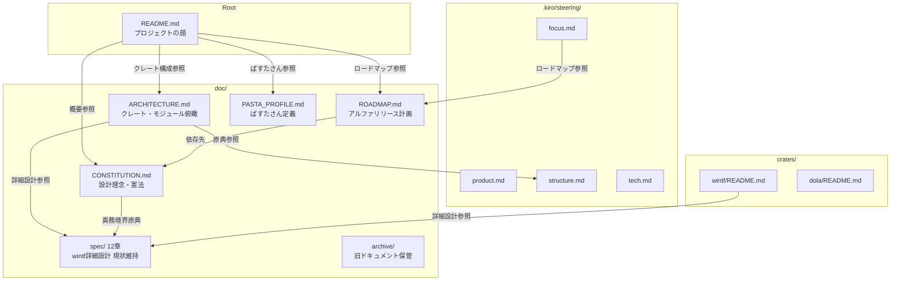
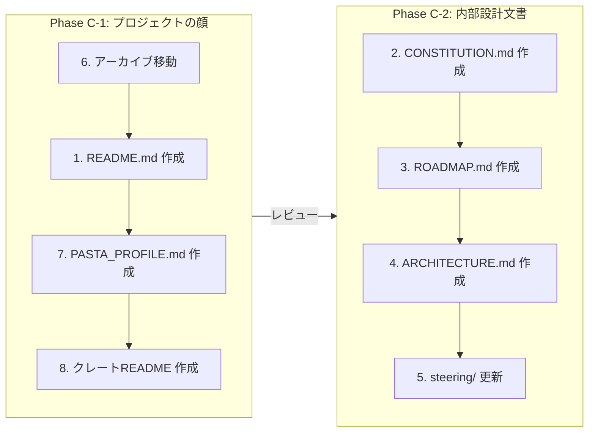
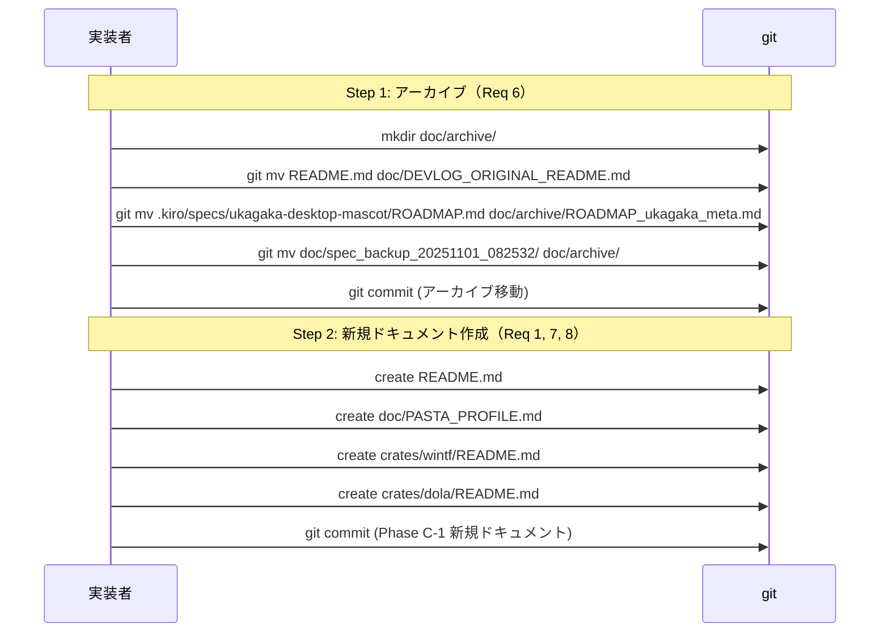
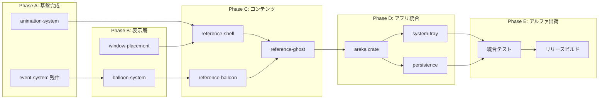
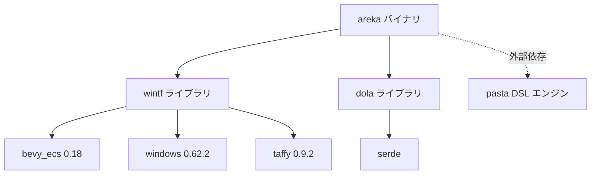
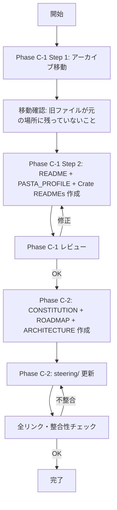

# Design Document — docs-restructure

| 項目 | 内容 |
|------|------|
| **Feature** | 憲法系ドキュメント及びREADME.md再構成 |
| **Version** | 1.0 |
| **Date** | 2026-02-14 |
| **Author** | GitHub Copilot (Claude Opus 4.6) + えちょ |

---

## Overview

**Purpose**: areka プロジェクトのドキュメント群を再構成し、「ぱすたさんアルファリリース」に向けたプロジェクトの全体像・現在地・ゴールを明確化する。

**Users**: プロジェクト開発者、AIエージェント（copilot/kiro）、将来の外部コントリビューター。

**Impact**: 以下のドキュメント群を新規作成・更新・アーカイブする。コード変更は発生しない。
- 新規作成: README.md, doc/CONSTITUTION.md, doc/ROADMAP.md, doc/ARCHITECTURE.md, doc/PASTA_PROFILE.md, crates/wintf/README.md, crates/dola/README.md
- 更新: steering/ 4ファイル
- アーカイブ: 旧README.md, 旧ROADMAP.md, spec_backup/

### Goals
- プロジェクトの「顔」（README.md）を areka 全体として整備し、ぱすたさんアルファリリースを軸に再構成する
- 設計理念・責務境界・技術的意思決定を CONSTITUTION.md に集約する
- アルファリリースまでの残タスクと依存関係を ROADMAP.md で可視化する
- クレート構成・モジュール構成の俯瞰図を ARCHITECTURE.md で提供する
- steering/ を実装の現状に合わせ、AIエージェントの精度を向上させる
- 各クレートの自己説明性をクレートレベル README で確保する

### Non-Goals
- コードの変更・リファクタリング
- `crates/areka` バイナリクレートの作成（別仕様で実施）
- doc/spec/ 12章の統合・移動（現状維持の方針決定済み）
- 英語版ドキュメントの作成（全て日本語統一）
- pasta DSL の文法仕様策定（外部リポジトリの管轄）

---

## Architecture

### Existing Architecture Analysis

現在のドキュメント構造は以下の問題を抱える：

- **README.md**: wintf 単体のフェーズリスト（areka 全体の顔になっていない）
- **ロードマップ**: ukagaka-desktop-mascot メタ仕様の ROADMAP.md に埋もれている
- **設計理念**: steering/, doc/spec/, requirements.md に分散
- **クレート説明**: crates/ 配下に README がなく、各クレートの役割が自己説明的でない

### Architecture Pattern & Boundary Map

**Architecture Integration**:
- 選択パターン: **ドキュメント階層構造**（トップダウン: README → 各専門文書 → 詳細設計）
- ドメイン境界: プロジェクト全体（README, CONSTITUTION, ROADMAP）/ 技術詳細（ARCHITECTURE, spec/）/ ステアリング（steering/）/ クレート固有（crate README）
- 既存パターン維持: steering/ の形式・詳細度はそのまま踏襲
- 原典主義: steering/ = 技術的真実の源泉、他ドキュメントは参照リンクで指す

### Technology Stack

| Layer | Choice / Version | Role in Feature | Notes |
|-------|------------------|-----------------|-------|
| ドキュメント | Markdown | 全ドキュメントの記述形式 | GitHub Flavored Markdown |
| 図表 | Mermaid | 依存関係図・アーキテクチャ図 | ROADMAP, ARCHITECTURE で使用 |
| バージョン管理 | git | ファイル移動・履歴追跡 | git mv でアーカイブ操作 |

---

## System Flows

### 実施フローの全体像

Option C（Hybrid）に基づく2フェーズ実施。

### Phase C-1 の git 操作フロー

---

## Requirements Traceability

| Requirement | Summary | Components | Flows |
|-------------|---------|------------|-------|
| 1.1-1.6 | README.md 再構成 | README-Component | Phase C-1 |
| 2.1-2.6 | CONSTITUTION.md 策定 | Constitution-Component | Phase C-2 |
| 3.1-3.7 | ROADMAP.md 再構成 | Roadmap-Component | Phase C-2 |
| 4.1-4.5 | ARCHITECTURE.md 整備 | Architecture-Component | Phase C-2 |
| 5.1-5.5 | steering 整合性更新 | Steering-Component | Phase C-2 |
| 6.1-6.5 | 旧ドキュメントアーカイブ | Archive-Component | Phase C-1 |
| 7.1-7.5 | ぱすたさんプロファイル | PastaProfile-Component | Phase C-1 |
| 8.1-8.6 | クレートレベル README | CrateReadme-Component | Phase C-1 |

---

## Components and Interfaces

| Component | Domain/Layer | Intent | Req Coverage | Key Dependencies | Phase |
|-----------|-------------|--------|--------------|-----------------|-------|
| Archive-Component | プロジェクト管理 | 旧ドキュメントの安全なアーカイブ | 6.1-6.5 | git (P0) | C-1 |
| README-Component | プロジェクト全体 | プロジェクトの「顔」を再構成 | 1.1-1.6 | Archive-Component (P0) | C-1 |
| PastaProfile-Component | コンテンツ | ぱすたさん基本プロファイル定義 | 7.1-7.5 | shell/ 素材 (P1) | C-1 |
| CrateReadme-Component | クレート | 各クレートの自己説明README | 8.1-8.6 | README-Component (P1) | C-1 |
| Constitution-Component | 設計理念 | プロジェクト憲法の策定 | 2.1-2.6 | steering/ (P0) | C-2 |
| Roadmap-Component | プロジェクト管理 | アルファリリース計画の可視化 | 3.1-3.7 | Constitution (P1), specs/ (P0) | C-2 |
| Architecture-Component | 技術設計 | クレート・モジュール俯瞰図 | 4.1-4.5 | steering/structure.md (P0) | C-2 |
| Steering-Component | ステアリング | AIエージェント向けコンテキスト更新 | 5.1-5.5 | 全他Componentの完了 (P0) | C-2 |

---

### プロジェクト管理

#### Archive-Component

| Field | Detail |
|-------|--------|
| Intent | 旧ドキュメントを doc/archive/ に安全に移動し、履歴を追跡可能にする |
| Requirements | 6.1, 6.2, 6.3, 6.4, 6.5 |

**Responsibilities & Constraints**
- `doc/archive/` ディレクトリの作成
- `README.md` → `doc/DEVLOG_ORIGINAL_README.md` へのリネーム保存
- `.kiro/specs/ukagaka-desktop-mascot/ROADMAP.md` → `doc/archive/ROADMAP_ukagaka_meta.md` への移動
- `doc/spec_backup_20251101_082532/` → `doc/archive/spec_backup_20251101_082532/` への移動
- アーカイブ操作は実装変更とは別の git commit で実行する
- `git mv` を使用して履歴を保持する

**Implementation Notes**
- 移動先パスの存在確認を事前に行い、衝突を防止
- ROADMAP.md 移動後、focus.md の参照先が一時的に不正になるが Phase C-2 の Steering-Component で修正

---

### プロジェクト全体

#### README-Component

| Field | Detail |
|-------|--------|
| Intent | areka プロジェクトの顔として、全体像・現在地・ゴールを即座に把握可能にする |
| Requirements | 1.1, 1.2, 1.3, 1.4, 1.5, 1.6 |

**Responsibilities & Constraints**
- 日本語で記述、洗練された表現
- 以下のセクション構成を設計：

**セクション構成**:

| # | セクション | 内容 | 参照先 |
|---|-----------|------|--------|
| 1 | ヘッダー・バッジ | プロジェクト名、簡潔なキャッチコピー | — |
| 2 | プロジェクト概要 | areka の使命、「伺か」インスパイアのデスクトップマスコット | — |
| 3 | スクリーンショット/デモ | プレースホルダー画像（`shell/icon.png` 使用可） | `shell/` |
| 4 | 二層構造の説明 | wintf = UIフレームワーク / areka = マスコットアプリバイナリ | — |
| 5 | クレート構成 | wintf, dola, areka（予定）+ 外部: pasta | crate README各々 |
| 6 | 技術スタック | Rust 2024, bevy_ecs 0.18, windows 0.62.2, DirectComposition, Taffy 0.9 | steering/tech.md |
| 7 | アルファリリース目標 | ぱすたさん紹介（名前、シェル、バルーン、ゴースト） | doc/PASTA_PROFILE.md |
| 8 | 現在の到達点 | 実装済み機能チェックリスト（56件完了スペック由来） | — |
| 9 | 開発ロードマップ概要 | Phase A-E の簡易サマリー + ROADMAP.md へのリンク | doc/ROADMAP.md |
| 10 | ビルド手順 | `cargo build`, `cargo run --example areka`, `cargo test` | — |
| 11 | ドキュメントガイド | 関連ドキュメントへのリンク集 | doc/, steering/ |
| 12 | ライセンス | MIT OR Apache-2.0（Cargo.toml 準拠） | — |

**Dependencies**
- Inbound: なし
- Outbound: ROADMAP.md, CONSTITUTION.md, ARCHITECTURE.md, PASTA_PROFILE.md — 参照リンク (P1)
- External: shell/icon.png — スクリーンショットプレースホルダー (P2)

**Implementation Notes**
- 実装済み機能リストは completed/ 56件のスペックから客観的に導出する
- 「現在の到達点」セクションでは基盤レイヤー ~70% 完了という定量評価を含める
- 既存の wintf フェーズリスト形式は排除し、areka 全体のプロジェクトビジョンを提示

---

### コンテンツ

#### PastaProfile-Component

| Field | Detail |
|-------|--------|
| Intent | ぱすたさんの基本プロファイルを明文化し、リファレンス実装の要件を明確にする |
| Requirements | 7.1, 7.2, 7.3, 7.4, 7.5 |

**Responsibilities & Constraints**
- `doc/PASTA_PROFILE.md` を新規作成

**セクション構成**:

| # | セクション | 内容 |
|---|-----------|------|
| 1 | キャラクター概要 | 名前「ぱすたさん」、キャラクター設定（1段落） |
| 2 | シェル構成 | サーフェス一覧: base.png + x1-x5（口）+ y1-y6（目）+ z1-z2（眉）= 60表情パターン |
| 3 | バルーン種別 | 縦書きタイプライター付き吹き出し |
| 4 | ゴースト種別 | pasta DSL（里々インスパイアのカスタムDSL） |
| 5 | pasta DSL 概要 | DSL の設計思想、基本構文の紹介（1セクション） |
| 6 | 会話サンプル | 最小限のスクリプト例 |
| 7 | 外部参照 | ekicyou/pasta リポジトリへのリンク |

**Dependencies**
- Inbound: README-Component — アルファリリース目標セクションから参照 (P1)
- Outbound: shell/ 素材 — サーフェス一覧の情報源 (P1)
- External: https://github.com/ekicyou/pasta — DSL実装リポジトリ (P1)

**Implementation Notes**
- shell/ 素材のパーツ合成座標は未定義のため、サーフェス一覧はファイル名ベースで記載し座標は「未定」とする
- pasta DSL の会話サンプルは、pasta リポジトリの文法仕様を参照して最小限に記載
- areka-P0-reference-ghost / shell / balloon の要件定義インプットとして機能する位置づけを明記

---

### クレート

#### CrateReadme-Component

| Field | Detail |
|-------|--------|
| Intent | 各クレートの目的・使い方を crate ルートの README.md で自己説明的にする |
| Requirements | 8.1, 8.2, 8.3, 8.4, 8.5, 8.6 |

**Responsibilities & Constraints**

**crates/wintf/README.md の構成**:

| # | セクション | 内容 |
|---|-----------|------|
| 1 | クレート概要 | Windows縦書きUIフレームワーク |
| 2 | 主要機能一覧 | ECS統合, DirectComposition, 縦書き, 透過ウィンドウ, レイアウト, ポインターイベント |
| 3 | アーキテクチャ概要 | COM → ECS → Message Handling 3層構造の簡潔な説明 |
| 4 | サンプル実行方法 | `cargo run --example taffy_flex_demo` 等 |
| 5 | モジュール一覧 | ecs/ 配下の各モジュールの1行説明 |
| 6 | 詳細設計参照 | doc/spec/ 12章へのリンク |

**crates/dola/README.md の構成**:

| # | セクション | 内容 |
|---|-----------|------|
| 1 | クレート概要 | Declarative Orchestration for Live Animation |
| 2 | 対応フォーマット | JSON（デフォルト）, TOML, YAML（feature flags） |
| 3 | 基本的な使用例 | Storyboard/Transition の構成例 |
| 4 | API概要 | 主要な型（Storyboard, Transition, Easing 等）の一覧 |
| 5 | feature flags | json, toml, yaml の説明 |

**Implementation Notes**
- プロジェクトルート README.md との重複を最小限にする（クレート固有の情報に焦点）
- areka バイナリクレートの README.md は本スペック対象外（`crates/areka` 作成時に同時作成）

---

### 設計理念

#### Constitution-Component

| Field | Detail |
|-------|--------|
| Intent | プロジェクトの設計理念・ゴール・基本原則を一箇所にまとめ、設計判断の一貫性を保つ |
| Requirements | 2.1, 2.2, 2.3, 2.4, 2.5, 2.6 |

**Responsibilities & Constraints**
- `doc/CONSTITUTION.md` を新規作成

**セクション構成**:

| # | セクション | 内容 | 情報源 |
|---|-----------|------|--------|
| 1 | ミッション宣言 | areka プロジェクトの存在理由とビジョン | requirements.md Introduction |
| 2 | 設計理念（5原則以内） | (1) ECS駆動, (2) 責務分離, (3) 段階的拡張, (4) 日本語ファースト, (5) AI協調開発 | steering/, research.md |
| 3 | 責務境界（プラットフォーム憲法） | プラットフォーム/ゴースト/シェル/バルーンの責務分離表 | ukagaka-desktop-mascot/requirements.md |
| 4 | クレート構成と責務 | wintf, dola, areka, pasta の責務定義 | steering/structure.md, Cargo.toml |
| 5 | 技術的意思決定記録 | ECS+DirectComposition選定理由, MCP採用方針 | research.md Design Decisions |
| 6 | スコープ外事項 | アクセシビリティ強制、コンテンツ国際化等の明示的除外 | Non-Goals |

**Dependencies**
- Inbound: README-Component — 設計理念セクションから参照 (P1)
- Outbound: ukagaka-desktop-mascot/requirements.md — 責務境界表の原典 (P0)
- Outbound: steering/ — 設計理念の原典 (P0)

**Implementation Notes**
- 既存ドキュメント（steering/, research.md, design.md）と重複する内容は参照リンクで原典を指し、二重管理を回避
- 責務境界表は ukagaka-desktop-mascot から引用・再構成する形で記載（コピーではなく参照+文脈追加）
- MCP = Model Context Protocol（AI連携プロトコル）であることを明記

---

### プロジェクト管理

#### Roadmap-Component

| Field | Detail |
|-------|--------|
| Intent | アルファリリースまでの残タスク、依存関係、順序を即座に把握可能にする |
| Requirements | 3.1, 3.2, 3.3, 3.4, 3.5, 3.6, 3.7 |

**Responsibilities & Constraints**
- `doc/ROADMAP.md` を新規作成
- ukagaka-desktop-mascot ROADMAP.md を置き換える位置づけ

**セクション構成**:

| # | セクション | 内容 |
|---|-----------|------|
| 1 | プログレスサマリー | Phase A-E の完了率バー、56件完了/N件残の数値 |
| 2 | Phase A: 基盤完成 | event-system 残件, animation-system (dola→wintf統合) |
| 3 | Phase B: 表示層 | balloon-system, window-placement |
| 4 | Phase C: コンテンツ | reference-shell, reference-balloon, reference-ghost (ぱすたさん) |
| 5 | Phase D: アプリ統合 | areka バイナリクレート作成, system-tray, persistence, package構造 |
| 6 | Phase E: アルファ出荷 | 統合テスト, README最終化, リリースビルド |
| 7 | 依存関係図 | Mermaid記法のクリティカルパス図 |
| 8 | 子仕様対応表 | 各フェーズに対応する .kiro/specs/ ディレクトリ名 |

**Mermaid依存関係図の設計**:

**Dependencies**
- Inbound: README-Component — ロードマップ概要セクションから参照 (P1)
- Outbound: .kiro/specs/ — アクティブ仕様のフェーズ情報 (P0)
- Outbound: completed/ — 完了済み仕様の一覧 (P0)

**Implementation Notes**
- 旧 ROADMAP.md（ukagaka-desktop-mascot）は doc/archive/ に移動済みの前提で作成
- フェーズの完了状況が変化した際に更新すべき箇所を、テーブル行のステータス列で明確化
- pasta スクリプトエンジンは「✅ 完了（外部リポジトリ: ekicyou/pasta）」と記載

---

### 技術設計

#### Architecture-Component

| Field | Detail |
|-------|--------|
| Intent | クレート構成・モジュール構成・依存関係を俯瞰し、変更影響を素早く判断可能にする |
| Requirements | 4.1, 4.2, 4.3, 4.4, 4.5 |

**Responsibilities & Constraints**
- `doc/ARCHITECTURE.md` を新規作成
- steering/structure.md を原典として参照し、差分のみを記載

**セクション構成**:

| # | セクション | 内容 | 情報源 |
|---|-----------|------|--------|
| 1 | クレート依存関係図 | wintf, dola, areka, pasta のMermaid図 | Cargo.toml |
| 2 | wintf 3層構造 | COM → ECS → Message Handling | steering/structure.md |
| 3 | ECSモジュール一覧 | window, graphics, layout, widget, pointer, drag 等の1-2行説明 | steering/structure.md |
| 4 | dola の責務 | 宣言的アニメーション定義フォーマット | crates/dola/ |
| 5 | areka アプリケーション層 | バイナリクレートの責務概要（予定） | requirements.md |
| 6 | pasta 外部連携 | DSLスクリプトエンジンの役割と連携方式 | ekicyou/pasta |
| 7 | 推奨読書順序 | 新規開発者向けのファイル順序ガイド | — |
| 8 | 詳細設計参照 | doc/spec/ 12章へのリンク集 | doc/spec/README.md |

**クレート依存関係図の設計**:

**Dependencies**
- Inbound: README-Component — クレート構成セクションから参照 (P1)
- Outbound: steering/structure.md — 原典 (P0)
- Outbound: doc/spec/ 12章 — 詳細設計参照 (P1)

**Implementation Notes**
- steering/structure.md との重複を避けるため、ARCHITECTURE.md は「俯瞰図 + 推奨読書順序」に特化
- ECSモジュール一覧は structure.md から要約して転記するのではなく、参照リンクで指す
- 推奨読書順序: steering/product.md → ARCHITECTURE.md → doc/spec/README.md → 各章

---

### ステアリング

#### Steering-Component

| Field | Detail |
|-------|--------|
| Intent | steering/ を実装の現状に合わせ、AIエージェントのコンテキスト精度を向上させる |
| Requirements | 5.1, 5.2, 5.3, 5.4, 5.5 |

**Responsibilities & Constraints**
- 既存4ファイルの更新（形式・詳細度のスタイルは維持）
- 新規ファイル作成なし

**更新計画**:

| ファイル | 変更内容 | 要件 |
|---------|---------|------|
| product.md | areka アプリケーション層の記述追加、アルファリリースターゲット（ぱすたさん）追加 | 5.1 |
| structure.md | dola クレートの記述追加、areka バイナリクレート（予定）の記述追加、pasta 外部リポジトリの言及 | 5.2 |
| tech.md | dola クレートの記述追加（serde + feature flags）、~~windows/edition バージョン修正~~（自明修正で対応済み） | 5.3 |
| focus.md | ロードマップ参照先を `doc/ROADMAP.md` に切り替え | 5.4 |

**Dependencies**
- Inbound: なし（最終ステップ）
- Outbound: 全他 Component の内容 — 整合性確保のため最後に実施 (P0)

**Implementation Notes**
- 既存のスタイル（セクション構成、記述の詳細度、フォーマット）を厳密に維持
- product.md: 現在の wintf 記述は保持し、areka アプリ層セクションを追加
- structure.md: 現在の wintf 構造記述は保持し、dola/areka セクションを追加
- focus.md: ROADMAP 参照先の URL を変更するのみ（最小限の変更）

---

## Data Models

本フィーチャーはデータモデル変更を伴わない（全て Markdown ドキュメント操作）。

---

## Error Handling

### Error Strategy

| エラーシナリオ | 対応 |
|--------------|------|
| git mv 対象ファイルが存在しない | `test -f` で事前確認、スキップしてログ出力 |
| doc/archive/ が既に存在する | そのまま使用（mkdir -p 相当） |
| 参照先ドキュメントが未作成 | `(TBD)` プレースホルダーリンクで仮設、Phase 完了時に解決 |
| ROADMAP.md 移動後の focus.md 不整合 | Phase C-2 の Steering-Component で修正（一時的不整合を許容） |

---

## Testing Strategy

### ドキュメント品質チェック

- **リンク検証**: 全ドキュメント内の相対リンクが正しいパスを指していることを手動確認
- **セクション完全性**: requirements.md の AC に対し、各ドキュメントの対応セクションが存在することを確認
- **原典整合性**: steering/ の記載内容と各ドキュメントの引用が矛盾しないことを確認
- **Mermaid構文検証**: ROADMAP.md, ARCHITECTURE.md の Mermaid 図がレンダリング可能であることを確認
- **スタイル統一性**: 全ドキュメントが日本語で記述され、フォーマルな技術文書のトーンを維持していることを確認

---

## Migration Strategy

### ロールバック

全変更は git で管理されるため、任意の時点で `git revert` により完全復元が可能。Phase C-1 と C-2 を別コミットとすることで、Phase 単位のロールバックも可能。
