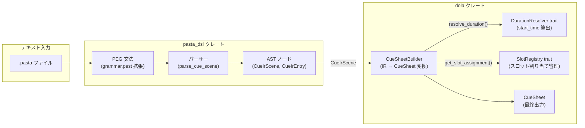
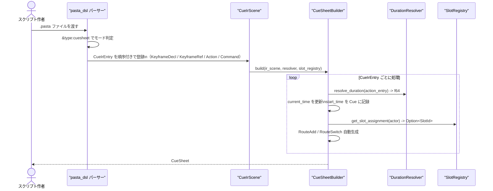
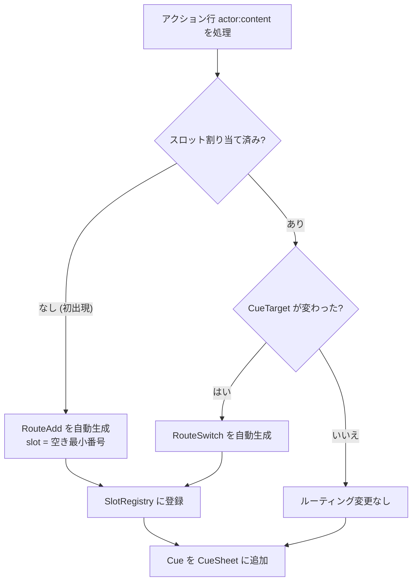

# 設計書：dola-cue-pasta-dsl-extension

> **バージョン**: v2（2026-03-03 — 要件 v3 / Q1〜Q7 確定事項に基づく全面再設計）  
> **前バージョン**: v1（旧 `[timestamp]` + `\cue_*` トークン方式）は本書に統合・廃止

---

## 概要

**目的**: dola の `CueSheet` データモデル（`crates/dola/src/cue/`）をテキストで記述できるよう、pasta DSL の文法を拡張する。  
**利用者**: ゴーストスクリプト作者。既存の `pasta` 会話スクリプトとシームレスに共存する演出台本を書く。  
**影響範囲**: pasta_dsl パーサーへの文法ルール追加、dola クレートへの `CueSheetBuilder` / `DurationResolver` / `SlotRegistry` 追加。既存 pasta スクリプトへの破壊的変更はゼロ。

本設計書は **pasta_core 実装者向けの仕様指示書** として機能する。コード実装は本フェーズのスコープ外。

### ゴール

- `&type:cuesheet` 属性でシーンをキューシートモードに切り替える
- 暗黙キーフレーム（行の出現順序）で時系列を表現し、Duration Resolver が時刻を算出
- `!` コマンド行でキーフレーム宣言・Barrier・Clear・RouteRemove を宣言
- `@alias = CueCommand(args)` でアクション行に CueCommand を紐付ける
- 後方互換性：`&type:cuesheet` を持たないシーンは現行動作を維持

### 非ゴール

- CueSheet ↔ Storyboard 連携記法（将来拡張）
- キーフレーム相互変換（`start_time: f64` ↔ `KeyframeRef`）
- Lua ブロックからのキュー操作 API
- グローバルスコープエイリアス定義（将来拡張）
- コード実装（本設計書は仕様指示のみ）

---

## アーキテクチャ

### 既存アーキテクチャ分析

- **dola CueSheet**: `crates/dola/src/cue/` に実装済み。型は変更不要。
  - `Cue { actor: ActorKey, start_time: f64, payload: CuePayload }`
  - `CuePayload`: `Command(CueCommand)`, `Barrier(BarrierKind)`, `Routing(RoutingCommand)` の 3 種
- **pasta DSL**: `vendors/pasta` に外部実装。行指向文法。`&key:value` 属性行・`%actor=slot` 配置行・`actor:content` アクション行・`:content` 継続行が既存構文。
- **キューシートモードスコープ**: `*シーン名` 直後の `&type:cuesheet` 属性が「モードスイッチ」として機能する。このスコープ外では全ての拡張構文を認識しない。

### アーキテクチャパターンと境界マップ

**採用パターン: ハイブリッド（Option C）** — pasta_dsl が CueIR（中間表現）を出力し、dola `CueSheetBuilder` が時刻計算・ルーティング判定を担う。詳細は [research.md](research.md) の「決定 1」を参照。



**境界の責務分担**:

| 境界 | 責務 | 責務外 |
|------|------|--------|
| pasta_dsl PEG 文法 | 行の分類・構文解析・トークン抽出 | 時刻計算・ルーティング判定 |
| pasta_dsl CueIR | 構造化 IR（順序・型・アクター情報） | `start_time` 値の確定 |
| dola CueSheetBuilder | IR → CueSheet 変換、Duration 注入、RouteAdd/Switch 自動生成 | テキスト解析 |
| DurationResolver | アクションごとの所要時間を返す | CueSheet 構築 |
| SlotRegistry | アクター→スロット割り当てを管理 | テキスト解析・CueCommand 変換 |

### テクノロジースタック

| レイヤー | 技術 / バージョン | 役割 | 備考 |
|---------|----------------|------|------|
| DSL 文法 | PEG (pest 2.x 想定) | 行指向の文法ルール定義 | `.pest` ファイルを拡張 |
| 言語 | Rust 2024 Edition | 全実装 | 既存スタックを踏袭 |
| dola 型 | `crates/dola/src/cue/command.rs` | `CueCommand` / `BarrierKind` 等 | 変更不要 |
| エラー | `thiserror` 2 | `CueParseError` / `CueBuildError` 定義 | 全クレート共通規約 |

---

## システムフロー

### パースパイプライン



### RouteAdd/RouteSwitch 判定フロー



---

## 要件トレーサビリティ

| 要件 | サマリー | コンポーネント | インターフェース | フロー |
|------|---------|--------------|----------------|------|
| 1.1 | `&type:cuesheet` でシーンモード判定 | PEG 文法のシーン属性ルール | `CueIrScene::is_cue_mode: bool` | パースパイプライン |
| 1.2 | モード外では拡張構文を無効化 | パーサーのモード条件分岐 | — | — |
| 1.3 | グローバルシーン `*` への適用 | パーサーのシーン種別判定 | — | — |
| 2.1–2.4 | 暗黙キーフレームと初期時刻 0.0 | CueSheetBuilder のタイムライン管理 | `DurationResolver::resolve_duration()` | パースパイプライン |
| 2.5–2.6 | パーサーは時刻を算出しない | CueIR（構造のみ出力） | `DurationResolver` インターフェース | パースパイプライン |
| 3.1–3.3 | `!` コマンド行の認識とバリアント | PEG `cue_cmd_line` ルール | `CueIrCommand` enum | — |
| 3.4–3.5 | キーフレーム名・オフセット秒数 | PEG `cue_keyframe_decl` / `cue_keyframe_ref` | `CueIrCommand::KeyframeDecl`, `KeyframeRef` | — |
| 3.6–3.8 | 重複・未宣言キーフレームエラー | Builder セマンティクス検証 | `CueBuildError::DuplicateKeyframe`, `UnknownKeyframe` | — |
| 3.9–3.11 | キーフレーム以降の start_time 計算 | CueSheetBuilder のタイムライン管理 | — | パースパイプライン |
| 4.1–4.4 | エイリアス定義行の文法 | PEG `alias_def_line` ルール | `CueIrAliasDef` 型 | — |
| 4.5–4.6 | エイリアス解決・Emote フォールバック | Builder のエイリアス解決ロジック | `AliasTable::resolve()` | — |
| 5.1–5.6 | アクション行の CueCommand マッピング | Builder のアクション変換 | `CueIrAction` → `Vec<Cue>` 変換 | — |
| 6.1–6.2, 6.5–6.8, 6.10 | Routing 自動生成と SlotRegistry | Builder の RouteAdd 自動判定 | `SlotRegistry::get_slot_assignment()` | RouteAdd/Switch フロー |
| 6.3 | `!route_add` 明示コマンド | PEG `cue_route_add` + Builder | `CueIrCommand::RouteAdd` | — |
| 6.4 | `!route_switch` 明示コマンド | PEG `cue_route_switch` + Builder | `CueIrCommand::RouteSwitch` | — |
| 7.1–7.4 | 後方互換性 | パーサーのモード条件分岐 | — | — |
| 8.1–8.7 | エラーハンドリング | `CueParseError` / `CueBuildError` | エラー型定義 | — |
| 9.1–9.9 | 設計成果物要件 | 本書 + `cue.pasta` | — | — |

---

## コンポーネントとインターフェース

### コンポーネントサマリー

| コンポーネント | 層 | 目的 | 要件カバレッジ | 主要依存 | 契約 |
|------------|---|------|--------------|---------|------|
| PEG 文法拡張 | pasta_dsl | `!` 行・エイリアス行・`&type:cuesheet` の構文解析 | 1, 2, 3, 4, 7 | pest 2.x | 文法ルール |
| CueIR 型 | pasta_dsl | 解析済み中間表現（時刻なし） | 2.5, 2.6 | — | データ型 |
| CueSheetBuilder | dola | CueIR → CueSheet 変換 | 2, 3, 4, 5, 6 | DurationResolver, SlotRegistry | Service |
| DurationResolver | dola | アクションの所要時間を外部注入 | 2.5, 2.6 | — | Trait |
| SlotRegistry | dola | アクター→スロット割り当てを管理 | 6.5, 6.6, 6.8 | — | Trait |
| AliasTable | dola / Builder 内部 | シーンスコープのエイリアス管理 | 4.1–4.6 | — | State |

---

### pasta_dsl: PEG 文法拡張

| フィールド | 詳細 |
|---------|------|
| **目的** | キューシートモード識別・`!` コマンド行・エイリアス定義行の文法ルール追加 |
| **要件** | 1.1–1.4, 2.1, 3.1–3.11, 4.1–4.4, 7.1–7.4 |

**新規追加ファイル/ルール（推定対象: `grammar.pest`）**

#### モード判定ルール

```peg
// &type:cuesheet / ＆type：cuesheet に対応
// 既存 attr_line ルールのセマンティクス拡張として実装
// key="type", value="cuesheet" のときシーンを CueSheet モードとしてマーク
```

#### `!` キューコマンド行（全角・半角両対応）

```peg
// キューコマンド行（cuesheet モード内のみ有効）
cue_cmd_line = {
    (ASCII_EXCL | ZENKAKU_EXCL) ~ SPACE* ~ cue_cmd_body ~ NEWLINE
}

ZENKAKU_EXCL = { "！" }

cue_cmd_body = {
    cue_keyframe_decl
  | cue_keyframe_ref
  | cue_wait_input
  | cue_wait_choice
  | cue_timeout
  | cue_clear
  | cue_route_add
  | cue_route_switch
  | cue_route_remove
}

// !keyframe <name>  /  ！キーフレーム <name>
cue_keyframe_decl = {
    ("keyframe" | "キーフレーム") ~ SPACE+ ~ cue_ident
}

// !@<name>  /  !@<name>+<offset>
cue_keyframe_ref = {
    "@" ~ cue_ident ~ (SPACE* ~ ("+" | "-") ~ SPACE* ~ float_lit)?
}

// !wait_input  /  !wait_input[10.0]  /  ！入力待ち
cue_wait_input = {
    ("wait_input" | "入力待ち") ~ ("[" ~ float_lit ~ "]")?
}

// !wait_choice  /  !wait_choice[30.0]  /  ！選択肢待ち
cue_wait_choice = {
    ("wait_choice" | "選択肢待ち") ~ ("[" ~ float_lit ~ "]")?
}

// !timeout[2.0]  /  ！タイムアウト[2.0]
cue_timeout = {
    ("timeout" | "タイムアウト") ~ "[" ~ float_lit ~ "]"
}

// !clear  /  ！クリア
cue_clear = { "clear" | "クリア" }

// !route_add[shell, actor:さくら:shell]  /  ！ルート追加[balloon, spot:stage]
cue_route_add = {
    ("route_add" | "ルート追加") ~ "[" ~ cue_target ~ "," ~ SPACE* ~ entity_key ~ "]"
}

// !route_switch[balloon, spot:stage_balloon]  /  ！ルート切替
cue_route_switch = {
    ("route_switch" | "ルート切替") ~ "[" ~ cue_target ~ "," ~ SPACE* ~ entity_key ~ "]"
}

// !route_remove[shell]  /  ！ルート削除[balloon]
cue_route_remove = {
    ("route_remove" | "ルート削除") ~ "[" ~ cue_target ~ "]"
}

// EntityKey 記法（RouteAdd / RouteSwitch の to 引数）
entity_key = { entity_key_actor | entity_key_spot | entity_key_balloon }
entity_key_actor   = { "actor:" ~ cue_ident ~ ":" ~ cue_target }
entity_key_spot    = { "spot:"    ~ cue_ident }
entity_key_balloon = { "balloon:" ~ cue_ident }

// ターゲット識別子
cue_target = { "shell" | "balloon" | "シェル" | "バルーン" }

// 識別子（スペース・括弧・カンマ・改行以外の文字列）
cue_ident = { (!(WHITESPACE | "(" | ")" | "[" | "]" | "," | NEWLINE) ~ ANY)+ }

// 非負浮動小数点リテラル
float_lit = { ASCII_DIGIT+ ~ ("." ~ ASCII_DIGIT+)? }
```

#### エイリアス定義行

```peg
// @alias名 = CueCommand(args)  /  @alias名 ＝ CueCommand(args)
alias_def_line = {
    "@" ~ cue_ident ~ SPACE* ~ ("=" | "＝") ~ SPACE* ~ alias_cmd_expr ~ NEWLINE
}

alias_cmd_expr = {
    alias_choice_cmd
  | alias_emote_cmd
  | alias_custom_cmd
}

// Choice(id, "表示テキスト")
alias_choice_cmd = {
    ("Choice" | "選択肢") ~ "(" ~ SPACE* ~ cue_ident ~ SPACE* ~ "," ~ SPACE* ~ quoted_string ~ SPACE* ~ ")"
}

// Emote(key)
alias_emote_cmd = {
    ("Emote" | "表情") ~ "(" ~ SPACE* ~ cue_ident ~ SPACE* ~ ")"
}

// Custom("command_name", {json})
alias_custom_cmd = {
    ("Custom" | "カスタム") ~ "(" ~ SPACE* ~ quoted_string ~ SPACE* ~ "," ~ SPACE* ~ json_object ~ SPACE* ~ ")"
}
```

**コマンドキーワード英日対応表**

| 英語キーワード | 日本語キーワード | 対応 dola 型 |
|-------------|---------------|------------|
| `keyframe` | `キーフレーム` | `CueIrCommand::KeyframeDecl` |
| `wait_input` | `入力待ち` | `BarrierKind::WaitForInput` |
| `wait_choice` | `選択肢待ち` | `BarrierKind::WaitForChoice` |
| `timeout` | `タイムアウト` | `BarrierKind::Timeout` |
| `clear` | `クリア` | `CueCommand::Clear` |
| `route_add` | `ルート追加` | `RoutingCommand::RouteAdd` |
| `route_switch` | `ルート切替` | `RoutingCommand::RouteSwitch` |
| `route_remove` | `ルート削除` | `RoutingCommand::RouteRemove` |
| `shell` | `シェル` | `CueTarget::Shell` |
| `balloon` | `バルーン` | `CueTarget::Balloon` |
| `Choice` | `選択肢` | `CueCommand::Choice` |
| `Emote` | `表情` | `CueCommand::Emote` |
| `Custom` | `カスタム` | `CueCommand::Custom` |

**依存**
- 外部: `pest` 2.x — PEG パーサー生成
- 変更対象ファイル推定:

| ファイル | 変更内容 |
|---------|---------|
| `grammar.pest` | `cue_cmd_line`・`alias_def_line`・`cue_target` 等のルール追加 |
| `ast/*.rs` | `CueIrScene`, `CueIrEntry`, `CueIrAction`, `CueIrCommand`, `CueIrAliasDef` ノード追加 |
| `parse_scene.rs` | `&type:cuesheet` モードスコープ処理追加 |
| `parse_action.rs` | `@fragment` 分割ロジック、継続行 `\n` 結合処理 |

---

### pasta_dsl: CueIR 型定義

| フィールド | 詳細 |
|---------|------|
| **目的** | パーサー出力の中間表現。時刻なし・順序付き。ビルダー層が消費する |
| **要件** | 2.5, 2.6, 3.1–3.9, 4.1–4.6, 5.1–5.6 |

**Rust インターフェース定義（配置モジュール: `pasta_dsl::cue_ir`）**

```rust
/// キューシートモードのシーン中間表現
pub struct CueIrScene {
    /// シーン名
    pub name: String,
    /// エントリの有順序リスト（出現順 = タイムライン順序）
    pub entries: Vec<CueIrEntry>,
    /// シーンスコープのエイリアス定義（エントリより前に処理）
    pub alias_defs: Vec<CueIrAliasDef>,
}

/// CueIR エントリ（1 行 または 継続行を含む 1 論理ブロック）
pub enum CueIrEntry {
    /// アクション行（actor:content + @command フラグメント）
    Action(CueIrAction),
    /// `!` コマンド行
    Command(CueIrCommand),
}

/// アクション行の中間表現
pub struct CueIrAction {
    /// アクター識別子
    pub actor: ActorKey,
    /// 行内フラグメントのリスト（テキスト断片 + エイリアス参照が交互に並ぶ）
    pub fragments: Vec<CueIrFragment>,
    /// ソース行番号（エラーレポート用）
    pub source_line: u32,
}

/// アクション行内の最小単位
pub enum CueIrFragment {
    /// テキスト断片（継続行 `\n` 結合済み）
    Text(String),
    /// `@name` 参照（エイリアス解決前）
    AliasRef(String),
}

/// `!` コマンド行の中間表現
pub enum CueIrCommand {
    /// `!keyframe <name>` — 現在時刻に名前を付ける
    KeyframeDecl { name: String },
    /// `!@<name>` または `!@<name>+<offset>` — 基準時刻をキーフレームに設定
    KeyframeRef { name: String, offset: f64 },
    /// Barrier 系（WaitForInput / WaitForChoice / Timeout）
    Barrier(BarrierKind),
    /// `!clear`
    Clear,
    /// `!route_add[target, entity_key]` — 任意 EntityKey を指定して RouteAdd を明示発行
    RouteAdd { target: CueTarget, to: EntityKey },
    /// `!route_switch[target, entity_key]` — 配送先 Entity の切り替え
    RouteSwitch { target: CueTarget, to: EntityKey },
    /// `!route_remove[target]`
    RouteRemove { target: CueTarget },
}

/// エイリアス定義
pub struct CueIrAliasDef {
    /// エイリアス名（`@`抜き）
    pub name: String,
    /// 対応する CueCommand
    pub command: CueCommand,
    /// ソース行番号
    pub source_line: u32,
}
```

---

### dola: DurationResolver トレイト

| フィールド | 詳細 |
|---------|------|
| **目的** | アクション行ごとの所要時間を外部注入するインターフェース |
| **要件** | 2.5, 2.6 |

**サービスインターフェース定義（配置モジュール: `dola::cue::builder`）**

```rust
/// アクション行の所要時間を解決するトレイト。
///
/// パーサーは行の順序と構造のみを出力し、`start_time` の計算は本トレイトの実装に委ねる。
/// CueSheetBuilder は各 CueIrAction の処理前に `resolve_duration` を呼び出して
/// current_time を前進させる。
pub trait DurationResolver {
    /// 指定アクションの所要時間（秒）を返す。
    ///
    /// # 引数
    /// - `actor`: 発話アクターの識別子
    /// - `action`: アクション行の中間表現
    ///
    /// # 戻り値
    /// 0.0 以上の秒数。次の暗黙キーフレームまでの時間。
    fn resolve_duration(&self, actor: &ActorKey, action: &CueIrAction) -> f64;
}

/// デフォルト実装: 全アクションに固定時間を返す（テスト・プロトタイプ用）
pub struct FixedDurationResolver {
    pub default_seconds: f64,
}

impl DurationResolver for FixedDurationResolver {
    fn resolve_duration(&self, _actor: &ActorKey, _action: &CueIrAction) -> f64 {
        self.default_seconds
    }
}
```

**前提条件・事後条件**:
- 前提条件: `CueIrAction` は有効な `ActorKey` を持つ
- 事後条件: 戻り値 ≥ 0.0（負値は未定義動作）
- 不変条件: 同一引数で呼び出せば冪等（副作用なし）

---

### dola: SlotRegistry トレイト

| フィールド | 詳細 |
|---------|------|
| **目的** | アクター→スロット割り当て状態の管理 API |
| **要件** | 6.5, 6.6, 6.7, 6.8 |

**サービスインターフェース定義（配置モジュール: `dola::cue::builder`）**

```rust
/// スロット識別子（0-based 整数）
pub type SlotId = u32;

/// アクター→スロット割り当てを管理するトレイト。
///
/// スロット割り当ては**セッションをまたいで永続**する。
/// `%`行が存在する場合はその指定を優先。
/// 未割り当てアクターが出現した場合は現在未使用の最小スロット番号を自動割り当て。
pub trait SlotRegistry {
    /// 指定 ActorKey の現在のスロット割り当てを返す。未割り当ては `None`。
    fn get_slot_assignment(&self, actor: &ActorKey) -> Option<SlotId>;

    /// 明示的なスロット割り当てを登録する（`%actor=slot` 行からの呼び出し）。
    fn assign_explicit(&mut self, actor: ActorKey, slot: SlotId);

    /// 現在未使用の最小スロット番号を返す。
    fn next_available_slot(&self) -> SlotId;

    /// 新しいスロット割り当てを自動登録し、割り当てたスロット番号を返す。
    fn auto_assign(&mut self, actor: ActorKey) -> SlotId;
}
```

**RouteAdd 自動生成ロジック**:

```
アクション行 actor:content を処理する際:

1. slot_registry.get_slot_assignment(&actor) を呼び出す
2. None（未割り当て）の場合:
     slot = slot_registry.auto_assign(actor.clone())
     // 伺か慣習: Shell・Balloon 両方に同一アクター Entity を自動登録
     cues.push(Cue { Routing(RouteAdd { target: Shell,   to: Actor(actor, Shell) }) })
     cues.push(Cue { Routing(RouteAdd { target: Balloon, to: Actor(actor, Balloon) }) })
3. Some(slot)（割り当て済み）の場合:
     ルーティング Cue は生成しない

// 明示 RouteAdd / RouteSwitch:
// CueIrEntry::Command(RouteAdd { target, to }) →
//   result_cues.push(Cue { actor: SYSTEM_ACTOR, start_time: current_time,
//                           payload: Routing(RouteAdd { target, to }) })
// CueIrEntry::Command(RouteSwitch { target, to }) →
//   result_cues.push(Cue { actor: SYSTEM_ACTOR, start_time: current_time,
//                           payload: Routing(RouteSwitch { target, to }) })
// RouteSwitch は自動生成せず、スクリプト作者の !route_switch 明示記述のみで発行する。
```

---

### dola: CueSheetBuilder

| フィールド | 詳細 |
|---------|------|
| **目的** | CueIrScene を CueSheet に変換する主要コンポーネント |
| **要件** | 2.1–2.6, 3.1–3.11, 4.5–4.6, 5.1–5.6, 6.1–6.8 |

**サービスインターフェース定義**

```rust
/// CueIrScene を CueSheet へ変換するビルダー。
pub struct CueSheetBuilder<R: DurationResolver, S: SlotRegistry> {
    resolver: R,
    slot_registry: S,
}

impl<R: DurationResolver, S: SlotRegistry> CueSheetBuilder<R, S> {
    pub fn new(resolver: R, slot_registry: S) -> Self;

    /// CueIrScene を CueSheet に変換する。
    ///
    /// # エラー
    /// - `CueBuildError::DuplicateKeyframe`
    /// - `CueBuildError::UnknownKeyframe`
    /// - `CueBuildError::NegativeOffset`
    pub fn build(&mut self, scene: CueIrScene) -> Result<CueSheet, CueBuildError>;
}
```

**タイムライン管理アルゴリズム（擬似コード）**:

```
// SYSTEM ActorKey の定義（dola::cue::builder に定数として配置予定）
// pub const SYSTEM_ACTOR: ActorKey = ActorKey("__system__");
// Barrier / Clear / RouteRemove はアクター属性を持たない制御キューであるため
// 専用の定数アクターキーを使用する。
//
// 注記: "__system__" という内部値は dola 側実装者が最終決定し、
//       design.md に明記した上で実装フェーズに引き継ぐこと。

build(scene):
  current_time = 0.0
  keyframe_table: HashMap<String, f64> = {}
  alias_table = scene.alias_defs へのインデックス (name -> CueCommand)
  result_cues: Vec<Cue> = []

  for entry in scene.entries:
    match entry:
      CueIrEntry::Command(KeyframeDecl { name }):
        if keyframe_table contains name → Err(DuplicateKeyframe)
        keyframe_table[name] = current_time

      CueIrEntry::Command(KeyframeRef { name, offset }):
        base = keyframe_table[name] ?? Err(UnknownKeyframe)
        if offset < 0.0 → Err(NegativeOffset)
        current_time = base + offset

      CueIrEntry::Command(Barrier(kind)):
        result_cues.push(Cue { actor: SYSTEM_ACTOR, start_time: current_time,
                                payload: Barrier(kind) })
      CueIrEntry::Command(Clear):
        result_cues.push(Cue { actor: SYSTEM_ACTOR, start_time: current_time,
                                payload: Command(Clear) })
      CueIrEntry::Command(RouteAdd { target, to }):
        result_cues.push(Cue { actor: SYSTEM_ACTOR, start_time: current_time,
                                payload: Routing(RouteAdd { target, to }) })
      CueIrEntry::Command(RouteSwitch { target, to }):
        result_cues.push(Cue { actor: SYSTEM_ACTOR, start_time: current_time,
                                payload: Routing(RouteSwitch { target, to }) })
      CueIrEntry::Command(RouteRemove { target }):
        result_cues.push(Cue { actor: SYSTEM_ACTOR, start_time: current_time,
                                payload: Routing(RouteRemove { target }) })

      CueIrEntry::Action(action):
        // ルーティング自動生成
        emit_routing_if_needed(action.actor, &mut result_cues, current_time)

        // フラグメント変換（テキスト断片 + エイリアス解決）
        for fragment in action.fragments:
          match fragment:
            Text(s) →
              result_cues.push(Cue { actor: action.actor, start_time: current_time,
                                      payload: Command(Text(s)) })
            AliasRef(name) →
              cmd = alias_table.get(name)
                  .unwrap_or(CueCommand::Emote { key: name })  // Emote フォールバック
              result_cues.push(Cue { actor: action.actor, start_time: current_time,
                                      payload: Command(cmd) })

        // Duration Resolver で current_time を前進
        duration = resolver.resolve_duration(&action.actor, &action)
        current_time += duration

  Ok(CueSheet::from(result_cues))
```

---

## データモデル

### dola CueSheet データモデル（実装済み・変更不要）

```
CueSheet
└── Vec<Cue>
    └── Cue
        ├── actor: ActorKey          // 演者識別子
        ├── start_time: f64          // CueSheetBuilder が算出
        └── payload: CuePayload
            ├── Command(CueCommand)
            │   ├── Text(String)
            │   ├── Clear
            │   ├── Emote { key: String }
            │   ├── Choice { id: String, text: String }
            │   ├── EntityRef(u64)
            │   └── Custom { command: String, params: DynamicValue }
            ├── Barrier(BarrierKind)
            │   ├── WaitForInput { timeout: Option<f64> }
            │   ├── WaitForChoice { timeout: Option<f64> }
            │   └── Timeout { duration: f64 }
            └── Routing(RoutingCommand)
                ├── RouteAdd { target: CueTarget, to: EntityKey }
                ├── RouteSwitch { target: CueTarget, to: EntityKey }
                └── RouteRemove { target: CueTarget }
```

### DSL → dola マッピング対応表

#### アクション行

| DSL 記法 | dola 変換 | 要件 |
|---------|---------|------|
| `actor：テキスト` | `CueCommand::Text("テキスト")` | 5.1 |
| `：継続テキスト` | 前行 Text に `\n` 結合 | 5.4 |
| `actor：@alias名` | エイリアス解決 → CueCommand | 4.5 |
| `actor：@unknown` | `CueCommand::Emote { key: "unknown" }` | 4.6 |
| `actor：テキスト@cmd テキスト2` | `Text("テキスト"), 解決済みCmd, Text("テキスト2")` | 5.6 |

#### `!` コマンド行

| DSL 記法 | dola 変換 | 要件 |
|---------|---------|------|
| `!keyframe 名前` / `！キーフレーム 名前` | current_time に名前を登録 | 3.1, 3.3 |
| `!@名前` / `!@名前+0.5` | current_time = keyframe[名前] + offset | 3.1, 3.3, 3.9 |
| `!wait_input` / `!wait_input[10.0]` | `BarrierKind::WaitForInput { timeout }` | 3.1, 3.3 |
| `!wait_choice` / `!wait_choice[30.0]` | `BarrierKind::WaitForChoice { timeout }` | 3.1, 3.3 |
| `!timeout[2.0]` | `BarrierKind::Timeout { duration: 2.0 }` | 3.1, 3.3 |
| `!clear` / `！クリア` | `CueCommand::Clear` | 3.1, 3.3, 3.11 |
| `!route_add[shell, actor:さくら:shell]` | `RoutingCommand::RouteAdd { target: Shell, to: Actor(さくら, Shell) }` | 6.3 |
| `!route_add[balloon, spot:stage]` | `RoutingCommand::RouteAdd { target: Balloon, to: Spot("stage") }` | 6.3 |
| `!route_switch[balloon, spot:stage]` | `RoutingCommand::RouteSwitch { target: Balloon, to: Spot("stage") }` | 6.4 |
| `!route_remove[shell]` | `RoutingCommand::RouteRemove { target: Shell }` | 3.1, 3.3 |

#### エイリアス定義行

| DSL 記法 | dola 変換 | 要件 |
|---------|---------|------|
| `@えもじ = Emote(smile)` | `Emote { key: "smile" }` | 4.1, 4.2 |
| `@はい = Choice(yes, "はい！")` | `Choice { id: "yes", text: "はい！" }` | 4.1, 4.2 |
| `@func = Custom("bell", {})` | `Custom { command: "bell", params: {} }` | 4.2 |

#### アクター配置・スロット

| DSL 記法 | 処理 | 要件 |
|---------|------|------|
| `%さくら=0` | `SlotRegistry::assign_explicit(さくら, 0)` | 6.5 |
| アクター初出現（`%` 行なし） | `auto_assign(actor)` + RouteAdd | 6.2, 6.6 |

---

## エラーハンドリング

### エラー戦略

**パース層** (`CueParseError`): PEG 文法違反を検出。行番号・カラム番号・エラー種別・修正ヒントを含む。  
**ビルド層** (`CueBuildError`): 構文は正しいが意味的に不正なケースを検出。

### エラー型定義

```rust
/// pasta DSL 文法解析エラー（行番号・カラム番号付き）
#[derive(Debug, thiserror::Error)]
pub enum CueParseError {
    #[error("行 {line}:{col}: 不明なキューコマンド '{cmd}' — `!keyframe`, `!wait_input` 等を確認してください")]
    UnknownCommand { line: u32, col: u32, cmd: String },

    #[error("行 {line}:{col}: 負のオフセット秒数 '{value}' — 0.0 以上の値を指定してください")]
    NegativeFloat { line: u32, col: u32, value: f64 },

    #[error("行 {line}:{col}: エイリアス定義の構文エラー — `@名前 = Emote(key)` 形式を確認してください")]
    InvalidAliasSyntax { line: u32, col: u32 },

    #[error("行 {line}:{col}: 不正なスロット番号 '{value}' — 0 以上の整数を指定してください")]
    InvalidSlotNumber { line: u32, col: u32, value: String },

    #[error("行 {line}:{col}: 継続行に @command が含まれています — 継続行内 @command は不許可")]
    AtCommandInContinuation { line: u32, col: u32 },
}

/// CueSheet 構築エラー（セマンティクス）
#[derive(Debug, thiserror::Error)]
pub enum CueBuildError {
    #[error("シーン '{scene}' でキーフレーム名 '{name}' が重複しています")]
    DuplicateKeyframe { scene: String, name: String },

    #[error("シーン '{scene}' でキーフレーム '{name}' は未宣言です — `!keyframe {name}` を事前に記述してください")]
    UnknownKeyframe { scene: String, name: String },

    #[error("キーフレーム参照のオフセット '{value}' が負数です")]
    NegativeOffset { value: f64 },
}
```

---

## テスト戦略

### ユニットテスト

- `CueSheetBuilder::build()`: 各 `CueIrEntry` バリアントの変換が期待 `Cue` を生成するか
- `SlotRegistry::auto_assign()`: 未割り当てアクターに最小空きスロットが割り当てられるか
- `FixedDurationResolver`: 固定値が返るか
- エラーケース: 重複キーフレーム・未宣言キーフレーム・負オフセットで期待エラーが発生するか
- エイリアス解決: 未定義 `@cmd` が `CueCommand::Emote { key }` にフォールバックするか

### インテグレーションテスト

- `.pasta` テキスト → `CueIrScene` → `CueSheet` のラウンドトリップ
- 暗黙キーフレームの累積: 複数アクション行で `start_time` が正しく前進するか
- 並列演出: `!@keyframe+offset` で同一基準時刻から複数 `Cue` が生成されるか
- RouteAdd 自動生成: アクター初出現時に `RoutingCommand::RouteAdd` が先行 Cue として挿入されるか
- 後方互換性: `&type:cuesheet` なしシーンで `!` 行がエラーにならず通常行扱いになるか

### E2E テスト

- `cue.pasta` サンプルファイル（全機能網羅版）がパースエラーなく `CueSheet` に変換されるか
- 並列演出シーン（`!@` キーフレーム + 2 アクター）が期待 `Cue` 列を生成するか

---

## 実装フェーズ計画（MVP 段階的展開）

### フェーズ A: 最小 MVP

**スコープ**: `&type:cuesheet` 認識 + Text/Emote アクション行 + 暗黙キーフレーム + `FixedDurationResolver`

| 対象 | 変更内容 |
|------|---------|
| `grammar.pest` | `cue_mode_attr` ルール, アクション行 `@cmd` フラグメント分割 |
| `ast/` | `CueIrScene`, `CueIrAction`, `CueIrFragment` |
| `dola::cue::builder` | `DurationResolver` トレイト, `FixedDurationResolver`, `CueSheetBuilder::build()` (Action のみ) |
| `dola::cue::builder` | `SlotRegistry` トレイト, `InMemorySlotRegistry` |

### フェーズ B: Barrier + キーフレーム制御

**スコープ**: `!` コマンド行（KeyframeDecl / KeyframeRef / Barrier / Clear）+ `CueBuildError`

| 対象 | 変更内容 |
|------|---------|
| `grammar.pest` | `cue_cmd_line` + 各 `cue_cmd_body` バリアント |
| `ast/` | `CueIrCommand` enum |
| `dola::cue::builder` | KeyframeDecl/Ref 処理, Barrier/Clear Cue 生成, エラーハンドリング |

### フェーズ C: エイリアス定義 + Routing 自動生成 + 明示 Routing コマンド

**スコープ**: `alias_def_line` + RouteAdd 自動生成 + `!route_add` / `!route_switch` / `!route_remove` 明示コマンド

| 対象 | 変更内容 |
|------|------|
| `grammar.pest` | `alias_def_line` + `alias_cmd_expr`、`cue_route_add`・`cue_route_switch` + `entity_key` ルール |
| `ast/` | `CueIrAliasDef`、`CueIrCommand::RouteAdd`・`RouteSwitch` |
| `dola::cue::builder` | AliasTable 構築、エイリアス解決、RouteAdd 自動判定、明示 RouteAdd/Switch 変換 |

### フェーズ D: 完全機能（Custom / EntityRef）

**スコープ**: `alias_custom_cmd` + `CueCommand::EntityRef` + `%` 行スロット明示割り当て

---

## 参照成果物

- [cue.pasta](cue.pasta) — 全機能網羅サンプル（要件 v3 準拠版に更新予定）
- [research.md](research.md) — アーキテクチャ評価・設計決定の詳細記録
- [requirements.md](requirements.md) — 要件定義書 v3（Q1〜Q7 確定事項含む）
- [crates/dola/src/cue/command.rs](../../../../crates/dola/src/cue/command.rs) — dola 側コマンド型定義（変更不要）
- [crates/dola/src/cue/sheet.rs](../../../../crates/dola/src/cue/sheet.rs) — CueSheet 構造体

