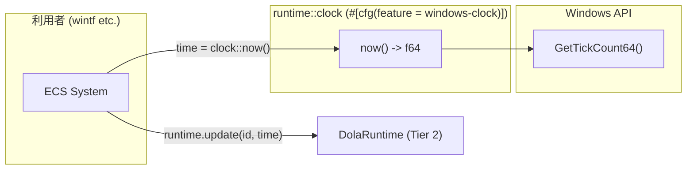

# Design Document — dola-runtime-2-clock

## Overview

**Purpose**: OS 起動時からの高精度な現在時刻（f64 秒）を取得するユーティリティ関数を提供する。dola ランタイムの `update()` 呼び出し時に利用者が時刻を取得する手段として機能する。

**Users**: wintf ECS システムなど、dola ランタイムの利用者。facade は clock を直接参照しない（利用者が `now()` で時刻を取得し、`update()` に渡す）。

**Impact**: `Cargo.toml` に `windows` オプショナル依存を追加。`runtime/clock.rs` を1ファイル追加。既存コードの変更なし。

### Goals

- `now() -> f64` 関数の提供（OS 起動時からの秒数、マイクロ秒級精度）
- `#[cfg(target_os = "windows")]` による条件コンパイル
- QueryPerformanceCounter ベースの高精度時刻取得

### Non-Goals

- クロスプラットフォーム対応（Windows 専用）
- facade への統合（clock は facade とは独立）
- タイムゾーン変換やカレンダー機能

---

## Architecture

### Architecture Pattern & Boundary Map



**Architecture Integration**:
- **選定パターン**: ステートレスな関数1つ。構造体なし
- **境界**: `pub` 関数として公開。facade は依存しない（利用者経由で時刻が渡される）
- **Steering 準拠**: `unsafe` は Win32 API 呼び出しのみ（`GetTickCount64` は安全な FFI）
- **条件コンパイル**: `#[cfg(target_os = "windows")]` のみ。feature gate ではなく OS 自動判定。`runtime` feature は本仕様実装時に削除済み（dola の本質はエンジンであり、常時有効化）

### Technology Stack

| Layer | Choice / Version | Role in Feature | Notes |
|-------|------------------|-----------------|-------|
| Time Utility | Win32 `QueryPerformanceCounter` / `QueryPerformanceFrequency` | OS 起動時からの高精度時刻（マイクロ秒級） | `windows` クレート経由 |
| Windows Bindings | `windows` 0.62 | Win32 API バインディング | features: `Win32_System_Performance` |

---

## Requirements Traceability

| Requirement | Summary | Components | Interfaces |
|-------------|---------|------------|------------|
| 1.1-1.3 | 時刻取得関数 | Clock | `now()` |
| 2.1-2.4 | 実装手段選定 | Clock | 内部実装 |
| 3.1-3.4 | Feature gate 分離 | Clock | `#[cfg(feature = "windows-clock")]` |

---

## Components and Interfaces

| Component | Domain/Layer | Intent | Req Coverage | Key Dependencies | Contracts |
|-----------|-------------|--------|-------------|-----------------|-----------|
| Clock | Utility | OS 起動時からの時刻取得 | 1, 2, 3 | Win32 API (P0) | Service |

### Utility Layer

#### Clock

| Field | Detail |
|-------|--------|
| Intent | OS 起動時からの高精度時刻取得 |
| Requirements | 1, 2, 3 |

**Responsibilities & Constraints**
- `GetTickCount64` ベース（ms 精度）
- 戻り値: f64 秒（OS 起動時からの経過秒数）
- feature gate `windows-clock` で隔離
- ステートレス（グローバル状態なし）

**Dependencies**
- External: Win32 API `GetTickCount64` via `windows` crate (P0)

**Contracts**: Service [x]

##### Service Interface

```rust
/// OS 起動時からの現在時刻（f64秒）を取得
///
/// `QueryPerformanceCounter()` の戻り値（カウント）を
/// `QueryPerformanceFrequency()` で除算して秒に変換。
/// ハードウェアレベルの高精度タイマーを使用し、マイクロ秒級の精度を提供。
///
/// # Note
/// - OS 起動時を起点とする単調増加時刻
/// - マルチプロセスで共有可能
/// - アニメーションエンジンのフレーム間時間差計測に最適
#[cfg(target_os = "windows")]
pub fn now() -> f64 {
    use windows::Win32::System::Performance::{QueryPerformanceCounter, QueryPerformanceFrequency};
    unsafe {
        let mut counter = 0i64;
        let mut frequency = 0i64;
        QueryPerformanceCounter(&mut counter);
        QueryPerformanceFrequency(&mut frequency);
        counter as f64 / frequency as f64
    }
}
```

- **Preconditions**: なし（Windows 環境で実行中であること）
- **Postconditions**: 戻り値は OS 起動からの秒数（f64, 常に非負、マイクロ秒級精度）
- **Invariants**: 単調増加（ハードウェアレベルで保証）

**Implementation Notes**
- `QueryPerformanceCounter` はハードウェアタイマー（通常 TSC または HPET）を使用
- 分解能は通常 1MHz 以上（マイクロ秒級）、システム依存
- f64 の仮数部 53bit で約 285 年の精度維持が可能
- `unsafe` ブロックは Win32 API 呼び出しのみ。副作用なし、スレッドセーフ
- エラーハンドリング: 両 API とも常に成功（Windows XP 以降保証）

---

## Error Handling

### Error Strategy

- `now()` はエラーを返さない（`GetTickCount64` は失敗しない Win32 API）
- `Result` ではなく `f64` を直接返す

---

## Testing Strategy

### Unit Tests

- **単調増加テスト**: `now()` を2回呼び出し、2回目 ≥ 1回目であることを検証
- **非ゼロテスト**: `now()` の戻り値が 0.0 より大きいことを検証（OS 起動直後でなければ常に成立）
- **精度テスト**: `std::thread::sleep(Duration::from_millis(100))` 前後で `now()` の差分が 0.08..0.15 の範囲にあることを検証

> テストは `#[cfg(all(test, target_os = "windows"))]` で囲み、Windows ターゲット時のみ実行。

---

## Supporting References

### Cargo.toml 変更計画

```toml
# 本仕様実装時の変更内容
[dependencies]
interpolation = "0.3.0"  # runtime feature 削除に伴い常時依存化

[target.'cfg(windows)'.dependencies]
windows = { workspace = true, features = ["Win32_System_SystemInformation"] }

[features]
default = ["json"]
json = ["dep:serde_json"]
toml = ["dep:toml"]
yaml = ["dep:serde_yaml"]
```

> **BREAKING CHANGE**: `runtime` feature を削除。ランタイムエンジンは常時有効化される。`windows-clock` feature も削除。Windows ターゲット時に OS 自動判定で clock モジュールが有効化される。

### モジュール構成

```
crates/dola/src/
├── runtime/
│   ├── mod.rs          # #[cfg(feature = "windows-clock")] pub mod clock; 追加
│   └── clock.rs        # now() 関数
```

### GetTickCount64 API 仕様

- **戻り値**: OS 起動からの ms 数（u64）
- **精度**: システムタイマーの分解能に依存（通常 10-16ms）
- **スレッドセーフ**: Yes
- **失敗条件**: なし（常に成功）
- **ドキュメント**: [GetTickCount64 function (sysinfoapi.h)](https://learn.microsoft.com/windows/win32/api/sysinfoapi/nf-sysinfoapi-gettickcount64)
