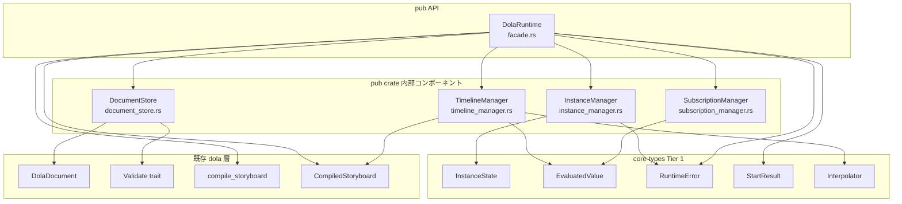
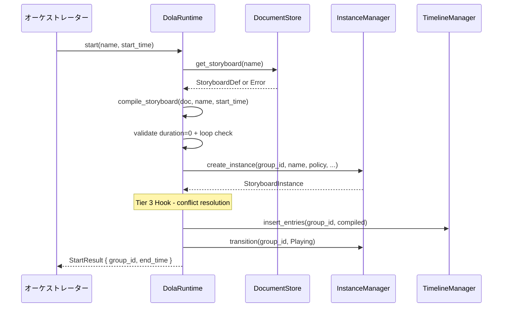
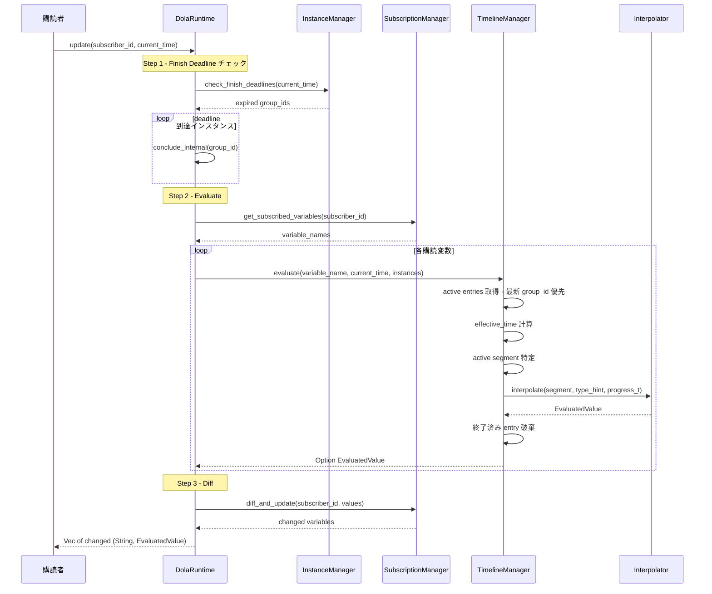
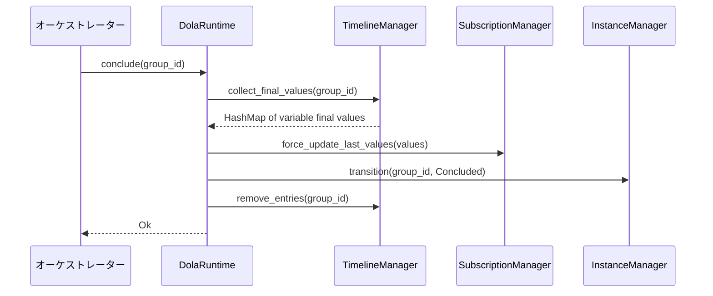
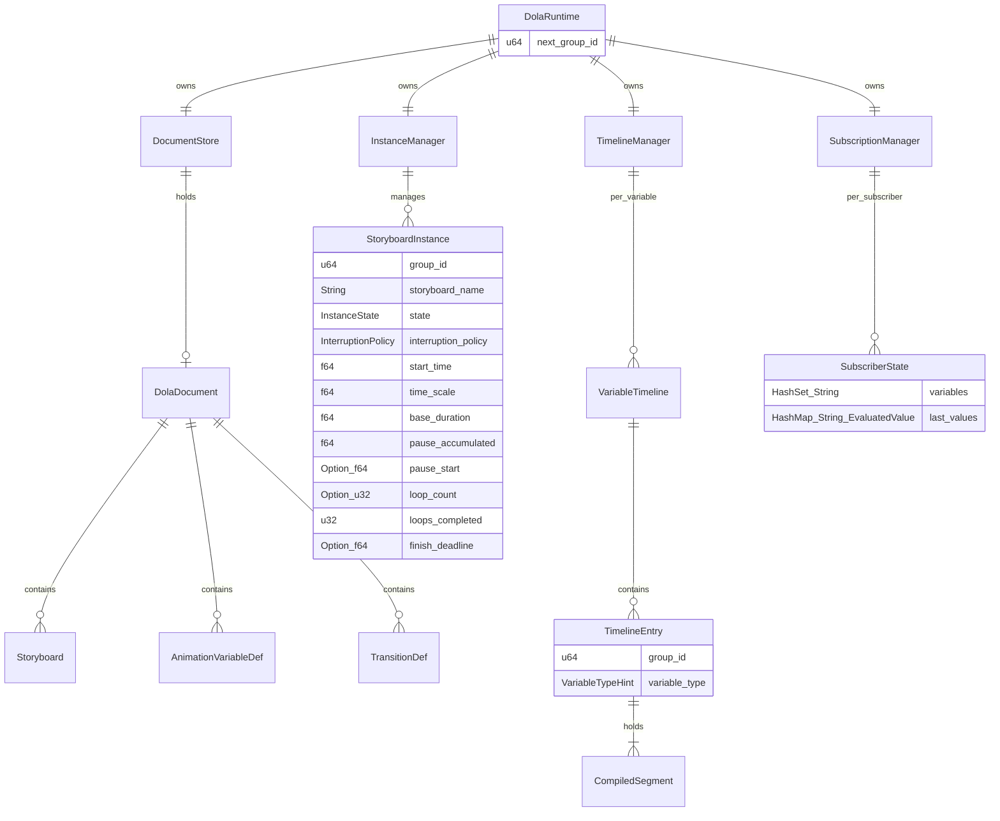

# Design Document — dola-runtime-3-facade

## Overview

**Purpose**: dola ランタイムエンジンの本体を構成する。指示書受信 → バリデーション → コンパイル → タイムテーブル管理 → 購読者への差分配信というパイプライン全体を、`DolaRuntime` facade の背後で統合する。

**Users**: オーケストレーター（親）が `load_document` / `start` / `pause` / `resume` / `conclude` / `cancel` / `finish` を呼び出し、購読者（子）が `subscribe` / `unsubscribe` / `update` を呼び出す。

**Impact**: `crates/dola/src/runtime/` に `document_store.rs`, `instance_manager.rs`, `timeline_manager.rs`, `subscription_manager.rs`, `facade.rs` を追加。core-types（Tier 1）が定義する `InstanceState`, `EvaluatedValue`, `RuntimeError`, `StartResult`, `Interpolator` に依存。既存 dola 層の変更は `runtime/mod.rs` への `mod` 追加のみ。

### Goals

- 唯一の公開 API `DolaRuntime` による facade パターンの実現
- 指示書のバリデーションと差し替え（変数引き継ぎ含む）
- group_id ベースのインスタンス管理と `InstanceState` 状態遷移
- 購読変数ごとのタイムテーブルによる時刻ベース評価
- 差分検出と pull 型値配信
- Tier 3 (conflict-loop) 追加時の拡張ポイント確保

### Non-Goals

- 競合解決（Tier 3 `dola-runtime-conflict-loop`）
- ループ再生（Tier 3 `dola-runtime-conflict-loop`）
- 時刻取得（`dola-runtime-clock` の責務）
- 外部への `InstanceState` 公開（ステートレス設計）
- `runtime` feature gate の削除（clock 仕様の責務。`research.md` Decision 1 参照）
- シリアライズ形式（TOML/JSON/YAML）の選択・変換（呼び出し側の責務）

---

## Architecture

> Discovery の詳細は `research.md` を参照。設計判断 4 件はすべて解決済み。

### Existing Architecture Analysis

Tier 1 `dola-runtime-core-types` が提供する型を消費する:

| 型 | 用途 |
|----|------|
| `InstanceState` + `try_transition()` / `from_policy()` / `is_terminal()` | InstanceManager での状態管理 |
| `EvaluatedValue` | TimelineManager / SubscriptionManager での値伝搬 |
| `RuntimeError`（4 バリアント） | 全メソッドのエラー返却 |
| `StartResult` | `start()` の返却値 |
| `Interpolator::interpolate()` | TimelineManager での補間計算 |

既存 dola 層の型:

| 型 | 用途 |
|----|------|
| `DolaDocument` | 指示書定義（DocumentStore が保持） |
| `Validate` trait / `validate()` | `load_document()` でのバリデーション |
| `compile_storyboard()` | Start 時のコンパイル |
| `CompiledStoryboard` / `CompiledSegment` | タイムテーブルのデータ |
| `CompiledVariableTimeline` / `VariableTypeHint` | コンパイラ出力（facade の `VariableTimeline` とは別物） |
| `InterruptionPolicy` | メタデータ保持（Tier 3 で使用） |
| `DolaError` | バリデーション/コンパイルエラー（`RuntimeError::CompileError` にラップ） |

### Architecture Pattern & Boundary Map



**Architecture Integration**:
- **選定パターン**: Facade パターン — `DolaRuntime` が唯一の `pub` 構造体（Option A 採用。`research.md` Architecture Pattern Evaluation 参照）
- **内部可視性**: `DocumentStore`, `InstanceManager`, `TimelineManager`, `SubscriptionManager` は `pub(crate)`
- **Feature Gate**: 現行 `runtime` feature gate 内で実装（`research.md` Decision 1）
- **Tier 3 拡張ポイント**: `start()` 内部に競合解決フック、`evaluate()` 内部にループ制御フック
- **Steering 準拠**: Rust 2024 Edition、`unsafe` なし、型安全性最大化

### Technology Stack

| Layer | Choice / Version | Role in Feature | Notes |
|-------|------------------|-----------------|-------|
| Language | Rust 2024 Edition | 全モジュール実装 | |
| Core Types | `InstanceState`, `RuntimeError` 等 | 状態管理・エラーハンドリング基盤 | Tier 1 完了済み |
| Interpolation | `interpolation` 0.3.0 | `Interpolator::interpolate()` | `runtime` feature gate 経由 |
| Data Model | `DolaDocument`, `CompiledStoryboard` | 指示書・コンパイル済みデータ | 既存 dola 層 |
| Validation | `Validate` trait | `load_document()` でのゲートキーパー | 既存 403 行 |
| Compiler | `compile_storyboard()` | Start 時のオンデマンドコンパイル | 既存 753 行 |

> 新規外部依存の追加なし。`std::collections` (`HashMap`, `HashSet`, `BTreeMap`) のみ使用。

---

## System Flows

### Start フロー



**Key Decisions**:
- `compile_storyboard()` は内部で `doc.validate()` を実行する（二重バリデーション。`research.md` Research Log 参照）
- `ZeroDurationWithLoop` チェックはコンパイル後、インスタンス作成前に実施
- Tier 3 Hook 位置: インスタンス作成後、タイムテーブル挿入前

### Update 評価サイクル



**Key Decisions**:
- Finish deadline チェックは evaluate ループの **前** に実行（`research.md` Decision 2）
- deadline 到達インスタンスは Conclude 相当で終了させ、1 回の update で正しい最終値を配信
- 処理順: deadline チェック → evaluate → diff の 3 ステップ

### Conclude / Cancel フロー



**Key Decisions** (`research.md` Decision 3):
- 操作順序: 値取得 → last_values 更新 → 状態遷移 → エントリ削除
- **Conclude**: 全セグメントの最終値（to_value）を取得して last_values を上書き
- **Cancel**: エントリ削除のみ（last_values は前回 update の値が自然に残る）

### effective_time 計算

```
effective_time = (current_time - start_time - pause_accumulated) * time_scale
```

- `start_time`: `start()` 呼び出し時の開始時刻
- `pause_accumulated`: 一時停止中の累積時間
- `time_scale`: 再生速度倍率（デフォルト 1.0）
- Pause 中: `effective_time` は Pause 開始時点で固定（`pause_start` 記録による）

---

## Requirements Traceability

| Requirement | Summary | Components | Interfaces | Flows |
|-------------|---------|------------|------------|-------|
| 1.1-1.3 | 指示書の受信とバリデーション | DocumentStore, DolaRuntime | `load_document()` | — |
| 2.1-2.4 | 指示書差し替えと変数引き継ぎ | DocumentStore, DolaRuntime, SubscriptionManager | `load_document()` | — |
| 3.1-3.6 | Start コマンド | DolaRuntime, InstanceManager, TimelineManager | `start()` | Start フロー |
| 4.1-4.3 | Start エラー | DolaRuntime | `start()`, `calculate_end_time()` | — |
| 5.1-5.7 | 制御コマンド | InstanceManager, TimelineManager, SubscriptionManager | `pause()`, `resume()`, `conclude()`, `cancel()`, `finish()` | Conclude/Cancel フロー |
| 6.1-6.6 | 購読管理 | SubscriptionManager | `subscribe()`, `unsubscribe()`, `unsubscribe_all()` | — |
| 7.1-7.5 | Update 差分配信 | DolaRuntime, TimelineManager, SubscriptionManager | `update()` | Update サイクル |
| 8.1-8.5 | タイムテーブル管理 | TimelineManager | 内部 API | Update サイクル |
| 9.1-9.6 | 状態遷移の適用 | InstanceManager | 内部 API | Start フロー |
| 10.1-10.3 | 同時再生 | TimelineManager | — | — |
| 11.1-11.3 | Tier 2 暫定動作 | TimelineManager, DolaRuntime | — | — |

---

## Components and Interfaces

| Component | Domain/Layer | Intent | Req Coverage | Key Dependencies | Contracts |
|-----------|-------------|--------|-------------|-----------------|-----------|
| DolaRuntime | Facade | 唯一の公開 API | 全要件 | 全内部コンポーネント (P0) | Service |
| DocumentStore | Data | 指示書の保持・バリデーション・差し替え | 1, 2 | DolaDocument, Validate (P0) | Service, State |
| InstanceManager | Core | 実行インスタンスのライフサイクル | 3, 4, 5, 9 | InstanceState (P0) | Service, State |
| TimelineManager | Core | 変数タイムテーブル管理と評価 | 7, 8, 10, 11 | Interpolator (P0) | Service, State |
| SubscriptionManager | Core | 購読登録と差分検出 | 6, 7 | EvaluatedValue (P0) | Service, State |

### Facade Layer

#### DolaRuntime

| Field | Detail |
|-------|--------|
| Intent | 全外部操作のエントリーポイント。内部コンポーネントへの委譲とフロー制御 |
| Requirements | 1-11（全要件） |

**Responsibilities & Constraints**
- 唯一の `pub` 構造体。外部からは `DolaRuntime` のメソッドのみアクセス可能
- コンポーネント間の協調ロジック（Start フロー、Update サイクル、Conclude/Cancel フロー）を実装
- group_id の採番（単調増加 u64）
- `compile_storyboard()` の呼び出し（DocumentStore からドキュメント取得 → コンパイル）

**Dependencies**
- Inbound: オーケストレーター — コマンド発行 (P0)
- Inbound: 購読者 — subscribe/update (P0)
- Outbound: DocumentStore — ドキュメント参照 (P0)
- Outbound: InstanceManager — インスタンス管理 (P0)
- Outbound: TimelineManager — タイムテーブル操作 (P0)
- Outbound: SubscriptionManager — 購読・差分管理 (P0)
- External: `compile_storyboard()` — コンパイラ呼び出し (P0)

**Contracts**: Service [x] / State [x]

##### Service Interface

```rust
/// 唯一の公開 API
pub struct DolaRuntime {
    document_store: DocumentStore,
    instance_manager: InstanceManager,
    timeline_manager: TimelineManager,
    subscription_manager: SubscriptionManager,
    next_group_id: u64,
}

impl DolaRuntime {
    pub fn new() -> Self;

    // --- オーケストレーター向け API ---

    /// 指示書読み込み (1)
    /// Preconditions: doc はデシリアライズ済み DolaDocument
    /// Postconditions: バリデーション成功時は内部保持、失敗時は既存保持
    pub fn load_document(&mut self, doc: DolaDocument) -> Result<(), RuntimeError>;

    /// ストーリーボード開始 (3)
    /// Preconditions: load_document() 済み、name は定義済みストーリーボード
    /// Postconditions: 新規 group_id 採番、Playing 状態、タイムテーブル挿入済み
    pub fn start(&mut self, name: &str, start_time: f64) -> Result<StartResult, RuntimeError>;

    /// 終了予定時刻のみ計算 (4.1)
    /// Preconditions: load_document() 済み
    /// Postconditions: インスタンス非生成、タイムテーブル変更なし
    pub fn calculate_end_time(&self, name: &str, start_time: f64) -> Result<f64, RuntimeError>;

    /// 一時停止 (5.1)
    pub fn pause(&mut self, group_id: u64) -> Result<(), RuntimeError>;

    /// 再開 (5.2) — 再計算した end_time を返却
    pub fn resume(&mut self, group_id: u64, current_time: f64) -> Result<f64, RuntimeError>;

    /// 最終値ジャンプ終了 (5.3)
    pub fn conclude(&mut self, group_id: u64) -> Result<(), RuntimeError>;

    /// 現在値凍結破棄 (5.4)
    pub fn cancel(&mut self, group_id: u64) -> Result<(), RuntimeError>;

    /// 遅延 Conclude (5.5)
    pub fn finish(&mut self, group_id: u64, offset: f64) -> Result<(), RuntimeError>;

    // --- 購読者向け API ---

    /// 購読登録 (6.2) — 指示書受信前でも呼び出し可能
    pub fn subscribe(&mut self, subscriber_id: u64, variable_name: &str);

    /// 購読解除 (6.3)
    pub fn unsubscribe(&mut self, subscriber_id: u64, variable_name: &str);

    /// 全購読解除 (6.4)
    pub fn unsubscribe_all(&mut self, subscriber_id: u64);

    /// 差分更新取得 (7)
    /// Postconditions: 前回 update から値が変化した変数のみ返却
    pub fn update(
        &mut self,
        subscriber_id: u64,
        current_time: f64,
    ) -> Vec<(String, EvaluatedValue)>;
}
```

- Invariants: `next_group_id` は単調増加。u64 オーバーフローは非現実的（1ns 間隔で 584 年）

**Implementation Notes**
- `load_document()`: `doc.validate()` → 成功時のみ DocumentStore に保持。失敗時は `RuntimeError::CompileError(Vec<DolaError>)` 返却、既存 document 保持
- `start()` 内部フロー: ドキュメント取得 → `compile_storyboard()` → ZeroDurationWithLoop チェック → インスタンス作成 → [Tier 3 Hook] → タイムテーブル挿入 → Playing 遷移
- `update()` 内部フロー: finish deadline チェック → 購読変数 evaluate ループ → diff_and_update
- `conclude()` / `cancel()`: `research.md` Decision 3 の操作順序に従う

### Data Layer

#### DocumentStore

| Field | Detail |
|-------|--------|
| Intent | 指示書（DolaDocument）の保持・バリデーション・差し替え |
| Requirements | 1, 2 |

**Responsibilities & Constraints**
- `DolaDocument` を `Option<DolaDocument>` で保持（初期状態は `None`）
- バリデーション（`Validate::validate()`）成功時のみ document を差し替え
- ストーリーボード定義の名前検索を提供
- 指示書差し替え時、再生中インスタンスには介入しない（`research.md` Decision 4）

**Dependencies**
- Inbound: DolaRuntime — load/取得 (P0)
- External: `DolaDocument` — 指示書型 (P0)
- External: `Validate` trait — バリデーション (P0)

**Contracts**: Service [x] / State [x]

##### Service Interface

```rust
pub(crate) struct DocumentStore {
    document: Option<DolaDocument>,
}

impl DocumentStore {
    pub fn new() -> Self;

    /// バリデーション実行 + 成功時のみ保持
    /// Preconditions: doc はデシリアライズ済み
    /// Postconditions: 成功→新doc保持、失敗→既存doc保持+エラー返却
    pub fn store(&mut self, doc: DolaDocument) -> Result<(), Vec<DolaError>>;

    /// 現在の document への参照
    pub fn document(&self) -> Option<&DolaDocument>;

    /// ストーリーボード定義の名前検索
    pub fn get_storyboard(&self, name: &str) -> Option<&Storyboard>;
}
```

##### State Management
- `document`: `Option<DolaDocument>` — `store()` 成功時に `Some(doc)` へ差し替え
- 差し替え時の変数引き継ぎは DolaRuntime 側（SubscriptionManager の `last_values`）で自動実現

### Core Layer

#### InstanceManager

| Field | Detail |
|-------|--------|
| Intent | StoryboardInstance のコレクション管理と状態遷移制御 |
| Requirements | 3, 4, 5, 9 |

**Responsibilities & Constraints**
- `HashMap<u64, StoryboardInstance>` でインスタンスを管理
- `InstanceState::try_transition()` を使用した全状態遷移の検証（9.1）
- Pause/Resume の時間計算（`pause_accumulated`, `pause_start`）
- Finish deadline の設定と expired インスタンスの検出

**Dependencies**
- Inbound: DolaRuntime — 作成・遷移・検索 (P0)
- External: `InstanceState` — 状態遷移ロジック (P0)
- External: `InterruptionPolicy` — メタデータ保持 (P0)

**Contracts**: Service [x] / State [x]

##### Service Interface

```rust
pub(crate) struct InstanceManager {
    instances: HashMap<u64, StoryboardInstance>,
}

impl InstanceManager {
    pub fn new() -> Self;

    /// インスタンス作成（Created 状態）
    pub fn create_instance(
        &mut self,
        group_id: u64,
        name: &str,
        policy: InterruptionPolicy,
        start_time: f64,
        time_scale: f64,
        base_duration: f64,
        loop_count: Option<u32>,
    ) -> &StoryboardInstance;

    /// 参照取得（InvalidGroupId エラー対応）
    pub fn get(&self, group_id: u64) -> Result<&StoryboardInstance, RuntimeError>;

    /// 可変参照取得
    pub fn get_mut(&mut self, group_id: u64) -> Result<&mut StoryboardInstance, RuntimeError>;

    /// 状態遷移（try_transition 経由）
    pub fn transition(&mut self, group_id: u64, to: InstanceState) -> Result<(), RuntimeError>;

    /// Pause: pause_start 記録 + Paused 遷移 (5.1)
    pub fn pause(&mut self, group_id: u64) -> Result<(), RuntimeError>;

    /// Resume: pause_accumulated 加算 + Playing 遷移 + end_time 再計算 (5.2)
    pub fn resume(&mut self, group_id: u64, current_time: f64) -> Result<f64, RuntimeError>;

    /// Finish deadline 設定 (5.5)
    pub fn set_finish_deadline(&mut self, group_id: u64, deadline: f64) -> Result<(), RuntimeError>;

    /// Finish deadline が到達した group_id のリストを返却
    pub fn check_finish_deadlines(&self, current_time: f64) -> Vec<u64>;

    /// 全インスタンスへの参照（evaluate 時に TimelineManager が使用）
    pub fn instances(&self) -> &HashMap<u64, StoryboardInstance>;
}
```

##### State Management

```rust
/// ストーリーボード実行インスタンス
pub(crate) struct StoryboardInstance {
    pub group_id: u64,
    pub storyboard_name: String,
    pub state: InstanceState,
    pub interruption_policy: InterruptionPolicy,
    pub start_time: f64,
    pub time_scale: f64,
    pub base_duration: f64,
    pub pause_accumulated: f64,
    pub pause_start: Option<f64>,
    pub loop_count: Option<u32>,    // Tier 2: 無視、Tier 3: LoopController が使用
    pub loops_completed: u32,        // Tier 2: 常に 0
    pub finish_deadline: Option<f64>,
}
```

- `state`: `InstanceState::try_transition()` による遷移検証。不正遷移時は `RuntimeError::InvalidGroupId`
- `pause_start`: Pause 時に `Some(current_time)` を記録。Resume 時に `pause_accumulated += current_time - pause_start.unwrap()`
- `finish_deadline`: `finish(group_id, offset)` で `Some(current_time + offset)` を設定。update() 冒頭でチェック

#### TimelineManager

| Field | Detail |
|-------|--------|
| Intent | 購読変数ごとのタイムテーブル管理と時刻ベース評価 |
| Requirements | 7, 8, 10, 11 |

**Responsibilities & Constraints**
- 変数名をキーとした `HashMap<String, VariableTimeline>` を管理
- `evaluate()` で `effective_time` 計算 → セグメント特定 → `Interpolator::interpolate()` 呼び出し
- 複数 group_id 共存時は最新（最大）group_id 優先（Tier 2 暫定動作、11.1）
- 終了済みエントリの自動破棄（7.2、8.5）
- Conclude 用: 全セグメントの最終値取得
- 人為的再生数上限なし（10.2）

**Dependencies**
- Inbound: DolaRuntime — エントリ挿入・評価・削除 (P0)
- External: `Interpolator` — 補間計算 (P0)
- External: `CompiledStoryboard` / `CompiledSegment` — コンパイル済みデータ (P0)

**Contracts**: Service [x] / State [x]

##### Service Interface

```rust
pub(crate) struct TimelineManager {
    timelines: HashMap<String, VariableTimeline>,
}

impl TimelineManager {
    pub fn new() -> Self;

    /// コンパイル結果をタイムテーブルに追加 (8.2)
    pub fn insert_entries(
        &mut self,
        group_id: u64,
        compiled: &CompiledStoryboard,
    );

    /// 指定変数の現在値を評価 (7.1)
    /// 最新 group_id 優先（Tier 2 暫定動作）
    /// 終了済みエントリは自動破棄
    pub fn evaluate(
        &mut self,
        variable_name: &str,
        current_time: f64,
        instances: &HashMap<u64, StoryboardInstance>,
    ) -> Option<EvaluatedValue>;

    /// Conclude 用: group_id の全変数の最終値を取得
    pub fn collect_final_values(
        &self,
        group_id: u64,
    ) -> HashMap<String, EvaluatedValue>;

    /// group_id の全エントリを削除 (8.5)
    pub fn remove_entries(&mut self, group_id: u64);
}
```

##### State Management

```rust
/// 変数ごとのタイムライン
pub(crate) struct VariableTimeline {
    pub entries: Vec<TimelineEntry>,
}

/// 1つの group_id に属するセグメント群
pub(crate) struct TimelineEntry {
    pub group_id: u64,
    pub segments: Vec<CompiledSegment>,
    pub variable_type: VariableTypeHint,
}
```

> `CompiledVariableTimeline`（コンパイラ出力）と `VariableTimeline`（ランタイム管理用）は別物。`insert_entries()` がコンパイラ出力を分解して `TimelineEntry` に変換する。

**evaluate() ロジック**:
1. 変数のタイムラインからエントリを取得
2. 各エントリの `effective_time` を計算: `(current_time - instance.start_time - instance.pause_accumulated) * instance.time_scale`
3. Paused インスタンスは `effective_time` を Pause 開始時点で固定
4. `effective_time` に基づいてアクティブなセグメントを特定（`segment.start_time <= effective_time < segment.end_time`）
5. `progress_t = (effective_time - segment.start_time) / (segment.end_time - segment.start_time)` を計算
6. `Interpolator::interpolate(segment, variable_type, progress_t)` で補間値を計算
7. 複数 group_id が存在する場合、最新（最大）group_id の値を採用（11.1）
8. 全セグメント終了済みのエントリは破棄（8.5）

#### SubscriptionManager

| Field | Detail |
|-------|--------|
| Intent | 購読者ごとの変数購読状態と差分検出 |
| Requirements | 6, 7 |

**Responsibilities & Constraints**
- 購読登録は指示書受信前でも受付可能（6.1）
- 購読されていない変数の評価を行わない（6.5）
- 差分検出: 前回 update からの値変化のみを返却（7.1）
- 指示書に存在しない変数の購読は無視（6.6 — コンパイル対象にならない）

**Dependencies**
- Inbound: DolaRuntime — 購読操作・差分検出 (P0)
- External: `EvaluatedValue` — 値比較 (P0)

**Contracts**: Service [x] / State [x]

##### Service Interface

```rust
pub(crate) struct SubscriptionManager {
    subscribers: HashMap<u64, SubscriberState>,
}

impl SubscriptionManager {
    pub fn new() -> Self;

    /// 購読登録（指示書受信前でも可 6.1）
    pub fn subscribe(&mut self, subscriber_id: u64, variable_name: &str);

    /// 購読解除
    pub fn unsubscribe(&mut self, subscriber_id: u64, variable_name: &str);

    /// 全購読解除（Drop 対応 6.4）
    pub fn unsubscribe_all(&mut self, subscriber_id: u64);

    /// 購読中変数名のリスト取得
    pub fn get_subscribed_variables(&self, subscriber_id: u64) -> Vec<&str>;

    /// 値を比較し、変化した変数のみを返す。同時に last_values を更新 (7.1)
    pub fn diff_and_update(
        &mut self,
        subscriber_id: u64,
        values: HashMap<String, EvaluatedValue>,
    ) -> Vec<(String, EvaluatedValue)>;

    /// Conclude 用: 最終値で last_values を強制更新
    pub fn force_update_last_values(
        &mut self,
        values: &HashMap<String, EvaluatedValue>,
    );
}
```

##### State Management

```rust
pub(crate) struct SubscriberState {
    pub variables: HashSet<String>,
    pub last_values: HashMap<String, EvaluatedValue>,
}
```

- `variables`: 購読中の変数名セット
- `last_values`: 前回 update で配信した値。diff_and_update で `PartialEq` 比較
- 凍結変数: タイムテーブルにエントリがなくなった変数は `last_values` の値で固定（値変化なし → 差分配信なし）

---

## Data Models

### Domain Model



**Aggregates and Boundaries**:
- `DolaRuntime` がルート集約。全コンポーネントを所有し、外部からの操作は facade メソッドのみ
- `StoryboardInstance` は InstanceManager が所有。TimelineManager は `group_id` 経由で参照
- `TimelineEntry` は `CompiledSegment` を直接所有（`clone` によるコピー）
- `SubscriberState` は独立管理。タイムテーブル操作との整合は `diff_and_update()` で lazy に実現

---

## Error Handling

### Error Strategy

`RuntimeError`（core-types 定義、4 バリアント）を全メソッドで使用。

### Error Categories and Responses

| エラー | カテゴリ | 発生条件 | 対応 |
|-------|---------|---------|------|
| `StoryboardNotFound(String)` | User Error | 未定義ストーリーボード名で `start()` / `calculate_end_time()` | 即座にエラー返却 (4.2) |
| `InvalidGroupId(u64)` | User Error | 存在しない or 終了済み group_id で制御コマンド | 即座にエラー返却 (5.7) |
| `ZeroDurationWithLoop { storyboard }` | User Error | duration=0 かつ loop_count 設定で `start()` | コンパイル後、インスタンス作成前にエラー (4.3) |
| `CompileError(Vec<DolaError>)` | User Error | `load_document()` バリデーション失敗 / `compile_storyboard()` 失敗 | 既存 document 保持 (1.3) |

**Key Patterns**:
- **Fail Fast**: 無効な group_id、終了済みインスタンスは即座にエラー。`InstanceState::is_terminal()` でチェック
- **Graceful Degradation**: `load_document()` バリデーション失敗時は既存定義を維持（1.3）
- **Tier 2 暫定**: 競合は検出せず共存を許可。最新 group_id 優先（11.1）
- **RuntimeError ← Vec<DolaError>**: `From` impl 済み（`?` 演算子で自動変換）

---

## Testing Strategy

### Unit Tests

**DocumentStore** (~5 tests):
- 初期状態は None
- `store()` バリデーション成功時の定義保持
- `store()` バリデーション失敗時の既存保持（Graceful Degradation）
- `get_storyboard()` の名前検索
- 上書き（差し替え）

**InstanceManager** (~10 tests):
- `create_instance()` と Created 状態
- `transition()` — 正常遷移（Created→Playing, Playing→Paused, Paused→Playing, Playing→Concluded）
- `transition()` — 不正遷移（Created→Paused, Concluded→Playing）→ エラー
- `pause()` — `pause_start` 記録
- `resume()` — `pause_accumulated` 計算と `end_time` 再計算
- `set_finish_deadline()` と `check_finish_deadlines()`
- 終了済みインスタンスへの操作拒否（`InvalidGroupId`）
- 存在しない group_id への操作（`InvalidGroupId`）

**TimelineManager** (~8 tests):
- `insert_entries()` — エントリ挿入
- `evaluate()` — 正常補間（Float, Integer, Object）
- `evaluate()` — `effective_time` 計算の正確性
- `evaluate()` — 最新 group_id 優先ルール（11.1）
- `evaluate()` — 終了済みエントリの自動破棄
- `evaluate()` — Pause 中の値固定
- `collect_final_values()` — 最終値取得
- `remove_entries()` — エントリ削除

**SubscriptionManager** (~7 tests):
- `subscribe()` / `unsubscribe()` / `unsubscribe_all()`
- 差分検出 — 値変化あり
- 差分検出 — 値変化なし（空 Vec 返却）
- `force_update_last_values()` — Conclude 用
- 指示書未定義変数の購読（無視される）
- 指示書受信前の購読登録（6.1）

### Integration Tests

- **フル再生サイクル**: `load_document` → `subscribe` → `start` → `update`（複数回）→ 自然終了 → 差分が空になることを検証
- **Pause/Resume サイクル**: Pause 中の値固定と Resume 後の継続、`end_time` 再計算を検証
- **指示書差し替え**: 再生中に `load_document`、同名変数の値引き継ぎと消失変数の凍結を検証
- **同時再生**: 異なる変数を操作する 2 つのストーリーボードの並行動作を検証
- **Conclude**: 最終値ジャンプ → 次回 update で最終値が差分配信 → その後は差分なし
- **Cancel**: 現在値凍結 → 次回 update で差分なし
- **Finish**: 遅延 Conclude — offset 経過前後の update で動作検証
- **CalculateEndTime**: 実行インスタンス非生成を検証
- **バリデーション失敗**: 不正な指示書 → CompileError 返却、既存定義維持を検証

---

## Supporting References

### Tier 3 拡張ポイント

`start()` メソッド内部に以下の拡張ポイントを設計する:

```rust
// DolaRuntime::start() 内部（疑似コード）
fn start(&mut self, name: &str, start_time: f64) -> Result<StartResult, RuntimeError> {
    // 1. ドキュメント取得 + コンパイル
    let doc = self.document_store.document()
        .ok_or(RuntimeError::StoryboardNotFound(name.to_string()))?;
    let compiled = compile_storyboard(doc, name, start_time)?;

    // 2. ZeroDurationWithLoop チェック
    if compiled.total_base_duration == 0.0 && compiled.loop_count.is_some() {
        return Err(RuntimeError::ZeroDurationWithLoop { storyboard: name.to_string() });
    }

    // 3. インスタンス作成
    let group_id = self.next_group_id;
    self.next_group_id += 1;
    self.instance_manager.create_instance(
        group_id, name, compiled.interruption_policy,
        start_time, compiled.time_scale, compiled.total_base_duration,
        compiled.loop_count,
    );

    // 4. [Tier 3 Hook] 競合解決
    // Tier 2: スキップ
    // Tier 3: self.conflict_resolver.resolve_conflicts(...)

    // 5. タイムテーブル挿入
    self.timeline_manager.insert_entries(group_id, &compiled);

    // 6. 状態遷移 Created → Playing
    self.instance_manager.transition(group_id, InstanceState::Playing)?;

    // 7. end_time 算出
    let end_time = if compiled.loop_count == Some(0) {
        f64::INFINITY  // 無限ループ (3.6)
    } else {
        start_time + compiled.total_base_duration / compiled.time_scale
    };

    Ok(StartResult { group_id, end_time })
}
```

### update() 内部フロー（疑似コード）

```rust
fn update(&mut self, subscriber_id: u64, current_time: f64) -> Vec<(String, EvaluatedValue)> {
    // Step 1: Finish Deadline チェック (research.md Decision 2)
    let expired = self.instance_manager.check_finish_deadlines(current_time);
    for gid in expired {
        self.conclude_internal(gid);  // Conclude 相当の内部処理
    }

    // Step 2: 購読変数の評価
    let var_names = self.subscription_manager.get_subscribed_variables(subscriber_id);
    let mut values = HashMap::new();
    for name in var_names {
        if let Some(val) = self.timeline_manager.evaluate(
            name, current_time, self.instance_manager.instances()
        ) {
            values.insert(name.to_string(), val);
        }
    }

    // Step 3: 差分検出
    self.subscription_manager.diff_and_update(subscriber_id, values)
}
```

### モジュール構成

```
crates/dola/src/runtime/
├── mod.rs                   # pub(crate) re-export + pub DolaRuntime re-export
├── instance_state.rs        # (Tier 1 完了)
├── types.rs                 # (Tier 1 完了)
├── interpolator.rs          # (Tier 1 完了)
├── document_store.rs        # NEW — DocumentStore
├── instance_manager.rs      # NEW — InstanceManager + StoryboardInstance
├── timeline_manager.rs      # NEW — TimelineManager + VariableTimeline + TimelineEntry
├── subscription_manager.rs  # NEW — SubscriptionManager + SubscriberState
└── facade.rs                # NEW — DolaRuntime (pub)
```
