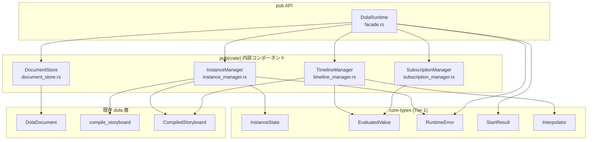
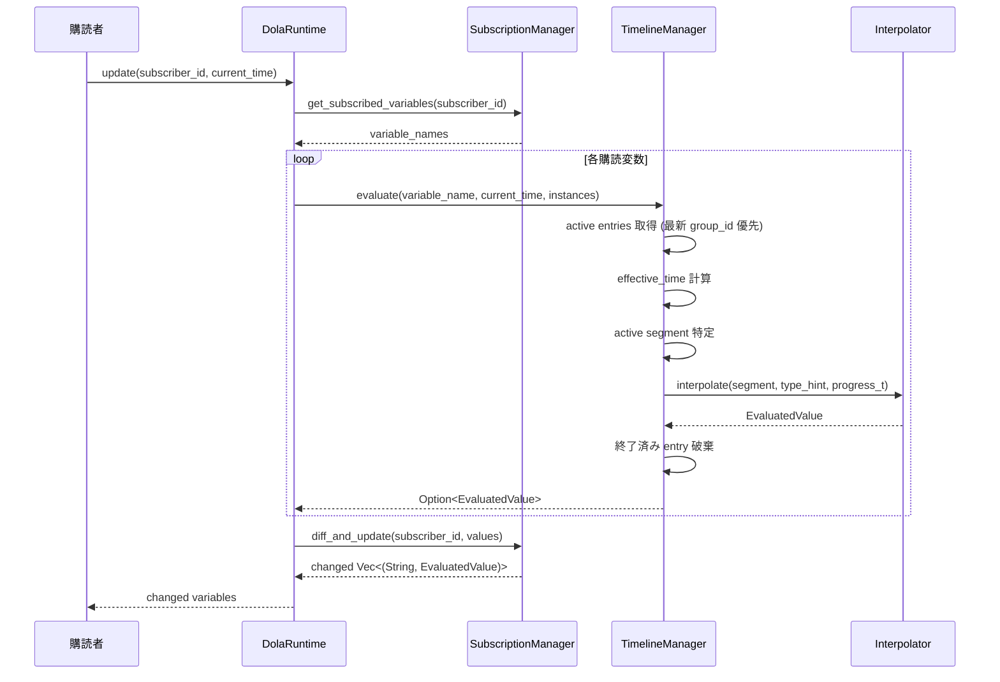
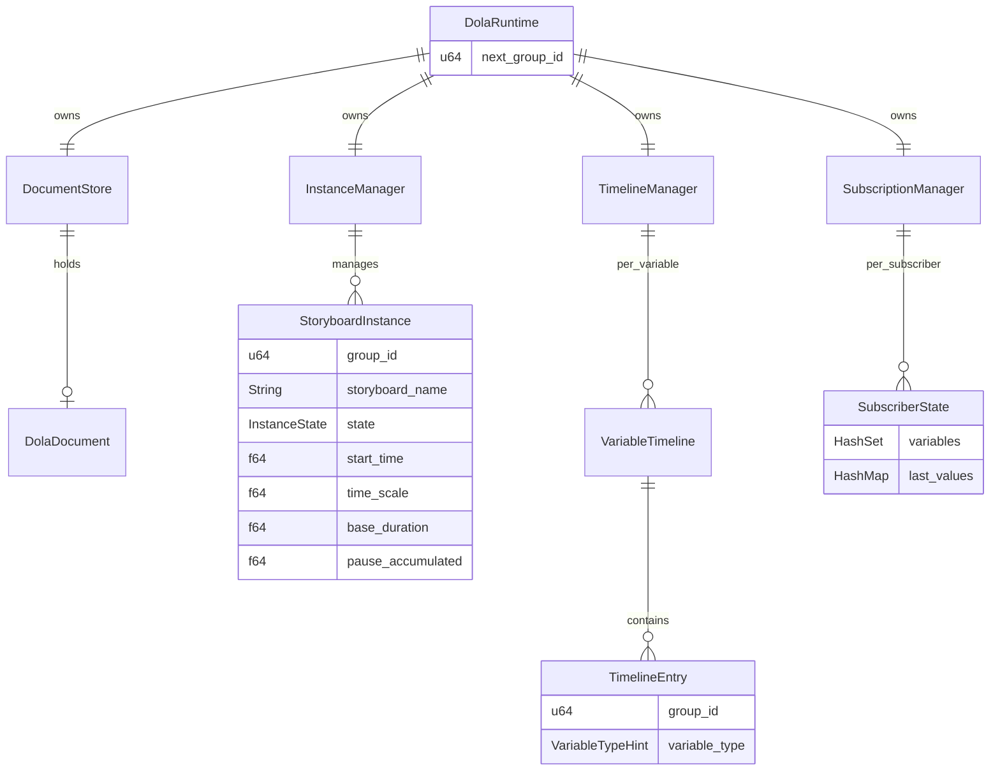

# Design Document — dola-runtime-3-facade

## Overview

**Purpose**: dola ランタイムエンジンの本体を構成する。指示書受信 → コンパイル → タイムテーブル管理 → 購読者への差分配信というパイプライン全体を、`DolaRuntime` facade の背後で統合する。

**Users**: オーケストレーター（親）が `load_document` / `start` / `pause` / `resume` / `conclude` / `cancel` / `finish` を呼び出し、購読者（子）が `subscribe` / `unsubscribe` / `update` を呼び出す。

**Impact**: `crates/dola/src/runtime/` に `document_store.rs`, `instance_manager.rs`, `timeline_manager.rs`, `subscription_manager.rs`, `facade.rs` を追加。core-types（Tier 1）が定義する `InstanceState`, `EvaluatedValue`, `RuntimeError`, `StartResult`, `Interpolator` に依存。既存 dola 層の変更なし。

### Goals

- 唯一の公開 API `DolaRuntime` による facade パターンの実現
- 指示書の差し替えと変数引き継ぎ
- group_id ベースのインスタンス管理と状態遷移
- 購読変数ごとのタイムテーブルによる時刻ベース評価
- 差分検出と pull 型値配信
- Tier 3 (conflict-loop) 追加時の拡張ポイント確保

### Non-Goals

- 競合解決（Req 7 — Tier 3）
- ループ再生（Req 12 — Tier 3）
- 時刻取得（Req 11 — `dola-runtime-clock` の責務）
- 外部への `InstanceState` 公開（ステートレス設計）

---

## Architecture

### Existing Architecture Analysis

Tier 1 `dola-runtime-core-types` が提供する型を消費する:

| 型 | 用途 |
|----|------|
| `InstanceState` + `try_transition()` / `from_policy()` / `is_terminal()` | InstanceManager での状態管理 |
| `EvaluatedValue` | TimelineManager / SubscriptionManager での値伝搬 |
| `RuntimeError` | 全メソッドのエラー返却 |
| `StartResult` | `start()` の返却値 |
| `Interpolator::interpolate()` | TimelineManager での補間計算 |

既存 dola 層の型:

| 型 | 用途 |
|----|------|
| `DolaDocument` | 指示書定義（DocumentStore が保持） |
| `compile_storyboard()` | Start 時のコンパイル |
| `CompiledStoryboard` / `CompiledSegment` | タイムテーブルのデータ |
| `InterruptionPolicy` | メタデータ保持（Tier 3 で使用） |
| `VariableTypeHint` | 型別補間ディスパッチ |

### Architecture Pattern & Boundary Map



**Architecture Integration**:
- **選定パターン**: Facade パターン — `DolaRuntime` が唯一の `pub` 構造体
- **内部可視性**: `DocumentStore`, `InstanceManager`, `TimelineManager`, `SubscriptionManager` は `pub(crate)`
- **Tier 3 拡張ポイント**: `start()` 内部に競合解決フック、`evaluate()` 内部にループ制御フック
- **Steering 準拠**: Rust 2024 Edition、`unsafe` なし、型安全性最大化

---

## System Flows

### Start フロー


### Update 評価サイクル



### effective_time 計算

```
effective_time = (current_time - start_time - pause_accumulated) * time_scale
```

- `start_time`: `start()` 呼び出し時の開始時刻
- `pause_accumulated`: 一時停止中の累積時間
- `time_scale`: 再生速度倍率（デフォルト 1.0）
- Pause 中: `effective_time` はPause開始時点で固定

---

## Requirements Traceability

| Requirement | Summary | Components | Interfaces | Flows |
|-------------|---------|------------|------------|-------|
| 1.1 | 指示書の受信 | DocumentStore | `load_document()` | — |
| 2.1-2.4 | 指示書差し替え | DocumentStore, DolaRuntime | `load_document()` | — |
| 3.1-3.6 | Start コマンド | InstanceManager, TimelineManager | `start()` | Start フロー |
| 4.1-4.3 | Start エラー | DolaRuntime | `start()`, `calculate_end_time()` | — |
| 5.1-5.7 | 制御コマンド | InstanceManager | `pause()`, `resume()` 等 | — |
| 6.1-6.6 | 購読管理 | SubscriptionManager | `subscribe()` 等 | — |
| 7.1-7.5 | Update 差分配信 | TimelineManager, SubscriptionManager | `update()` | Update サイクル |
| 8.1-8.5 | タイムテーブル管理 | TimelineManager | 内部 API | Update サイクル |
| 9.1-9.6 | 状態遷移の適用 | InstanceManager | 内部 API | Start フロー |
| 10.1-10.3 | 同時再生 | TimelineManager | — | — |
| 11.1-11.3 | Tier 2 暫定動作 | TimelineManager, DolaRuntime | — | — |

---

## Components and Interfaces

| Component | Domain/Layer | Intent | Req Coverage | Key Dependencies | Contracts |
|-----------|-------------|--------|-------------|-----------------|-----------|
| DolaRuntime | Facade | 唯一の公開 API | 全要件 | 全内部コンポーネント (P0) | Service |
| DocumentStore | Data | 指示書定義の保持と差し替え | 1, 2 | DolaDocument (P0) | State |
| InstanceManager | Core | 実行インスタンスのライフサイクル | 3, 4, 5, 9 | InstanceState (P0) | Service, State |
| TimelineManager | Core | 変数タイムテーブル管理と評価 | 7, 8, 10, 11 | Interpolator (P0) | Service, State |
| SubscriptionManager | Core | 購読登録と差分検出 | 6, 7 | EvaluatedValue (P0) | Service, State |

### Facade Layer

#### DolaRuntime

| Field | Detail |
|-------|--------|
| Intent | 全外部操作のエントリーポイント。内部コンポーネントへの委譲のみ |
| Requirements | 1-11（全要件） |

**Dependencies**
- Inbound: オーケストレーター — コマンド発行 (P0)
- Inbound: 購読者 — subscribe/update (P0)
- Outbound: DocumentStore, InstanceManager, TimelineManager, SubscriptionManager (P0)

##### Service Interface

```rust
/// 唯一の公開 API
pub struct DolaRuntime {
    document_store: DocumentStore,
    instance_manager: InstanceManager,
    timeline_manager: TimelineManager,
    subscription_manager: SubscriptionManager,
    next_group_id: u64,
}

impl DolaRuntime {
    pub fn new() -> Self;

    /// 指示書読み込み (Req 1)
    pub fn load_document(&mut self, doc: DolaDocument) -> Result<(), RuntimeError>;

    /// ストーリーボード開始 (Req 3)
    pub fn start(&mut self, name: &str, start_time: f64) -> Result<StartResult, RuntimeError>;

    /// 終了予定時刻のみ計算 (Req 4)
    pub fn calculate_end_time(&self, name: &str, start_time: f64) -> Result<f64, RuntimeError>;

    /// 一時停止 (Req 5.1)
    pub fn pause(&mut self, group_id: u64) -> Result<(), RuntimeError>;

    /// 再開 (Req 5.2)
    pub fn resume(&mut self, group_id: u64, current_time: f64) -> Result<f64, RuntimeError>;

    /// 最終値ジャンプ終了 (Req 5.3)
    pub fn conclude(&mut self, group_id: u64) -> Result<(), RuntimeError>;

    /// 現在値凍結破棄 (Req 5.4)
    pub fn cancel(&mut self, group_id: u64) -> Result<(), RuntimeError>;

    /// 遅延 Conclude (Req 5.5)
    pub fn finish(&mut self, group_id: u64, offset: f64) -> Result<(), RuntimeError>;

    /// 購読登録 (Req 6.2)
    pub fn subscribe(&mut self, subscriber_id: u64, variable_name: &str);

    /// 購読解除 (Req 6.3)
    pub fn unsubscribe(&mut self, subscriber_id: u64, variable_name: &str);

    /// 全購読解除 (Req 6.4)
    pub fn unsubscribe_all(&mut self, subscriber_id: u64);

    /// 差分更新取得 (Req 7)
    pub fn update(
        &mut self,
        subscriber_id: u64,
        current_time: f64,
    ) -> Vec<(String, EvaluatedValue)>;
}
```

**group_id Generation**: `next_group_id` を `start()` 呼び出し毎にインクリメント。u64 オーバーフローは非現実的。

### Data Layer

#### DocumentStore

| Field | Detail |
|-------|--------|
| Intent | 指示書（DolaDocument）の保持と差し替え |
| Requirements | 1, 2 |

##### State Management

```rust
pub(crate) struct DocumentStore {
    document: Option<DolaDocument>,
}

impl DocumentStore {
    pub fn new() -> Self;
    pub fn load(&mut self, toml_str: &str) -> Result<(), RuntimeError>;
    pub fn document(&self) -> Option<&DolaDocument>;
    pub fn get_storyboard(&self, name: &str) -> Option<&StoryboardDef>;
}
```

- `load()` はパース成功時のみ `document` を差し替え。失敗時はエラー返却、既存保持

### Core Layer

#### InstanceManager

| Field | Detail |
|-------|--------|
| Intent | StoryboardInstance のコレクション管理と状態遷移制御 |
| Requirements | 3, 4, 5, 9 |

##### State Management

```rust
pub(crate) struct InstanceManager {
    instances: HashMap<u64, StoryboardInstance>,
}

/// ストーリーボード実行インスタンス
pub(crate) struct StoryboardInstance {
    pub group_id: u64,
    pub storyboard_name: String,
    pub state: InstanceState,
    pub interruption_policy: InterruptionPolicy,
    pub start_time: f64,
    pub time_scale: f64,
    pub base_duration: f64,
    pub pause_accumulated: f64,
    pub pause_start: Option<f64>,
    pub loop_count: Option<u32>,   // Tier 2: 無視、Tier 3: LoopController が使用
    pub loops_completed: u32,       // Tier 2: 常に 0
    pub finish_deadline: Option<f64>,
}

impl InstanceManager {
    pub fn new() -> Self;
    pub fn create_instance(&mut self, group_id: u64, name: &str, ...) -> &StoryboardInstance;
    pub fn get(&self, group_id: u64) -> Result<&StoryboardInstance, RuntimeError>;
    pub fn get_mut(&mut self, group_id: u64) -> Result<&mut StoryboardInstance, RuntimeError>;
    pub fn transition(&mut self, group_id: u64, to: InstanceState) -> Result<(), RuntimeError>;
    pub fn pause(&mut self, group_id: u64) -> Result<(), RuntimeError>;
    pub fn resume(&mut self, group_id: u64, current_time: f64) -> Result<f64, RuntimeError>;
}
```

#### TimelineManager

| Field | Detail |
|-------|--------|
| Intent | 購読変数ごとのタイムテーブル管理と時刻ベース評価 |
| Requirements | 7, 8, 10, 11 |

##### State Management

```rust
pub(crate) struct TimelineManager {
    timelines: HashMap<String, VariableTimeline>,
}

/// 変数ごとのタイムライン
pub(crate) struct VariableTimeline {
    pub entries: Vec<TimelineEntry>,
}

/// 1つの group_id に属するセグメント群
pub(crate) struct TimelineEntry {
    pub group_id: u64,
    pub segments: Vec<CompiledSegment>,
    pub variable_type: VariableTypeHint,
}

impl TimelineManager {
    pub fn new() -> Self;

    /// コンパイル結果をタイムテーブルに追加
    pub fn insert_entries(
        &mut self,
        group_id: u64,
        compiled: &CompiledStoryboard,
        instance: &StoryboardInstance,
    );

    /// 指定変数の現在値を評価
    /// 最新 group_id 優先（Tier 2 暫定動作）
    pub fn evaluate(
        &mut self,
        variable_name: &str,
        current_time: f64,
        instances: &HashMap<u64, StoryboardInstance>,
    ) -> Option<EvaluatedValue>;

    /// group_id の全エントリを削除
    pub fn remove_entries(&mut self, group_id: u64);
}
```

**evaluate() ロジック**:
1. 変数のタイムラインからエントリを取得
2. 各エントリの `effective_time` を計算: `(current_time - instance.start_time - instance.pause_accumulated) * instance.time_scale`
3. `effective_time` に基づいてアクティブなセグメントを特定
4. `Interpolator::interpolate()` で補間値を計算
5. 複数 group_id が存在する場合、最新（最大）group_id の値を採用
6. 全セグメント終了済みのエントリは破棄

#### SubscriptionManager

| Field | Detail |
|-------|--------|
| Intent | 購読者ごとの変数購読状態と差分検出 |
| Requirements | 6, 7 |

##### State Management

```rust
pub(crate) struct SubscriptionManager {
    subscribers: HashMap<u64, SubscriberState>,
}

pub(crate) struct SubscriberState {
    pub variables: HashSet<String>,
    pub last_values: HashMap<String, EvaluatedValue>,
}

impl SubscriptionManager {
    pub fn new() -> Self;
    pub fn subscribe(&mut self, subscriber_id: u64, variable_name: &str);
    pub fn unsubscribe(&mut self, subscriber_id: u64, variable_name: &str);
    pub fn unsubscribe_all(&mut self, subscriber_id: u64);
    pub fn get_subscribed_variables(&self, subscriber_id: u64) -> Vec<&str>;

    /// 値を比較し、変化した変数のみを返す。同時に last_values を更新
    pub fn diff_and_update(
        &mut self,
        subscriber_id: u64,
        values: HashMap<String, EvaluatedValue>,
    ) -> Vec<(String, EvaluatedValue)>;
}
```

---

## Data Models

### DolaRuntime 全体の所有構造



---

## Error Handling

### Error Strategy

- `RuntimeError`（core-types 定義）を全メソッドで使用
- **Fail Fast**: 無効な group_id、終了済みインスタンス、未定義ストーリーボードは即座にエラー
- **Graceful Degradation**: `load_document` バリデーション失敗時は既存定義を維持 (Req 1.3)
- **Tier 2 暫定**: 競合は検出せず共存を許可（最新 group_id 優先）

---

## Testing Strategy

### Unit Tests

**DocumentStore**:
- 定義保持、上書き、バリデーション失敗時の既存保持

**InstanceManager**:
- group_id 採番の単調増加
- 状態遷移の正当性（`try_transition` 経由）
- Pause/Resume の `pause_accumulated` 計算
- Finish deadline 設定
- 終了済みインスタンスへの操作拒否

**TimelineManager**:
- エントリ挿入と取得
- `evaluate()` の `effective_time` 計算
- 最新 group_id 優先ルール
- 終了済みエントリの自動破棄

**SubscriptionManager**:
- subscribe/unsubscribe/unsubscribe_all
- 差分検出（値変化あり/なし）
- 指示書未定義変数の無視

### Integration Tests

- **フル再生サイクル**: `load_document` → `subscribe` → `start` → `update`（複数回）→ 自然終了、値の変化を検証
- **Pause/Resume サイクル**: Pause 中の値固定と Resume 後の継続を検証
- **指示書差し替え**: 再生中に `load_document`、同名変数の値引き継ぎと消失変数の凍結を検証
- **同時再生**: 異なる変数を操作する2つのストーリーボードの並行動作を検証
- **制御コマンド**: Conclude（最終値ジャンプ）、Cancel（凍結）、Finish（遅延Conclude）の動作検証
- **CalculateEndTime**: 実行インスタンス非生成を検証

---

## Supporting References

### Tier 3 拡張ポイント

`start()` メソッド内部に以下の拡張ポイントを設計する:

```rust
// DolaRuntime::start() 内部（疑似コード）
fn start(&mut self, name: &str, start_time: f64) -> Result<StartResult, RuntimeError> {
    // 1. ドキュメント取得 + コンパイル
    let compiled = self.compile(name, start_time)?;

    // 2. インスタンス作成
    let group_id = self.next_group_id();
    let instance = self.instance_manager.create_instance(group_id, name, ...);

    // 3. [Tier 3 Hook] 競合解決
    // Tier 2: スキップ
    // Tier 3: self.conflict_resolver.resolve_conflicts(...)

    // 4. タイムテーブル挿入
    self.timeline_manager.insert_entries(group_id, &compiled, &instance);

    // 5. 状態遷移 Created → Playing
    self.instance_manager.transition(group_id, InstanceState::Playing)?;

    // 6. 結果返却
    Ok(StartResult { group_id, end_time })
}
```

### モジュール構成

```
crates/dola/src/runtime/
├── mod.rs                   # pub(crate) re-export + pub DolaRuntime re-export
├── instance_state.rs        # (Tier 1)
├── types.rs                 # (Tier 1)
├── interpolator.rs          # (Tier 1)
├── document_store.rs        # ← NEW
├── instance_manager.rs      # ← NEW
├── timeline_manager.rs      # ← NEW
├── subscription_manager.rs  # ← NEW
└── facade.rs                # ← NEW
```
