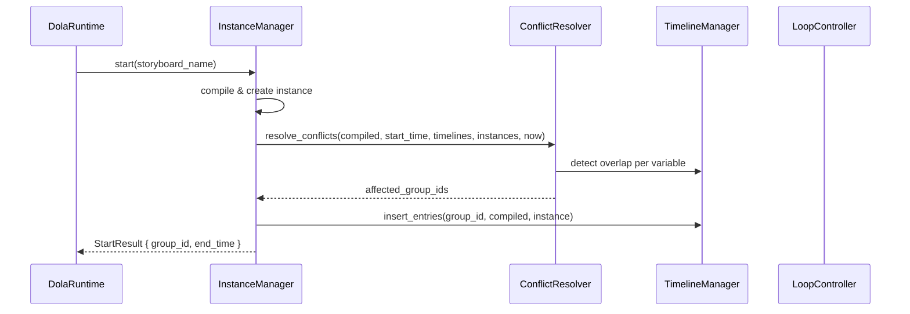
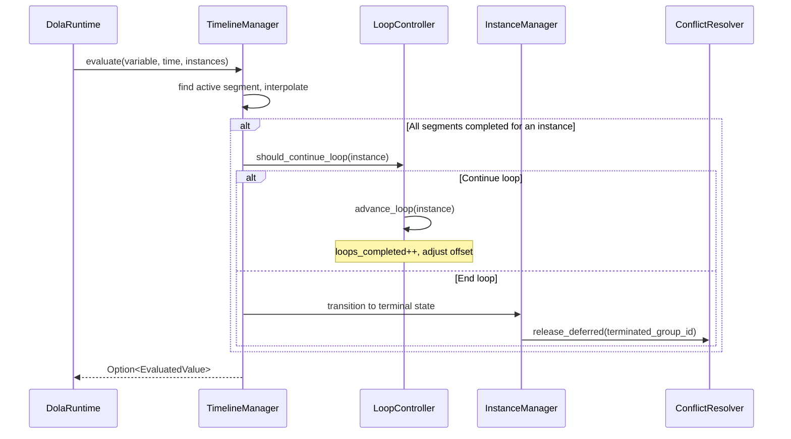
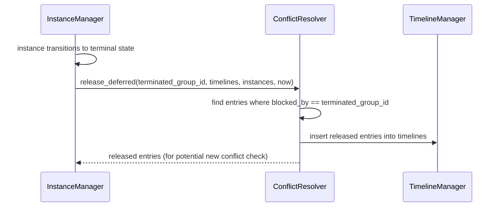

# Design Document — dola-runtime-conflict-loop

## Overview

### Purpose

本ドキュメントは `dola-runtime-conflict-loop` 子仕様の設計を定義する。親仕様 `dola-runtime-engine` の Req 7（競合検出・終了戦略）と Req 12（ループ再生）を実現する Tier 3 コンポーネント群を設計する。

### Architecture Context

conflict-loop は Tier 3 に位置し、facade（Tier 2）の内部型 `StoryboardInstance`, `VariableTimeline`, `TimelineEntry` を `pub(crate)` 経由で消費する。facade の Start フロー内部に競合解決ステップを挿入し、Update フロー内部にループ周回判定を挿入する設計。

> 統合指針: `.kiro/specs/dola-runtime-engine/integration-guide.md` Section 2.3, 4.3 参照

```
core-types (Tier 1)  ←  facade (Tier 2)  ←  conflict-loop (Tier 3)
                                               ├── ConflictResolver
                                               └── LoopController
```

### Design Decisions

| Decision | Rationale |
|----------|-----------|
| ConflictResolver を独立構造体として実装 | テスト容易性とフロー挿入の明確化 |
| LoopController を関連関数（`impl` ブロック）として実装 | インスタンス単位の判定であり状態を持たない |
| DeferredEntry を conflict-loop 内で定義 | Never 戦略固有のデータ構造であり facade に漏出させない |
| facade の Start フローにフック挿入 | Tier 2 のパブリック API は変更せず、内部フローにのみ追加 |

---

## Components and Interfaces

### ConflictResolver

| Field | Detail |
|-------|--------|
| Intent | 同一変数の時間的重複を検出し、InterruptionPolicy に基づく終了戦略を適用する |
| Requirements | Req 1-8（本仕様） / 親 Req 7.1-7.9 |

**Responsibilities & Constraints**

- 競合検出: 新セグメントが既存 `TimelineEntry` と時間的に重複するかチェック
- group_id 単位一括適用: 1変数の競合検出で同一 group_id の全変数に戦略を一括適用
- 5種の終了戦略適用: Cancel / Conclude / Trim / Compress / Never
- デフォルト戦略: `InterruptionPolicy` 未指定時は Conclude
- Never 戦略時の延期キュー管理

**Dependencies**

- Inbound: facade StartFlow — 競合判定要求 (P0)
- Outbound: `StoryboardInstance` — 状態読み書き (P0)
- Outbound: `VariableTimeline` / `TimelineEntry` — エントリ操作 (P0)
- Outbound: `InstanceState::from_policy()` — 終了状態取得 (P0)

**Contracts**: Service [x]

#### Service Interface

```rust
/// 競合解決コンポーネント
pub(crate) struct ConflictResolver {
    deferred_queue: Vec<DeferredEntry>,
}

impl ConflictResolver {
    pub(crate) fn new() -> Self {
        Self { deferred_queue: Vec::new() }
    }

    /// 竞合を検出し、終了戦略を適用する。影響を受けた group_id のリストを返す。
    ///
    /// Start フロー内部で、タイムテーブル挿入前に呼び出される。
    pub(crate) fn resolve_conflicts(
        &mut self,
        new_compiled: &CompiledStoryboard,
        new_start_time: f64,
        timelines: &mut HashMap<String, VariableTimeline>,
        instances: &mut HashMap<u64, StoryboardInstance>,
        current_time: f64,
    ) -> Vec<u64>;

    /// 終了したインスタンスに対応する延期エントリを解放する。
    ///
    /// InstanceManager がインスタンスを終了状態に遷移させた後に呼び出す。
    pub(crate) fn release_deferred(
        &mut self,
        terminated_group_id: u64,
        timelines: &mut HashMap<String, VariableTimeline>,
        instances: &HashMap<u64, StoryboardInstance>,
        current_time: f64,
    ) -> Vec<TimelineEntry>;
}
```

#### 競合解決フロー（resolve_conflicts 内部）

```
1. 各変数について:
   a. 新セグメントの時間範囲 [new_start_time, new_start_time + duration] を算出
   b. 既存 TimelineEntry との時間的重複をチェック
   c. 重複する group_id を収集

2. 重複 group_id をユニーク化（複数変数で同一 group_id が競合しうる）

3. 各 conflicting group_id について:
   a. instances から InterruptionPolicy を取得
   b. 戦略に応じて適用:
      - Cancel:  凍結 — 現在値を保持、状態を Cancelled に
      - Conclude: 最終値ジャンプ — 現在トランジションの to_value に設定、状態を Concluded に
      - Trim:    切断 — 現在位置で切断し残余を除去、状態を Trimmed に
      - Compress: 全体ジャンプ — ストーリーボード最終セグメントの to_value に設定、状態を Compressed に
      - Never:   延期 — 新エントリの当該変数セグメントを DeferredEntry として格納
   c. group_id 単位: 同一 group_id の全変数タイムラインに同一戦略を適用

4. Never 以外の場合、新エントリは通常どおりタイムテーブルに挿入される
   Never の場合、当該変数のエントリのみ延期される（他の変数は挿入可能）
```

#### 終了戦略の詳細適用

| 戦略 | タイムテーブル操作 | 値の状態 | InstanceState |
|------|------------------|---------|---------------|
| Cancel | エントリを残置（後続 Update で破棄） | 現在補間値で凍結 | `Cancelled` |
| Conclude | 現在セグメントの `to_value` に設定、以降のセグメント除去 | 最終値にジャンプ | `Concluded` |
| Trim | 現在時刻でセグメントを切断（`end_time` を `current_time` に変更） | 切断位置の補間値 | `Trimmed` |
| Compress | 全セグメントを完走扱い（最終セグメントの `to_value`） | ストーリーボード最終値 | `Compressed` |
| Never | 新エントリを延期キューに格納、既存は変更なし | 既存のまま継続 | 変更なし |

---

### LoopController

| Field | Detail |
|-------|--------|
| Intent | ループ再生の周回管理とタイムテーブル再利用 |
| Requirements | Req 9-11（本仕様） / 親 Req 12.1-12.8 |

**Responsibilities & Constraints**

- 周回完了検出: Update 時に全セグメントが終了したかチェック
- `loop_count` に基づくループ継続判定
- タイムテーブル再利用: 時間オフセット調整（`pause_accumulated` 機構と統合）
- 無限ループ（`Some(0)`）の管理
- ループ中の競合検出対応（ConflictResolver と連携）

**Dependencies**

- Inbound: facade Update フロー — ループ判定要求 (P0)
- Outbound: `StoryboardInstance` — ループカウンタ・オフセット読み書き (P0)

**Contracts**: Service [x]

#### Service Interface

```rust
/// ループ制御（関連関数として実装）
pub(crate) struct LoopController;

impl LoopController {
    /// 周回完了時にループ継続すべきか判定する。
    ///
    /// `true` を返した場合、呼び出し元は `advance_loop` を呼んでオフセットを進める。
    pub(crate) fn should_continue_loop(instance: &StoryboardInstance) -> bool;

    /// ループ周回をアドバンスする。
    ///
    /// `loops_completed` をインクリメントし、時間オフセットを1周分進める。
    pub(crate) fn advance_loop(instance: &mut StoryboardInstance);
}
```

#### ループ判定ロジック

```rust
fn should_continue_loop(instance: &StoryboardInstance) -> bool {
    match instance.loop_count {
        None => false,           // ループなし → 終了
        Some(0) => true,         // 無限ループ → 常に継続
        Some(n) => instance.loops_completed < n,  // 有限ループ → カウント未達なら継続
    }
}
```

#### advance_loop の動作

```
1. instance.loops_completed += 1
2. 時間オフセットを1周分進める:
   instance.pause_accumulated -= instance.base_duration
   （これにより effective_time 計算が次の周回の先頭にリセットされる）
3. タイムテーブルのセグメント群は破棄せず再利用
```

> **Design Note**: `effective_time = current_time - start_time - pause_accumulated` の計算式において、`pause_accumulated` を `base_duration` 分減算することで、同一セグメント配列を再利用しつつ次周回の `effective_time` が 0 から再開される。実際にはマイナスにはならない（`start_time + pause_accumulated + base_duration ≈ current_time` のため）。

---

### DeferredEntry（データ構造）

```rust
/// Never 戦略で延期された新エントリ
pub(crate) struct DeferredEntry {
    /// 延期されたエントリが属する group_id（新ストーリーボード）
    pub new_group_id: u64,
    /// 延期の原因となった先行 group_id
    pub blocked_by: u64,
    /// 延期された変数名
    pub variable_name: String,
    /// 延期されたセグメント群
    pub segments: Vec<CompiledSegment>,
    /// 変数型ヒント
    pub variable_type: VariableTypeHint,
}
```

- `blocked_by` のインスタンスが終了状態に遷移した時点で、`release_deferred()` により延期エントリがタイムテーブルに追加される
- 無限ループ（`loop_count = Some(0)`）の場合、先行インスタンスが明示的に cancel/conclude されるまで延期エントリは保持される

---

## System Flows

### Start フローへの競合解決挿入



### Update フローへのループ挿入



### Never 延期キュー解放フロー



---

## Data Models

### Domain Model（conflict-loop 固有）

```mermaid
erDiagram
    ConflictResolver ||--o{ DeferredEntry : manages
    DeferredEntry }|--|| StoryboardInstance : blocked_by
    DeferredEntry ||--|{ CompiledSegment : holds

    LoopController -- StoryboardInstance : reads_writes
```

### 消費する外部型（facade 由来）

| 型名 | 定義元 | 用途 |
|------|--------|------|
| `StoryboardInstance` | facade | 状態読み書き、ループカウンタ管理 |
| `VariableTimeline` | facade | 競合チェック対象 |
| `TimelineEntry` | facade | エントリ操作・追加 |
| `InstanceState` | core-types | 状態遷移 (`from_policy()`) |
| `InterruptionPolicy` | storyboard (既存dola) | 5種戦略の判定元 |
| `CompiledStoryboard` | compile (既存dola) | 新ストーリーボードデータ |
| `CompiledSegment` | compile (既存dola) | セグメント時間範囲・値 |
| `VariableTypeHint` | variable (既存dola) | 延期エントリの型情報 |

---

## facade への統合方法

### Tier 2 → Tier 3 遷移

Tier 2（facade 単独）では以下の暫定動作をしている（integration-guide Section 4.3）:

- 競合: 同一変数への多重エントリは最新 group_id が優先（上書き）
- ループ: `loop_count` は無視、常に1回再生

Tier 3 追加時に以下を変更:

1. **Start フロー**: `TimelineManager::insert_entries()` 呼び出し前に `ConflictResolver::resolve_conflicts()` を挿入
2. **Update フロー**: セグメント完了判定後に `LoopController::should_continue_loop()` + `advance_loop()` を挿入
3. **インスタンス終了時**: `ConflictResolver::release_deferred()` を呼び出し、延期エントリを解放
4. **DolaRuntime 構造体**: `ConflictResolver` フィールドを追加

### モジュール構成

```
crates/dola/src/runtime/
├── mod.rs                  (既存: pub mod 宣言追加)
├── instance_state.rs       (既存: core-types)
├── types.rs                (既存: core-types)
├── interpolator.rs         (既存: core-types)
├── conflict_resolver.rs    (新規: ConflictResolver + DeferredEntry)
└── loop_controller.rs      (新規: LoopController)
```

---

## Testing Strategy

### Unit Tests

| テスト | 対象 | 要件 |
|--------|------|------|
| 競合検出（重複あり） | `ConflictResolver::resolve_conflicts` | Req 1 |
| 競合検出（重複なし） | `ConflictResolver::resolve_conflicts` | Req 1 |
| group_id 一括適用 | `ConflictResolver::resolve_conflicts` | Req 2 |
| Cancel 戦略 | `ConflictResolver` 内部 | Req 3 |
| Conclude 戦略 | `ConflictResolver` 内部 | Req 4 |
| Trim 戦略 | `ConflictResolver` 内部 | Req 5 |
| Compress 戦略 | `ConflictResolver` 内部 | Req 6 |
| Never 戦略 + 延期 | `ConflictResolver` 内部 | Req 7 |
| 延期キュー解放 | `ConflictResolver::release_deferred` | Req 7 |
| ループなし (None) | `LoopController::should_continue_loop` | Req 9 |
| 無限ループ (Some(0)) | `LoopController::should_continue_loop` | Req 9 |
| 有限ループ (Some(n)) | `LoopController::should_continue_loop` | Req 9 |
| advance_loop オフセット | `LoopController::advance_loop` | Req 10 |

### Integration Tests

| テスト | 対象 | 要件 |
|--------|------|------|
| Start 競合→Conclude→新再生 | facade + ConflictResolver | Req 4, 8 |
| Start 競合→Never→延期→解放 | facade + ConflictResolver | Req 7 |
| ループ再生3回→終了 | facade + LoopController | Req 9, 10 |
| ループ中の競合発生 | facade + ConflictResolver + LoopController | Req 11 |
| 全5戦略の E2E テスト | 全コンポーネント | Req 1-8 |

---

## Requirements Traceability

| Requirement (本仕様) | Parent Req | Components | Tests |
|---------------------|------------|------------|-------|
| Req 1: 競合検出 | 7.1 | ConflictResolver | 競合検出 UT |
| Req 2: group_id 一括適用 | 7.2, 7.3 | ConflictResolver | group_id 一括 UT |
| Req 3: Cancel | 7.4 | ConflictResolver | Cancel UT |
| Req 4: Conclude | 7.5 | ConflictResolver | Conclude UT |
| Req 5: Trim | 7.6 | ConflictResolver | Trim UT |
| Req 6: Compress | 7.7 | ConflictResolver | Compress UT |
| Req 7: Never + 延期 | 7.8 | ConflictResolver | Never UT, 延期解放 UT/IT |
| Req 8: デフォルト戦略 | 7.9 | ConflictResolver | Conclude UT (デフォルト確認) |
| Req 9: ループ基本 | 12.1-12.3 | LoopController | ループ判定 UT |
| Req 10: タイムテーブル再利用 | 12.4-12.7 | LoopController | advance_loop UT, ループ再生 IT |
| Req 11: ループ中競合 | 12.8 | ConflictResolver + LoopController | ループ中競合 IT |
