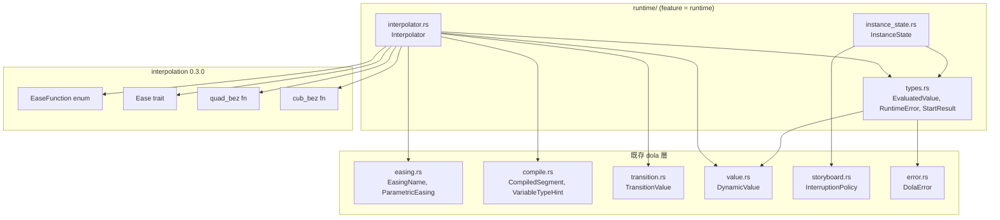
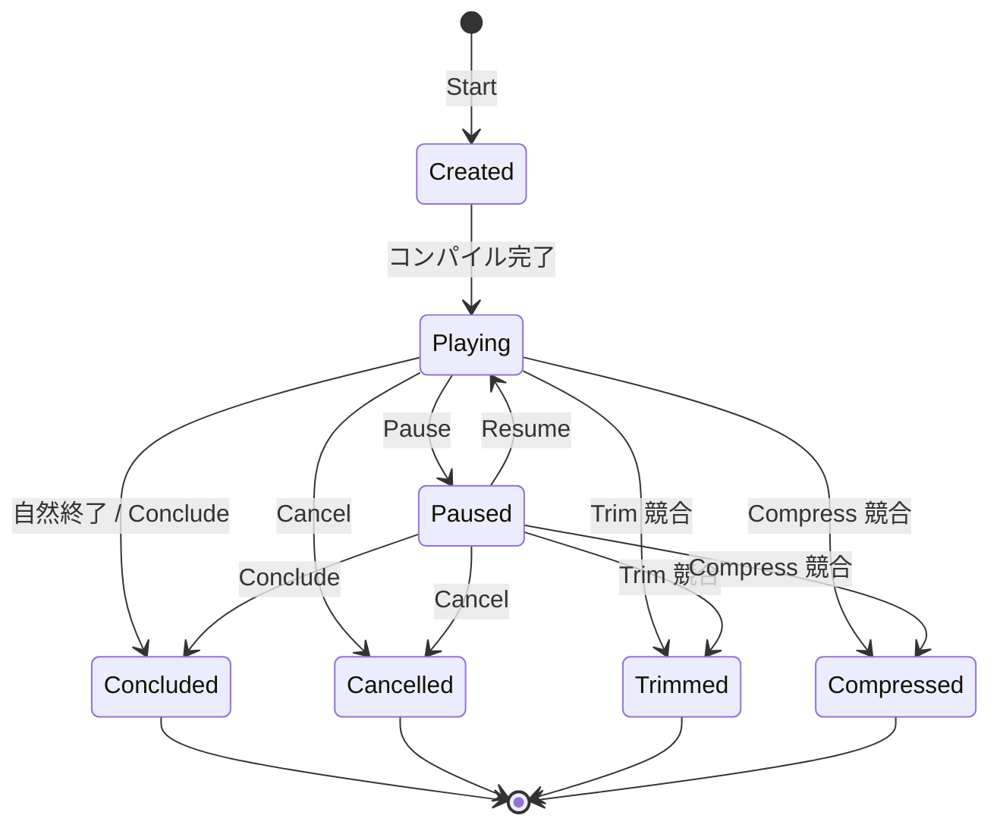

# Design Document — dola-runtime-core-types

## Overview

**Purpose**: dola ランタイムエンジンの基盤型（`InstanceState`, `EvaluatedValue`, `RuntimeError`, `StartResult`）およびイージング補間計算（`Interpolator`）を提供する。Tier 2 以降の子仕様が共通基盤として消費する最下層モジュール。

**Users**: Tier 2 `dola-runtime-facade`（InstanceManager, TimelineManager 等）および Tier 3 `dola-runtime-conflict-loop`（ConflictResolver, LoopController）が直接消費する。

**Impact**: 既存 dola クレートに `runtime` サブモジュールのうち `instance_state.rs`, `types.rs`, `interpolator.rs` を追加。`Cargo.toml` に `interpolation` オプショナル依存を追加。既存コードの変更なし。

### Goals

- 7バリアント `InstanceState` と状態遷移ロジックの型安全な実装
- `interpolation` クレートとの1対1マッピングによるイージング計算
- 全子仕様が共通利用するエラー型・値型の統一定義
- feature gate `runtime` による有効化制御

### Non-Goals

- facade API の実装（Tier 2 `dola-runtime-facade` の責務）
- 競合解決・ループ制御のロジック（Tier 3 `dola-runtime-conflict-loop` の責務）
- 時刻取得ユーティリティ（`dola-runtime-clock` の責務）
- 既存 dola データモデル型の変更

---

## Architecture

### Existing Architecture Analysis

既存 dola クレートの型を消費する:

| 既存型 | 定義元モジュール | 本子仕様での用途 |
|--------|-----------------|-----------------|
| `InterruptionPolicy` | `storyboard.rs` | `InstanceState::from_policy()` 変換元 |
| `CompiledSegment` | `compile.rs` | `Interpolator::interpolate()` 入力 |
| `VariableTypeHint` | `compile.rs` | 型別補間ディスパッチ |
| `EasingFunction` / `EasingName` | `easing.rs` | イージングマッピング |
| `ParametricEasing` | `easing.rs` | quad_bez / cub_bez 計算 |
| `TransitionValue` | `transition.rs` | from_value / to_value の値取得 |
| `DynamicValue` | `value.rs` | Object型の値ラップ |
| `DolaError` | `error.rs` | `RuntimeError::CompileError` ラップ元 |

### Architecture Pattern & Boundary Map



**Architecture Integration**:
- **選定パターン**: 型定義 + ステートレス関数群。状態を持たない純粋なロジック層
- **境界**: `pub(crate)` 可視性。facade 子仕様が `pub` re-export を決定する
- **既存パターン保持**: 既存 dola の `Serialize/Deserialize` パターンには従わない（ランタイム内部型はシリアライズ不要）
- **Steering 準拠**: Rust 2024 Edition、`unsafe` なし

### Technology Stack

| Layer | Choice / Version | Role in Feature | Notes |
|-------|------------------|-----------------|-------|
| Runtime | Rust 2024 Edition | 型定義 + 補間ロジック | 既存 dola クレート内 |
| Interpolation | `interpolation` 0.3.0 | イージング評価 | feature `runtime` で有効化 |

---

## System Flows

### InstanceState 状態遷移図



**遷移ルール（`try_transition` の判定表）**:

| From \ To | Created | Playing | Paused | Concluded | Cancelled | Trimmed | Compressed |
|-----------|---------|---------|--------|-----------|-----------|---------|------------|
| Created | - | ✓ | ✗ | ✗ | ✗ | ✗ | ✗ |
| Playing | ✗ | - | ✓ | ✓ | ✓ | ✓ | ✓ |
| Paused | ✗ | ✓ | - | ✓ | ✓ | ✓ | ✓ |
| Concluded | ✗ | ✗ | ✗ | - | ✗ | ✗ | ✗ |
| Cancelled | ✗ | ✗ | ✗ | ✗ | - | ✗ | ✗ |
| Trimmed | ✗ | ✗ | ✗ | ✗ | ✗ | - | ✗ |
| Compressed | ✗ | ✗ | ✗ | ✗ | ✗ | ✗ | - |

### Interpolator 補間フロー

```mermaid
flowchart TD
    Start[interpolate 呼び出し] --> Clamp[progress_t を 0.0..=1.0 にクランプ]
    Clamp --> TypeCheck{VariableTypeHint?}

    TypeCheck -->|Object| ObjCheck{progress_t >= 1.0?}
    ObjCheck -->|Yes| ObjTo[to_value を Object として返却]
    ObjCheck -->|No| ObjFrom[from_value を Object として返却]

    TypeCheck -->|Float / Integer| EasingCheck{easing 指定?}
    EasingCheck -->|None| LinearT[eased_t = progress_t]
    EasingCheck -->|Named(name)| NamedEase[EasingName → EaseFunction マッピング]
    EasingCheck -->|Parametric(QB)| QuadBez[quad_bez で eased_t 計算]
    EasingCheck -->|Parametric(CB)| CubBez[cub_bez で eased_t 計算]

    NamedEase --> LinCheck{Linear?}
    LinCheck -->|Yes| LinearT
    LinCheck -->|No| CalcEase["eased_t = f64::calc(ease_fn, progress_t)"]

    LinearT --> Lerp["value = from + (to - from) * eased_t"]
    CalcEase --> Lerp
    QuadBez --> Lerp
    CubBez --> Lerp

    Lerp --> RetType{VariableTypeHint?}
    RetType -->|Float| RetFloat["EvaluatedValue::Float(value)"]
    RetType -->|Integer| RetInt["EvaluatedValue::Integer(value.round() as i64)"]
```

---

## Requirements Traceability

| Requirement | Summary | Components | Interfaces | Flows |
|-------------|---------|------------|------------|-------|
| 1.1-1.4 | InstanceState 7バリアント + ユーティリティ | InstanceState | `is_terminal()`, `from_policy()` | 状態遷移図 |
| 2.1-2.7 | 状態遷移ルール | InstanceState | `try_transition()` | 状態遷移図 |
| 3.1-3.4 | EvaluatedValue 値型 | EvaluatedValue | `Display` | — |
| 4.1-4.4 | RuntimeError エラー型 | RuntimeError | `Display`, `Error`, `From<DolaError>` | — |
| 5.1-5.3 | StartResult 返却型 | StartResult | — | — |
| 6.1-6.9 | Interpolator 補間計算 | Interpolator | `interpolate()` | 補間フロー |
| 7.1-7.3 | EasingName マッピング | Interpolator | 内部マッピング | — |

---

## Components and Interfaces

| Component | Domain/Layer | Intent | Req Coverage | Key Dependencies | Contracts |
|-----------|-------------|--------|-------------|-----------------|-----------|
| InstanceState | Core Types | 実行インスタンスの状態enum + 遷移ロジック | 1, 2 | InterruptionPolicy (P0) | State |
| EvaluatedValue | Core Types | 補間結果の型安全な値型 | 3 | DynamicValue (P0) | — |
| RuntimeError | Core Types | 全子仕様共通のエラー型 | 4 | DolaError (P0), InstanceState (P0) | — |
| StartResult | Core Types | Start 返却値構造体 | 5 | — | — |
| Interpolator | Core | イージング適用 + 補間計算 | 6, 7 | interpolation crate (P0), CompiledSegment (P0) | Service |

### Core Types

#### InstanceState

| Field | Detail |
|-------|--------|
| Intent | ストーリーボード実行インスタンスの状態管理と遷移検証 |
| Requirements | 1, 2 |

**Responsibilities & Constraints**
- 7バリアント enum の定義と derive マクロ
- 状態遷移の正当性検証（`try_transition`）
- `InterruptionPolicy` との相互変換（`from_policy`）
- 終了状態判定（`is_terminal`）
- シリアライズなし（ランタイム内部専用）

**Dependencies**
- Inbound: InstanceManager (Tier 2) — 状態管理 (P0)
- Inbound: ConflictResolver (Tier 3) — 終了状態変換 (P0)
- Outbound: InterruptionPolicy — `from_policy()` 変換元 (P0)

**Contracts**: State [x]

##### State Management

```rust
/// 実行インスタンスの状態（ランタイム内部専用）
#[derive(Debug, Clone, Copy, PartialEq, Eq)]
pub(crate) enum InstanceState {
    Created,
    Playing,
    Paused,
    Concluded,
    Cancelled,
    Trimmed,
    Compressed,
}

impl InstanceState {
    /// 終了状態かどうかを判定
    pub fn is_terminal(&self) -> bool {
        matches!(
            self,
            Self::Concluded | Self::Cancelled | Self::Trimmed | Self::Compressed
        )
    }

    /// InterruptionPolicy から対応する終了状態へ変換
    /// Never は終了状態ではないため panic する
    pub fn from_policy(policy: InterruptionPolicy) -> Self {
        match policy {
            InterruptionPolicy::Cancel => Self::Cancelled,
            InterruptionPolicy::Conclude => Self::Concluded,
            InterruptionPolicy::Trim => Self::Trimmed,
            InterruptionPolicy::Compress => Self::Compressed,
            InterruptionPolicy::Never => {
                panic!("Never is not a terminal state; cannot convert to InstanceState")
            }
        }
    }

    /// 状態遷移の正当性を検証
    pub fn try_transition(&self, to: InstanceState) -> Result<(), RuntimeError> {
        let valid = match (self, &to) {
            (Self::Created, Self::Playing) => true,
            (Self::Playing, Self::Paused) => true,
            (Self::Playing, s) if s.is_terminal() => true,
            (Self::Paused, Self::Playing) => true,
            (Self::Paused, s) if s.is_terminal() => true,
            _ => false,
        };
        if valid {
            Ok(())
        } else {
            Err(RuntimeError::InvalidStateTransition {
                from: *self,
                to,
            })
        }
    }
}
```

#### EvaluatedValue

| Field | Detail |
|-------|--------|
| Intent | 補間計算の出力値を型安全に表現する共通値型 |
| Requirements | 3 |

**Implementation Notes**
```rust
/// 評価済み変数値（補間計算の出力）
#[derive(Debug, Clone, PartialEq)]
pub(crate) enum EvaluatedValue {
    Float(f64),
    Integer(i64),
    Object(DynamicValue),
}

impl std::fmt::Display for EvaluatedValue {
    fn fmt(&self, f: &mut std::fmt::Formatter<'_>) -> std::fmt::Result {
        match self {
            Self::Float(v) => write!(f, "{v:.6}"),
            Self::Integer(v) => write!(f, "{v}"),
            Self::Object(v) => write!(f, "{v:?}"),
        }
    }
}
```

#### RuntimeError

| Field | Detail |
|-------|--------|
| Intent | 全子仕様が共通利用するエラー型 |
| Requirements | 4 |

**Implementation Notes**
```rust
/// ランタイムエラー
#[derive(Debug, Clone)]
pub(crate) enum RuntimeError {
    StoryboardNotFound(String),
    InvalidGroupId(u64),
    TerminatedInstance { group_id: u64, state: InstanceState },
    DocumentParseError(String),
    ZeroDurationWithLoop { storyboard: String },
    CompileError(DolaError),
    InvalidStateTransition { from: InstanceState, to: InstanceState },
}

impl std::fmt::Display for RuntimeError {
    fn fmt(&self, f: &mut std::fmt::Formatter<'_>) -> std::fmt::Result {
        match self {
            Self::StoryboardNotFound(name) => {
                write!(f, "storyboard not found: {name}")
            }
            Self::InvalidGroupId(id) => {
                write!(f, "invalid group_id: {id}")
            }
            Self::TerminatedInstance { group_id, state } => {
                write!(f, "instance {group_id} is terminated ({state:?})")
            }
            Self::DocumentParseError(msg) => {
                write!(f, "document parse error: {msg}")
            }
            Self::ZeroDurationWithLoop { storyboard } => {
                write!(f, "zero duration with loop: {storyboard}")
            }
            Self::CompileError(e) => {
                write!(f, "compile error: {e}")
            }
            Self::InvalidStateTransition { from, to } => {
                write!(f, "invalid state transition: {from:?} -> {to:?}")
            }
        }
    }
}

impl std::error::Error for RuntimeError {}

impl From<DolaError> for RuntimeError {
    fn from(e: DolaError) -> Self {
        Self::CompileError(e)
    }
}
```

#### StartResult

| Field | Detail |
|-------|--------|
| Intent | Start コマンドの返却値 |
| Requirements | 5 |

```rust
/// Start コマンドの返却値
#[derive(Debug, Clone, PartialEq)]
pub(crate) struct StartResult {
    pub group_id: u64,
    pub end_time: f64,
}
```

### Core Layer

#### Interpolator

| Field | Detail |
|-------|--------|
| Intent | イージング関数の適用と値の補間計算 |
| Requirements | 6, 7 |

**Responsibilities & Constraints**
- `EasingName` の30バリアント → `interpolation::EaseFunction` への1対1マッピング
- `EasingName::Linear` は `EaseFunction` を使わず `t` をそのまま返す
- `ParametricEasing::QuadraticBezier` → `interpolation::quad_bez()`
- `ParametricEasing::CubicBezier` → `interpolation::cub_bez()`
- `VariableTypeHint` による型別ディスパッチ: Float→f64直接, Integer→f64補間→round→i64, Object→即時切替
- `progress_t` は 0.0..=1.0 にクランプ

**Dependencies**
- Inbound: TimelineManager (Tier 2) — 補間要求 (P0)
- External: `interpolation` 0.3.0 — `Ease`, `EaseFunction`, `quad_bez`, `cub_bez` (P0)

**Contracts**: Service [x]

##### Service Interface

```rust
/// イージング適用 + 補間計算（ステートレス関数群）
pub(crate) struct Interpolator;

impl Interpolator {
    /// EasingName → interpolation::EaseFunction のマッピング
    fn map_easing(name: &EasingName) -> Option<interpolation::EaseFunction> {
        match name {
            EasingName::Linear => None, // Linear は EaseFunction を使わない
            EasingName::QuadraticIn => Some(EaseFunction::QuadraticIn),
            EasingName::QuadraticOut => Some(EaseFunction::QuadraticOut),
            // ... 残り27バリアント（1対1マッピング）
            EasingName::BounceInOut => Some(EaseFunction::BounceInOut),
        }
    }

    /// easing 適用後の補間率を計算
    fn apply_easing(easing: Option<&EasingFunction>, t: f64) -> f64 {
        match easing {
            None => t,
            Some(EasingFunction::Named(name)) => {
                match Self::map_easing(name) {
                    None => t, // Linear
                    Some(ef) => t.calc(ef),
                }
            }
            Some(EasingFunction::Parametric(ParametricEasing::QuadraticBezier {
                x0, x1, x2,
            })) => interpolation::quad_bez(x0, x1, x2, &t),
            Some(EasingFunction::Parametric(ParametricEasing::CubicBezier {
                x0, x1, x2, x3,
            })) => interpolation::cub_bez(x0, x1, x2, x3, &t),
        }
    }

    /// セグメントの進捗率 t で補間値を計算
    pub fn interpolate(
        segment: &CompiledSegment,
        variable_type: &VariableTypeHint,
        progress_t: f64,
    ) -> EvaluatedValue {
        let t = progress_t.clamp(0.0, 1.0);

        // Object 型: 補間なし、即時切替
        if matches!(variable_type, VariableTypeHint::Object) {
            return if t >= 1.0 {
                Self::extract_object(&segment.to_value)
            } else {
                Self::extract_object(&segment.from_value)
            };
        }

        // Float / Integer 型: イージング適用 + 線形補間
        let eased_t = Self::apply_easing(segment.easing.as_ref(), t);
        let from = Self::extract_scalar(&segment.from_value);
        let to = Self::extract_scalar(&segment.to_value);
        let value = from + (to - from) * eased_t;

        match variable_type {
            VariableTypeHint::Float => EvaluatedValue::Float(value),
            VariableTypeHint::Integer { .. } => EvaluatedValue::Integer(value.round() as i64),
            VariableTypeHint::Object => unreachable!(),
        }
    }

    /// TransitionValue から f64 スカラー値を取得
    fn extract_scalar(value: &TransitionValue) -> f64 {
        match value {
            TransitionValue::Scalar(v) => *v,
            TransitionValue::Dynamic(_) => 0.0, // Object 型は本パスに到達しない
        }
    }

    /// TransitionValue から DynamicValue を取得し EvaluatedValue::Object を返す
    fn extract_object(value: &TransitionValue) -> EvaluatedValue {
        match value {
            TransitionValue::Dynamic(dv) => EvaluatedValue::Object(dv.clone()),
            TransitionValue::Scalar(v) => EvaluatedValue::Float(*v), // fallback
        }
    }
}
```

- **Preconditions**: `progress_t` は任意の f64（クランプ済み）。`segment` は有効な `CompiledSegment`
- **Postconditions**: `VariableTypeHint::Integer` → `EvaluatedValue::Integer`。`Float` → `Float`。`Object` → `Object`
- **Invariants**: `EasingName` 30バリアントと `EaseFunction` 30バリアントの1対1対応。マッピング漏れはコンパイルエラーで検出（`match` 網羅性）

---

## Data Models

### EasingName → EaseFunction マッピング表

| EasingName (dola) | EaseFunction (interpolation) |
|-------------------|------------------------------|
| Linear | — (t をそのまま返す) |
| QuadraticIn | QuadraticIn |
| QuadraticOut | QuadraticOut |
| QuadraticInOut | QuadraticInOut |
| CubicIn | CubicIn |
| CubicOut | CubicOut |
| CubicInOut | CubicInOut |
| QuarticIn | QuarticIn |
| QuarticOut | QuarticOut |
| QuarticInOut | QuarticInOut |
| QuinticIn | QuinticIn |
| QuinticOut | QuinticOut |
| QuinticInOut | QuinticInOut |
| SineIn | SineIn |
| SineOut | SineOut |
| SineInOut | SineInOut |
| CircularIn | CircularIn |
| CircularOut | CircularOut |
| CircularInOut | CircularInOut |
| ExponentialIn | ExponentialIn |
| ExponentialOut | ExponentialOut |
| ExponentialInOut | ExponentialInOut |
| ElasticIn | ElasticIn |
| ElasticOut | ElasticOut |
| ElasticInOut | ElasticInOut |
| BackIn | BackIn |
| BackOut | BackOut |
| BackInOut | BackInOut |
| BounceIn | BounceIn |
| BounceOut | BounceOut |
| BounceInOut | BounceInOut |

### VariableTypeHint → EvaluatedValue 対応表

| VariableTypeHint | 補間方式 | 出力 EvaluatedValue |
|-----------------|---------|-------------------|
| Float | `from + (to - from) * eased_t` | `Float(f64)` |
| Integer { typewriter } | `(from + (to - from) * eased_t).round() as i64` | `Integer(i64)` |
| Object | `progress_t >= 1.0 ? to : from` | `Object(DynamicValue)` |

---

## Error Handling

### Error Strategy

- **型安全**: `RuntimeError` enum でエラーを網羅的に定義。呼び出し側は `match` でパターンマッチ
- **パニック禁止**: `from_policy(Never)` のみ `panic!`（設計上到達不可能なパス）。他の全パスは `Result` 返却
- **`From<DolaError>`**: `?` 演算子による自動変換で ergonomic なエラーハンドリング

### Error Categories

| エラー | 原因 | 対応 |
|--------|------|------|
| `InvalidStateTransition` | 不正な遷移（例: Concluded → Playing） | 呼び出し側で遷移前にチェック、またはエラーハンドリング |
| `StoryboardNotFound` | 未定義名での Start | 呼び出し側で名前を確認 |
| `TerminatedInstance` | 終了済みへの操作 | 呼び出し側で group_id の生存を確認 |
| `DocumentParseError` | TOML 不正 | 既存定義を維持、エラーを報告 |
| `ZeroDurationWithLoop` | duration=0 + loop | 定義を修正 |
| `CompileError` | バリデーション/コンパイル失敗 | DolaError の詳細を確認 |

---

## Testing Strategy

### Unit Tests

**InstanceState 遷移テスト** (Req 1, 2):
- 全7×7=49の遷移パターン（対角を除く42パターン）を網羅的に検証
- `is_terminal()` の5状態（4 terminal + 3 non-terminal）
- `from_policy()` の5パターン（4正常 + 1 panic）

**EvaluatedValue テスト** (Req 3):
- 3バリアントの構築と `Display` 出力フォーマット
- `PartialEq` の等価比較

**RuntimeError テスト** (Req 4):
- 全7バリアントの `Display` 出力
- `From<DolaError>` 変換
- `std::error::Error` trait 準拠

**StartResult テスト** (Req 5):
- 構築と `PartialEq` 比較

**Interpolator テスト** (Req 6, 7):
- **マッピングテスト**: 30バリアント全ての `EasingName` → `EaseFunction` マッピング正確性
- **境界値テスト**: `progress_t = 0.0`（from_value）、`progress_t = 1.0`（to_value）、クランプ（-0.1 → 0.0, 1.5 → 1.0）
- **Float 補間**: `from=0.0, to=100.0, t=0.5, Linear` → `50.0`
- **Integer 丸め**: `from=0.0, to=10.0, t=0.55` → `round(5.5) = 6`
- **Object 即時切替**: `t=0.99` → from_value、`t=1.0` → to_value
- **ParametricEasing**: QuadraticBezier / CubicBezier の値範囲検証
- **全31イージングの非NaN検証**: 各イージングで `t=0.0, 0.25, 0.5, 0.75, 1.0` を評価し、NaN でないことを検証

---

## Supporting References

### Cargo.toml 変更計画

```toml
# 追加する内容（Child 1 実装時）
[features]
runtime = ["dep:interpolation"]

[dependencies]
interpolation = { version = "0.3.0", optional = true }
```

### モジュール構成

```
crates/dola/src/
├── lib.rs              # #[cfg(feature = "runtime")] mod runtime; 追加
├── runtime/
│   ├── mod.rs          # pub(crate) re-export
│   ├── instance_state.rs  # InstanceState enum + impl
│   ├── types.rs           # EvaluatedValue, RuntimeError, StartResult
│   └── interpolator.rs    # Interpolator struct + impl
```

### `interpolation` クレート API メモ

```rust
// Ease trait (impl for f64)
trait Ease {
    fn calc(self, function: EaseFunction) -> Self;
}

// EaseFunction enum — 30バリアント
enum EaseFunction {
    QuadraticIn, QuadraticOut, QuadraticInOut,
    CubicIn, CubicOut, CubicInOut,
    // ... (全30バリアント)
}

// パラメトリック補間
fn quad_bez<T>(x0: &T, x1: &T, x2: &T, t: &T) -> T;
fn cub_bez<T>(x0: &T, x1: &T, x2: &T, x3: &T, t: &T) -> T;
```
