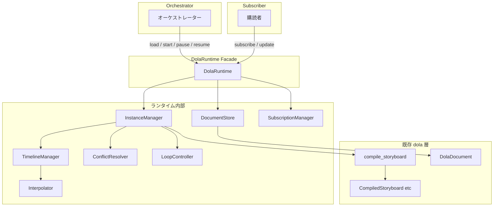
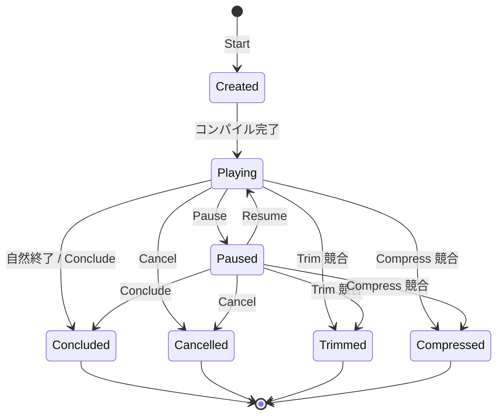
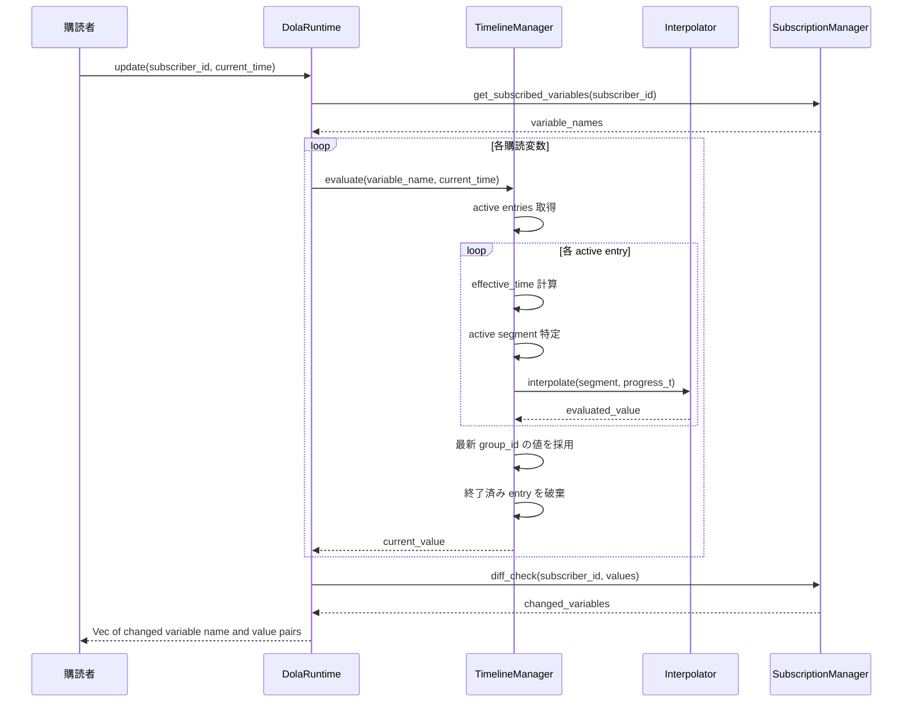
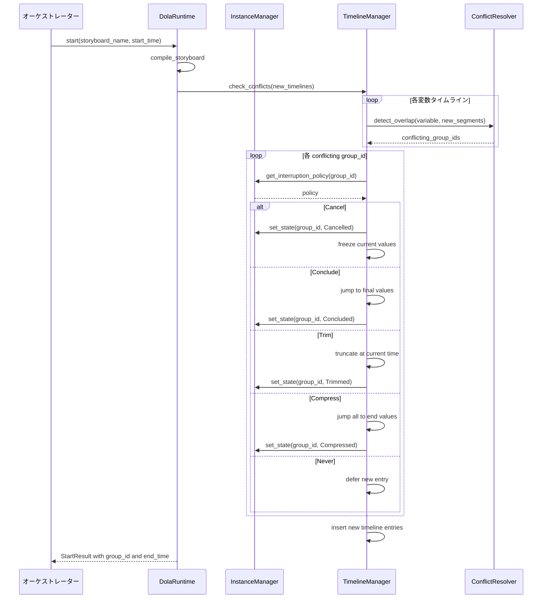
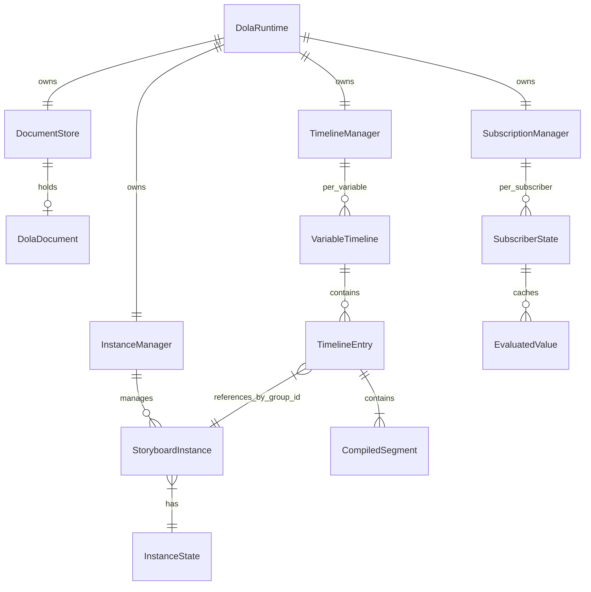
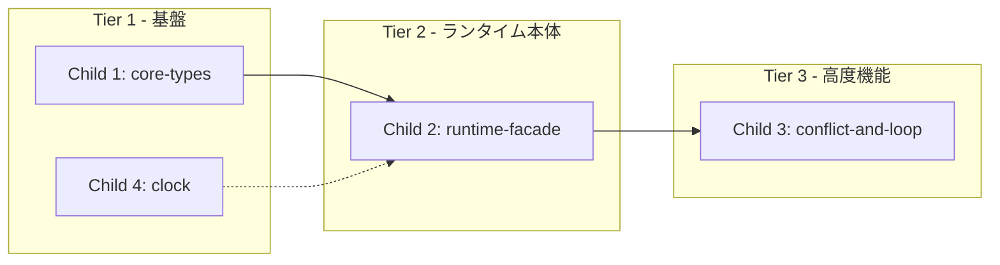

# Design Document — dola-runtime-engine

## Overview

**Purpose**: dola クレートの既存コンパイラ出力（`CompiledStoryboard`）を消費し、購読者に変数値の差分を配信するリアクティブ・アニメーション・ランタイムを提供する。WAM（Windows Animation Manager）の設計を参考としつつ、pull 型（Update 呼び出し）で値を取得するシンプルな API を実現する。

**Users**: オーケストレーター（親）がストーリーボードの開始・制御を行い、購読者（子）が変数の差分を取得する。wintf の ECS システムが主要な利用者となる。

**Impact**: 既存 dola クレートに `runtime` サブモジュールと `interpolation` 依存を追加。既存のデータモデル層（`document.rs`, `compile.rs` 等）は変更しない。

### Goals

- 指示書受信 → コンパイル → タイムテーブル管理 → 差分配信のパイプラインを構築
- 5種の中断戦略（Cancel/Conclude/Trim/Compress/Never）による競合解決
- ループ再生をタイムテーブル再利用で効率的に実現
- 子仕様フェーズ分割に適した明確なモジュール境界の定義

### Non-Goals

- wintf ECS との統合（wintf 側の仕様で対応）
- マルチスレッド同時アクセスの保証（シングルスレッド前提）
- ネットワーク/IPC を介したリモート配信
- dola ドキュメントフォーマットの変更

---

## Architecture

> 発見フェーズの詳細は `research.md` を参照。本セクションは設計判断と構造のみ記述する。

### Existing Architecture Analysis

dola クレートは現在、宣言的データモデル層（定義 + コンパイラ）として完成している:

- `DolaDocument`: ルートコンテナ（変数・トランジション・ストーリーボード定義）
- `compile_storyboard()`: ストーリーボード → `CompiledStoryboard` 変換（753行、完成済み）
- `CompiledStoryboard` / `CompiledSegment`: ランタイム消費用データ構造（絶対時刻、ソート済みセグメント）
- `InterruptionPolicy`: 5バリアント enum（Cancel/Conclude/Trim/Compress/Never）
- `PlaybackState`: 5バリアント enum（Idle/Playing/Paused/Completed/Cancelled）— 型のみ、ロジックなし
- バリデーション（13ルール）、Builder API: 完成済み

ランタイム層は完全に新規。既存のデータモデル型を入力として消費し、内部状態を管理する。

### Architecture Pattern & Boundary Map

ハイブリッド方式（Option C）を採用: コアロジックは dola クレート内の `runtime` サブモジュールに配置し、時刻取得のみ feature gate で分離。



**Architecture Integration**:

- **選定パターン**: Facade パターン — `DolaRuntime` が唯一の公開 API。内部コンポーネントは非公開
- **境界**: オーケストレーター → `DolaRuntime` ← 購読者。両者とも同一 facade を共有
- **既存パターン保持**: dola のデータモデル型（`CompiledStoryboard`, `InterruptionPolicy` 等）をそのまま内部で使用
- **新規コンポーネント理由**: 各コンポーネントは単一責務で分離（タイムテーブル管理、競合解決、補間計算等）
- **Steering 準拠**: Rust 2024 Edition、型安全性最大化、`unsafe` は時刻取得の Win32 API 呼び出しのみ

### Technology Stack

| Layer | Choice / Version | Role in Feature | Notes |
|-------|------------------|-----------------|-------|
| Runtime Core | Rust 2024 Edition | ランタイムエンジン全体 | 既存 dola クレート内に配置 |
| Interpolation | `interpolation` 0.3.0 | イージング評価 + 線形補間 | feature `runtime` で有効化 |
| Data Model | `serde` 1 (既存) | ドキュメントパース | 変更なし |
| Format | `toml` 0.8 (既存) | TOML 指示書パース | 変更なし |
| Time Utility | Win32 `GetTickCount64` | OS 起動時からの時刻取得 | feature `windows-clock` で分離 |

---

## System Flows

### ストーリーボード実行インスタンスの状態遷移



- Playing / Paused からのみ終了状態へ遷移可能
- 終了状態からの遷移は不可（3.7: エラー返却）
- `Finish(offset)` は遅延 Conclude として Playing 状態で予約される

### Update 評価サイクル



**Time Scale Semantics**:
- effective_time = `(current_time - start_time - pause_accumulated) * time_scale`
- `time_scale` は再生速度倍率（乗算方式）:
  - `time_scale = 2.0` → 2倍速（アニメーションが半分の時間で完了）
  - `time_scale = 0.5` → 半速（アニメーションが2倍の時間で完了）
  - WAM `SetStoryboardPlaybackSpeed` と同じ解釈
- ループ時: 周回完了検出 → `pause_accumulated` 調整でオフセットリセット
- 同一変数に複数 group_id が存在する場合、最新（最大）group_id の値を採用

### 競合解決フロー



- 競合はストーリーボード Start 時に検出（タイムテーブル挿入前）
- group_id 単位で一括適用: 1変数の競合で同一 group_id の全変数に戦略適用（7.3）
- Never ポリシーは新ストーリーボードの当該変数エントリを延期キューに格納

---

## Requirements Traceability

| Requirement | Summary | Components | Interfaces | Flows |
|-------------|---------|------------|------------|-------|
| 1.1-1.6 | 指示書受信・管理 | DocumentStore | `load_document()` | — |
| 2.1-2.5 | Start コマンド | InstanceManager, TimelineManager | `start()` | 競合解決フロー |
| 2.6 | loop_count=0 で INFINITY | InstanceManager | `start()` | — |
| 2.7 | CalculateEndTime | InstanceManager | `calculate_end_time()` | — |
| 2.8-2.9 | Start エラー条件 | DolaRuntime | `start()`, `calculate_end_time()` | — |
| 3.1-3.6 | 制御コマンド | InstanceManager | `pause()`, `resume()`, `conclude()`, `cancel()`, `finish()` | 状態遷移図 |
| 3.7 | 終了済みへの操作 | InstanceManager | 全制御メソッド | — |
| 4.1-4.6 | 購読管理 | SubscriptionManager | `subscribe()`, `unsubscribe()`, `Drop` | — |
| 5.1-5.5 | Update 差分配信 | SubscriptionManager, TimelineManager, Interpolator | `update()` | Update 評価サイクル |
| 6.1-6.5 | タイムテーブル管理 | TimelineManager | 内部 API | Update 評価サイクル |
| 7.1-7.9 | 競合検出・終了戦略 | ConflictResolver, InstanceManager, TimelineManager | 内部 API | 競合解決フロー |
| 8.1-8.5 | 状態遷移 | InstanceManager | 内部状態マシン | 状態遷移図 |
| 9.1-9.3 | 同時再生 | TimelineManager | — | — |
| 10.1-10.4 | イージング関数 | Interpolator | 内部 API | — |
| 11.1-11.3 | 時刻ユーティリティ | Clock | `now()` | — |
| 12.1-12.8 | ループ再生 | LoopController, InstanceManager | 内部 API | Update 評価サイクル |

---

## Components and Interfaces

| Component | Domain/Layer | Intent | Req Coverage | Key Dependencies | Contracts |
|-----------|-------------|--------|-------------|-----------------|-----------|
| DolaRuntime | Facade | 唯一の公開 API エントリーポイント | 全要件 | 全内部コンポーネント (P0) | Service |
| DocumentStore | Data | 指示書定義の保持と差し替え | 1 | DolaDocument (P0) | State |
| InstanceManager | Core | 実行インスタンスのライフサイクル管理 | 2, 3, 8 | TimelineManager (P0), ConflictResolver (P0) | Service, State |
| TimelineManager | Core | 購読変数ごとのタイムテーブル管理 | 5, 6, 9 | Interpolator (P0) | Service |
| ConflictResolver | Core | 競合検出と中断戦略の適用 | 7 | InstanceManager (P0) | Service |
| Interpolator | Core | イージング適用と補間計算 | 10 | interpolation crate (P0) | Service |
| SubscriptionManager | Core | 購読登録と差分検出 | 4, 5 | TimelineManager (P1) | Service, State |
| LoopController | Core | ループ再生の周回管理 | 12 | InstanceManager (P0) | Service |
| Clock | Utility | OS 起動時からの時刻取得 | 11 | Win32 API (P0) | Service |

### Facade Layer

#### DolaRuntime

| Field | Detail |
|-------|--------|
| Intent | オーケストレーターと購読者の双方に対する唯一の公開 API |
| Requirements | 1.1-1.6, 2.1-2.9, 3.1-3.7, 4.1-4.6, 5.1-5.5, 11.1-11.3 |

**Responsibilities & Constraints**
- 全外部操作のエントリーポイント。内部コンポーネントへの委譲のみ行う
- group_id の単調増加連番生成（`AtomicU64` or カウンタ）
- ドキュメント・インスタンス・購読の整合性を保証

**Dependencies**
- Inbound: オーケストレーター — コマンド発行 (P0)
- Inbound: 購読者 — subscribe/update (P0)
- Outbound: DocumentStore — ドキュメント管理 (P0)
- Outbound: InstanceManager — インスタンス操作 (P0)
- Outbound: SubscriptionManager — 購読管理 (P0)

**Contracts**: Service [x] / State [ ]

##### Service Interface

```rust
trait DolaRuntimeApi {
    /// 指示書（TOML文字列）を読み込み、定義を差し替える (1.1-1.6)
    fn load_document(&mut self, toml_str: &str) -> Result<(), RuntimeError>;

    /// ストーリーボードをコンパイルして再生開始 (2.1-2.5, 2.8-2.9)
    fn start(&mut self, name: &str, start_time: f64) -> Result<StartResult, RuntimeError>;

    /// 終了予定時刻のみを事前計算 (2.7-2.8)
    fn calculate_end_time(&self, name: &str, start_time: f64) -> Result<f64, RuntimeError>;

    /// 一時停止 (3.1, 3.6)
    fn pause(&mut self, group_id: u64) -> Result<(), RuntimeError>;

    /// 再開（終了予定時刻を再計算して返却）(3.2)
    fn resume(&mut self, group_id: u64, current_time: f64) -> Result<f64, RuntimeError>;

    /// 最終値ジャンプ終了 (3.3)
    fn conclude(&mut self, group_id: u64) -> Result<(), RuntimeError>;

    /// 現在値凍結破棄 (3.4)
    fn cancel(&mut self, group_id: u64) -> Result<(), RuntimeError>;

    /// 遅延 Conclude (3.5)
    fn finish(&mut self, group_id: u64, offset: f64) -> Result<(), RuntimeError>;

    /// 変数購読登録 (4.1-4.2)
    fn subscribe(&mut self, subscriber_id: u64, variable_name: &str);

    /// 変数購読解除 (4.3)
    fn unsubscribe(&mut self, subscriber_id: u64, variable_name: &str);

    /// 購読者全購読解除 (4.4)
    fn unsubscribe_all(&mut self, subscriber_id: u64);

    /// 差分更新取得 (5.1-5.5)
    fn update(&mut self, subscriber_id: u64, current_time: f64) -> Vec<(String, EvaluatedValue)>;
}
```

**Contract Specifications**:
- **Preconditions**: `start_time` / `current_time` は OS 起動時からの f64 秒
- **Postconditions**: `start()` 成功時、group_id は単調増加の一意値
- **Invariants**: `load_document()` 失敗時、既存定義は変更されない (1.5)

**Instance Identification via group_id**:

制御コマンド（pause/resume/conclude/cancel/finish）は `group_id` で実行インスタンスを特定する。ストーリーボード名ではなく group_id を使う理由：

- **同一ストーリーボードの複数実行**: 同じストーリーボード（例: "blink"）を複数回 start した場合、各インスタンスを個別に制御する必要がある
- **名前では特定不可**: ストーリーボード名では「どの実行インスタンスか」を区別できない（例: 2つの "blink" のうち1つだけ pause したい場合）
- **group_id で一意識別**: 各 start が返す一意な group_id により、特定のインスタンスのみを操作可能

例:
```rust
let result1 = runtime.start("blink", 0.0)?; // group_id = 1
let result2 = runtime.start("blink", 0.5)?; // group_id = 2
runtime.pause(1)?; // 1つ目の "blink" だけ一時停止
```

**State Visibility Design (ステートレス設計)**:

インスタンス状態（`InstanceState`）を外部に公開する問い合わせAPIは提供しない。理由：

1. **オーケストレーター**: 自分が発行した `group_id` とその `end_time`（`start()` の返り値）を既に管理している。終了タイミングは `end_time` で計算可能
2. **購読者**: `group_id` を知らず、`update(subscriber_id, current_time)` で値を取得するのみ。終了は空 Vec で間接的に検知
3. **エラーハンドリング**: 終了済みインスタンスへの操作は `RuntimeError::TerminatedInstance` で検知可能

この設計により、API surface を最小化し、ステートレスな利用パターンを推奨する。デバッグ目的での状態確認が必要な場合は、将来的に `tracing` ログ出力で対応可能。

### Core Layer

#### InstanceManager

| Field | Detail |
|-------|--------|
| Intent | ストーリーボード実行インスタンスのライフサイクル管理と状態マシン |
| Requirements | 2.1-2.6, 2.8-2.9, 3.1-3.7, 8.1-8.5 |

**Responsibilities & Constraints**
- `StoryboardInstance` のコレクション管理
- 状態遷移の正当性検証（終了状態への操作拒否 → エラー返却）
- Finish(offset) の遅延実行（再生中に offset 経過で自動 Conclude）
- group_id → instance の O(1) ルックアップ

**Dependencies**
- Inbound: DolaRuntime — コマンド委譲 (P0)
- Outbound: TimelineManager — タイムテーブル操作 (P0)
- Outbound: ConflictResolver — 競合検出 (P0)
- Outbound: LoopController — ループ判定 (P1)

**Contracts**: Service [x] / State [x]

##### State Management

```rust
/// 実行インスタンスの状態（ランタイム内部専用、シリアライズなし）
enum InstanceState {
    Created,
    Playing,
    Paused,
    Concluded,
    Cancelled,
    Trimmed,
    Compressed,
}
```

**Design Note: InstanceState vs PlaybackState**

- **InstanceState** (新規): ランタイム専用の内部状態管理。7バリアント（Created + InterruptionPolicy 対応の終了状態4つ）
- **PlaybackState** (既存): dola データモデル層の型定義のみ。5バリアント（Idle/Playing/Paused/Completed/Cancelled）。ロジックなし、シリアライズ用途
- **外部非公開**: `InstanceState` は facade API から公開しない。オーケストレーターは `start()` の返り値 `end_time` で終了タイミングを管理し、購読者は `update()` の空 Vec で終了を検知する（ステートレス設計）

```rust
/// ストーリーボード実行インスタンス
struct StoryboardInstance {
    group_id: u64,
    storyboard_name: String,
    state: InstanceState,
    interruption_policy: InterruptionPolicy,
    start_time: f64,
    time_scale: f64,
    base_duration: f64,
    pause_accumulated: f64,
    pause_start: Option<f64>,
    loop_count: Option<u32>,
    loops_completed: u32,
    finish_deadline: Option<f64>,
}
```

- **Persistence**: インメモリのみ。プロセス終了で消失
- **Concurrency**: シングルスレッド前提。外部同期は呼び出し側の責務

#### TimelineManager

| Field | Detail |
|-------|--------|
| Intent | 購読変数ごとのタイムテーブルを管理し、時刻ベースの値評価を提供 |
| Requirements | 5.1-5.2, 6.1-6.5, 9.1-9.3 |

**Responsibilities & Constraints**
- `HashMap<String, VariableTimeline>` — 変数名 → タイムライン
- 各タイムラインは複数 group_id のエントリを時系列で保持（9.1: 並行再生）
- Update 時に終了済みエントリを自動破棄（5.2, 6.5）
- 計算コストは購読変数数に比例（9.3）

**Dependencies**
- Inbound: InstanceManager — エントリ追加/操作 (P0)
- Inbound: SubscriptionManager — 評価要求 (P0)
- Outbound: Interpolator — 補間計算 (P0)

**Contracts**: Service [x] / State [x]

##### Service Interface

```rust
trait TimelineManagerApi {
    /// コンパイル結果をタイムテーブルに追加 (6.2)
    fn insert_entries(
        &mut self,
        group_id: u64,
        compiled: &CompiledStoryboard,
        instance: &StoryboardInstance,
    );

    /// 指定変数の現在値を評価 (5.1)
    fn evaluate(
        &mut self,
        variable_name: &str,
        current_time: f64,
        instances: &HashMap<u64, StoryboardInstance>,
    ) -> Option<EvaluatedValue>;

    /// 競合チェック: 新エントリと重複する既存 group_id を返す
    fn detect_conflicts(
        &self,
        compiled: &CompiledStoryboard,
        start_time: f64,
    ) -> Vec<u64>;

    /// group_id のエントリに終了戦略を適用
    fn apply_termination(
        &mut self,
        group_id: u64,
        strategy: InterruptionPolicy,
        current_time: f64,
        instances: &HashMap<u64, StoryboardInstance>,
    );
}
```

##### State Management

```rust
/// 変数ごとのタイムライン
struct VariableTimeline {
    entries: Vec<TimelineEntry>,
}

/// 1つの group_id に属するセグメント群
struct TimelineEntry {
    group_id: u64,
    segments: Vec<CompiledSegment>,
    variable_type: VariableTypeHint,
}
```

#### ConflictResolver

| Field | Detail |
|-------|--------|
| Intent | 同一変数の時間的重複を検出し、InterruptionPolicy に基づく終了戦略を適用 |
| Requirements | 7.1-7.9 |

**Responsibilities & Constraints**
- 競合検出: 新セグメントの時間範囲が既存セグメントと重複するかチェック
- group_id 単位一括適用: 1変数の競合で同一 group_id の全変数に戦略適用（7.3）
- Cancel: 現在の補間値で凍結（7.4）
- Conclude: 現在トランジションの最終値ジャンプ + 未開始スキップ（7.5）
- Trim: 割り込み時点で切断（7.6）
- Compress: 全トランジション最終値ジャンプ（7.7）
- Never: 新エントリの延期（7.8）
- デフォルト: Conclude（7.9）

**Dependencies**
- Inbound: InstanceManager / TimelineManager — 競合判定要求 (P0)
- Outbound: InstanceManager — 状態変更 (P0)
- Outbound: TimelineManager — エントリ操作 (P0)

**Contracts**: Service [x]

##### Service Interface

```rust
trait ConflictResolverApi {
    /// 競合を解決し、影響を受けた group_id のリストを返す
    fn resolve_conflicts(
        &self,
        new_compiled: &CompiledStoryboard,
        new_start_time: f64,
        timelines: &mut HashMap<String, VariableTimeline>,
        instances: &mut HashMap<u64, StoryboardInstance>,
        current_time: f64,
    ) -> Vec<u64>;
}
```

#### Interpolator

| Field | Detail |
|-------|--------|
| Intent | イージング関数の適用と値の補間計算 |
| Requirements | 10.1-10.4 |

**Responsibilities & Constraints**
- `EasingName` → `interpolation::EaseFunction` のマッピング（30バリアント 1対1）
- `EasingName::Linear` → `t` をそのまま返す
- `ParametricEasing::QuadraticBezier` → `interpolation::quad_bez()`
- `ParametricEasing::CubicBezier` → `interpolation::cub_bez()`
- `VariableTypeHint` による型別処理: Float(f64直接), Integer(f64補間→i64丸め), Object(即時切替)

**Dependencies**
- Inbound: TimelineManager — 補間要求 (P0)
- External: `interpolation` 0.3.0 — `Ease` trait, `EaseFunction`, `lerp`, `quad_bez`, `cub_bez` (P0)

**Contracts**: Service [x]

##### Service Interface

```rust
trait InterpolatorApi {
    /// セグメントの進捗率 t で補間値を計算
    fn interpolate(
        &self,
        segment: &CompiledSegment,
        variable_type: &VariableTypeHint,
        progress_t: f64,
    ) -> EvaluatedValue;
}
```

- **Preconditions**: `progress_t` は 0.0..=1.0 の範囲。範囲外は clamp
- **Postconditions**: `VariableTypeHint::Integer` の場合、結果は `round()` 後の i64。`Object` の場合、`progress_t >= 1.0` なら `to_value`、それ以外は `from_value`

#### SubscriptionManager

| Field | Detail |
|-------|--------|
| Intent | 購読者ごとの変数購読状態と差分検出 |
| Requirements | 4.1-4.6, 5.1, 5.3-5.4 |

**Responsibilities & Constraints**
- subscriber_id → 購読変数名セット の管理
- 購読者ごとの前回値キャッシュ（差分検出用）
- 指示書受信前に購読登録可能（4.1）
- 指示書に存在しない変数の購読は無視（4.6）

**Dependencies**
- Inbound: DolaRuntime — subscribe/unsubscribe/update (P0)
- Outbound: TimelineManager — 変数評価 (P1)

**Contracts**: Service [x] / State [x]

##### State Management

```rust
struct SubscriberState {
    variables: HashSet<String>,
    last_values: HashMap<String, EvaluatedValue>,
}
```

#### LoopController

| Field | Detail |
|-------|--------|
| Intent | ループ再生の周回管理とタイムテーブル再利用 |
| Requirements | 12.1-12.8 |

**Responsibilities & Constraints**
- 周回完了検出: 全セグメント終了時に `loop_count` チェック
- タイムテーブル再利用: 時間オフセット調整（`pause_accumulated` 機構と統合）
- 無限ループ（`Some(0)`）は明示的中断まで継続
- ループ中も競合検出・中断戦略の対象（12.8）

**Dependencies**
- Inbound: InstanceManager — ループ判定要求 (P0)
- Outbound: InstanceManager — 状態更新 (P0)

**Contracts**: Service [x]

##### Service Interface

```rust
trait LoopControllerApi {
    /// 周回完了時のループ継続判定。true = 継続、false = 終了
    fn should_continue_loop(instance: &StoryboardInstance) -> bool;

    /// ループ継続時のオフセット調整
    fn advance_loop(instance: &mut StoryboardInstance);
}
```

### Utility Layer

#### Clock

| Field | Detail |
|-------|--------|
| Intent | OS 起動時からの高精度時刻取得 |
| Requirements | 11.1-11.3 |

**Responsibilities & Constraints**
- `GetTickCount64` ベース（ms 精度）
- feature gate `windows-clock` で隔離
- 戻り値: f64 秒（OS 起動時からの経過秒数）

**Dependencies**
- External: Win32 API `GetTickCount64` (P0)

**Contracts**: Service [x]

##### Service Interface

```rust
/// OS 起動時からの現在時刻（f64秒）を取得 (11.1)
fn now() -> f64;
```

**Implementation Notes**
- `GetTickCount64() as f64 / 1000.0` で実装。ms 精度は 60fps アニメーションに十分
- 将来 QPC ベースへの差し替えが必要な場合、この関数シグネチャを維持したまま内部実装を変更可能

---

## Data Models

### Domain Model



**Core Value Types**:

```rust
/// 評価済み変数値（補間計算の出力）
enum EvaluatedValue {
    Float(f64),
    Integer(i64),
    Object(DynamicValue),
}

/// ランタイムエラー
enum RuntimeError {
    /// 指定ストーリーボード名が未定義
    StoryboardNotFound(String),
    /// 指定 group_id が存在しない
    InvalidGroupId(u64),
    /// 終了済みインスタンスへの操作 (3.7)
    TerminatedInstance { group_id: u64, state: InstanceState },
    /// 指示書パース失敗 (1.5)
    DocumentParseError(String),
    /// duration=0 かつ loop_count 設定 (2.9)
    ZeroDurationWithLoop { storyboard: String },
    /// コンパイルエラー（既存 DolaError のラップ）
    CompileError(DolaError),
}

/// Start コマンドの返却値
struct StartResult {
    group_id: u64,
    end_time: f64,
}
```

**Invariants**:
- `group_id` は単調増加の一意値（0 から開始、u64 オーバーフローは非現実的）
- `EvaluatedValue` の variant は `VariableTypeHint` と1対1対応
- `InstanceState` の終了状態は `InterruptionPolicy` と1対1対応（Never 除く）

---

## Error Handling

### Error Strategy

- **Fail Fast**: 無効な group_id、終了済みインスタンスへの操作、存在しないストーリーボード名は即座にエラー返却
- **Graceful Degradation**: 指示書パース失敗時は既存定義を維持（1.5）
- **Observability**: `tracing` クレートによる構造化ログ。`debug!` レベルでコマンド実行、`warn!` レベルで競合検出、`error!` レベルでコンパイルエラー

### Error Categories and Responses

| カテゴリ | エラー | 応答 |
|---------|--------|------|
| Invalid Input | 存在しないストーリーボード名 (2.8) | `RuntimeError::StoryboardNotFound` |
| Invalid Input | duration=0 + loop_count (2.9) | `RuntimeError::ZeroDurationWithLoop` |
| Invalid State | 終了済みインスタンスへの操作 (3.7) | `RuntimeError::TerminatedInstance` |
| Invalid State | 存在しない group_id | `RuntimeError::InvalidGroupId` |
| Parse Error | TOML パース失敗 (1.5) | `RuntimeError::DocumentParseError` |
| Compile Error | バリデーション/コンパイル失敗 | `RuntimeError::CompileError` |

---

## Testing Strategy

### Unit Tests
- `Interpolator`: 全30イージング関数 + Linear + ParametricEasing の出力値検証
- `InstanceState`: 状態遷移の正当性（許可/拒否パターン全網羅）
- `LoopController`: loop_count None/Some(0)/Some(n) の周回判定
- `ConflictResolver`: 5戦略の個別適用結果検証
- `SubscriptionManager`: subscribe/unsubscribe/diff 検出

### Integration Tests
- **フル再生サイクル**: load → start → update(複数回) → 自然終了、値の変化を検証
- **Pause/Resume**: 一時停止中の値固定と再開後の継続を検証
- **競合解決**: 2つのストーリーボードが同一変数を操作、各戦略の結果を検証
- **ループ再生**: loop_count=Some(3) の3周回完了と値の周期的変化を検証
- **指示書差し替え**: 再生中に load_document、変数値の引き継ぎと凍結を検証

### Performance Tests
- 100変数同時購読時の Update レイテンシ
- 50ストーリーボード同時再生時のメモリ使用量
- 無限ループ（`Some(0)`）の長時間再生での精度劣化

---

## Implementation Extensions

### Never ポリシーの延期キュー実装ノート

**Context**: 要件 7.8 — InterruptionPolicy::Never が適用された場合、新ストーリーボードの当該変数エントリを既存インスタンス完了後まで延期する。

**Implementation Strategy**:

#### データ構造
```rust
/// ConflictResolver または TimelineManager 内部で管理
struct DeferredEntry {
    group_id: u64,
    variable_name: String,
    segments: Vec<CompiledSegment>,
    variable_type: VariableTypeHint,
    blocked_by: u64,  // 先行 group_id
}

// 延期キュー
deferred_entries: Vec<DeferredEntry>
```

#### 再評価トリガー
- **タイミング**: InstanceManager が group_id を終了状態（Concluded/Cancelled/Trimmed/Compressed）に遷移させた時
- **処理**: TimelineManager が deferred_entries を走査し、`blocked_by == 終了した group_id` のエントリをタイムテーブルに追加

#### タイムアウトとメモリ管理
- **無期限延期の許容**: 先行 group_id が無限ループ（`loop_count = Some(0)`）の場合、延期エントリは永続的に保持される。これは仕様上許容される動作
- **メモリ上限**: 実装フェーズで必要と判断された場合、子仕様 `dola-runtime-conflict-loop` で延期キューのサイズ上限を定義可能

#### 実装コンポーネント
- **ConflictResolver**: 競合検出時に延期エントリを生成
- **TimelineManager**: 延期キューの保持と再評価トリガー時の追加処理
- **InstanceManager**: group_id 終了時に TimelineManager へ通知

**Verification**: 統合テスト「Never ポリシー + 先行完了による自動追加」で検証

---

## Child Spec Decomposition Plan

本仕様の実装は以下の4子仕様に分割して段階的に完成させる。



| 子仕様 | 名称 | Tier | 要件カバー | 概要 | 依存 |
|--------|------|------|-----------|------|------|
| 1 | `dola-runtime-core-types` | 1 | 8, 10 | InstanceState, EvaluatedValue, RuntimeError, Interpolator | なし |
| 2 | `dola-runtime-facade` | 2 | 1, 2, 3, 4, 5, 6, 9 | DolaRuntime facade, DocumentStore, InstanceManager, TimelineManager, SubscriptionManager | Child 1 |
| 3 | `dola-runtime-conflict-loop` | 3 | 7, 12 | ConflictResolver, LoopController, Never 延期キュー | Child 2 |
| 4 | `dola-runtime-clock` | 1 | 11 | Clock ユーティリティ（feature gate `windows-clock`） | なし |

**完了条件**: 4子仕様すべてが implementation-complete となった時点で、本親仕様を完了とする。
