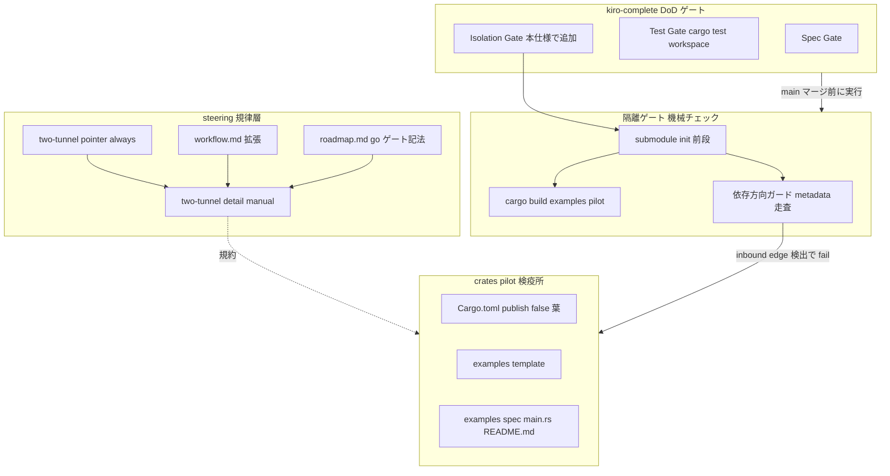
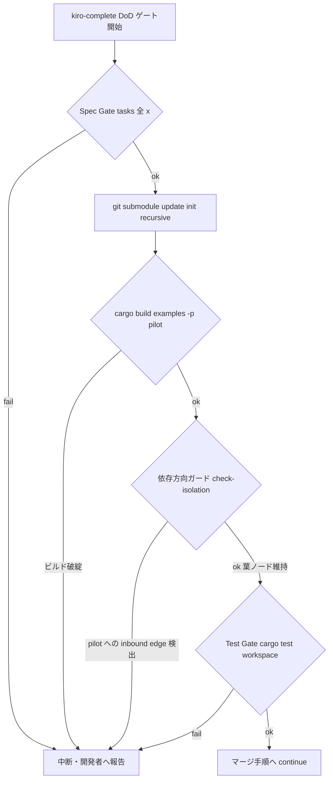
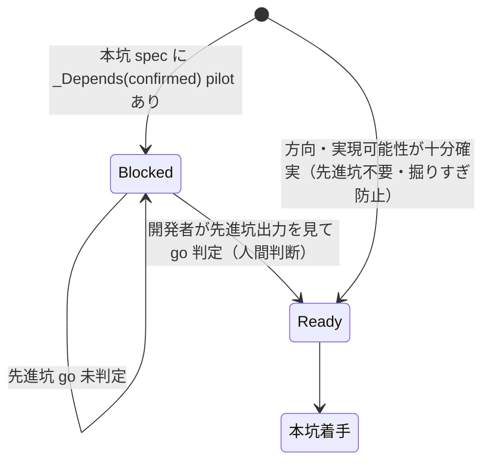

# Design Document

| 項目 | 内容 |
|------|------|
| **Feature** | kiro-P0-two-tunnel-model |
| **Type** | プロセス支援仕様（Extension：既存 kiro/steering インフラ拡張 ＋ 新規葉クレート追加） |
| **Language** | ja |
| **Date** | 2026-06-28 |
| **Discovery** | Light（既存パターン統合中心） |

---

## Overview

本仕様は、エージェント駆動開発における**誤った方向の可逆性（reversibility）**を最優先する開発規律「**二坑モデル**」を、4 種の成果物として確立する：(1) steering 文書（規律の正本）、(2) 知見クレート `crates/pilot`（先進坑コードと一次記録の検疫所・葉ノード）、(3) 隔離ゲート（依存方向ガード ＋ examples ビルドをローカル workflow 完了ゲートに統合）、(4) workflow.md への二坑統合。

**Users**: 本リポジトリの開発者および AI エージェント。以降のすべての spec が「手応えの速さでなく誤りの可逆性」を最優先する規律の下で進む。先進坑（pilot・使い捨て検証）で方向を確定してから本坑（main・完成品）を掘る運用が、steering とインフラの両面から強制される。

**Impact**: 現状の kiro spec ライフサイクル（requirements→design→tasks→implementation→complete）に、先進坑フェーズと go ハードゲートを上乗せする。既存のブランチ/マージ/完了規約は不変のまま、`crates/pilot` という新しい葉ノードと、`/kiro-complete` の DoD ゲートに統合される機械チェックが追加される。production クレート（wintf/dola/areka/shiori-abi）には一切手を加えない。

### Goals

- 二坑モデルの規律（先進坑/本坑・命綱・ハードゲート・依存マップ検証・削除/隔離規律）を steering の正本として確立する。
- `crates/pilot` を `publish=false`・葉ノード・最小依存で新設し、先進坑コードと 3 幕 README 一次記録の検疫所とする。
- 「production が先進坑コードに依存しない（葉ノード隔離）」という命綱を、人手でなく**機械チェック**で厳守する。乗り物はローカル workflow 完了ゲート（`/kiro-complete` の DoD ゲート）。
- 既存ワークフローを置換せず、上乗せする形で二坑規律を組み込む。

### Non-Goals

- リモート CI（GitHub Actions 等）の新設（未リリースゆえ対象外・後続候補。チェックロジックは再利用可能な形で実装する）。
- 依存マップ検証（R7）の自動チェックツール化（手動チェックリスト規律として確立。自動化は本仕様の契約外）。
- 既存ロードマップの二坑分解（M1 を pilot/main へ割り直す作業）— 本モデル確立後の後続 discovery。
- 個別の先進坑/本坑 spec の実装そのもの。
- 並列実行基盤の新規開発（既存の Agent/Workflow 機構を運用で用いる）。
- production クレート（wintf/dola/areka/shiori-abi）への機能追加。
- `completed/` 配下の完了仕様（`kiro-P0-roadmap-management` 等）の改変。

---

## Boundary Commitments

### This Spec Owns

- **二坑モデル steering 文書群**: `.kiro/steering/` 配下に二坑規律の正本を確立する（二層構成：常駐ポインタ ＋ manual 詳細）。
- **`crates/pilot` クレート**: 新規 `Cargo.toml`・workspace 統合・`examples/<spec>/` 規約・テンプレ example（雛形 `main.rs` ＋ README 雛形）。
- **3 幕 README 規約**: `examples/<spec>/README.md` を先進坑の一次記録（正本）とする構成と運用手順（subagent .md 制約の代替手順を含む）。
- **隔離ゲートのチェックロジック**: production→pilot 依存禁止の機械的検証（依存方向ガード）と pilot examples ビルド検証。再利用可能なスクリプト/コマンドとして実装する。
- **workflow.md への二坑統合**: 先進坑フェーズ・go ハードゲート・依存マップ検証ルール・削除/隔離規律の追記、および隔離ゲートの DoD ゲート統合。
- **go ハードゲート記法**: 本坑 spec が先進坑の go 判定を前提依存に持つことを spec 上で表現する記法の定義。
- **依存マップ手動チェックリスト**: 被覆/孤児なし/DAG/合否基準を分解時に目視適用する steering 規律。

### Out of Boundary

- リモート CI（GitHub Actions ワークフロー）の新設。`.github/` ディレクトリは本仕様では作成しない。
- 依存マップ検証の自動化ツール（パーサ・lint）。
- ロードマップ内容の二坑再分解（後続 discovery）。
- production クレートへの機能追加・既存 spec の実装。
- 並列実行基盤の開発。
- `completed/` 配下仕様の改変（整合のみ）。

### Allowed Dependencies

- **既存 steering 群**: `workflow.md`（拡張対象・`inclusion: always`）、`roadmap.md`（go ゲート記法の宿主・`inclusion: manual`）、`focus.md`（二層パターンの前例）。
- **既存ワークスペース構成**: ルート `Cargo.toml` の `members = ["crates/*"]`（自動メンバー取り込み）、`[patch.crates-io] pasta_core`（submodule 依存）。
- **既存クレート範例**: `crates/shiori-abi`（`publish=false` 葉ノードの先例）、`crates/wintf/examples/taffy_flex_demo/`（`examples/<dir>/main.rs` の実証済み構成）。
- **`/kiro-complete` の DoD ゲート**: 隔離ゲートの統合先（既存の Spec Gate / Test Gate に並置）。
- **既知ハーネス制約**: subagent は `.md` を Write/Edit 不可（PowerShell here-string / 親書き込みで代替）。
- **依存制約（不変）**: `crates/pilot` は他のいかなるワークスペースクレートからも依存されてはならない（inbound edge ゼロ）。pilot が他クレートに依存するのは許容するが、最小依存を保ち 32bit 可搬性を崩さない。

### Revalidation Triggers

以下の変更は下流（後続 spec・運用者）に再確認を要する：

- **go ゲート記法の形式変更**: `_Depends(confirmed): <pilot>` の表記・宿主（roadmap.md）が変わる場合、roadmap の依存記述と `/kiro-spec-batch` の解釈に影響。
- **隔離ゲートのコマンド契約変更**: 依存方向ガードのスクリプト名・呼出方法・前段（`git submodule update --init --recursive`）が変わる場合、`/kiro-complete` の DoD ゲート手順と workflow.md の記述に影響。
- **`crates/pilot` の依存方向不変条件の変更**: pilot が葉ノードでなくなる（誰かが依存する）方向の変更は命綱の破壊であり、機械ゲートが失敗として扱う。
- **steering 二層構成の変更**: 常駐ポインタ／manual 詳細の分割方針が変わる場合、AI のコンテキスト読み込み挙動（要件 1-5）に影響。
- **README 3 幕構成の変更**: 一次記録の構造が変わる場合、本坑 design が README を参照する traceability（要件 3-5）に影響。

---

## Architecture

> 詳細な調査ログ（submodule 未populate 再現・cargo-deny vs metadata の比較）は `research.md` を参照。本節は決定と契約を self-contained に記載する。

### Existing Architecture Analysis

本仕様は新規システムではなく、既存の 2 つの確立済みパターンを統合・拡張する：

1. **steering 二層パターン**（`focus.md` always・lean → `roadmap.md` manual・詳細）。要件 1-5（詳細を別文書へ委譲しコンテキスト消費を抑える）と要件 8（workflow.md 拡張・`inclusion: always` ゆえ常駐コスト）の協調は、この既存二層パターンに倣うことで解決する。
2. **葉ノード `publish=false` クレートパターン**（`shiori-abi`）＋ **`examples/<dir>/main.rs` サブフォルダ example パターン**（`wintf/examples/taffy_flex_demo/`）。`crates/pilot` はこの 2 つの合成で範例どおり実現できる。

**尊重する既存境界**:
- `workflow.md` のブランチ＆マージ戦略・完了手順は不変（要件 8-5）。二坑規律は上乗せのみ。
- `completed/kiro-P0-roadmap-management` は不変（NFR-4）。
- ルート `Cargo.toml` の `members = ["crates/*"]` ゆえ `crates/pilot/` を置けば自動でワークスペースメンバーになる（明示登録不要）。

**回避する技術的制約（research §3 の重大リスク）**:
- git worktree では submodule（`vendors/pasta`）が未populate のため、`cargo metadata`/`cargo build`/`cargo-deny` がワークスペース全体解決時に即失敗する。隔離ゲートは**すべての cargo 系ステップの前段で `git submodule update --init --recursive` を必須化**する（要件 4-6）。

### Architecture Pattern & Boundary Map

選定パターン：**規律（steering）＋ 検疫所（pilot crate）＋ 機械ゲート（DoD 統合）の三層**。先進坑コードは pilot に集約（検疫）し、命綱（葉ノード隔離）を機械で厳守、規律を steering に明文化する。



**Architecture Integration**:
- **選定パターン**: 検疫所（quarantine）＋ 機械ゲート。探索的残骸を `crates/pilot` 一葉へ集約し production を常時クリーンに保つ（要件 5-5）。
- **境界分離**: steering＝規律の正本（WHAT/WHY）、pilot crate＝先進坑コード/記録の物理的置き場、隔離ゲート＝命綱の機械的執行。3 者は明確に分離され、並行実装可能（steering 文書群・クレート骨格・ガードスクリプトは独立タスク）。
- **保持する既存パターン**: steering 二層（focus→roadmap）、葉ノード publish=false（shiori-abi）、examples サブフォルダ（taffy_flex_demo）、PR ベース完了（workflow.md）。
- **新規コンポーネントの根拠**: `crates/pilot`＝先進坑の検疫所（既存に該当なし）、依存方向ガード＝命綱の機械執行（既存に該当なし）、二坑 steering＝規律の正本（既存に該当なし）。
- **steering 準拠**: karpathy-guidelines（add-only 肥大の抑制）の思想を援用。completed/ 不変（NFR-4）。テキストベース・Git 追跡可能（NFR-5）。

### 主要設計決定（Key Decisions）

| 決定 | 選定 | 根拠（要約。詳細は research.md） |
|------|------|------|
| steering 配置（R1/R5/R8） | **二層：常駐ポインタ `two-tunnel.md`（または既存 always 文書からの短い参照節）＋ manual 詳細文書** | 既存 focus→roadmap 二層と完全整合。`inclusion: always` の常駐コスト最小化（要件 1-5）。research §4.C Option C3。 |
| 隔離ゲートの乗り物（R4） | **ローカル workflow 完了ゲート（`/kiro-complete` DoD）** | 要件ディスカッションで確定（議題1）。未リリース repo を CI で重くしない。マージは本チャット駆動の `/kiro-complete` に集約されるためローカルで成立。 |
| 依存方向ガードの実装手段（R4-2/4-3） | **`cargo metadata` ＋ 検証スクリプト（PowerShell・OS 非依存ロジック）** を第一候補、cargo-deny は不採用（理由は下記） | inbound-edge 禁止（誰も pilot に依存しない）の不変条件を完全に制御でき、CI ランナー用ツール追加インストールが不要。research §4.A A2。 |
| go ゲート記法の宿主（R6-4） | **`roadmap.md` の既存自由テキスト `Dependencies:` 拡張**（`_Depends(confirmed): <pilot-spec>`） | 最小コスト・既存慣行の拡張。spec.json スキーマの二重管理を回避。research §6-5。 |
| テンプレ example 配置（R2-6） | **`crates/pilot/examples/_template/{main.rs, README.md}`**（`_` 前置・build 対象に含め腐敗検出に入れる） | build 検証下に置くことで雛形の腐敗も検出。`<spec>` 命名規約と `_` 前置で区別。research §4.D。 |
| 依存方向ガードのビルド手段で cargo-deny を不採用 | **build-vs-adopt 結論：自前 metadata 走査を build** | cargo-deny の `bans` は outbound（あるクレートを使うな）表現が主で、「特定クレートへの被依存（inbound）禁止」の表現可否が PoC 依存・不確実。かつ CI/ローカル両環境への別途インストールを要し、二坑モデルが戒める依存負債になる。metadata の resolve グラフ走査なら inbound-edge を直接判定でき追加ツール不要。 |

### Technology Stack

| Layer | Choice / Version | Role in Feature | Notes |
|-------|------------------|-----------------|-------|
| 規律ドキュメント | Markdown（steering） | 二坑規律の正本・workflow 統合・依存マップチェックリスト | `inclusion: always`（ポインタ）/ `manual`（詳細）。既存二層パターン踏襲 |
| 知見クレート | Rust crate（edition 2024, `publish=false`） | 先進坑コード/記録の検疫所・葉ノード | `members=["crates/*"]` で自動メンバー化。最小依存（NFR-2）。`shiori-abi` 範例 |
| 一次記録 | Markdown（3 幕 README） | 先進坑の一次記録（正本）・traceability | `examples/<spec>/README.md`。subagent .md 制約は親書き込み/here-string で代替 |
| 機械ゲート | `cargo`（1.96.0）+ PowerShell スクリプト + `git submodule` | 依存方向ガード ＋ examples ビルド検証 | OS 非依存ロジック（metadata 走査）。前段 submodule init 必須 |
| 統合先 | `/kiro-complete` DoD ゲート（workflow.md） | 隔離ゲートを既存 Spec/Test Gate に並置 | リモート CI 不使用（後続候補） |

> cargo-deny vs metadata 走査の詳細比較・submodule 未populate の実地再現は `research.md` §3/§4.A を参照。

---

## File Structure Plan

### Directory Structure

```
.kiro/steering/
├── two-tunnel.md            # 新規・inclusion: manual。二坑規律の詳細正本（先進坑/本坑定義・命綱・
│                            #   ハードゲート・削除/隔離規律・依存マップ手動チェックリスト・README3幕規約）
├── workflow.md              # 変更。二坑フェーズ・go ハードゲート・依存マップ検証・削除/隔離規律の
│                            #   追記節 ＋ 隔離ゲートの DoD ゲート統合（既存規約は不変）
├── focus.md                 # 変更（任意・最小）。two-tunnel.md への参照タイミングを 1 行追記
└── roadmap.md               # 変更。go ゲート記法 _Depends(confirmed): の凡例を 1 節追記

crates/pilot/
├── Cargo.toml               # 新規。name="pilot", publish=false, edition.workspace=true,
│                            #   最小依存（依存ゼロ目標）。shiori-abi を範例
├── README.md                # 新規。クレート自体の説明（検疫所の役割・運用規約への参照）
├── src/
│   └── lib.rs               # 新規。空 lib（クレート成立用。`//! pilot quarantine crate` のみ）
└── examples/
    └── _template/           # 新規。テンプレ example（build 対象＝腐敗検出に入る）
        ├── main.rs          # 雛形コード（依存ゼロ・println! 程度）
        └── README.md        # 3 幕 README 雛形（動機→概要→検証結果）

scripts/                     # 新規ディレクトリ（または crates/pilot/ 配下に同梱）
└── check-isolation.ps1      # 新規。依存方向ガード：cargo metadata を走査し pilot への
                             #   inbound edge を検出したら非ゼロ終了。前段で submodule init を呼ぶ
```

### Modified Files

- `.kiro/steering/workflow.md` — 「先進坑フェーズ」「go ハードゲート」「依存マップ重点検証」「削除/隔離規律」の節を追記し、`/kiro-complete` DoD ゲートに隔離ゲート（submodule init → pilot examples build → 依存方向ガード）を並置する記述を追加。既存のブランチ/マージ/完了手順は変更しない。
- `.kiro/steering/roadmap.md` — go ゲート記法 `_Depends(confirmed): <pilot-spec>` の凡例節を追記（既存 `Dependencies:` 自由テキストの拡張）。
- `.kiro/steering/focus.md` — `two-tunnel.md` への参照を「参照先」節に 1 行追記（任意・最小）。
- ルート `Cargo.toml` — 変更**不要**（`members = ["crates/*"]` で `crates/pilot` は自動取り込み）。記載は「変更不要の確認」事項として明示。

> `check-isolation.ps1` の配置（`scripts/` 新設 vs `crates/pilot/` 同梱）はタスク段階の微調整事項。DoD ゲートから決定論的に呼べるパスであれば可。本設計は `scripts/check-isolation.ps1` を既定とする。

---

## System Flows

### 隔離ゲート実行フロー（`/kiro-complete` DoD ゲート内）



**ゲート決定事項**:
- 前段 `git submodule update --init --recursive` は無条件実行（worktree での submodule 未populate を防ぐ・要件 4-6）。失敗時は cargo 系を実行せず中断。
- pilot examples ビルド（要件 4-1/4-4）と依存方向ガード（要件 4-2/4-3）はいずれも失敗時に当該変更を fail とする。
- 隔離ゲートは既存 Spec Gate / Test Gate と並置され、`main` マージ前（`/kiro-complete` 内）に実行される（要件 4-5）。

### go ハードゲート判定フロー（本坑着手時）



**ゲート決定事項**:
- go 判定は**開発者が出力を見て下す人間判断**であり自動判定にしない（要件 6-3）。
- go まで本坑 spec は BLOCKED（着手不能・要件 6-2）。
- 方向が十分確実なら先進坑を経ず直接本坑に着手してよい（要件 6-5・掘りすぎ防止）。

---

## Requirements Traceability

| Requirement | Summary | Components | Interfaces / Contracts | Flows |
|-------------|---------|------------|------------------------|-------|
| 1.1–1.4 | 二坑 steering 文書化（定義・可逆性方針・判断基準・各規律への参照） | two-tunnel.md | Markdown 規律文書 | — |
| 1.5 | 詳細を別文書へ委譲しコンテキスト抑制 | two-tunnel.md（manual）＋ ポインタ | 二層構成契約 | — |
| 2.1–2.3 | `crates/pilot` 新設・publish=false・葉ノード | crates/pilot/Cargo.toml | Cargo manifest・inbound-edge ゼロ不変条件 | — |
| 2.4–2.5 | `examples/<spec>/{main,README}` 1 仕様1フォルダ・merge 衝突ゼロ | crates/pilot/examples/ 規約 | ディレクトリ規約 | — |
| 2.6 | テンプレ example | examples/_template/ | 雛形 main.rs ＋ README | — |
| 2.7 / NFR-2 | 最小依存・32bit 可搬性 | crates/pilot/Cargo.toml | 依存制約 | — |
| 3.1–3.4 | README 3 幕一次記録・traceability・実行法 | examples/<spec>/README.md 規約・_template/README.md | 3 幕 Markdown 契約 | — |
| 3.5 | 本坑 design が README 検証結果を参照・二重化しない | two-tunnel.md（参照規律） | traceability 規約 | — |
| 3.6 | subagent .md 制約の代替手順 | two-tunnel.md（運用節） | 親書き込み/here-string 手順 | — |
| 4.1, 4.4 | examples ビルド・腐敗検出 | check-isolation.ps1 ／ DoD ゲート | `cargo build --examples -p pilot` | 隔離ゲートフロー |
| 4.2, 4.3 | production→pilot 依存禁止の機械検証・違反を fail | check-isolation.ps1（依存方向ガード） | metadata 走査・inbound-edge 判定 | 隔離ゲートフロー |
| 4.5 | ローカル workflow 完了ゲートに統合・main マージ前実行 | workflow.md ／ kiro-complete DoD | DoD ゲート統合 | 隔離ゲートフロー |
| 4.6 | cargo 前段で submodule init | check-isolation.ps1 前段 ／ workflow.md | `git submodule update --init --recursive` | 隔離ゲートフロー |
| 4.7 | 再利用可能スクリプトで実装（後続 CI 移設可） | check-isolation.ps1（OS 非依存ロジック） | 再利用可能コマンド契約 | — |
| 5.1–5.5 | 命綱・隔離保全・掘り直し・品質基準・検疫所効果 | two-tunnel.md（削除/隔離規律） | 規律文書 ＋ 機械執行（4.2/4.3） | — |
| 6.1–6.5 | ハードゲート go 前提依存・BLOCKED・人間判断・記法・直行許容 | two-tunnel.md ＋ roadmap.md（記法） | `_Depends(confirmed):` 記法 | go ゲートフロー |
| 7.1–7.6 | 依存マップ手動チェックリスト（被覆/孤児/DAG/合否基準） | two-tunnel.md（依存マップ節） | チェックリスト規律 | — |
| 8.1–8.6 | workflow 二坑統合（フェーズ・ゲート・検証・隔離規律・既存不変・並列運用） | workflow.md | workflow 拡張 | 両フロー |
| NFR-1 | 既存ワークフロー互換・上乗せ | workflow.md ／ two-tunnel.md | 非置換契約 | — |
| NFR-3 | 命綱の機械的厳守 | check-isolation.ps1 ／ DoD ゲート | 機械チェック | 隔離ゲートフロー |
| NFR-4 | completed/ 不変尊重 | （全文書） | 非改変規律 | — |
| NFR-5 | テキストベース・Git 追跡可能 | （全成果物） | Markdown/スクリプト | — |

---

## Components and Interfaces

| Component | Domain/Layer | Intent | Req Coverage | Key Dependencies | Contracts |
|-----------|--------------|--------|--------------|------------------|-----------|
| two-tunnel.md | steering 規律 | 二坑規律の詳細正本（定義・命綱・ゲート・隔離・依存マップ・README 規約） | 1, 3.5, 3.6, 5, 6, 7 | workflow.md (P1), roadmap.md (P1) | Document |
| workflow.md 拡張 | steering 規律 | 二坑フェーズ・ゲート統合・既存不変 | 4.5, 4.6, 8 | two-tunnel.md (P1), kiro-complete DoD (P0) | Document |
| roadmap.md 拡張 | steering 規律 | go ゲート記法の凡例 | 6.4 | 既存 Dependencies 慣行 (P1) | Document |
| crates/pilot | Rust crate | 先進坑コード/記録の検疫所・葉ノード | 2, 3 (置き場), NFR-2 | `members=["crates/*"]` (P0) | Manifest, Dir 規約 |
| examples/_template | テンプレ | 即着手用雛形（build 対象） | 2.6, 3.2 | crates/pilot (P0) | Code, 3幕 README |
| check-isolation.ps1 | 機械ゲート | 依存方向ガード ＋ examples ビルド | 4.1–4.4, 4.6, 4.7, NFR-3 | cargo metadata (P0), submodule (P0) | Batch/Script |

### steering 規律層

#### two-tunnel.md（二坑規律の詳細正本）

| Field | Detail |
|-------|--------|
| Intent | 二坑モデルの全規律を集約する manual 詳細文書（正本） |
| Requirements | 1.1, 1.2, 1.3, 1.4, 1.5, 3.5, 3.6, 5.1, 5.2, 5.3, 5.4, 5.5, 6.1, 6.2, 6.3, 6.4, 6.5, 7.1, 7.2, 7.3, 7.4, 7.5, 7.6 |

**Responsibilities & Constraints**
- `inclusion: manual`（常駐しない）。常駐側（focus.md または workflow.md の短い節）から参照され、要件 1-5 のコンテキスト消費抑制を満たす。
- 含める規律：(a) 先進坑/本坑の定義と役割分担（1.1）、(b) 「可逆性最優先」方針の明文化（1.2）、(c) 何を先進坑にするかの判断基準（1.3）、(d) 命綱・ハードゲート・依存マップ検証・削除/隔離規律への参照（1.4）、(e) 削除/隔離規律本体（5.1–5.5）、(f) ハードゲート規律（6.1–6.5）、(g) 依存マップ手動チェックリスト（7.1–7.6）、(h) README 3 幕規約と subagent .md 代替手順（3.5, 3.6）。
- データ所有：二坑規律の唯一の正本。workflow.md は二坑規律を**重複記述せず参照**する（No Hidden Shared Ownership）。

**Contracts**: Document

**Document Contract（章立て）**
- `# 二坑モデル` → 概要・可逆性方針（1.2）
- `## 先進坑と本坑` → 定義・役割分担（1.1）・何を掘るかの判断基準（1.3・直行許容 6.5 と整合）
- `## 命綱と削除/隔離規律` → 葉ノード隔離不変条件（5.1）・隔離保全許可（5.2）・掘り直し禁止（5.3）・品質基準（5.4）・検疫所効果（5.5）
- `## ハードゲート` → go 前提依存（6.1）・BLOCKED（6.2）・人間判断（6.3）・記法 `_Depends(confirmed):`（6.4・宿主は roadmap.md）・直行許容（6.5）
- `## 依存マップ重点検証（手動チェックリスト）` → 被覆（7.2）/孤児なし（7.3）/DAG（7.4）/合否基準明示（7.5）/不適合時 not-ready（7.6）・適用タイミング（7.1：discovery / `/kiro-spec-batch`）
- `## 先進坑の一次記録（README 3 幕）` → 動機→概要→検証結果の構成（3.2 系規約）・本坑 design は README を参照し二重化しない（3.5）・subagent .md 制約の代替手順（3.6）

**Implementation Notes**
- Integration: 常駐ポインタ（focus.md 既存「参照先」節に 1 行追記、または workflow.md の二坑節からのリンク）。
- Validation: 要件 1.4 の「各規律へ到達できる参照」を文書内アンカー/見出しで担保。
- Risks: `inclusion: manual` ゆえ AI が読み落とす懸念 → 常駐側（workflow.md は always）の二坑節に「詳細は two-tunnel.md」を明記してカバー。

#### workflow.md 拡張

| Field | Detail |
|-------|--------|
| Intent | 既存ワークフローに二坑フェーズ・ゲートを上乗せ（既存規約は不変） |
| Requirements | 4.5, 4.6, 8.1, 8.2, 8.3, 8.4, 8.5, 8.6 |

**Responsibilities & Constraints**
- 既存の「ブランチ＆マージ戦略」「実装完了時のアクション」「仕様フェーズフロー」は**変更しない**（要件 8-5・NFR-1）。追記のみ。
- 追記内容：先進坑フェーズの位置づけと既存フローとの関係（8.1）、go ハードゲートを本坑着手の前提条件として（8.2）、依存マップ重点検証ルール（8.3）、削除/隔離規律（8.4）、隔離ゲートを `/kiro-complete` DoD ゲートに統合する記述（4.5/4.6）、先進坑の多重並列運用（既存 Agent/Workflow 機構使用・新規基盤開発なし）（8.6）。
- 二坑規律の詳細は two-tunnel.md に委譲し、workflow.md からは要約＋参照に留める（要件 1-5 / 8 協調）。

**Contracts**: Document

**DoD ゲート統合契約**（既存「ステップ1: DoD ゲート検証」への追加ゲート）
- 既存 Spec Gate / Test Gate に **Isolation Gate** を並置する。
- Isolation Gate の手順：(1) `git submodule update --init --recursive`（前段・要件 4-6）→ (2) `cargo build --examples -p pilot`（要件 4-1/4-4）→ (3) `scripts/check-isolation.ps1`（依存方向ガード・要件 4-2/4-3）。いずれか失敗で中断・開発者へ報告。
- workflow.md は kiro-complete スキルの「DoD ゲートの追加権威」として機能する（kiro-complete SKILL は workflow.md が存在すれば追加ゲートを取り込む設計）。

**Implementation Notes**
- Integration: 追記は既存節の末尾または「仕様フェーズフロー」前後に新節として挿入。既存テキストは触らない。
- Validation: 既存規約（PR ベース・main 直 push 禁止・完了手順）が改変されていないことを diff で確認。
- Risks: `inclusion: always` ゆえ追記量がコンテキスト常駐コスト増 → 詳細は two-tunnel.md へ逃がし、workflow.md 追記は最小限の要約＋参照に抑える。

#### roadmap.md 拡張

| Field | Detail |
|-------|--------|
| Intent | go ゲート記法 `_Depends(confirmed):` の凡例追記 |
| Requirements | 6.4 |

**Responsibilities & Constraints**
- 既存の自由テキスト `Dependencies: <spec>, <spec>` 慣行を拡張し、確定前提依存（go ゲート）を `_Depends(confirmed): <pilot-spec>` で表現する凡例節を追記。
- spec.json スキーマの `dependencies` 配列とは別レイヤ（roadmap 自由テキスト）に置き、二重管理を回避（research §6-5）。

**Contracts**: Document

**Implementation Notes**
- Integration: roadmap.md の凡例/記法節に 1 節追加。`inclusion: manual` ゆえ常駐コスト影響なし。
- Risks: 既存 `Dependencies:` との混同 → `_Depends(confirmed):` は「先進坑 go 必須」を明示する別記法として凡例で区別。

### Rust クレート層

#### crates/pilot（知見クレート・検疫所）

| Field | Detail |
|-------|--------|
| Intent | 先進坑コードと一次記録を集約する葉ノードクレート |
| Requirements | 2.1, 2.2, 2.3, 2.4, 2.5, 2.7, NFR-2 |

**Responsibilities & Constraints**
- `crates/pilot/Cargo.toml`：`name = "pilot"`、`workspace = "../.."`、`publish = false`、`edition.workspace = true` 他 workspace 継承。依存は**ゼロ目標**（最小依存・要件 2-7/NFR-2）。`shiori-abi/Cargo.toml` を構造範例とする。
- **不変条件（命綱）**: pilot は他のいかなるワークスペースクレートからも依存されない（inbound edge ゼロ・要件 2-3）。この不変条件は check-isolation.ps1 が機械執行する。pilot 自身が他に依存するのは許容するが最小に保つ。
- `members = ["crates/*"]` により自動でワークスペースメンバーになる（ルート Cargo.toml 変更不要・要件 2-1）。
- `src/lib.rs` は空 lib（クレート成立用・examples の宿主）。例題は `examples/<spec>/main.rs`。

**Dependencies**
- Inbound: なし（**これが命綱：inbound ゼロを機械保証**）
- Outbound: なし（依存ゼロ目標）
- External: workspace 継承のみ（version/edition 等）

**Contracts**: State（Cargo manifest）

##### Manifest Contract
```toml
[package]
name = "pilot"
workspace = "../.."
description = "Pilot (先進坑) quarantine crate: throwaway exploration code + 一次記録. publish=false, leaf node."
version.workspace = true
edition.workspace = true
authors.workspace = true
license.workspace = true
repository.workspace = true
publish = false

# [dependencies] は空（最小依存）。先進坑が依存を要する場合のみ最小限追加し、
# 葉ノード隔離（inbound ゼロ）と 32bit 可搬性を崩さないこと。
```
- Preconditions: `crates/pilot/` ディレクトリが存在し `members=["crates/*"]` 配下にある。
- Postconditions: `cargo metadata` で pilot がワークスペースメンバーとして解決される。
- Invariants: inbound edge = 0（誰も pilot に依存しない）。`publish=false`。

**Implementation Notes**
- Integration: ルート Cargo.toml は変更不要（自動メンバー化）。`README.md` でクレートの役割（検疫所）と two-tunnel.md への参照を記す。
- Validation: `cargo build --examples -p pilot` が submodule init 後に通る（research §1.3 で taffy_flex_demo により実証済み構成）。
- Risks: ワークスペース全体解決ゆえ submodule 未init では失敗（research §3）→ ゲート前段で必ず init。

#### crates/pilot/examples 規約 ＋ _template

| Field | Detail |
|-------|--------|
| Intent | 1 仕様=1 フォルダの先進坑配置規約と即着手用テンプレ |
| Requirements | 2.4, 2.5, 2.6, 3.1, 3.2, 3.3, 3.4 |

**Responsibilities & Constraints**
- 規約：先進坑コードは `examples/<spec-name>/` 単位（1 仕様=1 フォルダ）で格納し、各フォルダに `main.rs`（必須）と `README.md` を持つ（要件 2-4）。1 フォルダ独立ゆえ多重並列でも merge 衝突ゼロ（要件 2-5）。
- `main.rs` 必須規約：`<spec>` フォルダに `main.rs` が無いと Cargo が example として認識せず腐敗検出を見逃す（research §1.3 注意）→ テンプレと規約で `main.rs` 必須を担保。
- 実行法：`cargo run -p pilot --example <spec>`（要件 3-4・サブフォルダ example の標準呼出）。
- テンプレ：`examples/_template/{main.rs, README.md}`。`_` 前置で実 spec と区別。build 対象に含め雛形の腐敗も検出（research §4.D）。

**Contracts**: State（ディレクトリ規約）＋ Document（README 3 幕）

##### README 3 幕 Document Contract
```
# 先進坑: <spec-name>

## 動機（なぜ掘るか）
- 対応する本坑 spec: <main-spec-name>   ← traceability（要件 3-3）
- 確認したい方向/実現可能性/手順:

## 概要（何を作ったか）
- 実装内容:
- 実行法: cargo run -p pilot --example <spec-name>

## 検証結果
- 判定: go / 違う / 直す
- 学び:
- 日付: YYYY-MM-DD
```
- Preconditions: 各 `examples/<spec>/` に `main.rs` と `README.md` が存在する。
- Postconditions: README が当該先進坑の一次記録（正本）として機能し、本坑 design はこの検証結果を参照して二重化しない（要件 3-5）。
- Invariants: 3 幕構成（動機→概要→検証結果）・対応本坑 spec の名指し。

**Implementation Notes**
- Integration: `_template/main.rs` は依存ゼロの最小コード（`fn main() { println!("pilot template: replace me"); }` 程度）。
- Validation: `_template` も `cargo build --examples` 対象に入るため、雛形が常にビルド可能であることが保証される。
- Risks: subagent は `.md` を Write/Edit 不可（既知ハーネス制約）→ 並列先進坑が README.md を書く運用は **PowerShell here-string（Set-Content）または親エージェントによる書き込み**で代替（要件 3-6）。この手順を two-tunnel.md に明記。

### 機械ゲート層

#### check-isolation.ps1（依存方向ガード ＋ examples ビルド）

| Field | Detail |
|-------|--------|
| Intent | 命綱（葉ノード隔離）の機械執行と先進坑コードの腐敗検出 |
| Requirements | 4.1, 4.2, 4.3, 4.4, 4.6, 4.7, NFR-3 |

**Responsibilities & Constraints**
- 単一責務：「pilot への inbound edge（誰かが pilot を依存に持つ）」の検出と、pilot examples のビルド検証。
- OS 非依存ロジック（`cargo metadata` の JSON 解析）を採用し、後続のリモート CI 移設時に再利用可能とする（要件 4-7）。ホストは PowerShell スクリプトだが、判定ロジック自体は cargo metadata の resolve グラフ走査であり移植容易。
- 前段で `git submodule update --init --recursive` を無条件実行（要件 4-6・worktree submodule 未populate 対策）。
- 終了コード契約：違反検出/ビルド破綻時に非ゼロ終了し、DoD ゲートが当該変更を fail として扱う（要件 4-3/4-4）。

**Dependencies**
- Inbound: `/kiro-complete` DoD ゲート（workflow.md 経由）— 隔離ゲートとして呼出（P0）
- Outbound: `cargo metadata`（resolve グラフ取得・P0）、`cargo build --examples -p pilot`（P0）、`git submodule`（前段・P0）
- External: なし（追加ツールインストール不要＝cargo-deny を採らない理由の核心）

**Contracts**: Batch/Script

##### Batch / Script Contract
- **Trigger**: `/kiro-complete` DoD ゲート（`main` マージ前）。ローカルでも手動実行可。
- **Input / validation**: ワークスペースルートで実行。引数なし（pilot クレート名はスクリプト内定数）。
- **手順**:
  1. `git submodule update --init --recursive`（失敗で非ゼロ終了）
  2. `cargo build --examples -p pilot`（破綻で非ゼロ終了・要件 4-1/4-4）
  3. `cargo metadata --format-version 1` を取得し resolve グラフを走査。出荷グラフ上のいずれかのパッケージの依存に `pilot` が含まれる（inbound edge 検出）場合、違反として非ゼロ終了（要件 4-2/4-3）
- **Output / destination**: 標準出力に判定結果（ok / 違反パッケージ名）。終了コードで合否（0=ok, 非0=fail）。
- **Idempotency & recovery**: 副作用は submodule init のみ（冪等）。失敗時はゲートが中断・開発者へ報告。

**Implementation Notes**
- Integration: workflow.md の DoD ゲート節から呼出。kiro-complete SKILL は workflow.md を追加ゲート権威として読むため、スクリプト呼出を workflow.md に記述すれば DoD に組み込まれる。
- Validation: inbound-edge 判定は cargo metadata の `resolve.nodes[].deps` を走査し、各ノードの依存先に `pilot` の package id が現れないことを確認（pilot 自身のノードは除外）。これにより「pilot が他に依存する」（許容）と「他が pilot に依存する」（禁止）を正しく区別する。
- Risks:
  - submodule 未init では cargo metadata 全体解決が失敗（research §3）→ 前段 init で対処。
  - cargo-deny を採らない（build-vs-adopt）：`bans` の inbound 表現が PoC 依存・不確実、かつ別途インストールを要し負債化（Key Decisions 参照）。metadata 自前走査は追加依存ゼロで不変条件を直接表現できる。

---

## Data Models

本仕様はプロセス支援仕様であり、永続データモデル・DB・イベントストアを持たない。「データ」に相当するのは Git 追跡されるテキスト成果物（steering 文書・README 一次記録・Cargo manifest・スクリプト）であり、その構造契約は上記 Components の各 Contract（Document Contract / Manifest Contract / 3 幕 README Contract）で定義済み。

**論理的な不変条件（命綱）**:
- ワークスペース依存グラフは DAG であり、`pilot` ノードへの inbound edge が常に 0 である（check-isolation.ps1 が執行）。
- 先進坑↔本坑の traceability は README「動機」節の本坑 spec 名指しと、roadmap.md の `_Depends(confirmed):` 記法の双方向で表現される。

---

## Error Handling

### Error Strategy
本仕様の「エラー」は主に機械ゲートの違反検出と運用手順の逸脱。Fail Fast（早期に明確に失敗）を原則とし、隔離ゲートは違反時に非ゼロ終了で `/kiro-complete` を中断する。

### Error Categories and Responses
- **依存方向違反（命綱破壊）**: production が pilot に依存（inbound edge 検出）→ check-isolation.ps1 が違反パッケージ名を出力し非ゼロ終了 → DoD ゲートが当該変更を fail（要件 4-3）。回復：依存を除去し再実行。
- **先進坑コード腐敗（ビルド破綻）**: `cargo build --examples -p pilot` 失敗 → 非ゼロ終了 → fail（要件 4-4）。回復：当該 example を修正または隔離保全規律に沿って整理。
- **submodule 未populate**: 前段 `git submodule update --init --recursive` 失敗 → cargo 系を実行せず中断（research §3）。回復：submodule 取得後に再実行。
- **go ゲート未充足（運用エラー）**: 先進坑 go 未判定で本坑着手しようとする → 規律上 BLOCKED（要件 6-2）。これは人間判断のゲートであり機械強制ではない（要件 6-3）。
- **依存マップ検証不適合（運用エラー）**: 手動チェックリストのいずれか不適合 → 当該本坑 spec を ready にしない（要件 7-6）。人間が分解時に適用。

### Monitoring
本仕様は実行時サービスを持たないため監視対象なし。機械ゲートの実行結果（終了コード・標準出力）が唯一の観測点で、`/kiro-complete` の DoD ゲートログに現れる。

---

## Testing Strategy

> 本仕様はプロセス支援仕様（コード成果物は最小の pilot クレート骨格＋スクリプト）。テストは受入基準の機械的検証に集中する。

### 機械ゲート検証（Integration 相当・要件 4 系）
- **ゲートが命綱違反を検出する**: production クレートに一時的に `pilot` への依存を加え、check-isolation.ps1 が非ゼロ終了し違反パッケージ名を出力することを確認（要件 4-2/4-3）。検証後に一時依存を除去。
- **ゲートが pilot 腐敗を検出する**: `examples/_template` または検証用 example をビルド破綻させ、`cargo build --examples -p pilot` が失敗→ゲート fail を確認（要件 4-1/4-4）。
- **submodule 前段が機能する**: クリーン worktree（submodule 未init）で check-isolation.ps1 を実行し、前段 init を経て cargo 系が成立することを確認（要件 4-6・research §3 の再現に対する回帰）。
- **inbound/outbound 区別の正当性**: pilot に外部依存を一時追加（outbound・許容）してもゲートが ok を返し、誰かが pilot に依存（inbound・禁止）した時のみ fail することを確認（design の inbound-edge 判定ロジックの妥当性）。

### クレート構造検証（Unit 相当・要件 2/3 系）
- **pilot が自動メンバー化される**: `cargo metadata` で `pilot` がワークスペースメンバーかつ `publish=false` として現れることを確認（要件 2-1/2-2）。
- **テンプレ example がビルド可能**: `cargo build -p pilot --example _template` が通ることを確認（要件 2-6・腐敗検出に入る）。
- **1 仕様1フォルダ規約**: `examples/<spec>/main.rs` が example として認識され `cargo run -p pilot --example <spec>` で実行できることを確認（要件 2-4/3-4）。

### ドキュメント整合検証（受入確認・要件 1/5/6/7/8 系）
- **steering 二層の参照到達性**: 常駐側（workflow.md/focus.md）から two-tunnel.md へ参照が辿れ、two-tunnel.md に各規律（命綱・ハードゲート・依存マップ・削除/隔離・README 規約）が揃っていることを目視確認（要件 1-4/1-5）。
- **workflow 既存不変**: workflow.md の diff が「追記のみ」で既存のブランチ/マージ/完了規約を改変していないことを確認（要件 8-5・NFR-1）。
- **go 記法の凡例存在**: roadmap.md に `_Depends(confirmed):` の凡例が記載されていることを確認（要件 6-4）。
- **completed/ 不変**: `completed/kiro-P0-roadmap-management` が本仕様で改変されていないことを確認（NFR-4）。

---

## Supporting References

- `research.md` — ギャップ分析（要件→アセット対応マップ）、submodule 未populate の実地再現（§3）、依存方向ガード実装 3 択の比較（§4.A）、steering 配置 3 択（§4.C）、go ゲート記法の宿主候補（§6-5）、設計シンセシス結果（§8）。
- `brief.md` — discovery アーク・確定済み設計判断（クレート名 `pilot`・3 幕 README・命綱・ハードゲート）。
- 既存範例: `crates/shiori-abi/Cargo.toml`（publish=false 葉）、`crates/wintf/examples/taffy_flex_demo/`（examples/<dir>/main.rs）、`.kiro/steering/focus.md`+`roadmap.md`（二層）、`.claude/skills/kiro-complete/SKILL.md`（DoD ゲート統合先）。
