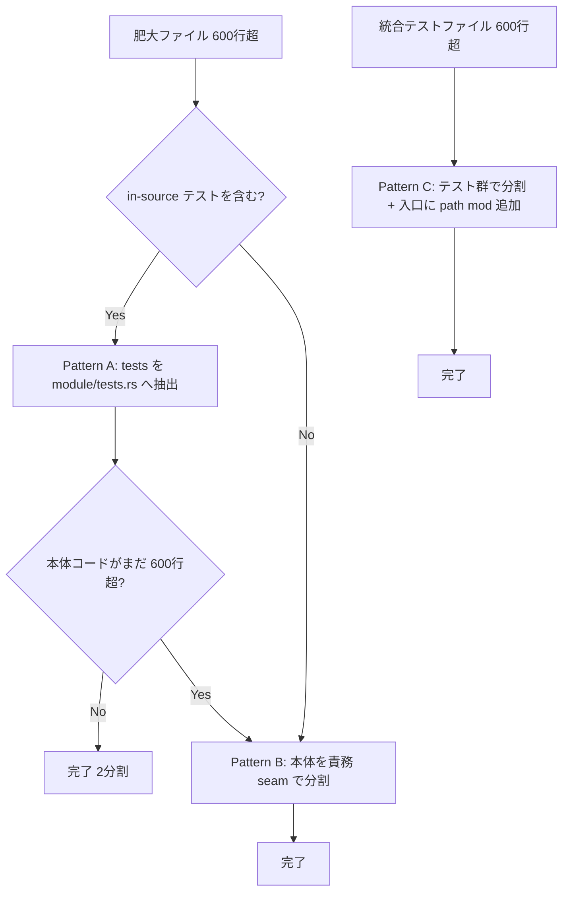
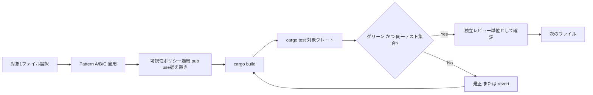

# Design Document

## Overview

本設計は、wintf / dola / areka の肥大化ソースファイルを**挙動非破壊**で責務境界に分割し、参照ゼロの死体コードを削除するための技術設計である。新機能・新アーキテクチャは導入しない。中核となる設計判断は「**in-source テストの `{module}/tests.rs` 抽出を第一手段とし、本体コード単体が600行を超える場合のみ責務 seam でさらに分割する**」という最小分割戦略であり、これにより大半の対象ファイルが2分割で目標を満たし、過剰断片化と回帰リスクを同時に抑制する。

**Users**: 本プロジェクトのメンテナ（開発者）が、把握しやすいファイル規模とノイズの消えたコードベースで保守・レビューを行う。

**Impact**: 公開APIのパス・シグネチャ・可視性は完全に据え置いたまま、ファイルの物理レイアウトのみを変更する。`cargo test` のグリーンとテストケースの同一実行を全工程で維持する。

### Goals
- 600行を明確に超過する「生きた」src/tests ファイルを、責務境界で最小限のモジュールへ分割する（各モジュール目安600行・許容~650行）。
- 参照ゼロが確認済みの死体コードを安全に削除する（grep 検証＋保護対象除外）。
- 公開APIの後方互換と観測可能な挙動を100%維持し、各クレートで `cargo test` グリーンを保つ。

### Non-Goals
- 機能追加・挙動変更・パフォーマンス最適化・公開APIの再設計やリネーム。
- examples の分割、deprecated 3ファイル（`win_message_handler.rs` / `win_thread_mgr.rs` / `winproc.rs`）の分割・移行・削除。
- `dola::runtime::facade::update()` の削除。
- 600行ルールを enforce する CI/lint の導入。

## Boundary Commitments

### This Spec Owns
- 確定リストの死体コード削除（R1）と、作業中に発見した grep 検証済み死体の削除（R1.9）。
- 生きた src ファイル10件（R2）と tests ファイル12件（R3）の物理分割。
- 分割に伴う `mod` 宣言・`pub use` 再エクスポートの再構成（公開パスを不変に保つ範囲）。
- 分割後の各クレートにおける `cargo test` グリーンの担保（R4）。

### Out of Boundary
- examples（`dcomp_demo.rs` 他）の分割（R5.1）。
- deprecated 3ファイルの分割・新API移行・削除（R5.2）。**保護対象**。
- `dola::runtime::facade::update()` の削除（R1.6）。**保護対象**。
- 公開APIのシグネチャ・可視性・パスを変える一切の変更（R4.1 / R5.4）。
- 機能・挙動・性能の変更（R2.7 / R4.2）。

### Allowed Dependencies
- 既存のモジュール構成規約（steering `structure.md`：ディレクトリモジュール化、`{module}/tests.rs` 分離、`tests/{domain}.rs` + `#[path]` 入口、`taffy_` プレフィックス維持）。
- 既存の依存方向（COM → ECS → Message Handling）。本設計は**既存の依存方向を一切変更しない**。新規クロスレイヤ依存を導入してはならない。
- Rust 2024 / bevy_ecs / windows-rs 等、現行スタックのみ。新規依存ゼロ。

### Revalidation Triggers
- 公開シンボルのパス・可視性・シグネチャが変わった場合（後方互換違反 → 全consumer要再検証）。
- deprecated 3ファイルまたは `facade::update()` の参照が破壊された場合。
- 分割によりモジュール間の依存方向が変化した場合。
- 分割前後でテストケース集合が変化した場合（同一実行の破壊）。

## Architecture

### Existing Architecture Analysis
- **モジュール宣言**: 製品コードはディレクトリモジュール化が標準。親 `mod.rs` の `mod xxx;` は `xxx.rs` と `xxx/mod.rs` のどちらにも解決されるため、`state.rs` → `state/mod.rs` への変換時に**親の宣言は無改変**で済む。公開シンボルは親の `pub use xxx::*` 経由で外部パス不変。
- **in-source テスト分離**: structure.md が `{module}/tests.rs` 分離パターン（`bitmap_source/` 参照）を既定。`#[cfg(test)] mod tests;` を `module/tests.rs` に外出しできる。
- **統合テスト**: `tests/{domain}.rs` 入口が `#[path]` による `mod` 宣言のみの束ね役。実テストは `tests/{domain}/{name}_test.rs`、共有ヘルパーは `tests/{domain}/common/mod.rs`。
- **保護対象の生きた参照**: `process_singleton.rs` → `winproc`、`app.rs`/`world/mod.rs`/`vsync.rs` → `win_thread_mgr` のグローバルatomic、12 examples → deprecated 3モジュール。これらを破壊しない。

### 中核設計：最小分割戦略と3つの分割パターン

- **Pattern A（in-source テスト抽出・第一手段）**: `foo.rs` → `foo/mod.rs`（本体）＋ `foo/tests.rs`（`#[cfg(test)] mod tests` を移設、`use super::*`）。親の `mod foo;` は無改変。
- **Pattern B（本体コード分割・補助手段）**: Pattern A 後も本体が600行超の場合のみ、`foo/mod.rs` を責務レイヤー（型定義 / システム / ヘルパー）の sub-file へ分割し、`mod.rs` は `pub use` で公開面を集約。現対象では `render.rs`（850・テスト無し）のみが該当。
- **Pattern C（統合テスト分割）**: 大ファイルをテスト群別 sub-file へ分割し、`tests/{domain}.rs` 入口に `#[path] mod` 宣言を追加（旧ファイルの宣言は削除）。共有フィクスチャは `common/mod.rs` へ集約。

### 可視性ポリシー（後方互換の中核 / R4.1・R5.4）
分割で項目がモジュール跨ぎになる際の可視性規則：

| 元の可視性 | 分割後の扱い |
|---|---|
| `pub`（外部公開・再export対象） | `pub` 維持。`{module}/mod.rs` で `pub use sub::*` し外部パスを不変に保つ |
| `pub(crate)` | `pub(crate)` 維持（クレート内可視は不変） |
| private（同一ファイル内専用） | 分割先の sub-module 間で共有が必要になったら `pub(super)` または `pub(crate)` へ最小昇格。外部公開はしない |

**不変条件**: いかなる項目も外部から見える可視性・パスを変えてはならない。`areka`/examples/他クレートからの import 文が無改変であることが受入の必要条件。

### Technology Stack

| Layer | Choice / Version | Role in Feature | Notes |
|-------|------------------|-----------------|-------|
| Language | Rust 2024 Edition | モジュール分割・可視性制御 | 新規依存ゼロ |
| Test Runner | `cargo test`（Windows / DirectComposition） | 挙動非破壊の検証ゲート | クレート単位ウェーブ |
| Module System | Rust mod / `#[path]` / `pub use` | 物理分割と公開面の据え置き | structure.md 準拠 |

## File Structure Plan

> 各ファイルは「最小限の凝集モジュール」へ分割する。下表は推奨分割（seam ラベル付き）。実装者は **ルール（各モジュール≤~600行・責務 seam 維持）を満たす範囲で sub-file 名・テスト群境界を確定**してよいが、記載granularityを超える過剰分割は禁止。
>
> **行数見積りは暫定値**: 表の推定行数はサブエージェント概算であり、固定値ではない（過去に `types.rs` の概算誤りを検出済み）。各ファイル着手時に**実際の本体/テスト行数を実測**し、(1) Pattern A 抽出後に本体が600行を超える場合のみ Pattern B を追加適用、(2) 表の「2分割」を確定値と見なさず実測に基づき分割数を決定すること。

### Phase 1 — 死体コード削除（wintf, R1）

**Modified files**（削除のみ・分割なし）:
- `crates/wintf/src/ecs/pointer/types.rs` — deprecated エイリアス5件削除（→ ~702行、Phase 2 で分割）
- `crates/wintf/src/ecs/pointer/systems.rs` — deprecated 関数3件削除（→ ~185行、分割対象外）
- `crates/wintf/src/ecs/mod.rs` — `mouse` モジュール宣言＋`#[allow(deprecated)]` 再export 削除（→ ~57行）
- `crates/wintf/src/ecs/layout/metrics.rs` — `Opacity` deprecated static 削除（→ ~64行）

**Deleted files**:
- `crates/wintf/examples/taffy_flex_demo_old.rs` — 参照ゼロの旧実装 example（R1.4）

**Protected（変更禁止）**: `win_message_handler.rs` / `win_thread_mgr.rs` / `winproc.rs` / `dola::runtime::facade::update()`

**拡張削除（R1.9/1.10）**: 作業中に grep で実参照ゼロを検証できた確定リスト外の死体は削除可。ただし保護対象は除外し、削除項目を報告に記録。

### Phase 2-A — wintf src 分割（R2）

| 元ファイル(行) | パターン | 推奨構成（→ ディレクトリモジュール化） | 推定 |
|---|---|---|---|
| `ecs/drag/state.rs` (1034) | A | `drag/state/`: mod.rs(本体~530) + tests.rs(~500) | 2分割 |
| `ecs/graphics/compositor_systems/render.rs` (850) | B | `.../render/`: mod.rs(systems: composite+present ~330) + helpers.rs(guards+context+traverse ~480) | 2分割 |
| `ecs/cue/queue.rs` (781) | A | `cue/queue/`: mod.rs(本体~460) + tests.rs(~320) | 2分割 |
| `ecs/window/window_pos.rs` (720) | A | `window/window_pos/`: mod.rs(本体~450) + tests.rs(~270) | 2分割 |
| `ecs/pointer/types.rs` (~702) | A | `pointer/types/`: mod.rs(本体~382) + tests.rs(~320) | 2分割 |
| `ecs/widget/text/typewriter.rs` (602) | A | `widget/text/typewriter/`: mod.rs(本体~332) + tests.rs(~270) | 2分割 |
| `ecs/layout/hit_region/tests.rs` (734, in-srcテスト) | C類似 | `hit_region/tests/`: mod.rs(宣言) + polygon.rs(~370) + color_map_builder.rs(~360) | 2分割 |
| `ecs/layout/hit_test/tests_ex.rs` (686, in-srcテスト) | C類似 | `hit_test/tests_ex/`: mod.rs(宣言) + entity.rs(~343) + tree_bounds.rs(~343) | 2分割 |

> `pointer/types/` 配下の sub-file 名は既存 `pointer/buffers.rs` とパスが異なる（`pointer::types::*`）ため衝突しない。命名は明確化のため `types/` 配下に閉じる。
>
> **`render.rs` は最高リスク（凝集優先）**: テストを持たず唯一 Pattern B を強制される本ファイルは、RAIIガード（`ClipGuard`/`DcTargetGuard`）と再帰 `render_subtree` が密結合で、`pub(super)` 境界を跨ぐ唯一の非自明な可視性調整を伴う。2分割が再帰走査とその守護/コンテキストを裂く場合は、**凝集を優先して3分割（guards+context / traverse / composite+present）を許容**する（最小ファイル数より凝集度を優先）。独立した慎重タスクとして扱い、可視性マッピングを明示すること。

### Phase 2-B — dola src 分割（R2）

| 元ファイル(行) | パターン | 推奨構成 | 推定 |
|---|---|---|---|
| `dola/src/runtime/loop_controller.rs` (627) | A | `runtime/loop_controller/`: mod.rs(本体~170) + tests.rs(~457) | 2分割 |

### Phase 2-C — areka src 分割（R2）

| 元ファイル(行) | パターン | 推奨構成 | 推定 |
|---|---|---|---|
| `areka/src/main.rs` (857) | A | `main.rs`(本体~412) + `src/tests.rs`（`#[cfg(test)] mod tests;` 抽出, ~444） | 2分割 |

### Phase 2-D — 統合テスト分割（R3, Pattern C）

| 元ファイル(行) | 分割数 | テスト群 seam（命名は規約準拠） | 入口 |
|---|---|---|---|
| `dola/tests/runtime/conflict_resolution_test.rs` (1116) | 3 | 競合検出 / 終了戦略 / エラー境界（各~370） | `tests/runtime.rs` |
| `dola/tests/compile/time_resolution_test.rs` (934) | 2 | sequential+relative / parallel+complex（各~467） | `tests/compile.rs` |
| `dola/tests/runtime/facade_test.rs` (894) | 2 | load+update / 終了+差分配信（各~447） | `tests/runtime.rs` |
| `wintf/tests/layout/taffy_advanced_test.rs` (780) | 2 | 計算+変換 / 階層同期+増分（各~390） | `tests/layout.rs` |
| `dola/tests/runtime/loop_offset_test.rs` (769) | 2 | serde+validation / compile（各~385） | `tests/runtime.rs` |
| `wintf/tests/layout/boxstyle_coordinate_separation_test.rs` (747) | 2 | inset+changed / drag+window同期（各~374） | `tests/layout.rs` |
| `dola/tests/general/integration_test.rs` (711) | 2 | serialization / e2e+domain（各~356） | `tests/general.rs` |
| `dola/tests/validation/transition_test.rs` (705) | 2 | v7-v11 / v12-v13+NaN（各~353） | `tests/validation.rs` |
| `wintf/tests/layout/taffy_layout_integration_test.rs` (671) | 2 | style+flex components / mapping+pipeline（各~336） | `tests/layout.rs` |
| `dola/tests/general/core_types_test.rs` (662) | 2 | document+variable+dynamic / easing+transition+storyboard（各~331） | `tests/general.rs` |
| `wintf/tests/layout/arrangement_bounds_test.rs` (614) | 2 | primitives+transform+global / rect_ext（各~307） | `tests/layout.rs` |
| `dola/tests/compile/integration_test.rs` (609) | 2 | core機能 / トリガーロジック+ヘルパー（各~305） | `tests/compile.rs` |

**共有ヘルパー**: `time_resolution`/`integration`（compile）が使う `make_doc_with_storyboard()` は既存 `compile/common/mod.rs` 維持。runtime（facade/conflict）の共通フィクスチャは必要時 `runtime/common/mod.rs` へ、layout（taffy_）は `layout/common/mod.rs` へ最小抽出。分割で重複が生じる setup のみ common 化し、不要な抽象化はしない。

**入口ファイル更新**: 各 `tests/{domain}.rs` で旧ファイルの `#[path] mod` 宣言を削除し、新 sub-file の宣言を追加（書式は既存に倣う）。

## System Flows

### 分割・検証フロー（1ファイル＝1レビュー単位 / R6.3）

### フェーズ・ウェーブ順序（R6.1 / R6.2）
1. **Phase 1（死体削除）**: wintf 限定。完了後 `cargo test -p wintf` グリーン（R1.8）。
2. **Phase 2（分割）**: クレートウェーブ **wintf → dola → areka**。各クレートは独立してビルド・テスト可能（R6.4）。ウェーブ内は1ファイルずつ Pattern 適用 → 検証 → レビュー単位確定。

## Requirements Traceability

| Requirement | Summary | 実現する設計要素 |
|-------------|---------|------------------|
| 1.1–1.5 | 確定リスト死体削除 | Phase 1 Modified/Deleted files |
| 1.6 | `facade::update()` 維持 | Boundary: Protected |
| 1.7 | 削除前に参照判明→残す | 検証フロー（Green ゲート）+ Dead-Code Remover 契約 |
| 1.8 | 削除後 cargo test green | 検証フロー Phase 1 |
| 1.9–1.10 | 拡張削除＋保護対象除外 | Phase 1 拡張削除節 |
| 2.1–2.7 | 生きた src 分割 | Phase 2-A/B/C, Pattern A/B, 可視性ポリシー |
| 3.1–3.5 | 生きた tests 分割 | Phase 2-D, Pattern C, 入口更新, common 抽出 |
| 4.1 | 公開API後方互換 | 可視性ポリシー（不変条件） |
| 4.2 | 観測挙動不変 | Pattern が物理レイアウトのみ変更 |
| 4.3–4.5 | cargo test green（Windows） | 検証フロー Green ゲート, Testing Strategy |
| 5.1–5.4 | スコープ境界厳守 | Boundary: Out of Boundary / Protected |
| 6.1–6.4 | フェーズ分離・ウェーブ | System Flows フェーズ順序 |

## Components and Interfaces

本仕様の「コンポーネント」は実行時オブジェクトではなく、リファクタリング操作の責務単位である。

| Component | 層 | Intent | Req | 主要依存 | Contracts |
|-----------|----|--------|-----|---------|-----------|
| Dead-Code Remover | wintf | 死体削除＋grep検証＋保護除外 | 1.1–1.10 | grep, cargo test (P0) | Batch |
| Module Splitter | wintf/dola/areka src | Pattern A/B で src 分割＋可視性据え置き | 2.1–2.7, 4.1 | structure.md規約 (P0) | Batch |
| Integration Test Splitter | tests | Pattern C でテスト分割＋入口更新＋common抽出 | 3.1–3.5 | #[path]入口 (P0) | Batch |
| Verification Gate | 全クレート | cargo test green＋同一テスト集合の確認 | 4.3–4.5, 1.8 | cargo test (P0) | Batch |

### Dead-Code Remover
**Responsibilities & Constraints**
- 確定リスト（Phase 1）を削除。各削除の**直前に grep で実利用ゼロを検証**（R1.7/1.9）。
- 保護対象（deprecated 3ファイル / `facade::update()`）は対象に含めない（R1.10 / R5.2）。
- 拡張削除は grep 検証済みのみ、削除項目を報告に記録（R1.9）。

**Contracts: Batch**
- Trigger: Phase 1 実行（wintf）
- Input/validation: 削除候補 → grep 実参照ゼロ検証
- Output: 死体除去後の wintf、削除項目レポート
- Idempotency & recovery: 参照判明時は当該項目をスキップし報告（R1.7）。test red 時は revert。

### Module Splitter
**Responsibilities & Constraints**
- Pattern A を第一手段、本体>600行のみ Pattern B。可視性ポリシーを適用し公開パス・可視性を不変に保つ（R4.1）。
- 機能・挙動・性能を変更しない（R2.7）。各モジュール≤~650行（目安600）。
- in-source テスト抽出時は structure.md の `{module}/tests.rs` 分離に従う（R2.5）。

**Contracts: Batch**
- Trigger: Phase 2 ウェーブ内のファイル選択
- Input: 1 元ファイル → 推奨構成
- Output: ディレクトリモジュール化された複数 sub-file、無改変の親 `mod` 宣言
- Recovery: build/test 失敗時は是正、解消不能なら当該ファイルの変更を revert（R4.4）

### Integration Test Splitter
**Responsibilities & Constraints**
- テスト群を sub-file へ分割し、入口 `tests/{domain}.rs` に `#[path] mod` を追加・旧宣言を削除（R3.2）。
- 既存テストケースの内容・アサーションを無改変、分割前と同一テストが実行されること（R3.3/R3.5）。
- 共有 setup のみ `common/mod.rs` へ抽出、過剰抽象化を避ける。

**Contracts: Batch** — Output: 分割テスト群＋更新済み入口。Recovery: テスト数/結果が変化したら revert。

### Verification Gate
**Responsibilities & Constraints**
- 各ファイル変更後・各クレートウェーブ完了後に `cargo test`（Windows/DirectComposition）を実行（R4.5）。
- グリーン、かつ**分割前後でテストケース集合が同一**であることを確認（R3.5）。未解決の失敗を残して完了扱いにしない（R4.4）。

## Error Handling

### Error Strategy
挙動非破壊リファクタの失敗は「ビルド破壊」「テスト red」「テスト集合の変化」「保護対象/参照の破壊」の4種。いずれも**早期検出・即時是正/revert**で回復する。

| Error Category | Trigger | Response |
|---|---|---|
| ビルド破壊 | 可視性誤り・mod宣言漏れ | 可視性ポリシー再適用、`pub use` 集約を修正 |
| テスト red | 分割で参照解決失敗 等 | グリーンまで是正、不能なら当該変更を revert（R4.4） |
| テスト集合の変化 | `#[path] mod` 宣言漏れ・テスト移設漏れ | 入口宣言を補完、テスト総数を分割前後で照合 |
| 保護対象/参照の破壊 | deprecated 参照・`facade::update()` への波及 | 即 revert（R5.2/R5.3、Out of Boundary 違反） |
| 削除候補に参照発見 | grep で実利用ヒット | 当該項目を削除せず報告（R1.7） |

### Monitoring
- 各クレートの `cargo test` 結果（pass/fail、テスト総数）を分割前後で比較記録。
- 削除/スキップした死体項目の一覧を作業ログに残す（R1.9）。

## Testing Strategy

> 本仕様は新規ロジックを足さないため、検証の主眼は「既存テストの**同一実行**」と「公開API不変」である。新規テストは原則追加しない。

### Behavior-Equivalence Verification（R3.3 / R3.5 / R4.2）
- 各 tests ファイル分割の前後で**テストケース総数と各テスト結果が一致**することを `cargo test` の出力で照合する。
- in-source テスト抽出（Pattern A）でも、移設後に同一テストが収集・実行されることを確認する。

### Integration Tests（per-crate, R4.3 / R6.4）
- `cargo test -p wintf` — Phase 1 完了後、および wintf ウェーブの各ファイル分割後にグリーン。
- `cargo test -p dola` — dola ウェーブの各ファイル分割後にグリーン。
- `cargo test -p areka` — areka（main.rs）分割後にグリーン。

### Public-API Compatibility Check（R4.1 / R5.4）
- 分割後、`areka` バイナリと examples（保護対象含む）が無改変でビルドできることを確認（公開パス・可視性の不変を実証）。
- `cargo build` 全体がワークスペースでグリーン。

### Environment（R4.5）
- 全テスト検証は Windows（DirectComposition 対応）環境で実行する。
