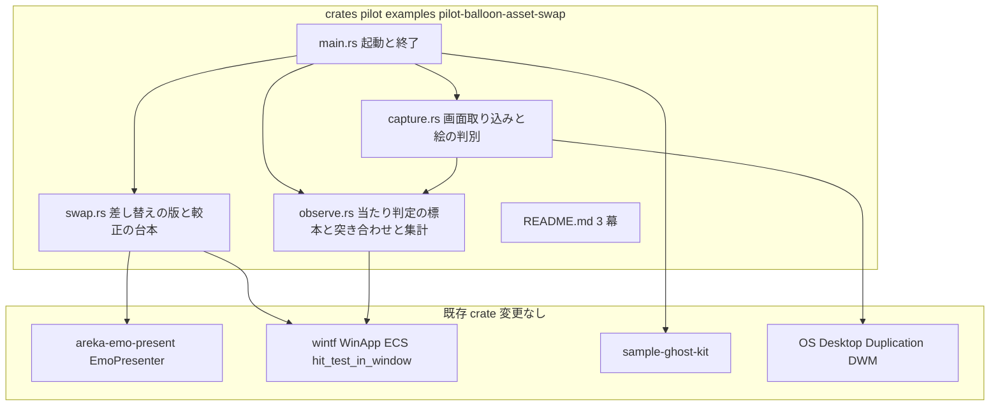
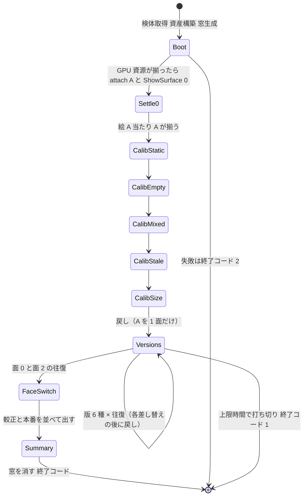
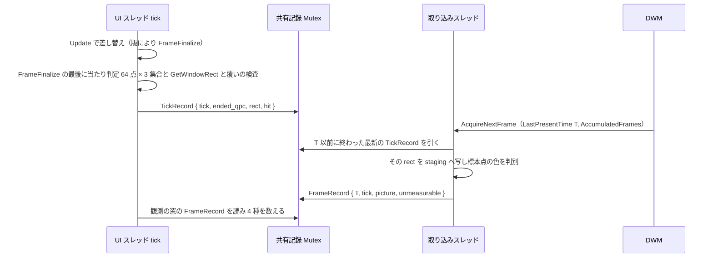

# 技術設計: pilot-balloon-asset-swap

## Overview

**Purpose**: 本先進坑（使い捨て）は、走っているバルーン窓を閉じずに present のバルーン資産だけを別のバルーンへ差し替えたとき、差し替えの前後のどのフレームにも「混在」「空」「古い絵の残り」「大きさの食い違い」が出ないかを、実際の画面を取り込んで数で確かめる example を 1 本作り、その数を README 3 幕に残す。判定（go／違う／直す）は開発者が README を見て下す。

**Users**: 開発者が `cargo run -p pilot --example pilot-balloon-asset-swap` を実行し、ログと README の数を見る。下流の本坑 `areka-P0-shell-balloon-switch` の設計が README の検証結果を参照する。

**Impact**: 変更は `crates/pilot/examples/pilot-balloon-asset-swap/`（新規）と `crates/pilot/Cargo.toml`（依存の追加）に閉じる。既存 crate のコードは 1 行も変えない。既存 crate に足す必要があると分かった物は README の学びとして記録する。

### Goals

- 差し替え方 3 種（基準の版・本命の版・隠すだけの版）× 差し替えの時点 2 種（配置が決まる前＝`Update`／画面への反映の後＝`FrameFinalize`）＝ 6 版を、それぞれ往復 1 回ずつ観測し、版ごと・差し替えごとに 4 種の崩れの数を 0 も明示して出す。
- さくらスクリプトのバルーン番号の切り替え（`\b[ID]` 相当・同じバルーンの中の大きさの違う面への切り替え）を同じ観測で数え、版とは分けて示す。
- 数え方そのものを、わざと崩したフレームを実際の窓に出して較正する（5 項目）。
- 起動から決まった上限時間の内側で自分で終わり、終了の理由と終了コードで結果を伝える。
- README 3 幕（動機・概要・検証結果）を一次記録として残す。

### Non-Goals

- シェルの差し替え、seriko・text への差し替えの語の追加、既存 crate の変更（本坑の領分）。
- 本体 `areka` への接続、実際の SHIORI の読み込み、案 A（降ろして起こし直す）の試作。
- k≠1.0（拡大率が 1 でない画面）での観測。k≠1.0 は「測れない」として報告するに留める。
- 1 フレーム遅らせて辻褄を合わせる版を「崩れを消した版」として扱うこと。
- 観測コードの本番流用（本坑は README の知見を見てクリーンに掘り直す）。

## Boundary Commitments

### This Spec Owns

- `crates/pilot/examples/pilot-balloon-asset-swap/` の example 1 本（差し替えの版・観測・較正・自動終了・README）。
- `crates/pilot/Cargo.toml` への依存の追加（`[dev-dependencies]` と `windows` の feature）。
- 4 種の崩れの数え方の規則と、その較正の作り方（本 design が定義し、README に転記する）。
- README 3 幕の中身（数・分かること／分からないこと・学び・見立て）。判定の欄は開発者が埋める。

### Out of Boundary

- `areka-emo-present`・`wintf`・`areka-emo-compose`・`areka-emo-atlas`・`sample-ghost-kit` の変更。本命の版が要る「古い装着を片付ける口」は example が内部の entity を外から探して消すことで代え、正規の口の追加は学びとして本坑へ送る。
- wintf の兄弟の重なり順の食い違い（描画は先頭の子が上・当たり判定は最後の子から）の修正。観測でその影響を見分けて学びに書くだけ。
- `\b[ID]` の経路で崩れが出たときの修正（本番の既存の欠陥として学びに記録する）。
- go／違う／直す の判定そのもの。

### Allowed Dependencies

- `wintf`（`WinApp`・ECS の窓・`hit_test_in_window`・`HitTest`・`Visual`・`WindowPos`・`WindowHandle`・schedule label）
- `areka-emo-present`（`EmoPresenter`・`PresentCommand`・`TargetId`・`build_balloon_target`）、`areka-emo-compose`（`Composer`・`BindSet`・`PatternState`）、`areka-emo-atlas`（`WicDecoderArm`）
- `sample-ghost-kit`（検体の窓口・`[dev-dependencies]` 限定）
- `bevy_ecs`・`tracing`・`tracing-subscriber`・`windows`（`Win32_Graphics_Dxgi` を足す）
- 依存の向きは pilot → 既存 crate の一方向。他 crate の `Cargo.toml` に `pilot` を足さない。

### Revalidation Triggers

- `EmoPresenter::attach_target` の再登録の意味（表示コンテキストの置換・World 非接触）が変わったとき。
- `VisualMount` が spawn する子の名前（`emo-surface`・`emo-text-layer-slot`）や親子の形が変わったとき（本命の版の「消す」が外れる）。
- wintf の tick の段の順序（13 段）や、`VisualGraphics` の `on_remove` が WUC の親から自分を外す挙動が変わったとき。
- `hit_test_in_window` の座標系（窓 client の物理座標）が変わったとき。
- wintf の tick の門（`EcsWorld` の `tick_gate_enabled`）の既定が変わったとき。今は既定で無効・`AREKA_TICK_GATE` を読むのは本体 `areka` だけなので pilot では画面更新ごとに tick が来るが、有効になると 30／180 tick の窓の意味が変わる。
- 検体 2 つの寸法・色・α の形が変わったとき（標本点の導出は実行時に行うので追随するが、見分けの閾値は見直す）。

## Architecture

### Existing Architecture Analysis

- **再登録は古い子を残す**: `attach_target`（`crates/areka-emo-present/src/presenter/hub.rs`）は `self.targets.insert` で表示コンテキストを置き換えるだけで、`_world` に触れない。古い `VisualMount` の 2 entity（窓の子・`Name("emo-text-layer-slot")`＋`Name("emo-surface")`）は可視・当たり判定ありのまま World に残る。次の `ShowSurface` は `mount.is_none()` の分岐で新しい 2 entity を後ろに足す。
- **despawn は WUC の visual をその場で外す**: `VisualGraphics` の `on_remove` フック（`crates/wintf/src/ecs/graphics/components.rs`）が、親の `ContainerVisual.Children().Remove(visual)` を component 除去の時点で呼ぶ。よって古い子を despawn した瞬間に WUC の木からも外れ、同じ tick の後段で作る新しい visual と一緒に暗黙の反映に載る。本命の版が 0 フレームで成り立つ構造的な根拠はここにある。
- **兄弟の重なり順は描画と当たり判定で逆**: `visual_hierarchy_sync_system` は `Children` を前から `InsertAtBottom`（先頭の子が最上）、`DepthFirstReversePostOrder` は最後の子から調べる。古い子と新しい子が並ぶと「絵は古い方が上・当たり判定は新しい方が優先」になる。範囲外の既存の食い違いとして学びに書く。
- **tick は 13 段**: `Input → Update → PreLayout → Layout → PostLayout → UISetup → GraphicsSetup → Draw → PreRenderSurface → RenderSurface → Composition → CommitComposition → FrameFinalize`。`Update` で差し替えれば同じ tick の `PostLayout` で `GlobalArrangement` が決まり、`PreRenderSurface`〜`Composition` で描かれて木に繋がる。`FrameFinalize` で差し替えると絵は次の tick まで変わらない。本番の `emo2_frame_system` は `Update` に載っている。
- **窓寸の合わせ直し**: `ShowSurface` は物理寸が変わると `pending_resize` を積み、呼び手が `take_pending_resize` を読んで `WindowPos` を書く（手本 `crates/areka/examples/emo-present/reconcile.rs`・本番 `crates/areka/src/emo2_boot/frame.rs`）。`apply_window_pos_changes`（`UISetup`）が同じ tick で `SetWindowPos` を発行する。
- **実際に効いている当たり判定**: `wintf::ecs::hit_test_in_window(&World, window, client_point) -> Option<Entity>`。`WindowPos.position` で screen 座標に直し、`GlobalArrangement.bounds` と `AlphaMaskResource` で判定する。`Visual.is_visible` は α マスク判定に効かない（`HitTest::none()` で止める設計）。
- **描画結果の読み戻し**: プロセスの中に無い。`EmoPresenter::read_back` は表示へ渡した原寸の値であり不採用。OS の Desktop Duplication（`IDXGIOutputDuplication`・`windows` 0.62.2 の feature `Win32_Graphics_Dxgi`・`DXGI_OUTDUPL_FRAME_INFO { LastPresentTime, AccumulatedFrames, .. }`）を採る。
- **DPI**: `WinApp::new` が `PER_MONITOR_AWARE_V2` を設定するので、`GetWindowRect` と取り込みの画素座標は同じ物理 px。

### Architecture Pattern & Boundary Map



**Architecture Integration**:
- Selected pattern: 手本 `crates/areka/examples/emo-present.rs` からバルーン窓 1 つ分の器を写し、差し替え・観測・較正を 3 つのファイルに分けた単一 example。抽象化は作らない（版の切り替えは enum の match）。
- Domain boundaries: `swap.rs` は World を書く（差し替え・較正の仕掛け）、`observe.rs` は World を読む（当たり判定・窓の矩形・突き合わせ・集計）、`capture.rs` は OS を読む（別スレッド）。書く側と読む側を分けることで「観測が差し替えに手を入れた」疑いを残さない。
- Existing patterns preserved: 窓の作り方（`WS_POPUP | WS_VISIBLE`・`WS_EX_LAYERED | WS_EX_TOOLWINDOW | WS_EX_TOPMOST`・窓自身は `HitTest::none()`）、GPU 資源が揃うのを待ってから `attach_target → apply(ShowSurface)`、`take_pending_resize → WindowPos`、クリック透過機構への窓登録。
- Steering compliance: `two-tunnel.md`（`pilot-` 接頭辞・1 仕様＝1 フォルダ・葉ノード隔離・README 3 幕・go 判定は開発者）。記憶「1 フレーム遅らせる解は取らない」（`FrameFinalize` 置きは比較の版であって直し方ではない）。

### Key Decisions

1. **起動は `main` で同期に行う**（`WinApp::new()` が COM と DPI を初期化するので、検体の取得・資産の構築・窓の生成を `run()` の前に行える）。失敗はそこで `error!` を出して終了コード 2 で終わる（`run()` に入らない）。手本の非同期投函は使わない。
2. **差し替えは 1 つの排他 system を `Update` と `FrameFinalize` の両方に登録し、台本（`Script`）が「今の tick でどの段が動くか」を決める**。段の違いだけが版 (iv) の差になる。`FrameFinalize` の差し替えの後に tick 記録 system を置く（`.after`）ので、tick の終わりの当たり判定は差し替え後の状態で記録される。
3. **絵は Desktop Duplication で取る**（別スレッド・自前の D3D11 device）。`AcquireNextFrame` が返す各フレームについて `LastPresentTime`（QPC）と `AccumulatedFrames` を読み、窓の矩形を staging texture へ写して CPU で読む。`AccumulatedFrames > 1` は取りこぼしとして「測れない」に数える。
4. **突き合わせの規則**（要件 3.2）: 取り込んだフレームの `LastPresentTime` を T とし、`T` 以前に終わった最新の tick の記録（当たり判定・窓の矩形）と組にする。tick の記録は `FrameFinalize` の最後で `QueryPerformanceCounter` を読んで残す。この規則で「差し替え → 反映 → 表示」の合成器の遅れ（tick が終わって当たり判定が新しくなってから、OS がその絵を出すまでの画面更新 1 回）が、版に依らず「絵は古い・当たり判定は新しい」の混在 1 として数に現れ得る。これを**反映待ち**と呼び、混在の内訳として別に数える（開発者裁定 2026-09-24・下記 §Observer）。床は本番で既に通っている経路 `face-switch@update` の反映待ちの数で測り、README の見立てはその床を差し引いて読む。
5. **絵と当たり判定の見分けは標本点で行う**。2 つの検体の面 0 を `Composer::compose` して premultiplied BGRA を得、共通範囲の中で「P だけ不透明」「Q だけ不透明」「両方不透明で色の差が 48 以上」の 3 集合から各 64 点を格子状に選ぶ。絵は取り込み画素と合成の色の一致（各チャネル許容 12）の割合、当たり判定は `hit_test_in_window` の当たりの割合で判別する。拡大率 k≠1.0 なら標本点の座標が合わないので全フレームを「測れない」にする。
6. **較正は実際の窓へ崩れを作って行う**（要件 4.1）。作り方は §Components の `swap.rs` に列挙する。較正の 1 項でも期待と違えば終了コード 3 とし、本番の数を「無効」と明記して出す。
7. **終了コード**: 0＝全観測完了かつ較正合格、1＝上限時間で打ち切り、2＝初期化の失敗、3＝較正不合格。終了の理由は必ず `info!`／`error!` に出す。
8. **数の定義**（要件 3.4）: 観測の窓は「要求の直前のフレーム」から「揃った最初のフレーム」の後さらに **30 tick 分の時間**まで。揃ったフレームが **180 tick** 以内に来なければ打ち切って「未完」とし、それまでの数を出す。「1 フレーム」は OS の画面更新なので、画面が変わらない時間には数えるフレームが無い（それは崩れが無いことと同義）。
9. **当たり判定の「両方」**: 基準の版では古いマスクと新しいマスクが同時に効く（和になる）。これを 4 つ目の値「両方」として持ち、「混在」に数える（新しい絵と同じ当たり判定ではないため）。要件 3.3 の列挙と 3.4 の「混在」にも同じ語を足した（設計ディスカッションで追記）。README にも書く。
10. **既定の上限時間は 90 秒**（`AREKA_APP_SMOKE_EXIT_MS` で上書き）。観測は約 20 本（較正 5・版 6×往復 2・面の切り替え 2）で、1 本あたり揃うまで＋30 tick＋戻しで 1〜2 秒。

### Technology Stack

| Layer | Choice / Version | Role in Feature | Notes |
|-------|------------------|-----------------|-------|
| UI / ECS | `wintf`（workspace）・`bevy_ecs` 0.19 | 窓・tick・当たり判定・`WindowPos` | 変更なし。`[dev-dependencies]` へ |
| 提示 | `areka-emo-present`・`areka-emo-compose`・`areka-emo-atlas` | `attach_target`／`ShowSurface`／`Hide`・面の合成・PNG 復号 | 変更なし。`[dev-dependencies]` へ |
| 検体 | `sample-ghost-kit` | `StayseeBalloon`・`emo2` 同梱 `emo2-kakukaku` | 既に `[dev-dependencies]` |
| 画面取り込み | `windows` 0.62.2 feature `Win32_Graphics_Dxgi`（＋既定の `Direct3D11`） | `IDXGIOutput1::DuplicateOutput`・`AcquireNextFrame`・staging texture | `crates/pilot/Cargo.toml` の `windows` feature に 1 行足す |
| 記録 | `tracing`・`tracing-subscriber`（`env-filter`） | `RUST_LOG` 対応のログ | 既定 `info` |

## File Structure Plan

### Directory Structure

```
crates/pilot/
├── Cargo.toml                                   # [dev-dependencies] と windows feature を足す（変更）
└── examples/pilot-balloon-asset-swap/           # 新規（_template を写して着手）
    ├── main.rs        # 起動（検体・資産・窓・presenter・system 登録・取り込み開始）と終了コード
    ├── swap.rs        # 台本（観測の並び）・差し替えの版 3 種・面の切り替え・較正の作り方・戻し
    ├── observe.rs     # 標本点の導出・tick 記録（当たり判定・矩形・覆い）・突き合わせ・4 種の数え・集計ログ
    ├── capture.rs     # Desktop Duplication スレッド・窓の矩形の切り出し・絵の判別
    └── README.md      # 3 幕（動機・概要・検証結果）
```

`main.rs` がフォルダの中にあるので、子は素の `mod swap;` で同じフォルダの `swap.rs` に解決される（`#[path]` は要らない・`crate::` パスも使わない）。

### Modified Files

- `crates/pilot/Cargo.toml` — `[dependencies].windows.features` に `"Win32_Graphics_Dxgi"` を足し（理由をコメントに書く）、`[dev-dependencies]` に `wintf`・`areka-emo-present`・`areka-emo-compose`・`areka-emo-atlas`・`bevy_ecs`・`tracing`・`tracing-subscriber` を path／workspace で足す。`[[example]]` の宣言は不要（フォルダの `main.rs` は自動発見される）。

## System Flows

### 台本（観測の並び）



- 各観測は「要求 → 揃うのを待つ（最大 180 tick）→ さらに 30 tick → 集計ログ → 戻し（観測しない）→ 戻しが揃うのを待つ」の 1 単位。戻しは常に「窓の `emo-*` 子を全部 despawn → `attach_target(TargetId(1), A)` → `ShowSurface 0` → 窓寸合わせ」で、台本のどの版の後でも状態を同じにする。
- 上限時間は tick ごとに `Instant` で調べ、到達したら「打ち切り」とそれまでの数を出して窓を despawn する（`ExitPolicy::OnLastWindowClose` で `run()` が戻る）。

### フレームの突き合わせ



- 「揃った」＝ 観測の要求より後のフレームで、絵＝到達先 ∧ 当たり判定＝到達先 となる最初のもの（要件 3.1 の定義どおり。大きさは別に数えるので揃ったの条件に入れない）。
- 取り込みスレッドは `AcquireNextFrame(16ms)` を回し、timeout は素通り、`DXGI_ERROR_ACCESS_LOST` は複製を作り直して以後のフレームまで「測れない」に数える。停止は `AtomicBool`。

## Requirements Traceability

| Requirement | Summary | Components | Interfaces | Flows |
|-------------|---------|------------|------------|-------|
| 1.1 | フォルダ名＝spec 名 | File Structure Plan | — | — |
| 1.2 | `_template` を写す | main.rs・README.md | — | — |
| 1.3 | 変更は `crates/pilot/` の下だけ | Modified Files | — | — |
| 1.4 | 他 crate に `pilot` を足さない | Boundary | — | — |
| 1.5 | 品質は緩めてよいが隔離は守る | Boundary | — | — |
| 1.6 | 成果物は知見 | README.md | — | — |
| 2.1 | 検体 2 つを窓口から引き一方で表示 | main.rs `boot` | `Assets` | Boot |
| 2.2 | 往復の差し替え | swap.rs `Script` | `SwapMethod` | Versions |
| 2.3 | 窓もプロセスも作り直さない | swap.rs | `apply_swap` | Versions |
| 2.4 | 差し替えのログ | swap.rs | `info!` 要求 tick・時刻・from→to・版 | Versions |
| 2.5 | 失敗は理由をログ＋0 以外で終了 | main.rs | 終了コード 2 | Boot |
| 2.6 | 面 0 ↔ 面 2 の切り替え | swap.rs `FaceSwitch` | `Observation.pair` | FaceSwitch |
| 2.7 | 面の切り替えの数を分けて示す | observe.rs 集計・README | `ObservationKind::FaceSwitch` | Summary |
| 3.1 | 直前のフレームから揃った後 30 tick まで | observe.rs `Observation` | `WINDOW_AFTER_TICKS`・`SETTLE_TIMEOUT_TICKS` | 突き合わせ |
| 3.2 | 実際の画面を取り込み直前の tick と突き合わせ | capture.rs・observe.rs | `TickRecord`・`FrameRecord` | 突き合わせ |
| 3.3 | 絵と当たり判定の判別 | observe.rs `Signature`・`classify_picture`・`classify_hit` | `PictureClass`・`HitClass` | 突き合わせ |
| 3.4 | 4 種の崩れ・重複計上 | observe.rs `judge_frame` | `Counts` | 突き合わせ |
| 3.5 | 0 を明示したログ | observe.rs `log_observation` | — | Summary |
| 3.6 | 測れない | capture.rs・observe.rs | `Unmeasurable` 理由 | 突き合わせ |
| 3.7 | 実際の画面に出し続ける | main.rs `create_balloon_window` | `WS_VISIBLE`・`WS_EX_TOPMOST` | Boot |
| 4.1 | 実際の窓に崩れを作る較正 | swap.rs `Calibration` | `make_calibration` | Calib* |
| 4.2 | 混在の較正 | swap.rs `CalibMixed` | `HitTest` の付け替え | CalibMixed |
| 4.3 | 空の較正 | swap.rs `CalibEmpty` | `PresentCommand::Hide` | CalibEmpty |
| 4.4 | 古い絵の残りの較正 | swap.rs `CalibStale` | `Visual::set_visible` | CalibStale |
| 4.5 | 大きさの食い違いの較正 | swap.rs `CalibSize` | `take_pending_resize` を捨てる | CalibSize |
| 4.6 | 静止で 4 種とも 0 | swap.rs `CalibStatic` | 窓を 1px 動かして戻す | CalibStatic |
| 4.7 | 較正の失敗で本番を無効 | observe.rs `Summary`・main.rs 終了コード 3 | `CalibrationVerdict` | Summary |
| 4.8 | 較正と本番を並べて出す | observe.rs `log_summary` | — | Summary |
| 5.1 | 基準の版 | swap.rs `SwapMethod::Reattach` | `attach_target` 再登録 | Versions |
| 5.2 | 本命の版 | swap.rs `SwapMethod::RemoveThenAttach` | despawn → 再登録 → 表示 | Versions |
| 5.3 | 隠すだけの版＋時点の版 | swap.rs `SwapMethod::AttachNewHideOld`・`Stage` | `TargetId` の新規割当・`Hide` | Versions |
| 5.4 | 基準の結果に依らず全版を観測 | swap.rs `Script` | 台本は固定 | Versions |
| 5.5 | 版の名前つきログ | observe.rs | `Observation.name` | Summary |
| 5.6 | 1 フレーム遅らせる版は直し方に数えない | README 見立て・`Stage::FrameFinalize` は比較の版 | — | — |
| 5.7 | 内部の物を外から消してよい・正規の口は学び | swap.rs `despawn_mounts` | `Name` で探す | Versions |
| 5.8 | 既存 crate の変更が要るなら学び | README 学び | — | — |
| 5.9 | 本命の版の数を主な根拠に | README 検証結果 | — | — |
| 6.1 | 上限時間の内側で自分で終わる | main.rs・observe.rs `Deadline` | `Instant` | Summary |
| 6.2 | 環境変数で上限 | main.rs | `AREKA_APP_SMOKE_EXIT_MS` | — |
| 6.3 | 既定の上限 | main.rs | `DEFAULT_EXIT_MS = 90_000` | — |
| 6.4 | 観測を終えたら待たずに終了 | swap.rs `Script::Done` | 窓を despawn | Summary |
| 6.5 | 終了の理由をログ | main.rs | `ExitReason` | Summary |
| 6.6 | 打ち切りはそれまでの数と共に | observe.rs `log_summary(partial)` | — | Summary |
| 7.1 | README 3 幕 | README.md | — | — |
| 7.2 | 動機の幕で本坑を名指し | README.md | — | — |
| 7.3 | 概要の幕に実行法と上限の与え方 | README.md | — | — |
| 7.4 | 検証結果の幕の中身 | README.md | — | — |
| 7.5 | 見立てを添え判定は確定させない | README.md | — | — |
| 7.6 | 判定は開発者 | README.md | — | — |
| 7.7 | 書いたら読み戻す | 実装タスク | — | — |

## Components and Interfaces

| Component | Domain/Layer | Intent | Req Coverage | Key Dependencies (P0/P1) | Contracts |
|-----------|--------------|--------|--------------|--------------------------|-----------|
| Runner（`main.rs`） | 起動と終了 | 検体・資産・窓・presenter を組み、system と取り込みを起動し、終了コードを返す | 1.x, 2.1, 2.5, 3.7, 6.1〜6.3, 6.5 | wintf `WinApp`（P0）・sample-ghost-kit（P0）・areka-emo-present（P0） | Service |
| SwapDriver（`swap.rs`） | 差し替えと較正 | 台本に従い差し替えの版・面の切り替え・較正・戻しを World に書く | 2.2〜2.4, 2.6, 4.1〜4.6, 5.1〜5.4, 5.7, 6.4 | EmoPresenter（P0）・wintf ECS（P0） | Service, State |
| Observer（`observe.rs`） | 観測と集計 | 標本点・tick 記録・突き合わせ・4 種の数え・ログ・較正の合否 | 3.1〜3.6, 4.7, 4.8, 5.5, 6.6, 2.7 | wintf `hit_test_in_window`（P0）・Capture（P0） | Service, State |
| Capture（`capture.rs`） | 画面取り込み | Desktop Duplication で各画面更新を取り、窓の矩形を切り出して絵を判別する | 3.2, 3.3, 3.6 | windows Dxgi／D3D11（P0） | Service |
| README（`README.md`） | 一次記録 | 3 幕 | 1.6, 2.7, 5.6, 5.8, 5.9, 7.x | — | — |

### 起動と終了

#### Runner（`main.rs`）

| Field | Detail |
|-------|--------|
| Intent | 手本のバルーン窓 1 つ分を写し、同期に組み立てて `run()`、戻りで終了コードを決める |
| Requirements | 1.1, 1.2, 1.3, 2.1, 2.5, 3.7, 6.1, 6.2, 6.3, 6.5 |

**Responsibilities & Constraints**
- 順序: `tracing` 初期化 → `WinApp::new()` → `SampleRoot::acquire("StayseeBalloon")` と `SampleRoot::acquire("emo2")?.balloon("emo2-kakukaku")` → `WicDecoderArm::new()` → `build_balloon_target(dir, &decoder, 0)` ×2 → 面 0（と Staysee の面 2）を `Composer::compose` して寸法と標本点の元を得る → 窓を 1 つ spawn（A の原寸・固定位置 (160, 160)・`WS_EX_TOPMOST`）→ `EmoPresenter::new()` と `Script`・`Observer` を NonSend で World へ → system 登録（`Update`: `swap_system`、`FrameFinalize`: クリック透過登録・`swap_system`・`tick_record_system.after(swap_system)`）→ `Capture::start` → `run()` → `ExitReason` を読んで `std::process::exit`。
- `SampleRoot` 2 つは `main` のローカルとして `run()` の後まで生かす（`Drop` で複製の木が消える）。
- 失敗（検体・復号・構築・取り込みの初期化）は `error!` を出して `run()` に入らず終了コード 2。
- 上限時間: `AREKA_APP_SMOKE_EXIT_MS`（空・非数値は既定）→ 既定 90,000 ms。`Deadline` として `Observer` へ渡す。

**Contracts**: Service [x] / API [ ] / Event [ ] / Batch [ ] / State [ ]

##### Service Interface
```rust
/// 検体 2 つの資産と、判別に使う面の合成結果（premultiplied BGRA・原寸）。
struct Assets {
    a: (EmoWorld, AtlasTable),            // StayseeBalloon
    b: (EmoWorld, AtlasTable),            // emo2-kakukaku
    face_a0: ComposedSurface,             // Staysee balloons0 335x205
    face_a2: ComposedSurface,             // Staysee balloons2 335x395
    face_b0: ComposedSurface,             // kakukaku balloons0 400x224
}
fn build_assets(decoder: &WicDecoderArm, staysee_dir: &Path, kakukaku_dir: &Path) -> Result<Assets, String>;
fn exit_ms_from_env() -> u64;            // AREKA_APP_SMOKE_EXIT_MS → 既定 90_000
enum ExitReason { Completed, CalibrationFailed, Deadline, InitFailure }
fn exit_code(reason: ExitReason) -> i32; // 0 / 3 / 1 / 2
```
- Preconditions: UI スレッド（`main`）で `WinApp::new()` 済み。
- Postconditions: `run()` が戻ったとき `Observer` に `ExitReason` が入っている（打ち切り・完了・較正不合格のいずれか）。

**Implementation Notes**
- `attach_target` は `EmoWorld`／`AtlasTable` を move で消費する。`EmoWorld` は `Clone` でない（実装 1.2 で判明・当初の「手本と同じく clone」は誤り）ので、台本で要る分の資産は起動時にまとめて `build_balloon_target` で作っておく（差し替えの tick に復号の時間を入れないため）。
- 起動の 1 回目の `attach_target`＋`ShowSurface` は GPU 資源（`GraphicsCore`・`WucGraphicsResource::is_valid`）が揃ってから（手本 `boot_present_system` と同じ待ち方）。これは `Script::Boot` の中で行う。

### 差し替えと較正

#### SwapDriver（`swap.rs`）

| Field | Detail |
|-------|--------|
| Intent | 台本に従い、決まった tick と段で World を書き換える唯一の書き手 |
| Requirements | 2.2, 2.3, 2.4, 2.6, 4.1〜4.6, 5.1〜5.4, 5.7, 6.4 |

**Responsibilities & Constraints**
- `swap_system(world: &mut World)` は `Update` と `FrameFinalize` の両方に登録され、`Script` が「この tick のこの段で何をする」と決めた場合だけ動く。両段とも同じ関数で、`Stage` を World の `FrameCount` と自分の登録段から知る（登録時にクロージャで段を固定する）。
- 差し替えの 3 版（`from`＝今の資産、`to`＝到達先、`window`＝バルーン窓、`presenter`）:
  - `Reattach`（基準・5.1）: `attach_target(TargetId(1), window, to)` → `ShowSurface{ surface_id: 0 }` → `take_pending_resize(TargetId(1))` を `WindowPos` へ。
  - `RemoveThenAttach`（本命・5.2）: `despawn_mounts(window)` → 上と同じ 3 手。**1 回の system 呼び出しの中で**行う。
  - `AttachNewHideOld`（隠すだけ・5.3）: `next_id` を採番して `attach_target(next_id, window, to)` → `ShowSurface{ target: next_id, surface_id: 0 }` → `Hide{ target: old_id }` → `take_pending_resize(next_id)` を `WindowPos` へ。以後の「今の id」は `next_id`。
- `despawn_mounts(window)`: 窓の `Children` を読み、`Name` が `emo-surface` または `emo-text-layer-slot` の entity を `world.despawn` する。presenter の内部の物を外から消す行為であり、本坑で正規の口が要ることを README の学びに書く（5.7）。
- 面の切り替え（2.6）: A のまま `ShowSurface{ surface_id: 2 }` → `take_pending_resize` → `WindowPos`、戻りは `surface_id: 0`。段は `Update` だけ（本番と同じ）。
- 較正の作り方（4.1〜4.6・いずれも実際の窓に出す）:
  - `CalibStatic`（4.6）: `WindowPos.position` を x+1 して次の tick で戻す。絵は変えない。pair＝(A, B)・from＝A・to＝A。期待: 4 種とも 0・観測フレーム ≥ 1。
  - `CalibEmpty`（4.3）: `Hide{ TargetId(1) }`。期待: 空 ≥ 1。
  - `CalibMixed`（4.2）: B を `TargetId(2)` として `attach_target`＋`ShowSurface`＋`Hide`（見えない・当たらない B の子ができる）を仕込んでおき、要求 tick で A の `emo-surface` の `HitTest` を `none()`、B の `emo-surface` の `HitTest` を `alpha_mask()` へ書き換える（`Visual` は触らない）。絵は A・当たり判定は B。期待: 混在 ≥ 1。
  - `CalibStale`（4.4）: `Hide{ TargetId(1) }` → B を `TargetId(2)` で `attach_target`＋`ShowSurface`（揃った＝絵 B・当たり B）→ 揃った tick の 10 tick 後（観測の窓の内側）に A の `emo-surface` と `emo-text-layer-slot` の `Visual::set_visible(true)`（`HitTest` は `none()` のまま）。A が上に描かれて残る。期待: 古い絵の残り ≥ 1。
  - `CalibSize`（4.5）: A のまま `ShowSurface{ surface_id: 2 }` を出し、`take_pending_resize` は読んで**捨てる**（`WindowPos` を書かない）。窓 335×205 に 335×395 の絵。判別対＝`(A0, A2)`・from＝A0・to＝A2（面の切り替えと同じ対）。期待: 大きさの食い違い ≥ 1。
- 各較正・各差し替えの後は `reset_to_a`（`despawn_mounts` → `attach_target(TargetId(1), A)` → `ShowSurface 0` → 窓寸合わせ）で戻し、`Observer` が「絵 A0・当たり A0・寸法一致」を見るまで次へ進まない（戻しは観測しない）。同じ絵へ戻る戻しでは画面が変わらず新しいフレームが来ないことがあるので、この判定は「最新のフレーム」の絵と、今の tick の当たり判定・矩形で行う。戻しの要求から 60 tick 以内に揃わなければ `error!` を出して次へ進む（次の観測の「直前のフレーム」に戻しの失敗が写る）。
- ログ（2.4）: 要求のたびに `info!(tick, qpc, version, stage, from, to, "swap: 要求")`。

**Contracts**: Service [x] / API [ ] / Event [ ] / Batch [ ] / State [x]

##### Service Interface
```rust
#[derive(Clone, Copy)] enum Balloon { A, B }                   // A=Staysee, B=kakukaku
#[derive(Clone, Copy)] enum Face { A0, A2, B0 }               // 判別対の要素
#[derive(Clone, Copy)] enum SwapMethod { Reattach, RemoveThenAttach, AttachNewHideOld }
#[derive(Clone, Copy)] enum Stage { Update, FrameFinalize }
#[derive(Clone, Copy)] enum Calibration { Static, Empty, Mixed, Stale, Size }
enum Step {
    Boot,
    Calib(Calibration),
    Swap { method: SwapMethod, stage: Stage, from: Balloon, to: Balloon },
    FaceSwitch { from_face: Face, to_face: Face },     // A0→A2, A2→A0
    Reset,                                            // 観測しない戻し
    Done,
}
struct Script { steps: Vec<Step>, cursor: usize, current_id: TargetId, next_id: u32, armed: Option<(Stage, u32 /*tick*/)> }
fn swap_system_for(stage: Stage) -> impl FnMut(&mut World);   // 登録用。段を閉じ込める
fn apply_swap(world, presenter, window, method, to: &Assets, current_id) -> TargetId;  // 新しい「今の id」
fn despawn_mounts(world: &mut World, window: Entity) -> usize;                        // 消した数
fn reset_to_a(world, presenter, window, assets) -> TargetId;
fn make_calibration(world, presenter, window, assets, which: Calibration, phase: u8);  // 仕込み／要求／追い打ち
```
- `Balloon` と `Face` の対応: `A → A0`・`B → B0`（観測の `from`／`to` は `Face` で持つ）。`attach_target` の `author_dpi` は手本と同じ 96 固定。
- Preconditions: `Boot` 完了（`TargetId(1)` に A が表示済み）。`Observer` が前の観測を閉じている。
- Postconditions: `Step::Swap`／`FaceSwitch`／`Calib` の要求 tick で `Observer::open(observation)` が呼ばれている（要求 tick・pair・from・to・名前つき）。
- Invariants: `Reset` の後は窓の `emo-*` 子が 2 つだけ・`current_id == TargetId(1)`・`next_id` は単調増加。

##### State Management
- State model: `Script` は NonSend リソース。`cursor` が進むのは「観測が閉じた（`Observer::is_closed`）かつ戻しが揃った」ときだけ。
- Concurrency: UI スレッド専有。取り込みスレッドは触らない。

**Implementation Notes**
- Integration: `FrameFinalize` の `swap_system` は `tick_record_system` より前（`.after` を tick 記録側に付ける）。`Update` の `swap_system` は順序指定なし（同じ tick の `PostLayout` より前であれば足りる）。
- Validation: `apply_swap` の直後に `presenter.current_surface_id(id)` と `target_physical_size(id)` を `debug!` で出し、`Observer` の期待寸（判別対の到達先の原寸）と一致することを確かめる。
- Risks: `despawn_mounts` は `Name` の文字列に依存する。名前が変わると消せず、本命の版が基準の版と同じ挙動になる——本命の版の差し替えでは直前の子は必ず 2 つなので、`despawn_mounts` の戻り値が 2 でなければ `error!` を出し、その観測を「測れない」にする。戻し（`reset_to_a`）では直前の版や較正により 2 か 4 なので、消した数はログに出すだけで判定しない。

### 観測と集計

#### Observer（`observe.rs`）

| Field | Detail |
|-------|--------|
| Intent | tick ごとに当たり判定と窓の矩形を記録し、取り込みの結果と突き合わせて 4 種を数え、較正の合否と本番の数を並べて出す |
| Requirements | 2.7, 3.1〜3.6, 4.7, 4.8, 5.5, 6.6 |

**Responsibilities & Constraints**
- 標本点（`Signature`）は判別対 `(P, Q)` ごとに起動時に導出する。対は `(A0, B0)`（資産の差し替え・較正の静止・空・混在・残り）と `(A0, A2)`（面の切り替え・較正の大きさ）の 2 つ。導出: 共通範囲（幅・高さの小さい方）を 8×8 の格子に切り、各升から「P だけ不透明（α≥128）」「Q だけ不透明」「両方不透明で色差（各チャネルの差の最大）≥ 48」の点を 1 つずつ拾い、各集合 64 点を目標にする（升に無ければ飛ばす）。
  - 見分けられる条件: 「Q だけ」と「両方」の 2 集合がそれぞれ 16 点以上。「P だけ」は 16 点以上あれば使い、足りなければ**無し**として扱う（片方の面が他方を含む対に耐えるため）。設計検証で検体の実物を数えた結果、`(A0, A2)` は共通範囲 335×205 で「A0 だけ」が 108 画素・約 3 升しか無く（A2 の上 205 行は A0 をほぼ含む）、「A2 だけ」18 升・「両方」21 升。`(A0, B0)` は 26／21／38 升。条件を満たさなければ「見分けられない」として、その対の観測はすべて「測れない」。
  - 導出した点の数（対ごと・集合ごと）を `info!` に出し、README の検証結果にも書く。
  - 「P だけ」が無い対では、絵の「両方」は P が Q の上に描かれたときだけ見分けられ（Q が P の上なら Q と区別できない）、当たり判定の「両方」（2 つのマスクの和）は Q と区別できない。この限界は README の「分からないこと」に書く。面の切り替えは同じ装着の面を入れ替えるだけで子が 2 組にならないので、そこで「両方」は起きない見込み。
- `tick_record_system`（`FrameFinalize` の最後）: `QueryPerformanceCounter` → `GetWindowRect(hwnd)` → 3 集合の各点で `hit_test_in_window(world, window, point)`（k≠1.0 なら記録だけして `k_ok=false`）→ 当たった entity の `Name` が `emo-text-layer-slot` なら `slot_hit=true`（文字層の古い子が当たり判定に影響した証拠・「測れない」）→ 覆いの検査（z 順で自窓より上の可視窓の矩形が自窓と交わるか・`GetWindow(GW_HWNDPREV)` を辿る）→ `TickRecord` を共有記録へ push。
- 絵の判別（取り込みスレッドで実行・関数は本ファイルに置く）: 取り込んだ矩形の各標本点の色と、P／Q の合成色（premultiplied・α=255 の点だけを標本に選ぶので色そのもの）を各チャネル許容 12 で比べる。a＝「P だけ」集合で P の色に一致した割合、b＝「Q だけ」集合で Q の色に一致した割合、ab_p／ab_q＝「両方」集合で P／Q の色に一致した割合。矩形の外に出た点は割合の分母から外す。
  - `P`: a≥0.9 ∧ ab_p≥0.9 ∧ b≤0.1
  - `Q`: b≥0.9 ∧ ab_q≥0.9 ∧ a≤0.1
  - `Both`: a≥0.5 ∧ b≥0.5
  - `Neither`: a≤0.1 ∧ b≤0.1 ∧ ab_p≤0.1 ∧ ab_q≤0.1
  - それ以外: `Unmeasurable(Ambiguous)`
  - 「P だけ」が無い対では a の条件を外し、`Both` は b≥0.5 ∧ ab_p≥0.5 とする。
- 当たり判定の判別: h_p＝「P だけ」集合の当たりの割合、h_q＝「Q だけ」集合の当たりの割合。`P`: h_p≥0.9 ∧ h_q≤0.1、`Q`: 対称、`Both`: 両方 ≥0.9、`Neither`: 両方 ≤0.1、それ以外 `Unmeasurable`。「P だけ」が無い対では h_both（「両方」集合の当たりの割合）を使い、`P`: h_q≤0.1 ∧ h_both≥0.9、`Q`: h_q≥0.9 ∧ h_both≥0.9、`Neither`: 両方 ≤0.1、それ以外 `Unmeasurable`（`Both` は Q と区別できないので出ない）。
- 1 フレームの判定 `judge_frame(obs, frame, tick)`（3.4・重複計上あり）:
  - 測れない: 絵か当たり判定が `Unmeasurable`、`covered`、`!k_ok`、`slot_hit`、取りこぼし（`AccumulatedFrames−1` 枚を別に数える）。測れないフレームは 4 種に数えない。
  - 混在: (絵, 当たり判定) が `(P,P)`・`(Q,Q)`・`(Neither,Neither)` のいずれでもない（`Both` を含む組はすべて混在）。
  - 反映待ち（混在の内訳・重複計上）: 揃ったフレームより前で、絵＝`from` ∧ 当たり判定＝`to` の組。`mixed` と `pending` の両方に数える。逆向きの組（絵＝`to` ∧ 当たり判定＝`from`）は反映待ちではなく、突き合わせの前提（WUC の反映は tick が終わって message loop に戻った後に起きる）が外れた証拠なので、出たら `error!` で組と `present_qpc − ended_qpc` を出す。
  - 空: 絵が `Neither`。
  - 古い絵の残り: 揃ったフレームより後で、絵が `from` または `Both`（`from == to` の観測では数えない）。
  - 大きさの食い違い: 絵が `P` または `Q` で、その面の原寸（k=1.0 なので物理寸に等しい）と `rect` の幅・高さが違う。
- 観測の窓（3.1）: 要求 tick の直前に取り込まれた最後のフレームを先頭に含める（無ければ「直前のフレーム無し」と記す）。揃ったフレーム（絵＝to ∧ 当たり判定＝to。大きさは条件に入れない）が来たら、その tick から 30 tick 後に閉じる。要求から 180 tick 以内に揃わなければ「未完」として閉じる。未完で閉じるときは、最後のフレームの（絵, 当たり判定）の組と矩形を `info!` に出し、README の行にも「未完（最後: 絵=…・当たり判定=…）」と書く。基準の版のように古い子が消えず揃わない場合、その状態は「古い絵の残り」の数ではなく（揃っていないので数えない）「未完」と最後の組として現れる。
- 集計ログ（3.5・5.5）: 観測ごとに `info!(name, frames, missed, unmeasurable, mixed, pending, empty, stale, size, settled_after_frames, settled_after_ticks)`。0 も出す（`pending` は `mixed` の内訳）。混在のフレームごとの組（`picture`／`hit`）と `present_qpc − ended_qpc` は `debug!` に出す。
- 床（5.9・7.5）: `face-switch@update` の 2 観測の `pending` の大きい方を「反映待ちの床」として最終ログと README に出す。README の見立ての規則: 本命の版が「`pending` 以外の崩れが 0 かつ `pending` ≤ 床」なら「直す」の条件を満たす、と書く。`calib-static` は差し替えを含まないので反映待ちを較正できない——「反映待ちの数は較正で 0 と確かめられない」を README の「分からないこと」に書く。
- 較正の合否（4.7）: `Static` は 4 種 0 ∧ frames≥1、`Empty` は空≥1、`Mixed` は混在≥1、`Stale` は残り≥1、`Size` は大きさ≥1。1 つでも外れたら `CalibrationVerdict::Failed(list)`。
- 最終ログ（4.8・6.6）: 較正 5 行 → 本番 12 行 → 面の切り替え 2 行を同じ形で並べ、較正不合格なら先頭に「本番の数は無効」を `error!` で出す。打ち切りのときは「打ち切り」とそれまでの行を出す。

**Contracts**: Service [x] / API [ ] / Event [ ] / Batch [ ] / State [x]

##### Service Interface
```rust
struct Signature { pair: (Face, Face), only_p: Vec<(u32,u32,[u8;3])>, only_q: Vec<(u32,u32,[u8;3])>, both: Vec<(u32,u32,[u8;3],[u8;3])>, size_p: (u32,u32), size_q: (u32,u32) }
fn derive_signature(p: &ComposedSurface, q: &ComposedSurface) -> Result<Signature, String>;
#[derive(Clone, Copy, PartialEq)] enum PictureClass { P, Q, Both, Neither, Unmeasurable(Why) }
#[derive(Clone, Copy, PartialEq)] enum HitClass { P, Q, Both, Neither, Unmeasurable(Why) }
#[derive(Clone, Copy)] enum Why { Ambiguous, Covered, ScaleNotOne, SlotHit, Dropped, CaptureLost, OutsideOutput }
struct TickRecord { tick: u32, ended_qpc: i64, rect: RECT, hit: HitClass, h_p: f32, h_q: f32, covered: bool, k_ok: bool, slot_hit: bool }
struct FrameRecord { present_qpc: i64, accumulated: u32, tick: Option<u32>, picture: PictureClass, a: f32, b: f32, ab_p: f32, ab_q: f32 }
struct Counts { frames: u32, missed: u32, unmeasurable: u32, mixed: u32, pending: u32 /* mixed の内訳: 反映待ち */, empty: u32, stale: u32, size: u32 }
struct Observation { name: String, pair: (Face, Face), from: Face, to: Face, request_tick: u32, settled: Option<(u32 /*frame idx*/, u32 /*tick*/)>, close_at_tick: Option<u32>, deadline_tick: u32, counts: Counts, complete: bool }
struct Shared { ticks: Vec<TickRecord>, frames: Vec<FrameRecord>, signature_for: fn(&Observation) -> &Signature }
fn classify_picture(sig: &Signature, rect: &RECT, pixels: &[u8], stride: usize) -> (PictureClass, f32, f32, f32, f32);
fn classify_hit(world: &World, window: Entity, sig: &Signature) -> (HitClass, f32, f32);
fn judge_frame(obs: &mut Observation, frame: &FrameRecord, tick: &TickRecord);
fn tick_record_system(world: &mut World);   // FrameFinalize の最後
fn log_observation(obs: &Observation);
fn log_summary(all: &[Observation], calib: &CalibrationVerdict, partial: bool);
```
- Preconditions: `Signature` の導出が成功している（失敗なら起動時に終了コード 2）。
- Postconditions: `Observation.complete` は「揃って 30 tick 経った」か「180 tick で未完」のどちらかで `true` になり、`counts` はその時点で確定する。
- Invariants: `Shared.ticks` は tick 番号の昇順・`ended_qpc` の昇順。突き合わせは「`present_qpc` 以前に終わった最新の tick」で一意。

##### State Management
- State model: `Observer`（NonSend）が `Arc<Mutex<Shared>>` を持ち、取り込みスレッドと共有する。
- Concurrency: `Mutex` は tick の末尾と取り込みの 1 フレームごとに短く取る。取り込みスレッドは `ticks` を読み `frames` に足すだけ。

**Implementation Notes**
- Validation: 数え方の規則（`judge_frame`）には `#[cfg(test)]` の小さな検査を 1 本だけ付ける——合成した `(PictureClass, HitClass)` の並びから 4 種の数が規則どおり出ること。これは較正の代わりではない（較正は実際の窓で行う・4.1）。
- Risks: 合成器の遅れ（差し替えを載せた tick が終わってから DWM がその絵を出すまで 1〜2 回の画面更新）が突き合わせの規則により「絵は古い・当たり判定は新しい」の混在として数に出る。これは版に依らず、面の切り替えにも同じだけ出るので、`pending` として内訳に分け、`face-switch@update` の値を床として README に並べる（上記）。本命の版の `pending` が床より大きければ、それは差し替えに固有の遅れであり見立てに書く。
- Risks: 机の背景が検体の色と近いと「透明のはずの点が一致」して判別が狂う。較正（`Empty`・`Static`）で露見するので、結果は「較正の合否」として README に出る。

### 画面取り込み

#### Capture（`capture.rs`）

| Field | Detail |
|-------|--------|
| Intent | OS が画面を更新するたびに 1 枚受け取り、窓の矩形を切り出して絵を判別し、`FrameRecord` を残す |
| Requirements | 3.2, 3.3, 3.6 |

**Responsibilities & Constraints**
- 起動: `D3D11CreateDevice`（自前・取り込みスレッドで作る）→ `IDXGIDevice → IDXGIAdapter → EnumOutputs(0) → IDXGIOutput1::DuplicateOutput(device)`。`DXGI_OUTPUT_DESC.DesktopCoordinates` を保持し、窓の矩形がその中に無ければ `OutsideOutput` で「測れない」。失敗は起動時に `error!` → 終了コード 2。
- ループ: `AcquireNextFrame(16)` → timeout は続行 → `DXGI_ERROR_ACCESS_LOST` は複製を作り直し、直後のフレームまで `CaptureLost` → 取得したら `LastPresentTime`・`AccumulatedFrames` を読み、`Shared.ticks` から突き合わせる tick を引き、その `rect`（出力原点で引く）を `CopySubresourceRegion` で staging（`D3D11_USAGE_STAGING`・`CPU_ACCESS_READ`・矩形の大きさで都度作り直す）へ写し `Map` で読む → `classify_picture` → `ReleaseFrame` → `FrameRecord` を push。
- `LastPresentTime == 0`（絵の更新なし・マウスだけの更新）は飛ばす。
- 停止: `AtomicBool` を見て抜け、`JoinHandle` を `Runner` が `run()` の後で待つ。

**Contracts**: Service [x] / API [ ] / Event [ ] / Batch [ ] / State [ ]

##### Service Interface
```rust
struct Capture { stop: Arc<AtomicBool>, thread: Option<JoinHandle<()>> }
impl Capture {
    fn start(shared: Arc<Mutex<Shared>>) -> Result<Capture, String>;  // 初期化の失敗は Err（起動時に確かめる）
    fn stop(self);
}
```
- Preconditions: `Shared.ticks` に少なくとも 1 件あるまでフレームは捨てる（突き合わせ先が無い）。
- Postconditions: 取得した各フレームについて `FrameRecord` を 1 件残す。取りこぼしは `accumulated` に残す。

**Implementation Notes**
- Integration: 取り込みは窓の位置に依存しない（矩形は tick 記録から引く）。窓寸が変わる tick では `rect` が新しい寸になっているので、そのフレームの標本点はそのまま当てる（切れた絵は「大きさの食い違い」として出る）。
- Risks: 保護コンテンツやセキュアデスクトップで `AcquireNextFrame` が失敗する。すべて「測れない」に落とし、`error!` で理由を出す。

## Data Models

### Domain Model
- 判別対 `(P, Q)` と標本点 `Signature` が「見分け方」の単位。観測 `Observation` は対・出発 `from`・到達 `to`・名前・要求 tick を持ち、`Counts` を確定させる。
- `TickRecord`（当たり判定側・UI スレッドが書く）と `FrameRecord`（絵側・取り込みスレッドが書く）は `present_qpc` 以前の最新 `ended_qpc` で 1 対 1 に結ぶ。
- 4 種の崩れは `judge_frame` の規則（§Observer）が唯一の定義。README はこの規則を平易な言葉で写す。

### 版の名前（ログと README で同じ綴り）

| 名前 | 中身 |
|---|---|
| `reattach@update` | 基準の版・配置が決まる前 |
| `reattach@finalize` | 基準の版・画面への反映の後 |
| `remove-then-attach@update` | 本命の版・配置が決まる前（判定の主な根拠） |
| `remove-then-attach@finalize` | 本命の版・画面への反映の後（比較） |
| `attach-new-hide-old@update` | 隠すだけの版・配置が決まる前 |
| `attach-new-hide-old@finalize` | 隠すだけの版・画面への反映の後 |
| `face-switch@update` | 面 0 ↔ 面 2（`\b[ID]` 相当・本番と同じ段） |
| `calib-static` / `calib-empty` / `calib-mixed` / `calib-stale` / `calib-size` | 較正 5 項 |

各差し替えの行は `名前 A→B` と `名前 B→A`（面の切り替えは `A0→A2`・`A2→A0`）で区別する。

## Error Handling

### Error Strategy
- 起動時の失敗（検体・復号・構築・標本点・取り込み）は `error!` → `run()` に入らず終了コード 2（2.5）。
- 観測中の失敗（取りこぼし・覆い・見分け不能・k≠1.0・文字層の子が当たった・取り込みの喪失）は「測れない」として理由つきで数え、0 とは決して書かない（3.6）。
- 差し替えの失敗（`attach_target`／`apply` の `Err`・`despawn_mounts` が 2 未満）は `error!` を出し、その観測を「測れない」で閉じて台本は続ける（他の版の数は独立に価値がある）。
- 上限時間: 到達したら「打ち切り」とそれまでの数を出し（6.6）、窓を despawn して `run()` を戻し終了コード 1。
- 較正不合格: 本番の数を「無効」と明記し（4.7）、終了コード 3。数そのものはログに残す（原因の切り分けに使う）。

### Monitoring
- すべて `tracing`。既定 `info`。観測ごとの 1 行と最終の並べ出しが `info`、フレームごとの内訳と突き合わせの差（`present_qpc − ended_qpc`）は `debug`、標本点の当たり外れの点別は `trace`。

## Testing Strategy

- **較正（実際の窓）**: 4.2〜4.6 の 5 項が本 example の「検査」そのもの。合否は `CalibrationVerdict` として本番の数と並ぶ。
- **数え方の規則の検査（in-source・1 本）**: `observe.rs` の `#[cfg(test)]` で、合成した `(PictureClass, HitClass, rect)` の並びを `judge_frame` に通し、「揃った」の位置と 4 種の数が規則どおり出ること（`Both` が混在に入る・残りは揃った後だけ・測れないは 4 種に入らない）。
- **手動の目視（補助・3.7）**: 実行中に窓が画面に出続け、往復が見える。README の検証結果に「目視で見えたこと」を 1 行添える。
- **数え方の規則の検査には反映待ちの例も含める**: 揃う前の `(from, to)` が `mixed` と `pending` の両方に入り、揃った後の `(from, to)` は `pending` に入らないこと。
- **ビルド検査**: `cargo build -p pilot --example pilot-balloon-asset-swap` と、`crates/pilot` の `lib` が空のままであること（`cargo metadata` で `pilot` への被依存が 0 なのは `log-capture-kit` の見張りと人手レビューの領分）。

## README に残す学びの候補（実装時に事実で確かめてから書く）

- 再登録（`attach_target` の同じ id）は古い子を消さず、可視性の所有者（`External` → 既定）と窓寸の要求（`applied`／`native_size`）も初期化する。本坑で present に「古い装着を片付ける口」を足す必要がある（5.7・5.8）。
- presenter には登録を消す口も無いので、較正や隠すだけの版で使った `TargetId` の登録は（装着の entity を消した後も）表に残る。害は無いが、本坑の「片付ける口」の範囲に入る。
- wintf の兄弟の重なり順が描画（先頭の子が上）と当たり判定（最後の子から）で逆。窓に面を 2 枚重ねる場面で必ず食い違う（範囲外の既存の食い違い・起票は `/kiro-complete` の棚卸しで）。
- `VisualGraphics` の `on_remove` が WUC の親から自分を外すので、despawn と新規装着を同じ tick に入れれば 1 回の反映に載る（本命の版の根拠。実測で確かめる）。
- `\b[ID]` の面の切り替えで崩れが出たなら、それは本番で既に通っている経路の既存の欠陥（2.7）。
- 合成器の遅れによる「反映待ち」（絵は古い・当たり判定は新しい）は版に依らず出る。本番の面の切り替えの値を床として並べ、床は較正で 0 と確かめられないことを README の「分からないこと」に書く。
- 拡大率 k≠1.0 は未観測（本先進坑の範囲外）。
