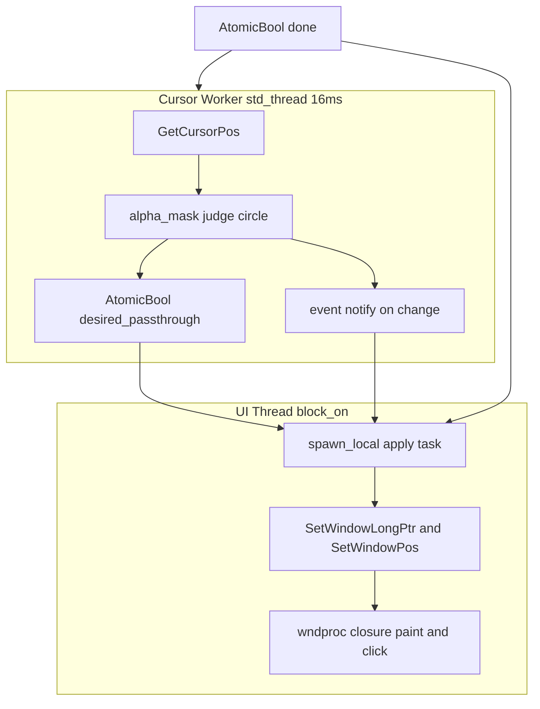
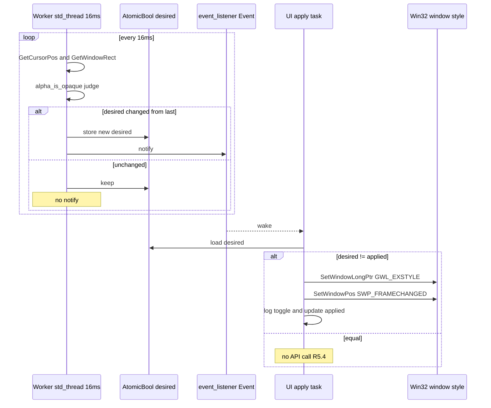

# 技術設計書: pilot-clickthrough-alpha-toggle（先進坑 / pilot・使い捨て）

## Overview

本設計は先進坑（pilot・使い捨て）である。`WS_EX_TRANSPARENT` をαマスクに応じて動的に付け外しする方式で「キャラクター描画領域だけクリックを受け、透明領域は背面アプリ（別プロセス）へ透過させる」が成立するかを、独立 example として最小実装し、試験項目 T1〜T8 を人間と手動検証する。成果物はコードではなく知見（go／違う／直す ＋ 学び）であり、一次記録は example の `README.md`（3 幕）と `REPORT.md`（指定フォーマット）である。

**Purpose**: 開発者に「DComp 描画を捨てずに別プロセス透過を成立させる第 4 の手（`WS_EX_TRANSPARENT` 動的トグル）」の実現可能性に関する go ゲート知見を提供する。
**Users**: 開発者（人間）が本 pilot の出力を見て go／違う／直す を判定する。下流の本坑 `wintf-clickthrough-alpha-toggle` がその go を `_Depends(confirmed):` 前提依存とする。
**Impact**: production コードには一切手を入れない。`crates/pilot/examples/pilot-clickthrough-alpha-toggle/` に葉ノード隔離された新規 example を 1 個追加するのみ。

実装は既存先進坑 `crates/pilot/examples/wintf-winmsg-executor/main.rs` の確立パターン（`Window::new_ex` で ex_style を生成時付与、wndproc クロージャ、`block_on`/`spawn_local`、`event_listener` クロススレッド起床、`AtomicBool` ワーカ終了、GDI 描画）をそのまま踏襲する。新規依存は追加しない（`pilot/Cargo.toml` 整備済み・tokio 不在）。

### Goals
- `WS_EX_LAYERED` 無し・`WS_EX_TRANSPARENT` 単独で別プロセス透過が成立するかを実機で検証可能な最小検証台を提供する（R2, R5）。
- カーソル位置に応じてクリックスルー ON/OFF を自動切替し、状態変化フレームでのみ拡張スタイル API を呼ぶ（R3, R5）。
- 描画円とαマスク判定円を実スクリーン物理座標で一致させ、高 DPI・マルチモニタでも見た目と判定が一致する（R4, R7）。
- T1〜T8 の手動検証手順と一次記録（`REPORT.md` ＋ README 3 幕）を確立する（R9）。

### Non-Goals
- 本体 `wintf`/`areka` への接続（本坑の領分）。
- 実描画αバッファ参照（PoC は仮の円判定で固定）。
- ULW/DComp バックエンドの撤去・改変、隣接資産（`event-hit-test-alpha-mask`・`com/ulw.rs`）への接触。
- 新規大型クレート（winit/tauri 等）の追加、先進坑コードの production 流用。
- go 判定の自動化（判定主体は人間。Claude Code 単独で合格判定して次フェーズに進まない）。

## Boundary Commitments

### This Spec Owns
- `crates/pilot/examples/pilot-clickthrough-alpha-toggle/` 配下の `main.rs`・`README.md`・`REPORT.md`（コードと一次記録）。
- 透過トップモスト窓の生成と `WS_EX_TRANSPARENT` 動的トグルの制御ロジック。
- カーソル監視ワーカ（16ms 周期・別 `std::thread`・`event_listener` 起床）。
- αマスク判定の差し替えシーム（仮の円判定・純関数 1 個）。
- 状態変化最適化（前回状態との差分検出・変化時のみスタイル適用）。
- T1〜T8 の手動検証手順と `REPORT.md` フォーマットの定義。

### Out of Boundary
- 本体αマスク関数（実描画αバッファ参照）— 本坑 `wintf-clickthrough-alpha-toggle` が所有。
- ULW/DComp バックエンドの改変・`CompositionMode`・`com/ulw.rs`・`event-hit-test-alpha-mask` への接触。
- 本体 `wintf`/`areka` への結線、`pilot` クレートの `lib.rs` への item 追加。
- 先進坑コードの production コピペ流用（本坑はクリーンに掘り直す）。

### Allowed Dependencies
- `wintf-winmsg-executor = "0.0.5"`（UI スレッド基盤・crates.io・既存整備済み）。
- `event-listener = "5"`、`windows = { workspace = true }`、`windows-core = { workspace = true }`。
- workspace の `windows` features（`Win32_UI_WindowsAndMessaging`・`Win32_UI_HiDpi`・`Win32_Graphics_Gdi`・`Win32_Foundation`・`Win32_System_Threading`）はすべて有効済み。
- **制約**: 新規依存追加禁止。他クレートからの inbound 依存（`pilot = { path = ... }`）禁止。tokio 禁止。32bit 可搬性を崩さない。

### Revalidation Triggers
本 pilot は production に被依存しない葉ノードであり、下流が依存するのは「コードの契約」ではなく「README の go 判定（知見）」である。以下が起きたとき下流（本坑）は再確認が必要:
- README 検証結果の go／違う／直す 判定が変わったとき。
- T1・T2・T3・T4・T6（必須合格基準）のいずれかの判定が反転したとき。
- `WS_EX_TRANSPARENT` 単独での別プロセス透過の成否（核心知見）が覆ったとき。

## Architecture

### Existing Architecture Analysis

本 pilot は既存先進坑 `wintf-winmsg-executor` のインフラパターンの拡張である。ギャップ分析（`research.md` §1）の通り **API レベルのギャップはゼロ**。流用する確立パターン:

- **ウィンドウ生成**: `wintf_winmsg_executor::util::{Window, WindowType}` の `Window::new_ex(WindowType::TopLevel, WINDOW_EX_STYLE(..), state, wndproc_closure)`。ex_style を生成時に直接渡せるため初期 `WS_EX_TRANSPARENT | WS_EX_TOPMOST` の付与が容易。
- **wndproc クロージャ**: `move |state: Pin<&S>, msg: WindowMessage| -> Option<LRESULT>`。`WM_LBUTTONDOWN`/`WM_PAINT`/`WM_ERASEBKGND` をクロージャ内で完結処理。`None` 返却で `DefWindowProc` フォールバック。`GWLP_USERDATA` 手詰め不要。`WM_NCHITTEST` は分岐に書かない（＝自前ハンドルしない・R2.4）。
- **メッセージループ**: `block_on(async { .. })` 駆動、`spawn_local` で UI スレッド async タスク。
- **クロススレッド起床**: `Arc<event_listener::Event>` をワーカ `std::thread` から `notify`、UI 側 async で `event.listen(); listener.await;`（tokio 非依存・R3.3/R10.2）。`AtomicBool` done フラグでワーカ正常終了（R8.2）。
- **描画**: GDI（`BeginPaint`/`FillRect`/`CreateSolidBrush`）。redirected 窓（ex_style に `WS_EX_NOREDIRECTIONBITMAP` を付けない）なら GDI が画面に出る。

維持すべき既存パターン: state は UI スレッド内 `Rc`（`!Send` 許容）。本 pilot の差分は「別スレッドのカーソルワーカが UI スレッドへ望ましい状態を伝える」点のみ（後述の責務分離で HWND をスレッド跨ぎしない）。

### Architecture Pattern & Boundary Map

採用パターン: **判定（ワーカ）／適用（UI スレッド）の責務分離**（`research.md` §3.1 Option A）。HWND は UI スレッドから出さない。ワーカは GetCursorPos と円判定のみを担い、望ましいクリックスルー状態を `AtomicBool` で公開し、変化時のみ `event_listener` で UI を起床する。UI スレッドの async タスクが起床時に望ましい状態を読み、前回適用状態と差分があるときだけ `SetWindowLongPtr`＋`SetWindowPos` を呼ぶ。



**Architecture Integration**:
- Selected pattern: 判定／適用責務分離（Win32 では window スタイル変更を所有スレッドが行うのが安全。別スレッドからの変更は再入リスク）。
- Domain/feature boundaries: ワーカ＝計測と判定、UI＝描画と API 適用とクリック受領。共有は `AtomicBool`（望ましい状態）＋ `event_listener::Event`（起床）＋ `AtomicBool`（done）の 3 つのみ。
- Existing patterns preserved: `event_listener` 起床、`block_on`/`spawn_local`、`Window::new_ex`、GDI 描画、`AtomicBool` done。
- New components rationale: αマスク純関数（差替シーム R4）と状態差分トグル（R5 核心）だけが新規結線。
- Steering compliance: 葉ノード隔離（two-tunnel.md 命綱）厳守。品質基準は緩めてよいが隔離は厳守（要件 5.4）。

### Technology Stack

| Layer | Choice / Version | Role in Feature | Notes |
|-------|------------------|-----------------|-------|
| UI スレッド基盤 | wintf-winmsg-executor 0.0.5 | Window 生成・wndproc・block_on/spawn_local | crates.io・既存整備済み |
| 並行 / イベント | event-listener 5 ＋ std::thread | クロススレッド起床・ワーカスレッド | tokio 禁止（R10.2） |
| Win32 バインディング | windows 0.62.2 系（workspace） | スタイル制御・カーソル・DPI・GDI 描画 | features 全有効・32bit 可搬 |
| 言語 | Rust 2024 | 実装言語 | R10.1 |

## File Structure Plan

### Directory Structure
```
crates/pilot/examples/pilot-clickthrough-alpha-toggle/
├── main.rs       # 先進坑実装の全体（単一ファイル集約・先進坑ゆえ許容）
├── README.md     # 一次記録・3 幕（動機・概要・検証結果）
└── REPORT.md     # T1〜T8 詳細記録（指定フォーマット）
```

`main.rs` 内部の論理区画（同一ファイル内の関数／モジュール単位。先進坑ゆえファイル分割はしない）:
- DPI 初期化（`main` 冒頭で `SetProcessDpiAwarenessContext(PMv2)`）。
- αマスク純関数 `alpha_is_opaque(cursor: POINT, win_rect: RECT) -> bool`（差替シーム R4）。
- カーソル監視ワーカ（`std::thread`・16ms ループ・判定・`AtomicBool` 更新・変化時 notify）。
- UI スレッド: `Window::new_ex` で透過トップモスト窓生成、wndproc クロージャ（`WM_PAINT` 円描画／`WM_LBUTTONDOWN` 受領＋色トグル＋ログ）、`spawn_local` 適用タスク（差分時のみスタイル適用＋ログ）。
- 終了処理（窓 close → `done` セット → ワーカ join）。

### Created Files
- `crates/pilot/examples/pilot-clickthrough-alpha-toggle/main.rs` — 上記全責務（`_template/main.rs` をコピーして着手・R1.4）。
- `crates/pilot/examples/pilot-clickthrough-alpha-toggle/README.md` — 3 幕一次記録（`_template/README.md` をコピー・R9.5）。
- `crates/pilot/examples/pilot-clickthrough-alpha-toggle/REPORT.md` — T1〜T8 記録（後述フォーマット・R9.5）。

### Modified Files
- なし（production・`pilot/lib.rs`・`pilot/Cargo.toml` への変更は不要。依存追加なし）。

## System Flows

### 状態判定・適用フロー（R3, R5）



判定ロジック: カーソルが円内＝不透明＝クリックスルー OFF（`WS_EX_TRANSPARENT` を外す・R5.1）。円外＝透明＝クリックスルー ON（`WS_EX_TRANSPARENT` を付ける・R5.2）。「変化時のみ notify」を採用し、UI 側でも `applied` と比較する二重ガードで R5.4（非変化時 API 非呼出）を保証する。notify を変化時のみにする選択は、ワーカが既に判定主体である責務分離と整合し、UI 起床自体を抑制できるため。

### 起動時初期状態確定（R5.3/R5.4・research.md §3.4）

窓は初期 ex_style = `WS_EX_TRANSPARENT | WS_EX_TOPMOST`（＝クリックスルー ON）で生成する。UI 側の `applied` 初期値を「ON（透過）」と一致させて持つ。ワーカは起動直後の初回判定で `last` を「未確定」とし、初回は無条件に desired を確定＋notify する。これにより「カーソルが起動時に円内」の場合でも初回 1 回だけ正しく OFF へ適用され、以降は変化時のみ適用される。初期生成状態（ON）とカーソルが実際に円外なら applied と一致し API 呼出ゼロで整合する。

**起動順序（初回 notify 取りこぼし防止・design-validation 確認事項3）**: `event_listener` は listen 確立前の notify を保持しないため、**UI 側で `event.listen()` を確立してからワーカを spawn する**（listen-then-spawn）。これが取りづらい構成の場合は、代替として **UI 起動直後に desired を一度ポーリングして初回適用**し、以降の差分のみワーカ起床に委ねる。いずれかで初回 OFF 適用の確実性を担保する（「起動時にカーソルが円内」の稀ケースで初回 T3 観測がぶれない）。

### 座標手順（R4.4, R7・research.md §3.2 解決済み）

PMv2 認識プロセスでは `GetCursorPos` も `GetWindowRect` も**仮想スクリーンの物理ピクセル座標**を返す。両者を同一基準で比較できるため DPI 変換は不要。手順:

1. ワーカが `GetCursorPos(&mut pt)` で物理スクリーン座標 `pt` を取得。
2. ワーカが `GetWindowRect(hwnd, &mut wr)` で窓の物理スクリーン矩形 `wr` を取得（HWND はワーカ起動時に値コピーで渡す。`GetCursorPos`/`GetWindowRect` は読み取り専用で別スレッド呼出可・スタイル変更とは別）。
3. 円中心 = 窓矩形の中心 `(cx, cy) = ((wr.left+wr.right)/2, (wr.top+wr.bottom)/2)`（物理座標）。半径 `r = 200`（物理ピクセル）。
4. `dx=pt.x-cx; dy=pt.y-cy;` `dx*dx + dy*dy <= r*r` なら円内＝不透明。

描画側も PMv2 ゆえクライアント領域は物理ピクセルで、窓中心に半径 200px の円を GDI で描く。判定円（窓矩形中心・物理）と描画円（クライアント中心・物理）は同一窓の同一中心を指すため一致し、高 DPI（150% 等）・マルチモニタでも見た目と判定が自動整合する（R7.2/R7.3）。プライマリ固定の `(960,540)` は破棄済み（research.md §3.2 ディスカッション #1）。

## Requirements Traceability

| Requirement | Summary | Components | Flows |
|-------------|---------|------------|-------|
| 1.1–1.5 | 葉ノード隔離・知見一次成果・_template コピー | File Structure（examples 配下のみ・inbound ゼロ） | — |
| 2.1–2.5 | 透過トップモスト窓・中央円・TRANSPARENT 単独・NCHITTEST 不介入 | TransparentWindow | 起動時初期状態 |
| 3.1–3.4 | 16ms 別スレッド・event_listener 起床・マスク問合せ | CursorWorker | 判定・適用フロー |
| 4.1–4.4 | 円判定純関数・差替シーム・仮実装・物理座標 | AlphaMask | 座標手順 |
| 5.1–5.5 | 円内 OFF／円外 ON・変化時のみ適用・非変化時非呼出・ログ | StateApplier | 判定・適用フロー |
| 6.1–6.3 | WM_LBUTTONDOWN 受領・ログ・色トグル | TransparentWindow (wndproc) | — |
| 7.1–7.3 | PMv2 設定・座標一致・マルチモニタ前提 | DpiInit, AlphaMask | 座標手順 |
| 8.1–8.2 | プロセス正常終了・ワーカ正常終了 | Lifecycle | — |
| 9.1–9.6 | T1〜T8 手動検証・必須合格基準・REPORT/README・人間判定 | REPORT.md, README.md | — |
| 10.1–10.4 | Rust2024・windows0.62・event_listener5・tokio禁止・32bit・不確実点は質問 | 全体（Technology Stack） | — |

## Components and Interfaces

| Component | Layer | Intent | Req Coverage | Key Dependencies | Contracts |
|-----------|-------|--------|--------------|------------------|-----------|
| DpiInit | 起動 | PMv2 DPI 認識設定 | 7.1 | SetProcessDpiAwarenessContext (P0) | — |
| AlphaMask | 判定 | カーソルの円内/外を物理座標で判定する純関数 | 4.1–4.4, 7.2 | windows POINT/RECT (P0) | Service |
| CursorWorker | 並行 | 16ms 周期で位置取得・判定・状態公開・変化時起床 | 3.1–3.4, 5.1/5.2 | AlphaMask (P0), event_listener (P0) | State, Event |
| StateApplier | UI | desired と applied の差分時のみスタイル適用＋ログ | 5.3–5.5 | windows style API (P0), CursorWorker (P0) | State |
| TransparentWindow | UI | 透過トップモスト窓生成・円描画・クリック受領 | 2.1–2.5, 6.1–6.3 | wintf-winmsg-executor (P0) | State |
| Lifecycle | 起動/終了 | 窓 close→done セット→ワーカ join | 8.1, 8.2 | AtomicBool done (P0) | State |

### 判定層

#### AlphaMask（差し替えシーム）

| Field | Detail |
|-------|--------|
| Intent | カーソル物理座標と窓矩形から円内/外を判定する純関数 |
| Requirements | 4.1, 4.2, 4.3, 4.4, 7.2 |

**Responsibilities & Constraints**
- ウィンドウ矩形中心を中心とする半径 200px（物理ピクセル）の円の内側を不透明、外側を透明と判定（R4.1）。
- カーソル位置を入力に取る独立した差替シーム（R4.2）。将来は本坑が実描画αバッファ参照に差し替える。
- 実描画αバッファ参照は実装しない（R4.3）。
- 固定スクリーン座標前提を持たず、カーソル物理座標と窓矩形から実算出した円の物理位置を同一基準で比較（R4.4/R7.2）。

**Contracts**: State [ ] / Service [x]

##### Service Interface
```rust
/// カーソルが不透明円の内側にあれば true（クリックスルー OFF を意味する）。
/// 引数はすべて物理スクリーン座標（PMv2 前提）。純関数・副作用なし。
fn alpha_is_opaque(cursor: POINT, win_rect: RECT) -> bool;
```
- Preconditions: プロセスが PMv2 認識（`cursor`/`win_rect` が物理ピクセル）。
- Postconditions: 円内＝true、円外＝false。`win_rect` の中心と半径 200 で判定。
- Invariants: 副作用なし・I/O なし（差替容易性を担保）。

### 並行層

#### CursorWorker

| Field | Detail |
|-------|--------|
| Intent | 別 std::thread で 16ms 周期に位置取得・判定し望ましい状態を公開・変化時起床 |
| Requirements | 3.1, 3.2, 3.3, 3.4, 5.1, 5.2 |

**Responsibilities & Constraints**
- UI とは別の `std::thread` で 16ms 周期に `GetCursorPos`＋`GetWindowRect`＋`alpha_is_opaque` を実行（R3.1/R3.2/R3.4）。
- 望ましいクリックスルー状態を `AtomicBool desired_passthrough`（true=透過 ON＝円外）で公開。円内＝OFF（R5.1）、円外＝ON（R5.2）。
- 望ましい状態が前回ループから変化したとき（および初回）だけ `event_listener::Event::notify` で UI を起床（R3.3・tokio 非依存）。
- `done: AtomicBool` が立ったらループを抜け正常終了（R8.2）。

**Dependencies**
- Outbound: AlphaMask — 判定（P0）
- Outbound: StateApplier — `desired`/`event` 経由（P0）
- External: event_listener::Event — クロススレッド起床（P0）

**Contracts**: State [x] / Event [x]

##### State Management
- State model: `Arc<AtomicBool> desired_passthrough`、`Arc<Event>`、`Arc<AtomicBool> done`。
- Concurrency strategy: ワーカへ渡すのは **HWND の生値（`isize`）**であり、ワーカスレッド内で `HWND(raw as *mut _)` に再構成して `GetCursorPos`/`GetWindowRect` の**読み取り専用 API のみ**を呼ぶ。スタイル変更（`SetWindowLongPtr`/`SetWindowPos`）は窓所有スレッド（UI）専有ゆえ、ワーカへ `AppState` ごと渡す必要がなく **`unsafe impl Send` ラッパは不要**（R2.5 は跨ぎ共有を「許容」するが本設計は生値＋読み取り専用に narrowing して安全側に倒す）。`done` には `Ordering::Relaxed`/`Acquire`/`Release` を適用（既存 example 準拠）。

### UI 層

#### StateApplier（状態変化最適化）

| Field | Detail |
|-------|--------|
| Intent | UI スレッド async タスクで desired と applied の差分時のみスタイル適用 |
| Requirements | 5.3, 5.4, 5.5 |

**Responsibilities & Constraints**
- `event.listen().await` で起床後、`desired_passthrough` を読み、ローカル `applied` と比較（R5.3）。
- 差分があるときのみ `SetWindowLongPtr(hwnd, GWL_EXSTYLE, new_ex)` ＋ `SetWindowPos(hwnd, None, 0,0,0,0, SWP_FRAMECHANGED|SWP_NOMOVE|SWP_NOSIZE|SWP_NOZORDER|SWP_NOACTIVATE)` を呼ぶ（R5.3）。`new_ex` は `applied` に応じて `WS_EX_TRANSPARENT` を加除。
- 差分が無い間はスタイル適用 API を呼ばない（R5.4）。
- 切替時にログ出力（R5.5）。

**Dependencies**
- Inbound: CursorWorker — `desired`/`event`（P0）
- Outbound: Win32 SetWindowLongPtr/SetWindowPos（P0・UI スレッドが所有窓に対し実行）

**Contracts**: State [x]

##### State Management
- State model: ローカル `applied: bool`（UI スレッド内・初期値はウィンドウ初期 ex_style と一致＝ON）。
- Concurrency strategy: スタイル変更は窓所有スレッド（UI）のみ。ワーカは触れない（再入リスク回避）。

#### TransparentWindow

| Field | Detail |
|-------|--------|
| Intent | 透過トップモスト窓を生成し円を描画・不透明円のクリックを受領 |
| Requirements | 2.1–2.5, 6.1, 6.2, 6.3 |

**Responsibilities & Constraints**
- `Window::new_ex(WindowType::TopLevel, WINDOW_EX_STYLE(WS_EX_TRANSPARENT | WS_EX_TOPMOST), state, wndproc)` で透過トップモスト窓を生成（R2.1）。
- 全域透明・中央に不透明円を描画。描画円はαマスク判定円と同一領域（R2.2）。透過は `WS_EX_LAYERED` を付けず実現するか実機で検証（R2.3・後述リスク）。
- `WM_NCHITTEST` を wndproc 分岐に書かない＝自前ハンドルしない（R2.4）。
- `WM_PAINT` で窓中心に半径 200px の円を GDI（`CreateSolidBrush`＋`Ellipse` 等）で描画。色は state の現在色。
- `WM_LBUTTONDOWN` を受領（R6.1）、ログ出力（R6.2）、円の色をトグル変更し `InvalidateRect` で再描画（R6.3）。

**Dependencies**
- External: wintf-winmsg-executor::util::Window — 窓生成と wndproc（P0）

**Contracts**: State [x]

##### State Management
- State model: `Rc<AppState>`（UI スレッド内・`!Send` 許容）。円の現在色（トグル用）を `Cell` で保持。
- Persistence: なし（実行時のみ）。

**Implementation Notes**
- Integration: state を `Pin<&Rc<AppState>>` で wndproc から安全アクセス（既存 example 準拠）。
- Validation: `WS_EX_LAYERED` 不付与での別プロセス透過の成否は T2/T6 実機検証（核心 Unknown・research.md §3.5）。
- Risks: redirected 窓で GDI を画面に出すため `WS_EX_NOREDIRECTIONBITMAP` は付けない。透過の見え方（全域透明＋円のみ可視）は実機確認が要る。

#### Lifecycle

| Field | Detail |
|-------|--------|
| Intent | 窓クローズでプロセスとワーカを正常終了 |
| Requirements | 8.1, 8.2 |

**Responsibilities & Constraints**
- 窓が閉じられ `block_on` の future が完了したらプロセスを正常終了（R8.1）。
- `done` を `store(true)` し、ワーカ join で正常終了（R8.2）。ワーカ最終 notify で UI 側 listen を確実に解除（既存 example の done-notify パターン）。

## Error Handling

### Error Strategy
先進坑ゆえ堅牢なエラー処理は要件外。Win32 API 失敗は `let _ =` で握る（既存 example 準拠）が、検証に直結する 2 点はログ出力する:
- `SetWindowLongPtr`/`SetWindowPos` の戻り値が異常な場合の警告ログ（T4/T5 の証跡）。
- 起動時 `SetProcessDpiAwarenessContext` 失敗時の警告ログ（T7 の前提・R7.1）。

### Monitoring（検証用ログ）
- クリックスルー切替ログ（R5.5・T4）: 「ON→OFF」「OFF→ON」と座標を出力。
- `WM_LBUTTONDOWN` 受領ログ（R6.2・T3）。
- 非変化フレームでは適用 API もログも出さない（R5.4・T5 の負の証跡）。

## Testing Strategy

先進坑ゆえ自動テストは作らない（要件 5.4・品質基準緩和）。検証は **T1〜T8 の人間との手動検証**（R9）。手順は「人間の準備確認 → エージェントがプログラム起動（`cargo run -p pilot --example pilot-clickthrough-alpha-toggle`）→ 結果のヒアリング」（R9.1）。

### 手動検証項目（T1〜T8・R9.2）

| # | 試験項目 | 期待結果 | 対応要件 | 区分 |
|---|---------|---------|---------|------|
| T1 | 起動確認 | 透過トップモスト窓が表示される | 2.1 | 必須 |
| T2 | 円外でのクリック透過 | 背面アプリ（デスクトップアイコン等）が反応 | 2.3, 5.2 | 必須 |
| T3 | 円内でのクリック受領 | WndProc に WM_LBUTTONDOWN が届く | 6.1 | 必須 |
| T4 | 状態切替の発火 | 円境界をまたぐ瞬間に ON↔OFF ログ | 5.3, 5.5 | 必須 |
| T5 | 状態変化なし時の非発火 | 留まっている間 SetWindowPos 非呼び出し | 5.4 | 条件付き可 |
| T6 | マルチプロセス透過 | 背面ブラウザのリンクが円外クリックで開く | 2.3 | 必須 |
| T7 | DPI 環境での座標一致 | 高 DPI（150% 等）でも円判定が見た目と一致 | 7.1–7.3 | 条件付き可 |
| T8 | 終了処理 | 窓を閉じるとプロセス・ワーカスレッドが正常終了 | 8.1, 8.2 | 条件付き可 |

**合格基準**（R9.3/R9.4）: T1・T2・T3・T4・T6 が ✅ 必須。T5・T7・T8 は ✅ または軽微な条件付き合格（理由明記）。**go 判定は開発者（人間）が下す。Claude Code 単独で合格判定して次フェーズに進まない**（R9.6）。

**検証手順注記（境界チャタリング対策・design-validation 確認事項1）**: T4（状態切替の発火）・T5（非変化時の非発火）の検証では、カーソルを**円境界でゆっくり一度だけまたぐ**こと。境界線上で高速に往復させると 16ms 周期で ON↔OFF が連発し、観測（特に T5 の負の証跡）が濁る。これは検証手順で回避する。境界に不感帯を設けるヒステリシスは**先進坑では実装しない（YAGNI）**。本番で必要になれば本坑 `wintf-clickthrough-alpha-toggle` で導入する（Open Questions 参照）。

### REPORT.md フォーマット（R9.5・research.md §3.3 で定義）

`REPORT.md` は T1〜T8 の詳細記録（合否・証跡）を担い、README 3 幕とは役割を分担する: **README = 動機／概要／検証結果サマリ（go・違う・直す ＋ 学び ＋ 日付）の一次記録正本**、**REPORT = T1〜T8 の機械的な合否・証跡の詳細台帳**。README が結論、REPORT が根拠。

REPORT.md の構造（テンプレート）:
```
# REPORT: pilot-clickthrough-alpha-toggle 検証結果

- 検証日: YYYY-MM-DD
- 実行コマンド: cargo run -p pilot --example pilot-clickthrough-alpha-toggle
- 環境: OS / DPI 倍率 / モニタ構成

## T1〜T8 合否台帳

| # | 試験項目 | 合否 | 証跡（観測内容・ログ抜粋・スクショ参照） |
|---|---------|------|----------------------------------------|
| T1 | 起動確認 | ✅/❌/条件付き | |
| T2 | 円外クリック透過 | | |
| T3 | 円内クリック受領 | | |
| T4 | 状態切替発火 | | |
| T5 | 非変化時非発火 | | |
| T6 | マルチプロセス透過 | | |
| T7 | DPI 座標一致 | | |
| T8 | 終了処理 | | |

## 必須合格基準（T1・T2・T3・T4・T6）の充足
- すべて ✅ か: はい / いいえ（不足項目を明記）

## 総合判定（人間が記入）
- go / 違う / 直す: ____
- 理由・学び: ____
```

## Open Questions / Risks

- **核心 Unknown（research.md §3.5）**: `WS_EX_LAYERED` 無し・`WS_EX_TRANSPARENT` 単独でプロセス境界を越えてクリックが背面別プロセスへ落ちるか。設計では潰せず T2/T6 実機検証が go ゲートの本体。実装中に挙動疑義があれば推測せず開発者へ質問（R10.4）。
- **DPI 座標（research.md §3.2 解決済み・残課題は手順のみ）**: PMv2 で GetCursorPos と GetWindowRect が同一物理座標基準のため変換不要、と本設計は判断。万一実機で円の見た目と判定がずれる場合は per-monitor 補助（`MonitorFromPoint`/`GetDpiForMonitor`）を検討（T7）。
- **境界チャタリング（design-validation 確認事項1）**: 円境界線上でカーソルを高速往復させると 16ms 周期で ON↔OFF が連発し得る。先進坑では検証手順（ゆっくり一度だけまたぐ）で回避し、ヒステリシス（不感帯）は実装しない（YAGNI）。本番要件として顕在化したら本坑で不感帯を導入する。
- **不確実点は質問（R10.4）**: Win32 API/クレート仕様の不確実点に遭遇したら推測で進めず開発者に確認する。
