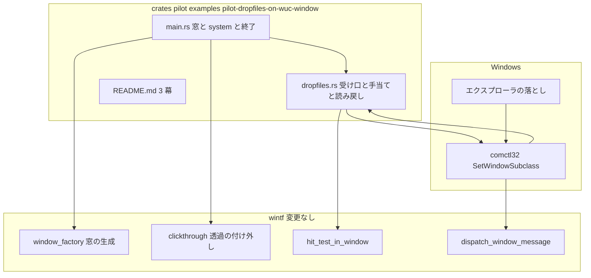
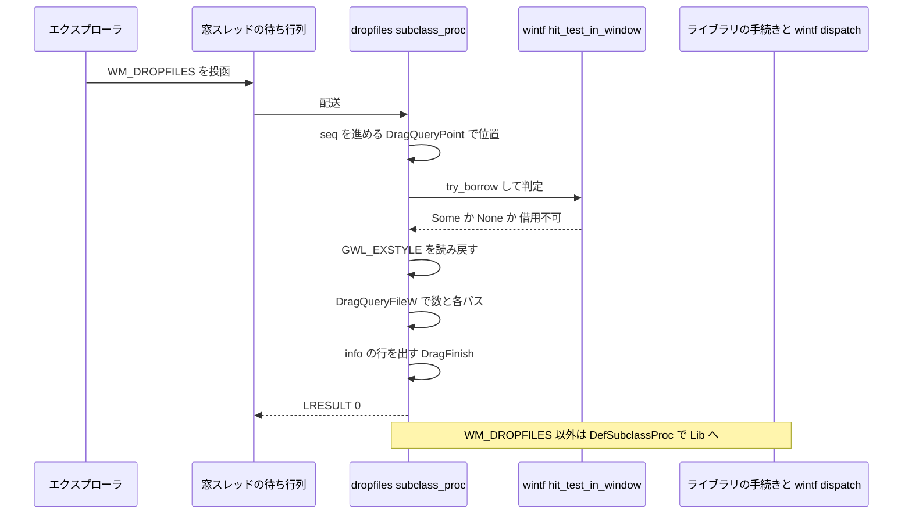

# 技術設計: pilot-dropfiles-on-wuc-window

> 先進坑（使い捨て）の設計。規模は S（1〜3 タスク・ソース 2 ファイル＋README）。production 向けの抽象化は作らない。
> 引用は「どのファイルの、何の定義か」で指す（行番号は使わない）。調査の経緯と選択肢の比較は `research.md`、ここには結論だけを書く。

## Overview

**Purpose**: 本番のゴースト窓と同じ条件（WUC 合成・クリック透過の付け外し）で建てた窓に受け入れの宣言 `WS_EX_ACCEPTFILES` だけを足し、エクスプローラから `.nar` を落としたときに落とし物のメッセージ `WM_DROPFILES` が届いてパスが取れるか、絵の外（透過している所）では背後の窓へ抜けるかを、example 1 本のログで確かめる。成果物は README 3 幕の知見であり、go／違う／直す の判定は開発者が README を見て下す。

**Users**: 開発者が `cargo run -p pilot --example pilot-dropfiles-on-wuc-window` を走らせ、エクスプローラから 3 通りに落とし、`[dropfiles]` の行を読む。下流の本坑 `areka-P0-ghost-install` の設計が README の検証結果を参照する。

**Impact**: 変更は `crates/pilot/examples/pilot-dropfiles-on-wuc-window/`（新規）に閉じる。`crates/pilot/Cargo.toml` は変えない見込み（要る Win32 API と依存はすべて既に有効・`research.md` §2）。wintf・areka のコードは 1 行も変えない。

### Goals

- 本番と同じ様式の窓（`WS_POPUP | WS_VISIBLE`／`WS_EX_LAYERED | WS_EX_TOOLWINDOW`）に `WS_EX_ACCEPTFILES` を足し、wintf の付け外し（`WS_EX_LAYERED` を外し `WS_EX_NOREDIRECTIONBITMAP` を足す・クリック透過の `WS_EX_TRANSPARENT` の付け外し）はそのまま任せる。
- wintf を変えずに `WM_DROPFILES` を example 側で受け、到着ごとに 1 行で「位置・絵の上か外か・透過の状態・受け入れの宣言の有無・ファイル数・各パス」をログへ出し、必ず `DragFinish` で片付ける。
- 手当て 2 種（生成後に宣言を付け直す・`DragAcceptFiles` で宣言する）を環境変数で切り替えられるようにし、既定は手当てなしの素の走行にする。
- 起動時に管理者かどうかと拡張スタイルの実際の値をログへ出す。上限時間の内側で自分で終わり、終了の理由と受け取った回数を出す。
- README 3 幕に、手順ⓐ〜ⓒ・結果・手当て・学び・見立てを書く（判定の欄は開発者が埋める）。

### Non-Goals

- `.nar` の展開・インストール、`OnFileDrop2`／`OnDirectoryDrop` の送出、ファイル選択の箱（本坑 `areka-P0-ghost-install`）。
- テキスト・URL の投げ込み（α 後）。`IDropTarget` の試作（「違う」となったときの見立てを README に書くだけ）。
- 管理者として起動したときの手当て（`ChangeWindowMessageFilterEx`）。要件討議で対象外（ふつうの権限で走らせ、管理者の走行は判定に使わない）。
- wintf・areka の変更。先進坑コードの production への流用。
- 窓のドラッグ移動・複数窓・DPI の切り替え（開発機の 200% のまま測る）。

## Boundary Commitments

### This Spec Owns

- `crates/pilot/examples/pilot-dropfiles-on-wuc-window/` の example 1 本（窓・受け口・手当ての切替・ログ・自動終了）と README 3 幕。
- 落とし物のログの形（目印 `[dropfiles]` と構造化フィールドの名前）。README の grep 例はこの形を写す。
- 検証の手順ⓐ〜ⓒと、結果を go／直す／違う に当てはめる規則（requirements.md 第 5 要件の転記）。

### Out of Boundary

- wintf の窓手続きへの `WM_DROPFILES` の腕の追加（本坑が README の学びを見て掘る）。
- `areka-nar`・`areka` 本体・`wintf` のコード、他 crate の `Cargo.toml`。
- 絵の外へ落としたときに窓が受け取ってしまう場合の「捨てる」処理（本坑の扱い。README に見立てを書くだけ）。
- go／違う／直す の判定そのもの。

### Allowed Dependencies

- `wintf`（`WinApp`・`Window`／`WindowStyle`／`WindowPos`／`WindowHandle`・`HitTest`・`Rectangle`／`Brushes`・`BoxStyle`・`ClickThroughRegistryHandle`・`hit_test_in_window`・`FrameCount`・schedule label `FrameFinalize`）＝`crates/pilot/Cargo.toml` の `[target.'cfg(not(target_arch = "x86"))'.dev-dependencies]` に既にある。
- `bevy_ecs`・`tracing`・`tracing-subscriber`（同上・既にある）。
- `windows` 0.62.2 の `Win32::UI::Shell`（`SetWindowSubclass`／`DefSubclassProc`／`SUBCLASSPROC`／`HDROP`／`DragQueryPoint`／`DragQueryFileW`／`DragFinish`／`DragAcceptFiles`／`IsUserAnAdmin`）と `Win32::UI::WindowsAndMessaging`（`WM_DROPFILES`／`WS_EX_ACCEPTFILES`／`GetWindowLongPtrW`／`SetWindowLongPtrW`／`SetWindowPos`）＝ワークスペース既定の features `Win32_UI_Shell`・`Win32_UI_WindowsAndMessaging` で供給済み（ルート `Cargo.toml` の `[workspace.dependencies.windows]`）。
- 依存の向きは pilot → 既存 crate の一方向のみ。他 crate の `Cargo.toml` に `pilot` を足さない。

### Revalidation Triggers

- `crates/wintf/src/runtime/window_factory.rs` の `compute_ex_style` が `WS_EX_LAYERED` の除去と `WS_EX_NOREDIRECTIONBITMAP` の追加以外のビットに触るようになったとき（受け入れの宣言が生成時に消える）。
- `crates/wintf/src/win_style.rs` の `apply_click_through`／`apply_layered_companion` が自分のビット以外を書き換えるようになったとき（要件 4.4 の前提が変わる）。
- `wintf-winmsg-executor` が `GWLP_WNDPROC` の差し替えの時機（今は `WM_NCCREATE`）や `WM_NCDESTROY` の後片付けの順序を変えたとき（重ね掛けの安全性）。
- `crates/wintf/src/ecs/layout/hit_test/mod.rs` の `hit_test_in_window` の座標系（窓クライアントの物理 px）が変わったとき。
- 本番の窓の様式（`crates/areka/src/placement/spawn.rs` の `window_style`）が変わったとき（検証台の前提が本番と食い違う）。

## Architecture

### Existing Architecture Analysis

- **窓手続きに落とし物の腕は無く、差し込み口も無い**: `crates/wintf/src/ecs/window_proc/mod.rs` の `dispatch_window_message` は表に無いメッセージを `None`＝既定手続きへ流す。`crates/wintf/src/runtime/message_loop.rs` の filter は `pub(crate)`。よって example は HWND を得た後に自分で窓手続きを重ねる。
- **重ね掛けは安全**: ライブラリ `wintf-winmsg-executor` 0.0.5 は `WM_NCCREATE` で `GWLP_WNDPROC` を型付きの手続きへ差し替え、`GWLP_USERDATA` に状態を置き、`WM_NCDESTROY` で解放する（同 crate `src/util/window.rs`）。生成後に `SetWindowSubclass` で重ねれば連鎖は comctl32 が管理し、`GWLP_USERDATA` に触らずに済む。
- **受け入れの宣言は生成時に通る**: `compute_ex_style` は `WS_EX_LAYERED` を落として `WS_EX_NOREDIRECTIONBITMAP` を足すだけで他のビットを通し、`apply_initial_state` は `GWL_STYLE` しか触らない。クリック透過の付け外し（`apply_click_through`＝`WS_EX_TRANSPARENT` のみ・`apply_layered_companion`＝`WS_EX_LAYERED` を立てるのみ）も他のビットを保つ。
- **当たり判定は公開されている**: `hit_test_in_window(world, window, client_point: PhysicalPoint) -> Option<Entity>`（引数は物理 px のクライアント座標・`PhysicalPoint` は `PointF` の別名）。`DragQueryPoint` が返すのも物理 px のクライアント座標（本プロセスは `WinApp::new` が PMv2 を設定）なので、変換なしに同じ判定器へ渡せる。
- **切り替えのログは既にある**: `crates/wintf/src/ecs/clickthrough/controller.rs` の `debug!(?window, ?desired, "clickthrough: ex-style トグル適用")`。既定フィルタに `wintf::ecs::clickthrough=debug` を含めれば見える（先例 `crates/areka/examples/clickthrough_two_rects.rs`）。
- **UI スレッドは MTA**（`crates/wintf/src/runtime/mod.rs` の `WinApp::with_exit_policy`）。`WM_DROPFILES` は窓のスレッドの待ち行列へ投函される通常の窓メッセージで COM のアパートメントに依らないため本坑には効かない。`IDropTarget` へ倒す場合の見立ては `research.md` §6。

### Architecture Pattern & Boundary Map



**Architecture Integration**:
- Selected pattern: 手本 `crates/pilot/examples/pilot-balloon-asset-swap/main.rs`（窓の生成・透過機構への登録・`AREKA_APP_SMOKE_EXIT_MS` の上限時間・`Run` リソースと `deadline_system`・`ExitReason`）の器に、絵は `crates/areka/examples/clickthrough_two_rects.rs`（窓は `HitTest::none()`・子の `Rectangle` が当たり）を写し、受け口だけを新しく書く。
- Domain boundaries: `main.rs` は World を持つ側（窓・system・終了）、`dropfiles.rs` は Win32 と向き合う側（重ね掛け・パスの取り出し・拡張スタイルの読み戻し・手当て）。`dropfiles.rs` が World に触るのは `hit_test_in_window` の読み取りだけ。
- Existing patterns preserved: `Added<WindowHandle>` で HWND 付与直後に仕掛ける・窓 entity は `HitTest::none()`・`FrameFinalize` に system を置く・終了は窓の despawn → `WinApp` 既定の「最後の窓が閉じたら終了」。
- Steering compliance: `two-tunnel.md`（`pilot-` 接頭辞・1 仕様＝1 フォルダ・葉ノード隔離・README 3 幕・判定は開発者）、`logging.md`（スコープ接頭辞・構造化フィールド・`error!`＋続行）。

### Key Decisions

`research.md` §7 の 8 項に対する決定。選択肢の比較は `research.md` §10 の決定ログ。

1. **受け口は `SetWindowSubclass`（案 A）1 本**。`WM_DROPFILES` だけ処理して `LRESULT(0)` を返し、他は `DefSubclassProc` へ流す（→ ライブラリの手続き → wintf の `dispatch_window_message`）。スレッドのメッセージ取得フック（案 C）は同梱しない。ⓐで届かないと分かったときだけ「待ち行列に来ているか」の切り分けとして足す（README の手当ての項に「次に足すもの」として書く）。
2. **絵は窓 `HitTest::none()`＋不透明な `Rectangle` 1 つ**（`BitmapSource`＋α マスクは使わない）。落とし先を決めるのは OS で、見るのは `WS_EX_TRANSPARENT` のビットだけ。当たり判定の方式（矩形か α か）は wintf の中の話で、この実験の答えには効かない。矩形なら「絵の上／外」の境目がはっきりし、ファイルの依存も無い。窓に見えるもの（透明な余白＋不透明な矩形）を要件 2.4 の「絵 1 枚」と読む。寸法は窓 320×320（論理 px）・矩形は左上 (100,100) の 120×120（論理 px）。200% では窓 640×640・矩形 240×240・余白は各辺 200 物理 px で、要件 2.4 の 100×100 を満たす。
3. **「絵の上か外か」は到着の場で `hit_test_in_window` に聞く**。受け口は文脈（World の取っ手 `Rc<RefCell<EcsWorld>>` と窓 entity）を `SetWindowSubclass` の `dwRefData` 経由で持ち、`try_borrow` で World を借りて判定する。借りられなければ（tick の途中で再入したとき）`opaque=unknown` と出して待たない。透過機構と同じ判定器・同じ座標系を使うので、要件 4 の「クリックの当たり判定と一致するか」を直接測れる。待ち行列に積んで次の tick で判定する案は、行が 1 tick 遅れる上に部品が 1 つ増えるので採らない。
4. **手当ての切替は環境変数 `PILOT_DROPFILES_FIX`**（未設定＝手当てなし・`reapply`＝生成後に `GWL_EXSTYLE` へ `WS_EX_ACCEPTFILES` を付け直して `SWP_FRAMECHANGED`・`dragaccept`＝`DragAcceptFiles(hwnd, true)`）。上限時間と同じく環境変数で揃え、引数の解釈を書かない。値の解釈は `Fix::from_env_value(Option<&str>) -> Fix` の 1 関数（未知の値は `warn!` して手当てなし）。要件 5.4 のもう 1 つの手当て「透過の付け外しの時機との関係」はコードの切替ではなく手順（ⓐ＝付け外しの前・ⓒ＝付け外しの後・要件 4.3）で観測する。
5. **既定の上限時間は 180 秒**（`AREKA_APP_SMOKE_EXIT_MS` で上書き）。ⓐ〜ⓒの 3 回の落としと、ⓒの前のカーソルの出し入れを 1 走行で行う余裕を見た。
6. **ログの目印は `[dropfiles]`**。落とし物に関する行はすべて本文の先頭にこの語を置く。構造化フィールドは `seq`（到着の通し番号）・`x`／`y`（クライアント座標・物理 px）・`in_client`・`opaque`（`true`／`false`／`unknown`）・`transparent`・`accept_files`・`layered`・`noredirect`・`n`（ファイル数）・`i`・`path`・`admin`・`fix`・`limit_ms`・`drops`（終了時の回数）。
7. **走行はⓐ〜ⓒを 1 走行で追う**。行は `seq` と位置と `opaque` で自己記述的なので、1 走行のログで 3 項を読み分けられる。手当て（`reapply`／`dragaccept`）はそれぞれ別の走行（環境変数を変えて起動し直す）。
8. **管理者判定は起動時に 1 行**: `info!(admin, fix = ?fix, limit_ms, "[dropfiles] 起動")`。`IsUserAnAdmin` の値をそのまま出す。管理者の走行は README に「判定に使わない」と書く。
9. **終了コードは 2 値**: 0＝上限時間に到達して終了（この example の正常な終わり方）・2＝初期化の失敗（`run()` に入れない・`run()` 自体の失敗も含む）。終了時に `info!(drops, limit_ms, "[dropfiles] 終了: 上限時間に到達")` を出す。受け取った回数は `dropfiles.rs` の静的な `AtomicU32` で数える（World を借りずに数えられる）。
10. **`WM_DROPFILES` の到着時刻は tracing の行の時刻**（行は受け口の中で同期に出るので、行の時刻＝到着の時刻）。別のフィールドは足さない。
11. **透過の状態の読み戻しは到着時の `GWL_EXSTYLE`**。落とした瞬間から配送までの数 ms の間にカーソル監視（12ms 周期）が付け外す可能性があるので、README には「到着時の値」と明記する。

### Technology Stack

| Layer | Choice / Version | Role in Feature | Notes |
|-------|------------------|-----------------|-------|
| UI / ECS | `wintf`（workspace）・`bevy_ecs` 0.19 | 窓・透過機構・当たり判定・tick | 変更なし。既に `[dev-dependencies]` |
| Win32 | `windows` 0.62.2（`Win32_UI_Shell`・`Win32_UI_WindowsAndMessaging`） | `SetWindowSubclass`・`DragQuery*`・`DragFinish`・`DragAcceptFiles`・`IsUserAnAdmin`・拡張スタイルの読み書き | ワークスペース既定の features で供給済み。`Cargo.toml` の変更なし |
| 記録 | `tracing`・`tracing-subscriber`（`env-filter`） | `RUST_LOG` 対応のログ | 既定フィルタ `info,wintf::ecs::clickthrough=debug` |

## File Structure Plan

### Directory Structure

```
crates/pilot/examples/pilot-dropfiles-on-wuc-window/   # 新規（_template を写して着手）
├── main.rs        # 起動（購読者・管理者判定の行・窓の生成・system 登録）・Added<WindowHandle> の system・上限時間・終了コード
├── dropfiles.rs   # 受け口（SetWindowSubclass の手続き・WM_DROPFILES の処理・DragQuery*・DragFinish）・拡張スタイルの読み戻し・手当て・回数
└── README.md      # 3 幕（動機・概要・検証結果）。手順ⓐ〜ⓒ・grep 例・見立て・学び・日付
```

### Modified Files

- なし。`crates/pilot/Cargo.toml` は変えない（`research.md` §2.2）。`main.rs` があれば Cargo が example `pilot-dropfiles-on-wuc-window` として自動で拾う。

## System Flows



- 受け口は `WM_DROPFILES` を消費して `DefSubclassProc` へ流さない（`DragFinish` 済みの `HDROP` を下流へ渡さない）。他のメッセージは無条件に流す。
- ⓑ（絵の外へ落とす）ではこの流れが起きない。行が出ないことが「窓に届かなかった」の証拠であり、背後の窓に渡ったことは開発者が目で確かめる。

## Requirements Traceability

| Requirement | Summary | Components | Interfaces | Flows |
|---|---|---|---|---|
| 1.1 | フォルダ配置＝spec 名 | File Structure Plan | — | — |
| 1.2 | `_template` を写す | File Structure Plan | — | — |
| 1.3 | 変更は `crates/pilot/` の下だけ | Boundary Commitments・Modified Files（なし） | — | — |
| 1.4 | 他 crate に `pilot` 依存を足さない | Allowed Dependencies | — | — |
| 1.5 | 品質は緩めてよいが隔離は守る | Testing Strategy（最小） | — | — |
| 1.6 | 成果物は知見 | Readme | — | — |
| 2.1 | 窓 1 枚を表示 | Runner（`spawn_window`） | `WindowStyle`／`WindowPos` | — |
| 2.2 | 本番と同じ様式＋`WS_EX_ACCEPTFILES` | Runner（`spawn_window`） | `WindowStyle { style: WS_POPUP\|WS_VISIBLE, ex_style: WS_EX_LAYERED\|WS_EX_TOOLWINDOW\|WS_EX_ACCEPTFILES }` | — |
| 2.3 | 既定は宣言をビットだけで | Runner・DropReceiver（`Fix::None`） | `Fix` | — |
| 2.4 | 透明＋不透明の絵・100×100 以上 | Runner（`spawn_window`） | `HitTest::none()`＋`Rectangle` 120×120 論理 px | — |
| 2.5 | 透過機構に登録 | Runner（`on_window_created`） | `ClickThroughRegistryHandle::register` | — |
| 2.6 | 生成直後に拡張スタイルを読み戻す | DropReceiver（`log_ex_style("created")`） | `ExStyleBits` | — |
| 2.7 | 切り替えが見えるログ水準 | Runner（既定フィルタ） | `EnvFilter::new("info,wintf::ecs::clickthrough=debug")` | — |
| 2.8 | 200% のまま検証 | DropReceiver（物理 px のまま `hit_test_in_window` へ） | `PhysicalPoint` | System Flows |
| 3.1 | wintf を変えずに受ける | DropReceiver（`install`） | `SetWindowSubclass`／`DefSubclassProc` | System Flows |
| 3.2 | 時刻・位置・不透明か・透過か | DropReceiver（`handle_drop`） | `[dropfiles] 到着` の行 | System Flows |
| 3.3 | 数と各パス | DropReceiver（`handle_drop`） | `n`・`i`・`path` | System Flows |
| 3.4 | `DragFinish` | DropReceiver（`handle_drop`） | 失敗経路でも必ず呼ぶ | System Flows |
| 3.5 | 失敗を記録して待たない | DropReceiver | `error!`＋続行 | Error Handling |
| 3.6 | 機械で選べる目印 | DropReceiver・Runner | `[dropfiles]` | — |
| 4.1 | 位置に依らず例外なく出す | DropReceiver（`handle_drop` に分岐なし） | — | System Flows |
| 4.2 | 背後の受け手を置く手順 | Readme（手順ⓑ） | — | — |
| 4.3 | 透過あり／なしで落とす手順 | Readme（手順ⓐ・ⓒ） | — | — |
| 4.4 | 付け外し後も宣言が残るか | DropReceiver（到着時の `log_ex_style("drop")`） | `ExStyleBits.accept_files` | System Flows |
| 5.1 | 手順ⓐ〜ⓒ | Readme | — | — |
| 5.2 | ふつうの権限・管理者判定の行 | Runner（起動の行）・Readme | `IsUserAnAdmin` → `admin` | — |
| 5.3 | go の規則 | Readme（見立ての表） | — | — |
| 5.4 | 手当て 2 種を順に試す | DropReceiver（`apply_fix`）・Readme | `PILOT_DROPFILES_FIX=reapply\|dragaccept` | — |
| 5.5 | 効いた手当て＝直す | Readme | — | — |
| 5.6 | 違う＝`IDropTarget` の見立て | Readme（`research.md` §6 を転記） | — | — |
| 5.7 | ⓑで抜けない＝直す | Readme（見立ての表） | — | — |
| 5.8 | 判定は開発者 | Readme（判定の欄は空欄） | — | — |
| 6.1 | 上限時間で自分で終わる | Runner（`deadline_system`） | `Run` | — |
| 6.2 | 環境変数の上限時間 | Runner（`exit_ms_from`） | `AREKA_APP_SMOKE_EXIT_MS` | — |
| 6.3 | 既定 180 秒 | Runner（`DEFAULT_EXIT_MS`） | — | — |
| 6.4 | 終了の理由と回数 | Runner（`deadline_system`・`main`） | `drops`＝`DROP_COUNT` | — |
| 7.1 | README 3 幕 | Readme | — | — |
| 7.2 | 動機の幕＝本坑の名指し | Readme | — | — |
| 7.3 | 概要の幕＝実行法 | Readme | — | — |
| 7.4 | 検証結果の幕＝ⓐ〜ⓒ・権限・手当て・学び・日付 | Readme | — | — |
| 7.5 | 学び＝窓手続きまで届くか | Readme（Key Decision 1 の直接の証拠） | — | — |
| 7.6 | 見立てを添え判定は確定させない | Readme | — | — |

## Components and Interfaces

| Component | Domain/Layer | Intent | Req Coverage | Key Dependencies (P0/P1) | Contracts |
|---|---|---|---|---|---|
| Runner（`main.rs`） | example の器 | 窓を建て、system を登録し、上限時間で終わる | 2.1〜2.5, 2.7, 3.6, 5.2, 6.1〜6.4 | wintf `WinApp`（P0）・DropReceiver（P0） | Service, State |
| DropReceiver（`dropfiles.rs`） | Win32 との境目 | `WM_DROPFILES` を受け、判定と読み戻しとパスを 1 行に出し、片付ける。手当ても持つ | 2.3, 2.6, 2.8, 3.1〜3.6, 4.1, 4.4, 5.4 | comctl32 `SetWindowSubclass`（P0）・`hit_test_in_window`（P1） | Service, Event |
| Readme（`README.md`） | 一次記録 | 3 幕・手順・見立て | 1.6, 4.2, 4.3, 5.1〜5.8, 7.1〜7.6 | — | — |

### Runner（`main.rs`）

| Field | Detail |
|---|---|
| Intent | 手本 `pilot-balloon-asset-swap/main.rs` の器（購読者・`Run`・`deadline_system`・`ExitReason`）に窓と受け口の設置を載せる |
| Requirements | 2.1, 2.2, 2.3, 2.4, 2.5, 2.7, 3.6, 5.2, 6.1, 6.2, 6.3, 6.4 |

**Responsibilities & Constraints**
- 起動は `main` で同期に行う: 購読者の初期化（既定フィルタ `info,wintf::ecs::clickthrough=debug`）→ `WinApp::new()` → 起動の行（`admin`・`fix`・`limit_ms`）→ 窓の spawn → リソースと system の登録 → `run()` → 終了コード。
- 窓は 1 枚。`WindowStyle { style: WS_POPUP | WS_VISIBLE, ex_style: WS_EX_LAYERED | WS_EX_TOOLWINDOW | WS_EX_ACCEPTFILES }`（`WS_EX_TOPMOST` は本番に無いので付けない）・`WindowPos { position: Some(固定・物理 px), .. }`・`BoxStyle`（320×320 論理 px）・`HitTest::none()`・マーカー `PilotWindow`。子は `Rectangle::new()`＋`Brushes::with_foreground(不透明な色)`＋`BoxStyle`（絶対配置・左上 (100,100)・120×120 論理 px）＋`ChildOf(window)`。`DragConfig` は付けない（窓が動くと手順が複雑になる）。
- `on_window_created`（`FrameFinalize`・`Added<WindowHandle>`＋`With<PilotWindow>`）: ①`dropfiles::log_ex_style(hwnd, "created")`（透過機構が触る前の素の値を残す）、②`ClickThroughRegistryHandle::register(entity, hwnd)`、③`dropfiles::apply_fix(hwnd, fix)`、④`dropfiles::install(hwnd, Context { world, window })`。失敗は `error!` を出して続行（受け口の無い走行は README で「無効」と扱う）。World の取っ手は `run()` の前に `insert_non_send(WorldHandle(app.world()))` で置き、この system が `NonSend<WorldHandle>` から読む。
- `deadline_system`（`FrameFinalize`）: `Instant::now() >= run.deadline` で `run.exit = Some(Deadline)`、`info!(drops = DROP_COUNT, limit_ms, "[dropfiles] 終了: 上限時間に到達")`、窓を despawn（→ `WinApp` 既定の終了）。

**Contracts**: Service [x] / API [ ] / Event [ ] / Batch [ ] / State [x]

##### Service Interface
```rust
const EXIT_ENV: &str = "AREKA_APP_SMOKE_EXIT_MS";
const DEFAULT_EXIT_MS: u64 = 180_000;

#[derive(Debug, Clone, Copy, PartialEq, Eq)]
enum ExitReason { Deadline, InitFailure }
fn exit_code(reason: ExitReason) -> i32;            // Deadline=0, InitFailure=2
fn exit_ms_from(value: Option<&str>) -> u64;         // 空・非数値は既定

#[derive(Component)] struct PilotWindow;
#[derive(Resource)] struct Run { deadline: Instant, limit_ms: u64, exit: Option<ExitReason> }
struct WorldHandle(Rc<RefCell<EcsWorld>>);           // NonSend リソース

fn spawn_window(world: &mut World) -> Entity;
fn on_window_created(/* Query<(Entity, &WindowHandle), (Added<WindowHandle>, With<PilotWindow>)>, NonSend<ClickThroughRegistryHandle>, NonSend<WorldHandle>, Res<Fix> */);
fn deadline_system(/* ResMut<Run>, Query<Entity, With<PilotWindow>>, Commands */);
fn boot_and_run() -> Result<ExitReason, String>;
```
- Preconditions: `WinApp::new()` 成功（COM・DPI 初期化済み）。
- Postconditions: `run()` が戻ったら `Run.exit` は `Some(Deadline)`。`None` なら窓が外から閉じられたと見て `error!`＋`InitFailure`。
- Invariants: 窓は 1 枚。終了の唯一の時計は `deadline_system`。

##### State Management
- `Run`（上限時間・終了の理由）と `Fix`（手当ての種類・`Resource`）は World に置く。受け取った回数は World の外（`dropfiles::DROP_COUNT`）。

**Implementation Notes**
- Integration: 手本との差は「検体・資産・観測が無い」「窓の様式に `WS_EX_ACCEPTFILES` を足し `WS_EX_TOPMOST` を外す」「`on_window_created` が受け口を仕掛ける」の 3 点。
- Validation: `exit_ms_from` と `exit_code` の単体テスト（手本と同じ 1 本）。
- Risks: 窓が非最前面なのでエクスプローラの窓に隠れることがある。README の手順に「隠れたら絵をクリックして前に出す」を書く。

### DropReceiver（`dropfiles.rs`）

| Field | Detail |
|---|---|
| Intent | `WM_DROPFILES` の受け口・拡張スタイルの読み戻し・手当て・回数。Win32 とだけ向き合い、World は読み取りにしか触らない |
| Requirements | 2.3, 2.6, 2.8, 3.1, 3.2, 3.3, 3.4, 3.5, 3.6, 4.1, 4.4, 5.4 |

**Responsibilities & Constraints**
- `install`: `SetWindowSubclass(hwnd, Some(subclass_proc), SUBCLASS_ID, Box::into_raw(Box::new(ctx)) as usize)`。失敗（`FALSE`）は `Err` で返し呼び手が `error!`。文脈の `Box` はプロセスの終わりまで生かす（`WM_NCDESTROY` で外さない・使い捨て。`ponytail:` の注記を 1 行）。
- `subclass_proc`（`unsafe extern "system"`）: `msg == WM_DROPFILES` なら `handle_drop(ctx, hwnd, HDROP(wparam.0 as _))` を呼び `LRESULT(0)`。それ以外は `DefSubclassProc(hwnd, msg, wparam, lparam)`。panic を境界から漏らさない（`catch_unwind` で包み `error!`）。
- `handle_drop`: ①`DROP_COUNT.fetch_add(1)` → `seq`。②`DragQueryPoint(hdrop, &mut pt)` → `x`・`y`・`in_client`。③`ctx.world.try_borrow()` が通れば `hit_test_in_window(world.world(), ctx.window, PhysicalPoint::new(x as f32, y as f32)).is_some()` → `opaque = "true"/"false"`、通らなければ `"unknown"`（借用はこの呼び出しの中で終える）。④`read_ex_style(hwnd)` → `ExStyleBits`。⑤`DragQueryFileW(hdrop, 0xFFFF_FFFF, None)` → `n`。各 `i` は `DragQueryFileW(hdrop, i, None)` で長さを得て `Vec<u16>`（長さ＋1）で取得。0 が返れば `error!(seq, i, "[dropfiles] パスの取り出しに失敗")` して次へ。⑥`info!(seq, x, y, in_client, opaque, transparent, accept_files, layered, noredirect, n, "[dropfiles] 到着")` と、各ファイルに `info!(seq, i, path = %path, "[dropfiles] ファイル")`。⑦最後に必ず `DragFinish(hdrop)`（途中で失敗しても）。
- `log_ex_style(hwnd, when)`: `GetWindowLongPtrW(GWL_EXSTYLE)` → `ExStyleBits::from_raw` → `info!(when, accept_files, transparent, layered, noredirect, raw = format!("0x{raw:X}"), "[dropfiles] ex-style")`。生成直後（`when = "created"`）と到着時（`when = "drop"`・`handle_drop` の④と同じ関数）で使う。
- `apply_fix(hwnd, fix)`: `Fix::None` は何もしない。`Fix::Reapply` は `SetWindowLongPtrW(GWL_EXSTYLE, current | WS_EX_ACCEPTFILES)`＋`SetWindowPos(SWP_FRAMECHANGED | SWP_NOMOVE | SWP_NOSIZE | SWP_NOZORDER | SWP_NOACTIVATE)`（`apply_click_through` と同じレシピ）。`Fix::DragAccept` は `DragAcceptFiles(hwnd, true)`。適用後に `log_ex_style(hwnd, "fix")`。

**Dependencies**
- Inbound: Runner（`on_window_created` から `install`／`apply_fix`／`log_ex_style`、`deadline_system` から `DROP_COUNT`）— P0
- Outbound: wintf `hit_test_in_window`・`EcsWorld::world` — P1（借りられないときは `unknown` で続行）
- External: comctl32（`SetWindowSubclass`／`DefSubclassProc`）・shell32（`DragQuery*`／`DragFinish`／`DragAcceptFiles`／`IsUserAnAdmin`）・user32（`GetWindowLongPtrW`／`SetWindowLongPtrW`／`SetWindowPos`）— P0。いずれも `windows` 0.62.2 に揃っている（`research.md` §2.1 の表）。

**Contracts**: Service [x] / API [ ] / Event [x] / Batch [ ] / State [ ]

##### Service Interface
```rust
pub struct Context { pub world: Rc<RefCell<EcsWorld>>, pub window: Entity }

#[derive(Debug, Clone, Copy, PartialEq, Eq, Resource)]
pub enum Fix { None, Reapply, DragAccept }
impl Fix {
    pub const ENV: &'static str = "PILOT_DROPFILES_FIX";
    pub fn from_env_value(value: Option<&str>) -> Fix;   // None/""→None, "reapply", "dragaccept"、他は warn! して None
}

#[derive(Debug, Clone, Copy, PartialEq, Eq)]
pub struct ExStyleBits { pub accept_files: bool, pub transparent: bool, pub layered: bool, pub noredirect: bool, pub raw: isize }
impl ExStyleBits { pub fn from_raw(raw: isize) -> Self; }

pub static DROP_COUNT: AtomicU32;

pub fn is_admin() -> bool;                                     // IsUserAnAdmin
pub fn install(hwnd: HWND, ctx: Context) -> Result<(), String>;
pub fn apply_fix(hwnd: HWND, fix: Fix) -> Result<(), String>;
pub fn log_ex_style(hwnd: HWND, when: &'static str) -> ExStyleBits;
unsafe extern "system" fn subclass_proc(hwnd: HWND, msg: u32, wparam: WPARAM, lparam: LPARAM, id: usize, refdata: usize) -> LRESULT;
fn handle_drop(ctx: &Context, hwnd: HWND, hdrop: HDROP);
```
- Preconditions: `install` は HWND の付いた後・UI スレッドで呼ぶ（`Added<WindowHandle>` の system）。
- Postconditions: `handle_drop` は必ず `DragFinish` を呼んで戻る。`[dropfiles] 到着` の行は位置に依らず 1 回の到着につき必ず 1 行。
- Invariants: `WM_DROPFILES` 以外のメッセージは `DefSubclassProc` へ無条件に流す。`GWLP_USERDATA` には触らない。

##### Event Contract
- 受けるメッセージ: `WM_DROPFILES`（`wParam`＝`HDROP`・投函）。
- 出すログ（すべて `[dropfiles]` 始まり・`info!`）: `起動`（`admin`・`fix`・`limit_ms`）／`ex-style`（`when`・4 ビット・`raw`）／`到着`（`seq`・`x`・`y`・`in_client`・`opaque`・`transparent`・`accept_files`・`layered`・`noredirect`・`n`）／`ファイル`（`seq`・`i`・`path`）／`終了`（`drops`・`limit_ms`）。失敗は `error!` で同じ目印。
- 順序: 1 回の到着につき `ex-style`（`when=drop`）→ `到着` → `ファイル`×n の順で同期に出る。

**Implementation Notes**
- Integration: comctl32 は `WM_NCDESTROY` で重ね掛けを自動で外す。ライブラリの `WM_NCDESTROY` の解放とは連鎖の順（自分 → `DefSubclassProc` → ライブラリ）で衝突しない。終了時に警告が出るかは実走で見る（`research.md` R5）。
- Validation: `ExStyleBits::from_raw` と `Fix::from_env_value` の単体テスト（既知のビット列と文字列の対応）。受け口そのものは手で落として確かめる。
- Risks: `try_borrow` が失敗する経路は「tick の途中で `WM_DROPFILES` が同期配送される」ときだけで、投函なら起きない見込み。起きたら `opaque=unknown` の行がその証拠になる（R1 の答えにもなる）。

### Readme（`README.md`）

| Field | Detail |
|---|---|
| Intent | 一次記録。動機・概要・検証結果の 3 幕。判定の欄は開発者が埋める |
| Requirements | 1.6, 4.2, 4.3, 5.1〜5.8, 7.1〜7.6 |

**Responsibilities & Constraints**
- **動機の幕**: 本坑 `areka-P0-ghost-install` を名指し（`_Depends(confirmed): pilot-dropfiles-on-wuc-window`）。届かなければ本坑の設計が `IDropTarget`（OLE・STA）へ変わることと、WUC が MTA で動く前提との衝突を書く。合否基準（要件 Introduction の 4 項）を転記。
- **概要の幕**: 作った物（`main.rs`／`dropfiles.rs` の役割 1 行ずつ）・実行法 `cargo run -p pilot --example pilot-dropfiles-on-wuc-window`・環境変数（`AREKA_APP_SMOKE_EXIT_MS`・`PILOT_DROPFILES_FIX`・`RUST_LOG` の既定）・grep 例（`[dropfiles]`）・**手順**:
  - 準備: 捨ててよい作業用フォルダへ `.nar` を写す（同じドライブのフォルダの窓へ落とすと既定で移動になるため、元のファイルは使わない）。背後の受け手は別の作業用フォルダのエクスプローラの窓。走行は管理者でないターミナルから。
  - ⓐ 絵（矩形）の上へ落とす → `到着` の行（`opaque=true`・`transparent=false`）と `ファイル` の行を期待。
  - ⓑ 絵の外（余白）へ、背後にエクスプローラの窓を置いて落とす → 行が出ないこと、背後の窓にファイルが渡ったことを目で確かめる。
  - ⓒ カーソルを矩形の内外へ数回出し入れ（`clickthrough: ex-style トグル適用` の行が数回出る）→ 矩形の上へ落とす → `到着` の行の `accept_files=true` を期待。
  - 窓がエクスプローラに隠れたら絵をクリックして前に出す。1 走行（既定 180 秒）でⓐ〜ⓒを行い、届かないときだけ `PILOT_DROPFILES_FIX=reapply`／`dragaccept` の走行を足す。
- **検証結果の幕**: ⓐ〜ⓒの結果（届いたか・取れたパス・`transparent`・`accept_files`）・起動の行（`admin=false` の確認）・試した手当てと結果・学び（窓手続きまで届いたか＝`SetWindowSubclass` の手続きで受けた事実＝本坑は `dispatch_window_message` の表に 1 分岐足すだけで足りるか・透過の付け外しとドラッグの追随）・見立て（下表）・日付。判定の欄は空欄で残す。

| 観測 | 見立て |
|---|---|
| ⓐ・ⓒで届きパスが取れ、ⓑで届かず背後へ渡る | **go** |
| 手当て（`reapply`／`dragaccept`）のどれかで届くようになった | **直す**（効いた手当てを書く） |
| ⓐ・ⓒで届くがⓑで窓が受け取る（背後へ抜けない） | **直す**（本坑は落ちた位置を当たり判定にかけて絵の外なら捨てる・抜けないことを既知の制限として書く） |
| 手当てをすべて試してもⓐかⓒで届かない | **違う**（`IDropTarget` へ倒す・STA の置き場所の見立て＝`research.md` §6 の 3 案を転記） |

## Error Handling

### Error Strategy
- 初期化の失敗（`WinApp::new`・窓の生成）: `error!` → 終了コード 2（`run()` に入らない）。
- 受け口の設置の失敗（`SetWindowSubclass` が `FALSE`・`SetWindowLongPtrW` が 0 で `GetLastError` あり）: `error!("[dropfiles] …")` して走行は続ける。README ではその走行を無効とする。
- パスの取り出しの失敗（`DragQueryFileW` が 0）: `error!(seq, i)` して次のファイルへ。`DragFinish` は必ず呼ぶ（要件 3.4・3.5）。
- World が借りられない: `opaque=unknown` で行を出す（止まらない）。
- 環境変数の値が不正: `warn!` して既定（上限時間は 180 秒・手当てはなし）。
- 受け口の中の panic: `catch_unwind` で `error!` に変え、`LRESULT(0)` を返す（窓手続きから panic を漏らさない）。

### Monitoring
- 落とし物の行はすべて `[dropfiles]` 始まり（要件 3.6）。`RUST_LOG` 既定は `info,wintf::ecs::clickthrough=debug`（透過の切り替えが見える・要件 2.7）。ログ無しの失敗経路は作らない（記憶「ログ無し失敗経路の禁止」）。

## Testing Strategy

先進坑なので厳しさは緩めるが（要件 1.5）、分岐のある純関数には最小の単体テストを 1 本ずつ置く。受け口の本体は Win32 の振る舞いを測るものなので手で落として確かめる（それが本実験）。

- Unit（`#[cfg(test)]`・example の中）:
  - `exit_ms_from`: 空・非数値・数値（手本と同じ）。
  - `ExStyleBits::from_raw`: `0x10`（`ACCEPTFILES`）・`0x20`（`TRANSPARENT`）・`0x80000`（`LAYERED`）・`0x200000`（`NOREDIRECTIONBITMAP`）の組み合わせで 4 ビットが正しく立つ。
  - `Fix::from_env_value`: `None`／`""`／`"reapply"`／`"dragaccept"`／未知の語。
- Manual（README の手順ⓐ〜ⓒ）: 各項で期待する行（または行が出ないこと）を README に書き、実走のログを README の検証結果へ転記する。
- 終了: 既定の走行が 180 秒で終了コード 0 を返す（`AREKA_APP_SMOKE_EXIT_MS=5000` で短く確かめられる）。

## Supporting References

- 選択肢の比較（受け口 3 案・絵の作り・判定の場所）と `IDropTarget` へ倒す場合の見立て: `research.md` §4・§6・§10。
- Win32 API の所在と `windows` 0.62.2 の署名: `research.md` §2.1 の表（`DragQueryFileW(hdrop, i, Option<&mut [u16]>) -> u32`・`DragQueryPoint(hdrop, *mut POINT) -> BOOL`・`SetWindowSubclass(hwnd, SUBCLASSPROC, usize, usize) -> BOOL`）。
