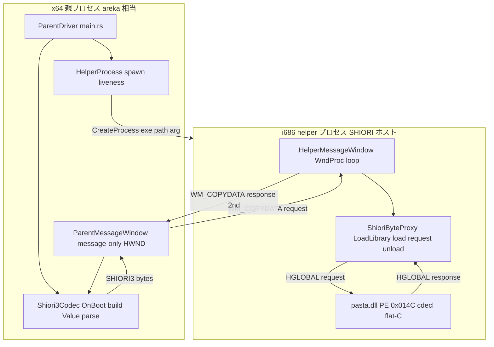
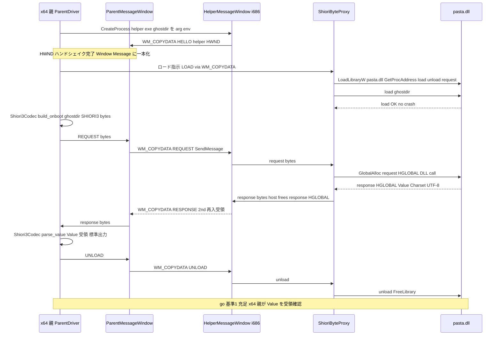
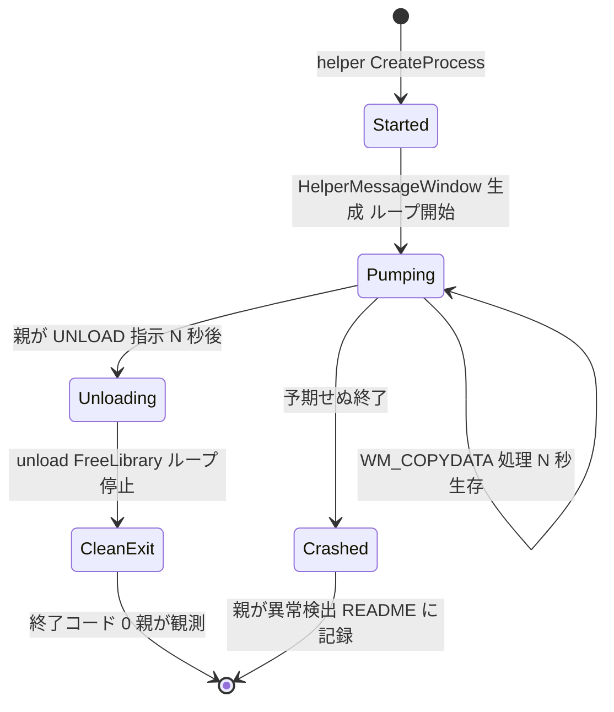

# 技術設計書: pilot-shiori-host-32

> **種別: 先進坑（pilot・使い捨て）。** 成果物はコードではなく**知見（go／違う／直す ＋ 学び）**。一次記録は `crates/pilot/examples/shiori-host-32/README.md`（3 幕）。
> 規律正本: [.kiro/steering/two-tunnel.md](../../steering/two-tunnel.md)／設計判断正本: [doc/COMPAT_ARCHITECTURE.md §5](../../../doc/COMPAT_ARCHITECTURE.md)／go 基準宿主: [.kiro/steering/roadmap.md](../../steering/roadmap.md)。
> 本書は self-contained な reviewer 成果物。調査ログ・選択肢比較の生データは [research.md](research.md) にある。

## Overview

本先進坑は M1 唯一の耐力壁——「**x64 areka が emo2 の 32bit `pasta.dll`（PE Machine 0x014C）を駆動できるか**」——を、使い捨ての最小探索コードで一点突破検証し、開発者の **go 判定**を得るための実走実験である。x64 プロセスへ 32bit DLL を in-proc ロードすることは不可能ゆえ、SHIORI を 32bit 別プロセス（helper）でホストし、自前 IPC で x64 親と橋渡しする機構（host-32）の**実現可能性のみ**を確かめる。

設計の中核判断は IPC 方式の確定であり、本設計は **WM_COPYDATA（Window Message 一本化）** を採用する。helper は `wintf-winmsg-executor`（i686 ビルド実証済・research.md §6）でメッセージ窓とループを持ち、x64 親からの WM_COPYDATA リクエストをその WndProc で同期受領し、応答を 2nd WM_COPYDATA で返す。helper は SHIORI3 ロジックを一切持たない**バイト proxy**に徹し、SHIORI/3.0 リクエストの組み立てと `Value:` parse は **x64 親側**で行う（本坑 x64 過去互換 `IShiori` アダプタのミニチュア）。

成果物は production コードではなく知見である。本先進坑は使い捨て品質で進めるが、**葉ノード隔離（命綱）だけは厳守**する。production クレート（wintf/dola/areka/shiori-abi）は本先進坑コードに依存してはならない。

### Goals

- x64 親が 32bit `pasta.dll` を `load(ghostdir) → request(OnBoot) → Value 受領 → unload` の 1 往復成功させ、**x64 親プロセスが `Value:` 文字列を受領・確認**できる（go 基準 (1) 充足）。
- 窓持ち SHIORI 対応の自前メッセージループが helper プロセス側で N 秒安定生存し、その後 clean unload できる（go 基準 (2) 充足）。
- 検証結果（go／違う／直す ＋ 学び ＋ 日付）を README 3 幕に一次記録し、本坑 `areka-P0-host32-*` 群への traceability を確立する。

### Non-Goals

- 内部 ABI `IShiori`（COM）面への接続（本坑 `areka-P0-host32-request` 領分・go 基準は「x64 親が `Value:` 受領」で充足）。
- SAORI 同居（emo2 は `pasta.dll` 1 個のみ・SAORI 不使用）。
- `OnBoot` 以外の SHIORI イベント網羅（`OnSecondChange` / `OnMouseDoubleClick` 等は本坑領分）。
- charset 多様性（emo2 は UTF-8 固定。Shift_JIS は後続）。
- production 品質のマーシャリング堅牢性・本坑 host-32 トラックの実装そのもの（go 後に知見を見て一から綺麗に掘り直す。コピペ donor 流用禁止）。

## Boundary Commitments

### This Spec Owns

- `crates/pilot/examples/shiori-host-32/` 配下の使い捨て探索コード一式（親 x64 example エントリ＋32bit helper バイナリ）。
- x64 親 ⇄ 32bit helper の **WM_COPYDATA ベース IPC**（HWND ハンドシェイク・request/response・タイムアウト・プロセス生存監視）。
- 32bit helper 内の `pasta.dll` 動的ロードと `load`/`unload`/`request` flat-C エントリ解決・呼び出し（バイト proxy）。
- x64 親側での SHIORI/3.0 `OnBoot` リクエスト組み立てと `Value:` parse（UTF-8）。
- helper 側の `wintf-winmsg-executor` メッセージループの N 秒生存 → clean unload 確認。
- README 3 幕への検証結果一次記録（go 基準 (1)(2) の充足状況含む）。

### Out of Boundary

- 本坑 host-32 トラック（`areka-P0-host32-ipc` / `-shiori-load` / `-request` / `-lifecycle`）の実装。
- 内部 ABI `IShiori`（COM）面の配線・HSTRING マーシャリング。
- SAORI ブリッジ・`OnBoot` 以外のイベント・charset 交渉（emo2 未使用ゆえ M1 対象外）。
- emo2 の脳の中身（`.pasta`/`.lua`/`pasta.toml`/budoux/縦書き）の解釈（すべて `pasta.dll` の腹の中）。
- SERIKO 描画・さくらスクリプト解釈・バルーン描画（別エンジントラック）。

### Allowed Dependencies

- **検疫所構造**: `crates/pilot`（空 lib ＋ examples-only）を受け皿に使う。探索コードは `examples/shiori-host-32/` のみに置く。
- **探索依存（使い捨て）**: `wintf-winmsg-executor` (=0.0.5)・`windows` (0.62.2)・`windows-core` (0.62.2)・`event-listener` (5)。いずれも `crates/pilot/Cargo.toml` に既存。すべて i686 ビルド実証済（research.md §6）。
- **検証フィクスチャ**: `crates/pilot/examples/shiori-host-32/fixtures/emo2/`（リポジトリ取り込み済）。ghostdir = `fixtures/emo2/ghost/master/`。
- **参照のみ（依存しない）**: `crates/shiori-abi`（最終橋渡し先の内部契約・方向性確認のみ）／`crates/pilot/examples/wintf-winmsg-executor`（メッセージループ運用知見の発想元・コピペ donor 禁止）。
- **禁止（命綱）**: いかなる production クレート（wintf/dola/areka/shiori-abi）も本先進坑コードに依存してはならない（葉ノード隔離・inbound ゼロ）。

### Revalidation Triggers

本先進坑は使い捨てゆえ「下流の再検証」概念は本坑とは異なるが、次の変化は **go 判定の前提**または**本坑への知見転用の前提**を揺るがすため、発生時は README とこの設計を見直す。

- WM_COPYDATA 往復が i686↔x64 で成立しない実走結果が出た場合（IPC 方式の再選択＝named pipe へ）。
- `pasta.dll` の `request` エクスポートが cdecl flat-C でない／HGLOBAL 所有権規約が想定と異なる実挙動を示した場合。
- `wintf-winmsg-executor` を helper（i686）で実行時に窓生成/メッセージループが成立しない場合（raw Win32 ループへ後退）。
- go 基準 (1) または (2) のいずれかが満たせない場合（本坑トラックは BLOCKED のまま・README に「違う／直す」＋学びを記録）。

## Architecture

### Existing Architecture Analysis

本先進坑が橋渡しする先の**設計判断**は既に確定している（流用するのは判断と構造であって、コードではない）。

- **内部唯一 ABI = `IShiori`（COM, HSTRING/UTF-16）**（COMPAT §5）。areka 本体は常に `IShiori` だけを握り、native/過去互換の分岐は生成経路だけに出る。本先進坑は go 基準を「x64 親が `Value:` 受領」で充足とし、この COM 面には**触れない**（接続は本坑領分）。
- **過去互換経路 = 32bit Rust ホスト**（COMPAT §5）。本物の SHIORI DLL を `LoadLibraryW`＋`GetProcAddress` で実行時ロード（cdecl flat-C `load`/`unload`/`request`）、HGLOBAL 所有権はホスト内に閉じ、自前 IPC でバイト列を運び、自前メッセージループで窓持ち SHIORI を満たす。本先進坑はこの判断の**実現可能性一点突破検証**に徹する。
- **検疫所構造**（two-tunnel）: `crates/pilot` は空 lib ＋ examples-only。Cargo の `examples/` は他クレートから依存できないため、葉ノード隔離が構造的に担保される。

#### 用語（SHIORI4 / SHIORI3・research.md §5.4）

| 用語 | 定義 | 流れる場所 |
|------|------|------------|
| **SHIORI4** | areka 正準 content（構造化）。`IShiori` 境界を流れる**不透明 HSTRING** | x64・本先進坑では扱わない（COM 面は対象外） |
| **SHIORI3** | レガシーワイヤ形式（`key: value` CRLF ＋空行終端・SHIORI/3.0） | x64 親が組立/parse・helper はバイト proxy として通すだけ |

本先進坑では SHIORI4⇄SHIORI3 変換は登場しない（COM 面が対象外ゆえ）。x64 親が SHIORI3 を**直接**組み立て、応答 SHIORI3 から `Value:` を parse する。本坑では同変換が x64 過去互換 `IShiori` アダプタ（`IShiori` の下・IPC の上）に入るが、本先進坑はそのミニチュアとして「helper=バイト proxy／x64=SHIORI3 組立・parse」の形だけ先取りする。

### Architecture Pattern & Boundary Map

**選択パターン**: 2 プロセス・single-in-flight 同期 request/response。トランスポートは Window Message（WM_COPYDATA）一本化。



**Architecture Integration**:

- **選択パターンと根拠**: WM_COPYDATA single-in-flight。SHIORI legacy は pull 専用・payload 小（数百 B〜数 KB）ゆえ全二重/push/大データが不要（roadmap・COMPAT §89）。helper のメッセージ窓 WndProc へ OS が同期配送するため、overlapped I/O・reader スレッド・手動フレーミング（`cbData` が長さ）がすべて不要になる（research.md §3.1.1）。
- **責務分離（マージ競合回避）**: x64 親＝プロセス管理＋SHIORI3 組立/parse＋IPC 送出。helper＝メッセージ窓＋ループ＋バイト proxy（`pasta.dll` 駆動）。両者は別ターゲットビルドの別バイナリで物理分離され、責務境界が明確。
- **跨ビットネス規約**: 跨ぐのは**生バイト列のみ**。HWND は USER ハンドルゆえ 32bit 有意（x64 は zero/sign-extend）・WM_COPYDATA は OS が `COPYDATASTRUCT`＋`lpData` を跨ビットネス marshal・`dwData`(ULONG_PTR) はタグ用途で低 32bit のみ使用・**ポインタ/HANDLE/struct は payload に載せない**（research.md §3.1.1 / §5.4）。
- **採用したパターンの保全**: `wintf-winmsg-executor` のメッセージ窓/ループ運用を helper でも踏襲（i686 実証済）。raw Win32 ループ自作は不要。
- **Steering 整合**: Rust 2024・32bit/x64 境界保持（tech.md）・葉ノード隔離（two-tunnel）・WM_COPYDATA 強推奨（requirements Boundary Context／research.md §3.1.1 確定）。

### Technology Stack

| Layer | Choice / Version | Role in Feature | Notes |
|-------|------------------|-----------------|-------|
| CLI / Entry | Rust 2024 example (`pilot` crate) | 親 x64 example エントリ＋helper i686 バイナリ | `_template` からコピー・`main.rs` 必須 |
| Messaging / IPC | Win32 `WM_COPYDATA`（`windows` 0.62.2） | x64⇄i686 の request/response・HWND ハンドシェイク | OS marshalled・SendMessage 専用・`cbData`=長さ |
| Window / Loop | `wintf-winmsg-executor` (=0.0.5) | helper の message-only 窓生成とメッセージループ | i686 ビルド実証済（research.md §6） |
| Process | `std::process::Command`（std） | x64 親が i686 helper exe を起動・終了コード/生存監視 | 子終了 = 異常検出フック |
| SHIORI Brain | emo2 `pasta.dll`（PE 0x014C・SHIORI/3.0・UTF-8） | 検証ターゲット。`load`/`unload`/`request` cdecl flat-C | fixtures 取り込み済・export 確認済（research.md §6） |
| Cross-thread | `event-listener` (5) | （任意）helper 内の停止シグナル等 | pilot 既存依存・必須ではない |

> ビルド構成は **2 段ビルド**（親 x64＋helper i686・Option B）。i686 target は導入済・MSVC x86 リンカ在（research.md §6 実証）。ビルドは **PowerShell**（Git Bash の GNU `link.exe` が MSVC link を遮蔽する既知トラップ・MEMORY arm64-windows-build と同根）。worktree 実ビルド前に `git submodule update --init`（`vendors/pasta` 未 populate 回避）。

## File Structure Plan

### Directory Structure

```
crates/pilot/examples/shiori-host-32/
├── main.rs                 # 親 x64 example エントリ（`cargo run -p pilot --example shiori-host-32`）。
│                           #   コンポーネント: ParentDriver（全体駆動）＋ ProcessHost（helper 起動/監視）。
│                           #   ParentDriver: ProcessHost で helper 起動 → 親メッセージ窓生成 →
│                           #   HWND ハンドシェイク → Shiori3Codec で OnBoot 組立 →
│                           #   IpcChannel で WM_COPYDATA 送出 → Value 受領・標準出力 → unload 指示 → 集計。
├── helper.rs               # i686 helper バイナリのエントリ（[[example]] crate-type bin・i686 ビルド）。
│                           #   コンポーネント: HelperMessageWindow＋ShioriByteProxy。
│                           #   HelperMessageWindow 生成 → 親へ hello(HWND) → WndProc で
│                           #   WM_COPYDATA request 受領 → ShioriByteProxy 駆動 →
│                           #   応答を 2nd WM_COPYDATA で親へ返す → メッセージループ N 秒生存。
├── ipc.rs                  # コンポーネント: IpcChannel（WM_COPYDATA プロトコル・親/helper 共有）。
│                           #   メッセージ種別（dwData タグ: HELLO/REQUEST/RESPONSE/UNLOAD）、
│                           #   ペイロード規約（生バイト列・固定ヘッダなし・cbData=長さ）、
│                           #   HWND ハンドシェイクのバイト表現（u32 LE）、SendMessageTimeout。
├── shiori3.rs              # x64 親側の SHIORI3 組立/parse（helper は使わない）。
│                           #   build_onboot(ghostdir) → SHIORI/3.0 リクエスト文字列、
│                           #   parse_value(response_bytes) → Value 抽出（UTF-8）。
├── README.md               # 一次記録（3 幕）。_template からコピーして検証結果を埋める。
└── fixtures/emo2/          # 取り込み済（変更なし）。ghostdir = fixtures/emo2/ghost/master/。
```

> **モジュール物理配置の注**: 先進坑の使い捨て品質ゆえ、`ipc.rs`/`shiori3.rs` を `main.rs`/`helper.rs` から `#[path]`/`mod` で取り込むか、各バイナリにインライン展開するかは実装裁量（葉ノード隔離さえ崩さなければよい）。helper を `examples/` の 2 本目バイナリにする具体（別 `[[example]]` か `src/bin` 相当か）は実装時に確定するが、**i686 別ターゲットビルドの別バイナリ**である点は固定（要件 7.5・research.md §3.2 Option B）。

### Modified Files

- `crates/pilot/examples/shiori-host-32/README.md` — `_template/README.md` からコピー後、3 幕（動機 → 概要・実行法 → 検証結果）を埋める。動機の幕で本坑 `areka-P0-host32-*` 群を名指し。
- `crates/pilot/Cargo.toml` — 既存依存（`wintf-winmsg-executor`/`windows`/`windows-core`/`event-listener`）で足りる想定。helper を 2 本目バイナリにするための `[[example]]`/`[[bin]]` 宣言追加が必要なら最小限で（葉ノード隔離・32bit 可搬性を崩さない）。

> 各ファイルは単一責務。`ipc.rs`＝トランスポート規約、`shiori3.rs`＝ワイヤ形式の組立/parse、`main.rs`＝親オーケストレーション、`helper.rs`＝helper オーケストレーション＋DLL 駆動。依存方向は **ipc → (shiori3, helper-proxy)** を上位が使う向き（下位は上位を import しない）。

## System Flows

### go 基準 (1): 1 往復シーケンス（load → OnBoot → Value → unload）



**フロー上の判断**:

- **HWND ハンドシェイク**: 別 side-channel（pipe 等）を混ぜず Window Message に統一。親 HWND を helper 起動引数で seed し、helper が自 HWND を HELLO（1st WM_COPYDATA）で返す。
- **再入受領**: 親は `SendMessage(helperHwnd, WM_COPYDATA, REQUEST)` で待機中も、helper からの応答 sent message（2nd WM_COPYDATA）を再入受領する。実装は `SendMessageTimeout` でタイムアウト併用（要件 2.3）。
- **HGLOBAL 所有権**: SHIORI3 規約（要求 HGLOBAL は DLL が解放／応答 HGLOBAL はホストが解放）は **helper プロセス内に閉じる**。HGLOBAL は 32bit ローカルゆえ IPC を跨がない（COMPAT §85・research.md §5.4）。
- **`OnBoot` 1 種**: 橋の往復機構検証ゆえ `OnBoot` で代表（`OnFirstBoot` は別送しない・往復経路は同一・要件 4.1）。

### go 基準 (2): メッセージループ生存 → clean unload



**フロー上の判断**:

- **メッセージループ**: helper は `wintf-winmsg-executor` の窓＋ループで N 秒回り続ける（窓持ち SHIORI 対応・要件 5.1）。N の値と合否観測方法（終了コード／ログ／ループ停止確認）は README「検証結果」幕に記す。本設計は **終了コード 0 ＋ 親側観測ログ**を一次記録とする方針を推奨（research.md §5.3 item 6）。
- **clean unload**: N 秒後 UNLOAD 受領でループ停止 → `unload` → `FreeLibrary` → プロセス正常終了。
- **異常検出**: 親は `std::process::Command` の子ハンドルで終了コード/生死を監視。予期せぬ終了は IPC レイヤと直交して検出し、観測可能な失敗として README に記録（要件 1.4・2.4）。

## Requirements Traceability

| Requirement | Summary | Components | Interfaces / Contracts | Flows |
|-------------|---------|------------|------------------------|-------|
| 1.1 | helper 別プロセス起動 | ProcessHost | `spawn(helper_exe, ghostdir)` | go(1) 起動 |
| 1.2 | helper 生存監視 | ProcessHost | child handle 監視 | go(2) Crashed 検出 |
| 1.3 | 正常完了で clean shutdown | ProcessHost / HelperMessageWindow | UNLOAD → exit 0 | go(2) CleanExit |
| 1.4 | 予期せぬ終了の検出・記録 | ProcessHost | 終了コード観測 | go(2) Crashed |
| 1.5 | 32bit/x64 分離保持 | ファイル構成（別ターゲットビルド） | 2 段ビルド | — |
| 2.1 | メッセージ境界送受信 | IpcChannel | WM_COPYDATA `cbData`=長さ | go(1) REQUEST |
| 2.2 | 応答を親が受領 | IpcChannel / ParentMessageWindow | 2nd WM_COPYDATA | go(1) RESPONSE |
| 2.3 | タイムアウト処理 | IpcChannel | `SendMessageTimeout` | go(1) 失敗時 |
| 2.4 | IPC と併せ生存監視 | ProcessHost ＋ IpcChannel | child handle ＋ msg | go(2) |
| 3.1 | `pasta.dll` 動的ロード | ShioriByteProxy | `LoadLibraryW` | go(1) LOAD |
| 3.2 | `load`/`unload`/`request` 解決 | ShioriByteProxy | `GetProcAddress`＋transmute | go(1) LOAD |
| 3.3 | `load(ghostdir)` 呼出・無 crash | ShioriByteProxy | `load(ghostdir)` cdecl | go(1) load OK |
| 3.4 | ロード/解決失敗の観測 | ShioriByteProxy | エラー → IPC で親へ | go(1) 失敗時 |
| 4.1 | SHIORI/3.0 `OnBoot` 組立 | Shiori3Codec | `build_onboot(ghostdir)` | go(1) build |
| 4.2 | 応答から `Value:` 抽出・marshal | Shiori3Codec / ShioriByteProxy | `parse_value(bytes)` | go(1) RESPONSE |
| 4.3 | `Value:` を x64 親へ返送・受領 | IpcChannel / Shiori3Codec | 2nd WM_COPYDATA | go(1) parse |
| 4.4 | charset = UTF-8 | Shiori3Codec | UTF-8 固定 | go(1) |
| 4.5 | 1 往復成功を go(1) として観測 | ParentDriver | 標準出力＋判定 | go(1) 完了 |
| 5.1 | 窓持ち SHIORI 対応ループ生存 | HelperMessageWindow | `wintf-winmsg-executor` ループ | go(2) Pumping |
| 5.2 | N 秒生存 → clean unload | HelperMessageWindow / ProcessHost | N 秒運転 | go(2) |
| 5.3 | unload 要求でループ停止・clean unload | HelperMessageWindow | UNLOAD → unload | go(2) Unloading |
| 5.4 | ループ生存・clean unload を go(2) 観測 | ParentDriver | 終了コード＋ログ | go(2) CleanExit |
| 6.1 | README 3 幕に一次記録 | README.md | 動機/概要/検証結果 | — |
| 6.2 | 動機の幕で本坑名指し | README.md | `areka-P0-host32-*` | — |
| 6.3 | go/違う/直す ＋ 学び ＋ 日付 | README.md | 検証結果の幕 | — |
| 6.4 | go(1)(2) 充足状況を反映 | README.md / ParentDriver | 判定結果 | go(1) go(2) |
| 6.5 | go 判定は人間判断 | README.md | 判断材料提供に徹する | — |
| 7.1 | examples 隔離（1 仕様 1 フォルダ） | ファイル構成 | `examples/shiori-host-32/` | — |
| 7.2 | production 非依存（葉ノード隔離） | crates/pilot 構造 | inbound ゼロ | — |
| 7.3 | `_template` コピー起点 | main.rs / README.md | コピー | — |
| 7.4 | 緩品質・隔離厳守 | 全体 | 使い捨て規律 | — |
| 7.5 | Rust 2024・32bit/x64 境界保持 | 2 段ビルド | i686 helper / x64 親 | — |

## Components and Interfaces

| Component | Domain/Layer | Intent | Req Coverage | Key Dependencies (P0/P1) | Contracts |
|-----------|--------------|--------|--------------|--------------------------|-----------|
| ParentDriver | x64 親オーケストレーション | 全体駆動・go 基準判定・標準出力 | 4.5, 5.4, 6.4 | ProcessHost (P0), IpcChannel (P0), Shiori3Codec (P0) | Service |
| ProcessHost | x64 プロセス管理 | helper 起動・生存監視・clean/異常終了観測 | 1.1-1.4, 2.4 | `std::process` (P0) | Service / State |
| IpcChannel | IPC（親/helper 共有規約） | WM_COPYDATA request/response・ハンドシェイク・タイムアウト | 2.1-2.3, 4.3 | `windows` WM_COPYDATA (P0) | Service |
| Shiori3Codec | x64 ワイヤ形式 | `OnBoot` 組立・`Value:` parse（UTF-8） | 4.1, 4.2, 4.4 | — | Service |
| HelperMessageWindow | i686 helper ループ | message-only 窓・WndProc・N 秒生存 | 5.1-5.3 | `wintf-winmsg-executor` (P0) | Service / State |
| ShioriByteProxy | i686 DLL 駆動 | `LoadLibrary`＋flat-C 解決＋HGLOBAL request | 3.1-3.4, 4.2 | `pasta.dll` (P0) | Service |
| README3Act | 一次記録 | go/違う/直す ＋ 学び ＋ 日付・本坑 traceability | 6.1-6.5 | — | — |

### x64 親レイヤ

#### ProcessHost

| Field | Detail |
|-------|--------|
| Intent | i686 helper プロセスを起動し、生存を監視し、clean / 異常終了を観測する |
| Requirements | 1.1, 1.2, 1.3, 1.4, 2.4 |

**Responsibilities & Constraints**
- helper exe を `std::process::Command` で起動し、ghostdir と親 HWND を arg/env で渡す。
- 子プロセスハンドルで終了コード/生死を監視（IPC レイヤと直交した生存監視・要件 2.4）。
- 正常完了時は UNLOAD → 終了コード 0 を観測。予期せぬ終了は異常として観測可能な形（終了コード・ログ）で記録（要件 1.4）。
- 32bit/x64 分離を崩さない（helper は別ターゲットビルドの別バイナリ・要件 1.5）。

**Dependencies**
- Outbound: IpcChannel — helper 起動後の HWND ハンドシェイク（P0）
- External: `std::process::Command` — 子プロセス起動・wait（P0）

**Contracts**: Service / State

##### Service Interface
```rust
struct HelperHandle {
    child: std::process::Child,
    helper_hwnd: Option<HWND>, // HELLO 受領後に確定
}

impl ProcessHost {
    /// i686 helper exe を起動する。helper_exe は 2 段ビルド成果物のパス。
    fn spawn(helper_exe: &Path, ghostdir: &Path, parent_hwnd: HWND) -> std::io::Result<HelperHandle>;
    /// 子の生死を確認する（非ブロッキング）。Some(code) で終了・None で稼働中。
    fn poll_exit(handle: &mut HelperHandle) -> Option<i32>;
    /// clean shutdown を待つ（UNLOAD 送出後）。終了コードを返す。
    fn wait_clean(handle: HelperHandle) -> std::io::Result<i32>;
}
```
- Preconditions: `helper_exe` が i686 ビルド済で存在する。`ghostdir` が `fixtures/emo2/ghost/master/`。
- Postconditions: `spawn` 成功で helper プロセスが稼働。`wait_clean` で終了コードが確定。
- Invariants: helper は常に別プロセス（in-proc ロードしない）。

**Implementation Notes**
- Integration: helper exe パスは README「実行法」幕に明記（2 段ビルド手順）。
- Validation: `poll_exit` の None/Some で go(2) の Crashed/CleanExit を観測。
- Risks: helper exe パス解決（親 cwd 相対 or 環境変数）。先進坑ゆえ手動指定で可。

#### IpcChannel

| Field | Detail |
|-------|--------|
| Intent | WM_COPYDATA による request/response と HWND ハンドシェイク・タイムアウトを提供する |
| Requirements | 2.1, 2.2, 2.3, 4.3 |

**Responsibilities & Constraints**
- 親 → helper は `SendMessage(helperHwnd, WM_COPYDATA, parentHwnd, &COPYDATASTRUCT)`。helper → 親は 2nd WM_COPYDATA。
- メッセージ境界は `cbData`（バイト長）で OS が画定（手動フレーミング不要・要件 2.1）。
- 跨ぐのは生バイト列のみ。`dwData`(ULONG_PTR) はメッセージ種別タグで**低 32bit のみ**使用。HWND は u32 LE で受け渡し（跨ビットネス安全・research.md §3.1.1）。
- タイムアウトは `SendMessageTimeout` で実現（所定時間内に応答が得られなければ失敗・ハングしない・要件 2.3）。

**Dependencies**
- External: `windows` 0.62.2 `WM_COPYDATA`/`COPYDATASTRUCT`/`SendMessageTimeout`（P0）

**Contracts**: Service

##### Service Interface
```rust
/// dwData に載せるメッセージ種別タグ（≤32bit・跨ビットネス安全）。
#[repr(u32)]
enum MsgTag { Hello = 1, Load = 2, Request = 3, Response = 4, Unload = 5 }

impl IpcChannel {
    /// WM_COPYDATA を送り、応答（helper→親の 2nd WM_COPYDATA）を待つ。
    /// timeout 内に応答がなければ Err(Timeout)。
    fn send_request(
        target_hwnd: HWND,
        self_hwnd: HWND,
        tag: MsgTag,
        payload: &[u8],
        timeout: Duration,
    ) -> Result<Vec<u8>, IpcError>;
}

enum IpcError { Timeout, SendFailed, PeerGone }
```
- Preconditions: `target_hwnd` が有効（ハンドシェイクで確定）。payload は生バイト列（ポインタ/HANDLE/struct を含まない）。
- Postconditions: 成功で応答バイト列を返す。失敗は観測可能な `IpcError`。
- Invariants: single-in-flight（同時に 1 往復のみ）。SendMessage 専用（PostMessage 不可）。

**Implementation Notes**
- Integration: 親/helper で `ipc.rs` を共有しプロトコルの単一ソースとする。
- Validation: 1 往復の実走観測自体が go 基準 (1) の一部（research.md §3.1.1）。
- Risks: 跨ビットネス HWND 表現の取り違え（u32 LE 規約を厳守）。先進坑で実走確認する。

#### Shiori3Codec

| Field | Detail |
|-------|--------|
| Intent | SHIORI/3.0 `OnBoot` リクエストを組み立て、応答から `Value:` を parse する（x64 親側） |
| Requirements | 4.1, 4.2, 4.4 |

**Responsibilities & Constraints**
- `build_onboot(ghostdir)` で SHIORI/3.0 形式（`key: value` CRLF ＋空行終端）の `OnBoot` リクエスト 1 種を生成（UTF-8）。
- `parse_value(response_bytes)` で応答 SHIORI3 から `Value:`（emo2 起動挨拶さくらスクリプト本体）を抽出（UTF-8）。
- helper は SHIORI3 ロジックを**一切持たない**。本コンポーネントは x64 親に閉じる（research.md §5.4・本坑 x64 アダプタのミニチュア）。

**Dependencies**
- Inbound: ParentDriver — OnBoot 組立・Value parse の呼び出し元（P0）
- External: なし（標準ライブラリの文字列処理のみ）

**Contracts**: Service

##### Service Interface
```rust
impl Shiori3Codec {
    /// SHIORI/3.0 OnBoot リクエストを UTF-8 バイト列で生成。
    /// 例: "GET SHIORI/3.0\r\nID: OnBoot\r\nCharset: UTF-8\r\nSender: arekapilot\r\n...\r\n\r\n"
    fn build_onboot(ghostdir: &Path) -> Vec<u8>;
    /// 応答バイト列から Value: 行の値を抽出（UTF-8）。
    fn parse_value(response: &[u8]) -> Option<String>;
}
```
- Preconditions: `response` は helper が `request` 経由で得た生バイト列（UTF-8・emo2）。
- Postconditions: `parse_value` は `Value:` があれば Some(さくらスクリプト本体)。
- Invariants: charset は emo2 の UTF-8 固定（要件 4.4）。

**Implementation Notes**
- Integration: SHIORI/3.0 ヘッダの根拠は `doc/emo2-conformance-scope.md §1`。
- Validation: `Value:` 受領を標準出力に出し、go 基準 (1) 充足を人間が確認できるようにする。
- Risks: emo2 応答ヘッダの細部（必須ヘッダ・改行）。実物 DLL の応答で実走確認する。

### i686 helper レイヤ

#### HelperMessageWindow

| Field | Detail |
|-------|--------|
| Intent | message-only 窓を持ち、WndProc で WM_COPYDATA を処理し、N 秒メッセージループを回す |
| Requirements | 5.1, 5.2, 5.3 |

**Responsibilities & Constraints**
- `wintf-winmsg-executor`（i686 ビルド実証済）で message-only 窓を生成し、メッセージループを回す（窓持ち SHIORI 対応・要件 5.1）。
- 起動時に親へ HELLO（自 HWND を u32 LE）を 1st WM_COPYDATA で返す。
- WndProc で REQUEST(WM_COPYDATA) を受領 → ShioriByteProxy を駆動 → 応答を 2nd WM_COPYDATA で親へ返す。
- N 秒安定生存 → UNLOAD 受領でループ停止 → clean unload（要件 5.2, 5.3）。

**Dependencies**
- Inbound: IpcChannel（親） — WM_COPYDATA request の受け手（P0）
- Outbound: ShioriByteProxy — DLL 駆動（P0）
- External: `wintf-winmsg-executor` 0.0.5 — 窓生成・メッセージループ（P0・i686 実証済 research.md §6）

**Contracts**: Service / State

##### State Management
- State model: `Started → Pumping → Unloading → CleanExit`（／`Crashed`）。
- Persistence & consistency: 状態はプロセスメモリのみ（永続化なし）。
- Concurrency strategy: single-in-flight。WndProc は単一スレッドで同期処理（reader スレッド不要・research.md §3.1.1）。

**Implementation Notes**
- Integration: `pilot/examples/wintf-winmsg-executor` のループ運用知見を**発想元として参照**（コピペ donor 禁止・要件 5.3／two-tunnel）。
- Validation: N 秒運転と clean unload の成否を終了コード＋ログで親が観測（go 基準 (2)）。
- Risks: i686 での `wintf-winmsg-executor` 実行時挙動（ビルドは実証済だが実走は本先進坑で初確認）。不成立なら raw Win32 ループへ後退（Revalidation Trigger）。

#### ShioriByteProxy

| Field | Detail |
|-------|--------|
| Intent | `pasta.dll` を動的ロードし flat-C エントリを解決して request を駆動するバイト proxy |
| Requirements | 3.1, 3.2, 3.3, 3.4, 4.2 |

**Responsibilities & Constraints**
- `LoadLibraryW(pasta.dll)`＋`GetProcAddress` で `load`/`unload`/`request`（cdecl flat-C・research.md §6 で装飾なし確認済）を解決し関数ポインタへ transmute。
- `load(ghostdir)` を呼び、クラッシュせず完了させる（要件 3.3）。**ghostdir は ANSI(Shift_JIS) でエンコード**して HGLOBAL 化する（pasta `load` は `to_ansi_str()` で ANSI decode・実ソース確認）。
- `request` は受信バイト列を `GlobalAlloc` で HGLOBAL 化して DLL へ渡し、応答 HGLOBAL からバイト列を取り出す。**HGLOBAL 所有権規約**（要求 HGLOBAL は DLL 解放／応答 HGLOBAL はホスト解放）は helper プロセス内に閉じる（COMPAT §85・research.md §5.4）。
- ロード/解決失敗は観測可能な形で親へ返す（要件 3.4）。**SHIORI3 ロジックは持たない**（バイト proxy）。

**Dependencies**
- Inbound: HelperMessageWindow — REQUEST 受領時に駆動（P0）
- External: `pasta.dll`（emo2・PE 0x014C・cdecl flat-C・UTF-8）（P0）
- External: `windows` 0.62.2 `LoadLibraryW`/`GetProcAddress`/`GlobalAlloc`（P0）

**Contracts**: Service

##### Service Interface
```rust
// flat-C cdecl シグネチャ（pasta 実ソース pasta_shiori/src/windows.rs で確定・2026-06-30）。
// 返り値は Rust `bool`(1 byte) で Win32 BOOL(i32) ではない（呼び出し側も bool で受ける）。
type LoadFn    = unsafe extern "C" fn(hdir: HGLOBAL, len: usize) -> bool;        // hdir は ANSI(Shift_JIS)
type UnloadFn  = unsafe extern "C" fn() -> bool;
type RequestFn = unsafe extern "C" fn(req: HGLOBAL, len: *mut usize) -> HGLOBAL; // req は UTF-8

struct ShioriEntries { load: LoadFn, unload: UnloadFn, request: RequestFn }

impl ShioriByteProxy {
    fn load_dll(dll_path: &Path) -> Result<ShioriEntries, ProxyError>;
    /// ghostdir を ANSI(Shift_JIS) で HGLOBAL 化して load。要求 HGLOBAL は DLL(callee) が解放。
    fn shiori_load(e: &ShioriEntries, ghostdir: &Path) -> Result<(), ProxyError>;
    /// request バイト列を HGLOBAL 化して渡し、応答 HGLOBAL からバイト列を取り出す。
    /// 応答 HGLOBAL は本関数（ホスト側）が GlobalFree する。
    fn shiori_request(e: &ShioriEntries, req: &[u8]) -> Result<Vec<u8>, ProxyError>;
    fn shiori_unload(e: &ShioriEntries) -> Result<(), ProxyError>;
}

enum ProxyError { LoadLibraryFailed, EntryNotFound, LoadFailed, RequestFailed }
```
- Preconditions: `dll_path` は fixtures の `pasta.dll`（PE 0x014C）。i686 プロセス内で実行。
- Postconditions: `shiori_request` で応答バイト列（UTF-8 SHIORI3）を返す。所有権規約が守られる。
- Invariants: `unsafe` 境界は本コンポーネントに集約。HGLOBAL は IPC を跨がない（プロセスローカル）。

**Implementation Notes**
- Integration（実ソース確定・2026-06-30）: `load`/`unload`/`request` の ABI・所有権・charset は pasta 実ソース `pasta_shiori/src/windows.rs` で**確定**（もはや想定でない・議題 1 解決）。`load(hdir: HGLOBAL, len) -> bool`（hdir は **ANSI/Shift_JIS** dir・callee が解放）／`unload() -> bool`／`request(req: HGLOBAL, len: *mut usize) -> HGLOBAL`（req は **UTF-8**・callee が req を解放／返り値 HGLOBAL は **caller(ホスト) が解放**）。返り値は Rust `bool`(1 byte)。OnBoot は `GET SHIORI/3.0`（pasta は GET=block-on-reply／NOTIFY=即 204・空/不正は 204）。
- **charset 非対称（重要）**: `load` の ghostdir は **ANSI(Shift_JIS)** エンコード（pasta `to_ansi_str()`）・`request` は **UTF-8**（`to_utf8_str()`）。先進坑の ghostdir は ASCII パスゆえ ANSI≡UTF-8 バイト等価で実害なしだが、正準は ANSI ゆえ load 引数は ANSI 化する（本坑/非 ASCII パス対応）。
- Validation: `load` 無 crash 完了（3.3）・`request` 応答取得（4.2）を IPC で親へ返し観測。
- Risks: 静的 ABI は実ソースで確定済。残るは**実行時挙動**（`load`→`spawn_actor` のスレッド生成／`request` の block-on-reply 応答）の実走確認のみ＝先進坑の本検証そのもの。

### 一次記録レイヤ

#### README3Act

| Field | Detail |
|-------|--------|
| Intent | 検証結果を 3 幕で一次記録し go 判定の材料を提供する（判定は自動化しない） |
| Requirements | 6.1, 6.2, 6.3, 6.4, 6.5 |

**Responsibilities & Constraints（summary-only）**
- `_template/README.md` をコピーし、動機（本坑 `areka-P0-host32-*` 名指し）→ 概要・実行法（`cargo run -p pilot --example shiori-host-32`／helper の 2 段ビルド手順／nar 展開—本 fixture は取り込み済ゆえ展開済）→ 検証結果（go/違う/直す ＋ 学び ＋ 日付）を埋める。
- go 基準 (1)(2) の充足状況を検証結果の幕に反映。go 判定そのものは開発者の人間判断に委ねる（要件 6.5）。

**Implementation Note**: `.md` 書き込みはハーネス制約により親エージェントが書く or PowerShell here-string（`@'…'@`・列 0 閉じ）で UTF-8 書き込み（two-tunnel 3.6・MEMORY harness-shell-quirks）。

## Error Handling

### Error Strategy

先進坑は使い捨て品質ゆえ、エラーは**観測可能性**（go 判定材料として記録できること）を最優先とし、堅牢な回復は求めない（要件 7.4）。すべての失敗は親プロセスに到達し、標準出力／ログ／README に残る。

### Error Categories and Responses

| カテゴリ | 例 | 応答 | 観測先 |
|----------|-----|------|--------|
| ビルド前提 | i686 target 不在・MSVC x86 linker 不在 | ビルド時に露呈（実証済 GO・research.md §6） | ビルドログ |
| プロセス起動 | helper exe 不在・起動失敗 | `spawn` Err → 親が記録 | 標準出力 |
| IPC | タイムアウト・SendMessage 失敗・peer 消失 | `IpcError`（ハングしない・要件 2.3） | 標準出力／README |
| DLL ロード/解決 | `LoadLibrary`/`GetProcAddress` 失敗 | `ProxyError` → IPC で親へ（要件 3.4） | 標準出力／README |
| SHIORI request | `load` crash・`request` 失敗・`Value:` 不在 | `ProxyError`／`parse_value` None | 標準出力／README |
| helper 異常終了 | メッセージループ中の crash | 親が終了コードで検出（要件 1.4） | 終了コード／README |

### Monitoring

- 親プロセスの標準出力に各ステップ（spawn/handshake/load/request/Value/unload）の成否を出す。
- helper の終了コード（0=clean／非 0=異常）を go 基準 (2) の一次観測とする。
- 最終の go/違う/直す ＋ 学び ＋ 日付は README「検証結果」幕へ（正本・二重化しない）。

## Testing Strategy

> 先進坑の品質基準は緩い（要件 7.4）。テストの厳格さは production 品質まで求めない。検証は**実走観測**（go 基準）が主であり、自動テストは補助。本節は go 基準を満たす実走シナリオを列挙する。

### Integration / 実走シナリオ（go 基準の直接検証）

- **1 往復 happy path（go 基準 1・要件 4.5）**: 親が helper を起動 → HWND ハンドシェイク → `load(ghostdir=fixtures/emo2/ghost/master/)` → `OnBoot` 送出 → 応答 `Value:`（emo2 起動挨拶さくらスクリプト）を x64 親が受領・標準出力で確認 → unload。`Value:` 文字列が非空で得られることを判定基準とする。
- **メッセージループ N 秒生存 → clean unload（go 基準 2・要件 5.2-5.4）**: helper の `wintf-winmsg-executor` ループを N 秒回し、UNLOAD で停止 → `unload` → 終了コード 0。N 秒間ループが破綻しない（crash/deadlock なし）こと、終了コードが 0 であることを判定基準とする。
- **IPC タイムアウト（要件 2.3）**: helper を意図的に無応答にした場合、`SendMessageTimeout` が所定時間で `IpcError::Timeout` を返しハングしないことを確認。
- **helper 異常終了検出（要件 1.4・2.4）**: helper を強制終了した場合、親が終了コードで異常を検出し観測可能な形で記録することを確認。

### Unit（補助・最小）

- `Shiori3Codec::build_onboot` が SHIORI/3.0 形式（`ID: OnBoot`・`Charset: UTF-8`・CRLF ＋空行終端）を生成する。
- `Shiori3Codec::parse_value` が `Value:` 行から値を抽出し、`Value:` 不在で None を返す。
- `IpcChannel` の `dwData` タグ（`MsgTag`）が低 32bit に収まり跨ビットネス安全であること（境界値）。

### Out of Test Scope

- production 品質のマーシャリング堅牢性・全 SHIORI イベント・charset 多様性・COM `IShiori` 面（すべて本坑領分）。

## Security Considerations

- **跨プロセス信頼境界**: 親と helper は同一ユーザ・同一 integrity で起動（UIPI 非問題・research.md §3.1.1）。WM_COPYDATA payload に**ポインタ/HANDLE を載せない**ことで、跨ビットネスのアドレス誤用を構造的に排除する。
- **`unsafe` 集約**: `LoadLibrary`/`GetProcAddress`/`transmute`/`GlobalAlloc`/WM_COPYDATA の `unsafe` は ShioriByteProxy・IpcChannel に集約し、危険境界を局所化する（tech.md unsafe 隔離規約に整合・ただし先進坑ゆえ厳密文書化は緩めてよい）。
- **命綱（葉ノード隔離）**: production クレートが本先進坑コードに依存しないことを `crates/pilot` の構造（空 lib ＋ examples-only）と人手レビューで担保（two-tunnel・要件 7.2）。これがセキュリティでなく可逆性の担保である点に注意。

## Supporting References

- 設計判断正本: [doc/COMPAT_ARCHITECTURE.md §5](../../../doc/COMPAT_ARCHITECTURE.md)（SHIORI ホスティング・過去互換経路）。
- 二坑規律正本: [.kiro/steering/two-tunnel.md](../../steering/two-tunnel.md)。
- go 基準宿主: [.kiro/steering/roadmap.md](../../steering/roadmap.md)（唯一の耐力壁節）。
- emo2 実輪郭・SHIORI/3.0 根拠: `doc/emo2-conformance-scope.md §0/§1`。
- 調査ログ・選択肢比較・de-risk 実証・確定決定: [research.md](research.md)（§3.1.1 IPC 方式 / §5.4 SHIORI4-3・メモリ表現 / §6 技術調査 GO）。
