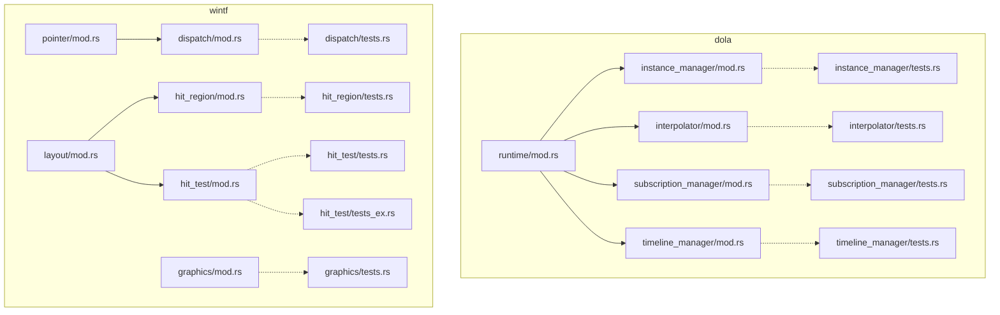
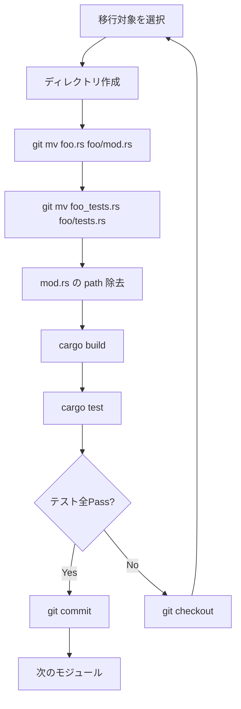

# Design Document: test-module-separation

## Overview

**Purpose**: `#[path = "xxx_tests.rs"]` パターンを Rust 標準のディレクトリモジュール構成に移行し、モジュールツリーとファイル構造の一貫性を確立する。

**Users**: プロジェクト開発者がコードベースのナビゲーション、テスト追加、コードレビューを行う際に恩恵を受ける。

**Impact**: 2クレート（`dola`, `wintf`）の9箇所のテストモジュール宣言を変更し、7つのディレクトリモジュールを新規作成する。プロダクションコードのロジック・可視性は一切変更しない。

### Goals
- 全9箇所の `#[path]` アトリビュートを除去し、`mod tests;` による標準モジュール解決に統一する
- `bitmap_source/` パターンを参考モデルとして一貫した構造を適用する
- テストカバレッジ（2645行、全テスト関数）を100%維持する

### Non-Goals
- テストコードのリファクタリング（ロジック変更、テスト追加・削除）
- プロダクションコードの可視性変更
- `Cargo.toml` の変更
- `#[path]` を使用していないモジュールの再構成

## Architecture

### Existing Architecture Analysis

現在の `#[path]` パターンは2種類の構造に分かれる:

**パターン1: フラットファイルモジュール**（対象 #1-7）
```
directory/
├── mod.rs          # mod foo; を宣言
├── foo.rs          # #[cfg(test)] #[path = "foo_tests.rs"] mod tests;
└── foo_tests.rs    # テストコード
```

**パターン2: 既存ディレクトリモジュール**（対象 #9）
```
ecs/
├── graphics/
│   └── mod.rs      # #[cfg(test)] #[path = "../graphics_tests.rs"] mod graphics_tests;
└── graphics_tests.rs
```

**参考モデル** (`bitmap_source/`):
```
bitmap_source/
├── mod.rs           # #[cfg(test)] mod tests;
├── tests.rs         # use super::*;
└── ...
```

### Architecture Pattern & Boundary Map



点線 = `#[cfg(test)]` テストモジュール関係。実線 = `mod` 宣言による親子関係。

- **Architecture Integration**: 既存のモジュールツリー構造を維持し、ファイル配置のみ変更
- **Existing patterns preserved**: `bitmap_source/` のディレクトリモジュールパターンを踏襲
- **New components rationale**: 新規コンポーネントなし。既存ファイルの再配置のみ
- **Steering compliance**: `structure.md` のモジュール独立性原則を維持。Test Naming Conventions に文書化済みの `{module}/tests.rs` パターンに準拠

### Technology Stack

| Layer | Choice / Version | Role in Feature | Notes |
|-------|------------------|-----------------|-------|
| Language | Rust 2024 Edition | モジュール解決ルール | 変更なし |
| Build | Cargo | ビルド・テスト実行 | 変更なし |
| VCS | git | ファイル移動の追跡 | `git mv` 使用 |

## Requirements Traceability

| Requirement | Summary | Components | Interfaces | Flows |
|-------------|---------|------------|------------|-------|
| 1.1 | テスト結果維持 | 全7変換対象 | — | 検証フロー |
| 1.2 | `#[path]` 完全除去 | 全7変換対象 | モジュール宣言 | — |
| 1.3 | ディレクトリモジュール化方式の統一 | 全7変換対象 | — | — |
| 1.4 | 標準モジュール解決 | 全7変換対象 | `mod tests;` 宣言 | — |
| 2.1 | テスト関数数の維持 | 全テストファイル | — | 検証フロー |
| 2.2 | `use super::*;` 維持（graphics 例外） | テストファイル | import 宣言 | — |
| 2.3 | プライベートアイテムのテスト可能性 | hit_region | — | — |
| 2.4 | `pub(crate)` アクセス維持 | dola 全対象 | — | — |
| 3.1 | 一貫したディレクトリモジュール化 | 全7変換対象 | ファイル配置 | — |
| 3.2 | `mod.rs` + `tests.rs` 構成 | 全7変換対象 | ファイル配置 | — |
| 3.3 | graphics 親ディレクトリ参照の解消 | graphics | ファイル移動 | — |
| 3.4 | hit_test 複数テストの共存 | hit_test | `tests.rs` + `tests_ex.rs` | — |
| 4.1 | プロダクションコードのロジック不変 | 全7変換対象 | — | — |
| 4.2 | 可視性不変 | 全対象 | — | — |
| 4.3 | 可視性調整時の最小影響 | — | — | — |
| 4.4 | Cargo.toml 不変 | — | — | — |
| 5.1 | 独立タスク分割 | — | — | 移行フロー |
| 5.2 | 個別移行の独立性 | — | — | 検証フロー |
| 5.3 | 難易度順の移行 | — | — | 移行フロー |

## Components and Interfaces

| Component | Domain/Layer | Intent | Req Coverage | Key Dependencies | Contracts |
|-----------|--------------|--------|--------------|------------------|-----------|
| StandardConversion | dola/runtime, wintf/pointer | フラットファイルのディレクトリモジュール化 | 1.1-1.4, 2.1-2.4, 3.1-3.2, 4.1-4.4, 5.1-5.2 | 親 mod.rs (P2) | File Layout |
| HitTestConversion | wintf/layout | 複数テストファイル対応のディレクトリモジュール化 | 1.1-1.4, 2.1, 3.1-3.2, 3.4, 4.1-4.4, 5.1-5.2 | layout/mod.rs (P2) | File Layout |
| GraphicsConversion | wintf/ecs | 親ディレクトリ参照の解消 | 1.1-1.4, 2.1-2.2, 3.1-3.3, 4.1-4.4, 5.1-5.2 | graphics/mod.rs (P2) | File Layout |
| HitRegionConversion | wintf/layout | プライベート関数テスト対応 | 1.1-1.4, 2.1, 2.3, 3.1-3.2, 4.1-4.4, 5.1-5.2 | layout/mod.rs (P2) | File Layout |

### dola/runtime & wintf/pointer: StandardConversion

| Field | Detail |
|-------|--------|
| Intent | フラットファイル `foo.rs` をディレクトリモジュール `foo/mod.rs` に変換し、テストファイルを `foo/tests.rs` として配置 |
| Requirements | 1.1, 1.2, 1.3, 1.4, 2.1, 2.2, 2.4, 3.1, 3.2, 4.1, 4.2, 4.4, 5.1, 5.2 |

**対象モジュール**: instance_manager, interpolator, subscription_manager, timeline_manager, dispatch（計5件）

**変換手順**:

1. ディレクトリ作成: `mkdir foo/`
2. ソースファイル移動: `git mv foo.rs foo/mod.rs`
3. テストファイル移動: `git mv foo_tests.rs foo/tests.rs`
4. モジュール宣言変更（`foo/mod.rs` 末尾）:
   ```rust
   // Before:
   #[cfg(test)]
   #[path = "foo_tests.rs"]
   mod tests;

   // After:
   #[cfg(test)]
   mod tests;
   ```
5. テストファイル内容: 変更なし（`use super::*;` は維持）

**Before/After ファイル構造（instance_manager の例）**:
```
# Before
runtime/
├── instance_manager.rs
├── instance_manager_tests.rs

# After
runtime/
├── instance_manager/
│   ├── mod.rs           # 元 instance_manager.rs
│   └── tests.rs         # 元 instance_manager_tests.rs
```

#### `wintf/src/ecs/pointer/`
```
buffers.rs, dispatch.rs, dispatch_tests.rs, mod.rs,
nchittest_cache.rs, systems.rs, types.rs
```
- `dispatch.rs` + `dispatch_tests.rs` が対象
- `nchittest_cache.rs` は namespace-refactoring により `ecs/` から移動済み（`dispatch` のディレクトリモジュール化に影響なし）

**親モジュール（`runtime/mod.rs` 等）への影響**: なし。`mod instance_manager;` は `instance_manager.rs` と `instance_manager/mod.rs` の両方に解決されるため、宣言変更は不要。

### wintf/layout: HitRegionConversion

| Field | Detail |
|-------|--------|
| Intent | プライベート関数 `point_in_polygon` をテストするモジュールをディレクトリモジュール化 |
| Requirements | 1.1, 1.2, 1.3, 1.4, 2.1, 2.3, 3.1, 3.2, 4.1, 4.2, 4.4, 5.1, 5.2 |

**変換手順**: StandardConversion と同一。

**可視性に関する注記**: `point_in_polygon` はプライベートだが、`tests.rs` は `hit_region` の子モジュールとして宣言されるため、Rust の可視性規則によりプライベートアイテムへのアクセスは維持される。可視性変更は不要。

### wintf/layout: HitTestConversion

| Field | Detail |
|-------|--------|
| Intent | 2つのテストモジュール（`tests` + `tests_ex`）を持つ `hit_test.rs` をディレクトリモジュール化 |
| Requirements | 1.1, 1.2, 1.3, 1.4, 2.1, 3.1, 3.2, 3.4, 4.1, 4.2, 4.4, 5.1, 5.2 |

**変換手順**:

1. ディレクトリ作成: `mkdir hit_test/`
2. ソースファイル移動: `git mv hit_test.rs hit_test/mod.rs`
3. テストファイル移動:
   - `git mv hit_test_tests.rs hit_test/tests.rs`
   - `git mv hit_test_ex_tests.rs hit_test/tests_ex.rs`
4. モジュール宣言変更（`hit_test/mod.rs` 末尾）:
   ```rust
   // Before:
   #[cfg(test)]
   #[path = "hit_test_tests.rs"]
   mod tests;

   #[cfg(test)]
   #[path = "hit_test_ex_tests.rs"]
   mod tests_ex;

   // After:
   #[cfg(test)]
   mod tests;

   #[cfg(test)]
   mod tests_ex;
   ```

**After ファイル構造**:
```
layout/
├── hit_test/
│   ├── mod.rs           # 元 hit_test.rs
│   ├── tests.rs         # 元 hit_test_tests.rs
│   └── tests_ex.rs      # 元 hit_test_ex_tests.rs
```

**`tests_ex` モジュール名**: テスト対象の `_ex` 系関数群（`hit_test_entity_ex`, `hit_test_ex`, `hit_test_in_window_ex`）を反映した意味ある命名のため維持する（Req 3.4）。

### wintf/ecs: GraphicsConversion

| Field | Detail |
|-------|--------|
| Intent | 親ディレクトリ参照パターン（`../graphics_tests.rs`）を解消し、テストファイルを `graphics/` 内に移動 |
| Requirements | 1.1, 1.2, 1.3, 1.4, 2.1, 2.2, 3.1, 3.2, 3.3, 4.1, 4.2, 4.4, 5.1, 5.2 |

**変換手順**:

1. テストファイル移動: `git mv ecs/graphics_tests.rs ecs/graphics/tests.rs`
2. モジュール宣言変更（`graphics/mod.rs`）:
   ```rust
   // Before:
   #[cfg(test)]
   #[path = "../graphics_tests.rs"]
   mod graphics_tests;

   // After:
   #[cfg(test)]
   mod tests;
   ```
3. テストファイル内容: `use crate::ecs::graphics::*` パスは変更なし（Req 2.2）

**特殊性**:
- `graphics/` は既にディレクトリモジュール（`mod.rs` 存在）のため、ソースファイルの移動は不要
- テストファイル移動のみ + mod 名変更（`graphics_tests` → `tests`）
- テストファイル内のインポートは `use crate::ecs::graphics::*` であり、内部の3つのネストされたサブモジュール（`graphics_core_tests` 等）が `super` で `tests` モジュールを参照する構造のため、`use crate::` パスの使用は構造上の必然

**After ファイル構造**:
```
ecs/
├── graphics/
│   ├── mod.rs           # #[cfg(test)] mod tests; に変更
│   ├── tests.rs         # 元 graphics_tests.rs（mod名変更のみ）
│   ├── core.rs
│   ├── components.rs
│   ├── ...
```

## System Flows

### 個別モジュール移行フロー



### 推奨移行順序

段階的移行（Req 5.3）の観点から、難易度の低い順に実行:

| Phase | 対象 | 難易度 | 理由 |
|-------|------|--------|------|
| Phase 1 | #1-4: dola runtime 4モジュール | 低 | 標準パターン、同一ディレクトリ内で4件まとめて実行可能 |
| Phase 2 | #5: dispatch | 低 | 標準パターン、別クレートでの最初の適用 |
| Phase 3 | #6: hit_region | 低 | プライベート関数テストだが手順は同一 |
| Phase 4 | #7-8: hit_test | 中 | 複数テストファイル（`tests.rs` + `tests_ex.rs`） |
| Phase 5 | #9: graphics | 中 | 親ディレクトリ参照解消 + mod 名変更（ただしソースファイル移動なし） |

## Testing Strategy

### 検証方法

各モジュール移行後に以下を実行:

- **ビルド検証**: `cargo build` — コンパイルエラーがないことを確認
- **テスト検証**: `cargo test` — 全テストが pass することを確認
- **テスト数検証**: 移行前後で `cargo test` の出力（最終行の `test result: ok. X passed; ...`）を比較し、テスト数が減少していないことを確認
  - PowerShell: `cargo test 2>&1 | Select-String "test result"`
  - Bash/Zsh: `cargo test 2>&1 | grep "test result"`

### リグレッション防止策

- モジュール単位での移行・コミットにより、問題発生時の切り分けが容易
- `git checkout` による即座のロールバックが可能
- CI パイプラインでの自動検証（`cargo test`）

## Error Handling

本リファクタリングはファイル移動とモジュール宣言変更のみであり、実行時エラーハンドリングの変更は発生しない。

移行中に発生し得るエラー:

| エラー | 原因 | 対処 |
|--------|------|------|
| `mod tests` 未解決 | `tests.rs` の配置ミス | ファイルパスの確認 |
| `use super::*` のアイテム未解決 | モジュール階層の不整合 | `mod.rs` の配置確認 |
| プライベートアイテムアクセスエラー | テストが子モジュールになっていない | `mod tests;` 宣言の確認 |
