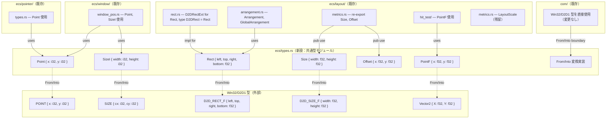
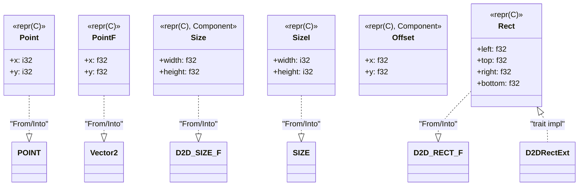
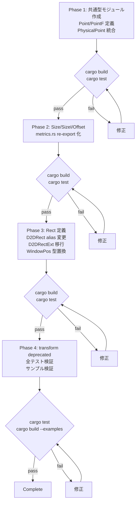

# Design Document: type-consolidation

## Overview

**Purpose**: wintf クレートの ECS 層に散在する幾何学・空間型（`PhysicalPoint` ×2, `Size`, `Offset`, `D2DRect` 等）を共通型モジュールに集約し、メモリレイアウト互換の独自型体系を確立する。

**Users**: wintf ライブラリ開発者（areka クレート開発者を含む）が、型選択の迷いなく一貫した空間型を使用できるようになる。

**Impact**: ECS 層の公開 API から Win32/D2D1 型の直接参照を排除し、`#[repr(C)]` メモリレイアウト互換によるゼロコスト `From`/`Into` 変換で COM 層との境界を明確化する。

### Goals
- `PhysicalPoint` の同名異義二重定義を解消する（`Point` / `PointF` へ分離）
- プリミティブ幾何型（Point, Size, Offset, Rect）を `ecs/types.rs` に集約する
- Win32/D2D1 型との `#[repr(C)]` メモリレイアウト互換＋ゼロコスト `From`/`Into` 変換を提供する
- `pub use` re-export による後方互換性を維持する

### Non-Goals
- `Shape::Rect` variant（hit_region 内部 enum）の変更
- `transform/` モジュールの `Translate`/`Scale` 等との統合（非推奨マーキングのみ実施）
- `Rect<T>`（ボックスモデル型）の移動・変更
- `PositionSample`, `CursorVelocity`, `TextLayoutMetrics` 等のドメイン固有型の統合
- `LayoutScale` の共通化（layout 専用として維持）

## Architecture

### Existing Architecture Analysis

現在の型定義は以下のように分散している:

- `ecs/layout/metrics.rs`: `Size`, `Offset`, `LayoutScale`（f32ベース）
- `ecs/layout/rect.rs`: `pub type D2DRect = D2D_RECT_F` + `D2DRectExt` トレイト
- `ecs/pointer/types.rs`: `PhysicalPoint { x: i32, y: i32 }`
- `ecs/layout/hit_test/mod.rs`: `PhysicalPoint { x: f32, y: f32 }`（同名！）
- `ecs/window/window_pos.rs`: `WindowPos` が Win32 `POINT`/`SIZE` を直接保持

既存の `pub use layout::*` パターンにより `Size`, `Offset` 等は `ecs::*` レベルで公開されているが、PhysicalPoint は名前衝突により pointer 版のみが公開されている。

### Architecture Pattern & Boundary Map



**Architecture Integration**:
- **Selected pattern**: 共通型モジュール（`ecs/types.rs`）による型集約 + `pub use` re-export
- **Domain boundaries**: プリミティブ型（types.rs） → レイアウト型（layout/） → コンポーネント型（各モジュール）の3層型階層
- **Existing patterns preserved**: `pub use layout::*` による自動公開、`D2DRectExt` トレイト拡張パターン
- **New components rationale**: `ecs/types.rs` はプリミティブ幾何型の唯一の定義箇所として導入。型数が6個と少ないため単一ファイルで十分（`research.md` Architecture Pattern Evaluation 参照）
- **Steering compliance**: レイヤー分離原則（COM→ECS→Message）を維持。ECS 層に Win32 型が漏れない設計

### Technology Stack

| Layer          | Choice / Version       | Role in Feature                              | Notes                                     |
| -------------- | ---------------------- | -------------------------------------------- | ----------------------------------------- |
| Language       | Rust 2024 Edition      | 型定義、`#[repr(C)]`、`From`/`Into` 実装     |                                           |
| ECS            | bevy_ecs 0.18.0        | `Component` derive マクロ                    | 移動先でも `Component` derive 維持        |
| Win32 Bindings | windows 0.62.2         | `POINT`, `SIZE`, `D2D_RECT_F` 変換ターゲット | `D2D_POINT_2F` は非存在、`Vector2` が代替 |
| Numerics       | windows-numerics 0.3.1 | `Vector2` — `PointF` の変換ターゲット        | 既に依存済み                              |

## Requirements Traceability

| Requirement | Summary                      | Components                                                    | Interfaces                             | Flows |
| ----------- | ---------------------------- | ------------------------------------------------------------- | -------------------------------------- | ----- |
| 1.1         | 共通型モジュール提供         | `ecs/types.rs`                                                | —                                      | —     |
| 1.2         | pub use re-export            | `ecs/mod.rs`, `ecs/layout/metrics.rs`                         | —                                      | —     |
| 1.3         | 最低限 derive 適用           | 全共通型                                                      | —                                      | —     |
| 2.1         | Point 定義（POINT 互換）     | `ecs/types.rs` — `Point`                                      | `From<POINT>`, `Into<POINT>`           | —     |
| 2.2         | PointF 定義（Vector2 互換）  | `ecs/types.rs` — `PointF`                                     | `From<Vector2>`, `Into<Vector2>`       | —     |
| 2.3         | Point/PointF 変換            | `ecs/types.rs`                                                | `From`/`Into` impl                     | —     |
| 2.4         | pointer で Point 使用        | `ecs/pointer/types.rs`                                        | —                                      | —     |
| 2.5         | hit_test で PointF 使用      | `ecs/layout/hit_test/mod.rs`                                  | —                                      | —     |
| 2.6         | PhysicalPoint 重複排除       | pointer, hit_test 両モジュール                                | —                                      | —     |
| 3.1         | Size 定義（D2D_SIZE_F 互換） | `ecs/types.rs` — `Size`                                       | `From<D2D_SIZE_F>`, `Into<D2D_SIZE_F>` | —     |
| 3.2         | Offset 定義                  | `ecs/types.rs` — `Offset`                                     | —                                      | —     |
| 3.3         | SizeI 定義（SIZE 互換）      | `ecs/types.rs` — `SizeI`                                      | `From<SIZE>`, `Into<SIZE>`             | —     |
| 3.4         | metrics.rs re-export 置換    | `ecs/layout/metrics.rs`                                       | —                                      | —     |
| 3.5         | Arrangement 参照先変更       | `ecs/layout/arrangement.rs`                                   | —                                      | —     |
| 3.6         | LayoutScale スコープ判定     | —                                                             | —                                      | —     |
| 4.1         | Rect\<T\> 維持               | `ecs/layout/dimension.rs`                                     | —                                      | —     |
| 4.2         | Rect 定義（D2D_RECT_F 互換） | `ecs/types.rs` — `Rect`                                       | `From<D2D_RECT_F>`, `Into<D2D_RECT_F>` | —     |
| 4.3         | D2DRect type alias 維持      | `ecs/layout/rect.rs`                                          | —                                      | —     |
| 4.4         | D2DRectExt for Rect          | `ecs/layout/rect.rs`                                          | `D2DRectExt` trait impl                | —     |
| 4.5         | Shape::Rect スコープ外       | —                                                             | —                                      | —     |
| 4.6         | COM 層 D2D_RECT_F 維持       | `com/` 変更なし                                               | `From<Rect> for D2D_RECT_F`            | —     |
| 5.1         | transform 型は維持           | `ecs/transform/components.rs`                                 | —                                      | —     |
| 5.2         | #[deprecated] マーキング     | `ecs/transform/components.rs`                                 | —                                      | —     |
| 6.1         | WindowPos 評価               | —                                                             | —                                      | —     |
| 6.2         | WindowPos フィールド置換     | `ecs/window/window_pos.rs`                                    | —                                      | —     |
| 6.3         | 共通型↔Win32 変換            | `ecs/types.rs`                                                | `From`/`Into` impl                     | —     |
| 6.4         | COM 層は Win32 型許容        | `com/` 変更なし                                               | —                                      | —     |
| 6.5         | 双方向変換提供               | `ecs/types.rs`                                                | `From`/`Into` impl                     | —     |
| 7.1         | pub use re-export 互換       | `ecs/layout/metrics.rs`, `ecs/pointer/types.rs`               | —                                      | —     |
| 7.2         | 元モジュールに re-export     | `metrics.rs`, `pointer/types.rs`, `hit_test/mod.rs`           | —                                      | —     |
| 7.3         | 既存テスト維持               | —                                                             | —                                      | —     |
| 7.4         | 既存サンプル維持             | —                                                             | —                                      | —     |
| 7.5         | 型エイリアスによる移行       | `rect.rs`（`D2DRect`）, `pointer/types.rs`（`PhysicalPoint`） | —                                      | —     |

## Components and Interfaces

| Component                     | Domain/Layer      | Intent                                  | Req Coverage                              | Key Dependencies                    | Contracts  |
| ----------------------------- | ----------------- | --------------------------------------- | ----------------------------------------- | ----------------------------------- | ---------- |
| `ecs/types.rs`                | ECS / Primitive   | 共通幾何型の定義＋From/Into変換         | 1.1, 1.3, 2.1-2.3, 3.1-3.3, 4.2, 6.3, 6.5 | windows (P0), windows-numerics (P1) | Trait impl |
| `ecs/mod.rs`                  | ECS / Root        | 共通型の re-export                      | 1.2, 7.1                                  | types.rs (P0)                       | —          |
| `ecs/layout/rect.rs`          | Layout            | D2DRect alias + D2DRectExt impl         | 4.3, 4.4                                  | types.rs (P0)                       | Trait      |
| `ecs/layout/metrics.rs`       | Layout            | Size/Offset re-export + LayoutScale維持 | 3.4, 3.6, 7.2                             | types.rs (P0)                       | —          |
| `ecs/pointer/types.rs`        | Pointer           | PhysicalPoint → Point 移行              | 2.4, 2.6, 7.2                             | types.rs (P0)                       | —          |
| `ecs/layout/hit_test/mod.rs`  | Layout / Hit Test | PhysicalPoint → PointF 移行             | 2.5, 2.6                                  | types.rs (P0)                       | —          |
| `ecs/window/window_pos.rs`    | Window            | POINT/SIZE → Point/SizeI 置換           | 6.1, 6.2                                  | types.rs (P0)                       | —          |
| `ecs/transform/components.rs` | Transform         | #[deprecated] マーキング追加            | 5.1, 5.2                                  | —                                   | —          |

### ECS / Primitive

#### ecs/types.rs（新設）

| Field        | Detail                                                |
| ------------ | ----------------------------------------------------- |
| Intent       | 共通幾何プリミティブ型の唯一の定義箇所                |
| Requirements | 1.1, 1.3, 2.1, 2.2, 2.3, 3.1, 3.2, 3.3, 4.2, 6.3, 6.5 |

**Responsibilities & Constraints**
- プリミティブ幾何型（`Point`, `PointF`, `Size`, `SizeI`, `Offset`, `Rect`）の定義
- Win32/D2D1 型との `From`/`Into` 変換の実装
- 全型に `#[repr(C)]` を適用し、メモリレイアウト互換を保証
- `Size` と `Offset` には `Component` derive を適用（既存の metrics.rs での使用を維持）
- `Point`, `PointF`, `SizeI`, `Rect` は pure primitive 型として `Component` derive なし

**Dependencies**
- Outbound: `windows::Win32::Foundation::{POINT, SIZE}` — From/Into 変換ターゲット (P0)
- Outbound: `windows::Win32::Graphics::Direct2D::Common::{D2D_RECT_F, D2D_SIZE_F}` — From/Into 変換ターゲット (P0)
- Outbound: `windows_numerics::Vector2` — PointF の From/Into 変換ターゲット (P1)

**Contracts**: Trait [x]

##### Trait Implementations

各共通型に対する `From`/`Into` 変換:

```rust
// === Point { x: i32, y: i32 } ===
// POINT { x: i32, y: i32 } と完全フィールド名一致
impl From<POINT> for Point {
    fn from(p: POINT) -> Self { Self { x: p.x, y: p.y } }
}
impl From<Point> for POINT {
    fn from(p: Point) -> Self { Self { x: p.x, y: p.y } }
}

// === PointF { x: f32, y: f32 } ===
// Vector2 { X: f32, Y: f32 } — PascalCase ↔ snake_case マッピング
impl From<Vector2> for PointF {
    fn from(v: Vector2) -> Self { Self { x: v.X, y: v.Y } }
}
impl From<PointF> for Vector2 {
    fn from(p: PointF) -> Self { Self { X: p.x, Y: p.y } }
}

// === Size { width: f32, height: f32 } ===
// D2D_SIZE_F { width: f32, height: f32 } と完全フィールド名一致
impl From<D2D_SIZE_F> for Size {
    fn from(s: D2D_SIZE_F) -> Self { Self { width: s.width, height: s.height } }
}
impl From<Size> for D2D_SIZE_F {
    fn from(s: Size) -> Self { Self { width: s.width, height: s.height } }
}

// === SizeI { width: i32, height: i32 } ===
// SIZE { cx: i32, cy: i32 } — フィールド名マッピング: width↔cx, height↔cy
impl From<SIZE> for SizeI {
    fn from(s: SIZE) -> Self { Self { width: s.cx, height: s.cy } }
}
impl From<SizeI> for SIZE {
    fn from(s: SizeI) -> Self { Self { cx: s.width, cy: s.height } }
}

// === Rect { left: f32, top: f32, right: f32, bottom: f32 } ===
// D2D_RECT_F { left, top, right, bottom: f32 } と完全フィールド名一致
impl From<D2D_RECT_F> for Rect {
    fn from(r: D2D_RECT_F) -> Self {
        Self { left: r.left, top: r.top, right: r.right, bottom: r.bottom }
    }
}
impl From<Rect> for D2D_RECT_F {
    fn from(r: Rect) -> Self {
        Self { left: r.left, top: r.top, right: r.right, bottom: r.bottom }
    }
}
```

**Implementation Notes**
- `Size` と `Offset` には `Component` derive を適用（`Arrangement` などの ECS コンポーネントのフィールドとして直接使用されるため）
- `Point`, `PointF`, `SizeI`, `Rect` は pure primitive 型として `Component` derive なし（他の型のフィールドとして使用）
- `metrics.rs` は `pub use crate::ecs::types::{Size, Offset};` による re-export のみとなり、元の構造体定義は削除
- `Default` の実装: `Point`, `PointF`, `Size`, `SizeI`, `Rect` は全フィールド `0` / `0.0`。`Offset` は `Default = (0.0, 0.0)` で Rust の derive Default と一致

### Layout

#### ecs/layout/rect.rs（変更）

| Field        | Detail                                                    |
| ------------ | --------------------------------------------------------- |
| Intent       | D2DRect 型エイリアスの維持＋D2DRectExt トレイト実装の移行 |
| Requirements | 4.3, 4.4                                                  |

**Responsibilities & Constraints**
- `pub type D2DRect = Rect;`（`D2D_RECT_F` → `Rect` への変更）
- `D2DRectExt` トレイトの実装対象を `D2D_RECT_F` から `Rect` に変更
- `offset()` の戻り値型を `Vector2` → `PointF` に変更
- `size()` の戻り値型を `Vector2` → `Size` に変更（`research.md` Decision 参照）
- `set_offset()` の引数型を `Vector2` → `PointF`（または `impl Into<PointF>` で互換維持）に変更
- `set_size()` の引数型を `Vector2` → `Size`（または `impl Into<Size>` で互換維持）に変更
- `from_offset_size()` の引数型は `Offset`/`Size` のまま（変更なし）
- `transform_rect_axis_aligned` 自由関数の引数・戻り値を `&Rect` / `Rect` に変更

**Dependencies**
- Inbound: `types.rs` — `Rect`, `PointF`, `Size`, `Offset` (P0)
- Outbound: `windows_numerics::Matrix3x2` — transform_rect_axis_aligned 用 (P0)

**Implementation Notes**
- **影響範囲調査結果（Issue 3 解決）**: `D2DRectExt` メソッド（`.offset()`, `.size()`, `.set_offset()`, `.set_size()`）は現在**テストコードでのみ使用**。
  - `tests/layout/arrangement_bounds_test.rs` L127, L141, L153, L166 の 4 箇所のみ
  - `src/` 以下では `.contains()`, `.union()`, `.from_offset_size()` のみ使用（戻り値型変更の影響なし）
  - Phase 3 での戻り値型変更（`Vector2` → `PointF`/`Size`）の影響は**テストコード 4 箇所のみ**（型名変更のみで `.X`/`.Y` は維持されるため、実質的な変更は `Vector2` import を `PointF`/`Size` に置換するのみ）
- `PointF`/`Size` → `Vector2` の `From` 実装により、既存の `Vector2` を期待する箇所では `.into()` 変換で互換維持可能
- `impl Into<PointF>` / `impl Into<Size>` を setter の引数型にすることで、`Vector2` 値を直接渡すことも可能にできる（互換性オプション、ただし現在の使用箇所は 0 のため不要）

#### ecs/layout/metrics.rs（変更）

| Field        | Detail                                                          |
| ------------ | --------------------------------------------------------------- |
| Intent       | Size/Offset を共通型からの re-export に置換、LayoutScale は維持 |
| Requirements | 3.4, 3.6, 7.2                                                   |

**Responsibilities & Constraints**
- `Size` と `Offset` の構造体定義を削除し、`pub use crate::ecs::types::{Size, Offset};` に置き換え
- `LayoutScale` は metrics.rs 内に**定義を維持**（レイアウト専用型、`research.md` Decision 参照）
- `TextLayoutMetrics` も metrics.rs 内に維持（セマンティック型、統合対象外）
- `Opacity`（deprecated）も現状維持

### Pointer

#### ecs/pointer/types.rs（変更）

| Field        | Detail                              |
| ------------ | ----------------------------------- |
| Intent       | PhysicalPoint を共通型 Point に置換 |
| Requirements | 2.4, 2.6, 7.2                       |

**Responsibilities & Constraints**
- `PhysicalPoint` 構造体定義を削除
- `use crate::ecs::types::Point;` を追加
- `PointerState` 等で `PhysicalPoint` → `Point` にフィールド型変更
- 後方互換: `pub type PhysicalPoint = Point;` を追加（移行期間中）
- `Default`, `PartialEq`, `Eq` は `Point` の derive に含まれるため互換性あり

### Layout / Hit Test

#### ecs/layout/hit_test/mod.rs（変更）

| Field        | Detail                                     |
| ------------ | ------------------------------------------ |
| Intent       | PhysicalPoint (f32) を共通型 PointF に置換 |
| Requirements | 2.5, 2.6                                   |

**Responsibilities & Constraints**
- `PhysicalPoint` 構造体定義を削除
- `use crate::ecs::types::PointF;` を追加
- `hit_test()`, `hit_test_in_window()` 等の引数型を `PhysicalPoint` → `PointF` に変更
- `mouse_move.rs` 等の `PhysicalPoint as HitTestPoint` エイリアスを `PointF as HitTestPoint`（または直接 `PointF` 使用）に変更

### Window

#### ecs/window/window_pos.rs（変更）

| Field        | Detail                                       |
| ------------ | -------------------------------------------- |
| Intent       | Win32 POINT/SIZE を共通型 Point/SizeI に置換 |
| Requirements | 6.1, 6.2                                     |

**Responsibilities & Constraints**
- `position: Option<POINT>` → `position: Option<Point>` に変更
- `size: Option<SIZE>` → `size: Option<SizeI>` に変更
- Win32 API 呼び出し箇所（`set_window_pos()` 等）で `.into()` による変換追加
- `POINT { x: 0, y: 0 }` リテラル → `Point { x: 0, y: 0 }` に変更
- `SIZE { cx: ..., cy: ... }` リテラル → `SizeI { width: ..., height: ... }` に変更
- `CW_USEDEFAULT` 比較: `position.x == CW_USEDEFAULT` → `point.x == CW_USEDEFAULT`（フィールド名同一のため問題なし）
- `size.cx == CW_USEDEFAULT` → `size.width == CW_USEDEFAULT` に変更

**Dependencies**
- Inbound: `types.rs` — `Point`, `SizeI` (P0)
- Outbound: `windows::Win32::Foundation::{POINT, SIZE}` — Win32 API 呼び出し境界で Into 変換 (P0)

### Transform

#### ecs/transform/components.rs（変更）

| Field        | Detail                             |
| ------------ | ---------------------------------- |
| Intent       | #[deprecated] 属性マーキングの追加 |
| Requirements | 5.1, 5.2                           |

**Responsibilities & Constraints**
- `Transform`, `GlobalTransform`, `Translate`, `Scale`, `Rotate`, `Skew`, `TransformOrigin` に `#[deprecated]` 属性を追加
- 型の定義自体は変更しない（Req5 AC1）
- 非推奨メッセージで代替手段（`Arrangement` ベースのレイアウトシステム）を案内

## Data Models

### Domain Model

型階層の設計:



### Logical Data Model

#### 共通型定義一覧

| 型名     | フィールド                                     | `#[repr(C)]` | derive                                              | メモリ互換ターゲット              | Notes                                          |
| -------- | ---------------------------------------------- | ------------ | --------------------------------------------------- | --------------------------------- | ---------------------------------------------- |
| `Point`  | `x: i32, y: i32`                               | ✅            | `Debug, Clone, Copy, Default, PartialEq, Eq`        | `POINT` (完全一致)                |                                                |
| `PointF` | `x: f32, y: f32`                               | ✅            | `Debug, Clone, Copy, Default, PartialEq`            | `Vector2` (PascalCase→snake_case) | `D2D_POINT_2F` は windows 0.62.2 に非存在      |
| `Size`   | `width: f32, height: f32`                      | ✅            | `Component, Debug, Clone, Copy, Default, PartialEq` | `D2D_SIZE_F` (完全一致)           | 既存 metrics.rs から移動                       |
| `SizeI`  | `width: i32, height: i32`                      | ✅            | `Debug, Clone, Copy, Default, PartialEq, Eq`        | `SIZE` (cx↔width, cy↔height)      | フィールド名マッピング必要                     |
| `Offset` | `x: f32, y: f32`                               | ✅            | `Component, Debug, Clone, Copy, PartialEq`          | なし（独立定義）                  | Default = (0.0, 0.0)、既存 metrics.rs から移動 |
| `Rect`   | `left: f32, top: f32, right: f32, bottom: f32` | ✅            | `Debug, Clone, Copy, Default, PartialEq`            | `D2D_RECT_F` (完全一致)           | 新規定義                                       |

#### フィールド順序と `#[repr(C)]` 互換性マトリクス

| 独自型   | フィールド順               | 外部型       | フィールド順               | 名前一致 | レイアウト互換 |
| -------- | -------------------------- | ------------ | -------------------------- | -------- | -------------- |
| `Point`  | `x, y`                     | `POINT`      | `x, y`                     | ✅        | ✅              |
| `PointF` | `x, y`                     | `Vector2`    | `X, Y`                     | ❌ (case) | ✅              |
| `Size`   | `width, height`            | `D2D_SIZE_F` | `width, height`            | ✅        | ✅              |
| `SizeI`  | `width, height`            | `SIZE`       | `cx, cy`                   | ❌        | ✅              |
| `Rect`   | `left, top, right, bottom` | `D2D_RECT_F` | `left, top, right, bottom` | ✅        | ✅              |

> **Note**: `#[repr(C)]` ではフィールド名はレイアウトに影響しない。同一型・同一順序であればメモリレイアウト互換。

#### 型エイリアスと後方互換定義

| エイリアス      | 定義箇所               | 定義                             | 目的                         |
| --------------- | ---------------------- | -------------------------------- | ---------------------------- |
| `D2DRect`       | `ecs/layout/rect.rs`   | `pub type D2DRect = Rect`        | 既存コード互換（Req4 AC3）   |
| `PhysicalPoint` | `ecs/pointer/types.rs` | `pub type PhysicalPoint = Point` | 移行期間中の互換（Req7 AC5） |

## Error Handling

### Error Strategy
本 feature は型定義のリファクタリングであり、ランタイムエラーは発生しない。コンパイル時の型チェックにより安全性を保証する。

### Error Categories
- **コンパイルエラー**: 型移行に伴う `use` パス変更漏れ — `cargo build` で検出
- **テスト失敗**: 既存テストの型パス変更漏れ — `cargo test` で検出

## Testing Strategy

### Unit Tests
`ecs/types.rs` 内の `#[cfg(test)] mod tests`:

1. **From/Into ラウンドトリップ**: 各共通型 ↔ Win32/D2D1 型の変換が値を保存することを検証
   - `Point ↔ POINT`, `PointF ↔ Vector2`, `Size ↔ D2D_SIZE_F`, `SizeI ↔ SIZE`, `Rect ↔ D2D_RECT_F`
2. **Default 値**: 各型の `Default` が期待値（全フィールド 0/0.0）であることを検証
   - `Offset::default()` が `(0.0, 0.0)` であること
3. **メモリレイアウト互換**: `std::mem::size_of` と `std::mem::align_of` が Win32/D2D1 型と一致することを検証
4. **PartialEq**: フィールド値が同一の場合に等値であること

### Integration Tests
既存テスト `tests/` が全て通過すること:

1. **`tests/ecs.rs`**: ECS コンポーネントの基本動作
2. **`tests/layout.rs`**: レイアウトシステム全般（`Arrangement`, `GlobalArrangement` の型変更影響）
3. **`tests/visual.rs`**: ビジュアル系テスト（D2DRect → Rect 型エイリアス変更影響）
4. **`tests/widget.rs`**: ウィジェット系テスト
5. **`tests/window.rs`**: ウィンドウ系テスト（WindowPos の型変更影響）

### Compilation Tests
1. **全サンプル**: `cargo build --examples` で全サンプルがコンパイル通過すること（Req7 AC4）
2. **Re-export 互換**: 既存の `use crate::ecs::Size` 等のパスが通ること（Req7 AC1, AC2）

## Optional Sections

### Migration Strategy



**Phase 1**: `ecs/types.rs` 新設 → `Point`, `PointF` 定義 → `pointer::PhysicalPoint`, `hit_test::PhysicalPoint` 置換 → `ecs/mod.rs` re-export 更新
**Phase 2**: `Size`, `Offset` を `types.rs` に移動 → `SizeI` 新規定義 → `metrics.rs` re-export 化
**Phase 3**: `Rect` 定義 → `D2DRect` alias 変更 → `D2DRectExt` impl 対象変更 → `WindowPos` フィールド型変更
**Phase 4**: transform `#[deprecated]` 追加 → 全テスト/サンプル検証 → 後方互換性最終確認

各 Phase の完了条件: `cargo build` + `cargo test` が全パスすること。
ロールバックトリガー: コンパイルエラーが Phase 内で解消不能な場合、git revert で Phase 単位でロールバック。
