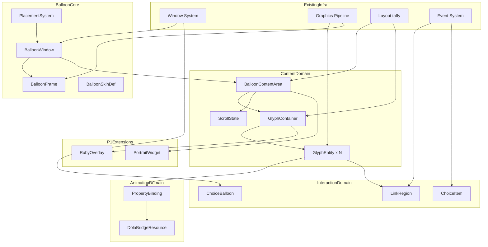
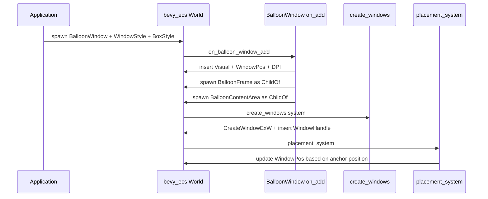
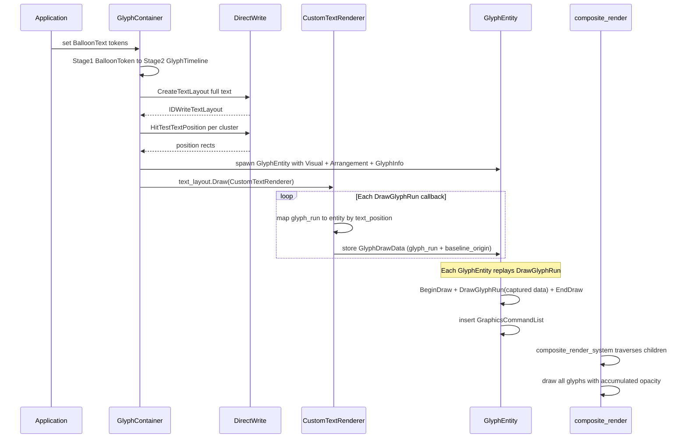
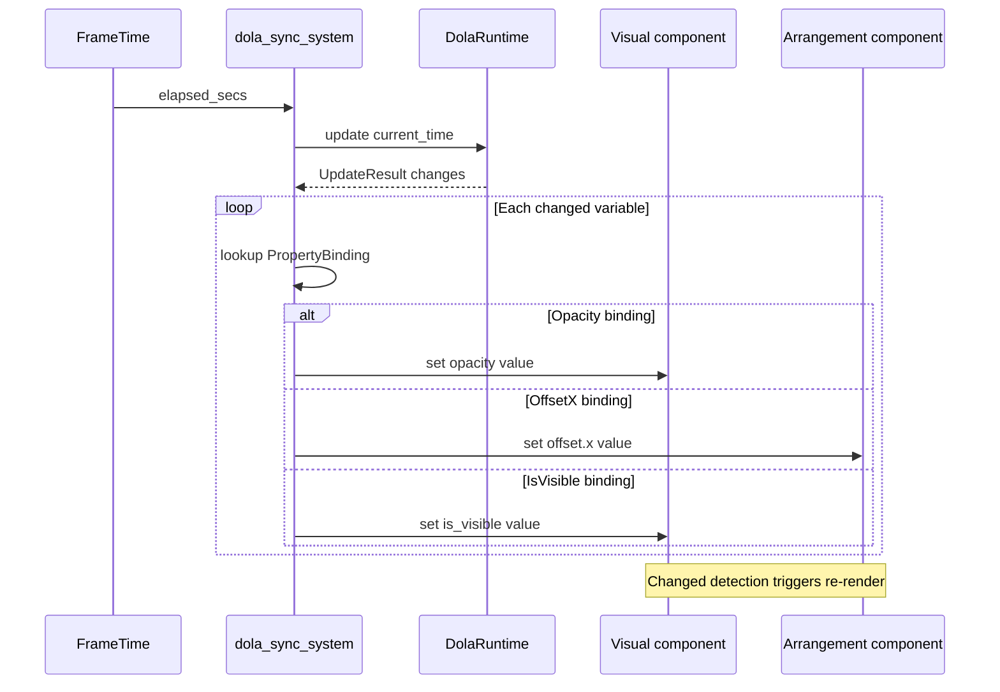
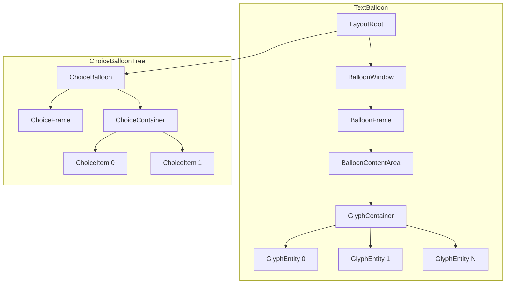

# 技術設計書: wintf バルーンシステム

## Overview

バルーンシステムは、wintf フレームワーク上にキャラクターの発言表示用吹き出しウィンドウを提供する複合ウィジェットである。既存の ECS アーキテクチャ（`Window`, `Visual`, `Arrangement`, `GraphicsCommandList`）を基盤とし、テキスト描画・アニメーション・インタラクションを統合的に実現する。

**対象ユーザー**: areka アプリケーション開発者（ゴースト実行環境）。バルーンの生成・テキスト表示・選択肢提示・リンク操作を wintf API 経由で利用する。

**影響**: 既存の wintf 描画パイプライン（`composite_render_system`, `ulw_present_system`）への変更は不要。新規モジュール追加と、dola クレートへのオプショナル依存追加が発生する。

### ゴール

- バルーンの複合ウィジェットアーキテクチャ（エンティティ階層・描画責務分離）を定義し、8子仕様の統一的な設計基盤を確立する
- 「1グリフ＝1エンティティ」方式によるテキスト描画パイプラインの設計を確定する
- dola↔wintf 統合層（dola_bridge）の共有インフラストラクチャを定義する
- 子仕様間のインターフェース契約を明確化し、独立した並行開発を可能にする

### 非ゴール

- 各子仕様の詳細実装設計（子仕様ごとの design.md で対応）
- アプリケーション層のスキン定義（`areka-P0-reference-balloon` 仕様で対応）
- P1 機能（ルビ・ポートレート）の詳細設計（P0 拡張ポイントの確保のみ）
- テキスト入力ボックス等のバルーン外 UI 要素

---

## アーキテクチャ

### 既存アーキテクチャ分析

バルーンシステムが統合する既存パターン:

| パターン | 機構 | バルーンでの活用 |
|---------|------|----------------|
| on_add フックチェーン | `Window` → `Visual` → `Arrangement` → `GlobalArrangement` 自動挿入 | `BalloonWindow` on_add で同パターン踏襲 |
| `ChildOf(parent)` 階層 | 親子関係によるウィジェットツリー。`Children.iter()` が Z-order の権威的ソース | 全描画責務エンティティの親子構造。グリフエンティティの配置にも適用 |
| CommandList 描画パイプライン | Widget → `GraphicsCommandList` → `composite_render_system` → `ulw_present_system` | 全グリフエンティティがこのパイプラインに乗る（変更不要） |
| `Visual.opacity` + 合成 | `composite_render_system` で再帰的に opacity 累積 | グリフ単位フェードイン/アウトが `Visual.opacity` 制御に帰結 |
| Brush 継承 | `BrushInherit` マーカー → 親チェーン解決 | テキスト色のコンテナからの継承 |
| `Phase<T>` Tunnel/Bubble | イベント伝播: 親→子→親 | リンククリック・選択肢イベントの配信 |
| 2段階 IR | `TypewriterToken` (Stage 1) → `TimelineItem` (Stage 2) | `BalloonToken` → `GlyphTimeline` の変換パターン踏襲 |
| SparseSet ストレージ | 動的追加/削除が多いコンポーネント | イベントハンドラ、TypewriterTalk 相当 |

**制約事項（変更不可）**:
- `d2d_device_context` はグローバル共有（並列 Draw 不可能）
- ULW モードでは `UpdateLayeredWindow` のたびに全面再描画
- `on_add` フック内では `DeferredWorld` が提供される。`world.commands()` は使用可能（`on_window_add` 実証済）だが、コマンドは遅延実行される
- DComp モードでのグリフ単位エンティティは GPU リソースコスト高（非推奨）

### アーキテクチャパターンと境界マップ

**選択パターン**: 既存 ECS コンポーネントアーキテクチャの拡張。新規アーキテクチャパターン導入なし。



**境界と責務分離**:
- **BalloonCore**: ウィンドウ生成・フレーム描画・配置制御。他ドメインの基盤
- **ContentDomain**: コンテンツ領域管理・グリフ分割・テキスト描画。テキスト表示の中核
- **InteractionDomain**: ユーザー操作（リンク・選択肢）。イベントシステムとの統合
- **AnimationDomain**: dola アニメーションとの統合。ContentDomain のグリフプロパティを制御
- **P1Extensions**: P0 設計の拡張ポイントを通じて後付け追加

### テクノロジースタック

| レイヤー | 選定 / バージョン | 本機能での役割 | 備考 |
|---------|------------------|---------------|------|
| 言語 | Rust 2024 Edition | 全実装 | 既存 |
| ECS | bevy_ecs 0.18.0 | エンティティ・コンポーネント管理 | 既存 |
| グラフィックス | Direct2D / DirectWrite | テキスト描画・2D描画 | 既存。`HitTestPoint` ラッパー追加 |
| ウィンドウ | Win32 API (ULW) | 透過バルーンウィンドウ | 既存 |
| レイアウト | taffy 0.9.2 | flexbox レイアウト | 既存 |
| アニメーション | dola (workspace) | タイムライン・イージング・変数管理 | **新規依存** (`optional = true`) |
| COM バインディング | windows 0.62.2 | Win32 API ラッパー | 既存 |

> dola 依存の追加詳細は `research.md` の「dola↔ECS統合アーキテクチャ」を参照。wintf からの依存は既存の内部クレート参照パターン（`dola = { version = "0.0.1", path = "../dola", optional = true }`）に準拠。

---

## システムフロー

### バルーン生成と配置



### テキスト表示パイプライン



### dola アニメーション同期



---

## 要件トレーサビリティ

| 要件 | サマリー | コンポーネント | インターフェース | フロー |
|------|---------|--------------|----------------|--------|
| 1.1-1.5 | バルーンウィンドウ生成 | BalloonWindow | on_add hook, Window contract | バルーン生成 |
| 2.1-2.5 | フレーム描画 | BalloonFrame, BalloonSkinDef | SkinDef contract | — |
| 3.1-3.5 | 配置制御 | BalloonWindow, PlacementSystem | BalloonPlacement | バルーン配置 |
| 4.1-4.4 | 表示制御 | BalloonWindow | WindowPos (既存) | — |
| 5.1-5.4 | コンテンツ領域 | BalloonContentArea | BoxStyle (既存) | — |
| 6.1-6.3 | グリフ分割 | GlyphContainer, GlyphInfo | GlyphTimeline, spawn pipeline | テキスト表示 |
| 7.1-7.4 | テキスト表示制御 | GlyphContainer, GlyphTimeline | BalloonToken IR, TypewriterControl | テキスト表示 |
| 8.1-8.4 | スクロール | ScrollState, BalloonContentArea | scroll_system | — |
| 9.1-9.6 | リンク | LinkRegion, GlyphInfo | LinkClicked event, エンティティヒットテスト | — |
| 10.1-10.5 | 選択肢 | ChoiceBalloon, ChoiceItem | ChoiceSelected event | — |
| 11.1-11.5 | 文字単位エフェクト | GlyphEntity (Visual.opacity) | PropertyBinding | dola同期 |
| 12.1-12.5 | dola統合 | DolaBridgeResource, PropertyBinding | DolaRuntime API | dola同期 |
| 13.1-13.5 | ルビ [P1] | GlyphRubyInfo | — | — |
| 14.1-14.3 | 検証用スキン | ReferenceSkinDef | BalloonSkinDef | — |
| 15.1-15.5 | ポートレート [P1] | PortraitWidget | BitmapSource (既存) | — |

---

## コンポーネントとインターフェース

### コンポーネントサマリ

| コンポーネント | ドメイン | 責務 | 要件カバレッジ | 主要依存 (P0/P1) | 契約 |
|--------------|---------|------|--------------|-----------------|------|
| BalloonWindow | BalloonCore | バルーンウィンドウ生成・管理 | 1.1-1.5, 3.1-3.5, 4.1-4.4 | Window (P0), Visual (P0) | State |
| BalloonFrame | BalloonCore | フレーム描画 | 2.1-2.5 | BalloonSkinDef (P0) | State |
| BalloonSkinDef | BalloonCore | スキン定義インターフェース | 2.1-2.5, 14.1-14.3 | — | Service |
| PlacementSystem | BalloonCore | バルーン自動配置 | 3.1-3.5 | WindowPos (P0), Monitor (P0) | — |
| BalloonContentArea | Content | コンテンツ領域管理 | 5.1-5.4, 8.1-8.4 | BoxStyle (P0), LayoutRoot (P0) | State |
| GlyphContainer | Content | グリフ分割・テキストレイアウト管理 | 6.1-6.3, 7.1-7.4 | DirectWrite (P0), BalloonContentArea (P0) | Service, State |
| GlyphInfo | Content | 個別グリフのメタデータ | 6.2 | GlyphContainer (P0) | — |
| ScrollState | Content | スクロール状態管理 | 8.1-8.4 | BalloonContentArea (P0), WheelDelta (P0) | State |
| LinkRegion | Interaction | リンク定義・ヒットテスト | 9.1-9.6 | GlyphContainer (P0), EventSystem (P0), HitTest Bounds (P0) | Event |
| ChoiceBalloon | Interaction | 選択肢専用バルーン | 10.1-10.5 | BalloonWindow pattern (P0), EventSystem (P0) | Event |
| ChoiceItem | Interaction | 選択肢項目 | 10.2-10.5 | ChoiceBalloon (P0) | Event |
| DolaBridgeResource | Animation | dola↔ECS統合 | 12.1-12.5 | DolaRuntime (P0) | Service, State |
| PropertyBinding | Animation | プロパティバインディング | 11.1-11.5, 12.5 | DolaBridgeResource (P0), Visual (P0) | State |

### Balloon Core ドメイン

#### BalloonWindow

| フィールド | 詳細 |
|-----------|------|
| 責務 | バルーンウィンドウの生成・ライフサイクル管理・キャラクター紐付け |
| 要件 | 1.1-1.5, 3.1-3.5, 4.1-4.4 |

**責務と制約**
- `Window` コンポーネントの on_add パターンに準拠。`BalloonWindow` 追加時にフックチェーンで必須子エンティティを生成
- `anchor` フィールドでキャラクターエンティティとの論理的紐付けを保持
- 描画ツリー上は `ChildOf(LayoutRoot)` の独立ウィンドウ（キャラクタウィンドウの描画子ではない）
- 1キャラクター：N バルーン（複数同時表示可能）

**依存**
- Inbound: PlacementSystem — 配置計算結果の適用 (P0)
- Outbound: Window — ウィンドウ生成基盤 (P0)
- Outbound: Visual — 描画基盤 (P0)

**契約**: State [ ✓ ]

##### 状態管理

```rust
#[derive(Component)]
#[component(on_add = on_balloon_window_add)]
pub struct BalloonWindow {
    /// 紐付けキャラクターエンティティ
    pub anchor: Entity,
    /// 配置方向
    pub placement: BalloonPlacement,
    /// キャラクターとのオフセット距離
    pub offset: f32,
}

pub enum BalloonPlacement {
    Auto,
    Right,
    Left,
    Above,
    Below,
}
```

- on_add フック: `Window(ULW)` + `WindowStyle(POPUP|VISIBLE, LAYERED|TOOLWINDOW|TOPMOST)` + `WindowPos(TopMost)` + `Visual` 自動挿入。子エンティティ `BalloonFrame` + `BalloonContentArea` を deferred spawn
- 不変条件: `anchor` が有効な Entity であること（無効時はバルーン非表示）

**実装ノート**
- 子エンティティ spawn は `world.commands().queue(SpawnBalloonChildren { entity })` で遅延実行。`Command::apply(&mut World)` 内で `world.spawn((..., ChildOf(entity)))` が可能（`on_window_add` + `SetWindowParentToLayoutRoot` の既存パターンに準拠）
- 配置計算は `PlacementSystem` に委譲（Req 3.1-3.5）

#### BalloonSkinDef

| フィールド | 詳細 |
|-----------|------|
| 責務 | バルーンフレームの外観定義（背景・枠線・しっぽ） |
| 要件 | 2.1-2.5, 14.1-14.3 |

**契約**: Service [ ✓ ]

##### サービスインターフェース

```rust
/// バルーンスキン定義（フレーム描画パラメータ）
pub struct BalloonSkinDef {
    pub background: SkinBackground,
    pub border: Option<SkinBorder>,
    pub tail: Option<SkinTail>,
    pub padding: BoxPadding,
}

pub enum SkinBackground {
    SolidColor(D2D1_COLOR_F),
    Image { path: String },
}

pub struct SkinBorder {
    pub color: D2D1_COLOR_F,
    pub width: f32,
    pub corner_radius: f32,
}

pub struct SkinTail {
    pub direction: TailDirection,
    pub size: Size,
    pub offset: f32,
}

pub enum TailDirection { Left, Right, Top, Bottom }
```

- 事前条件: スキン定義は有効な描画パラメータを持つこと
- 事後条件: BalloonFrame がスキンに基づいて描画される
- ReferenceSkinDef は BalloonSkinDef の具象インスタンス（単色・角丸・しっぽ定義）

#### PlacementSystem

| フィールド | 詳細 |
|-----------|------|
| 責務 | バルーンのキャラクター近傍自動配置・追従・反転 |
| 要件 | 3.1-3.5 |

**依存**
- Inbound: BalloonWindow.anchor — キャラクター位置取得 (P0)
- Outbound: WindowPos — 配置結果の適用 (P0)
- Outbound: Monitor — デスクトップ領域判定 (P0)

##### サービスインターフェース

```rust
/// placement_system: PostLayout スケジュールで毎フレーム実行
/// Query<(&BalloonWindow, &mut WindowPos), With<WindowHandle>>
/// + Query<&WindowPos, Without<BalloonWindow>>  (anchor の WindowPos 取得)
/// + Res<Monitor>
fn placement_system(/* ... */);
```

- 前提: `BalloonWindow.anchor` の `WindowPos` が取得可能であること
- 動作: anchor の位置 + `BalloonWindow.placement` + `offset` → バルーン位置を算出。デスクトップ領域外なら方向反転
- 追従: anchor の `WindowPos` が `Changed<WindowPos>` のとき再計算

### Content & Text ドメイン

#### BalloonContentArea

| フィールド | 詳細 |
|-----------|------|
| 責務 | コンテンツ領域の定義・クリッピング・サイズ管理 |
| 要件 | 5.1-5.4, 8.1-8.4 |

**責務と制約**
- `BalloonFrame` の子エンティティとして配置（`ChildOf(frame_entity)`）
- taffy flexbox コンテナとして、GlyphContainer 等の子ウィジェットをレイアウト
- P1 拡張: `ChildOf` で PortraitWidget 等を追加可能（特別な拡張機構不要）
- クリッピングは `PushAxisAlignedClip` で実現（`research.md` 参照）

**依存**
- Inbound: BalloonFrame — 親コンテナ (P0)
- Outbound: BoxStyle — margin/padding/max制約 (P0)
- Outbound: GlyphContainer — テキスト表示子ウィジェット (P0)

**契約**: State [ ✓ ]

##### 状態管理

```rust
#[derive(Component)]
#[component(on_add = on_content_area_add)]
pub struct BalloonContentArea {
    /// コンテンツ領域のクリッピング有効化
    pub clipping: bool,
}

#[derive(Component)]
pub struct ScrollState {
    /// 現在のスクロールオフセット（ピクセル）
    pub offset_y: f32,
    /// テキスト表示進行への自動追従
    pub auto_follow: bool,
    /// コンテンツ全体の高さ
    pub content_height: f32,
}
```

- on_add: `Visual` + `BoxStyle(padding from SkinDef)` 自動挿入
- スクロールシステム: `WheelDelta` → `ScrollState.offset_y` 更新 → `GlyphContainer` の `Arrangement.offset.y` に反映

#### GlyphContainer

| フィールド | 詳細 |
|-----------|------|
| 責務 | テキスト全体のレイアウト管理、グリフエンティティ群の spawn/despawn |
| 要件 | 6.1-6.3, 7.1-7.4 |

**責務と制約**
- 共有 `IDWriteTextLayout` を保持し、テキスト全体のレイアウト計算を担当
- `HitTestTextPosition` で各グリフの矩形位置を取得し、グリフエンティティを spawn
- `CustomTextRenderer`（`#[implement(IDWriteTextRenderer1)]`）で共有 TextLayout を描画し、`DrawGlyphRun` コールバックで各グリフエンティティに描画データ（`GlyphDrawData`）を配布
- テキスト変更時は全グリフエンティティを despawn → 再 spawn（全再構築方式、`research.md` D8参照）
- Stage 1 IR (`BalloonToken`) → Stage 2 IR (`GlyphTimeline`) の変換を担当

**依存**
- Inbound: BalloonContentArea — 親コンテナ/サイズ制約 (P0)
- Outbound: GlyphInfo — 個別グリフメタデータ (P0)
- External: DirectWrite (`IDWriteTextLayout`) — テキストレイアウト (P0)

**契約**: Service [ ✓ ] / State [ ✓ ]

##### サービスインターフェース

```rust
/// Stage 1 IR: バルーンテキスト入力形式
pub enum BalloonToken {
    /// プレーンテキスト
    Text(String),
    /// 待機時間（秒）
    Wait(f64),
    /// リンク開始マーカー
    LinkStart { id: String, action: String },
    /// リンク終了マーカー
    LinkEnd,
    /// スタイル変更
    Style(TextStyleOverride),
    /// イベント発火
    FireEvent { target: Entity, event: BalloonEventKind },
}

/// Stage 2 IR: グリフレベルタイムライン
pub struct GlyphTimelineEntry {
    pub cluster_index: u32,
    pub show_at: f64,
    pub weight: f64,
    pub link_id: Option<String>,
}

pub struct GlyphTimeline {
    pub full_text: String,
    pub entries: Vec<GlyphTimelineEntry>,
    pub total_duration: f64,
    pub glyph_count: u32,
}
```

##### 状態管理

```rust
#[derive(Component)]
pub struct GlyphContainer {
    /// テキスト描画方向
    pub direction: TextDirection,
    /// フォント・サイズ設定
    pub style: GlyphTextStyle,
}

/// GlyphContainerに関連付けられるリソース
#[derive(Component)]
pub struct GlyphLayoutResource {
    /// 共有テキストレイアウト（全テキスト）
    text_layout: IDWriteTextLayout,
    /// グリフタイムライン
    timeline: GlyphTimeline,
    /// CustomTextRenderer でキャプチャしたグリフ描画データ
    glyph_draw_data: Vec<GlyphDrawData>,
}

pub struct GlyphTextStyle {
    pub font_family: String,
    pub font_size: f32,
    pub color: D2D1_COLOR_F,
    pub default_char_wait: f64,
}
```

#### GlyphInfo

| フィールド | 詳細 |
|-----------|------|
| 責務 | 個別グリフのメタデータ保持 |
| 要件 | 6.2 |

```rust
/// 各グリフエンティティに付与されるメタデータ
#[derive(Component)]
pub struct GlyphInfo {
    /// クラスタインデックス
    pub cluster_index: u32,
    /// テキスト内の文字位置
    pub text_position: u32,
    /// テキスト内容（1グラフィムクラスタ）
    pub text: String,
    /// 結合文字フラグ（濁点・半濁点等）
    pub is_combining: bool,
}

/// CustomTextRendererからキャプチャした描画データ（各グリフエンティティが保持）
#[derive(Component)]
pub struct GlyphDrawData {
    /// DrawGlyphRun のグリフランデータ（font_face, glyph_indices, advances, offsets）
    pub glyph_run: CapturedGlyphRun,
    /// ベースライン原点
    pub baseline_origin: D2D1_POINT_2F,
    /// 測定モード
    pub measuring_mode: DWRITE_MEASURING_MODE,
}
```

- 各グリフエンティティは `Visual` + `Arrangement` + `GlyphInfo` + `GlyphDrawData` + `GraphicsCommandList` を持つ
- `ChildOf(glyph_container)` で GlyphContainer の子として配置
- `Arrangement.offset` は `HitTestTextPosition` から算出された位置
- 描画方式: `dc.DrawGlyphRun(baseline_origin, &glyph_run, brush, measuring_mode)` でキャプチャデータを再生（共有 TextLayout のカーニング・シェーピングを完全保持）
- **dola バインディング対象**: `Visual.opacity`, `Visual.is_visible`, `Arrangement.offset`

### Interaction ドメイン

#### LinkRegion

| フィールド | 詳細 |
|-----------|------|
| 責務 | テキスト内リンクの定義・ヒットテスト・イベント発火 |
| 要件 | 9.1-9.6 |

**依存**
- Inbound: GlyphContainer — テキスト位置情報 (P0)
- Outbound: EventSystem — リンクイベント配信 (P0)
- Inbound: HitTest (Bounds) — エンティティレベルヒットテストでリンク座標判定 (P0)

**契約**: Event [ ✓ ] / State [ ✓ ]

##### イベント契約

```rust
#[derive(Component)]
pub struct LinkRegion {
    pub link_id: String,
    pub action: String,
    pub text_range: Range<u32>,
    pub style: LinkStyle,
    pub is_hovered: bool,
}

pub struct LinkStyle {
    pub color: D2D1_COLOR_F,
    pub hover_color: D2D1_COLOR_F,
    pub underline: bool,
}

/// リンククリックイベント（Phase<LinkClicked> として配信）
pub struct LinkClicked {
    pub link_id: String,
    pub action: String,
}
```

- イベント配信: `Phase<LinkClicked>::Bubble` で親チェーンに伝播
- ヒットテスト: エンティティレベル判定。`hit_test_in_window` → グリフエンティティ特定 (`HitTestMode::Bounds`) → `GlyphInfo.text_position` → `LinkRegion.text_range` マッチ。DirectWrite `HitTestPoint` APIは不要
- ホバー: `OnPointerMoved` → グリフエンティティ判定 → `LinkRegion.is_hovered` 更新 → Brush 変更

#### ChoiceBalloon

| フィールド | 詳細 |
|-----------|------|
| 責務 | 選択肢専用バルーンウィンドウの生成・管理 |
| 要件 | 10.1-10.5 |

**責務と制約**
- テキストバルーンとは独立した別ウィンドウ
- 同キャラクターに紐付いて配置（`BalloonWindow` と同じ `anchor` パターン）
- flexbox column レイアウトで選択肢を縦並び表示
- キーボードナビゲーション: `FocusIndex` コンポーネントで現在フォーカス管理

**契約**: Event [ ✓ ] / State [ ✓ ]

##### イベント契約

```rust
#[derive(Component)]
#[component(on_add = on_choice_balloon_add)]
pub struct ChoiceBalloon {
    pub anchor: Entity,
    pub placement: BalloonPlacement,
}

#[derive(Component)]
pub struct ChoiceItem {
    pub item_id: String,
    pub text: String,
    pub is_hovered: bool,
    pub is_focused: bool,
}

/// 選択肢選択イベント（Phase<ChoiceSelected> として配信）
pub struct ChoiceSelected {
    pub item_id: String,
    pub index: usize,
}

/// キーボードフォーカス管理
#[derive(Component)]
pub struct FocusIndex {
    pub current: usize,
    pub count: usize,
}
```

- on_add: BalloonWindow パターンと同等（Window + Visual + 子エンティティ生成）
- キーボード: `WM_KEYDOWN` → 上下キーで `FocusIndex.current` 変更 → Enter で `ChoiceSelected` 発火

### Animation Bridge ドメイン

#### DolaBridgeResource

| フィールド | 詳細 |
|-----------|------|
| 責務 | dola DolaRuntime の ECS リソース化・プロパティバインディング・フレーム同期 |
| 要件 | 12.1-12.5, 11.1-11.5 |

**責務と制約**
- `#[cfg(feature = "dola")]` で条件コンパイル
- `DolaRuntime` を ECS `Resource` としてラップ
- `subscribe()` で変数購読 → `PropertyBinding` でエンティティプロパティに対応付け
- 毎フレーム `update(elapsed_secs)` → 差分変数をバインディング先に反映

**依存**
- Outbound: Visual — opacity/is_visible 更新 (P0)
- Outbound: Arrangement — offset 更新 (P0)
- External: dola DolaRuntime — アニメーションランタイム (P0)

**契約**: Service [ ✓ ] / State [ ✓ ]

##### サービスインターフェース

```rust
#[derive(Resource)]
pub struct DolaBridgeResource {
    runtime: DolaRuntime,
    bindings: HashMap<i64, PropertyTarget>,
}

pub struct PropertyTarget {
    pub entity: Entity,
    pub property: AnimatableProperty,
}

pub enum AnimatableProperty {
    Opacity,
    IsVisible,
    OffsetX,
    OffsetY,
}

impl DolaBridgeResource {
    /// ドキュメントロード
    pub fn load_document(&mut self, doc: DolaDocument) -> Result<(), RuntimeError>;

    /// ストーリーボード開始
    pub fn start(&mut self, name: &str, start_time: f64) -> Result<StartResult, RuntimeError>;

    /// プロパティバインディング登録
    pub fn bind(
        &mut self,
        variable_name: &str,
        entity: Entity,
        property: AnimatableProperty,
    ) -> Result<i64, RuntimeError>;

    /// バインディング解除
    pub fn unbind(&mut self, binding_id: i64) -> Result<(), RuntimeError>;

    /// 一時停止/再開
    pub fn pause(&mut self, group_id: u64, current_time: f64) -> Result<(), RuntimeError>;
    pub fn resume(&mut self, group_id: u64, current_time: f64) -> Result<f64, RuntimeError>;
}
```

##### 状態管理

```rust
/// dola_sync_system: Update スケジュールで毎フレーム実行
/// Res<FrameTime> + ResMut<DolaBridgeResource>
/// + Query<&mut Visual> + Query<&mut Arrangement>
fn dola_sync_system(/* ... */);
```

- 前提: `DolaBridgeResource` が初期化済みであること
- 動作: `runtime.update(time)` → `changes` をイテレート → `bindings` から `PropertyTarget` を解決 → 対象コンポーネント更新
- `EvaluatedValue::Float` → `Visual.opacity` / `Arrangement.offset.x|y`
- `EvaluatedValue::Integer` → `Visual.is_visible` (0/1)

### P1 Extensions（概要のみ）

P0 設計での拡張ポイント確保により、以下の P1 コンポーネントは子仕様設計時に追加される:

| コンポーネント | 拡張ポイント | 設計考慮 |
|--------------|-------------|---------|
| **GlyphRubyInfo** (DR-7) | GlyphInfo の拡張フィールドまたは sibling コンポーネント | グリフエンティティに `Option<RubyText>` を追加、または別コンポーネントとして付与 |
| **PortraitWidget** (DR-8) | BalloonContentArea の ChildOf 子エンティティ | 既存 `BitmapSource` パターンを踏襲。taffy flexbox でテキスト領域と並列配置（ブロックレベル） |

> **制約**: taffy 0.9.2 は `Display::Inline` 未サポート。P1 ポートレートはテキスト領域と並列のブロック要素（flexbox）として配置される。テキスト行内へのインライン埋め込みが将来必要になった場合は、DirectWrite の `IDWriteInlineObject` で対応する必要がある。

---

## データモデル

### エンティティ階層モデル



### コンポーネント構成パターン

**BalloonWindow エンティティ**:
`Window` + `WindowStyle` + `WindowPos` + `Visual` + `BalloonWindow` + `BoxStyle`

**BalloonFrame エンティティ**:
`Visual` + `Arrangement` + `BalloonSkinDef` + `Brushes` + `ChildOf(balloon_window)` + `GraphicsCommandList`

**BalloonContentArea エンティティ**:
`Visual` + `Arrangement` + `BalloonContentArea` + `ScrollState` + `BoxStyle` + `ChildOf(balloon_frame)`

**GlyphContainer エンティティ**:
`Visual` + `Arrangement` + `GlyphContainer` + `GlyphLayoutResource` + `BoxStyle` + `ChildOf(content_area)`

**GlyphEntity エンティティ**:
`Visual` + `Arrangement` + `GlyphInfo` + `GlyphDrawData` + `GraphicsCommandList` + `ChildOf(glyph_container)`

**ChoiceItem エンティティ**:
`Visual` + `Arrangement` + `ChoiceItem` + `Brushes` + `BoxStyle` + `ChildOf(choice_container)` + `OnPointerPressed` + `OnPointerEntered` + `OnPointerExited`

---

## モジュール配置

```
crates/wintf/src/
├── com/
│   └── dwrite_ext.rs           ← CustomTextRenderer (IDWriteTextRenderer1実装)
├── ecs/
│   ├── widget/
│   │   ├── balloon/
│   │   │   ├── mod.rs           ← BalloonWindow, BalloonPlacement
│   │   │   ├── frame.rs         ← BalloonFrame, BalloonSkinDef
│   │   │   ├── placement.rs     ← placement_system
│   │   │   ├── content.rs       ← BalloonContentArea, ScrollState
│   │   │   ├── choice.rs        ← ChoiceBalloon, ChoiceItem, FocusIndex
│   │   │   └── reference_skin.rs ← ReferenceSkinDef
│   │   └── text/
│   │       ├── glyph.rs          ← GlyphContainer, GlyphInfo, GlyphDrawData
│   │       ├── glyph_draw.rs     ← draw_glyphs system (DrawGlyphRun再生)
│   │       ├── glyph_timeline.rs ← BalloonToken, GlyphTimeline, IR変換
│   │       └── link.rs           ← LinkRegion, LinkClicked, link systems
│   └── dola_bridge/              ← #[cfg(feature = "dola")]
│       ├── mod.rs                ← DolaBridgeResource, AnimatableProperty
│       └── sync.rs               ← dola_sync_system, PropertyBinding
└── ...
```

---

## エラーハンドリング

### エラー戦略

バルーンシステムのエラーは `windows::core::Result` を基盤とし、以下のカテゴリで処理する:

| カテゴリ | 例 | 対応 |
|---------|-----|------|
| **DirectWrite エラー** | TextLayout 作成失敗、DrawGlyphRun 失敗 | グレースフルデグレード（テキスト表示をスキップ、エラーログ出力） |
| **エンティティ解決エラー** | `BalloonWindow.anchor` が無効 | バルーン非表示化（パニックしない） |
| **dola エラー** | DolaDocument パース失敗、変数名不一致 | アニメーションなしフォールバック |
| **スキン定義エラー** | 画像パス不正、パラメータ範囲外 | デフォルトスキンにフォールバック |

---

## テスト戦略

### 統合テスト

- **バルーン生成・配置**: BalloonWindow spawn → WindowHandle 生成確認 → placement_system で位置計算
- **グリフ分割パイプライン**: テキスト入力 → GlyphContainer → N 個のグリフエンティティ spawn 確認
- **リンクヒットテスト**: テキスト内リンク定義 → 座標→LinkClicked イベント発火確認
- **選択肢バルーン**: ChoiceBalloon spawn → 選択肢クリック → ChoiceSelected イベント発火確認
- **dola 同期**: DolaDocument ロード → ストーリーボード開始 → Visual.opacity 変化確認

### パフォーマンステスト

- **グリフ描画スループット**: 100文字・200文字テキストでの `DrawGlyphRun` × N の処理時間測定（NFR-1: 16ms以内）
- **スクロール60fps**: 長文テキストの連続スクロール時のフレームレート維持確認
- **追従レイテンシ**: キャラクター移動→バルーン追従の描画遅延測定

---

## パフォーマンスとスケーラビリティ

| メトリクス | ターゲット | 測定方法 |
|-----------|-----------|---------|
| バルーン表示遅延 | ≤ 16ms (60fps) | `FrameTime` 計測 |
| スクロール FPS | ≥ 60fps | フレーム間隔計測 |
| グリフ spawn | 200文字 ≤ 5ms | プロファイラ |
| 複数バルーン同時表示 | 4ウィンドウで60fps維持 | 統合テスト |

**最適化方針**:
- **ダーティグリフのみ再描画**: `Changed<GlyphInfo>` / `Changed<Visual>` でアクティブなグリフのみ `CreateCommandList`
- **ULW モード推奨**: グリフエンティティの GPU リソースコストなし
- **レイアウト再計算回避**: グリフ単位分割により、追加文字表示時は `Visual.is_visible` 切替のみ（`Arrangement` 不変）
